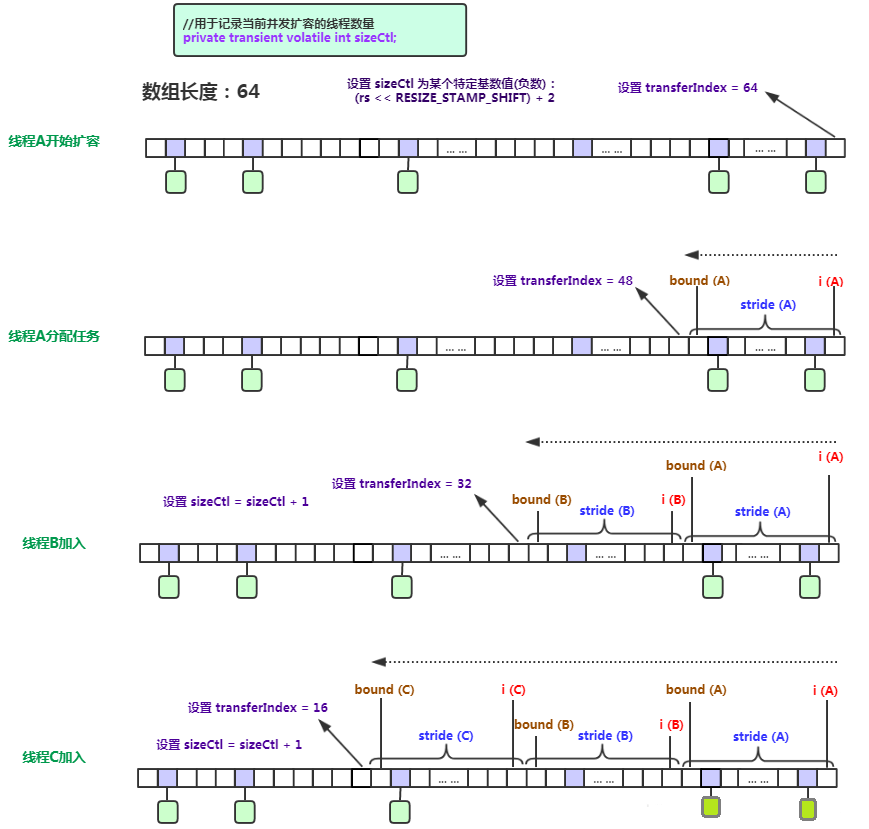
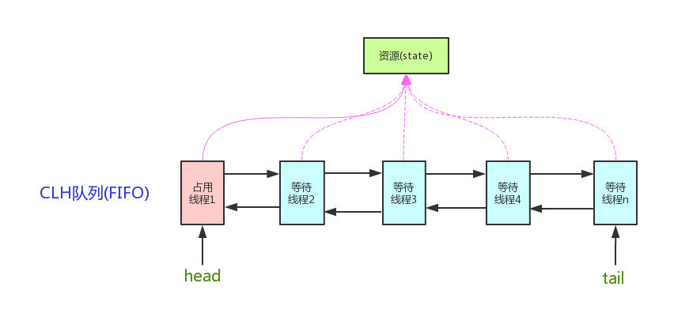
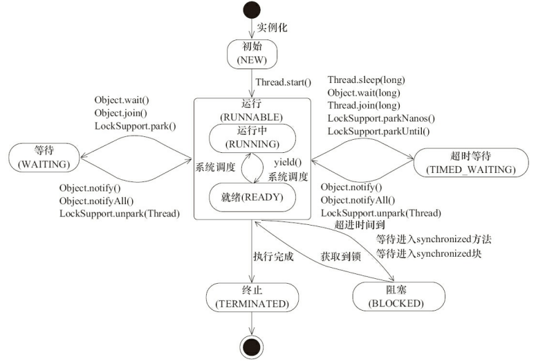
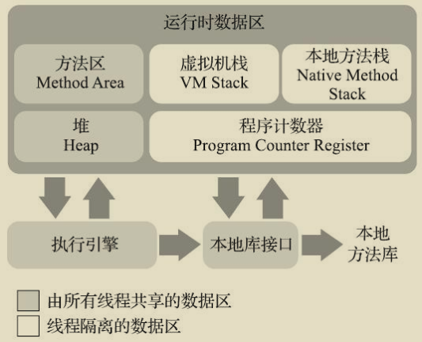
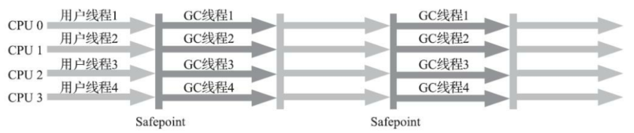
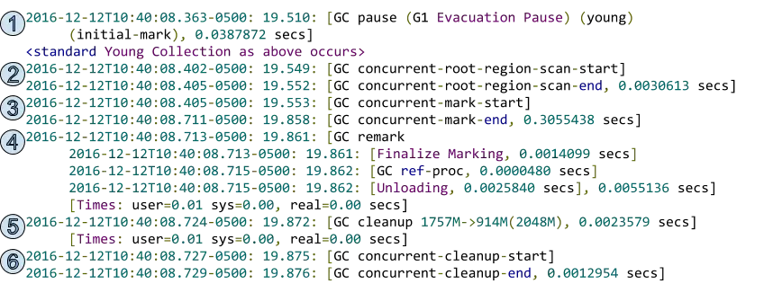

# 简介

Java编译与解释并存：Java程序要经过先编译，后解释两个步骤，由 Java 编写的程序需要先经过编译步骤，生成字节码（`.class`文件），这种字节码必须由 Java 解释器来解释执行。

静态方法不能调用非静态成员：静态方法在类加载的时候就会分配内存，而非静态成员属于实例对象，只有在对象实例化之后才存在，所以静态成员在非静态成员不存在的时候已经存在。

Java 内的传递都是值传递,对象传递的值是对象的地址。

## 重载和重写：

* 重载是同一个方法名不同的参数。
* 重写是子类覆盖父类的方法。

## == 和 equals()

* 对于基本数据类型来说，`==` 比较的是值。
* 对于引用数据类型来说，`==` 比较的是对象的内存地址。
* 没有重写 `equals()` 方法，继承`Object`类`equals()`方法，默认实现使用 `==`。
* 可以重写 `equals()` 方法来比较具体属性，不过重写时必须要重写 `hashcode` 方法，因为 如果只重写 `equals()` ，`new` 两个不同的相同对象，`equals` 重写后返回值为`true`，但是两个对象的地址不一样，由于默认`hash`方法是对地址进行`hash`，所以`hashcode`值不一样，这违反 `equals` 返回 `true`，`hashcode` 必须相等的设计。

## String、StringBuffer、StringBuilder

* `String` 类 `final` 修饰 不可被继承，避免子类破坏`String`的行为，此外 储存字符的数组也是 `final` 修饰，所以`String`实例不可改变，每次对 `String` 类型进行改变的时候，都会生成一个新的 `String` 对象，然后将指针指向新的 `String` 对象。
* `StringBuffer` 和 `StringBuilder` 都继承自 `AbstractStringBuilder` 类，不过 `StringBuffer` 对方法加了同步锁，是线程安全的，`StringBuilder` 并没有对方法进行加同步锁，是非线程安全的。
* jdk9 底层 `char[]` 改为 `byte[]` ，并使用两种编码 `Latin-1(ISO-8859-1)` 和 `UTF-16`，`Latin-1` 不支持中文，使用单字节编码，当没有中文等 `Latin-1` 不支持的字符时， `byte[]` 比 `char[]` 少一半空间。

`String s1 = new String("abc")` 可能创建两个字符串对象，当字符串常量池中不存在 `abc` 时，会创建一个，`new` 还会创建一个。

`String.intern()` 是一个 `native`（本地）方法，如果字符串常量池中没有保存了对应的字符串对象的引用，那就在常量池中创建一个指向该字符串对象的引用并返回。

## UTF8

全球统一的编码规则叫`unicode`，负责把各个语言的字符映射为二进制。

为了解决如何表示`unicode`，诞生了各种编码，其中`UTF8`属于变长编码，由控制码+字符码组成。

| unicode范围           | UTF8编码                              | 长度  |
|---------------------|-------------------------------------|-----|
| 0000 0000-0000 007F | 0xxxxxxx                            | 单字节 |
| 0000 0080-0000 07FF | 110xxxxx 10xxxxxx                   | 双字节 |
| 0000 0800-0000 FFFF | 1110xxxx 10xxxxxx 10xxxxxx          | 三字节 |
| 0001 0000-0010 FFFF | 11110xxx 10xxxxxx 10xxxxxx 10xxxxxx | 四字节 |

## BigDecimal

为防止精度丢失使用 `BigDecimal(String val)`构造方法或者 `BigDecimal.valueOf(double val)` 静态方法来创建对象。

工具类：

```java
import java.math.BigDecimal;
import java.math.RoundingMode;

/**
 * 简化BigDecimal计算的小工具类
 */
public class BigDecimalUtil {

    /**
     * 默认除法运算精度
     */
    private static final int DEF_DIV_SCALE = 10;

    private BigDecimalUtil() {
    }

    /**
     * 提供精确的加法运算。
     *
     * @param v1 被加数
     * @param v2 加数
     * @return 两个参数的和
     */
    public static double add(double v1, double v2) {
        BigDecimal b1 = BigDecimal.valueOf(v1);
        BigDecimal b2 = BigDecimal.valueOf(v2);
        return b1.add(b2).doubleValue();
    }

    /**
     * 提供精确的减法运算。
     *
     * @param v1 被减数
     * @param v2 减数
     * @return 两个参数的差
     */
    public static double subtract(double v1, double v2) {
        BigDecimal b1 = BigDecimal.valueOf(v1);
        BigDecimal b2 = BigDecimal.valueOf(v2);
        return b1.subtract(b2).doubleValue();
    }

    /**
     * 提供精确的乘法运算。
     *
     * @param v1 被乘数
     * @param v2 乘数
     * @return 两个参数的积
     */
    public static double multiply(double v1, double v2) {
        BigDecimal b1 = BigDecimal.valueOf(v1);
        BigDecimal b2 = BigDecimal.valueOf(v2);
        return b1.multiply(b2).doubleValue();
    }

    /**
     * 提供（相对）精确的除法运算，当发生除不尽的情况时，精确到
     * 小数点以后10位，以后的数字四舍五入。
     *
     * @param v1 被除数
     * @param v2 除数
     * @return 两个参数的商
     */
    public static double divide(double v1, double v2) {
        return divide(v1, v2, DEF_DIV_SCALE);
    }

    /**
     * 提供（相对）精确的除法运算。当发生除不尽的情况时，由scale参数指
     * 定精度，以后的数字四舍五入。
     *
     * @param v1    被除数
     * @param v2    除数
     * @param scale 表示表示需要精确到小数点以后几位。
     * @return 两个参数的商
     */
    public static double divide(double v1, double v2, int scale) {
        if (scale < 0) {
            throw new IllegalArgumentException(
                    "The scale must be a positive integer or zero");
        }
        BigDecimal b1 = BigDecimal.valueOf(v1);
        BigDecimal b2 = BigDecimal.valueOf(v2);
        return b1.divide(b2, scale, RoundingMode.HALF_UP).doubleValue();
    }

    /**
     * 提供精确的小数位四舍五入处理。
     *
     * @param v     需要四舍五入的数字
     * @param scale 小数点后保留几位
     * @return 四舍五入后的结果
     */
    public static double round(double v, int scale) {
        if (scale < 0) {
            throw new IllegalArgumentException(
                    "The scale must be a positive integer or zero");
        }
        BigDecimal b = BigDecimal.valueOf(v);
        BigDecimal one = new BigDecimal("1");
        return b.divide(one, scale, RoundingMode.HALF_UP).doubleValue();
    }

    /**
     * 提供精确的类型转换(Float)
     *
     * @param v 需要被转换的数字
     * @return 返回转换结果
     */
    public static float convertToFloat(double v) {
        BigDecimal b = new BigDecimal(v);
        return b.floatValue();
    }

    /**
     * 提供精确的类型转换(Int)不进行四舍五入
     *
     * @param v 需要被转换的数字
     * @return 返回转换结果
     */
    public static int convertsToInt(double v) {
        BigDecimal b = new BigDecimal(v);
        return b.intValue();
    }

    /**
     * 提供精确的类型转换(Long)
     *
     * @param v 需要被转换的数字
     * @return 返回转换结果
     */
    public static long convertsToLong(double v) {
        BigDecimal b = new BigDecimal(v);
        return b.longValue();
    }

    /**
     * 返回两个数中大的一个值
     *
     * @param v1 需要被对比的第一个数
     * @param v2 需要被对比的第二个数
     * @return 返回两个数中大的一个值
     */
    public static double returnMax(double v1, double v2) {
        BigDecimal b1 = new BigDecimal(v1);
        BigDecimal b2 = new BigDecimal(v2);
        return b1.max(b2).doubleValue();
    }

    /**
     * 返回两个数中小的一个值
     *
     * @param v1 需要被对比的第一个数
     * @param v2 需要被对比的第二个数
     * @return 返回两个数中小的一个值
     */
    public static double returnMin(double v1, double v2) {
        BigDecimal b1 = new BigDecimal(v1);
        BigDecimal b2 = new BigDecimal(v2);
        return b1.min(b2).doubleValue();
    }

    /**
     * 精确对比两个数字
     *
     * @param v1 需要被对比的第一个数
     * @param v2 需要被对比的第二个数
     * @return 如果两个数一样则返回0，如果第一个数比第二个数大则返回1，反之返回-1
     */
    public static int compareTo(double v1, double v2) {
        BigDecimal b1 = BigDecimal.valueOf(v1);
        BigDecimal b2 = BigDecimal.valueOf(v2);
        return b1.compareTo(b2);
    }

}
```

## 实例化顺序

* 父类静态变量
* 父类静态代码块
* 子类静态变量、
* 子类静态代码块
* 父类非静态变量（父类实例成员变量）
* 父类构造函数
* 子类非静态变量（子类实例成员变量）
* 子类构造函数

# 泛型

泛型是指参数化类型，编译器可以对泛型参数进行检测，并且通过泛型参数可以指定传入的对象类型。

泛型一般有三种使用方式：泛型类、泛型接口、泛型方法。

什么是泛型擦除机制？为什么要擦除?

* Java 的泛型是伪泛型，这是因为 Java 在编译期间，所有的泛型信息都会被擦掉。
* 编译器会在编译期间动态将泛型 `T` 擦除为 `Object` 或将 `T extends xxx` 擦除为其限定类型 xxx
* 泛型本质上是编译器的行为，为了保证引入泛型机制但不创建新的类型，减少虚拟机的运行开销，所以通过擦除将泛型类转化为一般类。

既然会擦除为什么还要用泛型？可不可以用 `Object` ？

* 可在编译期间进行类型检测。
* 使用 `Object` 类型需要手动添加强制类型转换，降低代码可读性，提高出错概率
* 泛型可以使用自限定类型。如 `T extends Comparable` 还能调用 `compareTo(T o)` 方法 ，Object 则没有此功能

泛型的限制：

* 不能实例化类型变量T,不能实例化泛型数组。
* 泛型参数不能是基本数据类型，因为基本数据类型不是Object子类。
* 不能抛出和捕获T类型的异常。
* 不能使用`static`修饰泛型变量。

`Class`类就实现了 `java.lang.reflect.Type` 接口, `ParameterizedType` 也实现了该接口，`Class`类保存当前类的基本类型信息，`ParameterizedType`则保存了泛型，外部类等额外类型信息。

`java.lang.reflect.Type` 是Java中所有类型的接口，`Type`体系中类型的包括：数组类型(`GenericArrayType`)、参数化类型(`ParameterizedType`)、类型变量(`TypeVariable`)、通配符类型(`WildcardType`)、原始类型(`Class`)。

没有泛型的时候，只有原始类型，所有的原始类型都通过字节码文件类`Class`类进行抽象，`Class`类的一个具体对象就代表一个指定的原始类型。

* `Class`（原始/基本类型，也叫`raw type`）：不仅仅包含我们平常所指的类、枚举、数组、注解，还包括基本类型`int`、`float`等等。

  ```java
  public class ClassTest {
    //返回直接继承的父类（由于编译擦除，没有显示泛型参数）
    getSuperclass() ;
    //返回直接继承的父类（包含泛型参数） 1.5后提供，一般获取的这个父类就是参数化类型 ParameterizedType
    getGenericSuperclass();
    //返回直接实现类（包含泛型参数）
    getGenericInterfaces();
  }
  ```
* `TypeVariable`（类型变量）：比如`List<T>`中的T等。

  ```java
  public interface TypeVariable<D extends GenericDeclaration> extends Type, AnnotatedElement {
  	//类型对应的上限，默认为Object  可以有多个
      Type[] getBounds();
      //获取声明该类型变量实体，也就是TypeVariableTest< T>中的TypeVariableTest
      D getGenericDeclaration();
      //获取类型变量在源码中定义的名称；
      String getName();
      // JDK8新增的
      AnnotatedType[] getAnnotatedBounds();
  }
  ```
* `WildcardType`（ 泛型表达式类型）：例如List< ? extends Number> 中的 ? extends Number

  ```java
  public interface WildcardType extends Type {
  	//获得泛型表达式上界（上限） 获取泛型变量的上边界（extends）
  	Type[] getUpperBounds();
  	//获得泛型表达式下界（下限） 获取泛型变量的下边界（super）
  	Type[] getLowerBounds();
  }
  ```
* `ParameterizedType`（参数化类型）：就是所用到的泛型List、Map（注意和`TypeVariable`的区别）。

  ```java
  public interface ParameterizedType extends Type {
  	//获取类型内部的参数化类型 比如Map<K,V>里面的K，V类型
  	Type[] getActualTypeArguments();
  	// 类的原始类型，一般都是Class
  	Type getRawType();
  	// 获取所有者类型（只有内部类才有所有者，比如Map.Entry他的所有者就是Map），若不是内部类，此处返回null
    Type getOwnerType();
  }
  ```
* `GenericArrayType`（数组类型）：并不是我们工作中所使用的数组`String[]` 、`byte[]`（这种都属于Class），而是带有泛型的数组，即`T[]`泛型数组。

  ```java
  public interface GenericArrayType extends Type {
  	//返回泛型数组中元素的Type类型，即List<String>[] 中的 List<String>[]
  	Type getGenericComponentType();
  }
  ```

Spring 的泛型工具 `ResolvableType`:

```java
public class ResolvableTypeTest {
    private HashMap<Integer, List<String>> myMap;

    public void example() {
        ResolvableType t = ResolvableType.forField(getClass().getDeclaredField("myMap"));
        t.getSuperType(); // AbstractMap<Integer, List<String>>
        t.asMap(); // Map<Integer, List<String>>
        t.getGeneric(0).resolve(); // Integer
        t.getGeneric(1).resolve(); // List
        t.getGeneric(1); // List<String>
        t.resolveGeneric(1, 0); // String

        // 构造获取 Field 的泛型信息
        ResolvableType.forField(Field);
        // 构造获取 Method 的泛型信息
        ResolvableType.forMethodParameter(Method, index);
        // 构造获取方法返回参数的泛型信息
        ResolvableType.forMethodReturnType(Method);
        // 构造获取构造参数的泛型信息
        ResolvableType.forConstructorParameter(Constructor, index);
        // 构造获取类的泛型信息
        ResolvableType.forClass(Class);
        // 构造获取类型的泛型信息
        ResolvableType.forType(Type);
        // 构造获取实例的泛型信息
        ResolvableType.forInstance(Object);
    }
}
```

当 `ApplicationEvent` 出现泛型擦除的情况，可使用 `ResolvableTypeProvider` 提供。

# 反射

作用：可以在运行时分析类以及执行类中方法

* 实例化对象。
* 获取或者设置对象的属性。
* 获取或者执行实例对象的方法。

JDK API:

```java
public class ReflectTest {

    // 获取所有访问权限的属性、方法、构造器
    Field[] getDeclaredFields();

    Method[] getDeclaredMethods();

    Constructor<?>[] getDeclaredConstructors();

    // 获取所有访问权限的属性、方法、构造器
    Field getDeclaredField(String name);

    Method getDeclaredMethod(String name, Class<?>... parameterTypes);

    Constructor<T> getDeclaredConstructor(Class<?>... parameterTypes);

    // 判断是否使用某注解、是否是数组、是否是接口、某object是否是该class实例
    boolean isAnnotationPresent(Class<? extends Annotation> annotationClass);

    boolean isArray();

    boolean isInterface();

    boolean isInstance(Object obj);

    public void test() {
        // 实例化
        clazz.newInstance();

        Constructor c = clazz.getConstructor();
        Object obj = c.newInstance();

        // 绕开访问权限
        Constructor.setAccessible(true);
        Field.setAccessible(true);
        Method.setAccessible(true);

        // 访问值
        Field.get(Object);
        Field.set(Object);
        // 执行方法
        Method.invoke(Object, args);

        // 获取接口、父类、注解
        clazz.getInterfaces();
        clazz.getSuperClass();
        clazz.getDeclaredAnnotations();
    }

}
```

Spring `ReflectionUtils`:

```java
public class ReflectionUtils {

    // 获取或设置属性，会查找父类
    Field findField(Class<?> clazz, String name, Class<?> type);

    void setField(Field field, Object target, Object value);

    // 访问方法，会查找父类
    Method findMethod(Class<?> clazz, String name, Class<?>[] paramTypes);

    Object invokeMethod(Method method, Object target, Object[] args);

    // 绕开访问权限
    void makeAccessible(Field field);

    void makeAccessible(Method method);

    void makeAccessible(Constructor<?> ctor);

    // 使用 MethodFilter 过滤 Class 中所有方法，并使用 MethodCallback 调用
    void doWithMethods(Class<?> clazz, MethodCallback mc, MethodFilter mf);

    // 使用 FieldFilter 过滤 Class 中所有属性，并使用 FieldCallback 调用
    void doWithFields(Class<?> clazz, FieldCallback fc, FieldFilter ff);
}
```

`Class.forName` 和 `ClassLoader` 区别：

* `Class#forName(...)` 方法，除了将类的`.class` 文件加载到JVM 中之外，还会对类进行解释，执行类中的 `static` 块。
* `ClassLoader` 只干一件事情，就是将 `.class` 文件加载到 JVM 中，不会执行 `static` 中的内容，只有在 `newInstance` 才会去执行 `static` 块。

## MethodHandle

#### 使用

1. 获取 `MethodHandles` 的 `lookup` 对象。

```java
public class MethodHandleTest {

    public void test() {
        // 提供对公共方法的查找功能
        MethodHandles.Lookup publicLookup = MethodHandles.publicLookup();
        // 提供对所有方法的查找功能
        MethodHandles.Lookup lookup = MethodHandles.lookup();
    }
}
```

2. 创建 `MethodType`，定义查找的对象。

```java
public class MethodHandleTest {

    public void test() {
        // List.class 为返回值，Object[].class 为 参数
        MethodType mt = MethodType.methodType(List.class, Object[].class);
    }
}
```

3. 查找`MethodHandle`，`MethodHandle` 设置为 `final` 类型，否则性能会大打折扣。
4. 绑定实例
5. 调用

```java
public class MethodHandleTest {
    private static final MethodHandle methodHandle;

    static {
        try {
            Animal animal = new Animal();
            Method eatMethod = animal.getClass().getMethod("calculation", int.class, int.class);
            MethodHandles.Lookup publicLookup = MethodHandles.publicLookup();
            // 3、4
            methodHandle = publicLookup.unreflect(eatMethod).bindTo(animal);
        } catch (Throwable e) {
            e.printStackTrace();
        }
        // 5
        methodHandle.invokeExact(2, 3);
        methodHandle.invokeExact(2, 3);
    }
}
```

`Lookup` 的方法对照表

| lookup expression                               | member               | bytecode behavior                       |
|-------------------------------------------------|----------------------|-----------------------------------------|
| `lookup.findGetter(C.class,"f",FT.class)`       | `FT f;`              | `(T) this.f;`                           |
| `lookup.findStaticGetter(C.class,"f",FT.class)` | `static FT f;`       | `(T) C.f;`                              |
| `lookup.findSetter(C.class,"f",FT.class)`       | `FT f;`              | `this.f = x;`                           |
| `lookup.findStaticSetter(C.class,"f",FT.class)` | `static FT f;`       | `C.f = arg; `                           |
| `lookup.findVirtual(C.class,"m",MT)`            | `T m(A*);`           | `(T) this.m(arg*);`                     |
| `lookup.findStatic(C.class,"m",MT)`             | `static T m(A*);`    | `(T) C.m(arg*);`                        |
| `lookup.findSpecial(C.class,"m",MT,this.class)` | `T m(A*);`           | `(T) super.m(arg*); `                   |
| `lookup.findConstructor(C.class,MT)`            | `C(A*);`             | `new C(arg*);`                          |
| `lookup.unreflectGetter(aField)`                | `(static)? FT f;`    | `(FT) aField.get(thisOrNull);`          |
| `lookup.unreflectSetter(aField)`                | `(static)? FT f;`    | `aField.set(thisOrNull, arg);`          |
| `lookup.unreflect(aMethod)`                     | `(static)? T m(A*);` | `(T) aMethod.invoke(thisOrNull, arg*);` |
| `lookup.unreflectConstructor(aConstructor)`     | `C(A*);`             | `(C) aConstructor.newInstance(arg*);`   |
| `lookup.findClass("C")`                         | `class C { ... }`    | `C.class;`                              |

对应字节码指令：

* `invokestatic`: 用于静态方法
* `invokespecial`: 用于私有方法、构造器方法、父类实例方法
* `invokevirtual`: 用于调用非私有实例方法
* `invokeinterface`: 用于接口方法
* `invokedynamic`: 用于动态方法

## VarHandle

jdk9 新增，可通过 `Lookup` 获取：

* `findVarHandle`：用于创建对象中非静态字段的 `VarHandle`。接收参数有三个，第一个为接收者的class对象，第二个是字段名称，第三个是字段类型。
* `findStaticVarHandle`：用于创建对象中静态字段的 `VarHandle`，接收参数与 `findVarHandle`一致。
* `unreflectVarHandle`：通过反射字段 `Field`创建 `VarHandle`。

`VarHandle`支持四种访问模式：

* `plain`: 和普通变量存取一样，不保证内存可见性，编译器会对指令会重排序（既单线程内顺序不能保证），没有内存屏障。
* `opaque`:保证内存可见，编译器不会对指令重排序，没有内存屏障，对单个内存位置的写看上去是按照与程序顺序一致的总顺序执行，例如:在全局中x由0变为1，那么每个线程中看到的x只能从0变成1，而不会可能看到从1变成0。
* `release/acqiure`: 保证内存可见,编译器不会对指令重排序，存在内存屏障（即 `get` 之后加 `LoadLoad + LoadStore`， 读取之后的操作不会跑到读取之前，`set` 之前加 `LoadStore + StoreStore`，设置之前的操作不会跑到设置之后）， 不能保证读取之前的操作跑到读取之后，不能保证设置之后的操作跑到设置之前，可用于生产者消费者模型。
* `volatile`: 保证内存可见,编译器不会对指令重排序,确保程序执行顺序，且保证变量之间不被重排序， 存在内存屏障 (即 get之后加 `LoadLoad + LoadStore`，`set` 之前加 `LoadStore + StoreStore`，`set`之后加 `StoreLoad`) 。

普通变量是不确保内存可见的，`opaque`、`release/acquire`、`volatile`是可以保证内存可见的

API：

* 写入访问模式(write access modes) : 获取指定内存排序效果下的变量值，包含的方法有`get`、`getVolatile`、`getAcquire`、`getOpaque` 。
* 读取访问模式(read access modes) :在指定的内存排序效果下设置变量的值，包含的方法有`set`、`setVolatile`、`setRelease`、`setOpaque` 。
* 原子更新模式(atomic update access modes) :在指定的内存排序效果下，原子的比较和设置变量的值，包含的方法有`compareAndSet`、`weakCompareAndSetPlain`、`weakCompareAndSet`、`weakCompareAndSetAcquire`、`weakCompareAndSetRelease`、`compareAndExchangeAcquire`、`compareAndExchange`、`compareAndExchangeRelease`、`getAndSet`、`getAndSetAcquire`、`getAndSetRelease` 。
* 数值更新访问模式(numeric atomic update access modes) : 通过在指定的内存排序效果下添加变量的值，以原子方式获取和设置。包含的方法有`getAndAdd`、`getAndAddAcquire`、`getAndAddRelease` 。
* 按位原子更新访问模式(bitwise atomic update access modes ) : 在指定的内存排序效果下，以原子方式获取和按位OR变量的值。包含的方法有`getAndBitwiseOr`、`getAndBitwiseOrAcquire`、`getAndBitwiseOrRelease`、 `getAndBitwiseAnd`、`getAndBitwiseAndAcquire`、`getAndBitwiseAndRelease`、`getAndBitwiseXor`、`getAndBitwiseXorAcquire` ， `getAndBitwiseXorRelease` 。

`VarHandle` 除了支持各种访问模式下访问变量之外，还提供内存屏障方法:

```java
public class VarHandle {
    public static void fullFence() {
        UNSAFE.fullFence();
    }

    public static void acquireFence() {
        UNSAFE.loadFence();
    }

    public static void releaseFence() {
        UNSAFE.storeFence();
    }

    public static void loadLoadFence() {
        UNSAFE.loadLoadFence();
    }

    public static void storeStoreFence() {
        UNSAFE.storeStoreFence();
    }
}
```

# 异常


* 所有的异常都属于 `java.lang.Throwable`，分为 `Exception` 和 `Error`。
* `Error` 属于程序无法处理的错误 ，如 `OutOfMemoryError`，`NoClassDefFoundError` 等。
* `Exception` :程序本身可以处理的异常，可以通过 `catch` 来进行捕获，分为 `Checked Exception` 和 `Unchecked Exception`。
* `Checked Exception` ：程序必须处理，必须被 `catch` 或者 `throw` ，否则无法编译，例如 `IOException`,`ClassNotFoundException` 等。
* `Unchecked Exception`：即使不处理编译也可以正常通过，`RuntimeException` 及子类都属于这类异常，例如 `NullPointerException`。

`Throwable` 类常用方法：

* `String getMessage()`: 返回异常发生时的简要描述。
* `String toString()`: 返回异常发生时的详细信息。

如果`finally` 之前虚拟机被终止运行、或者程序所在的线程死亡，`finally` 中的代码就不会被执行。

`try-with-resources` 可使用在 任何实现 `java.lang.AutoCloseable`或者 `java.io.Closeable` 的对象，任何 `catch` 或 `finally`块在声明的资源关闭后运行，多个资源可使用 `;` 分割。

# 集合


1. List

* `Arraylist`： `Object[]` 数组。
* `Vector`：`Object[]` 数组。
* `LinkedList`： 双向链表。
* `CopyOnWriteArrayList`：`Object[]` 数组。

2. Set

* `HashSet`(无序，唯一): 基于 `HashMap` 实现的，底层采用 `HashMap` 来保存元素。
* `LinkedHashSet`: `LinkedHashSet` 是 `HashSet` 的子类，并且其内部是通过 `LinkedHashMap` 来实现的。
* `TreeSet`(有序，唯一): 红黑树。

3. Queue

* `PriorityQueue`: `Object[]` 数组来实现二叉堆。
* `ArrayDeque`: `Object[]` 数组 + 双指针。

4. Map

* `HashMap`： 数组 + 链表 + 红黑树。
* `ConcurrentHashMap`： 数组 + 链表 + 红黑树。
* `LinkedHashMap`： `LinkedHashMap` 继承自 `HashMap`，也是 数组 + 链表 + 红黑树。另外，`LinkedHashMap`增加一条双向链表，可以保持键值对的插入顺序。同时通过对链表进行相应的操作，实现了访问顺序相关逻辑。
* `Hashtable`： 数组+链表。
* `TreeMap`： 红黑树。

集合判空：使用 `isEmpty()` 方法，而不是 `size()==0` 的方式， `isEmpty()`时间复杂度O(1),`size()==0`则不一定,例如 `ConcurrentLinkedQueue` 、`ConcurrentHashMap`

集合转`Map`：在使用 `java.util.stream.Collectors` 类的 `toMap()` 方法转为 `Map` 集合时，一定要注意当 value 为 null 时会抛`NPE` 异常，并且需要添加 `MergeFunction` 方法。

集合遍历：不要在 `foreach` 循环里进行元素的 `remove/add` 操作。`remove` 元素请使用 `Iterator` 方式，或者使用 `removeIf` 方法，如果并发操作，需要对 `Iterator` 对象加锁。

集合去重：可以利用 `Set` 元素唯一的特性，可以快速对一个集合进行去重操作，避免使用 `List` 的 `contains()` 进行遍历去重或者判断包含操作。

集合转数组：使用集合转数组的方法，必须使用集合的 `toArray(T[] array)`，传入的是类型完全一致、长度为 0 的空数组。

数组转集合：使用工具类 `Arrays.asList()` 把数组转换成集合时，不能使用其修改集合相关的方法， 它的 `add/remove/clear`方法会抛出 `UnsupportedOperationException`异常。可使用 `new ArrayList<>(Arrays.asList("a", "b", "c"))` 、`Arrays.stream(myArray).collect(Collectors.toList());`

## List

`Arraylist` 和 `Vector` 的区别：

* `ArrayList` 底层使用 `Object[]` 存储，适用于频繁的查找工作，线程不安全。
* `Vector` 是 `List` 的古老实现类，底层使用`Object[]` 存储，使用 `synchronized` 保证线程安全的，相比起来性能会降低，不常用。

`Arraylist` 和 `LinkedList` 区别：

* 线程安全： `ArrayList` 和 `LinkedList` 都不保证线程安全。
* 数据结构： `Arraylist` 使用 `Object[]`，`LinkedList`使用 双向链表。
* 插入和删除：`ArrayList#add(E e)` 时间复杂度 O(1)，`ArrayList#add(int index, E element)` 时间复杂度为 `O(n-i)`,第 i 和第 i 个元素之后的(n-i)个元素都要移动，`LinkedList#add(E e)` 时间复杂度为 `O(1)`，`LinkedList#add(int index, E element)` 时间复杂度为`O(n)`,需要先移动到指定位置再插入。
* 快速随机访问： `LinkedList` 不支持高效的随机元素访问，而 `ArrayList`支持。快速随机访问就是通过元素的序号快速获取元素对，对应`get(int index)`。
* 内存空间： `ArrayList` 的空间浪费主要在 `list` 列表的结尾会预留一定的容量空间，而 `LinkedList` 的空间花费主要在每一个元素都需要额外存放直接后继和直接前驱。

### ArrayList

关键属性：

```java
public class ArrayList {
    /**
     * 保存ArrayList数组，用transient修饰，序列化时不会序列化该字段，序列化使用的是自定义writeObject方法序  列化，这样可以节约序列化后的空间，因为只会序列化 size 部分。
     */
    transient Object[] elementData;

    /**
     * 已经储存多少个元素
     */
    private int size;
}
```

关键静态变量：

```java
public class ArrayList {
    /**
     * 当数组为 DEFAULTCAPACITY_EMPTY_ELEMENTDATA ，添加第一个元素时会扩容为该值。
     */
    private static final int DEFAULT_CAPACITY = 10;

    /**
     * 空数组，用于 size = 0 的实例
     */
    private static final Object[] EMPTY_ELEMENTDATA = {};

    /**
     * 空数组，用于 new ArrayList() 初始化
     */
    private static final Object[] DEFAULTCAPACITY_EMPTY_ELEMENTDATA = {};
}
```

构造器：

```java
public class ArrayList {
    /**
     * 带初始容量的构造函数
     */
    public ArrayList(int initialCapacity) {
        if (initialCapacity > 0) {
            this.elementData = new Object[initialCapacity];
        } else if (initialCapacity == 0) {
            this.elementData = EMPTY_ELEMENTDATA;
        } else {
            throw new IllegalArgumentException("Illegal Capacity: " +
                    initialCapacity);
        }
    }

    /**
     * 默认初始化为 DEFAULTCAPACITY_EMPTY_ELEMENTDATA 空数组，当添加第一个元素时才会扩容到 DEFAULT_CAPACITY=10
     */
    public ArrayList() {
        this.elementData = DEFAULTCAPACITY_EMPTY_ELEMENTDATA;
    }

    public ArrayList(Collection<? extends E> c) {
        Object[] a = c.toArray();
        if ((size = a.length) != 0) {
            if (c.getClass() == ArrayList.class) {
                elementData = a;
            } else {
                elementData = Arrays.copyOf(a, size, Object[].class);
            }
        } else {
            // replace with empty array.
            elementData = EMPTY_ELEMENTDATA;
        }
    }
}
```

操作数据：

```java
public class ArrayList {
    public boolean add(E e) {
        modCount++;
        add(e, elementData, size);
        return true;
    }

    /**
     * 当容量满的时候 s == elementData.length ,进行扩容 grow()。
     */
    private void add(E e, Object[] elementData, int s) {
        if (s == elementData.length)
            elementData = grow();
        elementData[s] = e;
        size = s + 1;
    }

    private Object[] grow() {
        return grow(size + 1);
    }

    private Object[] grow(int minCapacity) {
        return elementData = Arrays.copyOf(elementData,
                newCapacity(minCapacity));
    }

    /**
     * 当 elementData == DEFAULTCAPACITY_EMPTY_ELEMENTDATA 时，返回 DEFAULT_CAPACITY=10
     * 否则返回 oldCapacity + (oldCapacity >> 1),即原容量的1.5倍。
     */
    private int newCapacity(int minCapacity) {
        // overflow-conscious code
        int oldCapacity = elementData.length;
        int newCapacity = oldCapacity + (oldCapacity >> 1);
        if (newCapacity - minCapacity <= 0) {
            if (elementData == DEFAULTCAPACITY_EMPTY_ELEMENTDATA)
                return Math.max(DEFAULT_CAPACITY, minCapacity);
            if (minCapacity < 0) // overflow
                throw new OutOfMemoryError();
            return minCapacity;
        }
        return (newCapacity - MAX_ARRAY_SIZE <= 0)
                ? newCapacity
                : hugeCapacity(minCapacity);
    }

    private static int hugeCapacity(int minCapacity) {
        if (minCapacity < 0) // overflow
            throw new OutOfMemoryError();
        return (minCapacity > MAX_ARRAY_SIZE)
                ? Integer.MAX_VALUE
                : MAX_ARRAY_SIZE;
    }

    public void remove() {
        if (lastRet < 0)
            throw new IllegalStateException();
        checkForComodification();

        try {
            ArrayList.this.remove(lastRet);
            cursor = lastRet;
            lastRet = -1;
            expectedModCount = modCount;
        } catch (IndexOutOfBoundsException ex) {
            throw new ConcurrentModificationException();
        }
    }

    public E remove(int index) {
        Objects.checkIndex(index, size);
        final Object[] es = elementData;

        @SuppressWarnings("unchecked") E oldValue = (E) es[index];
        fastRemove(es, index);

        return oldValue;
    }

    /**
     * 将第 i+1 到 size - 1 位置前移。
     */
    private void fastRemove(Object[] es, int i) {
        modCount++;
        final int newSize;
        if ((newSize = size - 1) > i)
            System.arraycopy(es, i + 1, es, i, newSize - i);
        es[size = newSize] = null;
    }
}
```

`ArrayList` 扩容逻辑：`new ArrayList()` 时容量为 0 ，当add第一个值时容量为 `10`，以后当容量满了之后扩容，扩容大小为 原始容量的`1.5`倍，如果有小数会舍掉小数。

`System.arraycopy()` 和 `Arrays.copyOf()`：

```java
public class System {
    /**
     * 复制数组
     * @param src 源数组
     * @param srcPos 源数组中的起始位置
     * @param dest 目标数组
     * @param destPos 目标数组中的起始位置
     * @param length 要复制的数组元素的数量
     */
    public static native void arraycopy(Object src, int srcPos,
                                        Object dest, int destPos,
                                        int length);
}

public class Arrays {
    public static int[] copyOf(int[] original, int newLength) {
        // 申请一个新的数组
        int[] copy = new int[newLength];
        // 调用System.arraycopy,将源数组中的数据进行拷贝,并返回新的数组
        System.arraycopy(original, 0, copy, 0,
                Math.min(original.length, newLength));
        return copy;
    }
}
```

`ensureCapacity`：可在大量插入时，调用该方法一次性扩容，避免大量插入时多次扩容影响性能。

```java
public class ArrayList {
    public void ensureCapacity(int minCapacity) {
        int minExpand = (elementData != DEFAULTCAPACITY_EMPTY_ELEMENTDATA)
                // any size if not default element table
                ? 0
                // larger than default for default empty table. It's already
                // supposed to be at default size.
                : DEFAULT_CAPACITY;

        if (minCapacity > minExpand) {
            ensureExplicitCapacity(minCapacity);
        }
    }
}
```

### LinkedList

`LinkedList` 双向链表实现，不存在扩容问题。


操作数据：

```java
// 添加到最后
public class LinkedList {
    public boolean add(E e) {
        linkLast(e);
        return true;
    }

    void linkLast(E e) {
// 记录原 last 节点
        final Node<E> l = last;
        final Node<E> newNode = new Node<>(l, e, null);
        // last 指向新节点
        last = newNode;
        if (l == null)
            // 如果原 last 为 null ，说明 first 也为空，则 first 也指向新节点
            first = newNode;
        else
            // 如果原 last 非 null ，说明 first 也非空，则原 last 的 next 指向新节点。
            l.next = newNode;
        size++;
        modCount++;
    }

    // 移除首节点
    public E remove() {
        return removeFirst();
    }

    public E removeFirst() {
        final Node<E> f = first;
        if (f == null)
            throw new NoSuchElementException();
        return unlinkFirst(f);
    }

    private E unlinkFirst(Node<E> f) {
        final E element = f.item;
        final Node<E> next = f.next;
        f.item = null;
        f.next = null;
        first = next;
        if (next == null)
            last = null;
        else
            next.prev = null;
        size--;
        modCount++;
        return element;
    }
}
```

### CopyOnWriteArrayList

通过写时复制来延时更新实现数据的最终一致性，并且能够保证读线程间不阻塞。

当我们往一个容器添加元素的时候，不直接往当前容器添加，而是先将当前容器进行Copy，复制出一个新的容器，然后新的容器里添加元素，添加完元素之后，再将原容器的引用指向新的容器。

并发读时没有加锁，并发写时加锁，并且在写入时仍然可以读。

关键属性：

```java
public class CopyOnWriteArrayList {
    /**
     * 修改数组时对该对象加锁
     */
    final transient Object lock = new Object();
    /**
     * 线程1 在读取array时，首先读取array引用，而这个引用由 volatile 修饰，所有数组内的数据都会从主存读取
     */
    private transient volatile Object[] array;
}
```

操作数据：

```java
public class CopyOnWriteArrayList {
    public boolean add(E e) {
        synchronized (lock) {
            Object[] es = getArray();
            int len = es.length;
            // 创建一个长度为 len + 1 的新数组，并把原数组拷贝过去
            es = Arrays.copyOf(es, len + 1);
            // 添加元素
            es[len] = e;
            // 使用新数组替换原数组
            setArray(es);
            return true;
        }
    }

    final Object[] getArray() {
        return array;
    }

    final void setArray(Object[] a) {
        array = a;
    }

    public E get(int index) {
        return elementAt(getArray(), index);
    }

    @SuppressWarnings("unchecked")
    static <E> E elementAt(Object[] a, int index) {
        return (E) a[index];
    }
}
```

优点：保证多线程的并发读写的线程安全。

缺点：如果数据较多或数据较大，占用内存会比较大，复制时使用双倍内存。

解决方案:

* 压缩元素，例如：将10进制数字压缩成32进制或64进制。
* 使用`ConcurrentHashMap`替代。

应用于读多写少的并发场景。

## Map

`HashMap` 和 `Hashtable` 区别：

* 线程安全：`HashMap`非线程安全，`Hashtable`线程安全,`Hashtable` 基本被淘汰，线程安全使用 `ConcurrentHashMap`。
* 效率：`HashMap` 未加锁，效率较高。
* `Null` 的支持： `HashMap` 可以存储 null 的 key 和 value，但 null 作为键只能有一个，null 作为值可以有多个，`Hashtable` 不允许有 null 键和 null 值，否则会抛出 `NullPointerException`。
* 初始容量大小：`Hashtable` 默认的初始大小为 11，`HashMap` 默认的初始化大小为 16。
* 每次扩充容量大小：`Hashtable` 每次扩充，容量变为原来的 `2n+1`，`HashMap` 每次扩充，容量变为原来的 2 倍。

`HashMap` 和 `TreeMap` 区别：

* `TreeMap` 和 `HashMap` 都继承自 `AbstractMap` ，`TreeMap` 还实现 `NavigableMap` 接口和 `SortedMap` 接口。
* `NavigableMap` 接口让 `TreeMap` 有了对集合内元素的搜索的能力。
* `SortedMap` 接口让 `TreeMap` 有了对集合中的元素根据键排序的能力。

### HashMap

节点：

```java
public class HashMap {
    static class Node<K, V> implements Map.Entry<K, V> {
        // 哈希值，存放元素到hashmap中时用来与其他元素hash值比较
        final int hash;
        //键
        final K key;
        //值
        V value;
        // 指向下一个节点
        Node<K, V> next;
    }
}
```

属性：

```java
public class HashMap {
    /**
     * 储存数据,称为buckets/bins，HashMap的容量 CAPACITY = table.length,默认值为 DEFAULT_INITIAL_CAPACITY = 16
     */
    transient Node<K, V>[] table;

    /**
     * 保存 Node 的缓存，方便获取 entrySet，不用再去遍历 table 获取所有值。
     */
    transient Set<Map.Entry<K, V>> entrySet;

    /**
     * 已经储存数据的数量
     */
    transient int size;

    /**
     * 修改的次数
     */
    transient int modCount;

    /**
     * 扩容的的阈值，当添加 size >= threshold进行扩容，如果不指定容量，默认值为 (DEFAULT_INITIAL_CAPACITY =16) * 0.75 = 12
     */
    int threshold;

    /**
     * 默认值0.75，该值越大，相同的bins储存的数据越多，利用率越高，存放数据很集中，但是hash碰撞也就越多，查找效率越低，太小导致数组的利用率低，存放的数据会很分散。
     */
    final float loadFactor;
}
```

常量：

```java
public class HashMap {
    /**
     * 默认的初始容量,16
     */
    static final int DEFAULT_INITIAL_CAPACITY = 1 << 4;

    /**
     * 最大容量
     */
    static final int MAXIMUM_CAPACITY = 1 << 30;

    /**
     * 默认的填充因子
     */
    static final float DEFAULT_LOAD_FACTOR = 0.75f;

    /**
     * 当 table.length >= 64 并且 单链表长度 >= 8 时，将链表转换成红黑树。
     */
    static final int TREEIFY_THRESHOLD = 8;

    /**
     * resize时，如果 红黑树 节点数小于 6，会将红黑树转换成链表。
     */
    static final int UNTREEIFY_THRESHOLD = 6;

    /**
     * 转换成红黑树的最小容量，当容量小于64时，及时链表长度达到8也不会转换成红黑树，而是优先选择扩容。
     */
    static final int MIN_TREEIFY_CAPACITY = 64;
}
```

数据结构： 数组 + 链表 + 红黑树 。


构造函数：

```java
public class HashMap {
    /**
     * 默认容量为16
     */
    public HashMap() {
        this.loadFactor = DEFAULT_LOAD_FACTOR;
    }

    /**
     * 实际容量为 大于initialCapacity 的 2 的幂，插入大量元素时应该设置初始化容量 = 想要储存的元素个数/0.75 + 1
     */
    public HashMap(int initialCapacity) {
        this(initialCapacity, DEFAULT_LOAD_FACTOR);
    }

    /**
     * 当 table 没有初始化时，capacity 保存在 threshold
     */
    public HashMap(int initialCapacity, float loadFactor) {
        if (initialCapacity < 0)
            throw new IllegalArgumentException("Illegal initial capacity: " +
                    initialCapacity);
        if (initialCapacity > MAXIMUM_CAPACITY)
            initialCapacity = MAXIMUM_CAPACITY;
        if (loadFactor <= 0 || Float.isNaN(loadFactor))
            throw new IllegalArgumentException("Illegal load factor: " +
                    loadFactor);
        this.loadFactor = loadFactor;
        this.threshold = tableSizeFor(initialCapacity);
    }

    public HashMap(Map<? extends K, ? extends V> m) {
        this.loadFactor = DEFAULT_LOAD_FACTOR;
        putMapEntries(m, false);
    }

    static final int tableSizeFor(int cap) {
        // -1 = 1111 1111 1111 1111 1111 1111 1111 1111 -  最高非0位前面的0的个数
        int n = -1 >>> Integer.numberOfLeadingZeros(cap - 1);
        // n + 1 为 2 的幂
        return (n < 0) ? 1 : (n >= MAXIMUM_CAPACITY) ? MAXIMUM_CAPACITY : n + 1;
    }

// Integer.class

    /**
     * 返回无符号整数i的最高非0位前面的0的个数，包括符号位在内；如果i为负数，这个方法将会返回0，符号位为1。
     * 例如：10的二进制表示为 0000 0000 0000 0000 0000 0000 0000 1010
     * java的整型长度为32位。那么这个方法返回的就是28
     */
    public static int numberOfLeadingZeros(int i) {
        // HD, Count leading 0's
        if (i <= 0)
            return i == 0 ? 32 : 0;
        int n = 31;
        // 使用 0100 0000 0000 0000 0000 0000 0000 0000 举例
        // 说明 非0首位 不在低16位，n < 16,并将高16位移到低16位
        // 这时 n = 15 , i = 0000 0000 0000 0000 0100 0000 0000 0000
        if (i >= 1 << 16) {
            n -= 16;
            i >>>= 16;
        }
        // 说明 非0首位 不在低8位，n < 8,并将高8位移到低8位
        // 这时 n = 7 , i = 0000 0000 0000 0000 0000 0000 0100 0000
        if (i >= 1 << 8) {
            n -= 8;
            i >>>= 8;
        }
        // 说明 非0首位 不在低4位，n < 4,并将高4位移到低4位
        // 这时 n = 3 , i = 0000 0000 0000 0000 0000 0000 0000 0100
        if (i >= 1 << 4) {
            n -= 4;
            i >>>= 4;
        }
        // 说明 非0首位 不在低2位，n < 2,并将高2位移到低2位
        // 这时 n = 1 , i = 0000 0000 0000 0000 0000 0000 0000 0001
        if (i >= 1 << 2) {
            n -= 2;
            i >>>= 2;
        }
        // n-0
        return n - (i >>> 1);
    }


    final void putMapEntries(Map<? extends K, ? extends V> m, boolean evict) {
        int s = m.size();
        if (s > 0) {
            // 如果 table 未初始化，重新计算 threshold = 传入集合的长度 / 0.75 + 1
            if (table == null) { // pre-size
                float ft = ((float) s / loadFactor) + 1.0F;
                int t = ((ft < (float) MAXIMUM_CAPACITY) ?
                        (int) ft : MAXIMUM_CAPACITY);
                if (t > threshold)
                    threshold = tableSizeFor(t);
            }
            // 如果传入集合长度 > threshold , 进行扩容
            else if (s > threshold)
                resize();

            // 循环插入数据
            for (Map.Entry<? extends K, ? extends V> e : m.entrySet()) {
                K key = e.getKey();
                V value = e.getValue();
                putVal(hash(key), key, value, false, evict);
            }
        }
    }
}
```

扩容：

```java
public class HashMap {
    final Node<K, V>[] resize() {
        Node<K, V>[] oldTab = table;
        int oldCap = (oldTab == null) ? 0 : oldTab.length;
        int oldThr = threshold;
        int newCap, newThr = 0;

        // table 已经初始化过了
        if (oldCap > 0) {
            // capacity 达到最大值，不能进行扩容，只能继续哈希碰撞。
            if (oldCap >= MAXIMUM_CAPACITY) {
                threshold = Integer.MAX_VALUE;
                return oldTab;
            }
            // 新容量 = 旧容量 * 2
            else if ((newCap = oldCap << 1) < MAXIMUM_CAPACITY &&
                    oldCap >= DEFAULT_INITIAL_CAPACITY)
                newThr = oldThr << 1; // double threshold
        }
        // oldCap = 0 , oldThr > 0,当 table 没有初始化时，capacity 保存在 threshold
        else if (oldThr > 0)
            newCap = oldThr;
        else {
            // oldCap = 0 , oldThr = 0,设置默认 capacity 为 DEFAULT_INITIAL_CAPACITY = 16
            newCap = DEFAULT_INITIAL_CAPACITY;
            newThr = (int) (DEFAULT_LOAD_FACTOR * DEFAULT_INITIAL_CAPACITY);
        }
        // 配合上面 oldThr > 0 的条件计算 threshold
        if (newThr == 0) {
            float ft = (float) newCap * loadFactor;
            newThr = (newCap < MAXIMUM_CAPACITY && ft < (float) MAXIMUM_CAPACITY ?
                    (int) ft : Integer.MAX_VALUE);
        }
        threshold = newThr;
        @SuppressWarnings({"rawtypes", "unchecked"})
        // 初始化table
        Node<K, V>[] newTab = (Node<K, V>[]) new Node[newCap];
        table = newTab;

        // 如果 table 之间有值需要将其迁移到新table
        if (oldTab != null) {
            for (int j = 0; j < oldCap; ++j) {
                Node<K, V> e;
                if ((e = oldTab[j]) != null) {
                    oldTab[j] = null;
                    // 如果是单节点，直接通过hash值重新计算位置。
                    if (e.next == null)
                        newTab[e.hash & (newCap - 1)] = e;
                        // 如果是红黑树，会将每个节点 hash & oldCap 。
                        // 如果 等于 0 说明还在 [原节点]。
                        // 如果等于1说明在 [原节点 + oldCap] 位置。
                        // 这样将红黑树拆分成两个链表,分别处理两个链表
                        // 如果链表长度大于等于8，将链表转换为红黑树
                        // 如果链表长度小于等于6，将红黑树转换为链表
                    else if (e instanceof TreeNode)
                        ((TreeNode<K, V>) e).split(this, newTab, j, oldCap);
                    else {
                        // 处理链表节点
                        // 如果 等于 0 说明还在原节点。
                        // 如果等于1说明在 原节点 + oldCap 位置。
                        // 这样将链表分成两个链表,分布在 [原节点] 和 [原节点 + oldCap] 位置。
                        Node<K, V> loHead = null, loTail = null;
                        Node<K, V> hiHead = null, hiTail = null;
                        Node<K, V> next;
                        do {
                            next = e.next;
                            if ((e.hash & oldCap) == 0) {
                                if (loTail == null)
                                    loHead = e;
                                else
                                    loTail.next = e;
                                loTail = e;
                            } else {
                                if (hiTail == null)
                                    hiHead = e;
                                else
                                    hiTail.next = e;
                                hiTail = e;
                            }
                        } while ((e = next) != null);
                        if (loTail != null) {
                            loTail.next = null;
                            newTab[j] = loHead;
                        }
                        if (hiTail != null) {
                            hiTail.next = null;
                            newTab[j + oldCap] = hiHead;
                        }
                    }
                }
            }
        }
        return newTab;
    }
}
```

插入数据：


1. 判断键值对数组`table`是否为空或为`null`，否则执行`resize()`进行扩容。
2. 根据键值`key`计算`hash`值得到插入的数组索引i，如果`table[i]==null`，直接新建节点添加，转向 6，如果table[i]不为空，转向3。
3. 判断`table[i]`的首个元素是否和key一样，如果相同直接覆盖value，否则转向4，这里的相同指的是`hashCode`以及`equals`。
4. 判断`table[i]` 是否为`treeNode`，即`table[i]` 是否是红黑树，如果是红黑树，则直接在树中插入键值对，否则转向5。
5. 遍历`table[i]`，判断链表长度是否大于8，大于8并且`capacity` 大于 64 则把链表转换为红黑树，在红黑树中执行插入操作，否则进行链表的插入操作，遍历过程中若发现key已经存在直接覆盖`value`即可。
6. 插入成功后，判断实际存在的键值对数量`size`是否超多了最大容量`threshold`，如果超过，进行扩容。

```java
public class HashMap {
    final V putVal(int hash, K key, V value, boolean onlyIfAbsent,
                   boolean evict) {
        Node<K, V>[] tab;
        Node<K, V> p;
        int n, i;
        // table 未初始化，直接进行扩容
        if ((tab = table) == null || (n = tab.length) == 0)
            n = (tab = resize()).length;
        // 如果数组索引 (n - 1) & hash 为 null ，直接将值插入。
        if ((p = tab[i = (n - 1) & hash]) == null)
            tab[i] = newNode(hash, key, value, null);
        else {
            Node<K, V> e;
            K k;
            // 如果数组索引  (n - 1) & hash 有值，并且 hash 值相同，equals 为true，直接替换
            if (p.hash == hash &&
                    ((k = p.key) == key || (key != null && key.equals(k))))
                e = p;
                // 如果数组索引  (n - 1) & hash 是红黑树，按照树形结构插入
            else if (p instanceof TreeNode)
                e = ((TreeNode<K, V>) p).putTreeVal(this, tab, hash, key, value);
            else {
                // 如果数组索引  (n - 1) & hash 有值，并且 hash 值相同，但是 equals 为false，就沿着链表向向下找
                for (int binCount = 0; ; ++binCount) {
                    // 如果找到叶子节点也没有找到相同的key就将值插在链表尾部，并且如果链表长度 =8 ，调用treeifyBin 方法转换红黑树，不过方法内部会判断capacity是否达到 MIN_TREEIFY_CAPACITY = 64，如果没有达到会先进行扩容
                    if ((e = p.next) == null) {
                        p.next = newNode(hash, key, value, null);
                        if (binCount >= TREEIFY_THRESHOLD - 1) // -1 for 1st
                            treeifyBin(tab, hash);
                        break;
                    }
                    // 如果在链表中找到相同key ，就将其替换
                    if (e.hash == hash &&
                            ((k = e.key) == key || (key != null && key.equals(k))))
                        break;
                    p = e;
                }
            }
            if (e != null) { // existing mapping for key
                V oldValue = e.value;
                if (!onlyIfAbsent || oldValue == null)
                    e.value = value;
                afterNodeAccess(e);
                return oldValue;
            }
        }
        ++modCount;
        // size >= threshold 进行扩容
        if (++size > threshold)
            resize();
        afterNodeInsertion(evict);
        return null;
    }
}
```

`HashMap` 的长度为什么是 2 的幂次方?

* 数据在数组中的位置是使用 `hash`值 对 数组长度 做取模运算得出，即 `hash % length`,当 `length = 2`的幂 时，`hash % length = hash & (length - 1)`,位运算 比 `&` 效率高。
* 扩容时不用重新计算位置，只需通过 `hash & oldCap` 是1还0来判断位置，如果是1，则 `新位置 = 原位置 + oldCapacity`，如果是 0 ，则还是原位置。

例如：


1. `hash % length` 的结果只取决于小于数组长度的部分，示例中 hash 值的低四位就是当前下标。
2. 扩容后 `新数组长度=旧数组长度*2`，即左移 1 位，此时 `hash % length` 结果为 hash 值的低五位，前后两者之间的差别在第五位上。
3. 如果第五位是 0，`低五位 = 0 + 低四位 = 当前下标`；
4. 如果第五位是 1，`第五位 = 1 0 0 0 0 + 1 1 1 0 = 旧数据长度 + 低四位 = 旧数据长度 + 当前下标 = 新数组下标`。

### LinkedHashMap

```java
public class LinkedHashMap<K, V>
        extends HashMap<K, V>
        implements Map<K, V> {
    static class Entry<K, V> extends HashMap.Node<K, V> {
        Entry<K, V> before, after;

        Entry(int hash, K key, V value, Node<K, V> next) {
            super(hash, key, value, next);
        }
    }
}
```

`LinkedHashMap` 继承自 `HashMap`，从数据结构上看，相比 `HashMap` 会多维护一个链表，用来记录插入的先后顺序，使用迭代器迭代时会按照元素进入集合的顺序迭代，`put`逻辑大致一样，新增加在插入之后执行 `LinkedHashMap#afterNodeInsertion` 用来维护链表。

### TreeMap

```java
public class TreeMap {
    static final class Entry<K, V> implements Map.Entry<K, V> {
        K key;
        V value;
        Entry<K, V> left;
        Entry<K, V> right;
        Entry<K, V> parent;
        boolean color = BLACK;
    }
}
```

`TreeMap` 节点是标准的红黑树节点。

* 红黑树由平衡二叉查找树演变而来。
* 由于完全平衡的二叉查找树在插入后再次平衡的代价太大，所以引入允许三叉的平衡查找树来简化算法，叫做2-3查找树。
* 大部分插入只需要将2叉变为3叉就可解决不需要重新平衡，只有3叉变为4叉的时候通过对节点的上浮和下沉来达到平衡。
* 由于 2-3 树的数据结构较为复杂，所有还是选用二叉树来表示，但是通过对节点着色来区分3节点(红链接) 还是 2节点（黑链接）。
* 所以红黑树是完美黑色平衡树，任意叶子节点到根节点的路径上的黑链接数量相同。
* 删除任意节点就是删除某一子树的最小键。
* 前序：根左右，很方便地形成一条搜索路径。
* 中序：左根右，可以得到一个有序序列。
* 后序：左右根，中缀表达式转为后缀表达式，后缀表达式方便计算机计算。

### ConcurrentHashMap

特点：

1. 初始容量16，每次扩容为 原容量2倍。
2. 自旋 + `CAS` + `synchronized` 保证线程安全。
3. 多线程扩容。

属性：

```java
public class ConcurrentHashMap {
    /**
     * hash 表
     */
    transient volatile Node<K, V>[] table;

    /**
     * 扩容时 新的 hash 表，仅在扩容时不为空，扩容过程中，会将扩容中的新table赋值给nextTable，扩容结束之后，这里就会被设置为NULL
     */
    private transient volatile Node<K, V>[] nextTable;

    /**
     * 当未发生线程竞争或当前LongAdder处于加锁状态时，增量会被累加到baseCount，map实际总数 sum(counterCells) + baseCount
     */
    private transient volatile long baseCount;

    /**
     * 为0，代表数组未初始化， 且数组的初始容量为16
     * 为正数，如果数组未初始化，那么其记录的是数组的初始容量，如果数组已经初始化，那么其记录的是数组的扩容阈值
     * 为-1，表示数组正在进行初始化
     * 小于0，并且不是-1，表示数组正在扩容， -(1+n)，表示此时有n个线程正在共同完成数组的扩容操
     */
    private transient volatile int sizeCtl;

    /**
     * 扩容过程中，记录当前进度。所有的线程都需要从transferIndex中分配区间任务，并去执行自己的任务
     */
    private transient volatile int transferIndex;

    /**
     * LongAdder中，cellsBusy表示对象的加锁状态：
     * 0: 表示当前LongAdder对象处于无锁状态
     * 1: 表示当前LongAdder对象处于加锁状态
     */
    private transient volatile int cellsBusy;

    /**
     * LongAdder中的cells数组，当baseCount发生线程竞争后，会创建cells数组，
     * 线程会通过计算hash值，去取到自己的cell，将增量累加到指定的cell中
     * 总数 = sum(cells) + baseCount
     */
    private transient volatile CounterCell[] counterCells;
}
```

常量：

```java
public class ConcurrentHashMap {
    // 控制线程迁移数据的最小步长(桶位的跨度~)
    private static final int MIN_TRANSFER_STRIDE = 16;

    // 固定值16，与扩容相关，计算扩容时会根据该属性值生成一个扩容标识戳
    private static int RESIZE_STAMP_BITS = 16;

    // (1 << (32 - RESIZE_STAMP_BITS)) - 1 = 65535：1 << 16 -1
    // 表示并发扩容最多容纳的线程数
    private static final int MAX_RESIZERS = (1 << (32 - RESIZE_STAMP_BITS)) - 1;

    // 扩容相关属性
    private static final int RESIZE_STAMP_SHIFT = 32 - RESIZE_STAMP_BITS;

    // 当node节点的hash值为-1：表示当前节点是FWD(forwarding)节点(已经被迁移的节点)
    static final int MOVED = -1;
    // 当node节点的hash值为-2：表示当前节点已经树化，且当前节点为TreeBin对象~，TreeBin对象代理操作红黑树
    static final int TREEBIN = -2;
    // 当node节点的hash值为-3：
    static final int RESERVED = -3;
    // 0x7fffffff 十六进制转二进制值为：1111111111111111111111111111111（31个1）
    // 作用是将一个二进制负数与1111111111111111111111111111111 进行按位与(&)运算时，会得到一个正数，但不是取绝对值
    static final int HASH_BITS = 0x7fffffff;

    private static final Unsafe U = Unsafe.getUnsafe();
    // 表示sizeCtl属性在ConcurrentHashMap中内存的偏移地址
    private static final long SIZECTL;
    // 表示transferIndex属性在ConcurrentHashMap中内存的偏移地址
    private static final long TRANSFERINDEX;
    // 表示baseCount属性在ConcurrentHashMap中内存的偏移地址
    private static final long BASECOUNT;
    // 表示cellsBusy属性在ConcurrentHashMap中内存的偏移地址
    private static final long CELLSBUSY;
    // 表示cellsValue属性在ConcurrentHashMap中内存的偏移地址
    private static final long CELLVALUE;
    // 表示数组第一个元素的偏移地址
    private static final long ABASE;
    // 该属性用于数组寻址，请继续往下阅读
    private static final int ASHIFT;

    // 散列表数组最大容量值
    private static final int MAXIMUM_CAPACITY = 1 << 30;

    // 散列表默认容量值16
    private static final int DEFAULT_CAPACITY = 16;

    // 负载因子
    private static final float LOAD_FACTOR = 0.75f;

    // 树化阈值
    static final int TREEIFY_THRESHOLD = 8;

    // 反树化阈值
    static final int UNTREEIFY_THRESHOLD = 6;

    // 散列表长度达到64，且某个桶位中的链表长度达到8，才会发生树化
    static final int MIN_TREEIFY_CAPACITY = 64;

    // 最大的数组大小（非2的幂） toArray和相关方法需要(并不是核心属性)
    static final int MAX_ARRAY_SIZE = Integer.MAX_VALUE - 8;

    // jdk1.7遗留下来的，用来表示并发级别的属性
    // jdk1.8只有在初始化的时候用到，不再表示并发级别了~ 1.8以后并发级别由散列表长度决定
    private static final int DEFAULT_CONCURRENCY_LEVEL = 16;
}
```

添加数据：

```java
public class ConcurrentHashMap {
    public V put(K key, V value) {
        return putVal(key, value, false);
    }

    final V putVal(K key, V value, boolean onlyIfAbsent) {
        if (key == null || value == null) throw new NullPointerException();
        int hash = spread(key.hashCode());
        int binCount = 0;
        // 自旋
        for (Node<K, V>[] tab = table; ; ) {
            Node<K, V> f;
            int n, i, fh;
            K fk;
            V fv;
            // 当 tab == null ，初始化 hash 表，初始容量为 sizeCtl，如果 sizeCtl 为 0，则容量为DEFAULT_CAPACITY 。
            // 初始化时只有一个线程将  sizeCtl 设置通过 CAS 设置为 -1，当其他线程调用 Thread.yield(); 重新等待调度，或者自旋等待。
            if (tab == null || (n = tab.length) == 0)
                tab = initTable();
            else if ((f = tabAt(tab, i = (n - 1) & hash)) == null) {
                // 如果 (n - 1) & hash 为空，CAS 替换。
                if (casTabAt(tab, i, null, new Node<K, V>(hash, key, value)))
                    break;
            }
            ///如果hash计算得到的桶位置元素的hash值为MOVED，证明正在扩容，那么协助扩容
            else if ((fh = f.hash) == MOVED)
                tab = helpTransfer(tab, f);

                // putIfAbsent 操作
            else if (onlyIfAbsent
                    && fh == hash
                    && ((fk = f.key) == key || (fk != null && key.equals(fk)))
                    && (fv = f.val) != null)
                return fv;
            else {
                //hash计算的桶位置元素不为空，且当前没有处于扩容操作，进行元素添加
                V oldVal = null;
                //对当前桶也就是头节点进行加锁，保证线程安全，执行元素添加操作，和HashMap类似
                synchronized (f) {
                    if (tabAt(tab, i) == f) {
                        if (fh >= 0) {
                            binCount = 1;
                            for (Node<K, V> e = f; ; ++binCount) {
                                K ek;
                                if (e.hash == hash &&
                                        ((ek = e.key) == key ||
                                                (ek != null && key.equals(ek)))) {
                                    oldVal = e.val;
                                    if (!onlyIfAbsent)
                                        e.val = value;
                                    break;
                                }
                                Node<K, V> pred = e;
                                if ((e = e.next) == null) {
                                    pred.next = new Node<K, V>(hash, key, value);
                                    break;
                                }
                            }
                        } else if (f instanceof TreeBin) {
                            Node<K, V> p;
                            binCount = 2;
                            if ((p = ((TreeBin<K, V>) f).putTreeVal(hash, key,
                                    value)) != null) {
                                oldVal = p.val;
                                if (!onlyIfAbsent)
                                    p.val = value;
                            }
                        } else if (f instanceof ReservationNode)
                            throw new IllegalStateException("Recursive update");
                    }
                }
                if (binCount != 0) {
                    if (binCount >= TREEIFY_THRESHOLD)
                        treeifyBin(tab, i);
                    if (oldVal != null)
                        return oldVal;
                    break;
                }
            }
        }
        // 添加的是新元素，维护集合长度，并判断是否要进行扩容操作
        addCount(1L, binCount);
        return null;
    }
}
```

扩容操作：

扩容时 `sizeCtl` 变化：

```java
public class ConcurrentHashMap {
    public void internal() {
        //第一条扩容线程设置的某个特定基数
        U.compareAndSwapInt(this, SIZECTL, sc, (rs << RESIZE_STAMP_SHIFT) + 2);
        //后续线程加入扩容大军时每次加 1
        U.compareAndSwapInt(this, SIZECTL, sc, sc + 1);
        //线程扩容完毕退出扩容操作时每次减 1
        U.compareAndSwapInt(this, SIZECTL, sc = sizeCtl, sc - 1);
    }
}
```

什么时候会触发扩容？

* 在调用 `addCount` 方法增加集合元素计数后发现当前集合元素个数到达扩容阈值时就会触发扩容。
* 扩容状态下其他线程对集合进行插入、修改、删除、合并、`compute` 等操作时遇到 `ForwardingNode` 节点会触发扩容。
* `putAll` 批量插入或者插入节点后发现存在链表长度达到 8 个或以上，但数组长度为 64 以下时会触发扩容。

多线程协助扩容的操作会在两个地方被触发：

* 当添加元素时，发现添加的元素对用的桶位为 `fwd` 节点，就会先去协助扩容，然后再添加元素
* 当添加完元素后，判断当前元素个数达到了扩容阈值，此时发现`sizeCtl`的值小于0，并且新数组不为空，这个时候，会去协助扩容

`ConcurrentHashMap` 采用的是分段扩容法，即每个线程负责一段，默认最小是 16，如果大于 16 则根据当前 CPU 数来进行分配，最大参与扩容线程数不会超过 CPU 数。

扩容流程：

1. 将散列表定长等分，逆序依次领取扩容任务，设置 `sizeCtl < -1` 标记正在扩容, `(-1 - sizeCtl)` 个线程在进行扩容。使用`transferIndex` 标识当前的任务分配到哪个节点，任务逆序分配，例如：



2. 将任务重分配的节点依次移动到过渡表 `nextTable` 。
3. 移动完成一个哈希桶或者遇到空桶时，将其标记为 `ForwardingNode` 节点，`ForwardingNode` 由两个作用：
    - 标记该节点以完成迁移。
    - `ForwardingNode`包含 `nextTable` 的引用，可以将该节点的操作转发给 `nextTable`。
4. 其他线程在操作哈希表时，遇到 `ForwardingNode` 节点，则先领取分段任务帮助扩容。
5. 所有节点移动完毕时替换散列表 `table` 。

扩容过程中的get、put操作：


1. 未迁移的桶正常`get`、`put`操作。
2. 正在迁移的桶，`get`操作不影响，迁移过程中原链表变没有变化，新链表是复制过去的，`put`操作会阻塞。
3. 迁移完成的桶正常`get`、`put`操作，会由 `ForwardingNode` 转发给 `nextTable`。

### ConcurrentSkipListMap

高并发状态下有序哈希表，并且是无锁的，可在多线程环境下替代`TreeMap`，使用跳表来实现，即 在有序的链表上使用多级索引来定位元素。

## Set

`HashSet`、`LinkedHashSet` 和 `TreeSet`的区别：

* 线程安全：`HashSet`、`LinkedHashSet` 、`TreeSet` 都不保证线程安全。
* 数据结构：`HashSet`基于哈希表`HashMap`，`LinkedHashSet` 基于链表和哈希表，`TreeSet` 基于红黑树。
* 应用场景：`HashSet`不能保证元素插入和取出顺序，`LinkedHashSet` 满足元素的插入和取出顺序满足 FIFO，`TreeSet` 元素有序，支持自定义排序。

### HashSet

使用 `HashMap` 储存数据。

属性：

```java
public class HashSet {
    /**
     * 用来储存数据，key 用来储存数据，value 都为 PRESENT 。
     */
    private transient HashMap<E, Object> map;

    private static final Object PRESENT = new Object();
}
```

### LinkedHashSet

继承于 `HashSet` 不过内部使用 `LinkedHashMap` 来储存。

### TreeSet

使用 `TreeMap` 储存数据。

属性：

```java
public class TreeSet {
    private transient NavigableMap<E, Object> m;

    private static final Object PRESENT = new Object();
}
```

## Queue

`Queue` 是单端队列，只能从一端插入元素，另一端删除元素，遵循 先进先出（FIFO） 规则。

`Deque` 是双端队列，在队列的两端均可以插入或删除元素。

| Queue 接口 | 抛出异常      | 返回特殊值      |
|----------|-----------|------------|
| 插入队尾     | add(E e)  | offer(E e) |
| 删除队首     | remove()  | poll()     |
| 查询队首元素   | element() | peek()     |

| Deque 接口 | 抛出异常          | 返回特殊值           |
|----------|---------------|-----------------|
| 插入队首     | addFirst(E e) | offerFirst(E e) |
| 插入队尾     | addLast(E e)  | offerLast(E e)  |
| 删除队首     | removeFirst() | pollFirst()     |
| 删除队尾     | removeLast()  | pollLast()      |
| 查询队首元素   | getFirst()    | peekFirst()     |
| 查询队尾元素   | getLast()     | peekLast()      |

`ArrayDeque` 和 `LinkedList` 区别：

- `ArrayDeque` 基于可变长的数组和双指针，而 `LinkedList` 基于 链表。
- `ArrayDeque` 不支持存储 `NULL` 数据，但 `LinkedList` 支持。
- `ArrayDeque` 插入时可能存在扩容过程, `LinkedList` 不需要扩容，但是每次插入数据时均需要申请新的堆空间，均摊性能相比更慢。

`PriorityQueue`：

* 优先级最高的元素先出队。
* 使用可变长的数组实现了二叉堆， 默认是小顶堆，但可以接收一个 `Comparator` 作为构造参数。
* 利用堆得上浮和下沉实现插入元素和删除堆顶元素时间复杂度为 `O(logn)`。
* 非线程安全的，且不支持存储 `NULL` 和 `non-comparable` 的对象。

### ArrayDeque

双端队列，既可以当做栈使用，也可以当做队列使用，性能胜于 `Stack` 和 `LinkedList`，底层使用循环数组储存数据，线程不安全。

属性：

```java
public class ArrayDeque {
    /**
     * 默认长度为16
     */
    transient Object[] elements;

    /**
     * 头节点索引，第一个节点位于 elements.length - 1,然后逆时针方向增长，当 head == tail 时，数据存满，会进行扩容，jdk8每次扩容为原容量2倍，jdk11 每次扩容为 1.5倍。
     */
    transient int head;

    /**
     * 尾结点索引，从顺时针方向增长。
     */
    transient int tail;
}
```

构造函数：

```java
public class ArrayDeque {
    /**
     * 默认长度为 16
     */
    public ArrayDeque() {
        elements = new Object[16];
    }

    /**
     * 初始化大小为 numElements + 1 ，避免初次扩容
     */
    public ArrayDeque(int numElements) {
        elements =
                new Object[(numElements < 1) ? 1 :
                        (numElements == Integer.MAX_VALUE) ? Integer.MAX_VALUE :
                                numElements + 1];
    }

    /**
     * 循环添加到尾部，addLast
     */
    public ArrayDeque(Collection<? extends E> c) {
        this(c.size());
        copyElements(c);
    }
}
```

新增数据：

```java
public class ArrayDeque {
    /**
     * head节点逆时针增长，当 head < 0 时，head = length - 1
     */
    public void addFirst(E e) {
        if (e == null)
            throw new NullPointerException();
        final Object[] es = elements;
        es[head = dec(head, es.length)] = e;
        if (head == tail)
            grow(1);
    }

    static final int dec(int i, int modulus) {
        if (--i < 0) i = modulus - 1;
        return i;
    }

    /**
     * tail节点顺时针增长，当 tail == length 时，tail = 0
     */
    public void addLast(E e) {
        if (e == null)
            throw new NullPointerException();
        final Object[] es = elements;
        es[tail] = e;
        if (head == (tail = inc(tail, es.length)))
            grow(1);
    }

    static final int inc(int i, int modulus) {
        if (++i >= modulus) i = 0;
        return i;
    }
}
```

扩容：`jump = (oldCapacity < 64) ? (oldCapacity + 2) : (oldCapacity >> 1);`如果needed 更大取 needed，否则取 jump，大多数情况是
1.5 倍 。

```java
public class ArrayDeque {
    private void grow(int needed) {
        final int oldCapacity = elements.length;
        int newCapacity;
        int jump = (oldCapacity < 64) ? (oldCapacity + 2) : (oldCapacity >> 1);
        if (jump < needed
                || (newCapacity = (oldCapacity + jump)) - MAX_ARRAY_SIZE > 0)
            newCapacity = newCapacity(needed, jump);
        final Object[] es = elements = Arrays.copyOf(elements, newCapacity);
        if (tail < head || (tail == head && es[head] != null)) {
            int newSpace = newCapacity - oldCapacity;
            System.arraycopy(es, head,
                    es, head + newSpace,
                    oldCapacity - head);
            for (int i = head, to = (head += newSpace); i < to; i++)
                es[i] = null;
        }
    }

    private int newCapacity(int needed, int jump) {
        final int oldCapacity = elements.length, minCapacity;
        if ((minCapacity = oldCapacity + needed) - MAX_ARRAY_SIZE > 0) {
            if (minCapacity < 0)
                throw new IllegalStateException("Sorry, deque too big");
            return Integer.MAX_VALUE;
        }
        if (needed > jump)
            return minCapacity;
        return (oldCapacity + jump - MAX_ARRAY_SIZE < 0)
                ? oldCapacity + jump
                : MAX_ARRAY_SIZE;
    }
}
```

### PriorityQueue

二叉堆实现，按优先级排列

属性：

```java
public class PriorityQueue {
    private static final int DEFAULT_INITIAL_CAPACITY = 11;

    /**
     * 二叉堆，节点n的两个子节点是 2n+1 和 2(n+1)
     */
    transient Object[] queue;

    int size;

    private final Comparator<? super E> comparator;

    transient int modCount;
}
```

### ConcurrentLinkedQueue & BlockingQueue

`ConcurrentLinkedQueue` 通过 CAS 实现的高并发状态下的高性能队列，不允许空元素，是非阻塞队列，常用于多消费者，单消费者常使用`LinkedBlockingQueue`。

`BlockingQueue` 通过加锁来实现线程安全的阻塞队列，当队列容器已满，插入线程会被阻塞，直到队列未满；当队列容器为空时，移除线程会被阻塞，直至队列非空时为止。`BlockingQueue`是一个接口，常见的子类有 `ArrayBlockingQueue`、`LinkedBlockingQueue` 、`PriorityBlockingQueue`，`LinkedBlockingQueue`性能高于`ArrayBlockingQueue`，因为`LinkedBlockingQueue`读锁和写锁分离优于`ArrayBlockingQueue`读写使用同一个锁，`LinkedBlockingQueue`默认为无界队列，可以设置容量变为有界队列，`PriorityBlockingQueue` 使用二叉堆实现，直接遍历不保证有序性。

## Stream

### 基本概念

* `Spliterator` : 可拆分的迭代器(Splitable Iterator)，`Stream` 过程中主要使用该对象进行遍历。
* `ReferencePipeline` ：`Stream` 的操作节点，是一个双向链表，主要的的子类 `Head` 、`StatelessOp` 、`StatelessOp`。
* `Sink` ：`Consumer` 的增强接口，负责迭代时消费数据。

### Spliterator

```java
public interface Spliterator<T> {
    // 暂时省略其他代码
    boolean tryAdvance(Consumer<? super T> action);

    default void forEachRemaining(Consumer<? super T> action) {
        do {
        } while (tryAdvance(action));
    }

    Spliterator<T> trySplit();
}
```

* `tryAdvance` : 如果`Spliterator`中存在剩余元素，则对其中的某个元素执行传入的`action`回调，并且返回`true`，否则返回`false`。如果`Spliterator`启用了`ORDERED`特性，会按照顺序（这里的顺序值可以类比为`ArrayList`中容器数组元素的下标，`ArrayList`中添加新元素是天然有序的，下标由零开始递增）处理下一个元素。
* `forEachRemaining` :如果`Spliterator`中存在剩余元素，则对其中的所有剩余元素在当前线程中执行传入的`action`回调。如果`Spliterator`启用了`ORDERED`特性，会按照顺序处理剩余所有元素。这是一个接口默认方法，方法体比较粗暴，直接是一个死循环包裹着`tryAdvance()`方法，直到`false`退出循环。
* `trySplit`：如果当前的`Spliterator`是可分区（可分割）的，那么此方法将会返回一个全新的`Spliterator`实例，例如：当前的`Spliterator`实例X是可分割的，`trySplit()`方法会分割X产生一个全新的`Spliterator`实例Y，原来的X所包含的元素（范围）也会收缩，类似于`X = [a,b,c,d] => X = [a,b]`,`Y = [c,d]`；如果当前的`Spliterator`实例X是不可分割的，此方法会返回`NULL`，具体的分割算法由实现类决定,例如：对于`ArrayList`而言，由于元素容器数组天然有序，可以采用数组的索引（下标）进行分割，用上面的例子来说相当于`X = 索引表[0,1,2,3] => X = 索引表[2,3]`, `Y = 索引表[0,1]`，这种方式是共享底层容器数组，只对元素索引进行分割。

### ReferencePipeline


* `BaseStream` ：`Stream`的基础接口，定义流的迭代器、流的等效变体。
* `Stream` ：一个支持串行和并行聚合操作集合的元素序列，提供了流中间操作、终结操作和一些静态工厂方法的定义，本质是一个建造器接口，用来构建`ReferencePipeline`。

  ```java
  public interface Stream<T> extends BaseStream<T, Stream<T>> {
    // 忽略其他代码

    // 过滤Op
    Stream<T> filter(Predicate<? super T> predicate);

    // 映射Op
    <R> Stream<R> map(Function<? super T, ? extends R> mapper);

    // 终结操作 - 遍历
    void forEach(Consumer<? super T> action);

    // 忽略其他代码
  }
  ```
* `PipelineHelper`：负责定义发送 `Spliterator` 数据给 `Sink` 的接口，`TerminalOp` 通过这些方法发起消费。

  ```java
    abstract class PipelineHelper<P_OUT> {

      // 相当于调用下面的方法组合：copyInto(wrapSink(sink), spliterator)
      abstract<P_IN, S extends Sink<P_OUT>> S wrapAndCopyInto(S sink, Spliterator<P_IN> spliterator);

      // 发送所有来自Spliterator中的元素到Sink中，如果支持SHORT_CIRCUIT标志，则会调用copyIntoWithCancel
      abstract<P_IN> void copyInto(Sink<P_IN> wrappedSink, Spliterator<P_IN> spliterator);

      // 发送所有来自Spliterator中的元素到Sink中，Sink处理完每个元素后会检查Sink#cancellationRequested()方法的状态去判断是否中断推送元素的操作
      abstract <P_IN> boolean copyIntoWithCancel(Sink<P_IN> wrappedSink, Spliterator<P_IN> spliterator);

      // 创建接收元素类型为P_IN的Sink实例，实现PipelineHelper中描述的所有中间操作，用这个Sink去包装传入的Sink实例（传入的Sink实例的元素类型为PipelineHelper的输出类型P_OUT）
      abstract<P_IN> Sink<P_IN> wrapSink(Sink<P_OUT> sink);

      // 包装传入的spliterator，从源码来看，在Stream链的头节点调用会直接返回传入的实例，如果在非头节点调用会委托到StreamSpliterators.WrappingSpliterator()方法进行包装
      // 这个方法在源码中没有API注释
      abstract<P_IN> Spliterator<P_OUT> wrapSpliterator(Spliterator<P_IN> spliterator);

      // Stream流水线所有阶段(节点)应用于数据源Spliterator，输出的元素作为结果收集起来转化为Node实例
      // 此方法应用于toArray()方法的计算，本质上是一个终结操作
      abstract<P_IN> Node<P_OUT> evaluate(Spliterator<P_IN> spliterator,
                                          boolean flatten,
                                          IntFunction<P_OUT[]> generator);
    }
  ```
* `AbstractPipeline` : 定义`Stream` 的基本数据结构，实现 `PipelineHelper` 的基本。

  ```java
  abstract class AbstractPipeline<E_IN, E_OUT, S extends BaseStream<E_OUT, S>>
  extends PipelineHelper<E_OUT> implements BaseStream<E_OUT, S> {
    // 流管道链式结构的头节点（只有当前的AbstractPipeline引用是头节点，此变量才会被赋值，非头节点为NULL）
    @SuppressWarnings("rawtypes")
    private final AbstractPipeline sourceStage;

    // 流管道链式结构的upstream，也就是上一个节点，如果是头节点此引用为NULL
    @SuppressWarnings("rawtypes")
    private final AbstractPipeline previousStage;

    // 合并数据源的标志和操作标志的掩码
    protected final int sourceOrOpFlags;

    // 流管道链式结构的下一个节点，如果是头节点此引用为NULL
    @SuppressWarnings("rawtypes")
    private AbstractPipeline nextStage;

    // 流的深度
    // 串行执行的流中，表示当前流管道实例中中间操作节点的个数（除去头节点和终结操作）
    // 并发执行的流中，表示当前流管道实例中中间操作节点和前一个有状态操作节点之间的节点个数
    private int depth;

    // 合并了所有数据源的标志、操作标志和当前的节点(AbstractPipeline)实例的标志，也就是当前的节点可以基于此属性得知所有支持的标志
    private int combinedFlags;

    // 数据源的Spliterator实例
    private Spliterator<?> sourceSpliterator;

    // 数据源的Spliterator实例封装的Supplier实例
    private Supplier<? extends Spliterator<?>> sourceSupplier;

    // 标记当前的流节点是否被连接或者消费掉，不能重复连接或者重复消费
    private boolean linkedOrConsumed;

    // 标记当前的流管道链式结构中是否存在有状态的操作节点，这个属性只会在头节点中有效
    private boolean sourceAnyStateful;

    // 数据源关闭动作，这个属性只会在头节点中有效，由sourceStage持有
    private Runnable sourceCloseAction;

    // 标记当前流是否并发执行
    private boolean parallel;

      // 基于终结操作进行求值，这个是Stream执行的常用核心方法，常用于collect()这类终结操作
    final <R> R evaluate(TerminalOp<E_OUT, R> terminalOp) {
        assert getOutputShape() == terminalOp.inputShape();
        // 判断linkedOrConsumed，以防多次终结求值，也就是每个终结操作只能执行一次
        if (linkedOrConsumed)
            throw new IllegalStateException(MSG_STREAM_LINKED);
        linkedOrConsumed = true;

        // 如果当前流支持并发执行，则委托到TerminalOp.evaluateParallel()，如果当前流只支持同步执行，则委托到TerminalOp.evaluateSequential()
        // 这里注意传入到TerminalOp中的方法参数分别是this(PipelineHelper类型)和数据源Spliterator
        return isParallel()
               ? terminalOp.evaluateParallel(this, sourceSpliterator(terminalOp.getOpFlags()))
               : terminalOp.evaluateSequential(this, sourceSpliterator(terminalOp.getOpFlags()));
    }

     @Override
    final <P_IN, S extends Sink<E_OUT>> S wrapAndCopyInto(S sink, Spliterator<P_IN> spliterator) {
        copyInto(wrapSink(Objects.requireNonNull(sink)), spliterator);
        return sink;
    }

    // 遍历元素引用链
    @Override
    final <P_IN> void copyInto(Sink<P_IN> wrappedSink, Spliterator<P_IN> spliterator) {
        Objects.requireNonNull(wrappedSink);
        // 当前节点不支持SHORT_CIRCUIT(短路)特性，则直接遍历元素引用链，不支持短路跳出
        if (!StreamOpFlag.SHORT_CIRCUIT.isKnown(getStreamAndOpFlags())) {
            wrappedSink.begin(spliterator.getExactSizeIfKnown());
            spliterator.forEachRemaining(wrappedSink);
            wrappedSink.end();
        }
        else {
            // 支持短路(中途取消)遍历元素引用链
            copyIntoWithCancel(wrappedSink, spliterator);
        }
    }

    // 支持短路(中途取消)遍历元素引用链
    @Override
    @SuppressWarnings("unchecked")
    final <P_IN> boolean copyIntoWithCancel(Sink<P_IN> wrappedSink, Spliterator<P_IN> spliterator) {
        @SuppressWarnings({"rawtypes","unchecked"})
        AbstractPipeline p = AbstractPipeline.this;
        // 基于当前节点，获取流管道链式结构中第最后一个depth=0的前驱节点
        while (p.depth > 0) {
            p = p.previousStage;
        }
        wrappedSink.begin(spliterator.getExactSizeIfKnown());
        // 委托到forEachWithCancel()进行遍历
        boolean cancelled = p.forEachWithCancel(spliterator, wrappedSink);
        wrappedSink.end();
        return cancelled;
    }

        @Override
    @SuppressWarnings("unchecked")
    final <P_IN> Sink<P_IN> wrapSink(Sink<E_OUT> sink) {
        Objects.requireNonNull(sink);
        // 这里遍历的时候，总是从当前节点向前驱节点遍历，也就是传入的sink实例总是包裹在最里面一层执行
        for ( @SuppressWarnings("rawtypes") AbstractPipeline p=AbstractPipeline.this; p.depth > 0; p=p.previousStage) {
            sink = p.opWrapSink(p.previousStage.combinedFlags, sink);
        }
        return (Sink<P_IN>) sink;
    }  
  }
  ```

  `TerminalOp` 调用 `wrapAndCopyInto` 触发消费，其中使用 `wrapSink` 将 `AbstractPipeline` 从最后一个节点往前包装，然后调用`copyInto` 进行消费，在一个 `sink` 处理完成之后会激活下一个 `sink`。

  

### collect方法

```java
  abstract class AbstractPipeline<E_IN, E_OUT, S extends BaseStream<E_OUT, S>>
        extends PipelineHelper<E_OUT> implements BaseStream<E_OUT, S> {
    public final <R, A> R collect(Collector<? super P_OUT, A, R> collector) {
        A container;
        if (isParallel()
                && (collector.characteristics().contains(Collector.Characteristics.CONCURRENT))
                && (!isOrdered() || collector.characteristics().contains(Collector.Characteristics.UNORDERED))) {
            container = collector.supplier().get();
            BiConsumer<A, ? super P_OUT> accumulator = collector.accumulator();
            forEach(u -> accumulator.accept(container, u));
        } else {
            container = evaluate(ReduceOps.makeRef(collector));
        }
        return collector.characteristics().contains(Collector.Characteristics.IDENTITY_FINISH)
                ? (R) container
                : collector.finisher().apply(container);
    }
}
```

```java
final class ReduceOps {

    private ReduceOps() {
    }

    public static <T, I> TerminalOp<T, I> makeRef(Collector<? super T, I, ?> collector) {
        Supplier<I> supplier = Objects.requireNonNull(collector).supplier();
        BiConsumer<I, ? super T> accumulator = collector.accumulator();
        BinaryOperator<I> combiner = collector.combiner();

        class ReducingSink extends Box<I> implements AccumulatingSink<T, I, ReducingSink> {

            // 这里把从Supplier创建的新Container实例存放在父类Box的状态属性中
            @Override
            public void begin(long size) {
                state = supplier.get();
            }

            // 处理元素，Accumulator处理状态(容器实例)和元素
            // 例如：如果state为一个ArrayList实例，这里的accept()实现可能为add(ele)操作
            @Override
            public void accept(T t) {
                accumulator.accept(state, t);
            }

            // Combiner合并两个状态(容器实例)
            @Override
            public void combine(ReducingSink other) {
                state = combiner.apply(state, other.state);
            }
        }

        return new ReduceOp<T, I, ReducingSink>(StreamShape.REFERENCE) {
            @Override
            public ReducingSink makeSink() {
                return new ReducingSink();
            }

            @Override
            public int getOpFlags() {
                return collector.characteristics().contains(Collector.Characteristics.UNORDERED)
                        ? StreamOpFlag.NOT_ORDERED
                        : 0;
            }
        };
    }
}
```

重点关注 `Collector` 接口，上面代码只是为了分析 `Collector` 各变量的调用时机

```java
// T：需要进行reduce操作的输入元素类型
// A：reduce操作中可变累加对象的类型，可以简单理解为累加操作中，累加到Container<A>中的可变对象类型
// R：reduce操作结果类型
public interface Collector<T, A, R> {

    // 用于承载最终结果的可变容器，在 Sink 的 begin()中调用，在执行完成后通过 get() 获取
    Supplier<A> supplier();

    // 于处理值并且把处理结果传递(累加)到Container中，在 Sink 的 accept(T t) 中被调用
    BiConsumer<A, T> accumulator();

    // 接收两个部分的结果并且合并为一个结果，会在 evaluateParallel 时调用合并
    BinaryOperator<A> combiner();

    //做最后一步转换工作的处理器，当没有设置 IDENTITY_FINISH 特性时，会在最后被调用
    Function<A, R> finisher();

    // Collector支持的特性集合，见枚举Characteristics
    Set<Characteristics> characteristics();

    enum Characteristics {

        // 标记Collector支持并发执行，一般和并发容器相关
        CONCURRENT,

        // 标记Collector处理元素时候无序
        UNORDERED,

        // 标记Collector的输入和输出元素是同类型
        IDENTITY_FINISH
    }

    public static <T, R> Collector<T, R, R> of(Supplier<R> supplier,
                                               BiConsumer<R, T> accumulator,
                                               BinaryOperator<R> combiner,
                                               Characteristics... characteristics) {
        Objects.requireNonNull(supplier);
        Objects.requireNonNull(accumulator);
        Objects.requireNonNull(combiner);
        Objects.requireNonNull(characteristics);
        Set<Characteristics> cs = (characteristics.length == 0)
                ? Collectors.CH_ID
                : Collections.unmodifiableSet(EnumSet.of(Collector.Characteristics.IDENTITY_FINISH,
                characteristics));
        return new Collectors.CollectorImpl<>(supplier, accumulator, combiner, cs);
    }

    public static <T, A, R> Collector<T, A, R> of(Supplier<A> supplier,
                                                  BiConsumer<A, T> accumulator,
                                                  BinaryOperator<A> combiner,
                                                  Function<A, R> finisher,
                                                  Characteristics... characteristics) {
        Objects.requireNonNull(supplier);
        Objects.requireNonNull(accumulator);
        Objects.requireNonNull(combiner);
        Objects.requireNonNull(finisher);
        Objects.requireNonNull(characteristics);
        Set<Characteristics> cs = Collectors.CH_NOID;
        if (characteristics.length > 0) {
            cs = EnumSet.noneOf(Characteristics.class);
            Collections.addAll(cs, characteristics);
            cs = Collections.unmodifiableSet(cs);
        }
        return new Collectors.CollectorImpl<>(supplier, accumulator, combiner, finisher, cs);
    }
}
```

在 `Collectors` 中存在多种特性预设：

```java
public final class Collectors {

    static final Set<Collector.Characteristics> CH_CONCURRENT_ID
            = Collections.unmodifiableSet(EnumSet.of(Collector.Characteristics.CONCURRENT,
            Collector.Characteristics.UNORDERED,
            Collector.Characteristics.IDENTITY_FINISH));
    static final Set<Collector.Characteristics> CH_CONCURRENT_NOID
            = Collections.unmodifiableSet(EnumSet.of(Collector.Characteristics.CONCURRENT,
            Collector.Characteristics.UNORDERED));
    static final Set<Collector.Characteristics> CH_ID
            = Collections.unmodifiableSet(EnumSet.of(Collector.Characteristics.IDENTITY_FINISH));
    static final Set<Collector.Characteristics> CH_UNORDERED_ID
            = Collections.unmodifiableSet(EnumSet.of(Collector.Characteristics.UNORDERED,
            Collector.Characteristics.IDENTITY_FINISH));
    static final Set<Collector.Characteristics> CH_NOID = Collections.emptySet();
    static final Set<Collector.Characteristics> CH_UNORDERED_NOID
            = Collections.unmodifiableSet(EnumSet.of(Collector.Characteristics.UNORDERED));
}
```

需要注意的是使用 `groupBy` 引用对象 时，不能使用 `reducing`，需要自己实现 `Collector` ，否则不能实现分组 `reduce`，因为 `reducing` 生成的`collector` 的 `supplier` 未同一个值。

```java
public final class Collectors {
    public static <T, K, D, A, M extends Map<K, D>>
    Collector<T, ?, M> groupingBy(Function<? super T, ? extends K> classifier,
                                  Supplier<M> mapFactory,
                                  Collector<? super T, A, D> downstream) {
        Supplier<A> downstreamSupplier = downstream.supplier();
        BiConsumer<A, ? super T> downstreamAccumulator = downstream.accumulator();
        BiConsumer<Map<K, A>, T> accumulator = (m, t) -> {
            K key = Objects.requireNonNull(classifier.apply(t), "element cannot be mapped to a null key");
            A container = m.computeIfAbsent(key, k -> downstreamSupplier.get());
            downstreamAccumulator.accept(container, t);
        };
        BinaryOperator<Map<K, A>> merger = Collectors.<K, A, Map<K, A>>mapMerger(downstream.combiner());
        @SuppressWarnings("unchecked")
        Supplier<Map<K, A>> mangledFactory = (Supplier<Map<K, A>>) mapFactory;

        if (downstream.characteristics().contains(Collector.Characteristics.IDENTITY_FINISH)) {
            return new CollectorImpl<>(mangledFactory, accumulator, merger, CH_ID);
        } else {
            @SuppressWarnings("unchecked")
            Function<A, A> downstreamFinisher = (Function<A, A>) downstream.finisher();
            Function<Map<K, A>, M> finisher = intermediate -> {
                intermediate.replaceAll((k, v) -> downstreamFinisher.apply(v));
                @SuppressWarnings("unchecked")
                M castResult = (M) intermediate;
                return castResult;
            };
            return new CollectorImpl<>(mangledFactory, accumulator, merger, finisher, CH_NOID);
        }
    }

    public static <T, U> Collector<T, ?, U> reducing(U identity,
                                                     Function<? super T, ? extends U> mapper,
                                                     BinaryOperator<U> op) {
        return new CollectorImpl<>(
                boxSupplier(identity),
                (a, t) -> {
                    a[0] = op.apply(a[0], mapper.apply(t));
                },
                (a, b) -> {
                    a[0] = op.apply(a[0], b[0]);
                    return a;
                },
                a -> a[0], CH_NOID);
    }

    private static <T> Supplier<T[]> boxSupplier(T identity) {
        return () -> (T[]) new Object[]{identity};
    }
}
```

**`GROUP BY` 引用对象时 `reduce` 的正确姿势**

```java

@Slf4j
public class StreamTest {

    public static <T> Collector<T, ?, T> reducing(Supplier<T> supplier, BinaryOperator<T> reduceOp) {
        return Collector.of(
                supplier,
                reduceOp::apply,
                reduceOp
        );
    }

    @Test
    public void groupByTest() {
        IntStream.range(0, 10)
                .filter(index -> index < 20)
                .mapToObj(index -> {
                    FlowNorm flowNorm = new FlowNorm();
                    flowNorm.setOrderId(String.valueOf(index));
                    flowNorm.setCommFee(BigDecimal.valueOf(index));
                    return flowNorm;
                })
                .collect(Collectors.groupingBy(FlowNorm::getOrderId,
                        reducing(
                                FlowNorm::new,
                                (base, incr) -> {
                                    BigDecimal fee = base.getCommFee().add(incr.getCommFee());
                                    base.setCommFee(fee);
                                    return base;
                                }
                        )
                ));
    }
}
```

### 操作分类

* 无状态操作：当前操作节点处理元素完成后，在满足前提条件下直接把结果传递到下一个操作节点，操作内部不存在状态也不需要保存状态。
* 有状态操作：处理元素的时候，依赖于节点的内部状态对元素进行累积，当处理一个新的元素的时候，可以感知到所有处理过的元素的历史状态，例如`sort`、`limit`等操作，以`sort`操作为例，一般是把所有待处理的元素全部添加到一个容器如`ArrayList`，再进行所有元素的排序，然后再重新模拟`Spliterator`把元素推送到后一个节点。
* 非短路（终结）操作：终结操作在处理元素时候不能基于短路条件提前中断处理并且返回，必须处理所有的元素。
* 短路（终结）操作：终结操作在处理元素时候允许基于短路条件提前中断处理并且返回，最终实现中是有可能遍历完所有的元素中，只是在处理方法中基于前置的短路条件跳过了实际的处理过程。


# 多线程

一个进程中可以有多个线程，多个线程共享进程的堆和方法区，但是每个线程有自己的程序计数器、虚拟机栈和 本地方法栈。

并发和并行的区别：

- 并发：两个及两个以上的作业在同一 时间段 内先后执行。
- 并行：两个及两个以上的作业在同一 时刻执行。

线程分为`User`(用户)线程和`Daemon`(守护)线程，守护线程不影响JVM的正常退出，但只要有一个用户进程没有退出JVM就不会退出，意味着如果主线程结束JVM并不会退出，会等用户子线程退出JVM才会退出，注意`Junit` 会将所有的子线程设置为守护线程。

## 绑定CPU

引入`affinity`

```xml

<dependency>
    <groupId>net.openhft</groupId>
    <artifactId>affinity</artifactId>
    <version>3.20.0</version>
</dependency>
```

使用:

```java
public class AffinityTest {
    //  AffinityLock.dumpLocks 可查看绑定情况  
    public void test1() {
        try (AffinityLock al = AffinityLock.acquireLock()) {
            // do some work while locked to a CPU.
        }
    }

    public void test2() {
        try (AffinityLock al = AffinityLock.acquireCore()) {
            // do some work while locked to a CPU.
        }
    }

    // Affinity策略可以有顺序，在前面的策略会首先匹配，如果匹配不上则会选择第二策略
    // SAME_CORE - 运行在同一个core中。
    // SAME_SOCKET - 运行在同一个socket中，但是不在同一个core上。
    // DIFFERENT_SOCKET - 运行在不同的socket中
    // DIFFERENT_CORE - 运行在不同的core上
    // ANY - 任何情况都可以
    public void test3() {
        ThreadFactory threadFactory = new AffinityThreadFactory("bg", SAME_CORE, DIFFERENT_SOCKET, ANY);
    }
}
```

## API

线程的实现方式：

* 继承 `Thread`。
* 实现 `Runable + Thread`。
* 实现 `Callable + FutureTask`。

`wait()` ：在获取到共享对象监视器（即 `synchronized` ）的情况下可以暂停线程，并且会释放锁，如果没有获取到监视器会抛出`IllegalMonitorStateException` ，返回的条件有两个：

* 等待其他线程调用该对象的 `notify()`、`notifyAll()`，当然也需要获取监视器，否则抛出异常，如果有多个线程在等待， `notify()`会随机唤醒一个，和优先级无关。
* 其他线程调用该线程的 `interrupt()` ，该线程会抛出 `InterruptedException` 。

`wait()`、 `notify()`、`notifyAll()` 都是对象级别，是对对象进行同步，通过对象来调用。

`join()`：当前线程等待某个线程，如果调用该线程的 `interrupt()` ，该线程会抛出 `InterruptedException` 。

`sleep()`：当前线程让出CPU的执行权，进入阻塞状态，调度时不考虑线程优先级，但是不会让出锁，执行结束后线程处于就绪状态，如果调用该线程的`interrupt()` ，该线程会抛出 `InterruptedException` 。</br>

`yield()`：当前线程让出CPU的执行权，进入就绪状态，调度时按线程优先级调度，可能会立即再次执行，不会让出锁，如果调用该线程的`interrupt()` ，该线程会抛出 `InterruptedException` 。

`join()`、 `sleep()`、`yield()` 都是线程级别，通过线程来调用。

`interrupt()`: 设置线程为中断状态，值得注意的是如果线程正处于阻塞状态`sleep`，`wait`，`join`，会抛出 `InterruptedException`，并且清除中断状态。

`interrupted()`：检测当前线程是否被中断 ，并清除中断状态，静态方法。

`isInterrupted()`：检测线程是否被中断 ，不清除中断状态。

`LockSupport`的`park`和`unpark`方法相比于`Synchronize`的`wait`和`notify`，`notifyAll`方法：

1. 不需要获取锁，能直接阻塞线程。
2. 以`thread`为操作对象更符合阻塞线程的直观定义。
3. 可以准确地唤醒某一个线程（`notify`随机唤醒一个线程，`notifyAll`唤醒所有等待的线程）。
4. `unpark`方法可以在`park`方法前调用。

一个线程运行时发生异常会怎样？

如果异常没有被捕获该线程将会停止执行。可使用 `Thread#setUncaughtExceptionHandler(new ExceptionHandler())`,`ExceptionHandler`继承于 `Thread.UncaughtExceptionHandler` ，对于线程池只有 `excute` 方法 `UncaughtExceptionHandler` 才有用，`submit`方法需要自己`try-catch`.

线程同步和互斥：

1. 同步：线程之间所具有的一种制约关系，一个线程的执行依赖另一个线程的消息，当它没有得到另一个线程的消息时应等待，直到消息到达时才被唤醒。

* 内核模式：使用时需要切换内核态与用户态。
    * 事件。
    * 信号量。
    * 互斥量：`synchronized`
* 用户模式：不需要切换到内核态，只在用户态完成操作。
    * 原子操作：`Atomic`
    * 临界区：`AQS`

2. 互斥：对于共享的进程系统资源，在各单个线程访问时的排它性，线程互斥可以看成是一种特殊的线程同步。

### 锁

1. 悲观锁和乐观锁

* 悲观锁：总是假设最坏的情况，每次去拿数据的时候都认为别人会修改，所以每次在拿数据的时候都会上锁，这样别人想拿这个数据就会阻塞直到它拿到锁，例如`synchronized` 。
* 乐观锁：每次去拿数据的时候都认为别人不会修改，所以不会上锁，但是在更新的时候会判断一下在此期间别人有没有去更新这个数据，适用于多读类型，例如`java.util.concurrent.atomic` 包下的原子类。

2. 公平锁与非公平锁

* 公平锁：线程获取锁的顺序是按照请求锁的时间早晚来决定，例如 `new ReentrantLock(true)` 。
* 非公平锁：不按照请求锁的时间早晚，谁先申请到是谁的，例如 `new ReentrantLock(false)` 。

公平会带来开销，没有公平性需求尽量使用非公平锁。

3. 独占锁与共享锁

* 独占锁：任何时候都只有一个线程能获得锁，例如 `ReentrantLock` 。
* 共享锁：可以同时由多个线程持有，例如 `ReadWriteLock` 。

4. 可重入锁

一个线程可以重复获取自己已经获取的锁。

5. 自旋锁

当前线程在获取锁时，如果发现锁已经被其他线程占有，不马上阻塞自己，在不放弃CPU使用权的情况下，多次尝试，这样避免获取锁失败后，被切换到内核态而被挂起。

### synchronized

保证方法或者代码块在运行时，同一时刻只有一个方法可以进入到临界区，同时它还可以保证共享变量的内存可见性。

内存语义：

* 进入 `synchronized` 代码块 ：把块中共享变量从线程的工作内存清除，这样再次读取变量时会直接从主存读取。
* 退出 `synchronized` 代码块 ：把块中共享变量的修改刷新到主存。

使用方式：

* 修饰实例方法：对当前对象实例加锁。
* 修饰静态方法：对当前`class`加锁。
* 修饰代码块：对指定对象/类加锁。

使用技巧：

* `synchronized` 关键字加到 `static` 静态方法和 `synchronized(class)` 代码块上都是是给 `Class` 类上锁。
* `synchronized` 关键字加到实例方法上是给对象实例上锁。
* 不要使用 `synchronized(String a)` ，因为字符串常量池具有缓存功能。
* 构造方法本身就属于线程安全的，不能使用 `synchronized` 关键字修饰。

`synchronized` 通过显示或隐式调用`moniterenter`、`moniterexit`来完成锁的操作，这两个JVM指令基于对象头 `MarkWord`（储存锁类型）和 `Object moniter` 来实现。

`synchronized`锁的分类：`无锁 -> 偏向锁 -> 轻量级锁 -> 重量级锁`，锁可以升级，但不能降级。

* 偏向锁：当一个线程访问同步代码块并获取锁时，会在`Mark Word`里存储锁偏向的线程ID。在线程进入和退出同步块时不再通过CAS操作来加锁和解锁，而是检测`Mark Word`里是否存储着指向当前线程的偏向锁。假如有两个线程来竞争该锁，那么偏向锁就升级成轻量级锁。
* 轻量级锁：通过 `CAS + 自旋`的方式将 `Mark Word `更新指向`Lock Record`的指针，如果更新成功则获取到锁，当自旋超过一定的次数，轻量级锁升级为重量级锁。
* 重量级锁：底层基于操作系统的 `Mutex Lock` 实现，获取锁和释放锁需要切换到内核态。

锁的优化：

* 偏向锁通过对比`Mark Word`解决加锁问题，避免执行CAS操作。
* 轻量级锁是通过用CAS操作和自旋来解决加锁问题，避免线程阻塞和唤醒而影响性能。
* 重量级锁是将除了拥有锁的线程以外的线程都阻塞。

### volatile

不加锁的情况下，解决内存可见性的问题，但不能保证原子性，所以如果写入值时依赖当前值时线程不安全，例如 `x+=1` ，需要 `获取-计算-写入`的三步操作。

内存语义：

* 写入变量时直接写入主存，读取变量时直接读取主存。
* 避免指令重排序：确保写入之前的 读写操作不会重排序到写入之后，写入之后的读操作不会重排序到写入之前，读之后的读写操作不会重排序到写入之前(即`get`之后加`LoadLoad + LoadStore`，`set` 之前加`LoadStore + StoreStore`，`set`之后加 `StoreLoad`)

重排序:

* java编译器优化重排
* -> 指令并行的重排（多条指令重叠执行,例如炒菜中炒第一个菜的同时就在洗第二个菜）
* -> 内存系统的重排（本质是内存可见性问题，CPU使用缓存延迟写入，造成多线程观测到的值和指令执行顺序不一致，好像指令重排一样）

并发编程的三个重要特性：

* 原子性 : 一次操作或者多次操作，要么所有的操作全部都得到执行并且不会受到任何因素的干扰而中断，要么都不执行。`synchronized` 可以保证代码片段的原子性。
* 可见性 ：当一个线程对共享变量进行了修改，那么另外的线程都是立即可以看到修改后的最新值。`volatile` 关键字可以保证共享变量的可见性。
* 有序性 ：代码在执行的过程中的先后顺序，Java 在编译器以及运行期间的优化，代码的执行顺序未必就是编写代码时候的顺序。`volatile`关键字可以禁止指令进行重排序优化。

`synchronized` 和 `volatile` 的区别：

* `volatile` 是线程同步的轻量级实现，所以 `volatile` 性能肯定比`synchronized`关键字要好 。但是 `volatile` 关键字只能用于变量而`synchronized` 关键字可以修饰方法以及代码块 。
* `volatile` 关键字能保证数据的可见性，但不能保证数据的原子性。`synchronized` 关键字两者都能保证。
* `volatile`关键字主要用于解决变量在多个线程之间的可见性，而 `synchronized` 关键字解决的是多个线程之间访问资源的同步性。

#### 指令重排序

编译器和CPU为了提高其执行效率，会将指令乱序执行，并且只会对不存在数据依赖性的指令重排序。

`Singleton instance = new Singleton()` 这句代码本质上为三步：

1. 为对象分配内存空间。
2. 实例化对象数据。
3. 将引用指向对象实例的内存空间。

可能存在第3步排在第2步前面，也就是说可能 `myinstance != null` 返回 true，但是对象尚未初始化。

### ReentrantLock

`synchronized` 和 `ReentrantLock` 的相同点和区别：

相同点：都是可重入锁。

区别：

* `synchronized` 依赖于 JVM 而 `ReentrantLock` 依赖于 API。
* `ReentrantLock` 可通过 `lock.lockInterruptibly()` 中断等待锁的线程。
* `ReentrantLock` 可指定 公平锁还是非公平锁，synchronized 只能是非公平锁。
* `synchronized` 通过 `wait()` 和 `notify()/notifyAll()` 方法相结合可以实现等待/通知机制，`ReentrantLock` 通过 `Condition`接口 实现，并且一个`Lock`对象中可以创建多个`Condition`实例 。

`Condition#newCondition` 可创建一个 `ConditionObject` 。

```java
public class ConditionObject {
    // ConditionObject
    void await() throws InterruptedException; // 造成当前线程在接到信号或被中断之前一直处于等待状态。

    void awaitUninterruptibly(); // 造成当前线程在接到信号之前一直处于等待状态。【注意：该方法对中断不敏感】。

    long awaitNanos(long nanosTimeout) throws InterruptedException; // 造成当前线程在接到信号、被中断或到达指定等待时间之前一直处于等待状态。返回值表示剩余时间，如果在`nanosTimeout` 之前唤醒，那么返回值 `= nanosTimeout - 消耗时间` ，如果返回值 `<= 0` ,则可以认定它已经超时了。

    boolean await(long time, TimeUnit unit) throws InterruptedException; // 造成当前线程在接到信号、被中断或到达指定等待时间之前一直处于等待状态。

    boolean awaitUntil(Date deadline) throws InterruptedException; // 造成当前线程在接到信号、被中断或到达指定最后期限之前一直处于等待状态。如果没有到指定时间就被通知，则返回 true ，否则表示到了指定时间，返回返回 false 。

    // ========== 唤醒 ==========

    void signal(); // 唤醒一个等待线程。该线程从等待方法返回前必须获得与Condition相关的锁。

    void signalAll(); // 唤醒所有等待线程。能够从等待方法返回的线程必须获得与Condition相关的锁。
}
```

### 伪共享

当多线程修改互相独立的变量时，如果这些变量存在于同一个缓存行，因为无法互不影响的共享同一个缓存行，会无意中影响彼此的性能，叫做伪共享。


* CPU和主存之间有好几级缓存，缓存的最小操作单位时缓存行，通常一个缓存行由64个字节组成。
* 程序运行过程中，缓存每次更新都从主内存中加载连续的 64 个字节。
* 如果我们需要修改一个long型的变量`a`，会把它同一个缓存行的变量`b`也加载。
* 这时一个 CPU 核心的线程在对 `a` 进行修改，另一个 CPU 核心的线程却在对 `b` 进行读取。
* 当前者修改 `a` 时，会把 `a` 和 `b` 同时加载到前者核心的缓存行中，更新完 `a` 后其它所有包含 `a` 的缓存行都将失效，因为其它缓存中的 `a`不是最新值了。
* 当后者读取 `b` 时，发现这个缓存行已经失效了，需要从主内存中重新加载。
* `b` 和 `a` 完全不相干，每次却要因为 `a` 的更新需要从主内存重新读取，它被缓存未命中给拖慢了。

避免伪共享：

1. 填充：

```java
public class PaddingAtomicLong extends AtomicLong {

    /** Padding 6 long (48 bytes) */
    public volatile long p1, p2, p3, p4, p5, p6 = 7L;

    public PaddingAtomicLong() {
        super();
    }

    public PaddingAtomicLong(long initialValue) {
        super(initialValue);
    }

    /**
     * 防止虚拟机优化对象，将属性删除
     */
    public long sumPaddingToPreventOptimization() {
        return p1 + p2 + p3 + p4 + p5 + p6;
    }
}
```

2. JDK8 可使用 `@sun.misc.Contended` 注解，并在 JVM 启动参数上加上 `-XX:-RestrictContended` 。

```java

@sun.misc.Contended
class MyLong {
    volatile long value;
}
```

### ThreadLocal

`ThreadLocal` 为每个线程中都创建了一个副本，那么每个线程可以访问自己内部的副本变量，线程之间互不影响。

* `Thread`类有一个类型为`ThreadLocal.ThreadLocalMap`的实例变量`threadLocals`，每个线程有一个自己的`ThreadLocalMap`。

  
* `ThreadLocalMap` 使用数组存储，通过线性探测法解决hash冲突， key 为 `ThreadLocal` 的弱引用，value为实际的值。

```java
static class Entry extends WeakReference<ThreadLocal<?>> {
    /** The value associated with this ThreadLocal. */
    Object value;

    Entry(ThreadLocal<?> k, Object v) {
        super(k);
        value = v;
    }
}
```

只要强引用存在，垃圾回收器将永远不会回收被引用的对象，使用 `WeakReference` 修饰的对象被称为弱引用，只要发生垃圾回收，若这个对象只被弱引用指向，那么就会被回收。

引用图：实线表示强引用，虚线表示弱引用。


为什么使用弱引用？

* key 使用强引用：当使用 `ThreadLocal = null`
  时，正常情况下应该被回收，但是`ThreadLocalMap`还持有`ThreadLocal`的强引用，如果没有手动删除，`ThreadLocal`不会被回收，导致`Entry`内存泄漏。
* key 使用弱引用：当使用 `ThreadLocal = null`时，由于`ThreadLocalMap`持有`ThreadLocal`的弱引用，即使没有手动删除，`ThreadLocal`也会被回收。但会存在value无法回收的问题，不过设计value在下一次`ThreadLocalMap`调用`set`、`get`、`remove`的时候会被清除，所以`ThreadLocal`使用完之后，`ThreadLocal = null` 之前一定要进行 `remove` 操作。

由于`ThreadLocalMap`的生命周期跟`Thread`一样长，如果 `ThreadLocal` 没有被外部强引用的情况下，在垃圾回收的时候，key 会被清理掉，而 value 不会被清理掉。这样一来，`ThreadLocalMap` 中就会出现 key 为 null 的 Entry，所以使用完 `ThreadLocal` 后需要手动调用`remove()`方法。

#### InheritableThreadLocal

子线程可以访问父线程设置的 `ThreadLocal` 变量。

`InheritableThreadLocal`在线程池下是无效的，原因是只有在创建`Thread`时才会去复制父线程存放在`InheritableThreadLocal`中的值，而线程池场景下，主业务线程仅仅是将提交任务到任务队列中。

可使用 `TransmittableThreadLocal` 解决，需要引入：

```xml

<dependency>
    <groupId>com.alibaba</groupId>
    <artifactId>transmittable-thread-local</artifactId>
    <version>2.10.2</version>
</dependency>
```

```java
public class TestTTL {
    //定义一个线程池执行ttl，这里必须要用TTL线程池封装
    private static ExecutorService TTLExecutor = TtlExecutors.getTtlExecutorService(Executors.newFixedThreadPool(5));
    //这里采用TTL的实现
    private static ThreadLocal tl = new TransmittableThreadLocal<>();
}
```

获取 `TransmittableThreadLocal` 变量方式有三种:

1. 不使用线程池，父线程使用`TransmittableThreadLocal`保存变量，子线程`get`取出，`InheritableThreadLocal`也具有该功能。
2. 使用线程池，`TtlRunnable.get(Runnable run)` , `TtlCallable.get(Callable call)` 包装提交到线程池。
3.

使用线程池，`TtlExecutors.getTtlExecutor(Executor executor)` , `TtlExecutors.getTtlExecutorService(ExecutorService executor)` , `TtlExecutors.getTtlScheduledExecutorService(ExecutorService executor)`包装线程池，然后直接提交普通任务，其实本质也是包装 `Runnable` 、`Callable`。

### 线程池

`execute() `和 `submit()` 的区别：

1. `execute()`方法用于提交不需要返回值的任务，所以无法判断任务是否被线程池执行成功与否。
2. `submit()`方法用于提交需要返回值的任务，线程池会返回一个 `Future` 类型的对象，通过这个 `Future` 对象可以判断任务是否执行成功。可以通过`Future` 的 `get()`方法来获取返回值，`get()`方法会阻塞当前线程直到任务完成，而使用 `get(long timeout，TimeUnit unit)`方法则会阻塞当前线程一段时间后立即返回，这时候有可能任务没有执行完。

如何创建线程池：

1. 通过 `ThreadPoolExecutor` 构造方法创建。
2. 通过 `Executors` 来创建，不推荐，存在资源耗尽的风险。

> FixedThreadPool 和 SingleThreadExecutor ： 允许请求的队列长度为 Integer.MAX_VALUE ，可能堆积大量的请求，从而导致 OOM。</br>
> CachedThreadPool 和 ScheduledThreadPool ： 任务队列长度为1，允许创建的最大线程数量为 Integer.MAX_VALUE ，可能会创建大量线程，从而导致 OOM。

#### ThreadPoolExecutor

构造方法：

```java
public class ThreadPoolExecutor extends AbstractExecutorService {

    public ThreadPoolExecutor(int corePoolSize,
                              int maximumPoolSize,
                              long keepAliveTime,
                              TimeUnit unit,
                              BlockingQueue<Runnable> workQueue,
                              ThreadFactory threadFactory,
                              RejectedExecutionHandler handler) {
        if (corePoolSize < 0 ||
                maximumPoolSize <= 0 ||
                maximumPoolSize < corePoolSize ||
                keepAliveTime < 0)
            throw new IllegalArgumentException();
        if (workQueue == null || threadFactory == null || handler == null)
            throw new NullPointerException();
        this.corePoolSize = corePoolSize;
        this.maximumPoolSize = maximumPoolSize;
        this.workQueue = workQueue;
        this.keepAliveTime = unit.toNanos(keepAliveTime);
        this.threadFactory = threadFactory;
        this.handler = handler;
    }

}
```


1. `corePoolSize`: 核心线程数,可以同时运行的线程最小数量，决定添加的任务是开辟新的线程去执行，还是放到`workQueue`任务队列中去，一般 CPU 密集型任务(N+1)，比如在内存中大量排序，I/O 密集型任务(2N)，例如网络读取，文件读取。
2. `maximumPoolSize`: 最大线程数，当队列中存放的任务达到 `workQueue` 最大容量的时候，能开辟的最大线程数量。
3. `workQueue`: 任务队列，当新任务来的时候会先判断当前运行的线程数量是否达到核心线程数，如果达到的话，新任务就会被存放在队列中，可分为直接提交队列、有界任务队列、无界任务队列、优先任务队列。
4. `keepAliveTime`：核心线程外空闲线程存活时间，当线程池中空闲线程数量超过`corePoolSize`时，多余的线程会在多长时间内被销毁。
5. `unit`：`keepAliveTime` 参数的时间单位。
6. `threadFactory`：executor 创建新线程的时候会用到。
7. `handler`: 拒绝策略，当任务太多来不及处理时，如何拒绝任务。

任务队列：

1. 直接提交队列：`SynchronousQueue`，一个特殊的`BlockingQueue`，内部仅允许容纳一个元素,当一个线程插入一个元素后会被阻塞。
2. 有界的任务队列：`ArrayBlockingQueue`，例如 `new ArrayBlockingQueue<Runnable>(10)`，这个最常用。
3. 无界的任务队列：`LinkedBlockingQueue`。
4. 优先任务队列：`PriorityBlockingQueue`。

拒绝策略：如果当前同时运行的线程数量达到最大线程数量并且任务队列已满时执行handler。

* `ThreadPoolExecutor.AbortPolicy`： 抛出 `RejectedExecutionException`来拒绝新任务的处理。
* `ThreadPoolExecutor.CallerRunsPolicy`：如果 `ThreadPoolExecutor` 没有关闭，直接调用 任务的 `run`方法，由父线程执行，如果需要保证每个任务都执行到，可以使用此策略。
* `ThreadPoolExecutor.DiscardPolicy`： 不处理新任务，直接丢弃掉。
* `ThreadPoolExecutor.DiscardOldestPolicy`： 此策略将丢弃最早的未处理的任务请求。

当使用 `DiscardPolicy` 、`DiscardOldestPolicy` 策略，任务被丢弃时，使用 `FutureTask` 、`CompletableFuture` 的 `get` 方法会一直阻塞，建议使用`AbortPolicy` 策略。

##### 关闭线程池

```java

@Slf4j
public class ThreadPoolExecutors {

    private static final Map<String, ThreadPoolExecutor> CURRENT_POOL_MAP = new ConcurrentHashMap<>();

    public static ThreadPoolExecutor getThreadPool(String poolName) {
        ThreadPoolExecutor pool = CURRENT_POOL_MAP.get(poolName);
        if (pool == null) {
            throw new AppException(String.format("线程池未创建：%s", poolName));
        }
        return pool;
    }

    public static synchronized ThreadPoolExecutor newThreadPool(int corePoolSize, int maxPoolSize, int queueCapacity, String poolName) {
        if (CURRENT_POOL_MAP.containsKey(poolName)) {
            throw new AppException(String.format("线程池已存在：%s", poolName));
        }
        ThreadPoolExecutor pool = new ThreadPoolExecutor(
                corePoolSize,
                maxPoolSize,
                5,
                TimeUnit.MINUTES,
                new ArrayBlockingQueue<>(queueCapacity),
                new NamingThreadFactory(poolName),
                new ThreadPoolExecutor.AbortPolicy()
        );
        CURRENT_POOL_MAP.put(poolName, pool);
        return pool;
    }

    public static synchronized void closeAll(int shutdownTimeout) {
        if (CURRENT_POOL_MAP.isEmpty()) {
            return;
        }
        CompletableFuture[] closeFutureArray = CURRENT_POOL_MAP.entrySet()
                .stream()
                .map(poolEntry -> CompletableFuture.runAsync(() -> {
                            try {
                                String name = poolEntry.getKey();
                                ThreadPoolExecutor pool = poolEntry.getValue();

                                pool.shutdown();
                                if (!pool.awaitTermination(shutdownTimeout, TimeUnit.MILLISECONDS)) {
                                    List<Runnable> remainRunableList = pool.shutdownNow();

                                    Logs.warn(log, "线程池:{} 剩余任务 {} 个", name, remainRunableList.size());
                                }

                                Logs.info(log, "线程池:{} 已停止", name);
                            } catch (InterruptedException e) {
                                throw new AppException(e);
                            }
                        }

                ))
                .toArray(CompletableFuture[]::new);

        CompletableFuture.allOf(closeFutureArray).join();
    }
}
```

##### 原理

本质上是提供预先定义好的n个线程，供调用方直接运行任务的一个工具。

###### 解决的问题

1. 提高任务执行的响应速度，降低资源消耗。任务执行时，直接立即使用线程池提供的线程运行，避免了临时创建线程的CPU/内存开销，达到快速响应的效果。
2. 提高线程的可管理性。线程总数可预知，避免用户主动创建无限多线程导致死机风险，还可以进行线程统一的分配、调优和监控。
3. 避免对资源的过度使用。在超出预期的请求任务情况，响应策略可控。

###### 源码

```java
public class ThreadPoolExecutor extends AbstractExecutorService {
    // 高三位描述状态，后29位记录worker的数量
    // 一个字段维护两个值可以保证这两个值的一致性和原子性
    private final AtomicInteger ctl = new AtomicInteger(ctlOf(RUNNING, 0));

    public void execute(Runnable command) {
        if (command == null)
            throw new NullPointerException();
        int c = ctl.get();

        // 当还没有达到核心线程池的数量时，直接添加1个新线程，然后让其执行任务即可
        if (workerCountOf(c) < corePoolSize) {
            // 2.1. 添加新线程，且执行command任务
            // 添加成功，即不需要后续操作了，添加失败，则说明外部环境变化了
            if (addWorker(command, true))
                return;
            c = ctl.get();
        }

        // 当核心线程达到后，则尝试添加到阻塞队列中，具体添加方法由阻塞队列实现
        // isRunning => c < SHUTDOWN;
        if (isRunning(c) && workQueue.offer(command)) {
            int recheck = ctl.get();
            // 2.2. 添加队列成功后，还要再次检测线程池的运行状态，决定启动线程或者状态过期
            // 2.2.1. 当线程池已关闭，则将刚刚添加的任务移除，走reject策略
            if (!isRunning(recheck) && remove(command))
                reject(command);
                // 2.2.2. 当一个worker都没有时，则添加worker
            else if (workerCountOf(recheck) == 0)
                addWorker(null, false);
        }

        // 当队列满后，则直接再创建新的线程运行，如果不能再创建线程了，则 reject
        else if (!addWorker(command, false))
            // 2.3. 拒绝策略处理
            reject(command);
    }
}
```

`Worker`的功能:

1. 有一个主循环一直进行任务的获取;
2. 针对有超时的设置，会使用poll进行获取任务，如果超时，则 Worker 将会退出循环结束线程;
3. 无超时的设置，则会使用 take 进行阻塞式获取，直到有值;
4. 获取任务执行前置+业务+后置任务;
5. 当获取到null的任务之后，当前Worker将会结束；
6. 当前Worker结束后，将会判断是否有必要维护最低Worker数，从而决定是否再添加Worker进来

### 原子类

通过 `CAS + volatile + 自旋` 实现。

CAS 的缺点：

* ABA 问题。
* 循环时间长开销大，对于资源竞争严重的情况，CAS 自旋的概率会比较大。
* 只能保证一个共享变量的原子操作，如果多个共享变量操作时，需要用锁。

分为4类：

1. 基本类型：

* `AtomicInteger`：整型原子类
* `AtomicLong`：长整型原子类
* `AtomicBoolean`：布尔型原子类
* `LongAdder`：低竞争时直接使用 base 变量 CAS 更新， 和AtomicLong一样，竞争激烈时使用 `cell[]`,将不同的线程hash到不同的cell上进行累加，减少单值热点，效率高于 `AtomicLong` ，但会占用更多内存，`cell[]` 最大长度为核心数。

```java
public class AtomicInteger {

    public final int get(); //获取当前的值

    public final int getAndSet(int newValue);//获取当前的值，并设置新的值

    public final int getAndIncrement();//获取当前的值，并自增

    public final int getAndDecrement(); //获取当前的值，并自减

    public final int getAndAdd(int delta); //获取当前的值，并加上预期的值

    boolean compareAndSet(int expect, int update); //如果输入的数值等于预期值，则以原子方式将该值设置为输入值（update）

    public final void lazySet(int newValue);//最终设置为newValue,使用 lazySet 设置之后可能导致其他线程在之后的一小段时间内还是可以读到旧的值。
}
```

2.数组类型：原子更新数组里的某个元素

* `AtomicIntegerArray`：整型数组原子类
* `AtomicLongArray`：长整型数组原子类
* `AtomicReferenceArray`：引用类型数组原子类

```java
public class AtomicIntegerArray {
    public final int get(int i); //获取 index=i 位置元素的值

    public final int getAndSet(int i, int newValue);//返回 index=i 位置的当前的值，并将其设置为新值：newValue

    public final int getAndIncrement(int i);//获取 index=i 位置元素的值，并让该位置的元素自增

    public final int getAndDecrement(int i); //获取 index=i 位置元素的值，并让该位置的元素自减

    public final int getAndAdd(int delta); //获取 index=i 位置元素的值，并加上预期的值

    boolean compareAndSet(int expect, int update); //如果输入的数值等于预期值，则以原子方式将 index=i 位置的元素值设置为输入值（update）

    public final void lazySet(int i, int newValue);//最终 将index=i 位置的元素设置为newValue,使用 lazySet 设置之后可能导致其他线程在之后的一小段时间内还是可以读到旧的值。
}
```

3. 引用类型：

* `AtomicReference`：引用类型原子类
* `AtomicMarkableReference` ：原子更新带有标记位的引用类型,使用 boolean 来标识是否改变。
* `AtomicStampedReference`：原子更新带有版本号的引用类型。使用int来标识版本号，可以解决使用 CAS 进行原子更新时可能出现的 `ABA` 问题。

```java
public class CasTest {
    public static void main(String[] args) {
        AtomicReference<Person> ar = new AtomicReference<Person>();
        Person person = new Person("SnailClimb", 22);
        ar.set(person);
        Person updatePerson = new Person("Daisy", 20);
        // 原子替换引用
        ar.compareAndSet(person, updatePerson);

        System.out.println(ar.get().getName());
        System.out.println(ar.get().getAge());
    }
}
```

4. 对象的属性修改类型

* `AtomicIntegerFieldUpdater`：原子更新整型字段的更新器
* `AtomicLongFieldUpdater`：原子更新长整型字段的更新器
* `AtomicReferenceFieldUpdater`：原子更新引用类型字段的更新器

```java
public class CasTest {
    public static void main(String[] args) {
        AtomicIntegerFieldUpdater<User> a = AtomicIntegerFieldUpdater.newUpdater(User.class, "age");

        User user = new User("Java", 22);
        System.out.println(a.getAndIncrement(user));// 22
        System.out.println(a.get(user));// 23
    }
}
```

### AQS(AbstractQueuedSynchronizer)

AQS 是一个用来构建锁和同步器的框架, `ReentrantLock`、`Semaphore`、`ReentrantReadWriteLock` 都是基于该类实现。



AQS 定义两种资源共享方式：

1. `Exclusive`（独占）：只有一个线程能执行，如 `ReentrantLock`。又可分为公平锁和非公平锁。

* 非公平锁在调用 lock 后，首先就会调用 CAS 进行一次抢锁，如果这个时候恰巧锁没有被占用，那么直接就获取到锁返回。
* 非公平锁在 CAS 失败后，和公平锁一样都会进入到 `tryAcquire` 方法，在 `tryAcquire` 方法中，如果发现锁这个时候被释放了（`state == 0`），非公平锁会直接 CAS 抢锁，但是公平锁会判断等待队列是否有线程处于等待状态，如果有则不去抢锁，乖乖排到后面。

如果这两次 CAS 都不成功，那么非公平锁和公平锁是一样的，都要进入到阻塞队列等待唤醒。

2. `Share`（共享）：多个线程可同时执行，如 `CountDownLatch`、`Semaphore`、 `CyclicBarrier`、`ReadWriteLock`。

属性：

```java
public class AbstractQueuedSynchronizer {
    /**
     * 内置 FIFO 链表头节点
     */
    private transient volatile Node head;


    private transient volatile Node tail;

    /**
     * 同步状态，不能线程通过改变该值来完成同步
     */
    private volatile int state;
}
```

模板方法：其他方法都是 final ，无法被其他类重写.

```java
public class AbstractQueuedSynchronizer {

    protected boolean tryAcquire(int num); //独占方式。尝试获取资源，成功则返回true，失败则返回false。

    protected boolean tryRelease(int num);//独占方式。尝试释放资源，成功则返回true，失败则返回false。

    protected int tryAcquireShared(int num);//共享方式。尝试获取资源。负数表示失败；0表示成功，但没有剩余可用资源；正数表示成功，且有剩余资源。

    protected boolean tryReleaseShared(int num);//共享方式。尝试释放资源，成功则返回true，失败则返回false。

    protected boolean isHeldExclusively();//该线程是否正在独占资源。只有用到condition才需要去实现它。
}
```

* `ReentrantLock`：`state` 初始化为 0，表示未锁定状态。A 线程 `lock()` 时，会调用 `tryAcquire()` 独占该锁并将 `state+1` 。此后，其他线程再`tryAcquire()` 时就会失败，直到 A 线程 `unlock()` 到 `state=0`（即释放锁）为止，其它线程才有机会获取该锁。当然，释放锁之前，A 线程自己是可以重复获取此锁的（`state` 会累加）。
* `CountDownLatch` ：任务分为 N 个子线程去执行，`state` 也初始化为 N，每个子线程执行完后 `countDown()` 一次，`state` 会 CAS 减 1，等到所有子线程都执行完后(即 `state=0` )，会 `LockSupport#unpark()` 主线程，然后主线程就会从 `await()` 函数返回，继续后余动作。
* `Semaphore`：运行多个线程同时访问，允许 N 个子线程去执行，`state` 也初始化为 N，每个子线程 `acquire()` 会时 `state`减1，当state为0时会阻塞。

```java
public class AqsTest {
    Runnable run = new Runnable() {
        @Override
        public void run() {
            try {
                if (semp.availablePermits() > 0) {
                    System.out.println(NO + "线程启动");
                } else {
                    System.out.println(NO + "线程启动，排队等待");
                }
                // 获取许可
                semp.acquire();
                System.out.println(NO + "线程执行");
                //模拟实际业务逻辑
                Thread.sleep((long) (Math.random() * 10000));
                // 访问完后，释放
                semp.release();
                System.out.println(NO + "线程释放");
            } catch (InterruptedException e) {
            }
        }
    };
}
```

* `CyclicBarrier`：和 `CountDownLatch` 类似但是可以循环使用，但是使用加计数方式，计数达到指定值时释放所有等待线程。可以让一组线程到达一个屏障时被阻塞，直到最后一个线程到达屏障时，屏障才会开门，所有被屏障拦截的线程才会继续干活，通过调用`await()` 方法告诉 `CyclicBarrier` 已经到达屏障，即 state 加1。

```java
public class TravelTask implements Runnable {

    private CyclicBarrier cyclicBarrier;
    private String name;
    private int arriveTime;

    public TravelTask(CyclicBarrier cyclicBarrier, String name, int arriveTime) {
        this.cyclicBarrier = cyclicBarrier;
        this.name = name;
        this.arriveTime = arriveTime;
    }

    @Override
    public void run() {
        try {
            Thread.sleep(arriveTime * 1000);
            System.out.println(name + "到达集合点");
            cyclicBarrier.await();
            System.out.println(name + "开始旅行啦～～");
        } catch (InterruptedException e) {
            e.printStackTrace();
        } catch (BrokenBarrierException e) {
            e.printStackTrace();
        }
    }
}

public class TourGuideTask implements Runnable {

    @Override
    public void run() {
        System.out.println("****导游分发护照签证****");
        try {
            Thread.sleep(2000);
        } catch (InterruptedException e) {
            e.printStackTrace();
        }
    }
}

public class Client {

    public static void main(String[] args) throws Exception {
        // 一起到达该线程后会先执行 TourGuideTask 才会往后面执行
        CyclicBarrier cyclicBarrier = new CyclicBarrier(3, new TourGuideTask());
        Executor executor = Executors.newFixedThreadPool(3);
        executor.execute(new TravelTask(cyclicBarrier, "哈登", 5));
        executor.execute(new TravelTask(cyclicBarrier, "保罗", 3));
        executor.execute(new TravelTask(cyclicBarrier, "戈登", 1));
    }
}
```

#### StampedLock

对`ReentrantReadWriteLock`增强，提供读锁、写锁的访问，同时使读写锁之间可以互相转换，细粒度控制并发。

特性：

1. 所有获取锁的方法，都返回一个`Stamp`，`Stamp`为0表示获取失败，其余都表示成功。
2. 所有释放锁的方法，都需要一个`Stamp`，`Stamp`必须和成功获取锁时的Stamp一致。
3. `StampedLock`是不可重入的，如果一个线程已经持有写锁，再去获取写锁会造成死锁，同时 `interrupt` 方法无法打断，直到获取到锁，可能会导致CPU飙升。
4. `StampedLock`有三种访问模式：
    * `Reading`（读模式）。
    * `Writing`（写模式）。
    * `Optimistic reading`（乐观读模式）：不会阻止写，但有可能会导致读到的数据不一致问题。
5. `StampedLock`支持读锁和写锁相互转换。
6. 无论写锁还是读锁，都不支持`Conditon`等待。

```java
public class Point {
    private double x, y;
    private final StampedLock sl = new StampedLock();

    void move(double deltaX, double deltaY) {
        //涉及对共享资源的修改，使用写锁-独占操作
        long stamp = sl.writeLock();
        try {
            x += deltaX;
            y += deltaY;
        } finally {
            sl.unlockWrite(stamp);
        }
    }

    /**
     * 使用乐观读锁访问共享资源
     * 注意：乐观读锁在保证数据一致性上需要拷贝一份要操作的变量到方法栈，并且在操作数据时候可能其他写线程已经修改了数据，
     * 而我们操作的是方法栈里面的数据，也就是一个快照，所以最多返回的不是最新的数据，但是一致性还是得到保障的。
     *
     * @return
     */
    double distanceFromOrigin() {
        long stamp = sl.tryOptimisticRead();    // 使用乐观读锁
        double currentX = x, currentY = y;      // 拷贝共享资源到本地方法栈中
        if (!sl.validate(stamp)) {              // 如果有写锁被占用，可能造成数据不一致，所以要切换到普通读锁模式
            stamp = sl.readLock();
            try {
                currentX = x;
                currentY = y;
            } finally {
                sl.unlockRead(stamp);
            }
        }
        return Math.sqrt(currentX * currentX + currentY * currentY);
    }

    void moveIfAtOrigin(double newX, double newY) { // upgrade
        // Could instead start with optimistic, not read mode
        long stamp = sl.readLock();
        try {
            // 如果 x,y 在原点则移动
            while (x == 0.0 && y == 0.0) {
                //读锁转换为写锁
                long ws = sl.tryConvertToWriteLock(stamp);
                if (ws != 0L) {
                    stamp = ws;
                    x = newX;
                    y = newY;
                    break;
                } else {
                    sl.unlockRead(stamp);
                    stamp = sl.writeLock();
                }
            }
        } finally {
            sl.unlock(stamp);
        }
    }
}
```

### CompletableFuture

* `runAsync()` 接受的参数没有返回值。
* `supplyAsync()` 接受的参数可以有返回值。
* `thenApply()` 沿用上一个线程池，前一阶段处理结果为入参并且有返回值。
* `thenAccept()`前一阶段处理结果为入参没有返回值。
* `whenComplete()` 接收两个入参，第一个为前一阶段结结果，第二个未 抛出的异常。
* `thenRun()` 没有入参没有返回值。
* `exceptionally()` 入参为异常，有返回值。
* `thenCompose()`：顺序连接两个 `CompletableFuture`，两个 `CompletableFuture` 串行执行。

```java
public class CompletableFutureTest {
    public void test() {
        CompletableFuture<String> future
                = CompletableFuture.supplyAsync(() -> "hello!")
                .thenCompose(s -> CompletableFuture.supplyAsync(() -> s + "world!"));

        assertEquals("hello!world!", future.get());
    }
}
```

* `thenCombine()`：操作两个 `CompletableFuture` 的结果，两个 `CompletableFuture` 并行执行。

```java
public class CompletableFutureTest {
    public void test() {
        CompletableFuture<String> completableFuture
                = CompletableFuture.supplyAsync(() -> "hello!")
                .thenCombine(CompletableFuture.supplyAsync(
                        () -> "world!"), (s1, s2) -> s1 + s2)
                .thenCompose(s -> CompletableFuture.supplyAsync(() -> s + "nice!"));
        assertEquals("hello!world!nice!", completableFuture.get());
    }
}
```

* `allOf()`：并行多个`CompletableFuture`，可用来替换 `CountDownLatch`。
* `anyOf()`：等待第一个返回，只要有一个执行完成即可。

#### 特性

* `CompletableFuture`完成的方法有三个 `public boolean complete(T value)`,`public boolean completeExceptionally(Throwable ex)`,`public boolean cancel(boolean mayInterruptIfRunning)`,当两个或多个线程尝试完成时，只有其中一个成功,取消也会被认为是异常完成。
* `CompletableFuture` 获取结果的方式有四个 `get()`（阻塞，可以被 `Interrupt()`中断），`get(long timeout, TimeUnit unit)`（阻塞一段时间）,`getNow(T valueIfAbsent)`（如果没有获取到值 则使用默认值）,`join()`（阻塞，不能被 `Interrupt()`中断），四个方法均会在异常完成时会抛出异常。
* 默认使用 `ForkJoinPool.commonPool()` 线程池。

#### 源码

```java
public class CompletableFuture<T> implements Future<T>, CompletionStage<T> {
    volatile Object result;       // CompletableFuture的结果值或者是一个异常的报装对象AltResult
    volatile Completion stack;    // 依赖操作栈的栈顶

    // VarHandle mechanics
    private static final VarHandle RESULT;
    private static final VarHandle STACK;
    private static final VarHandle NEXT;

    static {
        try {
            MethodHandles.Lookup l = MethodHandles.lookup();
            RESULT = l.findVarHandle(CompletableFuture.class, "result", Object.class);
            STACK = l.findVarHandle(CompletableFuture.class, "stack", Completion.class);
            NEXT = l.findVarHandle(Completion.class, "next", Completion.class);
        } catch (ReflectiveOperationException e) {
            throw new ExceptionInInitializerError(e);
        }

        // Reduce the risk of rare disastrous classloading in first call to
        // LockSupport.park: https://bugs.openjdk.java.net/browse/JDK-8074773
        Class<?> ensureLoaded = LockSupport.class;
    }
}
```

## 单例

1. 双重校验方式

```java
public class Singleton {

    private volatile static Singleton uniqueInstance;

    private Singleton() {
    }

    public static Singleton getUniqueInstance() {
        // 如果不加 volatile 关键字，指令重排可导致这里为 true ，但是未实例化完成。
        if (uniqueInstance == null) {
            synchronized (Singleton.class) {
                if (uniqueInstance == null) {
                    uniqueInstance = new Singleton();
                }
            }
        }
        return uniqueInstance;
    }
}
```

2. 懒汉

```java
public class Singleton {
    private static Singleton instance;

    private Singleton() {
    }

    public static synchronized Singleton getInstance() {
        if (instance == null) {
            instance = new Singleton();
        }
        return instance;
    }
}
```

3. 饿汉

```java
public class Singleton {
    private static Singleton instance = new Singleton();

    private Singleton() {
    }

    public static Singleton getInstance() {
        return instance;
    }
}
```

4. 静态内部类：getInstance 才会加载,常用。

```java
public class Singleton {

    private static class SingletonHolder {
        private static final Singleton INSTANCE = new Singleton();
    }

    private Singleton() {
    }

    public static final Singleton getInstance() {
        return SingletonHolder.INSTANCE;
    }
}
```

5. 枚举：推荐使用

```java
public enum Singleton {

    INSTANCE;

    public void whateverMethod() {

    }
}
```

## 生命周期

线程在操作系统层面的生命周期：



线程在JVM层面的生命周期：

* 线程创建之后它将处于 **NEW（新建）** 状态。
* 调用 `start()` 方法后开始运行，线程处于 **READY（可运行）** 状态，READY 表示该线程已经获取除CPU之外的其他资源。
* **READY** 状态的线程获得了 CPU 时间片后就处于 **RUNNING（运行）** 状态。
* 当线程执行 `wait()`方法之后，线程进入 **WAITING（等待）** 状态。进入等待状态的线程需要依靠其他线程的通知才能够返回到运行状态，而**TIMED_WAITING(超时等待)** 状态相当于在等待状态的基础上增加了超时限制，比如通过 `sleep（long millis）`方法或 `wait（long millis）`方法可以将 Java 线程置于 TIMED_WAITING 状态。
* 当超时时间到达后 Java 线程将会返回到 **RUNNABLE** 状态。
* 当线程调用同步方法时，在没有获取到锁的情况下，线程将会进入到 **BLOCKED（阻塞）** 状态。
* 线程在执行 `Runnable` 的 `run()`方法之后将会进入到 **TERMINATED（终止）** 状态。


`sleep()` 和 `wait()` 的区别和共同点：

区别：`sleep()` 方法没有释放锁，而 `wait()` 方法释放了锁 。

共同点：

* 两者都可以暂停线程的执行。
* `wait()` 通常被用于线程间交互/通信，`sleep() `通常被用于暂停执行。
* `wait()` 方法被调用后，线程不会自动苏醒，需要别的线程调用同一个对象上的 `notify() `或者 `notifyAll()` 方法。`sleep() `方法执行完成后，线程会自动苏醒。或者可以使用 `wait(long timeout)` 超时后线程会自动苏醒。

## 上下文切换

切换时机：

- 主动让出 CPU，比如调用了 `sleep()`, `wait()` 等。
- 时间片用完，因为操作系统要防止一个线程或者进程长时间占用CPU导致其他线程或者进程饿死。
- 调用了阻塞类型的系统中断，比如请求 IO，线程被阻塞。
- 被终止或结束运行

## 死锁

条件：

1. 互斥条件：该资源任意一个时刻只由一个线程占用。
2. 请求与保持条件：一个线程因请求资源而阻塞时，对已获得的资源保持不放。
3. 不剥夺条件:线程已获得的资源在未使用完之前不能被其他线程强行剥夺，只有自己使用完毕后才释放资源。
4. 循环等待条件:若干线程之间形成一种头尾相接的循环等待资源关系。

预防死锁：

1. 破坏请求与保持条件 ：一次性申请所有的资源。
2. 破坏不剥夺条件 ：占用部分资源的线程进一步申请其他资源时，如果申请不到，可以主动释放它占有的资源。
3. 破坏循环等待条件 ：靠按序申请资源来预防。按某一顺序申请资源，释放资源则反序释放。破坏循环等待条件。

# JVM

## 内存管理

### 内存模型

内存模型是缓存一致性协议，用来定义数据读写的规则。

不同线程拥有各自的私有工作内存，当线程需要读取或修改某个变量时，不能直接去操作主内存中的变量，而是需要将这个变量读取到线程的工作内存的变量副本中，当该线程修改其变量副本的值后，其它线程并不能立刻读取到新值，需要将修改后的值刷新到主内存中，其它线程才能从主内存读取到修改后的值。


内存模型定义的同步操作：

* `lock`（锁定）: 作用于主内存中的变量，将他标记为一个线程独享变量。
* `unlock`（解锁）: 作用于主内存中的变量，解除变量的锁定状态，被解除锁定状态的变量才能被其他线程锁定。
* `read`（读取）：作用于主内存的变量，它把一个变量的值从主内存传输到线程的工作内存中，以便随后的 `load` 动作使用。
* `load`(载入)：把 `read` 操作从主内存中得到的变量值放入工作内存的变量的副本中。
* `use`(使用)：把工作内存中的一个变量的值传给执行引擎，每当虚拟机遇到一个使用到变量的指令时都会使用该指令。
* `assign`（赋值）：作用于工作内存的变量，它把一个从执行引擎接收到的值赋给工作内存的变量，每当虚拟机遇到一个给变量赋值的字节码指令时执行这个操作。
* `store`（存储）：作用于工作内存的变量，它把工作内存中一个变量的值传送到主内存中，以便随后的 `write` 操作使用。
* `write`（写入）：作用于主内存的变量，它把 `store` 操作从工作内存中得到的变量的值放入主内存的变量中。

### 运行时内存结构



程序计数器的作用：

1. 字节码解释器通过改变程序计数器来依次读取指令，从而实现代码的流程控制，如：顺序执行、选择、循环、异常处理。
2. 在多线程的情况下，程序计数器用于记录当前线程执行的位置，从而当线程被切换回来的时候能够知道该线程上次运行到哪儿了。

如果执行的是 `native` 方法，那么程序计数器记录的是 `undefined` 地址，只有执行的是 Java 代码时程序计数器记录的才是下一条指令的地址。此区域是唯一不会发生`OutOfMemoryError` 的内存区域 。

虚拟机栈的作用：Java方法执行时用于储存局部变量表、操作数栈、常量池引用等信息,从方法调用直至执行完成的过程，就对应着一个栈帧在 Java 虚拟机栈中入栈和出栈的过程。

本地方法栈的作用：本地方法执行时使用，和虚拟机栈作用一样负责保存局部变量。

虚拟机栈和本地方法栈为什么是私有的? 保证线程中的局部变量不被别的线程访问到。

这里的栈就是平常所说的栈内存，HotSpot 虚拟机将 本地方法栈和虚拟机栈合而为一。

局部变量表：

* 存放 编译期 可知的基本数据类型和对象引用。
* 方法运行期间不会改变局部变量表的大小。

如果线程申请栈空间失败会出现 `OutOfMemoryError` ，当运行过程中，线程请求深度大于虚拟机所允许的深度，会出现`StackOverflowError` 。

堆和方法区的作用：所有线程共享的资源，其中堆（`Heap`）是进程中最大的一块内存，主要用于存放新创建的对象 (几乎所有对象都在这里分配内存)，由垃圾收集器负责内存回收，方法区主要用于存放已被加载的类信息、常量、静态变量、即时编译器编译后的代码等数据，也叫非堆(`Non-Heap`)，JDK8 以后由 元空间(`Metaspace`) 实现 存在于系统内存中。

如果堆没有内存完成实例分配，并且堆无法扩展时会出现 `OutOfMemoryError` 。

运行时常量池：方法区的一部分，用于存放编译期生成的各种字面量和符号引用，字面量包括整数、浮点数和字符串字面量，符号引用包括类符号引用、字段符号引用、方法符号引用和接口方法符号引用。例如：Java 源文件被编译成字节码文件时，所有的变量和方法引用都将作为符号引用。

当常量池无法申请到内存时会出现`OutOfMemoryError` 。可以使用 `-XX:MaxMetaspaceSize` 设置最大元空间大小，默认值为`unlimited`，这意味着它只受系统内存的限制。

直接内存：不是虚拟机运行时数据的一部分，但也能被频繁使用，大小不受堆大小限制，受到系统内存限制，导致动态扩展时也可能出现`OutOfMemoryError`,可以使用 `-XX:MaxDirectMemorySize` 设置。

### 对象的创建

1. 类加载检查：虚拟机遇到一条 `new` 指令时，首先将去检查这个指令的参数是否能在常量池中定位到这个类的符号引用，并且检查这个符号引用代表的类是否已被加载过、解析和初始化过。如果没有，那必须先执行相应的类加载过程。
2. 分配内存：对象所需的内存大小在类加载完成后便可确定。分配方式有 “指针碰撞” 和 “空闲列表” 两种，选择哪种分配方式由 Java
   堆是否规整决定，而 Java 堆是否规整又由所采用的垃圾收集器是否带有压缩整理功能决定，取决于 GC 收集器的算法是"标记-清除"
   ，还是"标记-整理"，另外复制算法内存也是规整的。

    * 指针碰撞 ：
        - 适用场合 ：堆内存规整（即没有内存碎片）的情况下。
        - 原理 ：用过的内存全部整合到一边，没有用过的内存放在另一边，中间有一个分界指针，只需要向着没用过的内存方向将该指针移动对象内存大小位置即可。
        - 使用该分配方式的 GC 收集器：`Serial`, `ParNew`,jdk8 默认收集器为 `Parallel Scavenge`（新生代）+ `Serial Old`（老年代）。

    * 空闲列表 ：
        - 适用场合 ： 堆内存不规整的情况下。
        - 原理 ：虚拟机会维护一个列表，该列表中会记录哪些内存块是可用的，在分配的时候，找一块儿足够大的内存块儿来划分给对象实例，最后更新列表记录。
        - 使用该分配方式的 GC 收集器：CMS

3. 初始化零值：内存分配完成后，虚拟机需要将分配到的内存空间都初始化为零值（不包括对象头），这一步操作保证了对象的实例字段在 Java 代码中可以不赋初始值就直接使用，程序能访问到这些字段的数据类型所对应的零值。
4. 设置对象头：例如这个对象是哪个类的实例、如何才能找到类的元数据信息、对象的哈希码、对象的 GC 分代年龄等信息。 另外，根据虚拟机当前运行状态的不同，如是否启用偏向锁等，对象头会有不同的设置方式。
5. 执行 `init` 方法。

内存分配优先级：

1. `TLAB`(Thread Local Allocation Buffer)线程本地分配缓冲区
2. `Eden`区
3. `Humongous`区

如何保证创建对象的线程安全 ？

- CAS+失败重试。
- `TLAB`（本地线程分配缓冲，Thread Local Allocation Buffer）：为每一个线程预先在 Eden 区分配一块儿内存，JVM 在给线程中的对象分配内存时，首先在`TLAB` 分配，当对象大于 `TLAB` 中的剩余内存或 `TLAB` 的内存已用尽时，再采用上述的 CAS 进行内存分配。

### 对象的内存布局

对象的内存分为对象头、实例数据和对齐填充。

对象头包括两部分，第一部分用于存储对象自身的运行时数据（哈希码、GC分代年龄、锁状态标志等等），另一部分是类型指针，即对象指向它的类元数据的指针，虚拟机通过这个指针来确定这个对象是哪个类的实例。

实例数据部分是对象真正存储的有效信息，也是在程序中所定义的各种类型的字段内容。

Hotspot 虚拟机的自动内存管理系统要求对象起始地址必须是 8 字节的整数倍，当对象实例数据部分没有对齐时，就需要通过对齐填充来补全。

### 对象的访问定位

对象的访问方式由虚拟机实现而定，目前主流的访问方式有：句柄、直接指针。

句柄：会从堆中划分出一块内存来作为句柄池，reference 中存储的就是对象的句柄地址，而句柄中包含了对象实例数据与类型数据各自的具体地址信息。


直接指针：如果使用直接指针访问，reference 中存储的直接就是对象的地址。


## 垃圾回收

Java 自动内存管理主要是针对 堆 内存中对象的分配与回收。

堆的空间结构：


* 大部分情况，对象都会首先在 Eden 区域分配，但大对象直接进入老年代，大对象就是需要大量连续内存空间的对象（比如：字符串、数组）。
* 在一次新生代垃圾回收后，如果对象还存活，则会进入 s0 或者 s1，并且对象的年龄还会加 1，对象在 `Survivor` 中每熬过一次`MinorGC`,年龄就增加 1 岁。
* 当它的年龄增加到一定程度，就会被晋升到老年代。可参数设置晋升老年代的阈值 `-XX:MaxTenuringThreshold`。

GC 类型：

* 部分收集 (Partial GC)：
    * 新生代收集（Minor GC / Young GC）：只对新生代进行垃圾收集；
    * 老年代收集（Major GC / Old GC）：只对老年代进行垃圾收集。需要注意的是 Major GC 在有的语境中也用于指代整堆收集；
    * 混合收集（Mixed GC）：对整个新生代和部分老年代进行垃圾收集。
* 整堆收集 (Full GC)：收集整个 Java 堆和方法区。

只要老年代的连续空间大于新生代对象总大小或者历次晋升的平均大小（叫做空间分配担保），就会进行 Minor GC，否则将进行 Full GC。

Full GC 时机：

1. System.gc
2. 老年代满了
3. 堆外内存满了
4. 空间分配担保失败

### 对象死亡的判断

#### 引用计数法

给对象中添加一个引用计数器，每当有一个地方引用它，计数器就加 1；当引用失效，计数器就减 1；任何时候计数器为 0 的对象就是不可能再被使用的。

效率高，但不能解决对象之间相互循环引用的问题，所以虚拟机没有选择这个算法。

#### 可达性分析算法

通过 `GC Roots` 的对象作为起点，从这些节点开始向下搜索，节点所走过的路径称为引用链，当一个对象到 `GC Roots`没有任何引用链相连的话，则证明此对象是不可用的，需要被回收，被标记两次后才会真正回收。

引用的类型:

* 强引用：当内存空间不足，Java 虚拟机宁愿抛出 `OutOfMemoryError` 错误，也不会回收。
* 软引用：如果内存空间足够，垃圾回收器就不会回收它，如果内存空间不足，就会回收这些对象的内存。
* 弱引用：垃圾回收时，不管当前内存空间足够与否，都会回收它的内存。
* 虚引用：用来跟踪对象被垃圾回收的活动。

`GC Roots`:

* 虚拟机栈(栈帧中的本地变量表)中引用的对象
* 本地方法栈(Native 方法)中引用的对象
* 方法区中类静态属性引用的对象
* 方法区中常量引用的对象
* 所有被同步锁持有的对象

`GC Roots` 如何枚举？

* 快速查找根节点: 将 `GC Roots` 记录在 OopMap(对象操作映射) 的数据结构。
    1. 在类加载时，HotSpot 计算对象内什么偏移量是什么类型的数据，将 方法区中类静态属性引用的对象 、方法区中常量引用的对象 记录在 `OopMap`。
    2. 在JIT编译过程中，计算栈和寄存器中的引用，将 虚拟机栈(栈帧中的本地变量表)中引用的对象、本地方法栈(Native 方法)中引用的对象 记录在 `OopMap`。
* 确保一致性的快照：为保证分析 `GC Roots` 结果的准确性，需要保证 `GC Roots`一致性的快照,即 `OopMap` 不在变化。
    1. 由于可以引起 `OopMap` 变化的节点非常多，所以只记录一些特点位置（安全点）的 `OopMap`，只有到达安全点之后才能进行暂停。
    2. 安全点的选择是具有让程序长时间执行的特征选取，例如方法调用、循环跳转、异常跳转等。
    3. 安全点暂停的方式选择主动式中断，记录GC标志，线程在运行时轮询标志，由线程运行到安全点时自己中断。
    4. 为解决线程没有分配到CPU时间，长时间走不到安全点而设置安全区域，在安全区域内任意位置可以GC，当线程离开安全区域时，需要检查是否完成根节点枚举。

记忆集(`Remembered Set`)：

当存在跨代引用时，例如老年代对象引用了新生代对象，在进行新生代收集时，为了避免该新生代对象被回收，需要遍历老年代对象引用了哪些新生代对象。

为解决该问题，在新生代区域使用 RSet 来保存 引用了新生代 的老年代对象，垃圾回收时只需遍历 `Rset` ，不需要遍历所有老年代对象。

记忆集的维护：

* 使用写屏障来维护记忆集，写屏障可以看成是 引用对象赋值 的一种 `Around` 的 `AOP` 切面，分为写前屏障和写后屏障。
* 记忆集的维护会有伪共享的问题，一个记忆集元素占一个字节，64个元素被不同线程同时更新会存在该问题， 可通过 `-XX:+UseCondCardMark` 来开启记忆集更新前的检验，检验是否被其他线程更新过，这会增加一次额外的判断，但能避免伪共享问题，两者性能互有损耗，是否打开需要实际情况权衡。

### 垃圾收集算法

1. 标记-清除算法：首先标记出所有不需要回收的对象，在标记完成后统一回收掉所有没有被标记的对象，有两个问题：效率问题、标记清除后会产生大量不连续的碎片。
2. 标记-复制算法：将内存分为大小相同的两块，每次使用其中的一块。当这一块的内存使用完后，就将还存活的对象复制到另一块去，然后再把使用的空间一次清理掉。
3. 标记-整理算法：首先标记出所有不需要回收的对象，在标记完成后让所有存活的对象向一端移动，然后直接清理掉端边界以外的内存。
4. 分代收集算法：一般将 java 堆分为新生代和老年代，根据各个年代的特点选择合适的垃圾收集算法，例如 新生代中，每次收集都会有大量对象死去，选择
   标记-复制算法，老年代的对象存活几率是比较高的，而且没有额外的空间对它进行分配担保，选择 标记-清除 或 标记-整理算法。

### 垃圾回收器

垃圾收集器是垃圾收集算法的具体实现。

#### Serial

单线程新生代收集器，工作的时候必须暂停其他所有的工作线程，收集时用户线程不能工作。


#### ParNew

Serial 收集器的多线程版本，能与 CMS 收集器配合工作，收集时用户线程不能工作。


#### Parallel Scavenge

多线程新生代收集器，关注点是吞吐量，CPU 中用于运行用户代码的时间与 CPU 总消耗时间的比值，JDK1.8 默认使用的是 `Parallel Scavenge + Parallel Old`，通过 `-XX:+PrintCommandLineFlags` 查看，收集时用户线程不能工作。

#### Serial Old

Serial 收集器的老年代版本，一个单线程收集器，收集时用户线程不能工作。


#### Parallel Old

`Parallel Scavenge` 收集器的老年代版本，使用“标记-整理”算法，收集时用户线程不能工作。



#### CMS

垃圾收集线程与用户线程同时工作，使用“标记-清除”算法。


1. 初始标记只标记 `GC Roots` 关联的对象，需要 暂停用户线程，速度很快。
2. 并发标记阶段与用户线程并发。
3. 重新标记负责处理并发标记时间由用户改变的引用。
4. 并发清除。

#### G1

不再分代收集，将内存划分为多个大小相等的
`Region`，根据需要扮演新生代（`Eden`、`Survior`区）、老年代（`Old`区）、大对象（`humongous`区）等，`Region`是垃圾回收的最小单元，哪块垃圾多，就对哪部分收集，`Mixed GC` 模式。

* `G1`规定大于`Region`的一半的对象成为大对象，同时不参与分代。
* `Region`并不是固定为新生代或者老年代，通常情况为自由状态，只有在需要的时候会被划分为指定的分代并且存放特定对象。
* 新生代使用复制算法，会把存活对象拷贝到一块`region`进行存放，同时存活对象大于一定的`region`占比不会进行复制（下文会提到），把整个region清理并且进行回收。
* 老年代则使用标记-整理算法，同样的道理也会直接把垃圾对象的`region`给清理掉。
* 大对象是横跨多个`region`并由专门的`region`存放，一旦回收直接干掉大对象把对应的`region`清理掉。


G1的垃圾回收在两个阶段中来回交替执行的。`young-only`阶段会逐步把old区填满存活对象，`space-reclamation`阶段除了会回收`young`区的内存以外，还会增量回收old区的内存,然后就会重新开始`young-only`阶段。

`Young-only`阶段: 从普通的`young GC` (Normal young collection)开始,把对象晋升到old区,当old区的占有率达到一个阈值的时候就开始`young-only`阶段到`space-reclamation`阶段的转换,就开始`Concurrent Start`的`young GC` (Concurrent Start young collection)。

`Concurrent Start` 会进行全局并发标记，找出当前old区中所有的存活的对象以备随后的 `space-reclamation`阶段来使用。在这期间可能发生`Normal young collection`，所以全局并发标记还会经历两个 `STW` ： 重新标记 (`Remark`)、清理 (`CleanUp`)。

`CleanUp` 该阶段真正决定是否进入 `space-reclamation`阶段， 类似 `mark-sweep` 中的 `sweep` 阶段，不过不是在堆上针对实际对象 `sweep`，而是 在`marking bitmap`里统计每个`region`被标记为活的对象有多少。如果发现 完全没有活对象的`region`，则将其放入可分配`region`列表。

整体上来看使用标记整理的模式，局部是标记清除的模式。

##### G1 Young GC

1. 根扫描：静态和本地对象被扫描。
2. 处理记忆集：检查年轻代被老年代引用的对象。
3. 对象拷贝：eden 到 survivor 或者 old。
4. 处理引用队列（软引用、弱引用、虚引用）。

触发时机：eden region用完。g1可以通过统计信息，动态调节eden region和old region的比例。

##### G1 Mix GC

当`young GC`后，JAVA堆达到阀值（默认自适应，使用 `-XX:-G1UseAdaptiveIHOP` 关闭，使用 `-XX:InitiatingHeapOccupancyPercent`设置 默认 45%）时， 触发 `Concurrent Start`的young GC，如果 `CleanUp`之后，从`CSet`统计出所有可被回收的垃圾占`Heap`的比例值，达到阀值 `-XX:G1HeapWastePercent`,默认值为 10% G1就会启动一次混合垃圾收集，不仅进行正常的新生代垃圾收集，也会回收部分老年代分区。 jdk8 需要与 `-XX:+UnlockExperimentalVMOptions` 搭配使用。

1. 全局并发标记，如果标记期间堆满，则会触发担保机制，经历一次长时间的串行 Full GC。
2. 拷贝存活对象。

G1 触发 Full GC:

1. 并发标记失败。

* 增加堆大小、调整标记周期（如 `-XX:ConcGCThreads` 增加线程数）。

2. 晋升失败，没有足够的内存供存活对象或晋升对象使用。

* 增加预留内存 `-XX:G1ReservePercent` ，并增加总的堆大小。
* 减少 `-XX:InitiatingHeapOccupancyPercent` ，提前启动标记周期.
* 增加 `-XX:ConcGCThreads` ，增加并行标记线程的数目。

3. 巨大对象分配失败。

* 增加内存或者增大 `-XX:G1HeapRegionSize`，使巨型对象不再是巨型对象。

##### 配置

* `-XX:G1HeapRegionSize=n`： region 的大小，默认为2M。该值将是 2 的幂，范围可以从 1MB 到 32MB。目标是使 Java 堆拥有大约
  2048 个区域。
* `-XX:MaxGCPauseMillis=200`：停顿时间目标值，默认值为 200 毫秒。
* `-XX:G1NewSizePercent=5`：年轻代大小的最小值，默认值为 Java 堆的 5%。
* `-XX:G1MaxNewSizePercent=60`：年轻代大小的最大值,默认值为 Java 堆的 60%。
* `-XX:ParallelGCThreads=n`：STW 工作线程的数量。如果有超过 8 个逻辑处理器，则设置为逻辑处理器的大约 5/8。
* `-XX:ConcGCThreads=n`：并行标记线程的数量，设置为 `ParallelGCThreads` 的1/4 。
* `-XX:InitiatingHeapOccupancyPercent=45`：触发标记周期 (Concurrent mark cycle) 的 Java 堆占用阈值，默认占用率为整个 Java
  堆的 45%（JDK11版本为老年代大小与堆总体容量（还需要除去ReservePercent的空间）的比值），与 `G1MixedGCLiveThresholdPercent`
  搭配使用。
* `-XX:G1MixedGCLiveThresholdPercent`: 只有存活对象低于该值的Region才会被选入 CSet，以便被MixedGC回收。
* `-XX:G1HeapWastePercent=10`：Concurrent mark cycle 结束后能够从CSet统计出所有可被回收的垃圾占Heap的比例值，达到该值才会进行MixedGC，默认值为
  10%。
* `-XX:G1MixedGCCountTarget=8`：Mixed 回收的目标次数，默认为 8。
* `-XX:G1OldCSetRegionThresholdPercent=10`：Mixed 回收周期中要收集的Old区域的上限，默认值为 Java 堆的 10%。
* `-XX:G1ReservePercent=10`：保留内存的百分比，可以一定程度防止 Allocation failed，默认值为 10%。
* `-XX:PretenureSizeThreshold`: 大对象的阀值，单位为字节，可通过 `jmap -histo <pid> | head -20` 计算。
* `-XX:MetaspaceSize=1G`: 调整元空间大小
* `-XX:+PrintGCDetails -Xloggc:/path/to/gc.log`: gc日志打印

##### STAB算法(并发标记算法)

1. Region中分配对象时，对象都是连续分配的,Bottom指针指向Region的初始位置，Top指针指向下一个对象分配的内存位置，如果有新的对象分配，就将Top指针向前移动。
2. 在Initial Marking时，Pre指针指向上一次并发标记的最后一个地址，Next指针指向当前已经分配成功的地址，即当前top位置所在地址，也是本次并发标记的最后一个地址。
3. Next指针后面的地址可能在并发标记期间会分配给新的对象，本次并发标记不做处理，认为新对象都是活跃的。
4. 并发标记期间引用可能发生变化，引用变更发生后通过写屏障会将这些变更记录并保存在一个队列里（satb_mark_queue），并发标记结束后的remark阶段会扫描这个队列将引用改变的对象重新标记，


##### 日志

###### 新生代收集


1. 四个关键信息
    * 新生代垃圾收集发生的时间——2016-12-12T10:40:18.811-0500，通过设置-XX:+PrintGCDateStamps参数可以打印出这个时间；
    * JVM启动后的相对时间——25.959
    * 这次收集的类型——新生代收集，只回收Eden分区
    * 这次收集花费的时间——0.0305171s，即30ms
2. 列出了新生代收集中并行收集的详细过程
    * Parallel Time：并行收集任务在运行过程中引发的STW（Stop The World）时间，从新生代垃圾收集开始到最后一个任务结束，共花费26.6ms
    * GC Workers：有4个线程负责垃圾收集，通过参数-XX:
      ParallelGCThreads设置，这个参数的值的设置，跟CPU有关，如果物理CPU支持的线程个数小于8，则最多设置为8；如果物理CPU支持的线程个数大于8，则默认值为number *
      5/8
    * GC Worker
      Start：第一个垃圾收集线程开始工作时JVM启动后经过的时间（min）；最后一个垃圾收集线程开始工作时JVM启动后经过的时间（max）；diff表示min和max之间的差值。理想情况下，你希望他们几乎是同时开始，即diff趋近于0。
    * Ext Root Scanning：扫描root集合（线程栈、JNI、全局变量、系统表等等）花费的时间，扫描root集合是垃圾收集的起点，尝试找到是否有root集合中的节点指向当前的收集集合（CSet）
    * Update RS(Remembered Set or RSet)：每个分区都有自己的RSet，用来记录其他分区指向当前分区的指针，如果RSet有更新，G1中会有一个post-write
      barrier管理跨分区的引用——新的被引用的card会被标记为dirty，并放入一个日志缓冲区，如果这个日志缓冲区满了会被加入到一个全局的缓冲区，在JVM运行的过程中还有线程在并发处理这个全局日志缓冲区的dirty
      card。Update RS表示允许垃圾收集线程处理本次垃圾收集开始前没有处理好的日志缓冲区，这可以确保当前分区的RSet是最新的。
        * Processed Buffers，这表示在Update RS这个过程中处理多少个日志缓冲区。
    * Scan RS：扫描每个新生代分区的RSet，找出有多少指向当前分区的引用来自CSet。
    * Code Root Scanning：扫描代码中的root节点（局部变量）花费的时间
    * Object Copy：在疏散暂停期间，所有在CSet中的分区必须被转移疏散，Object Copy就负责将当前分区中存活的对象拷贝到新的分区。
    * Termination：当一个垃圾收集线程完成任务时，它就会进入一个临界区，并尝试帮助其他垃圾线程完成任务（steal outstanding
      tasks），min表示该垃圾收集线程什么时候尝试terminatie，max表示该垃圾收集回收线程什么时候真正terminated。
        * Termination Attempts：如果一个垃圾收集线程成功盗取了其他线程的任务，那么它会再次盗取更多的任务或再次尝试terminate，每次重新terminate的时候，这个数值就会增加。
    * GC Worker Other：垃圾收集线程在完成其他任务的时间
    * GC Worker Total：展示每个垃圾收集线程的最小、最大、平均、差值和总共时间。
    * GC Worker End：min表示最早结束的垃圾收集线程结束时该JVM启动后的时间；max表示最晚结束的垃圾收集线程结束时该JVM启动后的时间。理想情况下，你希望它们快速结束，并且最好是同一时间结束。
3. 列出了新生代GC中的一些任务：
    * Code Root Fixup ：释放用于管理并行垃圾收集活动的数据结构，应该接近于0，该步骤是线性执行的；
    * Code Root Purge：清理更多的数据结构，应该很快，耗时接近于0，也是线性执行。
    * Clear CT：清理card table
4. 包含一些扩展功能
    * Choose CSet：选择要进行回收的分区放入CSet（G1选择的标准是垃圾最多的分区优先，也就是存活对象率最低的分区优先）
    * Ref Proc：处理Java中的各种引用——soft、weak、final、phantom、JNI等等。
    * Ref Enq：遍历所有的引用，将不能回收的放入pending列表
    * Redirty Card：在回收过程中被修改的card将会被重置为dirty
    * Humongous Register：JDK8u60提供了一个特性，巨型对象可以在新生代收集的时候被回收——通过G1ReclaimDeadHumongousObjectsAtYoungGC设置，默认为true。
    * Humongous Reclaim：做下列任务的时间：确保巨型对象可以被回收、释放该巨型对象所占的分区，重置分区类型，并将分区还到free列表，并且更新空闲空间大小。
    * Free CSet：将要释放的分区还回到free列表。
5. 展示了不同代的大小变化，以及堆大小的自适应调整。
    * Eden:1097.0M(1097.0M)->0.0B(967.0M)
      ：（1）当前新生代收集触发的原因是Eden空间满了，分配了1097M，使用了1097M；（2）所有的Eden分区都被疏散处理了，在新生代结束后Eden分区的使用大小成为了0.0B；（3）Eden分区的大小缩小为967.0M
    * Survivors:13.0M->139.0M：由于年轻代分区的回收处理，survivor的空间从13.0M涨到139.0M；
    * Heap:1694.4M(2048.0M)->736.3M(2048.0M)
      ：（1）在本次垃圾收集活动开始的时候，堆空间整体使用量是1694.4M，堆空间的最大值是2048M；（2）在本次垃圾收集结束后，堆空间的使用量是763.4M，最大值保持不变。
6. 第6点展示了本次新生代垃圾收集的时间
    * user=0.8：垃圾收集线程在新生代垃圾收集过程中消耗的CPU时间，这个时间跟垃圾收集线程的个数有关，可能会比real time大很多；
    * sys=0.0：内核态线程消耗的CPU时间
    * real=0.03：本次垃圾收集真正消耗的时间；

###### 并发标记

堆达到阀值（默认自适应，使用 `-XX:-G1UseAdaptiveIHOP` 关闭，使用 `-XX:InitiatingHeapOccupancyPercent`设置 默认 45%）时触发



1. 标志着并发垃圾收集阶段的开始：
    * GC pause(G1 Evacuation Pause)(young)(initial-mark)
      ：为了充分利用STW的机会来trace所有可达（存活）的对象，initial-mark阶段是作为新生代垃圾收集中的一部分存在的（搭便车）。initial-mark设置了两个TAMS（top-at-mark-start）变量，用来区分存活的对象和在并发标记阶段新分配的对象。在TAMS之前的所有对象，在当前周期内都会被视作存活的。
2. 表示第并发标记阶段做的第一个事情：根分区扫描
    * GC concurrent-root-region-scan-start：根分区扫描开始，根分区扫描主要扫描的是新的survivor分区，找到这些分区内的对象指向当前分区的引用，如果发现有引用，则做个记录；
    * GC concurrent-root-region-scan-end：根分区扫描结束，耗时0.0030613s
3. 表示并发标记阶段
    * GC Concurrent-mark-start：并发标记阶段开始。（1）并发标记阶段的线程是跟应用线程一起运行的，不会STW，所以称为并发；并发标记阶段的垃圾收集线程，默认值是Parallel
      Thread个数的25%，这个值也可以用参数-XX:ConcGCThreads设置；（2）trace整个堆，并使用位图标记所有存活的对象，因为在top
      TAMS之前的对象是隐式存活的，所以这里只需要标记出那些在top
      TAMS之后、阈值之前的；（3）记录在并发标记阶段的变更，G1这里使用了SATB算法，该算法要求在垃圾收集开始的时候给堆做一个快照，在垃圾收集过程中这个快照是不变的，但实际上肯定有些对象的引用会发生变化，这时候G1使用了pre-write
      barrier记录这种变更，并将这个记录存放在一个SATB缓冲区中，如果该缓冲区满了就会将它加入到一个全局的缓冲区，同时G1有一个线程在并行得处理这个全局缓冲区；（4）在并发标记过程中，会记录每个分区的存活对象占整个分区的大小的比率；
    * GC Concurrent-mark-end：并发标记阶段结束，耗时0.3055438s
4. 重新标记阶段，会Stop the World
    * Finalize Marking：Finalizer列表里的Finalizer对象处理，耗时0.0014099s；
    * GC ref-proc：引用（soft、weak、final、phantom、JNI等等）处理，耗时0.0000480s；
    * Unloading：类卸载，耗时0.0025840s；
      除了前面这几个事情，这个阶段最关键的结果是：绘制出当前并发周期中整个堆的最后面貌，剩余的SATB缓冲区会在这里被处理，所有存活的对象都会被标记；
5. 清理阶段，也会Stop the World
    * 计算出最后存活的对象：标记出initial-mark阶段后分配的对象；标记出至少有一个存活对象的分区；
    * 为下一个并发标记阶段做准备，previous和next位图会被清理；
    * 没有存活对象的老年代分区和巨型对象分区会被释放和清理；
    * 处理没有任何存活对象的分区的RSet；
    * 所有的老年代分区会按照自己的存活率（存活对象占整个分区大小的比例）进行排序，为后面的CSet选择过程做准备；
6. 并发清理阶段

* GC concurrent-cleanup-start：并发清理阶段启动。完成第5步剩余的清理工作；将完全清理好的分区加入到二级free列表，等待最终还会到总体的free列表；
* GC concurrent-cleanup-end：并发清理阶段结束，耗时0.0012954s

###### 混合收集

并发标记结束后，可被回收的垃圾占Heap的比例值，达到阀值 `-XX:G1HeapWastePercent`,默认值为 10%，流程与新生代收集一样，不过也会回收部分老年代对象。


#### ZGC

由于不分代，因此不适合常驻内存对象(老年代对象)较多的应用。
标记-复制算法，ZGC在标记、转移和重定位阶段几乎都是并发，做到低延时。


缩短单次 GC 回收时间：

1. 并发进行回收（CMS，只能做到一部分并发，无法解决"浮动垃圾"问题）。
2. 只回收部分垃圾（G1）。
3. 回收部分垃圾并且并发（ZGC）。

ZGC 使用内存多重映射技术，把物理内存映射为 Marked0、Marked1 和 Remapped 三个地址视图，利用地址视图的切换，实现新分配内存和标记内存快照的切分。

##### 并发标记

并发标记过程中，GC 线程和 Java 应用线程会并行运行。

* GC 标记线程访问对象时，如果对象地址视图是 Remapped，就把对象地址视图切换到 Marked0，如果对象地址视图已经是
  Marked0，说明已经被其他标记线程访问过了，跳过不处理。
* 标记过程中Java 应用线程新创建的对象会直接进入 Marked0 视图。
* 标记过程中Java 应用线程访问对象时，如果对象的地址视图是 Remapped，就把对象地址视图切换到 Marked0。
* 标记结束后，如果对象地址视图是 Marked0，那就是活跃的，如果对象地址视图是 Remapped，那就是不活跃的。

##### 并发转移

并发转移过程 GC 线程和 Java 线程是并发进行的。转移过程中对象视图会被切回 Remapped 。

* 如果 GC 线程访问对象的视图是 Marked0，则转移对象，并把对象视图设置成 Remapped。
* 如果 GC 线程访问对象的视图是 Remapped，说明被其他 GC 线程处理过，跳过不再处理。
* 并发转移过程中 Java 应用线程创建的新对象地址视图是 Remapped。
* 如果 Java 应用线程访问的对象被标记为活跃并且对象视图是 Marked0，则转移对象，并把对象视图设置成 Remapped。

##### Marked1

采用`Marked0`、`Marked1`两个视图是区分前一次标记和这一次标记。如果这次标记的视图是 `Marked0`，那下一次并发标记就会把视图切换到`Marked1`。


`Marked0` 视图的对象是上次标记过程被标记过活跃，转移的时候没有被转移，但这次标记没有被标记为活跃的对象。
`Marked1` 视图的对象是这次标记被标记为活跃的对象。
`Remapped` 视图的对象是上次垃圾回收发生转移或者是被 Java 应用线程访问过，本次垃圾回收中被标记为不活跃的对象。

#### 分代ZGC

## 故障检测工具

1. `jps`：查看所有java进程。

* `jps -l`：输出主类的全名，如果进程执行的是 Jar 包，输出 Jar 路径。
* `jps -v`：输出虚拟机进程启动时 JVM 参数。
* `jps -m`：输出传递给 Java 进程 main() 函数的参数。

2. `jstat`: 监视虚拟机各种运行状态信息。

* `jstat -gc pid`：显示与 GC 相关的堆信息。
* `jstat -gcutil pid`：显示与 GC 相关的堆信息，显示百分比。
* `jstat -gccapacity pid`：显示各个代的容量。

3. `jinfo`：实时地查看和调整虚拟机各项参数，例如查看所有参数 `jinfo -flags <pid>`开启参数 `jinfo -flag +PrintGC 17340`。
4. `jmap`：转储堆快照，如果不使用该命令，可添加 `-XX:+HeapDumpOnOutOfMemoryError` 参数可在 OOM 时拿到堆快照。

* `jmap -dump:format=b,file=heap.hprof <pid>`
* `jmap -heap <pid>`：查看当前堆信息,jdk11 使用 `jhsdb jmap --heap --pid <pid>`查看。
* `jmap -histo <pid> | head -20`：查看对象统计信息。
* `jmap -histo:live <pid> | head -20`：立即GC查看存活对象统计信息。

5. `jhat`：用于分析 heapdump 文件，它会建立一个 HTTP/HTML 服务器，让用户可以在浏览器上查看分析结果，例如 `jhat heap.hprof`,一般通过  http://localhost:7000/ 访问。
6. `jstack`：生成当前线程快照。
7. 开启jmx远程监控，启动参数添加：需要添加到 `-jar` 前

   ```shell
   -Dcom.sun.management.jmxremote=true 
   -Djava.rmi.server.hostname=服务器ip地址
   -Dcom.sun.management.jmxremote.port=33306
   -Dcom.sun.management.jmxremote.rmi.port=33306
   -Dcom.sun.management.jmxremote.authenticate=false 
   -Dcom.sun.management.jmxremote.ssl=false
   ```
8. 远程debug开启：需要添加到 `-jar` 前

```shell
-agentlib:jdwp=transport=dt_socket,address=0.0.0.0:1043,server=y,suspend=n
```

### 性能定位

* CPU占满：

1. `top -Hp <pid>`: 查看占用CPU高的线程。
2. `jstack <pid> | grep -A 20 <hid>`：查看对应线程，hid 为 16进制，`printf '%x' <pid>` 转换16进制。

* 内存泄露:

1. 启动参数添加 -XX:+HeapDumpOnOutOfMemoryError 。
2. 导入 MAT （下载地址 https://www.eclipse.org/mat/downloads.php） ，使用 Leak Suspects Report 查看概览报告，并分析对象大小统计。 或使用 `jmap` 进行线上分析。

* 死锁: 使用 `jstack <pid>` 会有死锁统计。
* 上下文切换：`vmstat 1 10` 表示每1秒打印一次，打印10次,sy 表示内核态占用时间百分比，cs 表示切换次数。

* 性能打点工具：https://github.com/LinShunKang/MyPerf4J

### arthas

下载：https://github.com/alibaba/arthas/releases/

启动：`java -jar arthas-boot.jar`

## 类加载机制

类的生命周期：


系统加载 Class 类型的文件主要三步：`加载->连接->初始化`。连接过程又可分为三步：`验证->准备->解析`。

1. 加载：

* 通过全类名获取定义此类的二进制字节流。
* 将字节流所代表的静态存储结构转换为方法区的运行时数据结构。
* 在内存中生成一个代表该类的 Class 对象，作为方法区这些数据的访问入口。

2. 验证：验证文件格式，元数据等等。
3. 准备：为static变量分配内存并设置初始值，这些内存都将在方法区中分配。
4. 解析：获取 类、字段、方法在内存中的指针或者偏移量。
5. 初始化：常量字段赋值，然后执行静态代码块，将一堆要执行的静态代码块方法包装成 `clinit` 方法执行，由 JVM 来保证 `clinit` 方法只会被执行一次。

初始化的时机：

1. 当遇到 `new`、`getstatic`、`putstatic`、`invokestatic` 这 4 条直接码指令时，比如 new 一个类，读取一个静态字段(未被 final 修饰)，调用一个类的静态方法时。

* 当 jvm 执行 `new` 指令时会初始化，即当程序创建一个类的实例对象。
* 当 jvm 执行 `getstatic` 指令时会初始化，即程序访问类的静态变量(不是静态常量，常量会被加载到运行时常量池)。
* 当 jvm 执行 `putstatic` 指令时会初始化，即程序给类的静态变量赋值。
* 当 jvm 执行 `invokestatic` 指令时会初始化，即程序调用类的静态方法。

2. 使用 `java.lang.reflect` 包的方法对类进行反射调用时，如 `Class.forName("...")`、`newInstance()` 等等。如果类没初始化，需要触发其初始化。
3. 加载一个类，如果其父类还未初始化，则先触发该父类的初始化。
4. 当虚拟机启动时，用户需要定义一个要执行的主类 (包含 main 方法的那个类)，虚拟机会先初始化这个类。

### 类加载器

* `BootstrapClassLoader`(启动类加载器) ：最顶层的加载类，由 C++实现，负责加载 `%JAVA_HOME%/lib` 目录下的 jar 包和类或者被 `-Xbootclasspath`参数指定的路径中的所有类。
* `ExtensionClassLoader`(扩展类加载器) ：主要负责加载 `%JRE_HOME%/lib/ext` 目录下的 jar 包和类，或被 java.ext.dirs 系统变量所指定的路径下的 jar 包。
* `AppClassLoader`(应用程序类加载器) ：面向我们用户的加载器，负责加载当前应用 `classpath` 下的所有 jar 包和类。

双亲委派模型：


* 在类加载的时候，系统会首先判断当前类是否被加载过。已经被加载的类会直接返回，否则才会尝试加载。
* 加载的时候，首先会把该请求委派给父类加载器处理。
* 当父类加载器无法处理时，才由自己来处理。
* 当父类加载器为 null 时，会使用启动类加载器 `BootstrapClassLoader` 作为父类加载器，因此所有的请求最终都应该传送到顶层的启动类加载器`BootstrapClassLoader`。

双亲委派模型的好处：

* 可以避免类的重复加载。
* 保证核心 API 不被篡改。

自定义ClassLoader：

 ```java
// 可实现以下两个接口
public class ClassLoader {
    // 打破双亲委派
    public Class<?> loadClass(String name) throws ClassNotFoundException;

    //不打破双亲委派
    protected Class<?> findClass(String name) throws ClassNotFoundException;
}
```

打破双亲委派时需注意会导致 `Object.class` 等类无法加载，所以打破时 需限制到包范围。

```java
class MyClassLoader extends ClassLoader {
    private String classPath;

    public MyClassLoader(String classPath) {
        this.classPath = classPath;
    }

    private byte[] loadByte(String name) throws Exception {
        name = name.replaceAll("\\.", "/");
        FileInputStream fis = new FileInputStream(classPath + "/" + name + ".class");
        int len = fis.available();
        byte[] data = new byte[len];
        fis.read(data);
        fis.close();
        return data;
    }


    protected Class<?> loadClass(String name, boolean resolve)
            throws ClassNotFoundException {
        synchronized (getClassLoadingLock(name)) {
            // First, check if the class has already been loaded
            Class<?> c = findLoadedClass(name);
            if (c == null) {
                // 限制类名
                if ("com.xxx.xxx.xxx".equals(name)) {
                    c = findClass(name);
                } else {
                    // 交由父加载器去加载
                    c = this.getParent().loadClass(name);
                }
            }
            if (resolve) {
                resolveClass(c);
            }
            return c;
        }
    }

    @Override
    protected Class<?> findClass(String name) throws ClassNotFoundException {
        try {
            byte[] data = loadByte(name);
            //defineClass将一个字节数组转为Class对象，这个字节数组是class文件读取后最终的字节数组。
            return defineClass(name, data, 0, data.length);
        } catch (Exception e) {
            throw new ClassNotFoundException();
        }
    }
}
```

## 方法内联

### 方法的调用过程

1. 首先会有个执行栈,存储目前所有活跃的方法,以及它们的本地变量和参数。
2. 当一个新的方法被调用,一个新的栈帧会被加到栈顶,分配的本地变量和参数会存储在这个栈帧。
3. 跳到目标方法代码执行。
4. 方法返回的时候,本地方法和参数会被销毁,栈顶被移除。
5. 返回原来地址执行。

### 方法内联的原理

把被调用方函数代码“复制”到调用方函数中，来减少因函数调用开销的技术，例如：

内联前：

```java
public class Test {
    private int add4(int x1, int x2, int x3, int x4) {
        return add2(x1, x2) + add2(x3, x4);
    }

    private int add2(int x1, int x2) {
        return x1 + x2;
    }
}
```

内联后：

```java
public class Test {
    private int add4(int x1, int x2, int x3, int x4) {
        return x1 + x2 + x3 + x4;
    }
}
```

### 方法内联的条件

JVM会自动的识别热点方法,并对它们使用方法内联优化,存在一定的限制条件：

1. 执行次数限制,client编译器默认`1500`,server编译器默认`10000`,可以通过`-XX:CompileThreshold` 参数控制。
2. 方法体大小限制,如果方法经常执行，默认情况小于325字节会进行内联(`-XX:MaxFreqInlineSize=N`),如果方法不经常执行，默认情况小于**35字节**会进行内联(`-XX:MaxInlineSize=N`)。
3. 内联的已编译方法的最大代码大小,单位字节，默认值为 **2000**，(`-XX:InlineSmallCode=2000`)

可通过以下参数查看是否进行内联：

```bash
//在控制台打印编译过程信息
-XX:+PrintCompilation
//解锁对JVM进行诊断的选项参数。默认是关闭的，开启后支持一些特定参数对JVM进行诊断
-XX:+UnlockDiagnosticVMOptions
//将内联方法打印出来
-XX:+PrintInlining
```

如果内联会打印如下日志:


### 使用建议

1. 更小的方法体，JVM总是偏好更小的方法。
2. 尽量使用final、private、static修饰符。
3. 方法被继承，导致需要类型检查而没有达到性能的效果。

# 自定义MBean

## 使用JMX原生方式

1. 定义接口，接口名称必须MBean结尾。
   ```java
   public interface HelloMBean {
        String getName();
        void setName(String name);
        String print();
   }
   ```
2. 实现接口，实现类名称只能是接口名去掉MBean，不能叫其他名字，并且接口和实现类必须在同一个包下。
   ```java
    @Slf4j
    public class Hello implements HelloMBean {

        private String name;

        @Override
        public String getName() {
            return name;
        }

        @Override
        public void setName(String name) {
            this.name = name;
        }

        @Override
        public String print() {
            log.info(name);
            return name;
        }
    }
   ```
3. 注册Bean，ObjectName规范`包名:type=接口名,name=MBean名`。
   ```java
    @SpringBootApplication
    public class MyTestApplication {

        public static void main(String[] args) {
            SpringApplication.run(MyTestApplication.class, args);

            MBeanServer platformMBeanServer = ManagementFactory.getPlatformMBeanServer();

            Hello hello = new Hello();
            hello.setName("张三");
            try {
                ObjectName objectName = new ObjectName("com.example.mytest.mbean:type=HelloMBean,name=hello");
                platformMBeanServer.registerMBean(hello, objectName);

                // 取消注册
                platformMBeanServer.unregisterMBean(objectName);
            } catch (Exception e) {
                throw new RuntimeException(e);
            }
        }
    }
   ```

## 使用 `spring` 注解

1. 引入依赖。

   ```xml
    <dependency>
        <groupId>org.springframework.boot</groupId>
        <artifactId>spring-boot-starter-actuator</artifactId>
    </dependency>
   ```
2. 自定义监控端点。

    * 注解作用在类上
      `@Endpoint`：定义一个监控端点，同时支持 HTTP 和 JMX 两种方式。
      `@WebEndpoint`：定义一个监控端点，只支持 HTTP 方式。
      `@JmxEndpoint`：定义一个监控端点，只支持 JMX 方式。
    * 作用在方法上
      `@ReadOperation`：作用在方法上，可用来返回端点展示的信息（通过 Get 方法请求）。
      `@WriteOperation`：作用在方法上，可用来修改端点展示的信息（通过 Post 方法请求）。
      `@DeleteOperation`：作用在方法上，可用来删除对应端点信息（通过 Delete 方法请求）。
      `@Selector`：作用在参数上，用来定位一个端点的具体指标路由，示例如下。

   ```java
    @Endpoint(id="myEndpoint")
    @Component
    public class MyEndpoint {
        private String STATUS = "up";
        private String DETAIL = "一切正常";

        // 可通过 http://localhost:8080/actuator/myEndpoint 访问 STATUS 和 DETAIL
        // 也可通过 http://localhost:8080/actuator/myEndpoint/status 只访问 STATUS
        @ReadOperation
        public JSONObject test3(){
            JSONObject jsonObject= new JSONObject();
            jsonObject.put("status",STATUS);
            jsonObject.put("detail",DETAIL);
            return jsonObject;
        }

        @ReadOperation
        public JSONObject test3_1(@Selector String name){
            JSONObject jsonObject= new JSONObject();
            if ("status".equals(name)){
                jsonObject.put("status",STATUS);
            }else if ("detail".equals(name)){
                jsonObject.put("detail",DETAIL);
            }
            return jsonObject;
        }

        // @Selector 表示选取的子指标，即 @PathVariable 取 路径上的值，如 http://localhost:8080/actuator/myEndpoint/status 这时 name=status
        @WriteOperation
        public void test4(@Selector String name,@Nullable String value){
            if (!StringUtils.isEmpty(value)){
                if ("status".equals(name)){
                    STATUS = value;
                }else if ("detail".equals(name)){
                    DETAIL = value;
                }
            }
        }
    }
   ```

## 使用 MeterBinder

1. 引入依赖，添加配置文件 `management.metrics.xxxxx`

   ```xml
      <dependency>
        <groupId>org.springframework.boot</groupId>
        <artifactId>spring-boot-starter-actuator</artifactId>
      </dependency>
   ```
2. 注入`MeterBinder`

   ```java
   public class MyMeterBinderConfiguration {

        @Bean
        public MeterBinder queueSize(Queue queue) {
            return (registry) -> Gauge.builder("queueSize", queue::size).register(registry);
        }

   }
   ```

# 新特性

## JDK8

1. `Lambda` 表达式。
2. `Optional`。
3. `Streams`。
4. `Date API`：

* `Clock`: 时区敏感。

```java
public class ClockTest {
    public void test() {
        Clock clock = Clock.systemDefaultZone();
        long millis = clock.millis();
        System.out.println(millis);//1552379579043
        Instant instant = clock.instant();
        System.out.println(instant);
        Date legacyDate = Date.from(instant); //2019-03-12T08:46:42.588Z
        System.out.println(legacyDate);//Tue Mar 12 16:32:59 CST 2019
    }
}
```

* ZoneId : 时区。

```java
public class ZoneTest {
    public void test() {
        System.out.println(ZoneId.getAvailableZoneIds());

        ZoneId zone1 = ZoneId.of("Europe/Berlin");
        ZoneId zone2 = ZoneId.of("Brazil/East");
    }
}
```

* `DateTimeFormatter` : 线程安全，`DateTimeFormatter formatterOfYyyy = DateTimeFormatter.ofPattern("yyyy-MM-dd HH:mm:ss");`
* `Period & Duration`：计算两个时间差值。
* `TemporalAdjusters`：获取指定日期

```java
public class LocalDateTest {
    public void test() {
        //获取当前月第一天：
        LocalDate firstDayOfThisMonth = today.with(TemporalAdjusters.firstDayOfMonth());
        // 取本月最后一天
        LocalDate lastDayOfThisMonth = today.with(TemporalAdjusters.lastDayOfMonth());
    }
}
```

5. `CompletableFuture`。

## JDK9

1. G1 成为默认垃圾回收器。
2. String 存储结构优化。
3. 进程 API。
4. Reactive Streams。

## JDK10

1. 局部变量类型推断(var)。

## JDK11

1. HTTP Client 标准化

```java
public class HttpClientTest {
    public void test() {
        var request = HttpRequest.newBuilder()
                .uri(URI.create("https://javastack.cn"))
                .GET()
                .build();
        var client = HttpClient.newHttpClient();

        // 同步
        HttpResponse<String> response = client.send(request, HttpResponse.BodyHandlers.ofString());
        System.out.println(response.body());

        // 异步
        client.sendAsync(request, HttpResponse.BodyHandlers.ofString())
                .thenApply(HttpResponse::body)
                .thenAccept(System.out::println);
    }
}
```

2. ZGC。

# Unsafe

`Unsafe` 位于`jdk.internal.misc`包下，主要提供一些用于执行低级别、不安全操作的方法，如直接访问系统内存资源、自主管理内存资源等。由于`Unsafe`类拥有直接操作系统内存空间的能力，使得程序出错的概率变大，使程序变得不安全。

`Unsafe` 获取通过 `Unsafe.getUnsafe()` 来获取。

功能：


* 内存操作：比较少用，一般使用 `DirectByteBuffer` 操作堆外内存，`DirectByteBuffer` 也是通过 `allocateMemory` 和 `setMemory` 。

  ```java
  public class UnsafeTest {
    //分配内存, 相当于C++的malloc函数，返回值为 基地址
    public native long allocateMemory(long bytes);
    //扩充内存
    public native long reallocateMemory(long address, long bytes);
    //释放内存
    public native void freeMemory(long address);
    //在给定的内存块中设置值，o 为基地址或者需要设置的对象，offeset 为相对基地址的偏移量，内存块的地址由对象引用o和偏移地址共同决定，如果对象引用o为null，offset就是绝对地址，bytes为内存块的大小，value 一般为 0，表示把这部分内存都设置为 0 。
    public native void setMemory(Object o, long offset, long bytes, byte value);
    //内存拷贝
    public native void copyMemory(Object srcBase, long srcOffset, Object destBase, long destOffset, long bytes);
    //获取给定地址值，忽略修饰限定符的访问限制。与此类似操作还有: getInt，getDouble，getLong，getChar等
    public native Object getObject(Object o, long offset);
    //为给定地址设置值，忽略修饰限定符的访问限制，与此类似操作还有: putInt,putDouble，putLong，putChar等
    public native void putObject(Object o, long offset, Object x);
    //作用同上，但支持 volatile 语义
    public native void putObjectVolatile(Object o, long offset, Object x);
    //获取给定地址的byte类型的值（当且仅当该内存地址为allocateMemory分配时，此方法结果为确定的）
    public native byte getByte(long address);
    //为给定地址设置byte类型的值（当且仅当该内存地址为allocateMemory分配时，此方法结果才是确定的）
    public native void putByte(long address, byte x);
  }
  ```

    * Class相关：

  ```java
  public class UnsafeTest {
    //获取给定静态字段的内存地址偏移量，这个值对于给定的字段是唯一且固定不变的
    public native long staticFieldOffset(Field f);
    //获取一个静态类中给定字段的对象指针
    public native Object staticFieldBase(Field f);
    //判断是否需要初始化一个类，通常在获取一个类的静态属性的时候（因为一个类如果没初始化，它的静态属性也不会初始化）使用。 当且仅当ensureClassInitialized方法不生效时返回false。
    public native boolean shouldBeInitialized(Class<?> c);
    //检测给定的类是否已经初始化。通常在获取一个类的静态属性的时候（因为一个类如果没初始化，它的静态属性也不会初始化）使用。
    public native void ensureClassInitialized(Class<?> c);
    //定义一个类，此方法会跳过JVM的所有安全检查，默认情况下，ClassLoader（类加载器）和ProtectionDomain（保护域）实例来源于调用者
    public native Class<?> defineClass(String name, byte[] b, int off, int len, ClassLoader loader, ProtectionDomain protectionDomain);
    //定义一个匿名类
    public native Class<?> defineAnonymousClass(Class<?> hostClass, byte[] data, Object[] cpPatches);
  }
  ```

    * 对象操作：

  ```java
  public class UnsafeTest {
    //返回对象成员属性在内存地址相对于此对象的内存地址的偏移量
    public native long objectFieldOffset(Field f);
    //获得给定对象的指定地址偏移量的值，与此类似操作还有：getInt，getDouble，getLong，getChar等
    public native Object getObject(Object o, long offset);
    //给定对象的指定地址偏移量设值，与此类似操作还有：putInt，putDouble，putLong，putChar等
    public native void putObject(Object o, long offset, Object x);
    //从对象的指定偏移量处获取变量的引用，使用volatile的加载语义
    public native Object getObjectVolatile(Object o, long offset);
    //存储变量的引用到对象的指定的偏移量处，使用volatile的存储语义
    public native void putObjectVolatile(Object o, long offset, Object x);
    //有序、延迟版本的putObjectVolatile方法，不保证值的改变被其他线程立即看到。只有在field被volatile修饰符修饰时有效
    public native void putOrderedObject(Object o, long offset, Object x);
    //绕过构造方法、初始化代码来创建对象
    public native Object allocateInstance(Class<?> cls) throws InstantiationException;
  }
  ```

    * 数组相关：

  ```java
  public class UnsafeTest {
    //返回数组中第一个元素的偏移地址
    public native int arrayBaseOffset(Class<?> arrayClass);
    //返回数组中一个元素占用的大小
    public native int arrayIndexScale(Class<?> arrayClass);
  }
  ```

    * CAS相关：

  ```java
  public class UnsafeTest {
    /**
    * @param o         包含要修改field的对象
    * @param offset    对象中某field的偏移量
    * @param expected  期望值
    * @param update    更新值
    * @return          true | false
    */
    public final native boolean compareAndSwapObject(Object o, long offset,  Object expected, Object update);

    public final native boolean compareAndSwapInt(Object o, long offset, int expected,int update);

    public final native boolean compareAndSwapLong(Object o, long offset, long expected, long update);
  }
  ```

    * 内存屏障：

  ```java
  public class UnsafeTest {
    //内存屏障，禁止load操作重排序。屏障前的load操作不能被重排序到屏障后，屏障后的load操作不能被重排序到屏障前
    public native void loadFence();
    //内存屏障，禁止store操作重排序。屏障前的store操作不能被重排序到屏障后，屏障后的store操作不能被重排序到屏障前
    public native void storeFence();
    //内存屏障，禁止load、store操作重排序
    public native void fullFence();
  }
  ```

# 漏洞说明

1. 不可控的内存分配：内存分配又用户输入，但是没有对用户输入数据进行校验。


2. 不可信的命令：命令由用户输入，但没有校验。


3. 不可信的路径：路径中包含 .. ，使搜索路径定位到允许访问的目录外。


4. SQL注入。
5. 代码注入。
6. 异常抛出敏感信息到前端。
7. 敏感信息不写入日志文件。
8. Cookie中不保存敏感信息，Cookie需要设置 secure 属性为true，Cookie信息需进验证才可信。
9. 输入条件未检查。


10. 未限制上传文件类型，可能上传危险文件。


11. 对需要通信的数据进行脱敏处理，例如密码。
12. 违反信任边界，不受信任的数据移向受信任的一边时需要经过验证。
13. 明文口令存储。
14. 储存可恢复的口令。
15. referer字段不可用来鉴别身份。
16. 使用不充分的随机数，应使用 `SecureRandom`。
17. XSS，加强输入校验。


18. crsf: 增加token。
19. 设置 `x-frame-options=DENY` 禁止页面被任何页面加载。
