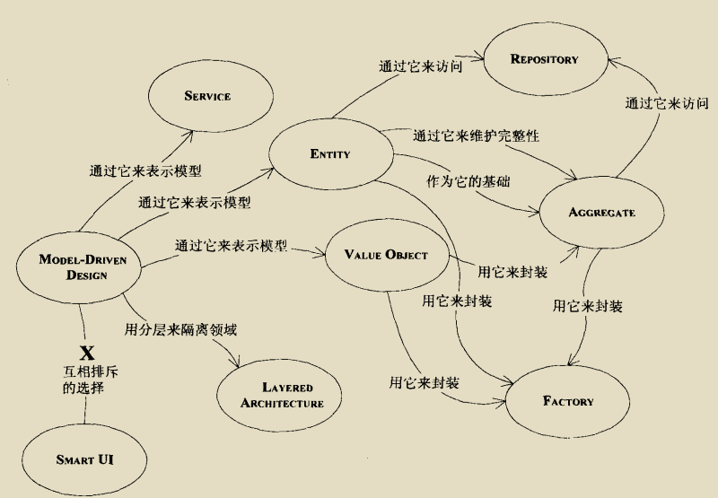
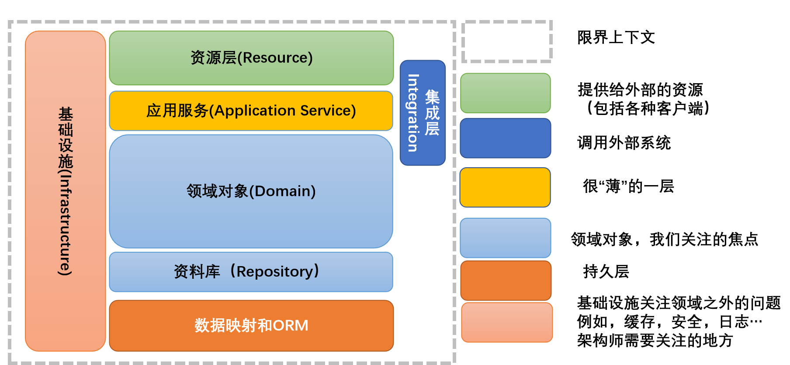

# 设计模式

## 应用场景

1. 策略模式：一个系统需要动态地在几种算法中选择一种，如果一个系统的策略多于四个，可以混合其他模式。
2. 代理模式：对一个类做访问控制，适配器模式主要改变所考虑对象的接口，而代理模式不能改变所代理类的接口，装饰器模式为了增强功能，而代理模式是为了加以控制。
3. 工厂模式：创建复杂对象。
4. 抽象工厂模式：存在多个产品族，一个产品族一个工厂，抽象工厂是工厂的工厂。
5. 门面模式：隐藏子系统的复杂性。
6. 适配器模式：作为两个不兼容接口的桥梁。
7. 模板方法模式：多个子类逻辑意义，重要的、复杂的方法可以考虑，可以使用 final 关键字防止重写。
8. 建造者模式：建造复杂的对象，和工厂模式区别是该模式更关注零件装配的顺序。
9. 桥梁模式：一个类存在多个维度的变化，且多个维度互相变化互不影响。
10. 命令模式：将命令发送者和命令接收者隔离开。
11. 装饰模式：增强功能。
12. 组合模式：整体到部分的树形结构，如 树形菜单，文件、文件夹的管理。
13. 观察者模式：一对多的的改变，一个对象必须通知其他对象，而并不知道这些对象是谁。
14. 责任链模式：动态指定一组对象处理同一个请求。
15. 访问者模式：数据和逻辑分开，经常需要对数据进行不同类型的操作。
16. 状态模式：行为随状态改变，状态不超过5个，条件分支的替代者。

## 策略模式：一个接口方法有不同的实现

```java
public interface IStrategy {
  //每个锦囊妙计都是一个可执行的算法
  public void operate();
}

public class Context {
  //构造函数，你要使用那个妙计
  private IStrategy straegy;
  public Context(IStrategy strategy){
    this.straegy = strategy;
  }

  //使用计谋了，看我出招了
  public void operate(){
    this.straegy.operate();
  }
}
```

## 代理模式：给多个接口方法提供统一的操作方式，可以给方法进行增强。

```java
public interface KindWomen {

  //这种类型的女人能做什么事情呢？
  public void makeEyesWithMan(); //抛媚眼

  public void happyWithMan(); //happy what? You know that!

}

public class WangPo implements KindWomen {
  private KindWomen kindWomen;

  public WangPo(){ //默认的话，是潘金莲的代理
    this.kindWomen = new PanJinLian();
  }

  //她可以是KindWomen的任何一个女人的代理，只要你是这一类型
  public WangPo(KindWomen kindWomen){
    this.kindWomen = kindWomen;
  }

  public void happyWithMan() {
    this.kindWomen.happyWithMan(); //自己老了，干不了，可以让年轻的代替
  }

  public void makeEyesWithMan() {
    this.kindWomen.makeEyesWithMan(); //王婆这么大年龄了，谁看她抛媚眼？！
  }
}
```

## 单例模式

参考 Java.md 单例实现。

## 工厂方法模式：使用工厂创建完成复杂对象的创建，一种工厂创建一种对象。

```java
public interface Human {
  //首先定义什么是人类

  //人是愉快的，会笑的，本来是想用smile表示，想了一下laugh更合适，好长时间没有大笑了；
  public void laugh();

  //人类还会哭，代表痛苦
  public void cry();

  //人类会说话
  public void talk();
}

public class HumanFactory {
  //定一个烤箱，泥巴塞进去，人就出来，这个太先进了
  public static Human createHuman(Class c){
    Human human=null; //定义一个类型的人类
    try {
      human = (Human)Class.forName(c.getName()).newInstance();	//产生一个人类
    } catch (InstantiationException e) {//你要是不说个人类颜色的话，没法烤，要白的黑，你说话了才好烤
      System.out.println("必须指定人类的颜色");
    } catch (IllegalAccessException e) { //定义的人类有问题，那就烤不出来了，这是...
      System.out.println("人类定义错误！");
    } catch (ClassNotFoundException e) { //你随便说个人类，我到哪里给你制造去？！
      System.out.println("混蛋，你指定的人类找不到！");
    }
    return human;
  }
}
```

## 抽象工厂模式：不同的工厂创建不同的对象。多种工厂创建多种对象。

```java
public interface Human {
  //首先定义什么是人类

  //人是愉快的，会笑的，本来是想用smile表示，想了一下laugh更合适，好长时间没有大笑了；
  public void laugh();

  //人类还会哭，代表痛苦
  public void cry();

  //人类会说话
  public void talk();

  //定义性别
  public void sex();
}

public interface HumanFactory {

  //制造黄色人类
  public Human createYellowHuman();

  //制造一个白色人类
  public Human createWhiteHuman();

  //制造一个黑色人类
  public Human createBlackHuman();
}

public abstract class AbstractHumanFactory implements HumanFactory {
  /*
  *	给定一个性别人类，创建一个人类出来 专业术语是产生产品等级
  */
  protected Human createHuman(HumanEnum humanEnum) {
    Human human = null;

    //如果传递进来不是一个Enum中具体的一个Element的话，则不处理
    if (!humanEnum.getValue().equals("")) {
      try {
        //直接产生一个实例human = (Human)
        Class.forName(humanEnum.getValue()).newInstance();
      } catch (Exception e) {
      //因为使用了enum，这个种异常情况不会产生了，除非你的enum有问题； e.printStackTrace();
      }
    }
    return human;
  }
}

public class MaleHumanFactory extends AbstractHumanFactory {
  //创建一个男性黑种人
  public Human createBlackHuman() {
    return super.createHuman(HumanEnum.BlackMaleHuman);
  }
  //创建一个男性白种人
  public Human createWhiteHuman() {
    return super.createHuman(HumanEnum.WhiteMaleHuman);
  }
  //创建一个男性黄种人
  public Human createYellowHuman() {
    return super.createHuman(HumanEnum.YelloMaleHuman);
  }
}

public class FemaleHumanFactory extends AbstractHumanFactory {
  //创建一个女性黑种人
  public Human createBlackHuman() {
    return super.createHuman(HumanEnum.BlackFemaleHuman);
  }
  //创建一个女性白种人
  public Human createWhiteHuman() {
    return super.createHuman(HumanEnum.WhiteFemaleHuman);
  }
  //创建一个女性黄种人
  public Human createYellowHuman() {
    return super.createHuman(HumanEnum.YelloFemaleHuman);
  }
}
```

## 门面模式：将多个接口方法按照一定的顺序编排,简化任务的复杂性

```java
public interface LetterProcess {

  //首先要写信的内容
  public void writeContext(String context);

  //其次写信封
  public void fillEnvelope(String address);

  //把信放到信封里
  public void letterInotoEnvelope();

  //然后邮递
  public void sendLetter();

}

public class ModenPostOffice {
private LetterProcess letterProcess = new LetterProcessImpl();

  //写信，封装，投递，一体化了
  public void sendLetter(String context,String address){

    //帮你写信
    letterProcess.writeContext(context);
    //写好信封
    letterProcess.fillEnvelope(address);
    //把信放到信封中
    letterProcess.letterInotoEnvelope();
    //邮递信件
    letterProcess.sendLetter();

  }
}
```

## 适配器模式：负责兼容不同类型的实现，常用于不同厂家的对接。

```java
public interface IUserInfo {
  //获得用户姓名
  public String getUserName();

  //获得家庭地址
  public String getHomeAddress();

  //手机号码，这个太重要，手机泛滥呀
  public String getMobileNumber();

  //办公电话，一般式座机
  public String getOfficeTelNumber();

  //这个人的职位是啥
  public String getJobPosition();

  //获得家庭电话，这个有点缺德，我是不喜欢打家庭电话讨论工作
  public String getHomeTelNumber();
}

public interface IOuterUser {

  //基本信息，比如名称，性别，手机号码了等
  public Map getUserBaseInfo();

  //工作区域信息
  public Map getUserOfficeInfo();

  //用户的家庭信息
  public Map getUserHomeInfo();
}

// 这就是适配器，OuterUser 当成 IUserInfo 访问
public class OuterUserInfo extends OuterUser implements IUserInfo{

}
```

## 模板方法模式：通过 abstract 实现，可以将多个对象相同的逻辑固定下来。
## 建造者模式：相比门面模式，可以自定义调用顺序。相比工厂模式，工厂模式强调的是创建，组装顺序并不关心。适用于产品类复杂、产品类的调用顺序产生变化。

```java
public abstract class CarModel {

  //这个参数是各个基本方法执行的顺序
  private ArrayList<String> sequence = new ArrayList<String>();

  /*
  *	模型是启动开始跑了
  */
  protected abstract void start();

  //能发动，那还要能停下来，那才是真本事
  protected abstract void stop();

  //喇叭会出声音，是滴滴叫，还是哔哔叫
  protected abstract void alarm();

  //引擎会轰隆隆的响，不响那是假的
  protected abstract void engineBoom();

  //那模型应该会跑吧，别管是人推的，还是电力驱动，总之要会跑
  final public void run() {
    //循环一遍，谁在前，就先执行谁
    for(int i=0;i<this.sequence.size();i++){
      String actionName = this.sequence.get(i);
      if(actionName.equalsIgnoreCase("start")){ //如果是start关键字，
        this.start(); //开启汽车
      }else if(actionName.equalsIgnoreCase("stop")){ //如果是stop关键字
        this.stop(); //停止汽车
      }else if(actionName.equalsIgnoreCase("alarm")){ //如果是alarm关键字
        this.alarm(); //喇叭开始叫了
      }else if(actionName.equalsIgnoreCase("engine boom")){ //如果是engine
        this.engineBoom();	//引擎开始轰鸣
      }
    }
  }

  //把传递过来的值传递到类内
  final public void setSequence(ArrayList<String> sequence){
    this.sequence = sequence;
  }
}

public abstract class CarBuilder {
  //建造一个模型，你要给我一个顺序要，就是组装顺序
  public abstract void setSequence(ArrayList<String> sequence);
  //设置完毕顺序后，就可以直接拿到这个车辆模型
  public abstract CarModel getCarModel();
}

public class Director {
  private ArrayList<String> sequence = new ArrayList();

  private BenzBuilder benzBuilder = new BenzBuilder();

  private BMWBuilder bmwBuilder = new BMWBuilder();

  /*
  *	A类型的奔驰车模型，先start,然后stop,其他什么引擎了，喇叭一概没有
  */
  public BenzModel getABenzModel(){
    //清理场景，这里是一些初级程序员不注意的地方
    this.sequence.clear();
    //这只ABenzModel的执行顺序
    this.sequence.add("start");
    this.sequence.add("stop");
    //按照顺序返回一个奔驰车
    this.benzBuilder.setSequence(this.sequence);
    return (BenzModel)this.benzBuilder.getCarModel();
  }

  /*
  *	B型号的奔驰车模型，是先发动引擎，然后启动，然后停止，没有喇叭
  */
  public BenzModel getBBenzModel(){
    this.sequence.clear();
    this.sequence.add("engine boom");
    this.sequence.add("start");
    this.sequence.add("stop");
    this.benzBuilder.setSequence(this.sequence);
    return (BenzModel)this.benzBuilder.getCarModel();
  }

  /*
  *	C型号的宝马车是先按下喇叭（炫耀嘛），然后启动，然后停止
  */
  public BMWModel getCBMWModel(){
    this.sequence.clear();
    this.sequence.add("alarm");
    this.sequence.add("start");
    this.sequence.add("stop");
    this.bmwBuilder.setSequence(this.sequence);

    return (BMWModel)this.bmwBuilder.getCarModel();
  }

  /*
  *	D类型的宝马车只有一个功能，就是跑，启动起来就跑，永远不停止，牛叉
  */
  public BMWModel getDBMWModel(){
  this.sequence.clear();
  this.sequence.add("start");
  this.bmwBuilder.setSequence(this.sequence);
  return (BMWModel)this.benzBuilder.getCarModel();
  }
}
```

## 桥接模式：用桥将两个独立的结构联系起来，两部分可以独立变化，防止多实现导致类的扩张，例如 奶茶容量分为 大杯、中杯、小杯，味道分为微糖、少糖、多糖，如果使用继承将会有 9 个子类组合。


```java
public abstract class Car {
    // 引用Engine:
    protected Engine engine;

    public Car(Engine engine) {
        this.engine = engine;
    }

    public abstract void drive();
}

public interface Engine {
    void start();
}

public abstract class RefinedCar extends Car {
    public RefinedCar(Engine engine) {
        super(engine);
    }

    public void drive() {
        this.engine.start();
        System.out.println("Drive " + getBrand() + " car...");
    }

    public abstract String getBrand();
}

public class BossCar extends RefinedCar {
    public BossCar(Engine engine) {
        super(engine);
    }

    public String getBrand() {
        return "Boss";
    }
}
```

使用修正类 RefinedCar ，可以组合 Engine 的功能。

## 命令模式：将命令的发出和命令执行分开，委派给不同的对象，请求方发出命令，接收方执行命令。

```java
public class Receiver {
    /**
     * 真正执行命令相应的操作
     */
    public void action() {
        System.out.println("执行操作");
    }
}

public interface Command {
   /**
    * 执行方法
    */
   void execute();
}

public class ConcreteCommand implements Command {
    /**
     * 持有相应的接收者对象
     */
    private Receiver receiver = null;
    /**
     * 构造方法
     * @param receiver
     */
    public ConcreteCommand(Receiver receiver) {
        this.receiver = receiver;
    }
    @Override
    public void execute() {
        //通常会转调接收者的形影方法，让接收者来真正执行功能
        receiver.action();
    }
}

public class Invoker {
    /**
     * 持有命令对象
     */
    private Command command = null;
    /**
     * 构造方法
     * @param command
     */
    public Invoker(Command command) {
        this.command = command;
    }
    /**
     * 行动方法
     */
    public void action() {
        command.execute();
    }
}
```

## 装饰模式：给目标对象进行方法增强。

```java
public abstract class SchoolReport {

  //成绩单的主要展示的就是你的成绩情况
  public abstract void report();

  //成绩单要家长签字，这个是最要命的
  public abstract void sign();
}

public class FouthGradeSchoolReport extends SchoolReport {

  //我的成绩单
  public void report() {
    //成绩单的格式是这个样子的System.out.println("尊敬的XXX家长:");
    System.out.println("	");
    System.out.println(" 语文 62 数学65 体育 98 自然	63"); System.out.println("	");
    System.out.println("	家长签名：	");
  }

  //家长签名
  public void sign(String name) {
    System.out.println("家长签名为："+name);
  }
}

public abstract class Decorator extends SchoolReport{
  //首先我要知道是那个成绩单
  private SchoolReport sr;
  //构造函数，传递成绩单过来
  public Decorator(SchoolReport sr){
    this.sr = sr;
  }
  //成绩单还是要被看到的
  public void report(){
    this.sr.report();
  }
  //看完毕还是要签名的
  public void sign(String name){
    this.sr.sign(name);
  }
}

public class HighScoreDecorator extends Decorator {

  //构造函数
  public HighScoreDecorator(SchoolReport sr){
    super(sr);
  }

  //我要汇报最高成绩
  private void reportHighScore(){
    System.out.println("这次考试语文最高是75，数学是78，自然是80");
  }

  //最高成绩我要做老爸看成绩单前告诉他，否则等他一看，就抡起笤帚有揍我，我那还有机会说呀@Override
  public void report(){
    this.reportHighScore(); super.report();
  }
}

public class SortDecorator extends Decorator {

  //构造函数
  public SortDecorator(SchoolReport sr){
    super(sr);
  }

  //告诉老爸学校的排名情况
  private void reportSort(){
    System.out.println("我是排名第38名...");
  }

  //老爸看完成绩单后再告诉他，加强作用@Override
  public void report(){
    super.report(); this.reportSort();
  }
}

public class Father {

  public static void main(String[] args) {
  //成绩单拿过来SchoolReport sr;
  sr = new FouthGradeSchoolReport(); //原装的成绩单
  //加 了最高分说明的成绩单
  sr = new HighScoreDecorator(sr);

  //又加了成绩排名的说明
  sr = new SortDecorator(sr);

  //看成绩单sr.report();

  //然后老爸，一看，很开心，就签名了
  sr.sign("老三"); //我叫小三，老爸当然叫老三
  }
}
```

## 组合模式：将容器对象和叶子对象进行递归组合，在使用过程中无须区分是容器还是叶子。在具有整体和部分的层次结构中，希望通过一种方式忽略整体与部分的差异，可以一致地对待它们。


```java
interface Component {
    public void add(Component c);
    public void remove(Component c);
    public Component getChild(int i);
    public void operation();
}

class Leaf implements Component {
    private String name;
    public Leaf(String name) {
        this.name = name;
    }
    public void add(Component c) {
    }
    public void remove(Component c) {
    }
    public Component getChild(int i) {
        return null;
    }
    public void operation() {
        System.out.println("树叶" + name + "：被访问！");
    }
}

//树枝构件
class Composite implements Component {
    private ArrayList<Component> children = new ArrayList<Component>();
    public void add(Component c) {
        children.add(c);
    }
    public void remove(Component c) {
        children.remove(c);
    }
    public Component getChild(int i) {
        return children.get(i);
    }
    public void operation() {
        for (Object obj : children) {
            ((Component) obj).operation();
        }
    }
}
```

## 观察者模式：解决一对多的对应关系，当一个对象发生改变时，通知到其他多个对象。

```java
public class Subject {

   private List<Observer> observers = new ArrayList<Observer>();
   private int state;

   public int getState() {
      return state;
   }

   public void setState(int state) {
      this.state = state;
      notifyAllObservers();
   }

   public void attach(Observer observer){
      observers.add(observer);
   }

   public void notifyAllObservers(){
      for (Observer observer : observers) {
         observer.update();
      }
   }
}

public abstract class Observer {
   protected Subject subject;
   public abstract void update();
}
```

## 责任链模式：请求按照一定顺序经过每一个处理器，观察者是 1对N 传播，责任链是 按顺序 1 对 1 传播。
## 访问者模式：将数据结构和数据操作分离。

```java
public interface ComputerPart {
   public void accept(ComputerPartVisitor computerPartVisitor);
}

public class Keyboard  implements ComputerPart {

   @Override
   public void accept(ComputerPartVisitor computerPartVisitor) {
      computerPartVisitor.visit(this);
   }
}

public class Monitor  implements ComputerPart {

   @Override
   public void accept(ComputerPartVisitor computerPartVisitor) {
      computerPartVisitor.visit(this);
   }
}

public class Mouse  implements ComputerPart {

   @Override
   public void accept(ComputerPartVisitor computerPartVisitor) {
      computerPartVisitor.visit(this);
   }
}

public interface ComputerPartVisitor {
   public void visit(Computer computer);
   public void visit(Mouse mouse);
   public void visit(Keyboard keyboard);
   public void visit(Monitor monitor);
}
```

## 状态模式：类的行为基于状态改变，可替代 条件分支语句。

```java
public interface State {
   public void doAction(Context context);
}

public class StartState implements State {

   public void doAction(Context context) {
      System.out.println("Player is in start state");
      context.setState(this);
   }

   public String toString(){
      return "Start State";
   }
}

public class StopState implements State {

   public void doAction(Context context) {
      System.out.println("Player is in stop state");
      context.setState(this);
   }

   public String toString(){
      return "Stop State";
   }
}

public class Context {
   private State state;

   public Context(){
      state = null;
   }

   public void setState(State state){
      this.state = state;
   }

   public State getState(){
      return state;
   }
}

public class StatePatternDemo {
   public static void main(String[] args) {
      Context context = new Context();

      StartState startState = new StartState();
      startState.doAction(context);

      System.out.println(context.getState().toString());

      StopState stopState = new StopState();
      stopState.doAction(context);

      System.out.println(context.getState().toString());
   }
}
```

# DDD

## 有效的建模

1. 统一语言，将领域中不同的模型命名，并解释其含义，使开发人员和业务人员理解一致。
2. 梳理模型之间的关联关系。
3. 将不同的业务线构建拓扑图，形成不同模型间的转移。
4. 提炼模型，去除不再使用的组件，当不需要的组件和需要的组件有关联时，把重要的概念提取到新模型中，去掉不需要的模型。

## 模型构造块

领域：



应用架构：



模型元素：
* 实体：用来表示某种具有连续性和标识的事务，可以跟踪它所经历的不同状态。
* 值对象：用来描述某种状态的属性，本身不具有状态，无法被改变，只能新创建。
* 服务：动作或操作来表示，无状态活动的建模，不属于任何对象，以活动命令，应该是一个动词。

每个Aggregate 选择一个 Entity 作为根，并通过根来控制对边界内其他对象的所有访问，在这个范围内，生命周期的每个阶段都必须满足一些固定规则。当创建 Aggregate 过于复杂可以使用 Factory 进行封装。

在事件风暴中，我们会根据一些业务操作和行为找出实体（Entity）或值对象（ValueObject），进而将业务关联紧密的实体和值对象进行组合，构成聚合，再根据业务语义将多个聚合划定到同一个限界上下文（Bounded Context）中，并在限界上下文内完成领域建模。

实体和值对象是很基础的领域对象。实体一般对应业务对象，它具有业务属性和业务行为；而值对象主要是属性集合，对实体的状态和特征进行描述。但实体和值对象都只是个体化的对象，它们的行为表现出来的是个体的能力。能让实体和值对象协同工作的组织就是聚合，它用来确保这些领域对象在实现共同的业务逻辑时，能保证数据的一致性。

如果把聚合比作组织，那聚合根就是这个组织的负责人。聚合根也称为根实体，它不仅是实体，还是聚合的管理者。

使关联更容易控制：
1. 规定一个遍历方向。
2. 消除不必要的关联。
3. 添加一个限定符，以便有效地减少多重关联。
