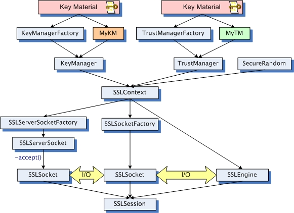

# OpenSSL & Keytool

* OpenSSL包含三个部分SSL协议库libssl、应用程序命令工具以及密码算法库libcrypto。使用标准格式（PEM/CER/CRT/PKCS等）储存密钥和证书信息。
* keytool是Java体系的密钥和证书管理工具，使用KeyStore来管理密钥和证书。另外还有与KeyStore一样文件格式的truststore，用来保存一些可信任的证书,以便https被访问时，确保可信任。

## OpenSSL

### 简介

#### 功能

1. 对称加密算法：流加密算法-RC4，分组加密算法-AES、DES、Blowfish、CAST、IDEA、RC2、RC5。
2. 非对称加密算法：DH算法、RSA算法、DSA算法、椭圆曲线算法（EC）。RSA算法可可以用于密钥交换，也可用于数字签名。
3. 信息摘要算法：MD2、MD5、MDC2、SHA（SHA1）、RIPEMD。
4. 秘钥和证书管理：

   * 提供对证书、公钥、私钥、证书请求以及CRL等数据对象的DER、PEM和BASE64的编解码功能。
   * 提供对公钥和私钥的DER编解码功能。
   * 实现私钥的PKCS#12和PKCS#8的编解码功能。
   * 实现证书的X.509标准编解码、PKCS#12格式的编解码以及PKCS#7的编解码功能。
   * 提供的CA应用程序就是一个小型的证书管理中心，实现证书签发的整个流程和证书管理的大部分机制。

#### AES加解密

对称加密需要使用的标准命令为 enc。

* -in filename：指定要加密的文件存放路径。
* -out filename：指定加密后的文件存放路径。
* -salt：自动插入一个随机数作为文件内容加密，默认选项。
* -e：可以指明一种加密算法，若不指的话将使用默认加密算法。
* -d：解密，解密时也可以指定算法，若不指定则使用默认算法，但一定要与加密时的算法一致。
* -a/-base64：使用-base64位编码格式。

```bash
# 加密
[root ~]# openssl enc -e -des3 -a -in in.txt -out out.enc
enter des-ede3-cbc encryption password:  #输入密码
Verifying - enter des-ede3-cbc encryption password:  #再次输入密码
# 解密
root ~]# openssl enc -d -des3 -a -in out.enc -out in.txt
enter des-ede3-cbc decryption password:  #输入密码
```

### RSA秘钥生成

默认产生的公钥、私钥都是PEM格式的。

1. 生成RSA私钥、公钥

```bash
# 生成明文秘钥对
[root ~]# openssl genrsa -out rsa_private.pem 2048
# 从秘钥对中导出公钥
[root ~]# openssl rsa -in rsa_private.pem -pubout -out rsa_public.key
```

2. 生成AES加密的秘钥对

```bash
# 生成密文秘钥对
[root ~]# openssl genrsa -aes256 -passout pass:111111 -out rsa_aes_private.pem 2048
# 从秘钥对中导出明文公钥
[root ~]# openssl rsa -in rsa_aes_private.pem -passin pass:111111 -pubout -out rsa_public.key
# 解密秘钥对
[root ~]# openssl rsa -in rsa_aes_private.pem -passin pass:111111 -out rsa_private.pem
```

3. PEM转DER

```bash
[root ~]# rsa -in rsa_private.pem -outform der -out rsa_private.der 
```

4. 私钥PKCS#1转PKCS#8

rsa 默认是传统私钥格式PKCS#1，可以将PKCS#1转换为PKCS#8格式，pkcs8默认采用 des3 加密算法，可使用 -nocrypt 参数可以输出无加密的pkcs8密钥。

```bash
# rsa转PKCS#8
[root ~]# openssl pkcs8 -topk8 -in rsa_private.key -passout pass:111111 -out pkcs8_private.key
# 导出无加密PKCS#8
[root ~]# openssl pkcs8 -topk8 -in rsa_private.key -nocrypt -out nocrypt_pkcs8_private.key
```

5. 生成CA证书

-new指生成证书请求，加上-x509 表示直接输出证书

```bash
# 同时生成RSA私钥和自签名证书
[root ~]# openssl req -newkey rsa:2048 -nodes -keyout rsa_private.key -x509 -days 365 -out cert.crt
# 使用 已有RSA 私钥生成自签名证书
[root ~]# openssl req -new -x509 -days 365 -key rsa_private.key -out cert.crt
```

6. 生成签名请求，使用请求发送给CA机构签发证书

```bash
# 生成CSR签名请求
[root ~]# openssl req -new -key rsa_private.key  -out server.csr
```

7， 使用 CA 证书及CA密钥 对请求签发证书进行签发，生成 x509证书

```bash
# 使用自签名的CA证书及CA秘钥，对请求签发证书进行签发，x509证书和秘钥就可以使用到nginx等服务器
[root ~]# openssl x509 -req -days 3650 -in server.csr -CA cert.crt -CAkey rsa_private.key -passin pass:111111 -CAcreateserial -out server.crt
# 使用CA根证书对我们签发的x509证书进行校验
[root ~]# openssl verify -CAfile cert.crt server.crt 
server.crt: OK
# 转换证书编码格式
[root ~]# openssl x509 -in cert.crt -inform PEM -outform DER -out cert.der
# pem 证书和私钥转 pkcs#12 证书
[root ~]# openssl pkcs12 -export -in server.crt -inkey server.key -passin pass:111111 -password pass:111111 -out server.p12
# pem 证书和私钥/CA 证书 合成pkcs#12 证书
[root ~]#  openssl pkcs12 -export -in server.crt -inkey server.key -passin pass:111111 -chain -CAfile cert.crt -password pass:111111 -out server-all.p12
```

## Keytool

keytool 生成的秘钥库为 jks 格式

1. 生成秘钥

```bash
keytool -genkeypair -alias 密钥对别名 -keypass 秘钥访问密码 -keyalg RSA -keysize 2048 -validity 365 -keystore 秘钥库路径 -storepass 秘钥库密码
```

* -alias 别名
* -keypass 指定生成密钥的密码
* -keyalg 指定密钥使用的加密算法（如 RSA）
* -keysize 密钥大小
* -validity 过期时间，单位：天
* -keystore 指定存储密钥的 密钥库的生成路径、名称。
* -storepass 指定访问密钥库的密码。

2. 生成证书请求文件

```bash
keytool -certreq -keystore 秘钥库路径  -alias 密钥对别名 -keyalg rsa -file 请求文件.csr
```

3. 使用证书请求文件获取CA证书cer文件，或者 导出自签证书

```bash
keytool -export -keystore 秘钥库路径  -alias 密钥对别名 -rfc -file 自签证书.cer
```

4. 导入信任证书到密钥库 。

```bash
 keytool -import -alias 密钥对别名 -file 自签证书.cer -keystore trust秘钥库  
```

5. 将JKS文件转成PKCS12格式，PKCS12可使用 openssl 处理。

```bash
keytool -importkeystore -srckeystore JKS密钥库文件 -srcstorepass JKS密钥库密码 -destkeystore p12文件 -deststoretype pkcs12
```

6. 加载jks文件，或者查看[03-06-SpringSecurityOAuth2.md](03-06-SpringSecurityOAuth2.md)读取jwt章节。

```java
public class JksTest {

   public KeyPair loadKeyPair(String storePath, String storePassword, String keyAlias, String keyPassword) {
      try {
         KeyStore keyStore = KeyStore.getInstance("JKS");
         keyStore.load(new FileInputStream(storePath), storePassword.toCharArray());
         PrivateKey privateKey = (PrivateKey) keyStore.getKey(keyAlias, keyPassword.toCharArray());
         PublicKey publicKey = keyStore.getCertificate(keyAlias).getPublicKey();
         return new KeyPair(publicKey, privateKey);
      } catch (Exception ex) {
         throw new RuntimeException(ex);
      }
   }

   private String getPublicKey(KeyPair keyPair) {
      PublicKey publicKey = keyPair.getPublic();
      byte[] bytes = publicKey.getEncoded();

      return Base64.getEncoder().encodeToString(bytes);
   }

   private String getPrivateKey(KeyPair keyPair) {
      PrivateKey publicKey = keyPair.getPrivate();
      byte[] bytes = publicKey.getEncoded();

      return Base64.getEncoder().encodeToString(bytes);
   }
}
```

# 加密 & 解密

Java 由 Cipher类提供加密和解密的功能，通过 `Cipher cipher = Cipher.getInstance("DES/CBC/PKCS5Padding")` 获取对象，参数按照 `算法/模式/填充模式` 传入，具体有：

* AES/CBC/NoPadding (128)
* AES/CBC/PKCS5Padding (128)
* AES/ECB/NoPadding (128)
* AES/ECB/PKCS5Padding (128)
* DES/CBC/NoPadding (56)
* DES/CBC/PKCS5Padding (56)
* DES/ECB/NoPadding (56)
* DES/ECB/PKCS5Padding (56)
* DESede/CBC/NoPadding (168)
* DESede/CBC/PKCS5Padding (168)
* DESede/ECB/NoPadding (168)
* DESede/ECB/PKCS5Padding (168)
* RSA/ECB/PKCS1Padding (1024, 2048)
* RSA/ECB/OAEPWithSHA-1AndMGF1Padding (1024, 2048)
* RSA/ECB/OAEPWithSHA-256AndMGF1Padding (1024, 2048)

其中：

1. 加密算法有 AES、DES、DESede(DES3)、RSA 四种。
2. 模式有 CBC(有向量模式)、ECB(无向量模式)，向量模式可以简单理解为偏移量，使用CBC模式需要定义一个 `IvParameterSpec` 对象。
3. 填充模式有 NoPadding(不足8位用0补足8位,需要自行补全)、PKCS5Padding(加密内容不足8位用余位数补足8位,如{65,65,65,5,5,5,5,5}或{97,97,97,97,97,97,2,2})。

除此之外，Cipher对象还需要初始化，通过调用 `init(int opmode, Key key, AlgorithmParameterSpec params)` ：

1. opmode ：Cipher.ENCRYPT\_MODE(加密模式)、 Cipher.DECRYPT\_MODE(解密模式)。
2. key ：密匙，可以使用SecretKeySpec、KeyGenerator、KeyPairGenerator创建密匙，其中：

   * SecretKeySpec和KeyGenerator支持AES，DES，DESede三种加密算法创建密匙。
   * KeyPairGenerator支持RSA加密算法创建密匙。
3. params ：使用CBC模式时必须传入该参数，该项目使用 IvParameterSpec 创建 iv 对象，例如：

   ```java
   public class test {
       public String encrypt(String content, String slatKey, String vectorKey) throws Exception {
           Cipher cipher = Cipher.getInstance("AES/CBC/PKCS5Padding");
           SecretKey secretKey = new SecretKeySpec(slatKey.getBytes(), "AES");
           IvParameterSpec iv = new IvParameterSpec(vectorKey.getBytes());
           cipher.init(Cipher.ENCRYPT_MODE, secretKey, iv);
           byte[] encrypted = cipher.doFinal(content.getBytes());
           return Base64.encodeBase64String(encrypted);
       }
   }
   ```

## 对称加密

### 常见的对称加密算法


| 算法                                | 描述                                                                 |
| ----------------------------------- | -------------------------------------------------------------------- |
| DES（Data Encryption Standard）     | 数据加密标准，速度较快，适用于加密大量数据                           |
| 3DES（Triple DES）                  | 基于DES，对一块数据用三个不同的密钥进行三次加密，强度更高            |
| AES（Advanced Encryption Standard） | 高级加密标准，速度快，安全级别高，支持128、192、256、512位密钥的加密 |

由于DES有漏洞，产生3重DES，而3重DES的效率比较低，产生AES。

#### DES

```java
@Slf4j
public class DesTest {

    private static final String DES = "DES";

    @Test
    public void desTest() {
        String keyStr = generateKeyStr();
        log.info("秘钥字符串 = {}", keyStr);

        String source = "我是明文";
        log.info("明文 = {}", source);

        String target = encode(source, keyStr);
        log.info("密文 = {}", target);

        Assertions.assertEquals(source, decode(target, keyStr));
    }

    public String generateKeyStr() {
        try {
            // 生成指定算法的密钥生成器,参数是算法名称
            KeyGenerator keyGenerator = KeyGenerator.getInstance(DES);
            // 初始化密钥生成器,指定密钥生成器产生密钥的长度
            keyGenerator.init(56);
            // 生成一个SecretKey密钥对象
            SecretKey secretKey = keyGenerator.generateKey();
            // 返回一个密钥字节数组
            byte[] bytes = secretKey.getEncoded();
            return Base64.getEncoder().encodeToString(bytes);
        } catch (Exception ex) {
            throw new RuntimeException(ex);
        }
    }

    public String encode(String source, String keyStr) {
        try {
            SecretKey secretKey = transferKey(keyStr);

            Cipher cipher = Cipher.getInstance("DES/ECB/PKCS5Padding");
            cipher.init(Cipher.ENCRYPT_MODE, secretKey);
            byte[] bytes = cipher.doFinal(source.getBytes(StandardCharsets.UTF_8.name()));

            return Base64.getEncoder().encodeToString(bytes);
        } catch (Exception ex) {
            throw new RuntimeException(ex);
        }
    }

    public String decode(String target, String keyStr) {
        try {
            SecretKey secretKey = transferKey(keyStr);

            Cipher cipher = Cipher.getInstance("DES/ECB/PKCS5Padding");
            cipher.init(Cipher.DECRYPT_MODE, secretKey);
            byte[] bytes = cipher.doFinal(Base64.getDecoder().decode(target));

            return new String(bytes,StandardCharsets.UTF_8.name());
        } catch (Exception ex) {
            throw new RuntimeException(ex);
        }
    }

    private SecretKey transferKey(String keyStr) {
        try {
            byte[] bytes = Base64.getDecoder().decode(keyStr);
            // 生成 DES规则的密钥对象
            DESKeySpec desKeySpec = new DESKeySpec(bytes);
            // 获取一个密钥工厂实例
            SecretKeyFactory factory = SecretKeyFactory.getInstance(DES);
            // 符合符合DES算法的密钥
            return factory.generateSecret(desKeySpec);
        } catch (Exception ex) {
            throw new RuntimeException(ex);
        }
    }
}
```

#### 3DES

```java
@Slf4j
public class Des3Test {

    private static final String DES3 = "DESede";

    @Test
    public void desTest() {
        String keyStr = generateKeyStr();
        log.info("秘钥字符串 = {}", keyStr);

        String source = "我是明文";
        log.info("明文 = {}", source);

        String target = encode(source, keyStr);
        log.info("密文 = {}", target);

        Assertions.assertEquals(source, decode(target, keyStr));
    }

    public String generateKeyStr() {
        try {
            // 生成指定算法的密钥生成器,参数是算法名称
            KeyGenerator keyGenerator = KeyGenerator.getInstance(DES3);
            // 初始化密钥生成器,指定密钥生成器产生密钥的长度
            keyGenerator.init(168);
            // 生成一个SecretKey密钥对象
            SecretKey secretKey = keyGenerator.generateKey();
            // 返回一个密钥字节数组
            byte[] bytes = secretKey.getEncoded();
            return Base64.getEncoder().encodeToString(bytes);
        } catch (Exception ex) {
            throw new RuntimeException(ex);
        }
    }

    public String encode(String source, String keyStr) {
        try {
            SecretKey secretKey = transferKey(keyStr);

            Cipher cipher = Cipher.getInstance("DESede/ECB/PKCS5Padding");
            cipher.init(Cipher.ENCRYPT_MODE, secretKey);
            byte[] bytes = cipher.doFinal(source.getBytes(StandardCharsets.UTF_8.name()));

            return Base64.getEncoder().encodeToString(bytes);
        } catch (Exception ex) {
            throw new RuntimeException(ex);
        }
    }

    public String decode(String target, String keyStr) {
        try {
            SecretKey secretKey = transferKey(keyStr);

            Cipher cipher = Cipher.getInstance("DESede/ECB/PKCS5Padding");
            cipher.init(Cipher.DECRYPT_MODE, secretKey);
            byte[] bytes = cipher.doFinal(Base64.getDecoder().decode(target));

            return new String(bytes,StandardCharsets.UTF_8.name());
        } catch (Exception ex) {
            throw new RuntimeException(ex);
        }
    }

    private SecretKey transferKey(String keyStr) {
        try {
            byte[] bytes = Base64.getDecoder().decode(keyStr);
            // 生成 DES规则的密钥对象
            DESedeKeySpec deSedeKeySpec = new DESedeKeySpec(bytes);
            // 获取一个密钥工厂实例
            SecretKeyFactory factory = SecretKeyFactory.getInstance(DES3);
            // 符合符合DES算法的密钥
            return factory.generateSecret(deSedeKeySpec);
        } catch (Exception ex) {
            throw new RuntimeException(ex);
        }
    }
}
```

#### AES

```java
@Slf4j
public class AesTest {

    private static final String AES = "AES";

    @Test
    public void desTest() {
        String keyStr = generateKeyStr();
        log.info("秘钥字符串 = {}", keyStr);

        String source = "我是明文";
        log.info("明文 = {}", source);

        String target = encode(source, keyStr);
        log.info("密文 = {}", target);

        Assertions.assertEquals(source, decode(target, keyStr));
    }

    public String generateKeyStr() {
        try {
            // 生成指定算法的密钥生成器,参数是算法名称
            KeyGenerator keyGenerator = KeyGenerator.getInstance(AES);
            // 初始化密钥生成器,指定密钥生成器产生密钥的长度
            keyGenerator.init(128);
            // 生成一个SecretKey密钥对象
            SecretKey secretKey = keyGenerator.generateKey();
            // 返回一个密钥字节数组
            byte[] bytes = secretKey.getEncoded();
            return Base64.getEncoder().encodeToString(bytes);
        } catch (Exception ex) {
            throw new RuntimeException(ex);
        }
    }

    public String encode(String source, String keyStr) {
        try {
            SecretKey secretKey = transferKey(keyStr);

            Cipher cipher = Cipher.getInstance("AES/ECB/PKCS5Padding");
            cipher.init(Cipher.ENCRYPT_MODE, secretKey);
            byte[] bytes = cipher.doFinal(source.getBytes(StandardCharsets.UTF_8.name()));

            return Base64.getEncoder().encodeToString(bytes);
        } catch (Exception ex) {
            throw new RuntimeException(ex);
        }
    }

    public String decode(String target, String keyStr) {
        try {
            SecretKey secretKey = transferKey(keyStr);

            Cipher cipher = Cipher.getInstance("AES/ECB/PKCS5Padding");
            cipher.init(Cipher.DECRYPT_MODE, secretKey);
            byte[] bytes = cipher.doFinal(Base64.getDecoder().decode(target));

            return new String(bytes,StandardCharsets.UTF_8.name());
        } catch (Exception ex) {
            throw new RuntimeException(ex);
        }
    }

    private SecretKey transferKey(String keyStr) {
        try {
            byte[] bytes = Base64.getDecoder().decode(keyStr);
            // 生成 AES 规则的密钥对象
            SecretKeySpec secretKeySpec = new SecretKeySpec(bytes, AES);
            return secretKeySpec;
        } catch (Exception ex) {
            throw new RuntimeException(ex);
        }
    }
}
```

## 非对称加密

### 常见的对称加密算法

#### RSA

```java
@Slf4j
public class RsaTest {

    private static final String RSA = "RSA";

    @Test
    public void desTest() {
        KeyPair keyPair = generateKeyPair();

        String publicKey = getPublicKey(keyPair);
        String privateKey = getPrivateKey(keyPair);
        log.info("公钥 = {}", publicKey);
        log.info("私钥 = {}", privateKey);

        String source = "我是明文";
        log.info("明文 = {}", source);

        String target1 = encode(source, publicKey, true);
        log.info("公钥加密密文 = {}", target1);

        Assertions.assertEquals(source, decode(target1, privateKey, false));

        String target2 = encode(source, privateKey, false);
        log.info("私钥加密密文 = {}", target2);

        Assertions.assertEquals(source, decode(target2, publicKey, true));
    }

    public KeyPair generateKeyPair() {
        try {
            KeyPairGenerator keyPairGenerator = KeyPairGenerator.getInstance(RSA);
            keyPairGenerator.initialize(2048);

            KeyPair keyPair = keyPairGenerator.generateKeyPair();
            return keyPair;
        } catch (Exception ex) {
            throw new RuntimeException(ex);
        }
    }

    private String getPublicKey(KeyPair keyPair) {
        PublicKey publicKey = keyPair.getPublic();
        byte[] bytes = publicKey.getEncoded();

        return Base64.getEncoder().encodeToString(bytes);
    }

    private String getPrivateKey(KeyPair keyPair) {
        PrivateKey publicKey = keyPair.getPrivate();
        byte[] bytes = publicKey.getEncoded();

        return Base64.getEncoder().encodeToString(bytes);
    }

    public String encode(String source, String keyStr, boolean publicKey) {
        try {
            Key key = publicKey ? transferPublicKey(keyStr) : transferPrivateKey(keyStr);

            Cipher cipher = Cipher.getInstance(RSA);
            cipher.init(Cipher.ENCRYPT_MODE, key);
            byte[] bytes = cipher.doFinal(source.getBytes(StandardCharsets.UTF_8.name()));

            return Base64.getEncoder().encodeToString(bytes);
        } catch (Exception ex) {
            throw new RuntimeException(ex);
        }
    }

    public String decode(String target, String keyStr, boolean publicKey) {
        try {
            Key key = publicKey ? transferPublicKey(keyStr) : transferPrivateKey(keyStr);

            Cipher cipher = Cipher.getInstance(RSA);
            cipher.init(Cipher.DECRYPT_MODE, key);
            byte[] bytes = cipher.doFinal(Base64.getDecoder().decode(target));

            return new String(bytes, StandardCharsets.UTF_8.name());
        } catch (Exception ex) {
            throw new RuntimeException(ex);
        }
    }

    private RSAPublicKey transferPublicKey(String publicKeyStr) {
        try {
            byte[] bytes = Base64.getDecoder().decode(publicKeyStr);
            KeyFactory keyFactory = KeyFactory.getInstance(RSA);
            RSAPublicKey publicKey = (RSAPublicKey) keyFactory.generatePublic(new X509EncodedKeySpec(bytes));
            return publicKey;
        } catch (Exception ex) {
            throw new RuntimeException(ex);
        }
    }

    private RSAPrivateKey transferPrivateKey(String privateKeyStr) {
        try {
            byte[] bytes = Base64.getDecoder().decode(privateKeyStr);
            KeyFactory keyFactory = KeyFactory.getInstance(RSA);
            RSAPrivateKey privateKey = (RSAPrivateKey) keyFactory.generatePrivate(new PKCS8EncodedKeySpec(bytes));
            return privateKey;
        } catch (Exception ex) {
            throw new RuntimeException(ex);
        }
    }
}
```

## SSL

SSLSocket 核心类之间的关系：



SSLServerSocketFactory 、SSLSocketFactory 由 SSLContext 产生，SSLContext 在 JDK1.7、JDK1.8 支持 SSLv3(又名SSL)、TLSv1(又名TLS)、TLSv1.1、TLSv1.2 协议，通过 `public static SSLContext getInstance(String protocol);`获取对象，新创建的 SSLContext 必须调用 `public void init(KeyManager[] km,TrustManager[] tm,SecureRandom random);` 进行初始化。

TrustManager 用来确定凭证是否应该被信任，可由 TrustManagerFactory 生成，TrustManagerFactory在 JDK1.7、JDK1.8 支持的算法有 PKIX(又名X509/SunPKIX)、SunX509。另外有单独支持基于X.509公钥证书的 X509TrustManager。

跳过凭证认证如下：

```java
public class IgnoreAllTrustManager implements X509TrustManager {
   public X509Certificate[] getAcceptedIssuers() {
      return null;
   }

   public boolean isServerTrusted(X509Certificate[] certs) {
      return true;
   }

   public boolean isClientTrusted(X509Certificate[] certs) {
      return true;
   }

   public void checkServerTrusted(X509Certificate[] certs, String authType)
           throws CertificateException {
      return;
   }

   public void checkClientTrusted(X509Certificate[] certs, String authType)
           throws CertificateException {
      return;
   }
}
```

可配置 javax.net.ssl.trustStore 和 javax.net.ssl.trustStorePassword 系统参数system.properties 信任凭证 ,或者手动加载 如下：

```java
public class SslTest {

   public void sslTest() throws Exception {
      String keyStoreFile = "D:\\code\\ttt.ks";
      String password = "poiuyt";

      KeyStore ks = KeyStore.getInstance(KeyStore.getDefaultType());
      FileInputStream in = new FileInputStream(keyStoreFile);
      ks.load(in, password.toCharArray());
      ;

      TrustManagerFactory tmf = TrustManagerFactory.getInstance(TrustManagerFactory.getDefaultAlgorithm());
      tmf.init(ks);
      SSLContext ctx = SSLContext.getInstance("TLS");
      ctx.init(null, tmf.getTrustManagers(), null);
   }
}
```

KeyManager 用于选择发送给远程主机的凭证，使用方式与 TrustManager 类似，可通过 javax.net.ssl.keyStore 和 javax.net.ssl.keyStorePassword 配置秘钥仓库。

当 SSL 连接中出现 Hostname 'example.com' was not verified 异常时，可添加 HostnameVerifier 解决。

AppacheHttp 信任所有证书：

```java
public class HttpUtilTemp {
   public static CloseableHttpClient buildSSLCloseableHttpClient()
            throws Exception {
        SSLContext sslContext = new SSLContextBuilder().loadTrustMaterial(null,
                new TrustStrategy() {
                    // 信任所有
                    public boolean isTrusted(X509Certificate[] chain,
                                             String authType) throws CertificateException {
                        return true;
                    }
                }).build();
        // ALLOW_ALL_HOSTNAME_VERIFIER:这个主机名验证器基本上是关闭主机名验证的,实现的是一个空操作，并且不会抛出javax.net.ssl.SSLException异常。
        SSLConnectionSocketFactory sslsf = new SSLConnectionSocketFactory(
                sslContext, new String[]{"TLSv1"}, null,
                SSLConnectionSocketFactory.ALLOW_ALL_HOSTNAME_VERIFIER);
        return HttpClients.custom().setSSLSocketFactory(sslsf).build();
    }
}
```

### 摘要

MessageDigest 提供摘要算法，常用的有 MD2 MD5 SHA-1 SHA-256 SHA-384 SHA-512 。

```java
@Slf4j
public class MessageDigestTest {

    @Test
    public void desTest() {
        String source = "我是明文";
        log.info("明文 = {}", source);

        String target = digest(source, "md5");
        log.info("密文 = {}", target);

        Assertions.assertEquals(target, digest(source, "md5"));
    }

    public String digest(String source, String algorithm) {
        try {
            MessageDigest messageDigest = MessageDigest.getInstance(algorithm);
            messageDigest.update(source.getBytes(StandardCharsets.UTF_8.name()));
            byte[] bytes = messageDigest.digest();
            return Base64.getEncoder().encodeToString(bytes);
        } catch (Exception ex) {
            throw new RuntimeException(ex);
        }
    }
}
```

### 签名

```java

@Slf4j
public class SignatureTest {

    private static final String SIGNATURE_ALGORITHM = "SHA1WithRSA";

    private static final String RSA = "RSA";

    @Test
    public void desTest() {
        KeyPair keyPair = generateKeyPair();

        String publicKey = getPublicKey(keyPair);
        String privateKey = getPrivateKey(keyPair);
        log.info("公钥 = {}", publicKey);
        log.info("私钥 = {}", privateKey);

        String source = "我是明文";
        log.info("明文 = {}", source);

        String sign = sign(source, privateKey);
        log.info("签名 = {}", sign);

        Assertions.assertTrue(verify(source, sign, publicKey));
    }

    public KeyPair generateKeyPair() {
        try {
            KeyPairGenerator keyPairGenerator = KeyPairGenerator.getInstance(RSA);
            keyPairGenerator.initialize(2048);

            KeyPair keyPair = keyPairGenerator.generateKeyPair();
            return keyPair;
        } catch (Exception ex) {
            throw new RuntimeException(ex);
        }
    }

    private String getPublicKey(KeyPair keyPair) {
        PublicKey publicKey = keyPair.getPublic();
        byte[] bytes = publicKey.getEncoded();

        return Base64.getEncoder().encodeToString(bytes);
    }

    private String getPrivateKey(KeyPair keyPair) {
        PrivateKey publicKey = keyPair.getPrivate();
        byte[] bytes = publicKey.getEncoded();

        return Base64.getEncoder().encodeToString(bytes);
    }

    public String sign(String source, String privateStr) {
        try {
            RSAPrivateKey privateKey = transferPrivateKey(privateStr);

            Signature signature = Signature.getInstance(SIGNATURE_ALGORITHM);
            signature.initSign(privateKey);
            signature.update(source.getBytes(StandardCharsets.UTF_8));
            byte[] bytes = signature.sign();

            return Base64.getEncoder().encodeToString(bytes);
        } catch (Exception ex) {
            throw new RuntimeException(ex);
        }
    }

    public boolean verify(String source, String sign, String publicKeyStr) {
        try {
            RSAPublicKey publicKey = transferPublicKey(publicKeyStr);

            Signature signature = Signature.getInstance(SIGNATURE_ALGORITHM);
            signature.initVerify(publicKey);
            signature.update(source.getBytes(StandardCharsets.UTF_8));

            return signature.verify(Base64.getDecoder().decode(sign));
        } catch (Exception ex) {
            throw new RuntimeException(ex);
        }
    }

    private RSAPublicKey transferPublicKey(String publicKeyStr) {
        try {
            byte[] bytes = Base64.getDecoder().decode(publicKeyStr);
            KeyFactory keyFactory = KeyFactory.getInstance(RSA);
            RSAPublicKey publicKey = (RSAPublicKey) keyFactory.generatePublic(new X509EncodedKeySpec(bytes));
            return publicKey;
        } catch (Exception ex) {
            throw new RuntimeException(ex);
        }
    }

    private RSAPrivateKey transferPrivateKey(String privateKeyStr) {
        try {
            byte[] bytes = Base64.getDecoder().decode(privateKeyStr);
            KeyFactory keyFactory = KeyFactory.getInstance(RSA);
            RSAPrivateKey privateKey = (RSAPrivateKey) keyFactory.generatePrivate(new PKCS8EncodedKeySpec(bytes));
            return privateKey;
        } catch (Exception ex) {
            throw new RuntimeException(ex);
        }
    }
}
```
