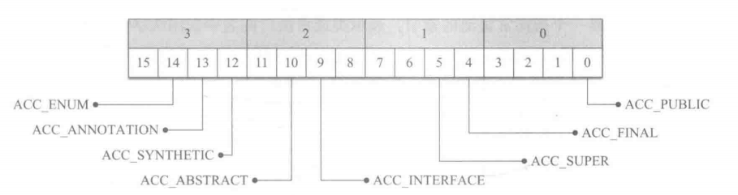
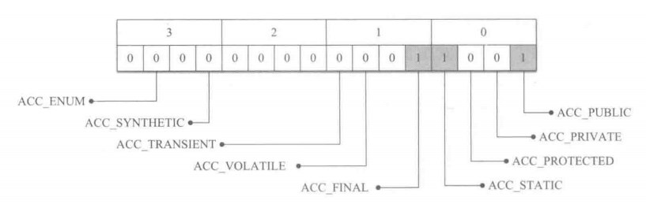
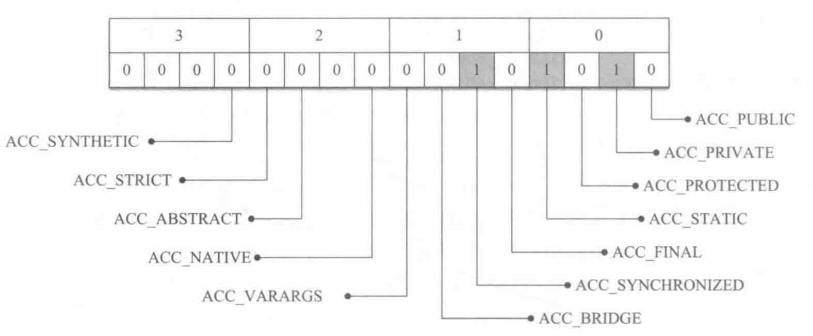
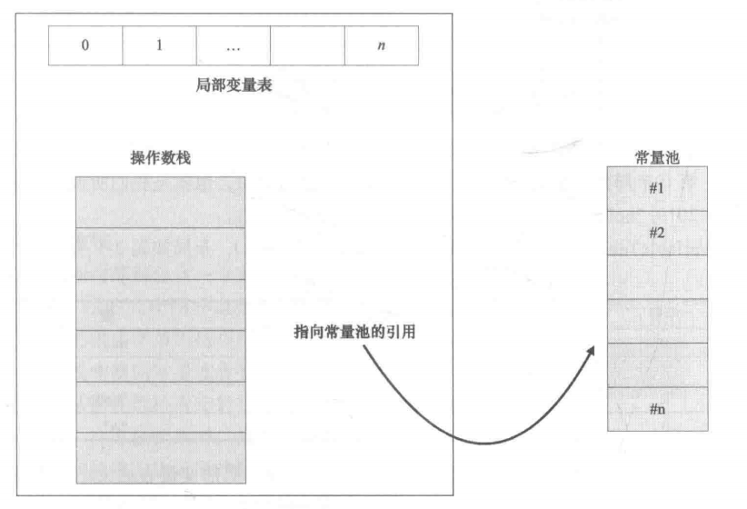
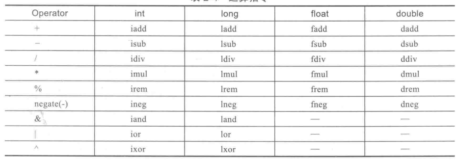
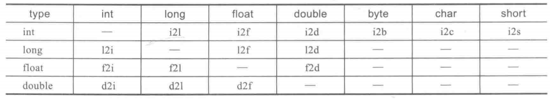
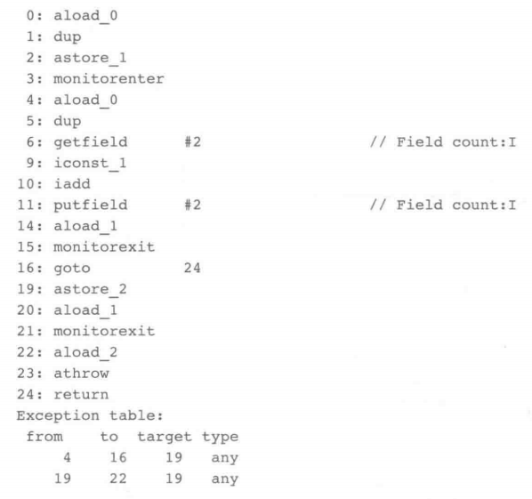

# Class文件结构

class文件 使用 u1、u2、u4 表示1、2、4字节无符号整数，用table来表示数组对象，table由长度n+n个字节数组组成，一个字节数组就是一个对象。

```text
ClassFile {
    u4             magic;                                    //Class 文件的标志：魔数
    u2             minor_version;                            //Class 的次版本号
    u2             major_version;                            //Class 的主版本号
    u2             constant_pool_count;                      //常量池的数量
    cp_info        constant_pool[constant_pool_count-1];     //常量池
    u2             access_flags;                             //Class 的访问标志
    u2             this_class;                               //当前类
    u2             super_class;                              //父类
    u2             interfaces_count;                         //接口
    u2             interfaces[interfaces_count];             //一个类可以实现多个接口
    u2             fields_count;                             //Class 文件的字段属性
    field_info     fields[fields_count];                     //一个类会可以有个字段
    u2             methods_count;                            //Class 文件的方法数量
    method_info    methods[methods_count];                   //一个类可以有个多个方法
    u2             attributes_count;                         //此类的属性表中的属性数
    attribute_info attributes[attributes_count];             //属性表集合
}
```

`My Very Cute Animal Turns Savage In Full Moon Areas`


## 常量池

常量池的索引从1开始，第0项是用于表示“不引用任何一个常量池项目”。

```text
cp_info {
    u1 tag;     // 常量项类型
    u1 info[];  // 字节数组
}
```

不同的常量类型字节数组布局不一样。

<table>
    <tr>
        <td>类型</td>
        <td>描述</td>
        <td>类型</td>
        <td>字段</td>
        <td>备注</td>
   </tr>
    <tr>
  		 <td rowspan="3">CONSTANT_utf8_info</td>
  		 <td rowspan="3">MUTF8编码的字符串</td>
         <td>u1</td>
         <td>tag</td>
         <td>1</td>
    </tr>
    <tr>
        <td>u2</td>  
        <td>length</td>
        <td>长度</td>
    </tr>
    <tr>
        <td>u1</td>  
        <td>byte[length]</td>
        <td>字节数组</td>
    </tr>
    <tr>
  		 <td rowspan="2">CONSTANT_Integer_info</td>
  		 <td rowspan="2">整型字面量</td>
         <td>u1</td>
         <td>tag</td>
         <td>3</td> 
    </tr>
    <tr>
        <td>u4</td>  
        <td>byte[4]</td>
    </tr>
    <tr>
  		 <td rowspan="2">CONSTANT_Float_info</td>
  		 <td rowspan="2">浮点型字面量</td>
         <td>u1</td>
         <td>tag</td>
         <td>4</td> 
    </tr>
    <tr>
        <td>u4</td>  
        <td>byte[4]</td>
    </tr>
    <tr>
  		 <td rowspan="3">CONSTANT_Long_info</td>
  		 <td rowspan="3">长整型字面量</td>
         <td>u1</td>
         <td>tag</td>
         <td>5</td> 
    </tr>
    <tr>
        <td>u4</td>  
        <td>byte[4]</td>
        <td>高4位</td>
    </tr>
    <tr>
        <td>u4</td>  
        <td>byte[4]</td>
        <td>低4位</td>
    </tr>
    <tr>
  		 <td rowspan="3">CONSTANT_Double_info</td>
  		 <td rowspan="3">双精度浮点型字面量</td>
         <td>u1</td>
         <td>tag</td>
         <td>6</td> 
    </tr>
    <tr>
        <td>u4</td>  
        <td>byte[4]</td>
        <td>高4位</td>
    </tr>
    <tr>
        <td>u4</td>  
        <td>byte[4]</td>
        <td>低4位</td>
    </tr>
    <tr>
  		 <td rowspan="2">CONSTANT_Class_info</td>
  		 <td rowspan="2">类或接口的符号引用</td>
         <td>u1</td>
         <td>tag</td>
         <td>7</td> 
    </tr>
    <tr>
        <td>u2</td>  
        <td>name_index</td>
        <td>指向全限定名常量项的索引，CONSTANT_utf8_info</td>
    </tr>
    <tr>
  		 <td rowspan="2">CONSTANT_String_info</td>
  		 <td rowspan="2">字符串类型字面量</td>
         <td>u1</td>
         <td>tag</td>
         <td>8</td> 
    </tr>
    <tr>
        <td>u2</td>  
        <td>name_index</td>
        <td>指向字符串字面量的索引，CONSTANT_utf8_info</td>
    </tr>
    <tr>
  		 <td rowspan="3">CONSTANT_Fieldref_info</td>
  		 <td rowspan="3">字段的符号引用</td>
         <td>u1</td>
         <td>tag</td>
  		 <td>9</td> 
    </tr>
    <tr>
        <td>u2</td>  
        <td>class_index</td>
        <td>指向声明字段的类或者接口描述符，CONSTANT_Class_info</td>
    </tr>
    <tr>
        <td>u2</td>  
        <td>name_and_type_index</td>
        <td>指向字段描述符，CONSTANT_NameAndType</td>
    </tr>
    <tr>
  		 <td rowspan="3">CONSTANT_Methodref_info</td>
  		 <td rowspan="3">类中方法的符号引用</td>
         <td>u1</td>
         <td>tag</td>
  		 <td>10</td> 
    </tr>
    <tr>
        <td>u2</td>  
        <td>class_index</td>
        <td>指向声明字段的类或者接口描述符，CONSTANT_Class_info</td>
    </tr>
    <tr>
        <td>u2</td>  
        <td>name_and_type_index</td>
        <td>指向字段描述符，CONSTANT_NameAndType</td>
    </tr>
    <tr>
  		 <td rowspan="3">CONSTANT_InterfaceMethodref_info</td>
  		 <td rowspan="3">接口中方法的符号引用</td>
         <td>u1</td>
         <td>tag</td>
  		 <td>11</td> 
    </tr>
    <tr>
        <td>u2</td>  
        <td>class_index</td>
        <td>指向声明字段的类或者接口描述符，CONSTANT_Class_info</td>
    </tr>
    <tr>
        <td>u2</td>  
        <td>name_and_type_index</td>
        <td>指向字段描述符，CONSTANT_NameAndType</td>
    </tr>
    <tr>
  		 <td rowspan="3">CONSTANT_NameAndType_info</td>
  		 <td rowspan="3">字段或方法的部分符号引用</td>
         <td>u1</td>
         <td>tag</td>
  		 <td>12</td> 
    </tr>
    <tr>
        <td>u2</td>  
        <td>name_index</td>
        <td>指向该字段或方法名称，CONSTANT_utf8_info</td>
    </tr>
    <tr>
        <td>u2</td>  
        <td>descriptor_index</td>
        <td>指向该字段或方法描述符，CONSTANT_utf8_info</td>
    </tr>
    <tr>
  		 <td rowspan="3">CONSTANT_MethodHandle_info</td>
  		 <td rowspan="3">表示方法句柄</td>
         <td>u1</td>
         <td>tag</td>
  		 <td>15</td> 
    </tr>
    <tr>
        <td>u2</td>  
        <td>reference_kind</td>
        <td>方法句柄的类型，1-9</td>
    </tr>
    <tr>
        <td>u2</td>  
        <td>reference_index</td>
        <td>对常量池的有效索引，CONSTANT_utf8_info</td>
    </tr>
    <tr>
  		 <td rowspan="2">CONSTANT_MethodType_info</td>
  		 <td rowspan="2">标识方法类型</td>
         <td>u1</td>
         <td>tag</td>
  		 <td>16</td> 
    </tr>
    <tr>
        <td>u2</td>  
        <td>descriptor_index</td>
        <td>指向该字段或方法描述符，CONSTANT_utf8_info</td>
    </tr>
    <tr>
  		 <td rowspan="3">CONSTANT_InvokeDynamic_info</td>
  		 <td rowspan="3">动态方法调用点</td>
         <td>u1</td>
         <td>tag</td>
  		 <td>18</td> 
    </tr>
    <tr>
        <td>u2</td>  
        <td>bootstrap_method_attr_index</td>
        <td>对当前Class文件中引导方法表的bootstrap_methods[]，是一种特殊的attribute_infoattributes，BootstrapMethods Attribute</td>
    </tr>
    <tr>
        <td>u2</td>  
        <td>name_and_type_index</td>
        <td>方法名和方法描述符，CONSTANT_NameAndType</td>
    </tr>
</table>

### 字段描述符

| 描述符         | 类型                     |
|-------------|------------------------|
| B           | 基本类型byte               |
| C           | 基本类型char               |
| D           | 基本类型double             |
| F           | 基本类型float              |
| I           | 基本类型int                |
| J           | 基本类型long               |
| S           | 基本类型short              |
| Z           | 基本类型boolean            |
| LClassName; | 引用类型，"L"+对象类型的全限定名+";" |
| [           | 一维数组，多维数组使用多个[         |

### 方法描述符

格式：`(参数1类型参数2类型...)返回值类型`

例如：`Object foo(int i,double d,Thread t)` 描述符为 `(IDLjava/lang/Thread;)Ljava/lang/Object;`

## 访问标识



| 标志名称           | 标志值    |
|----------------|--------|
| ACC_PUBLIC     | 0x0001 |
| ACC_FINAL      | 0x0010 |
| ACC_SUPER      | 0x0020 |
| ACC_INTERFACE  | 0x0200 |
| ACC_ABSTRACT   | 0x0400 |
| ACC_SYNTHETIC  | 0x1000 |
| ACC_ANNOTATION | 0x2000 |
| ACC_ENUM       | 0x4000 |

## 字段表

```text
field_info {
    u2 access_flags;                                // 访问标识
    u2 name_index;                                  // 字段名，引用 utf8 常量
    u2 descriptor_index;                            // 字段的描述符，引用 utf8 常量
    u2 attributes_count;
    attribute_info attributes[attributes_count];    // 字段的属性，例如 ConstantValue ，用来存 final关键字定义的常量值
}
```

### 访问标识



| 标志名称          | 标志值    |
|---------------|--------|
| ACC_PUBLIC    | 0x0001 |
| ACC_PRIVATE   | 0x0002 |
| ACC_PROTECTED | 0x0004 |
| ACC_STATIC    | 0x0008 |
| ACC_FINAL     | 0x0010 |
| ACC_VOLATILE  | 0x0040 |
| ACC_TRANSIENT | 0x0080 |
| ACC_SYNTHETIC | 0x1000 |
| ACC_ENUM      | 0x4000 |

## 方法表

```text
field_info {
    u2 access_flags;                                // 访问标识
    u2 name_index;                                  // 方法名，引用 utf8 常量
    u2 descriptor_index;                            // 方法的描述符，引用 utf8 常量
    u2 attributes_count;
    attribute_info attributes[attributes_count];    // 方法的属性，例如 code 储存方法的代码内容，exceptions 储存方法声明抛出的异常
}
```

### 访问标识



| 标志名称             | 标志值    |
|------------------|--------|
| ACC_PUBLIC       | 0x0001 |
| ACC_PRIVATE      | 0x0002 |
| ACC_PROTECTED    | 0x0004 |
| ACC_STATIC       | 0x0008 |
| ACC_FINAL        | 0x0010 |
| ACC_SYNCHRONIZED | 0x0020 |
| ACC_BRIDGE       | 0x0040 |
| ACC_VARARGS      | 0x0080 |
| ACC_NATIVE       | 0x0100 |
| ACC_ABSTRACT     | 0x0400 |
| ACC_STRICTFP     | 0x0800 |
| ACC_SYNTHETIC    | 0x1000 |

## 属性表

属性表的类型较多，列举几类常见的属性：

| 属性                                   | 可用位置                                  | 含义                                          |
|--------------------------------------|---------------------------------------|---------------------------------------------|
| SourceFile                           | ClassFile                             | 记录源文件名称                                     |
| InnerClasses                         | ClassFile                             | 内部类列表                                       |
| EnclosingMethod                      | ClassFile                             | 仅当一个类为局部类或者匿名类时，才能拥有这个属性，这个属性用于表示这个类所在的外围方法 |
| BootstrapMethods                     | ClassFile                             | JDK1.7新增的属性，用于保存invokedynamic指令引用的引导方法限定符   |
| ConstantValue                        | field_info                            | final关键字定义的常量值                              |
| Code                                 | method_info                           | Java代码编译成的字节码指令                             |
| Exceptions                           | method_info                           | 方法声明的异常                                     |
| RuntimeVisibleAnnotations            | ClassFile,field_info,method_info      | JDK1.5新增，指明哪些注解是运行时(实际上运行时就是进行反射调用)可见的      |
| RuntimeInvisibleAnnotations          | ClassFile,field_info,method_info      | JDK1.5新增，指明哪些注解是运行时不可见的                     |
| RuntimeVisibleParameterAnnotations   | method_info                           | JDK1.5新增，指明哪些方法的参数注解是运行时可见的。                |
| RuntimeInvisibleParameterAnnotations | method_info                           | JDK1.5新增，指明哪些方法的参数注解是运行时不可见的。               |
| AnnotationDefault                    | method_info                           | JDK1.5新增，用于记录注解类元素的默认值                      |
| MethodParameters                     | method_info                           | 52.0                                        |
| Signature                            | ClassFile,field_info,method_info      | JDK1.5新增，支持泛型情况下的方法签名                       |
| LineNumberTable                      | Code                                  | Java源码的行号与字节码指令的对应关系                        |
| LocalVariableTable                   | Code                                  | 方法的局部变量描述                                   |
| LocalVariableTypeTable               | Code                                  | JDK1.5新增，使用特征签名代替描述符，描述泛型参数化类型而添加           |
| StackMapTable                        | Code                                  | JDK1.6新增，检查和处理目标方法的局部变量和操作数栈所需要的类型是否匹配      |
| MethodParameters                     | method_info                           | JDK1.8新增，用于标识方法参数的名称和访问标志                   |
| RuntimeVisibleTypeAnnotations        | ClassFile,field_info,method_info,Code | JDK1.8新增，在运行时可见的注释，用于泛型类型，指令等。              |
| RuntimeInvisibleTypeAnnotations      | ClassFile,field_info,method_info,Code | JDK1.8新增，在编译时可见的注释，用于泛型类型，指令等。              |

### ConstantValue

用于描述final修饰的常量的值。

```text
ConstantValue_attribute {
    u2 attribute_name_index;  // 属性名称，值为"ConstantValue_attribute",指向常量池的引用
    u4 attribute_length;      // 长度，值为2
    u2 constantvalue_index;   // 指向常量池的引用
}
```

### Code

```text
Code_attribute {
    u2 attribute_name_index;                    // 属性名称，值为"Code",指向常量池的引用
    u4 attribute_length;                        // 长度
    u2 max_stack;                               // 操作数栈的最大深度，方法执行的任意期间操作数栈的深度都不会超过这个值。
    u2 max_locals;                              // 局部变量表的大小，不等于局部变量数量之和，因为作用域结束后，局部变量占用的位置可重用
    u4 code_length;                             // 指令长度
    u1 code[code_length];                       // 指令
    u2 exception_table_length;
    {   u2 start_pc;                            // 异常处理器的起始位置
        u2 end_pc;                              // 异常处理器的结束位置，区间位置[start_pc,end_pc)
        u2 handler_pc;                          // 异常处理的起始位置
        u2 catch_type;                          // 异常类或它的子类
    } exception_table[exception_table_length];
    u2 attributes_count;
    attribute_info attributes[attributes_count];
}
```

max_stack的计算规则是:有入栈的指令stack增加，有出栈的指令stack
减少，在过程中的最大值就是max_stack，增加和减少一般是1，但也有例外:LONG 和 DOUBLE相关的指令人栈 stack 会增加2、VOID
相关的指令则为0。
Code的属性表可能包含：LineNumberTable、LocalVariableTable、LocalVariableTypeTable、StackMapTable，如果没有LineNumberTable没办法在源码中设置断点，也没办法在抛出异常时在异常堆栈在显示错误行号。

# 字节码指令

指令集架构存在基于栈和基于寄存器两种，Hotspot是基于栈的方式实现。

* 基于栈的指令集架构的优点是移植性更好、指令更短、实现简单，但是不能随机访问堆栈中的元素，完成相同功能所需的指令数一般比寄存器架构多，需要频繁地入栈出栈，不利于代码优化。
* 基于寄存器的指令集架构的优点是速度快，可以充分利用寄存器，有利于程序做运行速度优化，但操作数需要显式指定，指令较长。

例如：针对下面一段代码两种架构的指令存在差异：

```java
int add(int a, int b) {
    return a + b;
}
```

基于栈：

```shell
iload_1   // a 入栈
iload_2   // b 入栈
iadd      // 栈顶两个值相加，结果放在栈顶
ireturn   // 返回栈顶
```

基于寄存器：

```shell
ADD R2 R1 R0   // R0寄存器 + R1寄存器 放在 R2寄存器
RETURN R2      // 返回寄存器的值
```

每个线程都拥有自己的虚拟机栈，每个虚拟机栈会创建、消费多个栈帧。
栈帧用于支持虚拟机进行方法调用和方法执行的数据结构，随方法调用而创建随着方法结束而销毁。
栈帧的存储空间分配在Java虚拟机栈中，每个栈帧拥有自己的局部变量表(Local Variable)、操作数栈(Operand Stack)和指向常量池的引用。



调用一个成员方法会将this和所有参数入栈，调用完毕this和参数都会出栈。如果方法有返回值，会将返回值入栈。

## 加载&储存指令

### 操作局部变量表

其中 i、l、f、d、a、b、c、s 分别表示 int、long、float、double、引用类型、boolean或byte、char、short

| 指令           | 含义                                                    | 示例                                                                                 |
|--------------|-------------------------------------------------------|------------------------------------------------------------------------------------|
| <T>load      | 将局部变量表 指定位置 类型T 的变量加载到 操作数栈，T可以是 i、l、f、d、a            | `iload 5`                                                                          |
| <T>load_<n>  | 将局部变量表 下标为n(0-3) 类型T 的变量加载到 操作数栈，T可以是 i、l、f、d、a       | `iload_1`                                                                          |
| <T>aload     | 将局部变量表 指定数组 特定位置 类型T 的变量加载到 操作数栈，T可以是 i、l、f、d、a、b、c、s | `aload_3 //加载数组` <br> `iload 5 //加载元素index` <br> `iaload //加载数组[index]`            |
| <T>store     | 将栈顶 类型T 的变量储存到局部变量表，T可以是 i、l、f、d、a                    | `istore 5`                                                                         |
| <T>store_<n> | 将栈顶 类型T 的变量储存到局部变量表 下标为n(0-3)，T可以是 i、l、f、d、a          | `istore_1`                                                                         |
| <T>astore    | 将栈顶 类型T 的变量储存到 指定数组 特定位置，T可以是 i、l、f、d、a、b、c、s         | `ICONST_1 //加载数组的slot` <br> `ICONST_0 //加载元素index` <br> `iastore //储存栈顶到数组[index]` |

### 常量加载

| 指令          | 含义                                    |
|-------------|---------------------------------------|
| aconst_null | null 入栈                               | 
| iconst_m1   | 将int类型 -1 入栈                          | 
| iconst_<n>  | 将int类型 n(0-5) 入栈                      | 
| lconst_<n>  | 将long类型 n(0-1) 入栈                     | 
| fconst_<n>  | 将float类型 n(0-2) 入栈                    | 
| dconst_<n>  | 将double类型 n(0-1) 入栈                   | 
| bipush      | 将 -128-127 的 整型值 入栈                   | 
| sipush      | 将 -32768-32767 的 整型值 入栈               |
| ldc         | 将 int、float、String类型的常量从常量池入栈         |
| ldc_w       | 与ldc作用相同，ldc只能寻址0-255，ldc_w 能寻址2个字节长度 |
| ldc2_w      | 将 long、double类型的常量从常量池入栈，能寻址2个字节长度    |

## 操作数栈指令

| 指令      | 描述                              |
|---------|---------------------------------|
| рор     | 将栈顶数据(非long和double)出栈           |
| pop2    | 将栈顶数据(long、double、两个字节其他类型数据)出栈 |
| dup     | 复制栈顶数据并将复制的数据入栈                 |
| dup_x1  | 复制栈顶数据并将复制的数据插入到栈顶第二个元素之下       |
| dup_x2  | 复制栈顶数据并将复制的数据插入到栈顶第三个元素之下       |
| dup2    | 复制栈顶两个数据并将复制的数据入栈               |
| dup2_x1 | 复制栈顶两个数据并将复制的数据插入到栈第二个元素之下      |
| dup2_x2 | 复制栈顶两个数据并将复制的数据插人到栈第三个元素之下      |
| swap    | 交换栈顶两个元素                        |

## 运算&数字类型转换指令





## 控制转移指令

| 指令           | 描述                                           |
|--------------|----------------------------------------------|
| ifeq         | 如果栈顶int型变量等于0，则跳转                            | 
| ifne         | 如果栈顶int型变量不等于0，则跳转                           |
| iflt         | 如果栈顶int型变量小于0，则跳转                            |
| ifge         | 如果栈顶int型变量大于等于0，则跳转                          |
| ifgt         | 如果栈顶int型变量大于0，则跳转                            |
| ifle         | 如果栈顶int型变量小于等于0，则跳转                          |
| if_icmpeq    | 比较栈顶两个int型变量，如果相等则跳转                         |
| if_icmpne    | 比较栈顶两个int型变量，如果不相等则跳转                        |
| if_icmplt    | 比较栈顶两个int 型变量，如果小于则跳转                        |
| if_icmpge    | 比较栈顶两个int 型变量，如果大于等于则跳转                      |
| if_icmpgt    | 比较栈顶两个int型变量，如果大于则跳转                         |
| if_icmple    | 比较栈顶两个int型变量，如果小于等于则跳转                       |
| if_acmpeq    | 比较栈顶两个引用类型变量，如果相等则跳转                         |
| if_acmpne    | 比较栈顶两个引用类型变量，如果不相等则跳转                        |
| goto         | 无条件跳转                                        |
| tableswitch  | switch条件跳转，case值紧凑的情况下使用，会生成一些假case，实现O(1)查找 |
| lookupswitch | switch 条件跳转，case值稀疏的情况下使用，经过排序采用二分法查找        |

boolean、byte、char和short类型的条件分支比较操作，都使用int类型的比较指令来完成。
long、float和double类型的条件分支比较操作，则会先执行相应类型的比较运算指令(如lcmp,fcmpl,dcmpl等)
，运算指令会返回一个整型数值到操作数栈中，随后再执行int类型的条件分支比较操作来完成整个分支跳转。

### 字符串switch

对于字符串的switch是对字符串进行hash，hash一样是使用equals比较。

例如：其中 "Aa"、"BB" hash值相等

```java
public int testSameHash(string name) {
    switch (name) {
        case "Aa":
            return 100;
        case "BB":
            return 200;
        default:
            return -l;
    }
}
```

字节码伪代码为：

```java
public int testSameHashTranslate(String name) {
    String tmpName = name;
    int matchIndex = -1;
    switch (tmpName.hashCode()) {
        case 2112:
            if (tmpName.equals("BB")) {
                matchIndex = 1;
            } else if (tmpName.equals("Aa")) {
                matchIndex = 0;
            }
            break;
        default:
            break;
    }
    switch (matchIndex) {
        case 0:
            return 100;
        case 1:
            return 200;
        default:
            return -l;
    }
}
```

### ++i & i++

对于 `i=i++` 字节码为：

```shell
iload_0     // 把局部变量表 slot=0 的变量i加载到操作数栈上
iinc 0,1    // 把局部变量表 slot=0 的变量i直接加1，并未加载到操作数栈上
istore_0      // 把栈顶元素出栈赋值给 局部变量表 slot=0 的变量i，最后i值并未改变
```

对于 `i=++i` 字节码为：

```shell
iinc 0,1    // 把局部变量表 slot=0 的变量i直接加1，并未加载到操作数栈上
iload_0     // 把局部变量表 slot=0 的变量i加载到操作数栈上
istore_0      // 把栈顶元素出栈赋值给 局部变量表 slot=0 的变量i，最后i值实现加一
```

### try-catch-finally

finally 语句采用复制finally代码块的方式，并将其内容插入到try和catch代码块中所有正常退出和异常退出之前。

例如：

```java
public void foo() {
    try {
        tryItOut1();
    } catch (MyExceptionl e) {
        handleException(e);
    } finally {
        handleFinally();
    }
}
```

字节码伪代码为：

```java
public void foo() {
    try {
        tryItOut1();
        handleFinally();
    } catch (MyExceptionl e) {
        try {
            handleException(e);
        } catch (Throwable e2) {
            handlerinally();
            throw e2;
        }
    } catch (Throwable e) {
        handleFinally();
        throw e;
    }
}
```

## 对象指令

`<init>` 是对象初始化字节码方法，类的构造方法、非静态变量的初始化、对象初始化代码块都会编译进这个方法。

一个对象创建需要三条指令：`new`,`dup`,`invokespecial`

`new` 会创建一个类实例引用。
`invokespecial` 会调用构造方法。
`dup` 是因为 `invokespecial` 运行结束后会出栈一个实例引用，如果不复制一个，就找不回刚创建的引用。

`<clinit>` 是类的静态初始化字节码方法，类静态初始化、静态变量初始化都会编译进这个方法，不能被直接调用。

当遇到 `new`、`getstatic`、`putstatic`、`invokestatic` 指令时触发调用，比如 new、反射、序列化 一个类，读取一个静态字段(未被
final 修饰)，调用一个类的静态方法时。

* 当 jvm 执行 `new` 指令时会初始化，即当程序创建一个类的实例对象。
* 当 jvm 执行 `getstatic` 指令时会初始化，即程序访问类的静态变量(不是静态常量，常量会被加载到运行时常量池)。
* 当 jvm 执行 `putstatic` 指令时会初始化，即程序给类的静态变量赋值。
* 当 jvm 执行 `invokestatic` 指令时会初始化，即程序调用类的静态方法。

## synchronized

对应 `monitorenter` 和 `monitorexit` 两个指令。
遇到`monitorenter`时会尝试获取监视器所有权，获取到后执行加1。
遇到`monitorexit`时后执行减1，减到0时释放锁， `monitorexit`会在方法正常退出和异常退出的地方都会插入字节码。

例如：


## 方法指令

方法指令有5个：

`invokestatic`: 用于调用静态方法,调用前只需要将参数入栈。
`invokespecial`: 用于调用私有实例方法、构造器方法以及使用super 关键字调用父类的实例方法等。
`invokevirtual`: 用于调用非私有实例方法，调用前需要将对象引用、方法参数入栈，调用结束后对象引用、方法参数出栈，如果有返回值，返回值会入栈到栈顶
`invokeinterface`: 用于调用接口方法
`invokedynamic`: 用于调用动态方法

### invokedynamic

1. JVM首次执行invokedynamic指令会调用 BootstrapMethod。
2. 引导方法需要返回一个 CallSite 对象，CallSite对象根据方法签名进行目标方法查找，getTarget方法返回MethodHandle对象。
3. 当 CallSite 没有变化时，MethodHandle 可以一直被调用，如果CallSite有变化需要重新查找。

`invokedynamic` 等于是把方法的查找分配逻辑交给语言层，不用像`invokestatic`方法一样写死在字节码中。

#### CallSite

`ConstantCallSite`: 调用点绑定的是一个固定的方法句柄，一旦链接之后，就无法修改。
`MutableCallSite`: 调用点允许在运行时动态修改其目标方法句柄，即可以重新链接到新的方法句柄上,通过`setTarget`方法。
`VolatileCallSite`: 作用与 MutableCallSite 类似，不同的是它适用于多线程情况，目标方法句柄通过`setTarget`所做的修改能够被其他线程看到。

#### 示例

```java
public class Horse2 {
    // 实际调用的方法
    public void race() {
        System.out.println("Horse.race()");
    }
}
```

```java
public class Circuit {

    // 空函数  
    public static void startRace(Object obj) {
    }

    // 入口函数
    public static void main(String[] args) {
        startRace(new Horse2());
    }

    // BootstrapMethod 下面使用asm编入invokedynamic指令
    public static CallSite bootstrap(
            MethodHandles.Lookup l,
            String name,
            MethodType callSiteType)
            throws Throwable {
        MethodHandle mh = l.findVirtual(Horse2.class, name, MethodType.methodType(void.class));
        return new ConstantCallSite(mh.asType(callSiteType));
    }
}
```

引入asm：

```xml

<dependency>
    <groupId>org.ow2.asm</groupId>
    <artifactId>asm</artifactId>
    <version>9.2</version>
</dependency>
```

```java
public class ASMHelper implements Opcodes {

    private static class MyMethodVisitor extends MethodVisitor {

        private static final String BOOTSTRAP_CLASS_NAME = Circuit.class.getName().replace('.', '/');
        private static final String BOOTSTRAP_METHOD_NAME = "bootstrap";
        private static final String BOOTSTRAP_METHOD_DESC = MethodType
                .methodType(CallSite.class, MethodHandles.Lookup.class, String.class, MethodType.class)
                .toMethodDescriptorString();
        private static final String TARGET_METHOD_NAME = "race";
        private static final String TARGET_METHOD_DESC = "(Ljava/lang/Object;)V";
        public final MethodVisitor mv;

        public MyMethodVisitor(int api, MethodVisitor mv) {
            super(api);
            this.mv = mv;
        }

        @Override
        public void visitCode() {
            mv.visitCode();
            mv.visitVarInsn(ALOAD, 0);
            Handle h = new Handle(H_INVOKESTATIC, BOOTSTRAP_CLASS_NAME, BOOTSTRAP_METHOD_NAME, BOOTSTRAP_METHOD_DESC, false);
            mv.visitInvokeDynamicInsn(TARGET_METHOD_NAME, TARGET_METHOD_DESC, h);
            mv.visitInsn(RETURN);
            mv.visitMaxs(1, 1);
            mv.visitEnd();
        }
    }

    public static void main(String[] args) throws IOException {
        ClassReader cr = new ClassReader("Circuit");
        ClassWriter cw = new ClassWriter(cr, ClassWriter.COMPUTE_FRAMES);
        ClassVisitor cv = new ClassVisitor(ASM6, cw) {
            @Override
            public MethodVisitor visitMethod(int access, String name, String descriptor, String signature,
                                             String[] exceptions) {
                MethodVisitor visitor = super.visitMethod(access, name, descriptor, signature, exceptions);
                if ("startRace".equals(name)) {
                    return new MyMethodVisitor(ASM6, visitor);
                }
                return visitor;
            }
        };
        cr.accept(cv, ClassReader.SKIP_FRAMES);
        Files.write(Paths.get("Circuit.class"), cw.toByteArray());
    }
}
```

### 反射

反射方法调用时 前15次调用会先使用 `NativeMethodAccesorImpl` ，超过15次，会使用asm生成`GeneratedMethodAccessor1`。