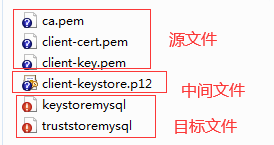

## 常用命令

```bash
# 切换数据库
use <database>;
# 显示当前库的所有表
show databases;
# 显示表中的字段
show columns from xxxx；
describe xxxx;
# 显示服务器状态信息
show status;
# 显示用户的安全权限
show grants;
```

NOT 子句支持对 IN 、BETWEEN、EXISTS、NULL、REGEXP取反。

LIKE子句中 % 通配符匹配一个或多个字符，但不能匹配 NULL，_ 通配符只匹配单个字符。

`select * from tables REGEXP 'xxxx'` 可使用正则表达式。


### 聚集函数


AVG() 会忽略值为 NULL 的行。

COUNT(*) 会统计所有行，COUNT(column) 会忽略 NULL 值。

MAX()、MIN()会忽略值为 NULL 的行。

AVG()、COUNT()、MAX()、MIN()、SUM() 都可使用 DISTINCT 关键字。

### GROUP BY子句

1. 可以包含任意数目的列，使分组可以嵌套。
2. 子句中列出的列必须是检索列或者有效的表达式，不能是聚集函数，如果在SELECT中使用表达式，则必须在GROUP
   BY子句中指定相同的表达式，不能使用别名。
3. 除聚集计算语句外，SELECT 语句中的每个列都必须在GROUP BY子句中给出。
4. 如果分组中具有NULL值，则NULL将作为一个分组返回。
5. 使用 GROUP BY columns WITH ROLLUP 可以得到每个分组以及每个分组汇总级别的值。
6. WHERE子句过滤分组前的行，HAVING子句过滤分组后的组。
7. 不要忘记使用ORDER BY，这是保证数据正确排序的唯一正确方法。

获取group by 以外的字段：

```sql
-- 方法一
SELECT id,
       name,
       yuwen,
       shuxue,
       english,
       physics,
       createTime
FROM lsq_test_table
WHERE id IN (SELECT MAX(id) FROM lsq_test_table where CLASS = "1" GROUP BY NAME, YUWEN)
-- 方法二
-- 会选择被分到同一组的数据里第一条数据的指定列值作为返回数据
SELECT ANY_VALUE(ID),
       ANY_VALUE(NAME),
       ANY_VALUE(YUWEN),
       ANY_VALUE(ENGLISH),
       ANY_VALUE(SHUXUE),
       ANY_VALUE(PHYSICS),
       ANY_VALUE(CREATETIME)
FROM lsq_test_table
where lsq_test_table.CLASS = "1"
GROUP BY NAME, YUWEN;
```

### CURD

```bash
 # 插入所有值
INSERT INTO <table> VALUES ( <value1>, <value2>, <value3>, <value4> );
# 插入部分值
INSERT INTO <table>( <column1>, <column3>) VALUES ( <value1>, <value3> );
# 查询并插入
INSERT INTO <table1>( <column1>, <column2>, <column3>, <column4> ) SELECT <column1>, <column2>, <column3>, <column4> FROM <table2>;
# 更新表
UPDATE <table> SET <column1> = <value1>, <column2> = <value2> WHERE <column3> = <value3>;
# 删除数据
DELETE FROM <table> where <column> = <value>;
# 创建表，Mysql会在数据目录内创建 .idb 文件 123123
CREATE TABLE <table>( <column1> <type1>, <column2> <type2>, <column3> <type3>, <column4> <type4>)ENGINE = InnoDB CHARACTER SET = utf8mb4;
# 修改表
ALTER TABLE <table> ADD <column> <type>;
ALTER TABLE <table> DROP COLUMN <column>;
# 删除表
DROP TABLE <table>;
# 删除表数据，一旦情况不能回滚,是 DDL 操作
TRUNCATE TABLE <table>;
# 重命名
RENAME TABLE <table1> TO <table2>;
```

### 视图

1. 视图的访问需要权限。
2. 视图可以嵌套。
3. ORDER BY可以用在视图中，如果查询该视图的SELECT中也含有ORDER BY，那么视图中的ORDER BY将会被覆盖。
4. 视图不能索引，也不能有关联的触发器和默认值。
5. 视图可以和表一起使用。

```bash
# 创建视图
CREATE VIEW <view> AS <select sql>;
# 查询创建视图的语句
SHOW CREATE VIEW <view>;
# 删除视图
DROP VIEW <view>;
# 更新视图
REPLACE VIEW <view> AS <select sql>;
```

### 储存过程

```bash
#创建储存过程,DELIMITER 的作用是临时更改;关键字为 //,防止 <sql> 解析错误。
DELIMITER $$
CREATE PROCEDURE <procedure>(OUT <varibale1> <type1>,IN <varibale2> <type2>,,INOUT <varibale3> <type3>)
BEGIN
# 例如 SELECT MAX(price) INTO var1 from table1;
   <sql>
END $$
DELIMITER ;


# 调用存储过程,形参需要以@开始
# 例如： CALL ordertotal(20005,@total); SELECT @total;
CALL <procedure>(@<var1>,@<var2>,@<var3>);
SELECT @<var1>;

#储存过程中定义变量
DECLARE <var> <type>;

# 储存过程中IF语句
IF <expression> THEN
   <sql>
ELSEIF <expression> THEN
   <sql>
ELSE
   <sql>
END IF;

# 删除储存过程
DROP PROCEDURE <procedure>;
```

### 游标

MYSQL 游标只能用于存储过程和函数。

```bash
# 定义游标
DECLARE <cursor> CURSOR FOR <sql>;
# 打开关闭游标
OPEN <cursor>;
CLOSE <cursor>;
# 使用游标数据
FETCH <cursor> INTO <var>;
# 循环
REPEAT
   <sql>
UNTIL <expression> END REPEAT;

WHILE <expression> DO
   <sql>
END WHILE;
```

### 用户管理

```bash
# 查询用户
USE mysql;
SELECT * from user;
# 创建用户,<ip> 例如 '10.148.%.%'，如果该值设置为 '%',用户可以从任意主机访问,如果该值不指定，将采用'%'.
CREATE USER <user>@<ip> IDENTIFIED WITH mysql_native_password BY <password>;
# 更新密码
SET PASSWORD FOR <user> = Password(<password>);
ALTER USER <user>@<ip> IDENTIFIED WITH mysql_native_password BY <password>;
# 重命名
RENAME USER <user1> TO <user2>;
# 删除用户
DROP USER <user>;
# 授权或撤销授权
GRANT <权限> ON <数据库或者表，例如 table.*> TO <user>@<ip>;
REVOKE <权限> ON <数据库或者表，例如 table.*> FROM <user>@<ip>;
# 刷新权限
flush privileges;

# 创建不限制ip访问的用户，并授予所有权限
CREATE USER <user>@<ip> IDENTIFIED WITH mysql_native_password BY <password>;
GRANT ALL privileges ON *.* TO <user>@<ip>;
flush privileges;
# 创建root用户远程连接
CREATE USER root@'%' IDENTIFIED WITH mysql_native_password BY '123456';
GRANT ALL privileges ON *.* TO root@'%' with grant option;
flush privileges;
```


### 数据库元数据

```bash
USE INFORMATION_SCHEMA;
SELECT * from TABLES;
SELECT * from COLUMNS;
SELECT * from FILES;
SELECT * from INNODB_TABLESPACES;
SELECT * from INNODB_TABLESTATS；
SELECT * from PROCESSLIST；
```

### CTE(Common Table Expression)

MYSQL8 以后使用：

```bash
# 非递归CTE，创建临时结果集，避免重复查询
# 如果不写 (<column1>,<column2>,<column3>),默认使用 <sql> 返回所有字段
WITH <cte>(<column1>,<column2>,<column3>) AS (
    <sql>
)
SELECT * FROM <cte>;

# 递归CTE，必须以 WITH RECURSIVE 开头，分为 seed 查询 和 recursive 查询，由 UNION [ALL] 或 UNION DISTINCT 分隔
# seed SELECT 被执行一次以创建初始数据子集; recursive SELECT被重复执行以返回数据的子集，直到获得完整的结果集，当迭代不会生成任何新行时，递归会停止
WITH RECURSIVE <cte>(<column1>,<column2>,<column3>) AS (
    # 创建 seed
    <sql>
    UNION [ALL|DISTINCT]
    # 引用 <cte> 产生递归，直到迭代不会产生新行
    SELECT <column1>,<column2>,<column3> FROM <cte> ......
)
SELECT * FROM <cte>;
```

### 虚拟列

虚拟列 INSERT 时不用包含，若包含，其值应该为 DEFAULT。


### 窗口函数


窗口函数是通过 OVER 和 WINDOW 子句来完成的。

使用方法：`<窗口函数> OVER(PARTITION BY <子句> ORDER BY <子句>) `，`WINDOW <window> AS (<子句>)`

子句有：

1. `PARTITION BY 子句`：窗口按照哪些字段进行分组，窗口函数在不同的分组上分别执行。
2. `ORDER BY子句`：按照哪些字段进行排序，窗口函数将按照排序后的记录顺序进行编号；
3. `FRAME子句`：`FRAME`是当前分区的一个子集，子句用来定义子集的规则，通常用来作滑动窗口使用。
4. `WINDOW子句`：用来指定别名，方便重复使用，放在 WHERE 条件后，例如：

```bash
mysql> SELECT
    -> RANK() OVER w AS rk,
    -> PERCENT_RANK() OVER w AS prk,
    -> stu_id, lesson_id, score
    -> FROM t_score
    -> WHERE stu_id = 1
    -> WINDOW w AS (PARTITION BY stu_id ORDER BY score)
    -> ;
```

```bash
# FRAME 子句,位于ORDER BY子句之后
# ROWS 使用行号进行取范围，RANGE使用当前行中 分组字段 的值来进行取返回，比如 分组字段为r1，当前行r1的值为9，行号为1，并且 between 1 preceding and 1 following,则取 r1的值 在 [9-1,9+1] 的行。
[ROWS|RANGE] BETWEEN <边界> AND <边界>
# 或 默认包含了当前行作为另一个边界
[ROWS|RANGE] <边界>

# <边界> 选项
CURRENT ROW  #当前行
UNBOUNDED PRECEDING #第一行
UNBOUNDED FOLLOWING #最后一行
<expr> PRECEDING #当前行之前几行
<expr> FOLLOWING #当前行之后几行
```

使用场景：

`ROW_NUMBER()`：查询每个学生分数最高的前3门课程。

`RANK()`：查询某一门课分数最高的前3名。

`DENSE_RANK()`：查询某一门课3个最高的分数。

`CUME_DIST()`：查询小于等于当前成绩的比例。

`LAG(column,n)`、`LEAD(column,n)`：查询前一个或者后一个同学成绩和当前同学成绩差值。

`FIRST_VALUE(column)`、`LAST_VALUE(column)`：查询最高成绩或者最低成绩、查询截止当前日期第一条数据或者最后一条数据。

`NTH_VALUE(column, n)`、`NTILE(n)`、`NTH_VALUE(column,n)`：显示每个同学成绩中排名第2或者第3的分数。

`NTILE(n)`：获取一定比例的数据。

### SQL执行顺序

1. FROM
2. ON
3. JOIN
4. WHERE
5. GROUP BY(开始使用select中的别名，后面的语句中都可以使用)
6. AVG,SUM....
7. HAVING
8. SELECT
9. DISTINCT
10. ORDER BY
11. LIMIT

### 分页查询

变量为 batchSize 、tableName

```sql
-- 通过UNION ALL来查出所有数据
SET @last_max_id=0;
SELECT max_id FROM (SELECT @last_max_id:=max(id) as max_id FROM (SELECT id FROM #{tableName} WHERE id > (SELECT @last_max_id) limit #{batchSize}) tmp) t1
UNION ALL
SELECT max_id FROM (SELECT @last_max_id:=max(id) as max_id FROM (SELECT id FROM #{tableName} WHERE id > (SELECT @last_max_id) limit #{batchSize}) tmp) t1
```

```sql
SELECT id
FROM (SELECT @rownum := ((@rownum + 1)% #{batchSize}) AS rownum, id
      FROM
          #{tableName} AS t1, (SELECT @rownum := 0 ) t2
      ORDER BY
          t1.id ASC) t3
where t3.rownum = 1
```

### Connector/J 参数

详情查看官方文档:

> https://dev.mysql.com/doc/connector-j/8.0/en/connector-j-reference-configuration-properties.html

#### Connection

* `connectionAttributes`: 使用`key:value`方式自定义连接属性，会保存在`PERFORMANCE_SCHEMA`
  库的`session_account_connect_attrs`和`session_connect_attrs`表，当设置为 `connectionAttributes=none`
  时，连接属性处理会被跳过，在连接创建至关重要的场景可以设置。
* `connectionLifecycleInterceptors`：连接拦截器，通过实现`com.mysql.cj.jdbc.interceptors.ConnectionLifecycleInterceptor`
  ，并使用逗号分割设置。
* `rollbackOnPooledClose`: 当池中的逻辑连接关闭时，是否回滚，默认为true。

#### Session

* `sessionVariables`：使用`key:value`方式设置 session
  参数,例如`sessionVariables=sql_mode='STRICT_TRANS_TABLES,NO_ZERO_IN_DATE,NO_ZERO_DATE,ERROR_FOR_DIVISION_BY_ZERO,NO_ENGINE_SUBSTITUTION'`。
* `characterEncoding`: 字符编码,可以使用 `UTF-8`。

#### Networking

* `connectTimeout`：建立连接超时，0表示没有超时时间
* `socketTimeout`：TCP连接发送数据后，等待响应的超时时间，0表示没有超时时间。
* `maxAllowedPacket`：发送到服务器的最大允许数据包大小，若未设置，使用系统变量"max_allowed_packet"，默认值65535。
* `tcpKeepAlive`：是否设置"SO_KEEPALIVE"，默认为是。
* `tcpNoDelay`：是否设置"SO_TCP_NODELAY"，默认为是。
* `tcpRcvBuf`：设置"SO_RCV_BUF"，默认值为0，表示使用平台默认值。
* `tcpSndBuf`：设置"SO_SND_BUF"，默认值为0，表示使用平台默认值。
* `useCompression`：是否开启压缩功能传输，默认关闭。

#### Security

* `serverRSAPublicKeyFile`：获取服务器公钥地址，如果使用`caching_sha2_password`
  插件，需要配置该参数或者`allowPublicKeyRetrieval=true`，否则会出现`Public Key Retrieval is not allowed`
  y异常，一般有三种情况会清除缓存（`服务重启；故障节点切换-MGR；flush privileges`
  ），例如`serverRSAPublicKeyFile=/data/public_key.pem`
* `allowPublicKeyRetrieval`：允许从服务器获取公钥。
* `sslMode`：是否使用SSL连接，用于替换'useSSL','requireSSL','verifyServerCertificate'三个属性,默认配置为 "PREFERRED"。


| sslMode         | useSSL | requireSSL | verifyServerCertificate | 说明                                                                     |
| --------------- | ------ | ---------- | ----------------------- | ------------------------------------------------------------------------ |
| disabled        | false  | false      | false                   | 不使用SSL连接                                                            |
| preferred       | true   | false      | false                   | 先使用SSL连接,失败的话改成普通连接                                       |
| required        | true   | true       | false                   | 先使用SSL连接,失败的话报错                                               |
| verify_ca       | true   | true       | true                    | 使用SSL连接,并且需要验证服务端的身份(就是客户端这边需要配置CA证书)       |
| verify_identity | true   | true       | true                    | 使用SSL连接,并且需要验证服务端的身份和域名(就是客户端这边需要配置CA证书) |

* `trustCertificateKeyStoreUrl`：服务端储存在本地的证书仓库地址，例如`trustCertificateKeyStoreUrl=classpath:mysql.ks`。
* `trustCertificateKeyStorePassword`：仓库密码，例如`trustCertificateKeyStorePassword=123456`。
* `clientCertificateKeyStoreUrl`：客户端证书仓库地址。
* `clientCertificateKeyStorePassword`：仓库密码。

  > keystore:  一个仓库,存储本地向CA机构申请的数字证书和本地的秘钥,也就是客户端的证书和私钥
  > truststore: 一个仓库,存储可信任的证书,也就是CA证书，也就是服务端的证书
  > CA证书中包含公钥

* `allowMultiQueries`：允许使用`;`在一个语句中分隔多个查询，不影响'addBatch()' 和 'executeBatch()'。

#### Statements

* `cacheDefaultTimeZone`：缓存客户端的默认时区，默认为 true。
* `continueBatchOnError` ：批量执行时一条命令失败后是否继续执行，默认为 true。
* `queryInterceptors` ：查询拦截器。

#### Datetime

* `connectionTimeZone` : 设置时区,例如`connectionTimeZone=Asia/Shanghai`。

#### HighAvailability

* `autoReconnect` : 如果启用，将会在死连接上查询抛出异常，但会在新事务中下一个查询之前尝试重新连接，不建议使用，默认值false。

#### Performance

* `cacheCallableStmts` : 是否开启储存过程调用缓存，默认为false。
* `callableStmtCacheSize` : 储存过程调用缓存数量，默认100。
* `useServerPrepStmts` : 服务端PreparedStatement，默认为false。
* `cachePrepStmts` ：是否开启客户端 PreparedStatement 缓存,默认为false。
* `prepStmtCacheSize` ： PreparedStatement 缓存数量，默认25，可设置250-500。
* `prepStmtCacheSqlLimit` : PreparedStatement 缓存单条SQL最大长度，默认256，可设置2048。
* `useCursorFetch` : 是否使用游标来获取结果，详情搜索 Orm 章节。
* `defaultFetchSize` : 与 `useCursorFetch` 配合使用。
* `rewriteBatchedStatements` : 是否重写PreparedStatement批量操作，'addBatch()' 和 'executeBatch()' 合并成一次IO操作，默认为false。

#### Debugging

* `logSlowQueries` : 驱动是否打印慢查询，默认为false。
* `slowQueryThresholdMillis` ： 慢查询的阀值，默认 2000。

需要配置：

```yaml
spring:
  datasource:
    hikari:
      data-source-properties:
        logger: com.mysql.cj.log.Slf4JLogger
# 或者在连接中添加 logger=Slf4JLogger
# spring.datasource.url = jdbc:mysql://1.2.3.4:3306/db?logger=Slf4JLogger
```

#### Exceptions

* `exceptionInterceptors` ： 异常拦截器，默认为false。
* `includeInnodbStatusInDeadlockExceptions` ： 监测到死锁时，异常信息中包含`SHOW ENGINE INNODB STATUS`的结果，默认为false。
* `includeThreadDumpInDeadlockExceptions` : 监测到死锁时，异常信息中包含 Java thread dump ，默认为false。

#### 配置SSL

1. 查看是否开启 `show variables like '%ssl%';`，显示 have_ssl = YES 。
2. 检查用户是否启动ssl认证 `select ssl_type from mysql.user where user='username' and host='%';` ，显示 ssl_type
   为空表示可用可不用，不为空则必须使用 ssl。
3. 强制用户使用ssl。

```sql
ALTER
USER 'username'@'%' REQUIRE SSL;
FLUSH
PRIVILEGES;
```

4. 生成客户端证书。

源文件：

目标文件：

生成truststore文件：

```shell
keytool -importcert -alias Cacert -file ca.pem  -keystore truststoremysql -storepass password123
```

生成keystore文件:

```shell
openssl pkcs12 -export -in client-cert.pem -inkey client-key.pem -name "mysqlclient" -passout pass:mypassword -out client-keystore.p12
keytool -importkeystore -srckeystore client-keystore.p12 -srcstoretype pkcs12 -srcstorepass mypassword -destkeystore keystoremysql -deststoretype JKS -deststorepass password456
```

5. 修改连接参数

```properties
ssl.cert.path=/home/app/cert
ssl.config=required&clientCertificateKeyStoreUrl=file:${ssl.cert.path}/keystoremysql&clientCertificateKeyStorePassword=password456&trustCertificateKeyStoreUrl=file:${ssl.cert.path}/truststoremysql&trustCertificateKeyStorePassword=password123 
spring.datasource.url=jdbc:mysql://1.2.3.4:3306/db?serverTimezone=Asia/Shanghai&useUnicode=true&characterEncoding=utf-8&sslMode={ssl.config}
```

### 批量插入

1. 设置 rewriteBatchedStatements=true。
2. 调整 max_allowed_packet。
3. 调整 innodb_buffer_pool_size，从而调整 Insert Buffer。
4. 使用事务可以提高数据的插入效率，因为MySQL内部会建立一个事务，在事务内才进行真正插入处理操作，但要避免超大事务，事务大于
   innodb_log_buffer_size 时会执行刷盘。

```sql
START TRANSACTION;
INSERT INTO `test`.`user`(`id`, `age`, `name`, `balance`, `create_time`, `deleted`)
VALUES (1, 18, '我我我我我我我我我我', 100.00, '2022-04-26 22:28:27', 0);
INSERT INTO `test`.`user`(`id`, `age`, `name`, `balance`, `create_time`, `deleted`)
VALUES (2, 17, 'IIIIIIIIII', 1000.00, '2022-04-26 22:29:03', 0);
INSERT INTO `test`.`user`(`id`, `age`, `name`, `balance`, `create_time`, `deleted`)
VALUES (3, 11, '😁😁😁😁😁😁😁😁😁😁', 1000000000.00, '2022-04-26 22:29:41', 0);
COMMIT;
```

5. 可使用 LOAD 命令，需要 GRANT FILE 权限，服务端需要添加 `local_infile = 1`，jdbc
   连接需要添加 `allowLoadLocalInfile=true`。

语法：

```sql
LOAD
DATA
    [LOW_PRIORITY | CONCURRENT] [LOCAL]
INFILE 'file_name'
    [REPLACE | IGNORE]
INTO TABLE tbl_name
    [PARTITION (partition_name [, partition_name] ...)]
    [CHARACTER SET charset_name]
    [{FIELDS | COLUMNS}
        [TERMINATED BY 'string']
        [[OPTIONALLY] ENCLOSED BY 'char']
        [ESCAPED BY 'char']
    ]
    [LINES
        [STARTING BY 'string']
        [TERMINATED BY 'string']
    ]
    [IGNORE number {LINES | ROWS}]
    [(col_name_or_user_var
        [, col_name_or_user_var] ...)]
    [SET col_name={expr | DEFAULT}
        [, col_name={expr | DEFAULT}] ...]
```

默认值：

```sql
-- LINES TERMINATED BY: 在 \n 处寻找行边界
-- FIELDS TERMINATED BY: 在 \t 处将行分进字段
-- ENCLOSED BY: 不要期望字段由任何引号字符封装
-- ESCAPED BY: 将由“\”开头的定位符、换行符或“\”解释成转义序列。例如 \t, \n, and \ 分别解释成 定位符，换行，反斜杠。
-- STARTING BY: 行前缀

FIELDS
TERMINATED BY '\t' ENCLOSED BY '' ESCAPED BY '\\'
LINES TERMINATED BY '\n' STARTING BY ''
```

实例：

1. 代码执行

有两种方式：

* 先将数据写入文件，然后填写 INFILE 后面的文件路径，并使用下面命令的方式执行。
* 不写入文件，直接写入到输入流，不填写INFILE 后面的文件路径，如下面代码所示。

````java
public class LoadDataTest {

    public void test() {
        InputStream in = getTestDataInputStream();
        try (PreparedStatement statement = connection.prepareStatement("下面的SQL")) {
            com.mysql.cj.jdbc.JdbcPreparedStatement jdbcPreparedStatement = statement.unwrap(com.mysql.cj.jdbc.JdbcPreparedStatement.class);

            jdbcPreparedStatement.setLocalInfileInputStream(dataStream);
            int result = mysqlStatement.executeUpdate();
            // MysqlErrorNumbers 可以匹配 SQLWarnings.getErrorCode()
            // SQLWarning.getNextWarning 可获取下一个异常
            SQLWarning sqlWarning = mysqlStatement.getWarnings();
        } catch (Exception e) {

        }
    }

    public InputStream getTestDataInputStream() {
        StringBuilder builder = new StringBuilder();
        for (int i = 1; i <= 10; i++) {
            for (int j = 0; j <= 10000; j++) {

                builder.append(4);
                builder.append("\t");
                builder.append(4 + 1);
                builder.append("\t");
                builder.append(4 + 2);
                builder.append("\t");
                builder.append(4 + 3);
                builder.append("\t");
                builder.append(4 + 4);
                builder.append("\t");
                builder.append(4 + 5);
                builder.append("\n");
            }
        }
        byte[] bytes = builder.toString().getBytes(StandardCharsets.UTF_8);
        InputStream is = new ByteArrayInputStream(bytes);
        return is;
    }

}
````

```sql
LOAD
DATA
    -- load允许查询操作
    CONCURRENT
    -- 在非服务端执行load data需要使用local 
    LOCAL
INFILE ''
    -- 唯一键冲突时替换还是忽略
    [REPLACE | IGNORE]
INTO TABLE 表名 CHARACTER SET UTF8 (字段一
，字段二
，字段三)
```

2. 命令执行

创建文件 data.txt, \\N 表示 null

```txt
6\tKEY01\tValue01\t2012-06-08 15:50:30\t2012-06-08 16:50:30\n
7\tKEY02\tValue02\t2012-06-08 15:50:30\t2012-06-08 16:50:30\n
8\tKEY03\tValue03\t2012-06-08 15:50:30\t2012-06-08 16:50:30\n
9\tKEY04\tValue04\t2012-06-08 15:50:30\t2012-06-08 16:50:30\n
10\tKEY05\tValue05\t2012-06-08 15:50:30\t2012-06-08 16:50:30\n
```

服务器本地执行：`LOAD DATA INFILE '/home/data.txt' INTO TABLE 表名;`

客户端远程执行：`LOAD DATA LOCAL INFILE '/home/data.txt' INTO TABLE 表名;`

### 批量查询

#### 游标查询

设置连接属性 `useCursorFetch` 为 true, 然后调用 `setFetchSize(int)` 来设置每次要获取的行数。

特点：

1. 服务端按照fetchSize的大小返回数据，假如数据有1亿数据，FetchSize设置成1000，会进行10万次来回通信。
2. MySQL需要建立一个临时空间来存放将要使用的数据，会导致服务端文件系统飙升，但是不会阻塞服务端连接。
3. 客户端发送SQL会等待长时间服务端准备数据，数据准备完成后，开始传输数据的阶段，网络响应、硬盘读取开始飙升。

```java
public class QueryTest {

    public void cursorTest() {
        Connection conn = DriverManager.getConnection("jdbc:mysql://localhost/?useCursorFetch=true", "user", "s3cr3t");
        Statement stmt = conn.createStatement();
        stmt.setFetchSize(100);
    }
}
```

#### 流式查询

设置 `forward-only`, `read-only` 以及将 `fetch size` 设置为 `Integer.MIN_VALUE`, 即表明让 MySQL 以流式传输结果集中的数据。

特点：

1. 建立长连接，占用一个连接，在ResultSet关闭前，不能做查询操作，否则会报错。
2. 从第一条数据开始一直往客户端发送数据，知道客户端缓存区被填满时阻塞，直到客户端缓存区有空间时继续发送。
3. JDBC一次从内核缓冲区读取读取一条数据。
4. 相比游标查询更快，但是更容易阻塞。

```java
public class QueryTest {

    public void streamTest() {
        try (PreparedStatement statement = connection.prepareStatement(sql, ResultSet.TYPE_FORWARD_ONLY, ResultSet.CONCUR_READ_ONLY)) {
            statement.setFetchSize(Integer.MIN_VALUE);
        } catch (Exception e) {

        }
    }
}
```

## 储存引擎

1. InnoDB：支持事务、行锁、支持外键、使用MVCC来获得高并发性、实现了事务的4中隔离级别。
2. MyISAM：不支持事务，但支持表锁、全文索引。
3. NDB：集群储存引擎，连接不在引擎层完成，在数据库层完成，需要网络开销大，查询速度慢。
4. Memory：数据存放在内存。
5. Archive：将数据行进行压缩后存储，只支持INSERT和SELECT操作，适合归档数据。
6. 其他储存引擎。

### InnoDB储存引擎

InnoDB储存引擎有多个内存块，它们组成一个大的内存池，并且有多个不同的后台线程，负责处理不同的任务。


#### 后台线程

1. MasterThread：主要负责将缓冲池中的数据异步刷新到磁盘，保证数据的一致性，具有最高线程优先级，主要有这几种功能：

   每秒一次：

   * 重做日志缓冲刷新到磁盘，即使这个事务还没提交(总是)。
   * 合并插入缓冲(前一秒发生的IO次数小于5次)。
   * 刷新缓冲池中的脏页到磁盘(当前缓冲池中脏页比例超过 innodb_max_dirty_pages_pct,默认 75%)，**现在由PageCleanerThread来执行**。

   每10秒一次：

   * 刷新 innodb_io_capacity 个脏页到磁盘(过去10秒内IO操作小于 innodb_io_capacity 次，默认200)，**现在由PageCleanerThread来执行**。
   * 合并至多 5% * innodb_io_capacity 个插入缓冲(总是)。
   * 重做日志缓冲刷新到磁盘(总是)。
   * 删除无用的undo页(总是)，**现在由PurgeThread来执行**。
   * 刷新 innodb_io_capacity 个(脏页超过70%)或者 10% * innodb_io_capacity个(脏页小于70%)脏页到磁盘(总是)，**现在由PageCleanerThread来执行**。
2. IOThread：分为write、read、insert buffer、log IO thread，负责IO请求的回调。
3. PurgeThread：事务提交后，其所使用的undolog可能不再需要，使用该线程来回收已经使用并分配的undo页。可以通过在配置文件`[mysqld]`模块添加innodb_purge_threads=1来启用，默认开启。
4. PageCleanerThread：将脏页的刷新操作都放到单独的线程来完成。

PurgeThread 和 PageCleanerThread 是后面加入的，分担 MasterThread 的部分工作。

#### 内存(缓冲池、重做日志缓冲)

1. 缓冲池：一块内存区域，InnoDB是基于磁盘存储，并将其中的记录按照页(默认16KB)的方式进行管理，由于CPU和磁盘速度差距较大，使用缓冲池来提高性能，通过 innodb_buffer_pool_size 来配置，包含索引页、数据页、undo页、插入缓冲（insert buffer）、自适应哈希索引、锁信息、数据字典信息，缓存池可以存在多个，每个页根据哈希值平均分配到不同缓冲池，减少资源竞争，可通过innodb_buffer_pool_instances 来配置，默认为1。

   当数据库进行读取页时，会将从磁盘读到的页放到缓存池中，称为页FIX在缓冲池，下次再读相同的页，首先判断页是否存在，若命中则直接读取，否则读取磁盘上的页。

   当对页中进行修改时，首先修改缓存池中的页，然后再以一定的频率采用 Checkpoint机制 刷新到磁盘上。

   缓冲池通过LRU(最近最少使用)来管理，使用最频繁的页放在LRU列表前端，最少使用的页放在尾端，优先释放尾端页。当新读取到的页会放在列表中部，默认位于5/8处，防止某次非热点查询，但是扫描很多页导致将热点数据移除，可用 innodb_old_blocks_pct 控制,默认37，即37%。

   可以通过 `SELECT * FROM information_schema.INNODB_BUFFER_POOL_STATS`来查看缓冲池的使用状态，Free buffers 是 Free 列表，Database pages是LRU列表。hit rate至缓冲池的命中率，若小于95%，需要观察是否由于全表扫描导致LRU列表被污染。

   在LRU列表中页被修改后被称为脏页(dirty page),即缓冲池中的页和磁盘上的页的数据产生了不一致。除了LRU列表，还有Flush列表，用来管理将页刷新回磁盘，该列表在写redolog时添加，脏页同时存在于LRU列表和FLUSH列表中，可通过 `SELECT TABLE_NAME,SPACE,PAGE_NUMBER,PAGE_TYPE FROM information_schema.INNODB_BUFFER_PAGE_LRU where OLDEST_MODIFICATION > 0;`来查询脏页信息，TABLE_NAME为NULL表示属于系统表空间。

   
2. 重做日志(redo log)缓冲：InnoDB会将redo log先放入这个缓冲区，然后再按一定的频率将其刷新到重做日志文件，一般情况会一秒刷新一次。该值可由innodb_log_buffer_size 控制，默认8MB，需要保证每秒内产生的事务量在这个缓冲大小内。

   重做日志是物理日志，记录了在某个数据页上做了什么修改，是为了解决内存存在脏页时，发生宕机导致数据丢失，使用 Write Ahead Log 策略，即先写重做日志，再修改页。

   重做日志缓冲刷新的时机：

   * Master Thread 每一秒刷新。
   * 每个事务提交时刷新。
   * 缓冲空间小于1/2时刷新。

##### LSN

有三个含义：

* 重做日志写入的总量，如当前重做日志LSN为1000，事务1写入100个字节，那么LSN变为1100。
* checkpoint的位置。
* 页的版本，表示该页最后刷新时的LSN的大小。

##### Checkpoint

在某些条件下将最早一部分或者全部脏页刷新(write+flush)到磁盘。

InnoDB使用LSN(log Sequence Number)
来标记版本，LSN是8字节的数字，LSN存在于页、redolog、Checkpoint中，页中的LSN记录该数据页最后被修改的日志序列位置，如果服务重启时页中的LSN小于redo
log的LSN说明数据页中缺失了一部分数据，MySQL将会使用redolog在该LSN的数据进行回放恢复，可使用 `SHOW ENGINE INNODB STATUS;`
来查看。


Checkpoint存在两种类型：

Sharp Checkpoint：发生在数据库关闭时将所有脏页刷新到磁盘。

Fuzzy Checkpoint：

1. MasterThread Checkpoint：MasterThread以每秒或每十秒的速度从缓冲池的脏页列表中刷新一定比例的页回磁盘，异步操作，不会阻塞用户查询线程。
2. FLUSH_LRU_LIST Checkpoint：InnoDB需要保证差不多有 innodb_lru_scan_depth 个空闲页可以使用，PageCleanerThread
   会对LRU列表空闲页数量进行检查，若不够，则会根据 LRU 算法将列表尾端的页移除，若被移除的页恰好是脏页，这时会强制执行
   Checkpoint。
3. Async/Sync Flush Checkpoint：由于重做日志是循环写入，需要等最早的redolog所对应的脏页被刷新到磁盘，最新写入的redolog才能将其覆盖，所以当重做日志写满时需要强制将一些页刷回磁盘。
   当 未刷回磁盘的redolog( redo_lsn - checkpoint_lsn ) 大于 redo总容量75%( 75% * total_redo_log_file_size ) 时，从 Flush
   列表中选取最早的脏页刷回磁盘，直到该值低于 75%。
   当 未刷回磁盘的redolog 大于 redo总容量90% 时，从 Flush 列表中选取最早的脏页刷回磁盘，直到该值低于 90%。
   操作在 PageCleanerThread 中进行，不会阻塞用户查询线程。
4. Dirty Page too much Checkpoint：当缓冲池中脏页数多于 innodb_max_dirty_pages_pct 比例时，会强制Checkpoint，刷新一部分脏页进磁盘。

##### 插入缓冲(insert buffer)

缓冲池的组成部分，默认最大可以占用一半的缓冲池。

对于非聚簇索引且索引不是 unique (因为检查unique需要先查询，查询时离散读取)
的时候，对索引进行插入或更新操作，不是每一次都直接插入索引页，而是先判断索引页是否在缓冲池，若在直接插入，否则放到insert
buffer中，然后再以一定的频率合并插入操作，这样使非聚集索引更新一个索引页时可以更新多个插入操作。

合并插入缓冲的时机：

1. 非聚簇索引页被读取到缓冲池。
2. 该非聚簇索引页无可用空间。
3. MasterThread每秒或每10秒的合并操作。

#### 关键特性

##### 双写(Double Write)

保证脏页要么是完整写入，要么是全部不写入，只要胀页是完整的就可以使用redolog进行恢复。

解决当在进行某个页的写入操作时宕机，比如页16kB，只写入4KB就宕机，由于redolog是对页的物理操作，所以没有办法通过redolog进行重做，需要先对该页进行还原再进行重做。

doublewrite由两部分组成，一部分是内存中的 doublewrite buffer 大小2MB，另一部分是物理磁盘上共享表空间中连续的128页，即2个区(extend),大小2MB。

在刷脏页时，会先将脏页复制到 doublewrite buffer，然后分两次，一次1MB写入共享表空间的物理磁盘，并立即使用fsync刷盘，再将脏页写到对应的表空间中。

当页写入崩溃时，InnoDB会从共享表空间的doublewrite中找到页的副本，将其复制到表空间文件，再应用重做日志。

##### 自适应哈希索引(Adaptive Hash Index)

实际生产环境中 B+
数的高度一般为3-4层，也就是查找一个数据需要进行3-4次，当满足一定情况下，InnoDB会对缓存冲池的B+树页的查询建立哈希索引，由于哈希查找的时间复杂度为O(
1)，因此可以缩短查询时间。

条件：

1. 连续访问的模式一样，也就是查询条件一样。
2. 以该模式访问了一定次数。

哈希索引只能用来搜索等值查询。

##### 异步IO

当前台线程提交IO请求后立即返回，由后台线程定期检查这些请求是否完成，如果完成通知前台线程处理，并且异步IO常常是一批一批的请求提交，如果不同请求访问的页是连续的，则将多个IO请求合并为1个IO请求。

可以通过 iostat 中 rrqm/s 和 wrqm/s 来观察合并次数。

##### 刷新邻接页

当刷新脏页时，会检测该页所在区的所有页，如果是脏页，一起进行刷新，这样可以通过 AIO 将多个IO写入操作合并为一个 IO 操作，可以通过
innodb_flush_neighbors 来控制，默认为0，关闭。

#### 启动、关闭、恢复相关配置

innodb_fast_shutdown：默认值为1。

* 0 表示数据库关闭时，InnoDB需要完成所有的 full purge 和 merge insert buffer，并将所有的脏页刷新回磁盘，如果进行InnoDB升级时，必须调为0。
* 1 表示不需要完成 full purge 和 merge insert buffer，但也会将所有的脏页刷新回磁盘。
* 2 表示不完成 full purge 和 merge insert buffer，也不会将所有的脏页刷新回磁盘，但将日志写入日志文件。下次启动时，会使用日志进行恢复操作。

在没有正常关闭数据库时，下次启动InnoDB会对表进行恢复操作，innodb_force_recovery 影响整个恢复状况，默认值为 0
，表示当发生需要恢复时，进行恢复操作，不能进行有效恢复时，写入错误日志。

#### INNODB STATUS 分析

通过 `SHOW ENGINE INNODB STATUS;`查看储存引擎状态。

##### BACKGROUND THREAD

```text
BACKGROUND THREAD
-----------------
srv_master_thread loops: 3911776 srv_active, 0 srv_shutdown, 309625 srv_idle
srv_master_thread log flush and writes: 4221384
```

srv_active 为每秒任务循环的次数，srv_idle
为每十秒任务循环的次数，低负载情况下 `刷盘次数(4221384) ≈ srv_active(3911776) + srv_idle(309625)`

并且 `srv_active : srv_idle ≈ 10 ：1`。

如果 srv_active 次数少，srv_idle 次数较多 证明负载较低，若 srv_active 次数较多，比例远大于 10:1 ，说明负载很高。

##### SEMAPHORES

当前等待线程数量，可以评估负载情况。

```text
----------
SEMAPHORES
----------
OS WAIT ARRAY INFO: reservation count 58961200
OS WAIT ARRAY INFO: signal count 125268732
RW-shared spins 0, rounds 115276716, OS waits 14655922
RW-excl spins 0, rounds 987115172, OS waits 12384598
RW-sx spins 40484350, rounds 419545112, OS waits 4476477
Spin rounds per wait: 115276716.00 RW-shared, 987115172.00 RW-excl, 10.36 RW-sx
```

reservation count：表示InnoDB产生了多少次OS WAIT，signal count：表示进入OS WAIT的线程被唤醒次数。

InnoDB试图获取一个被占用的锁时，会执行 spin wait ，也就是空转轮询，如果一直没有获取到锁才会进入到 os wait 。

以通过 `innodb_sync_spin_loops`参数来平衡spin wait和os wait。Mutex信息可通过 `show engine innodb mutex`查看。

##### LATEST DETECTED DEADLOCK

```text
------------------------
LATEST DETECTED DEADLOCK
------------------------
2021-08-18 14:04:16 0x7f29f2ef5700
*** (1) TRANSACTION:
TRANSACTION 14235673, ACTIVE 0 sec starting index read
mysql tables in use 3, locked 3
LOCK WAIT 3 lock struct(s), heap size 1136, 2 row lock(s), undo log entries 1
MySQL thread id 10089425, OS thread handle 139823504013056, query id 157595766 10.75.34.61 dbroot updating
update table1 set aaa='4',bbb='121',ccc='合格',ddd='0',eee='' where bd='6f174b50-8d32' and dw='1e0adeed-3f0d-450a' and tag =1
*** (1) WAITING FOR THIS LOCK TO BE GRANTED:
RECORD LOCKS space id 14096 page no 57 n bits 272 index bd_index of table `mydatabase`.`table1` trx id 14235673 lock_mode X locks rec but not gap waiting
Record lock, heap no 114 PHYSICAL RECORD: n_fields 2; compact format; info bits 0
0:len 30; hex 36663137346235302d386433322d343763362d613062622d633962333238; asc 6f174b50-8d32-47c6-a0bb-c9b328; (total 36 bytes);
1:len 30; hex 30636538343031652d653061662d343733362d623031372d626464623663; asc 0ce8401e-e0af-4736-b017-bddb6c; (total 36 bytes);
*** (2) TRANSACTION:
TRANSACTION 14235674, ACTIVE 0 sec fetching rows
mysql tables in use 3, locked 3
9 lock struct(s), heap size 1136, 6 row lock(s), undo log entries 2
MySQL thread id 10089424, OS thread handle 139818146158336, query id 157595768 10.75.34.61 dbroot updating
update table1 set aaa='10',bbb='12',ccc='合格',ddd='0',eee='' where bd='6f174b50-8d32' and dw='ffb27cdc-ba40-4e16' and tag =1
*** (2) HOLDS THE LOCK(S):
RECORD LOCKS space id 14096 page no 57 n bits 272 index bd_index of table `mydatabase`.`table1` trx id 14235674 lock_mode X locks rec but not gap
Record lock, heap no 114 PHYSICAL RECORD: n_fields 2; compact format; info bits 0
0:len 30; hex 36663137346235302d386433322d343763362d613062622d633962333238; asc 6f174b50-8d32-47c6-a0bb-c9b328; (total 36 bytes);
1:len 30; hex 30636538343031652d653061662d343733362d623031372d626464623663; asc 0ce8401e-e0af-4736-b017-bddb6c; (total 36 bytes);
*** (2) WAITING FOR THIS LOCK TO BE GRANTED:
RECORD LOCKS space id 14096 page no 57 n bits 272 index bd_index of table `mydatabase`.`table1` trx id 14235674 lock_mode X locks rec but not gap waiting
Record lock, heap no 105 PHYSICAL RECORD: n_fields 2; compact format; info bits 0
0:len 30; hex 36663137346235302d386433322d343763362d613062622d633962333238; asc 6f174b50-8d32-47c6-a0bb-c9b328; (total 36 bytes);
1:len 30; hex 66396262333533362d356137342d343633352d386335632d323666356537; asc f9bb3536-5a74-4635-8c5c-26f5e7; (total 36 bytes);
*** WE ROLL BACK TRANSACTION (1)
```

> RANSACTION 14235673, ACTIVE 0 sec starting index read

事务14235673，ACTIVE 0 sec表示事务处于活跃状态0s，starting index read表示正在使用索引读取数据行

> mysql tables in use 3, locked 3

事务1正在使用3个表，且涉及锁的表有3个

> LOCK WAIT 3 lock struct(s), heap size 1136, 2 row lock(s), undo log entries 1

这行表示在等待3把锁，占用内存1136字节，涉及2行记录，事务已经锁定了几行数据。

> MySQL thread id 10089425, OS thread handle 139823504013056, query id 157595766 10.75.34.61 dbroot updating

该事务的线程ID信息，操作系统句柄信息，连接来源、用户等

> update table1 set aaa='4',bbb='121',ccc='合格',ddd='0',eee='' where bd='6f174b50-8d32' and dw='1e0adeed-3f0d-450a' and
> tag =1

正在等待行锁的sql

> (1) WAITING FOR THIS LOCK TO BE GRANTED:
> (2) HOLDS THE LOCK(S):

正在等待的锁、目前保持的锁

> RECORD LOCKS space id 14096 page no 57 n bits 272 index bd_index of table `mydatabase`.`table1` trx id 14235673
> lock_mode X locks rec but not gap waiting

等待的锁是一个record lock，空间id是14096，页编号为57，大概位置在页的272位处，锁发生在表mydatabase.table1的bd_index
索引上，是一个X锁，但是不是gap lock。 waiting表示正在等待锁

> Record lock, heap no 114 PHYSICAL RECORD: n_fields 2; compact format; info bits 0

这行表示record lock的heap no 位置（可以用来对照事务2控制住的锁）

> WE ROLL BACK TRANSACTION (1)

回滚了事务1

锁的类型：

* 记录锁（LOCK_REC_NOT_GAP）: `lock_mode X locks rec but not gap`
* 间隙锁（LOCK_GAP）: `lock_mode X locks gap before rec`
* Next-key 锁（LOCK_ORNIDARY）: `lock_mode X`
* 插入意向锁（LOCK_INSERT_INTENTION）: `lock_mode X locks gap before rec insert intention`

另外 如果在 supremum record 上加锁，`locks gap before rec` 会省略掉，间隙锁会显示成 `lock_mode X`，例如

> RECORD LOCKS space id 0 page no 307 n bits 72 index PRIMARY of table test.test trx id 50F lock_mode X
> Record lock, heap no 1 PHYSICAL RECORD: n_fields 1; compact format; info bits 0

其中 heap no 1 表示这个记录是 supremum record

##### FILE I/O

```text
FILE I/O
--------
I/O thread 0 state: waiting for completed aio requests (insert buffer thread)
I/O thread 1 state: waiting for completed aio requests (log thread)
I/O thread 2 state: waiting for completed aio requests (read thread)
I/O thread 3 state: waiting for completed aio requests (read thread)
I/O thread 4 state: waiting for completed aio requests (read thread)
I/O thread 5 state: waiting for completed aio requests (read thread)
I/O thread 6 state: waiting for completed aio requests (write thread)
I/O thread 7 state: waiting for completed aio requests (write thread)
I/O thread 8 state: waiting for completed aio requests (write thread)
I/O thread 9 state: waiting for completed aio requests (write thread)
Pending normal aio reads: [0, 0, 0, 0] , aio writes: [0, 0, 0, 0] ,
ibuf aio reads:, log i/o's:
Pending flushes (fsync) log: 0; buffer pool: 18446744073709551573
6118141 OS file reads, 10992469 OS file writes, 5299662 OS fsyncs
0.00 reads/s, 0 avg bytes/read, 3.82 writes/s, 3.07 fsyncs/s
```

Pending 待处理的 io 和 fsync 。

OS file 显示调用系统 read、write、fsync 的次数。

##### INSERT BUFFER AND ADAPTIVE HASH INDEX

```text
-------------------------------------
INSERT BUFFER AND ADAPTIVE HASH INDEX
-------------------------------------
Ibuf:size 1, free list len 749, seg size 751, 5362 merges
merged operations:
insert 47106, delete mark 1409119, delete 138703
discarded operations:
insert 0, delete mark 0, delete 0
Hash table size 34679, node heap has 2 buffer(s)
Hash table size 34679, node heap has 5 buffer(s)
Hash table size 34679, node heap has 17 buffer(s)
Hash table size 34679, node heap has 2 buffer(s)
Hash table size 34679, node heap has 1 buffer(s)
Hash table size 34679, node heap has 2 buffer(s)
Hash table size 34679, node heap has 68 buffer(s)
Hash table size 34679, node heap has 34 buffer(s)
9.18 hash searches/s, 87.71 non-hash searches/s
```

Ibuf 合并页数量，free list 空闲列表长度，seg size 为insert buffer大小，merge 合并次数。

merged operations：Change Buffer中每个操作次数，insert代表Insert Buffer，delete mark代表Delete Buffer，delete代表Purge
Buffer。

discarded operations：Change Buffer中无需合并的次数。

hash searches/s：通过hash索引查询，即反复的等值查询。

non-hash searches/s：不能通过hash索引查询

##### LOG

```text
---
LOG
---
Log sequence number          13793197307
Log buffer assigned up to    13793197307
Log buffer completed up to   13793197307
Log written up to            13793197307
Log flushed up to            13793197307
Added dirty pages up to      13793197307
Pages flushed up to          13793195904
Last checkpoint at           13793195904
Log minimum file id is       4194
Log maximum file id is       4211
7769907 log i/o's done, 1.11 log i/o's/second
```

Log sequence number：最新产生的日志序列号

Log flushed up to：已刷到磁盘的重做日志的日志号

Pages flushed up to：已刷到磁盘的页的日志号

Last checkpoint at: 最后一次检查点位置，数据和日志一致的状态

##### BUFFER POOL AND MEMORY

```text
----------------------
BUFFER POOL AND MEMORY
----------------------
Total large memory allocated 0
Dictionary memory allocated 4614936
Buffer pool size   8192
Free buffers       1024
Database pages     7037
Old database pages 2577
Modified db pages  0
Pending reads      0
Pending writes: LRU 0, flush list 0, single page 0
Pages made young 2525811, not young 85650354
0.07 youngs/s, 0.00 non-youngs/s
Pages read 6118237, created 283123, written 2468006
0.00 reads/s, 0.00 creates/s, 1.82 writes/s
Buffer pool hit rate 1000 / 1000, young-making rate 0 / 1000 not 0 / 1000
Pages read ahead 0.00/s, evicted without access 0.00/s, Random read ahead 0.00/s
LRU len: 7037, unzip_LRU len: 0
I/O sum[69]:cur[8], unzip sum[0]:cur[0]
```

Total large memory：innodb 分配的总内存（字节）。

Dictionary memory allocated：innodb数据字典 分配的总内存（字节）。

Buffer pool size：buffer pool 总页数。

Free buffers：空闲页数。

Database pages：非空闲页数。

Old database pages：LRU列表中后 3/8 的列表，新读取的页会插入到 5/8 处。

Modified db pages：脏页数量。

Pending reads：挂起读的数量。

Pages made young：显示LRU列表中old list移到new list的次数，not young：显示仍在old list的次数。

Pages read,created,written：表示innodb被读取，创建，写入多少页及每秒的次数。

Buffer pool hit rate：表示缓冲池命中率，如果低于95%需要具体排查。

Pages read ahead：预读每秒页数，Random read ahead 随机预读的每秒页数。

##### ROW OPERATIONS

```text
--------------
ROW OPERATIONS
--------------
0 queries inside InnoDB, 0 queries in queue
0 read views open inside InnoDB
Process ID=444943, Main thread ID=139899621590784, state: sleeping
Number of rows inserted 172887566, updated 227534242, deleted 56676133, read 709667077
8.77 inserts/s, 8.04 updates/s, 0.00 deletes/s, 10.92 reads/s
```

queries：表示innodb内核中有多少个线程，队列中有多少个线程。

read views open inside InnoDB：表示有多少个read view 被打开，一个read view 包含事物开始点数据库内容的MVCC快照。

Number of rows inserted、updated、deleted、read：表示多少行被插入，更新和删除，读取及每秒信息，可用于监控。

#### 系统参数

[msql配置](./assets/msql-config.xlsx)

```properties
[ mysqld ]
# Mysql服务的唯一编号,每个mysql服务Id需唯一,在主从同步时来标记服务的唯一身份
server-id = 1
# 服务端口号 默认3306
port = 3306
# ip绑定,0.0.0.0标识允许所有的远程访问,127.0.0.1只能本地访问,固定ip则只能接受改ip的远程访问。
bind_address= 0.0.0.0

# 启动mysql服务进程的用户
user = mysql
# mysql安装根目录
basedir = /usr/local/mysql-8.0.31
# mysql数据文件所在位置
datadir = /usr/local/mysql-8.0.31/data
# 设置socket文件地址，或者使用 mysqlx_socket，sock 文件需要有权限访问，否则会报错。
# 连接示例：mysql -uroot -S/tmp/mysql/mysql.sock -P33060
socket_port  = 33060
socket  = /tmp/mysql/mysql.sock
# 临时目录 比如load data infile会用到,一般都是使用/tmp
tmpdir  = /tmp/mysql

# 事务的隔离级别,默认REPEATABLE-READ,（此级别下可能产生很多间隙锁，影响性能，但是修改又影响主从复制及灾难恢复，建议不要修改配置，修复代码）
# 读未提交(READ-UNCOMMITTED),读已提交(READ-COMMITTED)
# 可重复读(REPEATABLE-READ),序列化(SERIALIZABLE)
# transaction_isolation = READ-COMMITTED
transaction_isolation = REPEATABLE-READ

# 默认引擎
default_storage_engine = InnoDB
# 内存临时表默认引擎，默认InnoDB
default_tmp_storage_engine = InnoDB
# 磁盘临时表默认引擎，默认InnoDB
internal_tmp_disk_storage_engine = InnoDB

# 设置服务端默认的字符集
character-set-server = utf8mb4
# ci和cs的区别,就是大小写敏感和不敏感 ci是case ignore，cs是case senstive
collation_server = utf8mb4_general_ci
# 设置client连接时执行，可用于审计，这里用来设置连接的编码
# init_connect='SET NAMES utf8mb4'
# 是否对sql语句大小写敏感，默认值为0，1表示不敏感
lower_case_table_names = 1

# 最大连接数,默认值为151,上限值是16384，实际连接数是最大连接数的85%较为合适,修改此参数需要同步修改 /usr/lib/systemd/system/mysqld.service 中 LimitNOFILE=65535
max_connections = 800
# 最大错误连接数，阻止过多尝试失败的客户端以防止暴力破解密码
# 默认值100，最大错误连接数，如果有超出该参数值个数的中断错误连接，则该主机将被禁止连接。如需对该主机进行解禁，执行：FLUSH HOSTS
max_connect_errors = 100
# MySQL打开的文件描述符限制，默认最小1024;
# 当open_files_limit没有被配置的时候，比较max_connections*5和ulimit -n的值，哪个大用哪个，
# 当open_file_limit被配置的时候，比较open_files_limit和max_connections*5的值，哪个大用哪个。
# open_files_limit = 65535

# MySQL默认的wait_timeout  值为8个小时, interactive_timeout参数需要同时配置才能生效
# MySQL连接闲置超过一定时间后(单位：秒，此处为1800秒)将会被强行关闭
# interactive_timeout = 1800 
# wait_timeout = 1800

# 在MySQL暂时停止响应新请求之前的短时间内多少个请求可以被存在堆栈中 
# 官方建议back_log = 50 + (max_connections / 5),封顶数为900
# back_log = 900

# 该参数限制服务器端，接受的数据包大小，如果有BLOB子段，建议增大此值，避免写入或者更新出错。有BLOB子段，建议改为1024M
max_allowed_packet = 128M

# 内存临时表的最大值,默认16M,不适用于MEMORY引擎表，用户级别，超限MySQL会自动地把它转化为基于磁盘的表，存储在指定的tmpdir目录下，增大IO压力，建议内存大，增大到128M
# 通过 show global status like '%tmp%'; 查看临时表使用情况，一般 created_tmp_disk_tables / created_tmp_tables ≈ 10%
tmp_table_size = 64M
# 限制MEMORY引擎表
max_heap_table_size = 64M

# 查询缓存功能的开启的关闭，0时表示关闭，1时表示打开，2表示只要select 中明确指定SQL_CACHE才缓存。
# 可通过 SHOW STATUS LIKE '%have_query_cache%' 查看。
query_cache_type = 0
# 默认值1M，优点是查询缓冲可以极大的提高服务器速度, 如果你有大量的相同的查询并且很少修改表。
# 缺点：在你表经常变化的情况下或者如果你的查询原文每次都不同,查询缓冲也许引起性能下降而不是性能提升。
# query_cache_size = 64M
# 只有小于此设定值的结果才会被缓冲，保护查询缓冲,防止一个极大的结果集将其他所有的查询结果都覆盖。
# query_cache_limit = 2M
# 每个被缓存的结果集要占用的最小内存,默认值4kb，一般不怎么调整。
# 如果Qcache_free_blocks值过大，可能是query_cache_min_res_unit值过大，应该调小些
# query_cache_min_res_unit的估计值：(query_cache_size - Qcache_free_memory) / Qcache_queries_in_cache
# query_cache_min_res_unit = 4kb
# 在一个事务中binlog为了记录SQL状态所持有的cache大小
# 如果你经常使用大的,多声明的事务,你可以增加此值来获取更大的性能.
# 所有从事务来的状态都将被缓冲在binlog缓冲中然后在提交后一次性写入到binlog中
# 如果事务比此值大, 会使用磁盘上的临时文件来替代.
# 此缓冲在每个连接的事务第一次更新状态时被创建
# binlog_cache_size = 1M

# MySQL的随机读缓冲区大小，适当增大，可以提高性能。
# 默认值256kb；建议值：得参考连接数，16G内存，有人推荐8M
# 注意，该缓冲区是每个连接独占的, 所以总缓冲区大小为 read_rnd_buffer_size*连接数, 极端情况 read_rnd_buffer_size*maxconnectiosns 会超级大, 所以要考虑日常平均连接数。
read_rnd_buffer_size = 1M

# order by或group by时用到 
# 支持所有引擎，innodb和myisam有自己的innodb_sort_buffer_size和myisam_sort_buffer_size设置
# 默认值256kb；建议值：得参考连接数，16G内存，有人推荐8M.
# 注意，该缓冲区是每个连接独占的, 所以总缓冲区大小为 1M*连接数, 极端情况1M*maxconnectiosns, 会超级大, 所以要考虑日常平均连接数。
sort_buffer_size = 1M

# 此缓冲被使用来优化全联合(full JOINs 不带索引的联合)
# 类似的联合在极大多数情况下有非常糟糕的性能表现,但是将此值设大能够减轻性能影响.
# 通过 SHOW GLOBAL STATUS LIKE '%full_join%'；  状态变量查看全联合的数量
# 注意，该缓冲区是每个连接独占的，所以总缓冲区大小为 1M*连接数, 极端情况1M*maxconnectiosns, 会超级大, 所以要考虑日常平均连接数。
# 默认值256kb;建议值：16G内存，设置8M.
join_buffer_size = 1M

# 缓存linux文件描述符信息，加快数据文件打开速度
# 它影响myisam表的打开关闭，但是不影响innodb表的打开关闭。
# 默认值2000，建议值：根据状态变量Opened_tables去设定
# table_open_cache = 2000

# 缓存表定义的相关信息，加快读取表信息速度
# 默认值1400，最大值2000，建议值：基本不改。
# table_definition_cache = 1400
# 该参数是myssql 5.6后引入的，目的是提高并发。
# 默认值1，建议值：cpu核数，并且<=16
table_open_cache_instances = 2

# 当客户端断开之后，服务器处理此客户的线程将会缓存起来以响应下一个客户而不是销毁。可重用，减小了系统开销。
# 默认值为9，建议值：两种取值方式
# 方式一，根据物理内存，1G  —> 8；2G  —> 16； 3G  —> 32； 大于3G  —> 64；
# 方式二，根据show status like  'threads%'，查看Threads_connected值。
thread_cache_size = 16

# 默认值256k,建议值：16/32G内存，512kb，其他一般不改变，如果报错：Thread stack overrun，就增大看看,
# 注意，每个线程分配内存空间，所以总内存空间。。。你懂得。
thread_stack = 512k

# 普通查询日志，默认值off，不开启
general_log = 0
# 普通查询日志存放地址
general_log_file = /usr/local/mysql-8.0.31/log/mysql-general.log

# 全局动态变量，默认3，范围：1～3
# 表示错误日志记录的信息，1：只记录error信息；2：记录error和warnings信息；3：记录error、warnings和普通的notes信息。
log_error_verbosity = 2
# 错误日志文件地址
log_error = /usr/local/mysql-8.0.31/log/mysql-error.log

# 开启慢查询
slow_query_log = 1
# 开启慢查询时间，此处为1秒，达到此值才记录数据
long_query_time = 1
# 检索行数达到此数值，才记录慢查询日志中
min_examined_row_limit = 100
# 用来表示每分钟允许记录到slow log的且未使用索引的SQL语句次数，默认值为0，不限制。
log_throttle_queries_not_using_indexes = 0
# 慢查询日志文件地址
slow_query_log_file = /usr/local/mysql-8.0.31/log/mysql-slow.log
# 开启记录没有使用索引查询语句
log-queries-not-using-indexes = 1

# 开启二进制日志
log_bin = /usr/local/mysql-8.0.31/log/mysql-bin.log
# mysql清除过期日志的时间，默认值0，不自动清理，而是使用滚动循环的方式。
expire_logs_days = 0
# 如果二进制日志写入的内容超出给定值，日志就会发生滚动。你不能将该变量设置为大于1GB或小于4096字节。 默认值是1GB。
max_binlog_size = 1000M
# binlog的格式也有三种：STATEMENT，ROW，MIXED。mysql 5.7.7后，默认值从 MIXED 改为 ROW
binlog_format = row
# 默认值N=1，使binlog在每N次binlog写入后与硬盘同步，ps：1最慢
# sync_binlog = 1

# 在一个独立使用的数据库服务器上,你可以设置这个变量到服务器物理内存大小的60%-80%
# 注意别设置的过大，会导致system的swap空间被占用，导致操作系统变慢，从而减低sql查询的效率
# 默认值：128M，建议值：物理内存的60%-80%
innodb_buffer_pool_size = 512M
# 只有当设置 innodb_buffer_pool_size 值大于1G时才有意义，小于1G，instances默认为1，大于1G，instances默认为8
# 但是网络上有评价，最佳性能，每个实例至少1G大小。
# 默认值：1或8，建议值：innodb_buffer_pool_size/innodb_buffer_pool_instances >= 1G
innodb_buffer_pool_instances = 1
# defines the chunk size for online InnoDB buffer pool resizing operations.
# 实际缓冲区大小必须为 innodb_buffer_pool_chunk_size*innodb_buffer_pool_instances*倍数，取略大于innodb_buffer_pool_size
# 默认值128M，建议值：默认值就好，乱改反而容易出问题，它会影响实际buffer pool大小。
# innodb_buffer_pool_chunk_size = 128M
# 该参数可以提升扩展性和刷脏页性能。
# 默认值1，建议值：4-8；并且必须小于innodb_buffer_pool_instances
# innodb_page_cleaners = 4
# 一般在8k和16k中选择，8k的话，cpu消耗小些，selcet效率高一点，一般不用改
# 默认值：16k；建议值：不改，
# innodb_page_size = 16384
# 影响Innodb缓冲区的刷新算法，建议从小到大配置，直到zero free pages；innodb_lru_scan_depth * innodb_buffer_pool_instances defines the amount of work performed by the page cleaner thread each second.
# 默认值1024，建议值: 未知
# innodb_lru_scan_depth = 1024
# 事务等待获取资源等待的最长时间，单位为秒，看具体业务情况，一般默认值就好
# 默认值：50，建议值：看业务。
# innodb_lock_wait_timeout = 60
# Mysql后台任务（例如页刷新和merge dadta from buffer pool）每秒io操作的上限。
# 默认值：200，建议值：方法一，单盘sata设100，sas10，raid10设200，ssd设2000，fushion-io设50000；方法二，通过测试工具获得磁盘io性能后，设置IOPS数值/2。
# innodb_io_capacity = 2000
# 说明：该参数是所有缓冲区线程io操作的总上限。
# 默认值：innodb_io_capacity的两倍。建议值：例如用iometer测试后的iops数值就好
# innodb_io_capacity_max = 4000
# 控制着innodb数据文件及redo log的打开、刷写模式，三种模式：fdatasync(默认)，O_DSYNC，O_DIRECT
# fdatasync：数据文件，buffer pool->os buffer->磁盘；日志文件，buffer pool->os buffer->磁盘；
# O_DSYNC：  数据文件，buffer pool->os buffer->磁盘；日志文件，buffer pool->磁盘；
# O_DIRECT： 数据文件，buffer pool->磁盘；           日志文件，buffer pool->os buffer->磁盘；
# 默认值为空，建议值：使用SAN或者raid，建议用O_DIRECT，不懂测试的话，默认生产上使用O_DIRECT
innodb_flush_method = O_DIRECT
# 每张表一个独立表空间。
# 默认值1，开启
# innodb_file_per_table = 1

# The path where InnoDB creates undo tablespaces.通常等于undo log文件的存放目录。
# 默认值./;自行设置
innodb_undo_directory = /usr/local/mysql-8.0.31/log
# 在线收缩undo log使用的空间。
# 默认值：关闭，建议值：开启
innodb_undo_log_truncate = 1
# 结合innodb_undo_log_truncate，实现undo空间收缩功能
# 默认值：1G，建议值，不改。
# innodb_max_undo_log_size = 1G

# 重作日志文件的存放目录
innodb_log_group_home_dir = /usr/local/mysql-8.0.31/log
# 日志文件的大小
# 默认值:48M,建议值：根据你系统的磁盘空间和日志增长情况调整大小
innodb_log_file_size = 128M
# 日志组中的文件数量，mysql以循环方式写入日志
# 默认值2，建议值：根据你系统的磁盘空间和日志增长情况调整大小
innodb_log_files_in_group = 3
# 此参数确定些日志文件所用的内存大小，以M为单位。缓冲区更大能提高性能，但意外的故障将会丢失数据。MySQL开发人员建议设置为1－8M之间
innodb_log_buffer_size = 16M

# 控制log从系统buffer刷入磁盘文件的刷新频率，增大可减轻系统负荷
# 默认值是1；建议值不改。系统性能一般够用。
# innodb_flush_log_at_timeout = 1
# 参数可设为0，1，2；
# 参数0：表示每秒将log buffer内容刷新到系统buffer中，再调用系统flush操作写入磁盘文件。
# 参数1：表示每次事物提交，将log buffer内容刷新到系统buffer中，再调用系统flush操作写入磁盘文件。
# 参数2：表示每次事物提交，将log buffer内容刷新到系统buffer中，隔1秒后再调用系统flush操作写入磁盘文件。
innodb_flush_log_at_trx_commit = 1

# 限制Innodb能打开的表的数据，如果库里的表特别多的情况，请增加这个。
# 值默认是2000，建议值：参考数据库表总数再进行调整，一般够用不用调整。
# innodb_open_files = 8192

# innodb处理io读写的后台并发线程数量，根据cpu核来确认，取值范围：1-64
# 默认值：4，建议值：与逻辑cpu数量的一半保持一致。
# innodb_read_io_threads = 4
# innodb_write_io_threads = 4
# 默认设置为 0,表示不限制并发数，这里推荐设置为0，更好去发挥CPU多核处理能力，提高并发量
# innodb_thread_concurrency = 0
# 默认值为4，建议不变。InnoDB中的清除操作是一类定期回收无用数据的操作。mysql 5.5之后，支持多线程清除操作。
# innodb_purge_threads = 4 

# mysql缓冲区分为new blocks和old blocks；此参数表示old blocks占比；
# 默认值：37，建议值，一般不动
# innodb_old_blocks_pct = 37
# 新数据被载入缓冲池，进入old pages链区，当1秒后再次访问，则提升进入new pages链区。
# 默认值：1000
# innodb_old_blocks_time=1000
# 开启异步io，可以提高并发性，默认开启。
# 默认值为1，建议不动
# innodb_use_native_aio = 1

# 默认为空，使用data目录，一般不改。
# innodb_data_home_dir=/usr/local/mysql-5.7.21/data
# 说明：Defines the name, size, and attributes of InnoDB system tablespace data files.
# 默认值，不指定，默认为ibdata1:12M:autoextend
# innodb_data_file_path = ibdata1:12M:autoextend

# 设置InnoDB存储引擎用来存放数据字典信息以及一些内部数据结构的内存空间大小,除非你的数据对象及其多，否则一般默认不改。
# innodb_additional_mem_pool_size = 16M

# The crash recovery mode。只有紧急情况需要恢复数据的时候，才改为大于1-6之间数值，含义查下官网。
# 默认值为0；
# innodb_force_recovery = 0


# 在启动时把热数据加载到内存。默认值为on，不修改
# innodb_buffer_pool_load_at_startup = 1
# 在关闭时把热数据dump到本地磁盘。默认值为on，不修改
# innodb_buffer_pool_dump_at_shutdown = 1
```

#### 参考配置

16核、256G内存、3T硬盘

```text
[client]
user=root
password=1111aaA_
[mysql]
prompt=[\\u@\\p][\\d]>\\_
no-auto-rehash
[mysqld_safe]
malloc-lib=tcmalloc
[mysqldump]
single-transaction
[mysqld]
# basic settings #
user=mysql
sql_mode="STRICT_TRANS_TABLES,NO_ENGINE_SUBSTITUTION,NO_ZERO_DATE,NO_ZERO_IN_DATE,ERROR_FOR_DIVISION_BY_ZERO,NO_AUTO_CREATE_USER"
autocommit=1
server-id=8888
character_set_server=utf8mb4
datadir=/mysql_data/data
transaction_isolation=READ-COMMITTED
explicit_defaults_for_timestamp=1
max_allowed_packet=64M
event_scheduler=1
# connection #
interactive_timeout=1800
wait_timeout=1800
lock_wait_timeout=1800
skip_name_resolve=1
max_connections=1024
max_user_connections=256
max_connect_errors=1000000
# table cache performance settings
table_open_cache=4096
table_definition_cache=4096
table_open_cache_instances=64
# session memory settings #
read_buffer_size=16M
read_rnd_buffer_size=32M
sort_buffer_size=32M
tmp_table_size=64M
join_buffer_size=128M
thread_cache_size=64
# log settings #
log_error=error.log
log_bin=binlog
log_error_verbosity=2
general_log_file=general.log
slow_query_log=1
slow_query_log_file=slow.log
log_queries_not_using_indexes=1
log_slow_admin_statements=1
log_slow_slave_statements=1
log_throttle_queries_not_using_indexes=10
expire_logs_days=90
long_query_time=2
min_examined_row_limit=100
log-bin-trust-function-creators=1
log-slave-updates=1
# innodb settings #
innodb_page_size=16384
innodb_buffer_pool_size=160G
innodb_buffer_pool_instances=16
innodb_buffer_pool_load_at_startup=1
innodb_buffer_pool_dump_at_shutdown=1
innodb_lru_scan_depth=4096
innodb_lock_wait_timeout=5
innodb_io_capacity=10000
innodb_io_capacity_max=20000
innodb_flush_method=O_DIRECT
innodb_undo_logs=128
innodb_undo_tablespaces=3
innodb_flush_neighbors=0
innodb_log_file_size=16G
innodb_log_files_in_group=2
innodb_log_buffer_size=64M
innodb_purge_threads=4
innodb_large_prefix=1
innodb_thread_concurrency=32
innodb_print_all_deadlocks=1
innodb_strict_mode=1
innodb_sort_buffer_size=64M
innodb_write_io_threads=16
innodb_read_io_threads=16
innodb_file_per_table=1
innodb_stats_persistent_sample_pages=64
innodb_autoinc_lock_mode=2
innodb_online_alter_log_max_size=1G
innodb_open_files=4096
# replication settings #
master_info_repository=TABLE
relay_log_info_repository=TABLE
sync_binlog=1
gtid_mode=on
enforce_gtid_consistency=1
log_slave_updates
binlog_format=ROW
binlog_rows_query_log_events=1
relay_log=relay.log
relay_log_recovery=1
slave_skip_errors=ddl_exist_errors
slave-rows-search-algorithms='INDEX_SCAN,HASH_SCAN'
# semi sync replication settings #
plugin-load="group_replication.so;validate_password.so;semisync_master.so;semisync_slave.so"
loose_rpl_semi_sync_master_enabled=1
loose_rpl_semi_sync_master_timeout=3000
loose_rpl_semi_sync_slave_enabled=1
# password plugin #
validate_password_policy=STRONG
validate-password=FORCE_PLUS_PERMANENT
# perforamnce_schema settings
performance-schema-instrument='memory/%=COUNTED'
performance_schema_digests_size=40000
performance_schema_max_table_handles=40000
performance_schema_max_table_instances=40000
performance_schema_max_sql_text_length=4096
performance_schema_max_digest_length=4096
[mysqld-5.6]
# metalock performance settings
metadata_locks_hash_instances=64
[mysqld-5.7]
# new innodb settings #
loose_innodb_numa_interleave=1
innodb_buffer_pool_dump_pct=40
innodb_page_cleaners=16
innodb_undo_log_truncate=1
innodb_max_undo_log_size=2G
innodb_purge_rseg_truncate_frequency=128
# new replication settings #
slave-parallel-type=LOGICAL_CLOCK
slave-parallel-workers=16
slave_preserve_commit_order=1
slave_transaction_retries=128
# other change settings #
binlog_gtid_simple_recovery=1
log_timestamps=system
show_compatibility_56=on
# group replication settings
plugin-load="group_replication.so;validate_password.so;semisync_master.so;semisync_slave.so"
transaction-write-set-extraction=XXHASH64
# report_host = 127.0.0.1 # optional for group replication
# binlog_checksum = NONE # only for group replication
loose_group_replication=FORCE_PLUS_PERMANENT
loose_group_replication_group_name="aaaaaaaa-aaaa-aaaa-aaaa-aaaaaaaaaaaa"
loose_group_replication_compression_threshold=100
loose_group_replication_flow_control_mode=0
loose_group_replication_single_primary_mode=0
loose_group_replication_enforce_update_everywhere_checks=1
loose_group_replication_transaction_size_limit=10485760
loose_group_replication_unreachable_majority_timeout=120
loose_group_replication_start_on_boot=0
```

#### 配置优化思路

查询命令：

```sql
-- 查看数据库里正在执行的sql语句
show processlist;
 
-- 查看正在执行的完整sql语句，完整显示
show full processlist;
 
-- 查看数据库的配置参数信息，例如：my.cnf里参数的生效情况
show variables;
 
-- 查看当前会话的数据库状态信息
show session status;
 
-- 查看整个数据库运行状态信息，分析并做好监控
show global status;
 
-- 显示innodb 引擎的性能状态
show engine innodb status;
 
-- explain语句检查索引执行情况，将上边抓到的慢语句，进行一个索引检查
explain
select *
from test_table
where * * *
```

1. 增大 innodb_buffer_pool_size，减少脏页刷新，增大 insert buffer。
2. 增大 innodb_buffer_pool_instances，提高并发能力，一个实例10G。
3. 增大 innodb_log_files_in_group 和 innodb_log_file_size，减少checkpoint频率。
4. 增大 innodb_log_buffer_size，减少redolog刷盘次数。
5. 增大 table_open_cache 和 table_open_cache_instances，优化表缓存。
6. 增大 thread_cache_size 减少频繁的创建销毁线程。
7. innodb_flush_log_at_trx_commit 设置为 2 , sync_binlog = 1000。

## 文件

### 数据目录

默认情况下，数据目录有三个子目录：

1. mysql：MySQL系统数据库。
2. performance_schema：用于在运行检时查服务器内部状态的信息。
3. sys：提供一组能解释performance_schema信息的对象，performance_schema 的视图。

除此之外，还包含日志文件、InnoDB表空间、InnoDB日志文件、SSL和RSA秘钥文件、pid、持久化全局系统变量的mysqld-auto.cnf。

### 文件类型

#### 参数文件

数据库启动时读取的初始化参数，告诉数据哪里可以找到数据库文件等等,可以通过 mysql --help | grep my.cnf 显示的位置挨个查找。

文件内容：


mysqld_safe 进程会从选项中[mysqld]和[server]部分读取所有选项。

变量分为全局变量(适用于所有连接)和局部变量(适用于部分连接)。

```bash
SET GLOBAL xxxx = xxxx;
SET SESSION xxxx = xxxx;
# 如果要使重启后保持持久化需要使用：
SET PERSIST xxxx = xxxx;
SET @@persist.xxxx = xxxx;
```

innodb_buffer_pool_size：它决定InnoDB储存引擎可以使用多少内存空间来缓存内存中的数据和索引，可以动态调整不需要重启服务器。

innodb_buffer_pool_instances：将InnoDB缓冲池划分不同区域，以便在不同线程读取和写入缓存页时减少竞争，提高并发，如果缓冲池大小超过16GB，可以设置实例，以便每个区域至少获得1GB空间。

innodb_log_file_size: redo log大小，用于数据库崩溃时重放已提交的事务，默认值为48MB(不足以满足生产)，更改需要重启服务器。

#### 日志文件

##### 错误日志

默认的日志文件为 `<host_name>.err`，可通过 `SHOW VARIABLES LIKE 'log_error';` 来查看，记录了启动、运行、关闭过程的错误日志。

##### 查询日志

使用 `SET GLOBAL general_log = 'ON'`开启,默认的日志文件为 `<host_name>.log`，该日志非常大，生产环境会影响服务器性能。

##### 慢查询日志

使用 `SET @@GLOBAL.slow_query_log=1`开启,通过 `SET @@GLOBAL.long_query_time = <num单位秒>`来定义慢查询，slow_query_log_file 属性可以定义日志路径，默认在数据目录下名为 `<host_name>-slow.log`，默认情况未使用索引的查询不会被记录，若开启`log_queries_not_using_indexes`,则可以使未使用索引的查询被记录。

查询慢查询日志 `SELECT * FROM mysql.slow_log`。

找出执行时间最长的10条SQL：`mysqldumpslow -s al -n 10 <slow.log>`。

##### 二进制日志(Binlog)

二进制日志包含数据库的所有更改记录，包括数据和结构两方面，不会记录 SELECT 或 SHOW 等不修改数据的操作。

启用二进制日志需要配置 log_bin 和 server_id，并重启服务器，例如 `log_bin = /data/mysql/binlogs/server1`,那么二进制储存在 `/data/mysql/binlogs` 文件夹中，文件名为 server1.0000001、server1.0000002等，通过 show binary logs 来查看。

binlog 相关的配置参数：

* max_binlog_size：每当服务器启动、刷新日志、当前日志大小达到 max_binlog_size 时，服务器会创建一个新文件，每个binlog的位置都在
  server1.index 中被维护，例如:


* binlog_cache_size: 开始事务时，未提交的binlog会记录在缓冲里，等提交后再写入到binlog，该缓冲是seesion级别。
* sync_binlog：每写多少次缓冲区就刷一次磁盘，该值为1时，使用同步方式写binlog。默认为0 ，表示 不控制什么时候刷盘。
* binlog-do-db: 需要写入哪些库。
* binlog-ignore-db：忽略写入哪些库。
* log-slave-update：正常情况下slave不会将master取得的binlog写入到自己的binlog中，该参数可以使slave也写入。当需要搭建
  master - slave - slave 时需要开启。
* binlog_format：日志格式，有三种：
  1. STATEMENT：5.7.6以前默认格式，记录实际的SQL语句，相比ROW格式，减少了bin-log的日志量，节省IO和储存，但是使用某些特定情况的储存过程或者函数时无法保证安全。
  2. ROW：默认格式，记录每行所做的更改,以二进制格式对整行进行保存，比如 update 语句更新了10条数据，10条记录都会记录到日志中，增大了日志量，但是避免了STATEMENT的问题。
  3. MIXED：当需要时，从 STATEMENT 切换到 ROW。

Binlog的作用：

1. 复制：使用Binlog，可以把对服务器所在更改以流的方式传输到另一台服务器。
2. 时间点恢复：可以根据时间点恢复数据库数据。

```bash
# 临时禁用会话的二进制日志，接下来的命令不会记录到二进制日志
SET SQL_LOG_BIN = 0;
# 重新启用二进制日志
SET SQL_LOG_BIN = 1;
# 关闭当前的二进制日志并打开一个新的二进制日志
FLUSH LOGS;
```

清除binlog：

1. 设置 binlog_expire_logs_seconds 和 expire_logs_days自动到期清除，两个值都设置为0表示不清除binlog，如果一个非0值则使用该参数作为到期时间，默认`binlog_expire_logs_seconds =2592000`，`expire_logs_days = 0`，即30天。
2. 手动清除日志，`purge binary logs to <file>`。例如 `purge binary logs to server1.000004` 则会删除 server1.000001 到 server1.000003，server1.000004 不会删除。或者 `purge binary logs to <DATETIME>`。例如 `purge binary logs before '2017-08-03 15:45:00'`。
3. 删除所有二进制日志，`reset master`。

使用日志：

```bash
# 查看日志mysqlbinlog <binlog-path>

# 重放日志
# --start-datetime 、 --stop-datetime 指定时间窗口
# --start-position 、--stop-position 指定偏移量窗口
# --database 指定提取特定的数据库
# --disable-log-bin 恢复时禁用binlog
mysqlbinlog <binlog-path> | mysql -h <hsot> -u <user> -p <db_name>
# 或
mysqlbinlog <binlog-path> > <file>
cat <file> | mysql -h <hsot> -u <user> -p <db_name>
```

迁移日志：

1. 停止服务器。
2. 执行 `mysqlbinlogmove --bin-log-basename=<basename> --binlog-dir=<source-path> <target-path>`。
3. 修改my.cnf中log_bin选项。
4. 重启服务。

#### 套接字文件

在 UNIX 系统下本地连接 MySQL 可以使用 UNIX域套接字方式，这种方式需要一个套接字文件，该文件由参数 mysqlx_socket 控制，通过 `SHOW VARIABLES LIKE '%socket%';`查询,默认存在 于`/tmp/mysql.sock`。

#### pid文件

MySQL 启动后会将自己进程ID写入pid文件，默认文件名为 `<host_name>.pid`，可通过 `SHOW VARIABLES LIKE 'pid_file';`查询。

#### InnoDB储存引擎文件

##### 表空间文件

1. 系统表空间：InnoDB系统表空间包含InnoDB数据字典，同时也是 doublewrite buffer、change buffer 和 UNDO 日志的储存区域，系统表空间还包含在系统表空间中创建的表以及所有用户创建的表的索引数据。系统表空间用一个和多个数据文件表示。默认情况下，将在 MySQL 数据目录中创建一个名为 ibdata1 的系统数据文件，该文件的大小和数据由 `innodb_data_file_path` 启动项控制。
2. 独立表空间：每个独立表空间都是一个单表表空间，它在自己的数据文件中创建，而不是在系统表空间中创建，当启用`innodb_file_per_table`时，将在独立表空间中创建，否则在系统表空间中创建InnoDB表，每个独立表空间有一个.idb数据文件表示，该文件默认是在数据库目录中创建。独立表空间中只存放数据、索引、插入缓冲Bitmap页，其他数据(比如undo信息)仍存放在系统表空间中，意思就是使用了独立表空间后，系统表空间仍然会逐渐增大。
3. 通用表空间：当使用 CREATE TABELSPACE 创建的共享InnoDB表空间，可以在MySQL数据目录之外创建，可以容纳多张表，如 `CREATE TABLESPACE ts1 ADD DATAFILE '/my/tablespace/directory/ts1.ibd' Engine=InnoDB;`
4. UNDO表空间：由一个或多个UNDO日志文件组成，数量由 `innodb_undo_tablespaces` 定义。

###### 调整InnoDB系统的表空间大小

增大：

数据目录中ibdata1文件是默认的系统表空间，可以使用 `innodb_data_file_path`（配置innodb系统表空间数据文件，可以指定多个文件，使用;分隔） 和 `innodb_data_home_dir` 来配置。例如一个固定大小50MB的ibdata1和一个50Mb自动扩展的ibdata2：`innodb_data_file_path=ibdata1:50M;ibdata2:50M:autoextend`

缩小：

如果未启用 `innodb_file_per_table`，那么所有的表数据都储存在系统表空间，当删除了一个表时，空间并不会回收，可以通过缩小系统表空间回收磁盘，但这需要较长停机时间，可以先将从库升级为主库再更改。

1. 设置数据库为只读：`SET @@GLOABL.READ_ONLY = 1`
2. 备份数据,不包括sys数据库：`mydumper -u root --password=<password> --trx-consistency-only --kill-long-queries --long-query-guard 500 --regex '^(?!sys)' --outputdir </backups>`
3. 删除所有的`*.ibd`、`*.ib_log`、`ibdata`文件，如果只使用了InnoDB表，则可以删除数据目录和存储系统表空间的所有位置(`innodb_data_file_path`)。
4. 初始化数据目录,`mysqld --initialize --datadir=<data-path>`
5. 导入数据：`myloader --directory=</backups/> --queries-per-transaction=50000 --threads=6 --user=root --password=<password> --overwrite-tables`
6. 恢复可读：`SET @@GLOBAL.READ_ONLY=0`

###### 管理UNDO表空间

通过 `innodb_max_undo_log_size`(默认1GB)来管理UNDO表空间大小，`innodb_undo_tablespaces`(默认2GB)来控制表空间的数量。默认情况下`innodb_undo_log_truncate`被启用，超过`innodb_max_undo_log_size`会被截断，必须至少有两个UNDO表空间才能实现截断。

###### 压缩InnoDB表

适用于读多写少的、存在大字段、磁盘空间达到瓶颈的场景。

1. 设置 `innodb_file_format=Barracuda`。
2. 创建表时增加 `ROW_FORMAT=COMPRESSED KEY_BLOCK_SIZE=8`，如 `CREATE TABLE compressed_table(id INT PRIMARY KEY) ROW_FORMAT=COMPRESSED KEY_BLOCK_SIZE=8;`

##### 重做日志文件


默认情况下，存在于数据目录中 `ib_logfile0` 和 `ib_logfile1`,每个InnoDB储存引擎至少存在一组重做日志，每组存在两个重做日志文件，组中每个redolog 大小一致，并以循环写入的方式运行。从重做日志缓冲刷新到磁盘时，按扇区大小写入，也就是512B，扇区是磁盘的最小物理单位，写入必定成功。

与 binlog 区别：

1. 记录内容不同，binlog 记录的是关于一个事务的具体操作内容，是逻辑日志，redolog记录的是每个页更改的情况，是物理日志，恢复数据时是幂等的。
2. 写入时间不同，binlog只会在事务提交前进行一次写入，redolog会在整个事务进行过程中不断多次写入。

binlog 只用于归档，没有 crash-safe 能力，但只有redo log 也不行，因为 数据落盘后会覆盖掉，因此需要同时存在才能保证数据库发送宕机时，数据不会丢失。

redo log两阶段提交：

在事务中有数据修改时，会先修改redo log cache和binlog cache，然后刷盘形成redo log文件，但是写入文件的redolog被标记为 prepare
状态，等事务提交成功后 binlog 写入文件后才将redo log的prepare状态标记为commit状态。

为什么需要两阶段提交：

如果不使用两阶段提交，不管是谁先写谁后写，宕机后都会存在redolog和binlog不一致的问题。

如：

先写binlog，再写redo log

当前事务提交后，写入binlog成功，之后主节点崩溃。在主节点重启后，由于没有写入redo log，因此不会恢复该条数据。

而从节点依据binlog在本地回放后，会相对于主节点多出来一条数据，从而产生主从不一致。

先写redo log，再写binlog

当前事务提交后，写入redo log成功，之后主节点崩溃。在主节点重启后，主节点利用redo log进行恢复，就会相对于从节点多出来一条数据，造成主从数据不一致。

Crash Recovery恢复：

* binlog有记录，redolog状态为commit：正常完成的事务，不需要恢复。
* binlog有记录，redolog状态为prepare：在binlog写完提交事务之前的crash，使用提交事务恢复。
* binlog无记录，redolog状态为prepare：在binlog写完之前的crash，使用redolog恢复undo log，然后使用undo log进行回滚数据回滚事务恢复。

redolog 相关配置参数：

1. innodb_log_file_size：指定每个重做日志文件的大小，默认48MB，不能太大或太小，太大恢复的时间会很长，太小会导致频繁的发生
   async checkpoint。
2. innodb_log_files_in_group：指定重做日志文件的数量，默认2。
3. innodb_mirrored_log_groups：指定日志镜像文件组的数量，默认为1，表示只有一个日志文件组。
4. innodb_log_group_home_dir：指定日志文件路径，默认 ./ 。
5. innodb_flush_log_at_trx_commit：表示 commit 操作时，处理重做日志的方式：

* 0 表示 commit 时，并不将事务的重做日志写入磁盘上的日志文件，而是等待主线程的每秒刷新。
* 1 表示 commit 时，将重做日志同步写入磁盘，即写入page buffer，并调用 fsync。
* 2 表示 commit 时，将重做日志异步写到磁盘，即写入page buffer，并不调用 fsync。

  **为保证事务的持久性，必须将该值设为 1，确保事务都已经写入redolog，即使发生宕机也可以恢复，设置为0或者2都有可能导致事务丢失，不同的是设置为2时，如果数据库宕机，但是服务器没有宕机，数据仍然可以写入磁盘，保证数据不丢失。**

## 事务

InnoDB 支持事务，MyISAM不支持事务。

原子性：所有SQL要么全部成功，要么全部失败。

一致性：事务只能以允许的方式改变受影响的数据，从一种一致状态变为另一种一致状态，比如对对于唯一字段，不能因为提交事务，使字段变成不唯一的。

隔离性：同时发生的事务互不影响。

持久性：数据库是否故障，已经保存的数据不会丢失。

事务的隔离性是通过锁来实现，原子性、一致性、持久性通过 redo log 和 undo log 来完成。redo log 保证事务的持久性，是物理日志，记录页的物理修改操作，undo log保证事务的一致性和原子性，帮助事务回滚以及MVCC，是逻辑日志，根据每行记录进行记录，需要进行随机读写。

```bash
# 开启、回滚、提交一个事务
START TRANSACTION;
ROLLBACK;
COMMIT;
# 设置、回滚保存点，回滚、提交会默认释放
SAVEPOINT <savepoint>;
ROLLBACK TO <savepoint>;
```

### redo

重做日志包含两部分：重做日志缓冲(易失的) 和 重做日志文件(持久的)。

在事务提交时，必须先将该事务的所有重做日志写入文件进行持久化，待事务的提交操作完成才算完成，每次将重做日志缓冲写入文件后都会调用fsync操作，因此磁盘的性能影响事务提交的性能，可以 通过改变 `innodb_flush_log_at_trx_commit` 来改变fsync操作时机。

重做日志以 512B 储存，意味着重做日志缓存、重做日志文件都是以 块(block) 进行保存，由于块的大小和磁盘扇区大小一致，因此日志的写入可以保证原子性，不需要doublewrite，日志头占用12字节、日志尾占用8字节，实际储存492字节。

### undo

undo 存放在数据库内部的一个特殊段中，称为 undo 段，undo 段位于共享表空间中，undo 是逻辑日志，只能将数据库逻辑地恢复到原来的样子，但是数据页在回滚前后可能大不相同。

例如：对于每个Insert，回滚时会完成一个Delete；每个Delete，会完成一个Insert；对于Update则会执行相反的Update。

除回滚外，undo还完成MVCC，当用户读取一行记录时，若该记录被其他事务占用，当前事务可以通过undo读取之前的行版本信息。

另外，undo页 存在于缓冲区中，undo log 也会产生 redo log。

分类：

* insert undo log：因为是insert操作的记录，只对当前事务可见，对其他事务不可见，所以在事务提交后直接删除，不需要 purge操作。
* update undo log：记录delete和update操作产生的undo log，该undo log可能需要提供MVCC机制，因此不能在事务提交的时候删除，而是放入一个链表中，等待 purge 线程进行删除。

当事务提交后，对于 undo log 会做两件事：

* 将 undo log 放入列表中，以供之后的 purge 操作。
* 判断 undo log 所在页是否可以重用，若使用空间小于3/4,可以分配给下个事务使用。

事务提交后不能马上删除 undo log，因为可能还有其他事务需要通过 undo log 来得到行记录之前的版本，所以事务提交时将 undo log
放入一个链表中，是否可以最终删除 undo log 由purge线程来判断。

undo + redo 事务过程：

例如：如果存在两个数据 A = 1，B = 2，开始一个事务，事务的操作内容为：把 1 修改为 3，把 2 修改为 4，过程如下：

1. 事务开始。
2. 记录A=1 记录到 undo log。
3. 将 undo页 记录到 redo log。
4. 修改 A=3。
5. 记录A=3 记录到 redo log.
6. 记录B=2 记录到 undo log.
7. 将 undo页 记录到 redo log。
8. 修改B=4。
9. 记录B=4 记录到 redo log。
10. 将redo log写入磁盘。
11. 事务提交。

undo页存在于缓冲池中，跟随checkpoint刷新(write+flush)磁盘。

相关配置：

`innodb_undo_directory`：用于 设置 undo段文件 的路径，意味着 undo段 可以存放在共享表空间之外的位置。

`innodb_rollback_segments`：设置 undo段 的个数，默认128。

`innodb_undo_tablespaces`：用来设置 undo段文件 的数量，默认为2，这样 undo段 可以较均匀的分布在多个文件。

`innodb_max_undo_log_size`：控制 undo tablespace 最大值大小，默认1G

`innodb_undo_log_truncate`：当启动该字段时，如果 undo tablespace 超过 innodb_max_undo_log_size 会尝试 truncate。

### 隔离级别

1. 读取未提交(read uncommitted)：当前事务可以读取由另一个未提交事务写入的数据(脏读 dirty read)。
2. 读提交(read committed)：当前事务只能读取另一个事务提交数据(不可重复读取 non-repeatable read)，事务A读取数据a，另一个事务修改数据a并提交，事务A再次读取数据a，两次读取数据a不一样，叫不可重复读。
3. 可重复读取(repeatable read)：InnoDB默认级别，同一事务的多个实例在并发读取数据时，会看到同样的数据行，事务A只能在事务B修改数据并提交后，自己也提交事务后，才能读取到事务B修改的数据，有一种特殊情况就是事务A读取某一范围的数据行时，另一个事务又在该范围内插入了新行，当事务A再读取该范围的数据行时，会发现有新的“幻影” 行。
   
   例如：事务A事务期间查询某数据返回3行，事务B在此期间插入1行，事务A在提交之后再次查询该数据发现存在4行。

4. 序列化：在每个SELECT操作后自动加上 LOCK IN SHARE MODE，事务顺序执行。

## 备份

HotBackup：在数据库运行时备份，对正在运行的数据库操作没有任何影响。

ColdBackup：在数据库停止时备份，备份 frm 文件、共享表空间文件、独立表空间文件、重做日志文件。

WarmBackup：在数据库运行时备份，但会对数据库操作有影响，如加一个全局读锁以保证备份数据一致性。

### mysqldump

```bash
# -A, --all-databases
# 备份所有数据库，保存可执行的sql文件，当还原dump时，drop语句会在创建表之前清除所有表
# 包含 create database 、 use database 、drop table if exists 、 create table 、insert

# --add-drop-database 添加删除库语句，默认不添加
# --add-drop-table 添加删除表语句，默认添加，使用 --skip-add-drop-table 禁用
# --add-locks 插入语句前添加锁表语句，默认添加，使用 --skip-add-locks 禁用

# --set-gtid-purged=OFF 不包含 gtid ，用于当前数据库恢复，包含gtid的sql可用于从库恢复

# -B, --databases 导出数据库，参数后面所有名字参量都被看作数据库名
# --ignore-table=database.table1 --ignore-table=database.table2 …… 忽略表

# --default-character-set=utf8mb4 设置默认字符集

# --routines --events 存储过程、函数和事件
# -F 导出后生成新的binlog

# -n, --no-create-db 不添加CREATE DATABASE 语句，建表语句仍然存在
# -t, --no-create-info 不添加CREATE TABLE 语句，建库语句仍然存在 
# -d, --no-data 添加 CREATE DATABASE 、CREATE TABLE 语句，没有 INSERT 语句
# -c, --complete-insert 包含列名称

# --where 添加过滤条件

# --lock-all-tables 默认设置，保证数据的一致性，锁表。
# --single-transaction 一致性的另一种方案，和上面的参数，二选一。
# 在执行备份之前，将事务隔离模式改为 REPEATABLE READ，开启事务，在dump期间如果其他事务修改了数据，对dump的数据无影响，适用于InnoDB，可以减少锁表。

# --master-data 将当前服务器的binlog的位置和文件名追加到输出文件中，会执行FLUSH TABLES WITH READ LOCK;
# 然后执行SHOW MASTER STATUS查询binlog的状态，并记录如 CHANGE MASTER TO MASTER_LOG_FILE='mysql-bin.000095', MASTER_LOG_POS=50607116; 
# 如果为 1，该命令不注释，如果为2，该命令注释。若用于搭建从库，可使用 2;
# 最后 如果加--lock-all-tables 不会解锁，等dump完再解锁，
# 如果加--single-transaction会执行 UNLOCK TABLES 解锁。

# --dump-slave 先stop slave停止主从复制，然后执行show slave status，记录binlog状态
# （这里的状态是从服务器数据复制到的节点，不是主服务器最新的节点。如 CHANGE MASTER TO MASTER_LOG_FILE='mysql-bin.000095', MASTER_LOG_POS=50607116; 
# 如果为 1，该命令不注释，如果为2，该命令注释。默认为1。），然后执行备份，备份完成后start slave。

mysqldump --all-databases -u <user> -p<password> > dump.sql
# 或者
mysqldump --databases <db1> <db2> -u <user> -p<password> > dump.sql
mysqldump  database <db> -u <user> -p<password> > dump.sql

# 只导出建库语句
--set-gtid-purged=OFF -t -d
# 只导出建表语句
--set-gtid-purged=OFF -n -d
# 只导出数据
--set-gtid-purged=OFF -n -t -c

# 创建备份用户
grant replication slave,replication client on *.* to <user>@<ip> identified by <password>;
```

## 复制

步骤：

1. master将记录写入 binlog 中。
2. slave 中 IO线程 把 master 的binlog 复制到 自己的中继日志 relaylog 中。
3. slave 中 SQL线程 重做 relaylog，把更改应用到自己的数据库上。

查看 SLAVE 状态：`SHOW SLAVE STATUS`，需要关注的属性如下：

1. Master_Log_File: 当前I/O线程正在读取的主服务器二进制日志文件的名称。
2. Read_Master_Log_Pos: 当前I/O线程正在读取的二进制日志的位置。
3. Relay_Log_File: 当前slave SQL线程正在读取并执行的relay log的文件名。
4. Relay_Log_Pos: 当前slave SQL线程正在读取并执行的relay log文件中的位置。
5. Relay_Master_Log_File: 当前slave SQL线程读取并执行的relay log的文件中多数近期事件，对应的主服务器二进制日志文件的名称。
6. Exec_Master_Log_Pos: slave SQL线程当前执行的事件，对应在master相应的二进制日志中的position。

复制分为：

主从复制：一个主库多个从库。
开启步骤：

1. 在主库上，启用二进制日志并设置SERVER_ID。
2. 在主库上，创建一个复制用户，`grant replication slave on *.* to <user>@<ip> identified by <password>;`
3. 在主库上，进行备份。
4. 在从库上，恢复此备份。
5. 在从库上，恢复备份好，执行 `CHANGE MASTER TO MASTER_HOST=<master-ip>,MASTER_USER=<user>,MASTER_PASSWORD=<password>,MASTER_LOG_FILE=<log-file>,MASTER_LOG_POS=<position>;`log-file和position存在于转储文件中，使用 `less <dump.sql>`查看。
6. 在从库上，start slave。

链式复制：主库和从位于数据中心A内，中继主库位于数据中心B，中继主库从数据中心A的主库复制，数据中心B的从库复制中继主库。

主主复制：两个主库互相接受写入和复制。

1. 主从复制的方法设置，然后在从数据库执行 SET @@GLOBAL.READ_ONLY=ON。
2. 在从库上执行 SHOW MASTER STATUS。
3. 在主库上执行 `CHANGE MASTER TO MASTER_HOST=<master-ip>,MASTER_USER=<user>,MASTER_PASSWORD=<password>,MASTER_LOG_FILE=<log-file>,MASTER_LOG_POS=<position>;`
4. 在主库上执行 START SLAVE。
5. 在从库上执行 SET @@GLOBAL.READ_ONLY=OFF 。

多源复制：一个从库从多个主库复制。

1. 先从一个主库A备份数据，复制到另外一个主库B和从库C。
2. 在从库C 执行 STOP SLAVE。
3. 在从库C 上执行 `CHANGE MASTER TO MASTER_HOST=<master1-ip>,MASTER_USER=<user>,MASTER_PASSWORD=<password>,MASTER_LOG_FILE=<log-file>,MASTER_LOG_POS=<position> FOR CHANNEL <master1>;`
4. 在从库C 上执行 `CHANGE MASTER TO MASTER_HOST=<master2-ip>,MASTER_USER=<user>,MASTER_PASSWORD=<password>,MASTER_LOG_FILE=<log-file>,MASTER_LOG_POS=<position> FOR CHANNEL <master2>;`
5. 在从库执行 `START SLAVE FOR CHANNEL <master1>;`
6. 在从库执行 `START SLAVE FOR CHANNEL <master2>;`

### 复制筛选

筛选数据库：`CHANGE REPLICATION FILTER REPLICATE_DO_DB = (<db1>,<db2>);`

复制特定表：`CHANGE REPLICATION FILTER REPLICATE_DO_TABLE = (<'db1.table1'>);`

忽略数据库：`CHANGE REPLICATION FILTER REPLICATE_IGNORE_DB = (<db1>,<db2>);`

忽略特定的表：`CHANGE REPLICATION FILTER REPLICATE_IGNORE_TABLE = (<'db1.table1'>);`

通过通道设置筛选器：`CHANGE REPLICATION FILTER REPLICATE_DO_DB = (<db1>,<db2>) FOR CHANNEL <'master1'>;`

### 设置延迟复制

1. `STOP SLAVE;`
2. `CHANGE MASTER TO MASTER_DELAY = <NUM单位秒>;`
3. `START SLAVE;`

`SHOW SLAVE STATUS`中相关参数：

1. SQL_Delay：从库必须延迟主库的秒数。
2. SQL_Remaining_Delay：延迟还剩余的秒数。当保持延迟时，这个值为NULL。
3. Slave_SQL_Running_State：SQL线程状态。

### 设置半同步复制

默认情况下复制是异步的，主库不知道写入操作是否已经到达从库，半同步复制中主库会一直等待，直到至少有一个从库收到写入的数据。配置如下：

1. 在主库安装插件：`INSTALL PLUGIN rpl_semi_sync_master SONAME 'semisync_master.so';`
2. 在主库上启用半同步复制并调整超时：`SET @@GLOBAL.rpl_semi_sync_master_enabled=1; SET @@GLOBAL.rpl_semi_sync_master_timeout=1000; `
3. 在从库安装插件：`INSTALL PLUGIN rpl_semi_sync_slave SONAME 'semisync_slave.so';`
4. 在从库上启动半同步复制：`SET GLOBAL rpl_semi_sync_slave_enabled=1; STOP SLAVE IO_THREAD; START SLAVE IO_THREAD;`

## 表

### InnoDB逻辑储存结构

在InnoDB中，表中数据是由索引组织、根据主键顺序组织存放的(逻辑上，物理上不一定连续，使用链表)，如果没有主键会找 unique not
null 的键，如果也没有会自动创建 6字节的 rowid。

所有的数据都被逻辑地放在表空间中,表空间又由段(segment)，区(extent)、页(page)组成。


#### 段

表空间由段组成，常见的有数据段、索引段、回滚段等，上图中的 leaf node segment 就是数据段，是 B+ 树的叶子节点，储存的是数据，Non-leaf
node segment 是索引段，是 B+ 树的中间节点，储存的是索引。

#### 区

区是由连续页组成，每个区的大小为1MB，默认情况下页的大小为16KB，即一个区包含64个页，为保证区中页的连续性，InnoDB一次从磁盘申请4-5个区。

段由区组成，但是段的开头存在32个碎片页，当这些碎片页用完之后才会申请区，这样对于一些数据小于一个区的表可以节省一点空间。

#### 页

InnoDB管理磁盘的最小单位，默认每个页16KB，常见的有数据页、undo页、二进制大对象页等。

##### 数据页

     

FileHeader：包含 页偏移量、前一页、后一页、LSN、页类型等。

PageHeader：包含 第一条记录指针、记录数等。

Infimun+SupremumRecords: 虚拟行记录。

UserRecords：实际储存行记录。

FreeSpace：空闲空间，也是链表，当记录会删除，会加入到空闲链表。

PageDirectory：页中数据的相对位置。

FileTrailer：用来检测页是否完整写入磁盘。

#### 行

InnoDB数据是按行来存放，并规定每页最少储存两行记录(否则B+树转换成链表)，最多 16KB/2 -200 = 7992 行，并且存在两个虚拟的行记录来标记边界。

如果行数据太大，大到一页只能存放一条数据，或者一条数据都放不下，则会将多出来的行数据溢出到二进制大对象页中，并在原来的行中保存二进制大对象页地址指针。

对于一个只有一个varchar类型字段的表中，数据不会溢出的阀值是 varchar(8098)。

### ALTER操作

修改表有两种类型：

1. In-place：默认，不需要复制整个表的数据，如更改列的默认值、添加索引等。
2. Copy：将数据复制到一个临时的磁盘文件中并重新命名，如更改列的数据类型等。

### 分区

分区并不一定会带来查询性能的提升。

限制和缺点：

* 一个表最多只能有1024个分区
* 如果分区字段中有主键或者唯一索引的列，那么所有主键列和唯一索引列都必须包含进来
* 分区表无法使用外键约束
* NULL值会使分区过滤无效
* 所有分区必须使用相同的存储引擎

好处：

* 可以让单表存储更多的数据
* 分区表的数据更容易维护，可以通过清楚整个分区批量删除大量数据，也可以增加新的分区来支持新插入的数据。另外，还可以对一个独立分区进行优化、检查、修复等操作
* 部分查询能够从查询条件确定只落在少数分区上，速度会很快（查询条件尽量扫描少的分区）
* 分区表的数据还可以分布在不同的物理设备上，从而高效利用多个硬件设备
* 可以使用分区表来避免某些特殊瓶颈，例如InnoDB单个索引的互斥访问、ext3文件系统的inode锁竞争
* 可以备份和恢复单个分区

#### RANGE分区

必须是整数字段

```sql
create table t
(
    idint
) ENGINE=InnoDB
    PARTITION BY RANGE(id)(
     PARTITION p0 VALUES LESS THAN(10),
     PARTITION p1 VALUES LESS THAN(20),
     PARTITION p2 VALUES LESS THAN(maxvalue)
);
```

#### LIST分区

```sql
CREATE TABLE employees
(
    id        INT  NOT NULL,
    name      VARCHAR(30),
    hired     DATE NOT NULL DEFAULT '1970-01-01',
    separated DATE NOT NULL DEFAULT '9999-12-31',
    store_id  INT
) PARTITION BY LIST(store_id)
  PARTITION pNorth VALUES IN (3,5,6,9,17),
  PARTITION pEast VALUES IN (1,2,10,11,19,20),
  PARTITION pWest VALUES IN (4,12,13,14,18),
  PARTITION pCentral VALUES IN (7,8,15,16)
);
```

#### HASH分区

```sql
CREATE TABLE employees
(
    id        INT  NOT NULL,
    name      VARCHAR(30),
    hired     DATE NOT NULL DEFAULT '1970-01-01',
    separated DATE NOT NULL DEFAULT '9999-12-31',
    store_id  INT
) PARTITION BY LIST(store_id)
  PARTITION pNorth VALUES IN (3,5,6,9,17),
  PARTITION pEast VALUES IN (1,2,10,11,19,20),
  PARTITION pWest VALUES IN (4,12,13,14,18),
  PARTITION pCentral VALUES IN (7,8,15,16)
);
```

#### COLUMNS分区

支持所有整型、DATE、DATETIME、除BLOB、TEXT外的字符串类型。

```
CREATE TABLE `t_c` (
  `key` varchar(50),
  `value` varchar(50),
  `create_time` datetime
) ENGINE=InnoDB DEFAULT CHARSET=utf8mb4
  PARTITION BY RANGE COLUMNS (create_time) (
  PARTITION p0 VALUES LESS THAN ('2017-01-01 00:00:00'),
  PARTITION p1 VALUES LESS THAN ('2017-03-01 00:00:00')
);
```

#### 常用命令

```sql
-- 增加分区
alter table my_user add partition (partition p3 values less than (4000));
alter table my_user add partition (partition p3 values in (40));
-- 删除表分区，并删除数据
alter table my_user drop partition p30;
-- 删除表的所有分区，不会丢失数据
alter table my_user remove partitioning;

-- 通过此语句来显示扫描哪些分区，及他们是如何使用的
explain
partitions
select 语句

--重新定义range分区表，不会丢失数据
Alter table my_user partition by range (salary)(
    partition p1 values less than (2000),
    partition p2 values less than (4000)
);
```

## 索引

索引分为主键（聚簇索引）和二级索引，二级索引数据结构中也包含了主键，所以主键应选择比较小的键，如果不设置主键，InnoDB会在内部生成一个带有6字节的rowid作为隐藏聚簇索引。

使用 `ALTER TABLE ADD INDEX` 来添加索引，另外可以添加 UNIQUE
关键字使索引唯一，对于字符串字段可以使用前缀索引，例如 `ALTER TABLE <employees> ADD INDEX <name>(<last_name(10)>)`即使用
last_name
前10个字符作为索引。添加索引的列应避免使用函数计算，否则会造成全表扫描，可以创建虚拟列，在虚拟列上添加索引，如 `ALTER TABLE <employees> ADD hire_date_year YEAR AS (YEAR(hire_date)) VIRTUAL, ADD INDEX (hire_data_year);`。

另外可为索引添加 DESC 使其成为降序索引，默认为升序索引。

### B+树


索引的数据结构使用的是B+树，B+树是多叉平衡树，每一个节点就是一个页，中间节点储存索引，叶子节点储存数据，数据按照主键大小顺序存放在同一层的叶子节点，每个叶子节点拥有前后数据节点的指针，构成双向循环链表。

B+ 树索引高扇出性，在数据库中一般2-4层，意思就是查找一条记录最多只需要2-4次IO。

### 辅助索引

辅助索引也是按B+树数据结构组织，但叶子节点不包含行记录的所有数据，包含一个指针，指向主键索引的主键。

当通过辅助索引来寻找数据时，会先从辅助索引取到主键索引的指针，再通过主键索引来找到完整的记录，意思就是说，如果辅助索引和主键索引高度都是3层，那么通过辅助索引查找数据需要经过6次逻辑IO。

### Cardinality值

通过 `SHOW INDEX` 可以查询 Cardinality 的值，该值表示索引中不重复记录数量的预估值，并非准确值，该值应尽可能接近1，如果非常小，那么用户需要考虑是否有必要创建这个索引。

### 联合索引

对表中的多个列进行索引。

例如：对 a、b、c 三个字段进行索引，以下情况可以使用索引：

```sql
SELECT *
FROM TABLE
WHERE a = 'xxxx'
ORDER BY b;

SELECT *
FROM TABLE
WHERE a = 'xxxx'
  AND b = 'xxxx'
ORDER BY c;
```

联合索引需要按顺序使用否则不生效，例如 `SELECT * FROM TABLE WHERE a = 'xxxx' ORDER BY c;`

### 索引覆盖

从辅助索引中就可以得到查询的记录，不需要查询聚集索引中的记录。由于辅助索引中不包含整行记录的所有信息，所以其大小远小于聚集索引，可以减少大量IO操作。

不会使用索引覆盖的情况：

当辅助索引不能覆盖需要查询的信息，并且访问的数据占表中数据较大部分时，优化器会选择聚集索引来查找数据。

因为聚集索引是顺序查找，而辅助索引虽然也是顺序查找，但是由于不能索引覆盖，还需要回到聚集索引查找，这个过程是无序的，这就是利用顺序读来替换随机读。

如果确定辅助索引查询更快可是使用 `FORCE INDEX(索引)` 来强制使用某个索引。

另外如果索引较多，可以使用索引提示 `[USE|FORCE|IGNORE] INDEX(索引) `
来提示优化器，避免优化器在选择执行计划时间上花费过多时间,使用 `USE`关键字时，如果优化器觉得全表扫描代价更低的话，仍然会使用全表扫描。

### Multi-Range Read优化

当辅助索引不包含查询全部信息时，将查询到的键值放在缓存中，并对这些键值根据主键进行排序，然后根据排序后的顺序访问聚集索引。

优点：

1. 使得数据访问较为顺序。
2. 减少乱序条件下缓冲池中的同一个页被反复替换。
3. 可以批量处理对键值对的查询操作。

该优化通过 optimizer_switch 中的 mrr(是否启用）、mrr_cost_based(由优化器判断是否使用) 参数配置。

read_rnd_buffer-size 控制缓冲区大小，默认256k。

### Index Condition Pushdown优化

当使用该优化时，会在储存引擎层过滤掉 where 条件数据，减少返回给服务层数据量，提高性能，可通过 explain 看到 Using index
condition 提示。

where 可以过滤的条件是使用辅助索引，并且条件是索引可以覆盖的范围。

## 锁

锁用于管理对共享资源的并发访问。在数据库中，我们通常所说的锁是表锁、行锁等。

内部锁：服务器内部执行，以管理多个会话对表内容的竞争，又可以分为两种类型：

1. 行级锁：只有被访问的行会被锁定，允许通过多个会话同时进行写访问。
2. 表级锁：MyISAM、MEMORY、MERGE使用表级锁，一次只允许一个会话更新这些表。

外部锁：可以使用 `LOCK TABLE <table> [READ|WRITE]`和 `UNLOCK TABLES`来控制锁定。

1. READ：多个会话可以同时获取锁同时读取数据，但当READ锁保持时，没有会话可以写入数据，会处于等待状态，直到READ锁释放。
2. WRITE：当一个表被WRITE锁定时，其他会话不能读取或写入数据。

`FLUSH TABLES WITH READ LOCK`可以冻结数据库所有写操作，所有的备份方法都会使用。

锁队列：当出现锁竞争时，阻塞的锁会保留在队列中。比如当一个事务获取一个READ锁时，另一个事务想获取WRITE锁，需要在队列中阻塞等待，直到前一个事务释放锁。

可以通过 SHOW PROCESSLIST; 来查询会话的状态。

InnoDB中行锁存在两种标准：

1. 共享锁(S Lock),允许事务读一行数据。
2. 排他锁(X Lock),允许事务删除或更新一行数据。

X锁和任何锁都不兼容，S锁仅仅和S锁兼容。

InnnoDB支持意向锁，在InnoDB中意向锁即为表级别的锁，存在两种标准：

1. 意向共享锁(IS Lock),事务想要获取一张表中某几行的共享锁。
2. 意向排他锁(IS Lock),事务想要获取一张表中某几行的排他锁。

InnoDB中的意向锁不会阻塞除全表扫描以外的任何请求。


可以通过 `SELECT * FROM information_schema.INNODB_TRX;`查看事务状态。


可以通过 `SELECT * FROM information_schema.INNODB_LOCKS;`或 `SELECT * FROM performance_schema.DATA_LOCKS;`(8.0版本)
查看锁状态。


可以通过 `SELECT * FROM information_schema.INNODB_LOCK_WAITS;`或 `SELECT * FROM performance_schema.DATA_LOCK_WAITS;`(
8.0版本)查看锁状态。


### 非锁定一致性读

由前面我们知道当数据被 X锁 锁定后，与 S锁 不兼容，查询语句需要等待 X 锁释放才能执行，这大大影响了并发的效率。

非锁定一致性读 解决的就是这种场景下的并发问题，如果读取的行正在执行 DELETE 或 UPDATE 操作，这时读取操作不会去等待行上的 X锁
释放，而是直接读取行的快照数据，快照数据是通过undo 段来实现的，在InnoDB的默认设置下，这是默认的读取方式，即读取不会占用和等待表上的锁。

在不同的事务隔离级别下行为也不一样，，快照数据就是当前行数据之前的历史版本，每行记录可能有多个版本，在 READ COMMITTED 和
REPEATABLE READ (默认隔离级别) 下，使用非锁定的一致性读，但对于 READ COMMITTED 快照数据总是读取被锁定行的最新一份快照数据，对于
REPEATABLE READ 快照数据总是读取事务开始时的行数据版本。

### 锁定一致性读

在默认的 REPEATABLE READ 模式下，可以显示对数据库读取操作加锁以保证逻辑的一致性。

语法：

SELECT ... FOR UPDATE （X锁）

SELECT ... LOCK IN SHARE MODE (S锁)

### 行锁的算法

行锁都是加在索引上。

行锁三种算法：

1. Record Lock (LOCK_REC_NOT_GAP)：lock_mode X locks rec but not gap , 单个行记录上的锁。
2. Gap Lock (LOCK_GAP)：lock_mode X locks gap before rec , 锁定一个范围但不包含记录本身，

> Insert Intention Lock (LOCK_INSERT_INTENTION)：lock_mode X locks gap before rec insert intention ,插入意向锁，不是意向锁，只是
> Gap

Lock的一种特殊类型，在多事务同时insert不同数据至同一间隙时候产生，只要不是相同位置就不需要等待其他事务完成，不会发生锁等待。例如：假设有一个记录索引包含键值4和7，不同的事务分别插入5和6，每个事务都会产生一个加在4-7之间的插入意向锁，再获取插入行上的排它锁，但是不会被互相锁住。

3. Next-Key Lock (LOCK_ORDINARY)：lock_mode X , 锁定一个范围并且锁定记录本身。

锁定一个范围是指执行 SELECT 语句时，符合where条件的范围都会被锁住，例如 `SELECT * FROM t WHERE a > 2 FOR UPDATE`
锁定的范围是(2,正无穷) 。

范围的划分如下：例如一个索引有10，11，13，20四个值，范围被分为 (负无穷,10]  (10,11]  (11,13]  (13,20]  (20,正无穷）

当事务A上锁后，事务B能否在某个范围加锁：


| 事务B\事务A      | Gap | Insert Intention | Record | Next-Key |
| ---------------- | --- | ---------------- | ------ | -------- |
| Gap              | 是  | 是               | 是     | 是       |
| Insert Intention | 否  | 是               | 是     | 否       |
| Record           | 是  | 是               | 否     | 否       |
| Next-Key         | 是  | 是               | 否     | 否       |

所以：

* Insert 操作不同数据不会有冲突。
* Gap、Next-Key 会阻止 Insert Intention。
* Gap 和 Record、NextKey 不冲突。
* Record 和 Record、Next-Key之间相互冲突。
* 已有的 Insert Intention 不会阻止任何准备加锁的操作。

不同操作的加锁机制：

在RC隔离级别下：

* Delete：
  * 如果记录存在，where条件为主键且为精准查询，则记录上加 Record Lock，如果是范围查询，则在符合条件的记录上加 Record Lock。
  * 如果记录存在，where条件为非主键唯一索引，则在符合条件的记录的 唯一索引 和 主键 上都加上 Record Lock。
  * 如果记录存在，where条件为非主键非唯一索引，则在符合条件的 索引 和 主键 上都加上 Record Lock。
  * 如果记录存在，where条件没有索引，则走主键索引，进行全表扫描，扫描过的记录都会加 Record Lock，发现不符合条件后会解锁，留下符合条件记录的锁。
  * 如果记录不存在，需要 Next-Key Lock。
* Update：和 Delete 表现一样。

在RR隔离级别(MySQL默认隔离级别)下：

* Insert：对范围加Insert Intention，对行对应的索引记录加一个 Record Lock，当发生唯一键冲突时，会在冲突键前后加上 Next-Key
  Lock。
* Delete：
  * 如果记录存在，where条件为主键且为精准查询，则记录上加Record Lock，如果是范围查询，则在符合条件的记录上加 Next-key
    Lock。
  * 如果记录存在，where条件为非主键唯一索引，如果是精准查询，则在记录的 唯一索引 和 主键 上都加上 Record
    Lock，如果是范围查询，则在所有符合条件的记录上加 Next-key Lock。
  * 如果记录存在，where条件为非主键非唯一索引，则在符合条件的 索引 和 主键 上都加上 Next-Key Lock。
  * 如果记录存在，where条件没有索引，则走主键索引，进行全表扫描，扫描过的记录都会加 Next-Key Lock，发现不符合条件后会解锁，留下符合条件记录的锁。
  * 如果记录不存在，需要 Next-Key Lock。
* Update：和 Delete 表现一样。
* Select：正常情况不存在锁，除非使用 lock in share mode 或者 for update，在所有索引扫描范围的索引记录上加上
  Next-key，如果是唯一索引，只需要在相应记录上加 Record Lock。

在默认的 REPEATABLE READ 模式下，InnoDB 采用 Next-Key Lock
来解决不可重复读的问题，指在同一事物下，连续执行两次同样的SQL语句可能导致不同的结果，第二次的SQL语句可能返回之前不存在的行，这些行由其他事务新插入。

当where条件是point类型查询，查询唯一键值，Next-Key Lock 会降级为Record Lock。

### 死锁

死锁是指两个或两个以上的事务在执行过程中，因争夺锁资源而造成的一种互相等待的现象。

死锁的条件：

* 互斥条件：同一时刻只能有一个事务持有这把锁。
* 请求和保持条件：存在两个或两个以上事务，每个事务都已经持有锁并且申请新的锁，新锁被另一个事务占有。
* 不剥夺条件：其他的事务需要在这个事务释放锁之后才能获取锁，而不可以强行剥夺。
* 环路等待条件：当多个事务形成等待环路。

如何避免死锁：

* 操作多张表时，尽量以相同的顺序来访问。
* 批量操作单张表数据的时候，先对数据进行排序。
* 在并发较高的系统中，不显式加锁。
* 调整SQL执行顺序，避免 Update/Delete 长时间持有锁的SQL在事务前面。
* 尽量使用索引访问数据，避免没有 where 条件的操作，避免锁表。
* 使用等值查询而不是范围查询查询数据，命中记录，避免间隙锁对并发的影响。
* 更新、删除操作时先校验数据是否存在。

案例：

1. Insert 唯一键冲突，造成 Next-key。
   

   事务T1成功插入记录，并获得索引id=6上的排他记录锁(LOCK_X | LOCK_REC_NOT_GAP)。
   紧接着事务T2、T3也开始插入记录，请求排他插入意向锁(LOCK_X | LOCK_GAP | LOCK_INSERT_INTENTION)
   ；但由于发生重复唯一键冲突，各自请求的排他记录锁(LOCK_X | LOCK_REC_NOT_GAP)转成共享记录锁(LOCK_S | LOCK_REC_NOT_GAP)。

   T1回滚释放索引id=6上的排他记录锁(LOCK_X | LOCK_REC_NOT_GAP)，T2和T3都要请求索引id=6上的排他记录锁(LOCK_X |
   LOCK_REC_NOT_GAP)。
   由于X锁与S锁互斥，只有独占S锁的情况下才能获取X锁，T2和T3都等待对方释放S锁，死锁产生。

   如果此场景下，只有两个事务T1与T2或者T1与T3，则不会引发如上死锁情况产生。
2. 先 Update 再 Insert，Gap 和 Gap 之间不冲突，但 Gap 阻止 Insert Intention。
   
   表中无数据。
   

### 锁的问题

锁的机制实现事务的隔离性要求，但也存在一些问题。

1. 脏读：在一个事务中未提交的数据被另外一个事务读取到，使用 MVCC 进行非锁定一致性读来解决。
2.

不可重复读：在一个事务中多次读取同一个数据集合期间，另外一个事务修改了这个数据集合，导致这个数据集合在同一事物中返回结果不一样，使用非锁定一致性读(
防止数据修改) + Next-Key Lock(防止数据插入)来解决，但读取的快照数据总是事务开始时的行数据版本。
3.
丢失更新：一个事务的更新操作会被另一个事务的更新操作所覆盖，在数据库意义上这是不可能的，因为更新操作需要对行或更粗粒度的对象加锁，在一个事务更新操作未提交前另一个事务更新操作会被阻塞等待，两次更新会先后发生不可能同时发生。但是在应用中存在另一种逻辑意义，比如
用户1 修改记录A，用户2随后也修改记录A，之后用户1查询到的记录A不是自己修改的样子，这时候对于用户1来说，数据就 "丢失了"。

存在两种解决方案：

* 使用悲观锁,在用户1查询记录A时加一个排它锁，完成修改后再释放锁，这时候用户2的操作需要等用户1完全完成才能使用。
* 使用乐观锁，在表中添加版本号字段，每次修改使用 CAS 的方式修改。
## 性能优化

### 硬件

CPU：OLTP 是IO密集型操作，OLAP 是CPU密集型操作。多核CPU可以通过修改 innodb_read_io_threads 和 innodb_write_io_threads
来增大IO线程。

内存：根据数据量的大小决定内存大小，mysql对缓冲池的利用较多，大内存对性能有关键性影响。

硬盘：对于机械硬盘两个指标是：寻道时间、转速，对于固态硬盘可以增加 innodb_io_capacity 参数，并选择关闭邻接页刷新。

### Explain

可以使用 EXPLAIN 来验证MySQL的执行计划，EXPLAIN FORMAT = JSON 可得到详细信息，`EXPLAIN <connection-id>`
可以为正在运行的会话执行explain计划，可以使用 `SELECT CONNECTION_ID()`来获取connection ID。

另外可以在 EXPLAIN 之后执行 SHOW WARNINGS，来显示详细信息。

### 评估一条查询的执行时间

可以使用mysqlslap模拟客户端负载，如：

`mysqlslap -u <user> -p<pass> --create-schema=<employees> --query=<"SELECT e.emp_no, salary FROM salaries s JOIN employees e ON s.emp_no=e.emp_no WHERE (first_name='Adam');"> -c <1000>  i 100`
表示 将查询sql用1000个并发和100个迭代执行。

#### 如何执行关联查询

先在一个表中循环取出单条数据，然后再嵌套循环到下一个表中寻找匹配的行，依次下去，直到找到所有表中匹配的行为止。然后根据各个表匹配的行，返回查询中需要的各个列。如果mysql在最后一个关联表无法找到更多的行，它将返回上一层关联表，看看能否找到更多的匹配记录，以此类推迭代执行。

所以应该使用小表驱动大表，另外一半不要使用leftjoin。

数据量小使用内存排序，数据量大(max_length_for_sort_data)使用文件排序，关联查询时的文件排序：

* 如果 order by 子句中的所有列都来自关联的第一个表，那么在处理第一个表时就会进行文件排序，Extra字段为 Using filesort。
* 如果不是上面情况，Mysql会将结果放在临时表中，然后再所有关联结束后，再进行文件排序，Extra字段为 Using temporary;Using
  filesort。

#### 优化关联查询

1. 在关联字段加上索引。
2. GROUP BY 和 ORDER BY确保只涉及一个表中的列。

### 控制查询优化器

一条查询的成本包括：从磁盘访问数据、从内存访问数据、创建临时表、在内存中对结果进行排序。

查询优化器的任务是找到执行SQL查询的最佳计划，会在所有的评估计划中执行或多或少的穷举搜索最佳计划，当提交较大的查询时，查询优化所花费的时间容易成为查询瓶颈。

optimizer_search_depth：告诉优化器对于每个未完成的"未来的"方案，应查看多深，以评估是否应对它进一步扩大。按照阿里规范中，禁止超过3个表的JOIN。

optimizer_switch：包含启多个优化器行为，用逗号分隔，可以启用或禁用某些优化器行为，参数可以作用于session或全局，不建议使用该方案，应使用优化器提示。

查询优化器能够处理的优化类型：

1. 重新定义关联表的顺序。
2. 将外连接转换成内连接。
3. 使用等价变换规则。
4. 优化COUNT()、MIN()、MAX()。
5. 转化为常数表达式。
6. 覆盖索引扫描。
7. 子查询优化。
8. 提前终止查询。
9. 等值传播。

### 使用提示

#### 优化器提示

可以使用 SHOW VARIABLES LIKE 'optimizer_switch' 来查看使用了哪些优化器，以便使用优化器提示。

语法：SELECT /*+ ... */ ...

例如： /*+ JOIN_ORDER(s,e) */ 来改变连接顺序，先连接 s 表再连接 e 表。

/*+ SET_VAR(sort_buffer_size=16M) */
可以临时改变sort_buffer_size的值，当没有使用索引进行排序时，排序的数据大于sort_buffer_size，则会将对数据进行拆分排序，然后再将排序结果进行合并，调大该值可以使sort_merge_passes
的次数变少，`show session status like 'sort_merge_passes'`可以查看合并次数。

#### 索引提示

使用索引提示，可以提示优化器使用或忽略索引，不同于优化器提示直接使用或忽略某些优化方法。

语法：在表名后添加 [USE INDEX(index1,index2) | IGNORE INDEX(index1,index2) | FORCE INDEX(index1,index2)]

### 优化索引

1. 使用独立的列，将索引列单独放在符号一侧，不要进行运算或者函数调用。
2. 对于字符串，某个前缀的选择性足够高，可以使用前缀索引。
3. 对于联合索引，优化索引列顺序，通常选择性最高的列放在前面，同时要考虑where查询条件分支数据基数的大小,将需要做范围查询的列放在索引后面。
4. 使用索引顺序扫描来排序，如果 EXPLAIN 的 type 列值为 index，则说明使用了索引扫描来排序。
   使用索引排序的条件：
   * 当索引的列顺序和order by 子句的顺序完全一致，并且所有列的排序方向都一样。
   * 如果查询需要关联多张表，order by子句 引用字段全部为第一个表。
   * 对于联合索引，满足索引的最左前缀要求，或者前导量为常量。例如：表A存在索引(a,b,c)
     ,查询 `select * from A where a = '1' order by b,c;`
5. 删除重复索引(相同的列、相同的列顺序、相同的键顺序)和冗余索引(部分最左边的列重复)。

### 慢查询日志分析

使用PerconaToolkit工具中 pt-query-digest 命令生成摘要统计，如 `pt-query-digest mysql-slow.log > query_dest`

可以在查询语句后使用 `SHOW STATUS LIKE 'Last_query_cost';`来查询优化器认为需要从多少个数据页进行查找。

SHOW PROCESSLIST，线程状态：

* Sleep：等待客户端发送新请求。
* Query：正在执行查询。
* Locked：在等待表锁。
* Analyzing and statistics：生成查询的执行计划。
* Copying to tmp table：将结果集复制到临时表，可能是 group by，文件排序，UNION操作。
* Sorting result：对结果集进行排序。

优化：

1. 是否请求了不需要的数据，使用LIMIT限制，比如查询大量结果，获取N行后返回，使用 LIMIT 分页时，加上 where id > 上一页的id最大值。
2. 是否扫描了额外的记录，扫描的类型分为 全表扫描、索引扫描、范围扫描、唯一索引查询、常数索引。
   where条件的处理方式，效率从好到坏：

   * 在索引中使用WHERE条件过滤不匹配记录，在储存引擎完成。
   * 使用覆盖索引扫描(Extra中出现Using index)返回记录，直接从索引中过滤不需要的记录并返回命中结果，在服务层完成，不需回表查询。
   * 从数据表中返回数据，然后过滤不满足条件的记录(Extra中出现Using where)，在服务层完成，先从数据表读取记录再过滤。

   当发现扫描了大量数据值返回少数的行时，可以进行下面操作：

   * 使用索引覆盖扫描。
   * 改变表结构，如冗余数据、使用汇总表等。
   * 重写复杂查询。

#### 重写复杂查询

1. 切分查询：例如删除旧数据，将一个大的DELETE语句切分成小的语句，比如一次删除一万行。
2. 分解关联查询：将关联查询分解为单表查询。

#### PerconaToolkit安装

```bash
# 安装依赖
yum install -y perl-DBI perl-DBD-MySQL perl-Time-HiRes perl-IO-Socket-SSL perl-TermReadKey perl-Digest-MD5
# 安装yum库
wget https://downloads.percona.com/downloads/percona-toolkit/3.3.1/binary/redhat/7/x86_64/percona-toolkit-3.3.1-1.el7.x86_64.rpm
rpm -ivh percona-toolkit-3.3.1-1.el7.x86_64.rpm
# 测试是否安装成功
pt-query-digest --help
```
### 优化数据类型

定义表时，应使用储存空间最小的数据类型，因为向磁盘写入或读取的数据越少，查询起来就越快，占用内存也越小，被索引占用的空间也就越小。

1. varchar类型在磁盘上储存是变长的，char是定长的，如果字符串长度固定应使用char，当加载到内存的时候varchar也会占用全部空间，例如
   varchar(255) 当一个数据长度为10，在磁盘上占用 10+1个字节（其中一个字节用来储存数据长度），但是在内存中还是占用255字节。另外
   varchar长度超过255，则需要用2个字节来存储数据长度。
2. 如果不允许储存空值，应声明NOT NULL。
3. 如果值的内容是固定的，应使用ENUM。
4. 优先选择整数类型而非字符串类型。
5. 对字符串可以尝试利用前缀索引。
6. 在读多写少的情况下，可以尝试使用InnoDB压缩。

范式：

* 第一范式：1NF是对属性的原子性，要求属性具有原子性，即列不可再分解。
* 第二范式：2NF是没有包含在主键中的列必须完全依赖于主键，而不能只依赖于主键的一部分。
* 第三范式：3NF是任何非主属性不依赖于其它非主属性,3NF是2NF的子集。它们的区别是2NF：非主键列是否完全依赖于主键，还是依赖于主键的一部分；3NF：非主键列是直接依赖于主键，还是直接依赖于非主键列。
