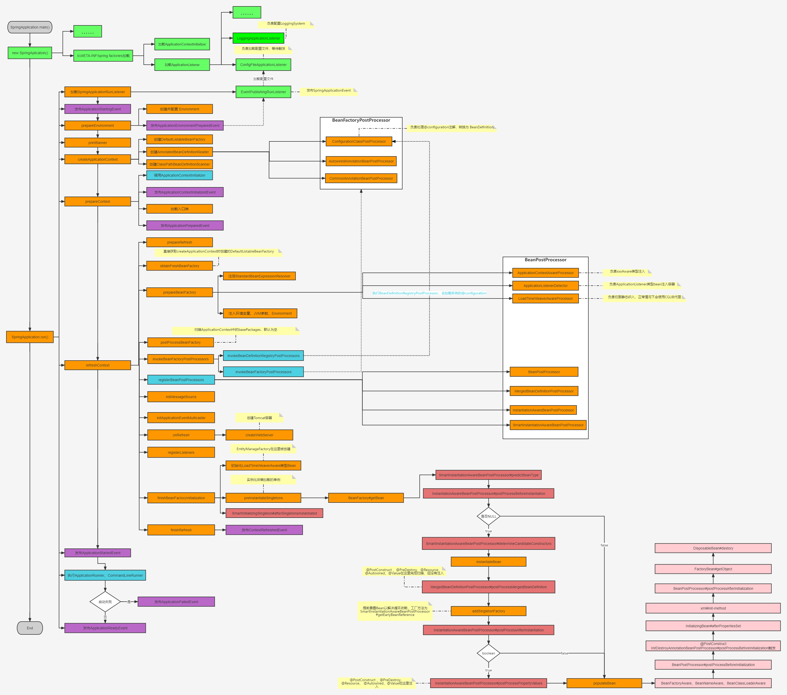

# Spring扩展点：

* `BeanFactoryPostProcessor#postProcessBeanFactory(ConfigurableListableBeanFactory beanFactory)`：负责修改 BeanFactory 属性，例如继承`CustomEditorConfigurer`自定义Editor 时自动将其注入到`BeanFactory`、`PropertyPlaceholderConfigurer`、`ConfigurationClassPostProcessor`扫描 @configuration 注解等。
* `BeanDefinitionRegistryPostProcessor#postProcessBeanDefinitionRegistry(BeanDefinitionRegistry registry)` ：可以直接注入 BeanDefinition，例如 mybatis 中 `MapperScannerConfigurer`。
* `BeanPostProcessor#postProcessAfterInitialization(Object bean, String beanName)`：负责修改Bean，例如生成代理，注入 xxxAware、注入ApplicationListener等。
* `xxxAware`
* `InitializingBean`
* `DisposableBean`
* `ApplicationListener`

# Springboot启动流程



1. 从`spring.factories`配置文件中加载`EventPublishingRunListener`对象，该对象拥有`SimpleApplicationEventMulticaster`属性，即在SpringBoot启动过程的不同阶段用来发射内置的生命周期事件。
2. 准备环境变量，包括系统变量，环境变量，命令行参数，默认变量，servlet相关配置变量，随机值以及配置文件（比如`application.properties`）等。
3. 控制台打印SpringBoot的banner标志。
4. 根据不同类型环境创建不同类型的`ApplicationContext`容器，因为这里是servlet环境，所以创建的是`AnnotationConfigServletWebServerApplicationContext`容器对象；
5. 从`spring.factories`配置文件中加载`FailureAnalyzers`对象,用来报告SpringBoot启动过程中的异常。
6. 为刚创建的容器对象做一些初始化工作，准备一些容器属性值等，对`ApplicationContext`应用一些相关的后置处理和调用各个`ApplicationContextInitializer`的初始化方法来执行一些初始化逻辑等。
7. 刷新容器，这一步至关重要。比如调用`BeanFactory`的后置处理器，注册`BeanPostProcessor`后置处理器，初始化事件广播器且广播事件，初始化剩下的单例bean和SpringBoot创建内嵌的Tomcat服务器等等重要且复杂的逻辑都在这里实现。
8. 执行刷新容器后的后置处理逻辑，注意这里为空方法。
9. 调用`ApplicationRunner`和`CommandLineRunner`的run方法，我们实现这两个接口可以在spring容器启动后需要的一些东西比如加载一些业务数据等。
10. 报告启动异常，即若启动过程中抛出异常，此时用`FailureAnalyzers`来报告异常。

## SpringBoot扩展点

* `org.springframework.context.ApplicationContextInitializer`：这时候容器刚刚创建，还未load、refresh。

  生效办法：
    1. 启动类中加入 `springApplication.addInitializers(new TestApplicationContextInitializer())`
    2. 配置文件中加入， 例如 `context.initializer.classes=com.example.demo.TestApplicationContextInitializer`
    3. Spring SPI扩展，在`spring.factories`中加入，例如 `org.springframework.context.ApplicationContextInitializer=com.example.demo.TestApplicationContextInitializer`
* `org.springframework.beans.factory.support.BeanDefinitionRegistryPostProcessor`
* `org.springframework.beans.factory.config.BeanFactoryPostProcessor`：Springboot扫描注解就是通过这种方式。
* `org.springframework.beans.factory.config.InstantiationAwareBeanPostProcessor`：继承于 `BeanPostProcessor`，除此之外还存在额外的3个方法：
    1. `postProcessBeforeInstantiation`：未创建实例，默认返回为null，当不为null，会用该对象替换 Bean默认的实例化过程，后续会执行 `postProcessAfterInitialization`，不会执行 `postProcessAfterInstantiation`、`postProcessProperties`，例如 `AnnotationAwareAspectJAutoProxyCreator` 实现的 AOP。
    2. `postProcessAfterInstantiation`：Bean默认的实例化后，属性还没有被赋值；它的返回值是决定要不要调用 `postProcessProperties` 方法，默认为 true 。
    3. `postProcessProperties`：对属性值进行修改，如果该方法返回的为null，则继续使用原来的 `PropertyValues` 对象，如果返回的不为null，则替换掉原有的 `PropertyValues` 对象。
* `org.springframework.beans.factory.config.BeanPostProcessor`：用于扩展 实例化后初始化前后的操作。
* `org.springframework.beans.factory.config.SmartInstantiationAwareBeanPostProcessor`：继承于 `InstantiationAwareBeanPostProcessor`，除此之外还存在额外的3个方法：
    1. `predictBeanType`：触发点发生在`postProcessBeforeInstantiation`之前，预测Bean的类型，返回第一个预测成功的Class类型，如果不能预测返回null。主要当调用`BeanFactory.getType(name)`时BeanDefinition无法确定Bean类型的时候调用该方法来确定类型。
    2. `determineCandidateConstructors`：在`postProcessBeforeInstantiation`方法和`postProcessAfterInstantiation`方法之间调用，如果`postProcessBeforeInstantiation`方法返回了一个新的实例代替了原本该生成的实例，那么该方法会被忽略，用于确定该bean的构造函数之用，返回的是该bean的所有构造函数列表。如果返回null，会执行下一个`PostProcessor`的`determineCandidateConstructors`方法；否则选取该`PostProcessor`选择的构造器。
    3. `getEarlyBeanReference`：主要用于解决循环引用问题，提前暴露的`ObjectFactory`就是通过该方法得到。
* `BeanFactoryAware`、`BeanNameAware`、`BeanClassLoaderAware`：填充属性之后，`postProcessBeforeInitialization`之前。
* `EnvironmentAware`、`EmbeddedValueResolverAware`、`ResourceLoaderAware`、`ApplicationEventPublisherAware`、`MessageSourceAware`、`ApplicationContextAware`：属性填充之后，在`postProcessBeforeInitialization`中执行。

* `javax.annotation.PostConstruct`：在`postProcessBeforeInitialization`中执行，存在于`InitDestroyAnnotationBeanPostProcessor`中。
* `org.springframework.beans.factory.InitializingBean`：`postProcessBeforeInitialization`之后，`postProcessAfterInitialization`之前，`init-method` 会在随后执行。
* `org.springframework.beans.factory.FactoryBean`：用来构建复杂的bean。
* `org.springframework.beans.factory.SmartInitializingSingleton`：Spring容器管理的所有单例对象（非懒加载对象）初始化完成之后调用，触发时机在`postProcessAfterInitialization`之后。

* `org.springframework.boot.ApplicationRunner、org.springframework.boot.CommandLineRunner`：容器启动之后，顺序由 `@Order`决定，区别是参数不同。
* `org.springframework.beans.factory.DisposableBean`：对象销毁时执行。
* `org.springframework.context.ApplicationListener`：2种方式调用，可以实现 `ApplicationListener` 或者 使用 `@EventListener`。

  Springboot 启动过程中事件：
    1. `ApplicationStartingEvent`：`Environment` 未创建。
    2. `ApplicationEnvironmentPreparedEvent`：`Environment` 已创建，环境变量、JVM参数、ServletContext 已加载。
    3. `ApplicationContextInitializedEvent`：容器刚刚创建，`ApplicationContextInitializer`执行之后，还未`load`、`refresh`。
    4. `ApplicationPreparedEvent`：已经完成`load`，`BeanPostProcessor`，入口类已完成加载，注解未完成扫描。
    5. `ContextRefreshedEvent`：在`refresh`方法最后， `refresh()` 被调用时发生，所有的Bean被成功装载，后处理Bean被检测并激活，所有Singleton Bean 被预实例化。
    6. `ApplicationStartedEvent`：容器已经完成`refresh`，所有bean都完成加载，`ApplicationRunner`、`CommandLineRunner`未执行。
    7. `ApplicationFailedEvent`：容器启动失败时触发。
    8. `ApplicationReadyEvent`：`ApplicationRunner`、`CommandLineRunner`已经执行，容器成功启动后触发。

## Bean 生命周期


1. 实例化Bean：通过反射调用构造方法实例化对象。
2. 依赖注入：装配Bean的属性。
3. 实现了Aware接口的Bean，执行接口方法：如顺序执行`BeanNameAware`、`BeanFactoryAware`、`ApplicationContextAware`的接口方法。
4. Bean对象初始化前，循环调用实现了`BeanPostProcessor`接口的预初始化方法`postProcessBeforeInitialization`，顺序执行`@PostConstruct`注解方法。
5. Bean对象初始化：`InitializingBean`接口方法、`init-method`方法。
6. Bean对象初始化后，循环调用实现了`BeanPostProcessor`接口的后初始化方法`postProcessAfterInitialization`。
7. 容器关闭时，执行Bean对象的销毁方法，顺序是：`@PreDestroy`注解方法、`DisposableBean`接口方法、`destroy-method`。

# BeanFactory


* `AliasRegistry`：定义对alias的简单增删改等操作。
* `BeanDefinitionRegistry`：定义对 `BeanDefinition` 的各种增删改操作。
* `HierarchicalBeanFactory`：增加 `BeanFactory` 对 `parentFactory` 的缓存。
* `ListableBeanFactory`：获取bean的列表。
* `ConfigurableBeanFactory`：可以配置 `BeanFactory`。
* `AutowireCapableBeanFactory`：可以手动调用完成 bean 的注入、初始化、应用后处理器，这里的自动装配不是 `@Autowired` 注解，而是 xml方式 的注入，也叫传统注入方式，注解驱动注入是通过 `AutowiredAnnotationBeanPostProcessor#setAutowiredAnnotationType` 提供的。
* `ConfigurableListableBeanFactory`：继承 `ConfigurableBeanFactory` 和 `AutowireCapableBeanFactory`。

## XmlBeanDefinitionReader：


* `ResourceLoader`：根据给定资源文件地址返回对应的 `Resource` 。
* `DocumentLoader`：从资源文件加载转换为 `Document` 。
* `BeanDefinitionDocumentReader`：将 `Document` 转换为 `BeanDefinition` 。
* `BeanDefinitionReader`：整合 `ResourceLoader`、`DocumentLoader`、`BeanDefinitionDocumentReader` 功能读取资源获得 `BeanDefinition` 。

## BeanDefinition：

* `AnnotatedGenericBeanDefinition` ： 表示`@Configuration`注解注释的`BeanDefinition`类。
* `ScannedGenericBeanDefinition` ：表示`@Component`、`@Service`、`@Controller`等注解注释的Bean类。

## Bean的加载：

当我们隐式或者显示的调用 `BeanFactory#getBean(...)` 时，会触发加载Bean阶段，这时，容器会首先检查所请求的对象是否已经初始化完成，如果没有，则会根据注册的 Bean 信息实例化请求的对象，并为其注册依赖，然后将其返回给请求方。

1. 首先从 `alias` 中获取 `BeanName`。 假设配置了一个 `FactoryBean` 的名字为`abc`，那么获取 `FactoryBean` 创建的 `Bean` 时，使用`abc` ，如果获取 `FactoryBean` 本身，使用 `&abc` 。另外，`&`定义在 `BeanFactory.FACTORY_BEAN_PREFIX = "&"` 上。 FactoryBean 用于创建一些复杂的bean。
2. 依次从缓存中获取bean，这里的bean有个可能是 FactoryBean 也有可能是普通bean，并且可能没有实例化，缓存有三个：

   ```java
   public class DefaultSingletonBeanRegistry {
     /**
      * 存放的是单例 bean 的映射。
      * 对应关系为 bean name --> bean instance
      */
     private final Map<String, Object> singletonObjects = new ConcurrentHashMap<>(256);

    /**
     * 存放的是 ObjectFactory，可以理解为创建单例 bean 的 factory 。
     * 对应关系是 bean name --> ObjectFactory
     **/
     private final Map<String, ObjectFactory<?>> singletonFactories = new HashMap<>(16);

    /**
     * 存放的是早期的 bean，对应关系也是 bean name --> bean instance。
     * 它与 {@link #singletonFactories} 区别在于 earlySingletonObjects 中存放的 bean 不一定是完整。
     *
     * bean 在创建过程中就已经加入到 earlySingletonObjects 中了，所以当在 bean 的创建过程中，就可以通过 getBean() 方法获取。
     */
     private final Map<String, Object> earlySingletonObjects = new HashMap<>(16);
   }
   ```
3. 如果从缓存中获取到bean，由于bean不是最终的bean，所以需要调用 `getObjectForBeanInstance(...)` 获取bean实例 或 `FactoryBean.getObject()` 的对象。
4. 如果没有从缓存中获取到bean 先从 `parentBeanFactory` 获取 Bean。
5. 如果没有从 `parentBeanFactory` 获取到，再获取 `BeanDefinition` ，先需要依赖，判断没有循环先创建依赖，再根据不同的作用域创建bean。
6. 类型转换，例如name返回为String，`requiredType` 要求返回 `Integer`，这时候会使用 `ConversionService` 做转换。

循环依赖处理：

1. 首先，从一级缓存 `singletonObjects` 获取。
2. 如果，没有且当前指定的 `beanName` 正在创建，就再从二级缓存 `earlySingletonObjects` 中获取。
3. 如果，还是没有获取到且允许 `singletonFactories` 通过 `#getObject()` 获取，则从三级缓存 `singletonFactories` 获取。如果获取到，则通过其`#getObject()` 方法，获取对象，并将其加入到二级缓存 `earlySingletonObjects` 中，并从三级缓存 `singletonFactories` 删除，这里的`#getObject` 是`ObjectFactory` 的方法，不是 `FactoryBean` 的方法，不要搞混。

三级缓存这样升级到二级缓存，二级缓存存在的意义，就是缓存三级缓存中的 `ObjectFactory#getObject()` 方法的执行结果，提早曝光的单例 Bean 对象。
`singletonFactories` 中的数据来自于 `doCreateBean` 时使添加，添加的是刚创建但是没有填充属性、也没有初始化的对象，并对对象进行`postProcessAfterInitialization`处理，这个逻辑不会立马触发，是一个函数表达式，需要满足三个条件：单例、正在创建、可以运行提前暴露。 当创建单例完成后就 从`singletonFactories`移除。

如果对象A和对象B循环依赖，且都有代理的话:

1. A半成品加入第三级缓存。
2. A填充属性注入B -> 创建B对象 -> B半成品加入第三级缓存。
3. B填充属性注入A -> 创建A代理对象，从第三级缓存移除A对象，A代理对象加入第二级缓存（此时A还是半成品，B注入的是A代理对象）。
4. 创建B代理对象（此时B是完成品） -> 从第三级缓存移除B对象，B代理对象加入第一级缓存。
5. A半成品注入B代理对象。
6. 从第二级缓存移除A代理对象，A代理对象加入第一级缓存。

是否可以只用二级缓存：可以

解决循环依赖有两个方案：

1. 不管有没有循环依赖，都提前创建好代理对象，并将代理对象放入缓存，出现循环依赖时，其他对象直接就可以取到代理对象并注入。
2. 不提前创建好代理对象，在出现循环依赖被其他对象注入时，才实时生成代理对象。这样在没有循环依赖的情况下，Bean就可以按着Spring设计原则的步骤来创建。

那为什么Spring不选择二级缓存方式，而是要额外加一层缓存？

* Spring 的设计原则是尽可能保证普通对象创建完成之后，再生成其 AOP 代理，如果要使用二级缓存解决循环依赖，意味着Bean在构造完后就创建代理对象。
* SpringAOP 是在Bean创建完全之后通过`AnnotationAwareAspectJAutoProxyCreator`这个后置处理器来完成的，在这个后置处理的`postProcessAfterInitialization`方法中对初始化后的Bean完成AOP代理，如果出现了循环依赖，那没有办法，只有给Bean先创建代理。

## Resource：

> * getInputStream(): 找到并打开资源，返回一个InputStream以从资源中读取。预计每次调用都会返回一个新的InputStream()，调用者有责任关闭每个流
> * isOpen: 返回一个布尔值，指示此资源是否具有开放流的句柄。如果为true，InputStream就不能够多次读取，只能够读取一次并且及时关闭以避免内存泄漏。对于所有常规资源实现，返回false，但是InputStreamResource除外。
> * getDescription(): 返回资源的描述，用来输出错误的日志。这通常是完全限定的文件名或资源的实际URL。
> * isReadable(): 表明资源的目录读取是否通过getInputStream()进行读取。
> * isFile(): 表明这个资源是否代表了一个文件系统的文件。
> * getURL(): 返回一个URL句柄，如果资源不能够被解析为URL，将抛出IOException
> * getURI(): 返回一个资源的URI句柄
> * getFile(): 返回某个文件，如果资源不能够被解析称为绝对路径，将会抛出FileNotFoundException
> * lastModified(): 资源最后一次修改的时间戳
> * createRelative(): 创建此资源的相关资源
> * getFilename(): 资源的文件名是什么 例如：最后一部分的文件名 myfile.txt

`Resource`一般包括这些实现类：`UrlResource`、`ClassPathResource`、`FileSystemResource`、`ServletContextResource`、`InputStreamResource`、`ByteArrayResource`。

平常使用可以使用 `ResourceLoader` 接口 ,可通过 `ResourceLoaderAware` 注入：

```java
public interface ResourceLoader {

    //该接口仅包含这个方法，该方法用于返回一个 Resource 实例。
    // ApplicationContext 的实现类都实现ResourceLoader 接口，因此 ApplicationContext 可用于直接获取 Resource 实例
    Resource getResource(String location);

}
```

另外 `Resource` 可以直接接受 `application.yml` 中的路径，`ResourcePatternResolver` 可用来加载多个`Resource`,以及它的实现类`PathMatchingResourcePatternResolver`：

```java
public interface ResourcePatternResolver extends ResourceLoader {

    String CLASSPATH_ALL_URL_PREFIX = "classpath*:";

    Resource[] getResources(String locationPattern) throws IOException;

}
```

Spring不仅支持`classpath:`、`file:`、`http:`等各种前缀开头的资源文件解析，而且对于也支持Ant(路径匹配表达式)风格的通配符解析.

| Pattern | Description  | Example                                             | Remark                                                                                                                                                         |
|---------|--------------|-----------------------------------------------------|----------------------------------------------------------------------------------------------------------------------------------------------------------------|
| `?`     | 匹配任何的单个字符    | `example/?ork`                                      | 可以匹配:`example/fork`;`example/work`                                                                                                                             |
| `*`     | 匹配0或者任意数量的字符 | `file:C:/some/path/*.xml`                           | 可以匹配`C:/some/path`下的所有xml文件                                                                                                                                    |
| `**`    | 匹配0个或者更多的目录  | `classpath:com/mycompany/**/applicationContext.xml` | 可以匹配`mycompany`和`applicationContext.xml`的任意目录，例如:` classpath:com/mycompany/test/applicationContext.xml`;`classpath:com/mycompany/work/applicationContext.xml`. |

## BeanWrapper

可通过 `BeanWrapper` 对 Bean 进行操作,可通过 `PropertyAccessorFactory#forBeanPropertyAccess` 进行创建，可通过 `ApplicationContext` 获取 `ConversionService`。


```java
public class BeanWrapperTest {
    public void test() {
        // 获取 ConversionService。
        ConfigurableWebApplicationContext applicationContext = (ConfigurableWebApplicationContext) SpringContextHolder.getApplicationContext();
        ConversionService conversionService = applicationContext.getBeanFactory().getConversionService();
        // 或者
        ConversionService conversionService = ApplicationConversionService.getSharedInstance();
        // 创建 BeanWrapper
        BeanWrapper beanWrapper = PropertyAccessorFactory.forBeanPropertyAccess(appContext);
        beanWrapper.setConversionService(conversionService);
        // 使用 BeanWrapper 操作bean
        PropertyValue brandValue = new PropertyValue("brand", "东风");
        PropertyValue maxSpeedValue = new PropertyValue("maxSpeed", 333);
        PropertyValue priceValue = new PropertyValue("price", 202020);
        beanWrapper.setPropertyValue(brandValue);
        beanWrapper.setPropertyValue(maxSpeedValue);
        beanWrapper.setPropertyValue(priceValue);
    }
}
```

# 上下文

上下文分为4类：

* `ServletContext`: 由 Servlet 容器初始化，为项目提供宿主环境，例如 Tomcat，在 web 项目启动的时候他就初始化这样的上下文环境，为后续的 Spring 容器，SpringMvc 容器提供宿主环境。
* `WebApplicationContext`：Spring 上下文，也是根上下文，是 SpringMvc servlet 的父级上下文，当我们启动 Spring 的时候，那么就需要初始化 IOC 容器，而这个上下文就是用于管理这些 bean，把他们放到容器里。
* `SpringMVC` 上下文 ：`DispatchServlet` 初始化的时候会创建自己的上下文，并从 `ServletContext` 中取出 `WebApplicationContext` 作为自己上下文的父容器。
* 其他上下文：servlet 可以有多个，自然也存在多个上下文。

Spring 中容器存在父子关系，父容器不能访问子容器的资源，而子容器可以访问父容器的资源。

# ApplicationContext


`ApplicationContext` 是对 `BeanFactory` 的扩展，`Application` 有两个直接子类：`WebApplicationContext`和`ConfigurableApplicationContext`：

* `WebApplicationContext`：可以获取ServletContext。
* `ConfigurableApplicationContext`：包含主要的方法，其中就包含`refresh()`方法，它是 `ApplicationContext` 对 `BeanFactory` 最主要的扩展。

`ApplicationContext` 继承 `ResourcePatternResolver` 的 `getResources()` 方法可以供日常使用。

* `AnnotationConfigApplicationContext`：从一个或多个基于Java的配置类中加载Spring应用上下文。
* `AnnotationConfigWebApplicationContext`：从一个或多个基于Java的配置类中加载Spring Web应用上下文。
* `ClassPathXmlApplicationContext`：从类路径下的一个或多个XML配置文件中加载上下文定义，把应用上下文的定义文件作为类资源，使用的是 class路径
* `FileSystemXmlapplicationcontext`：从文件系统下的一个或多个XML配置文件中加载上下文定义,使用的是 文件系统路径。
* `XmlWebApplicationContext`：从Web应用下的一个或多个XML配置文件中加载上下文定义。

## refresh

1. 准备刷新：

* `Environment` 并且对 `Environment` 中的属性进行校验，`Environment` 可能是 `StandardEnvironment`(包含 系统环境和jvm属性) 也可能是 `StandardServletEnvironment`(继承 `StandardEnvironment`,另外包含 ServletContext 的属性)

2. 获取 `BeanFactory`，对于 `XmlWebApplicationContext` 类型的会在这个时候创建，并加载`BeanDefinition`，对于 `AnnotationConfigWebApplicationContext` 类型的直接获取，并不会加载 `BeanDefinition`，因为`AnnotationConfigWebApplicationContext`创建时就已经创建。
3. 准备 `BeanFactory`

    * 填充 `SpelExpressionParser`。
    * 添加 `Resource` 类型及其子类型添加 转换器。
    * 添加 `xxxAware` 类型后置处理器，即创建bean后注入对应的 xxx。
    * 将 `BeanFactory`、`ApplicationContext` 等注入到上下文。
    * 添加 `ApplicationListener` 类型后置处理器，即创建bean 之后注入到 发布器。
    * 注册 `Environment`、`SystemProperties`、`SystemEnvironment`。
4. `postProcessBeanFactory`，提供给子类实现，

    * 在 `AbstractRefreshableWebApplicationContext` 中默认实现是 处理`ServletContextAware`，并且设置 `RequestObjectFactory`，`ResponseObjectFactory`，`SessionObjectFactory`，`WebRequestObjectFactory`。
    * 在 `AnnotationConfigServletWebServerApplicationContext` 相对上面的内容还要添加 扫描`AnnotationConfigServletWebServerApplicationContext` 中的`basePackages`和`annotatedClasses`。
5. 触发 `BeanFactoryPostProcessor`，springboot 在该阶段会扫描所有包。

    * `ConfigurationClassPostProcessor`：用于处理`@configuration`注解,`beanName`为`internalConfigurationAnnotationProcessor`
    * `AutowiredAnnotationBeanPostProcessor`：用于处理`@Autowired`、`@Value`、`@Inject`以及`@Lookup`注解,`beanName`为`internalAutowiredAnnotationProcessor`
    * `CommonAnnotationBeanPostProcessor`：用于处理`JSR-250`注解，例如`@Resource`、`@PostConstruct`、`@PreDestroy`,`beanName`为`internalCommonAnnotationProcessor`
    * `EventListenerMethodProcessor`：用于处理`@EventListener`注解，`beanName`为`internalEventListenerProcessor`
    * `DefaultEventListenerFactory`：管理用于生产`ApplicationListener`对象的`EventListenerFactory`对象,`beanName`为`internalEventListenerFactory`
6. 识别所有的 `BeanPostProcessor` 并注册到 `BeanFactory`。
7. 初始化 `MessageSource`。
8. 初始化 `ApplicationEventMulticaster` 上下文事件广播器。
9. onRefresh 留给子类扩展，

    * 在 `AnnotationConfigServletWebServerApplicationContext` 中会启动 web 容器，例如 Tomcat

10. 注册 `ApplicationListener` 到 `ApplicationEventMulticaster`。
11. 初始化 `ConversionService` 等。
12. 注册 `DefaultLifecycleProcessor`，发布 `ContextRefreshedEvent` 事件。

## SpelExpressionParser

1. `Expression` 表达式（“干什么”）：SpEL的核心，所以表达式语言都是围绕表达式进行的
2. `ExpressionParser` 解析器（“谁来干”）：用于将字符串表达式解析为表达式对象
3. `EvaluationContext` 上下文（“在哪干”）：表达式对象执行的环境，该环境可能定义变量、定义自定义函数、提供类型转换等等
4. root根对象及活动上下文对象（“对谁干”）：root根对象是默认的活动上下文对象，活动上下文对象表示了当前表达式操作的对象，例如 `application.yml` 所生成的root对象，表示表达式在这个跟对象取数据。

表达的变量可能从 `EvaluationContext` 和 `rootObject` 取。

```java
public class SpelExpressionParserTest {
    public void test() {
        // 创建解析器
        ExpressionParser parser = new SpelExpressionParser();

        Flow flow = new Flow();
        flow.setOrderId("1111");

        // 结合 EvaluationContext 计算结果
        EvaluationContext context = new StandardEvaluationContext();
        context.setVariable("flow", flow);
        Expression expression1 = parser.parseExpression("#flow.orderId");
        log.info((String) expression1.getValue(context));

        // 结合 rootObject 计算结果
        Expression expression2 = parser.parseExpression("orderId");
        log.info((String) expression2.getValue(flow));
    }
}
```

## EmbeddedValueResolverAware

从spring环境解析 `${}`, SPEL表达式：

```java

@Component
public class PropertiesUtil implements EmbeddedValueResolverAware {

    private static StringValueResolver valueResolver;

    @Override
    public void setEmbeddedValueResolver(StringValueResolver resolver) {
        PropertiesUtil.valueResolver = resolver;
    }

    public static String getValue(String key) {
        //StringValueResolver还可以解析spel表达式，@Value注解能够解析的，StringValueResolver都可以解析
        return valueResolver.resolveStringValue("${" + key + "}");
    }
}
```

自定义 `Placeholder` 前后缀解析：

```java
public void test() {
    PropertyPlaceholderHelper propertyPlaceholderHelper = new PropertyPlaceholderHelper("${", "}");
    Properties properties = new Properties();
    properties.put("group", "aaa");
    String result = propertyPlaceholderHelper.replacePlaceholders("${group}.qty", properties);

    // 输出 aaa.qty
    System.out.println(result);
}
```

## MessageSource

```java
//1. application.yml 配置资源文件地址，也可以不配置即使用 message
// spring.messages.basename=message
//2. 创建资源文件 message.properties、message_en.properties，在idea中可以使用 resource 类型创建文件
//3. 注入 MessageSource 并使用
@RestController
public class HelloController {
    @Autowired
    MessageSource messageSource;

    @GetMapping("/hello")
    public String hello() {
        // 第二个参数用于替换 属性文件中 的 #{0} 变量
        return messageSource.getMessage("user.name", null, LocaleContextHolder.getLocale());
    }
}
// 4. 添加 Accept-Language head 进行http请求
```

## Bean 装配

`@ComponentScan`：默认会扫描当前包，以及这个包下的子包。

注入方式：

* 构造器注入：

```xml

<bean id="cdPlay" class="com.springinaction.CDPlayer">
    <constructor-arg ref="compactDisc"/>
</bean>
```

* 属性注入：

```xml

<bean id="compactDisc" class="com.springinaction.BlankDisc">
    <property name="title" value="Sgt. Pepper's Lonely Hearts Club Band"/>
    <property name="artist" value="The Beatles"/>
</bean>
```

导入其他配置类：

```java

@Configuration
@Import(CDConfig.class)     // 导入单个配置类
@Import({CDConfig.class, CDPlayingConfig.class})   // 导入多个配置类
@ImportResource("classpath:soundsystem.xml") // 导入xml文件
public class CDPlayerConfig {
}
```

```xml
<?xml version="1.0" encoding="UTF-8"?>
<beans xmlns="http://www.springframework.org/schema/beans"
       xmlns:xsi="http://www.w3.org/2001/XMLSchema-instance"
       xmlns:c="http://www.springframework.org/schema/c"
       xsi:schemaLocation="http://www.springframework.org/schema/beans
       http://www.springframework.org/schema/beans/spring-beans.xsd">
    <bean class="com.springinaction.CDConfig"/>
    <import resource="cdplayer-config.xml"/>
</beans>
```

## Profile 控制

`@Profile`可以作用于 使用`@Configuration`的类上、使用`@Bean`的方法上。

```xml
<?xml version="1.0" encoding="UTF-8"?>
<beans xmlns="http://www.springframework.org/schema/beans"
       xmlns:xsi="http://www.w3.org/2001/XMLSchema-instance" xmlns:jdbc="http://www.springframework.org/schema/jdbc"
       xmlns:jee="http://www.springframework.org/schema/jee" xmlns:p="http://www.springframework.org/schema/p"
       xsi:schemaLocation="
    http://www.springframework.org/schema/jee
    http://www.springframework.org/schema/jee/spring-jee.xsd
    http://www.springframework.org/schema/jdbc
    http://www.springframework.org/schema/jdbc/spring-jdbc.xsd
    http://www.springframework.org/schema/beans
    http://www.springframework.org/schema/beans/spring-beans.xsd">

    <beans profile="dev">
        <jdbc:embedded-database id="dataSource" type="H2">
            <jdbc:script location="classpath:schema.sql"/>
            <jdbc:script location="classpath:test-data.sql"/>
        </jdbc:embedded-database>
    </beans>

    <beans profile="prod">
        <jee:jndi-lookup id="dataSource"
                         lazy-init="true"
                         jndi-name="jdbc/myDatabase"
                         resource-ref="true"
                         proxy-interface="javax.sql.DataSource"/>
    </beans>
</beans>
```

### 激活 Profile

* 如果设置了`spring.profiles.active`属性的话，那么它的值就会用来确定哪个profile是激活的。
* 但如果没有设置`spring.profiles.active`属性的话，那Spring将会查找`spring.profiles.default`的值。
* 如果`spring.profiles.active`和`spring.profiles.default`均没有设置的话，那就没有激活的profile，因此只会创建那些没有定义在profile中的bean。

设置的方式：

* 作为`DispatcherServlet`的初始化参数。
* 作为Web应用的上下文参数。
* 作为JNDI条目。
* 作为环境变量。
* 作为JVM的系统属性。
* 在集成测试类 `@SpringBootTest` 上，使用`@ActiveProfiles`注解设置。

```xml
<?xml version="1.0" encoding="UTF-8"?>
<web-app version="2.5"
         xmlns="http://java.sun.com/xml/ns/javaee"
         xmlns:xsi="http://www.w3.org/2001/XMLSchema-instance"
         xsi:schemaLocation="http://java.sun.com/xml/ns/javaee
    http://java.sun.com/xml/ns/javaee/web-app_2_5.xsd">
    <context-param>
        <param-name>contextConfigLocation</param-name>
        <param-value>/WEB-INF/spring/root-context.xml</param-value>
    </context-param>
    <!--为上下文设置默认的profile-->
    <context-param>
        <param-name>spring.profiles.default</param-name>
        <param-value>dev</param-value>
    </context-param>

    <listener>
        <listener-class>
            org.springframework.web.context.ContextLoaderListener
        </listener-class>
    </listener>

    <servlet>
        <servlet-name>appServlet</servlet-name>
        <servlet-class>
            org.springframework.web.servlet.DispatcherServlet
        </servlet-class>
        <init-param>
            <!--为Servlet设置默认的profile-->
            <param-name>spring.profiles.default</param-name>
            <param-value>dev</param-value>
        </init-param>
        <load-on-startup>1</load-on-startup>
    </servlet>

    <servlet-mapping>
        <servlet-name>appServlet</servlet-name>
        <url-pattern>/</url-pattern>
    </servlet-mapping>
</web-app>
```

## 条件化的bean

自定义条件注解：

1. 实现 `org.springframework.context.annotation.Condition` 接口。
2. 使用 `org.springframework.context.annotation.Conditional` 定义注解。

```java
public class MagicExistsCondition implements Condition {

    @Override
    public boolean matches(ConditionContext context, AnnotatedTypeMetadata metadata) {
        Environment env = context.getEnvironment();
        // 根据环境中是否存在magic属性来决策是否创建MagicBean
        return env.containsProperty("magic");
    }
}

@Target({ElementType.TYPE, ElementType.METHOD})
@Retention(RetentionPolicy.RUNTIME)
@Documented
@Conditional(MagicExistsCondition.class)
public @interface MyConditionAnnotation {
    String[] value() default {};
}
```

```java
public interface AnnotatedTypeMetadata {
    // 够判断带有@Bean注解的方法是不是还有其他特定的注解
    boolean isAnnotated(String annotationType);

    // 获取注解的属性例如 annotatedTypeMetadata.getAnnotationAttributes(ConditionalOnProperty.class.getName())
    Map<String, Object> getAnnotationAttributes(String annotationType);

    Map<String, Object> getAnnotationAttributes(String annotationType, boolean classValuesAsString);

    // 获取注解的属性
    MultiValueMap<String, Object> getAllAnnotationAttributes(String annotationType);

    MultiValueMap<String, Object> getAllAnnotationAttributes(String annotationType, boolean classValuesAsString);
}
```

## 消除 Bean 歧义性

1. 使用 `@Primary` 确定首选bean。
2. 使用 `@Qualifier` 指定使用具体的bean。

```java

@Component
@Qualifier("cold")
public class IceCream implements Dessert {
}

@Autowired
@Qualifier("cold")
public void setDessert(Dessert dessert) {
    this.dessert = dessert;
}
```

## bean 作用域

使用 `@Scope(ConfigurableBeanFactory.SCOPE_PROTOTYPE)` 注解来控制作用域。

默认情况下，Spring应用上下文所有bean都是作为以单例的形式创建的。

* 单例（Singleton）：在整个应用中，只创建bean的一个实例。
* 原型（Prototype）：每次注入或者通过Spring应用上下文获取的时候，都会创建一个新的bean实例。
* 会话（Session）：在Web应用中，为每个会话创建一个bean实例。
* 请求（Request）：在Web应用中，为每个请求创建一个bean实例。

## Spring 运行时求值

* 属性占位符 （Property placeholder）: `${...}` 形式
* Spring表达式语言（SpEL）：`#{...}` 形式,例如

```java
public class SpELTest {
    public void test() {
        //1. 它的最终结果是计算表达式的那一刻当前时间的毫秒数。T(...) 表达式会将java.lang.System视为Java中对应的类型，因此可以调用其static修饰的currentTimeMillis()方法。
        "#{T(System).currentTimeMillis()}"
        //2. SpEL表达式可以引用其他的bean或其他bean的属性。
        //例如，引用sgtPeppers的bean
        "#{sgtPeppers}"
        //例如，如下的表达式会计算得到ID为sgtPeppers的bean的artist属性：
        "#{sgtPeppers.artist}"
        //3. 还可以通过systemProperties对象引用系统属性：
        "#{systemProperties['disc.title']}"
        //4. 表示字面值：
        "#{3.1415926}"
        "#{9.87E4}"
        "#{'Hello'}"
        "#{false}"
        //5. 引用其他的bean的方法
        "#{artistSelector.selectArtist()}"
        //为了防止方法值为null，抛出异常，可以使用“?.”
        //不是null，正常返回；如果是null，不执行后面的方法，直接返回null
        "#{artistSelector.selectArtist()?.toUpperCase()}"
        //6. 如果要在SpEL中访问类作用域的方法和常量的话，要依赖T() 这个关键的运算符。
        "#{T(java.lang.Math).PI}"
        "#{T(java.lang.Math).random()}"
        //7. 还可以将运算符用在表达式上，如：
        "#{2 * T(java.lang.Math).PI * circle.radius}"
        "#{disc.title + ' by ' + disc.artist}"
        //8. 比较数字相等的写法
        "#{counter.total == 100}"
        "#{counter.total eq 100}"
        //9. 三元运算符
        "#{scoreboard.score > 1000 ? " Winner !" : " Loser "}"
        "#{disc.title ?: 'Rattle and Hum' } " // 如果disc.title的值为空，返回'Rattle and Hum'
        //10. 支持正则表达式
        "#{admin.email matches '[a-zA-Z0-9.*%+-]+@[a-zA-Z0-9.*]+\.com'}"
        //11. 支持与集合和数组相关的表达式
        "#{jukebox.songs[4].title}"
        "#{jukebox.songs[T(java.lang.Math).random() * jukebox.songs.size()].title}"
        "#{'This is a test' [3]}" // 引用第4个字符 - “s”
        //12. 支持查询运算符
        //例如你希望得到jukebox中artist属性为Aerosmith的所有歌曲：
        "#{jukebox.songs.?[artist eq 'Aerosmith']}"
        //查找列表中第一个artist属性为Aerosmith的歌曲：
        "#{jukebox.songs.^[artist eq 'Aerosmith']}"
        //查找列表中最后一个artist属性为Aerosmith的歌曲：
        "#{jukebox.songs.$[artist eq 'Aerosmith']}"
        //13. 支持投影运算符
        //假设我们不想要歌曲对象的集合，而是所有歌曲名称的集合。如下表达式会将title属性投影到一个新的String类型的集合中：
        "#{jukebox.songs.![title]}"
        //获取Aerosmith所有歌曲的title
        "#{jukebox.songs.?[artist eq 'Aerosmith'].![title]}"
    }
}
```

# 重试

## SpringRetry

### 使用

1. 引用 POM。

   ```xml
   <dependency>
       <groupId>org.springframework.retry</groupId>
       <artifactId>spring-retry</artifactId>
       <version>1.2.2.RELEASE</version>
   </dependency>
   ```
2. 使用

   ```java
   @EnableRetry
   @SpringBootApplication
   public class JpaApplication {

       public static void main(String[] args) {
           SpringApplication.run(JpaApplication.class, args);
       }

       @Retryable
       public String hello(){
           long times = helloTimes.incrementAndGet();
           log.info("hello times:{}", times);
           if (times % 4 != 0){
               log.warn("发生异常，time：{}", LocalTime.now() );
               throw new HelloRetryException("发生Hello异常");
           }
           return "hello " + nameService.getName();
       }

   }
   ```

## GuavaRetry

1. 引用 POM。

   ```xml
   <dependency>
       <groupId>com.github.rholder</groupId>
       <artifactId>guava-retrying</artifactId>
   </dependency>
   ```
2. 使用

   ```java
   @Slf4j
   public class AppContextTest {

       @Test
       public void guavaRetry() {
           Retryer<String> retryer = RetryerBuilder.<String>newBuilder()
                   .retryIfExceptionOfType(HelloRetryException.class)
                   .retryIfResult(StringUtils::isEmpty)
                   .withWaitStrategy(WaitStrategies.fixedWait(3, TimeUnit.SECONDS))
                   .withStopStrategy(StopStrategies.stopAfterAttempt(3))
                   .build();

           try {
               retryer.call(() -> helloService.hello());
           } catch (Exception e){
               e.printStackTrace();
           }
       }
   }
   ```

相比于`SpringRetry`，提供更多的重试机制：

* `retryIfException` : 对所有异常进行重试。
* `retryIfExceptionOfType` : 对指定异常进行重试。
* `retryIfResult` : 对不符合预期的返回结果进行重试。
* `retryIfRuntimeException` : 对所有`RuntimeException`进行重试。

# SpringReactor

* Mono 用于不超过一个的场景。
* Flux 用于零个、一个、多个（可能是无限个的场景）。

创建：

* 根据对象创建：`Flux.just("A","B")`
*

根据集合创建：`Flux.fromArray(new String[]{"A","B"})`,`Flux.fromIterable(new ArrayList<>())`,`Flux.fromStream(Stream.of("A","B"))`

* 生成数据：`Flux.range(1,5)`,`Flux.interval(Duration.ofSeconds(1)).take(5)`
* 合并：`Flux.range(1,5).mergeWith(Flux.interval(Duration.ofSeconds(1)).take(5))`
* 延迟发布：`Flux.range(1,5).delaySubscription(Duration.ofMillis(250)).delayElements(Duration.ofMillis(500))`
* 压缩,会将多个FLUX对齐分组为 Tuple2，通过 getT1(),getT2()
  来获取：`Flux.zip(Flux.range(1,5),Flux.interval(Duration.ofSeconds(1)).take(5))`，如果不想获得 Tuple2 ，可使用 `Flux.zip( flux1, flux2,mergeFunction)`
* 只发布第一个flux：`Flux.first(flux1,flux2)`只会消费一个flux，另一个flux忽略。
* 缓冲数据：

```java
public class FluxTest {
    public void test() {
        Flux.just("apple", "orange", "banana", "kiwi", "strawberry");
        Flux<List<String>> bufferedFlux = fruitFlux.buffer(3);
    }
}
```

会生成一个新的Flux

* 收集数据：

```java
public class FluxTest {
    public void test() {
        Flux<String> fruitFlux = Flux.just("apple", "orange", "banana", "kiwi", "strawberry");
        Mono<List<String>> fruitListMono = fruitFlux.collectList();
    }
}
```

```java
public class FluxTest {
    public void test() {
        Flux<String> animalFlux = Flux.just("aardvark", "elephant", "koala", "eagle", "kangaroo");
        Mono<Map<Character, String>> animalMapMono = animalFlux.collectMap(a -> a.charAt(0));
    }
}
```

转换：

* 并行处理 `Flux.just("A","B").flatMap(n -> Mono.just(n).map(mapFunction).subscribeOn(Schedulers.parallel()))`

| Scheduler方法    | 描述                                                       |
|----------------|----------------------------------------------------------|
| `.immediate()` | 在当前线程中执行订阅                                               |
| `.single()`    | 在单个可重用线程中执行订阅，对所有调用方重复使用同一线程                             |
| `.newSingle()` | 在每个调用专用线程中执行订阅                                           |
| `.elastic()`   | 在从无限弹性池中提取的工作进程中执行订阅，根据需要创建新的工作线程，并释放空闲的工作线程（默认情况下 60 秒） |
| `.parallel()`  | 在从固定大小的池中提取的工作进程中执行订阅，该池的大小取决于 CPU 核心的数量。                |

# SpringWebFlux

* 高并发、少计算且I/O密集的应用中，响应式和非阻塞往往能够发挥出价值。
* Spring Data Reactive Repositories 目前只支持 MongoDB、Redis 和 Couchbase 等几种不支持事务管理的 NOSQL。
* 不能加快响应的速度，可以减少线程数量。

# 缓存

`@Cacheable` 和 `@CachePut` 属性：

| 属性        | 类型       | 描述                                      |
|-----------|----------|-----------------------------------------|
| value     | String[] | 要使用的缓存名称                                |
| condition | String   | SpEL 表达式，如果得到的值是 false 的话，不会将缓存应用到方法调用上 |
| key       | String   | SpEL 表达式，用来计算自定义的缓存key                  |
| unless    | String   | SpEL 表达式，如果得到的值是 true 的话，返回值不会放到缓存之中    |

自定义缓存 key：

| 表达式               | 描述                                |
|-------------------|-----------------------------------|
| #root.args        | 传递给缓存方法的参数，形式为数组                  |
| #root.caches      | 该方法执行时所对应的缓存，形式为数组                |
| #root.target      | 目标对象                              |
| #root.targetClass | 目标对象的类，是 #root.target.class 的简写形式 |
| #root.method      | 缓存方法                              |
| #root.methodName  | 缓存方法的名字，是 #root.method.name 的简写形式 |
| #result           | 方法调用的返回值（不能用在 @Cacheable 注解上）     |
| #Argument         | 任意的方法参数名（如 #argName）或参数索引（如 #p0）  |

`@CacheEvict` 属性：

| 属性               | 类型       | 描述                                                      |
|------------------|----------|---------------------------------------------------------|
| value            | String[] | 要使用的缓存名称                                                |
| condition        | String   | SpEL 表达式，如果得到的值是 false 的话，缓存不会应用到方法调用上                  |
| key              | String   | SpEL 表达式，用来计算自定义的缓存key                                  |
| allEntries       | boolean  | 如果为 true 的话，特定缓存的所有条目都会被移除掉                             |
| beforeInvocation | boolean  | 如果为 true 的话，在方法调用之前移除条目。如果为 false（默认值）的话，在方法成功调用之后再移除条目 |

# SpringBootActuator

| HTTP 方法 | 路径              | 描述                                         |
|---------|-----------------|--------------------------------------------|
| GET     | /autoconfig     | 提供了一份自动配置报告，记录哪些自动配置条件通过了，哪些没通过            |
| GET     | /configprops    | 描述配置属性(包含默认值)如何注入Bean                      |
| GET     | /beans          | 描述应用程序上下文里全部的Bean，以及它们的关系                  |
| GET     | /dump           | 获取线程活动的快照                                  |
| GET     | /env            | 获取全部环境属性                                   |
| GET     | /env/{name}     | 根据名称获取特定的环境属性值                             |
| GET     | /health         | 报告应用程序的健康指标，这些值由HealthIndicator的实现类提供      |
| GET     | /info           | 获取应用程序的定制信息，这些信息由info打头的属性提供               |
| GET     | /mappings       | 描述全部的URI路径，以及它们和控制器(包含Actuator端点)的映射关系     |
| GET     | /metrics        | 报告各种应用程序度量信息，比如内存用量和HTTP请求计数               |
| GET     | /metrics/{name} | 报告指定名称的应用程序度量值                             |
| POST    | /shutdown       | 关闭应用程序，要求endpoints.shutdown.enabled设置为true |
| GET     | /trace          | 提供基本的HTTP请求跟踪信息(时间戳、HTTP头等)                |

# SpringBoot

启用开发热部署：

```xml

<dependencies>
    <dependency>
        <groupId>org.springframework.boot</groupId>
        <artifactId>spring-boot-devtools</artifactId>
        // 依赖不会传递
        <optional>true</optional>
    </dependency>
</dependencies>
```

当使用 `java -jar` 命令启动时会自动禁用。

配置文件加载顺序：按优先级排序，使用优先级高的配置。

1. 命令行参数：

   ```shell
   # 多个配置用空格分格 ，格式: --配置项=值 ， -- 是 SpringBoot 解析参数的方式，用来jar后面， -D 是JVM解析参数的方式用在jar前面, -XX: -Xms -Xmx -Xmn -Xss 设置jvm参数，用在jar前面。
   java -jar app.jar --server.port=8087 --server.context-path=/abc
   java -jar -Dspring.profiles.active=test -Dserver.port=8081 app.jar
   java -jar -XX:MetaspaceSize=128m -XX:MaxMetaspaceSize=128m -Xms1024m -Xmx1024m -Xmn256m -Xss256k -XX:SurvivorRatio=8 -XX:+UseConcMarkSweepGC newframe-1.0.0.jar
   ```
2. `SPRING_APPLICATION_JSON` 环境变量：值为一个JSON。
3. `ServletConfig` 初始化参数。
4. `ServletContext` 初始化参数。
5. `java:comp/env` 的JNDI属性。
6. `System.getProperties()` JVM系统属性。
7. 操作系统环境变量。
8. `RandomValuePropertySource`，例如 `my.secret=${random.value}`
9. 读取配置文件：

    * `jar`包外 优先 `jar` 包内。
    * `config`下 优先 根目录下。
    * `application-{profile}` 优先 application。
    * `properties` 优先 yml。
10. `@PropertySource`
11. `SpringApplication.setDefaultProperties`

yaml传输到日志配置文件：

| Spring Environment                | System Property               | Comments                        |
|-----------------------------------|-------------------------------|---------------------------------|
| logging.exception-conversion-word | LOG_EXCEPTION_CONVERSION_WORD | 记录异常时使用的转换字。                    |
| logging.file.name                 | LOG_FILE                      | 如果已定义，它将在默认日志配置中使用。             |
| logging.file.path                 | LOG_PATH                      | 如果已定义，它将在默认日志配置中使用。             |
| logging.pattern.console           | CONSOLE_LOG_PATTERN           | 在控制台上使用的日志模式 (stdout)。          |
| logging.pattern.dateformat        | LOG_DATEFORMAT_PATTERN        | 日志日期格式的附加模式。                    |
| logging.charset.console           | CONSOLE_LOG_CHARSET           | 用于控制台日志记录的字符集。                  |
| logging.pattern.file              | FILE_LOG_PATTERN              | 在文件中使用的日志模式（如果LOG_FILE启用）。      |
| logging.charset.file              | FILE_LOG_CHARSET              | 用于文件日志记录的字符集（如果LOG_FILE启用）。     |
| logging.pattern.level             | LOG_LEVEL_PATTERN             | 呈现日志级别时使用的格式（默认%5p）。            |
| PID                               | PID                           | 当前进程 ID（如果可能且尚未定义为 OS 环境变量时发现）。 |

Logback 额外的配置：

| Spring Environment                                   | System Property                              | Comments                                        |
|------------------------------------------------------|----------------------------------------------|-------------------------------------------------|
| logging.logback.rollingpolicy.file-name-pattern      | LOGBACK_ROLLINGPOLICY_FILE_NAME_PATTERN      | 翻转日志文件名的模式（默认${LOG_FILE}.%d{yyyy-MM-dd}.%i.gz）。 |
| logging.logback.rollingpolicy.clean-history-on-start | LOGBACK_ROLLINGPOLICY_CLEAN_HISTORY_ON_START | 是否在启动时清理归档日志文件。                                 |
| logging.logback.rollingpolicy.max-file-size          | LOGBACK_ROLLINGPOLICY_MAX_FILE_SIZE          | 最大日志文件大小。                                       |
| logging.logback.rollingpolicy.total-size-cap         | LOGBACK_ROLLINGPOLICY_TOTAL_SIZE_CAP         | 要保留的日志备份的总大小。                                   |
| logging.logback.rollingpolicy.max-history            | LOGBACK_ROLLINGPOLICY_MAX_HISTORY            | 要保留的存档日志文件的最大数量。                                |

动态修改logback日志级别：

```java

@Controller
@RequestMapping("/logback")
public class LogbackController {
    @RequestMapping(value = "/root/{level}", method = RequestMethod.GET)
    @ResponseBody
    public String updateRootLogbackLevel(HttpServletRequest request, HttpServletResponse response, @PathVariable("level") String levelName) {
        LoggerContext loggerContext = (LoggerContext) LoggerFactory.getILoggerFactory();
        loggerContext.getLogger(Logger.ROOT_LOGGER_NAME).setLevel(Level.toLevel(levelName));
        return "修改root的logback{" + levelName + "}级别成功";
    }

    @RequestMapping(value = "/{package}/{level}", method = RequestMethod.GET)
    @ResponseBody
    public String updateLogbackLevel(HttpServletRequest request, HttpServletResponse response, @PathVariable("package") String packageName,
                                     @PathVariable("level") String levelName) {
        LoggerContext loggerContext = (LoggerContext) LoggerFactory.getILoggerFactory();
        loggerContext.getLogger(packageName).setLevel(Level.toLevel(levelName));
        return "修改package{" + packageName + "}的logback{" + levelName + "}级别成功";
    }
}
```

异步日志使用 AsyncAppender：

| 参数                  | 默认值   | 说明                            |
|---------------------|-------|-------------------------------|
| discardingThreshold | 20    | 默认情况下，当队列容量剩余 20% 时，只保留警告和错误。 |
| queueSize           | 256   | 队列长度。                         |
| neverBlock          | false | 满队列时是否阻塞，设置为true则不阻塞直接丢弃数据。   |

```xml
<?xml version="1.0" encoding="UTF-8"?>

<!-- scan 当此属性设置为true时，配置文件如果发生改变，将会被重新加载，默认值为true。 -->
<!-- scanPeriod 设置监测配置文件是否有修改的时间间隔，如果没有给出时间单位，默认单位是毫秒。当scan为true时，此属性生效。默认的时间间隔为1分钟。 -->
<configuration scan="true" scanPeriod="60 seconds" debug="false">
    <conversionRule conversionWord="clr" converterClass="org.springframework.boot.logging.logback.ColorConverter"/>
    <springProperty scope="context" name="APP_NAME" source="spring.application.name"/>
    <springProperty scope="context" name="ENV" source="spring.profiles.active"/>
    <springProperty scope="context" name="LOGSTASH_DESTINATION" source="logstash.destination"/>

    <property name="CONSOLE_LOG_PATTERN"
              value="%clr(%d{yyyy-MM-dd HH:mm:ss.SSS}){faint} %clr(%5p) %clr([%t]){faint} %clr(%logger{36}){cyan} %clr(:){faint} %m%n"/>
    <property name="CONSOLE_LOG_CHARSET" value="UTF-8"/>
    <property name="FILE_LOG_PATTERN" value="%d{yyyy-MM-dd HH:mm:ss.SSS} %5p [%t] %logger{36}: %m%n"/>
    <property name="FILE_LOG_CHARSET" value="UTF-8"/>

    <appender name="CONSOLE" class="ch.qos.logback.core.ConsoleAppender">
        <encoder>
            <pattern>${CONSOLE_LOG_PATTERN}</pattern>
            <charset>${CONSOLE_LOG_CHARSET}</charset>
        </encoder>
    </appender>

    <!-- 异步写入日志 -->
    <appender name="ASYNC" class="ch.qos.logback.classic.AsyncAppender">
        <discardingThreshold>0</discardingThreshold>
        <queueSize>512</queueSize>
        <!-- 指定异步写入名称为 FILE 的 appender，这里最多只能添加一个 appender-ref -->
        <appender-ref ref="FILE"/>
    </appender>

    <appender name="FILE" class="ch.qos.logback.core.rolling.RollingFileAppender">
        <encoder>
            <pattern>${FILE_LOG_PATTERN}</pattern>
            <charset>${FILE_LOG_CHARSET}</charset>
        </encoder>
        <File>${LOG_PATH}/${LOG_FILE}-${ENV}.log</File>
        <rollingPolicy class="ch.qos.logback.core.rolling.SizeAndTimeBasedRollingPolicy">
            <FileNamePattern>${LOG_PATH}/${LOG_FILE}-${ENV}-%d{yyyyMMdd}-%i.log</FileNamePattern>
            <maxFileSize>5MB</maxFileSize>
            <maxHistory>90</maxHistory>
        </rollingPolicy>
    </appender>

    <appender name="LOGSTASH" class="net.logstash.logback.appender.LogstashTcpSocketAppender">
        <destination>${LOGSTASH_DESTINATION}</destination>
        <encoder charset="UTF-8" class="net.logstash.logback.encoder.LoggingEventCompositeJsonEncoder">
            <providers>
                <timestamp>
                    <timeZone>UTC</timeZone>
                </timestamp>
                <pattern>
                    <pattern>
                        {
                        "appName": "${APP_NAME}",
                        "env": "${ENV}",
                        "level": "%level",
                        "thread": "%thread",
                        "class": "%logger{50}",
                        "message": "%message",
                        "stack_trace": "%exception",
                        "time":"%d{yyyy-MM-dd HH:mm:ss.SSS}"
                        }
                    </pattern>
                </pattern>
            </providers>
        </encoder>
    </appender>

    <root level="INFO">
        <appender-ref ref="CONSOLE"/>
        <appender-ref ref="ASYNC"/>
        <appender-ref ref="LOGSTASH"/>
    </root>
</configuration>
```

自动配置的线程池：

* `applicationTaskExecutor`、`taskExecutor`：`ThreadPoolTaskExecutor` 类型，使用 `spring.task.execution.pool` 配置。
* `threadPoolTaskScheduler`：`ThreadPoolTaskScheduler` 类型，使用 `spring.task.scheduling` 配置。

测试：

```java
//示例1
@SpringBootTest
@AutoConfigureMockMvc
class MyMockMvcTests {

    @Test
    void testWithMockMvc(@Autowired MockMvc mvc) throws Exception {
        mvc.perform(get("/")).andExpect(status().isOk()).andExpect(content().string("Hello World"));
    }

    // If Spring WebFlux is on the classpath, you can drive MVC tests with a WebTestClient
    @Test
    void testWithWebTestClient(@Autowired WebTestClient webClient) {
        webClient
                .get().uri("/")
                .exchange()
                .expectStatus().isOk()
                .expectBody(String.class).isEqualTo("Hello World");
    }

}

//示例2
public class MockMvcSupport {

    private static final String DEFAULT_TOKEN = "CN_000001_USER_29866cdafe6d40d2aef8fb75df408827-oYggrtSir6s=-1616371700730";

    private static final ObjectWriter OBJECT_WRITER = new ObjectMapper().writer().withDefaultPrettyPrinter();

    public static ResultActions prepareRequest(final MockMvc mockMvc, final MockHttpServletRequestBuilder saveRequestBuilder) throws Exception {
        return prepareRequest(mockMvc, saveRequestBuilder, DEFAULT_TOKEN, null);
    }

    public static ResultActions prepareRequest(final MockMvc mockMvc, final MockHttpServletRequestBuilder saveRequestBuilder, final Object object) throws Exception {
        return prepareRequest(mockMvc, saveRequestBuilder, DEFAULT_TOKEN, OBJECT_WRITER.writeValueAsString(object));
    }

    public static ResultActions prepareRequest(final MockMvc mockMvc, final MockHttpServletRequestBuilder saveRequestBuilder, final String content) throws Exception {
        return prepareRequest(mockMvc, saveRequestBuilder, DEFAULT_TOKEN, content);
    }

    private static ResultActions prepareRequest(final MockMvc mockMvc, final MockHttpServletRequestBuilder saveRequestBuilder, final String token, final String content) throws Exception {
        saveRequestBuilder.contentType(MediaType.APPLICATION_JSON)
                .accept(MediaType.APPLICATION_JSON)
                .header("token", token)
                .characterEncoding(StandardCharsets.UTF_8.name());
        if (Objects.nonNull(content)) {
            saveRequestBuilder.content(content);
        }
        ResultActions actions = mockMvc.perform(saveRequestBuilder);
        actions.andReturn().getResponse().setCharacterEncoding(StandardCharsets.UTF_8.name());
        return actions;
    }
}

@SpringBootTest
public class SignalDownloadTest2 {

    @Autowired
    private WebApplicationContext webApplicationContext;

    private MockMvc mockMvc;

    @BeforeEach
    public void setupMockMvc() {
        mockMvc = MockMvcBuilders.webAppContextSetup(webApplicationContext).addFilter(new UserInfoParamFilter()).build();
    }

    @Test
    public void downloadSignalGroupConfig() throws Exception {
        downloadSignalGroup("/api/v1/ring/download/signalGroup/config");
    }

    private void downloadSignalGroup(String url) throws Exception {
        SettingBaseDTO settingBaseDTO = new SettingBaseDTO(663214, 663214, "3e71108323e149e993e96d9e0903cf35");
        MockHttpServletRequestBuilder downloadRequestBuilder = MockMvcRequestBuilders.post(url);
        ResultActions actions = MockMvcSupport.prepareRequest(mockMvc, downloadRequestBuilder, settingBaseDTO);
        actions.andExpect(status().isBadRequest())
                .andExpect(jsonPath("$.message", containsString(SIGNAL_NUMBER_NOT_NULL)))
                .andExpect(jsonPath("$.message", containsString(CROSS_NUMBER_NOT_NULL)))
                .andExpect(jsonPath("$.message", containsString(CROSS_ID_NOT_NULL)));
    }
}
```

## 自动配置原理

### @SpringBootApplication 注解

* `@SpringBootConfiguration`：继承 `@Configuration`，和 `@Configuration` 功能一样。
* `@ComponentScan`：自动扫描Bean，默认情况，不指定basePackages，扫描当前类包及其子包。
* `@EnableAutoConfiguration`：通过 `@Import({AutoConfigurationImportSelector.class})` 实现自动装配。

### 自动装配流程

1. `AutoConfigurationImportSelector` 实现 `ImportSelector` 接口，`@Import` 会装载 `ImportSelector#selectImports` 返回的Bean，由 `ConfigurationClassParser` 来实现。
2. 在 `AutoConfigurationImportSelector#selectImports` 中使用 `SpringFactoriesLoader.loadFactoryNames(EnableAutoConfiguration.class,getBeanClassLoader())` 加载，会加载 `META-INF/spring.factories` 中 `org.springframework.boot.autoconfigure.EnableAutoConfiguration` 的属性。
3. 通过` @ConditionalOnClass` 来完成 添加具体starter 时完成自动加载，stater添加的只是依赖，负责引入依赖包，配置的逻辑存在于 `spring-boot-autoconfigure` 模块：例如：

   ```java
   // 只有引入 MongoClient 相关包时才会进行自动配置。
   @Configuration(proxyBeanMethods = false)
   @ConditionalOnClass(MongoClient.class)
   @EnableConfigurationProperties(MongoProperties.class)
   @ConditionalOnMissingBean(type = "org.springframework.data.mongodb.MongoDatabaseFactory")
   public class MongoAutoConfiguration {
     @Bean
     @ConditionalOnMissingBean(MongoClient.class)
     public MongoClient mongo(MongoProperties properties, Environment environment,
    		 ObjectProvider<MongoClientSettingsBuilderCustomizer> builderCustomizers,
    		 ObjectProvider<MongoClientSettings> settings) {
    	 return new MongoClientFactory(properties, environment,
    			 builderCustomizers.orderedStream().collect(Collectors.toList())).createMongoClient(settings.getIfAvailable());
     }
   }
   ```

## Starter

自定义：

```xml
<!-- 1. 添加依赖 -->
<dependencies>
    <dependency>
        <groupId>org.springframework.boot</groupId>
        <artifactId>spring-boot-starter</artifactId>
    </dependency>
    <dependency>
        <groupId>org.springframework.boot</groupId>
        <artifactId>spring-boot-configuration-processor</artifactId>
        <optional>true</optional>
    </dependency>
    <dependency>
        <groupId>org.projectlombok</groupId>
        <artifactId>lombok</artifactId>
        <version>1.16.18</version>
        <scope>provided</scope>
    </dependency>
</dependencies>
```

```java
// 2. 编写配置文件
@ConfigurationProperties(prefix = "sms")
@Data
public class SmsProperties {

    private SmsMessage aliyun = new SmsMessage();

    private SmsMessage tencent = new SmsMessage();

    @Data
    public static class SmsMessage {

        private String userName;

        private String passWord;

        private String sign;

        private String url;
    }

}
```

```yaml
# yml 文件
sms:
  aliyun:
    pass-word:12345
    user-name:java金融
    sign:阿里云
    url:xxx
  tencent:
    pass-word:6666
    user-name:java金融
    sign:腾讯云
    url:xxx
```

```java
// 3. 编写自动配置类
@EnableConfigurationProperties(value = SmsProperties.class)
@Configuration

public class SmsAutoConfiguration {

    @Bean
    public AliyunSmsSenderImpl aliYunSmsSender(SmsProperties smsProperties) {
        return new AliyunSmsSenderImpl(smsProperties.getAliyun());
    }

    @Bean
    public TencentSmsSenderImpl tencentSmsSender(SmsProperties smsProperties) {
        return new TencentSmsSenderImpl(smsProperties.getTencent());
    }

}
```

```java
// 4. 让 Starter生效，有两种方案
// 4.1 在META-INF下新建一个spring.factories文件,key为org.springframework.boot.autoconfigure.EnableAutoConfiguration，
// value是我们的SmsAutoConfiguration 全限定名（「记得去除前后的空格，否则会不生效」）。
// 4.2 使用注解导入
@Target({ElementType.TYPE})
@Retention(RetentionPolicy.RUNTIME)
@Documented
@Import({SmsAutoConfiguration.class})
public @interface EnableSms {
}
```
