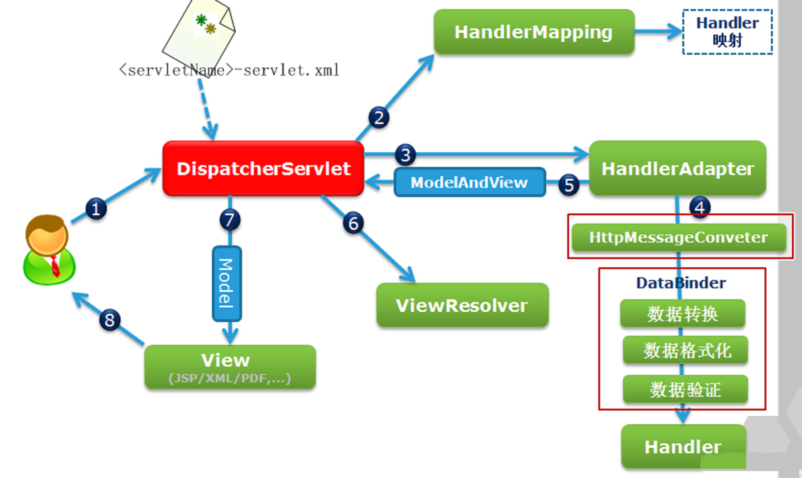
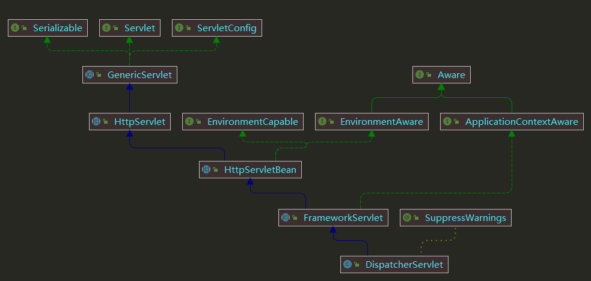

# SpringMVC

扩展点：
* 实现 `javax.servlet.Filter` 接口。
* 实现 `HandlerInterceptor` 接口。
* 实现 `HandlerMethodArgumentResolver` 接口，方便扩展请求参数处理。
* 继承 `AbstractHttpMessageConverter` 转换参数。
* `@ControllerAdvice` 定义异常处理。
* 实现 `HandlerMethodReturnValueHandler` ，统一处理返回值。

```java
@Configuration
public class CnficReturnValueHandlerConfigurer implements InitializingBean {
	@Autowired
	private RequestMappingHandlerAdapter handlerAdapter;

	@Override
	public void afterPropertiesSet() throws Exception {
		List<HandlerMethodReturnValueHandler> list = handlerAdapter.getReturnValueHandlers();
		List<HandlerMethodReturnValueHandler> newList = new ArrayList<>();
		if (null != list) {
			for (HandlerMethodReturnValueHandler valueHandler : list) {
				if (valueHandler instanceof RequestResponseBodyMethodProcessor) {
					HandlerMethodReturnValueHandlerProxy proxy = new HandlerMethodReturnValueHandlerProxy(valueHandler);
					newList.add(proxy);
				} else {
					newList.add(valueHandler);
				}
			}
		}

		handlerAdapter.setReturnValueHandlers(newList);
	}
}

class HandlerMethodReturnValueHandlerProxy implements HandlerMethodReturnValueHandler {
	private HandlerMethodReturnValueHandler proxyObject;

	public HandlerMethodReturnValueHandlerProxy(HandlerMethodReturnValueHandler proxyObject) {
		this.proxyObject = proxyObject;
	}

	@Override
	public boolean supportsReturnType(MethodParameter returnType) {
		return proxyObject.supportsReturnType(returnType);
	}

	@Override
	public void handleReturnValue(Object returnValue, MethodParameter returnType, ModelAndViewContainer mavContainer,
			NativeWebRequest webRequest) throws Exception {
		proxyObject.handleReturnValue(
				CnficServerResponse.createBySuccess(CnficResponseCode.SUCCESS.getDesc(), returnValue), returnType,
				mavContainer, webRequest);
	}
}
```

常用的配置：

| 属性                                        | 描述                                   | 默认值                                                                                             |
|-------------------------------------------|--------------------------------------|-------------------------------------------------------------------------------------------------|
| spring.mvc.format.date                    | 要使用的日期格式，例如“dd/MM/yyyy”。             |                                                                                                 |
| spring.mvc.format.date-time               | 要使用的日期时间格式，例如 'yyyy-MM-dd HH:mm:ss'。 |                                                                                                 |
| spring.mvc.format.time                    | 要使用的时间格式，例如“HH:mm:ss”。               |                                                                                                 |
| spring.mvc.static-path-pattern            | 用于静态资源的路径模式。                         | /**                                                                                             |
| spring.web.resources.static-locations     | 静态资源的位置。                             | [classpath:/META-INF/resources/, classpath:/resources/, classpath:/static/, classpath:/public/] |
| spring.mvc.view.prefix                    | Spring MVC 视图前缀。                     |                                                                                                 |
| spring.mvc.view.suffix                    | Spring MVC 视图后缀。                     |                                                                                                 |
| spring.servlet.multipart.max-file-size    | 最大文件大小。                              | 1MB                                                                                             |
| spring.servlet.multipart.max-request-size | 最大请求大小。                              | 10MB                                                                                            |

WebMvcConfigurer提供的功能如下表所示：

| 配置接口                               | 接口说明                                                                        |
|------------------------------------|-----------------------------------------------------------------------------|
| addResourceHandlers                | 增加处理静态资源的Handler                                                            |
| addInterceptors                    | 增加拦截器                                                                       |
| addCorsMappings                    | 配置跨域请求相关参数                                                                  |
| addFormatters                      | 增加额外的Converter和Formatter                                                    |
| addReturnValueHandlers             | 添加支持个性化处理Controller返回数据类型的处理器；                                              |
| configureMessageConverters         | 配置消息转换器；                                                                    |
| configurePathMatch                 | 配置HandlerMapping路径匹配参数                                                      |
| configureContentNegotiation        | 配置路径到请求内容类型转换的相关参数，如.pdf结尾的请求解析成PDF类型或者其它等                                  |
| configureAsyncSupport              | 配置异步请求处理相关参数                                                                |
| configureDefaultServletHandling    | 配置是否需要以下功能：如果一个请求没有被任何Handler处理，那是否使用DefaultServletHttpRequestHandler来进行处理？ |
| addViewControllers                 | 使用特殊的Controller来处理指定的URL请求;                                                 |
| configureViewResolvers             | 配置将Controller返回的视图名称转换成视图的视图解析器; 以便进行视图渲染                                   |
| addArgumentResolvers               | 添加支持个性化配置Controller的方法参数类型的Resolver。                                        |
| extendMessageConverters            | 扩展消息转换器                                                                     |
| configureHandlerExceptionResolvers | 配置异常处理器                                                                     |
| extendHandlerExceptionResolvers    | 扩展异常处理器                                                                     |





* `HttpServletBean`：负责将 `ServletConfig` 设置到当前 Servlet 对象中，`ServletConfig` 包含 `ServletContext`、`InitParameter`。
* `FrameworkServlet`：负责初始化 Spring Servlet `WebApplicationContext` 容器。
* `DispatcherServlet`：负责初始化 Spring MVC 的各个组件，以及处理客户端的请求。

SpringMVC的9个组件：可通过 `RequestContextUtils` 获取。
* `org.springframework.web.multipart.MultipartResolver`：负责解析 `Content-Type` 为 `multipart/*` 的请求，将 `HttpServletRequest` 封装成 `MultipartHttpServletRequest` ，`MultipartHttpServletRequest` 可通过 `getFile()` 、`getFileMap()` 方法获得上传的文件。

```java
public interface MultipartResolver {

	/**
   * 是否为 multipart 请求
	 */
	boolean isMultipart(HttpServletRequest request);

  /**
   * 将 HttpServletRequest 请求封装成 MultipartHttpServletRequest 对象
	 */
	MultipartHttpServletRequest resolveMultipart(HttpServletRequest request) throws MultipartException;

	/**
   * 清理处理 multipart 产生的资源，例如临时文件
	 */
	void cleanupMultipart(MultipartHttpServletRequest request);
}
```

* `org.springframework.web.servlet.LocaleResolver`：从 `Request` 中解析出 `Locale`。
* `org.springframework.web.servlet.ThemeResolver`：从 `Request` 中解析出 `Theme`。
* `org.springframework.web.servlet.HandlerMapping`：通过匹配`request` 获取 `handler` 和 `interceptorList`

```java
public interface HandlerMapping {

	@Nullable
	HandlerExecutionChain getHandler(HttpServletRequest request) throws Exception;

}

public class HandlerExecutionChain {

	private final Object handler;

	@Nullable
	private List<HandlerInterceptor> interceptorList;
}
```

* `org.springframework.web.servlet.HandlerAdapter`：负责调用 `Controller` 处理业务。


```java
public interface HandlerAdapter {
	/**
   * 是否支持该处理器
	 */
	boolean supports(Object handler);
	/**
   * 执行处理器，返回 ModelAndView 结果
	 */
	@Nullable
	ModelAndView handle(HttpServletRequest request, HttpServletResponse response, Object handler) throws Exception;
	/**
   * 返回请求的最新更新时间。
   * 如果不支持该操作，则返回 -1 即可
	 */
	long getLastModified(HttpServletRequest request, Object handler);
}
```

* `org.springframework.web.servlet.HandlerExceptionResolver`：负责处理 `handler` 产生的异常，并转换成 `ModleAndView`。
* `org.springframework.web.servlet.RequestToViewNameTranslator`：负责从 `request` 中获取视图名。
* `org.springframework.web.servlet.ViewResolver`：根据视图名和国际化，获得最终的视图 View 对象。
* `org.springframework.web.servlet.FlashMapManager`：负责重定向时，保存参数到临时存储，使用非常少。

## Controller 拦截

这几个注解用于对 `controller` 进行拦截：

`@ControllerAdvice`：注释在类上，对定义对哪些controller进行拦截

`@ExceptionHandler`：对controller进行统一异常处理

`@InitBinder`：自定义转换器，转换前端的数据，例如：

```java
@ControllerAdvice(basePackages = "com.kevin.tool")
public class ExceptionHandlerController {

    @InitBinder("date")
    public void globalInitBinder(WebDataBinder binder) {
        binder.addCustomFormatter(new DateFormatter("yyyy-MM-dd"));
    }
}
```

`@ModelAttribute`：给传入controller的数据加一下属性，例如：

```java
@ControllerAdvice(basePackages = "com.kevin.tool")
public class ExceptionHandlerController {

    @ModelAttribute
    public void addAttributes(Model model) {
        model.addAttribute("msg", "hello");

        HashMap<String, String> map = new HashMap<>(16);
        map.put("version", "1.0.0");
        map.put("name", "XXX平台");
        model.addAttribute("platform", map);
    }
}
@RestController
public class ControllerAdviceDemoController {

    @GetMapping("/modelAttributeTest")
    private String modelAttributeTest(@ModelAttribute("msg") String msg,
        @ModelAttribute("platform") Map<String, String> platform) {

        String result = "msg：" + msg + "<br>" + "info：" + platform;
        return result;
    }

}
```

处理参数：

* `GET`、`DELETE`方法：使用 `@RequestParam` 或者 POJO 对象。
* `POST`、`PUT`方法：使用 `@RequestBody` + POJO 对象。
* 路径参数：使用 `@PathVariable`、 `@MatrixVariable`。

```java
// @MatrixVariable 用于扩展 路径参数
// 例如： 如果只使用 @PathVariable 做 GET 查询：/api/v1/users/optional-info?dept=321&name=joh*&fields=hometown,birth
// 如果使用 @MatrixVariable 可这样写：/api/v1/users/depts=321;name=joh*/optional-fields/fields=hometown,birth

// SpringBoot  启用 @MatrixVariable
@Configuration
public class SpringBootConfig implements WebMvcConfigurer {
   @Override
   public void configurePathMatch(PathMatchConfigurer configurer) {
      UrlPathHelper urlPathHelper = new UrlPathHelper();
      // 是否移除分号内容
      urlPathHelper.setRemoveSemicolonContent(false);
      configurer.setUrlPathHelper(urlPathHelper);
   }
}

public class MatrixVariableTest {
    //获取不同路径片段中的参数
    // 请求URI为 /Demo2/66;color=red;year=2020/pets/77;color=blue;year=2019
    @RequestMapping(path = "/Demo2/{id1}/pets/{id2}", method = RequestMethod.GET)
    public String test3(
            @PathVariable String id1,
            @MatrixVariable(name = "color", pathVar = "id1") String color1, @MatrixVariable(name = "year", pathVar = "id1") String year1,
            @PathVariable String id2,
            @MatrixVariable(name = "color", pathVar = "id2") String color2, @MatrixVariable(name = "year", pathVar = "id2") String year2) {
    }
}
```

参数校验：

* `@AssertFalse`：所注解的元素必须是Boolean类型，并且值为false
* `@AssertTrue`：所注解的元素必须是Boolean类型，并且值为true
* `@Max`：所注解的元素必须是数字，并且它的值要小于或等于给定的值
* `@Min`：所注解的元素必须是数字，并且它的值要大于或等于给定的值
* `@DecimalMax`：所注解的元素必须是数字，并且它的值要小于或等于给定的BigDecimalString值
* `@DecimalMin`：所注解的元素必须是数字，并且它的值要大于或等于给定的BigDecimalString值
* `@Digits`：所注解的元素必须是数字，并且它的值必须有指定的位数
* `@Negative`：负数（不包括0）
* `@NegativeOrZero`：负数或0
* `@PositiveOrZero`：正数或0
* `@Future`：所注解的元素的值必须是一个将来的日期
* `@Past`：所注解的元素的值必须是一个已过期的日期
* `@FutureOrPresent`：当前或将来时间
* `@PastOrPresent`：必须是过去的时间，包含现在
* `@NotNull`：所注解的元素的值必须不能为Null
* `@Null`：所注解的元素的值必须为Null
* `@NotBlank`：不为null并且包含至少一个非空白字符,用在String上面
* `@NotEmpty`：不为null并且不为空,用在集合类上面
* `@Size`：所注解的元素的值必须是String、集合或数组，并且它的长度要符合给定的范围
* `@Pattern`：所直接的元素的值必须匹配给定的正则表达式
* `@Email`：校验是否符合Email格式

## 上传文件

```properties
# 上传文件总的最大值
spring.servlet.multipart.max-request-size=10MB
# 单个文件的最大值
spring.servlet.multipart.max-file-size=10MB
```

接收参数可使用 `MultipartFile`(依赖于`org.springframework.web.multipart.commons.CommonsMultipartResolver`) 或 Part 来接收。

```java
public class UploadTest {
    // 单文件上传
    @PostMapping("/upload")
    @ResponseBody
    public String upload(@RequestParam("file") MultipartFile file) {
    }

    // 多文件上传
    @PostMapping("/multiUpload")
    @ResponseBody
    public String multiUpload(HttpServletRequest request) {
        List<MultipartFile> files = ((MultipartHttpServletRequest) request).getFiles("file");
    }

    @PostMapping("/multiUpload")
    @ResponseBody
    public String multiUpload(@RequestParam("file") MultipartFile[] files) {

    }
}
```

## 下载文件

```java
public class DownloadTest {
    public void test() {
        // 设置http头
        response.setContentType(MediaType.APPLICATION_OCTET_STREAM_VALUE);
        response.setContentType(StandardCharsets.UTF_8.name());
        String fileName = URLEncoder.encode(fileName, StandardCharsets.UTF_8.name()).replaceAll("\\+", "%20");
        response.setHeader(HttpHeaders.CONTENT_DISPOSITION, String.format("attachment;filename=%s.xlsx", fileName));
    }
}
```

## 异常处理

* 特定的Spring异常将会自动映射为指定的HTTP状态码；
* 异常上可以添加`@ResponseStatus`注解，从而将其映射为某一个HTTP状态码,可使用在自定义注解异常类上。
* 使用 `@ControllerAdvice` 在方法上可以添加`@ExceptionHandler`注解，使其捕获异常并用该方法来处理异常。


| Spring异常                                | HTTP状态码                      |
|-----------------------------------------|------------------------------|
| BindException                           | 400 - Bad Request            |
| ConversionNotSupportedException         | 500 - Internal Server Error  |
| HttpMediaTypeNotAcceptableException     | 406 - Not Acceptable         |
| HttpMediaTypeNotSupportedException      | 415 - Unsupported Media Type |
| HttpMessageNotWritableException         | 500 - Internal Server Error  |
| HttpRequestMethodNotSupportedException  | 405 - Method Not Allowed     |
| MethodArgumentNotValidException         | 400 - Bad Request            |
| MissingServletRequestParameterException | 400 - Bad Request            |
| MissingServletRequestPartException      | 400 - Bad Request            |
| NoSuchRequestHandlingMethodException    | 404 - Not Found              |
| TypeMismatchException                   | 400 - Bad Request            |
