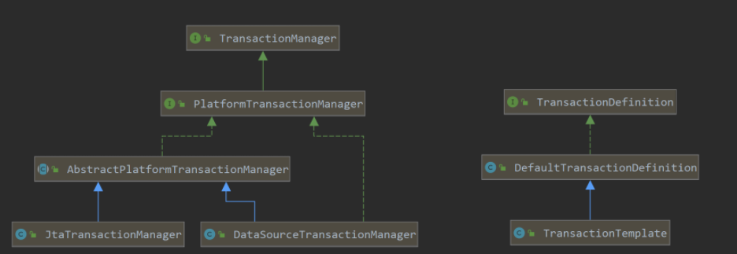

# Spring事务



主要的对象：
* `TransactionManager`：只是一个标识
* `PlatformTransactionManager`：继承`TransactionManager`，定义事务的核心方法，提交和回滚，不建议直接使用，而是应该继承 `AbstractPlatformTransactionManager`，常用的子类是 `DataSourceTransactionManager`、`JpaTransactionManager`。

```java
public interface PlatformTransactionManager extends TransactionManager {

	TransactionStatus getTransaction(@Nullable TransactionDefinition definition)
			throws TransactionException;

	void commit(TransactionStatus status) throws TransactionException;

	void rollback(TransactionStatus status) throws TransactionException;

}
```
* `TransactionDefinition`：定义事务的传播行为、隔离级别、超时时间、是否只读等属性，常用的子类是 `DefaultTransactionDefinition`。

| 事务传播行为类型                  | 说明                                                         | 使用场景                                                                                                       |
|---------------------------|------------------------------------------------------------|------------------------------------------------------------------------------------------------------------|
| PROPAGATION_REQUIRED      | 如果当前没有事务，就新建一个事务，如果已经存在一个事务中，加入到这个事务中。这是最常见的选择，也是默认行为。     | service2要至少保证在一个事物中运行                                                                                      |
| PROPAGATION_SUPPORTS      | 支持当前事务，如果当前没有事务，就以非事务方式执行。                                 | 适合查询方法。如果service1启动了一个事物，service2能够加入到这个事物中去，从而能够读取service1当前修改的数据，否则会由于事物未提交无法读取service1修改的数据（隔离级别大于未提交读） |
| PROPAGATION_MANDATORY     | 使用当前的事务，如果当前没有事务，就抛出异常 。                                   | service2需要事物支持但自身又不管理事务提交或回滚，即强制要求前面的方法创建并管理一个事物给它用                                                        |
| PROPAGATION_REQUIRES_NEW  | 新建事务，如果当前存在事务，把当前事务挂起。                                     | service2事物的失败不想影响到service1事物的成功提交，可以使用这个行为                                                                 |
| PROPAGATION_NOT_SUPPORTED | 以非事务方式执行操作，如果当前存在事务，就把当前事务挂起。                              |                                                                                                            |
| PROPAGATION_NEVER         | 以非事务方式执行，如果当前存在事务，则抛出异常。                                   |                                                                                                            |
| PROPAGATION_NESTED        | 如果当前存在事务，则在嵌套事务内执行。如果当前没有事务，则执行与PROPAGATION_REQUIRED类似的操作。 | 将一个大事物分解为多个小事物执行，根据小事物的执行状态决定大事物的执行流程                                                                      |

* `TransactionStatus`：某一时间点上事务的状态信息：

| 名称                         | 说明        |
|----------------------------|-----------|
| void flush()               | 刷新事务      |
| boolean hasSavepoint()     | 获取是否存在保存点 |
| boolean isCompleted()      | 获取事务是否完成  |
| boolean isNewTransaction() | 获取是否是新事务  |
| boolean isRollbackOnly()   | 获取是否回滚    |
| void setRollbackOnly()     | 设置事务回滚    |

* `TransactionTemplate`：推荐使用的工具类。

使用方法：

* 编程性事务：

```java
// 使用 PlatformTransactionManager
public class test {

   // 1. 注入事务管理器
    @Autowired
    private PlatformTransactionManager txManager;

    @Test
    public void testdelivery(){
        //2. 定义事务隔离级别，传播行为
        DefaultTransactionDefinition def = new DefaultTransactionDefinition();
        def.setIsolationLevel(TransactionDefinition.ISOLATION_READ_COMMITTED);
        def.setPropagationBehavior(TransactionDefinition.PROPAGATION_REQUIRED);
        //3. 获取事务状态
        TransactionStatus status = txManager.getTransaction(def);

        try {
            //执行业务
            //4. 提交事务
            txManager.commit(status);
        } catch (RuntimeException e) {
            //5. 事务回滚
            txManager.rollback(status);
        }
    }

}
```

```java
public class TransactionTemplateTest {

    // 使用 transactionTemplate，无须捕获和提交
    // 1. 注入TransactionTemplate
    @Autowire
    private TransactionTemplate transactionTemplate;

    public void test() {
        // 2. 执行业务，无返回值
        transactionTemplate.executeWithoutResult(status -> {
            //执行业务
        });
        // 3. 执行业务，有返回值
        T result = transactionTemplate.execute(status -> {
            //执行业务
            return T;
        });
    }
}
```

* 声明性事务：

```java
public @interface Transactional {

	@AliasFor("transactionManager")
	String value() default "";

	@AliasFor("value")
	String transactionManager() default "";

	Propagation propagation() default Propagation.REQUIRED;

	Isolation isolation() default Isolation.DEFAULT;

	int timeout() default TransactionDefinition.TIMEOUT_DEFAULT;

	boolean readOnly() default false;

	Class<? extends Throwable>[] rollbackFor() default {};

	String[] rollbackForClassName() default {};

	Class<? extends Throwable>[] noRollbackFor() default {};

	String[] noRollbackForClassName() default {};
}
```

事务失效：
* 方法必须是 `public` 。
* 方法不能被 `final` 修饰，由于 `CGLIB` 是创建子类。
* 实例必须通过 容器注入，因为依赖AOP，同一个类中，非事务方法A调用事务方法B，事务失效，可使用 `((ServiceA)AopContext.currentProxy()).B()` 来调用。
* 实例必须被 容器 管理。
* 使用多线程时每个线程事务都不是同一个。
* 表不支持事务。
* 错误的传播特性，`REQUIRED`，`REQUIRES_NEW`，`NESTED` 才会创建新事务。
* 异常未抛出。
* 抛出异常错误，默认只会处理 `RuntimeException`、`Error`。
* 嵌套事务回滚多了，例如：

```java
// 希望调用roleService.doOtherThing方法时，如果出现了异常，只回滚doOtherThing方法里的内容，不回滚 userMapper.insertUser里的内容。
// 实际 doOtherThing 方法出现了异常，没有手动捕获，会继续往上抛，到外层add方法的代理方法中捕获了异常。所以，这种情况是直接回滚了整个事务，不只回滚单个保存点。
public class UserService {

    @Autowired
    private UserMapper userMapper;

    @Autowired
    private RoleService roleService;

    @Transactional
    public void add(UserModel userModel) throws Exception {
        userMapper.insertUser(userModel);
        roleService.doOtherThing();
    }
}

@Service
public class RoleService {
    @Transactional(propagation = Propagation.NESTED)
    public void doOtherThing() {
        System.out.println("保存role表数据");
    }
}

// 解决办法，捕获异常
public class UserService {

    @Autowired
    private UserMapper userMapper;

    @Autowired
    private RoleService roleService;

    @Transactional
    public void add(UserModel userModel) throws Exception {
        userMapper.insertUser(userModel);
        try {
            roleService.doOtherThing();
        } catch (Exception e) {
            log.error(e.getMessage(), e);
        }
    }
}
```
