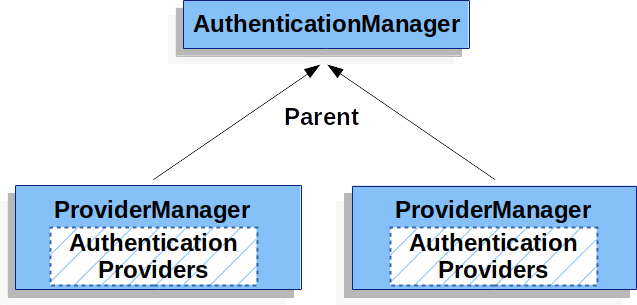

# SpringSecurity

## SpringSecurity扩展点


1. 自定义Filter: 例如 自定义用户名密码校验规则
   * 直接实现Filter。
   * 继承GenericFilterBean，该类继承 Filter, BeanNameAware, EnvironmentAware,EnvironmentCapable, ServletContextAware, InitializingBean, DisposableBean。
   * 继承OncePerRequestFilter重写doFilterInternal，该类保证在一次请求中只会经过一次。
   * 继承AbstractAuthenticationProcessingFilter重写attemptAuthentication，添加了认证失败，认证成功等处理，但是它没有处理一次请求可能多次调用的问题。
   * 继承UsernamePasswordAuthenticationFilter重写attemptAuthentication。
   * 所有的Filter都可以继承，具体功能具体分析。
   * 继承 AbstractAuthenticationFilterConfigurer。

   Filter如何添加：
   * http.addFilter 添加到最后，但并不是最终的最后，因为后面的流程还会添加其他Filter。
   * http.addFilterAfter 添加在指定Filter之后。
   * http.addFilterBefore 添加在指定Filter之前。
   * http.addFilterAt 添加在指定Filter之前，不会覆盖和删除指定的Filter。
   * http.apply(new xxxConfigurer())，可自行在 init(http)、config(http) 设置顺序。
2. 实现 LogoutSuccessHandler： 登出成功后处理器，比如返回json数据，使用 http.logout().logoutSuccessHandler(new xxxLogoutSuccessHandler()) 配置。
3. 实现 AuthenticationFailureHandler ：AbstractAuthenticationProcessingFilter 认证失败后处理器，使用 http.formLogin().failureHandler(new xxxAuthenticationFailureHandler ) 配置。
4. 实现 AuthenticationSuccessHandler ：AbstractAuthenticationProcessingFilter 认证成功后处理器， 使用 http.formLogin().successHandler(new xxxAuthenticationSuccessHandler ) 配置。
5. 实现 AuthenticationEntryPoint ：ExceptionTranslationFilter 认证异常后调转处理器，可参考 LoginUrlAuthenticationEntryPoint，使用 http.exceptionHandling(exceptionHandling -> exceptionHandling.authenticationEntryPoint(new xxxAuthenticationEntryPoint())) 配置默认处理器，还有 defaultAuthenticationEntryPointFor 配合 RequestMatcher 使用。
6. 实现 AccessDeniedHandler ：ExceptionTranslationFilter 鉴权异常后调转处理器，可使用 http..exceptionHandling(exceptionHandling -> exceptionHandling.accessDeniedHandler(new xxxAccessDeniedHandler()))。
7. 继承AbstractAuthenticationToken、实现Authentication：自定义认证凭证，一般与自定义认证器一起使用。
8. 实现AuthenticationProvider、继承DaoAuthenticationProvider：自定义认证器，例如 继承DaoAuthenticationProvider 实现验证码登录，使用 http.authenticationProvider(new xxxAuthenticationProvider()) 或configure(AuthenticationManagerBuilder auth) 配置。
9. 实现AccessDecisionVoter、继承WebExpressionVoter：自定义投票器，可使用 http.authorizeRequests(authorizeRequests -> authorizeRequests.accessDecisionManager()) 设置。
10. 实现UserDetailsService：被DaoAuthenticationProvider使用，用于载入用户信息，使用 configure(AuthenticationManagerBuilder auth) 配置。
11. 实现AccessDecisionManager： 用来鉴权计算投票，例如特定`AccessDecisionVoter `具有额外的权重，或者某个`AccessDecisionVoter`具有一票否决权。
12. 实现PermissionEvaluator：定义@PostFilter注解中 hasPermission 表达式，详情见下文 自定义权限计算器.
13. 配置 PasswordEncoder ：自定义加密规则，通过注入到 DaoAuthenticationProvider 使用。

## SpringSecurityFilter

## 启动


### 入口

spring.factories 中 security 的相关配置为：
org.springframework.boot.autoconfigure.security.servlet.SecurityAutoConfiguration：自动配置Security，使用@EnableWebSecurity注解。
org.springframework.boot.autoconfigure.security.servlet.UserDetailsServiceAutoConfiguration：配置 UserDetailsService，默认使用 InMemoryUserDetailsManager。
org.springframework.boot.autoconfigure.security.servlet.SecurityFilterAutoConfiguration：晚于 SecurityAutoConfiguration， 配置 DelegatingFilterProxyRegistrationBean，负责生成Filter的代理类。
org.springframework.boot.autoconfigure.security.reactive.ReactiveSecurityAutoConfiguration
org.springframework.boot.autoconfigure.security.reactive.ReactiveUserDetailsServiceAutoConfiguration
org.springframework.boot.autoconfigure.security.rsocket.RSocketSecurityAutoConfiguration
org.springframework.boot.autoconfigure.security.saml2.Saml2RelyingPartyAutoConfiguration
org.springframework.boot.autoconfigure.security.oauth2.client.servlet.OAuth2ClientAutoConfiguration
org.springframework.boot.autoconfigure.security.oauth2.client.reactive.ReactiveOAuth2ClientAutoConfiguration
org.springframework.boot.autoconfigure.security.oauth2.resource.servlet.OAuth2ResourceServerAutoConfiguration
org.springframework.boot.autoconfigure.security.oauth2.resource.reactive.ReactiveOAuth2ResourceServerAutoConfiguration

### SecurityAutoConfiguration

Import 3个类：
* SpringBootWebSecurityConfiguration：当 WebSecurityConfigurerAdapterr 不存在时 生成默认的 WebSecurityConfigurerAdapter。
* WebSecurityEnablerConfiguration 负责开启 @EnableWebSecurity。

#### @EnableWebSecurity

Import 3个类，继承 EnableGlobalAuthentication：
  * SpringWebMvcImportSelector：添加MVC支持，即添加 AuthenticationPrincipalArgumentResolver、CurrentSecurityContextArgumentResolver、CsrfTokenArgumentResolver，分别负责向Controller中 @AuthenticationPrincipal、 @CurrentSecurityContext、CsrfToken类型 的参数注入值。
  * OAuth2ImportSelector：添加OAuth2支持。
  * WebSecurityConfiguration：负责建立过滤器链。
  * @EnableGlobalAuthentication：负责注入AuthenticationManagerBuilder。

#### WebSecurityConfiguration

  1. autowiredWebSecurityConfigurersIgnoreParents: 最先执行，因为需要被下面依赖。
  2. setFilterChainProxySecurityConfigurer：负责创建 WebSecurity ,并通过 autowiredWebSecurityConfigurersIgnoreParents 从 BeanFactory 查找所有的 WebSecurityConfigurer，并将其加入到 WebSecurity:
      * 值得注意的是 WebSecurity 实现 SecurityBuilder<Filter> ，表明它拥有创建 Filter的能力。
      * WebSecurityConfigurer<T extends SecurityBuilder<Filter>> 继承 SecurityConfigurer<Filter, T> ,这里的T为 WebSecurity。
      * 所以 WebSecurityConfigurer#init(WebSecurity) 和 WebSecurityConfigurer#config(configure) 可以配置  WebSecurity，最后改变  WebSecurity 创建的 Filter。
      * WebSecurityConfigurerAdapter 是 WebSecurityConfigurer 默认实现，所有我们通过继承 WebSecurityConfigurerAdapter 可以修改最后的 Filter。
  3. springSecurityFilterChain：应用 WebSecurityConfigurerAdapter 配置，并build Filter：
      * 调用 WebSecurityConfigurerAdapter#init(WebSecurity) 方法：
        1. 创建 HttpSecurity，HttpSecurity 实现  SecurityBuilder<DefaultSecurityFilterChain>，表明它负责创建 DefaultSecurityFilterChain，DefaultSecurityFilterChain包含一个 List<Filter> 过滤器链。
        2. HttpSecurity 应用 从 SpringFactoriesLoader 获取的 AbstractHttpConfigurer：AbstractHttpConfigurer 继承 SecurityConfigurerAdapter<DefaultSecurityFilterChain, B>，这里 B 为 HttpSecurity，表明 AbstractHttpConfigurer 通过修改 HttpSecurity 最后改变 DefaultSecurityFilterChain。
        3. WebSecurityConfigurerAdapte#configure(HttpSecurity)：该方法是我们常覆盖的，用来配置过滤器链。
        4. WebSecurity 设置 已经创建的 FilterSecurityInterceptor ，若 FilterSecurityInterceptor 这时不存在则为空。
     * 调用 WebSecurityConfigurerAdapter#configure(WebSecurity) 方法：空方法，常常覆盖用来配置 WebSecurity，例如忽略某些请求 `webSecurity.ignoring().antMatchers("/sms/send");`
     * 调用 WebSecurity#performBuild() 方法：
        1. 使用 configure(WebSecurity) 配置的 ignoredRequests 生成 DefaultSecurityFilterChain。
        2. 使用 configure(HttpSecurity) 配置的 HttpSecurity#build 生成 DefaultSecurityFilterChain。
        3. 将 两个 DefaultSecurityFilterChain 合并生成 FilterChainProxy，FilterChainProxy 继承 GenericFilterBean，但是FilterChainProxy#doFilter没有直接链式调用，最后调用的是 VirtualFilterChain#doFilter完成链式调用。

### SecurityFilterAutoConfiguration

SecurityFilterAutoConfiguration在SecurityAutoConfiguration后执行，配置 DelegatingFilterProxyRegistrationBean，继承 AbstractFilterRegistrationBean，负责生成DelegatingFilterProxy(FilterChainProxy 的代理)，注册到 ServletContext，并设置过滤条件为 /** 。


## 调用链路


## Filters

FilterComparator 中同一对 Filters 进行排序。

| Filter                                   | Configurer                                    | Method                                                    | 默认配置 | 功能                                                                                                                                                                                           |
| ---------------------------------------- | --------------------------------------------- | --------------------------------------------------------- | -------- | ---------------------------------------------------------------------------------------------------------------------------------------------------------------------------------------------- |
| ChannelProcessingFilter                  | ChannelSecurityConfigurer                     | http.requiresChannel()                                    |          | 可以用来限制请求必须是https                                                                                                                                                                    |
| WebAsyncManagerIntegrationFilter         |                                               |                                                           | 是       | 多线程环境下可在WebAsyncTask中通过SecurityContextHolder 获取信息，普通 Runable 获取不到                                                                                                        |
| SecurityContextPersistenceFilter         | SecurityContextConfigurer                     | http.securityContext()                                    | 是       | 请求开始时创建SecurityContext和请求结束时清空SecurityContextHolder                                                                                                                             |
| HeaderWriterFilter                       | HeadersConfigurer                             | http.headers()                                            | 是       | 向 HttpServletRequest  或 HttpServletResponse 写入 Headers                                                                                                                                     |
| CorsFilter                               | CorsConfigurer                                | http.cors()                                               |          | 保证 CorsFilter 会在身份验证相关的 Filter 之前执行，可与 WebMvcConfigurer.addCorsMappings 结合使用，会执行两次，最好直接注入 CorsConfigurationSource                                           |
| CsrfFilter                               | CsrfConfigurer                                | http.csrf()                                               | 是       | 默认对于POST、PUT、DELETE请求，需要读取session中的 CsrfToken 与 _csrf参数 或者  X-CSRF-TOKEN头  进行对比,使用 jwt 等 token 技术时,不需要该配置                                                 |
| LogoutFilter                             | LogoutConfigurer                              | http.logout()                                             | 是       | 用于处理登出成功后的操作                                                                                                                                                                       |
| OAuth2AuthorizationRequestRedirectFilter | OAuth2LoginConfigurer、OAuth2ClientConfigurer | http.oauth2Login()、http.oauth2Client()                   |          | 负责重定向到认证服务器                                                                                                                                                                         |
| Saml2WebSsoAuthenticationRequestFilter   |                                               |                                                           |          | SpringSecuritySAML模块，应用于 XML 领域，如 WebService，schema                                                                                                                                 |
| X509AuthenticationFilter                 | X509Configurer                                | http.x509()                                               |          | X509证书预授权机制，继承AbstractPreAuthenticatedProcessingFilter                                                                                                                               |
| AbstractPreAuthenticatedProcessingFilter |                                               | http.addFilter()                                       |          | 请求已经被其他方式认证，可以通过该请求获取principal，而不是进行认证，它是一个基类，需要自己实现                                                                                                |
| CasAuthenticationFilter                  |                                               |                                                           |          | SpringSecurityCAS 模块，用于 CAS 认证                                                                                                                                                          |
| OAuth2LoginAuthenticationFilter          | OAuth2LoginConfigurer                         | http.oauth2Login()                                        |          | 用于Oauth2中接收认证服务器授权码，并请求token端点，获取 AccessToken                                                                                                                            |
| Saml2WebSsoAuthenticationFilter          |                                               |                                                           |          | SpringSecuritySAML模块单点登录                                                                                                                                                                 |
| UsernamePasswordAuthenticationFilter     | FormLoginConfigurer                           | http.formLogin()                                          |          | 用户名密码认证                                                                                                                                                                                 |
| OpenIDAuthenticationFilter               |                                               |                                                           |          |                                                                                                                                                                                                |
| DefaultLoginPageGeneratingFilter         | DefaultLoginPageConfigurer、LogoutConfigurer  |                                                           | 是       | 用于生成默认的登录页面，可通过 FormLoginConfigurer 更改                                                                                                                                        |
| DefaultLogoutPageGeneratingFilter        | DefaultLoginPageConfigurer                    |                                                           | 是       | 用于生成默认的登出页面，可通过 LogoutConfigurer 更改                                                                                                                                           |
| ConcurrentSessionFilter                  | SessionManagementConfigurer                   | http.sessionManagement(s -> s.sessionConcurrency(xxxxxx)) |          | 用来判断session是否过期以及更新最新的访问时间                                                                                                                                                  |
| DigestAuthenticationFilter               |                                               | http.addFilter()                                          |          | Digest身份验证                                                                                                                                                                                 |
| BearerTokenAuthenticationFilter          | OAuth2ResourceServerConfigurer                | http.oauth2ResourceServer()                               |          | 负责JWT token认证                                                                                                                                                                              |
| BasicAuthenticationFilter                | HttpBasicConfigurer                           | http.httpBasic()                                          |          | basic身份认证                                                                                                                                                                                  |
| RequestCacheAwareFilter                  | RequestCacheConfigurer                        | http.requestCache                                         | 是       | 用于用户认证成功后，重新恢复因为登录被打断的请求。例如：当匿名访问一个需要授权的资源时。会跳转到认证处理逻辑，此时请求被缓存。在认证逻辑处理完毕后，从缓存中获取最开始的资源请求进行再次请求。 |
| SecurityContextHolderAwareRequestFilter  | ServletApiConfigurer                          | http.servletApi()                                         | 是       | 用于支持j2eeAPI                                                                                                                                                                                |
| JaasApiIntegrationFilter                 |                                               |                                                           |          | 适用于Java 认证授权服务                                                                                                                                                                        |
| RememberMeAuthenticationFilter           | RememberMeConfigurer                          | http.rememberMe()                                         |          | 处理 记住我 认证                                                                                                                                                                               |
| AnonymousAuthenticationFilter            | AnonymousConfigurer                           | http.anonymous()                                          | 是       | 处理 匿名认证                                                                                                                                                                                  |
| OAuth2AuthorizationCodeGrantFilter       | OAuth2ClientConfigurer                        | http.oauth2Client()                                       |          | 处理Oauth2自定义 redirectUri，接收认证服务器授权码，并请求token端点，获取AccessToken                                                                                                                         |
| SessionManagementFilter                  | SessionManagementConfigurer                   | http.sessionManagement()                                  | 是       | 用于管理session，可通过http.sessionManagement(sessionManagement -> sessionManagement.sessionCreationPolicy(SessionCreationPolicy.STATELESS)) 禁用Session                                       |
| ExceptionTranslationFilter               | ExceptionHandlingConfigurer                   | http.exceptionHandling()                                  | 是       | 核心过滤器，处理授权、认证异常                                                                                                                                                                 |
| FilterSecurityInterceptor                | ExpressionUrlAuthorizationConfigurer          | http.authorizeRequests()                                  |          | 负责鉴权                                                                                                                                                                                       |
| SwitchUserFilter                         |                                               | http.addFilter()                                          |          | 用于切换用户，默认切换用户的url为 /login/impersonate， 可自定义用于切换                                                                                                                        |

### ExceptionTranslationFilter

#### 核心代码

```java
......

public void doFilter(ServletRequest req, ServletResponse res, FilterChain chain)
      throws IOException, ServletException {
   HttpServletRequest request = (HttpServletRequest) req;
   HttpServletResponse response = (HttpServletResponse) res;

   try {
      chain.doFilter(request, response);

      logger.debug("Chain processed normally");
   }
   catch (IOException ex) {
      throw ex;
   }
   catch (Exception ex) {
      // Try to extract a SpringSecurityException from the stacktrace
      Throwable[] causeChain = throwableAnalyzer.determineCauseChain(ex);
      RuntimeException ase = (AuthenticationException) throwableAnalyzer
            .getFirstThrowableOfType(AuthenticationException.class, causeChain);

      if (ase == null) {
         ase = (AccessDeniedException) throwableAnalyzer.getFirstThrowableOfType(
               AccessDeniedException.class, causeChain);
      }

      if (ase != null) {
         if (response.isCommitted()) {
            throw new ServletException("Unable to handle the Spring Security Exception because the response is already committed.", ex);
         }
         handleSpringSecurityException(request, response, chain, ase);
      }
      else {
         // Rethrow ServletExceptions and RuntimeExceptions as-is
         if (ex instanceof ServletException) {
            throw (ServletException) ex;
         }
         else if (ex instanceof RuntimeException) {
            throw (RuntimeException) ex;
         }

         // Wrap other Exceptions. This shouldn't actually happen
         // as we've already covered all the possibilities for doFilter
         throw new RuntimeException(ex);
      }
   }
}

......
```

**可以看到程序如果没有抛出异常，`ExceptionTranslationFilter`不会做任何事**

```java
private void handleSpringSecurityException(HttpServletRequest request,
			HttpServletResponse response, FilterChain chain, RuntimeException exception)
			throws IOException, ServletException {
		if (exception instanceof AuthenticationException) {
			logger.debug(
					"Authentication exception occurred; redirecting to authentication entry point",
					exception);

			sendStartAuthentication(request, response, chain,
					(AuthenticationException) exception);
		}
		else if (exception instanceof AccessDeniedException) {
			Authentication authentication = SecurityContextHolder.getContext().getAuthentication();
			if (authenticationTrustResolver.isAnonymous(authentication) || authenticationTrustResolver.isRememberMe(authentication)) {
				logger.debug(
						"Access is denied (user is " + (authenticationTrustResolver.isAnonymous(authentication) ? "anonymous" : "not fully authenticated") + "); redirecting to authentication entry point",
						exception);

				sendStartAuthentication(
						request,
						response,
						chain,
						new InsufficientAuthenticationException(
							messages.getMessage(
								"ExceptionTranslationFilter.insufficientAuthentication",
								"Full authentication is required to access this resource")));
			}
			else {
				logger.debug(
						"Access is denied (user is not anonymous); delegating to AccessDeniedHandler",
						exception);

				accessDeniedHandler.handle(request, response,
						(AccessDeniedException) exception);
			}
		}
	}
```


1. `ExceptionTranslationFilter` 调用 `FilterChain.doFilter(request, response)` 执行后续流程

2. 如果捕获到`AuthenticationException`， 用户`not authenticated` 则开始认证

   > 清理SecurityContextHolder
   >
   > `HttpServletRequest` 保存在 `RequestCache`. 当认证成功,  `RequestCache`用来 replay the original request.
   >
   > `AuthenticationEntryPoint` 用来向客户端请求用户名密码(`credentials`).例如, it might redirect to a log in page or send a `WWW-Authenticate` header.

3. 如果捕获到`AccessDeniedException`, 将` Access Denied`. `AccessDeniedHandler` 处理`Access Denied`.值得注意的是`authenticationTrustResolver`还有额外处理，如果是匿名(`Anonymous`)登录或者`RememberMe`登录，仍然由`AuthenticationEntryPoint` 引导去`Authentication`.

4. 其他异常将正常抛出.

### WebSecurityConfigurerAdapter配置

| 方法                                    | 描述                                                         |
| ----------------------------------------- | -------------------------------------------------------------- |
| configure(WebSecurity)                  | 通过重载，配置 Spring Security 的 Filter 链,比如忽略某些资源 |
| configure(HttpSecurity)                 | 通过重载，配置如何通过拦截器保护请求                         |
| configure(AuthenticationManagerBuilder) | 通过重载，配置 user-detail 服务                              |

安全配置：
首先通过authorizeRequests()方法来开始请求权限配置,再使用 anyRequest() 或 antMatchers() 来匹配请求，最后使用下面方法进行权限配置


| 方法                       | 能够做什么                                                           |
| ---------------------------- | ---------------------------------------------------------------------- |
| access(String)             | 如果给定的 SpEL 表达式计算结果为 true，就允许访问                    |
| anonymous()                | 允许匿名用户访问 authenticated() 允许认证过的用户访问                |
| denyAll()                  | 无条件拒绝所有访问                                                   |
| fullyAuthenticated()       | 如果用户是完整认证的话（不是通过Remember-me 功能认证的），就允许访问 |
| hasAnyAuthority(String...) | 如果用户具备给定权限中的某一个的话，就允许访问                       |
| hasAnyRole(String...)      | 如果用户具备给定角色中的某一个的话，就允许访问                       |
| hasAuthority(String)       | 如果用户具备给定权限的话，就允许访问                                 |
| hasIpAddress(String)       | 如果请求来自给定 IP 地址的话，就允许访问                             |
| hasRole(String)            | 如果用户具备给定角色的话，就允许访问                                 |
| not()                      | 对其他访问方法的结果求反                                             |
| permitAll()                | 无条件允许访问                                                       |
| rememberMe()               | 如果用户是通过 Remember-me 功能认证的，就允许访问                    |

access 接受的表达式：


| 安全表达式                | 计算结果                                                                           |
| --------------------------- | ------------------------------------------------------------------------------------ |
| authentication            | 用户的认证对象                                                                     |
| denyAll                   | 结果始终为 false                                                                   |
| hasAnyRole(list of roles) | 如果用户被授予了列表中任意的指定角色，结果为 true                                  |
| hasRole(role)             | 如果用户被授予了指定的角色，结果为 true                                            |
| hasIpAddress(IP Address)  | 如果请求来自指定 IP 的话，结果为 true                                              |
| isAnonymous()             | 如果当前用户为匿名用户，结果为 true                                                |
| isAuthenticated()         | 如果当前用户进行了认证的话，结果为 true                                            |
| isFullyAuthenticated()    | 如果当前用户进行了完整认证的话（不是通过 Remember-me 功能进行的认证），结果为 true |
| isRememberMe()            | 如果当前用户是通过 Remember-me 自动认证的，结果为 true                             |
| permitAll                 | 结果始终为true                                                                     |
| principal                 | 用户的principal对象                                                                |

除了 authorizeRequests() 之外，还可以使用 requeresChannel() 来限制请求必须是https

```java
@Override
protected void configure(HttpSecurity http) throws Exception {
  http
    .authorizeRequests()
    .antMatchers("/spitter/me").hasRole("SPITTER")
    .antMatchers(HttpMethod.POST, "/spittles").hasRole("SPITTER")
    .anyRequest().permitAll()
    .and()
    .requeresChannel()
    .antMatchers("/spitter/form").requiresSecure();
}
```

## ServletAuthenticationArchitecture

- **`SecurityContextHolder` - 用来储存完成认证的用户的详细信息。**

  > The `SecurityContextHolder` is where Spring Security stores the details of who is [authenticated](https://docs.spring.io/spring-security/reference/features/authentication/index.html#authentication).

- **`SecurityContext`  - 存在于 `SecurityContextHolder` 中，包含当前认证用户的`Authentication`。**

  > is obtained from the `SecurityContextHolder` and contains the `Authentication` of the currently authenticated user.

- **`Authentication` - 用于输入到`AuthenticationManager`进行认证，包含用户身份验证的凭据；或者认证完成，储存在`SecurityContext`，包含当前用户。**

  > Can be the input to `AuthenticationManager` to provide the credentials a user has provided to authenticate or the current user from  the `SecurityContext`.

- **`GrantedAuthority` - 用户(`the principal on the Authentication `)包含的权限。**

  > An authority that is granted to the principal on the `Authentication` (i.e. roles, scopes, etc.)

- **`AuthenticationManager` - 如何身份认证的API，`authentication`是它的认证的结果。**

  > the API that defines how Spring Security’s Filters perform `authentication`

- **`ProviderManager`  - `AuthenticationManager`的通用实现。**

  > the most common implementation of `AuthenticationManager`.

- **`AuthenticationProvider` - 用来执行特定的身份认证。**

  **例如：`DaoAuthenticationProvider`支持基于用户名/密码的身份验证，`JwtAuthenticationProvider`支持对 JWT 令牌进行身份验证**。

  > used by `ProviderManager` to perform a specific type of authentication.

- **`AuthenticationEntryPoint ` - 用来向客户端请求凭据，例如重定向到登陆页，并添加`WWW-Authenticate` 响应头。**

  > used for requesting credentials from a client (i.e. redirecting to a log in page, sending a `WWW-Authenticate` response, etc.)

- **`AbstractAuthenticationProcessingFilter` - `Authentication Filter`的基类。**

  >  used for authentication. This also gives a good idea of the high level flow of authentication and how pieces work together.

## SecurityContextHolder


### 部分源码

```java
......
private static SecurityContextHolderStrategy strategy;
......

public static SecurityContext getContext() {
		return strategy.getContext();
}

private static void initialize() {
    if (!StringUtils.hasText(strategyName)) {
        // Set default
        strategyName = MODE_THREADLOCAL;
    }

    if (strategyName.equals(MODE_THREADLOCAL)) {
        // 默认策略
        strategy = new ThreadLocalSecurityContextHolderStrategy();
    }
    else if (strategyName.equals(MODE_INHERITABLETHREADLOCAL)) {
        strategy = new InheritableThreadLocalSecurityContextHolderStrategy();
    }
    else if (strategyName.equals(MODE_GLOBAL)) {
        strategy = new GlobalSecurityContextHolderStrategy();
    }
    else {
        // Try to load a custom strategy
        try {
            Class<?> clazz = Class.forName(strategyName);
            Constructor<?> customStrategy = clazz.getConstructor();
            strategy = (SecurityContextHolderStrategy) customStrategy.newInstance();
        }
        catch (Exception ex) {
            ReflectionUtils.handleReflectionException(ex);
        }
    }

    initializeCount++;
}
......
```

默认使用`ThreadLocalSecurityContextHolderStrategy`储存，即`ThreadLocal`。

```java
final class ThreadLocalSecurityContextHolderStrategy implements SecurityContextHolderStrategy {
	.....

	private static final ThreadLocal<SecurityContext> contextHolder = new ThreadLocal<>();

    public SecurityContext getContext() {
		SecurityContext ctx = contextHolder.get();

		if (ctx == null) {
			ctx = createEmptyContext();
			contextHolder.set(ctx);
		}

		return ctx;
	}

    .....
}
```

**`SecurityContextHolder.getContext().setAuthentication(authentication)`可能会引起多线程竞争。**

## SecurityContext

从 `SecurityContextHolder` 中获取，包含当前认证用户的`Authentication`对象。

## Authentication

主要有两个功能：

- 包含用户已经提供的身份认证的凭据，提供给`AuthenticationManager`进行认证。在这个场景中，`isAuthenticated()`返回`false`。
- 代表当前经过身份认证的用户，可以从`SecurityContext`获取。

> An input to `AuthenticationManager`to provide the credentials a user has provided to authenticate. When used in this scenario, `isAuthenticated()` returns `false`.
>
> Represents the currently authenticated user. The current `Authentication` can be obtained from the SecurityContext.

由三部分组成：

- `principal` - 用来标识用户，当使用`username/password`认证时通常是一个`UserDetails`的实例。

  > identifies the user. When authenticating with a username/password this is often an instance of `UserDetails`.

- `credentials` -  通常是密码，在大多数情况下，认证通过后就删除。

  > often a password. In many cases this will be cleared after the user is authenticated to ensure it is not leaked.

- `authorities` -  权限。

  > the `GrantedAuthority`  are high level permissions the user is granted. A few examples are roles or scopes.

获取用户：
* controller 可以使用 @AuthenticationPrincipal 注解在参数上 来接收 Authentication.getPrincipal() 的值，还可以使用 @CurrentSecurityContext 注解在参数上 来接收 Authentication 的值。
* 使用 Principal 参数 接收。
* 使用 Authentication 参数 接收。
* 使用 SecurityContextHolder 来获取。

## GrantedAuthority

当使用`username/password`进行`authentication `，`GrantedAuthority`s are usually loaded by the `UserDetailsService`。

## AuthenticationManager

认证的`API`,由`Spring Security Filter`调用，认证结果`authentication `，将会设置到`SecurityContextHolder`，`ProviderManager`是最常见的实现。

## ProviderManager

### 部分源码

```java
public class ProviderManager implements AuthenticationManager, MessageSourceAware, InitializingBean {
    .....
	private List<AuthenticationProvider> providers = Collections.emptyList();

	private AuthenticationManager parent;
    .....

	public Authentication authenticate(Authentication authentication)
			throws AuthenticationException {
		Class<? extends Authentication> toTest = authentication.getClass();
		AuthenticationException lastException = null;
		AuthenticationException parentException = null;
		Authentication result = null;
		Authentication parentResult = null;
		boolean debug = logger.isDebugEnabled();

		for (AuthenticationProvider provider : getProviders()) {
			if (!provider.supports(toTest)) {
				continue;
			}

			if (debug) {
				logger.debug("Authentication attempt using "
						+ provider.getClass().getName());
			}

			try {
				result = provider.authenticate(authentication);

				if (result != null) {
					copyDetails(authentication, result);
					break;
				}
			}
			catch (AccountStatusException | InternalAuthenticationServiceException e) {
				prepareException(e, authentication);
				// SEC-546: Avoid polling additional providers if auth failure is due to
				// invalid account status
				throw e;
			} catch (AuthenticationException e) {
				lastException = e;
			}
		}

		if (result == null && parent != null) {
			// Allow the parent to try.
			try {
				result = parentResult = parent.authenticate(authentication);
			}
			catch (ProviderNotFoundException e) {
				// ignore as we will throw below if no other exception occurred prior to
				// calling parent and the parent
				// may throw ProviderNotFound even though a provider in the child already
				// handled the request
			}
			catch (AuthenticationException e) {
				lastException = parentException = e;
			}
		}

		if (result != null) {
			if (eraseCredentialsAfterAuthentication
					&& (result instanceof CredentialsContainer)) {
				// Authentication is complete. Remove credentials and other secret data
				// from authentication
				((CredentialsContainer) result).eraseCredentials();
			}

			// If the parent AuthenticationManager was attempted and successful then it will publish an AuthenticationSuccessEvent
			// This check prevents a duplicate AuthenticationSuccessEvent if the parent AuthenticationManager already published it
			if (parentResult == null) {
				eventPublisher.publishAuthenticationSuccess(result);
			}
			return result;
		}

		// Parent was null, or didn't authenticate (or throw an exception).

		if (lastException == null) {
			lastException = new ProviderNotFoundException(messages.getMessage(
					"ProviderManager.providerNotFound",
					new Object[] { toTest.getName() },
					"No AuthenticationProvider found for {0}"));
		}

		// If the parent AuthenticationManager was attempted and failed then it will publish an AbstractAuthenticationFailureEvent
		// This check prevents a duplicate AbstractAuthenticationFailureEvent if the parent AuthenticationManager already published it
		if (parentException == null) {
			prepareException(lastException, authentication);
		}

		throw lastException;
	}

    ......
}
```

可知，`ProviderManager`包含`List<AuthenticationProvider>`，认证时遍历`List<AuthenticationProvider>`，每个`AuthenticationProvider`都有机会`Authentication`,当它无法认证或抛出异常时，由下游的`AuthenticationProvider`去决定，当所有的`AuthenticationProvider`都不能`Authentication`将抛出`ProviderNotFoundException `,这是一个特殊`AuthenticationException`,表明`ProviderManager`未配置为支持传递给它的身份验证类型。


每个`AuthenticationProvider`都针对特定的身份认证。例如：

> One `AuthenticationProvider` might be able to validate a username/password, While another might be able to authenticate a SAML assertion.


`ProviderManager`还可以设置一个`parent`,当`ProviderManager`无法认证时，会交给`parent`。



多个`ProviderManager`可能拥有同一个`parent`，表示它们拥有一些相同的认证机制。这在多个`SecurityFilterChain`的场景中比较常见。

默认情况下，`ProviderManager`将尝试从验证成功的`Authentication `中清楚凭据信息，可以通过配置`eraseCredentialsAfterAuthentication`来改变。

## AuthenticationProvider

多个` AuthenticationProvider` 注入到 `ProviderManager` 中。每个` AuthenticationProvider `执行特定类型的身份验证。例如，`DaoAuthenticationProvider `支持基于用户名/密码的身份验证，而 `JwtAuthenticationProvider` 支持对 JWT 令牌进行身份验证。

## AuthenticationEntryPoint

> Used by ExceptionTranslationFilter to commence an authentication scheme.

`AuthenticationEntryPoint`用于从客户端请求凭据,由`ExceptionTranslationFilter`调用。当客户端将对他们无权访问的资源发出未经身份验证的请求时，由`AuthenticationEntryPoint`从客户端请求凭据。`AuthenticationEntryPoint`的子类实现可能会执行重定向到登录页面，并使用`WWW-Authenticate`响应头。

> The `AuthenticationEntryPoint` implementation might perform a redirect to a log in page, respond with an WWW-Authenticate header.

## AbstractAuthenticationProcessingFilter

验证用户凭据过滤器的父类，在进行身份验证之前通常由`AuthenticationEntryPoint`用于从客户端请求凭据。

### 部分源码

```java
public abstract class AbstractAuthenticationProcessingFilter extends GenericFilterBean
      implements ApplicationEventPublisherAware, MessageSourceAware {
     ......
     	protected ApplicationEventPublisher eventPublisher;
	protected AuthenticationDetailsSource<HttpServletRequest, ?> authenticationDetailsSource = new WebAuthenticationDetailsSource();
	private AuthenticationManager authenticationManager;
	protected MessageSourceAccessor messages = SpringSecurityMessageSource.getAccessor();
	private RememberMeServices rememberMeServices = new NullRememberMeServices();

	private RequestMatcher requiresAuthenticationRequestMatcher;

	private boolean continueChainBeforeSuccessfulAuthentication = false;

	private SessionAuthenticationStrategy sessionStrategy = new NullAuthenticatedSessionStrategy();

	private boolean allowSessionCreation = true;

	private AuthenticationSuccessHandler successHandler = new SavedRequestAwareAuthenticationSuccessHandler();
	private AuthenticationFailureHandler failureHandler = new SimpleUrlAuthenticationFailureHandler();
     ......
	public void doFilter(ServletRequest req, ServletResponse res, FilterChain chain)
			throws IOException, ServletException {

		HttpServletRequest request = (HttpServletRequest) req;
		HttpServletResponse response = (HttpServletResponse) res;

		if (!requiresAuthentication(request, response)) {
			chain.doFilter(request, response);

			return;
		}

		if (logger.isDebugEnabled()) {
			logger.debug("Request is to process authentication");
		}

		Authentication authResult;

		try {
			authResult = attemptAuthentication(request, response);
			if (authResult == null) {
				// return immediately as subclass has indicated that it hasn't completed
				// authentication
				return;
			}
			sessionStrategy.onAuthentication(authResult, request, response);
		}
		catch (InternalAuthenticationServiceException failed) {
			logger.error(
					"An internal error occurred while trying to authenticate the user.",
					failed);
			unsuccessfulAuthentication(request, response, failed);

			return;
		}
		catch (AuthenticationException failed) {
			// Authentication failed
			unsuccessfulAuthentication(request, response, failed);

			return;
		}

		// Authentication success
		if (continueChainBeforeSuccessfulAuthentication) {
			chain.doFilter(request, response);
		}

		successfulAuthentication(request, response, chain, authResult);
	}
     ......
}
```


1. `AbstractAuthenticationProcessingFilter`首先过滤掉不需要认证的请求，然后把需要认证的`HttpServletRequest`构建一个`Authentication`,如何创建去取决于`AbstractAuthenticationProcessingFilter`子类的`attemptAuthentication`方法。例如： `UsernamePasswordAuthenticationFilter` 创建`UsernamePasswordAuthenticationToken`.

2. 将`Authentication` 给`AuthenticationManager`进行认证。

3. 若认证失败：

   ```java
   	protected void unsuccessfulAuthentication(HttpServletRequest request,
   			HttpServletResponse response, AuthenticationException failed)
   			throws IOException, ServletException {
           		// 1
                   SecurityContextHolder.clearContext();
   				// 2 RememberMeServices 默认是空操作(no-op),new NullRememberMeServices().
                   rememberMeServices.loginFail(request, response);
           		// 3 new SimpleUrlAuthenticationFailureHandler()
                   failureHandler.onAuthenticationFailure(request, response, failed);
       }
   ```

4. 若认证成功：

   ```java
   		try {
   			authResult = attemptAuthentication(request, response);
   			if (authResult == null) {
   				return;
   			}
              	// 1 new NullAuthenticatedSessionStrategy() ，登录成功首先通知SessionAuthenticationStrategy。
   			sessionStrategy.onAuthentication(authResult, request, response);
   		}
   		catch (AuthenticationException failed) {
   			unsuccessfulAuthentication(request, response, failed);
   			return;
   		}

   		if (continueChainBeforeSuccessfulAuthentication) {
   			chain.doFilter(request, response);
   		}
   		successfulAuthentication(request, response, chain, authResult);
   ```

   ```java
   	protected void successfulAuthentication(HttpServletRequest request,
   			HttpServletResponse response, FilterChain chain, Authentication authResult)
   			throws IOException, ServletException {

   		if (logger.isDebugEnabled()) {
   			logger.debug("Authentication success. Updating SecurityContextHolder to contain: "
   					+ authResult);
   		}
   		// 2 Later the SecurityContextPersistenceFilter saves the SecurityContext to the HttpSession.
   		SecurityContextHolder.getContext().setAuthentication(authResult);
   		// 3
   		rememberMeServices.loginSuccess(request, response, authResult);

   		// Fire event
   		if (this.eventPublisher != null) {
               // 4 发布 InteractiveAuthenticationSuccessEvent
   			eventPublisher.publishEvent(new InteractiveAuthenticationSuccessEvent(
   					authResult, this.getClass()));
   		}
   		// 5 new SavedRequestAwareAuthenticationSuccessHandler()
   		successHandler.onAuthenticationSuccess(request, response, authResult);
   	}
   ```

## Form Login


1. 未授权或者未认证的用户访问`/private`,会被`FilterSecurityInterceptor`拦截并抛出`AccessDeniedException`或`AuthenticationException`。
2. `ExceptionTranslationFilter`会将异常捕获到，并`sendStartAuthentication`,使用`AuthenticationEntryPoint`重定向回登陆页面，通常使用`LoginUrlAuthenticationEntryPoint`。
3. 当用户提交`username/password`，`UsernamePasswordAuthenticationFilter`来进行认证，`UsernamePasswordAuthenticationFilter` 继承于`AbstractAuthenticationProcessingFilter`。


配置示例：

```java
protected void configure(HttpSecurity http) throws Exception {
	http
		// ...
		.formLogin(form -> form
			.loginPage("/login")
			.permitAll()
		);
}
```

默认表单的特点：

- 使用`POST`请求。
- 包含一个`CRSF Token`。
- 表单用户名参数名为`username`，密码参数名为`password`。

## Basic Authentication

不推荐使用，看一下实现思想。


可以看到，`Basic Authentication`和`Form Login`的拦截逻辑相似，只是将`LoginUrlAuthenticationEntryPoint`替换成`BasicAuthenticationEntryPoint`。`BasicAuthenticationEntryPoint`会发送`WWW-Authenticate`的 `Response Headers`。

当浏览器收到`WWW-Authenticate`,添加头`Authorization : Basic Base64(username:password) `重试。

值得注意的是：**当`Basic Authentication`和`Form Login`同时配置时，`LoginUrlAuthenticationEntryPoint`和`BasicAuthenticationEntryPoint`会按照先后顺序添加到`DelegatingAuthenticationEntryPoint`,然后存在于`ExceptionTranslationFilter`中，先添加的会作为`defaultEntryPoint`。**


```java
public class BasicAuthenticationFilter extends OncePerRequestFilter {
......
	@Override
	protected void doFilterInternal(HttpServletRequest request,
			HttpServletResponse response, FilterChain chain)
					throws IOException, ServletException {
		final boolean debug = this.logger.isDebugEnabled();
		try {
           // 1、 提取头 Authorization 解析 username/password.
			UsernamePasswordAuthenticationToken authRequest = authenticationConverter.convert(request);
           // 2、没有提取到token,交给后面的filter.
			if (authRequest == null) {
				chain.doFilter(request, response);
				return;
			}

			String username = authRequest.getName();

			if (debug) {
				this.logger
						.debug("Basic Authentication Authorization header found for user '"
								+ username + "'");
			}

			if (authenticationIsRequired(username)) {
				Authentication authResult = this.authenticationManager
						.authenticate(authRequest);

				if (debug) {
					this.logger.debug("Authentication success: " + authResult);
				}
				// sucess1
				SecurityContextHolder.getContext().setAuthentication(authResult);
				// sucess2
				this.rememberMeServices.loginSuccess(request, response, authResult);
				// sucess3
				onSuccessfulAuthentication(request, response, authResult);
			}

		}
		catch (AuthenticationException failed) {
          	// fail1
			SecurityContextHolder.clearContext();

			if (debug) {
				this.logger.debug("Authentication request for failed!", failed);
			}
			// fail2
			this.rememberMeServices.loginFail(request, response);
			// fail3
			onUnsuccessfulAuthentication(request, response, failed);
			// fail4
			if (this.ignoreFailure) {
				chain.doFilter(request, response);
			}
			else {
				this.authenticationEntryPoint.commence(request, response, failed);
			}

			return;
		}

		chain.doFilter(request, response);
	}

   ......
}
```

## Digest Authentication

不推荐使用，不做扩展讲述。

## In-Memory Authentication

`InMemoryUserDetailsManager implements UserDetailsService `提供在内存中储存`username/password`,并且`InMemoryUserDetailsManager implements UserDetailsManager`来管理 `UserDetails` 。

例如：

```java
@Bean
public UserDetailsService users() {
	UserDetails user = User.builder()
		.username("user")
		.password("{bcrypt}$2a$10$GRLdNijSQMUvl/au9ofL.eDwmoohzzS7.rmNSJZ.0FxO/BTk76klW")
		.roles("USER")
		.build();
	UserDetails admin = User.builder()
		.username("admin")
		.password("{bcrypt}$2a$10$GRLdNijSQMUvl/au9ofL.eDwmoohzzS7.rmNSJZ.0FxO/BTk76klW")
		.roles("USER", "ADMIN")
		.build();
	return new InMemoryUserDetailsManager(user, admin);
}
```

`UserBuilder users = User.withDefaultPasswordEncoder();`不能在生产环境使用。

## JDBC Authentication

`JdbcDaoImpl implements  UserDetailsService`提供使用`JDBC`储存`username/password`,并且`JdbcUserDetailsManager extends JdbcDaoImpl`来管理 `UserDetails` 。`Security`提供对`username/password`认证是基于`UserDetails`。

## UserDetails

`UserDetails`由`UserDetailsService`返回，`DaoAuthenticationProvider`验证`UserDetails`后将会返回包含`UserDetails`中`principal `的`Authentication`。

## UserDetailsService

**自定义往往需要实现自己的`UserDetailsService`。**

例如：

```java
@Bean
CustomUserDetailsService customUserDetailsService() {
	return new CustomUserDetailsService();
}
```

值得注意的是：**这需要`AuthenticationManagerBuilder`未设置，并且`AuthenticationProvider Bean`没有被定义。**

## PasswordEncoder

`Security`使用`PasswordEncoder`来加密密码。

## DaoAuthenticationProvider

`DaoAuthenticationProvider`是`AuthenticationProvider`的实现，使用 `UserDetailsService`和`PasswordEncoder`来进行认证。


1.  `UsernamePasswordAuthenticationFilter` 或其他`Filter`读取用户请求生成`UsernamePasswordAuthenticationToken`，并调用`AuthenticationManager`的实现`ProviderManager`。
2. `ProviderManager`包含多个`AuthenticationProvider`，其中有一个就是`DaoAuthenticationProvider`。
3. `DaoAuthenticationProvider`通过 `UserDetailsService`查找`UserDetails`。
4. 然后`DaoAuthenticationProvider`通过 `PasswordEncoder`验证`UserDetails`的密码。
5. 当`Authentication`成功时,返回包含`UserDetails`和`Authorities`的`UsernamePasswordAuthenticationToken`，并设置在`SecurityContextHolder`中。

## LDAP Authentication

`LDAP Authentication`未集成`UserDetailsService`，因为`LDAP server`并不返回密码。

```http
https://docs.spring.io/spring-security/reference/servlet/authentication/passwords/ldap.html
```

# Remember-Me Authentication

`Security`的`Remember-me`默认两种实现都需要 `UserDetailsService`。当使用`LDAP provider`时需要有额外的 `UserDetailsService  Bean`。

##  Remember-Me Interfaces and Implementations

```java
public interface RememberMeServices {
	Authentication autoLogin(HttpServletRequest request, HttpServletResponse response);

	void loginFail(HttpServletRequest request, HttpServletResponse response);

	void loginSuccess(HttpServletRequest request, HttpServletResponse response,
			Authentication successfulAuthentication);
}
```

 `AbstractAuthenticationProcessingFilter`保存了一个 `RememberMeServices` 对象，当 `UsernamePasswordAuthenticationFilter`和`BasicAuthenticationFilter`登陆成功或失败时将会调用`RememberMeServices`。`RemeberMeServices`会设置到客户端的`cookie`中。

`RememberMeAuthenticationFilter`当`SecurityContextHolder `不包含`Authentication`时将会调用`RemeberMeServices`的`autoLogin`方法生成一个`RememberMeAuthenticationToken`,并由`AuthenticationManager`的`RememberMeAuthenticationProvider`来进行认证。

### TokenBasedRememberMeServices

实例:

```xml
<bean id="rememberMeFilter" class=
"org.springframework.security.web.authentication.rememberme.RememberMeAuthenticationFilter">
<property name="rememberMeServices" ref="rememberMeServices"/>
<property name="authenticationManager" ref="theAuthenticationManager" />
</bean>

<bean id="rememberMeServices" class=
"org.springframework.security.web.authentication.rememberme.TokenBasedRememberMeServices">
<property name="userDetailsService" ref="myUserDetailsService"/>
<property name="key" value="springRocks"/>
</bean>

<bean id="rememberMeAuthenticationProvider" class=
"org.springframework.security.authentication.RememberMeAuthenticationProvider">
<property name="key" value="springRocks"/>
</bean>
```

**除此之外还需要将完成`UsernamePasswordAuthenticationFilter.setRememberMeServices()`、`AuthenticationManager.setProviders() `、`RememberMeAuthenticationFilter `添加到`FilterChainProxy`（通常在`UsernamePasswordAuthenticationFilter` 之后）。**

### PersistentTokenBasedRememberMeServices

使用方式与`TokenBasedRememberMeServices`相同，另外还需要配置`PersistentTokenRepository `,也有两种默认实现`InMemoryTokenRepositoryImpl `和`JdbcTokenRepositoryImpl `。

# OpenID Authentication

去中心化认证。

# Anonymous Authentication

匿名认证涉及到三个类`AnonymousAuthenticationToken`、`AnonymousAuthenticationProvider`、`AnonymousAuthenticationFilter`。

`AnonymousAuthenticationFilter`会在`SecurityContextHolder `不包含`Authentication`时创建`AnonymousAuthenticationToken`，提交给`AnonymousAuthenticationProvider`认证。

示例：

```xml
<bean id="anonymousAuthFilter"
	class="org.springframework.security.web.authentication.AnonymousAuthenticationFilter">
<property name="key" value="foobar"/>
<property name="userAttribute" value="anonymousUser,ROLE_ANONYMOUS"/>
</bean>

<bean id="anonymousAuthenticationProvider"
	class="org.springframework.security.authentication.AnonymousAuthenticationProvider">
<property name="key" value="foobar"/>
</bean>
```

```xml
<bean id="filterSecurityInterceptor"
	class="org.springframework.security.web.access.intercept.FilterSecurityInterceptor">
<property name="authenticationManager" ref="authenticationManager"/>
<property name="accessDecisionManager" ref="httpRequestAccessDecisionManager"/>
<property name="securityMetadata">
	<security:filter-security-metadata-source>
	<security:intercept-url pattern='/index.jsp' access='ROLE_ANONYMOUS,ROLE_USER'/>
	<security:intercept-url pattern='/hello.htm' access='ROLE_ANONYMOUS,ROLE_USER'/>
	<security:intercept-url pattern='/logoff.jsp' access='ROLE_ANONYMOUS,ROLE_USER'/>
	<security:intercept-url pattern='/login.jsp' access='ROLE_ANONYMOUS,ROLE_USER'/>
	<security:intercept-url pattern='/**' access='ROLE_USER'/>
	</security:filter-security-metadata-source>" +
</property>
</bean>
```

值得注意的是：**`anonymousAuthenticationProvider`和`AnonymousAuthenticationFilter`的`key`必须一致。**

## AuthenticationTrustResolver

提供了 `isAnonymous(Authentication)` 接口。例如： `ExceptionTranslationFilter`收到`AccessDeniedException`时，如果是 匿名用户，则引导用户登录，否则抛出`403`响应。

## Pre-Authentication Scenarios

不使用`security`认证，但使用授权。

## JAAS

```http
https://docs.spring.io/spring-security/reference/servlet/authentication/jaas.html
```

## CAS Authentication

接入`CAS`。

## X.509 Authentication

使用SSL。

## Run-As Authentication

用户临时以某一个身份登录

## Logout Default Configuration

- Invalidating the HTTP Session
- Cleaning up any RememberMe authentication that was configured
- Clearing the `SecurityContextHolder`
- Redirect to `/login?logout`

## 自定义配置

```java
protected void configure(HttpSecurity http) throws Exception {
    http
        .logout(logout -> logout
            // logout 触发的url
            .logoutUrl("/my/logout")
            // logout完成后重定向url
            .logoutSuccessUrl("/my/index")
            // 自定义logoutSuccessHandler，配置该属性logoutSuccessUrl失效
            .logoutSuccessHandler(logoutSuccessHandler)
            // 默认是true，可以通过SecurityContextLogoutHandler更改
            .invalidateHttpSession(true)
            // 添加一个logoutHandler，SecurityContextLogoutHandler默认是最后一个。
            .addLogoutHandler(logoutHandler)
            // 删除名为 cookieNamesToClear 的cookie，这是CookieClearingLogoutHandler的简单设置方式。
            .deleteCookies(cookieNamesToClear)
        )
        ...
}
```

## AuthenticationEventPublisher

每一个认证都会发送`AuthenticationSuccessEvent` 或者 `AbstractAuthenticationFailureEvent`。

如果需要监听这些事件需要配置一个 `AuthenticationEventPublisher`：

```java
@Bean
public AuthenticationEventPublisher authenticationEventPublisher
        (ApplicationEventPublisher applicationEventPublisher) {
    return new DefaultAuthenticationEventPublisher(applicationEventPublisher);
}
```

## AbstractAuthenticationFailureEvent

| Exception                        | Event                                          |
| -------------------------------- | ---------------------------------------------- |
| `BadCredentialsException`        | `AuthenticationFailureBadCredentialsEvent`     |
| `UsernameNotFoundException`      | `AuthenticationFailureBadCredentialsEvent`     |
| `AccountExpiredException`        | `AuthenticationFailureExpiredEvent`            |
| `ProviderNotFoundException`      | `AuthenticationFailureProviderNotFoundEvent`   |
| `DisabledException`              | `AuthenticationFailureDisabledEvent`           |
| `LockedException`                | `AuthenticationFailureLockedEvent`             |
| `AuthenticationServiceException` | `AuthenticationFailureServiceExceptionEvent`   |
| `CredentialsExpiredException`    | `AuthenticationFailureCredentialsExpiredEvent` |
| `InvalidBearerTokenException`    | `AuthenticationFailureBadCredentialsEvent`     |

如果需要额外的映射，可以自定义配置：

```java
@Bean
public AuthenticationEventPublisher authenticationEventPublisher
        (ApplicationEventPublisher applicationEventPublisher) {
    Map<Class<? extends AuthenticationException>,
        Class<? extends AbstractAuthenticationFailureEvent>> mapping =
            Collections.singletonMap(FooException.class, FooEvent.class);
    AuthenticationEventPublisher authenticationEventPublisher =
        new DefaultAuthenticationEventPublisher(applicationEventPublisher);
    authenticationEventPublisher.setAdditionalExceptionMappings(mapping);
    return authenticationEventPublisher;
}
```

或者任何`AuthenticationException`使用同一个事件：

```java
@Bean
public AuthenticationEventPublisher authenticationEventPublisher
        (ApplicationEventPublisher applicationEventPublisher) {
    AuthenticationEventPublisher authenticationEventPublisher =
        new DefaultAuthenticationEventPublisher(applicationEventPublisher);
    authenticationEventPublisher.setDefaultAuthenticationFailureEvent
        (GenericAuthenticationFailureEvent.class);
    return authenticationEventPublisher;
}
```


## Authorities

```java
public interface GrantedAuthority extends Serializable {
	String getAuthority();
}

```

`SimpleGrantedAuthority`是`GrantedAuthority`默认实现，目前所有的`AuthenticationProvider`都是使用的它来填充`Authentication`。

## Pre-Invocation Handling

对是否能进行授权进行检查。

```java
	protected InterceptorStatusToken beforeInvocation(Object object) {
		Assert.notNull(object, "Object was null");
		final boolean debug = logger.isDebugEnabled();

		if (!getSecureObjectClass().isAssignableFrom(object.getClass())) {
			throw new IllegalArgumentException(
					"Security invocation attempted for object "
							+ object.getClass().getName()
							+ " but AbstractSecurityInterceptor only configured to support secure objects of type: "
							+ getSecureObjectClass());
		}

		Collection<ConfigAttribute> attributes = this.obtainSecurityMetadataSource()
				.getAttributes(object);

		if (attributes == null || attributes.isEmpty()) {
			if (rejectPublicInvocations) {
				throw new IllegalArgumentException(
						"Secure object invocation "
								+ object
								+ " was denied as public invocations are not allowed via this interceptor. "
								+ "This indicates a configuration error because the "
								+ "rejectPublicInvocations property is set to 'true'");
			}

			if (debug) {
				logger.debug("Public object - authentication not attempted");
			}

			publishEvent(new PublicInvocationEvent(object));

			return null; // no further work post-invocation
		}

		if (debug) {
			logger.debug("Secure object: " + object + "; Attributes: " + attributes);
		}

		if (SecurityContextHolder.getContext().getAuthentication() == null) {
			credentialsNotFound(messages.getMessage(
					"AbstractSecurityInterceptor.authenticationNotFound",
					"An Authentication object was not found in the SecurityContext"),
					object, attributes);
		}

		Authentication authenticated = authenticateIfRequired();

		// Attempt authorization
		try {
			this.accessDecisionManager.decide(authenticated, object, attributes);
		}
		catch (AccessDeniedException accessDeniedException) {
			publishEvent(new AuthorizationFailureEvent(object, attributes, authenticated,
					accessDeniedException));

			throw accessDeniedException;
		}

		if (debug) {
			logger.debug("Authorization successful");
		}

		if (publishAuthorizationSuccess) {
			publishEvent(new AuthorizedEvent(object, attributes, authenticated));
		}

		// Attempt to run as a different user
		Authentication runAs = this.runAsManager.buildRunAs(authenticated, object,
				attributes);

		if (runAs == null) {
			if (debug) {
				logger.debug("RunAsManager did not change Authentication object");
			}

			// no further work post-invocation
			return new InterceptorStatusToken(SecurityContextHolder.getContext(), false,
					attributes, object);
		}
		else {
			if (debug) {
				logger.debug("Switching to RunAs Authentication: " + runAs);
			}

			SecurityContext origCtx = SecurityContextHolder.getContext();
			SecurityContextHolder.setContext(SecurityContextHolder.createEmptyContext());
			SecurityContextHolder.getContext().setAuthentication(runAs);

			// need to revert to token.Authenticated post-invocation
			return new InterceptorStatusToken(origCtx, true, attributes, object);
		}
	}
```

### AccessDecisionManager

 `AccessDecisionManager`是由 `AbstractSecurityInterceptor` 来调用，`FilterSecurityInterceptor`、`MethodSecurityInterceptor`是`AbstractSecurityInterceptor`的子类，`AspectJMethodSecurityInterceptor`是`MethodSecurityInterceptor`的子类。

```java
public interface AccessDecisionManager {
	// 决定是否授权
	void decide(Authentication authentication, Object object,
			Collection<ConfigAttribute> configAttributes) throws AccessDeniedException,
			InsufficientAuthenticationException;
	// 检查 AccessDecisionManager是否支持ConfigAttribute,在afterPropertiesSet被调用。
	boolean supports(ConfigAttribute attribute);
	// 检查 AccessDecisionManager是否支持对 被保护对象(The security object) 授权,在afterPropertiesSet被调用。
	boolean supports(Class<?> clazz);
}
```

### ConfigAttribute

用于“描述”权限规则的组件。

最常见的方式主要是两种：

- 基于注解：分为`@Secured`  和`@PreAuthorize`、` @PreFilter`、` @PostAuthorize` 、`@PostFilter`两类。
- 基于`JavaConfig`配置:在`WebSecurityConfigurerAdapter `中配置。

### Voting-Based AccessDecisionManager Implementations


 `AccessDecisionManager` 中包含多个 `AccessDecisionVoter` ，通过轮询来实现。 `AccessDecisionManager`根据`AccessDecisionVoter`的投票来决定是否抛出异常。`AbstractAccessDecisionManager`是 `AccessDecisionManager` 的实现，下面有三个具体的子类`AffirmativeBased`、`UnanimousBased`、`ConsensusBased`，可使用 http.authorizeRequests(authorizeRequests -> authorizeRequests.accessDecisionManager()) 配置。

```java
public interface AccessDecisionVoter<S> {
	// 同意
	int ACCESS_GRANTED = 1;
    // 弃权
	int ACCESS_ABSTAIN = 0;
    // 反对
	int ACCESS_DENIED = -1;

	boolean supports(ConfigAttribute attribute);

	boolean supports(Class<?> clazz);

	int vote(Authentication authentication, S object,
			Collection<ConfigAttribute> attributes);
}
```

- `ConsensusBased`：未弃票的`Voter`中少数服从多数；当同意和反对相同票并且同意票大于0时，通过`allowIfEqualGrantedDeniedDecisions`去判断，默认是`true`；如果全部弃权，通过`allowIfAllAbstainDecisions`去判断，默认是`false`，即禁止访问。
- `AffirmativeBased`：如果有一票同意，则允许访问；如果没有同意票，只要有一票反对，则禁止访问；如果全部弃权，通过`allowIfAllAbstainDecisions`去判断，默认是`false`，即禁止访问。
- `UnanimousBased`：如果有一票反对，则禁止访问；如果没有反对票，只要有一票同意，则允许访问；如果全部弃权，通过`allowIfAllAbstainDecisions`去判断，默认是`false`，即禁止访问。

可以自定义实现AccessDecisionManager 来计算投票，例如特定`AccessDecisionVoter `具有额外的权重，或者某个`AccessDecisionVoter`具有一票否决权。

#### RoleVoter

这是最常用的`AccessDecisionVoter`，通过`role name`来判断是否授权。

```java
	public int vote(Authentication authentication, Object object,
			Collection<ConfigAttribute> attributes) {
		if (authentication == null) {
			return ACCESS_DENIED;
		}
		int result = ACCESS_ABSTAIN;
		Collection<? extends GrantedAuthority> authorities = extractAuthorities(authentication);

		for (ConfigAttribute attribute : attributes) {
			if (this.supports(attribute)) {
				result = ACCESS_DENIED;

				// Attempt to find a matching granted authority
				for (GrantedAuthority authority : authorities) {
					if (attribute.getAttribute().equals(authority.getAuthority())) {
						return ACCESS_GRANTED;
					}
				}
			}
		}

		return result;
	}
```

如果`ConfigAttribute `以`rolePrefix`为前缀，默认`ROLE_`，将会进入投票阶段，如果存在`GrantedAuthority.getAuthority()  `与`ConfigAttribute `能完全匹配，则投同意票，否则投反对票。如果没有`ConfigAttribute `以`rolePrefix`为前缀，则弃权。

#### AuthenticatedVoter

用于区分匿名用户、记住我身份认证用户、完全身份认证用户(`fully-authenticated`)，`fully-authenticated`表示不是`anonymous`或`remember-me`,而是通过正常认证途径的用户。优先级是按照`IS_AUTHENTICATED_FULLY`>`IS_AUTHENTICATED_REMEMBERED`>`IS_AUTHENTICATED_ANONYMOUSLY`;

```java
	public int vote(Authentication authentication, Object object,
			Collection<ConfigAttribute> attributes) {
		int result = ACCESS_ABSTAIN;

		for (ConfigAttribute attribute : attributes) {
			if (this.supports(attribute)) {
				result = ACCESS_DENIED;

				if (IS_AUTHENTICATED_FULLY.equals(attribute.getAttribute())) {
					if (isFullyAuthenticated(authentication)) {
						return ACCESS_GRANTED;
					}
				}

				if (IS_AUTHENTICATED_REMEMBERED.equals(attribute.getAttribute())) {
					if (authenticationTrustResolver.isRememberMe(authentication)
							|| isFullyAuthenticated(authentication)) {
						return ACCESS_GRANTED;
					}
				}

				if (IS_AUTHENTICATED_ANONYMOUSLY.equals(attribute.getAttribute())) {
					if (authenticationTrustResolver.isAnonymous(authentication)
							|| isFullyAuthenticated(authentication)
							|| authenticationTrustResolver.isRememberMe(authentication)) {
						return ACCESS_GRANTED;
					}
				}
			}
		}

		return result;
	}
```

## After Invocation Handling


 `AfterInvocationManager`包含多个 `AfterInvocationProvider`，每一个`AfterInvocationProvider`都可以修改最后的结果。

## Hierarchical Roles

`RoleHierarchyVoter`继承` RoleVoter`，并包含了一个`roleHierarchy`,`RoleHierarchyImpl`是`roleHierarchy`的默认实现。

例如：

```xml
<bean id="roleVoter" class="org.springframework.security.access.vote.RoleHierarchyVoter">
	<constructor-arg ref="roleHierarchy" />
</bean>
<bean id="roleHierarchy"
		class="org.springframework.security.access.hierarchicalroles.RoleHierarchyImpl">
	<property name="hierarchy">
		<value>
			ROLE_ADMIN > ROLE_STAFF
			ROLE_STAFF > ROLE_USER
			ROLE_USER > ROLE_GUEST
		</value>
	</property>
</bean>
```

# Authorize HttpServletRequest with FilterSecurityInterceptor


1. 从`SecurityContextHolder`获取`Authentication`。
2. 使用`HttpServletRequest`、 `HttpServletResponse`、`FilterChain`创建`FilterInvocation`。
3.  `SecurityMetadataSource` 使用`FilterInvocation`匹配`ConfigAttribute`。
4.  `AccessDecisionManager`使用`Authentication`、 `FilterInvocation`,、`ConfigAttribute`进行授权。
5. 如果`denied`抛出`AccessDeniedException`，由 `ExceptionTranslationFilter`捕获处理。
6. 如果`granted`，`FilterSecurityInterceptor`继续交给`FilterChain`处理。

```java
//所有的请求需要授权
protected void configure(HttpSecurity http) throws Exception {
	http
		// ...
		.authorizeHttpRequests(authorize -> authorize
			.anyRequest().authenticated()
		);
}
```

```java
// 不同的请求不同的权限 和 不同的优先级
protected void configure(HttpSecurity http) throws Exception {
	http
		// ...
		.authorizeHttpRequests(authorize -> authorize
             // 任何用户都能访问
			.mvcMatchers("/resources/**", "/signup", "/about").permitAll()
             // 具有ROLE_ADMIN角色的用户可以访问,hasRole方法不需要ROLE_前缀
			.mvcMatchers("/admin/**").hasRole("ADMIN")
             // 具有ROLE_ADMIN角色或者ROLE_DBA角色的用户可以访问,hasRole表达式不需要ROLE_前缀
			.mvcMatchers("/db/**").access("hasRole('ADMIN') and hasRole('DBA')")
             // 所有用户都不能访问
			.anyRequest().denyAll()
		);
}
```

# Expression-Based Access Control

`SecurityExpressionRoot`是`expression root objects `。

| Expression                                                   | Description                                                  |
| :----------------------------------------------------------- | :----------------------------------------------------------- |
| `hasRole(String role)`                                       | 默认给`role `加上`ROLE_`前缀，可以通过 `DefaultWebSecurityExpressionHandler`的`defaultRolePrefix` 修改。 |
| `hasAnyRole(String… roles)`                                  | 默认给`role `加上`ROLE_`前缀,`principal`包含其中任何一个`ROLE_role`都可以访问。 |
| `hasAuthority(String authority)`                             | 与`hasRole(String role)`的区别是不会加上`ROLE_`前缀。        |
| `hasAnyAuthority(String… authorities)`                       | 与`hasAuthority(String authority)`的区别是不会加上`ROLE_`前缀。 |
| `principal`                                                  | 当前用户。                                                   |
| `authentication`                                             | 当前Authentication。                                         |
| `permitAll()`                                                | 允许所有。                                                   |
| `denyAll()`                                                  | 禁止所有。                                                   |
| `isAnonymous()`                                              | 匿名用户访问                                                 |
| `isRememberMe()`                                             | remember-me用户访问                                          |
| `isAuthenticated()`                                          | 非匿名、已认证用户访问                                       |
| `isFullyAuthenticated()`                                     | 非匿名、非emember-me、已认证用户访问                         |
| `hasPermission(Object target, Object permission)`            | 自定义校验，实现`PermissionEvaluator`，例如: `hasPermission(domainObject, 'read')` |
| `hasPermission(Object targetId, String targetType, Object permission)` | 自定义校验，实现`PermissionEvaluator`，例如:`hasPermission(1, 'com.example.domain.Message', 'read')` |

##  Web Security Expressions

### Referring to Beans in Web Security Expressions

自定义`Bean验证`：

```java
//首先
public class WebSecurity {
		public boolean check(Authentication authentication, HttpServletRequest request) {
				...
		}
}
//然后
http
    .authorizeHttpRequests(authorize -> authorize
        .antMatchers("/user/**").access("@webSecurity.check(authentication,request)")
        ...
    )
```

### Path Variables in Web Security Expressions

使用路径上的变量：

```java
//首先
public class WebSecurity {
		public boolean checkUserId(Authentication authentication, int id) {
				...
		}
}
//然后
http
	.authorizeHttpRequests(authorize -> authorize
		.antMatchers("/user/{userId}/**").access("@webSecurity.checkUserId(authentication,#userId)")
		...
	);
```

## Method Security Expressions

使用`@EnableMethodSecurity`或`@EnableGlobalMethodSecurity(securedEnabled = true)`注解，可以打开`@PreAuthorize`、`@PreFilter`、`@PostAuthorize` 、 `@PostFilter`。

Spring Security 提供了三种不同的安全注解：

* Spring Security 自带的 @Secured 注解，需要使用 @EnableGlobalMethodSecurity(securedEnabled=true) 开启。
* JSR-250 的 @RolesAllowed 注解，需要使用 @EnableGlobalMethodSecurity(jsr250Enable=true) 开启。
* 表达式驱动的注解，包括 @PreAuthorize、@PostAuthorize、@PreFilter 和 @PostFilter，需要使用 @EnableGlobalMethodSecurity(prePostEnable=true) 开启，推荐使用：

| 注解           | 描述                                                                                         |
| ---------------- | ---------------------------------------------------------------------------------------------- |
| @PreAuthorize  | 在方法调用之前，基于表达式的计算结果来限制对方法的访问                                       |
| @PostAuthorize | 允许方法调用，但是如果表达式计算结果为false，将抛出一个安 全性异常                           |
| @PostFilter    | 允许方法调用，但必须按照表达式来过滤方法的结果，可使用 filterObject 表示返回集合中的一个元素 |
| @PreFilter     | 允许方法调用，但必须在进入方法之前过滤输入值                                                 |

@PostFilter 使用实例：

```java
@PreAuthorize("hasRole({'ROLE_SPITTER', 'ROLE_ADMIN'})")
// ROLE_ADMIN 可以看到所有结果
// 非 ROLE_ADMIN 只能看到自己用户名的结果
@PostFilter("hasRole('ROLE_ADMIN') || filterObject.spitter.username == principal.username")
public List<Spittle> getOffensiveSpittles() {
}
```

### @Pre and @Post Annotations

例如：

```java
@PreAuthorize("hasRole('USER')")
public void create(Contact contact);
```

```java
@PreAuthorize("hasPermission(#contact, 'admin')")
public void deletePermission(Contact contact, Sid recipient, Permission permission);
```

`Security`使用`DefaultSecurityParameterNameDiscoverer`来匹配参数。

还可以使用内置表达式`authentication`，`authentication`储存在上下文中，例如：

```java
@PreAuthorize("#contact.name == authentication.name")
public void doSomething(Contact contact);
```

除此之外还有`principal`,可以这样使用 `principal.username` 或`principal.enabled`。

 `@PostAuthorize`还可以取返回值,使用 `returnObject`。

#### Filtering using @PreFilter and @PostFilter

`@PostFilter`会遍历返回的`Collection`（`filterObject`）,然后删除表达式返回`false`的元素，如果返回的是`Map`，`filterObject`使用的是`Map.Entry`，所以可以使用`filterObject.key`和` filterObject.value`取值。

```java
@PreAuthorize("hasRole('USER')")
@PostFilter("hasPermission(filterObject, 'read') or hasPermission(filterObject, 'admin')")
public List<Contact> getAll();
```

对于 `@PreFilter`如果有多个`Collection`参数，可以使用`filterTarget `属性按名称选择一个，例如`filterTarget="ids"`，然后使用`filterObject`取值。

值得注意的是：**`@PostFilter`不能代替过滤数据，如果过滤大型集合并删除许多数据，可能会效率低下。**

#### The PermissionEvaluator interface

自定义`PermissionEvaluator`：

```java
public interface PermissionEvaluator extends AopInfrastructureBean {
	boolean hasPermission(Authentication authentication, Object targetDomainObject,
			Object permission);

	boolean hasPermission(Authentication authentication, Serializable targetId,
			String targetType, Object permission);
}
```

```xml
<security:global-method-security pre-post-annotations="enabled">
<security:expression-handler ref="expressionHandler"/>
</security:global-method-security>

<bean id="expressionHandler" class=
"org.springframework.security.access.expression.method.DefaultMethodSecurityExpressionHandler">
	<property name="permissionEvaluator" ref="myPermissionEvaluator"/>
</bean>
```

自定义权限计算器：
通过实现 org.springframework.security.access.PermissionEvaluator 并加入到 DefaultMethodSecurityExpressionHandler 中，当使用 hasPermission 表达式时将执行这个方法，返回为true表示有权限。

```java
// 第一步
public class UserPermissionEvaluator implements PermissionEvaluator {
  private static final GrantedAuthority ADMIN_AUTHORITY =
    new GrantedAuthoritylmpl("ROLE_ADMIN");
  public boolean hasPermission(Authentication authentication, Object target, Object permission) {

    if (target instanceof Spittle) {
      Spittle spittle = (Spittle) target;
      String username = spittle.getSpitter().getUsername();
      if ("delete".equals(permission)) {
        return isAdmin(authentication) || username.equals(authentication.getName());
      }
    }

    throw new UnsupportedOperationException(
      "hasPermission not supported for object <" + target
      + "> and permission <" + permission + ">");
  }

  public boolean hasPermission(Authentication authentication, Serializable targetId,
      String targetType, Object permission) {

      throw new UnsupportedOperationException();
  }

  private boolean isAdmin(Authentication authentication) {
    return authentication.getAuthorities().contains(ADMIN_AUTHORITY);
  }
}
// 第二步
// 通过 HttpSecurity 配置 expressionHandler
@Override
protected void configure(HttpSecurity http) throws Exception {
  DefaultMethodSecurityExpressionHandler expressionHandler = new DefaultMethodSecurityExpressionHandler();
  expressionHandler.setPermissionEvaluator(new UserPermissionEvaluator());

  http
    .authorizeRequests()
    .expressionHandler(expressionHandler);
}
```
