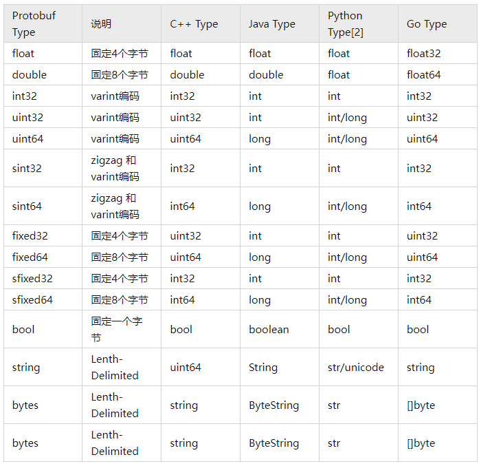
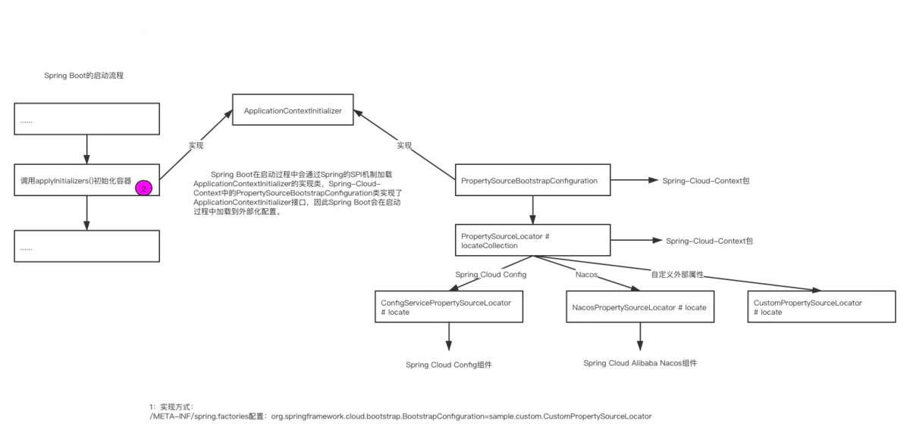
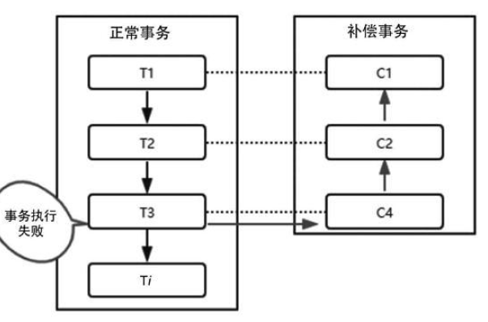

# 微服务

优点：

1. 复杂度可控：一个服务只需要关注一个特定的领域。
2. 技术选型更灵活：每个微服务结合业务特性选择技术栈。
3. 可扩展性更强：可以根据每个微服务的性能要求和业务特点来进行灵活扩展。
4. 独立部署：发布更高效。
5. 容错性：当一个服务发生故障，可以使故障隔离在单服务中。

问题：

1. 故障排查难，一个请求可能会经过多个不同的微服务的多次交互。
2. 服务监控：微服务数量变多。
3. 复杂性增大：分布式系统中网络延迟和故障不可避免。
4. 服务依赖：服务依赖关系更复杂。
5. 运维成本：如何快速部署和统一管理众多的服务。

# 服务治理

主要实现各微服务实例的自动化注册与发现。

为什么需要服务治理模块：

在最初开始构建微服务，服务较少，可通过静态配置完成调用。当随着微服务不断增加，单个服务集群规模也在不断扩大，静态配置变得难以维护，如果通过手工维护的方式，极易发生错误，也必将消耗大量人力，所以使用服务治理模块完成对服务注册、服务发现的自动化管理。

服务注册：

* 每个服务单元向注册中心登记自己提供的服务，将host、port、协议等告知注册中心，注册中心按服务名分类组织服务清单。
* 注册中心以心跳的方式监测清单中的服务是否可用，若不可能需要从服务清单中剔除，达到排除故障服务的效果。

服务发现：

* 由于在服务治理框架下，服务间调用通过向服务名发起请求调用实现。
* 调用方不知道服务方位置，需要向注册中心请求所有服务清单，再发起对服务方的调用。

## Eureka

分为服务端和客户端。

服务端：注册中心，可以集群部署，当集群中有分片出现故障，Eureka转入自我保护模式，它允许在分片故障期间继续提供服务的发现与注册，当故障分片恢复运行时，集群中的其他分片会把它们的状态再次同步。<br>
客户端：处理服务的注册与发现，在服务运行期间，客户端向注册中心注册自己提供的服务并周期性地发送心跳来更新它的服务租约，同时它也能从服务端查询当前注册的服务信息并把它们缓存到本地并周期性地刷新服务状态。

### 架构


* 服务提供者：Eureka client，向 Eureka Server注册和更新自己的信息，同时能从Eureka Server注册表中获取到其他服务的信息。
* 服务注册中心：提供服务注册和发现的功能。每个Eureka Client向Eureka Server注册自己的信息，也可以通过Eureka
  Server获取到其他服务的信息达到发现和调用其他服务的目的。
* 服务消费者：Eureka client，通过Eureka Server获取注册的其他服务信息，从而找到所需要的服务发起远程调用。
* 注册：client向server注册时提供自身的元数据以供服务发现。

续约：通过发送心跳到Server以维持和更新注册表中服务实例元数据的有效性。在一定时长内，Server没有收到Client的心跳信息，将默认下线，会把服务实例信息从注册表中删除。默认情况下为每30秒发送一次，90秒未收到心跳sever会将client剔除。

* 下线：服务提供方在关闭时候通过 `DiscoveryManager.getInstance().shutdownComponent();` 主动向Server注销服务实例元数据，该下线请求不会自动完成。
* 获取注册表：服务消费者Client向Server请求注册表信息，会缓存到本地，并且每隔30秒会更新一次，默认情况下server和client通过json格式获取注册表。

#### 服务注册、续约

默认情况下会使用 `eureka.instance.appname` > `spring.application.name` 作为服务名。

在客户端注册、续约的功能主要通过 `com.netflix.discovery.EurekaClient`实现，主要由`com.netflix.discovery.EurekaClient.HeartbeatThread` 来完成，根据配置`eureka.instance.lease-renewal-interval-in-seconds` 来配置续约的间隔时间，默认30秒，`eureka.instance.lease-expiration-duration-in-seconds`配置多长时间没有收到心跳就剔除，默认90秒，不建议修改。

在服务端由 `com.netflix.eureka.resources` 包来暴露接口，调用`org.springframework.cloud.netflix.eureka.server.InstanceRegistry` 来负责注册、续约、下线逻辑，处理完成会立即同步到其他节点，同步到其他节点是通过`com.netflix.eureka.cluster.PeerEurekaNode` 来完成的。

为什么 client 获取服务实例慢？

1. 注册延迟：client启动后不会立即注册，而是有一个延迟时间，默认 40 秒，可通过`eureka.client.initial-instance-info-replication-interval-seconds` 配置。
2. Server缓存：Server维护每30秒更新一次响应缓存，可通过 `eureka.server.response-cache-update-interval-ms` 配置。
3. Client缓存：Client保留注册表信息的缓存，每30秒更新一次，可通过 `eureka.client.registry-fetch-interval-seconds` 配置。
4. Loadbalancer缓存：可通过 `spring.cloud.loadbalancer.cache.ttl` 配置，默认35秒。

Eureka 的自我保护模式：

如果 Server 在 15 分钟内接收到的服务续约低于 85%，将进入 自我保护模式，不再剔除注册表信息，认为可能是 Server 自身的网络问题导致 Client 不能续约，默认情况下，自我保护模式开启，可使用 `eureka.server.enable-self-preservation` 配置。

### 服务端

#### 使用

1. 引入依赖：

```xml

<project>
    <dependencies>
        <dependency>
            <groupId>org.springframework.cloud</groupId>
            <artifactId>spring-cloud-starter-netflix-eureka-server</artifactId>
        </dependency>
    </dependencies>

    <dependencyManagement>
        <dependencies>
            <dependency>
                <groupId>org.springframework.cloud</groupId>
                <artifactId>spring-cloud-dependencies</artifactId>
                <version>${spring-cloud-dependencies.version}</version>
                <type>pom</type>
                <scope>import</scope>
            </dependency>
        </dependencies>
    </dependencyManagement>
</project>
```

2. 使用 `@EnableEurekaServer` 注解开启注册服务。
3. 向 `application.yml` 添加配置。

单机模式:

```yaml
server:
  port: 30013

eureka:
  instance:
    hostname: localhost
  client:
    # 本服务是否注册到注册中心
    register-with-eureka: false
    # 是否从注册中心获取服务列表
    fetch-registry: false
    service-url:
      # defaultZone 不能分开写，是 Map 接收
      defaultZone: http://${eureka.instance.hostname}:${server.port}/eureka/
```

集群模式:

```yaml
# 节点1
server:
  port: 30014

eureka:
  instance:
    hostname: node1
  client:
    service-url:
      defaultZone: http://node2:30015/eureka/,http://node3:30016/eureka/
```

```yaml
# 节点2
server:
  port: 30015

eureka:
  instance:
    hostname: node2
  client:
    service-url:
      defaultZone: http://node1:30014/eureka/,http://node3:30016/eureka/
```

```yaml
# 节点3
server:
  port: 30016

eureka:
  instance:
    hostname: node3
  client:
    service-url:
      defaultZone: http://node1:30014/eureka/,http://node2:30015/eureka/

```

#### 启动

1. 入口为 `EurekaServerAutoConfiguration`，通过 `@EnableEurekaServer` 激活。

```java

@Configuration(proxyBeanMethods = false)
@Import(EurekaServerInitializerConfiguration.class)
@ConditionalOnBean(EurekaServerMarkerConfiguration.Marker.class)
@EnableConfigurationProperties({EurekaDashboardProperties.class, InstanceRegistryProperties.class})
@PropertySource("classpath:/eureka/server.properties")
public class EurekaServerAutoConfiguration implements WebMvcConfigurer {

    private static final String[] EUREKA_PACKAGES = new String[]{"com.netflix.discovery", "com.netflix.eureka"};

    @Autowired
    private ApplicationInfoManager applicationInfoManager;

    @Autowired
    private EurekaServerConfig eurekaServerConfig;

    @Autowired
    private EurekaClientConfig eurekaClientConfig;

    @Autowired
    private EurekaClient eurekaClient;

    @Autowired
    private InstanceRegistryProperties instanceRegistryProperties;
}
```

2. 初始化 `EurekaServerConfig`，可使用 `EurekaServerConfigBean.PREFIX = eureka.server` 自定义配置。
3. 初始化 `EurekaController`，提供给 dashboard 访问。
4. 初始化 `InstanceRegistry`，客户通过该类进行注册。
5. 初始化 `PeerEurekaNodes` ，负责当有节点注册上来时，通知哪些节点。
6. 初始化 `EurekaServerContext` 。
7. 初始化 `EurekaServerBootstrap` ，会同步其他注册中心的数据到当前注册中心。
8. 初始化 jersey框架，实现 EurekaServer 对外的 restful 接口
9. 加载 `EurekaServerInitializerConfiguration` ，启动 `EurekaServerBootstrap` 。

#### 常用配置

定义在 org.springframework.cloud.netflix.eureka.server.EurekaServerConfigBean 。

| 参数名称                                               | 说明                                                     | 默认值   |
|----------------------------------------------------|--------------------------------------------------------|-------|
| eureka.server.enable-self-preservation             | 启用自我保护机制                                               | true  |
| eureka.server.eviction-interval-timer-in-ms        | 清除无效服务实例的时间间隔（ms）                                      | 60000 |
| eureka.server.delta-retention-timer-interval-in-ms | 清理无效增量信息的时间间隔（ms）                                      | 30000 |
| eureka.server.renewal-percent-threshold            | 15分钟内续约服务的比例小于0.85，则开启自我保护机制，再此期间不会清除已注册的任何服务（即便是无效服务） | 0.85  |
| eureka.server.renewal-threshold-update-interval-ms | 更新续约阈值的间隔（分钟）                                          | 15    |

### 客户端

#### 使用

1. 引入依赖：

```xml

<project>
    <dependencies>
        <dependency>
            <groupId>org.springframework.cloud</groupId>
            <artifactId>spring-cloud-starter-netflix-eureka-client</artifactId>
        </dependency>
    </dependencies>

    <dependencyManagement>
        <dependencies>
            <dependency>
                <groupId>org.springframework.cloud</groupId>
                <artifactId>spring-cloud-dependencies</artifactId>
                <version>${spring-cloud-dependencies.version}</version>
                <type>pom</type>
                <scope>import</scope>
            </dependency>
        </dependencies>
    </dependencyManagement>
</project>
```

2. 使用 @EnableDiscoveryClient 注解连接注册中心。
3. 向 application.yml 添加配置。

单机模式:

```yaml
server:
  port: 30018

eureka:
  instance:
    hostname: producer-single
  client:
    service-url:
      defaultZone: http://node1:30014/eureka/,http://node2:30015/eureka/,http://node3:30016/eureka/

management:
  endpoints:
    web:
      exposure:
        include: info
```

集群配置:

```yaml
# 节点1

server:
  port: 30014

eureka:
  instance:
    hostname: node1
  client:
    service-url:
      defaultZone: http://node2:30015/eureka/,http://node3:30016/eureka/
```

```yaml
# 节点2

server:
  port: 30015

eureka:
  instance:
    hostname: node2
  client:
    service-url:
      defaultZone: http://node1:30014/eureka/,http://node3:30016/eureka/
```

```yaml
# 节点3

server:
  port: 30016

eureka:
  instance:
    hostname: node3
  client:
    service-url:
      defaultZone: http://node1:30014/eureka/,http://node2:30015/eureka/
```

#### CLIENT 常用配置

定义在 `org.springframework.cloud.netflix.eureka.EurekaClientConfigBean` 。

| 参数名称                                                             | 说明                                                                                                                       | 默认值  |
|------------------------------------------------------------------|--------------------------------------------------------------------------------------------------------------------------|------|
| eureka.client.serviceUrl.defaultZone                             | 可用区域映射到与eureka服务器通信的完全限定URL列表。每个值可以是单个URL或逗号分隔的备用位置列表。<br> (`http://${eureka.instance.hostname}:${server.port}/eureka/`) |      |
| eureka.client.register-with-eureka                               | 指示此实例是否应将其信息注册到eureka服务器以供其他服务发现                                                                                         | True |
| eureka.client.fetch-registry                                     | 客户端是否获取eureka服务器注册表上的注册信息                                                                                                | true |
| eureka.client.registry-fetch-interval-seconds                    | 指示从eureka服务器获取注册表信息的频率（s）                                                                                                | 30   |
| eureka.client.initial-instance-info-replication-interval-seconds | 初始化实例信息到Eureka服务端的间隔时间（s）                                                                                                | 40   |
| eureka.client.eureka-service-url-poll-interval-seconds           | 询问Eureka Server信息变化的时间间隔（s）                                                                                              | 300  |
| eureka.client.eureka-server-read-timeout-seconds                 | 读取Eureka Server 超时时间（s）                                                                                                  | 8    |
| eureka.client.eureka-server-connect-timeout-seconds              | 连接Eureka Server 超时时间（s）                                                                                                  | 5    |

#### 元数据 常用配置

定义在 `org.springframework.cloud.netflix.eureka.EurekaInstanceConfigBean` ，服务注册时会包装成`com.netflix.appinfo.InstanceInfo` 注册。

| 参数名称                                                 | 说明                                    | 默认值                     |
|------------------------------------------------------|---------------------------------------|-------------------------|
| eureka.instance.prefer-ip-address                    | 是否优先使用服务实例的IP地址，相较于hostname           | false                   |
| eureka.instance.ip-address                           | 该服务实例的IP地址                            | null                    |
| eureka.instance.lease-renewal-interval-in-seconds    | 该服务实例向注册中心发送心跳间隔（s）                   | 30                      |
| eureka.instance.lease-expiration-duration-in-seconds | 指示eureka服务器在删除此实例之前收到最后一次心跳之后等待的时间（s） | 90                      |
| eureka.instance.appname                              | 注册到注册中心的应用名称                          | spring.application.name |
| eureka.instance.hostname                             | 该服务实例所在主机名                            |                         |
| eureka.instance.status-page-url-path                 | 该服务实例的状态检查地址，相对地址                     | /actuator/info          |
| eureka.instance.health-check-url-path                | 该服务实例的健康检查地址，相对地址                     | /actuator/health        |

## nacos

动态路由刷新：[动态路由刷新](extend/NacosDynamicRouteService.md)

### 使用

#### 服务端部署

1. 从 https://github.com/alibaba/nacos/releases 下载

单机模式：

1. 可配置 Mysql 数据库，先执行 `nacos-mysql.sql`。
2. 再修改 `conf/application.properties`

```properties
spring.datasource.platform=mysql
db.num=1
db.url.0=jdbc:mysql://11.162.196.16:3306/nacos_devtest?characterEncoding=utf8&connectTimeout=1000&socketTimeout=3000&autoReconnect=true
db.user=nacos_devtest
db.password=youdontknow
```

3. 执行 `sh startup.sh -m standalone` 。

集群模式:

1. 配置 `conf/cluster.conf` , 需要 3个 或 3个以上节点。
2. 再修改 `conf/application.properties`

```properties
spring.datasource.platform=mysql
db.num=1
db.url.0=jdbc:mysql://11.162.196.16:3306/nacos_devtest?characterEncoding=utf8&connectTimeout=1000&socketTimeout=3000&autoReconnect=true
db.user=nacos_devtest
db.password=youdontknow
```

3. 执行 `sh startup.sh`。
4. 集群使用 nginx 做负载均衡。

#### 客户端

1. 添加依赖

```xml

<dependencies>
    <dependency>
        <groupId>org.springframework.cloud</groupId>
        <artifactId>spring-cloud-starter-bootstrap</artifactId>
    </dependency>

    <dependency>
        <groupId>com.alibaba.cloud</groupId>
        <artifactId>spring-cloud-starter-alibaba-nacos-discovery</artifactId>
    </dependency>
</dependencies>
```

2. 配置文件

```yaml
spring:
  cloud:
    nacos:
      server-addr: xxxxx
```

3. 使用 @EnableDiscoveryClient 进行服务注册与发现。

### 配置

nacos 配置管理将服务划分为 Namespace + Group + Data ID， Data ID 由 `${prefix}-${spring.profiles.active}.${file-extension}`
构成：

* prefix 默认为 `spring.application.name` 的值，也可以通过配置项 `spring.cloud.nacos.config.prefix`来配置。
* `spring.profiles.active` 即为当前环境对应的 profile，当 `spring.profiles.active` 为空时，dataId 的拼接格式变成`${prefix}.${file-extension}`
* `file-exetension` 为配置内容的数据格式，可以通过配置项 `spring.cloud.nacos.config.file-extension` 来配置，默认使用 properties。

实际使用中可Namespace 区分不同的租户，比如深圳环境、佛山环境，使用 Group
区分不同的开发者，也可用来在同一个Namespace分区不同的Group，例如在深圳环境下部署了两套系统。

### 原理

#### 服务注册

SpringCloud 抽象：在 `AutoServiceRegistrationAutoConfiguration` 中注入 `AutoServiceRegistration`。

1. `AutoServiceRegistration` 的子类 `AbstractAutoServiceRegistration` 会监听 `WebServerInitializedEvent` 事件，服务启动后会调用`ServiceRegistry.register(Registration)` 向注册中心注册。
2. 只需继承 `AbstractAutoServiceRegistration` ，实现 `ServiceRegistry` 、`Registration` 即可完成启动时注册。

nacos 实现：

1. `NacosAutoServiceRegistration` 继承 `AbstractAutoServiceRegistration`，由 `NacosServiceRegistryAutoConfiguration` 负责配置。
2. `NacosServiceRegistry` ，实现 `ServiceRegistry` 负责客户端注册，nacos 注册由 `NamingService` 负责，`NamingService` 中`NamingProxy` 负责使用 `HttpClient` 与服务端通信，完成注册等功能，`BeatReactor` 负责维持心跳，重连等功能，`HostReactor`会定时查询服务信息，缓存服务信息。
3. `NacosRegistration` 实现 `Registration` 定义客户端元数据。


客户端每隔 5 秒会发送一次心跳，服务端每隔15秒没收到心跳视为服务不健康，并通知所有消费者更新服务列表，30秒没收到心跳则剔除服务。

这几个数值可通过 `spring.cloud.nacos.discovery.metadata` 设置,常量定义在 `PreservedMetadataKeys` ，如下：

* `preserved.heart.beat.interval: 5000` #该实例在客户端上报心跳的间隔时间。（单位:毫秒）
* `preserved.heart.beat.timeout: 15000` #该实例在不发送心跳后，从健康到不健康的时间。（单位:毫秒）
* `preserved.ip.delete.timeout: 30000` #该实例在不发送心跳后，被nacos下掉该实例的时间。（单位:毫秒）

#### 服务发现

SpringCloud 抽象了 `DiscoveryClient` 的接口，`NacosDiscoveryClient` 实现该接口，并在 `NacosDiscoveryClientConfiguration` 配置。

`NacosDiscoveryClient` 使用 `NacosServiceDiscovery` 中的 `NamingService` 获取服务列表，`NamingService` 的服务列表由 `HostReactor`负责维护，HostReactor 每个10秒会请求服务列表缓存起来，当服务端感知服务变化时也会推送给 HostReactor 。

`LoadBalancerClient` 通过 `ReactiveLoadBalancer` 从 `ServiceInstanceListSupplier` 获取 服务，`ServiceInstanceListSupplier` 通过`NacosDiscoveryClient` 获取 服务列表。

`OpenFeign` 调用 `LoadBalancerClient` 完成远程访问。


#### Raft

RAFT算法有三种基本的状态：`follower`、`candidate`、`leader`。

* 处于follower状态的server不会发起任何的request，只是被动的响应leader和candidate。

* 处于leader状态的server会主动的发送心跳包给各个follower，并且接收client所有的request。

* candidate是一种过渡状态，只有整个cluster在进行新的选举的时候，才会出现此种状态的server。

Raft系统在任意时刻最多只有一个Leader，正常工作期间只有Leader和Followers。

Follower只响应其他服务器的请求。如果Follower超时没有收到Leader的消息，它会成为一个Candidate并且开始一次Leader选举。收到大多数服务器投票的Candidate会成为新的Leader。Leader在宕机之前会一直保持Leader的状态。

Raft
使用心跳（heartbeat）触发Leader选举。当服务器启动时，初始化为Follower。Leader向所有Followers周期性发送heartbeat。如果Follower在选举超时时间内没有收到Leader的heartbeat，就会等待一段随机的时间后发起一次Leader选举。

Follower将其当前term加一然后转换为Candidate。它首先给自己投票并且给集群中的其他服务器发送 RequestVote
RPC,每次选举只能投一票,结果有以下三种情况：

* 赢得了多数的选票，成功选举为Leader；
* 收到了Leader的消息，表示有其它服务器已经抢先当选了Leader；
* 没有服务器赢得多数的选票，Leader选举失败，等待选举时间超时后发起下一次选举。


# 服务调用

Ribbon：Netflix开源的基于HTTP和TCP等协议负载均衡组件，需要手动代码调用服务端。

Feign：内置Ribbon，用来做客户端负载均衡，去调用服务注册中心的服务，不支持Spring MVC的注解，它有一套自己的注解，已不推荐使用。

OpenFeign：在Feign的基础上支持了Spring MVC的注解，如`@RequesMapping`等等，可以使用@FeignClient解析SpringMVC的`@RequestMapping`注解下的接口，并通过动态代理的方式产生实现类，实现类中做负载均衡并调用其他服务。

loadbalancer：用于替代Ribbon，负责负载均衡。

## OpenFeign

SpringCloud 高版本 openfeign 已经移除 Hystrix 和 Ribbon，内置 loadbalancer 做负载均衡，推荐使用 Resilience4j 做熔断。

### 使用

1. 引入依赖

```xml

<dependencies>
    <dependency>
        <groupId>org.springframework.cloud</groupId>
        <artifactId>spring-cloud-starter-netflix-eureka-client</artifactId>
    </dependency>

    <dependency>
        <groupId>org.springframework.cloud</groupId>
        <artifactId>spring-cloud-starter-openfeign</artifactId>
    </dependency>
</dependencies>
```

2. 使用 `@EnableFeignClients` 启用 `OpenFeign`。
3. 向 `application.yml` 添加配置。

```yaml
server:
  port: 30022

eureka:
  instance:
    hostname: openfeign-consumer
  client:
    service-url:
      defaultZone: http://node1:30014/eureka/,http://node2:30015/eureka/,http://node3:30016/eureka/

management:
  endpoints:
    web:
      exposure:
        include: info
```

4. 编写调用类。

```java

@FeignClient(name = "${service.name.producer}", path = "/v1/instance")
public interface InstanceFeign {

    /**
     * get host name
     * @return hostName
     */
    @GetMapping("/hostName")
    String hostName();
}
```

默认使用 `HttpURLConnection`，没有连接池，可使用 Apache HttpClient 或 okhttp 优化性能。

可以使用 `@SpringQueryMap` 给 GET 请求映射 POJO 参数。

可以使用 `@MatrixVariable` ，例如

```java

@GetMapping("/objects/links/{matrixVars}")
Map<String, List<String>> getObjects(@MatrixVariable Map<String, List<String>> matrixVars);
```

`feign.client.refresh-enabled=true` 可启用配置刷新功能，`POST /actuator/refresh` ，不能使用 `@RefreshScope`

#### 启动 Apache HttpClient

1. 增加依赖

```xml

<dependency>
    <groupId>io.github.openfeign</groupId>
    <artifactId>feign-httpclient</artifactId>
</dependency>
```

2. 开启配置

```yaml
feign:
  httpclient:
    enabled: true
```

#### 启动 okhttp

1. 增加依赖

```xml

<dependency>
    <groupId>io.github.openfeign</groupId>
    <artifactId>feign-okhttp</artifactId>
</dependency>
```

2. 开启配置

```yaml
feign:
  httpclient:
    enabled: false
  okhttp:
    enabled: true
```

#### 配置configruation

注意 `DefaultFeignConfig` 不需要 `@Configuration` 注释,`@Configuration` 表示给所有FeignCLient配置

```java
public class DefaultFeignConfig {

    @Bean
    public Request.Options options() {
        return new Request.Options(
                // 连接超时配置
                5, TimeUnit.SECONDS,
                // 读超时配置
                6, TimeUnit.SECONDS,
                // 如果请求响应3xx，是否重定向请求
                false);
    }

}

@FeignClient(name = "demo",
        path = "/v1",
        url = "${fegin-client.demo-url}",
        configuration = {DefaultFeignConfig.class})
public interface DemoService {
}

```

OpenFeign 默认配置在 FeignClientsConfiguration：

* `Decoder`：`new OptionalDecoder(new ResponseEntityDecoder(new SpringDecoder(messageConverters, customizers)));`
* `Encoder`：`new SpringEncoder(new SpringFormEncoder(), messageConverters, encoderProperties, customizers);`
* `Logger`：`new Slf4jLogger(type);`
* `Contract`：`new SpringMvcContract(parameterProcessors, feignConversionService, decodeSlash);`
* `Feign.Builder`：`FeignCircuitBreaker.builder();`
* `CachingCapability`：可使用 `@Cacheable` 注解。

可以自己添加的配置：

* `Logger.Level`：这个是用来控制输出什么内容，日志框架级别还是DEBUG
    - `NONE`, 不记录（默认）。
    - `BASIC`, 只记录请求方法和 URL 以及响应状态码和执行时间。
    - `HEADERS`, 记录基本信息以及请求和响应标头。
    - `FULL`, 记录请求和响应的标头、正文和元数据。
* `Retryer`：会重试 `IOException` 和 `ErrorDecoder` 返回的 `RetryableException`。
* `ErrorDecoder`：默认情况下直接抛出 `RetryableException`。
* `Request.Options`：设置读写超时
* `Collection<RequestInterceptor>`：可以在远程调用前修改 `RestTemplate` 。
* `SetterFactory`
* `QueryMapEncoder`
* `Capability`

##### 配置日志内容

```java

@Configuration
public class FeignLogLevelConfiguration {
    @Bean
    Logger.Level feignLevel() {
        return Logger.Level.FULL;
    }
}
```

```yaml
logging:
  level:
    # feign日志以什么级别监控哪个接口
    com.king.springcloud.service.OrderFeignService: debug
```

##### 配置重试

```java
public class RetryConfiguration {

    @Bean
    public Retryer retryer() {
        return new Retryer.Default(500, TimeUnit.SECONDS.toMillis(2), 5);
    }

}

@FeignClient(name = "demo",
        path = "/v1",
        url = "${fegin-client.demo-url}",
        configuration = {RetryConfiguration.class})
public interface DemoService {
}
```

Retryer.Default 的三个参数：

* `maxAttempts`：重试次数
* `period`：重试间隔时间
* `maxPeriod`：最大周期，重试间隔时间按照一定的规则(1.5倍)逐渐增大，但不能超过最大周期。

#### 配置ErrorDecoder

#### @FeignClient详解

* `contextId` : 当 name 相同时，可通过 contextId 区分。
* `name` ：指定FeignClient的名称，name属性会作为微服务的名称，用于服务发现。
* `url` ：一般用于调试，可以手动指定@FeignClient调用的地址。
* `decode404` ：当发生http 404错误时，如果该字段位true，会调用Decoder进行解码，默认调用 `ErrorCoder` 解码。
* `configuration`: Feign配置类，可以自定义Feign的`Encoder`、`Decoder`、`LogLevel`、`Contract`。
* `fallback`: 定义容错的处理类，当调用远程接口失败或超时，会调用对应接口的容错逻辑，fallback指定的类必须实现`@FeignClient`标记的接口。在使用fallback属性时，需要使用`@Component`注解，保证fallback类被Spring容器扫描到。
* `fallbackFactory`：工厂类，用于生成fallback类示例，通过这个属性我们可以实现每个接口通用的容错逻辑，减少重复的代码。
* `path`：定义当前FeignClient的统一前缀，例如controller上有加接口前缀的话就要写在这里。

`fallback` 、`fallbackFactory` 需要 `feign.circuitbreaker.enabled = true` 配置。

### 启动

1. `@EnableFeignClients` 导入 `FeignClientsRegistrar` ，`FeignClientsRegistrar` 实现 `ImportBeanDefinitionRegistrar`，`ImportBeanDefinitionRegistrar` 由 `ConfigurationClassPostProcessor` 调用。
2. 使用 `@EnableFeignClients` 中 `defaultConfiguration` 设置为所有 Feign 的默认 Configuration。
3. 扫描所有的 `@FeignClient` 组装为 `FeignClientFactoryBean` ，注入到容器里。
4. 自动装配。

```text
org.springframework.boot.autoconfigure.EnableAutoConfiguration=\
org.springframework.cloud.openfeign.hateoas.FeignHalAutoConfiguration,\
org.springframework.cloud.openfeign.FeignAutoConfiguration,\
org.springframework.cloud.openfeign.encoding.FeignAcceptGzipEncodingAutoConfiguration,\
org.springframework.cloud.openfeign.encoding.FeignContentGzipEncodingAutoConfiguration,\
org.springframework.cloud.openfeign.loadbalancer.FeignLoadBalancerAutoConfiguration
```

#### FeignAutoConfiguration

1. 注入3个配置类 `FeignClientProperties`，`FeignHttpClientProperties`，`FeignEncoderProperties`,不建议在yml配置文件中配置重试器和请求拦截器。
2. 注入 `FeignContext` ，`FeignContext#createContext(String name) `会生成一个`AnnotationConfigApplicationContext`，并将`FeignClientsConfiguration` 注册进去，每个Client都有独立的容器。
3. 根据配置选择创建 `HttpURLConnection`、`Apache HttpClient`、`okhttp`，默认 `HttpURLConnection`
4. 根据 `feign.circuitbreaker.enabled` 选择是否使用断路器包装OpenFeign客户端。

#### FeignAcceptGzipEncodingAutoConfiguration、FeignContentGzipEncodingAutoConfiguration

负责处理 `feign.compression.request.enabled` 、`feign.compression.response.enabled`

#### FeignLoadBalancerAutoConfiguration

负责配置 LoadBalancer。

1. `HttpClientFeignLoadBalancerConfiguration` 处理 Apache HttpClient。
2. `OkHttpFeignLoadBalancerConfiguration` 处理 okhttp。
3. `HttpClient5FeignLoadBalancerConfiguration` 处理 ApacheHttp5Client。
4. `DefaultFeignLoadBalancerConfiguration` 处理 HttpURLConnection、Apache。

默认使用 `FeignBlockingLoadBalancerClient` 包装 客户端

如果添加依赖

```xml

<dependency>
    <groupId>org.springframework.retry</groupId>
    <artifactId>spring-retry</artifactId>
</dependency>
```

并且设置 `spring.cloud.loadbalancer.retry.enabled = true` ，使用 `RetryableFeignBlockingLoadBalancerClient` 包装客户端。

### 调用

1. 调用 `FeignClientFactoryBean#getObject()` 生成 `feign.ReflectiveFeign.FeignInvocationHandler`，注入 FeignClient，其中`FeignClientFactoryBean#feign()` 负责注入配置在 configuration 的Bean，包括 `Decoder`、`Request.Options`等等。
2. 每个`FeignInvocationHandler`中包含多个 `SynchronousMethodHandler` 对应 FeignClient 的方法。
3. 最终由 `SynchronousMethodHandler` 执行，如果抛出IOException，会直接包装成`RetryableException`然后重试，如果正常返回则由`AsyncResponseHandler`负责处理 Response，值得注意的是状态码200 - 300 调用 Decoder 解码，其他状态码调用 ErrorCoder 解码，默认 ErrorCoder 会抛出 FeignException ，如果 reponse head 包含 Retry-After 会抛出 RetryableException 进行重试，另外默认情况下 404 状态码也是使用 ErrorCoder 解码，可通过配置 `decode404 = true` 来使其调用 Decoder 解码。

##### 配置

| 配置                                         | 默认值                                           | 描述                                                                                |
|--------------------------------------------|-----------------------------------------------|-----------------------------------------------------------------------------------|
| feign.compression.request.enabled          | false                                         | 允许压缩Feign发送的请求                                                                    |
| feign.compression.request.mime-types       | [text/xml, application/xml, application/json] | 支持的mime类型列表。                                                                      |
| feign.compression.request.min-request-size | 2048	最小阈值内容大小。                                |                                                                                   |
| feign.compression.response.enabled         | false                                         | 允许压缩来自Feign的响应。                                                                   |
| feign.compression.response.useGzipDecoder  | false                                         | 启用要使用的默认gzip解码器。                                                                  |
| feign.httpclient.connection-timeout        | 2000                                          |                                                                                   |
| feign.httpclient.connection-timer-repeat   | 3000                                          |                                                                                   |
| feign.httpclient.disable-ssl-validation    | false                                         |                                                                                   |
| feign.httpclient.enabled                   | true                                          | 允许通过Feign使用Apache HTTP客户端。                                                        |
| feign.httpclient.follow-redirects          | true                                          |                                                                                   |
| feign.httpclient.max-connections           | 200                                           |                                                                                   |
| feign.httpclient.max-connections-per-route | 50                                            |                                                                                   |
| feign.httpclient.time-to-live              | 900                                           | 生存时间                                                                              |
| feign.httpclient.time-to-live-unit         | SECONDS                                       |                                                                                   |
| feign.circuitbreaker.enabled               | false                                         | 如果为true，则将使用Hystrix断路器包装OpenFeign客户端。</br> 2020版本后，之前为 feign.hystrix.enabled=true |
| feign.okhttp.enabled                       | false                                         | 启用Feign使用OK HTTP Client。                                                          |

## Grpc

### 使用

1. 添加依赖

```xml

<dependency>
    <groupId>io.github.lognet</groupId>
    <artifactId>grpc-spring-boot-starter</artifactId>
</dependency>
```

2. 添加编译插件

```xml

<project>
    <extensions>
        <extension>
            <groupId>kr.motd.maven</groupId>
            <artifactId>os-maven-plugin</artifactId>
            <version>1.7.0</version>
        </extension>
    </extensions>
    <plugins>
        <plugin>
            <groupId>org.xolstice.maven.plugins</groupId>
            <artifactId>protobuf-maven-plugin</artifactId>
            <version>0.6.1</version>
            <configuration>
                <protocArtifact>com.google.protobuf:protoc:3.5.1-1:exe:${os.detected.classifier}</protocArtifact>
                <pluginId>grpc-java</pluginId>
                <pluginArtifact>io.grpc:protoc-gen-grpc-java:1.16.1:exe:${os.detected.classifier}</pluginArtifact>
            </configuration>
            <executions>
                <execution>
                    <goals>
                        <goal>compile</goal>
                        <goal>compile-custom</goal>
                    </goals>
                </execution>
            </executions>
        </plugin>
    </plugins>
</project>

```

3. 编写 .proto 文件。
4. 编译。
5. 编写服务端：继承 xxxxImplBase,例如：

```java
// 启动服务
@GrpcService
public class GrpcServerService extends OrderQueryGrpc.OrderQueryImplBase {

    @Override
    public void listOrders(Buyer request, StreamObserver<Order> responseObserver) {
        for (Order order : mockOrders()) {
            // 发送数据给客户端，可以多次发送
            responseObserver.onNext(order);
        }
        // 关闭流终结客户端调用
        responseObserver.onCompleted();
        // 返回异常
        responseObserver.onError(new StatusException(Status.NOT_FOUND));
    }
}
```

不使用 `@GrpcService` ,手动编码方式：

```java
public void test() {
    Server server = ServerBuilder.forPort(50051)
            .addService(new xxxxService())
            .addService(new xxxxService())
            .build()
            .start();

    Runtime.getRuntime().addShutdownHook(new Thread(() -> {
        if (server != null) {
            server.shutdown();
        }
    }));

    server.awaitTermination();
}
```

6. 编写客户端。

```java
public void test() {
    ManagedChannel channel = ManagedChannelBuilder.forAddress("ip", port).usePlaintext().build();

    xxxxGrpc.xxxxBlockingStub stub = xxxxGrpc.newBlockingStub(channel);

    stub.xxxx(xxxx);

    channel.shutdown().awaitTermination(5, TimeUnit.SECONDS);
}
```

* `usePlaintext()`：表示使用明文传输。
* `BlockingStub`：会一直等待，直到接收服务器的响应为止。
* `NonBlockingStub`：不会等待服务器的响应，会注册一个观察者（observer）来接收响应。

通信模式：

| 服务类型      | 特点                                      |
|-----------|-----------------------------------------|
| 一元 RPC    | 一般的rpc调用，传入一个请求对象，返回一个返回对象              |
| 服务端流式 RPC | 传入一个请求对象，服务端可以返回多个结果对象                  |
| 客户端流式 RPC | 客户端传入多个请求对象，服务端返回一个结果对象                 |
| 双向流式 RPC  | 结合客户端流式RPC和服务端流式RPC，可以传入多个请求对象，返回多个结果对象 |

一元模式：客户端发起一次请求，服务端响应一个数据，每一次都是发起一个独立的tcp连接，走一次三次握手和四次挥手。

* 客户端发送消息后会添加一个 EOS 标记，标记请求消息结束，客户端进入半关状态，客户端不能发送消息，但是可以监听服务端。
* 服务端生成响应后，会发送带有状态详情的trailer头信息后，通信就会关闭。

```text
rpc simpleHello(Person) returns (Result) {}
```

客户端流式 RPC ：客户端传入多个请求对象，服务端返回一个响应结果，例如 物联网终端向服务器报送数据。

* 客户端发送多条消息后才会发送 EOS。

```text
rpc clientStreamHello(stream Person) returns (Result) {}
```

服务端流式 RPC ： 客户端发出一个请求，但不会立即得到一个响应，而是在服务端与客户端之间建立一个单向的流，服务端可以随时向流中写入多个响应消息，最后主动关闭流，而客户端需要监听这个流，不断获取响应直到流关闭。

* 服务端发送多条消息后才会发送 trailer。

场景： 客户端向服务端发送一个股票代码，服务端就把该股票的实时数据源源不断的返回给客户端。

```text
rpc serverStreamHello(Person) returns (stream Result) {}
```

双向流式 RPC ：可以传入多个对象，返回多个响应对象，例如：聊天应用

* 客户端发送多条消息后才会发送 EOS。
* 服务端发送多条消息后才会发送 trailer。

```text
rpc biStreamHello(stream Person) returns (stream Result) {}
```

stub 类型：

```java
// 异步的Stub，支持所有的通信模式。
public static xxxxStub newStub(io.grpc.Channel channel);

// 阻塞的 Stub 支持 一元调用 和 服务端流式 RPC。
public static xxxxStub newBlockingStub(io.grpc.Channel channel);

// Furture 风格 的 Stub，支持 一元调用。
public static xxxxStub newFutureStub(io.grpc.Channel channel);
```

实例：

1. 客户端流式：`withDeadlineAfter` 当超出该时间，客户端会关闭，服务端也会停止调用，和timeout不一样，timeout 服务器会继续执行，只是返回不到客户端。

```protobuf
syntax = "proto3";

package client_streaming;

option java_multiple_files = true;
option java_package = "com.tomato.wangzh.grpc.common";

message UploadFileRequest {
  oneof data {
    FileInfo file_info = 1;
    bytes file_data = 2;
  }
}

message UploadFileResponse {
  string file_id = 1;
  string size = 2;
}

message FileInfo {
  string file_id = 1;
  string file_type = 2;
}

service UploadFileService {
  // stream 代表 客户端流
  rpc uploadFile(stream UploadFileRequest) returns (UploadFileResponse) {}
}
```

```java
public void test() {
    ManagedChannel channel = ManagedChannelBuilder.forAddress("ip", port).usePlaintext().build();

    xxxxGrpc.xxxxStub stub = xxxxGrpc.newStub(channel);

    CountDownLatch countDownLatch = new CountDownLatch(1);
// 读取文件数据
    InputStream in = GrpcUploadClient.class.getResourceAsStream("/file/1.jpg");
    StreamObserver<UploadFileRequest> requestObserver = stub.withDeadlineAfter(5, TimeUnit.SECONDS)
            .uploadFile(new StreamObserver<UploadFileResponse>() {
                @Override
                public void onNext(UploadFileResponse value) {
                    // 获取服务端响应的结果
                    logger.log(Level.INFO, MessageFormat.format("响应的文件id:  {0}", value.getFileId()));
                    logger.log(Level.INFO, MessageFormat.format("响应的文件大小:  {0}", value.getSize()));
                }

                @Override
                public void onError(Throwable t) {
                    logger.log(Level.SEVERE, MessageFormat.format("接受数据异常:  {0}", t));
                    countDownLatch.countDown();
                }

                @Override
                public void onCompleted() {
                    logger.log(Level.INFO, "上传完成");
                    countDownLatch.countDown();
                }
            });

    // 构建文件信息
    FileInfo fileInfo = FileInfo.newBuilder().setFileType("jpg").setFileId(UUID.randomUUID().toString()).build();
    // 根据流程图，先发送文件信息
    UploadFileRequest request = UploadFileRequest.newBuilder().setFileInfo(fileInfo).build();
    // 发送文件信息
    requestObserver.onNext(request);

    // 构建数组
    byte[] bytes = new byte[1024];
    while (true) {
        int count = in.read(bytes);
        // 如果数据读完，那么就跳出循环
        if (count <= 0) {
            break;
        }

        // 如果传送结束或者发生异常，则结束整个方法
        if (countDownLatch.getCount() == 0) {
            return;
        }

        request = UploadFileRequest.newBuilder()
                .setFileData(ByteString.copyFrom(bytes))
                .build();
        requestObserver.onNext(request);
        logger.info(MessageFormat.format("send  data  size  :  {0}", count));
    }
    // 执行该方法代表传送完成
    requestObserver.onCompleted();

    // 如果两秒之内没有传送完成，则发生异常
    if (countDownLatch.await(1, TimeUnit.MINUTES)) {
        logger.info("Within one minute, the data was not transmitted");
    }
}
```

```java
public class GrpcUploadService extends UploadFileServiceGrpc.UploadFileServiceImplBase {
    private static final Logger logger = Logger.getLogger(GrpcUploadService.class.getName());

    @Override
    public StreamObserver<UploadFileRequest> uploadFile(StreamObserver<UploadFileResponse> responseObserver) throws FileNotFoundException {
        return new StreamObserver<UploadFileRequest>() {
            /**
             *	获取客户端发送过来的数据
             *    @param value
             */
            long size = 0;
            //构建文件输出流

            Integer id = new Random().nextInt(100);
            FileOutputStream out = new FileOutputStream(id + ".jpg");
        };
    }

    public void onNext(UploadFileRequest value) {
        try {
            // 1.获取发送过来的流类型
            UploadFileRequest.DataCase dataCase = value.getDataCase();
            // 如果是文件信息则对文件信息处理
            if (Objects.equals(dataCase, UploadFileRequest.DataCase.FILE_INFO)) {
                String fileId = value.getFileInfo().getFileId();
                String fileType = value.getFileInfo().getFileType();
            } else if (Objects.equals(dataCase, UploadFileRequest.DataCase.FILE_DATA)) {
                size += value.getFileData().size();
                out.write(value.getFileData().toByteArray());
            }
        } catch (IOException e) {
            e.printStackTrace();
            responseObserver.onError(Status.INTERNAL.withDescription("server  write  error"));
        }
    }

    @Override
    public void onError(Throwable t) {
        logger.log(Level.SEVERE, MessageFormat.format("client  send  data  error:  {0}", t));
    }

    @Override
    public void onCompleted() {
        try {
            // 传输完成，则响应客户端一个信息
            out.flush();
            out.close();
            UploadFileResponse response = UploadFileResponse.newBuilder().setFileId(id.toString()).setSize(size + "").build();
            responseObserver.onNext(response);
            responseObserver.onCompleted();
        } catch (IOException e) {
            e.printStackTrace();
            responseObserver.onError(Status.DATA_LOSS.withDescription(e.getMessage()).asRuntimeException());
        }
    }
}
```

2. 服务端流式

```protobuf
syntax = "proto3";
package server_streaing;

option java_multiple_files = true;
option java_package = "com.tomato.wangzh.grpc.common";
// 定义请求的消息
message Request {
  uint32 number = 1;
}

// 定义响应的消息
message Response {
  uint32 result = 1;
}

// 定义请求
service ServerStreamingService {
  rpc getResult(Request) returns (stream Response);
}
```

```java
public class NumberService extends ServerStreamingServiceGrpc.ServerStreamingServiceImplBase {
    @Override
    public void getResult(Request request, StreamObserver<Response> responseObserver) {
        int number = request.getNumber();
        if (Context.current().isCancelled()) {
            responseObserver.onError(Status.CANCELLED.withDescription("xxxx")).asRuntimeException();
            return;
        }
        for (int i = 1; i <= 100; i++) {
            if (i % number == 0) {
                Reponse response = Reponse.newBuilder().setResult(i).build();
                responseObserver.onNext(response);
            }
        }
        responseObserver.onCompleted();
    }
}

```

```java
public void test() {
    ManagedChannel channel = ManagedChannelBuilder.forAddress("ip", port).usePlaintext().build();

    xxxxGrpc.xxxxStub stub = xxxxGrpc.newStub(channel);

    stub.getResult(Request.newBuilder().setNumber(5).build(),
            new StreamObserver<Reponse>() {

                @Override
                public void onNext(Response response) {
                    logger.info(MessageFormat.format("服务端发送过来的数字:{0}", response.getResult()));
                }

                @Override
                public void onError(Throwable throwable) {
                    logger.log(Level.WARNING, MessageFormat.format("数据发送错误:{0}", throwable.getMessage()));
                }

                @Override
                public void onCompleted() {
                    logger.info("数据传送完成");
                }
            });
}
```

3. 双向流式：

```protobuf
syntax = "proto3";

package bidirectional_streaming;

// 代表生成java文件在哪个包底下
option java_package = "com.tomato.wangzh.grpc.common";

// 代表生成多个文件
option java_multiple_files = true;

// 定义请求消息
message ProductRequest {
  string id = 1;
}

// 定义响应消息
message ProductResponse {
  Product product = 1;
}

// 定义响应消息内容
message Product {
  string id = 1;
  string name = 2;
  double price = 3;
}

service ProductService {
  rpc getProductById(stream ProductRequest) returns(stream ProductResponse) {}
}
```

```java
public class ProductService extends ProductServiceGrpc.ProductServiceImplBase {
    @Override
    public StreamObserver<ProductRequest> getProductById(StreamObserver<ProductResponse> responseObserver) {
        return new StreamObserver<ProductRequest>() {
            @Override
            public void onNext(ProductRequest productRequest) {
                // 接收客户端消息
                logger.info(MessageFormat.format("接受客户端的数据:{0}", productRequest.getId()));

                // 处理客户端取消连接问题
                if (Context.ROOT.isCancelled()) {
                    responseObserver.onError(Status.CANCELLED.withDescription("客户端取消了链接").asRuntimeException());
                    responseObserver.onCompleted();
                    return;
                }

                responseObserver.onNext(productResponse);
            }

            @Override
            public void onError(Throwable throwable) {
                logger.log(Level.WARNING, "接受数据发生了异常");
                responseObserver.onError(Status.CANCELLED.withDescription(MessageFormat.format("接受数据发生了异常:{0}", throwable.getMessage())).asRuntimeException());
                responseObserver.onCompleted();
            }

            @Override
            public void onCompleted() {
                // 数据接受完成，即响应完成
                responseObserver.onCompleted();
            }
        };
    }
}
```

```java
public void test() {
    ManagedChannel channel = ManagedChannelBuilder.forAddress("ip", port).usePlaintext().build();

    xxxxGrpc.xxxxStub stub = xxxxGrpc.newStub(channel);

    StreamObserver<ProductRequest> requestObserver = stub.getProductById(new StreamObserver<ProductResponse>() {
        @Override
        public void onNext(Response response) {
            logger.info(MessageFormat.format("服务端发送过来的数字:{0}", response.getResult()));
        }

        @Override
        public void onError(Throwable throwable) {
            logger.log(Level.WARNING, MessageFormat.format("数据发送错误:{0}", throwable.getMessage()));
        }

        @Override
        public void onCompleted() {
            logger.info("数据传送完成");
        }
    });

    ids.forEach(id -> {
        requestObserver.onNext(ProductRequest);
    });

    requestObserver.onCompleted();
}
```

拦截器：

客户端：ClientInterceptor

```java

@Slf4j
public class CustomClientInterceptor implements ClientInterceptor {
    @Override
    public <ReqT, RespT> ClientCall<ReqT, RespT> interceptCall(MethodDescriptor<ReqT, RespT> method, CallOptions callOptions, Channel next) {
        return new CustomForwardingClientCall<>(next.newCall(method, callOptions));
    }
}

@Slf4j
class CustomCallListener<RespT> extends ForwardingClientCallListener.SimpleForwardingClientCallListener<RespT> {

    protected CustomCallListener(ClientCall.Listener<RespT> delegate) {
        super(delegate);
    }
}

@Slf4j
class CustomForwardingClientCall<ReqT, RespT> extends ClientInterceptors.CheckedForwardingClientCall<ReqT, RespT> {

    protected CustomForwardingClientCall(ClientCall<ReqT, RespT> delegate) {
        super(delegate);
    }

    @Override
    protected void checkedStart(Listener<RespT> responseListener, Metadata headers) throws Exception {
        CustomCallListener<RespT> listener = new CustomCallListener<>(responseListener);
        delegate().start(listener, headers);
    }
}
```

服务端：ServerInterceptor

```java
@Slf4j
public class CustomServerInterceptor implements ServerInterceptor {
    @Override
    public <ReqT, RespT> ServerCall.Listener<ReqT> interceptCall(ServerCall<ReqT, RespT> serverCall, Metadata metadata, ServerCallHandler<ReqT, RespT> serverCallHandler) {

        CustomServerCall<ReqT, RespT> customServerCall = new CustomServerCall<>(call);
        ServerCall.Listener<ReqT> listener = next.startCall(customServerCall, headers);
        return new CustomServerCallListener<>(listener);
    }
}

@Slf4j
class CustomServerCallListener<ReqT> extends ForwardingServerCallListener.SimpleForwardingServerCallListener<ReqT> {

    protected CustomServerCallListener(ServerCall.Listener<ReqT> delegate) {
        super(delegate);
    }
}


@Slf4j
class CustomServerCall<ReqT, RespT> extends ForwardingServerCall.SimpleForwardingServerCall<ReqT, RespT> {

    protected CustomServerCall(ServerCall<ReqT, RespT> delegate) {
        super(delegate);
    }
}
```

### 原理

优势：

1. 基于HTTP2，使用 protobuf 协议，数据量量更小，能够进行高效的通信。
2. 具有简单且定义良好的服务接口，先定义接口再实现细节。
3. 支持多语言。
4. 支持全双工。
5. 具备认证、加密、负载均衡等商业特效。
6. 经过大量实战测试。

### HTTP2

HTTP1.x 队头阻塞：在持久连接上，客户端连续发送多条请求，服务端只能按请求顺序响应，由于HTTP请求和响应并没有序号标识，无法将乱序的响应与请求关联起来，如果有一个响应返回延迟，那么其后续的响应都会被延迟。

TCP 队头阻塞：一个TCP分片丢失，导致其后续分片不按序到达接收端的时候，后续分节将被接收端一直保持直到丢失的第一个分节被发送端重传并到达接收端为止，保证应用进程能够按照发送端的发送顺序接收数据。

优势：

1. 使用二进制分帧传输，分为 Headers 帧 和 Data帧，来自不同数据流的帧可以交错发送，每一个都有StreamID作为标识，可以根据stream id将frame再归属到各自不同的request里面，解决HTTP1.x 队头阻塞问题，请求之间互不影响，响应之间互不干扰。


2. 多路复用，使用一个连接并行发送多个请求和响应，减少每次请求都经历的三次握手和TCP慢启动。
3. 头部使用HPACK压缩算法，减少需要传输的header大小，http1.X不支持首部压缩。
4. 服务端推送，服务器可以对一个客户端请求发送多个响应，服务器向客户端推送资源无需客户端明确地请求。

瓶颈：所有的压力集中在底层一个TCP连接之上，TCP很可能就是下一个性能瓶颈，比如TCP分组的队首阻塞问题，单个TCP
packet丢失导致整个连接阻塞，无法逃避，此时所有消息都会受到影响。

HPACK编码：对传输的 Headers 建立映射表，包括静态表和动态表，静态表包含常用 HTTP 标头字段，动态表最初为空，将根据在特定连接内交换的值进行更新。


相同的 Header 只需要发送索引值，新的 Header 会重新加入 Dynamic Table。

### Protobuf

proto3 语法：

1. 定义消息类型：

```text
// 声明版本号
syntax = "proto3";

message SearchRequest {
  repeated string query = 1;
  int32 page_number = 2;
  int32 result_per_page = 3;
  reserved 15, 9 to 11;
  reserved "foo", "bar";

  enum Corpus {
    UNIVERSAL = 0;
    WEB = 1;
    IMAGES = 2;
    LOCAL = 3;
    NEWS = 4;
    PRODUCTS = 5;
    VIDEO = 6;
  }
  Corpus corpus = 4;

  oneof test_oneof {
    string name = 4;
    SubMessage sub_message = 9;
  }
  
  map<string, Project> projects = 3;
}
```

* tag：标识符，[1,15]之内的标识号在编码的时候会占用一个字节。[16,2047]
  之内的标识号则占用2个字节，所以应该为那些频繁出现的消息元素保留 [1,15] 之内的标识号。
* repeated：表示该字段可以任意重复多次，默认情况使用 packed 编码。
* reserved：保留字段，以后还有可能使用。
* 默认值：
    - 对于string，默认是一个空string
    - 对于bytes，默认是一个空的bytes
    - 对于bool，默认是false
    - 对于数值类型，默认是0
    - 对于枚举，默认是第一个定义的枚举值，必须为0
    - 对于可重复域的默认值是空列表
* oneof：表示最多一个字段被设置，最后一个被设置的字段有值，不支持 repeated。
* map：顺序不确定，可以使用以下方式代替：

```text
message MapFieldEntry {
  key_type key = 1;
  value_type value = 2;
}
repeated MapFieldEntry map_field = N;
```



* int32、int64：有符号整数，负数效率较低。
* uint32、uint64：无符号整数。
* sint32、sint64：有符号整数，负数效率较高。

2. 导入其他 .proto 文件。

```text
import "myproject/other_protos.proto";
import public "new.proto";
```

import public 依赖性会通过任意导入包含import public声明的proto文件传递。如果移动一个.proto文件到一个新的位置，可以不直接移动.proto文件， 只需放入一个伪 .proto 文件在老的位置， 然后使用import public转向新的位置。

3. 更新消息类型

* 不要更改任何已有的字段的数值标识。
* `int32`, `uint32`, `int64`, `uint64`,和`bool`是全部兼容。
* `sint32`和`sint64`是互相兼容的，但是它们与其他整数类型不兼容。
* `string`和`bytes`是兼容的——只要bytes是有效的UTF-8编码。
* `fixed32`与`sfixed32`是兼容的，`fixed64`与`sfixed64`是兼容的。
* 枚举类型与`int32`，`uint32`，`int64`和`uint64`相兼容。

4. 包名，防止命名冲突。

```text
package foo.bar;
message Open {...}
```

5. 定义服务

```text
service SearchService {
  rpc Search (SearchRequest) returns (SearchResponse);
}
```

6. 选项

```protobuf
option java_package = "com.example.foo";

option java_outer_classname = "Ponycopter";
```

编译器编译： `protoc --proto_path=IMPORT_PATH ---java_out=DST_DIR path/to/file.proto`

#### 编码规则

Protobuf消息由字段（field）构成，每个字段有其规则（rule）、数据类型（type）、字段名（name）、tag，以及选项（option）。


序列化时，消息字段会按照tag顺序，以key+val的格式，编码成二进制数据。可以划分为6个部分：MSB flag、tag、编码后数据类型（wire type）、长度（length）、字段值（value）、以及填充（padding），6部分不是顺序排列。

每个字节最高位是 MSB flag ，1表示还会有更多字节出现，0表示用不到1个字节。

key 由 数据类型 和 长度 组成，`key = tag << 3 | wire_type`，wire_type 有 `Varint（0）`、`64-bit（1）`、`Length-delimited（2）`和`32-bit（5）`几种，例如：


其中 灰色是MSB，黄色是tag，这里的tag值为16，蓝色是wire_type，绿色是value。

数据类型编码方法：


varint编码：`tag`、`length`、`int32`、`int64`等数据类型都是用Varint编码，使用小端字节序。

* 123456 用二进制表示为`1 11100010 01000000`，
* 每次从低向高取 7位 变成`111 1000100 1000000`
* 大端序转为小端序，即交换字节顺序变成`1000000 1000100 111`
* 然后加上最高有效位(即：最后一个字节高位补0，其余各字节高位补1)变成`11000000 11000100 00000111`
* 最后再转成 10进制，所以经过 varint 编码后 123456 占用三个字节分别为`192 196 7`。

varint是变长编码，不能表示负数，当数字较少时，varint较为划算，当数字较大时，varint会较为浪费，例如int32 大于`2^(4*7) - 1`的数，由于MSB位，需要5个字节才能表示。

对于较大数字可以使用 `64-bit（1）`、`32-bit（5）`
两种定长编码类型。使用64-bit编码的数据类型包括`fixed64`、`sfixed64`和`double`，使用32-bit编码的数据类型包括fixed32、sfixed32和float。

Zigzag 编码: sint32 这种类型包含负数，采用 zigzag 编码，将所有整数映射成无符号整数，然后再采用 varint 编码方式编码。

```text
Zigzag(n) =(n <<1)^(n >>31),n 为sint32 时

Zigzag(n) =(n <<1)^(n >>63),n 为sint64 时
```

Length-delimited编码：会将数据的length也编码进最终数据，使用`Length-delimited`编码格式的数据类型包括string、bytes和自定义消息，value使用大端字节序。


其中 灰色是MSB，黄色是tag，蓝色是wire_type，红色是length，绿色是value。

对于repeated字段默认使用 packed 选项，编码时多个val 共用一个 key，使用 Length-delimited 编码。


`#2` 表示第一条数据，`#3` 表示第二条数据，`#4` 表示第三条数据。

## Dubbo

Dubbo 将一个接口作为一个服务。

## 使用

1. 引入依赖：存在循环依赖，社区已不进行维护，还是用feign持久。

```xml

<dependencies>
    <dependency>
        <groupId>org.springframework.cloud</groupId>
        <artifactId>spring-cloud-starter</artifactId>
    </dependency>

    <dependency>
        <groupId>com.alibaba.cloud</groupId>
        <artifactId>spring-cloud-starter-dubbo</artifactId>
    </dependency>
</dependencies>

```

2. 配置：

```yaml
dubbo:
  protocol:
    name: dubbo
    port: 20880
  registry:
    address: spring-cloud://localhost # 挂载到 SpringCloud 注册中心。
```

3. 使用 `@DubboComponentScan` 开启注册。
4. 使用 `@DubboService` 注册服务提供者实现类。
5. 使用 `@DubboReference` 注入服务消费者。

Dubbo 的容错模式: 通过 `@DubboService(cluster = "failfast")` 配置。

1. `FailoverCluster`：失败自动切换，当服务调用失败后，会切换到集群 的其他机器重试，默认重试次数为 2 次，常用于 读操作，写操作可能会造成重复数据，通过 retries = 2 来配置
2. `FailfastCluster`：快速失败，当服务调用失败后，立即报错，只会调用一次，常用于幂等的写操作。
3. `FailsafeCluster`：出现异常直接忽略。
4. `FailbackCluster`：服务调用失败时，后台记录并定时重发，适用于消息通知操作，保证请求一定成功。
5. `ForkingCluster`：并行调用多个服务，只要其中一个成功就返回，通过 fork = 2 设置最大并行数。
6. `BroadcastCluster`：广播调用所有的服务提供者，任意一个服务报错则表示调用失败，常用于通知所有的服务提供者更新缓存或本地资源信息。

Dubbo 的负载均衡算法：默认策略时 random , 可通过 Dubbo 的 SPI 机制来扩展，示例：`@Service(cluster = "failfast",loadBalance = "roundrobin")`

1. `Random LoadBalance`：随机算法，可以针对性能较好的服务器设置较大的权重值。
2. `RoundRobin LoadBalance`：轮询，按照权重设置轮询比例。
3. `LeastActive LoadBalance`：最少活跃调用，处理较慢的节点会收到较少的请求。
4. `ConsistentHash LoadBalance`：相同的参数总是发送给同一个服务请求者。

Dubbo 的服务降级：分为故障降级、限流降级，通过 `@DubboReference(mock="xx.xxxService")` 配置

Dubbo 的主机绑定规则：

1. 环境变量 `DUBBO_IP_TO_BIND` 。
2. `dubbo.protocol.host` 配置 。
3. `LocalHost.getHostAddress` 获取本机Ip。
4. 如果配置了注册中心，连接注册中心后会通过 `socket.getLocalAddress().getHostAddress()` 获取网卡IP地址。

## Zookeeper 注册中心


1. Dubbo 服务启动时，向 `Zookeeper` 服务器 注册 `service` 节点，并且在 `/providers` 节点下注册 url 节点，这个节点时临时节点。
2. 当消费者启动时，会向 `service` 节点下 `/consumers` 注册自己的url节点，并且会 对 /providers 注册子节点监听，这样当服务方发生变化时，消费方能够动态感知。
3. 服务调用时， 获取 `/providers` 下所有子节点，通过负载均衡算法计算出一个地址进行远程访问。

## 原理

### SPI 机制

JDK 扩展机制：通过插拔的方式加载，例如 `java.sql.Driver` 接口并没有实现，而是由不同的数据库厂商来实现。

示例：

1. 使用 MyDriver 实现 Driver。
2. 在 `resources/META-INF/services` 目录创建 `xxxx.xxxx.xxxx.Driver` 接口全路径文件，文件内容为 `xxxx.xxxx.xxxx.MyDriver`
   实现类全路径。
3. 使用 `ServiceLoader.load(Driver.class)` 加载。

dubbo 自定义扩展点：

1. 接口使用 @SPI 注解。
2. 可以在 `resources/META-INF/dubbo`、`resources/META-INF/dubbo/internal`、`resources/META-INF/services` 创建`xxxx.xxxx.xxxx.Driver` 接口全路径文件。
3. 文件内容使用 key=value 形式，value 为 实现类全路径。
4. 使用 `ExtensionLoader<Driver> extensionLoader = ExtensionLoader.getExtensionLoader(Driver.class);`、`extensionLoader.getExtension("key")`获取

## LoadBalancer

openfeign 默认使用 负载均衡配置。

### 使用

对不同的服务使用不同的负载策略：

```java

@LoadBalancerClients(
        value = {

                @LoadBalancerClient(value = "loadbalancer-provider", configuration = CustomRandomConfig.class),
                @LoadBalancerClient(value = "loadbalancer-log", configuration = CustomRoundRobinConfig.class)
        }, defaultConfiguration = LoadBalancerClientConfiguration.class
)
public class RestTemplateConfig {
}
```

* `ladbalancer-provider` 服务使用的负载均衡策略是 `RandomLoadBalancer` 随机负载均衡。
* l`oadbalancer-log` 使用的是 `RoundRobinLoadBalancer` 轮训策略。
* 其他没有标识的则使用默认的配置 `LoadBalancerClientConfiguration`（轮询）。

创建负载均衡客户端：`@LoadBalanced `通过将拦截器设置到 `RestTemplate`，实现负载均衡

```java

@LoadBalanced
@Bean
public RestTemplate restTemplate() {
    return new RestTemplate();
}
```

常用配置：重试配置对 openfeign 不生效，需要使用 Retryer 编码实现。

```yaml
spring:
  application:
    name: loadbalancer-consumer
  cloud:
    loadbalancer:
      # 以下配置为 LoadBalancerProperties 配置类
      clients:
        # default 表示全局配置，如要针对某个服务，则填写对应的服务名即可
        default:
          retry:
            enbled: true
            # 是否所有的请求都重试，false 表示只有 GET 请求才重试
            retryOnAllOperations: true
            # 同一个实例的重试次数，不包括第一次调用；比如填了 3，实际会调用 4 次
            maxRetriesOnSameServiceInstance: 3
            # 其他实例的重试次数，多节点的情况下使用
            maxRetriesOnNextServiceInstance: 0
```

自定义负载均衡策略，可实现 `ReactorServiceInstanceLoadBalancer` ，一般可复制 `RoundRobinLoadBalancer` 修改，例如：

```java
public class PeachLoadBalancer implements ReactorServiceInstanceLoadBalancer {
    private static final Log log = LogFactory.getLog(RoundRobinLoadBalancer.class);

    final AtomicInteger position;//请求的次数

    final String serviceId; //服务名称 用于提示报错信息的

    private int flag = 0; //自己定义的计数器

    //两个参数的构造方法 需要服务名称和实例提供者 这个在方法中传递进来
    public PeachLoadBalancer(ObjectProvider<ServiceInstanceListSupplier> serviceInstanceListSupplierProvider,
                             String serviceId) {
        //如果不传人请求次数就自己初始化 反正每次都+1
        this(new Random().nextInt(1000), serviceId, serviceInstanceListSupplierProvider);
    }

    public PeachLoadBalancer(int seedPosition, String serviceId, ObjectProvider<ServiceInstanceListSupplier> serviceInstanceListSupplierProvider) {
        this.position = new AtomicInteger(seedPosition);
        this.serviceId = serviceId;
        this.serviceInstanceListSupplierProvider = serviceInstanceListSupplierProvider;
    }

    ObjectProvider<ServiceInstanceListSupplier> serviceInstanceListSupplierProvider;

    @Override
    public Mono<Response<ServiceInstance>> choose(Request request) {
        //从服务提供者中获取到当前request请求中的serviceInstances并且遍历
        ServiceInstanceListSupplier supplier = serviceInstanceListSupplierProvider
                .getIfAvailable(NoopServiceInstanceListSupplier::new);
        return supplier.get(request).next()
                .map(serviceInstances -> processInstanceResponse(supplier, serviceInstances));
    }

    private Response<ServiceInstance> processInstanceResponse(ServiceInstanceListSupplier supplier,
                                                              List<ServiceInstance> serviceInstances) {
        Response<ServiceInstance> serviceInstanceResponse = getInstanceResponse(serviceInstances);
        if (supplier instanceof SelectedInstanceCallback && serviceInstanceResponse.hasServer()) {
            ((SelectedInstanceCallback) supplier).selectedServiceInstance(serviceInstanceResponse.getServer());
        }
        return serviceInstanceResponse;
    }

    private Response<ServiceInstance> getInstanceResponse(List<ServiceInstance> instances) {
        if (instances.isEmpty()) {
            if (log.isWarnEnabled()) {
                log.warn("No servers available for service: " + serviceId);
            }
            return new EmptyResponse();
        }
        //pos是当前请求的次数 这样可以自定义负载均衡的切换  这个每次+1的操作是复制的 最好是不删
        int pos = Math.abs(this.position.incrementAndGet());

        if (pos % 4 == 0) {
            //是4的倍数就切换
            flag += 1;
        }
        if (flag >= instances.size()) {
            flag = 0;
        }
        //主要的就是这句代码设置负载均衡切换
        ServiceInstance instance = instances.get(flag);
        return new DefaultResponse(instance);
    }
}
```

### 工作流程


1. 从注册中心获取服务列表，通过 `ServiceInstanceListSupplier` 获取。

```java
public ServiceInstanceListSupplier discoveryClientServiceInstanceListSupplier(
        ConfigurableApplicationContext context) {
    // 从服务发现与缓存中获取服务实例
    return ServiceInstanceListSupplier.builder().withBlockingDiscoveryClient().withCaching().build(context);
}
```

2. 根据负载策略找到目标服务，重新构造请求地址。

```java
public class BlockingLoadBalancerClient implements LoadBalancerClient {

    private final ReactiveLoadBalancer.Factory<ServiceInstance> loadBalancerClientFactory;

    @Override
    public <T> T execute(String serviceId, LoadBalancerRequest<T> request) throws IOException {
        // 略...
        // 在 choose 方法获取服务实例
        ServiceInstance serviceInstance = choose(serviceId, lbRequest);
        // 略...
        return execute(serviceId, serviceInstance, lbRequest);
    }

    @Override
    public <T> ServiceInstance choose(String serviceId, Request<T> request) {
        // loadBalancerClientFactory 是 NamedContextFactory 的实现类，根据服务名获取子容器 ReactorServiceInstanceLoadBalancer 实例
        ReactiveLoadBalancer<ServiceInstance> loadBalancer = loadBalancerClientFactory.getInstance(serviceId);
        // 调用负载均衡策略获取目标服务实例
        Response<ServiceInstance> loadBalancerResponse = Mono.from(loadBalancer.choose(request)).block();
        // 略...
        return loadBalancerResponse.getServer();
    }
}
```

3. 使用 Web 请求工具对目标服务进行远程调用。

# 容错

常见的熔断器有：Sentinel、Hystrix、Resilience4j


隔离机制：

1. 线程池隔离：每个依赖建立一个线程池，存储对当前依赖的请求。

好处：
* 应对突发流量：当流量洪峰到来时，不能及时处理的请求会被存储到线程池队列里慢慢处理。
* 运行环境隔离：因为某些原因导致自己所在线程池被耗尽，也不会对系统的其他服务造成影响。

缺点：
* 每个依赖的服务都会申请线程池，会带来一定的资源消耗。

2. 信号量隔离：通过信号量限制当前系统运行的数量，每个请求都会使信号量加+，如果信号量达到最大值，多于请求将被丢弃。

缺点：无法应对突发流量。


## Hystrix

解决问题：

1. 保护线程资源：防止单个服务的故障耗尽系统中的所有线程资源。
3. 提供降级（FallBack）方案：在超时、资源不足时进行降级，提供一个设计好的降级方案，通常是一个兜底方法，当请求失败后即调用该方法。
4. 熔断防止故障扩散：当失败率达到阀值时自动触发降级。
5. 缓存：支持实时监控、报警、控制。

降级场景：

1. 程序运行异常。
2. 服务超时。
3. 熔断器处于打开状态。
4. 线程池资源耗尽。

熔断状态：

1. 熔断关闭状态（Closed）：当务访问正常时，熔断器处于关闭状态，服务调用方可以正常地对服务进行调用。
2. 熔断开启状态（Open）：默认情况下，在固定时间内接口调用出错比率达到一个阈值（例如
   50%），熔断器会进入熔断开启状态。进入熔断状态后，后续对该服务的调用都会被切断，熔断器会执行本地的降级（FallBack）方法。
3. 半熔断状态（Half-Open）：在熔断开启一段时间之后，熔断器会进入半熔断状态。在半熔断状态下，熔断器会尝试恢复服务调用方对服务的调用，允许部分请求调用该服务，并监控其调用成功率。如果成功率达到预期，则说明服务已恢复正常，熔断器进入关闭状态；如果成功率仍旧很低，则重新进入熔断开启状态。

### 使用

1. 引入依赖：

```xml

<dependency>
    <groupId>org.springframework.cloud</groupId>
    <artifactId>spring-cloud-starter-netflix-hystrix</artifactId>
</dependency>
```

2. 使用 `@EnableCircuitBreaker` 开启熔断。
3. 使用 `@HystrixCommand` 和 `@HystrixObservableCommand` 配置熔断。

```java

@HystrixCommand(commandKey = "getCompanyInfoById",
        groupKey = "company-info",
        threadPoolKey = "company-info",
        fallbackMethod = "fallbackMethod",
        threadPoolProperties = {
                @HystrixProperty(name = "coreSize", value = "30"),
                @HystrixProperty(name = "maxQueueSize", value = "101"),
                @HystrixProperty(name = "keepAliveTimeMinutes", value = "2"),
                @HystrixProperty(name = "queueSizeRejectionThreshold", value = "15"),
        })
public void test() {
}
```

* `commandKey`: 代表一个接口, 如果不配置，默认是`@HystrixCommand`注解修饰的函数的函数名。
* `groupKey`: 代表一个服务，一个服务可能会暴露多个接口。 Hystrix会根据组来组织和统计命令的告、仪表盘等信息。Hystrix命令默认的线程划分也是根据组来实现。默认情况下，Hystrix会让相同组名的命令使用同一个线程池，所以我们需要在创建Hystrix命令时为其指定命令组来实现默认的线程池划分。
* `threadPoolKey`: 对线程池进行更细粒度的配置，默认等于groupKey的值。如果依赖服务中的某个接口耗时较长，需要单独特殊处理，最好单独用一个线程池，这时候就可以配置threadpoolkey。也可以多个服务接口设置同一个threadPoolKey构成线程组。
* `fallbackMethod`：@HystrixCommand注解修饰的函数的回调函数，`@HystrixCommand`修饰的函数必须和这个回调函数定义在同一个类中，因为定义在了同一个类中，所以fackback method可以是public/private均可。
* 线程池配置：
   `coreSize`表示核心线程数，hystrix默认是10；
   `maxQueueSize`表示线程池的最大队列大小；
   `keepAliveTimeMinutes`表示非核心线程空闲时最大存活时间；
   `queueSizeRejectionThreshold`：该参数用来为队列设置拒绝阈值。通过该参数，即使队列没有达到最大值也能拒绝请求。

## Sentinel

## 使用

Sentinel 分为 客户端 和 控制台。

控制台：

1. 从 https://github.com/alibaba/Sentinel/releases 下载jar包。
2. `java -Dserver.port=30024 -Dcsp.sentinel.dashboard.server=localhost:30024 -Dproject.name=sentinel-dashboard -jar sentinel-dashboard.jar`

* `-Dserver.port` ：指定控制台的访问端口，默认 8080 ,如果端口冲突可以设置。
* `-Dcsp.sentinel.dashboard.server` ：将 自己的限流数据暴露到平台。
* `-Dcsp.sentinel.config.file`：配置 properties 文件，`csp.sentinel.log.dir = ${user.home}/logs/csp/`

日志含义：示例： `1656209955000|2022-06-26 10:19:15|/sentinel|1|0|1|0|40|0|0|1`

时间戳|时间|资源|请过的请求|阻止的请求|成功执行完成的请求|用户自定义的异常|平均响应时长|优先通过的请求|并发量|资源类型

3. 通过 http://localhost:30024/ 访问，用户名 = 密码 = sentinel

客户端：

1. 添加依赖

```xml

<dependency>
    <groupId>com.alibaba.cloud</groupId>
    <artifactId>spring-cloud-starter-alibaba-sentinel</artifactId>
</dependency>
```

2. 配置

```yaml
spring:
  cloud:
    sentinel:
      transport:
        dashboard: localhost:30024
```

当 服务被访问后会在 dashboard显示，可通过 `spring.cloud.sentinel.eager` 来改变这种状态。

3. 定义资源，有以下几种方式：

* 所有的Controller RequestMapping 都会默认配置。
* 对于特定的方法可以使用 `@SentinelResource` 来定义。
* 通过 `SphU.entry()` `SphO.entry()` 来进行硬编码定义。

```java
public void test() {
    try (Entry entry = SphU.entry("xxxxx")) {

    } catch (BlockException e) {
        //限流逻辑
    }

    if (SphO.entry("xxxxx")) {
        try {

        } finally {
            Sph0.exit();
        }
    } else {
        //限流逻辑
    }
}
```

4. 定义规则，有以下几种方式：

   1. 使用编码的方式：

    ```java
    // 流控规则
    private void initFlowQpsRule() {
        List<FlowRule> rules = new ArrayList<>();
        FlowRule rule = new FlowRule(resourceName);
        rule.setCount(20);
        rule.setGrade(RuleConstant.FLOW_GRADE_QPS);
        rule.setLimitApp("default");
        rules.add(rule);
        FlowRuleManager.loadRules(rules);
    }
    
    // 降级规则
    private void initDegradeRule() {
        List<DegradeRule> rules = new ArrayList<>();
        DegradeRule rule = new DegradeRule();
        rule.setResource(KEY);
        rule.setCount(10);
        rule.setGrade(RuleConstant.DEGRADE_GRADE_RT);
        rule.setTimeWindow(10);
        rules.add(rule);
        DegradeRuleManager.loadRules(rules);
    }
    
    // 系统规则
    private void initSystemRule() {
        List<SystemRule> rules = new ArrayList<>();
        SystemRule rule = new SystemRule();
        rule.setHighestSystemLoad(10);
        rules.add(rule);
        SystemRuleManager.loadRules(rules);
    }
    ```

    流控规则：
    
    
    
    Grade：
    
    * 并发线程数：包含业务线程不被耗尽
      * QPS：现在每秒查询数。
    
    controlBehavior：
    
    * 直接拒绝：默认流控方式，超出阀值后抛出异常。
      * 冷启动：当空闲切换到繁忙时，匀速增大处理请求的最大值。
      * 匀速排队：漏桶限流算法，当qps = 2 时，每 500ms 通过一个请求。
      * 冷启动+匀速排队。
    
    strategy：
    
    * 调用方限流：通过 limitApp 限制， default 不区分调用者。
    
    熔断规则：
    
    

   2. 使用 dashboard 配置。

    可以同过 `feign.sentinel.enabled=true` 对 feign 开启限流。

# 配置管理

解决问题：

1. 所有配置数据在配置中心，进入服务器或容器内也无法知道配置信息。
2. 配置数据从配置中心获取，动态修改后，配置中心会推送新的配置到各个应用。
3. 所有实例配置都从配置中心获取，不存在数据不一致的问题。
4. 配置中心可进行版本管理，在配置数据下发过程中出现问题，可以回滚到上一版本。

## SpringCloud启动流程

Springboot加载配置文件：SpringApplication 使用 `ConfigFileApplicationListener` 根据 Environment 中 `spring.config.name`加载配置文件 PropertySource 到 Environment。

所有配置文件存在于 Environment 中。


1. SpringBoot 发布 `ApplicationEnvironmentPreparedEvent` 触发 SpringCloud 的 `BootstrapApplicationListener` 监听。
2. 通过判断 `spring.cloud.bootstrap.enabled` 和 environment中是否存在bootstrap的PropertySource 来决定是否创建 `BootstrapContext` 。
3. 将 spring.config.name = bootstrap 设置到 Environment。
4. 使用 `SpringApplicationBuilder` 创建 SpringApplication，由 `ConfigFileApplicationListener` 加载 `bootstrap.yml` 到 Environment，创建 `BootstrapContext`，并添加 `AncestorInitializer` 监听 `ApplicationContext` 的创建，在 `ApplicationContext`创建之后将 `BootstrapContext` 设置为 `ApplicationContext` 的父上下文。



5. 创建 `ApplicationContext` 时会触发 `PropertySourceBootstrapConfiguration`，`PropertySourceBootstrapConfiguration` 通过加`ConfigServicePropertySourceLocator`、`NacosPropertySourceLocator`、`CustomPropertySourceLocator` 完成从配置中心加载`PropertySource`。

### 配置刷新


1. 通过 `RefreshAutoConfiguration` 配置 `ContextRefresher`。
2. 通过 `RefreshEndpointAutoConfiguration` 配置 refresh 端点。
3. refresh 端点 被触发时调用 `ContextRefresher` 刷新，可通过 `SpringCloudBus` 的 `bus-refresh` 端点来达到多节点配置动态刷新的目的。

`ContextRefresher` 使用 `SpringApplicationBuilder` 创建临时 context ，再从临时 context 的 Environment 中取出 `PropertySource`，覆盖当前 context 的 PropertySource。

## SpringCloudContext 扩展点

* `RefreshEvent`：发布该事件会使 `RefreshEventListener` 调用 `ContextRefresher` 刷新。
* `EnvironmentChangeEvent`：`ContextRefresher` 刷新完成之后会发布该事件，事件中包含keys集合，储存改变的数据。
* `@RefreshScope`：被该注解修饰的示例在收到 `RefreshEvent` 后会被销毁，再次获取该实例的时候会重新构造，意味着会重新解析表达式。

值得注意的是 发布`RefreshEvent` 和`@RefreshScope` 不能存在同一个类总，否则会造成死锁。

* `@ConfigurationProperties` 修饰的类会在 `EnvironmentChangeEvent` 触发时重新绑定，通过 `ConfigurationPropertiesRebinder` 实现。

## SpringCloudConfig

### 使用

#### 服务端

1. 添加依赖。

```xml

<dependency>
    <groupId>org.springframework.cloud</groupId>
    <artifactId>spring-cloud-config-server</artifactId>
</dependency>
```

2. 添加配置。

```yaml
spring:
  cloud:
    config:
      server:
        # Spring Cloud Config Server 的 Git 存储器的配置项，对应 MultipleJGitEnvironmentProperties 类
        git:
          # Git 仓库地址
          uri: https://xxxx
          # 读取文件的根地址
          search-paths: /
          # 使用的默认分支，默认为 master
          default-label: master
#          username: ${CODING_USERNAME}
#          password: ${CODING_PASSWORD}
```

git.uri 可以使用 file://xxxx/xx 来配置本地仓库，方便开发调试。

当 `spring.active.profiles=native` 时，使用本地文件系统，默认路径和Springboot一样。

3. 使用 `@EnableConfigServer` 配置开启。

`EnvironmentController` 提供 HTTP 接口，可通过接口访问。

```text
@RequestMapping(path = "/{name}/{profiles:.*[^-].*}", produces = MediaType.APPLICATION_JSON_VALUE)

@RequestMapping("/{name}-{profiles}.properties")

@RequestMapping("/{label}/{name}-{profiles}.properties")

@RequestMapping("{name}-{profiles}.json")

@RequestMapping("/{label}/{name}-{profiles}.json")

@RequestMapping({"/{name}-{profiles}.yml", "/{name}-{profiles}.yaml"})

@RequestMapping({"/{label}/{name}-{profiles}.yml", "/{label}/{name}-{profiles}.yaml"})
```


1. `{name}`：配置文件的名字。Spring Cloud Config Client 默认约定，使用应用名 `spring.application.name` 读取对应的配置文件。
2. `{profiles}`：配置文件的 Profile，一般用于解决不同环境下的配置文件。Spring Cloud Config Client 默认约定，使用`spring.profiles.active` 读取对应的 Profile 配置文件。
3. `{label}`：标签。在使用 Spring Cloud Config Server 使用 Git 作为存储器时，`{label}` 对应的是分支。

#### 客户端

1. 添加依赖。

```xml

<dependency>
    <groupId>org.springframework.cloud</groupId>
    <artifactId>spring-cloud-starter-config</artifactId>
</dependency>
```

2. 添加配置。

```yaml
spring:
  cloud:
    config:
      profile: dev
      label: master
      uri: http://ip:port
```

或者使用 集群配置：

```yaml
spring:
  cloud:
    config:
      discovery:
        enabled: true
        serviceId: config-server
      profile: dev
      label: master
```

3. 使用 `@RefreshScope` 重新绑定数据。

## nacos

### 使用

1. 引入依赖：

```xml

<dependencies>
    <!-- 高版本需要添加 -->
    <dependency>
        <groupId>org.springframework.cloud</groupId>
        <artifactId>spring-cloud-starter-bootstrap</artifactId>
    </dependency>

    <dependency>
        <groupId>com.alibaba.cloud</groupId>
        <artifactId>spring-cloud-starter-alibaba-nacos-config</artifactId>
    </dependency>
</dependencies>
```

2. 配置：

```yaml
spring:
  cloud:
    nacos:
      server-addr: xxxxx
      config:
        file-extension: yaml
```

3. 在 nacos 添加 xxxxx.yaml。

除此之外还可以进行扩展配置：

> spring.cloud.nacos.config.ext-config[n].data-id </br>
> spring.cloud.nacos.config.ext-config[n].group </br>
> spring.cloud.nacos.config.ext-config[n].refresh </br>

这里 data-id 需要带文件的扩展名,refresh 表示是否需要动态刷新，n 的值越大优先级越高。

### 原理

动态监听Pull & Push:

* push模式：服务端需要维持与客户端的长连接，如果客户端的数量较多，服务端需要消耗大量的内存资源来保存每个连接，并且为了检测连接有效性，还需要心跳机制来维持每个连接的状态。
* pull模式：客户端需要定时从服务端拉取数据，存在数据延时，并且在服务端配置长期不更新的情况下，客户端的定时任务会做一些无效的Pull。

Nacos 使用的是 Pull 模式，但不是简单的 Pull，而是建立一种长轮询机制，一次长连接的会话超时时间默认是30s。


客户端发起Pull请求后，如果服务端发现配置没有变更，会将请求保持一段时间，直到配置发生变更才会返回，或者等到定时任务结束也会返回结果，所以有两种方式触发结果的返回：

1. 在等待29.5s 后触发自动检查机制，不管配置有没有发生变化，都会返回，29.5s 就是长连接的保存时间。
2. 在29.5s内配置发生变化，触发监听机制，将变更的数据返回。

nacos 配置文件的获取由 NacosPropertySourceLocator 完成。

# 网关

功能：

1. 将所有的API统一聚合，统一对外暴露，外界系统不需要知道微服务系统中各服务互相调用的复杂性。
2. 网关服务可以做用户身份认证和权限认证。
3. 可以实现监控功能，实时日志输出。
4. 可以实现流量监控，对高流量服务进行降级。
5. 灰度发布，将要发布的功能先开放给一小部分用户使用。

## Zuul

基于 Servlet，采用阻塞和多线程方式，当内部延迟严重、设备故障较多时会引起资源紧张。

### 使用

1. 引入依赖

```xml

<dependency>
    <groupId>org.springframework.cloud</groupId>
    <artifactId>spring-cloud-starter-zuul</artifactId>
</dependency>
```

2. 使用 @EnableZuulProxy 开启配置。
3. 添加路由规则

```yaml
zuul.routes.xxxx.path=/xxxx/**
zuul.routes.xxxx.serviceId=xxxx

  # 本地跳转
zuul.routes.xxxx.path=/xxxx/**
zuul.routes.xxxx.url=forward:/local
```

可以通过继承 ZuulFilter 实现自己的过滤器，比如鉴权。

1. 继承 ZuulFilter

```java
String filterType();

int filterOrder();

boolean shouldFilter();

Object run();
```

过滤器包含4个特征：过滤类型、执行顺序、执行条件、具体操作。

1. filterType：该函数需要返回一个字符串来代表过滤器的类型，而这个类型就是在HTTP请求过程中定义的各个阶段。在Zuul中默认定义了四种不同生命周期的过滤器类型，具体如下：

* pre：可以在请求被路由之前调用。
* routing：在路由请求时候被调用,负责转发。
* post：在routing和error过滤器之后被调用。
* error：处理请求时发生错误时被调用。

2. filterOrder：通过int值来定义过滤器的执行顺序，数值越小优先级越高。
3. shouldFilter：返回一个boolean类型来判断该过滤器是否要执行。我们可以通过此方法来指定过滤器的有效范围。
4. run：过滤器的具体逻辑。在该函数中，我们可以实现自定义的过滤逻辑，来确定是否要拦截当前的请求，不对其进行后续的路由，或是在请求路由返回结果之后，对处理结果做一些加工等。

默认的过滤器：


2. 注入到 Spring 容器。

## SpringCloudGateWay

配置示例：[配置示例](extend/Gateway-config-sample.yaml)

## 使用

1. 添加依赖

```xml
<!-- 如果有 spring-boot-starter-web 需要移除，gateway 使用 webflux -->
<dependency>
    <groupId>org.springframework.cloud</groupId>
    <artifactId>spring-cloud-starter-gateway</artifactId>
</dependency>
```

2. 添加配置

```yaml
spring:
  cloud:
    gateway:
      discovery:
        locator:
          # 开启从注册中心动态创建路由功能
          enabled: true
          # 是否将服务id转换为小写
          lower-case-service-id: false
      routes:
        - id: timingRouter
          uri: lb://provider-name
          predicates:
            - Path=/xxx/**
          filters:
            # 跳过一个前缀
            - StripPrefix=1
```

除此之外还可以使用代码进行配置：

```java

@Bean
public RouteLocator customRouteLocator(RouteLocatorBuilder builder) {
    return builder.routes()
            .route("userRouter", r -> r.path("/user-service/**")
                    .filters(f -> f.addResponseHeader("X-CustomerHeader", "kite"))
                    .uri("lb://consul-user"))
            .route("orderRouter", r -> r.path("/order-service/**")
                    .filters(f -> f.stripPrefix(1))
                    .uri("lb://consul-order"))
            .build();
}
```

多个 Predicate 可以通过 and 逻辑进行组合，内置提供很多 RoutePredicateFactory。

| 规则      | 实例                                                                                                    | 说明                                           | 工厂                           |
|---------|-------------------------------------------------------------------------------------------------------|----------------------------------------------|------------------------------|
| Path    | - Path=/gate/,/rule/                                                                                  | 路径匹配gate、rule开头                              | PathRoutePredicateFactory    |
| Before  | - Before=2017-01-20T17:42:47.789-07:00[America/Denver]                                                | 在某个时间之前                                      | BeforeRoutePredicateFactory  |
| After   | - After=2017-01-20T17:42:47.789-07:00[America/Denver]                                                 | 在某个时间之后                                      | AfterRoutePredicateFactory   |
| Between | - Between=2017-01-20T17:42:47.789-07:00[America/Denver],2017-01-21T17:42:47.789-07:00[America/Denver] | 在某个时间段之间                                     | BetweenRoutePredicateFactory |
| Cookie  | - Cookie=chocolate, ch.p                                                                              | cookie 包含 name 为 chocolate ， 值正则匹配 ch.p 才会转发 | CookieRoutePredicateFactory  |
| Header  | - Header=X-Request-Id, \d+                                                                            | 请求头携带X-Request-Id，并且值正则匹配\d+                 | HeaderRoutePredicateFactory  |
| Host    | - Host=www.hd123.com                                                                                  | 主机名匹配 www.hd123.com                          | HostRoutePredicateFactory    |
| Method  | - Method=GET                                                                                          | 匹配GET方法                                      | MethodRoutePredicateFactory  |

Filter：

| 过滤规则                | 实例                                    | 说明                         |
|---------------------|---------------------------------------|----------------------------|
| AddRequestParameter | - AddRequestParameter = foo,bar       | 请求增加 foo = bar 参数          |
| AddResponseHeader   | -AddResponseHeader=X-Response-Foo,bar | 响应添加 X-Response-Foo=bar 头  |
| PrefixPath          | - PrefixPath=/app                     | 路径前加前缀                     |
| RewritePath         | - RewritePath=/test, /app/test        | 改写路径，将 /test 转发到 /app/test |
| SetPath             | - SetPath=/app/{path}                 | 设置模板，{path}表示原请求路径         |
| RedirectTo          | - RedirectTo=302, https://acme.org    | 重定向，包含 返回码和地址              |
| StripPrefix         | - StripPrefix=2                       | 请求/name/blue/red会转发到/red   |

可使用 Default-filters 对所有的请求设置过滤器：

```yaml
spring:
  cloud:
    gateway:
      default-filters:
        - AddResponseHeader=X-Response-Default-Red, Default-Blue
        - PrefixPath=/httpbin
```

限流Filter：令牌桶算法，需要 redis 配置，底层调用 `ReactiveRedisTemplate` ,由 `RequestRateLimiterGatewayFilterFactory`
实现，是分布式的。

```xml

<dependency>
    <groupId>org.springframework.boot</groupId>
    <artifactId>spring-boot-starter-data-redis-reactive</artifactId>
</dependency>
```

```yaml
filters:
  - name: RequestRateLimiter
    args:
      # 每秒放入令牌的个数
      redis-rate-limiter.replenishRate: 10
      # 令牌桶的容量
      redis-rate-limiter.burstCapacity: 20
```

`RequestRateLimiter` 会根据 `KeyResolver` 解析出key ，然后根据key统计进行限流，默认情况下当 key 为空会归到同一组。

可以使用 `redis-rate-limiter.denyEmptyKey = true` 禁用空key，默认情况会返回 403 状态码。

使用 `redis-rate-limiter.keyResolver = '#{@BeanName}'` 引用自定义Bean，默认实现为 `PrincipalNameKeyResolver` 。可以通过实现 `keyResolver` 来完成限制同一IP的作用。

重试Filter：默认重试次数为 3 次，由 `RetryGatewayFilterFactory` 实现。

```yaml
filters:
  - name: Retry
    args:
      # 重试次数
      retries: 3
      # 对指定状态码重试
      status: 503
      # 哪些方法类型进行重试，默认GET
      methods: GET
      # 错误 5 开头进行重试，默认 SERVER_ERROR(5)
      series: SERVER_ERROR(5)
```

GlobalFilter：

* `LoadBalancerClientFilter`：如果 uri 配置的是 lb:// 会使用该过滤器。
* `ForwardRoutingFilter`：如果 uri 配置有 forward:// 会使用该过滤器，示例 uri: forward:///b 注意三个斜杠

熔断降级：

```yaml
filters:
  - StripPrefix=1
  - name: Hystrix
    args:
      name: fallbackCmd
      fallbackUri: forward:/fallback

hystrix:
  command:
    default:
      execution:
        isolation:
          strategy: SEMAPHORE
          thread:
            timeoutInMilliseconds: 3000
```

采用 SEMAPHORE 策略，超时时间 3s，如果下游服务不可达调用本地 /fallback 处理

跨域配置：

```yaml
spring:
  cloud:
    gateway:
      globalcors:
        cors-configurations:
          '[/**]':
            allowed-origins: "*"
            allowed-headers: "*"
            allow-credentials: true
            allowed-methods:
              - GET
              - POST
              - DELETE
              - PUT
              - OPTION
```

配置示例: [Gateway-config-sample](extend/Gateway-config-sample.yaml)

自定义Filter：通过继承 `AbstractGatewayFilterFactory` 实现，类名必须以 `GatewayFilterFactory` 结果，过滤器名字为 类名 除了`GatewayFilterFactory` 之外的前缀。

```java
public class xxxxFilterFactory extends AbstractGatewayFilterFactory<xxxxFilterFactory.Config> {

    @Override
    public GatewayFilter apply(Config config) {
        return (exchange, chain) -> {
            // 调用前
            return chain.filter(exchange).then(
                    // 调用后
            );
        };
    }

    public static class Config {
    }
}
```

自定义GlobalFilter：实现 GlobalFilter 即可，所有请求都会经过，如果没有指定order，默认order = 0 ，值越小优先级越高。

nacos 动态路由配置：[NacosDynamicRouteService](NacosDynamicRouteService.java)

配置静态资源：

```java
// 例如     '[/jwh/**]': file:/opt/res/jwh/img/
public RouterFunction<ServerResponse> staticResourceLocator(ResourceLoader resourceLoader, Map<String, String> staticResources) {
    if (staticResources.isEmpty()) {
        return null;
    }
    RouterFunctions.Builder builder = RouterFunctions.route();
    staticResources.forEach((key, value) -> {
        if (log.isDebugEnabled()) {
            log.debug("添加静态资源配置: [{}] -> [{}]", key, value);
        }
        builder.add(RouterFunctions.resources(key, resourceLoader.getResource(value)));
    });
    return builder.build();
}
```

## 原理

基本概念：

* `Route`：路由，网关的基本组件，由ID、目标URI、Predicate集合、Filter集合组成。
* `Predicate`：谓语，提供断言的功能，可以匹配HTTP请求，如果Predicate的聚合判断为true，则意味着该请求会被当前Router进行转发,入参是`ServerWebExchange`。
* `Filter`：过滤器，为请求提供前置或者后置的过滤。


Gateway 基于Netty实现，当客户端发送一个请求到达网关时，网关会根据一系列Predicate的匹配结果来决定访问哪个Route路由，然后根据过滤器链进行请求的处理，过滤器链可以在请求发送前后执行。


寻找路由规则的核心类为 `RoutePredicateHandlerMapping`，通过遍历找出所有的路由：

```java
public voit test() {
    return this.routeLocator.getRoutes()
            .filter(route -> {
                // ...
                return route.getPredicate().
                        test(exchange);
            });
}
```

过滤器链的核心类是 `FilteringWebHandler`，将 `GlobalFilter` 和 `GatewayFilter`，组装成 `DefaultGatewayFilterChain`，排序后并调用。

```java
public Mono<Void> handle(ServerWebExchange exchange) {
    Route route = exchange.getRequiredAttribute(GATEWAY_ROUTE_ATTR);
    List<GatewayFilter> gatewayFilters = route.getFilters();

    List<GatewayFilter> combined = new ArrayList<>(this.globalFilters);
    combined.addAll(gatewayFilters);
    // TODO: needed or cached?
    AnnotationAwareOrderComparator.sort(combined);

    if (logger.isDebugEnabled()) {
        logger.debug("Sorted gatewayFilterFactories: " + combined);
    }

    return new DefaultGatewayFilterChain(combined).filter(exchange);
}
```

# 分布式事务

事务模型：

* AP：应用程序。
* RM：资源管理器，例如数据库。
* TM：事务管理器，事务协调者，比如Spring 提供的 TransactionManager。

1. 配置TM，把多个RM注册到TM。
2. AP从TM管理的RM中获取连接。
3. AP向TM发起全局事务，生成全局事务XID，XID 会通知各个RM。
4. AP通过连接进行操作，AP每次操作将XID传递个RM。
5. AP结束全局事务，TM通知各RM全局事务结束。

事务的常见解决方案：

1. TCC ：两阶段提交思想。

第一阶段：

* Try：主要用于数据的校验或资源的预留。

第二阶段：对第一阶段操作的确认或者回滚。

* Confirm：确认真正执行的任务，只操作Try阶段预留的资源。
* Cancel：取消执行，释放Try阶段预留的资源。

当TCC事务协调器没有收到 Cancel 或者 Confirm 请求时，TCC事务协调器会记录分布式事务的操作日志，根据操作日志进行重试，最终达到数据的一致性，所以TCC暴露的接口需要满足幂等性。

TCC事务进一步减少了锁的占用时间，只需要 Try 阶段持有锁即可，可以自行控制锁的粒度。

三种 TCC 变种实现：

* 通用型TCC，从业务服务需要提供try、confirm、cancel三个接口，改造压力较大，但锁的粒度可以控制，有效减小了竞争，适用于方便改造，可以改造的业务，并且主业务的决策收到从业务影响。
* 补偿性TCC，从业务服务只需要提供Do和Compensate两个接口，Do 接口直接执行真正的完整业务逻辑，Compensate 操作用于业务补偿，抵消或部分抵消正向业务操作的业务结果，Compensate操作需满足幂等性,适用于外部对接，难以推动改造的业务。
* 异步确保型TCC，主业务服务的直接从业务服务是可靠消息服务，而真正的从业务服务则通过消息服务解耦，作为消息服务的消费端，异步地执行，适用于从业务不影响主业务决策，可以存在延时，比如邮件通知系统等。

2. 基于可靠消息的最终一致性方案：在这种场景中数据一致性并不要求实时性。


* 生产者发送一个事务消息到消息队列服务，消息队列服务只记录这条消息的数据，此时消费者无法消费这条消息。
* 生产者执行具体的业务逻辑，完成本地事务的操作。
* 接着生产者根据本地事务的执行结果发送一条确认消息给消息队列服务，如果本地事务成功，发送Commit消息，表示消费者可以消费该条消息，否则消息队列服务删除掉该条消息。
* 如果生产者在执行本地事务的过程中一直未给消息队列服务发送确认，那么消息队列服务定时回查生产者执行结果，根据回查结果来决定消息是否应该被消费。
* 消息队列服务上的消息被确认后，消费者可以消费这条消息，消息消费完成后发送确认标识给消息队列服务器，标识消息投递成功，如果消费者没有签收该消息，由于消息队列可靠性投递机制，消息队列会重复投递。

3. 最大努力通知型：适用于数据一致性要求不高的场景，常用于提供给第三方的API，例如支付结果通知。

* 第三方异步调用服务接口。
* 服务处理完成后调用第三方接口通知，如果第三方未返回成功，则以衰减重试机制通知比如 1min、3min、5min，直到达到最大次数。
* 如果达到最大次数还是没有收到成功，则提供接口给第三方主动查询。

## Seata

### 使用

注意服务端和客户端需要一致。

服务端：

1. 从 https://github.com/seata/seata/releases 下载
2. `sh seata-server.sh`

默认使用文件模式单机启动，如需持久化可通过 https://github.com/seata/seata/blob/v1.5.1/script/server/db  执行数据库。

上传nacos 配置文件 可在 https://github.com/seata/seata/tree/v1.5.1/script/config-center/config.txt 获取。

注意,客户端会根据 `service.vgroup_mapping.${txServiceGroup} = default` 获取值 default ，再通过 `service.default.grouplist`获取服务地址， 所以客户端 `seata.tx-service-group` 需要与 `service.vgroup_mapping.<值>`里的值匹配。

客户端：

1. 添加依赖

```xml

<dependency>
    <groupId>com.alibaba.cloud</groupId>
    <artifactId>spring-cloud-starter-alibaba-seata</artifactId>
</dependency>
```

2. 执行 https://github.com/seata/seata/tree/v1.5.1/script/client/at/db 创建 undo_log 表

```java

@GetMapping(value = "testCommit")
@GlobalTransactional
public Object testCommit(@RequestParam(name = "id", defaultValue = "1") Integer id,
                         @RequestParam(name = "sum", defaultValue = "1") Integer sum) {
    Boolean ok = productService.reduceStock(id, sum);
    if (ok) {
        LocalDateTime now = LocalDateTime.now();
        Orders orders = new Orders();
        orders.setCreateTime(now);
        orders.setProductId(id);
        orders.setReplaceTime(now);
        orders.setSum(sum);
        orderService.save(orders);
        return "ok";
    } else {
        return "fail";
    }
}

/**
 * 定义两阶段提交 name = 该tcc的bean名称,全局唯一 commitMethod = commit 为二阶段确认方法 rollbackMethod = rollback 为二阶段取消方法
 * useTCCFence=true 为开启防悬挂
 * BusinessActionContextParameter注解 传递参数到二阶段中
 *
 * @param params  -入参
 * @return String
 */
@TwoPhaseBusinessAction(name = "beanName", commitMethod = "commit", rollbackMethod = "rollback", useTCCFence = true)
public void insert(@BusinessActionContextParameter(paramName = "params") Map<String, String> params) {
    logger.info("此处可以预留资源,或者利用tcc的特点,与AT混用,二阶段时利用一阶段在此处存放的消息,通过二阶段发出,比如redis,mq等操作");
}

/**
 * 确认方法、可以另命名，但要保证与commitMethod一致 context可以传递try方法的参数
 *
 * @param context 上下文
 * @return boolean
 */
public void commit(BusinessActionContext context) {
    logger.info("预留资源真正处理,或者发出mq消息和redis入库");
}

/**
 * 二阶段取消方法
 *
 * @param context 上下文
 * @return boolean
 */
public void rollback(BusinessActionContext context) {
    logger.info("预留资源释放,或清除一阶段准备让二阶段提交时发出的消息缓存");
}
```

### AT模式

使用 UNDO_LOG 记录的数据镜像进行补偿。

分为三个模块：

* TM： 事务管理器，集成在客户端。
* RM：资源管理器，集成在客户端。
* TC：事务中心，作为服务端单独部署。

1. TM向TC注册全局事务，并生成全局唯一XID。
2. RM向TC注册分支事务，并将其纳入该XID对应的全局事务范围。
3. RM向TC汇报资源的准备状态。
4. TC 汇总所有事务参与者的执行状态，决定分布式事务回滚还是提交。
5. TC 通知所有RM 提交/回滚 事务。

分为 2 阶段：

1. 第一阶段：
   
    * 记录数据快照。
    * 事务提交前注册分支。
    * 提交本地事务。
2. 第二阶段：和XA不一样的地方在于本地事务已经提交，第二阶段不需要提交事务。
   
    * 收到TC提交请求后立即返回，通过异步队列删除 UNDO_LOG 日志，完成提交。
      
    * 收到TC提交回滚请求后，查询 UNDO_LOG 进行回滚。

写隔离：

* 一阶段本地事务提交前，需要确保先拿到 全局锁 。
* 拿不到 全局锁 ，不能提交本地事务。
* 拿 全局锁 的尝试被限制在一定范围内，超出范围将放弃，并回滚本地事务，释放本地锁。

例如：两个全局事务 tx1 和 tx2，分别对 a 表的 m 字段进行更新操作，m 的初始值 1000。

1. tx1 先开始，开启本地事务，拿到本地锁，更新操作 m = 1000 - 100 = 900。本地事务提交前，先拿到该记录的 全局锁 ，本地提交释放本地锁。 tx2 后开始，开启本地事务，拿到本地锁，更新操作 m = 900 - 100 = 800。本地事务提交前，尝试拿该记录的 全局锁 ，tx1 全局提交前，该记录的全局锁被 tx1 持有，tx2 需要重试等待 全局锁 。
2. tx1 二阶段全局提交，释放 全局锁 。tx2 拿到 全局锁 提交本地事务。
3. 如果 tx1 的二阶段全局回滚，则 tx1 需要重新获取该数据的本地锁，进行反向补偿的更新操作，实现分支的回滚。此时，如果 tx2 仍在等待该数据的 全局锁，同时持有本地锁，则 tx1 的分支回滚会失败。分支的回滚会一直重试，直到 tx2 的 全局锁 等锁超时，放弃 全局锁 并回滚本地事务释放本地锁，tx1 的分支回滚最终成功。因为整个过程 全局锁 在 tx1 结束前一直是被 tx1 持有的，所以不会发生 脏写 的问题。

读隔离：

在数据库本地事务隔离级别 读已提交（Read Committed） 或以上的基础上，Seata（AT 模式）的默认全局隔离级别是 读未提交（`Read Uncommitted`）,在特定场景下，必需要求全局的 读已提交 ，目前 Seata 的方式是通过 `SELECT FOR UPDATE` 语句的代理。

`SELECT FOR UPDATE` 语句的执行会申请 全局锁 ，如果 全局锁 被其他事务持有，则释放本地锁（回滚 `SELECT FOR UPDATE` 语句的本地执行）并重试。这个过程中，查询是被 block 住的，直到 全局锁 拿到，即读取的相关数据是 已提交 的，才返回。

### Saga模式

主要解决没有两阶段提交的情况下，如果解决分布式事务的问题，针对一些不好改造的老服务。

将一个业务流程中的长事务拆分成多个本地短事务，业务流程中的每个参与者都提交真实的本地短事务，当其中一个参与者事务执行失败，通过补偿机制补偿前面已经成功的参与者。



两种补偿方式：

1. 向后补偿，逐步撤销前面每一步操作。
2. 向前补偿，对失败的事务进行重试，适用于事务必须要成功的场景。

两种实现方式：

1. 事件编排式：服务直接通过事件沟通，前一个服务执行完成事件通知后一个服务执行，后一个服务执行失败通过事件通知前一个服务回滚。
2. 命令协同式：存在一个协调器，由协调器通知服务执行，服务执行成功或失败回复协调器，协调器决定由谁执行还是回滚。

优势：

* 一阶段直接提交事务，没有锁等待，性能较高。
* 短事务可异步执行。
* 补偿机制实现简单。

劣势： Saga不提供原子性和隔离性，有些环境下不可使用，比如用户购买商品赠送优惠券，如果用户已经把优惠券使用，优惠券就不能回滚。

# 链路跟踪

解决问题：

* 提供链路追踪：可以清楚的看出一个请求经过了哪些服务。
* 性能分析：可以很方便的看出每个采集请求的耗时。
* 优化链路：对于频繁地调用一个服务，可以针对业务做一些优化措施

## Sleuth + Zipkin

基本概念：

* span：基本工作单位，每次发送一个远程调用服务就会产生一个 Span。Span 是一个 64 位的唯一 ID。通过计算 Span
  的开始和结束时间，就可以统计每个服务调用所花费的时间。

* Trace：一系列 Span 组成的树状结构，一个 Trace 认为是一次完整的链路，内部包含 n 多个 Span。Trace 和 Span 存在一对多的关系，Span
  与 Span 之间存在父子关系。

* Annotations：用来及时记录一个事件的存在，一些核心 annotations 用来定义一个请求的开始和结束。

```text
cs -
Client Sent：客户端发起一个请求，
这个 annotation
描述了这个 span
的开始；
sr -
Server Received：服务端获得请求并准备开始处理它，
如果 sr
减去 cs
时间戳便可得到网络延迟；
ss -
Server Sent：请求处理完成（当请求返回客户端），
如果 ss
减去 sr
时间戳便可得到服务端处理请求需要的时间；
cr -
Client Received：
表示 span
结束，客户端成功接收到服务端的回复，
如果 cr
减去 cs
时间戳便可得到客户端从服务端获取回复的所有所需时间。
```

Zipkin 分为服务端和客户端，客户端也就是微服务的应用，客户端会配置服务端的 URL 地址，一旦发生服务间的调用的时候，会被配置在微服务里面的
Sleuth 的监听器监听，并生成相应的 Trace 和 Span 信息发送给服务端。发送的方式有两种，一种是消息总线的方式如 RabbitMQ 发送，还有一种是 HTTP 报文的方式发送。

sleuth 在发起请求时会在请求头中加入信息：

1. X-B3-TraceId：一条请求链路的唯一标识。
2. X-B3-SpanId：一个工作单元的唯一标识。
3. X-B3-ParentSpanId：上一个工作单元，Root Span该值为空。
4. X-B3-Sampled：是否被采样，1表示输出，0表示不输出。
5. X-Span-Name：工作单元的名称。

可在日志输出上引用这些信息，如 `%X{X-B3-TraceId:-}`


### 使用

1. 搭建zipkin 服务端,可访问官方 https://zipkin.io/ 安装,docker 安装如下：

```bash
docker run -d -p 9411:9411 openzipkin/zipkin
#或者增加es存储环境
docker run -d -p 9411:9411 --env STORAGE_TYPE=elasticsearch --env ES_HOSTS=http://192.168.0.100:9200  openzipkin/zipkin
```

2. 配置客户端

```xml

<dependencies>
    <dependency>
        <groupId>org.springframework.cloud</groupId>
        <artifactId>spring-cloud-starter-sleuth</artifactId>
    </dependency>

    <dependency>
        <groupId>org.springframework.cloud</groupId>
        <artifactId>spring-cloud-starter-zipkin</artifactId>
    </dependency>
</dependencies>

```

```yaml
spring:
  zipkin:
    base-url: http://127.0.0.1:9411
  sleuth:
    sampler:
      # 采样率
      probability: 1.0
```

3. 访问 http://127.0.0.1:9411/zipkin/ 页面。

# 监控

## SpringbootAdmin

通过 Actuator 收集应用系统的健康状态、内存、线程、堆栈、配置等信息，并提供可视化的监控平台。

SpringbootAdmin 分为 服务端和客户端：

* spring-boot-admin-server通过采集actuator端点数据显示在spring-boot-admin-ui上，已知的端点几乎都有进行采集。
* spring-boot-admin-client是对Actuator的封装，提供应用系统的性能监控数据。此外，还可以通过spring-boot-admin动态切换日志级别、导出日志、导出heapdump、监控各项性能指标等。

### 使用

服务端：

1. 引入依赖

```xml

<dependencies>
    <dependency>
        <groupId>org.springframework.boot</groupId>
        <artifactId>spring-boot-starter-web</artifactId>
    </dependency>

    <dependency>
        <groupId>de.codecentric</groupId>
        <artifactId>spring-boot-admin-starter-server</artifactId>
    </dependency>
</dependencies>
```

2. 使用 @EnableAdminServer 开启服务。

客户端：

1. 引入依赖

```xml

<dependencies>
    <dependency>
        <groupId>org.springframework.boot</groupId>
        <artifactId>spring-boot-starter-web</artifactId>
    </dependency>

    <dependency>
        <groupId>de.codecentric</groupId>
        <artifactId>spring-boot-admin-starter-client</artifactId>
    </dependency>
</dependencies>
```

2. 添加配置

```yaml
spring:
  boot:
    admin:
      client:
        # 服务端 url
        url: http://127.0.0.1:9090
management:
  endpoints:
    web:
      exposure:
        # 暴漏的接口 - 所有接口
        include: "*"
```

# 消息驱动

消息生态总共分为3部分内容：

1. spring-messaging：定义消息编程模型的基础模块，内部定义 Message、MessageChannel、MessageHandler。
2. Spring Integration：在spring-messaging基础上抽象更多消息概念：MessageDispatcher（消息分发器）、Transformer（消息转化器）、Aggregator（消息聚合器）。
3. Spring Cloud Stream：在 Spring Integration 基础上抽象了 Binder、Binding 等概念。

# 消息总线

消息总线是一种消息传递基础结构，它允许不同的系统通过一组共享的接口进行通信，降低应用间的依赖。

使用场景：

1. 消息路由到一个或多个目的地。
2. 消息转化为其他的表现方式。
3. 一个消息分解为多个消息，并将结果发送到它们的目的地，然后重新组合响应返回给消息用户。
4. 使用发布-订阅模式来提供内容或基于主题的消息路由。

## Message

```java
public interface Message<T> {

    T getPayload();

    MessageHeaders getHeaders();

}
```

Message 的两个方法，分别用于获取消息体和消息头，MessageHeaders 实现了 java.util.Map ，是一个 Immutable 类型的对象。

可使用 MessageBuilder 的静态方法创建，如 `MessageBuilder.withPayload("xxx").setHeader("k","v").build()` 。

Message有以下几种实现类：

* GenericMessage：不可变的普通消息。
* ErrorMessage：错误消息，Payload 是 Throwable。
* MutableMessage：可变消息。

## MessageChannel

```java
public interface MessageChannel {

    long INDEFINITE_TIMEOUT = -1;

    default boolean send(Message<?> message) {
        return send(message, INDEFINITE_TIMEOUT);
    }

    boolean send(Message<?> message, long timeout);
}
```

```java
public interface PollableChannel extends MessageChannel {

    @Nullable
    Message<?> receive();

    @Nullable
    Message<?> receive(long timeout);

}
```

```java
public interface PollableChannel extends MessageChannel {

    @Nullable
    Message<?> receive();

    @Nullable
    Message<?> receive(long timeout);

}

public interface SubscribableChannel extends MessageChannel {

    boolean subscribe(MessageHandler handler);

    boolean unsubscribe(MessageHandler handler);
}
```

`PollableChannel` 使用拉取的方式获取消息，`SubscribableChannel` 使用订阅的方式使用 `MessageHandler` 处理消息。

`ChannelInterceptor` 用于在 `SubscribableChannel` 发送消息前、发送消息后、发送消息完成时进行拦截，对于 `PollableChannel`类型会在消息接收前、接收后、接收完成时进行拦截。

自定义 `SubscribableChannel`，可通过继承 `AbstractSubscribableChannel` 来实现。

## SpringIntegration

1. `MessageDispatcher`：消息分发器，负责将消息分发给 `MessageHandler` ，例如 `BroadcastingDispatcher` 使用广播模式。
2. `Transformer`：消息转换器，负责把 Message A 转换成 Message B。
3. `MessageSelector`：消息选择器，与 `MessageFilter` 配合对消息进行过滤然后发送到新的消息通道。
4. `MessageRouter`：根据不同的条件将消息发送给不同的 MessageChannel。
5. `Aggregator`：消息聚合器，把一组消息根据一些条件聚合成一团消息。
6. `Splitter`：消息分割器，把一条消息根据一些条件分割成多条消息。
7. `ChannelAdapter`：通道适配器，分为 `OutboundChannelAdapter` （负责MessageChannel上的消息发送到应用上）、`InboundChannelAdapter`（读取应用上的消息发送到MessageChannel）
8. `MessagingGateway`：消息网关，以Http网关的形式将消息的操作暴露出去。
9. `PollingConsumer`：消息轮询消费者，会在 Receiver 内部一直轮询拉取。

使用：

```java

@Filter(inputChannel = "input", discardChannel = "discard", outputChannel = "output")
public boolean receiveByFilter(String receiveMsg) {
    if (receiveMsg.contains("keywords")) {
        return true;
    }
    return false;
}

@Transformer(inputChannel = "input", outputChannel = "output")
public Message receiveByTransformer(Message message) {
    message.getHeaders().remove("secret");
    return message;
}

@InboundChannelAdapter(value = "input", poller = @Poller(fixedDelay = "10000", maxMessagesPerPoll = "1"))
public MessageSource<OrderMsg> orderMessageSource() {
    return () -> {
        return MessageBuilder.withPayload(new OrderMsg(randomGoods, random.nextInt(5))).build();
    };
}
```

## SpringCloudStream

Binder 是外部消息系统的抽象。

Bindings 由 Binder 创建，是实际消息交互的桥梁，对应一个消费者或者生产者。

### 老版本

编程模型由`@EnableBinding`、`@Output`、`@Input`、`@StreamListener`、`@SendTo` 组成。

`@StreamListener`、`@Transformer`、`@Filter` 底层实际构造了一个 `MessageHandler`。

生产者：

```java

@SpringBootApplication
public class ProducerApplication {

    public static void main(String[] args) {
        SpringApplication.run(ProducerApplication.class, args);
    }
}

@RestController
@EnableBinding(MySource.class)
public class Producer {

    @Autowired
    private MySource channel;

    @RequestMapping("/send")
    public String send() {
        channel.output().send(MessageBuilder.withPayload(new Date()).build());
        return "success";
    }
}

public interface MySource {
    String OUTPUT = "output";

    @Output(MySource.OUTPUT)
    MessageChannel output();
}
```

配置文件:

```yaml
spring:
  rabbitmq:
    host: 192.168.163.128
    username: cms
    password: cms-mq-admin
  cloud:
    stream:
      bindings:
        output:
          destination: my-test-channel
server:
  port: 8082
```

可使用 `spring.cloud.stream.bindings.<channelName>.producer.errorChannelEnabled=true` 打开消息发送失败的处理逻辑，如果消息发送失败会发送到`topic.errors` 的 DirectChannel，可以订阅该通道，处理错误消息，例如：

```java

@ServcieActivator(intputChannel = "xxxx.errors")
public void receiveProduceError(Message receiveMsg) {
    System.out.println("receive error msg:" + receiveMsg);
}
```

@ServcieActivator 不具备消息转换的能力，@StreamListener 具备消息转换的能力。

消费者：

```java

@SpringBootApplication
public class ConsumerApplication {

    public static void main(String[] args) {
        SpringApplication.run(ConsumerApplication.class, args);
    }
}

@EnableBinding(MySink.class)
public class Consumer {
    @StreamListener(MySink.INPUT)
    public void receive(Message<String> message) {
        System.out.println("接收到MQ消息:" + message.getPayload());
    }
}

public interface MySink {
    String INPUT = "input";

    @Input(MySink.INPUT)
    SubscribableChannel input();
}
```

配置文件：

```yaml
spring:
  rabbitmq:
    host: 192.168.163.128
    username: cms
    password: cms-mq-admin
  cloud:
    stream:
      bindings:
        input:
          destination: my-test-channel
server:
  port: 8081
```

如果消息接收失败会发送到 `topic.group.errors` 的 DirectChannel，可以订阅该通道，处理错误消息，例如：

```java

@ServcieActivator(intputChannel = "xxxx.xxxx-group.errors")
public void receiveConsumeError(Message receiveMsg) {
    System.out.println("receive error msg:" + receiveMsg);
}
```

### 新版本

1. 定时驱动的消息队列：

* 使用 Supplier、Function、Consumer 定义生产者和消费者。

```java

@Bean
public Function<String, String> uppercase() {
    return value -> {
        System.out.println("Received: " + value);
        return value.toUpperCase();
    };
}

@Bean
public Supplier<Date> date() {
    return () -> new Date(12345L);
}
```

* 使用 input: `<functionName>-in-<index>`、output: `<functionName>-out-<index>` 绑定管道，当有多个管道需要做聚合时通过index区分。

例如： `spring.cloud.stream.function.bindings.uppercase-in-0=input`

* 使用 `spring.cloud.stream.poller.fixedDelay` 定义生产多久产生一条消息，默认 1s 中一条。

示例：

```java

@SpringBootApplication
public class ProducerApplication {

    public static void main(String[] args) {
        SpringApplication.run(ProducerApplication.class, args);
    }

    @Bean
    public Supplier<Date> source1() {
        return () -> new Date();
    }
}
```

```yaml
spring:
  rabbitmq:
    host: 192.168.163.128
    username: cms
    password: cms-mq-admin

  cloud:
    stream:
      bindings:
        source1-out-0:
          destination: test1
    function:
      definition: source1

server:
  port: 8083
```

2. 手动触发的消息队列：StreamBridge

生产者：

```java

@SpringBootApplication
public class ProducerApplication {

    public static void main(String[] args) {
        SpringApplication.run(ProducerApplication.class, args);
    }
}

@RestController
public class Producer {

    @Autowired
    private StreamBridge streamBridge;

    @RequestMapping("/send1")
    public String send1() {
        streamBridge.send("source1-out-0", new Date());
        return "success1";
    }

    @RequestMapping("/send2")
    public String send2() {
        streamBridge.send("source2-out-0", LocalDateTime.now().format(DateTimeFormatter.ISO_LOCAL_DATE_TIME));
        return "success2";
    }

}
```

配置文件:

```yaml
spring:
  rabbitmq:
    host: 192.168.133.128
    username: dev-user
    password: devpassword

  cloud:
    stream:
      bindings:
        source1-out-0:
          destination: test2
        source2-out-0:
          destination: test3
    function:
      definition: source1;source2


server:
  port: 8083
```

消费者：

```java

@SpringBootApplication
public class ConsumerApplication {

    public static void main(String[] args) {
        SpringApplication.run(ConsumerApplication.class, args);
    }

    @Bean
    public Consumer<Date> sink1() {
        return System.out::println;
    }

    @Bean
    public Consumer<String> sink2() {
        return System.out::println;
    }
}
```

配置文件：

```yaml
spring:
  rabbitmq:
    host: 192.168.133.128
    username: dev-user
    password: devpassword

  cloud:
    stream:
      bindings:
        sink1-in-0:
          destination: test2
        sink2-in-0:
          destination: test3
    function:
      definition: sink1;sink2

server:
  port: 8081
```

### 常用配置

```yaml
spring:
  cloud:
    stream:
      #      有多少个消费者实例
      #      instance-count: 1
      #      当前消费者实例的索引
      #      instance-index: 0
      #      注意topic是stream的属性
      #      dynamic-destinations
      #      spring.cloud.stream.default.<producer|consumer>.<property>=<value>
      bindings:
        input:
          #          topic
          destination: test
          group: test
          content-type: application/json
          consumer:
            #            自动启动消费者，默认true
            auto-startup: true
            #            消费者并发数，默认1
            concurrency: 1
            #            需要开启消费分区，默认false，与instance-count、instance-index联动
            #            partitioned: false
            #            重试次数（包括第一次），设置为1禁用重试，默认值3
            max-attempts: 1
            #            负数表示使用 spring.cloud.stream.instanceCount,大于等于0表示使用该值
            instance-count: -1
            instance-index: -1
            #            未在retryable-exceptions的异常是否可以重试
            default-retryable: true
        #            retryable-exceptions 例如 spring.cloud.stream.bindings.input.consumer.retryable-exceptions.java.lang.IllegalStateException=false
        output:
          #           topic
          destination: test
          content-type: application/json
          producer:
            auto-startup: true
      #             partition-count
      #              以下两个属性互斥，功能一样，需要partitionCount>1
      #              partition-key-expression
      #              partition-key-extractor-name 实现PartitionKeyExtractorStrategy
      #              以下两个属性互斥，功能一样，需要partitionCount>1,若都为空默认使用hashCode(key) % partitionCount
      #              partition-selector-expression
      #              partition-selector-name 实现PartitionSelectorStrategy
      kafka:
        binder:
          brokers:
            - 1.12.236.101:9001
            - 1.12.236.101:9002
            - 1.12.236.101:9003
          #          all,-1 等所有brokers收到结果 1 leader收到结果 0 不管有么有收到结果 默认：1
          required-acks: 1
        #          以下两个属性会导致 Metadata update failed
        #          auto-create-topics: false
        #          consumer-properties:
        #            allow.auto.create.topics: false
        bindings:
          #          通道名,默认输入通道名,Sink.java
          input:
            #            spring.cloud.stream.kafka.default.consumer.<property>=<value> 可以为所用通道设置值
            consumer:
              #              自动分配partition,不需要instance-count和instance-index,默认true,设置为false可以启用下面三个属性
              auto-rebalance-enabled: true
              #              是否每一条数据都提交偏移量,与上个属性配合使用,默认false,表示处理完consumer.poll()一批数据后再提交，轮询返回的记录数由max.poll.records
              ack-each-record: false
              #              自动提交偏移量，默认true,设置为false需要使用org.springframework.kafka.support.Acknowledgment在程序中手动提交
              auto-commit-offset: true
              #              是否将消费者的偏移量重置为startOffset提供的值。如果提供了KafkaRebalanceListener，则必须为 false；
              reset-offsets: false
              #              start-offset 可以设置earliest 和 latest,如果group设置，则将设置为earliest。否则，它被设置latest
              #              设置为true时如果发生异常会将导致错误的消息发送到error.<destination>.<group>的topic,可以设置dlq-name 或者 DlqDestinationResolver的bean修改
              enable-dlq: false
              #              dlq-partitions  error.<destination>.<group>分区数量.当 enable-dlq=true时生效，默认分区数量和原分区一样。当大于1，需要配置DlqPartitionFunction.
              #              触发事件的时间间隔，可以使用ApplicationListener<ListenerContainerIdleEvent>来处理
              idle-event-interval: 30000
              #              destination-is-pattern topic使用正则表达式匹配
              #              poll超时时间,默认5秒
              poll-timeout: 5000
          #          通道名,默认输出通道名,Source.java
          output:
            #            spring.cloud.stream.kafka.default.producer.<property>=<value> 可以为所用通道设置值
            producer:
              #              生产者发送缓冲区大小,单位字节.
              buffer-size: 16384
              #              异步发送，默认false
              sync: false
              #              send-timeout-expression 使用同步发送时超时时间，单位毫秒，可使用SpEL表达式，例如 headers['mySendTimeout'],默认为空，会一直阻塞
              #              生产者在发送消息之前等待多长时间以允许在同一批次中累积更多消息，即延迟为代价增加吞吐量，默认值为0
              batch-timeout: 0
              #              message-key-expression 针对用于填充生成的 Kafka 消息的键的传出消息计算的 SpEL 表达式,例如 headers['myKey']。默认为空
              #              configuration.compression.type     none, gzip, snappy,lz4,zstd
              #              关闭生产者等待的超时时间，默认30s
              close-timeout: 30
```

partition 通过 `ChannelInterceptor` 实现，`PartitioningInterceptor` 。

## SpringCloudBus + kafka

### 使用

1. 引入依赖

```xml

<dependency>
    <groupId>org.springframework.cloud</groupId>
    <artifactId>spring-cloud-starter-bus-kafka</artifactId>
</dependency>
```

2. 添加配置

```yaml
spring:
  cloud:
    bus:
      # 是否开启，默认为 true
      enabled: true
      # 目标消息队列，默认为 springCloudBus
      destination: springCloudBus
      ack:
        # 收到event,回复ack event,默认 为true
        enabled: false
      trace:
        enabled: false
    stream:
      kafka:
        binder:
          brokers:
            - ip:port
            - ip:port
            - ip:port
          required-acks: 1
      bindings:
        # bus默认Channel，定义在 org.springframework.cloud.bus.BusConstants
        springCloudBusInput:
          group: ${spring.application.name}
```

3. 使用 `@RemoteApplicationEventScan` 开启 `RemoteApplicationEvent` 扫描。
4. 发布 `RemoteApplicationEvent` 。
5. 使用 `@EventListener` 注解监听事件。

SpringCloudBus默认提供的远程事件：

1. `EnvironmentChangeRemoteApplicationEvent`：配置信息修改远程事件，任意应用修改，总线上所有应用接收到该远程事件。
2. `AckRemoteApplicationEvent`：远程事件发送成功响应。
3. `RefreshRemoteApplicationEvent`：配置刷新远程事件。
4. `UnknownRemoteApplicationEvent`：未知远程事件，当没有使用 `@RemoteApplicationEventScan` 时，会被识别为`UnknownRemoteApplicationEvent` 。

发布流程：

1. 服务A通过 `ApplicationEventPublisher` 发布 `RemoteApplicationEvent` 事件。
2. 服务A中 `RemoteApplicationEventListener` 监听到 `RemoteApplicationEvent`，判断由自己发出并且不是`AckRemoteApplicationEvent`的消息， 通过SpringCloudStream的 `springCloudBusOutput` 通道发布到 消息队列上。
3. 服务B 消费消息队列， 通过SpringCloudStream的 `springCloudBusInput` 通道获取到 `RemoteApplicationEvent`。
4. 服务B 通过 `ApplicationEventPublisher` 发布 `RemoteApplicationEvent` 事件，在服务内传播。
