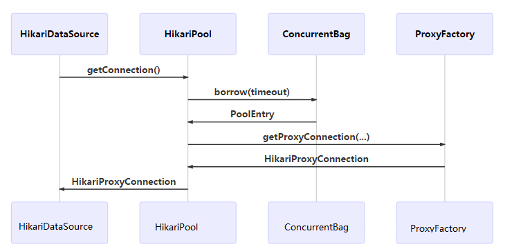
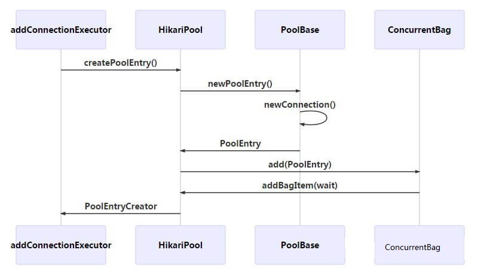

# HikariCP

## 常用配置

```yaml
spring:
  datasource:
    url: jdbc:mysql://1.12.236.101:3306/jpa_test?serverTimezone=GMT%2B8&characterEncoding=utf8&useSSL=false&useUnicode=true
    username: root
    password: 21qaz@!QAZ
    hikari:
      # 是否自动提交,默认为 True
      auto-commit: true
      # 客户端创建连接等待超时时间,如果时间内没有获取连接则抛异常,默认 30 秒
      connection-timeout: 30000
      # 连接允许最长空闲时间,如果超时,则会被关闭，默认为 600 秒
      # 如果idleTimeout+1秒>maxLifetime 且 maxLifetime>0，则会被重置为0
      # 如果idleTimeout=0则表示空闲的连接在连接池中永远不被移除
      # 由定时线程每隔30秒检测一次，实际移除的时间时可能是idleTimeout+30秒，平均idleTimeout+15秒
      # idle-timeout: 600000

      # 会按照该时间间隔发送PING给数据库，JDBC4以上直接发送二进制数据，或者JDBC4以下发送connectionTestQuery
      # 防止它被数据库或网络基础设施超时，默认值为：0（禁用）
      keepalive-time: 0
      # 当达到这个时间后连接会被标记被移除，如果连接没有被使用会被删除。
      # 如果连接正在使用会在使用完成后被其他线程获取时被删除
      # 值为 0 表示没有最大生命周期，默认值：1800000（30 分钟）
      # 该值需要设置为比任何数据库或基础设施强加的连接时间限制短几秒。
      # 设置为0或过大，可能导致 no operations allowed after connection closed 异常。
      max-lifetime: 1800000
      # 该值不要设置
      # connectionTestQuery
      # 该值不要设置，默认与 maximumPoolSize 保持一致
      # minimumIdle
      # 连接池达到的最大大小，包括空闲和使用中的连接，默认值：10。
      maximumPoolSize: 20
```

maximumPoolSize = ((core_count * 2)+ effective_spindle_count),effective_spindle_count为磁盘阵列的硬盘数。
考虑整体系统性能，考虑线程执行需要的等待时间，设计合理的线程数目。但是，不要过度配置数据库。

增大连接池大小可以缓解池锁问题，**但是扩大池之前是可以先检查一下应用层面能够调优，不要直接调整连接池大小**。
pool size = Tn x (Cm - 1) + 1，T n是线程的最大数量，C m是单个线程持有的同时连接的最大数量，这是避免池锁的最低限度。

## 监控指标

1. 多少个线程在等待获取数据库连接？获取数据库连接需要的平均时长是多少？数据库连接池是否已经不能满足业务模块需求？如果存在获取数据库连接较慢，则可能说明配置的数据库连接数不足，或存在连接泄漏问题。
2. 哪些线程正在执行 SQL 语句？执行的 SQL 语句是什么？数据库中是否存在系统瓶颈或已经产生锁？如果个别 SQL 语句执行速度明显比其它语句慢，则可能是数据库查询逻辑问题，或者已经存在了锁表的情况。
3. 最经常被执行的 SQL 语句是在哪段源代码中被调用的？最耗时的 SQL 语句是在哪段源代码中被调用的？


| HikariCP指标                        | 说明                     | 类型               | 备注                                                                          |
| ----------------------------------- | ------------------------ | ------------------ | ----------------------------------------------------------------------------- |
| hikaricp_connection_timeout_total   | 每分钟超时连接数         | Counter            |                                                                               |
| hikaricp_pending_threads            | 当前排队获取连接的线程数 | GAUGE              | 关键指标，大于10则 报警<br />该指标持续飙高，说明DB连接池中基本已无空闲连接。 |
| hikaricp_connection_acquired_nanos  | 连接获取的等待时间       | Summary	pool.Wait  | 关注极值                                                                      |
| hikaricp_active_connections         | 当前正在使用的连接数     | GAUGE              | 长期保持在较大线程数时，可以考虑增大最大连接数。                              |
| hikaricp_connection_creation_millis | 创建连接成功的耗时       | Summary            | 关注极值                                                                      |
| hikaricp_idle_connections           | 当前空闲连接数           | GAUGE              | 长期保持在较大线程数时，可以考虑减小最大连接数。                              |
| hikaricp_connection_usage_millis    | 连接被复用的间隔时长     | Summary	pool.Usage | 关注极值                                                                      |
| hikaricp_connections                | 连接池的总共连接数       | GAUGE              |                                                                               |

## 核心组件

### HikariDataSource

实现 DataSource 标准接口，作为连接池的门面，负责校验配置参数，在初始化或者第一次获取连接时创建连接池。

```java
public class HikariDataSource extends HikariConfig implements DataSource, Closeable
{
   private static final Logger LOGGER = LoggerFactory.getLogger(HikariDataSource.class);

   private final AtomicBoolean isShutdown = new AtomicBoolean();

   private final HikariPool fastPathPool;
   private volatile HikariPool pool;

   public HikariDataSource()
   {
      super();
      fastPathPool = null;
   }

   public HikariDataSource(HikariConfig configuration)
   {
      configuration.validate();
      configuration.copyStateTo(this);
      //初始化连接池
      pool = fastPathPool = new HikariPool(this);
   }

  @Override
   public Connection getConnection() throws SQLException
   {
      if (isClosed()) {
         throw new SQLException("HikariDataSource " + this + " has been closed.");
      }

      if (fastPathPool != null) {
         return fastPathPool.getConnection();
      }
      //初始化连接池
      HikariPool result = pool;
      if (result == null) {
         synchronized (this) {
            result = pool;
            if (result == null) {
               validate();
               LOGGER.info("{} - Starting...", getPoolName());
               try {
                  pool = result = new HikariPool(this);
                  this.seal();
               }
               catch (PoolInitializationException pie) {
                  if (pie.getCause() instanceof SQLException) {
                     throw (SQLException) pie.getCause();
                  }
                  else {
                     throw pie;
                  }
               }
               LOGGER.info("{} - Start completed.", getPoolName());
            }
         }
      }

      return result.getConnection();
   }
}
```

## PoolBase

HikariPool 的父类，提供与 Connection 相关的基础方法，主要以下几个方面：

1. 初始化原生DataSource，可能是 DriverDataSource、JNDI、其他 dataSourceClassName（通过HikariConfig配置），可使用getUnwrappedDataSource()访问。
2. 通过DataSource创建Connection，修饰符为private，外部不能访问。
3. 判断Connection是否存活。
4. 关闭Connection。
5. 创建 PoolEntry，修饰符为空，提供给子类访问。PoolEntry 是 Connection 的一对一封装。
6. 定义回收PoolEntry的抽象方法。

```java
abstract class PoolBase
{
    // 三种初始化数据源的方式
    private void initializeDataSource()
    {
        final String jdbcUrl = config.getJdbcUrl();
        final String username = config.getUsername();
        final String password = config.getPassword();
        final String dsClassName = config.getDataSourceClassName();
        final String driverClassName = config.getDriverClassName();
        final String dataSourceJNDI = config.getDataSourceJNDI();
        final Properties dataSourceProperties = config.getDataSourceProperties();

        DataSource ds = config.getDataSource();
        if (dsClassName != null && ds == null) {
            ds = createInstance(dsClassName, DataSource.class);
            PropertyElf.setTargetFromProperties(ds, dataSourceProperties);
        }
        else if (jdbcUrl != null && ds == null) {
            ds = new DriverDataSource(jdbcUrl, driverClassName, dataSourceProperties, username, password);
        }
        else if (dataSourceJNDI != null && ds == null) {
            try {
                InitialContext ic = new InitialContext();
                ds = (DataSource) ic.lookup(dataSourceJNDI);
            } catch (NamingException e) {
                throw new PoolInitializationException(e);
            }
        }

        if (ds != null) {
            setLoginTimeout(ds);
            createNetworkTimeoutExecutor(ds, dsClassName, jdbcUrl);
        }

        this.dataSource = ds;
    }

    // 创建PoolEntry
    PoolEntry newPoolEntry() throws Exception
    {
        return new PoolEntry(newConnection(), this, isReadOnly, isAutoCommit);
    }
}
```

## HikariPool

负责对连接资源(即PoolEntry)进行管理，主要实现以下功能：

1. 通过 `getConnection()` 提供借出 Connection 的功能。
2. 通过 `recycle(final PoolEntry poolEntry)` 提供归还 Connection 的功能。
3. 通过 `softEvictConnection(final PoolEntry poolEntry, final String reason, final boolean owner)` 将连接标记为删除，再其下次被获取且不使用时将其真正删除。
4. 通过 `PoolEntryCreator` 提供异步创建PoolEntry的能力。
5. 通过 `HouseKeeper` 每隔30秒监测一次空闲连接将其释放至 minIdle 或 使用 `PoolEntryCreator` 填充数量至 minIdle。
6. 通过 `MaxLifetimeTask` 延迟 maxLifetime 使用 `softEvictConnection` 剔除 PoolEntry。
7. 通过 `KeepaliveTask` 每隔 keepaliveTime 时间使用 `Connection#isValid` 监测一次连接是否存活，如果不存活则剔除。

## ConcurrentBag

ConcurrentBag 是连接资源的共享站，支撑连接池底层借出、归还功能。

```java
public class ConcurrentBag<T extends IConcurrentBagEntry> implements AutoCloseable {

    private final CopyOnWriteArrayList<T> sharedList;
    private final boolean weakThreadLocals;

    private final ThreadLocal<List<Object>> threadList;
    private final IBagStateListener listener;
    private final AtomicInteger waiters;
    private volatile boolean closed;

    private final SynchronousQueue<T> handoffQueue;
}
```

从私有属性可以看出它的功能：

* CopyOnWriteArrayList : 负责存放 ConcurrentBag 的所有可出借的资源，也就是 HikariPool 所能提供的资源。
* ThreadLocal<List<Object>> : 线程归还资源后会先保存在这里，如果同线程还需要使用则从此处借出，加速线程本地化资源访问，减少竞争。
* SynchronousQueue<T> ：提供新增连接第一手交接给等待线程，并可以在其他线程连接使用完成后加入 ThreadLocal 之前，将其窃取给等待线程。

```java
public class ConcurrentBag<T extends IConcurrentBagEntry> implements AutoCloseable
{
    public T borrow(long timeout, final TimeUnit timeUnit) throws InterruptedException
    {
        // 优先从本地连接获取资源
        // Try the thread-local list first
        final List<Object> list = threadList.get();
        for (int i = list.size() - 1; i >= 0; i--) {
            final Object entry = list.remove(i);
            @SuppressWarnings("unchecked")
            final T bagEntry = weakThreadLocals ? ((WeakReference<T>) entry).get() : (T) entry;
            if (bagEntry != null && bagEntry.compareAndSet(STATE_NOT_IN_USE, STATE_IN_USE)) {
                return bagEntry;
            }
        }
  
        // 从 CopyOnWriteArrayList 获取资源
        // Otherwise, scan the shared list ... then poll the handoff queue
        final int waiting = waiters.incrementAndGet();
        try {
            for (T bagEntry : sharedList) {
                if (bagEntry.compareAndSet(STATE_NOT_IN_USE, STATE_IN_USE)) {
                    // If we may have stolen another waiter's connection, request another bag add.
                    if (waiting > 1) {
                        listener.addBagItem(waiting - 1);
                    }
                    return bagEntry;
                }
            }

            listener.addBagItem(waiting);

            // 从新增连接直接获取资源或者窃取其他线程资源
            timeout = timeUnit.toNanos(timeout);
            do {
                final long start = currentTime();
                final T bagEntry = handoffQueue.poll(timeout, NANOSECONDS);
                if (bagEntry == null || bagEntry.compareAndSet(STATE_NOT_IN_USE, STATE_IN_USE)) {
                    return bagEntry;
                }

                timeout -= elapsedNanos(start);
            } while (timeout > 10_000);

            return null;
        }
        finally {
            waiters.decrementAndGet();
        }
    }

    public void requite(final T bagEntry)
    {
        bagEntry.setState(STATE_NOT_IN_USE);

        // 提供给其他线程窃取
        for (int i = 0; waiters.get() > 0; i++) {
            if (bagEntry.getState() != STATE_NOT_IN_USE || handoffQueue.offer(bagEntry)) {
                return;
            }
            else if ((i & 0xff) == 0xff) {
                parkNanos(MICROSECONDS.toNanos(10));
            }
            else {
                Thread.yield();
            }
        }

        // 加速当前线程获取资源
        final List<Object> threadLocalList = threadList.get();
        if (threadLocalList.size() < 50) {
            threadLocalList.add(weakThreadLocals ? new WeakReference<>(bagEntry) : bagEntry);
        }
    }
}
```

### PoolEntry

```java
final class PoolEntry implements IConcurrentBagEntry {
    private static final AtomicIntegerFieldUpdater<PoolEntry> stateUpdater;

    // Jdbc连接
    Connection connection;
  
    // 上次归还的时间
    long lastAccessed;
    // 上次借出的时间
    long lastBorrowed;

    // 标记 STATE_NOT_IN_USE、STATE_IN_USE、STATE_REMOVED、STATE_RESERVED 状态
    @SuppressWarnings("FieldCanBeLocal")
    private volatile int state = 0;
  
    // 标记删除，并非真正删除，只有被再次获取且没有使用时才被删除
    private volatile boolean evict;

    // MaxLifetimeTask
    private volatile ScheduledFuture<?> endOfLife;
    // KeepaliveTask
    private volatile ScheduledFuture<?> keepalive;

    // 打开的Statement
    private final FastList<Statement> openStatements;
    private final HikariPool hikariPool;

    private final boolean isReadOnly;
    private final boolean isAutoCommit;

    // 创建连接代理
    Connection createProxyConnection(final ProxyLeakTask leakTask, final long now)
    {
        return ProxyFactory.getProxyConnection(this, connection, openStatements, leakTask, now, isReadOnly, isAutoCommit);
    }
}
```

### ProxyFactory

生成 HikariProxyXXXX 的工厂，但内部并没有真正的实现，而是使用 JavassistProxyFactory 修改的字节码，将字节码压缩到35字节以下，以使用JIT内联，提高方法调用效率。

## 时序图

### 借用流程



### 回收流程


### 新建连接流程



### 连接关闭流程


