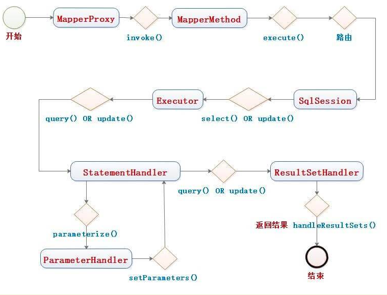

# MyBatis

### 配置文件

#### Setting


| 设置名                           | 描述                                                                                                                                                                                                                                              | 有效值                                          | 默认值                                                |
| ---------------------------------- | --------------------------------------------------------------------------------------------------------------------------------------------------------------------------------------------------------------------------------------------------- | ------------------------------------------------- | ------------------------------------------------------- |
| cacheEnabled                     | 全局性地开启或关闭所有映射器配置文件中已配置的任何缓存。                                                                                                                                                                                          | true                                            | false                                                 |
| lazyLoadingEnabled               | 延迟加载的全局开关。当开启时，所有关联对象都会延迟加载。 特定关联关系中可通过设置`fetchType` 属性来覆盖该项的开关状态。                                                                                                                           | true                                            | false                                                 |
| aggressiveLazyLoading            | 开启时，任一方法的调用都会加载该对象的所有延迟加载属性。 否则，每个延迟加载属性会按需加载（参考`lazyLoadTriggerMethods`)。                                                                                                                        | true                                            | false                                                 |
| multipleResultSetsEnabled        | 是否允许单个语句返回多结果集（需要数据库驱动支持）。                                                                                                                                                                                              | true                                            | false                                                 |
| useColumnLabel                   | 使用列标签代替列名。实际表现依赖于数据库驱动，具体可参考数据库驱动的相关文档，或通过对比测试来观察。                                                                                                                                              | true                                            | false                                                 |
| useGeneratedKeys                 | 允许 JDBC 支持自动生成主键，需要数据库驱动支持。如果设置为 true，将强制使用自动生成主键。尽管一些数据库驱动不支持此特性，但仍可正常工作（如 Derby）。                                                                                             | true                                            | false                                                 |
| autoMappingBehavior              | 指定 MyBatis 应如何自动映射列到字段或属性。 NONE 表示关闭自动映射；PARTIAL 只会自动映射没有定义嵌套结果映射的字段。 FULL 会自动映射任何复杂的结果集（无论是否嵌套）。                                                                             | NONE, PARTIAL, FULL                             | PARTIAL                                               |
| autoMappingUnknownColumnBehavior | 指定发现自动映射目标未知列（或未知属性类型）的行为。`NONE`: 不做任何反应 `WARNING`: 输出警告日志（`'org.apache.ibatis.session.AutoMappingUnknownColumnBehavior'` 的日志等级必须设置为 `WARN`） `FAILING`: 映射失败 (抛出 `SqlSessionException`) | NONE, WARNING, FAILING                          | NONE                                                  |
| defaultExecutorType              | 配置默认的执行器。SIMPLE 就是普通的执行器；REUSE 执行器会重用预处理语句（PreparedStatement）； BATCH 执行器不仅重用语句还会执行批量更新，可以调用session.flushStatements()来立即执行，或者在方法上使用@flush注解                                  | SIMPLE REUSE BATCH                              | SIMPLE                                                |
| defaultStatementTimeout          | 设置超时时间，它决定数据库驱动等待数据库响应的秒数。                                                                                                                                                                                              | 任意正整数                                      | 未设置 (null)                                         |
| defaultFetchSize                 | 为驱动的结果集获取数量（fetchSize）设置一个建议值。此参数只可以在查询设置中被覆盖。                                                                                                                                                               | 任意正整数                                      | 未设置 (null)                                         |
| defaultResultSetType             | 指定语句默认的滚动策略。（新增于 3.5.2）                                                                                                                                                                                                          | FORWARD_ONLY                                    | SCROLL_SENSITIVE                                      |
| safeRowBoundsEnabled             | 是否允许在嵌套语句中使用分页（RowBounds）。如果允许使用则设置为 false。                                                                                                                                                                           | true                                            | false                                                 |
| safeResultHandlerEnabled         | 是否允许在嵌套语句中使用结果处理器（ResultHandler）。如果允许使用则设置为 false。                                                                                                                                                                 | true                                            | false                                                 |
| mapUnderscoreToCamelCase         | 是否开启驼峰命名自动映射，即从经典数据库列名 A_COLUMN 映射到经典 Java 属性名 aColumn。                                                                                                                                                            | true                                            | false                                                 |
| localCacheScope                  | MyBatis 利用本地缓存机制（Local Cache）防止循环引用和加速重复的嵌套查询。 默认值为 SESSION，会缓存一个会话中执行的所有查询。 若设置值为 STATEMENT，本地缓存将仅用于执行语句，对相同 SqlSession 的不同查询将不会进行缓存。                         | SESSION                                         | STATEMENT                                             |
| jdbcTypeForNull                  | 当没有为参数指定特定的 JDBC 类型时，空值的默认 JDBC 类型。 某些数据库驱动需要指定列的 JDBC 类型，多数情况直接用一般类型即可，比如 NULL、VARCHAR 或 OTHER。                                                                                        | JdbcType 常量，常用值：NULL、VARCHAR 或 OTHER。 | OTHER                                                 |
| lazyLoadTriggerMethods           | 指定对象的哪些方法触发一次延迟加载。                                                                                                                                                                                                              | 用逗号分隔的方法列表。                          | equals,clone,hashCode,toString                        |
| defaultScriptingLanguage         | 指定动态 SQL 生成使用的默认脚本语言。                                                                                                                                                                                                             | 一个类型别名或全限定类名。                      | org.apache.ibatis.scripting.xmltags.XMLLanguageDriver |
| defaultEnumTypeHandler           | 指定 Enum 使用的默认`TypeHandler` 。（新增于 3.4.5）                                                                                                                                                                                              | 一个类型别名或全限定类名。                      | org.apache.ibatis.type.EnumTypeHandler                |
| callSettersOnNulls               | 指定当结果集中值为 null 的时候是否调用映射对象的 setter（map 对象时为 put）方法，这在依赖于 Map.keySet() 或 null 值进行初始化时比较有用。注意基本类型（int、boolean 等）是不能设置成 null 的。                                                    | true                                            | false                                                 |
| returnInstanceForEmptyRow        | 当返回行的所有列都是空时，MyBatis默认返回`null`。 当开启这个设置时，MyBatis会返回一个空实例。 请注意，它也适用于嵌套的结果集（如集合或关联）。（新增于 3.4.2）                                                                                    | true                                            | false                                                 |
| logPrefix                        | 指定 MyBatis 增加到日志名称的前缀。                                                                                                                                                                                                               | 任何字符串                                      | 未设置                                                |
| logImpl                          | 指定 MyBatis 所用日志的具体实现，未指定时将自动查找。                                                                                                                                                                                             | SLF4J                                           | LOG4J(deprecated since 3.5.9)                         |
| proxyFactory                     | 指定 Mybatis 创建可延迟加载对象所用到的代理工具。                                                                                                                                                                                                 | CGLIB                                           | JAVASSIST                                             |
| vfsImpl                          | 指定 VFS 的实现                                                                                                                                                                                                                                   | 自定义 VFS 的实现的类全限定名，以逗号分隔。     | 未设置                                                |
| useActualParamName               | 允许使用方法签名中的名称作为语句参数名称。 为了使用该特性，你的项目必须采用 Java 8 编译，并且加上`-parameters` 选项。（新增于 3.4.1）                                                                                                             | true                                            | false                                                 |
| configurationFactory             | 指定一个提供`Configuration` 实例的类。 这个被返回的 Configuration 实例用来加载被反序列化对象的延迟加载属性值。 这个类必须包含一个签名为 `static Configuration getConfiguration()` 的方法。（新增于 3.2.3）                                        | 一个类型别名或完全限定类名。                    | 未设置                                                |
| shrinkWhitespacesInSql           | 从SQL中删除多余的空格字符。请注意，这也会影响SQL中的文字字符串。 (新增于 3.5.5)                                                                                                                                                                   | true                                            | false                                                 |
| defaultSqlProviderType           | Specifies an sql provider class that holds provider method (Since 3.5.6). This class apply to the`type`(or `value`) attribute on sql provider annotation(e.g. `@SelectProvider`), when these attribute was omitted.                               | A type alias or fully qualified class name      | Not set                                               |
| nullableOnForEach                | Specifies the default value of 'nullable' attribute on 'foreach' tag. (Since 3.5.9)                                                                                                                                                               | true                                            | false                                                 |

#### TypeAliases

```xml
<typeAliases>
  <typeAlias alias="Author" type="domain.blog.Author"/>
  <typeAlias alias="Blog" type="domain.blog.Blog"/>
  <typeAlias alias="Comment" type="domain.blog.Comment"/>
  <typeAlias alias="Post" type="domain.blog.Post"/>
  <typeAlias alias="Section" type="domain.blog.Section"/>
  <typeAlias alias="Tag" type="domain.blog.Tag"/>
</typeAliases>

# 或
<typeAliases>
  <package name="domain.blog"/>
</typeAliases>
# 可在对应的 javabean 中使用 @Alias，默认使用 首字母小写 来作为别名

# 或在 aplication.properties 中配置
mybatis.type-aliases-package=com.test.model
```

默认别名：


| 别名       | 映射的类型 |
| ------------ | ------------ |
| _byte      | byte       |
| _long      | long       |
| _short     | short      |
| _int       | int        |
| _integer   | int        |
| _double    | double     |
| _float     | float      |
| _boolean   | boolean    |
| string     | String     |
| byte       | Byte       |
| long       | Long       |
| short      | Short      |
| int        | Integer    |
| integer    | Integer    |
| double     | Double     |
| float      | Float      |
| boolean    | Boolean    |
| date       | Date       |
| decimal    | BigDecimal |
| bigdecimal | BigDecimal |
| object     | Object     |
| map        | Map        |
| hashmap    | HashMap    |
| list       | List       |
| arraylist  | ArrayList  |
| collection | Collection |
| iterator   | Iterator   |

#### TypeHandlers

可继承 `org.apache.ibatis.type.TypeHandler`或 `org.apache.ibatis.type.BaseTypeHandler`来实现，并使用 `@MappedTypes`和 `@MappedJdbcTypes`注解来配置转换映射关系，然后在配置文件中配置，例如：

```xml
<typeHandlers>
  <typeHandler handler="org.mybatis.example.ExampleTypeHandler"/>
</typeHandlers>
# 或
<typeHandlers>
  <package name="org.mybatis.example"/>
</typeHandlers>
# 或在 aplication.properties 中配置
mybatis.type-handlers-package=org.mybatis.example
```

对于枚举类型的自定义：

```java
public interface BaseBizEnum {
    Integer getCode();
}

public enum AgreementType implements BaseBizEnum{
    /***/
    QUICK_PAY(1,"免密支付"),
    ;

    private final Integer code;
    @Getter
    private final String desc;
    private static Map<Integer,AgreementType> itemMap = Maps.newHashMap();
    static {
        for (AgreementType typeEnum : AgreementType.values()) {
            itemMap.put(typeEnum.getCode(),typeEnum);
        }
    }
    AgreementType(Integer code, String desc) {
        this.code = code;
        this.desc = desc;
    }
    //重写了接口BaseBizEnum的方法
    @Override
    public Integer getCode() {
        return code;
    }
    public static AgreementType ofNullable(Integer code) {
        return itemMap.get(code);
    }
}

public class BizEnumTypeHandler<E extends BaseBizEnum> extends BaseTypeHandler<E> {

    private Class<E> type;

    //初始化时定义枚举和code的映射关系
    private final Map<Integer,E> enumsMap = new HashMap<>();

    public BizEnumTypeHandler(Class<E> type) {
        if (type == null) {
            throw new IllegalArgumentException("Type argument cannot be null");
        }
        this.type = type;
        for (E enumConstant : type.getEnumConstants()) {
            enumsMap.put(enumConstant.getCode(),enumConstant);
        }
        if (this.enumsMap.size() == 0) {
            throw new IllegalArgumentException(type.getSimpleName() + " does not represent an enum type.");
        }
    }

    //在请求Sql执行时转换参数
    @Override
    public void setNonNullParameter(PreparedStatement preparedStatement, int i, E e, JdbcType jdbcType) throws SQLException {
        preparedStatement.setInt(i,e.getCode());
    }

    //处理返回结果
    @Override
    public E getNullableResult(ResultSet resultSet, String columnName) throws SQLException {
        if (resultSet.wasNull()) {
            return null;
        }
        int code = resultSet.getInt(columnName);
        return getEnum(code);
    }

    private E getEnum(Integer code) {
        try {
            return getEnumByValue(code);
        } catch (Exception ex) {
            throw new IllegalArgumentException(
                    "Cannot convert " + code + " to " + type.getSimpleName() + " by ordinal value.", ex);
        }
    }

    protected E getEnumByValue(Integer code) {
        return enumsMap.get(code);
    }

    @Override
    public E getNullableResult(ResultSet resultSet, int columnIndex) throws SQLException {
        if (resultSet.wasNull()) {
            return null;
        }
        int code = resultSet.getInt(columnIndex);
        return getEnum(code);
    }

    @Override
    public E getNullableResult(CallableStatement callableStatement, int columnIndex) throws SQLException {
        if (callableStatement.wasNull()) {
            return null;
        }
        int code = callableStatement.getInt(columnIndex);
        return getEnum(code);
    }
}

@MappedTypes(value = {AgreementType.class})
@MappedJdbcTypes(value = {JdbcType.INTEGER,JdbcType.TINYINT,JdbcType.SMALLINT})
public class AgreementTypeEnumTypeHandler extends BizEnumTypeHandler<AgreementType>{
    public AgreementTypeEnumTypeHandler() {
        super(AgreementType.class);
    }
}
```


| 类型处理器                   | Java 类型                       | JDBC 类型                                                                  |
| ------------------------------ | --------------------------------- | ---------------------------------------------------------------------------- |
| `BooleanTypeHandler`         | `java.lang.Boolean`, `boolean`  | 数据库兼容的`BOOLEAN`                                                      |
| `ByteTypeHandler`            | `java.lang.Byte`, `byte`        | 数据库兼容的`NUMERIC` 或 `BYTE`                                            |
| `ShortTypeHandler`           | `java.lang.Short`, `short`      | 数据库兼容的`NUMERIC` 或 `SMALLINT`                                        |
| `IntegerTypeHandler`         | `java.lang.Integer`, `int`      | 数据库兼容的`NUMERIC` 或 `INTEGER`                                         |
| `LongTypeHandler`            | `java.lang.Long`, `long`        | 数据库兼容的`NUMERIC` 或 `BIGINT`                                          |
| `FloatTypeHandler`           | `java.lang.Float`, `float`      | 数据库兼容的`NUMERIC` 或 `FLOAT`                                           |
| `DoubleTypeHandler`          | `java.lang.Double`, `double`    | 数据库兼容的`NUMERIC` 或 `DOUBLE`                                          |
| `BigDecimalTypeHandler`      | `java.math.BigDecimal`          | 数据库兼容的`NUMERIC` 或 `DECIMAL`                                         |
| `StringTypeHandler`          | `java.lang.String`              | `CHAR`, `VARCHAR`                                                          |
| `ClobReaderTypeHandler`      | `java.io.Reader`                | -                                                                          |
| `ClobTypeHandler`            | `java.lang.String`              | `CLOB`, `LONGVARCHAR`                                                      |
| `NStringTypeHandler`         | `java.lang.String`              | `NVARCHAR`, `NCHAR`                                                        |
| `NClobTypeHandler`           | `java.lang.String`              | `NCLOB`                                                                    |
| `BlobInputStreamTypeHandler` | `java.io.InputStream`           | -                                                                          |
| `ByteArrayTypeHandler`       | `byte[]`                        | 数据库兼容的字节流类型                                                     |
| `BlobTypeHandler`            | `byte[]`                        | `BLOB`, `LONGVARBINARY`                                                    |
| `DateTypeHandler`            | `java.util.Date`                | `TIMESTAMP`                                                                |
| `DateOnlyTypeHandler`        | `java.util.Date`                | `DATE`                                                                     |
| `TimeOnlyTypeHandler`        | `java.util.Date`                | `TIME`                                                                     |
| `SqlTimestampTypeHandler`    | `java.sql.Timestamp`            | `TIMESTAMP`                                                                |
| `SqlDateTypeHandler`         | `java.sql.Date`                 | `DATE`                                                                     |
| `SqlTimeTypeHandler`         | `java.sql.Time`                 | `TIME`                                                                     |
| `ObjectTypeHandler`          | Any                             | `OTHER` 或未指定类型                                                       |
| `EnumTypeHandler`            | Enumeration Type                | VARCHAR 或任何兼容的字符串类型，用来存储枚举的名称（而不是索引序数值）     |
| `EnumOrdinalTypeHandler`     | Enumeration Type                | 任何兼容的`NUMERIC` 或 `DOUBLE` 类型，用来存储枚举的序数值（而不是名称）。 |
| `SqlxmlTypeHandler`          | `java.lang.String`              | `SQLXML`                                                                   |
| `InstantTypeHandler`         | `java.time.Instant`             | `TIMESTAMP`                                                                |
| `LocalDateTimeTypeHandler`   | `java.time.LocalDateTime`       | `TIMESTAMP`                                                                |
| `LocalDateTypeHandler`       | `java.time.LocalDate`           | `DATE`                                                                     |
| `LocalTimeTypeHandler`       | `java.time.LocalTime`           | `TIME`                                                                     |
| `OffsetDateTimeTypeHandler`  | `java.time.OffsetDateTime`      | `TIMESTAMP`                                                                |
| `OffsetTimeTypeHandler`      | `java.time.OffsetTime`          | `TIME`                                                                     |
| `ZonedDateTimeTypeHandler`   | `java.time.ZonedDateTime`       | `TIMESTAMP`                                                                |
| `YearTypeHandler`            | `java.time.Year`                | `INTEGER`                                                                  |
| `MonthTypeHandler`           | `java.time.Month`               | `INTEGER`                                                                  |
| `YearMonthTypeHandler`       | `java.time.YearMonth`           | `VARCHAR` 或 `LONGVARCHAR`                                                 |
| `JapaneseDateTypeHandler`    | `java.time.chrono.JapaneseDate` | `DATE`                                                                     |

#### ObjectFactory

每次 MyBatis 创建结果对象的新实例时，它都会使用一个对象工厂（ObjectFactory）实例来完成实例化工作。 默认的对象工厂需要做的仅仅是实例化目标类，要么通过默认无参构造方法，要么通过存在的参数映射来调用带有参数的构造方法

#### Plugins

实现 `org.apache.ibatis.plugin.Interceptor` 接口，并使用注解：

```java
@Intercepts(
        {
                @Signature(type = Executor.class, method = "query", args = {MappedStatement.class, Object.class, RowBounds.class, ResultHandler.class}),
                @Signature(type = Executor.class, method = "query", args = {MappedStatement.class, Object.class, RowBounds.class, ResultHandler.class, CacheKey.class, BoundSql.class}),
        }
)
public class PageInterceptor implements Interceptor {
    @Override
    public Object intercept(Invocation invocation) throws Throwable {
    ...
    }
    @Override
    public Object plugin(Object target) {
    ...
    }
    @Override
    public void setProperties(Properties properties) {
    ...
    }
}
```

1. type：表示拦截的节点，Executor、ParameterHandler、ResultSetHandler、StatementHandler。
2. method：节点中调用的方法。

- Executor (update, query, flushStatements, commit, rollback, getTransaction, close, isClosed)
- ParameterHandler (getParameterObject, setParameters)
- ResultSetHandler (handleResultSets, handleOutputParameters)
- StatementHandler (prepare, parameterize, batch, update, query)

3. arg：调用方法对应的参数,可以查询源码中对应的类查找.

最后加入到配置文件：

```xml
<plugins>
    <plugin interceptor="org.format.mybatis.cache.interceptor.ExamplePlugin"></plugin>
</plugins>
```

#### Mappers

```xml
<mappers>
  <package name="org.mybatis.builder"/>
</mappers>
# 或在 aplication.properties 中配置
mybatis.mapper-locations=classpath*:com/open/**/dao/*.xml
```

##### Cache

自定义缓存可以实现 org.apache.ibatis.cache.Cache 。

属性：

- `type`：cache使用的类型，默认是`PerpetualCache`。
- `eviction`： 定义回收的策略，常见的有FIFO，LRU。
- `flushInterval`： 配置一定时间自动刷新缓存，单位是毫秒。
- `size`： 最多缓存对象的个数。
- `readOnly`： 默认配置可读写(false)，则需要对应的实体类能够序列化，是通过序列化返回缓存对象的拷贝，若配置只读(true)，会直接返回缓存中的实例，当更改该实例时会造成缓存修改，所以该实例禁止修改。
- `blocking`： 若缓存中找不到对应的key，是否会一直blocking，直到有对应的数据进入缓存。

多命名空间共享相同的缓存配置和实例：`<cache-ref namespace="com.someone.application.data.SomeMapper"/>`

更新缓存的默认配置，不需要设置：

```xml
<select ... flushCache="false" useCache="true"/>
<insert ... flushCache="true"/>
<update ... flushCache="true"/>
<delete ... flushCache="true"/>
```

##### Select


| 属性          | 描述                                                                                                                                                                                                      |
| --------------- | ----------------------------------------------------------------------------------------------------------------------------------------------------------------------------------------------------------- |
| id            | 在命名空间中唯一的标识符，可以被用来引用这条语句。                                                                                                                                                        |
| parameterType | 将会传入这条语句的参数的类全限定名或别名。这个属性是可选的，因为 MyBatis 可以通过类型处理器（TypeHandler）推断出具体传入语句的参数，默认值为未设置（unset）。                                             |
| resultType    | 期望从这条语句中返回结果的类全限定名或别名。 注意，如果返回的是集合，那应该设置为集合包含的类型，而不是集合本身的类型。 resultType 和 resultMap 之间只能同时使用一个。                                    |
| resultMap     | 对外部 resultMap 的命名引用。结果映射是 MyBatis 最强大的特性，如果你对其理解透彻，许多复杂的映射问题都能迎刃而解。 resultType 和 resultMap 之间只能同时使用一个。                                         |
| flushCache    | 将其设置为 true 后，只要语句被调用，都会导致本地缓存和二级缓存被清空，默认值：false。                                                                                                                     |
| useCache      | 将其设置为 true 后，将会导致本条语句的结果被二级缓存缓存起来，默认值：对 select 元素为 true。                                                                                                             |
| timeout       | 这个设置是在抛出异常之前，驱动程序等待数据库返回请求结果的秒数。默认值为未设置（unset）（依赖数据库驱动）。                                                                                               |
| fetchSize     | 这是一个给驱动的建议值，尝试让驱动程序每次批量返回的结果行数等于这个设置值。 默认值为未设置（unset）（依赖驱动）。                                                                                        |
| statementType | 可选 STATEMENT，PREPARED 或 CALLABLE。这会让 MyBatis 分别使用 Statement，PreparedStatement 或 CallableStatement，默认值：PREPARED。                                                                       |
| resultSetType | FORWARD\_ONLY，SCROLL\_SENSITIVE, SCROLL_INSENSITIVE 或 DEFAULT（等价于 unset） 中的一个，默认值为 unset （依赖数据库驱动）。                                                                             |
| databaseId    | 如果配置了数据库厂商标识（databaseIdProvider），MyBatis 会加载所有不带 databaseId 或匹配当前 databaseId 的语句；如果带和不带的语句都有，则不带的会被忽略。                                                |
| resultOrdered | 这个设置仅针对嵌套结果 select 语句：如果为 true，将会假设包含了嵌套结果集或是分组，当返回一个主结果行时，就不会产生对前面结果集的引用。 这就使得在获取嵌套结果集的时候不至于内存不够用。默认值：`false`。 |
| resultSets    | 这个设置仅适用于多结果集的情况。它将列出语句执行后返回的结果集并赋予每个结果集一个名称，多个名称之间以逗号分隔。                                                                                          |

##### Insert、Update、Delete


| 属性             | 描述                                                                                                                                                                                                                      |
| ------------------ | --------------------------------------------------------------------------------------------------------------------------------------------------------------------------------------------------------------------------- |
| id               | 在命名空间中唯一的标识符，可以被用来引用这条语句。                                                                                                                                                                        |
| parameterType    | 将会传入这条语句的参数的类全限定名或别名。这个属性是可选的，因为 MyBatis 可以通过类型处理器（TypeHandler）推断出具体传入语句的参数，默认值为未设置（unset）。                                                             |
| flushCache       | 将其设置为 true 后，只要语句被调用，都会导致本地缓存和二级缓存被清空，默认值：（对 insert、update 和 delete 语句）true。                                                                                                  |
| timeout          | 这个设置是在抛出异常之前，驱动程序等待数据库返回请求结果的秒数。默认值为未设置（unset）（依赖数据库驱动）。                                                                                                               |
| statementType    | 可选 STATEMENT，PREPARED 或 CALLABLE。这会让 MyBatis 分别使用 Statement，PreparedStatement 或 CallableStatement，默认值：PREPARED。                                                                                       |
| useGeneratedKeys | （仅适用于 insert 和 update）这会令 MyBatis 使用 JDBC 的 getGeneratedKeys 方法来取出由数据库内部生成的主键（比如：像 MySQL 和 SQL Server 这样的关系型数据库管理系统的自动递增字段），默认值：false。                      |
| keyProperty      | （仅适用于 insert 和 update）指定能够唯一识别对象的属性，MyBatis 会使用 getGeneratedKeys 的返回值或 insert 语句的 selectKey 子元素设置它的值，默认值：未设置（`unset`）。如果生成列不止一个，可以用逗号分隔多个属性名称。 |
| keyColumn        | （仅适用于 insert 和 update）设置生成键值在表中的列名，在某些数据库（像 PostgreSQL）中，当主键列不是表中的第一列的时候，是必须设置的。如果生成列不止一个，可以用逗号分隔多个属性名称。                                    |
| databaseId       | 如果配置了数据库厂商标识（databaseIdProvider），MyBatis 会加载所有不带 databaseId 或匹配当前 databaseId 的语句；如果带和不带的语句都有，则不带的会被忽略。                                                                |

##### Sql

可重用的代码片段，例如：

```xml
<sql id="userColumns"> ${alias}.id,${alias}.username,${alias}.password </sql>

<select id="selectUsers" resultType="map">
  select
    <include refid="userColumns"><property name="alias" value="t1"/></include>,
    <include refid="userColumns"><property name="alias" value="t2"/></include>
  from some_table t1
    cross join some_table t2
</select>

# 在 include 元素的 refid 属性或内部语句中使用属性值例如：
<sql id="sometable">
  ${prefix}Table
</sql>

<sql id="someinclude">
  from
    <include refid="${include_target}"/>
</sql>

<select id="select" resultType="map">
  select
    field1, field2, field3
  <include refid="someinclude">
    <property name="prefix" value="Some"/>
    <property name="include_target" value="sometable"/>
  </include>
</select>
```

###### 动态SQL

- if：test使用 OGNL 表达式，property ！= null and property != '' 用于字符串判断不为空。

  ```xml
  <select id="findActiveBlogLike"
       resultType="Blog">
    SELECT * FROM BLOG WHERE state = ‘ACTIVE’
    <if test="title != null">
      AND title like #{title}
    </if>
    <if test="author != null and author.name != null">
      AND author_name like #{author.name}
    </if>
  </select>
  ```

  常用 OGNL ：

  - e1 or e2
  - e1 and e2
  - e1 == e2,e1 eq e2
  - e1 != e2,e1 neq e2
  - e1 lt e2
  - e1 lte e2
  - e1 in e2
  - e1 not in e2
  - e1 + e2,e1 * e2,e1/e2,e1 - e2,e1%e2
  - !e,not e
  - e.method(args)：调用对象方法
  - e.property：对象属性值
  - e1\[ e2 \]：按索引取值，List,数组和Map
  - @class@method(args)：调用类的静态方法
  - @class@field：调用类的静态字段值

- choose、when、otherwise：相当于switch

  ```xml
  <select id="findActiveBlogLike"
       resultType="Blog">
    SELECT * FROM BLOG WHERE state = ‘ACTIVE’
    <choose>
      <when test="title != null">
        AND title like #{title}
      </when>
      <when test="author != null and author.name != null">
        AND author_name like #{author.name}
      </when>
      <otherwise>
        AND featured = 1
      </otherwise>
    </choose>
  </select>
  ```
- where：若子句的开头为 “AND” 或 “OR”，*where* 元素也会将它们去除。

  ```xml
  <select id="findActiveBlogLike"
       resultType="Blog">
    SELECT * FROM BLOG
    <where>
      <if test="state != null">
           state = #{state}
      </if>
      <if test="title != null">
          AND title like #{title}
      </if>
      <if test="author != null and author.name != null">
          AND author_name like #{author.name}
      </if>
    </where>
  </select>
  ```
- trim：

  属性：

  - prefix：会将该值放在`<trim>`元素内容 前面。
  - prefixOverrides：会将`<trim>`元素内容 前面等于 该值的内容 替换为空字符。
  - suffix：会将该值放在`<trim>`元素内容 后面。
  - suffixOverrides：会将`<trim>`元素内容 后面等于 该值的内容 替换为空字符。

  ```xml
  <select id="getUserList3" resultMap="RESULT_MAP">
     select `user_id`, `name`, `age`, `sex` from `user`
     <trim prefix="where" suffixOverrides="and">
        <choose>
           <when test="username != null and username != ''">
              `name` like #{username} and
           </when>
           <when test="age != null">
              `age` >= #{age} and
           </when>
           <otherwise>
              `user_id` is not null and
           </otherwise>
        </choose>
     </trim>
  </select>
  ```
- set：用于update语句，会自动删掉 最后额外的逗号

  ```xml
  <update id="updateAuthorIfNecessary">
    update Author
      <set>
        <if test="username != null">username=#{username},</if>
        <if test="password != null">password=#{password},</if>
        <if test="email != null">email=#{email},</if>
        <if test="bio != null">bio=#{bio}</if>
      </set>
    where id=#{id}
  </update>
  ```
- foreach：用于循环。

  属性：

  - collection：循环的对象。
  - item：每个元素。
  - index：循环下标。
  - open：开始字符。
  - separator：分隔符。
  - close：结束字符。

  ```xml
  <select id="selectPostIn" resultType="domain.blog.Post">
    SELECT *
    FROM POST P
    <where>
      <foreach item="item" index="index" collection="list"
          open="ID in (" separator="," close=")" nullable="true">
            #{item}
      </foreach>
    </where>
  </select>
  ```
- bind：使用 OGNL 表达式创建一个变量。

  ```xml
  <select id="selectBlogsLike" resultType="Blog">
    <bind name="pattern" value="'%' + _parameter.getTitle() + '%'" />
    SELECT * FROM BLOG
    WHERE title LIKE #{pattern}
  </select>
  ```
- 多数据支持

  ```xml
  <insert id="insert">
    <selectKey keyProperty="id" resultType="int" order="BEFORE">
      <if test="_databaseId == 'oracle'">
        select seq_users.nextval from dual
      </if>
      <if test="_databaseId == 'db2'">
        select nextval for seq_users from sysibm.sysdummy1"
      </if>
    </selectKey>
    insert into users values (#{id}, #{name})
  </insert>
  ```

##### 参数

#{value}：会使用 PreparedStatement 的占位符 ? 传入，例如：#{property,javaType=int,jdbcType=NUMERIC}。

${value}：会直接替换，value值可以是 OGNL 表达式。

##### ResultMap

如果 select 返回值中字段与 javabean 属性一样，可使用 ResultType 来配置，在框架底层会自动生成 ResultMap 来映射，例如：

```xml
<select id="selectUsers" resultType="com.someapp.model.User">
  select id, username, hashedPassword
  from some_table
  where id = #{id}
</select>
```

默认情况下，配置文件中 autoMappingBehavior 使用默认值 `PARTIAL`，会自动映射结果，如果 `mapUnderscoreToCamelCase`设置为true，还可以按照数据库 `_`分隔，javabean 驼峰进行映射。

属性：

- id：当前命名空间中的唯一标识。
- type：ResultMap 对应的 javabean，类的完全限定名 或者 一个类型别名，例如：在配置文件配置`<typeAliases><package name="domain.blog"/></typeAliases>`。
- autoMapping：定义 ResultMap 是否自动映射结果，会覆盖全局的 autoMappingBehavior ，默认未设置。
- extends：继承其他 ResultMap 属性。

子标签：

1. id & result：配置映射关系。
   属性：

   - property：javabean 中对应的属性。
   - column：数据库的列名或者别名。
   - javaType：javabean 的类名。
   - jdbcType：JDBC 的类型。
   - typeHandler：覆盖默认的类型。
2. constructor：不使用属性的set方法填充属性，可用来创建不可变类。

   子标签：

   - idArg：ID参数，和 id & result 属性一样。
   - arg：普通参数，和 id & result 属性一样。
3. association：嵌套映射另外一个类，一对一。

   子标签：id & result
   属性：

   - property：javabean 中对应的属性。
   - javaType：该属性对应的类名。

     嵌套结果映射：映射 leftjoin 结果
   - resultMap：可以直接引用另外一个resultMap。
   - columnPrefix: 可以给resultMap中每个column加个前缀。

     嵌套select查询：将查询结果作为参数进行第二次查询
   - select：将 column 属性作为参数传递给该select，多个参数可以使用 `column="{prop1=col1,prop2=col2}"`，会造成n+1问题，不建议使用
   - column：和 select 一起使用。
   - fetchType：和 select 一起使用，有效值为 `lazy` 和 `eager`。 指定属性后，将在映射中忽略全局配置参数 `lazyLoadingEnabled`

     关联多个结果集：返回多个结果集，在结果集中进行关联
   - resultSet：为每个结果集指定一个名字，如：resultSets="blogs,authors"
   - column：父类型，与 子类型对应。
   - foreignColumn：子类型，例如：

     ```xml
     <select id="selectBlog" resultSets="blogs,authors" resultMap="blogResult">
       SELECT * FROM BLOG WHERE ID = #{id};
       SELECT * FROM AUTHOR WHERE ID = #{id};
     </select>

     <resultMap id="blogResult" type="Blog">
       <id property="id" column="id" />
       <result property="title" column="title"/>
       <association property="author" javaType="Author" resultSet="authors" column="author_id" foreignColumn="id">
         <id property="id" column="id"/>
         <result property="username" column="username"/>
         <result property="password" column="password"/>
         <result property="email" column="email"/>
         <result property="bio" column="bio"/>
       </association>
     </resultMap>
     ```
4. collection：嵌套另外一个集合，一对多。

   子标签：id & result
   属性：

   - property：javabean 中对应的属性。
   - javaType：该属性对应的集合名，例如 ArrayList。
   - ofType：集合中对象名，例如 集合为 `List<Post>` ,该值为 Post。

     嵌套结果映射：映射 leftjoin 结果
   - resultMap：可以直接引用另外一个resultMap。
   - columnPrefix: 可以给resultMap中每个column加个前缀。

     嵌套select查询：将查询结果作为参数进行第二次查询
   - select：将 column 属性作为参数传递给该select，多个参数可以使用 `column="{prop1=col1,prop2=col2}"`，会造成n+1问题，不建议使用
   - column：和 select 一起使用。

     关联多个结果集：返回多个结果集，在结果集中进行关联
   - resultSet：为每个结果集指定一个名字，如：resultSets="blogs,authors"
   - column：父类型，与 子类型对应。
   - foreignColumn：子类型，例如：

     ```xml
     <select id="selectBlog" resultSets="blogs,authors" resultMap="blogResult" statementType="CALLABLE">
       SELECT * FROM BLOG WHERE ID = #{id};
       SELECT * FROM AUTHOR WHERE ID = #{id};
     </select>

     <resultMap id="blogResult" type="Blog">
       <id property="id" column="id" />
       <result property="title" column="title"/>
       <collection property="posts" ofType="Post" resultSet="posts" column="id" foreignColumn="blog_id">
         <id property="id" column="id"/>
         <result property="subject" column="subject"/>
         <result property="body" column="body"/>
       </collection>
     </resultMap>
     ```
5. discriminator：类似于switch语句

   子标签：case ，如果不能匹配任何一个 case，只会使用 discriminator 以外的映射，discriminator 的结果映射将被忽略。
   属性：

   - javaType：该属性对应的类名。
   - column：switch的字段，例如：

     ```xml
     <resultMap id="vehicleResult" type="Vehicle">
       <id property="id" column="id" />
       <result property="vin" column="vin"/>
       <result property="year" column="year"/>
       <result property="make" column="make"/>
       <result property="model" column="model"/>
       <result property="color" column="color"/>
       <discriminator javaType="int" column="vehicle_type">
         <case value="1" resultMap="carResult"/>
         <case value="2" resultMap="truckResult"/>
         <case value="3" resultMap="vanResult"/>
         <case value="4" resultMap="suvResult"/>
       </discriminator>
     </resultMap>
     ```

### 基本使用要点

1. Mapper 接口和 XML文件关联时，命名空间 namespace 的值需要配置成接口的全限定名称，例如:

```java
package tk.mybatis.simple.mapper;
@Mapper
public interface UserMapper{
}
```

```xml
<mapper namespace="tk.mybatis.simple.mapper.UserMapper">
</mapper>
```

2. MyBatis 编程步骤

- 创建 SqlSessionFactory 对象。
- 通过 SqlSessionFactory 获取 SqlSession 对象。
- 通过 SqlSession 获得 Mapper 代理对象。
- 通过 Mapper 代理对象，执行数据库操作。
- 执行成功，则使用 SqlSession 提交事务。
- 执行失败，则使用 SqlSession 回滚事务。
- 最终，关闭会话。

3. 通常一个 XML 映射文件，都会写一个 Mapper 接口与之对应。请问，这个 Mapper 接口的工作原理是什么？Mapper 接口里的方法，参数不同时，方法能重载吗？

Mapper 接口，对应的关系如下：

- 接口的全限名，就是映射文件中的 `"namespace"` 的值。
- 接口的方法名，就是映射文件中 MappedStatement 的 `"id"` 值。
- 接口方法内的参数，就是传递给 SQL 的参数。

  Mapper 接口是没有实现类的，当调用接口方法时，接口全限名 + 方法名拼接字符串作为 key 值，可唯一定位一个对应的 MappedStatement 。举例：`com.mybatis3.mappers.StudentDao.findStudentById` ，可以唯一找到 `"namespace"` 为 `com.mybatis3.mappers.StudentDao` 下面 `"id"` 为 `findStudentById` 的 MappedStatement 。

  总结来说，在 Mybatis 中，每一个 `<select />`、`<insert />`、`<update />`、`<delete />` 标签，都会被解析为一个 MappedStatement 对象。

  另外，Mapper 接口的实现类，通过 MyBatis 使用 **JDK Proxy** 自动生成其代理对象 Proxy ，而代理对象 Proxy 会拦截接口方法，从而“调用”对应的 MappedStatement 方法，最终执行 SQL ，返回执行结果。整体流程如下图：

  
- 其中，SqlSession 在调用 Executor 之前，会获得对应的 MappedStatement 方法。例如：`DefaultSqlSession#select(String statement, Object parameter, RowBounds rowBounds, ResultHandler handler)` 方法，代码如下：

  ```java
  // DefaultSqlSession.java

  @Override
  public void select(String statement, Object parameter, RowBounds rowBounds, ResultHandler handler) {
      try {
          // 获得 MappedStatement 对象
          MappedStatement ms = configuration.getMappedStatement(statement);
          // 执行查询
          executor.query(ms, wrapCollection(parameter), rowBounds, handler);
      } catch (Exception e) {
          throw ExceptionFactory.wrapException("Error querying database.  Cause: " + e, e);
      } finally {
          ErrorContext.instance().reset();
      }
  }
  ```

  Mapper 接口里的方法，是不能重载的，因为是**全限名 \+ 方法名**的保存和寻找策略。

4. Mapper 接口绑定有几种实现方式,分别是怎么实现的?

   接口绑定有三种实现方式：

   - 第一种，通过**XML Mapper** 里面写 SQL 来绑定。在这种情况下，要指定 XML 映射文件里面的`"namespace"` 必须为接口的全路径名,推荐这种方式。
   - 第二种，通过**注解**绑定，就是在接口的方法上面加上`@Select`、`@Update`、`@Insert`、`@Delete` 注解，里面包含 SQL 语句来绑定。
   - 第三种，是第二种的特例，也是通过**注解**绑定，在接口的方法上面加上`@SelectProvider`、`@UpdateProvider`、`@InsertProvider`、`@DeleteProvider` 注解，通过 Java 代码，生成对应的动态 SQL 。
5. Mybatis 的 XML Mapper文件中，不同的 XML 映射文件，id 是否可以重复？

   不同的 XML Mapper 文件，如果配置了 `"namespace"` ，那么 id 可以重复；如果没有配置 `"namespace"` ，那么 id 不能重复。

   原因就是，`namespace + id` 是作为 `Map<String, MappedStatement>` 的 key 使用的。如果没有 `"namespace"`，就剩下 id ，那么 id 重复会导致数据互相覆盖。如果有了 `"namespace"`，自然 id 就可以重复，`"namespace"`不同，`namespace + id` 自然也就不同。
6. ## 如何获取自动生成的(主)键值?

   不同的数据库，获取自动生成的(主)键值的方式是不同的。

   MySQL 有两种方式，需要 **自增主键** ：


   ```xml
   // 方式一，使用 useGeneratedKeys + keyProperty 属性
   <insert id="insert" parameterType="Person" useGeneratedKeys="true" keyProperty="id">
       INSERT INTO person(name, pswd)
       VALUE (#{name}, #{pswd})
   </insert>

   // 方式二，使用 `<selectKey />` 标签
   <insert id="insert" parameterType="Person">
       <selectKey keyProperty="id" resultType="long" order="AFTER">
           SELECT LAST_INSERT_ID()
       </selectKey>

       INSERT INTO person(name, pswd)
       VALUE (#{name}, #{pswd})
   </insert>
   ```

   - 其中，**方式一**较为常用。

   Oracle 可以使用 **序列** ， `<selectKey />` 执行的时为 BEFORE：

   ```xml
   // 这个是创建表的自增序列
   CREATE SEQUENCE student_sequence
   INCREMENT BY 1
   NOMAXVALUE
   NOCYCLE
   CACHE 10;

   // 使用 `<selectKey />` 标签 + BEFORE
   <insert id="add" parameterType="Student">
   　　<selectKey keyProperty="student_id" resultType="int" order="BEFORE">
         select student_sequence.nextval FROM dual
       </selectKey>

        INSERT INTO student(student_id, student_name, student_age)
        VALUES (#{student_id},#{student_name},#{student_age})
   </insert>
   ```
7. Mybatis 执行批量插入，能返回数据库主键列表吗？

   SimpleExecutor和ReuseExecutor 可以正确返回，BatchExecutor 返回id为null。
8. 在 Mapper 中如何传递多个参数?

   - 第一种，使用 Map 集合 或者 Object 装载多个参数进行传递：

   ```xml
   // 调用方法
   Map<String, Object> map = new HashMap();
   map.put("start", start);
   map.put("end", end);
   return studentMapper.selectStudents(map);

   // Mapper 接口
   List<Student> selectStudents(Map<String, Object> map);

   // Mapper XML 代码
   <select id="selectStudents" parameterType="Map" resultType="Student">
       SELECT *
       FROM students
       LIMIT #{start}, #{end}
   </select>
   ```

   - 第二种，保持传递多个参数，使用`@Param` 注解：

   ```xml
   // 调用方法
   return studentMapper.selectStudents(0, 10);

   // Mapper 接口
   List<Student> selectStudents(@Param("start") Integer start, @Param("end") Integer end);

   // Mapper XML 代码
   <select id="selectStudents" resultType="Student">
       SELECT *
       FROM students
       LIMIT #{start}, #{end}
   </select>
   ```

   - 第三种，保持传递多个参数，不使用`@Param` 注解，按照参数在方法方法中的位置，从 1 开始，逐个为`#{param1}`、`#{param2}`、`#{param3}` 不断向下：

   ```xml
   // 调用方法
   return studentMapper.selectStudents(0, 10);

   // Mapper 接口
   List<Student> selectStudents(Integer start, Integer end);

   // Mapper XML 代码
   <select id="selectStudents" resultType="Student">
       SELECT *
       FROM students
       LIMIT #{param1}, #{param2}
   </select>
   ```
9. Mybatis 都有哪些 Executor 执行器？它们之间的区别是什么？

   Mybatis 有四种 Executor 执行器，分别是 SimpleExecutor、ReuseExecutor、BatchExecutor、CachingExecutor 。

   - SimpleExecutor ：每执行一次 update 或 select 操作，就创建一个 Statement 对象，用完立刻关闭 Statement 对象。
   - ReuseExecutor ：执行 update 或 select 操作，以 SQL 作为key 查找**缓存**的 Statement 对象，存在就使用，不存在就创建；用完后，不关闭 Statement 对象，而是放置于缓存`Map<String, Statement>` 内，供下一次使用。简言之，就是重复使用 Statement 对象。
   - BatchExecutor ：执行 update 操作（没有 select 操作，因为 JDBC 批处理不支持 select 操作），将所有 SQL 都添加到批处理中（通过 addBatch 方法），等待统一执行（使用 executeBatch 方法）。它缓存了多个 Statement 对象，每个 Statement 对象都是调用 addBatch 方法完毕后，等待一次执行 executeBatch 批处理。**实际上，整个过程与 JDBC 批处理是相同** 。
   - CachingExecutor ：在上述的三个执行器之上，增加**二级缓存**的功能。

   通过设置 `<setting name="defaultExecutorType" value="">` 的 `"value"` 属性，可传入 SIMPLE、REUSE、BATCH 三个值，分别使用 SimpleExecutor、ReuseExecutor、BatchExecutor 执行器。

   通过设置 `<setting name="cacheEnabled" value=""` 的 `"value"` 属性为 `true` 时，创建 CachingExecutor 执行器。
10. MyBatis 如何执行批量插入?
    使用批处理方式：

    ```java
    @Transactional
    public void add(List<Item> itemList) {
        SqlSession session = sqlSessionFactory.openSession(ExecutorType.BATCH,false);
        ItemMapper mapper = session.getMapper(ItemMapper.class);
        for (int i = 0; i < itemList.size(); i++) {
            mapper.insertSelective(itemList.get(i));
            if(i%1000==999){//每1000条提交一次防止内存溢出
                session.commit();
                session.clearCache();
            }
        }
        session.commit();
        session.clearCache();
    }
    ```
11. MyBatis缓存机制

- 一级缓存：需在配置文件中添加 `<settingname="localCacheScope"value="SESSION"/>`,可以选择 `SESSION`或者 `STATEMENT`，默认是 `SESSION`级别，即在一个MyBatis会话中执行的所有语句，都会共享这一个缓存，多SESSION之间可能出现脏读。`STATEMENT`级别为缓存只对当前执行的这一个 `Statement`有效。

  每个SqlSession中持有了Executor，每个Executor中有一个LocalCache。当用户发起查询时，MyBatis根据当前执行的语句生成 `MappedStatement`，在Local Cache进行查询，如果缓存命中的话，直接返回结果给用户，如果缓存没有命中的话，查询数据库，结果写入 `Local Cache`，最后返回结果给用户。
- 二级缓存：需在配置文件中添加 `<setting name="cacheEnabled" value="true"/>`，并在 mapper.xml 中配置cache或者 cache-ref,可多个session之间共享，分布式环境下必然存在脏数据。

12. Mybatis 是否支持延迟加载？如果支持，它的实现原理是什么？

    Mybatis 仅支持 association 关联对象和 collection 关联集合对象的延迟加载。association 指的就是 **一对一** ，collection 指的就是 **一对多查询** ,在 Mybatis 配置文件中，可以配置 `<setting name="lazyLoadingEnabled" value="true" />` 来启用延迟加载的功能。默认情况下，延迟加载的功能是关闭的。

    原理:
    使用 CGLIB 或 Javassist( 默认 ) 创建目标对象的代理对象。当调用代理对象的延迟加载属性的 get 方法时，进入拦截器方法。比如调用 `a.getB().getName()` 方法，进入拦截器的 `invoke(...)` 方法，发现 `a.getB()` 需要延迟加载时，那么就会单独发送事先保存好的查询关联 B 对象的 SQL ，把 B 查询上来，然后调用 `a.setB(b)` 方法，于是 `a` 对象 `b` 属性就有值了，接着完成 `a.getB().getName()` 方法的调用。
13. 一对多，多对多查询。
14. 插件的原理。
15. JDBC 编程有哪些不足之处，MyBatis是如何解决这些问题的？

    问题一：SQL 语句写在代码中造成代码不易维护，且代码会比较混乱。
    解决方式：将 SQL 语句配置在 Mapper XML 文件中，与 Java 代码分离。

    问题二：根据参数不同，拼接不同的 SQL 语句非常麻烦。例如 SQL 语句的 WHERE 条件不一定，可能多也可能少，占位符需要和参数一一对应。
    解决方式：MyBatis 提供 `<where />`、`<if />` 等等动态语句所需要的标签，并支持 OGNL 表达式，简化了动态 SQL 拼接的代码，提升了开发效率。

    问题三，对结果集解析麻烦，SQL 变化可能导致解析代码变化，且解析前需要遍历。
    解决方式：Mybatis 自动将 SQL 执行结果映射成 Java 对象。

# JPA

## Repository


使用方式：

- 使用默认实现的方法：继承 JpaRepository、CrudRepository、PagingAndSortingRepository,并添加 @Repository 注解即可，例如 CrudRepository 中的 save、find、delete，PagingAndSortingRepository 中的 findAll(Pageable pageable)，QueryByExampleExecutor 中的 indAll(Example `<S>` example)等，它们的具体实现类都是 SimpleJpaRepository。
- 自定义Repository：继承 Repository，添加 JpaRepository、CrudRepository、PagingAndSortingRepository 部分方法，并添加注解 @NoRepositoryBean，可以微调默认 Repository 中的方法，有选择性的暴露部分方法，例如：

  ```java
  @NoRepositoryBean
  interface MyBaseRepository<T, ID> extends Repository<T, ID> {

    Optional<T> findById(ID id);

    <S extends T> S save(S entity);
  }

  interface UserRepository extends MyBaseRepository<User, Long> {
    User findByEmailAddress(EmailAddress emailAddress);
  }
  ```
- 通过方法名自定义方法：继承 Repository 或者它的子类，一般我们使用 JpaRepository，然后定义 findBy... 、countBy... 等开头的方法即可使用：


  | Keyword                | Sample                                                        | JPQL snippet                                                        |
  | ------------------------ | --------------------------------------------------------------- | --------------------------------------------------------------------- |
  | `Distinct`             | `findDistinctByLastnameAndFirstname`                          | `select distinct … where x.lastname = ?1 and x.firstname = ?2`     |
  | `And`                  | `findByLastnameAndFirstname`                                  | `… where x.lastname = ?1 and x.firstname = ?2`                     |
  | `Or`                   | `findByLastnameOrFirstname`                                   | `… where x.lastname = ?1 or x.firstname = ?2`                      |
  | `Is`, `Equals`         | `findByFirstname`,`findByFirstnameIs`,`findByFirstnameEquals` | `… where x.firstname = ?1`                                         |
  | `Between`              | `findByStartDateBetween`                                      | `… where x.startDate between ?1 and ?2`                            |
  | `LessThan`             | `findByAgeLessThan`                                           | `… where x.age < ?1`                                               |
  | `LessThanEqual`        | `findByAgeLessThanEqual`                                      | `… where x.age <= ?1`                                              |
  | `GreaterThan`          | `findByAgeGreaterThan`                                        | `… where x.age > ?1`                                               |
  | `GreaterThanEqual`     | `findByAgeGreaterThanEqual`                                   | `… where x.age >= ?1`                                              |
  | `After`                | `findByStartDateAfter`                                        | `… where x.startDate > ?1`                                         |
  | `Before`               | `findByStartDateBefore`                                       | `… where x.startDate < ?1`                                         |
  | `IsNull`, `Null`       | `findByAge(Is)Null`                                           | `… where x.age is null`                                            |
  | `IsNotNull`, `NotNull` | `findByAge(Is)NotNull`                                        | `… where x.age not null`                                           |
  | `Like`                 | `findByFirstnameLike`                                         | `… where x.firstname like ?1`                                      |
  | `NotLike`              | `findByFirstnameNotLike`                                      | `… where x.firstname not like ?1`                                  |
  | `StartingWith`         | `findByFirstnameStartingWith`                                 | `… where x.firstname like ?1` (parameter bound with appended `%`)  |
  | `EndingWith`           | `findByFirstnameEndingWith`                                   | `… where x.firstname like ?1` (parameter bound with prepended `%`) |
  | `Containing`           | `findByFirstnameContaining`                                   | `… where x.firstname like ?1` (parameter bound wrapped in `%`)     |
  | `OrderBy`              | `findByAgeOrderByLastnameDesc`                                | `… where x.age = ?1 order by x.lastname desc`                      |
  | `Not`                  | `findByLastnameNot`                                           | `… where x.lastname <> ?1`                                         |
  | `In`                   | `findByAgeIn(Collection<Age> ages)`                           | `… where x.age in ?1`                                              |
  | `NotIn`                | `findByAgeNotIn(Collection<Age> ages)`                        | `… where x.age not in ?1`                                          |
  | `True`                 | `findByActiveTrue()`                                          | `… where x.active = true`                                          |
  | `False`                | `findByActiveFalse()`                                         | `… where x.active = false`                                         |
  | `IgnoreCase`           | `findByFirstnameIgnoreCase`                                   | `… where UPPER(x.firstname) = UPPER(?1)`                           |

### 自定义方法

#### 方法查找策略


- create-if-not-found(默认)：如果通过 @Query指定查询语句，则执行该语句，如果没有，则看看有没有@NameQuery指定的查询语句，如果还没有，则通过解析方法名进行查询。
- create：通过解析方法名字来创建查询。即使有 @Query，@NameQuery都会忽略。
- use-declared-query：通过执行@Query定义的语句来执行查询，如果没有，则看看有没有通过执行@NameQuery来执行查询，还没有则抛出异常。

#### 属性表达式

findby后可以使用实体的直接属性，如果直接属性也是实体，可以通过嵌套使用,嵌套使用时实际生产的SQL为 LEFT OUT JOIN，例如：假设 `Person`的 `Address`有一个 `ZipCode`属性，这时候使用 `List<Person> findByAddressZipCode(ZipCode zipCode);`，解析算法首先将整个部分 `AddressZipCode`解释为属性，如果算法成功，它将使用该属性。如果不是，该算法将驼峰部分从右侧拆分为头部和尾部，并尝试找到相应的属性——如示例中 `AddressZip`和 `Code`，如果算法找到具有该头部的属性，它将获取尾部并继续从那里向下构建树，以刚才描述的方式将尾部拆分。如果第一个分割不匹配，算法将分割点向左移动 `Address`,`ZipCode`并继续。更好的方式是使用`_`来消除歧义，如 `List<Person> findByAddress_ZipCode(ZipCode zipCode);`，_ 是 JPA 的关键字。

#### 处理查询结果

可以通过使用 `Pageable`、`Sort`来对查询结果进行分页和排序，如果需要知道总条数和总页数可以使用 `page`来接收数据，否则可以使用 `Slice`来接收数据，将不会触发查询总数，它只知道下一个 `Slice`是否可用，例如:

```java
Page<User> findByLastname(String lastname, Pageable pageable);

Slice<User> findByLastname(String lastname, Pageable pageable);

List<User> findByLastname(String lastname, Sort sort);

List<User> findByLastname(String lastname, Pageable pageable);
```

另外可以使用 `first`、`top`、`distinct`来限制查询结果，例如：

```java
User findFirstByOrderByLastnameAsc();

User findTopByOrderByAgeDesc();

Page<User> queryFirst10ByLastname(String lastname, Pageable pageable);

Slice<User> findTop3ByLastname(String lastname, Pageable pageable);

List<User> findFirst10ByLastname(String lastname, Sort sort);

List<User> findTop10ByLastname(String lastname, Pageable pageable);
```

##### 查询结果不同形式返回

- LIST & Page
- Optional：用于处理可能为null的结果。
- Streamable：用于扩展 `Iterable`，可使用 Stream 流式处理扩展：

  扩展方法：

  1. 类型实现`Streamable`。
  2. 该类型公开了一个构造函数或一个名为`of(…)`或作为参数的静态工厂方法。

  例如：

  ```java
  class Product {
    MonetaryAmount getPrice() { … }
  }

  @RequiredArgsConstructor(staticName = "of")
  class Products implements Streamable<Product> {

    private final Streamable<Product> streamable;

    public MonetaryAmount getTotal() {
      return streamable.stream()
        .map(Priced::getPrice)
        .reduce(Money.of(0), MonetaryAmount::add);
    }


    @Override
    public Iterator<Product> iterator() {
      return streamable.iterator();
    }
  }

  interface ProductRepository implements Repository<Product, Long> {
    Products findAllByDescriptionContaining(String text);
  }
  ```
- Stream：使用完成后需要对流进行关闭，可使用try-with-resources底层使用滚动结果集获取，可以用于大数据量查询，需要将结果集设置为 `TYPE_FORWARD_ONLY`(JPA已默认设置) 、 `CONCUR_READ_ONLY` 并且设置 `FETCHSIZE`，否则会内存溢出：
  MYSQL：设置连接属性 `useCursorFetch=true`,

  ```java
  ps = (PreparedStatement) con.prepareStatement("select * from bigTable",ResultSet.TYPE_FORWARD_ONLY, ResultSet.CONCUR_READ_ONLY);
  ps.setFetchSize(Integer.MIN_VALUE);
  ps.setFetchDirection(ResultSet.FETCH_REVERSE);
  ```

  PGSQL：autoCommit必须为false,

  ```java
      @Test
      public void testReadTimeout() throws SQLException {
          Connection connection = dataSource.getConnection();
          //https://jdbc.postgresql.org/documentation/head/query.html
          connection.setAutoCommit(false); //NOTE 为了设置fetchSize,必须设置为false

          String sql = "select * from demo_table";
          PreparedStatement pstmt;
          try {
              pstmt = (PreparedStatement)connection.prepareStatement(sql);
              pstmt.setFetchSize(50);
              System.out.println("ps.getQueryTimeout():" + pstmt.getQueryTimeout());
              System.out.println("ps.getFetchSize():" + pstmt.getFetchSize());
              System.out.println("ps.getFetchDirection():" + pstmt.getFetchDirection());
              System.out.println("ps.getMaxFieldSize():" + pstmt.getMaxFieldSize());

              ResultSet rs = pstmt.executeQuery();
              //NOTE 这里返回了就代表statement执行完成,默认返回fetchSize的数据
              int col = rs.getMetaData().getColumnCount();
              System.out.println("============================");
              while (rs.next()) {
                  for (int i = 1; i <= col; i++) {
                      System.out.print(rs.getObject(i));
                  }
                  System.out.println("");
              }
              System.out.println("============================");
          } catch (SQLException e) {
              e.printStackTrace();
          } finally {
              //close resources
          }
      }
  ```
- Future：异步查询，需要在方法上加 @Async 注解，适用于定时任务

  ```java
  @Async
  Future<User> findByFirstname(String firstname);

  @Async
  CompletableFuture<User> findOneByFirstname(String firstname);

  @Async
  ListenableFuture<User> findOneByLastname(String lastname);
  ```
- Projections（投影）方式获取，这样可以返回部分数据：

  ```java
  class Person {
    @Id UUID id;
    String firstname, lastname;
    Address address;

    static class Address {
        String zipCode, city, street;
    }
  }

  interface NamesOnly {
    String getFirstname();
    String getLastname();
  }

  interface PersonRepository extends Repository<Person, UUID> {
    Collection<NamesOnly> findByLastname(String lastname);
  }

  # 还支持 @Value 和 SPEL
  interface NamesOnly {
    @Value("#{target.firstname + ' ' + target.lastname}")
    String getFullName();
  }

  # 使用 实例方法
  @Component
  class MyBean {

    String getFullName(Person person) {
    }
  }

  interface NamesOnly {
    @Value("#{@myBean.getFullName(target)}")
    String getFullName();
  }

  # 动态的Projection
  interface PersonRepository extends Repository<Person, UUID> {
    <T> Collection<T> findByLastname(String lastname, Class<T> type);
  }

  void someMethod(PersonRepository people) {

    Collection<Person> aggregates =
      people.findByLastname("Matthews", Person.class);

    Collection<NamesOnly> aggregates =
      people.findByLastname("Matthews", NamesOnly.class);
  }
  ```

#### 注解式查询

##### @Query

```java
public @interface Query {

    /**
     * JPQL 语句，当 nativeQuery = true 时，为原生SQL。
     */
    String value() default "";

    /**
     * 指定 count 的 JPQL 语句，如果不指定根据 query 自动生成，当 nativeQuery = true 时，为原生SQL
     */
    String countQuery() default "";

    /**
     * 根据那个字段来count
     */
    String countProjection() default "";

    /**
     * 是否使用原生SQL。
     */
    boolean nativeQuery() default false;

    /**
     * 默认名字为 {$domainClass}.${queryMethodName}
     */
    String name() default "";

    /**
         * 默认名字为 {$domainClass}.${queryMethodName}.count
     */
    String countName() default "";
}
```

参数传递使用 ?1、?2 .... 或者 @Param + `:参数名`，JPQL 可以使用 SPEL like查询时需要自己加上 %，例如：

```java
@Query("select u from User u where u.firstname like %?#{escape([0])}% escape ?#{escapeCharacter()}")
List<User> findContainingEscaped(String namePart);

@Query("select u from User u where u.lastname like %:#{[0]}% and u.lastname like %:lastname%")
List<User> findByLastnameWithSpelExpression(@Param("lastname") String lastname);
```

原生SQL 不支持 Sort 参数，原生SQL 需要分页可使用 ?#{#pageable} 传参数：

```java
@Query(value = "SELECT * FROM USERS WHERE LASTNAME = ?1 ORDER BY ?#{#pageable}",
    countQuery = "SELECT count(*) FROM USERS WHERE LASTNAME = ?1",
    nativeQuery = true)
Page<User> findByLastname(String lastname, Pageable pageable);
```

#{#entityName} 可以取 @Entity 的实体名，可用来实现公共方法：

```java
@MappedSuperclass
public abstract class AbstractMappedType {
  String attribute
}

@Entity
public class ConcreteType extends AbstractMappedType {

}

@NoRepositoryBean
public interface MappedTypeRepository<T extends AbstractMappedType>
  extends Repository<T, Long> {

  @Query("select t from #{#entityName} t where t.attribute = ?1")
  List<T> findAllByAttribute(String attribute);
}

public interface ConcreteRepository extends MappedTypeRepository<ConcreteType> {
}
```

##### @Modify

@Modify 和 @Query 可以完成 Update 和 DELETE 操作，必须要非只读事务，即加上 @Transactional。

由于@Query 跟 find 和 save 系列方法是两套不同的体系，@Query 引起的数据库变更 EntityManager 并不能发现，可以配置下面两个属性来更新EntityManager

```java
public @interface Modifying {

    /**
     * 在执行UPDATE 和 DELETE 之前刷新entityManager中的数据到数据库，避免 clearAutomatically 属性 将缓存清除导致 数据没有刷新到数据库。
     */
    boolean flushAutomatically() default false;

    /**
     * 在执行UPDATE 和 DELETE 之后清除entityManager中一级缓存，否则，在同一接口中，更新一个对象，接着查询这个对象，那么查出来的这个对象还是之前的没有更新前的状态。
     */
    boolean clearAutomatically() default false;
}
```

##### @Procedure

使用储存过程，如果定义了一个OUT参数可以直接返回，如果定义了多个参数，可以使用 map 返回。

```java
@Entity
@NamedStoredProcedureQuery(name = "User.plus1", procedureName = "plus1inout", parameters = {
  @StoredProcedureParameter(mode = ParameterMode.IN, name = "arg", type = Integer.class),
  @StoredProcedureParameter(mode = ParameterMode.OUT, name = "res", type = Integer.class) })
public class User {}

@Procedure("plus1inout")
Integer explicitlyNamedPlus1inout(Integer arg);
```

### 扩展

#### QueryByExampleExecutor

Example 由 probe（探针）和 ExampleMatcher 匹配规则组成。

ExampleMatcher：使用 GenericPropertyMatcher 去创建

- nullHandler：用来判断数据库表中该字段值为null时是否参与筛选，INCLUDE 表示 null 也会匹配，IGNORE 表示 null 不匹配行。
- defaultStringMatcher：DEFAULT、EXACT 表示相等，STARTING 表示以什么开始，ENDING 表示以什么结束，CONTAINING 表示包含，REGEX 表示 正则表达式。
- defaultIgnoreCase：默认大小写忽略方式，对所有字符串属性生效，除非在 propertySpecifiers 自定义。
- propertySpecifiers：自定义属性查询方式，如需要对字符串进行转换，GenericPropertyMatcher.transform 来定义
- ignoredPaths：忽略属性列表，这些属性不参与查询。

#### JpaSpecificationExecutor

```java
public interface Specification<T> extends Serializable {

    long serialVersionUID = 1L;

    static <T> Specification<T> not(@Nullable Specification<T> spec) {

        return spec == null //
                ? (root, query, builder) -> null //
                : (root, query, builder) -> builder.not(spec.toPredicate(root, query, builder));
    }

    static <T> Specification<T> where(@Nullable Specification<T> spec) {
        return spec == null ? (root, query, builder) -> null : spec;
    }

    default Specification<T> and(@Nullable Specification<T> other) {
        return SpecificationComposition.composed(this, other, CriteriaBuilder::and);
    }

    default Specification<T> or(@Nullable Specification<T> other) {
        return SpecificationComposition.composed(this, other, CriteriaBuilder::or);
    }

    /**
     * root：代表可以查询和操作的实体对象的根，通过 root.get("字段名") 来获取属性名
         * query：代表一个顶层查询，例如 select、where、from、group by、order by等
         * criteriaBuilder：用来构建条件或者条件组合
     */
    @Nullable
    Predicate toPredicate(Root<T> root, CriteriaQuery<?> query, CriteriaBuilder criteriaBuilder);
}
```

### EntityManager

可以使用 @PersistenceContext 方式注入 EntityManager，这样 EntityManager 由容器管理，不同的线程会创建不同的 EntityManager ，线程安全，多个 EntityManager 指向同一个 PersistenceContext。

也可以使用 @PersistenceUnit 注入到 EntityManagerFactory，可用在非spring环境，需要自己管理连接、事务等。


实体的状态：持久标识即 ID

- New：没有持久标识，并且没有与上下文环境关联。
- Detached：具有持久标识，并且没有与持久上下文环境关联，这些实体可能来自 事务提交、事务回滚、从上下文删除等。
- Managed：具有持久标识，并且与持久上下文环境关联。
- Removed：具有持久标识，并且与持久上下文环境关联，但是准备从数据库中删除。

```java
public interface EntityManager {

    /**
     * 如果是新实体，则会变为管理的。
     * 如果是被管理实体，则该操作被忽略。
     * 如果是删除的实体，则将重新变成被管理的。
     * 如果是分离的实体，会抛出异常。
     * 如果关系中声明的级联操作包括CascadeType.PERSIST，则会把级联的实体持久化。
     */
    public void persist(Object entity);

    /**
     * 如果是新的实体，则会创建一个新的管理的实体。
     * 如果是被管理实体，则把属性复制到查询的对象中，当事务提交时，会执行UPDATE
     * 如果是删除的实体，则产生异常。
     * 如果是分离的实体，会创建一个新的管理的实体，如果数据库有对应记录，会查询该对象，然后把属性复制到查询的对象中，当事务提交时，会执行UPDATE
     */
    public <T> T merge(T entity);

    /**
     * 如果是新的实体，则该操作被忽略。
     * 如果是被管理实体，则会变成删除的。
     * 如果是删除的实体，则该操作被忽略。
     * 如果是分离的实体，会抛出异常。
     * 事务提交的时候或者作为flush操作的结果，删除的实体将从数据库中删除。
     */
    public void remove(Object entity);

    /**
     * 根据主键查找数据
     */
    public <T> T find(Class<T> entityClass, Object primaryKey);

    /**
     * 根据主键查找数据，并加上 查询属性设置 例如：
     * Map<String, Object> map = new HashMap<>();
     * map.put("org.hibernate.cacheMode", CacheMode.REFRESH);
     * MyClass myClass = em.find(MyClass.class, 1L, map);
     */
    public <T> T find(Class<T> entityClass, Object primaryKey,
                      Map<String, Object> properties);

    /**
     * 根据主键加锁查找数据
     */
    public <T> T find(Class<T> entityClass, Object primaryKey,
                      LockModeType lockMode);

    /**
     * 根据主键加锁查找数据，并加上 查询属性设置
     */
    public <T> T find(Class<T> entityClass, Object primaryKey,
                      LockModeType lockMode,
                      Map<String, Object> properties);

    /**
     * 获取一个代理实体，不会立即加载数据库，只有当获取该实体的数据时才会访问数据库，与懒加载相似，如果访问数据时数据库没有该数据，则报错
     * find 方法即立即加载
     */
    public <T> T getReference(Class<T> entityClass,
                                  Object primaryKey);

    /**
     * 如果实体是管理的实体，将被同步到数据库。
     * 如果是实体是删除的实体，将从数据库中删除掉。
     * 通常自动完成，也可以自动调用。
     */
    public void flush();

    /**
     * AUTO : 默认，查询时flush
     * COMMIT ： 事务提交时flush
     *
     */
    public void setFlushMode(FlushModeType flushMode);

    public FlushModeType getFlushMode();

    public void lock(Object entity, LockModeType lockMode);

    public void lock(Object entity, LockModeType lockMode,Map<String, Object> properties);

    /**
     * 将数据库中的数据更新到 Entity
     */
    public void refresh(Object entity);

    public void refresh(Object entity,Map<String, Object> properties);

    public void refresh(Object entity, LockModeType lockMode);

    public void refresh(Object entity, LockModeType lockMode,Map<String, Object> properties);

    /**
     * 清理上下文，使所有实体变成游离态
     */
    public void clear();

    /**
     * 将一个实体移出上下文，变为游离态
     */
    public void detach(Object entity);

    /**
     * 检查实体是否是 Manager 状态
     */
    public boolean contains(Object entity);

    public LockModeType getLockMode(Object entity);

    public void setProperty(String propertyName, Object value);

    public Map<String, Object> getProperties();

    /**
     * 支持JQPL语法
     */
    public Query createQuery(String qlString);

    /**
     * 利用 CriteriaQuery 来创建查询
     */
    public <T> TypedQuery<T> createQuery(CriteriaQuery<T> criteriaQuery);

    /**
     * 利用 CriteriaUpdate 来创建更新查询
     */
    public Query createQuery(CriteriaUpdate updateQuery);

    /**
     * 利用 CriteriaDelete 来创建删除查询
     */
    public Query createQuery(CriteriaDelete deleteQuery);

    /**
     * 支持JQPL语法，带查询结果泛型
     */
    public <T> TypedQuery<T> createQuery(String qlString, Class<T> resultClass);

    /**
     * @NameQuery 使用较少
     */
    public Query createNamedQuery(String name);

    public <T> TypedQuery<T> createNamedQuery(String name, Class<T> resultClass);

    /**
     * 利用 原生SQL 语句创建查询，可以是查询、更新、删除
     */
    public Query createNativeQuery(String sqlString);

    /**
     * 利用 原生SQL 语句创建查询，指定返回类型
     */
    public Query createNativeQuery(String sqlString, Class resultClass);

    /**
     * 与 @SqlResultSetMapping 一起使用，比较少
     */
    public Query createNativeQuery(String sqlString, String resultSetMapping);

    /**
     * 与 @NamedStoredProcedureQueries 一起使用
     */
    public StoredProcedureQuery createNamedStoredProcedureQuery(String name);

    public StoredProcedureQuery createStoredProcedureQuery(String procedureName);

    public StoredProcedureQuery createStoredProcedureQuery(String procedureName, Class... resultClasses);

    public StoredProcedureQuery createStoredProcedureQuery(String procedureName, String... resultSetMappings);

    /**
     * 容器托管的EntityManager使用 JTA 管理事务，将当前事务合并到上一次的事务中
     */
    public void joinTransaction();

    public boolean isJoinedToTransaction();

    /**
     * 用来获取 hibernate 的api
     * 例如：Session session = entityManager.unwrap( Session.class );
     */
    public <T> T unwrap(Class<T> cls);

    /**
     * 获取 EntityManger 的实现者
     */
    public Object getDelegate();

    public void close();

    public boolean isOpen();

    public EntityTransaction getTransaction();

    public EntityManagerFactory getEntityManagerFactory();

    public CriteriaBuilder getCriteriaBuilder();

    public Metamodel getMetamodel();

    /**
     * 创建 一个实体 的EntityGraph
     */
    public <T> EntityGraph<T> createEntityGraph(Class<T> rootType);

    public EntityGraph<?> createEntityGraph(String graphName);

    public  EntityGraph<?> getEntityGraph(String graphName);

    public <T> List<EntityGraph<? super T>> getEntityGraphs(Class<T> entityClass);

}
```

### 锁

```java
public enum LockModeType
{
    /**
     *  等同于 OPTIMISTIC
     */
    READ,

    /**
     *  等同于 OPTIMISTIC_FORCE_INCREMENT
     */
    WRITE,

    /**
     * 默认锁类型
     * 乐观锁，当数据没有修改时，版本不会增加，可能存在，数据修改了多次，当最后修改为原数据。
     */
    OPTIMISTIC,

    /**
     * 乐观锁，即使什么数据没有更改，提交事务后，版本也会增加，可以避免上面说的问题
     */
    OPTIMISTIC_FORCE_INCREMENT,

    /**
     * 悲观 S 锁，通过SQL实现
     */
    PESSIMISTIC_READ,

    /**
     * 悲观 X 锁，通过SQL实现
     */
    PESSIMISTIC_WRITE,

    /**
     * 悲观 X 锁，即使什么数据没有更改，提交事务后，版本也会增加，避免 悲观锁乐观锁混用时版本不统一问题：例如使用悲观锁修改后，但是版本号没有增加，乐观锁以为数据没修改将数据覆盖进去。
     */
    PESSIMISTIC_FORCE_INCREMENT,

    /**
     * 无锁
     */
    NONE
}
```

## 实体

使用双向关联时，序列化JSON时会产生死循环，可以使用 @JsonIgnore。

级联删除谨慎使用。

@JoinColumn 配置可以根据打印的sql来做调整。

- @Entity
- @Table：catalog、schema 默认为空，使用 url 中连接的数据库：


  | 数据库系统 | catalog                            | schema         |
  | ------------ | ------------------------------------ | ---------------- |
  | MySQL      | 不支持                             | 数据库名       |
  | Oracle     | 不支持                             | 用户 ID        |
  | SQLServer  | 数据库名                           | 对象属主名     |
  | DB2        | 指定数据库对象时，Catalog 可以省略 | Catalog 属主名 |
  | Sybase     | 数据库名                           | 数据库属主名   |
- @Id：主键
- @IdClass：联合主键类，注解在类名上面，和@Id一起使用：

  ```java
  /**
   * 必须实现 Serializable 接口
   * 必须有默认的 public 无参数的构造方法
   * 必须覆盖 equals 和 hashCode 方法。
   */
  @Data
  public class User11Key implements Serializable {
      private String name;
      private String phone;

      public User11Key() {}

      public User11Key(String name, String phone) {
          this.name = name;
          this.phone = phone;
      }
  }

  @Data
  @Entity
  @Table(name = "users2")
  @IdClass(value = User11Key.class)
  public class User11 {
      // 指定为主键
      @Id
      @Column(nullable = false)
      private String name;

      // 指定为主键
      @Id
      @Column(nullable = false)
      private String phone;

      @Column
      private String email;

      @Column
      private String address;
  }
  ```
- @GeneratedValue：

  ```java
  public @interface GeneratedValue {

      /**
       * GenerationType 枚举类型：
       * IDENTITY：采用数据库ID自增长的方式来自增主键字段，Oracle 不支持这种方式；
       * AUTO： JPA自动选择合适的策略，是默认选项；
       * SEQUENCE：通过序列产生主键，通过 @SequenceGenerator 注解指定序列名，MySql不支持这种方式
       * TABLE：通过表产生主键，框架借由表模拟序列产生主键，使用该策略可以使应用更易于数据库移植。
       */
      GenerationType strategy() default AUTO;

      /**
       * (Optional) The name of the primary key generator
       * to use as specified in the {@link SequenceGenerator}
       * or {@link TableGenerator} annotation.
       * <p> Defaults to the id generator supplied by persistence provider.
       */
      String generator() default "";
  }
  ```

  SEQUENCE & @SequenceGenerator:

  ```java
  @Id
  @GeneratedValue(strategy = GenerationType.SEQUENCE,generator="payablemoney_seq")
  @SequenceGenerator(name="payablemoney_seq", sequenceName="seq_payment")

  public @interface SequenceGenerator {
  /**
   * 用于generator使用
   */
   String name();
  /**
   * oracle中序列的名称
   */
   String sequenceName() default "";
  /**
   * 初始值
   */
   int initialValue() default 0;
  /**
   * 步长
   */
   int allocationSize() default 50;
  }
  ```

  TABLE & @TableGenerator:

  ```java
  @Id
  @GeneratedValue(strategy = GenerationType.TABLE, generator="payablemoney_gen")
  @TableGenerator(name = "pk_gen",
      table="tb_generator",
      pkColumnName="gen_name",
      valueColumnName="gen_value",
      pkColumnValue="PAYABLEMOENY_PK",
      allocationSize=1
  )

  CREATE TABLE  tb_generator (
    id NUMBER NOT NULL,
    gen_name VARCHAR2(255) NOT NULL,
    gen_value NUMBER NOT NULL,
    PRIMARY KEY(id)
  )

  INSERT INTO tb_generator(id, gen_name, gen_value) VALUES (1,'PAYABLEMOENY_PK', 1);

  / ***** 属性解释 *******/
  public @interface TableGenerator {
    /**
     * 用于generator使用
     */
    String name();
    String table() default "";
    String catalog() default "";
    String schema() default "";
    /**
     * 主键表中用于标识 被生成主键的表 的字段名，上面的例子中为 tb_generator(主键表) 的 gen_name
     */
    String pkColumnName() default "";
    /**
     * 主键表中用于标识 被生成的主键 的字段名，上面的例子中为 tb_generator(主键表) 的 gen_value
     */
    String valueColumnName() default "";
    /**
     * 被生成的主键表 的标识，可是是任意字符串，可以理解为 oracle 中的序列名，上面的例子中的 PAYABLEMOENY_PK
     */
    String pkColumnValue() default "";
    /**
     * gen_value 的初始值
     */
    int initialValue() default 0;
    /**
     * gen_value 的步长
     */
    int allocationSize() default 50;
    UniqueConstraint[] uniqueConstraints() default {};
  }


  ```
- @GenericGenerator：与 @GeneratedValue 结合起来使用，用于自定义扩展，需实现 org.hibernate.id.IdentifierGenerator 接口：

  ```java
  @Id
  @GeneratedValue(generator = "paymentableGenerator")
  @GenericGenerator(name = "paymentableGenerator", strategy = "assigned")

  /**** hibernate 的默认实现 ****/
  /**
   * native: 对于 oracle 采用 Sequence 方式，对于MySQL 和 SQL Server 采用identity（自增主键生成机制），native就是将主键的生成工作交由数据库完成，hibernate不管
   * uuid: 采用128位的uuid算法生成主键，uuid被编码为一个32位16进制数字的字符串。占用空间大（字符串类型）。
   * assigned: 在插入数据的时候主键由程序处理（即程序员手动指定），这是 <generator>元素没有指定时的默认生成策略。等同于JPA中的AUTO。
   * identity: 使用SQL Server 和 MySQL 的自增字段，这个方法不能放到 Oracle 中，Oracle 不支持自增字段，要设定sequence（MySQL 和 SQL Server 中很常用）。 等同于JPA中的INDENTITY。
   * increment: 插入数据的时候hibernate会给主键添加一个自增的主键，但是一个hibernate实例就维护一个计数器，所以在多个实例运行的时候不能使用这个方法。
   */
  static {
   GENERATORS.put("uuid", UUIDHexGenerator.class);
   GENERATORS.put("hilo", TableHiLoGenerator.class);
   GENERATORS.put("assigned", Assigned.class);
   GENERATORS.put("identity", IdentityGenerator.class);
   GENERATORS.put("select", SelectGenerator.class);
   GENERATORS.put("sequence", SequenceGenerator.class);
   GENERATORS.put("seqhilo", SequenceHiLoGenerator.class);
   GENERATORS.put("increment", IncrementGenerator.class);
   GENERATORS.put("foreign", ForeignGenerator.class);
   GENERATORS.put("guid", GUIDGenerator.class);
   GENERATORS.put("uuid.hex", UUIDHexGenerator.class); //uuid.hex is deprecated
   GENERATORS.put("sequence-identity", SequenceIdentityGenerator.class);
  }
  ```
- @Transient：忽略该字段，不用映射到数据库。
- @Column：字段：

  ```java
  public @interface Column {

      String name() default "";

      boolean unique() default false;

      boolean nullable() default true;

      /**
       * insert 是否包含此字段
       */
      boolean insertable() default true;

      /**
       * update 是否包含此字段
       */
      boolean updatable() default true;

      /**
       * 建表语句时创建的DDL语句，例如：columnDefinition="BIGINT(20) NOT NULL COMMENT '创建管理员ID'"
       */
      String columnDefinition() default "";

      /**
       * 当映射多个表时使用，和 @SecondaryTable 、@Embedded 一起使用
       */
      String table() default "";

      int length() default 255;

      /**
       * 当值为 double 时 总长度
       */
      int precision() default 0;

      /**
       * 当值为 double 时 小说位数
       */
      int scale() default 0;
  }
  ```
- 对于枚举类型：较少使用 @Enumerated，通常：
  继承 javax.persistence.AttributeConverter 并使用 @javax.persistence.Converter(autoApply = true) 开启自动映射，可自定义与数据库的转换。

  继承 com.fasterxml.jackson.databind.util.Converter 并使用 @com.fasterxml.jackson.databind.annotation.JsonDeserialize(用于json转换成对象时使用) 、@JsonValue(用于转换成json时使用)。

  ```java
  public interface EnumI<Code> {

      @JsonValue
      Code getCode();

      String getName();

      static <E extends Enum<E> & EnumI<Code>,Code> E getEnumByCode(Class<E> enumClass, Code code){
          EnumSet<E> enumSet = EnumSet.allOf(enumClass);
          for(E e : enumSet){
              if(Objects.equals(e.getCode(),code)){
                  return e;
              }
          }
          throw BusinessException.of(ENUM_CONVERT_ERROR_CODE,String.format("[%s]没有[code=%s]",enumClass,code));
      }
  }

  public abstract class EnumConverter<E extends Enum<E> & EnumI<Code>,Code> implements AttributeConverter<E, Code>, Converter<Code,E> {

      @SuppressWarnings("unchecked")
      private final Class<E> enumClass = (Class<E>)((ParameterizedType)this.getClass().getGenericSuperclass()).getActualTypeArguments()[0];

      @SuppressWarnings("unchecked")
      private final Class<Code> codeClass = (Class<Code>)((ParameterizedType)this.getClass().getGenericSuperclass()).getActualTypeArguments()[1];

      @Override
      public Code convertToDatabaseColumn(E attribute) {
          return attribute.getCode();
      }

      @Override
      public E convertToEntityAttribute(Code dbData) {
          return EnumI.getEnumByCode(enumClass,dbData);
      }

      @Override
      public E convert(Code value) {
          return EnumI.getEnumByCode(enumClass,value);
      }

      @Override
      public JavaType getInputType(TypeFactory typeFactory) {
          return typeFactory.constructType(codeClass);
      }

      @Override
      public JavaType getOutputType(TypeFactory typeFactory) {
          return typeFactory.constructType(enumClass);
      }
  }

  @JsonDeserialize(converter = Direction.DirectionConverter.class)
  public enum Direction implements EnumI<Integer> {
      /**
       * 东
       */
      EAST(1,"东"),
      /**
       * 西
       */
      WEST(2,"西"),
      /**
       * 南
       */
      SOUTH(3,"南"),
      /**
       * 北
       */
      NORTH(4,"北"),
      /**
       * 东北
       */
      EAST_NORTH(5,"东北"),
      /**
       * 西北
       */
      WEST_NORTH(6,"西北"),
      /**
       * 东南
       */
      EAST_SOUTH(7,"东南"),
      /**
       * 西南
       */
      WEST_SOUTH(8,"西南");


      private final Integer code;

      private final String name;

      Direction(Integer code,String name){
          this.code = code;
          this.name = name;
      }


      @Override
      public Integer getCode() {
          return code;
      }

      @Override
      public String getName() {
          return name;
      }

      @Converter(autoApply = true)
      public static class DirectionConverter extends EnumConverter<Direction,Integer> {

      }
  }
  ```
- @Lob：用于匹配 Clob（长字符串）、blob（字节类型），一般会设置为 lazy。
- @JoinColumn：主要配合 @OneToOne、@ManyToOne、OneToMany使用。

  ```java
  public @interface JoinColumn {
      /**
       * 对应外键的字段，可能存在于当前表，也可能存在于关联表中，如果注释的字段是实体不是集合，会默认生成 实体名_实体中主键属性。
       */
      String name() default "";

      /**
       * 与外键对应的字段，默认为主键
       */
      String referencedColumnName() default "";

      boolean unique() default false;

      boolean nullable() default true;

      /**
       * 是否跟随一起新增
       */
      boolean insertable() default true;

      /**
       * 是否跟随一起更新
       */
      boolean updatable() default true;

      /**
       * 建表语句时创建的DDL语句，例如：columnDefinition="BIGINT(20) NOT NULL COMMENT '创建管理员ID'"
       */
      String columnDefinition() default "";

      /**
       * 当映射多个表时使用，和 @SecondaryTable 、@Embedded 一起使用
       */
      String table() default "";

      /**
       * 外键策略，默认使用物理外键，自动建表时会创建中间表和外键
       */
      ForeignKey foreignKey() default @ForeignKey(PROVIDER_DEFAULT);
  }
  ```
- @OneToOne

  ```java
  public @interface OneToOne {

      /**
       * 关联目标实体,非必填
       */
      Class targetEntity() default void.class;

      /**
       * 级联操作
       */
      CascadeType[] cascade() default {};

      /**
       * 是否懒加载
       */
      FetchType fetch() default EAGER;

      /**
       * 是否允许为空
       */
      boolean optional() default true;

      /**
       * 关联关系由谁维护，不会生成外键
       * 只有维护方才能操作两者关系，不能与 @JoinColumn 和 @JoinTable 同时使用
       * 该字段是对方的属性，不是数据库字段
       * 双向映射总是需要 mappedBy 侧
       */
      String mappedBy() default "";


      /**
       * 是否级联删除
       */
      boolean orphanRemoval() default false;
  }
  ```
- @OneToMany & @Orderby：常一起使用，用于排序

  ```java
  public @interface OneToMany {
      Class targetEntity() default void.class;
      CascadeType[] cascade() default {};
      FetchType fetch() default LAZY;
      String mappedBy() default "";
      boolean orphanRemoval() default false;
  }
  ```
- @ManyToOne
- @ManyToMany & @JoinTable：

  ```java
  public @interface JoinTable {

      /**
       * 中间表表名
       */
      String name() default "";

      String catalog() default "";

      String schema() default "";

      /**
       * 当前实体和中间表关联关系
       */
      JoinColumn[] joinColumns() default {};

      /**
       * 被关联实体和中间表关联关系
       */
      JoinColumn[] inverseJoinColumns() default {};

      ForeignKey foreignKey() default @ForeignKey(PROVIDER_DEFAULT);

      ForeignKey inverseForeignKey() default @ForeignKey(PROVIDER_DEFAULT);

      UniqueConstraint[] uniqueConstraints() default {};

      Index[] indexes() default {};
  }
  ```
- @Embedded & @Embeddable：一个实体类在多个实体类中使用，但又不用单独生成表。可使用 @AttributeOverrides 来覆盖映射关系。
- @EntityGraph & @NamedEntityGraph：用于执行查询的路径和边界

  ```java
  public @interface NamedEntityGraph {

      /**
       * NamedEntityGraph的名称 用于给 @EntityGraph
       */
      String name() default "";

      /**
       * 需要left join fetch 的属性,NamedAttributeNode 可以使用 subgraph 引用子节点 subgraphs，如果子节点存在多态，可使用 subclassSubgraphs 指定获取哪个子类
       */
      NamedAttributeNode[] attributeNodes() default {};

      boolean includeAllAttributes() default false;

      /**
       * 子节点列表供 attributeNodes 使用
       */
      NamedSubgraph[] subgraphs() default {};

      /**
       * 子节点多态时，指定子节点的子类，需要与 subgraphs 中的父类使用相同名字
       */
      NamedSubgraph[] subclassSubgraphs() default {};
  }

  public @interface EntityGraph {

      /**
       * 使用上面定义的 NamedEntityGraph 的名称。
       */
      String value() default "";

      /**
       * 枚举类型
       */
      EntityGraphType type() default EntityGraphType.FETCH;

      /**
       * 不使用 NamedEntityGraph 的情况下，指定抓取的属性
       */
      String[] attributePaths() default {};


      public enum EntityGraphType {

          /**
           * 实体图中指定的所有属性也是FetchType.EAGER，但未指定的属性使用它们指定的类型或默认值
           */
          LOAD("javax.persistence.loadgraph"),

          /**
           * 实体图中指定的所有属性都将被视为FetchType.EAGER，而所有未指定的属性将被视为FetchType.LAZY
           */
          FETCH("javax.persistence.fetchgraph");

          private final String key;

          private EntityGraphType(String value) {
              this.key = value;
          }

          public String getKey() {
              return key;
          }
      }
  ```

  ```java
  @NamedEntityGraph(
      name = "Graph.Department.FetchManagers",
      includeAllAttributes = false,
      attributeNodes = {
          @NamedAttributeNode(value = "name"),
          @NamedAttributeNode(value = "employees", subgraph = "FetchManagers.Subgraph.Managers")
      },
      subgraphs = {
          @NamedSubgraph(
              name = "FetchManagers.Subgraph.Managers",
              type = Employee.class,
              attributeNodes = {
                  @NamedAttributeNode(value = "name")
              }
          )
      },
      subclassSubgraphs = {
          @NamedSubgraph(
              name = "FetchManagers.Subgraph.Managers",
              type = Manager.class,
              attributeNodes = {
                  @NamedAttributeNode(value = "carAllowance"),
              }
          )
      }
  )
  ```

## 扩展

### Auditing

- 添加Auditing注解。
- 配置 AuditingEntityListener。

  ```java
  @EntityListeners(AuditingEntityListener.class)
  public class Auditable {

      @CreatedBy
      private Long createdBy;

      @CreatedDate
      private Date createdDate;

      @LastModifiedBy
      private Long lastModifiedBy;

      @LastModifiedDate
      private Date lastModifiedDate;
  }
  ```
- 实现 AuditorAware 告诉 JPA 当前用户是谁，并配置 成bean 加入到 容器。
- 添加 @EnableJpaAuditing 注解

另外可以使用 @MappedSuperClass 抽象到基类中。

### Version

@Version 可自动实现悲观锁。当悲观锁更新失败时会抛出 org.springframework.orm.ObjectOptimisticLockingFailureException。

### 回调

1. @PostLoad：

   - 执行EntityManager.find()或getreference()方法载入一个实体后。
   - 执行JPQL查询后。
   - EntityManager.refresh()方法被调用后。
2. @PrePersist、@PostPersist：

   - @PrePersist事件在调用persist()方法后立刻发生，此时的数据还没有真正插入进数据库。
   - @PostPersist事件在数据已经插入进数据库后发生。
3. @PreUpdate、@PostUpdate：

   - @PreUpdate事件在实体的状态同步到数据库之前触发，此时的数据还没有真正更新到数据库。
   - @PostUpdate事件在实体的状态同步到数据库之后触发，同步在事务提交时发生。
4. @PreRemove、@PostRemove：

   - @PreRemove事件在实体从数据库删除之前触发，即在调用remove()方法删除时发生，此时的数据还没有真正从数据库中删除。
   - @PostRemove事件在实体从数据库中删除后触发。

这些回调方法都是同步执行，一旦报错将会影响底层代码执行，所以一般会使用异步线程来处理。

# Hibernate

## 动态SQL生成

默认情况下，在启动期间，Hibernate会在创建持久化单元时为每个持久化类创建SQL，当字段特别多的表，可以使用 @DynamicInsert 和 @DynamicUpdate来禁用启动时创建，而是在需要时生成SQL，UPDATE将仅包含具有更新后的值的列，而INSERT将仅包含非空列。

## 将实体映射到子查询

通过 @Subselect 和 @Synchronize(列出所有引用过的表的名称) 注解为实体生成一个应用程序级别的视图，常和 @Immutable 不可变类配合使用

## 缓存

持久化上下文就是一级缓存,无法被卸载，通过在持久化上下文中存储持久化状态实体的快照，既可以进行脏检测，还可以当做持久化实体的缓存。

二级缓存是跨越持久化上下文的，需要添加插件来开启，默认不开启。
