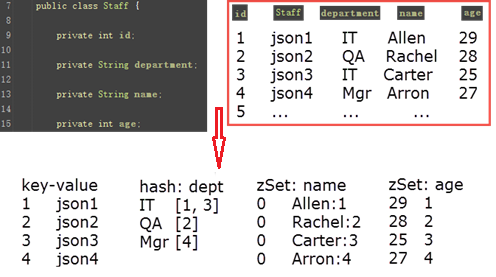
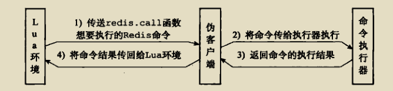
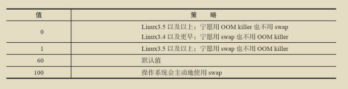

## 优势

1. 基于键值对的NoSQL数据库。
2. 拥有`string`、`hash`、`list`、`set`、`zset`、`bitmaps`等多种数据结构。
3. 所有数据存放在内存，使用C语言，单线程架构不存在多线程竞争，读写性能好，10万QPS。
4. 另外可以将内存数据利用快照和日志的形式保存到硬盘，宕机时有效的保障了数据。
5. 支持键过期、发布订阅、事务、流水线、lua脚本等功能。
6. 提供简单的TCP协议，支持redis的客户端语言丰富。
7. 提供主从复制功能，并提供高可用方案，支持节点故障发现和故障自动转移。

## 数据结构

### 1、SDS(Simple Dynamic String)，简单动态字符串

| 数据结构       | 备注                           |
|------------|------------------------------|
| int len    | 已使用空间长度                      |
| int free   | 未使用空间长度                      |
| char[] buf | 保存的字符串，以空字符‘\0’结束，不计入已使用空间长度 |

优势：

1、获取字符串长度时间复杂度O(1)，C语言遍历数组统计字符串长度时间复杂度O(n)。

2、杜绝空间溢出，拼接字符串时，利用 free可以先检查是否有足够空间，可进行扩容后再拼接。

3、减少修改字符串带来的内存分配，当增长字符串时，采用预分配，当长度小于1m时，会分配free=len，大于1m时，free= 1m；当缩减字符串时，惰性释放，增加free值，并不会立马回收 buf。值得注意的是应尽量减少字符串频繁修改操作如append、setrange，应改为set修改，降低预分配带来的内存浪费和内存碎片化。

4、可以保存特殊字符，因为使用len确定字符长度，而不是`'\0'`;

### 2、链表

1、双向无环链表，对链表访问null就是终点，头部和尾部各有一个null

2、len表示长度，查询长度时间复杂度O1

### 3、字典

| 数据结构                     | 备注                                                                             |
|--------------------------|--------------------------------------------------------------------------------|
| dictEntry **table  哈希表数组 | 每个dictEntry就是一个节点，是一个链表，相同hash值的key存在同一个节点中，使用拉链法，没有链表尾部，所以新加入节点在链表头，时间复杂度O(1) |
| size                     | 哈希表数组总大小                                                                       |
| sizemask                 | 哈希表数组总大小掩码，size-1                                                              |
| used                     | 已经使用节点数量                                                                       |

hash表扩展时机：没有执行bgsave时负载因子大于等于1，执行bgsave时负载因子大于等于5

渐进式rehash，先扩展出另外一个hash表h1，在update、delete、find时同时在两个hash表进行，除此之外还将之前的hash表h0迁移到新表，直到之前的hash表为空时，将h1变为h0,完成迁移。

### 4、跳跃表

跳跃表就是添加了多级索引的链表，用在有序集合键

### 5、整数集合

保存整数值，有序并且不会出现重复元素。

### 6、压缩列表

一个数组，每个数组节点包含该节点的长度，这样既拥有了数组连续访问的优势，同时每个节点长度不一样，节约了空间。这里的压缩列表使用的是从尾部开始访问所以，同时也保存前一个节点的长度。

适合储存小对象和长度有限的数据。

### 7、对象

使用对象来保存键和值，对象类型：

字符串string、列表list、哈希hash、集合set、有序集合zset。

字符串的编码可以是`int`，`raw`，`embstr`，8个字节的长整型使用int，小于等于39个字节的字符串使用embstr，大于39个字节的字符串使用raw。

列表的编码可以是`ziplist`、`linkedlist`，元素个数小于512并且每个元素值小于64字节使用ziplist,否则使用linkedlist。

哈希的编码可以是`ziplist`，`hashtable`，field个数大于512或value大于64字节时使用hashtable，否则使用ziplist。

集合的编码可以是`intset`、`hashtable`，元素个数小于512并且集合元素全是整数使用intset,否则使用hashtable。

有序集合的编码可以是`ziplist`、`skiplist`，元素个数小于128并且每个元素值小于64字节使用ziplist,否则使用skiplist。

## 常用命令

redis中模式匹配通配符：

`*`代表任意字符

`.`代表匹配一个字符

`[]`代表匹配部分字符,如[1,3]代表匹配1,3

`\x`代表转义字符。

### 1、字符串

| 命令                              | 例子                                               | 结果            | 描述                                                  |
|---------------------------------|--------------------------------------------------|---------------|-----------------------------------------------------|
| `set key value`                 | `set key hello`                                  | 成功返回 `OK`     | 设置指定 key 的值                                         |
| `get key`                       | `get key`                                        | 设置的值或 `(nil)` | 获取指定 key 的值                                         |
| `setnx key value`               | `setnx key "hello"`                              | 成功 `1` 失败 `0` | key 不存在时设值                                          |
| `setex key seconds value`       | `setex key 60 "hello"`                           | 成功返回 `OK`     | 设 key 值 过期时间为秒                                      |
| `psetex key milliseconds value` | `psetex key 1000 "Hello"`                        | 成功返回 `OK`     | 设 key 值 过期时间为毫秒                                     |
| `getset key value`              | `getset key hello1`                              | 返回旧值          | 设新 key 返回旧 key 值                                    |
| `mget key1 [key2]`              | `mget key1 key2 key3`                            | 返回列表值         | 批量获取值                                               |
| `mset key value [key value]`    | `mset key1 "hello1" key2 "hello2" key3 "hello3"` | 成功返回 `OK`     | 批量设置值，原子操作，用户不会看到有些 key 值被修改，而另一些 key 值没变，不会有这一中间过程 |
| `msetnx key value [key value]`  | `msetnx key1 "Hello" key2 "there"`               | 成功 `1` 失败 `0` | 批量设置值 key 都不存在才能成功，即使有一个可以存在，都全部不成功，原子操作            |
| `incr key`                      | `incr key1`                                      | `1`           | 累加 1 默认 0                                           |
| `decr key`                      | `decr key1`                                      | `-1`          | 累减 1 默认 0                                           |
| `incrby key increment`          | `incrby key 2`                                   | `2`           | 累加指定值 默认 0                                          |
| `decrby key decrement`          | `decrby key 2`                                   | `-2`          | 累减指定值 默认 0                                          |
| `incrbyfloat key increment`     | `incrbyfloat key 0.2` `incrbyfloat key -0.2`     | `0.2` `-0.2`  | 浮点计算                                                |
| `append key value`              | `append key 123`                                 | 字符串长度 `3`     | 追加数据                                                |

### 2、哈希

```bash
# 将哈希表 key 中的字段 field 的值设为 value
# Redis 4.0 起，可一次设置一个或多个 field/value 对
# 字段是哈希表中的一个新建字段，并且值设置成功，返回 1 。
# 哈希表中域字段已经存在且旧值已被新值覆盖，返回 0 。
hset key field value

# 获取存储在哈希表中指定字段的值
hget key field

# 查看哈希表 key 中，指定的字段是否存在
hexists key field

# 删除一个或多个哈希表字段
hdel key field1 [field2]

# 获取在哈希表中指定 key 的所有字段和值
hgetall key

# 获取所有哈希表中的字段
hkeys key

# 获取哈希表中所有值
hvals key

# 只有在字段 field 不存在时，设置哈希表字段的值
hsetnx key field value

# 同时将多个 field-value （字段-值）对设置到哈希表 key 中
# Redis 4.0 起，HSET 可替代该命令
hmset key field1 value1 [field2 value2]

# 获取所有给定字段的值
hmget key field1 [field2]

# 为哈希表 key 中的指定字段的整数值加上增量 increment
hincrby key field increment

# 为哈希表 key 中的指定字段的浮点数值加上增量 increment
hincrbyfloat key field increment

# 获取哈希表中字段的数量
hlen key

# 返回哈希表中值长度
hstrlen key field

# 迭代哈希表中的键值对（count 在值少的情况下会失败）
#  hscan hkey 0 match "na*"
hscan key cursor [MATCH pattern] [COUNT count]
```

### 3、列表

最多储存2^32-1个元素，索引下标从左到右分别是 0 -> N-1 , 从右到左分别是 -1 -> -N。

```bash
# 将一个或多个值插入到列表头部
lpush key value1 [value2]

# 将一个值插入到已存在的列表头部，需要key存在，不存在则不插入返回0
lpushx key value

# 获取列表指定范围内的元素
lrange key start stop

# 移出并获取列表的第一个元素，弹出插入的最后一个元素，lpush+lpop  先进后出，栈
lpop key

# 获取列表长度
llen key

# 在列表的元素前或者后插入元素，before就是靠近lpush新插入的一端，after就是远离的一端
linster key before|after pivot value

# 通过索引获取列表中的元素,索引从0开始
lindex key index

# 通过索引设置列表元素的值，替换原有该位置上的值
lset key index value

# 移除列表元素
# count > 0: 从头到尾扫描，删除个数为 count，值为 value 的元素。
# count < 0: 从尾到头扫描，删除个数为 count（绝对值），值为 value 的元素。
# count = 0: 移除所有值为 value 的元素。
lrem key count value

# 对一个列表进行修剪(trim)。
# 让列表只保留指定区间内的元素，不在指定区间之内的元素都将被删除。
# 如果 start 超过列表尾部（索引最大值），或者 start > stop`，结果会是列表变成空表（该 key 会被移除）。
# 如果 stop 超过列表尾部（索引最大值），Redis 会将其当作列表的最后一个元素。

# LTRIM 的一个常见用法是和 LPUSH / RPUSH 一起使用。 例如：
# LPUSH lkey value
# LTRIM lkey 0 99
# 这对命令会将一个新的元素 push 进列表里，并保证该列表不会增长到超过100个元素。
# 这是很有用的，比如当用 Redis 来存储日志。 需要特别注意的是，当用这种方式来使用 LTRIM 的时候，操作的复杂度是 O(1) ， 因为平均情况下，每次只有一个元素会被移除。
ltrim key start stop

# 在列表尾部添加一个或多个值
rpush key value1 [value2]

# 为已存在的列表添加值
rpushx key value

# 移除列表的最后一个元素，返回值为移除的元素。lpush+rpop  先进先出 队列
rpop key

# 移除列表的最后一个元素，并将该元素添加到另一个列表并返回，source=key1  destination=key2
rpoplpush source destination

# 移出并获取列表的第一个元素， 如果列表没有元素会阻塞列表直到等待超时或发现可弹出元素为止，lpop的阻塞版本。
blpop key1 [key2] timeout

# 移出并获取列表的最后一个元素，如果列表没有元素会阻塞列表直到等待超时或发现可弹出元素为止，rpop的阻塞版本。
brpop key1 [key2] timeout

# 从列表中弹出一个值，将弹出的元素插入到另外一个列表中并返回它。
# 如果列表没有元素会阻塞列表直到等待超时或发现可弹出元素为止。
brpoplpush source destination timeout
```

### 4、集合

string类型的无序集合，添加、删除、查找的时间复杂都是 O(1)。

```bash
# 将一个或多个成员元素加入到集合中
sadd key member1 [member2]

# 获取集合中全部成员
smembers key

# 判断 member 是否为 集合 key 中的成员
sismember key member

# 获取集合的成员数
scard key

# 随机取集合中一个或多个成员移除并返回
spop key [count]

# 随机取 count 个成员，不删除
srandmember key [count]

# 移除集合中一个或多个成员
srem key member1 [member2]

# 将成员 member 从 source 集合移动到 destination 集合
smove source destination member

# 返回第一个集合独自拥有的成员
sdiff key1 [key2]

# 返回第一个集合独自拥有的成员，并存入 destination
sdiffstore destination key1 [key2]

# 返回所有给定集合的成员交集
sinter key1 [key2]

# 返回所有给定集合的成员交集，并存入 destination
sinterstore destination key1 [key2]

# 返回给定集合并集
sunion key1 [key2]

# 返回给定集合并集，并存入 destination
sunionstore destination key1 [key2]

# 迭代集合中键的元素
sscan key cursor [MATCH pattern] [COUNT count]
```

### 5、有序集合

有序集合和集合一样也是 String 类型元素的集合，且不允许重复的成员。

不同的是每个元素都会关联一个 double 类型的分数。

Redis 正是通过分数来为集合中的成员进行从小到大的排序。

有序集合的成员是唯一的，但分数 score 却可以重复。

添加、删除、查找的时间复杂都是 O(1)。

```bash
# 向有序集合添加一个或多个成员，或者更新已存在成员的分数
zadd key [NX|XX] [CH] [INCR] score1 member1 [score2 member2]

# 通过索引区间返回有序集合指定区间内的成员
zrange key start stop [WITHSCORES]

# 返回有序集中指定区间内的成员，通过索引，分数从高到低
zrevrange key start stop [WITHSCORES]

# 获取有序集合的成员个数
zcard key

# 计算在有序集合中指定区间分数的成员数（默认闭区间）
zcount key min max

# 有序集合中对指定成员的分数加上增量 increment
zincrby key increment member

# 返回有序集中，成员的分数值
zscore key member

# 返回有序集合中指定成员的索引
zrank key member

# 返回有序集合中指定成员的排名，有序集成员按分数值递减(从大到小)排序
zrevrank key member

# 移除有序集合中的一个或多个成员
zrem key member1 [member2]

# 移除有序集合中给定的排名区间的所有成员
zremrangebyrank key start stop

# 移除有序集合中给定的分数区间的所有成员
zremrangebyscore key min max

# 通过分数返回有序集合指定区间内的成员
zrangebyscore key min max [WITHSCORES] [LIMIT offset count]

# 返回有序集中指定分数区间内的成员，分数从高到低排序
zrevrangebyscore key max min [WITHSCORES]

# 在有序集合中计算指定字典区间内成员数量
zlexcount key min max

# 通过字典区间返回有序集合的成员
zrangebylex key min max [LIMIT offset count]

# 通过字典区间返回有序集合的成员，倒序
zrevrangebylex key max min [LIMIT offset count]

# 移除有序集合中给定的字典区间的所有成员
zremrangebylex key min max

# 计算给定的一个或多个有序集的并集，并存储在新的 destination 中
zunionstore destination numkeys key1 [key2]

# 计算给定的一个或多个有序集的交集并将结果集存储在新的有序集合 destination 中
zinterstore destination numkeys key1 [key2]

# 迭代有序集合中的元素（包括元素成员和元素分值）
zscan key cursor [MATCH pattern] [COUNT count]
```

### 6、键（key）

```bash
# 当 key 存在时删除 key
del key1 [key2]

# 当 key 存在时删除 key（异步删除）
unlink key1 [key2]

# 检查给定 key 是否存在
exists key1 [key2]

# 给 key 设置一个过期时间，单位秒
expire key seconds

# 设置 key 的指定过期时间，秒时间戳参数（10 位时间戳）
expireat key timestamp

# 给 key 设置一个过期时间，单位毫秒
pexpire key milliseconds

# 设置 key 的指定过期时间，毫秒时间戳参数（13 位时间戳）
pexpireat key milliseconds-timestamp

# 查找符合给定条件的 key
# 可使用占位符 ? * [a-z] [^a-d] 等
# 禁止使用
keys pattern

# 返回当前数据键总数，时间 O(1)
dbsize

# 将当前 key 移动到指定数据库中
move key db

# 移除 key 的过期时间，key 将不会过期删除。
persist key

# 查询当前 key 的剩余生存时间，单位秒, -1:Key没有设置过期时间 -2:键不存在
ttl key

# 查询当前 key 的剩余生存时间，单位毫秒
pttl key

# 从当前数据库随机返回一个 key
randomkey

# 修改 key 名称，当 newkey 存在时直接被覆盖。之前newkey储存的value变为key储存的value。
rename key newkey

# 修改 key 名称，仅当 newkey 不存在时才会成功。
renamenx key newkey

# 返回当前 key 的数据类型,不存在返回none
type key

# 序列化 key（取出redis值，以字符串形式保存）
dump key

# 反序列化，并绑定 key。（值由 dump 生成），参数 ttl 以毫秒为单位为 key 设置生存时间；如果 ttl 为 0 ，那么不设置生存时间。
restore key ttl serialized-value

# 迭代数据库中键
scan cursor [MATCH pattern] [COUNT count]
```

### 7、排序

```bash
# 对一个包含数字值的key进行排序
sort <key>
# 对一个包含字符串值的key进行排序
sort <key> ALPHA
# 升序排序
sort <key> ASC
# 降序排序
sort <key> DESC
# 使用 BY 模式匹配部分key进行排序
sort <key> by *XXXX
sort <key> by *XXXX ALPHA
# 使用 LIMIT 返回已排序的一部分元素
sort <key> ALPHA LIMIT <offset> <count>

# 使用 sort 排序后的值为参数输入到GET，模式匹配Key，并取出Key的值
sort <key> ALPHA GET *XXXX
# 例如：SADD students "peter" "jack" "tom"
#       SET peter-name "peter white"
#       SET jack-name "jack snow"
#       SET tom-name "tom smith"
# SORT students ALPHA GET *-name 的结果为 "jack snow" "peter white" "tom smith"

# 使用 STORE 将排序结果保存在指定键
sort <key> ALPHA STORE <key>
```

sort 各选项的执行顺序：

1. 排序，命令会使用 ALPHA、ASC、DESC、BY 选项对输入键进行排序。
2. 限制排序结果集长度，命令会使用LIMIT。
3. 获取外部键，命令会使用GET，根据排序结果集中的元素，已经GET指定的模式，查找并获取指定键的值，并用这些值作为新的结果集。
4. 向客户端返回排序结果集。

sort 的时间复杂度为O(n + m logm),n为要排序的列表，m表示要返回的元素个数,大数据量排序操作会严重影响性能。

### 8、二进制位

```bash
# 在位数组指定偏移量 offset 上的二进制位设置值 0 或 1
setbit <key> <offset> 0|1
# 获取位数组指定偏移量上的二进制位的值
getbit <key> <offset>
# 获取二进制数组中，值为1的数量
bitcount <key>
# 对多个位数组进行位运算，与(and)、或(or)、异或(xor)、取反(not)
bitop and <and-result-key> <key1> <key2> <key3> ...
bitop or <or-result-key> <key1> <key2> <key3> ...
bitop xor <xor-result-key> <key1> <key2> <key3> ...
bitop not <not-result-key> <key>
```

二进制位数组是使用字符串对象SDS来表示的，SDS是用字节数组表示，一个字节包含8个bit，并且保存的位数组顺序和正常书写的顺序相反，方便setbit命令操作，当字节数组不够存储时需要扩展，扩展后不用移动位数组原来的位置。

位置的计算：

1. 计算保存在字节数组中索引的位置：byte = offset/8。
2. 计算保存在字节中bit的位置：bit = (offset mod 8) + 1。

bitcount实现：

当位数低于128位使用查表法，每8位相加;高于128位，每次读入128进行4次汉明重量算法，结果相加。

涉及两种算法：

1. 0000 0000 到 1111 1111内使用查表法。
2. 计算汉明重量算法。

```text
//计算汉明重量
i = ( i & 0x55555555) + ((i >> 1) & 0x55555555);
i = ( i & 0x33333333) + ((i >> 1) & 0x33333333);
i = ( i & 0x0F0F0F0F) + ((i >> 1) & 0x0F0F0F0F);
i = ( i *(0x01010101)) >> 24)
```

### 9、客户端命令

```bash
# 登陆
redis-cli -h <ip> -p <port>
redis-cli -h <ip> -p <port> <command>
# 关闭
redis-cli shutdown <nosave|save>
# redis-cli 参数
# -r 执行多次命令
# -i 每隔几秒执行一次命令，必须和 -r 一起使用
# -c 连接 cluster节点使用
# --slave 可以把当前客户端模拟成当前redis节点的从节点
# --rdb 请求redis生成并发送rdb文件保存到本地
# --pipe 将命令封装成redis通信协议定义的数据格式，批量发送给redis执行，并不是原子的
# --bigkeys 使用scan命令对redis的键进行采样，从中找到内存占用比较大的键值
# --eval 用于指定lua脚本
# --latency 测试客户端到目标redis的网络延迟 --latency-history 每 15 秒输出一次，可以通过 -i 参数控制间隔时间  --latency-dist 使用统计图表输出
# --stat 实时获取redis的统计信息
# --no-raw 返回结果为原始格式 --raw 返回格式化后的结果

# 登陆之后执行

# 查询与服务端相连的所有客户端连接信息
client list
# id: 客户端标识
# addr: ip、port
# fd：socket文件描述符，如果fd=-1，表示redis的伪客户端
# name：客户端名称
# flag：客户端类型，详细信息如下图。

# 输入缓冲区
# qbuf：输入缓冲区总容量 qbuf-free：输入缓冲区剩余容量 要求每个客户端输入缓冲区大小不能超过1G，否则将客户端关闭
# 输出缓冲区
# obl：固定缓冲区的长度  oll：动态缓冲区的长度  omem：使用字节数
# 客户端的存活状态
# age：当前客户端已经连接时间 idle：最近一次的空闲时间

# 设置最大客户端连接数,默认10000
config set maxclients <count>
# 设置连接的最大空闲时间，默认为 0
config set timeout <count 秒>

#主动杀死客户端
client kill <ip:port>
```


#### 输入缓冲区

输入缓冲区不受maxmemory控制，例如：

```bash
127.0.0.1：6390 > info memory

used_memory_human: 5G

max_memory_human: 4G
```

输入缓冲区过大存在严重危害，主要原因是处理速度跟不上输入速度：

1. 进入输入缓冲区的命令包含了大量的bigkey。
2. redis发送阻塞，短期不能处理命令。

监控的方法：

通过info clients，找到最大的输入缓冲区 client_biggest_input_buf ，超过限制就报警，然后再使用执行client list，收集 qbuf、qbuf-free，找到异常客户端。

防范的方法：

减少bigkey，减少阻塞操作，合理的监控警报。

#### 输出缓冲区

可以通过 client-output-buffer-limit 来设置，可以为不同的客户端设置不同的缓冲区：普通客户端、发布订阅客户端、slave客户端。

```bash
# <class> : normal、slave、pubsub
# <hard limit> ：如果大于直接关闭
# <soft limit>和<soft seconds> ： 如果大于并持续多少秒则关闭
client-output-buffer-limit <class> <hard limit> <soft limit> <soft seconds>

# 默认配置：
client-output-buffer-limit normal 0 0 0
client-output-buffer-limit slave 256mb 64mb 60
client-output-buffer-limit pubsub 32mb 8mb 60
```

输出缓冲区不受maxmemory控制，分成固定缓冲区(16kb)和动态缓冲区：

固定缓冲区：返回比较小得执行结果。

动态缓冲区：返回比较大的结果，例如大的字符串、hgetall、smembers等。

防范的方法：

1. 限制不同客户端缓冲区。
2. 适当增大master节点的slave的输出缓冲区，如果master节点写入较大，slave客户端的输出缓冲区可能会比较大，一旦slave被kill，会造成重连和复制。
3. 限制让输出缓冲区增大的命令，如moniter。
4. 通过info clients，找到最大的输入缓冲区 client_longest_output_list ，超过限制就报警，然后再使用执行client list，收集obl、oll、omem，找到异常客户端。

### 10、HyperLogLog

内存占用小，但统计数据存在误差。

```bash
# 添加元素
pfadd <key> [element...]
# 计算总数，不准确，存在0.81%误差
pfcount <key>
# 合并
pfmerge <destkey> <sourcekey>
```

### 11、geo

使用zset数据结构。

```bash
# 增加
geoadd key [<longitude> <latitude> <member>  ...]
# 获取
geopos key <member>
# 获取两个地理位置的距离,<unit> 表示单位，m、km、mi(英里)、ft(尺)
geodist key <member1> <member2> <unit>
# 获取指定范围的地理信息的位置集合
# 可选参数：
# withcoord:返回结果包含经纬度。
# withdist:返回结果包含离中心节点距离。
# withhash:返回包含geohash。
# count <count>:返回结果数量。
# asc|desc:返回结果按照离中心节点距离做升序或者降序。
# store <key>:返回结果保存到指定键。
# storedist <key>:将返回结果离中心节点距离保存到指定键。
georadius key <longitude> <latitude> <radiusm|km|ft|mi>
# 获取geohash,由二维经纬度转换成一纬字符，两个字符串越相似，距离越近，长度越长精度越高，9位精度在2米左右
geohash key [member...]
# 删除地理位置信息
zrem key member
```

## 使用场景

Redis 使用场景与它拥有的数据结构相关：

* String: 缓存、限流、计数器、分布式锁、分布式Session。
* Hash: 储存用户信息、用户主页访问量、组合查询。
* List: 社交软件关注人时间轴列表、队列。
* Set: 赞、踩、标签、好友关系。
* Zset：排行榜，取最新、top n个数据等。

### String

#### 1、分布式锁

**分布式锁有以下几个特点：**

1. 互斥性：和我们本地锁一样互斥性是最基本的，但是分布式锁需要保证在不用节点的不同线程的互斥。
2. 可重入性：同一个节点上的同一个线程如果获取锁之后那么也可以再次获取这个锁。
3. 锁超时：和本地锁一样支持锁超时，防止死锁。
4. 高效，高可用：加锁和解锁需要高效，同时也需要保证高可用防止分布式锁失效，可以增加降级。
5. 支持阻塞和非阻塞：和 ReentrantLock 一样支持 lock 和 trylock 以及 tryLock(long timeOut)。
6. 支持公平锁和非公平锁(可选)：公平锁的意思是按照请求加锁的顺序获得锁，非公平锁就相反是无序的。这个一般来说实现的比较少。

**常见的分布式锁：**
我们一般实现分布式锁有以下几个方式：

1. MySQL

 ```sql
 #
利用mysql的隔离性
：唯一索引
 # 创建一张锁表
CREATE TABLE methodLock
(
    id          int(11) NOT NULL AUTO_INCREMENT COMMENT '主键',
    method_name varchar(64)   NOT NULL DEFAULT '' COMMENT '锁定的方法名',
    desc        varchar(1024) NOT NULL DEFAULT '备注信息',
    update_time timestamp     NOT NULL DEFAULT CURRENT_TIMESTAMP ON UPDATE CURRENT_TIMESTAMP COMMENT '保存数据时间，自动生成',
    PRIMARY KEY (id),
    UNIQUE KEY uidx_method_name (method_name ) USING BTREE
) ENGINE=InnoDB DEFAULT CHARSET=utf8 COMMENT='锁定中的方法';

#
锁表
 insert into methodLock(method_name,desc) values ('method_name','desc')
 # 解锁
delete
from methodLock
where method_name = 'method_name'
 ```

2. ZK

 ```bash
 # zookeeper实现分布式锁的原理主要是利用顺序临时节点的特性。

 #获取锁
 #所有客户端都试图创建同一个临时节点A，zookeeper会保证所有客户端中只有一个能创建成功，那么就可以认为该客户端获得了锁，其他客户端就要到临时节点A上注册一个子节点变更的Watcher监听。

 #释放锁
 #以下两种情况，都可能释放锁：
 # 1、当前获取锁的客户端机器发生宕机，那么zookeeper上的这个临时节点就会被删除。
 # 2、正常业务逻辑执行完后，客户端会主动将自己创建的临时节点删除。
 # 无论什么情况移除了节点A，ZooKeeper都会通知所有在该节点上注册了子节点变更Watcher的客户端，这些客户端在接收到通知后，再次重新发起分布式锁获取。
 ```

3. Redis

 ```bash
 # 方案一
 # Redis可以利用命令Setnx()来实现分布式锁，性能是最好的，但是可靠性没有zookeeper好，而且通过超时时间来控制锁的失效时间并不可靠。
 # 加锁
 SETNX  product:10001  true 		//返回1代表获取锁成功
 SETNX  product:10001  true 		//返回0代表获取锁失败
 SET product:10001 true  ex  10  nx	//增加一个10S的超时时间，避免程序挂了，锁一直不释放
 # 解锁
 DEL  product:10001			    //执行完业务释放锁
 # 但是这样会有问题
 # 举个例子：
 # 线程 1 在开始的时候比较幸运，获得了锁，最先开始执行任务，但是，由于他比较耗时，最后锁超时自动释放了他都还没执行完。
 # 因此，线程 2 和线程3 的机会来了。而这一轮，线程2 比较幸运，得到了锁。
 # 可是，当线程2正在执行任务期间，线程1 执行完了，还把线程2的锁给释放了。
 # 所以使用lua改进逻辑：
 1. 线程1 准备释放锁 ， 锁的key 为 mylock， value 为 thread1_magic_num
 2. 查询当前锁 current_value = get mylock
 3. 判断    if current_value == thread1_magic_num  -- > 是  我（线程1）的锁
           else                                   -- > 不是 我（线程1）的锁
 4. 是我的锁就释放，否则不能释放（而是执行自己的其他逻辑）。

 # 不靠谱的情况：
 # 如果是在redis sentinel集群中,当我们申请一个锁的时候，对应就是一条命令 `setnx mykey myvalue`。
 # 在redis sentinel集群中，这条命令先是落到了主库。假设这时主库down了，而这条数据还没来得及同步到从库，sentinel将从库中的一台选举为主库了。
 # 这时，我们的新主库中并没有mykey这条数据，若此时另外一个client执行 `setnx mykey hisvalue` , 也会成功，即也能得到锁。
 # 这就意味着，此时有两个client获得了锁。

 # redlock
 # 使用redlock算法，需要多个redis实例，加锁的时候，它会想多半节点发送 setex mykey myvalue 命令，只要过半节点成功了，那么就算加锁成功了。
 # 释放锁的时候需要想所有节点发送del命令。
 1. 获取当前的时间（单位是毫秒）。
 2. 使用相同的key和随机值在N个节点上请求锁。这里获取锁的尝试时间要远远小于锁的超时时间，
    防止某个masterDown了，我们还在不断的获取锁，而被阻塞过长的时间。
 3. 只有在大多数节点上获取到了锁，而且总的获取时间小于锁的超时时间的情况下，认为锁获取成功了。
 4. 如果锁获取成功了，锁的超时时间就是最初的锁超时时间减去获取锁的总耗时时间。
 5. 如果锁获取失败了，不管是因为获取成功的节点的数目没有过半，还是因为获取锁的耗时超过了锁的释放时间，
    都会将已经设置了key的master上的key删除。

 # 可重入锁
 # 分布式可重入锁实现方式有两种：
 1. 基于 ThreadLocal 实现方案

    private static ThreadLocal<Map<String, Integer>> LOCKS = ThreadLocal.withInitial(HashMap::new);
    每个线程都可以通过 ThreadLocal获取自己的 Map实例，Map 中 key 存储锁的名称，而 value存储锁的重入次数。

    加锁：
    	首先判断当前线程是否已经已经拥有该锁，若已经拥有，直接对锁的重入次数加 1。
    	若还没拥有该锁，则尝试去 Redis 加锁，加锁成功之后，再对重入次数加 1 。’
    释放锁：
     释放锁的时首先判断重入次数，若大于 1，则代表该锁是被该线程拥有，所以直接将锁重入次数减 1 即可。
 	若当前可重入次数小于等于 1，首先移除 Map中锁对应的 key，然后再到 Redis 释放锁。
 	这里需要注意的是，当锁未被该线程拥有，直接解锁，可重入次数也是小于等于 1 ，这次可能无法直接解锁成功。

 	存在问题：
 	1.会存在过期时间的问题，如果redis已经过期，本地还存在。
 	2.统一客户端不同线程不可重入。
 	3.map操作和redis操作非原子性操作。

 2. 基于 Redis Hash 实现方案
     使用 redis的哈希表来储存可重入次数，然后使用lua脚本判断逻辑，

 #方案二
 # 使用Redisson
 # 使用redisson客户端进行分布式锁的设置，使用tryLock方法对分布式锁的设置进行判断，执行不同的逻辑，
 # 如果业务逻辑执行的过程中服务宕机，那么会由redisson提供的看门狗监控锁进行兜底，在实例结束后的一段时间内对锁进行清除。
 # 看门狗设置过期的时间默认是30s，每30 / 3 s进行一次判断，我们也可以对看门狗时间进行一个手动的设置。

 @Configuration
 public class redissonConfig {

     @Bean
     public RedissonClient configRedisson(){
         Config config = new Config();
         config.useSingleServer().setAddress("redis://172.0.0.1:6379")
         .setPassword("777777");
         config.setCodec(new StringCodec());
         //设置看门狗的时间，不配置的话默认30000
         config.setLockWatchdogTimeout(12000);
         RedissonClient redisson =  Redisson.create(config);
         return redisson;
     }
 }
 ```


#### 2、计数器

利用 `INCR`实现统计数据的增加，原子操作，并且速度快。

#### 3、分布式全局Id

使用 `INCRBY  orderId  1000 `，一次性拿1000个ID，保存到服务器自己内存中，然后自己服务器内部保障这1000个ID的分配。

#### 4、缓存

```bash
缓存的收益：
1.加速读写。
2.降低后端负载。
```

```bash
缓存的成本：
1.数据不一致。
2.代码维护成本。
3.运维成本。
```

```bash
更新策略：
1.LRU(Least Recently Used-最近最久未使用-针对访问时间)
  LFU(Least Frequently Used-最近最少使用-针对访问次数)
  FIFO(First in First out-先进先出)
  其他算法剔除
2.超时剔除
3.主动更新

低一致性业务，或者只读业务使用最大内存算法淘汰策略+超时剔除。
高一致性业务使用超时剔除+主动更新，但仍然会有一致性问题。
```

##### 写数据一致性问题

```bash
数据读取流程：先读缓存，如果缓存没读到，则去读DB，之后再异步将数据刷回缓存

缓存和数据库双写的四种方案：
1.先更新缓存，再更新数据库。
2.先更新数据库，再更新缓存。
3.先淘汰缓存，再更新数据库。
4.先更新数据库，再淘汰缓存。
```

更新还是淘汰：

```bash
淘汰cache：
  优点：操作简单，无论更新操作是否复杂，直接将缓存中的旧值淘汰
  缺点：淘汰cache后，下一次查询无法在cache中查到，会有一次cache miss，这时需要重新读取数据库
更新cache：更新cache的意思就是将更新操作也放到缓冲中执行，并不是数据库中的值更新后再将最新值传到缓存
  优点：命中率高，直接更新缓存，不会有cache miss的情况
  缺点：更新cache消耗较大
    当更新操作简单，如只是将这个值直接修改为某个值时，更新cache与淘汰cache的消耗差不多
    但当更新操作的逻辑较复杂时，需要涉及到其它数据，如用户购买商品付款时，需要考虑打折等因素，
    这样需要缓存与数据库进行多次交互，将打折等信息传入缓存，再与缓存中的其它值进行计算才能得到最终结果，
    此时更新cache的消耗要大于直接淘汰cache
所以选择直接淘汰缓存更好，如果之后需要再次读取这个数据，最多会有一次缓存失败。
```

更新的另外一个问题：当并发较大，同时有两个线程需要对同一个数据进行更新时，可能会出现以下问题：

```bash
方案一.先更新(update)缓存，再更新数据库
    线程A更新了缓存
    线程B更新了缓存
    线程B更新了数据库
    线程A更新了数据库
方案二.先更新数据库，再更新(update)缓存
    线程A更新了数据库
    线程B更新了数据库
    线程B更新了缓存
    线程A更新了缓存
结论：更新cache的消耗更大，且很有可能造成数据的不一致，所以推荐直接淘汰cache

使用淘汰cache,如何选择执行顺序，主要分为两个方面来考虑：
1.更新数据库与淘汰缓存是两个步骤，只能先后执行，如果在执行过程中后一步执行失败，哪种方案的影响最小？
2.如果不考虑执行失败的情况，但更新数据库与淘汰缓存必然存在一个先后顺序，在上一个操作执行完毕，
  下一个操作还未完成时，如果并发较大，仍旧会导致数据库与缓存中的数据不一致，在这种情况下，用哪种方案影响最小？

对于数据库而言，读写操作可以只作用在同一台服务器上，即底层只有一个数据库，也可以将读操作放在从库，写操作放在主库，
即底层是主从架构，对于主从架构还需要考虑主从延迟。
```

```bash
#情景一：更新数据库与淘汰缓存需要先后执行，如果在执行过程中后一步执行失败，哪种方案对业务的影响最小？
#方案一.先淘汰缓存，再更新数据库
	如果第一步淘汰缓存成功，第二步更新数据库失败，此时再次查询缓存，最多会有一次cache miss
#方案二.先更新数据库，再淘汰缓存
	如果第一步更新数据库成功，第二部淘汰缓存失败，则会出现数据库中是新数据，缓存中是旧数据，即数据不一致
	解决办法：为确保缓存删除成功，需要用到“重试机制”，即当删除缓存失效后，返回一个错误，由业务代码再次重试，直到缓存被删除。

但对于方案一，如果更新数据库失败其实也是一个问题，为了确保数据库中的数据被正常更新，
也需要“重试机制”，即当数据库中的数据更新失败后，也需要人工或业务代码再次重试，直到更新成功。

【结论】总体而言，虽然方案二导致数据不一致的可能性更大，
       但在业务中，无论是淘汰缓存还是更新数据库，我们都需要确保它们真正完成了。

#情景二：假设没有操作会执行失败，但执行前一个操作后无法立即完成下一个操作，
#在并发较大的情况下，可能会导致数据不一致。此时，哪种方案对业务的影响最小？

# 方案一.先淘汰缓存，再更新数据库
1.在正常情况下，A、B两个线程先后对同一个数据进行读写操作：
A线程进行写操作，先淘汰缓存，再更新数据库
B线程进行读操作，发现缓存中没有想要的数据，从数据库中读取更新后的新数据

2.在并发量较大的情况下，采用同步更新缓存的策略：
A线程进行写操作，先成功淘汰缓存，但由于网络或其它原因，还未更新数据库或正在更新
B线程进行读操作，发现缓存中没有想要的数据，从数据库中读取数据，但此时A线程还未完成更新操作，
所以读取到的是旧数据，并且B线程将旧数据放入缓存。注意此时是没有问题的，因为数据库中的数据还未完成更新，
所以数据库与缓存此时存储的都是旧值，数据没有不一致

在B线程将旧数据读入缓存后，A线程终于将数据更新完成，此时是有问题的，数据库中是更新后的新数据，
缓存中是更新前的旧数据，数据不一致。如果在缓存中没有对该值设置过期时间，旧数据将一直保存在缓存中，
数据将一直不一致，直到之后再次对该值进行修改时才会在缓存中淘汰该值。

此时可能会导致cache与数据库的数据一直或很长时间不一致

在这种情况下，可以用一些方法来进行优化：
1.串行化
保证对同一个数据的读写严格按照先后顺序串行化进行，避免并发较大的情况下，多个线程同时对同一数据进行操作时带来的数据不一致性。
需要两步：
    1、同一个数据的读写落在同一个后端服务上。
       两个办法：同一个数据id取模选取服务连接，或者同一个数据id发到kafka同一个topic中同一个分片上、也可以使用取模的办法，
       		   只要id是均衡的，负载就是均衡的。
    2、同一个数据的读写落在同一个数据库连接上。
       使用id取模获取数据库连接。

2.延时双删+设置缓存的超时时间
    不一致的原因是，在淘汰缓存之后，旧数据再次被读入缓存，且之后没有淘汰策略，
    所以解决思路就是，在更新数据库后，再次淘汰缓存，即淘汰缓存两次(延迟双删)。

引入延时双删后，执行步骤变为下面这种情形：
    A线程进行写操作，先成功淘汰缓存，但由于网络或其它原因，还未更新数据库或正在更新
    B线程进行读操作，从数据库中读入旧数据，共耗时N秒
    在B线程将旧数据读入缓存后，A线程将数据更新完成，此时数据不一致
    A线程将数据库更新完成后，休眠M秒(M比N稍大即可)，然后再次淘汰缓存，
    此时缓存中即使有旧数据也会被淘汰，此时可以保证数据的一致性。

    其它线程进行读操作时，缓存中无数据，从数据库中读取的是更新后的新数据

引入延时双删后，存在两个新问题：
    1、A线程需要在更新数据库后，还要休眠M秒再次淘汰缓存，等所有操作都执行完，这一个更新操作才真正完成，降低了更新操作的吞吐量
    解决办法：用“异步淘汰”的策略，将休眠M秒以及二次淘汰放在另一个线程中，A线程在更新完数据库后，可以直接返回成功而不用等待。
    2、如果第二次缓存淘汰失败，则不一致依旧会存在
    解决办法：用“重试机制”，即当二次淘汰失败后，报错并继续重试，直到执行成功

    在读写分离情况下，与此情况相同，可采取相同方式

3.在并发量较大的情况下，采用异步更新缓存的策略：
  A线程进行写操作，先成功淘汰缓存，但由于网络或其它原因，还未更新数据库或正在更新
  B线程进行读操作，发现缓存中没有想要的数据，从数据库中读取数据，但B线程只是从数据库中读取想要的数据，
  并不将这个数据放入缓存中，所以并不会导致缓存与数据库的不一致

  A线程更新数据库后，通过订阅binlog来异步更新缓存，此时数据库与缓存的内容将一直都是一致的。

  在读写分离情况下，可在订阅到binlog更新日志时，先不删除缓存，而是投递一个延迟消息，延迟消息的延迟时间，
  设置为主库与从库的数据同步延迟的时间，可自行预估，监听到延迟消息，在删除缓存。

# 方案二.先更新数据库，再淘汰缓存
1.在正常情况下：
    A线程进行写操作，更新数据库，淘汰缓存
    B线程进行读操作，从数据库中读取新的数据
    不会有问题
2.在并发较大的情况下，情形1：
    A线程进行写操作，更新数据库，还未淘汰缓存
    B线程从缓存中可以读取到旧数据，此时数据不一致
    A线程完成淘汰缓存操作
    其它线程进行读操作，从数据库中读入最新数据，此时数据一致
    不过这种情况并没有什么大问题，因为数据不一致的时间很短，数据最终是一致的
3.在并发较大的情况下，情形2：
    A线程进行写操作，更新数据库，但更新较慢，缓存也未淘汰
    B线程进行读操作，读取了缓存中的旧数据
    但这种情况没什么问题，毕竟更新操作都还未完成，数据库与缓存中都是旧数据，没有数据不一致
4.在并发较大的情况下，情形3：
    A线程进行读操作，缓存中没有相应的数据，将从数据库中读数据到缓存，
    此时分为两种情况
    	1. 还未读取数据库的数据,B线程执行写操作，更新数据库，淘汰缓存
    	2. 已读取数据库的数据，不过由于网络等问题数据还未传输到缓存,B线程写操作完成后，A线程才将数据库的数据读入缓存
    对于第一种情况，A线程读取的是B线程修改后的新数据，没有问题，对于第二种情况，A线程读取的是旧数据，此时数据会不一致
    不过这种情况发生的概率极低，因为一般读操作要比写操作要更快

    万一担心存在这种可能，可以用“延迟双删”策略，在B线程淘汰缓存完成后，隔一段时间再淘汰一次缓存

    【结论】：在该方案下，无论是采用同步更新缓存(从数据库读取的数据直接放入缓存中)，
    		还是异步更新缓存(数据库中的数据更新完成后，再将数据同步到缓存中)，都不会导致数据的不一致
		该方案主要只需要担心一个问题：如果第二步淘汰缓存失败，则数据会不一致
		解决办法之前也提到过，用“重试机制”就可以，如果淘汰缓存失败就报错，然后重试直到成功
#单节点下两种方案对比
先淘汰cache，再更新数据库：
    1.采用同步更新缓存的策略，可能会导致数据长时间不一致，如果用延迟双删来优化，
      还需要考虑究竟需要延时多长时间的问题——读的效率较高，但数据的一致性需要靠其它手段来保证
    2.采用异步更新缓存的策略，不会导致数据不一致，但在数据库更新完成之前，
      都需要到数据库层面去读取数据，读的效率不太好——保证了数据的一致性，适用于对一致性要求高的业务
先更新数据库，再淘汰cache：
    1.无论是同步/异步更新缓存，都不会导致数据的最终不一致，在更新数据库期间，cache中的旧数据会被读取，可能会有一段时间的数据不一致。
    2.但读的效率很好——保证了数据读取的效率，如果业务对一致性要求不是很高，这种方案最合适
#其它
  重试机制可以采利用“消息队列MQ”来实现
  通过订阅binlog来异步更新缓存，可以通过canal中间件来实现

#读写分离情况下，缓存和数据库不一致问题
由于主从库同步会有一定时间间隔，如果主库更新完成，缓存也已经删除，但是从库还未同步，
但是这个时候触发读操作会读取从库的旧数据，并更新到缓存。
#方案一.利用数据库自身特性
	mysql中有全同步复制机制、半同步复制、异步复制三种复制方案。
	当我们使用全同步复制机制时当A提交更新请求主库事务之后，不是立即返回，而是等到所有的从库节点必须收到、APPLY并且提交这些事务，
	主库线程才返回请求A结果，才能做后续操作。这样就解决了数据同步延迟的问题。

	oracle共享存储
	oracle的共享储存所有数据储存在同一个地方，只是启动了多个DB服务，所以不存在数据同步问题，
  当然这个部署方案不是严格意义的读写分离，储存是同一个。
#方案二.缓存标记法
	1. A发起写请求，更新了主库，但在缓存中设置一个标记，代表此数据已经更新。
	2. 设置此标记，要加上过期时间，可以为预估的主库和从库同步延迟的时间
	3. B发起读请求的时候，先判断此请求的业务在缓存中有没有更新标记
	4. 如果存在标记，走主库；如果没有走从库。
#方案三.延迟删除
	订阅binlog，投递一个延迟消息，延迟消息的延迟时间，设置为主库与从库的数据同步延迟的时间，监听到延迟消息，在删除缓存。
```

##### 缓存粒度控制，缓存全量数据，还是缓存部分数据

```bash
1.通用性：从通用性角度考虑，缓存全量属性更好。
2.占用空间(内存空间+网络带宽)：从占用空间的角度考虑，缓存部分属性更好。
3.代码维护：从代码维护角度考虑，表面上缓存全量属性更好。

缓存粒度问题是一个容易被忽视的问题，如果使用不当，可能会造成很多无用空间的浪费，网络带宽的浪费，代码通用性较差等情况，
需要综合数据通用性、空间占用比、代码维护性三点进行取舍。

从大部分应用来看：选择部分属性可能会更好，很多时候不用去考虑扩展性，而是缓存的优化。
```

##### 缓存穿透优化

```bash
缓存穿透是指查询缓存和数据库都没有的数据，由于数据不存在，缓存也不会存在该数据，所有请求直接穿透到数据库。
如果被恶意用户利用，疯狂请求不存在的数据，会导致数据库压力过大，甚至垮掉。
或者自身业务代码或者数据出现问题。

方案一.缓存空对象，缓存空对象会存在两个问题：
1.缓存了空对象，就需要更多的内存空间，解决办法是设置一个较短的过期时间。
2.会存在数据不一致情况，需要使用上面的一致性方案处理

方案二.拦截无效请求。
1.对恶意请求用户加入黑名单。
2.对请求进行合法性校验，其中最常见的是使用布隆过滤器。

布隆过滤器适用于数据相对固定实时性低的场景，对于数据频繁变化实时性高的场景还是应使用方案一，并对请求进行合法性校验，拦截无效请求。
```

##### 缓存无底洞优化，如何高效地在分布式缓存中批量操作？

```bash
为了满足大量的缓存数据，集群中部署了非常多的节点，key会分布到各个节点上，批量操作通常需要从不同的节点获取，
相比于单机批量操作只涉及一次网络操作，集群批量操作会涉及多次网络操作，也就意味着批量操作会随着节点的增多，耗时会不断增大，
网络连接数变多，对节点的性能也会影响。

所谓“无底洞”就是说投入越多不一定产出越多。

1.命令本身的优化：减少使用慢查询，比如：
时间复杂度O(n)的命令，如hgetall、smember，lrange等;
生成环境慎用monitor命令、禁用keys命令、注意使用del命令(删除一个List/Hash/Set/ZSet类型时，它的复杂度是O(n))，
	当del时：
 	如果是List类型，你可以执行lpop或者rpop，直到所有元素删除完成。
	如果是Hash/Set/ZSet类型，你可以先执行hscan/sscan/scan查询，再执行hdel/srem/zrem依次删除每个元素。
避免使用SORT、SINTER、SINTERSTORE、ZUNIONSTORE、ZINTERSTORE等并集交集复杂度过高的聚合命令，一般放到客户端执行
2.降低客户端连接成本:使用长连接/连接池,NIO。
3.减少网络通信次数。
	针对减少网络通信次数有如下几个方案：
	1.串行命令：由于n个key是比较均匀的分布在各个节点，因此无法使用mget一次性获取，所以最简单的就是逐次执行n个get命令。
			  但这种操作时间复杂度较高：操作时间 = n次网络时间+n次命令时间
	2.串行IO：计算出key分布的节点，按照节点执行mget或者pipeline操作，操作时间 = 节点数次网络时间 + n次命令时间，如果节点太多，也存在性能问题。
	3.并行IO：将上一种方案多线程执行，这样操作时间大大减少，但是增加编程的复杂度。
	4.hash_tag: 使用集群的hash_tag功能，强制将多个可以分配到同一节点，业务维护成本较高，容易出现数据倾斜。
		当一个key包含 {} 的时候，就不对整个key做hash，而仅对 {} 包括的字符串做hash。
		假设hash算法为sha1。对user:{user1}:ids和user:{user1}:tweets，其hash值都等同于sha1(user1)。
```

##### 缓存雪崩优化

```bash
缓存中有大量的数据，在同一个时间段全部过期或者缓存宕机，这个时候大量请求过，直接访问到数据库上，导致数据库压力突增。
事前：
      1.保证缓存层的高可用，这样即使有个别节点，个别机器，甚至机房宕机，依然可以提供服务。
      2.如果是热点数据，可以考虑设置永不过期。
      3.如果所有热点数据在一台redis服务器上，也是极其危险的，因此热点数据需要打散分布到不同的机房。
      4.缓存的过期时间除非比较严格，可以考虑设置一个波动随机值。
        比如理论十分钟，那这类key的缓存时间都加上一个1~3分钟，过期时间在7~13分钟内波动，有效防止都在同一个时间点上大量过期。
      5.也可以考虑使用双缓存，缓存A设置过期时间，缓存B不设置过期时间，如果A为空的时候去读B，同时异步去更新缓存，
        但是更新的时候需要同时更新两个缓存。
      6.提前演练。在项目上线前，演练缓存层宕机后，应用及后端复制情况以及可能出现的问题，在此基础上做一些预案设定。
事中：
	1.限流并降级。对于重要资源进行限流，部分服务不可用时进行降级处理，补充热点数据。
事后：
	1.开启Redis持久化机制，尽快恢复缓存数据，一旦重启，就能从磁盘上自动加载数据恢复内存中的数据。
```

##### 热key问题

```bash
1.热点数据缓存击穿。
2.多个热key集中在一个节点，导致某一节点宕机。
3.单个热key流量集中请求，导致服务器其他服务无法进行。

热key发现：
      1.凭借业务经验，事前预估热key，缺点明显：可能预估不准，并非所有业务都能预估。
      2.客户端收集，对Jedis,Redisson进行封装,发送请求前进行收集，同时定时把收集到的数据统一上报到统一服务进行聚合计算。
      3.使用代理，在代理中进行统计，但并非所有的redis架构都有代理。
      4.服务端使用redis命令，如monitor，但存在性能隐患。
      5.在机器节点对redis进行抓包分析，但是热key网络流量和系统负载较高，抓包可能导致情况进一步恶化，比如ELK体系下使用packetbeat插件。

  并发读解决方案：
  	1.利用二级本地缓存，将热点key缓存在本地,分散热key压力，设置定时轮询拉取分布式缓存到本地，或者加入消息队列更新本地缓存。
  	2.备份热点key，将热点key在多个redis备份起来，当热key请求进来的时候，从有备份的redis选取一台。
  	3.开启Redis持久化机制，尽快恢复缓存数据，一旦重启，就能从磁盘上自动加载数据恢复内存中的数据。
  并发写解决方案：
    1. 使用 watch 命令实现乐观锁。
    2. 使用分布式锁， tryLock(long waitTime,long leaseTime,TimeUnit unit) 。
    3. 合并写请求，将多次请求合并成一次，但要避免超卖问题。
    4. 排队串行写。
    5. 抢购限流。
```

业内解决方案：[有赞透明多级缓存解决方案.md](extend/有赞透明多级缓存解决方案.md)

##### 缓存击穿优化(热点数据重建优化)

```bash
1.预先设置热门数据，热门数据不过期。
	设置热门数据不过期包含两层意思：
  1.key没有过期时间
  2.value值为逻辑过期时间，当发现超出逻辑过期时间时，使用单独的线程去更新缓存。
2.实时调整，现场监控哪些是热门数据，实时调整过期时长。
3.使用互斥锁，在某个key失效时，第一个请求使用互斥锁锁住key，其他请求获取不到数据也获取不到锁就先睡眠一段时间，
    等第一个请求从DB查询到了数据，并加入到缓存之后，其他请求再请求缓存，
    如果缓存还是没有数据，可能是第一个请求获取数据失败，这个时候锁应该主动解开或者若宕机，
    锁则超时解开，再由其他请求获取锁，再执行加载数据。

	 作为并发较大的应用，使用缓存有三个目标：
	 	1.加快用户访问速度，提高用户体验。
	 	2.降低后端负载，减少潜在的风险，保证系统平稳。
	 	3.保证数据尽可能及时更新。
	 互斥锁策略：存在隐患，如果重建缓存过程出现问题或者时间较长，可能会存在死锁或者线程池阻塞，但是能够较好的降低储存负载，一致性也比较好。
	 不过期策略：不会有击穿的问题，但是会存在数据不一致情况。
```

##### 缓存预热

```bash
1.数据量不大的时候，工程启动的时候进行加载缓存动作
2.数据量大的时候，设置一个定时任务脚本，进行缓存的刷新
3.数据量太大的时候，优先保证热点数据进行提前加载到缓存
```

#### 5、限流

### Hash

#### 1、分布式session

#### 2、储存用户信息

```bash
#方案一.使用String数据结构存储，使用用户ID作为查找key,
#把其他信息封装成一个对象以序列化的方式存储
	如：set u001 "李三,18,20010101"
	这种方式的缺点:
		增加了序列化/反序列化的开销
		需要修改其中一项信息时，需要把整个对象取回
#方案二.使用String数据结构存储,用户信息对象有多少成员就存成多少个key-value，
#用用户ID+对应属性的名称作为唯一标识来取得对应属性的值
	如：mset user:001:name "李三"  user:001:age 18  user:001:birthday "20010101"
	虽然省去了序列化开销，但是用户ID为重复存储，如果存在大量这样的数据,内存浪费还是非常可观的
#方案三.使用Hash数据结构存储
	如：hmset user:001 name "李三" age 18 birthday "20010101"
	省去了序列化开销，也可以按需操作数据。
```

#### 3、统计网站的用户访问量

```bash
# 方案一.使用Hash数据结构
  当一个用户访问时,如果用户登陆过，那么我们就使用用户的id，
  如果用户没有登陆过，那么也可以在前端页面随机生成一个key用来标识用户，
  当用户访问的时候，我们可以使用HSET命令，key可以选择URI与对应的日期进行拼凑，
  field则可以使用用户的id或者随机标识，value则可以简单设置为1。
  当要访问一个网站某一天的访问量时,就可以直接使用HLEN来获取结果。
  如:
  hset 20220216:lin.html userid 1
  hlen 20220216:lin.html

  优点: 简单,易实现.查询方便,并且数据精准性非常好.
  缺点: 内存占用过大.随着key的增多,性能会随之下降.无法支撑大规模的访问量.
# 方案二.使用bitmap
  将用户hash为一个数字id，然后使用setbit命令，key可以选择URI与对应的日期进行拼凑
  然后使用BITCOUNT统计。
  如：
  setbit 20220216:lin.html userid 1

  优点: 占用内存更小，查询方便，可以指定查询某个用户，对于非登陆的用户，
  可能不同的key映射到同一个id，否则需要维护一个非登陆用户的映射，有额外的开销。
  缺点: 如果用户过于稀疏，则占用的内存可能比第一个方法更大
# 方案三.使用概率算法
  对于一个网站页面若访问量非常大的话,如果要求的数量不是很高,可以考虑使用概率算法.
  在Redis中,已经对HyperLogLog算法做了封装,这是一种基数评估算法:不存储具体数值,只是存储用来计算概率的一些相关数据.

  当用户访问网站的时候，可以使用PFADD命令，设置对应的命令，最后我们只要通过PFCOUNT顺利计算出最终的结果，
  因为这是一个概率算法，所以可能存在一定的误差。
  如：
  	pfadd 20220216:lin.html user1 user2 user3 user4
  	pfcount 20220216:lin.html

  优点: 占用内存极小，对于一个key，只需要12kb。对于超大规模数据访问量的网站效率极高
  缺点: 查询指定用户的时候，可能会出错。在总数统计时也不一定十分精准.
```

#### 4、实现组合查询

例如：



##### 1、匹配查询

利用hash表的**hget**或**hmget**可以实现 `dept='IT'`或者 `dept in ('IT', 'QA')`这种单值或多值的完全匹配查询。拿到id列表后，再去查询key-value获得到对象。

##### 2、匹配查询

因为我们将age保存成zSet的score，value是id，所以可以利用zSet的**zrangeByScore**方法获得score在某一区间范围内的value值。

##### 3、模糊查询

Redis 2.8.9后zSet加入了一个非常有用的方法**zrangeByLex**，我们将score都保存为0，value是 `姓名:id`的格式，利用zrangeByLex可以获得字母在某一区间内的value值。例如 `zrangeByLex name [A, (F`  可以查询出Allen, Aaron, Carter。

##### 4、分页查询

**zrangeByLex**还支持分页查询，语法类似limit start, offset。

##### 局限

Redis毕竟只是key-value存储，所以有很多局限性。

1）无法实现多条件组合的查询，例如 `age>25 AND name like 'A%'`，硬要实现的话需要多条命令并计算并集或交集。

2）模糊查询中文比较费劲。

### List

#### 1、队列

#### 2、栈

#### 3、最新消息排行

### Set

#### 1、好友关系（共同好友，共同关注人）

#### 2、统计访问网站的所有独立IP

#### 3、点赞、踩、收藏

#### 4、标签

给用户或者消息添加标签，把相同标签的推荐给关注的人

### ZSet

#### 1、延时队列

`zset` 会按 `score` 进行排序，如果 `score` 代表想要执行时间的时间戳。在某个时间将它插入 `zset` 集合中，它变会按照时间戳大小进行排序，也就是对执行时间前后进行排序。

起一个死循环线程不断地进行取第一个 `key`值，如果当前时间戳大于等于该 `key`值的 `score`就将它取出来进行消费删除，可以达到延时执行的目的。

#### 2、排行榜

使用 `score`作为评分，利用 `zincreby`新增评分，`ZREVRANGE`或者 `ZRANGE`取出top数量。

#### 3、滑动窗口限流

如果我们把一个用户的 `ID `作为 `key `来定义一个 `zset `，`score `为访问时的时间戳。

我们只需统计某个 `key `下在指定时间戳区间内的个数，就能得到这个用户滑动窗口内访问频次，与最大通过次数比较，来决定是否允许通过。

### Bitmap

#### 1、用户签到

key = 年份:用户ID，offset = 今天是一年中的第几天。

#### 2、统计活跃用户

key = 日期，offset = 用户id。

#### 3、统计用户是否在线

key = 任意，offset = 用户id。

## 单机数据库

数据库都保存在 `redis.h/redisServer` 结构的 `redisDb *db` 数组中，同时使用 `int dbnum` 控制数据库的数量，默认值为 `16` 。默认情况下，客户端的默认目标数据库为 `0` 号数据库，可以通过     `select 0 `来进行切换。

redis 是一个键值对数据库服务器，redisDb 中 dict 字典保存了数据库中的所有键值对，称为键空间。

键空间的键也是数据库的键，每个键都是一个字符串对象，每个值可以是字符串对象、列表对象、哈希表对象、集合对象、有序集合对象中的任意一种对象。

### 读写键空间时的维护操作

1. 在读取一个键后（读操作和写操作都要对键进行读取），服务器会根据键是否存在来更新服务器的键空间命中（hit）次数或键空间不命中（miss）次数，这两个值可以在 `INFO stats`命令的 `keyspace_hits`属性和 `keyspace_misses`属性中查看。
2. 在读取一个键后，服务器会更新键的 `LRU`（最后一次使用）时间，这个值可以用于计算键的闲置时间，使用 `OBJECT idletime <key>`命令可以查看键key的闲置时间。
3. 如果服务器在读取一个键时发现该键已经过期，那么服务器会先删除这个过期键，然后才执行余下的其他操作。
4. 如果有客户端使用WATCH命令监视了某个键，那么服务器在对被监视的键及进行修改之后，会将这个键标记为脏（dirty），从而让事务程序注意到这个键已经被修改过。
5. 服务器每次修改一个键之后，都会对脏（dirty）键计数器的值增1，这个计数器会触发服务器的持久化以及复制操作。
6. 如果服务器开启了数据库通知功能，那么在对键进行修改之后，服务器将按配置发送相应的数据库通知。

### 键的过期策略

定时删除：创建定时器，保证过期键尽快被删除。对CPU不友好，节约内存。

惰性删除：等取出的时候检查过期，再删除。对CPU友好，但是可能存在垃圾数据永远不会访问也永远不会删除，浪费内存。

定期删除：每隔一段时间执行一次删除过期键操作，并限制删除操作执行的时长和频率。难点在于确定执行删除操作执行的时长和频率。太频繁影响CPU，太少浪费内存。

## 持久化

### RDB持久化

RDB持久化分为手动触发和自动触发。

RDB 文件保存地址：

```bash
config set dir <dir>
config set dbfilename <filename>
# 当磁盘写满的情况下可以在线通过切换路径后执行bgsave进行磁盘切换
# 如果redis拒绝启动加载损坏的RDB文件，可以使用redis-check-dump来修复。
```

#### RDB文件的创建与载入

手动触发生成RDB文件有两种方式：`SAVE `、 `BGSAVE`。

`SAVE `会阻塞 Redis 服务器进程，直到 RDB 文件创建完毕为止，在服务器进程阻塞期间，服务器不能处理任何命令请求。

`BGSAVE`则会派生出一个子进程，阻塞只会存在于派生子进程的时候，然后由子进程负责创建 RDB 文件，服务器进程（父进程）继续处理命令请求。

另外：BGSAVE 执行期间，服务器处理 `SAVE `、`BGSAVE `、 `BGREWRITEAOP `三个命名和平时不同，`SAVE `、`BGSAVE `会被拒绝，`BGREWRITEAOP `会被延迟到 `BGSAVE `执行完再执行，而 `BGREWRITEAOP `执行期间 `BGSAVE `会被拒绝。

自动触发有四种情况：

1. 从节点执行全量复制操作，主节点自动执行bgsave生成RDB文件。
2. `debug reload`命令重新加载Redis时，也会触发save操作。
3. 默认情况下执行shutdown时，如果没有开启AOF则自动执行bgsave。
4. 可以通过设置服务器配置的 save 选项，让服务器每隔一段时间自动执行一次 `BGSAVE` 命令，并且可以设置多个条件，只要其中一个条件被满足，服务器都会执行。

```bash
比如：
save 900 1
save 300 10
save 60 10000
那么只要满足三个条件中任意一个，BGSAVE 将会被执行：
在900秒内，对数据至少修改1次。
在300秒内，对数据至少修改10次。
在60秒内，对数据至少修改10000次。

服务器内部存在时间事件 serverCron ,每隔100毫秒会检查一次。
```

服务器还维护着一个dirty计数器，以及一个lastsave属性。

dirty计数器记录上次成功执行 `SAVE `、 `BGSAVE`之后，服务器对数据库状态进行多少次修改。

lastsave是一个时间戳，记录上次上次成功执行 `SAVE `、 `BGSAVE`的时间。

RDB 文件的载入和创建不同，没有专门的命令，是在服务器启动时自动执行的，只要 Redis 服务器在启动时检测到 RDB 文件存在，就会自动载入 RDB 文件。载入时，服务器会一直处于阻塞状态，直到载入工作完成为止。

RDB其他配置选项如下:

```properties
dbfilename dump.rdb
dir ./
# 当生成 RDB 文件出错时是否继续处理 Redis 写命令，默认为不处理
stop-writes-on-bgsave-error yes
rdbcompression yes
rdbchecksum yes
```

bgsave执行流程：


1. 判断当前是否存在正在执行的子进程，如 RDB/AOF 子进程，如果存在，bgsave直接返回。
2. 父进程fork创建子进程，fork过程中会阻塞父进程，通过 info stats 可以查看latest_fork_usec,获取最近一个fork的耗时，单位微秒。
3. 父进程fork完成后不在阻塞，可以继续响应其他命令。
4. 子进程创建RDB文件，完成后对原有文件进行原子替换。lastsave 可以获取最后一次生成 RDB 的世间，对应 info 统计的rdb_last_save_time。
5. 进程发送信号给父进程表示完成，父进程更新统计信息。

### AOF(Append Only File)持久化

与 RDB 持久化通过保存数据库中的键值对来记录数据库状态不同，AOF 持久化是通过保存 Redis 服务器所执行的写命令来记录数据的状态的。

配置如下：

```properties
appendonly yes
appendfilename "appendonly.aof"
appendfsync everysec
```

#### AOF的实现

AOF 功能主要分为三部分：命令追加、文件写入、文件同步。

命令追加：

当 AOF 功能处于打开状态是，服务器执行完一个写命令之后，会以协议格式将被执行的写命令追加到 `redisServer`的 `aof_buf`缓冲区末尾。

文件写入与同步：

> 现代操作系统中，当用户调用 write 函数后，将一些数据写入到文件的时候，操作系统通常会将写入数据暂时保存在一个内存缓冲区里面，等到缓冲区的空间被填满、或者超过了指定时限后，才真正地将缓冲区中的数据写入到磁盘立马，这就是文件的写入和同步。系统提供了 fsync 和 fdatasync 两个同步函数，可以强制让操作系统立即将缓冲区中的数据写入到磁盘。

Redis 的服务器进程就是一个事件循环，在这个循环中文件事件负责接收客户端的命令请求，以及向客户端发送命令回复，而时间事件则负责执行像 `serverCron `函数这样需要定时运行的函数。

因为服务器在处理文件事件是可能会执行写命令，使得一些内容被追加到 `aof_buf `缓冲区，所以服务器每次结束一个事件循环之前，都会调用 `flushAppendOnlyFile `函数，考虑是否需要将缓冲区中的内容写入和保存到 AOF 文件。

`flushAppendOnlyFile `的行为由服务器配置的 `appendfsync`选项来决定：

| appendfsync的值 | 备注                                                                                                           | 对比                                 |
|---------------|--------------------------------------------------------------------------------------------------------------|------------------------------------|
| always        | `flushAppendOnlyFile `每次触发都会写入并同步到 AOF 文件,普通硬盘只支持几百TPS写入                                                     | 效率最慢，安全性最高，宕机时只会丢失一个事件循环中所产生的命令    |
| everysec      | 默认选项，`flushAppendOnlyFile `每次触发都会写入到 AOF 文件，<br />但同步操作需要与上次同步 AOF 文件的时间距离超过一秒钟，<br />并且同步操作由一个线程执行，不会有并发问题。 | 效率足够快，宕机时丢失一秒钟的命令数据                |
| no            | `flushAppendOnlyFile `每次触发都会写入到 AOF 文件，<br />但不会对AOF进行同步操作，何时同步由操作系统来决定                                      | 效率最高，单次同步时间最长，宕机时丢失上次同步AOF文件之后所有命令 |

#### AOF 文件的载入与数据还原

1. 创建一个不带网络连接的伪客户端。
2. 从 AOF 文件读取并执行命令

#### AOF 的重写

重写有两种情况：

1. 手动触发，直接调用`bgrewriteaof`。
2. 自动触发，根据 `auto-aof-rewrite-min-size` （默认64MB） 和 `auto-aof-rewrite-percentage` （代表当前AOF文件空间`aof_current_size` 和 上一次重写后AOF文件空间`aof_base_size`的比值,可以通过`info persistence`查询）确定。`自动触发的时机 = aof_current_size > auto-aof-rewrite-min-size && (aof_current_size-aof_base_size)/aof_base_size >= auto-aof-rewrite-percentage`

随着服务器运行，AOF 文件的体积会越来越大，如果不加以控制，AOF 文件可能会对宿主机造成影响，并且进行数据还原所需的时间也越多。为了解决文件膨胀的问题，会创建一个新的 AOF 来替代现有的 AOF 文件，新旧两个 AOF 文件保存的数据库状态相同，但新的文件不会包含任何浪费空间的冗余命令

##### 重写的实现原理

AOF 重写不需要对现有的 AOF 文件进行读取、分析或者写入，而是通过读取服务器当前的数据库状态来实现的。

首先从数据库中读取键现在的值，然后用一条命令去记录键值对，代替之前记录这个键值对的多条命令。

在实际情况中，重写程序在处理列表、哈希表、集合、有序集合可能会带有多个元素的键时，会检查键所包含的元素个数，如果数量超过了 `REDIS_AOF_REWRITE_ITEMS_PER_CMD` （该值默认为64）时，则会用多条命令来记录键的值。

AOF 重写是使用子进程来执行的，因为服务器进程 (父进程) 依然可以处理命令，另外子进程带有服务器进程的数据副本，使用子进程而不是线程，可以避免使用锁而且保证数据安全。

服务器存在 AOF 重写缓冲区，在创建完子进程之后AOF 重写期间可以使用，服务器执行完写命令之后会同时将写命令发送到 AOF 缓冲区 和 AOF 重写缓冲区，当 AOF 重写完成后，会想父进程发送信号， 父进程会将 AOF 重写缓冲区的内容追加到新的AOF文件中，并对新的 AOF 文件改名，原子地覆盖现有 AOF 文件，这样就解决了 AOF 重写期间数据不一致的问题。

重写流程：


1. 如果当前有进程在AOF重写，请求不执行，如果正在执行`bgsave`，重写命令延迟到`bgsave`完成之后再执行。
2. 父进程执行fork创建子进程，开销等同于`bgsave`过程。
3. 主进程fork操作完成后，继续响应其他命令,所有修改命令依然写入到 `aof_buf`。由于子进程只能读取fork操作时的内存数据，但父进程继续响应命令，所有写入 `aof_buf` 同时写入 `aof_rewrite_buf` 防止重写期间 AOF 丢失这部分数据。
4. 子进程根据内存快照，按照命令合并规则写入新的AOF文件，单次批量写入硬盘数据由 `aof-rewrite-incremental-fsync` 控制，默认 32MB，防止单次刷盘数据过多造成硬盘阻塞。
5. 新AOF文件写入完成后，子进程发送信号给父进程，父进程更新统计信息，然后将 `aof_rewrite_buf` 写入到新的AOF文件，最后使用 新AOF文件替换老文件。

### 对比

| 持久化类型 | 优势                                                                                                                                                                                                                            | 劣势                                                                                                                                                 |
|-------|-------------------------------------------------------------------------------------------------------------------------------------------------------------------------------------------------------------------------------|----------------------------------------------------------------------------------------------------------------------------------------------------|
| RDB   | 1.快照生成的RDB文件是压缩的二进制文件，易于网络传输和备份保存，<br />一旦出现系统灾难性故障时，非常容易恢复到某一历史时刻。<br />2.性能最大化，对于服务进程而言，开始持久化是唯一需要做的就是fork子进程，避免服务进程IO<br />3.相比于AOF，如果数据集很大，RDB的启动效率会更高。                                                                   | 1.数据一致性低，宕机会丢失当前时间到上一次生成快照的所有数据。<br />2.如果数据集较大，fork子进程时可能导致服务停止几百毫秒甚至一秒。                                                                          |
| AOF   | 1.数据一致性高。<br />2.日志采用append模式，宕机不会影响已经写入的数据，如果写入过程出现宕机，<br />可以使用 `redis-check-aof --fix appendonly.aof `来修复，修复后使用diff-u对比数据差异<br />修复RDB文件使用 `redis-check-dump file.rdb`。<br />3.如果日志过大，Redis 自动启用重写机制。<br />4.文件格式更清晰、容易理解。 | 1.对于相同数量的数据集而言，AOF文件通常要大于RDB文件,<br />  RDB 在恢复大数据集时的速度比 AOF 的恢复速度要快。<br />2.根据同步策略的不同，AOF在运行效率上往往会慢于RDB。<br />  总之，每秒同步策略的效率比较高，同步禁用策略的效率和RDB一样高效。 |

### 持久化方式选择


如果对数据安全性要求极高，应该同时使用两种持久化方式。

如果可以承受若干时间内的数据丢失，可以只使用 RDB 持久化。

不建议只使用 AOF 持久化，因为定时生成 RDB 快照（snapshot）非常便于进行数据库备份，并且 RDB 恢复数据集的速度要比 AOF 恢复的速度要快。

如果服务器开启了 AOF 持久化功能，那么服务器会优先使用 AOF 文件来还原数据库状态，如果不存在 AOF 文件，则创建一个空的 AOF 文件，并基于这个空的 AOF 文件启动。

只有在 AOF 持久化功能处于关闭状态时， 服务器才会使用 RDB 文件来还原数据库状态。

由于以上的特性，在使用 RDB 恢复数据并切换为使用 RDB + AOF 持久化时需要特别小心，以避免造成数据丢失。

正确的做法是：

1. 停止 Redis，关闭 AOF 持久化，保留 RDB 持久化，防止启动时生成 appendonly.aof 文件；
2. 拷贝 RDB 文件到数据目录，启动 Redis，启动后 Redis 会使用 RDB 文件恢复数据；
3. 确认数据恢复，在命令行热修改配置开启 AOF 持久化 ，`config set appendonly yes`；
4. 等待 Redis 将内存中的数据写入 appendonly.aof 文件，此时 RDB 和 AOF 数据已同步；
5. 停止 Redis，修改配置文件开启 AOF 持久化和 RDB 持久化；
6. 启动 Redis，数据恢复和持久化配置完成。

### Fork操作

做RDB和AOF重写时，会执行fork操作，fork创建子进程不需要拷贝父进程的物理内存空间，但是会复制父进程的空间内存页表，10GB的redis大约需要20MB的内存页。

耗时问题定位：

1. 优先使用物理机或者高效支持fork操作的虚拟化技术，避免使用Xen。
2. 控制Redis实例最大可用内存，fork耗时跟内存量成正比，线上建议单例控制在10GB以内。
3. 合理配置Linux内存分配策略，避免物理内存不足导致fork失败。
4. 降低fork操作频率，如适度放宽AOF自动触发时机，避免不必要的全量复制。

子进程运行过程中涉及CPU、内存、硬盘三部分：

1. CPU：Redis属于CPU密集型服务，子进程负责把进程内的数据分批写入文件，也属于CPU密集操作，通常子进程对单核利用率接近90%。所以不要和其他CPU密集型服务部署在一起，造成CPU竞争，如果部署多个redis实例，尽量保证同一时刻只有一个子进程执行重写工作。
2. 内存：子进程通过fork产生，占用内存大小等同于父进程，理论需要2倍内存来操作，但Linux使用写时复制机制，父子进程共享相同的物理内存页，当父进程写请求时会把要修改的页创建副本，而子进程在fork操作过程中共享整个父进程内存快照。所以如果部署多个redis实例，尽量保证同一时刻只有一个子进程执行工作，另外避免在大量写入时做子进程重写操作，这样将导致父进程维护大量页副本，造成内存消耗。
3. 硬盘：根据redis重写AOF/RDB 的数据量，结合sar、iostat、iotop来分析，所以不要和其他高硬盘负载的服务部署在一起。如储存服务、消息队列服务等;AOF 重写期间会消耗大量的硬盘IO，可以开启配置 `no-appendfsync-no-rewrite`，极端情况下可能丢失AOF重写期间所有数据，默认关闭，表示在AOF重写期间不做fsync操作;另外开启AOF功能的Redis用于高流量写入场景时，如果使用普通机械磁盘，写入吞吐一般在100MB/s,这时瓶颈主要在硬盘上;最后单击配置多个redis实例时，可以配置不同实例分盘存储AOF文件，分摊硬盘压力。

### AOF追加阻塞


当AOF持久化，使用everysec策略时，当硬盘资源繁忙时，会造成主线程阻塞，阻塞流程分析：

1. 主线程负责写AOF缓冲区、AOF负责每秒执行一次同步磁盘操作，并记录最近一次同步时间。
2. 主线程负责对比上一次AOF同步时间，如果距上次同步成功在2秒内，主线程直接返回，如果超过2秒，主线程会阻塞知道同步操作完成。

由此可见：everysec最多可能丢失2秒数据，如果系统fsync缓慢，将会导致主线程阻塞。

定位方法：

1. 查看redis日志，（AOF fsync is taking too long）。
2. 每当发生阻塞事件是，info persistence 中 aof_delayed_fsync会累加。
3. iotop查看硬盘负载。

优化办法：优化系统硬盘负载，同fork操作硬盘优化方法。

## 事件

Redis服务器是一个事件驱动程序，需要处理两类事件：文件事件、时间事件。

### 文件事件

文件事件处理器基于 Reactor 模式，由 SOCKET（文件事件是 SOCKET 的抽象）、IO 多路复用程序、文件事件分派器、事件处理器组成：

1. 使用 I/O 多路复用来同时监听多个 SOCKET ，并根据 SOCKET 目前执行的任务来关联不同的事件处理器。
2. 当被监听的 SOCKET 准备好执行连接(accept)、读取(read)、写入(write)、关闭(close)时，相应的文件事件就会产生，然后调用之前关联好的事件处理器来处理事件。

虽然文件事件可能并发，但是IO多路复用器会将所有产生的事件放在一个队列里，由事件分派器有序、同步、每次一个事件的进行分派，当事件被处理完毕之后才会分派下一个事件。

文件事件处理器的种类：

1. 连接应答处理器
2. 命令请求处理器
3. 命令回复处理器
4. 主从复制处理器

### 时间事件

时间事件由三个属性组成：id、when、timeProc(时间事件处理器),分为两类：

1. 定时事件：让一段程序在指定的时间执行一次,timeProc返回 `ae.h/AE_NOMORE`来标识，执行完就会删除。
2. 周期性事件：让一段程序每隔指定时间就执行一次,timeProc返回 非 `ae.h/AE_NOMORE`整数(单位毫秒)来标识，并对 when 进行更新，等待下一次执行。

目前 Redis 只有周期性事件,正常模式下只使用 serverCron 一个时间事件。

serverCron 的功能：

1. 更新服务器的各类统计信息，比如时间、内存占用、数据库占用情况。
2. 清理数据库过期的键值对。
3. 关闭和清理连接失效的客户端。
4. 尝试进行 AOF 或者 RDB 持久化操作。
5. 如果是主服务器，会对从服务器定期同步。
6. 如果是集群模式，会对集群进行周期同步和连接测试。

serverCron 默认100ms执行一次，可以通过 redis.conf 中 hz 来配置。

服务器执行流程：


文件事件的最大阻塞时间由最近的时间事件决定。

## 客户端与服务器

序列化协议：

```bash
*<参数数量> CRLF
<参数1的字节数量> CRLF
<参数1> CRLF
...
<参数N的字节数量> CRLF
<参数N> CRLF

例如：
set hello world

*3
$3
SET
$5
hello
$5
world

*3\r\n$3\r\nSET\r\n$5\r\nhello\r\n$5\r\nworld
```

### 客户端的关闭

1. 客户端进程退出或者被杀死。
2. 客户端发送带有不符合协议格式的命令请求。
3. 客户端成为了 CLIENT KILL 的目标。
4. 如果服务器设置了 timeout ，那么客户端空转时间超过 timeout 的值。
5. 客户端发送的命令请求的大小超过了输入缓冲区的限制大小(默认1GB)。
6. 发送给客户端的命令回复的大小超过了输出缓冲区的限制大小。

### 客户端常见异常

无法从连接池获取连接：

1. 连接池过小。
2. 操作完成，没有释放连接。
3. 存在慢查询。
4. 服务端阻塞。

客户端读写超时：

1. 读写超时时间设置过短。
2. 命令本身较慢。
3. 网络不正常。
4. 服务器发生阻塞。

客户端连接超时：

1. 连接超时时间设置过短。
2. redis阻塞，造成tcp-backlog已满，造成新的连接失败。tcp-backlog 是 tcp 三次握手后，放入队列，队列的大小，默认511。
3. 网络不正常。

### 命令的执行过程

1. 客户端将命令转换协议格式，通过连接到服务器的 SOCKET ，将协议发送到服务器。
2. 服务端读取命令，调用命令执行器。
3. 命令执行器查找命令实现函数、参数、参数个数。
4. 命令执行器执行预备操作：校验命令是否正确，校验命令参数个数是否正确，校验身份等。
5. 命令执行器调用命令的实现函数。
6. 命令执行器执行后续工作：检查是否是慢查询，写入到 AOF 缓冲区，传播给从服务器等。
7. 将命令回复使用命令回复处理器发送给客户端。

### 服务器的初始化

1. 初始化服务器状态：id、默认配置文件、端口号等。
2. 加载配置文件 redis.conf。
3. 初始化服务器数据结构：客户端链表、数据库数组等。
4. 还原数据库状态：载入 AOF 文件或者 RDB 文件。
5. 执行事件循环。

## 复制(master/slave)

复制的配置有三种方式：

1. SLAVEOF ip port 命令。
2. redis.conf 配置 slaveof。
3. 在redis-server启动命令后加入 --salveof ip port。

主从节点创建成功后，可以使用info replication命令查看。另外slaveof命令不但可以建立复制，还可以在从节点执行slaveof no one来断开复制关系，升为主节点，断开复制后不会抛弃原有数据，只是无法再获取主节点上的数据变化。除此之外 SLAVEOF new-ip new-port还可以切换主节点，切换后从节点会清空之前所有的数据。

如果主节点设置了requirepass密码，意味着所有客户端访问必须使用auth命令进行校验，从节点与主节点复制是通过一个特殊标识的客户端完成的，因此需要配置从节点的masterauth，默认情况下从节点为只读模式。

repl-disable-tcp-nodelay 用于控制是否关闭 TCP_NODELAY,默认关闭：

1. 当关闭时，主节点产生的命令数据无论大小都会及时地发送给从节点，延迟变小，网络带宽消耗变大。适用于主从网络良好场景。
2. 当开启时，主节点会合并较小的TCP数据包从而节省带宽。默认发送时间间隔取决于Linux内核，一般默认40毫秒。节省了带宽但增大主从延迟。适用于主从网络环境复杂或带宽紧张。

同机架或同机房关闭，低延迟，同城跨机房开启，高容灾。

复制功能分为两步：

1. 同步：大批量复制数据，比如初次复制、断线后重连复制。
2. 命令传播：master将执行的写命令发送个slave，传播期间回向master发送心跳 ` REPLCONF ACK <replication_offset>`,其中包含自己的偏移量replication_offset。

同步功能有两种模式：

完整重同步(用于处理初次复制)：

> 1. 由slave向master发送同步命令。
> 2. master收到同步命令后,执行BGSAVE,在后台生成一个RDB文件，并使用一个缓冲区记录从现在开始执行的所有写命令。
> 3. master发送RDB文件给slave,slave载入RDB文件。
> 4. master将缓冲区中的命令发送给salve,slave执行这些命令。

部分重同步(用于处理断线后复制)：

> 1. 由slave向master发送同步命令。
> 2. master回复+CONTINUE，表示执行部分重同步。
> 3. master向slave发送断线期间的所有命令。
> 4. salve执行命令。

部分重同步由三部分组成：

复制偏移量：主服务器和从服务器各自维护自己的复制偏移量，通过偏移量可以知道主从服务器是否同步。

复制积压缓冲区：保存最近传播的写命令，是一个固定长度先进先出的队列，默认大小1M。master发送写命令时，同时写入复制积压缓冲区，并记录复制偏移量，当slave重新上线时，如果复制偏移量还存在于复制积压缓冲区内，则执行部分重同步，否则执行完整重同步。该字段可以通过 `repl-backlog-size`来修改。

服务器ID：除了使用复制积压缓冲区来判断，slave上线master还会保存它的服务器ID，等slave再次上线时判断该slave是之前掉线的slave。

### 拓扑结构：

一主一从：

当写命令并发较高且需要持久化时，可以只在从节点开启AOF，注意的是当主节点宕机后自动重启后数据集为空，如果从节点这时候复制会导致从节点数据清空，应该关闭主节点自动重启，宕机后从节点执行slaveof no one 断开复制关系，再重启主节点。

一主多从：

实现读写分离，在读占比较大的场景，把读命令发送到从节点来分担主节点压力，但对于写并发量较高场景，多从节点会导致主节点写命令的多次发送消耗网络带宽。

树状主从：


有效降低主节点复制压力。

## Sentinel模式

Sentinel 用于监控 redis 集群中的 master,当master宕机后自动将master进入下线状态，并将下线服务器属下的某个从服务升级为新的master,是redis的高可用解决方案，实现故障自动转移，可以监控多组主从服务。

```bash
# 启动 Sentinel
redis-sentinel sentinel.conf
# 或
redis-server sentinel.conf --sentinel
# 查看节点状态
sentinel masters
sentinel master <master name>
sentinel slaves <master name>
sentinel sentinels <master name>
# 对节点强制进行故障转移
sentinel failover <master name>
```

Sentinel 本质上是一个运行在特殊模式下的 Redis 服务器;

同时将成为 master 和 slave 的客户端，以每10秒一次的频率发送INFO命令来获取master和slave的当前信息;

另外还会和主从服务器创建订阅连接，当一个sentinel向订阅连接里发送消息，所有的sentinel将会收到这条消息，用于更新sentinel对被监视服务器的认知,每隔2秒一次;

当sentinel发现新的sentinel时，就会和新的sentinel创建命令连接，但不会创建订阅连接，这样sentinel之间形成互通的网络。

每隔1秒，每个sentinel会向主节点、从节点、其他sentinel节点发送ping做心跳检测。

部署各节点的机器时间要尽量同步，否则日志的时序性会混乱，可添加ntp服务来同步时间。

### 下线状态的判定

主观下线状态：

sentinel 会以每秒一次的频率向所有与它创建了命令连接的实例发送PING命令，当超过 sentinel.conf 中 `down-after-milliseconds` 配置的时间都返回无效回复，sentinel会认为该服务器处于主观下线状态。

客观下线状态：

当sentinel任务一个主服务器主观下线之后，会询问其他sentinel，如果收到足够数量的下线判断(主观或者客观)后，将会该主服务器判断为客观下线，并执行故障转移。

### 选举Sentinel Leader

当主服务器被判断为客观下线时，监视这个master的sentinel会协商选举Sentinel Leader，并由Leader执行故障转移。

选举规则：

1. 所有在线的sentinel都有资格。
2. 无论选举是否成功，所有sentinel的配置纪元(计数器)将会加一。
3. 在一个配置纪元里面，所有sentinel都有一次将某个sentinel设置为局部Leader的机会，并且一旦设置在该纪元不再更改。
4. 每个发现master客观下线的sentinel都会要求其他sentinel将自己设置为局部Leader。
5. 局部Leader 先到先得，最先向sentinel发送成为局部Leader请求的将成为其局部Leader，并且会校验其配置纪元。
6. 如果某个Sentinel被半数以上的Sentinel设置成局部Leader,那么它将成为Leader Sentinel。
7. 如果在给定时限内，没有选出Leader，将在一段时间后再次进行选举。

### 故障转移

选举出Sentinel Leader，将会进行故障转移：

1. 挑选从服务器：排除已经下线的从服务、挑选复制偏移量最大的、挑选运行ID最小。
2. sentinel向挑选出的从服务器发送 `SLAVEOF no one`命令，并以每秒一次的频率执行INFO命令，观察其角色信息由slave变为master。
3. 当出现新的master后，sentinel向从服务器发送 `SLAVEOF ip port`命令，让从服务器去复制新的master。
4. 将旧的主服务器在sentinel保存为从服务器，如果它重新上线，会向它发送 SLAVEOF 命令，让它变为新master的slave。

## 集群

redis-cluster提供分布式方案，集群通过分片(sharding)来进行数据共享，并提供复制和故障转移功能。

每个节点会单独开辟一个TCP通道，用于节点间通信，在基础端口上加10000。

### 节点

Redis 集群通常由多个节点组成，刚开始每个节点都是相互独立的，它们处于一个只包含自己的集群中，要组建真正的集群需要将各个节点连接起来，服务器在启动时通过redis.conf中cluster-enabled是否为yes来决定是否开启集群模式,并且节点只能使用0号数据库。

```bash
# 节点连接的命令
cluster meet <ip> <port>
# 查看集群中的节点
cluster nodes
# 设置从节点
cluster replicate <node_id>
```

### 槽(slot)

集群通过sharding的方式保存键值对：集群被分为 16384 个slot，每个键都属于这些slot中的一个，每个节点可以处理 0 个 或最多16384个slot。

当 16384 个slot都在处理时，集群处于上线状态(ok),如果没有任何一个slot得到处理，则处于下线状态(fail)，可以通过 `cluster info`命令查询。

可以通过 ` cluster addslots [slot ...]`来指派slot给当前节点负责，例如：

```bash
# 将slot 0 - 5000 指派给节点 7001 负责
127.0.0.1:7001> cluster addslots 0 1 2 3 4 ... 5000
```

当 16384 个槽被指派，集群会进入上线状态。

### 功能限制

1. mset、mget等批量操作只支持具有相同slot值得key。
2. 当多个key分布在不同的节点上时无法使用事务功能。
3. 不能将一个大的键值对象，如hash、list映射到不同节点。
4. 只能使用db0。
5. 复制结构只支持一层，从节点只能复制主节点，不支持树状复制结构。

### 重新分片

重新分片操作可以将任意数量已经指派节点的slot指派给其他节点，其相关slot所属的键值对也会从源节点移动到目标节点。重新分片可以在线进行，在此过程中，集群不需要下线，源节点和目标节点都可以继续处理命令请求。

重新分片有redis-trib负责执行：

1. redis-trib对目标节点发送 `cluster setslot <slot> importing <source_id>`,让目标节点准备好从源节点准备导入属于slot的键值对。
2. redis-trib对源节点发送 `cluster setslot <slot> migrating <target_id>`,让源节点准备将属于slot的键值对迁移至目标节点。
3. redis-trib向源节点发送 `cluster getkeysinslot <slot> <count> `,获得最多count个属于slot的键值对的key。
4. redis-trib向源节点发送 `migrate <target_ip> <target_port> <key_name> 0 <timeout>`,将被选中的key原子地从源节点迁移到目标节点。
5. redis-trib向集群中任意节点发送 `cluster setslot <slot> node <target_id>`，将槽指派给目标节点，指派信息会发送给整个集群。

```bash
# 打印每个节点负责的slot
$ ./redis-trib.rb reshard 127.0.0.1:7000
# 同时会询问我们需要迁移多少个slots
How many slots do you want to move (from 1 to 16384)? 1000
# 输入目标节点的ID
What is the receiving node ID? 9991306f0e50640a5684f1958fd754b38fa034c9
# 指定迁移的源节点ID，如果是all，则所有的主节点都会成为源节点，并从各源节点取一部分凑够数量
Source node #1:all
# 输入yes确认
Do you want to proceed with the proposed reshard plan (yes/no)? yes
```

在重新分片期间，可能会存在这样一种情况，一部分键已经保存在目标节点，一部分键还在源节点，对应的slot仍然归源节点管理，

当客户端向源节点发送与键相关的命令，恰好属于这部分键时：

1. 源节点会先在自己的数据库查找，如果找到，则执行客户端命令。
2. 否则，源节点向客户端发送 `ASK <slot> target_ip:port` 错误，指引客户端转向正在导入slot的目标节点。

MOVE错误和ASK错误都会导致客户端转向，区别在于：

1. MOVED错误代表slot的负责权以及转移到其他节点，客户端收到slot i的MOVED错误之后，之后每次slot i的命令都会直接转向。
2. ASK错误只是迁移slot的临时措施，客户端收到slot i的ASK错误之后，只会在一次命令进行转向，除非ASK错误再次出现。

### 集群中执行命令

当客户端向节点发送命令，如果key所在的slot正好在当前节点，那么节点直接执行命令，如果所在slot在其他节点，那么节点会返回 MOVED 错误，引导客户端重定向到正确的节点(即换一个SOCKET)，重新发送命令。

```bash
# MOVED错误的格式
MOVED <slot> <ip>:<port>
```

在单机客户端模式下，不会进行转向，会将错误打印出来。

```bash
#单机客户端
redis-cli -p 7000
#集群客户端
redis-cli -c -p 7000
```

### 计算key属于哪个slot

1. 计算key的CRC-16校验和。
2. 对上一步结果与 16384(2的14次方) 进行取余运算(%)，也就转换成对16383进行取模运算(&)。`a % b == a & (b - 1)`的前提是**2^n**。

### 集群的故障转移

#### 故障检测

节点有在线、疑似下线、已下线三种状态。

1. 集群中每个节点会定期向其他节点发送PING消息，如果在规定时间内没有收到节点的返回PONG消息，则会标记疑似下线(probable fail,PFAIL)。
2. 各节点会通过互相发送消息的方式来交换节点状态信息。
3. 如果集群中，半数以上负责处理slot的主节点都将某个节点报告为疑似下线，那么该节点被标记为已下线(FAIL),将节点标记为已下线的节点会向集群广播该节点已下线的消息。

#### 故障转移

当一个从节点发现自己正在复制的主节点进入了已下线状态，从节点将对下线主节点进行故障转移：

1. 复制下线主节点的所有从节点里面，会有一个被选中，由选举产生。
2. 被选中从节点执行 `SLAVEOF no one`,成为新的主节点。
3. 新的主节点会撤销所有对已下线主节点的slot指派，并指派给自己。
4. 新的主节点想集群广播消息，让其他节点知道该节点已经变为主节点，并且接管了原本已下线节点的slot。
5. 新的主节点开始接受和之间相关slot的命令。

#### 主节点的选举

1. 集群的配置纪元是一个自增计数器，初始值为0，当某个节点开始一次故障转移，配置纪元会被加1。
2. 对于每个配置纪元，每个负责处理slot的主节点都有一次投票机会，而第一个向主节点要求投票的从节点将获得主节点的投票。
3. 当从节点发现自己正在复制的主节点下线，会向集群广播消息，要求收到消息具有投票权(正在处理slot)的主节点向这个从节点投票，如果该主节点尚未投票，将向该从节点发送投票消息。
4. 收到投票消息过半数的从节点当选为新的主节点，如果没有从节点收集到足够的投票消息，则会进入新的配置纪元重新选举。

### 集群的消息

节点发送的消息有五种：

1. MEET消息：将接收者加入到发送者的集群。
2. PING消息：集群的每一个节点默认每隔一秒钟会从已知节点随机选出五个节点，然后对五个节点中最长时间没有PING过的节点发送PING，另外如果节点A最后一次收到节点B的PONG消息，距离现在时间超过了节点A的 `cluster-node-timeout`配置的一半也会发送，防止节点B长期不被选中。
3. PONG消息：接受到MEET消息或者PING消息，或者故障转移成功之后都会发送。
4. FAIL消息：当主节点A判断节点B进入FAIL状态时，节点A会向集群广播一条关于节点B的FAIL消息。
5. PUBLISH消息：当节点收到一条PUBLISH命令时，节点会执行这个命令，并向集群广播一条PUBLISH消息。

## 发布与订阅

发布与订阅功能由PUBLISH、SUBSCRIBE、PSUBSCRIBE等命令组成，无法消息堆积和回溯。

```bash
# 订阅与退订频道(channel)
subscribe "xxxxx"
unsubscribe "xxxxx"
# 订阅与退订模式(pattern)
psubscribe "xxxx*"
punsubscribe "xxxx*"
# 发布消息到频道、模式
psubscribe "xxxxx" "hello"
# 返回服务器被订阅的频道，pattern参数可选
pubsub channels [pattern]
# 返回任意多个频道订阅者数量
pubsub numsub [channel1 .... channel3]
# 返回服务器被订阅模式的数量
pubsub numpat
```

## 事务

事务(transaction)由MULTI、EXEC、WATCH等命令组成。

事务提供将多个命令请求打包，然后一次性、按顺序执行多个命令，并且事务执行期间服务器不会中断事务而改去执行其他客户端命令，只有等事务中所有命令都执行完毕，才会去处理其他客户端命令请求。

```bash
# 事务的示例,由multi开始，接着将多个命令放入事务，最后exec结束将事务commit给服务器执行
multi
set "name" "Lisp"
get "name"
set "author" "Peter"
get "author"
exec
```

### 事务的执行流程

事务开始：

multi命令将执行命令的客户端从非事务状态标记为事务状态。

命令入队：

客户端在非事务状态下，发送的命令会立即执行，但在事务状态下，服务器会根据不同的命令执行不同的操作。

1. 如果客户端发送的是exec、discard、watch、multi四个命令中的一个，服务器会立即执行。
2. 否则服务器会将命令放入事务对列，并返回queued回复。

事务执行：

当一个处于事务状态的客户端向服务器发送exec命令时，exec命令会立即执行，然后遍历事务队列执行并返回结果给客户端。

### WATCH 命令

watch 命令是一个乐观锁(optimistic lock),它可以在exec命令执行之前监视任意数量key,并在exec执行时，检查被监视的键是否至少有一个已经被修改过了，如果是，服务器拒绝执行事务，并返回空回复 nil。

Redis保存着储存一个字典，字典的键是被watch命令监视的key，值是一个监视该键的所有客户端，所有对数据库进行修改的命令都会将key下的客户端标识为 REDIS_DIRTY_CAS,通过该字段在exec执行时可以判断key有没有被修改过。

### 事务的ACID

原子性(atomicity):要么命令全部执行，要么全部不执行。

正常情况下命令会全部执行，如果命令错误，在命令入队的时候就会返回错误，当执行exec时会禁止执行。

redis事务和传统数据库相比最大区别在于不支持回滚，即使执行期间出现错误，事务的后续命令也会执行，并且之前执行的命令也不会有影响。

一致性(consistency):事务执行前后，数据符合定义和要求，不存在非法或无效错误数据。

1. 命令入队错误：如果命令错误直接返回错误，禁止执行，不会产生错误数据。
2. 执行错误：比如对key执行了错误类型的操作，出错命令不会对数据库修改，就不会产生错误数据。
3. 服务器停机：如果服务器在无持久化模式下运行，重启数据库空白，数据一致;在 RDB 模式下运行，宕机可以根据现有的RDB文件恢复，数据一致;在 AOF 模式下运行，宕机可以根据现有的AOF 文件恢复，数据一致。

隔离性(isolation):多个事务并发，事务之前不会互相影响，在并发状态下执行的事务和串行执行的事务产生结果完全相同。

由于 redis 使用单线程执行事务，并且服务器保证事务期间事务不会中断，所以事务总是以串行的方式运行，保证隔离性。

耐久性(durability):当事务执行完毕，结果永久保存，即使宕机结果不会丢失。

1. 无持久化模式运行，不具有耐久性，停机丢失所有数据。
2. RDB模式运行，不具有耐久性，因为BGSAVE在特定时间才会执行，并且异步执行的BGSAVE不能保证第一时间保存到硬盘。
3. AOF模式运行，appendfsync设置为always，具有耐久性，每次执行命令都会写入文件并同步。但开启 `no-appendfsync-no-write`(AOF重写期间不会同步)，不具有耐久性。
4. AOF模式运行，appendfsync设置为everysec或no，不具有耐久性，如果事务在同步周期内执行，并在此时停机，数据恰好丢失。

## Lua脚本

客户端可以使用Lua脚本，原子地执行多个Redis命令。

```bash
# 加载 lua 脚本到内存,返回SHA1
script load "${cat lua_get.lua}"
# 判断 SHA1 是否已经加载
script exists <sha1>
# 清楚redis已经加载的所有脚本
script flush
# 杀掉正在执行的lua脚本
script kill
```

redis全局变量函数：

```lua
# 调用 redis命令
redis.call
redis.pcall
# 记录日志
redis.log
# 计算 SHA1校验和
redis.sha1hex
# 返回错误信息
redis.error_reply
redis.status_reply
```

Lua脚本中执行不确定性的命令，sinter、sunion、sdiff、smembers、hkeys、hvals、keys的结果进行排序，确保每次输出相同。

Redis 服务器专门为 Lua 环境创建了一个伪客户端，负责处理 Lua 脚本中的 Redis 命令。



## 慢查询

在高并发场景下如果执行时间在1毫秒以上，那么redis最多可支撑ops不到1000，所以慢查询在高ops下建议设置为1毫秒。

慢查询纪录命令执行时间，并不包括命令排队和网络传输时间。如果客户端出现超时，需要检查该时间点是否有对应的慢查询，从而分析是否为慢查询导致的命令级联阻塞。

慢查询日志是一个先进先出的队列，如果慢查询较多，可能丢失部分慢查询命令，可以定期执行slow get命令将慢查询日志持久化到其他储存。

开启慢查询，redis.conf中配置：

```properties
# 超过多少微妙被记录为慢查询，如果该值为0则会记录所有的命令，如果小于0则任何命令不会记录，默认值为10毫秒
slow-log-slower-than
# 最多保存多少条慢查询
slow-log-max-len
```

或执行命令：

```bash
config set slowlog-log-slower-than 0
config set slow-log-max-len 5
# 查看慢查询日志
slowlog get
# 清楚慢查询日志
slowlog reset
```


## 监视器

通过 moniter 命令，客户端可以将自己变为一个监视器，实时地接收并打印服务器当前处理的命令请求，尽量不在线上使用，长时间使用影响性能。

## 阻塞

监控：

当redis阻塞时，应用最新感知到，当应用放收到大量redis超时异常时，加入异常统计，并通过邮件等方式报警，何时触发报警一般根据应用的并发量决定，可以使用日志系统的appender收集专门统计异常和触发报警。

内在原因：

1. API或数据结构使用不合理：尽量避免使用超过O(n)的命令，缩减大对象或把大对象拆分为多个小对象，使用redis-cli -h `<ip>` -p `<port>` bigkeys 查找大对象。
2. CPU饱和：可以使用redis-cli -h `<ip>` -p `<port>` --stat获取当前使用情况，这时候需要做集群来分摊压力。
3. 持久化阻塞：fork阻塞、AOF刷盘阻塞、HugePage写操作阻塞（子进程在执行重写期间利用linux写时复制技术降低内存开销，对于开启 Transparent HugePages的操作系统，每次写命令引起的复制内存页单位由4k变为2MB，拖慢写操作执行时间）。

外在原因：

1. CPU竞争：多个CPU密集型服务部署在一起；一台机器上部署了多个实例时，使用绑定redis进程到CPU上，降低上下线切换的开销，正常情况下没问题，但子进程存在时会和父进程共享一个CPU，子进程重写时对单核CPU使用率通常在90%一次，父子进程竞争，所以开启了持久化不建议绑定CPU。
2. 内存交换：redis保证高性能的前提是所有数据在内存中，如果操作系统把redis部分内存换出到硬盘，将会极大影响性能。
   识别的方法：先找到redis的进程号 pid，在使用 cat /proc/`<pid>`/smaps |grep Swap,如果交换量都是0KB或者个别是4KB，都是正常现象，说明redis进程内存没有被交换。
   预防的办法：保证内存充足；确保所有Redis设置maxmemory，防止极端情况内存不可控增长；降低系统使用swap优先级。
3. 网络原因：超过maxclients（默认10000）连接拒绝；backlog队列（默认511）溢出。

## 内存

info memory内存相关字段：


需要重点关注的有：used_memory_rss、used_memory和它们的比值mem_fragmentation_ratio。

1. mem_fragmentation_ratio>1时，说明used_memory_rss比used_memory多出的部分内存并没有用于数据储存，而是被内存碎片消耗。
2. mem_fragmentation_ratio<1时，说明操作系统把redis内存交换到硬盘，性能急剧下降。

redis进程消耗内存 = 自身内存 + 对象内存 + 缓存内存 + 内存碎片。


其中对象内存是占用最大的一块，包含key对象和value对象。

缓冲内存包含：客户端缓冲、复制积压缓冲区、AOF缓冲区，客户端输入缓冲最大1G,无法控制，输出缓冲区通过 `client-output-buffer-limit`控制，复制积压缓冲区根据repl-backlog-size参数控制默认1MB，所有从节点共享此缓冲区，可以设置较大的缓冲空间，如100MB，AOF缓冲区无法由用户控制，取决于AOF重写时间和写入命令量，通常不大。

内存碎片是因为内存分配器按固定的内存块单位分配，当分配8kb的块给5kb的对象时，剩下3kb未使用不能分配给其他对象存储，就成为了内存碎片。在 频繁更新操作和大量过期键删除 场景下可能会导致碎片率上升。解决办法如下：

1. 尽量做到数据对齐，采用数字类型或者固定长度字符串等。
2. 重启节点可以做到内存碎片重新整理，因此可以 利用高可用架构，将碎片率过高的主节点切换为从节点，进行安全重启。

子进程内存消耗不需要父进程1倍，根据实际写入命令量消耗，需要设置sysctl vm.overcommit_memory = 1 允许内核可以分配所有的物理内存，防止fork时因剩余内存不足而失败，排查当前系统是否支持开启THP（HugePage），如果开启建议关闭，防止copy-on-write期间内存过渡消耗。

内存管理：

1. 设置内存最大值maxmemory，用于缓存场景，超过上限使用LRU剔除，防止所有内存超过物理内存，内存碎片的存在实际内存可能大于maxmemory，需要预留好空间，比如一台24G服务器，为系统预留4G，预留4G给其他进程或fork进程，剩下16G可以部署4个maxmemory=4G的redis。
2. 通过config set maxmemory 动态设置内存上限。
3. 内存回收：删除过期键对象，超过上限使用LRU剔除。

maxmemory-policy策略：

1. noeviction：默认策略，不会删除任何数据，达到上限后拒绝写入。
2. volatile-lru：根据LRU算法删除设置了超时的键，直到腾出足够空间，如果没有可删除的键回退到noeviction，redis禁止使用共享对象。
3. allkeys-lru：根据LRU算法删除，不管数据有没有设置超时属性，redis禁止使用共享对象。
4. allkeys-random：随机删除所有键。
5. volatile-random：随机删除过期键。
6. volatile-ttl：根据键值对象的ttl属性，删除最近将要过期数据，如果没有回退到noeviction。

可以通过info stats中evicted_keys查看已剔除的键数量。

内存优化：

1. 对于值对象是字符串且长度<=39字节的数据，内部编码为embstr类型，字符串sds和redisobject一起分配，从而只需要一次内存操作，高并发场景下，字符串控制在39字节以内。
2. 缩减key-value的长度，精简业务对象，去掉不必要的属性，甚至可以把业务对象系列化成二进制数组放入redis，或者使用压缩算法压缩json再存储，比如Snappy。
3. 使用整数对象池，redis内部维护[0-9999]的整数对象池，在满足需求的前提下，尽量使用整数对象，但是使用maxmemory和LRU淘汰策略后无法共享对象，对于ziplist编码的值对象也无法使用。
4. 尽量减少字符串频繁修改操作如append、setrange，应改为set修改，降低预分配带来的内存浪费和内存碎片化。
5. 控制编码类型，编码类型转换在redis写入数据时完成，只能从小内存编码转向大内存编码。对于性能要求高的场景使用ziplist，建议长度不超过1000，每个元素控制在512字节内。使用intset编码时，尽量保持整数范围一致，防止个别大证书触发集合升级操作，产生内存浪费。
6. 控制键的数量，利用redis数据结构降低外层键的数量，如把大量键分组映射到多个hash结构降低键数量。

## Linux配置优化

vm.overcommit_memory:该值设为1可以让fork操作能在低内存下也执行成功。


vm.swappiness：如果linux>3.5,为1，否则为0，从而实现内存充足的时候redis足够快，内存不足时避免redis死掉，如果在高可用状态下，死掉比阻塞更好。



THP：开启THP特性，支持大内存页2MB分配，当开启时可以减少fork子进程时间，fork操作后每个内存页由4kb变为2mb，会增大重写期间父进程内存消耗。

OOM killker：当内存不足时强制杀死一些用户进程。每个进程的权值放在/proc/pid/oom_score，这个值受/proc/pid/oom_adj控制，当设置为最小值时，不会被杀掉，如果在高可用状态下，死掉比阻塞更好。

NTP：使用ntp使各实例时间同步。

ulimit：ulimit -a 包含open files参数，是单个用户同时打开的最大文件个数，该值应设置为 maxclients + 32，因为redis内部最多使用32个文件描述符。

tcp backlog：redis默认tcp-backlog为511，需要设置linux的tcp-backlog大于该值。

## 安全

redis.conf可以配置 requirepass 来设置密码，访问需要 redis-cli -a `<password>`来访问。

使用rename-command来修改命令关键字，屏蔽危险命令，如keys、flushall/flushdb。

使用防火墙限制外网访问。

redis.conf中bind字段指的是和那个网卡绑定，不是只接受某个网段的ip。绑定那个网卡就只能从哪个网卡的ip进行访问。bind可以设置多个值，0.0.0.0表示不限制网卡访问，如果没有配置默认127.0.0.1，只允许来自本机的访问。

不使用默认端口。

使用非root用户启动。

## bigkey

危害：

1. 内存空间不均匀。
2. 超时阻塞。
3. 网络阻塞。

发现：使用redis-cli --bigkeys查看分布,然后使用 scan + debug object `<key>`查看序列化后的value字节数，该值小于实际值，找到对应的bigkey进行相应的处理和报警。

可以利用从节点执行，并利用pipeline机制。

删除：删除bigkey可能会造成阻塞。

string：一般不会产生阻塞。

hash、list、set、zset：使用对应的scan命令，分批次删除value，最后删除key。

## 统计命令

info:


info server:


info clients:


info memory:


info persistence:


info stats:


info replication:


info cpu:


info commandstats:


redis配置：


