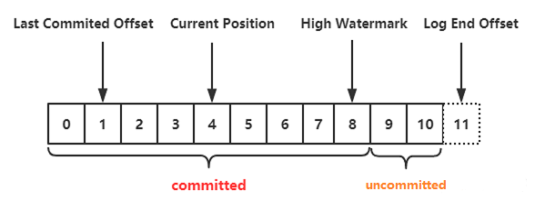
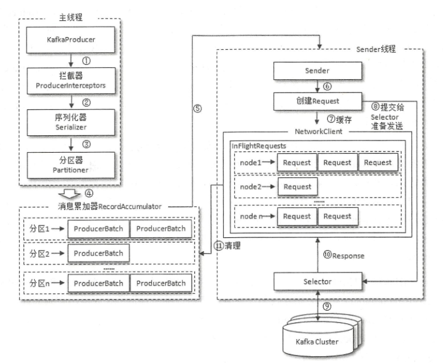
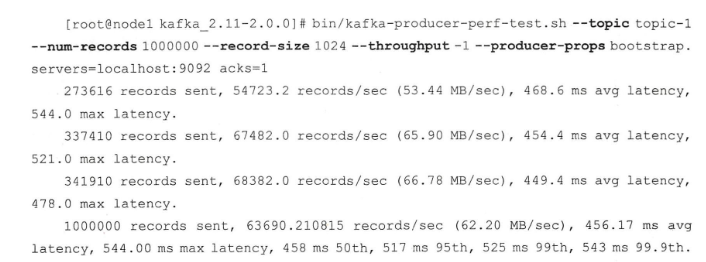
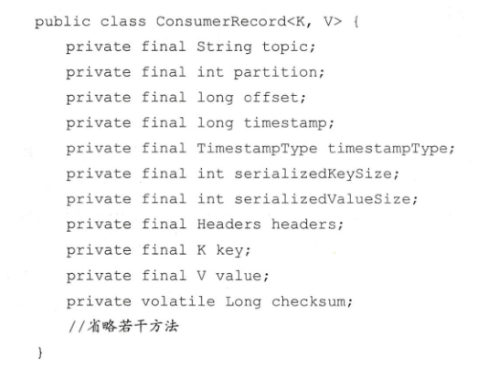
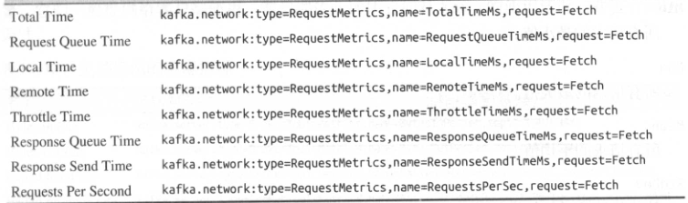
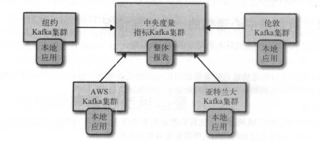
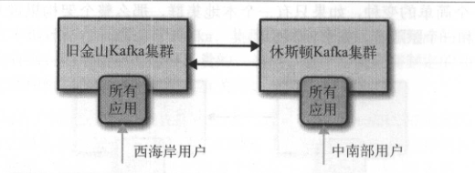
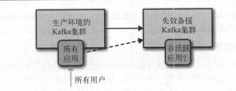

## Kafka使用场景

1. 消息系统：具有系统解耦、冗余存储、流量削峰、异步通信等，还提供消息顺序性保障和回溯功能。
2. 存储系统：拥有持久化功能和多副本机制，只需要把对应的数据保留策略设置为永久，即可作为长期的数据存储来使用。
3. 流式处理平台：提供可靠的消息和流式处理类库。

## KafKa相关名词

消息：Kafka的数据单元

批次：一组消息，为了提高效率，消息被分批次写入Kafka

主题：Kafka消息的类别，好比数据库的表。

分区：主题可以被分为若干个分区，一个分区就是一个提交日志，消息以追加的方式写入分区，先入先出，消息在单个分区内有序，在主题中不能保证有序，Kafka通过分区实现数据冗余和伸缩，也就是说一个主题可以横跨多个服务器，以此来提供比单个服务器更强大的性能。

生产者：负责创建消息，生产者在默认情况下把消息均衡分布到所有分区上，不过也可以直接写到指定的分区上，这通常通过消息键和分区器来实现，分区器为键生成一个散列值，并将其映射到指定的分区上。

消费者：负责消费消息，消费者可以订阅一个或多个主题，按照消息生成的顺序读取他们，消费者通过检查消息的偏移量来区分已经读取过的数据，消费者把每个分区最后读取的消息偏移量保存起来，如果消费者关闭或者重启，它的读取状态不会丢失。

消费者群组：消费者是消费者群组的一部分，也就是说，会有一个或多个消费者共同读取一个主题，群组保证每个分区只能被一个消费者使用，消费者和分区的映射称为消费者对分区的所有权关系。

broker:一个独立的Kafka服务器，broker接收来自生产者的消息，为消息设置偏移量，并提交消息到磁盘保存。broker为消费者提供服务，读取分区的请求作出相应，返回已经提交到磁盘的消息。

集群：broker是集群的组成部分，每个集群都有一个broker同时充当了集群控制器的角色，控制器负责管理工作，包括将分区分配给broker。在集群中，一个分区从属于一个broker，该broker被称为分区的首领。一个分区可以分配给多个broker，这个时候会发生分区复制，为分区提供冗余，当一个broker失效，其他broker接管领导权，不过相关生产者和消费者需要重新连接到新的首领。

保留消息：broker保留消息的策略有两种，一种是保留一段时间，一种是保留消息达到一定大小的字节数，当达到这些上限时，旧消息就会被删除。可以配置主题为紧凑型日志，只有最后一个带有特定键的消息会被留下来。



高水位：一个特定的偏移量(ISR中的最小LEO)，消费者只能拉取到这个偏移量之前的消息，即已经复制到所有ISR的消息。

## Kafka的优点

1. 支持多个生产者，比如多个前端系统收集数据，并以同一个格式对外提供数据。
2. 支持多个消费者，多个消费者互不影响从各自的消息流读取数据，也可以组成群组共享一个消息流，并保证群组内每个消息消费一次。
3. 基于磁盘的数据存储，持久化数据保证因为处理速度慢或突发流量高峰导致无法及时读取消息时，不会丢失数据，允许消费者非实时读取消息，消费者离线或者关闭，消息会继续保留在kafka，消费者上线后可以从上次中断的地方继续处理消息。
4. 伸缩性，从单个broker扩展到集群非常容易，对线上集群进行扩展也不影响系统可用性。
5. 高性能，可以横向扩展的生产者、消费者、broker，使kafka轻松处理巨大的消息流。

## Kafka常用命令

```bash
# 创建主题
# 可以在日志目录查看，文件名为 <topic>-<partition-num>,也可以通过 zookeeper 查看
# --replica-assignment, 可以指定分区 格式 partition1-broker-num,partition2-broker-num,partition3-broker-num  例如 2:0,0:1,1:2,2:1 表示有4个分区，分别分布在这些broker
# --config 可以覆盖配置
kafka-topics.sh --create --zookeeper <ip:port> --replication-factor <num> --partitions <num> --topic <topic-name>

# 增加分区，分区无法减少，如果一定要减少分区数量，只能删除整个主题，然后重新创建
# 基于键映射的主题添加分区很困难，一旦调整，键到分区之间的映射也会发生变化
kafka-topics.sh --alter --zookeeper <ip:port> --topic <topic-name> --partitions <num>

# 删除分区
kafka-topic.sh --delete --zookeeper <ip:port> --topic <topic-name>

# 列出集群内的所有主题
kafka-topic.sh --list --zookeeper <ip:port>

# 列出集群详细信息
# --under-replicated-partitions 可以列出所有包含不同步副本的分区
# --unavailable-partitions 可以列出所有没有首领的分区
kafka-topic.sh --describe --zookeeper <ip:port>

# 列出消费者群组
kafka-consumer-groups.sh --new-consumer --bootstrap-server <ip:port> --list

# 查看特定的消费者群组
# 分别展示 GROUP TOPIC PARTITION CURRENT-OFFSET(消费者已经拉取的偏移量) LOG-END-OFFSET(生产者已经写入的偏移量) LAG(LOG-END-OFFSET和CURRENT-OFFSET的差距) OWNER(消费者ID)
kafka-consumer-groups.sh --new-consumer --bootstrap-server <ip:port> --group <group-name> --describe

# 删除消费者群组
kafka-consumer-groups.sh --delete --group <group-name>

# 覆盖主题的默认配置
kafka-configs.sh --zookeeper <ip:port> --alter --entity-type topics --entity-name <topic-name> --add-config <key1>=<value1> <key2>=<value2>

# 覆盖客户端的默认配置
kafka-configs.sh --zookeeper <ip:port> --alter --entity-type clients --entity-name <client-id> --add-config <key1>=<value1> <key2>=<value2>

#移除被覆盖的配置
kafka-configs.sh --zookeeper <ip:port> --alter --entity-type topics --entity-name <topic-name> --delete-config <key>

#进行首领选举，优先让首选副本(preferred replica)成为leader
kafka-preferred-replica-election.sh --zookeeper <ip:port>
#指定某些分区进行首领选举,如 { "partitions" : [{"partition":1,"topic":"foo"}]}
kafka-preferred-replica-election.sh --zookeeper <ip:port> --path-to-json-file <partitions.json>

#修改分区副本
# 第一步生成迁移步骤
kafka-reassign-partitions.sh --zookeepr <ip:port> --generate --topic-tomove-json-file <topic.json-指定那些topic需要迁移> --broker-list <id-list-用逗号隔开>
# 第二步执行迁移步骤
kafka-reassign-partitions.sh --zookeepr <ip:port> --execute --reassignment-json-file <第一步生成的json文件>
# 验证分区结果
kafka-reassign-partitions.sh --zookeepr <ip:port> --verify --reassignment-json-file <第一步生成的json文件>

# 消费消息
# --whitelist 正则表达式指定topic
# --consumer.confg 指定配置文件
# --from-beginning 从最旧的偏移量读取消息
kafka-console-consumer.sh --bootstrap-server <ip1:port1>,<ip2:port2> --topic <topic-name>

#关闭kafka
kafka-server-stop.sh

# 移动集群控制器
手动删除zookeeper中的/controller节点将会进行新的控制器选举

# 手动删除主题
关闭集群所有broker
删除zookeeper路径/btokers/topics/topicname，注意要先删除子节点
删除每个broker的分区目录，这些目录可能叫 TOPICNAME-NUM , NUM指的是分区的ID
重启所有broker
```

## Kafka的配置

### Broker

```yaml
# broker 的标识符，默认为0，可以是其他任意整数，在集群中必须唯一。
broker.id

# 端口
port

# zookeeper地址，如 localhost:2181
zookeeper.connect

# 存放消息的日志片段的目录，它是一组用逗号分割的本地文件系统，如果指定了多个路径，那么broker会根据 “最少使用” 原则，把同一分区的日志片段保存
# 在同一路径下，broker会往拥有最少数目分区的路径新增分区，而不是拥有最少磁盘空间的路径新增分区。
log.dirs

# 配置线程池数量来处理一下三种情况：
# 服务正常启动，用于打开每个分区的日志片段。
# 服务崩溃后重启，用于检查和截短每个分区的日志片段
# 服务器正常关闭，用于关闭日志片段
# 默认情况下，每个日志目录使用一个线程，该配置对应的是log.dirs指定的单个日志目录，也就是说如果该配置为 8 ，并且 log.dir 指定了3个路径，那么总共会使用24个线程。
num.recovery.threads.per.data.dir

# kafka 在以下情形会自动创建主题：
# 当一个生产者开始往主题写入消息。
# 当一个消费者开始往主题读取消息。
# 当任意一个客户端向主题获取元数据。
auto.create.topics.enable
```

### Topic

```yaml
# 指定新创建的主题将包含多少个分区，如果启动了主题自动创建的功能，主题的分区个数就是该值，默认为1。
# 可以手动增加已有主题的分区个数，但不能减少，所以如果要想少于该值，应手动创建主题。
# 集群通过分区对主题进行扩展，分区数量的选择因素：
# 1.主题的吞吐量。2.单个分区的最大吞吐量，比如分区消费者入库速度不超过50M/s，生产者写入数据的吞吐量。
# 3.每个broker包含的分区个数、可用的磁盘空间、网络带宽。4.如果消息键和分区有对应关系，那么新增分区会很困难。
# 5.单个broker对分区个数限制，分区越多，内存占用越多，首领选举时间越长。
num.partitions

# 决定数据保存多久，最后修改时间往后延迟多久删除。默认使用 log.retention.hours，为168个小时，另外还有 log.retention.minutes 、log.retention.ms,kafka 谁先满足使用谁。
# 最后修改时间是日志片段的关闭时间，也就是文件里的最后一个消息的时间戳，若日志片段一直未关闭，将一直不会被删除。
log.retention.ms

# 通过消息字节数来判断消息是否过期，作用于每个分区上，每个分区独立计算。它和上面的参数谁先满足谁触发。
log.retention.bytes

# 当日志片段大小达到 log.segment.bytes 指定的上限（默认1GB）时，当前日志片段就会关闭，一个新的日志片段被打开。如果一个日志片段被关闭，就开始根据 log.retention.ms 等待过期，这个参数越小，就会越频繁地关闭和分配新文件，从而降低磁盘写入的整体效率。
# 使用基于时间的日志片段，要考虑关闭多个日志片段对磁盘性能的影响，对于数据量小的分区，日志片段的关闭总是同时发送。
log.segment.bytes

# 限制单个消息大小，默认 1_000_000(也就是1MB)，和其他字节相关的配置一样，是指压缩后的大小，消息实际大小大于该值。值越大，负责网络连接和请求的线程耗时越多，还会增加写入块的大小，从而影响IO吞吐量。
# 消费者的 fetch.message.max.bytes 和 broker 的 replica.fetch.max.bytes需要与该参数相适应，否则消费者和broker无法处理比较大的消息。
message.max.bytes
```

### 硬件的选择

影响kafka性能有以下因素：

1. 磁盘吞吐量，磁盘性能影响生产者。
2. 磁盘容量。
3. 内存容量，影响消费者。
4. 网络吞吐量决定了kafka能够处理的最大数据流。
5. 对CPU要求较低，服务器批量解压消息，设置偏移量，然后重新批量压缩再保存到磁盘上需要对CPU有所要求。

需要多少个broker：

1. 考虑需要多少磁盘空间保存数据，是否启用复制。
2. 集群处理能力，生产者和消费者能处理多少消息，因硬盘吞吐量低和系统内存不足造成的性能问题，也可以扩展多个broker。

调优：

1. 虚拟内存：`vm.swapiness`设置为除非发生内存溢出否则不进行内存交换。`vm.dirty_background_ratio`设为小于10,减少脏页的数量，提高刷新脏页的频率，不应该设为0，否则会频繁刷新页面。
2. 磁盘文件系统：文件元数据包含3个时间戳:创建时间(ctime)、最后修改时间(mtime)、最后访问时间(atime)，文件每次读取都会更新atime，这会导致磁盘的大量写入。Kafka用不到该属性，可以将它禁用。
3. 网络：调整socket读写缓冲区大小，为网络连接提供更大的缓冲空间。增大`tcp_backlog`接受更多的并发连接。增大`net_backlog`提供更大的网络流量爆发，接受更多的数据包。
4. 垃圾回收器：kafka对堆内存的使用率非常高，容易产生垃圾对象，可以使用G1垃圾回收器，并减少停顿时间和提前启动垃圾回收时机。kafka默认使用Parallel New 和 CMS。

## 生产者

1. 生产者从创建一个 ProducerRecord 对象开始，ProducerRecord 对象需要包含目标主题和要发送的内容。
2. 另外还可以指定键或者分区，在发送 ProducerRecord 对象时，生产者需要把键和值对象序列化成字节数组。
3. 然后数据被传到分区器，如果在 ProducerRecord 中指定了分区，那么分区器就不会做任何事情，直接把指定的分区返回，如果没有指定分区，那么分区器会根据 ProducerRecord 的键来选择一个分区，选好分区后，生产者就知道该往哪个主题和分区发送这条记录。
4. 然后这条记录被添加到一个记录批次里，这个批次里的所有消息会被发送到相同的主题和分区上，有一个独立的线程负责把这些记录批次发送到相应的 broker。
5. 服务器收到这些消息会返回一个响应，如果消息成功写入，就返回一个 RecordMetadata，它包含了主题、分区信息、记录在分区里的偏移量，如果写入失败，则会返回一个错误。
6. 生产者在收到错误之后会尝试重新发送消息，几次之后如果还失败，就会返回错误信息。

错误分为两类：

1. 可重试错误：连接错误、no leader错误等。
2. 不可重试错误：消息太大等。

### 架构



生产者由两个线程协调运行，分别是主线程和Sender线程(发送线程)，主线程由 KafkaProducer 创建消息，然后可能通过拦截器、序列化器、分区器，再缓存到消息累加器(RecordAccumulator)，发送线程负责从RecordAccumulator中获取消息并将其发送到kafka中。

`RecordAccumulator` 缓存的大小可以通过生产者客户端参数`buffer.memory`配置，默认**33554432B**，即**32MB**，当生产者发送消息的速度超过发送到服务器的速度，会导致生产者空间不足，这时要么阻塞，要么抛出异常，取决于`max.block.ms`,默认 **60000**，即**60秒**。

主线程发送的消息会被追加到 `RecordAccumulator` 的某个双端队列(Deque)中,在其内部为每个分区都维护了一个双端队列，即 `Deque<ProducerBatch>`,消息写入缓存时，追加到尾部，Sender读取时从头部读取。一个 `ProducerBatch` 包含多个 `ProducerRecord`。

消息在网络以字节传输，在发送之前需要创建一块内存区域来保存对应的消息，kafka 中使用 `java.io.ByteBuffer`来进行消息内存的创建和释放，另外 `RecordAccumulator` 中还有一个BufferPool ，用来实现 `ByteBuffer` 的复用，`BufferPool` 只针对特定大小 `ByteBuffer` 进行管理，该值有 `batch.size` 来指定，默认**16384B**，即**16KB**。

当一条消息流入 `RecordAccumulator` 时，会先寻找与消息分区对应的双端队列，再从队列尾部获取一个`ProducerBatch`，查看 `ProducerBatch` 是否还可以写入`ProducerRecord`，如果不可以则需新建一个`ProducerBatch`，新建时会对消息大小进行评估，如果消息大小小于 `batch.size` 则以该值创建 `ProducerBatch` ，若大于则以评估值创建，但该段内存不会被复用。

Sender 获取消息后会将 `<分区,Deque<ProducerBatch>>`转换为 `<Node,List<ProducerBatch>>`,再进行封装为 `<Node,Request>`,对于生产者主线程关注的是向哪个分区发送消息，Sender线程关注的是向哪个 broker 发送消息，Request 对应的是相应的协议数据。

Sender 在发送之前还会保存到 `InFlightRequest` 中，其中保存的是已经发出去但还没收到响应的请求，其数据结构为 `Map<NodeId,Deque<Request>`，该值可以通过 `max.in.flight.requests.per.connection` 来控制，默认为5，即每个连接最多只能缓存5个未响应的请求。

通过 `InFlightRequest` 可以判断 Node 的负载情况，找到最小的`leastLoadedNode`,当需要更新元数据时会挑选出 `leastLoadedNode` 来获取元数据。

发送消息时，如果客户端没有能够使用的元数据或超过 `metadata.max.age.ms`（默认**300000** 即**5分钟**）时间没有更新元数据则会引起元数据的更新。

### BufferPool

```java

public class BufferPool {

    // 最大缓存空间，对应 buffer.memory 的配置
    private final long totalMemory;
    // 一个 bytebuffer 的大小，对应 batch.size 的配置
    private final int poolableSize;

    // 空闲的ByteBuffer
    private final Deque<ByteBuffer> free;
    // 未池化的大小，totalMemory = nonPooledAvailableMemory + free * poolableSize
    private long nonPooledAvailableMemory;

   /**
    * | ------------ | --------------------------------- |
    * |              |                                   |
    * |              |                                   |
    * |              |     nonPooledAvailableMemory      |
    * |              |                                   |
    * |              |                                   |
    * |              | --------------------------------- | ------ |  
    * |  totalMemory |     ByteBuffer(poolableSize)      |        | 
    * |              | --------------------------------- |        | 
    * |              |     ByteBuffer(poolableSize)      |        | 
    * |              | --------------------------------- |  free  | 
    * |              |     ByteBuffer(poolableSize)      |        | 
    * |              | --------------------------------- |        | 
    * |              |     ByteBuffer(poolableSize)      |        | 
    * |              | --------------------------------- | ------ |
    * |              |                                   |
    * |              |           used                    |
    * |              |                                   |
    * | ------------ | --------------------------------- | 
    */
}
```

* 申请内存时，`申请的大小 <= poolableSize` 都按照 `poolableSize` 处理，直接分配一个 `poolableSize` 大小的 `ByteBuffer`
* `申请的大小 > poolableSize`,判断 `free * poolableSize + nonPooledAvailableMemory < 申请的大小`，加入等待队列等待，
* 如果 `申请的大小 > poolableSize` 并且 `free * poolableSize + nonPooledAvailableMemory > 申请的大小` ，释放部分 `free` 空间，加入到 `nonPooledAvailableMemory`,直到 `申请的大小 < nonPooledAvailableMemory`,然后直接从 `nonPooledAvailableMemory` 创建一次性的 `ByteBuffer`。
* 整个过程使用`ReentrantLock`加锁，应尽量减少从`nonPooledAvailableMemory`空间分配，减小竞争，减少直接从 堆空间分配内存。

所以**`batch.size` 设置尤为重要，至少达到 80% 从 `free` 直接获取 `bytebuffer`**。

### 生产者配置

```yaml
# broker的地址清单，格式 ip:port,ip:port,ip:port ，清单里不需要包含所有的broker地址，
# 生产者会从给定的broker里查找到其他broker的信息，不过建议至少要提供两个 broker，一旦其中一个宕机仍能连接到集群。
bootstrap.servers

# 默认提供了 ByteArraySerializer、StringSerializer、IntegerSerializer,该值必须设置。
key.serializer

# 提供 value 的序列化
value.serializer

# 指定必须要多少个分区收到消息，生产者才会认为消息写入是成功的。
# acks = 0，生产者不需要等待服务器的响应。
# acks = 1, 只要分区的 leader 节点收到消息，服务器就会返回生产者一个成功响应。如果消息无法到达 leader 节点，
# 生产者会收到一个错误响应，为了避免数据丢失，生产者会重发消息。
# 如果 leader 节点崩溃，一个没有收到消息的节点称为 新leader节点，消息还是会丢失。
# 这时候吞吐量取决于使用同步还是异步发送，另外还受到发送中消息数量的限制，
# 例如生产者在收到服务器响应前可以发送多少个消息。
# acks = -1 或 all,只有当参与复制的节点全部收到消息，生产者才会收到服务器的响应，
# 这种模式最安全，但是它的延迟也比 acks=1 时高。
acks

# 设置生产者内存缓冲区的大小，发送出去的消息都是先进入到客户端本地的内存缓冲里，
# 然后把很多消息收集成一个一个的Batch，再发送到Broker上去的，该值如果太小，消息快速的写入内存缓冲里，
# Sender线程来不及发送到broker，缓冲很快被写满，然后再调用send()要么被阻塞，要么抛出异常，
# 这取决于 max.block.ms 参数，表示抛出异常前可以阻塞一段时间。
buffer.memory

# 生产者阻塞的时间。
max.block.ms

# 生产者发送请求的大小，既可以是单个消息的最大值，也是一个批次的最大值，
# 另外broker对接受消息最大值也有限制( message.max.bytes)。
max.request.size

# 一个批次可以使用的内存大小，按照字节数计算，但并不一定会等批次被填满才发送，还取决于 linger.ms 。
# 如果要发送大文件需要同时提高 buffer.memory、batch.size、max.request.size、以及broker的 message.max.bytes 配置的大小。
batch.size

# TCP socket 接受和发送数据包的缓冲区大小，如果设为 -1，则使用操作系统的默认值。
receive.buffer.bytes 和 send.buffer.bytes

# 生产者在发送批次之前等待的时间，默认情况下，只要有可用线程，生产者就会把消息发送，
# 如果把该值设置大于0，可以让生产者发送批次前等一会儿。
linger.ms

# 收到可重试错误时可重试的次数，重试的时间间隔可以通过 retry.backoff.ms 设置。
retries

# 生产者在收到服务器响应前可以发送多少个消息，设置为1可以保证消息按照发送的顺序写入服务器。
max.in.flight.requests.per.connection

# broker等待同步副本返回消息确认的时间，与 asks 相匹配，如果在指定时间内没有收到同步副本的确认，broker会返回错误。
timeout.ms

# 生产者在发送数据时等待服务器返回响应的时间，应当比broker端 replica.lag.time.max.ms（判定副本非同步状态时间） 大。
request.timeout.ms

# 生产者获取元数据等待服务器响应的时间。
metadata.fetch.timeout.ms

# 默认不会压缩，可以设置 snappy(占用CPU较少)、gzip(压缩率高)。
compression.type
```

### 消息发送

发送并忘记(fire-and-forget)：消息发送给服务器后不关心它是否正常到达，大多数时候，消息会正常到达，因为 Kafka 是高可用的，而且生产者会自动尝试重发，不过这种方式有时候会丢失一些消息。

```java
public void test() {
    try {
        producer.send(record);
    } catch (Exception e) {
        log.error("", e);
    }
}
```

同步发送：使用 send() 方法发送消息，它会返回一个 Future 对象，调用 get() 方法进行等待。

```java
public void test() {
    try {
        // get() 会得到一个 RecordMetadata
        producer.send(record).get();
    } catch (Exception e) {
        log.error("", e);
    }
}
```

异步发送：使用 send() 方法发送消息，并指定一个回调函数，服务器在返回响应时调用该函数。

```java
public class ProducerCallback implements Callback {
    public void onCompletion(RecordMetadata recordMetadata, Exception e) {
    }
}

public void test() {
    try {
        producer.send(record, new ProducerCallback());
    } catch (Exception e) {
        log.error("", e);
    }
}
```

生产者使用完成后需要调用 close 关闭。

### 分区

ProducerRecord 包含主题、键、值。键有两个用途：作为消息的附加信息、决定消息被写到主题的哪个分区。

如果键为null，并且使用默认的分区器，分区器会使用轮询 (Round Robin) 将消息均衡分布到各个分区。

如果键不为空，并且使用默认的分区器，那么会对键进行 hash，然后根据散列值把消息映射到特定的分区，同一个键总是被映射到同一个分区，映射时会使用主题下的所有分区，而不是可用分区，如果写入数据分区不可用，仍然会往该分区写入，但是会发生错误。只有在分区数量保持不变的情况下键和分区的映射才能保持不变。

除了默认分区器外，可用实现 Partitioner 接口自定义分区。

#### 分区数量的选择

kafka 提供 `kafka-producer-perf-test.sh` 和 `kafka-consumer-perf-test.sh` 测试生产者和消费者性能。

`kafka-producer-perf-test.sh --topic <topic-name> --num-records <1000000> --record-size <1024> --producer-props bootstrap.server=<ip:port> acks=1`

`kafka-consumer-perf-test.sh --topic <topic-name> --messages <1000000> --broker-list <ip:port>`

`--num-records`:生产的消息总条数。

`--record-size`:消息大小，单位B。

`--messages`:消费的消息总条数



可以通过改变分区数量，对比对吞吐量的影响。

当分区变多后，若某个节点宕机，将会有大量的分区需要同时进行leader选举，同时会增加日志清理的耗时，被删除时也会消耗更多的时机。

### 拦截器

通过实现 ProducerInterceptor 来使用，包含三个方法:`onSend`,`onAcknowledgement`,`close`。三个方法中抛出异常都会直接捕获并记录日志。

可以用来在消息发送之前做一些准备工作，比如添加消息前缀，进行消息数量统计等，但一般不修改topic、key、partition等，否则会如修改key影响分区的计算等。 `onAcknowledgement()` 优先于用户设定的 Callback 之前执行，由于方法在生产者的 I/O 线程中执行，逻辑应越简单越好。

## 消费者

一个群组的消费者订阅同一个主题，每个消费者接收一部分分区的消息，如果消费者数量超过分区数量，那么有一部分消费者就会被闲置，不会接收任何消息。不同群组互不影响，都会接收到所有消息。

KafkaProducer 线程安全，但 KafkaConsumer 非线程安全，一个消费者应当使用一个线程。

#### 消息结构



其中 `timestampType` 有两种类型：`CreateTime`(消息的创建时间戳)、`LogAppendTime`(消息追加到日志的时间戳)。poll方法的返回值为ConsumerRecords,该类提供 `partitions`（获取返回值的所有分区）、`records(TopicPartition)`（获取某个分区消息）、`records(String topic)`（根据主题进行取数据）。

#### 分配分区

当消费者加入群组时，它会向群组协调器(存在于服务端)发送一个JoinGroup请求，第一个加入群组的消费者将会成为消费者协调器的leader，他负责给每个消费者分配分区，他使用一个实现`PartitionAssignor`接口的类来决定哪些分区该被分配给那个消费者，分配完成后，消费者leader负责把分配情况发送给群组协调器，群组协调器再把这些信息发送给所有消费者，每个消费者只能看到自己的分配信息，只有leader知道群组里所有消费者的分配信息。

通过 `partition.assignment.stragetegy` 来设置消费者与订阅主题之间的分区分配策略，默认情况下采用 RangeAssignor 策略。

`RangeAssignor` 会将消费组内所有订阅这个主题的消费者按照名词的字典序排序，然后为每个消费者划分固定的分区范围，如果不够平均分配，那么字典序靠前的消费者会被多分配一个分区。

`RoundRobinAssignor` 会将 消费组内所有的消费者以及消费者订阅的所有主题的分区按照字典序排序，然后通过轮询方式逐个将分区依次分配给每个消费者。例如消费组C0-C2订阅3个主题的 t0p0、t1p0、t1p1、t2p0、t2p1、t2p2，C0订阅t0，C1订阅t0、t1，C2订阅t0、t1、t2，最后的分配结果为：C0：t0p0  |  C1：t1p0  |  C2：t1p1、t2p0、t2p1、t2p2

`StickyAssignor` 有两个原则：分区的分配要尽可能均匀；分区的分配尽可能与上次分配保持相同，当两者发生冲突时，以前面的原则为准。该策略会减少不必要的分区移动，即剥离之前的消费者，转而分配给另一个消费者。

##### 消费者协调器和组协调器

多个消费者之间的分区分配时通过协调器来协同的。

每个消费者组在服务端都有一个 组协调器(GroupCoordinator)来对消费者分区进行管理，在每个消费者客户端中都一个 消费者协调器(ConsumerCoordinator) 来与 组协调器 进行交互，每个broker节点启动时，都会创建一个组协调器实例。

消费者协调器和组协调器 主要的职责就是负责消费者的再均衡操作，分区分配的工作也是在再均衡的过程中完成，触发再均衡的时机：

1. 有新的消费者加入消费组。
2. 有消费者宕机下线，并不一定需要真正下线，例如网络延迟导致 组协调器 为收到心跳等情况。
3. 有消费者主动退出消费组。
4. 消费组对应的 组协调器 节点发生变更。
5. 消费组内订阅的主题的分区数量变化。

### 分区再均衡

分区的所有权从一个消费者转移到另一个消费者称为再均衡，例如一个新的消费者加入，它读取原本由其他消费者读取的消息;或者一个消费者被关闭或发送崩溃，它就离开群组，原本由他读取的分区将由群组里其他消费者读取;或者主题添加了新的分区等都会发生分区重分配。

再均衡期间，消费者无法读取消息，会造成整个群组一小段时间不可用。

当分区被重新分配给另一个消费者时，消费者当前的读取状态会丢失，可能还需要去重新获取元数据，在它重新恢复状态之前会拖慢应用程序。

消费者通过向被指派为群组协调器的broker（不同的群组可以有不同的协调器）发送心跳来维持它们和群组的从属关系、以及它们对分区的所有权关系。只有消费者以正常的时间间隔发送心跳，才会被认为是活跃的，如果消费者停止发送心跳的时间足够长，会话就会过期，或者消费者通知协调器它将要离开群组，群组协调器会认为它已经死亡，并触发再均衡。消费者会在轮询消息或者提交偏移量时发送心跳。

再均衡的阶段：

1. `FIND_COORDINATOR`：消费者需要确定它所对应的组协调器的broker，如果已经创建连接，则进行第二阶段，否则向 leastLoadedNode 发送 FindCoordinatorRequest请求，请求中包含 groupId，每个groupId在 `__consumer_offsets` 中都可以找到一个分区记录它的偏移量信息，计算规则为`Utils.abs(groupId.hashCode) % groupMetadataTopicPartitionCount`,`groupMetadataTopicPartitionCount` 等于 `__consumer_offsets` 分区的个数，可由 `offsets.topic.num.partitions` 配置，默认50，找到该分区后，该分区leader副本 所在broker即为 组协调器的位置，这个broker节点 扮演 组协调器、保存分区分配方案、保存组内消费者偏移量 的角色。
2. `JOIN_GROUP`：消费者向组协调器发起 JoinGroupRequest 请求，请求中包含自己支持的分区分配策略，即 `partition.assignment.strategy` ，然后等待组协调器响应，组协调器首先会选出消费者leader，第一个加入消费组的消费者即为消费者leader，并且为消费者选举分配策略，然后返回响应给客户端。
   选举分区分配策略：
   * 收集各个消费者支持的所有分配策略，组成候选集。
   * 每个消费者从候选集中找出第一个自身支持的策略，为策略投票。
   * 计算候选集中各个策略的选票数，选票最多的即为消费组的分配策略，如果有消费者不支持选出的分配策略，抛出 Member does not support protocol。
3. `SYNC_GROUP`：leader消费者根据第二阶段选举的分配策略实施具体的分配，然后通过 组协调器 将方案转发给各消费者。
4. `HEARTBEAT`：进入这个阶段后，消费组处于正常工作状态。消费者只要以正常的时间间隔发送心跳，就被认为是活跃的。

### 拦截器

通过实现 `ConsumerInterceptor` 接口使用，包含3个方法：`onConsume`，`onCommit`，`close`。

KafkaConsumer会在调用 poll 方法返回前调用 onConsume 方法，可以对消息进行修改或者过滤，如通过判断消息中的时间戳来判断消息是否过期，如果过期就将消息直接过滤。

onCommit会在提交完偏移量后调用，可以使用这个方法来跟踪所提交的位移信息。

### 订阅

```java
public void test() {
    // 该方法接受正则表达式
   comsumer.subscribe(Collections.singletonList("xxxx"));
}
```

没有群组的消费者需要使用 ` consumer.assign(Collection<TopicPartition> partitions)` 给自己分配分区，可以使用 `consumer.partitionsFor("topics")`来获取分区信息，新增分区需要重新获取。

消费者使用完成后需要调用 close 关闭。

### 轮询

一旦消费者订阅了主题，轮询就会处理所有细节，包括群组协调、分区再均衡、发送心跳、获取数据。

消费者会无限循环轮询请求数据，使用poll(long ms)方法，传入阻塞时间（如果该值为0，就会立即返回），就可以获取到记录列表，，每条记录都包含了主题信息、分区信息、分区的偏移量、键值对。poll操作需要持续进行，否则会被群组协调器认为死亡，并触发再均衡。退出程序之前需要使用close() 方法关闭消费者，网络连接和socket也会随之关闭，并立即触发一次再均衡，而不是等待群组协调器发现它死亡再触发。

轮询不只是获取数据，再第一次调用新消费者的poll()时，它会负责查找 GroupCoordinator ，然后加入群组，接受分配的分区。如果发送了再均衡，也是再轮询期间完成。心跳也是轮询发送的。

所以需要确保轮询期间所做的任何处理工作都应该尽快完成。

跳出轮询，需要调用 `consumer.wakeup()`，并抛出 WakeupExcetion 。

### 消费者配置

```yaml
# 默认1B，消费者从服务器获取记录的最小字节数，broker 收到消费者的数据请求时，
# 如果可用的数据量小于 fetch.min.bytes 指定大小，会等到有足够的可用数据时才会返回，这样可以减低CPU负载。
fetch.min.bytes

# 默认50MB，该值并不是绝对的最大值，如果在第一个非空分区中拉取的第一个消息大于该值，那么该消息将仍然返回。
fetch.max.bytes

# 指定broker等待足够可用数据的最大等待时间，默认500ms，什么时候返回取决于该值和fetch.min.bytes谁先满足。
fetch.max.wait.ms

# 指定了服务器从每个分区返回给消费者最大的字节数，默认1MB，poll()方法每个分区返回的数据量不超该值。
# 如 一个主题有20个分区和5个消费者，那么一个消费者分到4个分区，poll()方法最多可能返回4MB数据。
# 在为消费者分配内存时，可以多分配一些，如果群组里有消费者发送崩溃，剩下的消费者需要处理更多的分区，可能会处理更多的数据。
# 该值需要大于broker能够接受的最大消息字节数(max.message.size)，防止生产者发送大于消费者能消费的最大消息。
# 如果该值太大，获取数据过多，消费者需要更多时间来处理，可能无法进行下一次轮询来避免会话过期。
max.partition.fetch.bytes

# 消费者在被认为死亡之前可以与服务器断开连接的时间，默认10秒，如果消费者没有在该时间内发送心跳给群组协调器，则被认为死亡。
# heartbeat.interval.ms 指定 poll() 方法向协调器发送心跳的频率，需要比该值小，一般是该值得三分之一，默认3s。
session.timeout.ms

# 消费者在读取一个没有偏移量的分区或者偏移量无效的分区时该如何处理。
# 消费者长时间失效，offset超过7天，该值由 offsets.retention.minutes 决定。
# 默认是latest，即消费者从它启动之后的最新记录开始读取数据。
# 另一个值是 earliest，从起始位置读取分区记录。
# 设置为none,不会进行重置，抛出OffsetOutOfRangeException异常，可以避免重置问题，但增加分区时需要人工区设置offset并消费。
auto.offset.reset

# 默认值为 true，消费者自动提交偏移量，可以通过 auto.commit.interval.ms来控制提交的频率，默认5秒。为了避免重复数据和数据丢失，可以设为false，自己控制何时提交偏移量。
enable.auto.commit

# 决定分区应该被分配给哪个消费者，存在两个默认策略：
# Range：默认值，策略会把主题的若干连续分区分配给消费者，org.apache.kafka.clients.consumer.RangeAssignor。
# RoundRobin：把主题的所有分区逐个分配给消费者，org.apache.kafka.clients.consumer.RoundRobinAssignor。
partition.assignment.strategy

# 单次poll最大数据条数。
max.poll.records

# TCP socket 接受和发送数据包的缓冲区大小，如果设为 -1，则使用操作系统的默认值。
receive.buffer.bytes 和 send.buffer.bytes
```

### 偏移量

消费者往`_consumer_offset`的特殊主题发送消息，消息里包含每个分区的偏移量，叫做提交偏移量。

如果消费者发送崩溃或者有新的消费者加入群组，会触发再均衡，完成均衡之后，消费者可能分配到新的分区，为了能够继续之前的工作，消费者需要读取每个分区最后一次提交的偏移量，然后从偏移量指定的地方继续处理。

如果提交的偏移量小于客户端处理的最后一个消息的偏移量，那么处于两个偏移量之间的消息就会被重复处理。

如果提交的偏移量大于客户端处理的最后一个消息的偏移量，那么处于两个偏移量之间的消息就会丢失。

如：使用自动提交，并且使用默认提交间隔时间5秒，在最后一次提交之后3s后发生了再均衡，再均衡之后，消费者从最后一次提交的偏移量读取消息，这时候偏移量已经落后3s，所以3s内到达的数据会被重复处理。

偏移量手动提交的两个方法：`consumer.commitSync() 和 consumer.commitAsync()`。

`commitSync() `会一直阻塞，重试直到成功。

`commitAsync()` 存在问题：由于不等待服务器响应提交偏移量结果，可能存在这样情况：先提交的偏移量200失败，后提交的偏移量300成功，然后偏移量200重试成功，如果触发再均衡就会出现重复消息。

`commitAsync()` 可以传入参数 `OffsetCommitCallback` 来执行回调，如果使用回调来重试需要注意提交顺序，可以使用一个递增序列号来维护提交的顺序，每次提交偏移量后递增序列号，再重试前检查回调序列号和即将提交的偏移量是否能够进行重试。

可以使用组合提交，循环中使用 `commitAsync()` 保证效率、最后 finally 块使用 `commitSync() ` 保底，另外可以使用 `commitAsync()` 分阶段提交，参入偏移量参数。

值得注意的是：如果x表示某次拉取操作中此分区的最大偏移量，那么提交的偏移量为x+1。

当分区再均衡时，需要在这之前提交偏移量，在 `subscribe()` 传入 `ComsumerRebalanceListener` 的实现，有两个方法：

`onPartitionsRevoked`：在再均衡之前、消费者停止读取消息之后调用，可以在这里提交偏移量。

`onPartitionsAssigned`：会在重新分配分区之后和消费者开始读取消息之前被调用。

如果需要从特定的偏移量读取消息，可以使用 ` seekToBeginning(Collection<TopicPartition> tp)`和 `seekToEnd(Collection<TopicPartition> tp)`方法。

## 集群

### 成员关系

使用 Zookeeper 来维护集群成员，每个broker都有一个唯一标识符，可以在配置文件指定，也可以自动生成。

在broker启动时它通过创建临时节点把自己id注册到Zookeeper，并订阅`/brokers/ids`路径,当有broker加入集群或者退出集群时，组件就可以获得通知。

在broker停机、出现网络分区、长时间停顿时，broker会从zookeeper断开连接，此时临时节点将会自动移除，监听broker列表的kafka组件会被告知该broker已移除。

在关闭broker时，它对应的节点也会消失，不过它的ID会继续存在于其他数据结构中。例如在完全关闭一个broker后，如果使用相同的ID启动另一个全新的broker，它会立即加入集群，并拥有与旧broker相同的分区和主题。

### 控制器

集群里第一个启动的broker在Zookeeper里创建一个临时节点`/controller`让自己成为控制器，其他节点启动时，也会尝试创建该节点，但会收到节点已存在的异常，然后在控制器节点上创建 Zookeeper watch对象，当控制器节点发送变更时，可以收到变更通知。

如果控制器被关闭或者与Zookeeper断开连接，控制器节点就会消失，集群中的其他节点通过 watch 对象得到控制器节点消失的通知，它们会尝试让自己成为新的控制器，最先成功创建控制器节点的broker就会成为新的而控制器，其他节点收到节点已存在的异常，然后在新的控制器节点上创建watch对象，每个新选出的控制器通过递增操作在`/controller_epoch`获得一个全新的、数值更大的 controller epoch，其他broker在知道当前 controller epoch后，如果收到控制器发出的包含较旧 epoch消息时就会忽略，控制器使用 epoch 来避免脑裂。

kafka使用Zookeeper的临时节点来选举控制器，并在其他节点加入集群或退出集群时通知控制器，分区首领退出集群后由控制器进行分区首领选举。

控制器的作用：

1. 管理主题，完成对主题的增减、删除。
2. 监听分区的变化，处理`kafka-reassign-partitions.sh`的分区重分配动作、处理ISR集合的变更、处理`kafka-preferred-replica-election.sh`的首选副本选举、负责分区首领的选举。
3. 监听broker的变化，当控制器发现一个broker加入集群时，它会使用broker ID来检查新加入的broker是否包含现有分区的副本，如果有，控制器就把变更通知发送给新加入的broker和其他broker，新broker上的副本开始从首领那里复制消息。
4. 管理集群的元数据。
5. 当 `auto.leader.rebalance.enable=true`，负责维护分区首选副本的平衡。

### 分区首领选举

1. 选举的策略为 `OfflinePartitionLeaderElectionStrategy` ，按照 AR 集合中副本的顺序查找第一个存活的副本，并且该副本在ISR集合中。如果 ISR 集合中没有可用副本，那么检查 `unclean.leader.election.enable`，若为true，进行不完全的首领选举，从 AR 列表找到一个存活的副本 即为 leader。只要不发送重分配的情况，AR 集合内部副本的顺序保持不变。
2. 当分区进行重分配时也需要执行 leader 的选举动作，对应的策略为 `ReassignPartitionLeaderElectionStrategy`,即从重分配的AR列表中找到第一个存活的副本，且这个副本在目前的ISR中。
3. 当发生首选副本选举时，直接将首选副本设置为leader，策略为 `PreferredReplicaPartitionLeaderElectionStrategy`,AR 中第一个副本即为优先副本。
4. 当某节点 `kafka-server-stop.sh` 使用执行 ControlledShutdown 时，位于这个节点上leader副本都会下线，对此执行的选举策略为 `ControlledShutdownPartitionLeaderElectionStrategy`,即在 AR 中找到第一个存活、在 ISR 中、不处于被关闭节点上的副本。

### 复制

每个主题被分为若干个分区，每个分区有多个副本，那些副本被保存在broker上，每个broker可以保存属于不同主题的分区副本。

副本有两种类型：

首领副本：每个分区都有一个首领副本。为了保证一致性，所有生产者和消费者的请求都会经过这个副本。

跟随者副本：首领以外的副本都是跟随副本。跟随者副本不处理来自客户端的请求，他们唯一任务就是从首领那里复制消息，保持与首领一致的状态，如果首领发生崩溃，其中一个跟随者会被提升为新首领。

首领的另一个任务是搞清楚哪个跟随者的状态与自己是一致的。跟随者为了保持与首领的状态一致，在有新消息到达时会尝试从首领那里复制消息，跟随者向首领发送获取数据的请求，请求中包含了跟随者想要获取消息的偏移量，然后首领将响应消息发送给跟随者。

一个跟随者副本会依次请求消息1、消息2、消息3，在收到3个请求的响应之前，不会发送第4个消息，如果跟随者发送了消息4，那么首领就知道它收到了前面3个消息的响应，通过查看每个跟随者请求的最新偏移量，首领就会知道每个跟随者复制的进度，如果跟随者在10s内没有请求任何消息，或者10s内没有请求最新数据，那么它会被认为不同步，相反称为同步副本，在首领失效时，只有同步副本才有可能选为首领。成为不同步副本之前的时间通过`replica.lag.time.max.ms`来设置。

每个分区都有一个首选首领，即创建主题时选定的首领就是分区的首选首领，因为在创建分区时，选择的分区首领在broker间的负载是均衡的，默认情况下 `auto.leader.rebalance.enable = true`，它会检查首选首领是不是当前首领，如果不是，并且首选首领副本是同步的，就会触发首领选举，让首选首领成为当前首领，该值在生产环境应该关闭，否则会导致首选首领选举时间不可控，在关键时候由于换首领，导致分区不可用，可使用`kafka-preferred-replica-election.sh`手动触发。

所以当手动分配副本时，需要确保负载均衡，第一个指定的副本就是首选副本。

跟随者副本被认为同步的条件：

1. 与Zookeeper之间有个活跃的会话，即在过去的6s内向Zookeepr发送过心跳。
2. 在10s内从首领那里获取过消息。
3. 在10s内从首领那里获取过最新消息。

### 处理请求

broker的大部分工作时处理客户端、分区副本、控制器发送给分区首领的请求，请求使用基于TCP的二进制协议。

broker会安装请求到达的顺序来处理它们，同时保存的消息也是有序的，也就具有了消息队列的特性。

broker会在它监听的端口运行一个Acceptor线程，这个线程会创建一个连接并把它交给Processor线程去处理，Processor的线程数量时可配置的，网络线程负责从客户端获取请求消息把它们放进请求队列，IO线程会负责处理它们，然后从响应队列获取响应消息，把它发送给客户端。

请求类型：

1. 生产请求：生产者发送的请求，包含客户端要写入broker的消息。
2. 获取请求：在消费者和跟随者副本需要从broker读取消息时发送的请求。

这两种请求都必须发送给分区的首领副本，如果broker收到针对一个分区的请求，而该分区的首领在另一个broker上，那么客户端会收到 非首领分区 的错误，客户端需要负责把请求发送到正确的broker。

3. 元数据请求：包含主题的所有分区，每个分区都有哪些副本，以及哪个副本是首领。

元数据请求可以发送给任何broker，所有的broker都缓存了这些信息，客户端获取到这些信息后会缓存起来，然后直接往目标broker上发送生产请求和获取请求，并会以 `metadata.max.age.ms` 来发送元数据请求来刷新缓存，另外如果客户端收到 非首领 的错误，它会尝试重发请求之前刷新元数据。

4. 其他请求：比如当新首领被选取出来，控制器会发送 LeaderAndIsr 请求给新首领(可以开始接收客户端请求)和跟随者(跟随新首领)，比如 发送 OffsetCommitRequest，将偏移量写入kafka。

#### 生产请求

当包含首领副本的broker在收到生产请求时，会对请求做一些验证：

1. 发送数据的用户是否有主题写入权限。
2. 请求包含的acks参数是否正确。
3. 并根据acks的值校验是否有足够多的同步副本已经被安全写入。

然后消息被写入本地磁盘，在Linux系统上，消息会被写入文件系统缓存，何时刷新到磁盘由操作系统在决定。在消息被写入首领分区后，broker开始检查acks配置参数，如果acks为0或1，响应立即返回，如果设置为-1或all时，那么请求会保存在 Purgatory 缓冲区，直到首领发现所有跟随副本都复制了消息，响应才会被返回。

#### 获取请求

客户端发送获取请求，请求中包含主题、分区、偏移量、一个分区最多可以返回多少消息等，请求到达分区首领前，需要查询元数据确保请求的路由是正确的，首领收到请求会检验是否有效，如果指定的偏移量分区是否存在等，如果请求的偏移量存在，broker将按照客户端指定的数量上限从分区读取消息，再把消息返回给客户端。

kafka 使用零拷贝技术向客户端发送消息：直接从Linux文件缓存发送到TCP通道，不需要经过任何中间缓冲区。

并不是保存在首领分区上的所有数据都能被读取，客户端只能读取已经被写入所有同步副本的消息，如果一个副本不在同步，那么就不会关心它是否已经收到消息。因为还没有被足够多副本复制的消息被认为"不安全"，如果首领发生崩溃，另一个没有完全同步的副本成为新首领消息就丢失了，会导致数据不一致性。

所以如果broker间消息复制变慢，那么消息消费的时间也会边长，副本在复制消息时允许的最大延迟可以通过 `replica.lag.time.max.ms` 来设置。

### 物理存储

分区是基本存储单位，无法细分给多个broker，也无法再同一个broker的多个磁盘细分。

#### 分区分配

在创建主题时，需要进行合理的分区分配：

1. broker间均匀分布副本。
2. 同一个分区的副本分布在不同的broker上，最好是不同机架的broker，即在broker端配置`broker.rack`。
3. 不同分区的首选首领副本均衡分布在broker上。

为分区和副本选好合适的broker后，需要决定这些分区使用的目录：计算每个目录的分区数量，新的分区总是被添加到分区个数最小的目录。

#### 文件管理

保留数据是kafka的基本特性，kafka不会一直保留数据，也不会等到所有消费者都读取消息之后才会删除。

一个分区会分成若干个日志片段，默认情况下，每个片段包含1GB(`log.segment.bytes`)或者一周数据(`log.roll.hours`)，以较小的哪个为准，在broker往分区写入数据时，如果达到片段上限，就关闭当前文件，并打开一个新文件。

每个日志片段都会包含日志文件、偏移量索引文件、时间戳索引文件。每个日志片段第一条消息的偏移量叫做基准偏移量 BaseOffset，日志文件和索引文件名词都是以 BaseOffset来命名。

##### 日志清理

当前正在写入的片段是活跃片段，活跃片段永远不会清理。

`log.cleanup.policy` 默认值为 delete，也就是删除策略，还可以设置为 compact，也就是 日志不会被删除，会被去重清理，对于同一个key只保留最后的那个key，同样的，compact也只针对不活跃的segment。

###### 删除(retention)

执行删除操作时，先从 Log 对象所维护日志分段中移除待删除的日志分段，以保证没有线程对这些日志分段进行读取操作，然后在对应的日志分段添加上`.deleted`的后缀，最后由`delete-file`的任务延迟删除这些文件，延迟时间通过`file.delete.delay.ms` 来控制，默认为1分钟。

1. 基于时间，以 `log.retention.ms > log.retention.minutes > log.retention.hours` 的优先级执行保留策略。
2. 基于日志大小，当前日志大小超过 `log.retention.bytes` 的部分执行删除。

###### 压缩(compact)

每个日志片段分为两部分：

1. 干净的部分：消息被清理过，每个key只保留了上次清理前最新数据，偏移量不连续，是上次清理保留下来的。
2. 污浊的部分：这些数据是在上次清理之后写入的，偏移量连续。

如果Kafka启用了清理功能`log.cleaner.enabled`，每个broker会启动一个清理管理器线程和多个清理线程，这些线程会选择污浊率(污浊消息占分区总大小的比例)较高的分区进行清理，清理线程会清理除了活动日志片段其他所有日志片段，然后对片段进行分组，每一组大小不超过 `log.segments.bytes`(默认1G)，且索引文件占用大小不超过`log.index.interval.bytes`(默认10M)，首先会遍历污浊部分，使用消息的key作为map的key，消息的偏移量作为map的value，然后从干净的部分最开始的消息开始，如果key在map中不存在则把消息复制到新的日志片段，如果key在map中存在则忽略复制，处理完干净部分后，将map中各个key对应的偏移量的消息也复制到新的日志片段，然后使用新的日志片段替换旧的日志片段。

由于每个key总是保留最新的数据，所以如果要把一个key从系统中删除，需要发送一个包含该key但值为null的墓碑消息，清理线程发现该消息时，会先进行常规的清理，只保留值为null的消息，该消息会保留一段时间，在这个时间内消费者看到这个消息，就知道应该要把该key的数据清理干净，过了保留时间后，清理线程会清除墓碑消息，如果消费者错过了墓碑消息，就会不知道该key已经被删除。`保留墓碑消息的条件 = 所在日志分段的最后修改时间 > (活动片段前一个片段的最后修改时间 - log.cleaner.delete.retention.ms)`,`log.cleaner.delete.retention.ms` 默认**86400000**，即**24小时**。

#### 文件格式

磁盘上的数据格式与从生产者发送过来或者发送给消费者的消息格式一样，因为使用相同的数据格式进行存储和网络传输，可以使用 零拷贝 技术给消费者发送消息，避免了对生产者已经压缩过的消息进行解压和压缩。

所以如果生产者发送压缩过的消息，那么同一批次的消息会一起压缩，被当做包装消息一起发送，那么broker发送给消费者时也是整个批次的消息，也就是说如果生产者启用了压缩功能，发送的批次越大，就意味着网络传输和磁盘存储方面会获得更好的压缩性能，同时意味着如果修改了消费者使用的消息格式，那么网络传输和磁盘存储的格式也要修改，并且broker需要知道如何处理包含了两种消息格式的文件。

消息中包含 键、值、偏移量、消息大小、检验和、消息格式版本号、压缩算法、时间戳。

`kafka-run-class.sh kafka.tools.DumpLogSegmets` 可以查看片段的内容，`--deep-iteration` 可以查看压缩的包装消息，`--files`参数，用于指定想查看的分区片段，`--print-data-log`参数，指定打印详细内容。

#### 索引

每个分区都维护了一个偏移量映射到日志片段、日志片段中偏移量的位置的索引，这样broker可以快速定位到偏移量的位置。

索引文件采用的是稀疏索引，每当写入一定量(`log.index.interval.bytes`，默认4096)，增加一个索引。

索引也被分成片段，在删除消息时，也可以删除相应的索引，kafka并不维护索引，如果索引损坏，kafka会重新读取消息并录制偏移量和位置来重新生产索引，当删除索引后，kafka会自动重新生产索引。

##### 偏移量索引

每个索引项包含8个字节，前4个字节(RelativeOffset)是基于 BaseOffset 的相对偏移量，后4个字节(Position)是基于 文件对应物理地址 的相对物理位置，也就是说索引文件一条数据的物理位置为0。

对于任意一个偏移量，先根据 BaseOffset 定位到所在的日志分段，再计算`相对偏移量RelativeOffset = 偏移量 - BaseOffset`，通过二分法在索引文件找到不大于 RelativeOffset的最大索引项，然后根据此索引项顺序查找到目标偏移量。

##### 时间戳索引

每个索引项包含12个字节，前8个字节(timestamp)是当前日志分段最大的时间戳，后4个字节(RelativeOffset)是时间戳对应的消息的相对偏移量。每个追加的 timestamp 必须大于之前的 timestamp，两个索引文件增加索引项的操作是同时进行的，但relativeOffset并不一定是同一个值。

#### 使用磁盘存储会不会造成性能问题？

1. kafka在设计时采用文件追加的方式来写入消息，即只能在日志文件尾部追加新的信息，并且也不允许修改已写入的消息，这是典型的顺序写盘，即使使用磁盘，吞吐量也不可小觑。
2. 页缓存：页缓存是操作系统的设计，当一个进程准备读取磁盘上的文件内容时，操作系统先查看待读取的数据所在页是否在页缓存中，如果存在则之间返回，如果没有命中，操作系统会向磁盘发起读取请求并将读取的数据页页缓存，并且会预读出一些相邻的块放入页缓存中，当写入数据时，操作系统会检查数据对应页是否存在页缓存中，如果不存在则会先在页缓存中添加相应的页，最后将数据写入对应的页，被修改的页成为脏页，操作系统会根据一定规则来将脏页写回磁盘，可以通过操作系统配置参数来设置如:`vm.dirty_background_ratio` 指定脏页数据占总内存的百分比。

   kafka大量使用页缓存，文件不可避免的直接或间接的使用页缓存（如 `FileChannel.write()` 需要先写入java heap，在从java heap 拷贝到 jvm 堆外内存，再由jvm进行系统调用write，拷贝到内核内存中，然后再写入pagebuffer，再由操作系统决定刷盘时机）java中直接使用页缓存的使用主要是通过mmap将文件映射到进程虚拟地址空间(对应具体的方法为`FileChannel.map()`得到`MappedByteBuffer`，然后对`MappedByteBuffer`进行put操作，以及force操作要求操作系统刷盘，**不过需要注意的是MappedByteBuffer的释放**)，kafka中可以通过 `log.flush.interval.messages` 、 `log.flush.interval.ms` 等参数控制刷盘时机，另外由于Linux当内存不够是会将内存换出到 swap分区，可以将`vm.swappiness = 0`，限制内存换出操作，建议设置为1。
3. 零拷贝：将数据从磁盘文件直接复制到网卡设备，对操作系统而言依赖于底层的`sendfile()`方法，对应java而言，`FileChannel.transferTo()`方法的底层实现就是`sendfile()`。

   正常情况下，数据发送到网卡需要经历4次复制：

   * 应用程序调用read，用户态切换到内核态，DMA将数据复制到内核read内存。
   * 内核将内核内存复制到应用程序内存，内核态切换用户态。
   * 应用程序调用write，用户态切换到内核态，数据复制到内核socket内存。
   * DMA从socket内存复制到网卡设备，内核态切换用户态。

   使用零拷贝技术，只需要经历2次复制：

   * 应用程序调用sendfile，用户态切换到内核态，DMA将数据读取到内核内存。
   * DMA将数据从内核内存复制到网卡设备，内核态切换用户态。

## 可靠性

哪些方面是可靠的？

1. 分区内消息有顺序。
2. 只有当消息被写入所有同步副本时，才被认为已提交。
3. 只要有一个副本时活跃的，那么已经提交的消息就不会丢失。
4. 消费者只能读取已经提交的消息。

可靠性的核心是复制机制和分区的多副本架构。

### 复制的可靠性配置

配置参数可以作用于broker，控制所有主题的行为，也可以作用主题级别，控制个别主题的行为。

#### 复制系数

更高的复制系数带来高可用性、可靠性、更少的故障，但也消耗更多的磁盘空间。默认的复制系数为3，并且kafka会确保分区的每个副本被放在不同的broker上，另外还可以使用 `broker.rack` 参数配置broker的机架，kafka会保证分区的副本分布在多个机架上。

broker级别：`default.replication.factor`

topic级别：`replication.factor`

#### 不完全的首领选举

当首领分区不可用时，一个同步副本会被选为首领，如果在选举过程中没有丢失数据，所有副本都是同步的，就叫完全选举。

在首领不可用时所有副本都不同步情况下，是否选举由参数(`unclean.leader.election.enable` 默认值为false 只能在broker上配置)控制，这两种场景会出现：

1. 分区有3个副本，两个跟随者副本不可用，如果生产者继续写入数据，由于只有首领分区副本唯一一个同步副本，所以所有消息都会得到确认并提交，如果这时候首领不可用，而另外一个跟随者重启，它就成为了分区的唯一不同步副本。
2. 分区有3个副本，两个跟随者副本可用但不同步，首领作为唯一同步副本继续接受消息，如果这时候首领不可用，另外两个副本再也无法变成同步。

如果允许不同步副本成为首领，就要承担数据丢失或者不一致风险，如果不允许，就会降低可用性，需要的等待原先的首领恢复到可用状态。

#### 最少的同步副本

`min.insync.replicas`,可以作用于 topic 或者 broker，表示至少需要 n 个同步副本才能向分区写入数据，如果这时候生产者发送数据会收到 `NotEnoughReplicasException` 异常。但是消费者仍然可以继续读取已有的数据。

### 生产者的可靠性配置

#### 发送确认

1. `acks = 0`: 生产者发送消息后不等待响应，如果这时候发生首领选举，即使是完全选举，但生产者不知道首领暂时不可用，仍会丢失消息。
2. `acks = 1`: 首领收到消息并写入分区数据文件就会响应，但是当首领选举时，生产者会收到 `LeaderNotAvailableException` 异常，如果生产者没有处理这个消息会丢失，但是如果生产者进行重试并成功，但是还未复制到跟随者副本是首领崩溃，消息也会丢失。
3. `acks = all 或 -1`: 首领在返回确认或错误响应之前，会等待所有同步副本都收到消息，可以和 `min.insync.replicas` 结合使用，就可以决定在返回确认之前至少有多少个副本能收到消息。不过会降低吞吐量，可以使用异步模式和更大的批次来加快速度。

#### 重试

生产需要处理的错误包含两部分：生产者可以自动处理的错误，例如`LeaderNotAvailableException`；开发者手动处理的错误，例如`INVALID_CONFIG`。如果重试造成的延迟已经失去发送消息的意义，可以放弃重试。如果想把消息保存然后回过头来再继续处理，可以放弃重试。

kafka 的跨数据中心复制工具(MirrorMaker)会无限制重试 `retries = MAX_INT`。

另外重试会带来风险，如果两个消息都写入成功，会导致重复消息，例如因为网络问题broker已经写入，但是生产者没有收到确认并进行重试，可以在消息里加入唯一标识符来判断实现幂等消费。

对于需要开发者手动处理的错误，如：

1. 不可重试错误，如消息大小错误、认证错误。
2. 消息发送之前发生的错误，如序列化错误。
3. 生产者达到重试次数上限或者消息占用的内存达到上限发送的错误。

可以做出不一样的处理，如丢弃、记录错误、保存消息、回调其他程序等。

### 消费者的可靠性

由于只有那些被写入所有同步副本的数据才能被消费者消费，所以消费者得到的消息时一致的，但是消息可能因为某些原因被重复消费或者丢失，这由偏移量提交的时间点和提交方式决定。

相关参数:

1. `group.id`,如果多个消费者具有相同group.id,并且订阅了一个主题，那么每个消费者会分到主题分区的一个子集，如果需要一个消费者可以看到主题的所有分区，需要设置唯一的group.id。
2. `auto.offset.reset`,没有偏移的时候(如消费者第一次消费，或者请求的偏移量在broker上不存在时)，消费者会做什么。earliest，消费者会从分区的开始位置读取消息。latest,消费者会从分区末尾开始读取数据。
3. `enable.auto.commit`,让消费者在轮询操作中自动提交偏移量，自动提交可能导致重复消费或者丢失，例如消费者者在自动提交偏移量前停止轮询处理消息，那有一个部分已经处理的消息偏移量不会提交，会导致重复消费，或者使用后台线程去处理时，自动提交可能会在消息还没处理完成就提交偏移量导致消息丢失。
4. `auto.commit.interval.ms`，自动提交偏移量的频率，默认5s。

#### 手动提交偏移量需要注意的问题

1. 总是在处理完事件后再提交偏移量：如果所有的处理都是在轮询里完成，并且不需要在多次轮询间维护状态，那么可以轮询结束时手动提交。
2. 提交频度控制性能和重复消息数量的平衡。
3. 轮询中提交偏移量可能存在提交的是读取的最新偏移量而不是处理过的偏移量。
4. 在处理再均衡时，一般要在分区被撤销之前提交偏移量，在分配到新分区时清理之前的状态。
5. 消费者重试，需要考虑 重试时间间隔、最大重试次数、是否会漏掉消息，可以采取以下方案：

  方案一：遇到可重试错误时，提交最后一个处理成功的偏移量，然后把还没处理好的消息保存起来，然后调用消费者pause方法，在保持轮询的同时尝试重新处理，如果重试成功，或者重试次数达到上限时，记录错误记录，然后调用resume方法继续从轮询中获取新消息。

  方案二：遇到可重试错误时，把错误写入一个独立的主题，然后继续。一个独立的消费者群组负责从该主题读取错误消息，并进行重试，或者使用其中的一个消费者同时从该主题上读取错误消息并进行重试。

6. 消费者的状态维护：例如需要在多次轮询中聚合计算，可以将计算结果写入到“结果”主题，当消费者重新启动时可以继续计算，但由于Kafka没有事务支持，可能在写入结果之后来不及提交偏移量就崩溃，导致计算失败。可以使用KafkaStream来进行聚合计算。
7. 轮询间长时间数据处理：当处理数据时间长时可以使用多线程并行处理，然后pause消费者，持续轮询，保持心跳发送，当工作线程处理完成，再resume继续获取消息，这样和broker一直会有心跳，不会发生再均衡。
8. 有且仅有一次传递消息，生产者写入消息时加入唯一id，消费者进行幂等性消费。

### 可靠性验证

#### 配置验证

使用`VerifiableProducer`(生成从1到指定的某个数字，并把是否成功发送到broker的结果打印出来)和`VerifiableConsumer`(读取消息并打印，同时会打印已提交的偏移量和再均衡相关信息),并使用和正常生产者消费者相同的配置，然后进行相关测试：

1. 首领选举：如果停掉首领会发生什么，生产者、消费者重新恢复正常状态需要多久？
2. 控制器选举：重启控制器后系统需要多少时间来恢复状态？
3. 依次重启：可以依次重启broker而不丢失任何数据吗？
4. 不完全首领选举测试：如果依次停止所有副本(确保每个副本都变为不同步的)，然后启动一个不同步的broker会发生什么？要怎样恢复正常？是否可以接受？

#### 应用程序验证

比如：检查自定义的错误处理代码、偏移量提交的方式、再均衡监听器等。

可以做如下测试：

1. 客户端从服务器断开连接。
2. 首领选举。
3. 依次重启broker。
4. 依次重启消费者。可以查看提交偏移量方式和处理再均衡方式是否符合预期。
5. 依次重启生产者

#### 生产环境监控

Kafka启动时添加 `JMX_PORT` 参数，开启 JMX 监控。对于生产者需要监控 `error-rate` 和 `retry-rate`,若这两个指标上升，说明系统出现了问题。对于消费者重要的指标的是 `consumer-lag` ,该指标表明消费者的处理速度与最近提交到分区里的偏移量之间还有多少差距。

非同步分区：`kafka.server:type=ReplicaManager,name=UnderReplicatedPartitions`。如果多个broker的非同步分区数量一直保持不变，说明某个broker已经离线。如果数量时波动的，说明集群出现了性能问题，如果所有的非同步分区都属于一个broker，那么可能是这个broker出现的问题。集群负载不均衡可以通过各broker流入流出流量来判断，加入进行首选首领副本选举后，指标出现很大偏差，说明流量出现了不均衡。另外 CPU的使用、网络输入输出吞吐量、磁盘平均等待时间、磁盘使用百分比 大量消耗也会出现分区不同步。

活跃控制器数量：`kafka.controller:type=KafkaController,name=ActiveControllerCount`。

请求处理器空闲率：`kafka.server:type=KafkaRequestHandlerPool,name=RequestHandlerAvgIdlePercent`。值的范围为0-1。kafka使用两个线程池来处理客户端的请求：网络处理器线程池和请求处理器线程池。数值越低负载越高。可能存在两个方面问题，线程数量不够，一般和处理器核数相当；另一个是线程做了不该做的事，请求处理器线程负责解压消息批次、验证消息、分配偏移量、重新压缩写入磁盘，可以在生产者发送消息批次前设置相对的偏移量，这样可以避免解压和压缩。

主题流入字节：`kafka.server:type=BrokerTopicMetrics,name=BytesInPerSec`。OneMinuteRate-前1分钟的平均值，FiveMinuteRate-前5分钟的平均值，FifteenMinuteRate-前15分钟的平均值，MeanRate-从broker启动到目前为止的平均值，Count-从broker启动以来接收到流量的字节总数。

主题流出字节：`kafka.server:type=BrokerTopicMetrics,name=BytesOutPerSec`。

主题流入消息：`kafka.server:type=BrokerTopicMetrics,name=MessagesInPerSec`。

首领数量：`kafka.server:type=ReplicaManager,name=LeaderCount`。

离线分区：`kafka.controller:type=kafkaController,name=OfflinePartitionsCount`。



`TotalTime`：表示broker花在处理请求上的时间，从收到请求到响应返回给请求者。

`RequestQueueTime`：表示请求停留在队列里的时间，从收到请求到开始处理请求。

`LocalTime`：首领分区花在处理请求上的时间，包括把消息写入磁盘，但不一定会冲刷同步。

`RemoteTime`：请求处理完毕之前，用于等待跟随者的时间。

`ResponseQueueTime`：响应被发送给请求者之前停留在队列里的时间。

`ResponseSendTime`：实际用于发送响应的时间。

## 消息中间件选型

1. 功能维度：是否最大程度实现开箱即用，进而缩短项目周期，降低成本。
   * 优先级队列
   * 延时队列
   * 死信队列
   * 消费模式，推模式和拉模式
   * 广播消息
   * 回溯消息
   * 消息堆积+持久化
   * 消息轨迹
   * 消息审计
   * 消息过滤
   * 多租户
   * 多协议
   * 跨语言
   * 流量控制
   * 消息顺序性
   * 安全机制
   * 消息幂等性
   * 事务性消息
2. 性能维度：吞吐量、时效性、可靠性
3. 运维管理：异常检测、故障转移、告警、容灾、部署
4. 生态

## 构建数据管道

### 需要考虑的问题

1. 及时性：kafka支持实时数据处理，也支持基于一段的时间的批处理，生产者可以频繁地写入也可以按需写入，消费者可以第一时间读取也可以每隔一段时间读取一次，kafka扮演大型缓冲区的角色，同时使用了回压策略，必要时延后向生产者发送确认消息。
2. 可靠性：避免单点故障，并能够从各自故障中快速恢复，要求消息不能丢失，至少传递一次，或者消息不能丢失并且不能重复。
3. 高吞吐量和动态吞吐量：能够应对突发的吞吐量增长，kafka作为缓冲区，消费者和生产者的吞吐量解耦合，可以根据需求动态伸缩生产者或消费者。
4. 数据格式：kafka可以协调各种数据格式和数据类型。
5. 转换：数据管道是使用ETL还是ELT，ETL节约时间和储存空间，但是下游应用获取不到完整数据，ELT可以使目标系统收集到原始数据，但是数据转换会占用目标系统大量的CPU和储存资源。
6. 安全性：kafka支持加密传输数据；支持认证和授权；提供审计功能，可以追踪数据的来源和修改。
7. 耦合性和灵活性。

## 跨集群数据镜像

集群间的数据复制叫做镜像，由以下几种场景：

1. 区域集群和中心集群：例如各个城市的集群数据需要汇总到中心集群做报告。
2. 冗余：例如当发送紧急情况时，重定向到第二个相同数据的集群。
3. 跨数据中心数据迁移。

跨数据中心通信的问题：

1. 高延迟。
2. 有限的带宽。
3. 高成本。

Hub-Spoke架构：



这种架构每个数据中心的应用程序只需要处理自己所在数据中心的数据，但无法访问到全局的数据集。处理单个数据中心的应用部署在本地，处理多个数据中心数据的应用部署在中心数据中心，数据复制单向，易于部署和监控，但也存在问题，例如各个城市银行只保存了各自的信息，用户没法更换城市办理业务。

双活架构：



两个或多个数据中心共享数据，并且每个数据中心都可以生产和读取数据。可以就近提供服务，具有性能优势，而且数据具有冗余和弹性，每个数据中心具有完整的功能，一旦一个数据中心发生失效，就可以把用户重定向到另一个数据中心。但会遇到如下问题：

1. 循环镜像。使用不同命名的主题储存相同数据，例如一个数据中心使用 a.user 储存用户数据，另一个数据中心使用 b.user 储存用户数据，这样他们就会只被镜像一次。
2. 相同的用户请求如何请求到同一个数据中心。例如：用户向一个数据中心购买了一个商品，同时又去另一个数据中心查询，发现查不到订单。
3. 两个数据中心同时处理时发生冲突解决冲突。例如：用户购买了物品A，两个数据中心几乎同一时间收到了该订单，结果导致该订单被触发两次。

主备架构：



不足在于会浪费一个集群。

失效备援的注意点:

1. 数据丢失和不一致性：对于计划内的失效备援，可以先停止主集群，等镜像进程将剩余的数据镜像完毕，对于计划外的，切换到灾备集群后，应用程序需要知道该如何处理。
2. 失效备援后的起始偏移量。可以自动重置，选择处理大量重复数据或者丢失一部分数据；另外也可以复制偏移量主题，但是不能保证两个集群的偏移量完全匹配，需要及时地从0开始镜像数据，并持续地镜像偏移量主题。对于偏移量还有其他的方案：基于时间：每个消息中包含了一个时间戳，如果知道失效事件的时间是4:05，那么我们可以从4:03开始处理数据。偏移量外部映射：例如主集群400偏移量对应灾备集群500偏移量，逻辑复杂，不适合。
3. 失效备援后：需要对将主集群变为灾备集群，清理旧的数据和偏移量，然后从新的主集群同步数据。
4. 集群发现：使用配置中心进行集群切换。

### MirrorMaker

MirrorMaker包含一组消费者从源集群读取数据，然后通过公共的生产者将数据发送到目标集群，默认情况下，消费者每60秒通知生产者发送所有数据到kafka,并等待确认，然后消费者再通知源集群提交这些事件相应的偏移量。

配置：

```yaml
# 消费者配置
consumer.config
# 生产者配置
producer.config
# 消费者数量
num.streams
# 正则表达式，哪些主题要被镜像
whitelist
```

## 事件流

事件流的特点：

1. 数据无边界，意味着无限和持续增长。
2. 事件流总是有序的。
3. 事件一旦发生，就不能改变。
4. 事件流可重播。

处理事件的方案：

1. 请求与响应范式：延迟最小的范式，处理模式一般是阻塞的，应用向处理系统发出请求，然后等待响应。
2. 批处理范式：高延迟和高吞吐量。
3. 流失处理范式：延迟介于前两者之间，无需等待特定的响应，也不要求在几毫秒内得到响应，这些业务流程具有持续性和非阻塞的特点。

事件流相关联的概念：

1. 时间：事件时间、日志追加时间、处理时间。
2. 状态：即事件与事件之间的信息，应用在计算某些包含多个事件的操作中，如计算事件的移动的平均数、合并两个流以便产生更丰富的信息流等。
3. 流和表的二元性：表记录的是某个时间节点的数据，流表示的是数据的变化过程。流可以转换为表，将表的变化过程记录下来就是流。
4. 时间窗口：窗口越大延迟越严重。

流式处理的常见方法:

1. 单个事件处理，使用map(转换事件)-reduce(聚合转换过后的事件)模式。
2. 使用本地状态，对同一类事件使用同一个分区，对该类事件进行聚合操作，可以使用本地状态。有几个要点：内存足够；需要持久化，确保应用程序关闭时不会丢失状态；在均衡时需要把最后状态保存，同时获得分区的实例必须知道如何恢复到正确的状态。
3. 多阶段处理，当需要对多类事件进行聚合，可以将同类事件先使用本地状态聚合，将聚合结果发送到另外一个主题，再对不同类事件进行聚合。
4. 进行流和表的连接，由于表的处理速度，远低于流的处理速度，如果在流的处理过程中进行表连接，会带来严重的延迟，可以将表数据存在缓存中，然后将表的变化形成事件流及时对缓存进行更新，流在处理时直接查询缓存。
5. 流和流的连接，基于相同的时间窗口进行匹配。
6. 乱序的事件处理，需要识别乱序的事件，规定一个时间段，进行乱序重排。
7. 重新处理事件，有两种场景：一个种是对流式处理进行了改进，使用新版本处理同一个流，生产新结果，并比较两种版本的结果，然后在某个时间点将客户端切换到新的结果流。一种是修复流式处理bug后重新处理事件流并重新计算结果。

流式处理的使用场景：

1. 摄取数据，将数据从一个系统移动到另外一个系统，并在传输过程中对数据进行修改。
2. 低延迟，响应速度高于批处理，能尽快响应。
3. 异步微服务，更新缓存。
4. 数据分析，对实时数据进行聚合操作。
