# IO 模型

读写一个socket会返回相应的文件描述符，描述符就是一个数字，指向内核的一个结构体(文件路径、数据区等)。

1. 阻塞与非阻塞：用于描述调用者在等待返回结果时的状态。

* 阻塞：调用者发起请求后，会一直等待返回结果，这期间当前线程会被挂起（阻塞）。
* 非阻塞：调用者发起请求后，会立刻返回，当前线程也不会阻塞。该调用不会立刻得到结果，调用者需要定时轮询查看处理状态。

2. 同步与异步：用于描述调用结果的返回机制（或者叫通信机制）。

* 同步：调用者发起请求后，会一直等待返回结果，即由调用者主动等待这个调用结果。
* 异步：调用者发起请求后，会立刻返回，但不会立刻得到这个结果，而是由被调者在执行结束后主动通知（如 Callback）调用者。

五种 IO 模型：

1. 阻塞式 IO 模型：默认情况下，所有文件操作都是阻塞的，应用进程从发起 IO 系统调用，至内核返回，这整个期间是处于阻塞状态的，可能数据包被正确复制到应用进程缓存区成功返回，也可能发生错误返回。

    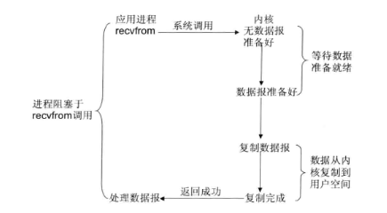

2. 非阻塞式 IO 模型：应用进程可以将 Socket 设置为非阻塞，在发起 IO 系统调用后，如果缓冲区没有数据，就直接返回 EWOULDBLOCK 错误标识，否则返回成功标识，应用进程需要轮询调用 recvfrom 系统调用。

    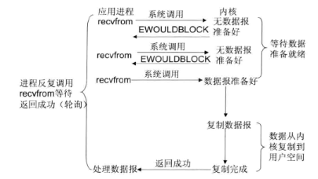

3. IO 多路复用模型：Linux 提供 `select/poll` 系统调用，进程通过将多个socket 的多个 fd 传递给 `select/poll` 调用，调用`select/poll` 的进程会阻塞等待 `select/poll` 顺序扫描 fd 是否就绪，当就绪时，立即返回回调函数，再调用 recvfrom 系统调用完成数据读取。出于效率的考量，单进程打开的fd 受到限制，默认 1024 。另外 linux 还提供 epoll 系统调用使用事件驱动代替顺序扫描，性能更高。

    epoll 优势：
    * 支持一个进程打开的 socket描述符 不受限制。
    * IO效率不会随fd 数目增加而线性下降。
    * epoll 使用 mmap 加速内核和用户空间的消息传递：内核需要把 fd 消息通知到用户空间。
 
    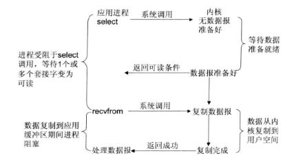

4. 信号驱动 IO 模型： 可以为 Socket 开启信号驱动 IO 功能，应用进程需向内核注册一个信号处理程序（通过`sigaction`系统调用），该操作并立即返回。当内核中有数据准备好，会发送一个信号给应用进程，应用进程便可以在信号处理程序中发起 IO 系统调用，来完成数据读取。主要用于UDP套接字，TCP信号产生过于频繁，并且信号没有告诉发送了什么事情。

    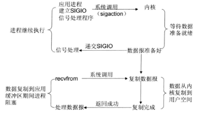

5. 异步 IO 模型：应用进程发起 IO 系统调用后，会立即返回。当内核中数据完全准备后，并且也复制到了用户空间，会产生一个信号来通知应用进程。

    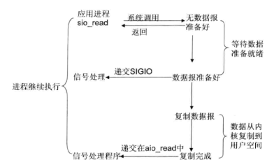

应用进程对内核发起 IO 系统调用后，内核会经过两个阶段来完成数据的传输：
  * 第一阶段：等待数据。即应用进程发起 IO 系统调用后，会一直等待数据；当有数据传入服务器，会将数据放入内核空间，此时数据准备好。
  * 第二阶段：将数据从内核空间复制到用户空间，并返回给应用程序成功标识。

    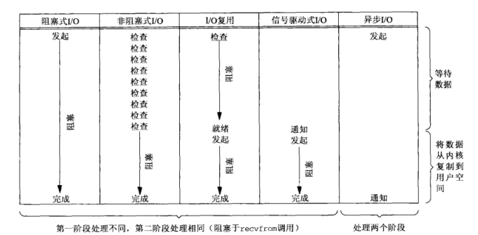

# JAVA NIO

传统IO基于字节流和字符流操作，NIO 基于 Channel 和 Buffer 操作，数据总是从 Channel 读取到 Buffer 中，或者从 Buffer 写入到 Channel 中。

## Channel

Channel 是 IO操作 的载体，全双工的，即可以读取也可以写入，流的读写只能是单向的，例如 `InputStream` 、 `OutputStream` 。

主要分为两类：

* `FileChannel`
* `SocketChannel`、`ServerSocketChannel`、`DatagramChannel`

都继承于 `SeekableByteChannel`（负责在任意位置进行读写），`GatheringByteChannel` （负责顺序将多个缓存区写入Channel，即一个缓冲区数组），`ScatteringByteChannel` （负责从Channel 读取数据依次填满多个缓存区，即一个缓冲区数组），例如

```java
public class SeekableByteChannelTest {

    public void test() {
        Path filePath = Paths.get("D://error.log");
        ByteBuffer buffer = ByteBuffer.allocate(1024);
        buffer.put("111111".getBytes());
        buffer.flip();
        try {
            FileChannel channel = FileChannel.open(filePath, StandardOpenOption.WRITE);
            channel.position(80);    // 覆盖此处的内容为111111
            channel.write(buffer);
            channel.close();

            buffer = ByteBuffer.allocate(1024);

            channel = FileChannel.open(filePath, StandardOpenOption.READ);
            channel.position(100);    // 读取此处的内容
            channel.read(buffer, 10);
            buffer.flip();
            System.out.println(buffer);

            Charset charset = Charset.forName("utf-8");
            CharsetDecoder decoder = charset.newDecoder();
            CharBuffer charBuffer = decoder.decode(buffer);
            System.out.println(charBuffer);
        } catch (IOException e) {
            e.printStackTrace();
        }

    }
}
```

```java
public class ScatteringByteChannelTest {
    public void test() {
        ByteBuffer header = ByteBuffer.allocateDirect(10);
        ByteBuffer body = ByteBuffer.allocateDirect(80);
        ByteBuffer[] buffers = {header, body};
        int bytesRead = channel.read(buffers);
    }
}
```

```java
public class GatheringByteChannelTest {
    public void test() {

        ByteBuffer header = ByteBuffer.allocateDirect(10);
        ByteBuffer body = ByteBuffer.allocateDirect(80);
        ByteBuffer[] buffers = {header, body};
        channel.write(bufferArray);
    }
}
```

`scatter/gather`经常用于需要将传输的数据分开处理的场合，例如传输一个由消息头和消息体组成的消息，你可能会将消息体和消息头分散到不同的buffer中，这样你可以方便的处理消息头和消息体。

### FileChannel

创建：

1. `FileChannel#open` ：

```java
public static FileChannel open(Path path, OpenOption... options) throws IOException;

public static FileChannel open(Path path, Set<? extends OpenOption> options, FileAttribute<?>... attrs) throws IOException;
```

2. 通过`FileInputStream/FileOutputStream` 获取

```java
FileInputStream inputStream = new FileInputStream("D:/test.txt");
FileChannel channel = inputStream.getChannel();

FileOutputStream outputStream = new FileOutputStream("D:/test.txt");
FileChannel channel1 = outputStream.getChannel();
```

3. 通过`RandomAccessFile`获取

```java
RandomAccessFile randomAccessFile = new RandomAccessFile("./test.txt", "rw");
FileChannel channel2 = randomAccessFile.getChannel();
```

api：

| 接口                      | 描述                                           |
|-------------------------|----------------------------------------------|
| open                    | 创建FileChannel                                |
| read/write              | 基于FileChannel读写                              |
| force                   | 强制将FileChannel中的数据刷入文件中                      |
| map                     | 使用 mmap 技术直接映射内核内存到用户内存，返回  MappedByteBuffer |
| transferTo/transferFrom | 将通道中的字节传输到其他通道                               |
| lock/tryLock            | 获取文件锁                                        |

read/write：

```java
public class ByteBufferTest {

    public void test() {
        ByteBuffer byteBuffer = ByteBuffer.allocate(16);
        // 如果返回-1，表示已经读到文件尾，无内容可读。
        int count = channel2.read(byteBuffer);

        ByteBuffer byteBuffer = ByteBuffer.allocate(16);
        byte[] bs = "s".getBytes();
        byteBuffer.put(bs);
        byteBuffer.flip();
        channel2.write(byteBuffer);
    }
}

```

`force`：强制将 Channel 中的内容写入文件，参数false 表示**将文件内容写入文件**，true 表示将 **文件内容 和 元数据（比如权限信息，文件修改时间）一起写入到文件，可能需要至少一次IO操作，取决于底层操作系统**。不能保证对 `MappedByteBuffer` 的修改也写入，可以调用 `MappedByteBuffer#force` 来保证。

`map`：使用 `mmap` 技术直接映射内核内存，返回 `MappedByteBuffer`。

* `READ_ONLY`：以只读的方式映射，如果发生修改，则抛出`ReadOnlyBufferException`
* `READ_WRITE`：读写方式
* `PRIVATE`：对这个`MappedByteBuffer`的修改不写入文件，且其他程序是不可见的。

一旦经过map映射后，将于用于映射的`FileChannel`没有联系，即使Channel关闭，也对`MappedByteBuffer`没有影响。

```java
public class MappedByteBufferTest {
    public void test() {
        Path path = FileSystems.getDefault().getPath("./test.txt");
        FileChannel channel = FileChannel.open(path, StandardOpenOption.READ, StandardOpenOption.WRITE);
        MappedByteBuffer mappedByteBuffer = channel.map(MapMode.READ_ONLY, 0, 100000);
        byte[] bs = new byte[100];
        mappedByteBuffer.get(bs);
    }
}
```

`transferTo/transferFrom`：底层调用 `sendfile`系统调用(windows 不支持) 或者使用 `mmap`技术写入，实现零拷贝。

```java
public class FileChannel {
    public long transferTo(long position, long count,
                           WritableByteChannel target)
            throws IOException {
        //omit..
        long n;
        //尝试不同方式
        // Attempt a direct transfer, if the kernel supports it 使用 sendfile
        if ((n = transferToDirectly(position, icount, target)) >= 0)
            return n;
        // Attempt a mapped transfer, but only to trusted channel types 使用mmap
        if ((n = transferToTrustedChannel(position, icount, target)) >= 0)
            return n;
        // Slow path for untrusted targets
        return transferToArbitraryChannel(position, icount, target);
    }
}
```

```java
public class FileChannelTest {
    public void test() {
        srcChannel.transferTo(0, Integer.MAX_VALUE, dstChannel);
        srcChannel.transferFrom(fromChannel, 0, Integer.MAX_VALUE);
    }
}
```

`lock/tryLock`： 被JVM持有，进程级别，不可用于多线程安全控制同步工具。如果统一进程内，线程1获取了文件锁FileLock（共享或者独占），线程2再来请求获取该文件的文件锁，则会抛出`OverlappingFileLockException`。

* 一个程序获取到FileLock后，是否会阻止另一个程序访问相同文件具重叠内容的部分取决于操作系统的实现，具有不确定性。FileLock的实现依赖于底层操作系统实现的本地文件锁设施。

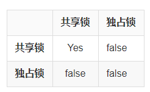

## Buffer

Buffer 本质是一块可以写入数据可以读取数据的内存，`ByteBuffer`、`CharBuffer`、`IntBuffer` 等都是它的子类，表示不同类型的数组。

属性：`mark <= position <= limit <= capacity`

```java
/**
 * 存储一个特定的Position,可以调用 reset() 方法恢复到这个Position。
 */
private int mark = -1;
/**
 * 下一个可以写入或者读取数据的位置，通过 flip() 方法将 limit = position ， position = 0
 */
private int position = 0;
/**
 * 可以写入或者读取数据的最大的位置，初始时 limit == capacity
 */
private int limit;
/**
 * buffer 容量
 */
private int capacity;
```

常用方法：

```java
/**
 * mark = position 当前position标记
 */
public final Buffer mark();

/**
 * position = mark 重置到mark
 */
public final Buffer reset();

/**
 *  position = 0;limit = capacity;mark = -1; 清空缓冲
 */
public final Buffer clear();

/**
 * limit = position;position = 0;mark = -1; 写 -> 读
 */
public final Buffer flip();

/**
 * position = 0;mark = -1; 重新读取
 */
public final Buffer rewind();

/**
 * limit - position; 返回limit和position之间相对位置差
 */
public final int remaining();

/**
 * 是否由可访问的数组支持,数组属于java对象，存在于堆中，如果为true说明是 HeapByteBuffer，如果为false说明时 DirectByteBuffer
 */
public final boolean hasArray();

/**
 * hasArray() == true 时，获取 支撑数组
 */
public abstract Object array();

/**
 * 第一个元素在缓冲区中的偏移量，一般情况为 0 ， 当 使用 slice 时 则 不为 0 。
 */
public abstract int arrayOffset();
```

## ByteBuffer

常用方法：

```java
/**
 * 创建一个 HeapByteBuffer
 */
public static ByteBuffer allocate(int capacity);

/**
 * 创建一个 DirectByteBuffer
 */
public static ByteBuffer allocateDirect(int capacity);

/**
 * 创建一个 HeapByteBuffer 包装byte[]，HeapByteBuffer 或者 array 改变都会导致互相改变。
 */
public static ByteBuffer wrap(byte[] array);

/**
 * 创建一个新的 ByteBuffer 视图，可以操作 position -> limit 数据，和原ByteBuffer 共用一个数组， 新 ByteBuffer  position = 0 , limit = 原length，offset = 原position
 */
public abstract ByteBuffer slice();

/**
 * 创建一个一样新的 ByteBuffer 视图，和原ByteBuffer 共用一个数组
 */
public abstract ByteBuffer duplicate();

/**
 * 清除position前的数据，position -> limit 复制到数组起始位置
 */
public abstract ByteBuffer compact();

public final ByteBuffer put(byte[] src);

public abstract ByteBuffer put(byte b);

public ByteBuffer get(byte[] dst);

public abstract byte get();
```

### MappedByteBuffer & DirectByteBuffer & HeapByteBuffer

内核数据 流入 堆内：`内核内存(内核空间) -> JVM堆外内存(用户空间) -> JVM 堆内内存(用户空间)`

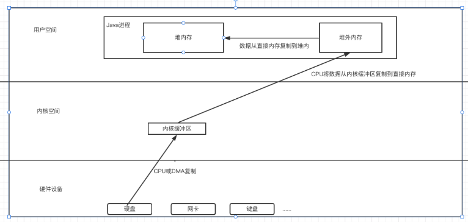

为什么需要将数据拷贝到堆外内存，再拷贝到堆内，而不直接拷贝到堆内？

* 堆内存受GC管理的，而在拷贝需要提供对应的目的地址，拷贝由内核完成，内核不知道JVM的gc情况，JVM也不知道有多少数据，需要多大空间。
* 拷贝中可能会出现堆内存中有垃圾被清理回收而导致的内存地址发生变化，可能造成目的地址也发生变化，出现未知错误。
* 先拷贝到堆外，再由JVM拷贝至堆内，JVM是清楚自己的内存空间的。

区别：

* `HeapByteBuffer` 基于数组实现，内存分配在堆内。
* `DirectByteBuffer` 通过 `Unsafe#allocateMemory` + `Unsafe#setMemory` 分配堆外内存，引用对象在堆内，在 GC 时会回收掉不可达的`DirectByteBuffer` ，并回收堆外内存，但由于 `DirectByteBuffer` 存在时间一般较长，所以大部分都会晋升到老年代，那么只能等到 Major GC 时才能回收，可通过 `-XX:MaxDirectMemorySize` 限制大小。
* `MappedByteBuffer` 是 `DirectByteBuffer` 的父类，`DirectByteBuffer`有两种类型，一直是由`DirectByteBuffer`实现，一种由`MappedByteBuffer` 实现，都是分配在堆外，不同的是 `MappedByteBuffer`实现的堆外内存使用`mmap`技术映射了内核内存，这时内核内存和用户堆外内存共享，操作堆外内存等于直接操作内核内存，避免了数据的复制，`FileChannel#transferTo`就是使用的这种内存。
* `MappedByteBuffer` 由 `FileChannel#map` 创建，`DirectByteBuffer & HeapByteBuffer` 通过 ByteBuffer 创建。

`FileChannel`、`SocketChannel`等在通过 `IOUtil` 进行 非`DirectBuffer` IO读写操作时，底层会使用一个临时的 `IOVecWrapper`来和系统进行真正的IO交互，IOVecWrapper 本质上也是一个 堆外直接内存，使用完后这个临时的 `IOVecWrapper` 会被缓存到`ThreadLocal`，当直接使用 IOUtil 操作非DirectBuffer 的线程数较多或者 IO 操作的数据量较大时，会导致临时的`DirectByteBuffer` 占用大量堆外内存造成内存泄露。可通过`-Djdk.nio.maxCachedBufferSize` 限制单个线程直接内存缓存，超过这个限制 不会被缓存到 `ThreadLocal`。

`MappedByteBuffer` 释放：高版本jdk Cleaner 已经迁移到 `jdk.internal.ref.Cleaner`,还可直接调用netty的方法：`io.netty.util.internal.PlatformDependent#freeDirectBuffer`。

```java
public class MappedByteBufferUtil {
    public static void unmap(MappedByteBuffer bb) {
        Cleaner cl = ((DirectBuffer) bb).cleaner();
        if (cl != null) {
            cl.clean();
        }
    }

    // 兼容不同jdk版本
    //  jdk9+ 启动参数需添加：
    //  --add-exports java.base/jdk.internal.ref=ALL-UNNAMED
    //  --add-opens java.base/java.nio=ALL-UNNAMED
    public void closeMappedByteBuffer(MappedByteBuffer mappedByteBuffer) {
        if (mappedByteBuffer == null) {
            return;
        }

        AccessController.doPrivileged((PrivilegedAction<Object>) () -> {
            try {
                Class<? extends MappedByteBuffer> clazz = mappedByteBuffer.getClass();
                Method cleanerMethod = ReflectionUtils.findMethod(clazz, "cleaner");
                if (cleanerMethod == null) {
                    throw new SerializableException(String.format("Get method %s#cleaner() failed.", clazz.getName()));
                }

                cleanerMethod.setAccessible(true);
                Object cleaner = cleanerMethod.invoke(mappedByteBuffer);
                if (cleaner == null) {
                    throw new SerializableException(String.format("%s get Cleaner failed.", clazz.getName()));
                }

                Class<?> cleanerClazz = cleaner.getClass();
                Method cleanMethod = ReflectionUtils.findMethod(cleanerClazz, "clean");
                if (cleanerMethod == null) {
                    throw new SerializableException(String.format("Get method %s#clean() failed.", cleanerClazz.getName()));
                }
                cleanerMethod.setAccessible(true);

                cleanMethod.invoke(cleaner);
            } catch (Exception e) {
                throw new SerializableException("Closed MappedByteBuffer failed.", e);
            }

            return null;
        });
    }
}
```

堆外内存的优势：

* 保持一个较小的堆内内存，以减少垃圾收集对应用的影响。
* 在某些场景下可以提升程序I/O操纵的性能，减少去了将数据从堆内内存拷贝到堆外内存的步骤。

什么情况下使用堆外内存？

* 堆外内存适用于生命周期中等或较长的对象。
* 直接的文件拷贝操作，或者I/O操作。
* 使用 池+堆外内存 的组合方式，来对生命周期较短，但涉及到I/O操作的对象进行堆外内存的再使用。

### 分析堆外内存

1. 启动时添加 `-XX:NativeMemoryTracking=detail`参数，会有性能损耗，生产环境不宜使用，`-XX:+UnlockDiagnosticVMOptions -XX:+PrintNMTStatistics` 在 NMT 启用的情况下，在 JVM 退出时输出最后的内存使用数据。
2. 使用 `jcmd <pid> VM.native_memory detail scale=MB` 打印JVM内存占用。

    * 使用 `jcmd <pid> VM.native_memory baseline` 设置基准值，再使用 `jcmd <pid> VM.native_memory scale=MB detail.diff`查看增长值。

   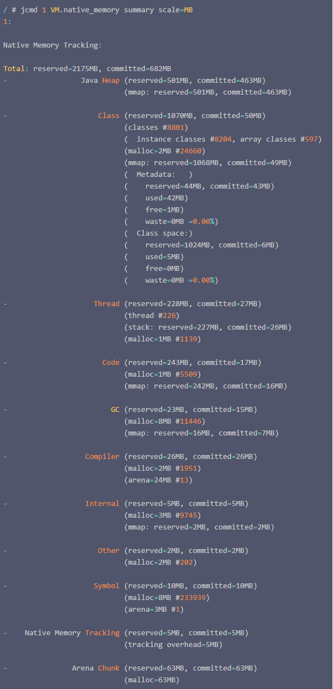

   其中 `reserved` 向操作系统申请的内存， `committed` 已经使用的内存， `mmap`，`malloc` 是两种不同的内存申请分配方式，`arena` 是通过`malloc` 方式分配的内存但是代码执行完并不释放，放入 arena chunk 中之后还会继续使用。

    * `Java Heap`：堆空间
    * `Class`：保存类的元数据，其实就是 metaspace，包含两部分： 一是 metadata，被`-XX:MaxMetaspaceSize`限制最大大小，另外是 class space，被`-XX:CompressedClassSpaceSize`限制最大大小。
    * `Thread`：线程栈占用，每个线程栈占用大小受-Xss限制。
    * `Code`：JIT 的代码缓存，为了在不同平台运行JVM字节码，需要将其转换成机器指令。程序运行时，JIT编译器负责这个编译工作，并将编译后的指令存在 Code Cache 区域。
    * `GC`：gc算法使用的空间。
    * `Compiler`：编译器自身操作使用。
    * `Internal`：命令行解析，`JVMTI` 使用的内存。
    * `Other`：尚未归类的。
    * `Symbol` ：常量池、符号表引用占用，常量池占用的大小，字符串常量池受`-XX:StringTableSize`个数限制。
    * `Native Memory Tracking`：NMT内存采集本身占用的内存大小。
    * `Arena Chunk`：所有通过 arena 方式分配的内存。 并未统计 `Direct Buffer` 、`MMap Buffer` 内存。
3. 对应直接内存可通过 Jprofile 查看 MBeans 的 `java.nio.BufferPool` 监控，单位是字节，也可使用 JVisualVM 安装`VisualVM-BufferMonitor` 监控

## Selector

负责检测一个或多个 Channel ，阻塞在 `select()` 方法上，注册的事件出现。

创建：

```java
Selector selector = Selector.open();
```

注册：`Channel`必须处于非阻塞模式下。这意味着不能将`FileChannel`与`Selector`一起使用，因为`FileChannel`不能切换到非阻塞模式。

```java
public class ConfigureBlockingTest {

    public void test() {
        channel.configureBlocking(false);

        SelectionKey key = channel.register(selector, SelectionKey.OP_READ | SelectionKey.OP_WRITE);
    }
}
```

响应事件：`select()` 会阻塞方法，直到有事件就绪时才返回，就绪事件会添加到 `selectedKeys()` 方法，注意处理完就绪事件需要 `remove` 。

```java
public class SelectorTest {

    public void test() {
        Selector selector = Selector.open();
        channel.configureBlocking(false);

        SelectionKey key = channel.register(selector, SelectionKey.OP_READ);
        while (true) {
            int readyChannels = selector.select();
            if (readyChannels == 0) continue;
            Set selectedKeys = selector.selectedKeys();
            Iterator keyIterator = selectedKeys.iterator();
            while (keyIterator.hasNext()) {
                SelectionKey key = keyIterator.next();
                if (key.isAcceptable()) {
                    // a connection was accepted by a ServerSocketChannel.
                } else if (key.isConnectable()) {
                    // a connection was established with a remote server.
                } else if (key.isReadable()) {
                    // a channel is ready for reading
                } else if (key.isWritable()) {
                    // a channel is ready for writing
                }
                keyIterator.remove();
            }
        }
    }
}
```

### SelectionKey

```java
public class SelectionKeyTest {
    public void test() {
        // 返回当前感兴趣的事件列表
        int interestSet = key.interestOps();

        // 也可通过interestSet判断其中包含的事件
        boolean isInterestedInAccept = interestSet & SelectionKey.OP_ACCEPT;
        boolean isInterestedInConnect = interestSet & SelectionKey.OP_CONNECT;
        boolean isInterestedInRead = interestSet & SelectionKey.OP_READ;
        boolean isInterestedInWrite = interestSet & SelectionKey.OP_WRITE;

        // 可以通过interestOps(int ops)方法修改事件列表
        key.interestOps(interestSet | SelectionKey.OP_WRITE);

        // 返回当前事件关联的通道，可转换的选项包括:`ServerSocketChannel`和`SocketChannel`
        Channel channel = key.channel();

        //返回当前事件所关联的Selector对象
        Selector selector = key.selector();
    }
}
```

# Netty

Netty是 一个异步事件驱动的网络应用程序框架，用于快速开发可维护的高性能协议服务器和客户端。

优势：

1. 统一的API，支持阻塞和非阻塞传输，使用简单。
2. 基于NIO，拥有高性能。
3. 预置多种编解码功能，支持多种主流协议。
4. 扩展能力强，可以通过 ChannelHandler 灵活进行扩展。
5. 稳定，修复 JDK NIO BUG 。
6. 社区活跃，迭代周期短，发现的 BUG 可以及时被修复。
7. 经历大规模商业应用考验。
8. 安全，完整支持 SSL/TLS 协议。

高性能的原因：

1. 基于 NIO 的高性能的多线程 Reactor 模型。
2. 事件驱动模型，减少空轮询的资源浪费。
3. 内存池减少对象的创建和销毁。
4. 使用 `DirectBuffer` 减少数据间的拷贝。
5. 支持 `Protobuf` 等高性能序列化协议。
6. 无锁化的串行设计，IO线程内部进行串行操作，避免多线程竞争导致的性能下降。

## 核心组件

### Channel

`Channel` 是 Netty 抽象的网络IO读写的接口，不是 JDK NIO 的`Channel`,采用`Facade`模式进行统一封装，为`SocketChannel`和`ServerSocketChannel`提供统一的视图，采用聚合而非包含的方式将相关的功能类聚合，由Channel统一负责分配和调度，功能实现灵活。

为什么新开发 Channel ？

* JDK的`SocketChannel`和`ServerSocketChannel`没有提供统一的操作接口，使用起来不方便。
* JDK的`SocketChannel`和`ServerSocketChannel`是SPI类接口，由具体的虚拟机厂家来提供适应不同的操作系统，不方便扩展。
* Netty的channel需要能跟Netty整体框架融合在一起，比如IO模型、基于`ChannelPipeline`的定制模型，以及基于元数据描述配置化的TCP参数等，JDK的`SocketChannel`和`ServerSocketChannel`都没有提供。

`Channel` 继承 `ChannelOutboundInvoker` 、 `AttributeMap` 、`Comparable`，其中 `ChannelOutboundInvoker` 负责 网络的连接断开、读写等操作，`AttributeMap` 提供 Channel 上传输数据的能力。另外Chanel 自己提供一些 聚合 框架其他部分的功能，例如 获取该Channel的`EventLoop`、获取ByteBuf分配器`ByteBufAllocator`、获取`Pipeline` 等。

`Channel` 所有的IO操作都是异步的，使用 `ChannelFuture` 占位。

Server端启动主流程：

* `ServerSocketChannel` 注册到 `BossEventLoop`
* `ServerSocketChannel` 绑定端口（并注册`ACCPET`事件）
* 调用 `AbstractNioMessageChannel.NioMessageUnsafe#read()` （由BossEventLoop `select` 获取到`ACCPET`事件后调用）
* 从`ServerSocketChannel`获取`SocketChannel`并创建`NioSocketChannel`(`read()`方法调用`NioServerSocketChannel#doReadMessages`)
* `pipeline.fireChannelRead(NioSocketChannel Pipeline)`
* `ServerBootstrap.ServerBootstrapAcceptor#channelRead()` 将 `ChannelInitializer` 添加到 NioSocketChannel Pipeline
* 将`NioSocketChannel` 注册到 WorkEventLoop，触发 `ChannelInitializer#initChannel` 添加 自定义`ChannelHandler`，并移除`ChannelInitializer`
* WorkEventLoop `select` 获取到 `READ` 事件 调用 `AbstractNioByteChannel.NioByteUnsafe#read()`
* 使用`NioSocketChannel#doReadBytes` 循环读取数据，并触发 `pipeline.fireChannelRead(byteBuf)`，
* 读取完成后调用 `pipeline.fireChannelReadComplete()`

#### AbstractChannel

负责聚合`Channel`所使用的功能，例如 `Pipeline`、`EventLoop`、`Unsafe` 等，实现 `ChannelOutboundInvoker` 接口功能，即直接通知`Pipeline`，经过 `pipeline` 异步调用，除此之外还实现调用 `Unsafe` 获取 `localAddress` 、 `remoteAddress` 的模板方法。

属性：

```java
public class AbstractChannel {
    // 父类 Channel ，如果是 ServerSocketChannel 该值为null，如果是 SocketChannel 该值为创建该 Channel 的 ServerSocketChannel。
    private final Channel parent;
    // 通道 id 不能重复
    private final ChannelId id;
    // IO操作真正的实现类，不建议用户调用.
    private final Unsafe unsafe;
    // 当前Channel对应的DefaultChannelPipeline
    private final DefaultChannelPipeline pipeline;
    private final VoidChannelPromise unsafeVoidPromise = new VoidChannelPromise(this, false);
    private final CloseFuture closeFuture = new CloseFuture(this);

    private volatile SocketAddress localAddress;
    private volatile SocketAddress remoteAddress;
    // 当前Channel注册的EventLoop
    private volatile EventLoop eventLoop;
    private volatile boolean registered;
    private boolean closeInitiated;
    private Throwable initialCloseCause;

    /** Cache for the string representation of this channel */
    private boolean strValActive;
    private String strVal;
}
```

#### AbstractUnsafe

一个 Channel 的生命周期只由一个 EventLoop 完成，无锁化串行设计提高性能。

##### register

`ServerSocketChannel`注册流程：

```text
AbstractChannel#doRegister()
-> pipeline.invokeHandlerAddedIfNeeded()(即 ChannelHandler#handlerAdded)
-> pipeline.fireChannelRegistered();
```


`SocketChannel`注册流程：
```text
AbstractChannel#doRegister()
-> pipeline.invokeHandlerAddedIfNeeded()（即ChannelHandler#handlerAdded）
-> pipeline.fireChannelRegistered()
-> ChannelInitializer#channelRegistered
-> ChannelInitializer#initChannel（添加自定义ChannelHandler，然后移除 ChannelInitializer）
-> pipeline.fireChannelActive()
-> beginRead()
-> AbstractChannel#doBeginRead()
-> AbstractNioChannel覆盖doBeginRead方法注册 READ 事件
```

```java

@Override
public final void register(EventLoop eventLoop, final ChannelPromise promise) {
    ObjectUtil.checkNotNull(eventLoop, "eventLoop");
    if (isRegistered()) {
        promise.setFailure(new IllegalStateException("registered to an event loop already"));
        return;
    }

    // 判断 Channel 和 EventLoop 是否匹配，eventLoop分很多种类型，有NIO的，还有Epoll的
    if (!isCompatible(eventLoop)) {
        promise.setFailure(
                new IllegalStateException("incompatible event loop type: " + eventLoop.getClass().getName()));
        return;
    }

    // Channel 持有注册到的 EventLoop 的引用，给后续使用，为了使 一个 Channel 的生命周期只由一个 EventLoop 完成。
    AbstractChannel.this.eventLoop = eventLoop;

    // 该方法可能由任何线程调用，如果直接调用 register0 ，不符合 一个 Channel 的生命周期只由一个 EventLoop 完成 的设计。
    // 如果调用 register 的线程和 EventLoop 中的线程是同一个线程，直接执行 register0。
    // 如果不是同一个线程，则提交到 EventLoop 的任务队列中，等待它执行。
    if (eventLoop.inEventLoop()) {
        register0(promise);
    } else {
        try {
            eventLoop.execute(new Runnable() {
                @Override
                public void run() {
                    register0(promise);
                }
            });
        } catch (Throwable t) {
            logger.warn(
                    "Force-closing a channel whose registration task was not accepted by an event loop: {}",
                    AbstractChannel.this, t);
            closeForcibly();
            closeFuture.setClosed();
            safeSetFailure(promise, t);
        }
    }
}

private void register0(ChannelPromise promise) {
    try {
        if (!promise.setUncancellable() || !ensureOpen(promise)) {
            return;
        }
        boolean firstRegistration = neverRegistered;
        // 模板方法
        doRegister();
        neverRegistered = false;
        registered = true;

        // 在通知 promise 之前调用，调用ChannelHandler#handlerAdded，如果失败则调用 ChannelHandler#handlerRemoved，例如 ChannelInitializer#handlerAdded 就是在这里被调用，将自定义的 Handler 添加进来。
        pipeline.invokeHandlerAddedIfNeeded();

        // 观察者模式，通过设置 promise ，通知监听 promise 的 listener， 暂时理解ChannelHandler 是观察者
        safeSetSuccess(promise);

        // 传播 fireChannelRegistered 事件。
        pipeline.fireChannelRegistered();
        // 对于服务端:  javaChannel().socket().isBound(); 即  当Channel绑定上了端口   isActive()才会返回true
        // 对于客户端的连接 ch.isOpen() && ch.isConnected(); 返回true , 就是说, Channel是open的 打开状态的就是true
        // ServerSocketChannel 不会触发这里，还没有完成绑定
        if (isActive()) {
            if (firstRegistration) {
                pipeline.fireChannelActive();
            } else if (config().isAutoRead()) {
                // 将 readInterestOp 注册到 SelectionKey
                beginRead();
            }
        }
    } catch (Throwable t) {
        // Close the channel directly to avoid FD leak.
        closeForcibly();
        closeFuture.setClosed();
        safeSetFailure(promise, t);
    }
}

@Override
public final void beginRead() {
    assertEventLoop();

    if (!isActive()) {
        return;
    }

    try {
        doBeginRead();
    } catch (final Exception e) {
        invokeLater(new Runnable() {
            @Override
            public void run() {
                pipeline.fireExceptionCaught(e);
            }
        });
        close(voidPromise());
    }
}
```

#### bind

`ServerSocketChannel` 注册完才会触发绑定端口。

`ServerSocketChannel` 的 `Pipeline` 为 ：
```text
HeadContext
-> ServerBootstrap.ServerBootstrapAcceptor
-> TailContext
```

`SocketChannel` 的 `Pipeline` 为：
```text
HeadContext
-> 自定义ChannelHandler
-> TailContext
```

流程：
```text
AbstractChannel#doBind
-> pipeline.fireChannelActive()
-> HeadContext#channelActive
-> channel#read
-> pipeline#read
-> AbstractChannel.AbstractUnsafe#beginRead()
-> AbstractChannel#doBeginRead()
-> AbstractNioChannel覆盖doBeginRead方法注册 ACCEPT 事件。
```

```java
public final void bind(final SocketAddress localAddress, final ChannelPromise promise) {
    assertEventLoop();

    if (!promise.setUncancellable() || !ensureOpen(promise)) {
        return;
    }

    if (Boolean.TRUE.equals(config().getOption(ChannelOption.SO_BROADCAST)) &&
            localAddress instanceof InetSocketAddress &&
            !((InetSocketAddress) localAddress).getAddress().isAnyLocalAddress() &&
            !PlatformDependent.isWindows() && !PlatformDependent.maybeSuperUser()) {
        logger.warn(
                "A non-root user can't receive a broadcast packet if the socket " +
                        "is not bound to a wildcard address; binding to a non-wildcard " +
                        "address (" + localAddress + ") anyway as requested.");
    }

    //  由于端口的绑定未完成，所以 wasActive是 false
    boolean wasActive = isActive();
    try {
        doBind(localAddress);
    } catch (Throwable t) {
        safeSetFailure(promise, t);
        closeIfClosed();
        return;
    }

    if (!wasActive && isActive()) {
        invokeLater(new Runnable() {
            @Override
            public void run() {
                // 通过 HeadContext#channelActive 最终会调用 AbstractNioChannel#doBeginRead 完成 ACCEPT 事件注册
                pipeline.fireChannelActive();
            }
        });
    }

    safeSetSuccess(promise);
}
```

#### AbstractNioChannel

维护 `SelectableChannel` 的真正引用，将原生的 `channel`注册进 `Selector`中 ，并且可以操作 `Channel` 感兴趣的 `SelectionKey` 。

1. 将 `SelectableChannel` 注册到 `EventLoop` 中的 `Selector`。

调用顺序:

```text
Channel使用Unsafe(指的是Netty的Unsafe抽象，例如AbstractUnsafe)
-> 调用 AbstractChannel.AbstractUnsafe#register
-> 调用 AbstractChannel.AbstractUnsafe#register0
-> 调用 AbstractChannel#doRegister
-> AbstractNioChannel覆盖doRegister方法
```

```java

@Override
protected void doRegister() throws Exception {
    boolean selected = false;
    for (; ; ) {
        try {
            // 注册事件为 0 ，表示对任何事件都不感兴趣。
            // 将 Channel 当成附件，方便 SelectionKey 快速匹配到 Channel 供后面使用。
            selectionKey = javaChannel().register(eventLoop().unwrappedSelector(), 0, this);
            return;
        } catch (CancelledKeyException e) {
            if (!selected) {
                // 如果存在 SelectionKey 被取消了，强制调用selectNow清空取消掉的 SelectionKey 缓存。
                // 然后再次调用 注册。
                eventLoop().selectNow();
                selected = true;
            } else {
                throw e;
            }
        }
    }
}
```

2. 向 `Selector` 注册 `readInterestOp`。

流程：
```text
AbstractChannel.AbstractUnsafe#beginRead()
-> AbstractChannel#doBeginRead()
-> 由覆盖AbstractNioChannel#doBeginRead()
```

```java

@Override
protected void doBeginRead() throws Exception {
    final SelectionKey selectionKey = this.selectionKey;
    if (!selectionKey.isValid()) {
        return;
    }

    readPending = true;

    final int interestOps = selectionKey.interestOps();
    if ((interestOps & readInterestOp) == 0) {
        selectionKey.interestOps(interestOps | readInterestOp);
    }
}
```

#### AbstractNioMessageChannel

负责 `ServerSocketChannel#read()` 的 `ACCPET` 事件。

```java

private final List<Object> readBuf = new ArrayList<Object>();

@Override
public void read() {
    assert eventLoop().inEventLoop();
    final ChannelConfig config = config();
    final ChannelPipeline pipeline = pipeline();
    final RecvByteBufAllocator.Handle allocHandle = unsafe().recvBufAllocHandle();
    allocHandle.reset(config);

    boolean closed = false;
    Throwable exception = null;
    try {
        try {
            do {
                // readBuf 保存新连接的 SocketChannel
                int localRead = doReadMessages(readBuf);
                if (localRead == 0) {
                    break;
                }
                if (localRead < 0) {
                    closed = true;
                    break;
                }

                allocHandle.incMessagesRead(localRead);
            } while (allocHandle.continueReading());
        } catch (Throwable t) {
            exception = t;
        }

        int size = readBuf.size();
        for (int i = 0; i < size; i++) {
            readPending = false;
            //调用 ServerBootstrapAcceptor#channelRead() 将 SocketChannel 交给 WorkEventLoop 处理
            pipeline.fireChannelRead(readBuf.get(i));
        }
        readBuf.clear();
        allocHandle.readComplete();
        pipeline.fireChannelReadComplete();

        if (exception != null) {
            closed = closeOnReadError(exception);

            pipeline.fireExceptionCaught(exception);
        }

        if (closed) {
            inputShutdown = true;
            if (isOpen()) {
                close(voidPromise());
            }
        }
    } finally {
        if (!readPending && !config.isAutoRead()) {
            removeReadOp();
        }
    }
}
```

#### AbstractNioByteChannel

负责 `SocketChannel#read()` 的 `READ` 事件。

```java

@Override
public final void read() {
    final ChannelConfig config = config();
    if (shouldBreakReadReady(config)) {
        clearReadPending();
        return;
    }
    final ChannelPipeline pipeline = pipeline();
    final ByteBufAllocator allocator = config.getAllocator();
    final RecvByteBufAllocator.Handle allocHandle = recvBufAllocHandle();
    allocHandle.reset(config);

    ByteBuf byteBuf = null;
    boolean close = false;
    try {
        do {
            byteBuf = allocHandle.allocate(allocator);
            // 读取 SocketChannel 的数据流
            allocHandle.lastBytesRead(doReadBytes(byteBuf));
            if (allocHandle.lastBytesRead() <= 0) {
                byteBuf.release();
                byteBuf = null;
                close = allocHandle.lastBytesRead() < 0;
                if (close) {
                    readPending = false;
                }
                break;
            }

            allocHandle.incMessagesRead(1);
            readPending = false;
            // 调用用户自定义 ChannelHandler
            pipeline.fireChannelRead(byteBuf);
            byteBuf = null;
        } while (allocHandle.continueReading());

        allocHandle.readComplete();
        pipeline.fireChannelReadComplete();

        if (close) {
            closeOnRead(pipeline);
        }
    } catch (Throwable t) {
        handleReadException(pipeline, byteBuf, t, close, allocHandle);
    } finally {
        if (!readPending && !config.isAutoRead()) {
            removeReadOp();
        }
    }
}
```

#### ChannelId

由五部分组成：

1. MAC地址（EUI-48/EUI-64）
2. 当前进程ID
3. 系统时间
4. 纳秒时间
5. 随机32位整数
6. 一个32位自增整数

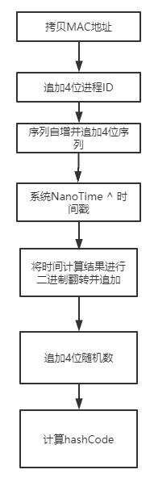

1. Netty最需要保证的是本机内的ChannelId不会产生重复，Mac地址的引入可用于区分不同主机
2. 第二部分引入了进程ID，用于区分同一机器上的两个JVM
3. 第三部分是一个自增序列ID，基本保证Id的自增性质，用于防止两个值冲突。
4. 第四部分是纳秒时间和毫秒时间的异或运算，nano存在的问题是可能存在实现的情况以及实现后现有情况末尾的字节总是0。如果有nano那么取nano，然后与时间戳进行异或运算填补nano末尾的0
5. 第五部分的话是增加了随机性。

### EventLoop & EventLoopGroup

* 一个 EventLoopGroup 包含一个或多个 EventLoop ，即 `EventLoopGroup : EventLoop = 1 : n` 。
* 一个 EventLoop 在它的生命周期内，只能与一个 Thread 绑定，即 `EventLoop : Thread = 1 : 1` 。
* 所有由 EventLoop 处理的 I/O 事件都将在它专有的 Thread 上被处理，从而保证线程安全，即 `Thread : EventLoop = 1 : 1`。
* 一个 Channel 在它的生命周期内只能注册到一个 EventLoop 上，即 `Channel : EventLoop = n : 1` 。
* 一个 EventLoop 可被分配至一个或多个 Channel ，即 `EventLoop : Channel = 1 : n` 。

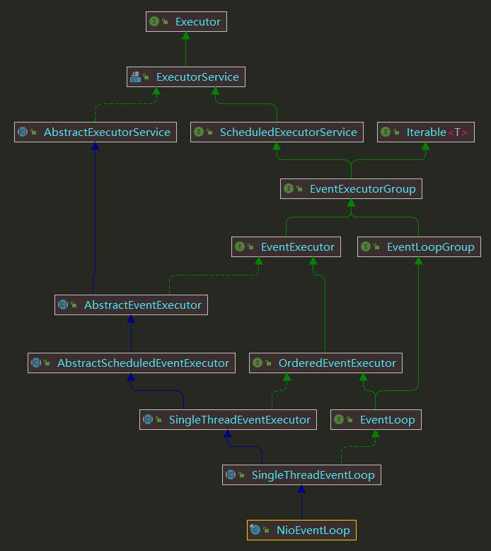
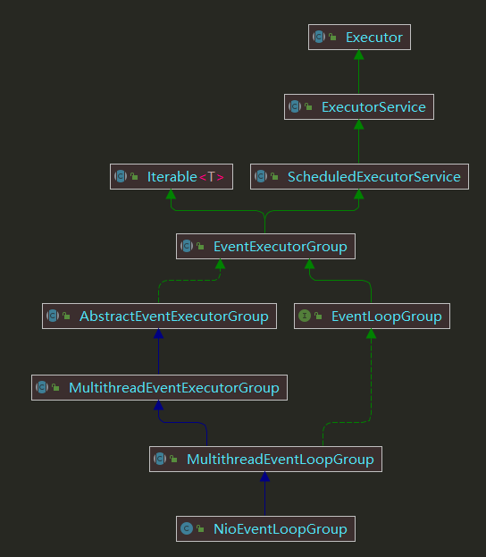

几个概念:

* `EventExecutor`：主要负责任务的提交、线程的管理，任务分为 普通任务、调度任务、定时任务，调用 `execute(Runnable task)`方法时会启动线程，循环调用 `EventLoop#run` 和 任务。
* `EventLoop`：继承 `EventExecutor` ，主要负责实现 `Channel` 的注册，以及`select`操作，处理IO请求。
* `EventExecutorGroup`：负责管理多个`EventExecutor`，当任务提交时，使用 `DefaultEventExecutorChooserFactory`选择一个`EventExecutor`，然后调用 `EventExecutor` 的提交方法。
* `NioEventLoopGroup`：负责管理多个`EventLoop`：继承，当注册时，使用 `DefaultEventExecutorChooserFactory` 选择一个`EventLoop`，然后调用`EventLoop` 的注册方法。

EventLoop 有2类工作：

1. 处理由自己实现的 IO 读写。
2. 处理 `EventExecutor` 的提交的任务,任务又分为两类：

* 系统任务：通过 `execute(Runnable task)` 提交，当 IO 线程 和 用户线程同时操作网络资源时，通过 inEventLoop 判断，将用户线程的操作转换成Task放入队列，然后由IO线程从队列中取出执行，从而实现局部无锁化，减少并发的锁竞争。
* 定时任务：通过 `schedule(Runnable command,long delay,TimeUnit unit)` 提交。

IO任务 和 普通任务根据 ioRatio 进行分配执行时间，默认 50%。

`SelectedKey` 的优化：通过反射 `SelectorImpl` 将 `Set<SelectionKey> selectedKeys` 转换成
`SelectedSelectionKeySet`，`SelectedSelectionKeySet` 使用 数组 存储 `SelectionKey` ，相比 `Set<SelectionKey>` 底层使用 HashMap 存储读写性能更高。

`select()` bug 规避：在一个周期内使用 `selectCnt` 对空轮询进行计数，如果达到阀值，判断 JDK 发生 Selector CPU 100% bug，然后从重建`Selector` 。

使用：

* 使用 `BossEventLoopGroup` 和 `WorkEventLoopGroup` ，`BossEventLoopGroup`数量大小通常设置为 1。
* 解码放在解码器中进行，使用`DirectBytebuf`，减少内存复制，可以在解码器中使用`retain`增加引用，在后续的`ChannelHandler`使用`release`减少引用回收，注意手动创建的`bytebuf`需要在`ChannelHandler#unregister`中释放。
* EventLoop 线程不能阻塞，任务应该派发到业务线程中执行。

#### Reactor 线程模型

1. 单线程模型：

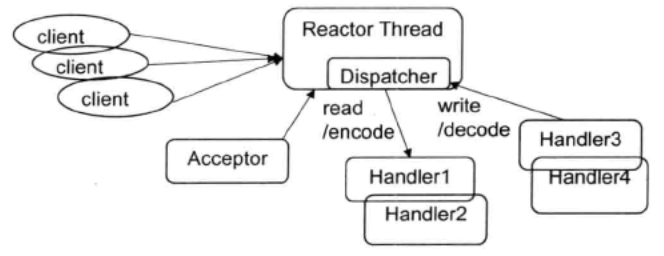

所有IO操作在同一个NIO线程完成，不适合高并发场景，当NIO线程负载过重后，处理速度将变慢，导致大量客户端重连，重发，继续加重线程负载，并且只有一个线程，一旦阻塞就不能接收和处理外部消息。

2. 多线程模型：

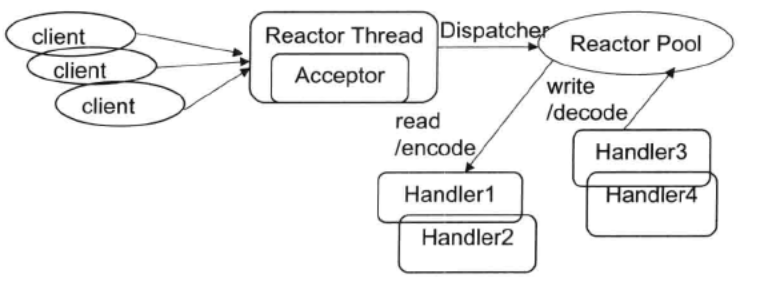

IO操作 在一个线程池中完成，其中一个线程用于处理 ACCEPT 事件，其他线程用于处理 READ 、WRITE 事件。

3. 主从多线程模型：

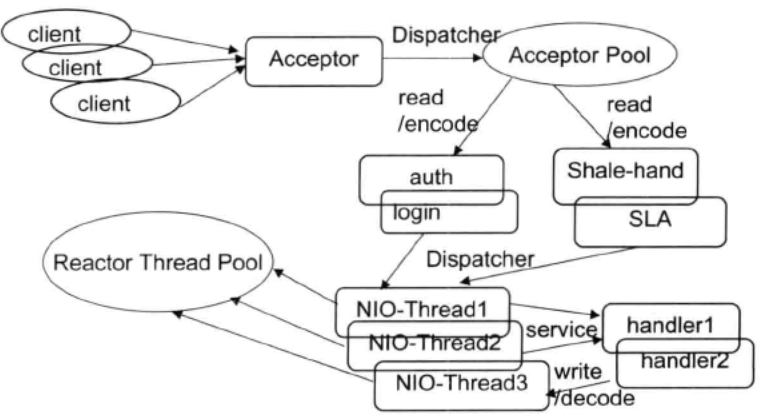

ACCEPT 事件使用一个线程池处理， READ 、WRITE 事件
使用另一个线程池处理。Acceptor线程池仅仅只用于客户端的登陆、握手和安全认证，一旦链路建立成功，就将链路注册到后端subReactor线程池的IO线程上，负责后续的IO操作。

### ChannelFuture & Promise

* `ChannelFuture`：未来节点、异步操作的占位符，相对于原生Future 扩展 获取异常、监听回调、阻塞等待等功能，常用的实现有`FailedChannelFuture`、`SucceededChannelFuture`、`FailedFuture`、`SucceededFuture`。
* `Promise`：一个特殊的 Futrue ，可以修改 它的状态，常用于传入I/O业务代码中，用于I/O结束后设置成功（或失败）状态，并回调方法，常用的实现有`DefaultChannelPromise`、`DefaultPromise`,底层使用 `AtomicReferenceFieldUpdater` + `volatile` 更新 result。

`ChannelFuture` 的状态：

```java
/**
 *                                      +---------------------------+
 *                                      | Completed successfully    |
 *                                      +---------------------------+
 *                                 +---->      isDone() = true      |
 * +--------------------------+    |    |   isSuccess() = true      |
 * |        Uncompleted       |    |    +===========================+
 * +--------------------------+    |    | Completed with failure    |
 * |      isDone() = false    |    |    +---------------------------+
 * |   isSuccess() = false    |----+---->      isDone() = true      |
 * | isCancelled() = false    |    |    |       cause() = non-null  |
 * |       cause() = null     |    |    +===========================+
 * +--------------------------+    |    | Completed by cancellation |
 *                                 |    +---------------------------+
 *                                 +---->      isDone() = true      |
 *                                      | isCancelled() = true      |
 *                                      +---------------------------+
 */

public class ChannelFutureTest {
    public void test() {
        ChannelFuture f = b.connect(xxx);
        f.awaitUninterruptibly();

        // Now we are sure the future is completed.
        assert f.isDone();

        if (f.isCancelled()) {
            // Connection attempt cancelled by user
        } else if (!f.isSuccess()) {
            f.cause().printStackTrace();
        } else {
            // Connection established successfully
        }
    }

}
```

ChannelFuture方法：

1. Java原生

```java
// 尝试取消执行
boolean cancel(boolean mayInterruptIfRunning);

// 是否已经被取消执行
boolean isCancelled();

// 是否已经执行完毕
boolean isDone();

// 阻塞获取执行结果
V get() throws InterruptedException, ExecutionException;

// 阻塞获取执行结果或超时后返回
V get(long timeout, TimeUnit unit) throws InterruptedException, ExecutionException, TimeoutException;
```

2. 状态判断

```java
// 判断是否执行成功
boolean isSuccess();

// 判断是否可以取消执行
boolean isCancellable();
```

3. 获取导致I/O操作异常

```java
Throwable cause();
```

4. 回调

```java
// 增加回调方法
Future<V> addListener(GenericFutureListener<? extends Future<? super V>> listener);

// 增加多个回调方法
Future<V> addListeners(GenericFutureListener<? extends Future<? super V>>... listeners);

// 删除回调方法
Future<V> removeListener(GenericFutureListener<? extends Future<? super V>> listener);

// 删除多个回调方法
Future<V> removeListeners(GenericFutureListener<? extends Future<? super V>>... listeners);
```

5. 阻塞等待结果返回：`sync`方法阻塞等待结果且如果执行失败后向外抛出导致失败的异常，`await`方法仅阻塞等待结果返回，不向外抛出异常。

```java
// 阻塞等待，且如果失败抛出异常
Future<V> sync() throws InterruptedException;

// 同上，区别是不可中断阻塞等待过程
Future<V> syncUninterruptibly();

// 阻塞等待
Future<V> await() throws InterruptedException;

// 同上，区别是不可中断阻塞等待过程
Future<V> awaitUninterruptibly();
```

Promise方法：

```java
// 设置成功状态并回调
Promise<V> setSuccess(V result);

boolean trySuccess(V result);

// 设置失败状态并回调
Promise<V> setFailure(Throwable cause);

boolean tryFailure(Throwable cause);

// 设置为不可取消状态
boolean setUncancellable();
```

#### ChannelFutureListener

示例：

```java
// io.netty.bootstrap.AbstractBootstrap.java

public ChannelFuture bind() {
    final PendingRegistrationPromise promise = new PendingRegistrationPromise(channel);
    regFuture.addListener(new ChannelFutureListener() {
        @Override
        public void operationComplete(ChannelFuture future) throws Exception {
            Throwable cause = future.cause();
            if (cause != null) {
                promise.setFailure(cause);
            } else {
                promise.registered();

                doBind0(regFuture, channel, localAddress, promise);
            }
        }
    });
    return promise;
}
```

### ChannelPipeline & ChannelHandlerContext & ChannelHandler

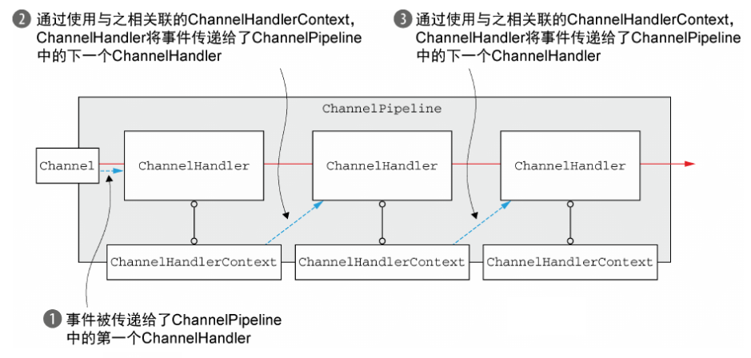

* `ChannelPipeline`：通过链表实现过滤器模式，负责管理链表节点，接受IO事件的触发，并在管道上传播，每个 Channel 都有自己独立的`Pipeline`，默认的实现类为 `DefaultChannelPipeline` 。
* `ChannelHandlerContext`：`ChannelPipeline` 的 链表节点，包含 `ChannelHandler` 及相关上下文信息，负责将 IO 事件传递给下一个节点，常用的实现类为`DefaultChannelHandlerContext`、`HeadContext`、`TailContext`。
* `ChannelHandler`：处理出站入站的处理器。
* `ServerSocketChannel` 的 `Pipeline` 为 `HeadContext -> ServerBootstrap.ServerBootstrapAcceptor -> TailContext`
* `SocketChannel` 的 `Pipeline` 为 `HeadContext -> 自定义ChannelHandler -> TailContext`

```text
                                              I/O Request
                                              via Channel or
                                              ChannelHandlerContext
                                                    |
+---------------------------------------------------+---------------+
|                           ChannelPipeline         |               |
|                                                  \|/              |
|    +---------------------+            +-----------+----------+    |
|    | Inbound Handler  N  |            | Outbound Handler  1  |    |
|    +----------+----------+            +-----------+----------+    |
|              /|\                                  |               |
|               |                                  \|/              |
|    +----------+----------+            +-----------+----------+    |
|    | Inbound Handler N-1 |            | Outbound Handler  2  |    |
|    +----------+----------+            +-----------+----------+    |
|              /|\                                  .               |
|               .                                   .               |
| ChannelHandlerContext.fireIN_EVT() ChannelHandlerContext.OUT_EVT()|
|        [ method call]                       [method call]         |
|               .                                   .               |
|               .                                  \|/              |
|    +----------+----------+            +-----------+----------+    |
|    | Inbound Handler  2  |            | Outbound Handler M-1 |    |
|    +----------+----------+            +-----------+----------+    |
|              /|\                                  |               |
|               |                                  \|/              |
|    +----------+----------+            +-----------+----------+    |
|    | Inbound Handler  1  |            | Outbound Handler  M  |    |
|    +----------+----------+            +-----------+----------+    |
|              /|\                                  |               |
+---------------+-----------------------------------+---------------+
                |                                  \|/
+---------------+-----------------------------------+---------------+
|               |                                   |               |
|       [ Socket.read() ]                    [ Socket.write() ]     |
|                                                                   |
|  Netty Internal I/O Threads (Transport Implementation)            |
+-------------------------------------------------------------------+
```

* 入站（read）从 `HeadContext -> TailContext`。
* 出站（write）从 `TailContext -> HeadContext`。
* `ChannelPipeline#addLast`是直接将 `Chandler` 添加到 `HeadContext` 后面。

`ChannelHandler` 的生命周期：

* `handlerAdded`：当把 ChannelHandler 添加到 ChannelPipeline 中时调用此方法
* `handlerRemoved`：当把 ChannelHandler 从 ChannelPipeline 中移除的时候会调用此方法
* `exceptionCaught`：当 ChannelHandler 在处理数据的过程中发生异常时会调用此方法，当发生异常，ChannelHandlerContext 不会再向下传播。

ChannelInboundHandler：处理入站操作。

* `ChannelRegistered`：当Channel被注册到EventLoop且能够处理IO事件时会调用此方法
* `ChannelUnregistered`：当Channel从EventLoop注销且无法处理任何IO事件时会调用此方法
* `ChannelActive`：当Channel已经连接到远程节点(或者已绑定本地address)且处于活动状态时会调用此方法
* `ChannelInactive`：当Channel与远程节点断开，不再处于活动状态时调用此方法
* `ChannelReadComplete`：当Channel的某一个读操作完成时调用此方法
* `ChannelRead`：当Channel有数据可读时调用此方法
*

`ChannelWritabilityChanged`：当Channel的可写状态发生改变时调用此方法，可以调用Channel的isWritable方法检测Channel的可写性，还可以通过ChannelConfig来配置write操作相关的属性。例如 对方 Socket 接收很慢，`ChannelOutboundBuffer` 就会积累很多的数据，一旦超过默认的高水位阈值，Channel的可写状态将会改变，同时调用该方法。

* `userEventTriggered`：当`ChannelInboundHandler`的`fireUserEventTriggered`方法被调用时才调用此方法。

`ChannelOutboundHandler`：处理出站操作。

* `bind`：当Channel绑定到本地address时会调用此方法
* `connect`：当Channel连接到远程节点时会调用此方法
* `disconnect`：当Channel和远程节点断开时会调用此方法
* `close`：当关闭Channel时会调用此方法
* `deregister`：当Channel从它的EventLoop注销时会调用此方法
* `read`：当从Channel读取数据时会调用此方法
* `flush`：当Channel将数据冲刷到远程节点时调用此方法
* `write`：当通过Channel将数据写入到远程节点时调用此方法

通常我们实现 `ChannelHandler` 时，会选择继承 `ChannelInboundHandlerAdapter` 、 `ChannelOutboundHandlerAdapter`、`ChannelDuplexHandler`，或者更为推荐的 `SimpleChannelInboundHandler` 。

如果 `ChannelHandler` 是线程安全的，可以使用 `@Sharable` 注解标识，这样可以让多个`ChannelPipeline` 使用同一个`ChannelHandler`。

`ChannelHandler` 一定不能阻塞。

#### ChannelInitializer

一个特殊的 `ChannelInboundHandlerAdapter` ，在 `SocketChannel` 创建时被触发 `channelRegistered` ，由它来添加自定义的`ChannelHandler` ，并再添加完将自己移除。

#### Decoder & Encoder

1. 解码器可继承 `ByteToMessageDecoder`、`ReplayingDecoder`、`MessageToMessageDecoder`
2. 编码器可继承 `MessageToByteEncoder`、`MessageToMessageEncoder`
3. 混合型编解码器可继承 `ByteToMessageCodec`、`MessageToMessageCodec`、`CombinedChannelDuplexHandler` 。

`ByteToMessageDecoder`有几个重点：

* `decode(ctx, in, out)` 中 in 不用担心释放，只需使用 skipByte 即可，父类通过 `MERGE_CUMULATOR` 将 in 剩余未读字节 和 新从socket读取字节 复制到一个新 ByteBuf ，并释放 in。
* `ByteBuf.readBytes(int)` 等一些返回 ByteBuf 的方法如果没有添加到 out list 需要主动释放，可以使用 `ByteBuf.readSlice(int)`来避免这种问题，或者使用 getXX ，但要注意 index 位置，防止 超出边界值。
* 不得使用 `@Sharable` 注解。
* out 会在 channelRead 最后回收。

`ReplayingDecoder`：遇到半包时通过抛出 `ReplayingDecoder.REPLAY` 异常，进入结束解码，等待下一次读取数据。

常用的 `ByteToMessageDecoder`：

* `FixedLengthFrameDecoder`：定长帧解码器。
* `DelimiterBasedFrameDecoder`：分割符解码器。
* `LineBasedFrameDecoder`：换行符解码器，`\r\n`、`\n`都视为换行符。
* `LengthFieldBasedFrameDecoder`：
    * `maxFrameLength`：最大帧长度，如果超过，此次数据会被丢弃。
    * `lengthFieldOffset`：长度域偏移。如果数据开始的几个字节可能不是表示数据长度，所以需要后移几个字节才是长度域。
    * `lengthFieldLength`：长度域字节数。用几个字节来表示数据长度。
    * `lengthAdjustment`：长度域后实际长度 - 长度域长度，因为长度域长度可能包含 head 长度，需要 减去
    * `initialBytesToStrip`：将本帧跳过几个字节，添加到 out。

常用 MessageToByteEncoder：

* `LengthFieldPrepender`：
    * `byteOrder`：表示Length字段本身占用的字节数使用的是大端还是小端编码
    * `lengthFieldLength`：表示Length字段本身占用的字节数,只可以指定 1, 2, 3, 4, 或 8。
    * `lengthAdjustment`：表示Length字段调整值。
    * `lengthIncludesLengthFieldLength`：表示Length字段本身占用的字节数是否包含在Length字段表示的值中。

Http常用编解码器：`HttpServerCodec`、`HttpClientCodec`、`HttpObjectAggregator`、`HttpContentCompressor`、`HttpContentDecompressor`、`SslHandler`

Websocket常用编解码器：`HttpServerCodec`、`HttpObjectAggregator`、`WebSocketServerProtocolHandler`、`TextFrameHandler`、`BinaryFrameHandler`、`ContinuationFrameHandler`

空闲和超时：

* `IdleStateHandler` （空闲时间太长，触发 `IdleStateEvent`，通过 `userEventTriggered` 接收）
* `ReadTimeoutHandler` （抛出 `ReadTimeoutException`，通过 `exceptionCaught` 接收）
* `WriteTimeoutHandler` （抛出 `WriteTimeoutException`，通过 `exceptionCaught` 接收 ）

IP黑白名单：`RuleBasedIpFilter`

码流日志打印：`LoggingHandler`

流量整形：Netty内置了三种流量整形功能。
* 单个链路的流量整形:`ChannelTrafficShapingHandler`，可以对某个链路的消息发送和读取速度进行控制。
* 全局流量整形:`GlobalTrafficShapingHandler`，针对某个进程所有链路的消息发送和读取速度的总和进行控制。
* 全局和单个链路综合型流量整形:`GlobalChannelTrafficShapingHandler`，同时对全局和单个链路的消息发送和读取速度进行控制。

`GlobalTrafficShapingHandler` 和 `GlobalChannelTrafficShapingHandler` 需要全局使用一个实例。

### ServerBootStrap & BootStrap

负责服务器和客户端的创建，`ServerBootStrap` 负责将一个进程绑定到某个指定的端口，`BootStrap` 负责将一个进程连接到另一个指定主机的正在运行的进程。

#### Option

`ServerBootStrap`中`option()`设置 `SeverSocketChannel`,`childOption()` 设置 `SocketChannel`。

`SocketOption`：配置 `Socket` 连接，定义在 `StandardSocketOptions` 中。

`SocketChannel`、`ServerSocketChannel` 参数：

* `TCP_NODELAY`: 默认开启（false），禁用Nagle算法，当我们只要发送1字节的数据，却需要40字节的TCP/IP头部时，浪费会非常大，Nagle算法是通过合并短段并提高网络效率。
* `SO_RCVBUF`: 接收缓冲区，不建议我们手动进行设置，因为操作系统会根据当前占用，进行自动的调整。
* `SO_KEEPALIVE`：推荐为true，在连接空闲时操作系统定期探测连接的另一端，一般时空闲2小时后，发送第一个探测分组，如果没收到回应每隔75秒发送一个探测分组，最多重复发送9次。
* `SO_REUSEADDR`: 推荐为true，连接被关闭后，处于TIME_WAIT状态时，端口是否被重用，`TIME_WAIT` 将持续 `2MSL` ，总共 4 min。
* `ALLOCATOR`: 使用 `PooledByteBufAllocator.DEFAULT`
* `WRITE_BUFFER_WATER_MARK`: 默认64k，可设置为 1M 到 6M。

`ServerSocketChannel` 参数：

* SO_BACKLOG: 握手队列长度

`SocketChannel` 参数：

* `CONNECT_TIMEOUT_MILLIS`：客户端建立连接时，如果超过指定的时间仍未连接，则抛出timeout异常。
* `SO_SNDBUF`: 发送缓冲区，不建议我们手动进行设置，因为操作系统会根据当前占用，进行自动的调整。
* `RCVBUF_ALLOCATOR`: 该参数使用默认值

Nagle算法的规则：

* 如果包长度达到`MSS`(Maximum Segment Size 1460字节)，则允许发送
* 如果该包含有FIN，则允许发送
* 设置了`TCP_NODELAY`选项，则允许发送
* 未设置`TCP_CORK`选项时，若所有发出去的小数据包（包长度小于MSS）均被确认，则允许发送；
* 上述条件都未满足，但发生了超时（一般为200ms），则立即发送

### ByteBuf

优点：

1. 支持池化。
2. 支持引用计数。
3. 读写使用不同索引，不同使用 flip 转换。
4. 容量按需增长。
5. 复合缓冲区实现多个ByteBuf合并时，不用拷贝。

类型：

1. 内存类型：堆内存和直接内存，例如 `PooledHeapByteBuf`、`PooledDirectByteBuf`。
2. 分配模式：分为池化与非池化，例如 `PooledHeapByteBuf`、`UnpooledHeapByteBuf`。
3. 操作类型：分为Unsafe与非Unsafe，例如 `PooledHeapByteBuf`、`PooledUnsafeHeapByteBuf`。

常用方法：

1. 读操作

| 操作                                            | 说明                                            |
|-----------------------------------------------|-----------------------------------------------|
| readBoolean()                                 | 返回当前readIndex的Boolean值，readIndex增加1           |
| readByte()                                    | 返回当前readIndex处的字节值，readIndex增加1               |
| readUnsignedByte()                            | 返回当前readIndex处的无符号字节值，readIndex增加1            |
| readShort()                                   | 返回当前readIndex处的无符号short值，readIndex增加2         |
| readShortLE()                                 | 使用小端计算返回 Short 值，readIndex增加2                 |
| readUnsignedShort()                           | 返回当前readIndex处的short值，readIndex增加2            |
| readMedium()                                  | 读取 3 个字节24位转换为 int，readIndex增加3               |
| readInt()                                     | 返回当前readIndex处的int值，readIndex增加4              |
| readIntLE()                                   | 使用小端计算返回int值，readIndex增加4                     |
| readUnsignedInt()                             | 返回当前readIndex处的无符号int值,返回类型为long，readIndex增加4 |
| readLong()                                    | 返回当前readIndex处的long值，readIndex增加8             |
| readBytes(ByteBuf dst, int length)            | 读取 length 长度写入到 dst，readIndex增加length         |
| readCharSequence(int length, Charset charset) | 读取 length 长度返回 CharSequence，readIndex增加length |

2. 写操作

| 操作                                                        | 说明                                                                           |
|-----------------------------------------------------------|------------------------------------------------------------------------------|
| writeBoolean(boolean value)                               | 在当前writeIndex处写入一个boolean值，并将writeIndex增加1                                   |
| writeByte(int value)                                      | 在当前writeIndex处写入一个int值，忽略高位24位，并将writeIndex增加1，应当小于等于255，否则会被截断              |
| writeShort(int value)                                     | 在当前writeIndex处写入一个int值，忽略高位16位，并将writeIndex增加2，应当小于等于65535，否则会被截断            |
| writeShortLE(int value)                                   | 在当前writeIndex处写入一个int值，使用小端字节序，忽略高位16位，并将writeIndex增加2，应当小于等于65535，否则会被截断    |
| writeMedium(int value)                                    | 在当前writeIndex处写入一个int值，忽略高位8位，并将writeIndex增加3，应当小于等于65535*255，否则会被截断         |
| writeMediumLE(int value)                                  | 在当前writeIndex处写入一个int值，使用小端字节序，忽略高位8位，并将writeIndex增加3，应当小于等于65535*255，否则会被截断 |
| writeInt(int value)                                       | 在当前writeIndex处写入一个int值，并将writeIndex增加4                                       |
| writeIntLE(int value)                                     | 在当前writeIndex处写入一个int值，使用小端字节序，并将writeIndex增加4                               |
| writeLong(long value)                                     | 在当前writeIndex处写入一个long值，并将writeIndex增加8                                      |
| writeLongLE(long value)                                   | 在当前writeIndex处写入一个long值，使用小端字节序，并将writeIndex增加8                              |
| writeChar(int value)                                      | 在当前writeIndex处写入一个int值，忽略高位16位，并将writeIndex增加2，低2位字节视为 2字节 UTF-8 字符          |
| writeFloat(float value)                                   | 在当前writeIndex处写入一个float值，并将writeIndex增加4                                     |
| writeDouble(double value)                                 | 在当前writeIndex处写入一个double值，并将writeIndex增加8                                    |
| writeBytes(ByteBuf src)                                   | 在当前writeIndex处写入 readableBytes ，并将writeIndex增加 readableBytes                 |
| writeZero(int length)                                     | 填充 length 长度 0x00                                                            |
| writeCharSequence(CharSequence sequence, Charset charset) | 写入 CharSequence ，writeIndex 增加长度跟编码有关，UTF-8 位 长度的2倍                          |

3. 随机读取：getXXXX，和 readXXXX 方法相似，readIndex 不变
4. 随机写入：setXXXX，和 writeXXXX 方法相似，writeIndex 不变
5. 可读字节：

| 操作              | 说明                              |
|-----------------|---------------------------------|
| readableBytes() | 可读取字节，writerIndex - readerIndex |
| isReadable()    | 可读字节是否大于0                       |

6. 可写字节：

| 操作                                                  | 说明                          |
|-----------------------------------------------------|-----------------------------|
| writableBytes()                                     | 可写字节，capacity - writerIndex |
| isWritable(int size)                                | 可写字节是否大于size                |
| ensureWritable(int minWritableBytes, boolean force) | 可写入多大内容，是否扩容                |

7. 索引操作：

| 操作                     | 说明                                                                   |
|------------------------|----------------------------------------------------------------------|
| clear()                | 丢弃所有字节，writeIndex = readIndex = 0                                    |
| discardReadBytes()     | 丢弃已读字节，将未读字节复制到 索引 0                                                 |
| discardSomeReadBytes() | 当 writeIndex == readIndex ，丢弃所有字节，当 readIndex 大于容量一半，丢弃已读字节，否则不丢弃字节。 |
| markReaderIndex()      | 标记 readerIndex                                                       |
| resetReaderIndex()     | 重置到 readerIndex                                                      |
| markWriterIndex()      | 标记 writerIndex                                                       |
| resetWriterIndex       | 重置到 writerIndex                                                      |
| skipBytes(int length)  | 跳过 length 字节                                                         |

8. 查找操作：

| 操作                                              | 说明                                                                    |
|-------------------------------------------------|-----------------------------------------------------------------------|
| indexOf(int fromIndex, int toIndex, byte value) | 1. from>to,从from到to查找第一个值，包含from<br />2. from<to,从to到from查找第一个值，包含 to |
| bytesBefore(byte value)                         | 查找第一个值索引 - readerIndex                                                |
| bytesBefore(int length, byte value)             | 在指定length查找第一个值索引 - readerIndex                                       |
| bytesBefore(int index, int length, byte value)  | 从指定索引搜索，而不是 readerIndex                                               |
| forEachByte(ByteProcessor processor)            | 指定byte匹配规则，返回一个查找的值                                                   |

9. 派生缓冲区：返回新的ByteBuf，具有自己的读索引、写索引和标记索引，但是内部储存和原ByteBuf使用同一个，任何一个修改数据都可以修改所有视图。

| 操作          | 说明                                     |
|-------------|----------------------------------------|
| slice()     | 返回可读字节视图，最大长度为可读字节长度，与原ByteBuf使用一个引用计数 |
| duplicate() | 返回新视图，最大长度与之前一样，与原ByteBuf使用一个引用计数      |
| copy()      | 深复制一个新的ByteBuf                         |

10. 引用计数：retain() 引用计数加1 ， release() 引用计数减1

#### AbstractByteBuf

属性：

```java
// static，所有bytebuf公用，用来检测内存泄漏问题
static final ResourceLeakDetector<ByteBuf> leakDetector = ResourceLeakDetectorFactory.instance().newResourceLeakDetector(ByteBuf.class);
// 读指针，下一个可以读取的索引
int readerIndex;
// 写指针，下一个可以写入的索引
int writerIndex;
// 读指针标记，可以将 读指针 调整到该 位置。
private int markedReaderIndex;
// 写指针标记，可以将 写指针 调整到该 位置。
private int markedWriterIndex;
// 最大容量
private int maxCapacity;
```

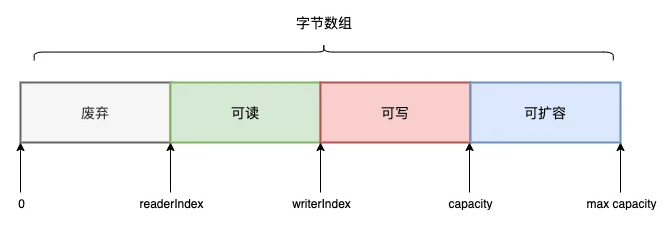

* 每读取一个字节，`readerIndex`递增1；直到`readerIndex`等于`writerIndex`，表示ByteBuf已经不可读；
* 每写入一个字节，`writerIndex`递增1；直到`writerIndex`等于`capacity`，表示ByteBuf已经不可写；
* 当`writerIndex`等于`capacity`表示底层字节数组需要扩容，且最大扩容不能超过max capacity，`capacity() `由子类去实现。

##### 内存泄漏探测

* 启动时添加 `-Dio.netty.leakDetectionLevel=ADVANCED` 开启采样，每次产生一个堆外内存检查一次。
* `SIMPLE`:默认的内存检测级别，以一个时间间隔，默认是每创建113个直接内存（堆外内存）时检测一次。

#### AbstractReferenceCountedByteBuf

通过 `volatile` + `CAS` 修改 `refCnt`,`refCnt` 初始化为 2，采用位运算， `retain()` 左移一位 ,`release()` 右移一位，当调用 `release()` 等于 1 时，开始释放对象，在实际实现中不是采用是否等于1来判断，而是使用 `refCnt & 1` 判断奇偶数来判断，偶数表示引用还存在，奇数表示对象被释放。

#### UnpooledHeapByteBuf & UnpooledUnsafeHeapByteBuf

属性：

```java
// 持有 ByteBufAllocator 的引用，可通过 alloc() 获取
private final ByteBufAllocator alloc;
// 储存数据的数组，可以使用 array() 更方便的位运算
byte[] array;
private ByteBuffer tmpNioBuf;
```

扩容时使用 `System.copyarray()` 复制到新数组。

`UnpooledHeapByteBuf` 使用字节数组的索引即array[index]访问，`UnpooledUnsafeHeapByteBuf` 使用 `baseAddress + Index`的得到字节的地址，然后从该地址取得字节，以提高性能。

#### UnpooledDirectByteBuf & UnpooledUnsafeDirectByteBuf

属性：

```java
// 储存数据，使用 ByteBuffer.allocateDirect(initialCapacity)  分配
ByteBuffer buffer;
private ByteBuffer tmpNioBuf;
private int capacity;
private boolean doNotFree;
```

扩容时创建一个新的 `ByteBuffer` ，使用 `ByteBuffer#put` 将 原ByteBuffer 复制过去，再将 原ByteBuffer 释放内存。

`UnpooledDirectByteBuf` 使用 DirectByteBuffer API 访问，`UnpooledUnsafeHeapByteBuf` 使用 `memoryAddress + Index` 地址访问，速度更快。

#### PooledByteBufAllocator

使用 `jemalloc4` 算法实现：

* `PooledByteBufAllocator`由多个`PoolArena`构成，分为`heapArenas`和`directArenas`,默认数量为 `CPU核数 * 2`,每个线程会绑定一个`PoolArena`到`ThreadLocal`。
* 分配内存时会交给`PoolArena`负责,一个`PoolArena`包含一个`PoolSubpage<T>[]`和多个`PoolChunkList<T>`,`PoolChunkList<T>`按使用率分为 `QINIT` 、 `Q0` 、 `Q25` 、 `Q50` 、`Q75` 、`Q100` 6种。
* `PoolArena` 分配内存时会先根据用户申请的内存大小在 `SizeClasses` 查表得到确定的 `index`。
* 通过判断 `index` 大小就可以知道采用什么策略。当 `index<=38`（即`size<=28KB`）时，采用 `Small` 级别分配策略。对于 `38<index<75`（即`28KB<size<=16MB`）采用 `Normal` 级别分配策略。对于 `index` 的其他值，则对应 Huge 级别。
* 对于 `Small` 和 `Normal` 级别会优先从本地缓存`ThreadLocal`分配。
* 对于 `Normal` 级别 的内存特点是`pageSize`的整数倍，由 `PoolChunk` 负责，`PoolChunk` 一次会申请 `16MB` 大小内存，然后根据需要将其拆分为1个或多个`Run`,一个`Run`包含多个`pageSize`，最多包含2048个`pageSize`，即`16MB`，`Run`有40种规格，对应 `SizeClasses` 的 `pageIdx2SizeTab`,`PoolChunk` 使用 `LongPriorityQueue[] runsAvail` 储存空闲`Run`,`runsAvail`的长度为40,对应`Run`的40种规格。
* 


##### SizeClasses

`SizeClasses` 用于记录 `标准化的size` 与 `数组idx` 的关系，总共有 76 种规格的size，存储即是下面的表格。
* `sizeIdx2sizeTab`: 储存`index`到`size`的关系
* `pageIdx2SizeTab`:储存`isMultiPageSize=1`和`size`的关系
* `sizeIdxTab`: 储存`size`到`index`的关系，主要是对小数据类型的对应的idx的查找进行缓存

下表字段的含义：
* `index`: 数组idx，该idx对应多大size查下表所得，例如 储存小于1页(8KB)的`PoolSubpage<T>[] smallSubpagePools`中，`smallSubpagePools[1]`储存的是 全是`32B`的大小的链表的头节点。
* `log2Group`: 对应size的对应的组，用于计算对应的size。
* `isMultiPageSize`: size是否是`pagesize`(默认值:8192)的倍数。 `isMultiPageSize=1` 的行会单独整理成一张表，总共有40行。
* `isSubPage`: 是否一个`subPage`类型

| index | log2Group | isMultiPageSize | isSubPage | size     | pageIdxAndPages | size2idxTab |
|-------|-----------|-----------------|-----------|----------|-----------------|-------------|
| 0     | 4         | 0               | 1         | 16       |                 | 0           |
| 1     | 4         | 0               | 1         | 32       |                 | 1           | 
| 2     | 4         | 0               | 1         | 48       |                 | 2           |
| 3     | 4         | 0               | 1         | 64       |                 | 3           |
| 4     | 6         | 0               | 1         | 80       |                 | 4           |
| 5     | 6         | 0               | 1         | 96       |                 | 5           |
| 6     | 6         | 0               | 1         | 112      |                 | 6           |
| 7     | 6         | 0               | 1         | 128      |                 | 7           |
| 8     | 7         | 0               | 1         | 160      |                 | 8->10       |
| 9     | 7         | 0               | 1         | 192      |                 | 10->12      |
| 10    | 7         | 0               | 1         | 224      |                 | 12->14      |
| 11    | 7         | 0               | 1         | 256      |                 | 14->16      |
| 12    | 8         | 0               | 1         | 320      |                 | 16->20      |
| 13    | 8         | 0               | 1         | 384      |                 | 20->24      |
| 14    | 8         | 0               | 1         | 448      |                 | 24->28      |
| 15    | 8         | 0               | 1         | 512      |                 | 28->32      |
| 16    | 9         | 0               | 1         | 640      |                 | 32->40      |
| 17    | 9         | 0               | 1         | 768      |                 | 40->48      |
| 18    | 9         | 0               | 1         | 896      |                 | 48->56      |
| 19    | 9         | 0               | 1         | 1024     |                 | 56->64      |
| 20    | 10        | 0               | 1         | 1280     |                 | 64->80      |
| 21    | 10        | 0               | 1         | 1536     |                 | 80->96      |
| 22    | 10        | 0               | 1         | 1792     |                 | 96->112     |
| 23    | 10        | 0               | 1         | 2048     |                 | 112->128    |
| 24    | 11        | 0               | 1         | 2560     |                 | 128->160    |
| 25    | 11        | 0               | 1         | 3072     |                 | 160->192    |
| 26    | 11        | 0               | 1         | 3584     |                 | 192->224    |
| 27    | 11        | 0               | 1         | 4096     |                 | 224->256    |
| 28    | 12        | 0               | 1         | 5120     |                 | 无           |
| 29    | 12        | 0               | 1         | 6144     |                 | 无           |
| 30    | 12        | 0               | 1         | 7168     |                 | 无           |
| 31    | 12        | 1               | 1         | 8192     | 0(1)            | 无           |
| 32    | 13        | 0               | 1         | 10240    |                 | 无           |
| 33    | 13        | 0               | 1         | 12288    |                 | 无           |
| 34    | 13        | 0               | 1         | 14336    |                 | 无           |
| 35    | 13        | 1               | 1         | 16384    | 1(2)            | 无           |
| 36    | 14        | 0               | 1         | 20480    |                 | 无           |
| 37    | 14        | 1               | 1         | 24576    | 2(3)            | 无           |
| 38    | 14        | 0               | 1         | 28672    |                 | 无           |
| 39    | 14        | 1               | 0         | 32768    | 3(4)            | 无           |
| 40    | 15        | 1               | 0         | 40960    | 4(5)            | 无           |
| 41    | 15        | 1               | 0         | 49152    | 5(6)            | 无           |
| 42    | 15        | 1               | 0         | 57344    | 6(7)            | 无           |
| 43    | 15        | 1               | 0         | 65536    | 7(8->9)         | 无           |
| 44    | 16        | 1               | 0         | 81920    | 8(10->11)       | 无           |
| 45    | 16        | 1               | 0         | 98304    | 9(12->13)       | 无           |
| 46    | 16        | 1               | 0         | 114688   | 10(14->15)      | 无           |
| 47    | 16        | 1               | 0         | 131072   | 11(16->19)      | 无           |
| 48    | 17        | 1               | 0         | 163840   | 12(20->23)      | 无           |
| 49    | 17        | 1               | 0         | 196608   | 13(24->27)      | 无           |
| 50    | 17        | 1               | 0         | 229376   | 14(28->31)      | 无           |
| 51    | 17        | 1               | 0         | 262144   | 15(32->39)      | 无           |
| 52    | 18        | 1               | 0         | 327680   | 16(40->47)      | 无           |
| 53    | 18        | 1               | 0         | 393216   | 17(48->55)      | 无           |
| 54    | 18        | 1               | 0         | 458752   | 18(56->63)      | 无           |
| 55    | 18        | 1               | 0         | 524288   | 19(64->79)      | 无           |
| 56    | 19        | 1               | 0         | 655360   | 20(80->95)      | 无           |
| 57    | 19        | 1               | 0         | 786432   | 21(96->111)     | 无           |
| 58    | 19        | 1               | 0         | 917504   | 22(112->127)    | 无           |
| 59    | 19        | 1               | 0         | 1048576  | 23(128->159)    | 无           |
| 60    | 20        | 1               | 0         | 1310720  | 24(160->191)    | 无           |
| 61    | 20        | 1               | 0         | 1572864  | 25(192->223)    | 无           |
| 62    | 20        | 1               | 0         | 1835008  | 26(224->255)    | 无           |
| 63    | 20        | 1               | 0         | 2097152  | 27(256->319)    | 无           |
| 64    | 21        | 1               | 0         | 2621440  | 28(320->383)    | 无           |
| 65    | 21        | 1               | 0         | 3145728  | 29(384->447)    | 无           |
| 66    | 21        | 1               | 0         | 3670016  | 30(448->511)    | 无           |
| 67    | 21        | 1               | 0         | 4194304  | 31(512->639)    | 无           |
| 68    | 22        | 1               | 0         | 5242880  | 32(640->767)    | 无           |
| 69    | 22        | 1               | 0         | 6291456  | 33(768->895)    | 无           |
| 70    | 22        | 1               | 0         | 7340032  | 34(896->1023)   | 无           |
| 71    | 22        | 1               | 0         | 8388608  | 35(1024->1279)  | 无           |
| 72    | 23        | 1               | 0         | 10485760 | 36(1280->1535)  | 无           |
| 73    | 23        | 1               | 0         | 12582912 | 37(1536->1791)  | 无           |
| 74    | 23        | 1               | 0         | 14680064 | 38(1792->2047)  | 无           |
| 75    | 23        | 1               | 0         | 16777216 | 39(2048)        | 无           |


属性：

```java
private final Handle<PooledByteBuf<T>> recyclerHandle;
// 初始化所属的块
protected PoolChunk<T> chunk;
protected long handle;
// 内存类型
protected T memory;
protected int offset;
protected int length;
int maxLength;
// 线程本地缓存，当同一线程释放 PooledByteBuf ，会先添加到本地缓存，并不会真正释放
PoolThreadCache cache;
ByteBuffer tmpNioBuf;
private ByteBufAllocator allocator;
```

* 先将内存分为多个`Chunk`(**16MB**)
* 按使用率将 `Chunk` 归类为多个 `PoolChunkList`，`PoolChunkList`有 `QINIT` 、 `Q0` 、 `Q25` 、 `Q50` 、`Q75` 、`Q100` 6种，代表不同的使用率,使用链表组织数据结构：

  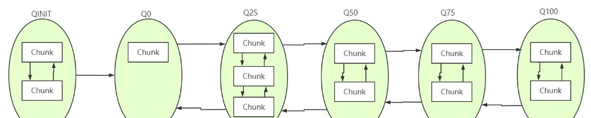
* 一个`Chunk`分为切分为 2048 块 `Page`(**8KB**)，储存在`PriorityQueue`数组（`runsAvail`），其中`PriorityQueue`存放的是`handle`，`handle`可以理解为一个句柄，维护一个内存块的信息，内存标识符。
* `runsAvail`数组默认长度为40，每个位置`index`上放的`handle`代表了存在一个可用内存块，并且可分配大小 大于等于当前的`pageSize`，小于下一页的`pageSize`。
* 分配时分为 `Small`内存块 、`Normal`内存块 分开分配。
* `Small`内存块使用 `PoolSubpage` 。
* `Normal`内存块 直接从 `PriorityQueue` 中划分 page。

#### CompositeByteBuf

将多个`ByteBuf` 组成一个逻辑`ByteBuf`，底层共享存储，实现多个`ByteBuf`合并成一个`ByteBuf`时不用拷贝。

#### ByteBufHolder

提供一个包含 `ByteBuf` 的抽象，默认实现为 `DefaultByteBufHolder` ，一般继承该类，用于除了储存 `ByteBuf` 外，还储存其他值。

#### ByteBufAllocator

有两种实现 `PooledByteBufAllocator` 和 `UnpooledByteBufAllocator` , 默认使用 `PooledByteBufAllocator`。

常用api:

| 操作                      | 说明                                       |
|-------------------------|------------------------------------------|
| buffer()                | 根据directByDefault字段，决定 buffer 类型，默认false |
| heapBuffer()            | 初始大小256，最大容量 Integer.MAX_VALUE           |
| directBuffer()          | 初始大小256，最大容量 Integer.MAX_VALUE           |
| compositeBuffer()       | 根据directByDefault字段，决定 buffer 类型，默认false |
| compositeHeapBuffer()   | 最大组件数量为16                                |
| compositeDirectBuffer() | 最大组件数量为16                                |

#### ByteBufUtil & HeapByteBufUtil & UnsafeByteBufUtil

* `ByteBufUtil.hexDump` 常用来打印 16 进制字符串。
* `HeapByteBufUtil` 将byte[]数组转换成 基本数据类型。
* `UnsafeByteBufUtil` 直接读取内存转换成 基本数据类型。

#### Unpooled

使用 `UnpooledByteBufAllocator` 分配

* `buffer()`：创建堆缓存区。
* `directBuffer()`：创建直接缓存区。
* `wrappedBuffer()`：和入参使用相同的 `byte[]`,不需要复制。
* `copiedBuffer()`：深拷贝一个 `ByteBuf`，会复制一个新的 `byte[]`。

### FileRegion

文件写入channel ，底层使用 FileChannel#transferTo 。

```java
public class FileRegionTest {
    public void test() {
        FileInputStream in = new FileInputStream(file);
        FileRegion region = new DefaultFileRegion(in.getChannel, 0, file.length);
        channel.writeAndFlush(region)
                .addListener(
                        new ChannelFutureListener() {
                            public void operationComplete(ChannelFuture future) throws Exception {
                                if (!future.isSuccess()) {
                                    Throwable cause = future.cause();
                                }
                            }
                        }
                );
    }
}
```

## 自定义协议

1. 链路建立：需要IP地址或者号段的黑白名单安全认证机制，或者 SSL 认证。
2. 链路关闭：读写过程发生IO异常、心跳超时、编码异常等，主动关闭连接。
3. 可靠性设计：

* 心跳：客户端间隔时间T发送心跳，统计心跳未响应次数，当次数达到阀值断开链路，间隔一段时间发起重连。服务端空闲时间T后，统计次数加1，只要接收到消息即清零，达到阀值关闭链路。
* 重连：重连由客户端发起，需要间隔一段时间，并打印重连日志。
* 重复登录保护：服务端接收客户端握手请求消息后，对IP进行校验，在缓存的地址表中查看是否已经登录，如果已经登录则拒绝重复登录，并且通过 服务端心跳检测筛除无效连接，清空该连接的缓存信息，防止重复登录保护机制拒绝。
* 消息缓存重发，在链路恢复前，缓存在消息队列中的消息不能丢失。

4. 安全性设计：使用认证机制。
5. 扩展性设计：


协议示例：

[协议示例](assets/协议示例.doc)

测试检测指标：

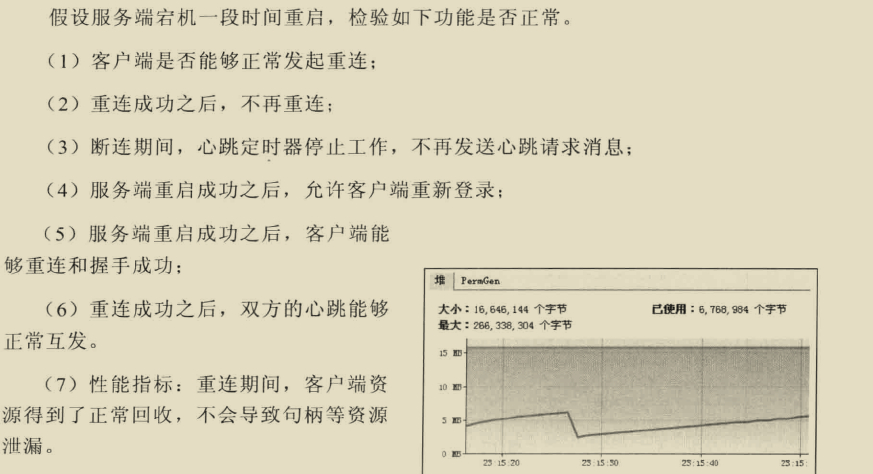


## 单元测试

通过 EmbeddedChannel 测试 Pipeline 的出站、入站。

| 操作            | 说明                                                                         |
|---------------|----------------------------------------------------------------------------|
| writeInbound  | 将入站消息写到EmbeddedChannel中。如果可以通过readInbound方法从EmbeddedChannel中读取数据，则返回true   |
| readInbound   | 从EmbeddedChannel中读取入站消息。任何返回东西都经过整个ChannelPipeline。如果没有任何可供读取的，则返回null     |
| writeOutbound | 将出站消息写到EmbeddedChannel中，如果现在可以通过readOutbound从EmbeddedChannel中读取到东西，则返回true |
| readOutbound  | 从EmbeddedChannel中读取出站消息。任何返回东西都经过整个ChannelPipeline。如果没有任何可供读取的，则返回null     |

```java
public class EmbeddedChannelTest {
    public void test() {
        EmbeddedChannel channel = new EmbeddedChannel(new FixedLengthFrameDecoder(3));
        channel.writeInbound(input.retain());
        channel.finish();

        ByteBuf read = channel.readInbound();
    }
}
```

```java
public class EmbeddedChannelTest {
    public void test() {
        EmbeddedChannel channel = new EmbeddedChannel(new AbsIntegerEncoder());
        channel.writeOutbound(buf);
        channel.finish();
        channel.readOutbound();
    }
}

```

## TCP粘包、拆包

TCP 是面向流的协议，是一串没有界限的数据， TCP
也不知道上层业务数据的具体含义，所以在数据分片时并不会按照上层业务数据的逻辑进行分片，而是根据实际情况大小进行分片，这样在业务上的一个完整数据可能被划分到多个分片里面，多个数据也可能被分到一个片里面，所以服务端一次读取到的字节数时不确定的。

如果客户端发送两个数据包 D1 和 D2 ，服务端读取到数据有以下情况：

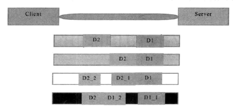

1. 服务端分别读取到两个独立的数据包。
2. 服务端一次读取两个数据包。
3. 服务端第一次读取到 D1 和 D2的部分内容，第二次读取到 D2 的剩余内容。
4. 服务端第一次读取到 D1 的部分内容，第二次读取到 D1 的剩余内容和D2。

TCP 分片的依据是 在三次握手的时候，在两端主机之间被计算得出的 最大消息长度（MSS）。

解决方案：

1. 消息定长，不够长使用填充。
2. 在包尾使用固定的分隔符分割，例如 换行符。
3. 将消息分为头部和消息体，头部中保存整个消息的长度，只有读取到足够长度的消息之后才算是读到了一个完整的消息。

## 内核参数调优

### 文件限制

系统级：当前系统可打开的最大数量，通过 `cat /proc/sys/fs/file-max` 查看
用户级：指定用户可打开的最大数量，通过 `cat /etc/security/limits.conf` 查看
进程级：单个进程可打开的最大数量，通过 `cat /proc/sys/fs/nr_open` 查看

### 网络端口限制

以下配置均在 `/etc/sysctl.conf` 文件中

最大追踪TCP连接数量:`net.ipv4.ip_conntrack_max=1024 65535`

本地端口范围：`net.ipv4.ip_local_port_range=20000`

### 内核参数优化

修改 `/etc/sysctl.conf` 。

```text
net.ipv4.ip_local_port_range = 1024 65536
net.core.rmem_max=16777216
net.core.wmem_max=16777216
net.ipv4.tcp_rmem=4096 87380 16777216
net.ipv4.tcp_wmem=4096 65536 16777216
net.ipv4.tcp_fin_timeout = 10
net.ipv4.tcp_tw_recycle = 1
net.ipv4.tcp_timestamps = 0
net.ipv4.tcp_window_scaling = 0
net.ipv4.tcp_sack = 0
net.core.netdev_max_backlog = 30000
net.ipv4.tcp_no_metrics_save=1
net.core.somaxconn = 262144
net.ipv4.tcp_syncookies = 0
net.ipv4.tcp_max_orphans = 262144
net.ipv4.tcp_max_syn_backlog = 262144
net.ipv4.tcp_synack_retries = 2
net.ipv4.tcp_syn_retries = 2
```

## 零拷贝

传统IO ： 4次数据拷贝 + 4 次上下文切换

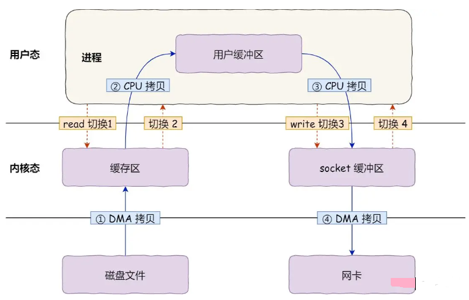

1. 操作系统零拷贝：

* `mmap/write`：三次数据复制（其中只有一次 CPU COPY）以及4次上下文切换(因为需要两个系统调用)，`mmap` 就是将不同的虚拟地址映射到同一个物理地址上。

  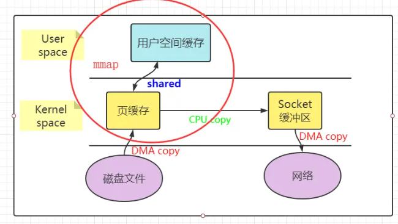
* `sendfile`：三次数据复制（其中只有一次 CPU COPY）以及2次上下文切换。

  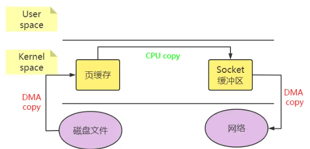
* 带有 `scatter/gather` 的 `sendfile`：只有两次数据复制（都是 DMA COPY）及 2 次上下文切换，直接将 Read Buffer 的内存地址、偏移量记录到相应的 Socket Buffer 中，本质是上就是使用相同的虚拟地址

  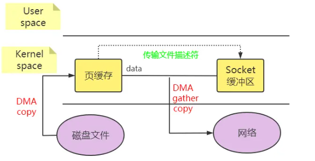

2. java 零拷贝：

* `FileChannel#transferTo`：优先使用 `sendfile` ，如果操作系统不支持再使用 `MappedByteBuffer` 。
* `MappedByteBuffer`：使用 `mmap` 技术映射到堆外内存。
* `DirectByteBuffer`：使用堆外内存，减少堆内外的数据拷贝。

3. Netty 零拷贝：

* Netty 提供了`CompositeByteBuf` 类, 它可以将多个 `ByteBuf` 合并为一个逻辑上的 `ByteBuf`, 避免合并多个`ByteBuf` 时各个 `ByteBuf` 之间的拷贝。
* 通过 `wrap` 操作, 我们可以将 `byte[]` 数组、`ByteBuf`、`ByteBuffer`等包装成一个 Netty ByteBuf 对象, 避免通过write api 产生的拷贝操作。
* `ByteBuf`支持`slice`操作, 因此可以将 `ByteBuf` 分解为多个共享同一个存储区域的 `ByteBuf`, 避免内存的拷贝。
* 通过 `FileRegion` 包装的`FileChannel.tranferTo` 实现文件传输。
