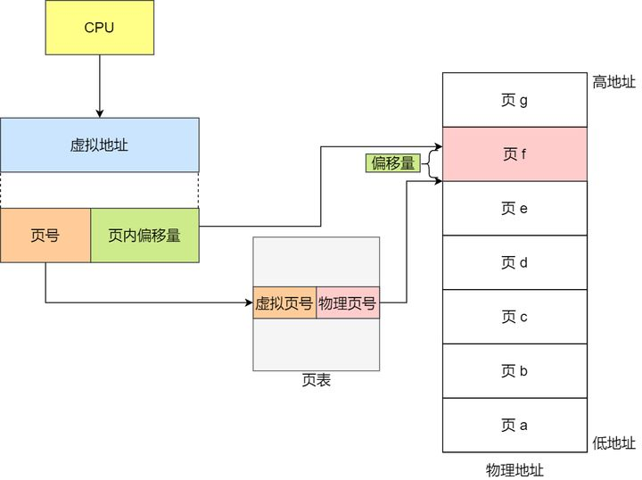
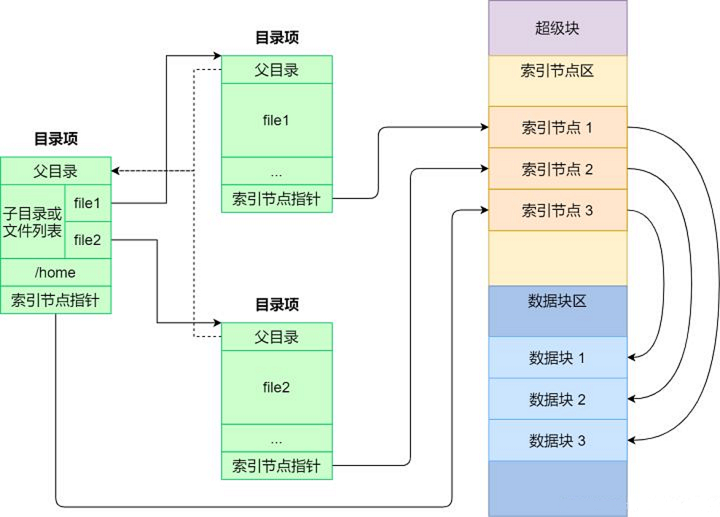
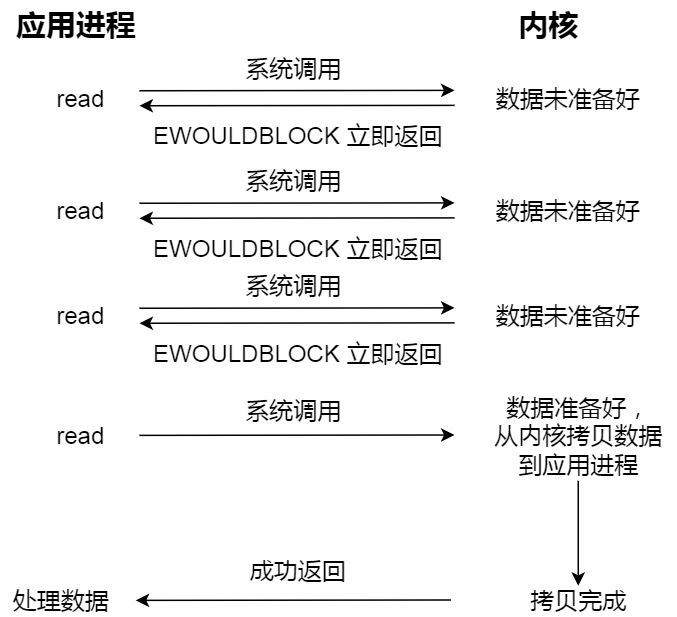

操作系统是管理计算机硬件的程序，还为应用程序提供基础，并且充当用户和计算机硬件的中介。操作系统可以看作资源分配器，负责分配CPU时间、内存空间、文件储存空间、IO设备等；同时也是控制程序，负责管理用户程序的执行。

# 计算机启动

1. BOIS

 * 当电源打开或重启时，会运行一个初始程序，即 BIOS，它位于计算机固件上，如只读内存(ROM，Read-Only Memory)。
 * BIOS 首先检查硬件能否满足运行的基本条件，叫硬件自检 即 POST，Power-On Self-Test。
 * 如果硬件出现问题，主板会发出不同含义的蜂鸣，启动中止。如果没有问题，屏幕就会显示出CPU、内存、硬盘等信息。
 * POST完成后，BIOS需要将控制权转交给下一阶段的启动程序，这时需要知道下一阶段启动程序具体存放的设备，BIOS根据外部储存设备的排序(Boot Sequence)，将控制权优先转交给排在前面的设备。

2. 主引导记录

 * BIOS 将控制权交给储存设备后，计算机读取该设备的第一个扇区，即 512 字节，如果最后两个字节是 `0x55` 和 `0xAA` ，表明设备可以启动，如果不是，控制权转交给启动顺序的下一个设备。
 * 前面512字节叫做 主引导记录，即MBR，Master boot record，由三部分组成：调用操作系统的机器码、分区表、签名（0x55和0xAA），它的作用是告诉计算机到硬盘的哪一个位置去找操作系统，将控制权转交给哪个区。
 * 分区表长度只有64字节，分为4项，每项16字节，所以一个硬盘最多只能分四个主分区。
 * 主分区的第一个字节标识该分区是否是激活分区（0x80），控制权要转交给激活分区，四个主分区里面只能有一个是激活的。
 * 最后四个字节决定主分区长度，所以一个主分区的扇区总数最多不超过2的32次方，也就是一个分区最大不超过2TB，如果想使用更大的硬盘，只有2个方法：一是提高每个扇区的字节数，二是增加扇区总数。

3. 硬盘启动：控制权就要转交给硬盘的某个分区了，分成三种情况：

 卷引导记录：

 * 四个主分区里面，只有一个是激活的。计算机会读取激活分区的第一个扇区，叫做卷引导记录（VBR，Volume boot record），它作用就是告诉计算机操作系统在这个分区里的位置，随后计算机就会加载操作系统。

 扩展分区和逻辑分区：

 * 随着硬盘变大，4个分区不够用，按照规定，有且有且仅有一个区可以被定义成扩展分区，即这个区里面又分成多个区，这种分区里的分区叫做逻辑分区。
 * 计算机先读取扩展分区的第一个扇区，叫做扩展引导记录（EBR，Extended boot record），它包含64字节的分区表，里面有两个分区项，一个是自己，一个是下一个逻辑分区的位置。
 * 若没有找到激活分区，计算机接着读取第二个逻辑分区的第一个扇区，以此类推，直到某个逻辑分区的分区表只包含它自身为止（即只有一个分区项）。因此，扩展分区可以包含无数个逻辑分区。
 * 但是，似乎很少通过这种方式启动操作系统。如果操作系统确实安装在扩展分区，一般采用下一种方式启动。

 启动管理器：

 * 计算机读取"主引导记录"前面446字节的机器码之后，不再把控制权转交给某一个分区，而是运行事先安装的"启动管理器"（boot loader），由用户选择启动哪一个操作系统。Linux环境中，目前最流行的启动管理器是Grub。

4. 操作系统

 * 控制权转交给操作系统后，操作系统的内核首先被载入内存。
 * 以Linux系统为例，先载入`/boot`目录下面的kernel。
 * 内核加载成功后，第一个运行的程序是`/sbin/init`。它根据配置文件（`/etc/initab`）产生init进程。这是Linux启动后的第一个进程，pid进程编号为1，其他进程都是它的后代。
 * 然后，init进程加载系统的各个模块，比如窗口程序和网络程序，直至执行`/bin/login`程序，跳出登录界面，等待用户输入用户名和密码。
 * init进程加载完成，系统就完成启动，开始等待事件的发生。

 现在linux不是使用init进程，而是使用`systemd`进程，进程id为1：
 * 在硬件驱动成功后，Kernel 会主动调用 `systemd` 程序，并以 `default.target` 流程开机。
 * `systemd` 执行 `sysinit.target` 初始化系统及 `basic.target` 准备操作系统。
 * `systemd` 启动 `multi-user.target` 下的本机与服务器服务。
 * `systemd` 执行 `multi-user.target` 下的 `/etc/rc.d/rc.local` 文件。
 * `systemd` 执行 `multi-user.target` 下的 `getty.target` 及登陆服务。
 * `systemd` 执行 `graphical` 需要的服务。

# 事件

事件发生通常通过硬件或软件的中断来产生，硬件可以随时通过系统总线发送信号到CPU，以触发中断，软件也可通过执行特别操作即系统调用，以触发中断，陷阱就是一种由软件生成的中断。 当CPU被中断时，它会停止正在做的事， 并立即转到中断服务程序的开始地址执行，等中断服务程序执行完成后，CPU重新执行被中断的计算。

# 模式

为保证操作系统的正确运行，必须区分操作系统代码和用户代码的执行，至少需要两种单独运行模式：用户模式、内核模式，将可能引起损害的机器指令作为特权指令，只有在内核模式下才允许执行。 运行模式通过计算机硬件的模式位来支持：内核模式（0），用户模式（1）。

# 定时器

为了防止用户程序陷入死循环或不调用系统服务并且不将控制返回给操作系统，可以使用定时器，在控制权交到用户之前，操作系统会使用定时器设置中断，当定时器中断时，控制权自动转到操作系统。

# 存储

1. 内存

 * CPU只能从内存中加载指令，因此执行程序必须位于内存，内存也称随机访问内存（RAM，Random Access Memory），除此之外还有 ROM 、寄存器、高速缓存等。
 * 所有形式的内存都提供字节数组，每个字节都有地址，操作特定内存地址通过 load 和 store 指令，load 指令将内存字节保存到CPU寄存器，store指令将寄存器保存到内存，除此之外，CPU还会自动加载内存指令以便执行。

2. 硬盘

 * 理想情况下，程序和数据都应永久驻留在内存中，但由于内存太少，不能永久保存所需要的程序和数据，同时内存是易失性设备，掉电会失掉所有内容，所以使用硬盘来永久储存大量数据。
 * 速度：寄存器 > 高速缓存 > 内存 > 固态硬盘 > 硬盘。

# IO

* 每个计算机系统都包含CPU和多个设备控制器，他们通过共同总线连一起，每个设备控制器管理某一特定类型的设备。
* 每个设备控制器维护一定量的本地缓冲存储和一组特定用途的寄存器，设备控制器负责在所控制的外围设备与本地缓冲存储之间进行数据传递。
* 操作系统为每个设备控制器提供一个驱动程序，驱动程序为操作系统其它部分提供统一的设备访问接口。

## 流程

1. 开始IO时，驱动程序加载设备控制器的寄存器，通过寄存器中内存，决定采取什么操作，如 从键盘中读取一个字符。
2. 控制器开始从设备向本地缓冲区传输数据，一旦数据传输完成，设备控制器会通过中断通知驱动程序。
3. 驱动程序返回控制到操作系统，对于读操作，数据或数据指针也会返回，而对于其他操作，驱动返回状态信息。

这种IO中断驱动适合移动少量数据，但像磁盘IO大量数据移动则采用DMA，Direct Memory Access 技术，驱动只需要为这种IO设备设置好缓冲、指针和计数器之后，设备控制器可在本地缓冲和内存之间整块数据传输，无需CPU干预，每块只产生一个中断，来告知驱动已完成，而不是像低速设备一样每个字节产生一个中断，当设备控制器执行这些操作时，CPU可以进行其他工作。

# 多道程序设计

操作系统在内存中同时保存多个任务，通过安排作业使得CPU总有一个作业执行，提高CPU利用率。

由于主存太小不能容纳所有作业，这些作业首先保存在磁盘的作业池，该作业池包含磁盘上的、等待分配内存的所有进程，内存的作业集为作业池的作业集的子集。

操作系统会从内存作业集中选择一个作业执行，该作业可能等待某个任务，比如IO，CPU会简单切到另一个作业，以便执行。

作业的取决CPU调度，有多少作业可以加载到内存取决于作业调度，内存同时保存多个程序需要一定形式的内存管理。

# 命令解释程序

命令解释程序会在一个任务开始或用户首次登陆时运行，对于具有多个可选命令解释程序的系统，解释程序被称为 shell 。

# 系统调用

系统调用分为六大类：

* 进程控制。
* 文件管理。
* 设备管理。
* 信息维护。
* 通信。
* 保护。

# 系统程序

系统程序为程序开发和执行提供了方便的环境，可分为这几类：

* 文件管理：文件创建、删除等。
* 状态信息：日期、注册表等。
* 文件修改：用于修改、查找文件内容。
* 程序语言支持：常用程序语言的编译程序、汇编程序、调试程序、解释程序。
* 程序加载与执行：程序一旦汇编或编译后，要加载到内存才能执行，系统提供绝对加载程序、重定位程序、链接编辑器、覆盖式加载程序等。
* 通信：提供进程、用户、计算机系统之间创建虚拟连接的机制。
* 后台服务。

# 进程管理

进程是大多数系统的工作单元。

## 进程内容

* 进行是执行中的程序，但不只是程序代码，程序代码被称为代码段。
* 进程还包括当前状态，比如程序计数器的值、寄存器的内容。
* 进程堆栈（函数参数、返回地址、局部变量）。
* 数据段（全局变量）。
* 还可能包含堆，这是进程运行时动态分配的内存。

## 进程状态

* `New`：进程正在创建。
* `Running`：指令正在执行。
* `Waiting`：进程等待发生某个事件（如I/O完成信号）。
* `Ready`：进程等待分配CPU。
* `Terminated`：进程完成执行。

## 进程控制块（PCB）

包含许多与某个进程相关的信息：

* 进程状态。
* 程序计数器。
* CPU寄存器。
* CPU调度信息：如进程优先级、调度队列指针等。
* 内存管理信息
* 记账信息：比如CPU时间、实际使用时间、时间期限等。
* IO状态信息：分配给进程的IO设备列表，打开文件列表等。

## 进程调度

进程执行在CPU执行和IO等待两个状态交替进行。

### 调度队列

进程在进入系统时，会被加到作业队列中，这个队列包括系统内的所有进程。驻留在内存中的、就绪的、等待运行的进程保存在就绪队列上。 新进程被加到就绪队列，它就在就绪队列中等待，直到被选中执行，当进程执行时，可能会发生以下事件：

* 进程可能发出IO请求，并被放到IO队列，当IO完成后会被重新放回到就绪队列。
* 进程可能创建一个新的子进程，并等待其终止后重新被放回到就绪队列。
* 进程可能由于中断被强制释放CPU，并被放回到就绪队列。

### 调度程序

调度程序分为长期调度程序、短期调度程序、中期调度程序。

对于批处理系统，提交进程多于可以立即执行的，这次进程被保存到大容量储存设备的缓存池，长期调度程序从该池中选择进程加入到内存以便执行。 短期调度程序从准备执行的进程中选择进程并分配CPU，执行频率较高，通常进程可能执行几毫秒就会等待IO请求，所以短期调度程序必须快速，UNIX或Windows分时系统通常没有长期调度程序。 有些操作系统还会引入中期调度程序，即将进程从内存（CPU竞争）中移除，从而降低多道程序程度，被称为swap，进程也可以被重新调入内存，并在中断处继续执行。

调度程序包含3个功能：

* 切换上下文。
* 切换到用户模式。
* 跳转到用户程序合适的位置，以便重新启动程序。

#### 上下文切换

切换CPU从一个进程到另外一个进程，需要保存当前进程状态和恢复另一个进程的状态（包括内核模式和用户模式），叫做上下文切换。

进行上下文切换时，内核会将旧进程状态保存在PCB中，然后加载新进程的上下文。

#### 抢占调度

需要进行CPU调度的情况：

1. 当一个进程从运行状态切换到等待状态：IO请求、wait()调用。
2. 当一个进程从运行状态切换到就绪状态：中断。
3. 当一个进程从等待状态切换到就绪状态：IO完成。
4. 当一个进程终止。

如果调度值发送1、4情况，则调度方案是非抢占的，否则称为抢占的。

### 调度算法

1. 先到先服务调度：非抢占式，平均等待时间较长。
2. 最短作业优先调度：平均等待时间最小，但难以知道下一次CPU执行的长度。
3. 优先级调度：主要问题是无穷阻塞，对于低优先级进程可能永远没有机会运行，解决办法是根据等待时间增加进程的优先级。
4. 轮转调度：抢占式，为每个进程分配不超过一个时间片的CPU，时间片大小通常为10~100ms，如果时间片太长退化成先到先服务调度，如果时间片太短就会有频繁的进行上下文切换。
5. 多级队列调度：进程通常分为前台进程和后台进程，算法将就绪队列分成多个单独队列。
6. 多级反馈队列调度：允许进程在不同优先级队列之间迁移，比如根据等待时间增加进程的优先级、根据进程预估运行时间确定优先级。

## 进程运行

进程创建：

进程执行过程中可能创建多个新的进程，创建的进程成为父进程，新的进程称为子进程，新进程可以再创建其他进程，从而形成进程树。

当进程创建新进程时，可能有两种执行情况：

* 父进程与子进程并发执行。
* 父进程等待，直到某个或全部子进程执行完，通过系统调用 `wait()` 。

新进程地址空间有两种可能：

* 子进程是父进程的复制品，具有和父进程同样的程序和数据，对于unix，通过系统调用`fork()`创建，允许父子进程通信，两个进程都继续执行处于系统调用`fork()`之后的命令。
* 子进程加载另一个新程序，对于unix，通过系统调用`exec()`创建，加载新程序到内存，并开始执行。

进程终止：

当进程完成执行，并通过系统调用`exit()`请求操作系统删除自身时，进程终止。

父进程终止子进程的原因：

* 子进程超过他所分配的资源。
* 分配给子进程的任务不再需要
* 父进程正在退出。

进程通信：

进程通信有两种模型：共享内存、消息传递。

消息传递对于交换少量数据很有用，因为无需避免冲突，共享内存可以快于消息传递，因为消息传递实现常采用系统调用，因此需要消耗更多时间以便内核介入，但共享内存只需要建立共享内存时系统调用。

## 线程

线程是CPU使用的基本单元，它包括 线程ID、程序计数器、寄存器、堆栈、另外还有一些同一进程的其他线程的共享代码段、数据段和其他操作系统资源。

线程分为用户级线程和内核级线程，内核线程由操作系统调度，用户线程由线程库来管理，内核并不知道它们，用户级线程为了运行在CPU上，最终应映射到相关的内核级线程。

那么为什么需要多线程？

1. 线程更加轻量级，创建和终止速度更快，且线程之间切换的速度会比进程切换更快。
2. 对于一些 I/O 密集型任务，多个线程允许这些并排执行，加快整体的速度。对于CPU密集型任务多线程没这个优势，因为本质上CPU同一时间只做一件事。
3. 线程间通信的效率会高于进程间通信。一般进程间通信需要内核介入，而同一进程内的线程间共享该进程的内存和文件，不需要调用内核就可以实现通信。

## 死锁

死锁条件：

* 互斥：资源一次只有一个进程可使用，如果另外一个进程申请该资源，那么申请进程应等到该资源释放为止。
* 占用并等待：一个进程占有至少一个资源，并等待另外一个资源，而该资源被其他进程占有。
* 非抢占：资源不能被剥夺抢占，只能被进程在完成任务后自愿释放。
* 循环等待：有一组等待进程{P0,P1,...,Pn},P0等待的资源为P1占有,...Pn等待的资源被P0占有。

预防死锁：确保至少一个必要条件不成立。

* 互斥条件必定成立。
* 持有并等待：有两种办法。
  1. 在执行前获得所有资源：资源利用率低，许多资源可能已分配但是很长时间没有被使用。
  2. 仅允许进程在没有资源时才可以申请资源，一个进程申请资源并使用后想要申请其他资源前必须释放现有分配资源：可能发生饥饿，有些进程可能一直获取不到资源。
* 非抢占：如果一个进程持有资源并申请另一个不能立即分配的资源，该进程释放最初占有的资源。
* 循环等待：对系统中所有资源统一编号，进程在任何时刻申请资源，必须按照资源编号顺序提交申请。

避免死锁：

* 有序资源分配：
  1. 对所必须使用的而且属于同一类的所有资源，必须一次申请完。
  2. 在申请不同类资源时，按资源编号顺序提交申请。
* 银行家算法。

死锁检测：如果一个系统既不采用死锁预防算法也不实用死锁避免算法，这时可以：

* 一个用来检测系统是否出现死锁的算法。
* 一个用来从死锁状态恢复的算法。

# 内存管理

CPU 可以直接访问的通用储存只有内存和寄存器。如果数据不再内存中，那么CPU使用之前先把数据移到内存中。

对于寄存器的访问通常可以在一个时钟周期，完成内存的访问可能需要多个时钟周期，由于没有数据以便完成正在执行的指令，CPU通常需要暂停，所以在CPU和内存之间，在CPU芯片上增加高速缓存来解决这种情况。
除了解决速度问题，还需要保护操作系统不会被用户访问，在多用户系统上，还应保护用户进程不会互相影响。

为确保每个进程有单独的内存空间，使用两个寄存器来确定进程的合法地址的范围：

* 基地址寄存器：最小的合法物理内存地址。
* 界限寄存器：合法地址的长度，如基地址为 300040 ,界限为 120900，那么访问范围为 [300040,420939]

内存空间的保护是通过CPU硬件对用户模式下产生的地址与寄存器地址比较来完成的。

## 地址绑定

* 编译时：如果在编译时就已知道内存中的驻留地址，那么可以生成绝对代码。
* 加载时：如果编译时不知道进程将驻留在何处，那么编译器就生成可重定位代码，这种情况下会到加载时根据开始地址确定。
* 执行时：如果进程在执行时可以从一个内存段移到另一个内存段，那么绑定需要到执行时才进行。

## 逻辑地址、物理地址

CPU生成的地址为逻辑地址，加载到内存地址寄存器的地址为物理地址，从逻辑地址到物理地址的运行时映射是有内存管理单元（MMU）来完成。

MMU 通过内存分段、内存分页来管理虚拟地址和物理地址。

### 分段

分段机制下的虚拟地址由两部分组成，段选择因子和段内偏移量。
* 段选择因子就保存在段寄存器里面。段选择子里面最重要的是段号，用作段表的索引。段表里面保存的是这个段的基地址、段的界限和特权等级等。
* 虚拟地址中的段内偏移量应该位于 0 和段界限之间，如果段内偏移量是合法的，就将段基地址加上段内偏移量得到物理内存地址。

虚拟地址是通过段表与物理地址进行映射的，分段机制会把程序的虚拟地址分成 4 个段，每个段在段表中有一个项，在这一项找到段的基地址，再加上偏移量，于是就能找到物理内存中的地址

分段机制会存在两个问题：

1. 内存碎片

例如：假设有 1G 的物理内存，用户执行了多个程序，其中：
* 游戏占用了 512MB 内存。
* 浏览器占用了 128MB 内存。
* 音乐占用了 256 MB 内存。
这个时候，如果我们关闭了浏览器，则空闲内存还有 1024 - 512 - 256 = 256MB。
如果这个 256MB 不是连续的，被分成了两段 128 MB 内存，这就会导致没有空间再打开一个 200MB 的程序。

解决内存碎片的办法就是内存交换，如上面例子 可以把音乐程序占用的那 256MB 内存写到硬盘上，然后再从硬盘上读回来到内存里。不过再读回的时候，我们不能装载回原来的位置，而是紧紧跟着那已经被占用了的 512MB 内存后面。这样就能空缺出连续的 256MB 空间，于是新的 200MB 程序就可以装载进来。

2. 内存交换效率低：如果内存交换的时候，交换的是一个占内存空间很大的程序，这样整个机器都会显得卡顿。

### 分页

解决内存分段的内存碎片和内存交换效率低的问题。

分页是把整个虚拟和物理内存空间切成一段段固定尺寸的大小。在 Linux 下，每一页的大小为 4KB。虚拟地址与物理地址之间通过页表来映射。

CPU 通过MMU在页表中查找实际要访问的物理内存地址，当进程访问的虚拟地址在页表中查不到时，系统会产生一个缺页异常，进入系统内核空间分配物理内存、更新进程页表，最后再返回用户空间，恢复进程的运行。

在分页机制下，虚拟地址分为两部分，页号和页内偏移。页号作为页表的索引，页表包含物理页每页所在物理内存的基地址，这个基地址与页内偏移的组合就形成了物理内存地址。

在实际操作系统中，页表可能非常庞大，比如4GB空间可能就有100万页，需要4MB内存储存，每个进程一个页表，如果有100个进程，就需要400MB内存储存，极大的消耗内存空间，所以采用多级页表的方式缩减空间。

一级页表就可以覆盖整个 4GB 虚拟地址空间，但如果某个一级页表的页表项没有被用到，也就不需要创建这个页表项对应的二级页表了，即可以在需要时才创建二级页表。

对于 64 位的系统，两级分页肯定不够了，就变成了四级目录，分别是：

* 全局页目录项 PGD（Page Global Directory）。
* 上层页目录项 PUD（Page Upper Directory）。
* 中间页目录项 PMD（Page Middle Directory）。
* 页表项 PTE（Page Table Entry）。

多级页表虽然解决了空间上的问题，但也带来了时间上的开销。由于程序是有局部性的，即在一段时间内，整个程序的执行仅限于程序中的某一部分。利用这一特性在CPU中，加入程序最常访问的页表项的 Cache，叫做 TLB，也叫做页表缓存、转址旁路缓存、快表等。

 CPU 在寻址时，会先查 TLB，如果没找到，才会继续查常规的页表。

### 段页式管理

先将程序划分为多个有逻辑意义的段，再把每个段划分为多个页。

地址结构就由段号、段内页号和页内位移三部分组成。

段页式地址变换中要得到物理地址须经过三次内存访问：

* 第一次访问段表，得到页表起始地址。
* 第二次访问页表，得到物理页号。
* 第三次将物理页号与页内位移组合，得到物理地址。

### linux 内存管理

Intel CPU内存管理方式：段式内存管理先将逻辑地址映射成线性地址，然后再由页式内存管理将线性地址映射成物理地址。

linux 内存主要采用的是页式内存管理，但 Intel 处理器发展历史导致不可避免地涉及了段机制，liunx 采取的办法是使段式映射不起作用:

Linux 系统中的每个段都是从 0 地址开始的整个 4GB 虚拟空间（32 位环境下），也就是所有的段的起始地址都是一样的,逻辑地址 = 段偏移地址 = 线性地址，这种做法相当于屏蔽了处理器中的逻辑地址概念，段只被用于访问控制和内存保护。

虚拟地址空间被分为 内核空间和用户空间，对于不同位数系统，地址空间范围不同：

* 32 位系统的内核空间占用 1G，位于最高处，剩下的 3G 是用户空间。
* 64 位系统的内核空间和用户空间都是 128T，分别占据整个内存空间的最高和最低处，剩下的中间部分是未定义的。

用户空间内存，从低到高分别是 7 种不同的内存段：

1. 程序文件段，包括二进制可执行代码。
2. 已初始化数据段，包括静态常量。
3. 未初始化数据段，包括未初始化的静态变量。
4. 堆段，包括动态分配的内存，从低地址开始向上增长。
5. 文件映射段，包括动态库、共享内存等，从低地址开始向上增长（跟硬件和内核版本有关）。
6. 栈段，包括局部变量和函数调用的上下文等。栈的大小是固定的，一般是 8 MB。当然系统也提供了参数，以便我们自定义大小。

其中 堆和文件映射段的内存是动态分配的。

# 文件系统

文件系统的基本数据单位是文件，它的目的是对磁盘上的文件进行组织管理，那组织的方式不同，就会形成不同的文件系统。

Linux 文件系统会为每个文件分配两个数据结构：索引节点（index node）和目录项（directory entry），它们主要用来记录文件的元信息和目录层次结构。

* 索引节点，也就是 inode，用来记录文件的元信息，比如 inode 编号、文件大小、访问权限、创建时间、修改时间、最重要的是包含指向数据块的指针等等。索引节点是文件的唯一标识，它们之间一一对应，也同样都会被存储在硬盘中，所以索引节点同样占用磁盘空间。
* 目录项，也就是 dentry，用来记录文件的名字、索引节点指针以及与其他目录项的层级关联关系。多个目录项关联起来，就会形成目录结构，但它与索引节点不同的是，目录项是由内核维护的一个数据结构，不存放于磁盘，而是缓存在内存。

由于索引节点唯一标识一个文件，而目录项记录着文件的名，所以目录项和索引节点的关系是多对一，也就是说，一个文件可以有多个别名。比如，硬链接的实现就是多个目录项中的索引节点指向同一个文件。

磁盘进行格式化的时候，会被分成三个存储区域，分别是超级块、索引节点区和数据块区。
* 超级块，用来存储文件系统的详细信息，比如块个数、块大小、空闲块等等。
* 索引节点区，用来存储索引节点。
* 数据块区，用来存储文件或目录数据。

## 索引节点

索引节点是存储在硬盘上的数据，那么为了加速文件的访问，通常会把索引节点加载到内存中。

我们不可能把超级块和索引节点区全部加载到内存，，它们加载进内存的时机是不同的：

* 超级块：当文件系统挂载时进入内存。
* 索引节点区：当文件被访问时进入内存。

## 目录项

目录项和目录不是一个东西，目录是个文件，持久化存储在磁盘，而目录项是内核一个数据结构，缓存在内存。目录项不只是表示目录，也是可以表示文件。

如果查询目录频繁从磁盘读，效率会很低，所以内核会把已经读过的目录用目录项这个数据结构缓存在内存，下次再次读到相同的目录时，只需从内存读就可以，大大提高了文件系统的效率。

## 目录

目录也是文件，也是用索引节点唯一标识，和普通文件不同的是，普通文件在磁盘里面保存的是文件数据，而目录文件在磁盘里面保存子目录或文件数据，比如inode、文件名。

## 扇区

磁盘读写的最小单位是扇区，扇区的大小只有 512B 大小，很明显，如果每次读写都以这么小为单位，那这读写的效率会非常低。

## 块

文件系统把多个扇区组成了一个逻辑块，每次读写的最小单位就是逻辑块（数据块），Linux 中的逻辑块大小为 4KB，也就是一次性读写 8 个扇区，这将大大提高了磁盘的读写的效率。

## 虚拟文件系统

文件系统的种类众多，而操作系统希望对用户提供一个统一的接口，于是在用户层与文件系统层引入了中间层，这个中间层就称为虚拟文件系统（Virtual File System，VFS）。

Linux支持的文件系统主要分为三类：

* 磁盘的文件系统：直接把数据存储在磁盘中，比如 Ext 2/3/4、XFS 等都是这类文件系统。
* 内存的文件系统：数据不是存储在硬盘上，而是占用内存空间，我们经常用到的 /proc 和 /sys 文件系统都属于这一类，读写这类文件，实际上是读写内核中相关的数据。
* 网络的文件系统：用来访问其他计算机主机数据的文件系统，比如 NFS、SMB 等等。

文件系统首先要先挂载到某个目录才可以正常使用，比如 Linux 系统在启动时，会把文件系统挂载到根目录。

## 文件的使用

通过系统调用来打开一个文件：

我们打开一个文件后，操作系统会跟踪进程打开的所有文件，所谓的跟踪呢，就是操作系统为每个进程维护一个打开文件表，文件表里的每一项代表「文件描述符」，所以说文件描述符是打开文件的标识。

打开文件表信息：

* 文件指针：系统跟踪上次读写位置作为当前文件位置指针，这种指针对打开文件的某个进程来说是唯一的。
* 文件打开计数器：当一个进程打开文件时，会将该值加1，关闭时-1，由于多个进程可能打开同一个文件，所以系统在删除打开文件条目之前，必须等待最后一个进程关闭文件，当该计数为 0 时，系统关闭文件，删除该条目。
* 文件磁盘位置：绝大多数文件操作都要求系统修改文件数据，该信息保存在内存中，以免每个操作都从磁盘中读取。
* 访问权限：每个进程打开文件都需要有一个访问模式（创建、只读、读写、添加等），该信息保存在进程的打开文件表中，以便操作系统能允许或拒绝之后的 I/O 请求。

在用户视角里，文件就是一个持久化的数据结构，但操作系统并不会关心你想存在磁盘上的任何的数据结构，操作系统的视角是如何把文件数据和磁盘块对应起来。用户习惯以字节的方式读写文件，而操作系统则是以数据块来读写文件，文件系统用来屏蔽掉这种差异，例如：

* 当用户进程从文件读取 1 个字节大小的数据时，文件系统则需要获取字节所在的数据块，再返回数据块对应的用户进程所需的数据部分。
* 当用户进程把 1 个字节大小的数据写进文件时，文件系统则找到需要写入数据的数据块的位置，然后修改数据块中对应的部分，最后再把数据块写回磁盘。

## 文件的存储

分为两种方式存放：

* 连续空间存放方式。
* 非连续空间存放方式：又分为 链表方式 和索引方式。

### 连续空间存放方式

文件存放在磁盘连续的物理空间中，文件的数据都是紧密相连，读写效率很高，因为一次磁盘寻道就可以读出整个文件。

使用连续存放的方式有一个前提，必须先知道一个文件的大小，这样文件系统才会根据文件的大小在磁盘上找到一块连续的空间分配给文件，所以文件头里需要指定 起始块的位置 和 长度。

连续空间存放的方式虽然读写效率高，但是有 磁盘空间碎片 和 文件长度不易扩展 的缺陷。

### 非连续空间存放方式

#### 链表方式

链表的方式存放是离散的，不用连续的，可以消除磁盘碎片提高磁盘空间的利用率，同时文件的长度可以动态扩展，链表方式又分为 隐式链表 和 显式链接。

##### 隐式链表

实现的方式是文件头要包含第一块和最后一块的位置，并且每个数据块里面留出一个指针空间，用来存放下一个数据块的位置。

缺点：

* 无法直接访问数据块，只能通过指针顺序访问文件。
* 数据块指针消耗了一定的存储空间。
* 稳定性较差，系统在运行过程中由于软件或者硬件错误导致链表中的指针丢失或损坏，会导致文件数据的丢失。

##### 显式链接

在隐式链表基础上，把用于链接文件各数据块的指针，显式地存放在内存的一张链接表中（叫做 文件分配表），该表在整个磁盘仅设置一张，每个表项中存放链接指针，指向下一个数据块号。

由于查找记录的过程是在内存中进行的，因而不仅显著地提高了检索速度，而且大大减少了访问磁盘的次数。但也正是整个表都存放在内存中的关系，它的主要的缺点是不适用于大磁盘，例如：

对于 200GB 的磁盘和 1KB 大小的块，这张表需要有 2 亿项，每一项对应于这 2 亿个磁盘块中的一个块，每项如果需要 4 个字节，那这张表要占用 800MB 内存，很显然 FAT 方案对于大磁盘而言不太合适。

#### 索引方式

索引可以解决 链表的方式 不能支持有效直接访问的问题。

索引的实现是为每个文件创建一个索引数据块，里面存放的是指向文件数据块的指针列表。

优点：
 * 文件的创建、增大、缩小很方便。
 * 不会有碎片的问题。
 * 支持顺序读写和随机读写。

如果文件很大，大到一个索引数据块放不下索引信息，这时有两种方式处理：

* 链式索引：链表 + 索引

* 多级索引：索引 + 索引

## unix文件的实现

它是根据文件的大小，存放的方式会有所变化：

* 如果存放文件所需的数据块小于 10 块，则采用直接查找的方式。
* 如果存放文件所需的数据块超过 10 块，则采用一级间接索引方式。
* 如果前面两种方式都不够存放大文件，则采用二级间接索引方式。
* 如果二级间接索引也不够存放大文件，这采用三级间接索引方式。

那么，文件头（Inode）就需要包含 13 个指针：灵活地支持小文件和大文件的存放。
- 10 个指向数据块的指针。
- 第 11 个指向索引块的指针。
- 第 12 个指向二级索引块的指针。
- 第 13 个指向三级索引块的指针。

这种方案用在Linux Ext 2/3 文件系统里，虽然解决大文件的存储，但是对于大文件的访问，需要大量的查询，效率比较低。

## 空闲空间管理

### 空闲表法

为所有空闲空间建立一张表，表内容包括空闲区的第一个块号和该空闲区的块个数，注意，这个方式是连续分配的。

当请求分配磁盘空间时，系统依次扫描空闲表里的内容，直到找到一个合适的空闲区域为止。
当用户撤销一个文件时，系统回收文件空间，也需顺序扫描空闲表，寻找一个空闲表条目并将释放空间的第一个物理块号及它占用的块数填到这个条目中。

### 空闲链表法

使用链表的方式来管理空闲空间，每一个空闲块里有一个指针指向下一个空闲块.

当创建文件需要一块或几块时，就从链头上依次取下一块或几块。
当回收空间时，把这些空闲块依次接到链头上。

优缺点：其特点是简单，只要在主存中保存一个指针，令它指向第一个空闲块，但不能随机访问，工作效率低，因为每当在链上增加或移动空闲块时需要做很多 I/O 操作，同时数据块的指针消耗了一定的存储空间。

空闲表法和空闲链表法都不适合用于大型文件系统，因为这会使空闲表或空闲链表太大。

### 位图法

当值为 0 时，表示对应的盘块空闲，值为 1 时，表示对应的盘块已分配。它形式如下：

`1111110011111110001110110111111100111`

在 Linux 文件系统就采用了位图的方式来管理空闲空间，不仅用于数据空闲块的管理，还用于 inode 空闲块的管理，因为 inode 也是存储在磁盘的，自然也要有对其管理。

## 目录的存储

目录也是文件，普通文件的块里面保存的是文件数据，而目录文件的块里面保存的是目录里面一项一项的文件信息。列表中每一项就代表该目录下的文件的文件名和对应的 inode，通过这个 inode，就可以找到真正的文件。

通常，第一项是 .，表示当前目录，第二项是 .. ，表示上一级目录，接下来就是一项一项的文件名和 inode。

如果一个目录有超级多的文件，我们要想在这个目录下找文件，按照列表一项一项的找，效率就不高：
于是，保存目录的格式改成哈希表，对文件名进行哈希计算，把哈希值保存起来，如果我们要查找一个目录下面的文件名，可以通过名称取哈希。如果哈希能够匹配上，就说明这个文件的信息在相应的块里面。

另外，目录查询是通过在磁盘上反复搜索完成，需要不断地进行 I/O 操作，开销较大。所以，为了减少 I/O 操作，把当前使用的文件目录缓存在内存，以后要使用该文件时只要在内存中操作，从而降低了磁盘操作次数，提高了文件系统的访问速度。

## 软链接和硬链接

 Linux 中可以通过硬链接（Hard Link） 和软链接（Symbolic Link） 的方式来给某个文件取个别名，它们都是比较特殊的文件，但是实现方式也是不相同的。

### 硬链接

* 硬链接是多个目录项中的 索引节点 指向一个文件，也就是指向同一个 inode。
* 由于多个目录项都是指向一个 inode，那么只有删除文件的所有硬链接以及源文件时，系统才会彻底删除该文件。
* 由于 inode 是不可能跨越文件系统的，每个文件系统都有各自的 inode 数据结构和列表，所以硬链接是不可用于跨文件系统的。

创建一个新的文件名，关联到inode上，并不会新增inode，当任意一个文件名删除时，inode和数据依然存在，只有当所有文件名删除时，数据才会真正删除，硬链接的好处就是安全，只支持文件，不支持目录。

 ### 软链接

 

* 软链接相当于重新创建一个文件，这个文件有独立的 inode。
* 但是这个文件的内容是另外一个文件的路径，所以访问软链接的时候，实际上相当于访问到了另外一个文件。
* 所以软链接是可以跨文件系统的，甚至目标文件被删除了，链接文件还是在的，只不过指向的文件找不到了而已。

相当于windows快捷方式，会创建一个新的文件，使用新的innode和数据块，数据库块中储存链接文件的文件名，，根据文件名链接到正确的目录去取得目标文件的 inode ，最终读取正确的数据，如果目标文件删除，链接文件也会找不到文件。

## 文件IO

常见的IO分为：

* 缓冲与非缓冲 I/O
* 直接与非直接 I/O
* 阻塞与非阻塞 I/O
* 同步与异步 I/O

I/O 是分为两个过程的：
1. 数据准备的过程。
2. 数据从内核空间拷贝到用户进程缓冲区的过程。

阻塞 I/O 会阻塞在 过程 1  和 过程 2 ，而非阻塞 I/O 和基于非阻塞 I/O 的多路复用只会阻塞在 过程 2 ，所以这三个都可以认为是同步 I/O。
异步 I/O 过程 1  和 过程 2 都不会阻塞。

### 缓冲与非缓冲 I/O

是否利用标准库缓冲。

* 缓冲 I/O：利用的是标准库的缓存实现文件的加速访问，而标准库再通过系统调用访问文件。
* 非缓冲 I/O：直接通过系统调用访问文件，不经过标准库缓存。

缓冲特指标准库内部实现的缓冲，比如：
很多程序遇到换行时才真正输出，而换行前的内容，其实就是被标准库暂时缓存了起来，这样做的目的是，减少系统调用的次数，毕竟系统调用是有 CPU 上下文切换的开销的。

### 直接与非直接 I/O

否利用操作系统的缓存，在系统调用函数时，指定了 O_DIRECT 标志，则表示使用直接 I/O。如果没有设置过，默认使用的是非直接 I/O。

* 直接 I/O：不会发生内核缓存和用户程序之间数据复制，而是直接经过文件系统访问磁盘。
* 非直接 I/O：读操作时，数据从内核缓存中拷贝给用户程序，写操作时，数据从用户程序拷贝给内核缓存，再由内核决定什么时候写入数据到磁盘。

触发数据写入磁盘的时机：
* 在调用 write 的最后，当发现内核缓存的数据太多的时候，内核会把数据写到磁盘上。
* 用户主动调用 sync，内核缓存会刷到磁盘上。
* 当内存十分紧张，无法再分配页面时，也会把内核缓存的数据刷到磁盘上。
* 内核缓存的数据的缓存时间超过某个时间时，也会把数据刷到磁盘上。

### 阻塞与非阻塞 I/O

访问管道或 socket 时，如果设置了 O_NONBLOCK 标志，那么就表示使用的是非阻塞 I/O 的方式访问，而不做任何设置的话，默认是阻塞 I/O。

* 阻塞IO：当用户程序执行 read ，线程会被阻塞，一直等到内核数据准备好，并把数据从内核缓冲区拷贝到应用程序的缓冲区中，当拷贝过程完成，read 才会返回。

阻塞等待的是 内核数据准备好 和 数据从内核态拷贝到用户态 这两个过程。

* 非阻塞IO：非阻塞的 read 请求在数据未准备好的情况下立即返回，可以继续往下执行，此时应用程序不断轮询内核，直到数据准备好，内核将数据拷贝到应用程序缓冲区，read 调用才可以获取到结果。

最后一次 read 调用，获取数据的过程，需要等待内核态的数据拷贝到用户程序的缓存区。

* 非阻塞IO多路复用：通过IO事件分发，当内核数据准备好时，再以事件通知应用程序处理，如select、poll。

无论哪种方式在 read 调用时，内核将数据从内核空间拷贝到应用程序空间，过程都是需要等待的，也就是说这个过程是同步的，如果内核实现的拷贝效率不高，read 调用就会在这个同步过程中等待比较长的时间。

### 同步与异步 I/O

上面的三种方式都属于同步IO，异步 I/O 是 内核数据准备 和 数据从内核态拷贝到用户态 这两个过程都不用等待。

