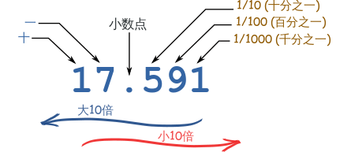

## 前言

二进制是计算技术中广泛采用的一种数制。二进制数据是用0和1两个数码来表示的数。进位规则是“逢二进一”，借位规则是“借一当二”，所以我们称他的基数为2。

## 十进制

讲二进制数之前，先讲一下十进制。

在一个十制进数里，每个数字都有一个“位置”，而小数点告诉我们每个位置是什么。

小数点*左边*是“单位”的位置。向左过去，每一个位置大10倍，而向右每一个位置小10倍：

<div style="text-align: center"></div>

所以我们称它的基数是10。

十进制有10个符号（0、1、2、3、4、5、6、7、8 和 9），但有趣的是：没有“十”的符号。“10”，实际上已经完成了进位。

十进制的产生可能和人的手指有十个有关系，跟符合人的逻辑思维。但是并非说一定要使用10作为基数，可以使用任何数字作为基数，唯一的区别就在于进位的时机，如果以5作为基数，小数点往左一个位置，每个位置大5倍，则如果我们要表示 十进制数6，结果为五进制11（个位1+十位1*5）。

## 二进制

通过前面对十进制的介绍，我们可以看出，十进制中的基数10其实是人为规定，并非是一成不变的。这里我们讨论一种特殊的基数，基数为2，称为二进制。二进制广泛应用计算机领域。

为什么计算机要使用二进制，而不是使用我们人类更加熟悉的十进制呢？因为计算机没有10根手指，通过前面对十进制的介绍我们知道，10进制需要10个符号，如果计算机使用10进制，也意味着计算机需要找到10种电路状态来表示这10个符号，这样的设计显然过于复杂。而使用二进制需要多少种符号呢？答案是2种，在电子计算机中找到2种电路状态来表示这两种符号相当容易，例如电路的开和关。所以电子管的两种状态决定了以电子管为基础的电子计算机采用二进制来表示数字和数据。

二进制数以2作为基数，它总共有两个符号（0和1），当从0开始数，数到1，再往后数，没有符号了，向前进位所以2的二进制表示为10，小数点往左一个位置，每个位置大2倍。

## 十六进制

下面我们来介绍计算机中另外一种常用的计数系统，十六进制（简写为hex），一般使用0x作为前缀来表示，例如0xFF。

十六进制是什么？按照前面可以推导出来，16进制就是以16为基数，拥有16种符号，小数点往左一个位置就大16倍的一种计数系统。这个时候可能朋友们就会问，我们十进制只有10种符号，剩下的6种符号从哪里来呢？原来十六进制规定使用英文字母（“A”、“B”、“C”、“D”、“E”、“F”）来表示十进制数 10 到 15，这样我们就可以使用十六进制了。

然而我们为什么要使用16进制呢？刚刚介绍二进制的时候我们说到计算机不使用十进制是因为计算机没有10根手指，无法表达10种状态，难道没法表示10种状态16种状态就可以表示了吗？那不是相比起10进制计算机更加复杂了。说到这里又要说回二进制，在二进制中小数点往左一个位置，每个位置大2倍，如果说小数点往左4个位置呢，每个位置大多少呢？大（2^4=16）倍。由此可见即使十六进制在计算机中也不需要用16种符号表示，只需要将4位2进制数合在一起就可以表示16进制，那么十六进制的二进制符号就是0000->1111，总共包含15种符号，用来表示十进制符号的0->15。

## 计算机储存单位

在十进制中我们使用个位、十位、百位来储存数字，在二进制使用bit（比特、位）来代替个位、十位来储存数字，一个bit可以想象成是一个电子管，拥有开关两种状态来储存0和1。

计算机存储信息的最小的存储单位是bit，存放一位二进制数，即 0 或 1。而计算机最常用的储存单位是byte（字节），1个byte包含8个二进制bit。

除了这两种单位还有大家熟悉的 KB，MB，GB，TB等等，他们之间的进率是1024。

## 进制转换

N进制转换成十进制公式如下：

N进制的基数就能表示为：0、1、2、……、N-2、N-1

N进制的权一般可以表示：[X就是某数在它的数字中所处位置]

N进制展开成十进制公式：如

$$
abcdefg.hijk = a*N^6+b*N^5+c*N^4+d*N^3+e*N^2+f*N^1+g*N^0+h*N^{-1}+i*N^{-2}+j*N^{-3}+k*N^{-4}
$$

对于2进制，N=2；16进制，N=16。

十进制转换成N进制使用基数除法：

1）给定的十进制整数除以基数N，余数便是N进制的最低位。

2）将上一步的商再除以基数N，余数便是等值的N进制的次低位。

3）重复步骤2，直到最后所得的商等于0为止。各次除得的余数，便是N进制各位的数，最后一次的余数是最高位

例如将十进制数115转换成2进制和16进制，如图：

<div style="text-align: center"></div>

## 数据类型

java中支持8种基本数据类型，byte（字节型）、short（短整型）、int（整型）、long（长整型）、float（单精度浮点型）、double（双精度浮点型）、boolean（布尔型）、char（字符型）。如下表所示：


| 序号 | 数据类型 |    储存大小    |  封装类  | 默认值                          | 可表示数据范围                           |
| :--: | :------: | :-------------: | :-------: | :------------------------------ | :--------------------------------------- |
|  1  |   byte   | 8-bit（1字节） |   Byte   | (byte)0                         | -128~127                                 |
|  2  |  short  | 16-bit（2字节） |   Short   | (short)0                        | -32768~32767                             |
|  3  |   int   | 32-bit（4字节） |  Integer  | 0                               | -2147483648~2147483647                   |
|  4  |   long   | 64-bit（8字节） |   Long   | 0L                              | -9223372036854775808~9223372036854775807 |
|  5  |  float  | 32-bit（4字节） |   Float   | 0.0F                            | 1.4E-45~3.4028235E38                     |
|  6  |  double  | 64-bit（8字节） |  Double  | 0.0D                            | 4.9E-324~1.7976931348623157E308          |
|  7  | boolean |                |  Boolean  | flase                           | true或false                              |
|  8  |   char   | 16-bit（2字节） | Character | '\u0000'（对应数字0，输出为空） | 0~65535                                  |

64位程序C语言整型数据类型的取值范围如下所示：


| **C数据类型** | **字节数** |        **最小值**        |        **最大值**        |
| :------------: | :--------: | :----------------------: | :----------------------: |
|  signed char  |     1     |           -128           |           127           |
| unsigned char |     1     |            0            |           255           |
|     short     |     2     |          -32768          |          32767          |
| unsigned short |     2     |            0            |          65535          |
|      int      |     4     |      -21 4748 3648      |       21 4748 3648       |
|  unsigned int  |     4     |            0            |       42 9496 7295       |
|      long      |     8     | -922 3372 0368 5477 5808 | 922 3372 0368 5477 5807 |
| unsigned long |     8     |            0            | 1844 6744 0737 0955 1615 |
|    int32_t    |     4     |      -21 4748 3648      |       21 4748 3648       |
|    uint32_t    |     4     |            0            |       42 9496 7295       |
|    int64_t    |     8     | -922 3372 0368 5477 5808 | 922 3372 0368 5477 5807 |
|    uint64_t    |     8     |            0            | 1844 6744 0737 0955 1615 |

C和C++都支持无符号数和有符号数，Java只支持有符号数。

有符号数针对于二进制来讲，用最高位作为符号位，“0”代表“+”，“1”代表“-” ；其余数位用作数值位，代表数值。

## 有符号编码

学习编码之前先讲一下机器数和真值：

机器数是一个数在计算机中二进制表示形式。机器数是带符号的，在计算机用一个数的最高位存放符号, 正数为0, 负数为1。

比如，十进制中的数 +3 ，计算机字长为8位，转换成二进制就是00000011。如果是 -3 ，就是 10000011 。

那么，这里的 00000011 和 10000011 就是机器数。

因为第一位是符号位，所以机器数的形式值就不等于真正的数值。例如上面的有符号数 10000011，其最高位1代表负，其真正数值是 -3 而不是形式值131（10000011转换成十进制等于131）。所以，为区别起见，将带符号位的机器数对应的真正数值称为机器数的真值。

例：0000 0001的真值 = +000 0001 = +1，1000 0001的真值 = –000 0001 = –1

我们可以将有符号数的定义归纳一下 有符号数 就是 符号位加上真值的绝对值，我们称这种表达方式为 原码，比如如果是8位二进制:

> [+1]原 = 0000 0001
>
> [-1]原 = 1000 0001

第一位是符号位. 因为第一位是符号位, 所以8位二进制数的取值范围就是:

> [1111 1111 , 0111 1111]

即

> [-127 , 127]

原码是人脑最容易理解和计算的表示方式。由于人脑可以知道第一位是符号位, 在计算的时候我们会根据符号位, 选择对真值区域的加减,做完计算之后再加上符号位。但是对于计算机, 加减乘数已经是最基础的运算, 要设计的尽量简单。 计算机辨别"符号位"显然会让计算机的基础电路设计变得十分复杂! 于是人们想出了将符号位也参与运算的方法。 我们知道, 根据运算法则减去一个正数等于加上一个负数, 即: 1-1 = 1 + (-1) = 0 , 所以机器可以只有加法而没有减法, 这样计算机运算的设计就更简单了。

于是人们开始探索 将符号位参与运算, 并且只保留加法的方法。以下我们使用8bit二进制数来进行演示， 首先来看原码:

计算十进制的表达式: 1-1=0

> 1 - 1 = 1 + (-1) = [00000001]原 + [10000001]原 = [10000010]原 = -2

0不等于-2，如果用原码表示, 让符号位也参与计算, 显然对于减法来说, 结果是不正确的。为了解决原码做减法的问题, 出现了反码:

正数的反码是其本身。

负数的反码是在其原码的基础上, 符号位不变，其余各个位取反。

> [+1] = [00000001]原 = [00000001]反
>
> [-1] = [10000001]原 = [11111110]反

这时候再使用反码做计算：

计算十进制的表达式: 1-1=0

> 1 - 1 = 1 + (-1) = [0000 0001]原 + [1000 0001]原= [0000 0001]反 + [1111 1110]反 = [1111 1111]反 = [1000 0000]原 = -0

发现用反码计算减法, 结果的真值部分是正确。而唯一的问题其实就出现在"0"这个特殊的数值上。虽然人们理解上+0和-0是一样的, 但是0带符号是没有任何意义的。而且会有[0000 0000]原和[1000 0000]原两个编码表示0。

0只能有一种编码，于是补码的出现了:

正数的补码就是其本身

负数的补码是在其原码的基础上, 符号位不变, 其余各位取反, 最后+1. (即在反码的基础上+1)

> [+1] = [00000001]原 = [00000001]反 = [00000001]补
>
> [-1] = [10000001]原 = [11111110]反 = [11111111]补

这时候再使用补码做计算：

计算十进制的表达式: 1-1=0

1-1 = 1 + (-1) = [0000 0001]原 + [1000 0001]原 = [0000 0001]补 + [1111 1111]补 = [0000 0000]补=[0000 0000]原

这样0用[0000 0000]表示, 而以前出现问题的-0则不存在了.而且可以用[1000 0000]表示-128:

> (-1) + (-127) = [1000 0001]原 + [1111 1111]原 = [1111 1111]补 + [1000 0001]补 = [1000 0000]补

-1-127的结果应该是-128, 在用补码运算的结果中, [1000 0000]补 就是-128。但是注意因为实际上是使用以前的-0的补码来表示-128, 所以-128并没有原码和反码表示(对-128的补码表示[1000 0000]补算出来的原码是[0000 0000]原, 这是不正确的)。

使用补码, 不仅仅修复了0的符号以及存在两个编码的问题, 而且还能够多表示一个最低数.。这就是为什么8位二进制, 使用原码或反码表示的范围为[-127, +127], 而使用补码表示的范围为[-128, 127]。

因为机器使用补码, 所以对于编程中常用到的32位int类型, 可以表示范围是: [-231, 231-1] 因为第一位表示的是符号位.而使用补码表示时又可以多保存一个最小值。

鉴于此原因，计算机中储存的有符号数是储存的反码。

正数的反码是其本身。

负数的反码是在其原码的基础上, 符号位不变，其余各个位取反。

讲到这里终于把结论说出来了，下面是一些拓展。

## 反码的设计原理

计算机巧妙地把符号位参与运算, 并且将减法变成了加法, 背后蕴含了怎样的数学原理呢?

要想理解到原理，首先来讲一下算术中“**模**”的概念。

什么是模？

```
In mathematics, modular arithmetic is a system of arithmetic for integers, where numbers “wrap around” upon reaching a certain value—the modulus (plural moduli).
```

可以看出，**模**是指一个计量系统的计数范围，当数字达到一定值（模数）时，它们会“环绕”，如时钟，它的模数为12，达到12之后就会进入循环。计算机也是一个计算器，它也是有一个计量范围，即都存在一个“模”。模运算的运算符号为 mod。

时钟的模为12，字节的模为2^8,int数据类型的模为 2^32。下面我们用时钟来举例：

将钟表想象成是一个1位的12进制数. 如果当前时针指向11点，我希望将时间设置成8点, 需要怎么做呢?我们可以:

> 1. 一种是倒拨3小时，即：`11-3=8`
> 2. 另一种是顺拨9小时：`11+9=12+8=8`

2,3方法中的mod是指取模操作, 16 mod 12 =4 即用16除以12后的余数是4.

所以钟表往回拨(减法)的结果可以用往前拨(加法)替代!

在以模为12的系统中，加9和减3效果是一样的，因此凡是减3运算，都可以用加9来代替。对“模”12而言，9和3互为补数（二者相加等于模）。所以我们可以得出一个结论，即在有模的计量系统中，减一个数等于加上它的补数，从而实现将减法运算转化为加法运算的目的。计算机上的补码就是算术里的补数。

设我们有一个 `4` 位的计算机，则其计量范围即模是2^4 = 16，所以其能够表示的范围是`0~15`，现在以计算 `5 - 3`为例，我们知道在计算机中，**加法器**实现最简单，所以很多运算最终都要转为加法运算，因此`5-3`就要转化为加法：

```
 # 按以上理论，减一个数等于加上它的补数，所以
 5 - 3
 # 等价于 
 5 + (16 - 3)   // 算术运算单元将减法转化为加法
 # 用二进制表示则为：
 0101 + (10000 - 0011)
 # 等价于
 0101 + ((1 + 1111) - 0011)
 # 等价于
 0101 + (1 + (1111 - 0011))
 # 等价于
 0101 + (1 + 1100) // 括号内是3（0011）的反码+1，正是补码的定义
 # 等价于
 0101 + 1101
 # 所以从这里可以得到
 -3 = 1101
 # 即 -3 在计算机中的二进制表示为 1101，正是 -3 的正值 3（0011）的补码（1101）。
 # 最后一步 0101 + 1101 等于
 10010
```

看到这里可能会说10010已经5位了，说得对，由于我们假设的计算机是 `4` 位的，第一位“溢出”了，所以我们只保存了 `4` 位，即 `0010`，而当计算机去读取时这正是我们所期望的 `2`。

天才一般的设计，感谢莱布尼兹、冯诺依曼！

## 二进制的位运算

计算机中的数在内存中都是以二进制形式进行存储的，用位运算就是直接对整数在内存中的二进制位进行操作，因此其执行效率非常高，在程序中尽量使用位运算进行操作，这会大大提高程序的性能。

## **位操作符**

- & 与运算 两个位都是 1 时，结果才为 1，否则为 0，如
  1 0 0 1 1
  &  1 1 0 0 1
  `------------------------------`
  1 0 0 0 1

1）常用于判断二进制的截取位操作，例如

一个数 & 1 结果就是 取该数的最后一位。

一个数& 0xFF 结果就是取该数的最后32位。

2）判断一个整数的奇偶性，通过 &1取最后一位取判断。

- | 或运算 两个位都是 0 时，结果才为 0，否则为 1，如
  1 0 0 1 1
  |   1 1 0 0 1
  `------------------------------`
  1 1 0 1 1

常用于二进制特定位上的无条件赋值，例如一个数or 1的结果就是把二进制最末位强行变成1。如果需要把二进制最末位变成0，对这个数or 1之后再减一就可以了，其实际意义就是把这个数强行变成最接近的偶数。

3）判断n是否是2的倍数

```java
(n > 0) && (n & -n) == n
```

- ^ 异或运算，两个位相同则为 0，不同则为 1，如
  1 0 0 1 1
  ^  1 1 0 0 1
  `-----------------------------`
  0 1 0 1 0

xor运算的逆运算是它本身，也就是说两次异或同一个数最后结果不变，即(a ^  b) ^  b = a。

- ~ 取反运算，0 则变为 1，1 则变为 0，如
  ~   1 0 0 1 1
  `-----------------------------`
  0 1 1 0 0
- << 左移运算，向左进行移位操作，高位丢弃，低位补 0，如

```text
int a = 8;
a << 3;
移位前：0000 0000 0000 0000 0000 0000 0000 1000
移位后：0000 0000 0000 0000 0000 0000 0100 0000
```

\>> 右移运算，向右进行移位操作，对无符号数，高位补 0，对于有符号数，高位补符号位，如

```text
unsigned int a = 8;
a >> 3;
移位前：0000 0000 0000 0000 0000 0000 0000 1000
移位后：0000 0000 0000 0000 0000 0000 0000 0001

int a = -8;
a >> 3;
移位前：1111 1111 1111 1111 1111 1111 1111 1000
移位前：1111 1111 1111 1111 1111 1111 1111 1111
```

除此之外还有 <<<无符号左移运算、\>> >无符号右移运算。

补充一个记录在jdk源码HashMap中算法：计算大于一个数最小的2的n次方

```java
static final int tableSizeFor(int cap) {
    int n = cap - 1;
    n |= n >>> 1;
    n |= n >>> 2;
    n |= n >>> 4;
    n |= n >>> 8;
    n |= n >>> 16;
    return (n < 0) ? 1 : (n >= MAXIMUM_CAPACITY) ? MAXIMUM_CAPACITY : n + 1;
}
```

## 内存与内存地址

程序和数据平常存储在硬盘等存储器上，不管你开机或关机了，它们都是存在的，不会丢失。硬盘可以存储的东西很多，但其传输数据的速度较慢，跟不上CPU的高速处理速度，所以需要运行程序或打开数据时，这些数据必须从硬盘等存储器上先传到另一种容量小但速度快得多的存储器，之后才送入CPU进行执行处理。这中间的存储器就是内存。

内存就是我们程序运行的空间，所以内存的大小也一定程度上关系到程序能否运行，运行速度。

而内存中的基本单位就是内存地址，每一个内存地址中存储了一个数据。内存地址一般使用8位16进制表示，例如0x00000001。内存地址只是一个编号，代表一个内存空间。那么这个空间是多大呢？原来在计算机中存储器的容量是以字节为基本单位的。也就是说一个内存地址代表一个字节（8bit）的存储空间。

那我们一块内存中到底能储存多少数据？例如：

```java
4GB的内存，4G=4*1024M=4*1024*1024kb=4*1024*1024*1024byte，即2的32次方个8bit单位。
```

由此可见4GB总共包含了2^32个内存地址，也就有2^32个数据。

## 字节序

字节序，又称端序，端序是描述的是字节在计算机内存地址中的顺序，例如一个int类型变量x，int类型大小为4个字节，也就需要4个内存地址，那么其对应地址表达式`&x`的值为`0x10000000`。且`x`的四个字节将被存储在内存的`0x10000000, 0x10000001, 0x10000002, 0x10000003`位置。

字节的排列方式有两个通用规则。将一个多位数的低位放在较小的地址处，高位放在较大的地址处，则称小端序；反之则称大端序。例如：

数值`0x2211`使用两个字节储存：高位字节是`0x22`，低位字节是`0x11`

- **大端字节序**：高位字节在前，低位字节在后，这是人类读写数值的方法。
- **小端字节序**：低位字节在前，高位字节在后，即以`0x1122`形式储存。

同理，`0x1234567`的大端字节序和小端字节序的写法如下图。

<div style="text-align: center"></div>

为什么会有小端字节序？

答案是，计算机电路先处理低位字节，效率比较高，因为计算都是从低位开始的。所以，计算机的内部处理都是小端字节序。

但是，人类还是习惯读写大端字节序。所以，除了计算机的内部处理，其他的场合几乎都是大端字节序，比如网络传输和文件储存。

计算机处理字节序的时候，不知道什么是高位字节，什么是低位字节。它只知道按顺序读取字节，先读第一个字节，再读第二个字节。

如果是大端字节序，先读到的就是高位字节，后读到的就是低位字节。小端字节序正好相反。

```
只有读取的时候，才必须区分字节序，其他情况都不用考虑。

处理器读取外部数据的时候，必须知道数据的字节序，将其转成正确的值。然后，就正常使用这个值，完全不用再考虑字节序。

即使是向外部设备写入数据，也不用考虑字节序，正常写入一个值即可。外部设备会自己处理字节序的问题。
```

讲字节序的目的是为下面解析字节流做准备。

## 解析字节流

```java
	//本次式例中均采用小端字节序。
	/**
	 * 0xff表示的数二进制1111 1111 占一个字节。和其进行&操作的数,最低8位,不会发生变化。
	 *
     * 在进行位运算时，两个操作数会先自动转换成int类型。
     *
     * 那么 & 0xFF到底有没有意义呢？答案肯定是有的，byte是一个字节，int是4个字节，由于操作数会先自动转换成int类型，所以会在byte前面补上3个字节的1，显然		 * 不是我们想要的结果，例如：
     * 如byte型变量－1（二进制值为1111 1111）,强制转换成int类型后对应的二进制值为1111 1111  1111 1111  1111 1111  1111 1111，不是我们需要的		 * 0000 0000  0000 0000  0000 0000  1111 1111因此需要跟0xff相与，以达到将前3个字节置为0的目的。
     */
    public static int readUnsignedChar8BitLE(byte[] b, int pos) {
        // 不可使用 (int)b[pos] ,这种方法只在正数环境下可用,负数环境下将会发生位扩展，byte为1字节，int为4字节，强转会使结果在byte基础上使用符号位补齐		  // 前面三个字节。
        return b[pos] & 0xFF;
    }


    public static int readChar8BitLE(byte[] b, int pos) {
        int x = b[pos] & 0xFF;
        return (x >= 128) ? x - 256 : x;
    }

	// ((a & 0xFF) << 8) | (b & 0xFF) 将a往左移动一个字节后 再|上b，等于是把 b拼接在的a后面
    // 无符号short，两个字节，数值范围0->2^16-1 = 65535,由于java中没有无符号short，而short类型最大值为32767，小于65535，所以不能用int类型表示，但	 // 是数值范围小于int（4个字节）的正数部分（0-2^32-1 = 2147483647），所以用int存储
    public static int readUnsignedShort16BitLE(byte[] b, int pos) {
        pos = pos + 2;
        return ((b[--pos] & 0xFF) << 8) | (b[--pos] & 0xFF);
    }

	// 有符号short，当按照无符号short解析出来的结果大于等于32768时，证明该数是负数，应该取该大于等于32768的数的补数
    public static int readShort16BitLE(byte[] b, int pos) {
        pos = pos + 2;
        int x = ((b[--pos] & 0xFF) << 8) | (b[--pos] & 0xFF);
        return (x >= 32768) ? x - 65536 : x;
    }

	// 无符号int，4个字节,使用long储存，原因同无符号short转换
    public static long readUnsignedInt32BitLE(byte[] b, int pos) {
        pos = pos + 4;
        return    (( ((long)b[--pos]) & 0xFF) << 24)
                | (( ((long)b[--pos]) & 0xFF) << 16)
                | (( ((long)b[--pos]) & 0xFF) << 8)
                | (  ((long)b[--pos]) & 0xFF);
    }

	// 有符号int
    public static int readInt32BitLE(byte[] b, int pos) {
        pos = pos + 4;
        long x =    (( ((long)b[--pos]) & 0xFF) << 24)
                |   (( ((long)b[--pos]) & 0xFF) << 16)
                |   (( ((long)b[--pos]) & 0xFF) << 8)
                |   (  ((long)b[--pos]) & 0xFF);
        return (int) ((x >= 2147483648L) ? x - 4294967296L : x);
    }

    private static final BigInteger UNSIGNED_SHORT_2_BIT_MAX = new BigInteger("65536");

    private static final BigInteger LONG_64_BIT_MAX = new BigInteger(String.valueOf(4294967296L))
        .multiply(new BigInteger(String.valueOf(2147483648L)));

    private static final BigInteger LONG_64_BIT_MOD_LENGTH = new BigInteger(String.valueOf(4294967296L))
        .multiply(new BigInteger(String.valueOf(4294967296L)));
    /**
     * 无符号 64 位二进制 解析 超过了long的最大长度，java中没有更大的基本字符，使用BigInteger来保存
     */
    public static BigInteger readUnsignedLong64BitLE(byte[] b, int pos) {
        long high4Byte = getHigh4Byte(b,pos);
        long low4Byte = getLow4Byte(b,pos);

        BigInteger high4ByteBigInteger = new BigInteger(String.valueOf(high4Byte));
        BigInteger low4ByteBigInteger = new BigInteger(String.valueOf(low4Byte));

        return high4ByteBigInteger.multiply(UNSIGNED_SHORT_2_BIT_MAX)
            .multiply(UNSIGNED_SHORT_2_BIT_MAX)
            .add(low4ByteBigInteger);
    }

    public static long readLong64BitLE(byte[] b, int pos) {
        long high4Byte = getHigh4Byte(b,pos);
        long low4Byte = getLow4Byte(b,pos);

        BigInteger high4ByteBigInteger = new BigInteger(String.valueOf(high4Byte));
        BigInteger low4ByteBigInteger = new BigInteger(String.valueOf(low4Byte));

        BigInteger result = high4ByteBigInteger.multiply(UNSIGNED_SHORT_2_BIT_MAX)
            .multiply(UNSIGNED_SHORT_2_BIT_MAX)
            .add(low4ByteBigInteger);
  
        if(result.compareTo(LONG_64_BIT_MAX) >= 0){
            result = result.subtract(LONG_64_BIT_MOD_LENGTH);
        }
        return result.longValue();
    }

    private static long getHigh4Byte(byte[] b, int pos){
        return ((( ((long)b[pos + 7]) & 0xFF) << 24)
                | (( ((long)b[pos + 6]) & 0xFF) << 16)
                | (( ((long)b[pos + 5]) & 0xFF) << 8)
                | (( ((long)b[pos + 4]) & 0xFF)));
    }

    private static long getLow4Byte(byte[] b, int pos){
        return ((( ((long)b[pos + 3]) & 0xFF) << 24)
                | (( ((long)b[pos + 2]) & 0xFF) << 16)
                | (( ((long)b[pos + 1]) & 0xFF) << 8)
                | (( ((long)b[pos]) & 0xFF)));
    }
```

## 编码字节流

```java
    public static byte[] writeLong64BitLE(long value){
        return new byte[]{
                (byte) (value & 0xFF),
                (byte) (( value >> 8) & 0xFF),
                (byte) (( value >> 16) & 0xFF),
                (byte) (( value >> 24) & 0xFF),
                (byte) (( value >> 32) & 0xFF),
                (byte) (( value >> 40) & 0xFF),
                (byte) (( value >> 48) & 0xFF),
                (byte) (( value >> 56) & 0xFF)
        };
    }

	private static final BigInteger LONG_64_BIT_MOD_LENGTH = new BigInteger(String.valueOf(4294967296L))
        .multiply(new BigInteger(String.valueOf(4294967296L)));

	private static final BigInteger ONE_BYTE_0XFF = new BigInteger("255");

    public static byte[] writeUnsignedLong64BitLE(BigInteger value){
        if (value.compareTo(BigInteger.ZERO) < 0){
            value = value.add(LONG_64_BIT_MOD_LENGTH);
        }

        return new byte[]{
                (byte) value.and(ONE_BYTE_0XFF).longValue(),
                (byte) value.shiftRight(8).and(ONE_BYTE_0XFF).longValue(),
                (byte) value.shiftRight(16).and(ONE_BYTE_0XFF).longValue(),
                (byte) value.shiftRight(24).and(ONE_BYTE_0XFF).longValue(),
                (byte) value.shiftRight(32).and(ONE_BYTE_0XFF).longValue(),
                (byte) value.shiftRight(40).and(ONE_BYTE_0XFF).longValue(),
                (byte) value.shiftRight(48).and(ONE_BYTE_0XFF).longValue(),
                (byte) value.shiftRight(56).and(ONE_BYTE_0XFF).longValue()
        };
    }

    public static byte[] writeInt32BitLE(int value){
        return new byte[]{
                (byte) (value & 0xFF),
                (byte) (( value >> 8) & 0xFF),
                (byte) (( value >> 16) & 0xFF),
                (byte) (( value >> 24) & 0xFF)
        };
    }

    public static byte[] writeUnsignedInt32BitLE(long value){
        return HexUtils.fromHexString(Long.toUnsignedString(value,16));
    }
```

$$


$$
