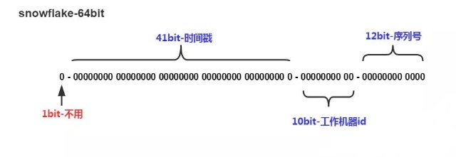
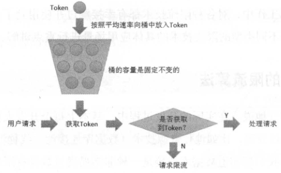

# 高性能
## 储存高性能

### 关系型数据库

分为两类：

* 读写分离：将访问压力分散到集群中的多个节点，没有分散储存压力。
* 分库分表：既可以分散访问压力，也可以分散储存压力。

#### 读写分离

1. 搭建主从集群，主机负责读写操作，从机负责读操作。
2. 主机通过数据同步到从机。
3. 业务服务器将写操作发给主机，读操作发给从机。

问题：存在主从复制延迟，当主机写入后，从机没来得即复制，这时查询从机可能出现问题。

解决方法：
1. 写操作完成后读操作发给指定主机：对业务侵入较大。
2. 读从机失败后再读一次主机：二次读取和业务无绑定，值需要对数据库访问封装，但会增加主机的访问量。
3. 关键业务读写指向主机，非关键业务采用读写分离，可以接受短暂延迟。

主从切换：
1. 基于配置中心实现主从切换。
2. 基于Keepalived实现主从切换。

#### 分库分表

存储压力的体现：
1. 数据量太大，读写性能下降。
2. 数据文件变大，数据库备份、恢复时间长。
3. 数据文件越大，极端情况下丢失数据风险越高。

分散储存分为两类：分库、分表。

1. 业务分库：按照业务模块将数据分散到不同的数据库服务器。

带来问题：
* 无法 join 操作
* 事务问题
* 硬件成本问题
* 唯一性ID。

初创业务时不建议拆分：
  1. 业务不确定性,没有真正的储存和访问压力，分库不能带来价值。
  2. 业务分库后，join 和 事务无法简单实现。
  3. 分库后，不同数据写入需要不同逻辑，增加工作量，初创期间最重要的是快速实现、快速验证、业务分库会拖慢业务节奏。

2. 业务分表：分为垂直拆分和水平拆分。

垂直分表将不常用且占大量空间的列拆分出去，带来问题是 需要多次查询才能获取到数据。

水平拆分适合表行数较大的表，一般达到千万级别，就要警觉。

带来问题：
  1. 路由：某条数据属于哪个子表

    * 范围路由：根据有序的数据列作为路由条件，复杂性体现在分段大小的选取上，太小增加维护复杂度，太大仍会导致性能问题，一般会在 1000万 到 2000 万直接，优点是新增表时不用动原有数据。
    * Hash路由：复杂性体现在初始表数量的选取，太多维护复杂，太少导致单表性能问题，而且增加表数量复杂，所有数据需要重分布，优点是表分布均匀。
    * 配置路由：添加路由表记录路由信息，缺点是多查询一次，会影响整体性能，如果路由表太大也会影响性能，优点是扩充表迁移数据后只需要修改路由表即可。
  2. 需要多次join操作。
  3. 没法简单 count() 操作。

    * count相加：性能低，但实现简单。
    * 记录数表：新增记录数表，每次插入或删除子表数据后更新记录数表，缺点是容易造成数据不一致，增加数据库写压力，优点是查询简单。
  4. order by 操作无法完成：只能通过业务代码或者中间件分布查询汇总。

#### 解决方案
1. 程序代码封装：实现简单，但无法通用，各个语言需要实现一次，例如 sharding-jdbc 。
2. 中间件封装：支持多种编程语言，复杂程度高，例如 mysql-proxy 。

#### 分布式ID

1. UUID：不具有自增特性，没有业务含义，36位长影响查询性能，无序性导致索引位置频繁变动。
2. 基于数据库的号段模式：每次从数据库批量获取一个号段，比如 1 - 1000
3. 基于 Redis incr 命令。
4. 雪花算法：返回给前端时需要转换成 字符串，js整数最大只支持 53 位。



1.第一位 占用1bit，其值始终是0，没有实际作用。
2.时间戳 占用41bit，精确到毫秒，总共可以容纳约69年的时间。
3.工作机器id 占用10bit，其中高位5bit是数据中心ID，低位5bit是工作节点ID，做多可以容纳1024个节点。
4.序列号 占用12bit，每个节点每毫秒0开始不断累加，最多可以累加到4095，一共可以产生4096个ID。

SnowFlake算法在同一毫秒内最多可以生成多少个全局唯一ID呢：： 同一毫秒的ID数量 = 1024 X 4096 = 4194304。

分库分表时可对同一秒中第一个sequence进行随机处理，避免数据倾斜，例如：

```java
public synchronized Result get(String key) {
    long timestamp = timeGen();
    if (timestamp < lastTimestamp) {
        long offset = lastTimestamp - timestamp;
        if (offset <= 5) {
            try {
                wait(offset << 1);
                timestamp = timeGen();
                if (timestamp < lastTimestamp) {
                    return new Result(-1, Status.EXCEPTION);
                }
            } catch (InterruptedException e) {
                LOGGER.error("wait interrupted");
                return new Result(-2, Status.EXCEPTION);
            }
        } else {
            return new Result(-3, Status.EXCEPTION);
        }
    }
    if (lastTimestamp == timestamp) {
        sequence = (sequence + 1) & sequenceMask;
        if (sequence == 0) {
            //seq 为0的时候表示是下一毫秒时间开始对seq做随机
            sequence = RANDOM.nextInt(100);
            timestamp = tilNextMillis(lastTimestamp);
        }
    } else {
        //如果是新的ms开始
        sequence = RANDOM.nextInt(100);
    }
    lastTimestamp = timestamp;
    long id = ((timestamp - twepoch) << timestampLeftShift) | (workerId << workerIdShift) | sequence;
    return new Result(id, Status.SUCCESS);

}
```

如果需要保证多个ID落在同一个库上，可以扩展序列号控制取余值：


* 需要保证我们的用户ID和订单ID同时落在一个库上，那么就是在生成订单ID的时候，订单ID取余的值必须要等于用户ID取余的值。
* 改造我们原先的12位的序列号，将其分为7位的序列号和5位的取余值，只要保证我们5位的取余值就是当前用户ID取余的值，就可以保证我们生成的订单ID和用户ID会落在同一个库上。
* 分表系数只能选择2,4,8,16,32这几个参数，其他参数会导致生成的雪花ID无法满足取余的值。

### NoSQL

关系型数据库缺点：

1. 储存行记录，无法储存数据结构。
2. 表结构强约束，操作不存在的列报错，扩展不方便。
3. 大数据场景下 IO 较高。
4. 全文搜索能力弱。

NoSQL有4类：
1. K-V 存储：解决关系数据库无法储存数据结构的问题，如 Redis。
2. 文档数据库：解决关系数据库强schema约束问题，如MongoDB。
3. 列式数据库：解决大数据场景下IO问题，如 HBase。
4. 全文搜索引擎：解决关系数据全文搜索性能问题，如 Elasticsearch。

#### K-V

优点： 支持多种数据结构存储。

缺点是不支持完整的ACID，只能保证 隔离性 和 一致性，无法保证原子性和持久性。

* 原子性：不支持原子性，不支持回滚，事务中间一条命令失败，既不会回滚，也不会终止后面的命令。
* 一致性：事务前后，数据库完整性没有被破坏。
* 隔离性：单进程单线程。
* 持久性：RDB会丢失上次持久化之后的数据，AOF先执行命令再追加日志，即使每次都刷盘，也可能丢失一条。

#### 文档数据库

优点：
1. 新增字段简单，不需要DDL，直接读写即可。
2. 缺少字段，历史数据也不会出错。
3. 容易储存复制数据。

#### 列式数据库

优点：
1. 同时读取多个列时效率高。
2. 能一次完成多个列的写操作。

#### 全文搜索引擎

使用倒排索引优化全文搜索。

## 计算高性能

磁盘、操作系统、CPU、内存、缓存、网络、编程语言、架构 都有可能影响性能。

网络高性能：NIO + 主从Reactor

集群高性能：通过增加更多的服务器来提升系统整体的计算能力，同样的输入数据和逻辑，无论在哪台服务器上执行，都应该得到相同的输出，复杂性体现在负载均衡。

负载均衡分类：
1. DNS 负载均衡：解析同一个域名返回不同的IP 。

- 优点：
  * 无须自己开发或维护负载均衡设备。
  * DNS可根据请求来源IP，解析离用户最近的服务器地址。

- 缺点：
  * DNS缓存时间较长，修改配置后，更新不及时。
  * DNS服务器由域名商负责，扩展性差，无法根据业务特点做定制化扩展。
  * 支持负载均衡少，分配策略简单，不能根据系统与服务状态来判断负载。

2. 硬件负载均衡：通过单独的硬件设备来实现负责均衡。

- 优点：
  * 功能强，支持各层级负载均衡，支持全面的负载均衡算法。
  * 性能强，可以支持百万并发，软件能支持10万并发就很厉害。
  * 稳定性高。
  * 支持安全防护，具备防火墙、防DDOS攻击。

- 缺点：
  * 价格昂贵。
  * 扩展能力差，无法做扩展和定制。

3. 软件负载均衡：通过 Nginx 或 LVS 完成，Nginx 是 7层 负载均衡，LVS 是 4层 负载均衡。

- 负载均衡按层划分:
  * 二层：基于mac地址
  * 三层：基于ip地址
  * 四层：基于ip和端口号
  * 七层：基于应用协议
- 优点：
  * 部署维护简单。
  * 便宜，只需要一台Linux服务器安装软件。
  * 灵活，4层还是7层根据业务选择，也可以更加业务扩展，例如 nginx 插件定制化。

一般 DNS负载均衡负责地理级别，硬件负载均衡负责集群级别，软件负载均衡负责机器级别。


负载均衡算法：
1. 任务平分类：将任务平均或按权重分配给服务器。
  * 轮询：简单、但不能感知服务器状态，服务器宕机了也会不断发请求，不能根据硬件配置分配。
  * 加权轮询：可以根据硬件配置分配。
2. 负载均衡类：根据服务器负载来分配，负载可以是 连接数、IO、网卡吞吐量等。
  * 负载最低优先：如 最少连接数优先，CPU负载最低优先。
3. 性能最优类：按响应时间分配，优先分给响应快的。
4. Hash类：根据关键信息进行Hash，相同的Hash分配在同一台服务器。
  * 源地址 Hash。
  * ID Hash

## 性能测试

指标：
1. 响应时间：从发出请求到最后响应数据需要的时间。
2. 并发数：系统能够同时处理请求的数目。
3. 吞吐量：单位时间内系统处理的请求数量，可以是 每秒事务数 TPS、每秒 HTTP 请求数 HPS、每秒查询数 QPS。
4. 性能计数器：描述服务器或操作系统性能的一些数据指标，比如系统负载、内存、磁盘网络IO等。

测试方法：
1. 性能测试：以系统设计初期规划的性能指标为预期目标，对系统不断施加压力，验证系统在资源可接受范围内，是否达到性能预期。
2. 负载测试：对系统不断地增加并发请求以增加系统压力，直到系统的某项或多项性能指标达到安全临界值，再增加压力，系统处理能力下降。
3. 压力测试：超过负载的情况下，对系统继续施加压力，直到系统崩溃。
4. 稳定性测试：在特定硬件、软件、网络环境下，一定压力情况下运行较长时间，检测系统是否稳定。

### 性能优化

前端：
1. 浏览器优化。
  * 减少http请求：合并CSS、Js文件、合并图片。
  * 使用浏览器缓存：通过设置 http 头 Cache-Control + Expires 添加浏览器缓存。
  * 启用压缩。
  * 减少Cookie大小。
2. CDN加速 + 反向代理

应用服务器：
1. 分布式缓存。
2. 异步操作。
3. 使用集群。

存储：
1. 使用固态硬盘。
2. RAID磁盘阵列。

# 高可用

## CAP

一个分布式系统涉及读写操作时，当发生分区时，只能保证一致性（Consistence）、可用性（Availability）、分区容错性（Partition Tolerance）中的两个，关注的是读写操作，不是分布式系统的所有功能。如果没有发生分区应该保证数据的一致性和可用性。

1. 一致性：客户端的每次读操作，要么读到的是最新的数据，要么读取失败，强调的是数据正确。
2. 可用性：任何客户端的请求都能得到响应数据，强调的是响应一个合理的结果，这个结果可以是不正确的结果，但没有异常和超时。
3. 分区容忍性：当系统中通信出现问题时，系统仍能提供满足一致性或可用性的服务，强调是系统遇到某节点或网络分区故障，服务仍能继续。

由于网络无法做到100%可靠，所以P是必须要素，CA是矛盾的，当出现分区时，为了保证C，就不能进行写入，当有写入请求时就只有返回写入异常，而A要求响应没有异常。

CP：为了保证一致性，当发生分区现象时，数据无法同步，当访问旧数据节点时需要返回异常，违背了A,所以只能满足 CP。

AP：为了保证可用性，当发生分区现象时，数据无法同步，当访问旧数据节点时返回旧数据，违背了C，所以只能满足 AP。

CAP关注的粒度是数据，而不是整个系统，对于不同的数据可以选择不同的场景。

CAP是忽略网络延迟，但某些严苛场景，例如和金钱相关，要求严格一致性，即使停止服务，也要保证一致性，无法做到多点分布式写入，但是可以在整个系统做分布式，比如将用户 1-100 由节点1负责，100-200由节点2负责，当某个节点故障时，节点上的用户无法读写。

在正常运行没有发生分区现象时，可以同时满足CA，只是在分区时，放弃C或A。

### BASE

1. Basically Available（基本可用）：分布式系统在出现故障时，允许损失部分可用性，即保证核心可用。
2. Soft State（软状态）：允许系统存在中间状态，中间状态就是数据不一致。
3. Eventual Consistency（最终一致性）：系统中所有数据副本经过一定时间后，最终能够达到一致的状态。

BASE 是对 AP 的补充，解决CAP忽略网络延迟的问题，AP只是牺牲分区期间一致性，当分区故障恢复后，系统达到最终一致性。

## FMEA分析故障
1. 给出初始架构设计图。
2. 假设架构中某个部件发生故障。
3. 分析此故障对系统功能造成的影响。
4. 根据分析结果，判断架构是否需要进行优化。

分析表格内容：
1. 从用户角度的功能点。
2. 故障点和故障形式，量化表达，例如 Mysql 响应时间达到 3 秒。
3. 故障影响，故障点影响的范围，量化表达，例如 20%用户无法登陆。
4. 故障程度，站在业务角度上分析，例如分为 致命70%无法使用，高30%无法使用,中响应时间超过5秒，低10%响应时间超过5秒。
5. 故障原因，例如 磁盘坏道引起  Mysql 响应时间达到 3 秒。
6. 故障概率。
7. 风险程度。
8. 已有措施。

  * 检测警告：检测故障，告警，需要人工干预。
  * 容错：检测到故障后，通过备份手段应对。
  * 自恢复：一般是业务恢复，例如将机器上副本分配到其他机器，本质故障还是存在。
  * 规避措施：可以是技术手段也可以是管理手段，例如为了避免新引入MongoDB丢失数据，在MySQL冗余一份。
  * 解决措施：一般是技术手段。
  * 后续规划。

举例：假设只有登录和注册功能。


## 存储高可用

### 主备复制

1. 主机储存数据，通过复制通道将数据复制到备机。
2. 正常情况下，客户端无论读写操作都发送给主机，备机不对外提供任何读写服务。
3. 主机故障情况下，人工切换到备机。
4. 可能存在主机写入了但备机没有复制的风险，需要人工排查恢复。

- 优点：
  * 客户端不需要感知备机。
  * 双方只需要数据复制即可，无需主备状态判断。
- 缺点：
  * 备机仅仅只是备份没有读写操作，硬件成本浪费。
  * 故障后需要人工干预。

### 主从复制

1. 主机储存数据，通过复制通道将数据复制到从机。
2. 正常情况下写操作在从机，读操作可以在主机也可以在从机，可根据业务决定。
3. 主机故障情况下，写操作无法进行，读操作可以发送给从机，如果主机不能恢复，人工将从机升为主机，新增新的从机。
4. 可能存在主机写入了但备机没有复制的风险，需要人工排查恢复。
5. 由于延迟可能存在主从读写不一致问题，但延迟过大可触发报警，人工干预，避免宕机丢失较多数据。

- 优点：
  * 主机故障时，读业务不受影响。
  * 从机提供读操作，发挥硬件性能。
- 缺点：
  * 客户端需要感知主从关系，将不同操作发给不同的机器。

### 主备倒换 & 主从倒换

解决 人工干预 的问题。

1. 状态判断
  * 状态传递的渠道：互连、第三方仲裁。
  * 状态监测的内容：进程是否存在，响应是否缓慢。
2. 倒换决策。
  * 倒换时机：应该在什么时候倒换，比如 进程不存在就倒换。
  * 倒换策略：主机故障恢复后，是否需要再次倒换。
  * 自动程度：是否需要人工确认。
  * 数据冲突：新旧主机数据冲突。

### 主主复制

两台主机都可以读写操作，互相复制，必须保证数据可以双向复制，一般适用于临时性、可丢失、可覆盖的数据，如session、日志。

### 数据集群

主机本身的处理能力有限，可以使用多台服务器集群。

集中集群：适合数据量不大机器，数量不多的场景，如Zookeeper集群，所有数据都存在主机中，可能存在问题：
* 多个备机可能数据不一致，主机的复制压力也很大。
* 备机如何检测主机状态，可能不同备机判断的状态不一致。
* 主机故障后，如何决定新主机。

分散集群：适合业务数据量大，可伸缩，每台服务器只负责部分数据，可能存在问题：
* 数据均衡。
* 容错：当发生故障时如果把故障服务器分配给其他服务器。
* 可伸缩性：当集群容量不够时，扩充新服务器后数据迁移。

### 分布式事务

如果采用数据集群的方法，数据可能分布在不同集群阶段，需要分布式事务来保证可靠性。

#### 2PC

分为 Commit 请求阶段 和 Commit 提交阶段。

* 第一阶段：
  1. 协调者向所有参与者询问是否可以执行事务，并等待响应。
  2. 参与者执行事务操作，返回执行结果。
* 第二阶段：
  1. 当所有参与者返回成功，协调者发起COMMIT请求，参与者完成COMMIT释放资源，发送ACK消息，协调者收到ACK后完成事务。
  2. 当有参与者返回失败，协调者发起ROLLBACK请求，参与者进行回滚释放资源，发送ACK消息，协调者收到ACK后取消事务。

优点：实现简单。

缺点：
* 同步阻塞，协调者和参与者互相等待对方响应，如果某个节点阻塞会拖慢整个流程，性能问题明显，无法支撑搞并发场景。
* 状态不一致：第二阶段如果存在消息丢失，将会出现状态不一致。
* 单点故障：协调者出现故障，参与者会一直阻塞。

#### 3PC

解决2PC单点故障问题，当协调者故障后，参与者通过超时避免一直阻塞，还是存在数据不一致问题。

* 第一阶段：
  1. 协调者向所有参与者询问是否可以执行事务，并等待响应。
  2. 参与者判断是否可以提交事务，冻结资源，返回结果。
  3. 如果协调者收到任何一个失败或者超时，事务终止，同时通知参与者释放冻结资源。
* 第二阶段：
  1. 协调者发送precommit请求，并等待响应。
  2. 参与者执行事务操作，返回ACK消息。
* 第三阶段：
  1. 协调者在接收到所有 ACK 消息后，发送docommit，告诉参与者正式提交，否则会发出回滚消息。
  2. 参与者收到 docommit 后提交事务，返回havecommitted消息。
  3. 如果参与者收到一个precommit消息并返回ACK，但等待docommit消息超时，参与者在超时后继续提交事务。

### 分布式一致性算法

Paxos: 多数一致性。

Raft：不是 Paxos 的完整版，绝大部分情况下能保证一致性，将一致性问题拆分为 Leader选举、日志复制、安全保证 3个问题。

ZAB：zookeeper 中采用的分布式一致性算法，和两种算法复制逻辑不一样，zookeeper 先修改 leader 再由 leader 将计算结果修改到其他节点，Paxos 和 Raft 是会向各个节点发送请求，达成共识后各自计算结果修改。

### 数据分区

数据按照一定的规则进行分区，不同分区分布在不同的地理位置，每个分区储存一部分数据，通过这种方式规避地理级别的故障所造成的巨大影响，在部分服务器故障时，系统能够继续提供服务。

复制规则：
1. 集中式：备份存在一总的备份中心，所有分区都将数据备份到备份中心。


优点：
* 设计简单，各分区无直接联系。
* 扩展容易，新增分区只需将新分区接入到备份中心。

缺点：
* 成本较高，需要建设独立的备份中心。

2. 互备式：每个分区备份另一个分区的数据。


优点：
* 成本低，利用已有设备。

缺点：
* 设计复杂，各分区承担业务数据和备份数据。
* 扩展麻烦。

3. 独立式：每个分区都有自己的独立的备份中心，需要备份分区与原分区不在一个地区。


优点：
* 设计简单，各分区互不影响。
* 扩展容易：新增的分区只需要搭建自己的备份中心。

缺点：
* 成本较高。

## 计算高可用

复杂性体现在任务管理，当任务在某台服务器失败后，如何重新分配到新的服务器执行。

### 主备

计算高可用的主备架构无须数据复制，类似储存主备架构：
1. 主机执行所有计算任务。
2. 当主机故障时，人工切换到备机。
  * 冷备：程序已经部署，但服务没有启动，主机故障后人工启动，节省能源。
  * 热备：程序已经启动，只是不对外提供服务，主机故障后，人工将任务分配到备机，减少手工操作，推荐温备。

优点：简单，主备之间不需要交互。

缺点：需要手工操作，恢复时间不可控。

适合内部系统，使用人数不多，业务频率不高，

### 主从

1. 主机从机 分别执行一部分计算任务。
2. 当主机故障时，将从机升为主机，新增新的从机。

优点：从机也执行任务，发挥了从机的硬件性能。

缺点：任务分配相对复杂。

### 对称集群

也叫负载均衡集群，关键有两点：任务分配器需要检测服务器状态，任务分配器需要选取分配策略。

1. 任务分配器将任务分配集群中不同的服务器。
2. 当某台服务器故障后，任务分配器不再将任务分配给它。
3. 服务器故障恢复后，任务分配器重新将任务分配给它执行。

### 非对称集群

不同服务器角色不同，承担不同职责。

1. 集群通过某种方式区分不同服务器角色，如通过 Paxos 算法选举。
2. 任务分配器将不同任务发送给不同服务器。
3. 当指定类型服务器故障时，需要重新分配角色，如 Master 故障后，需要从剩余Slave中重新指定一个Master服务器，如果是Slave服务器故障不需要重新分配，只需从集群中剔除。

相比对称集群，设计复杂度体现在两方面：
* 任务分配更复杂，将任务划分为不同类型并分配给不同角色的集群节点。
* 角色分配策略更复杂，可能需要 Paxos 算法来实现。

## 业务高可用

### 异地多活

异地：不同地理位置。多活：不同地理位置上系统能够提供业务服务，活是活跃的意思。

判断是否异地多活有两个标准：
* 正常情况下，用户无论访问哪个地点的业务系统，都能够得到正确的业务服务。
* 某地系统异常情况下，用户访问到其他地方正常的业务系统也能够得到正确的业务服务。

类型：
1. 同城异区：同一城市不同区的机房，通过搭建高速网络，两个机房能够实现和同机几乎一样的网络传输速度，是应对机房级别故障的最优架构，但没办法解决城市级灾害，比如新奥尔良水灾。
2. 跨城异地：部署在不同城市的多个机房，距离最好远一些，两个机房的网络传输速度会降低，但能有效应对极端灾难事件。
3. 跨国异地：一般有这几种场景：为不同地区用户提供服务，只读类业务。

技巧：
1. 保证核心业务的异地多活。
2. 核心数据最终一致。
3. 采用多种手段同步数据。

    * 消息队列方式：修改数据后通过消息队列同步到其他业务中心。
    * 二次读取方式：读取本地数据失败时，再根据路由规则去拥有数据的中心读取。
    * 储存系统同步方式：通过数据库同步机制复制到其他业务中心，适用于变化频率低的数据。
    * 回源读取方式：如登陆数据在A，B拿到sessionid后根据路由规则路由到拥有数据的中心A读取，这样避免数据复制。
    * 重新生成数据方式：如在服务A登陆，A服务宕机，可以让用户重新在B登陆。

4. 保证绝大部分用户的异地多活，无法做到100%可用时，可以采取一些安抚性措施：挂公告、事后对用户进行补偿、补充体验（如服务恢复后通过短信告知等）。

异地多活设计：
1. 业务分级，那些业务需要做异地多活。
  * 访问量大的业务。
  * 核心业务。
  * 产生大量收入的业务。
2. 数据分类，根据数据特征考虑方案。
  * 数据量：数据量越大同步延迟概率越高，需要相应的解决方案。
  * 唯一性：多个机房同类数据必须唯一，可以使用唯一ID生成算法。
  * 实时性：实时性要求越高，同步越复杂。
  * 可丢失性：是否可丢失，例如Session 数据可丢失。
  * 可恢复性：是否可通过某种手段进行恢复，如用户微博丢失后，用户可以重新发一篇一模一样的微博。
3. 数据同步，根据不同的业务和数据设计不同的同步方案。
  * 储存系统同步：方案简单，主流储存系统都有同步方案，无法针对业务特点做定制化控制。
  * 消息队列同步：适合无事务性或无实时性要求的数据。
  * 重复生成：如sesion等数据。
4. 异常处理，当极端情况出现时，采取措施。
  * 问题发生时，避免少量数据异常导致整体业务不可用。
  * 问题恢复后，将异常的数据进行修正。
  * 对用户进行安抚，弥补用户损失。

    措施：
  * 多通道同步。
  * 同步和访问结合，这里访问通过系统的接口来进行数据访问，先访问本地数据，本地数据无法读取时，访问异地接口。
  * 日志记录，用户故障恢复。
  * 用户补偿。

### 接口级故障

异地多活主要应对系统级故障，接口级故障表现为系统没有宕机，网络也没有中断，但业务出现问题，例如业务响应缓慢，大量访问超时等。主要原因在于系统压力太大，负载太高，导致无法快速处理业务请求。

常见原因：
1. 内部原因
  * 死循环
  * 数据库查询满
  * 内存溢出
2. 外部原因
  * 黑客攻击
  * 促销、抢购超出平时几十倍用户
  * 第三方系统的大量请求
  * 第三方系统的响应缓慢

解决方案：
1. 降级：保证核心业务，将某些业务或接口的功能降低，只提供部分功能，甚至完成停掉所有功能。
  * 系统后门降级：系统预留后门降级，比如降级URL，实现成本低，但需要一台台操作，浪费时间，也存在安全问题。
  * 独立降级系统：将降级操作独立到单独的系统中，可以实现复杂的权限控制、批量等操作。
2. 熔断：应对依赖外部系统故障的情况，降级强调自身系统故障。例如功能X中A依赖B，当B响应慢，导致A变慢，最后导致A的其他功能变慢。
  * 设计熔断的阀值，例如 1分钟内 30% 请求响应时间超过1s。
3. 限流：降级从系统功能优先级的角度考虑如何应对故障，限流则从用户访问压力的角度来考虑如何应对故障。限流指只允许系统能够承受的访问量进来，超出系统访问能力的请求将被丢弃。
  * 基于请求限流：从外部访问的请求角度考虑限流，分为限制总量、限制时间量，这种根据阈值来限制访问量的方式更多适合业务功能较简单的系统。
    1. 限制总量：限制当前系统服务的用户总量，如 某个直播间限制总用户数上限为100万、某个抢购活动的商品数据只有100个，限制参与抢购的用户上限为1万名。
    2. 限制时间量：限制一段时间内某个指标的上限，如 一分钟内只允许一万个用户访问、每秒请求峰值最高为10万。
  * 基于资源限流：从系统内部考虑，即找到系统内部影响性能的关键资源，常见的有连接数、文件句柄、线程数、请求队列等。例如：将请求放入任务队列，当队列达到最大值时，再提交请求就拒绝、当CPU使用率达到80%时就开始拒绝新的请求。

4. 排队：限流的一个变种，相对于限流拒绝用户，排队是让用户等待很长时间，比如 12306。

    例如：秒杀排队

    

    1. 排队模块：负责将用户请求保存在队列，队列大小根据商品数量定义。
    2. 调度模块：负责检查服务模块，一旦处理能力有空闲，就从队列获取任务分发到服务模块。
    3. 服务模块：负责处理真正的业务。

#### 高并发、大流量

常规手段：
1. 扩容：单台服务器处理能力有限，通过集群进行扩容，提高系统并行能力。
2. 动静分离：静态数据在CDN获取。
3. 缓存：提高读写操作的吞吐量。
4. 服务降级。
5. 限流。

##### 限流

限流算法：

* 计数器算法：常用于限制总并发数，比如数据库连接池大小、线程池大小、程序访问并发数等都是使用计数器算法。

* 令牌桶算法：限制一段时间内某指标的上限，限制平均流入速率，允许一定程度上的突发流量。

  ​	

  1. 每秒会有r个令牌放入桶内，即每 1/r 秒会放入一个。
  2. 桶的容量固定不变，最多只能存放 b 个令牌，如果桶满了再放入令牌则丢弃。
  3. 当一个n字节的请求包到达时，将消耗n个令牌，然后再发送该数据包。
  4. 若桶中可用令牌数小于n，则该数据包将会被丢弃或被缓存。

  示例：

  1. 引入 `com.google.guava`，使用 `RateLimiter limit = RateLimiter.create(int n)`设置每秒向桶中设置 n 个 令牌,或者使用`RateLimiter limit = RateLimiter.create(int n,int time,TimeUnit)`设置热启动时间，逐渐达到每秒向桶中设置 n 个 令牌,使用 `limit.acquire()` 阻塞获取一个令牌，`limit.tryAcquire()`设置超时时间获取一个令牌。

  2. Nginx实现接入层限流，详情 [Nginx限流](Nginx.md)

* 漏桶算法：常用于流量整形，强行限制数据的传输速率。

  

  1. 可以任意速率向桶中流入水滴。
  2. 桶的容量固定不变，如果桶满了则丢弃。
  3. 按照固定的速率从桶中流出。

令牌桶限制的是流入速率，并且允许一定程度上的突发流入流量，漏桶限制的是流出速率，流出速率不会突发。

基于时间分片削峰：除了使用技术手段进行流量控制，还可以调整业务进行削峰，对峰值进行分散处理，避免在同一时间段内产生较大的用户流量冲击：

1. 活动分时段进行。
2. 答题验证。

基于MQ削峰：通过异步调用解耦实现，案例：

1. 前端埋点数据上报削峰。
2. 分布式调用跟踪系统的埋点数据上报削峰。

##### 缓存

1. CDN缓存静态资源文件。
2. 本地缓存：在一定程度上缓解数据库的查询压力，但由于共享JVM的内存资源，如果缓存数据所占比例较大，JVM极有可能腾不出足够的Heap资源从而抛出OOM，或者GC次数增多，暂停时间变长反而影响系统吞吐量。
3. 分布式缓存。

详情参考 [Redis](Redis.md) 中 缓存部分

# 扩展

扩展的基本思想是拆，将原本大一统的系统拆分为多个规模小的部分，扩展时只需要修改其中一部分，通过这种方式来减少改动的范围，降低改动的风险。

1. 面向流程拆分：将整个业务流程拆分成几个阶段，扩展时只需要修改某一层，少部分情况可能修改关联的两层，如将网络通信流程拆分为 应用层 -> 传输层 -> 网络层 -> 物理 + 链路层、将接口请求流程拆为展示层 -> 业务层 -> 数据层 -> 存储层，典型架构：分层架构。
2. 面向服务拆分：将系统提供的服务拆分，对某个服务扩展或者增加新的服务时，只需要扩展相关服务即可，无须修改所有的服务，如应用层有 HTTP、FTP、SMTP等服务、将系统拆分为登录注册服务+信息管理服务，典型架构：SOA、微服务。
3. 面向功能拆分：每个服务都可以拆分为更多细粒度的功能，对某个功能扩展或者新增功能时，只需要扩展相关服务即可，无须修改所有的服务。如 HTTP 分为 POST、GET功能、注册服务提供手机号注册、身份证注册、学生邮箱注册三个功能，典型架构：微内核架构。

多数情况下会进行多种架构组合使用，例如 学生管理系统 使用 微服务架构 拆分服务，服务内使用面向流程的的分层架构，对某些单个服务，如登录服务使用微内核架构，通过插件式扩展不同方式登录。

## 分层架构

核心点是保证各层之间的差异足够清晰，边界足够明显，本质是隔离关注点，每个层中的组件只会处理本层的逻辑，分层时需要保证层与层之间的依赖稳定，例如 Linux 内核为了支撑不同的文件系统格式，抽象了VFS文件系统接口。

分层之间强制约束两两依赖，一旦选择绕过分层，时间一长架构就会变得混乱，所以缺点是冗余和性能，每次业务请求都需要穿过所有层，但这只是理论上，实际分层架构带来可扩展性，以及逻辑清晰方便维护。

根据不同的划分维度和对象划分：

1. CS架构、BS架构：划分对象是整个业务系统，划分的维度是用户交互。
2. MVC架构：划分对象是单个业务子系统，划分的维度是职责。
3. 逻辑分层架构：划分对象是单个业务子系统或整个业务系统，划分的维度也是职责，和MVC架构区别是MVC架构是两两依赖，逻辑分层架构是自顶向下依赖。


## SOA架构

有三个概念：服务、ESB（服务总线）、松耦合，通常是企业层面的架构，使用ESB屏蔽异构系统对外提供各种不同的接口方式。


在解决传统IT系统重复建设和扩展效率低的问题，也带来问题，ESB需要实现各种协议的转换、数据转换、透明的动态路由等功能 ，耗费大量的计算性能，本身容易成为系统瓶颈。

企业在应用SOA时，各种异构的IT系统已存在多年，完全重写或按照统一标准重构成本非常大，只能通过ESB方式去适配已经存在的各种异构系统。

## 微服务

SOA 和 微服务的对比：


微服务陷阱：
1. 服务划分过细，服务间关系复杂。
2. 服务数据变多，团队效率下降。
3. 调用链太长，性能下降。
4. 调用链太长，问题定位困难。
5. 没有自动化支持，无法快速交付。
6. 没有服务治理，微服务管理混乱。

1. 服务粒度：在开发阶段可以按照一个微服务三个人负责，从系统规模上，复杂度可以达到每个人都能全面理解整体系统，又能进行分工的粒度，从团队管理上，形成一个稳定的备份，即使一个人休假或调配，剩余两个人还可以支持，并且不会存在单点，从技术角度，3个人能够形成有效的讨论，快速意见达成一致。"三个火枪手"理论适用于开发阶段，维护阶段1个人可以维护1个或多个微服务。

2. 拆分方法：
  * 基于业务逻辑拆分：将系统的业务规模按照职责范围识别，并根据3人一组确定服务数量，避免划分过细。
  * 基于可扩展拆分：将系统中的业务模块按照稳定性排序，稳定系统粒度可以粗一点，即使逻辑没有强关联，不稳定系统可以细一点，不过也要控制服务总量。
  * 基于可靠性拆分：将业务模块按照优先级排序，保证可靠性要求高的核心服务高可用
  * 基于性能拆分：将性能要求搞或压力大的模块拆分出来，避免性能压力大的服务影响其他服务。

3. 基础设施：

  

  * 自动化测试：代码级的单元测试、单个系统级的继承测试、系统间的接口测试。
  * 自动化部署：版本管理、资源管理（例如机器管理、虚拟机管理）、部署操作、回退操作。
  * 配置中心：配置版本管理、节点管理、配置同步、配置推送。
  * 接口框架：HTTP/REST 或 RPC统一接口协议。
  * API网关：负责外部系统的访问操作。
  * 服务发现：服务注册、服务发现。
  * 服务路由：随机路由、轮询路由、最小压力路由、最小连接数路由等。
  * 服务容错：请求重试、服务隔离、流量控制。
  * 服务监控：实时收集信息、监控预警。
  * 服务追踪：采样跟踪用于探查性能不足，染色跟踪主要针对特定请求进行全链路跟踪，可视化的方式跟踪请求，收集调用链的执行耗时、整合孤立日志。
  * 服务安全：接入安全（微服务访问另一个微服务需要允许）、数据安全（某些数据只允许授权的微服务访问）、传输安全（敏感数据在传输过程中防窃取、防篡改）。

## 微内核架构

架构分为两类组件：核心系统、插件模块。


核心功能比较稳定，不会因为业务功能扩展而不断修改，插件模块可以根据业务功能的需要不断地扩展。

设计关键点：
1. 插件管理：核心系统需要知道当前有哪些插件可用，如何加载这些插件，什么时候加载，常用方式是插件注册表。
2. 插件连接：插件如何连接到核心系统，通常需要制定插件和核心系统的连接规范，常见的链接机制有：依赖注入、分布式协议如HTTP/RPC等。
3. 插件通信：插件间的通信，核心系统需要提供插件通信机制，例如计算机通过主板上的总线提供不同组件的通信。

### RPC

屏蔽底层的处理细节：

1. 底层的网络通信协议处理。
2. 解决寻址问题。
3. 请求响应过程中参数的序列化和反序列化。

# 实战

* TPS：事务数/s。
* QPS：每秒查询率。

对于一个页面的一次访问，形成一个TPS，但一次页面请求，可能产生多次对服务器的请求，服务器对这些请求，就可计入QPS。

## 消息队列

场景：

* 用户发一条微博，微博子系统需要通知审核子系统审核、统计子系统统计、广告子系统广告预测、消息子系统消息推送，微博子系统需要调用其他子系统接口，接入多少子系统就要和其他子系统交互。
* 用户等级达到VIP后，等级子系统要通知福利子系统进行奖品发放，客服子系统安排专属服务人员、商品子系统进行商品打折处理，等级子系统也不厌其烦。

结论：各业务子系统强耦合，需要消息队列解耦。

设计流程：

* 识别复杂度：采取排查法。
  1. 是否需要高性能? 关注的是 1s 的数据。
    * 假设用户每天发 1000万 条微博，那么微博子系统一天会写入 1000万 条消息，其他子系统读取的消息大约 1亿次。
    * 但我们关注的是 TPS 和 QPS，先将数据按秒计算，一天平均写入 115条，每秒读取就是1150条。
    * 系统读写并不平均，设计目标按峰值来计算，峰值一般取平均的3倍，消息队列 TPS 是 345，QPS 是 3450。
    * 业务会增长，需要考虑性能余量，按峰值 4 倍计算，设计目标为 TPS 是 1380 ，QPS 为 13800。
    * Kafka 性能是万级的，1380 写入不是很高，13800 表示需要高性能读取，对Kafka来说也不是很高。
  2. 是否需要高可用?
    * 对于微博子系统来说，如果消息丢了，导致没有审核触发国家法律法规，则是非常严重的事情。
    * 所有消息队列需要高可用。
  3. 是否需要高扩展性? 功能明确、基本无需扩展。
  4. 安全性？
  5. 成本?
  所以该场景下 消息队列需要：高性能读取、高可用消息写入、高可用消息存储、高可用消息读取。
* 设计方案。
* 评估和选择备选方案。
* 细化方案。

# 架构演进

企业业务分为两类：
1. 产品类：360杀毒软件、iPhone、UC浏览器等，单个用户通过购买或免费使用这些产品来完成自己相关的某些任务，用户对这些产品是独占的。技术创新推动业务发展。用户选择一个产品在于产品功能是否强大。
2. 服务类：百度搜索、淘宝购物、新浪微博等，大量用户使用这些服务来完成需要与其他人交互的任务，单个用户使用 但 不会独占某个服务，服务的用户越多，服务的价值越大。业务发展推动技术的发展。用户选择一个服务在于服务的规模。

服务类的业务发展路径：提出新的服务模式 -> 吸引了一批用户 -> 业务开始发展 -> 吸引了更多用户 -> 服务模式不断完善和创新 -> 吸引越来越多的用户。

业务驱动技术发展，架构师需要判断业务在当前和接下来一段时间的主要复杂度是什么，判断的标准是基于业务发展阶段进行判断，不同的行业业务发展路径、轨迹、模式不一样。

## 淘宝

1. 这时候关注的是快，轻量一点，简单一点，答案是买一个，买的方案。

  

2. MySQL撑不住了，选择 Oracle ，容量大、稳定、安全、性能高，这时候买的是性能，关注的还是快。

  

3. 技术影响了业务的发展，频繁地死锁和重启对业务产生严重影响，技术切换到 Java。

  

4. 数据分库、映入Spring、加入缓存、加入CDN,围绕提供容量、提高性能、节约成本。

  

5. 通过自研系统来降低 IOE 的成本。

## 秒杀活动

问题：
1. 对其他业务造成冲击。
2. 高并发下的应用、数据库负载。
3. 下单链接暴露。
4. 网络和服务器带宽突增。

解决方案：
1. 秒杀系统独立部署，避免对其他业务造成影响。
2. 动静分离，使用 CDN + 反向代理缓存。
3. 租借秒杀活动网络带宽。
4. 将请求尽量拦截在上游。
  * 用户等级需要达到一定等级才能参加活动。
  * 秒杀按钮准时生效。
  * 对于查询请求，限制用户在x秒内只能提交一次。
  * 使用redis缓存读数据。
  * 对于写请求，增加验证码，验证码获取实现令牌桶方式限流，获取验证需要时间间隔。
  * 请求验证码时可返回随机码，真正请求时需要携带随机码，达到加盐的目的秒杀链接加盐。
  * 对请求实施限流。
  * 使用黑名单限制ip、用户。
  * 使用消息队列，只保存一定量请求，其他请求全部丢弃。
  * 使用redis写入，定时同步到数据库。

## 大型网站发展历程

1. 初始阶段的网站架构：应用程序、数据库、文件等所有资源都在一台服务器上。
2. 应用服务和数据服务分离：应用服务需要更强的CPU、数据服务需要更快的磁盘和数据缓存、文件服务器需要更大的磁盘。
3. 应用服务器集群：改善网站的并发能力。
4. 读写分离：改善数据库负载压力。
5. 反向代理+CDN加速响应。
6. 使用分布式文件系统+分布式数据。
7. 使用NoSQL + 搜索引擎。
8. 业务拆分。
9. 分布式服务。


## 业务复杂性

1. 初创期，业务点不在于完善，而在于创新，只有创新才能吸引用户，业务对技术的要求就是 快，能买就买，有开源就用开源。
2. 发展期，将不完善的业务逐渐完善，不断加入新功能，业务对技术的要求就是快速实现各种需求，满足业务发展的需要，经历两个阶段：
  * 堆功能，在原有系统上不断增加新功能。
  * 优化期，随着功能越来越多系统开始变得复杂，堆功能吃力，速度变慢，开始解决这个问题。
    1. 优化派：将现有系统优化，更换数据库，优化查询等，系统改动小可以比较快速实施，缺点就是过不了多久，系统又撑不住了。
    2. 架构派：调整系统架构，拆分系统，动作较大，耗时较长。
3. 架构期：优化也顶不住了，调整架构。
  * 拆功能，拆分为登录认证子系统等。
  * 拆数据库，分库分表等。
  * 拆服务器，服务器一台变两台，两台变4台，增加负载均衡系统。
4. 竞争期：业务形成一定规模，竞争对手加入竞争，新的业务创新出来，新的系统更多，原系统也拆得很多，问题出现，有两个方面：重复造轮子比如每个系统都有文件存储，缓存等、系统交互变成网状，研发，测试，运维都出现问题。
  * 平台化：解决重复造轮子问题。
    1. 文件储存平台化：淘宝TFS、京东JFS。
    2. 数据库平台化：百度 DBProxy，淘宝TDDL。
    3. 缓存平台化：腾讯 TTC、豆瓣 BeansDB。
5. 成熟期：创业机会不大，业务上开始转向求精，响应时间是否快，用户体验是否好，成本是否低等。这时候找出自己弱项逐个优化。

用户量增大对技术的影响体现在性能要求越来越高、可用性越来越高。


## 模板

大多数的技术架构：


### 储存层

1. SQL：
  * 开始选用 MySQL、PostgreSQL开源数据库，或者性能更好的商业数据库。
  * 业务发展到一定程度开始分库分表，同时带来问题：数据如何拆分、数据如何组合。
  * 业务发展到一定阶段后，将分库分表独立成中间件，每个业务基于中间件做自己的集群，带来问题：数据库资源利用率不高、集群分开维护，维护成本高。
  * 业务越来越多，在SQL集群上构建SQL存储平台，以对业务透明的形式提供资源分配、数据备份、迁移、容灾、读写分离、分库分表等一系列服务。
2. NoSQL：not noly sql 作为对SQL 的补充，在数据结构和性能上弥补关系数据库的不足，一般自身提供集群功能，节点较少时平台化没什么意义，当节点达到上千甚至几千时，平台化能大大提升运维效率，提升资源利用率，同一平台主要功能：
  * 资源动态按需分配：如一台服务器根据内存使用率分配给多个业务使用。
  * 资源自动化管理：如新业务只需申请，不管哪些服务器在提供服务。
  * 故障自动化处理：如 某台服务器挂后，另一台服务器立刻接管缓存请求。
3. 小文件储存：不一定需要公司和业务规模很大，基本上认为业务在起步阶段就可以做小文件同一储存，例如 HBase、Hadoop、Hypertable、FastDFS等都可以作为小文件储存的底层平台。
4. 大文件储存：分为 两类：业务大数据如视频、海量的日志数据如访问日志，操作日志，用户轨迹日志，一般使用 Hadoop、HBase、Storm、Hive 等。

### 开发层

1. 开发框架：优选成熟的框架，避免盲目追逐新技术，成熟框架资料齐全，受众广容易招到合适人才，稳定适合长期发展。
2. Web服务器：可以选择Tomcat、Nginx、Apache，优化参数调整配置就能完成基本使用，等撑不住再考虑切换。
3. 容器：打造自动化运维，智能化运维。

### 服务层

降低系统间相互依赖程度。

1. 配置中心：集中配置多个系统效率高，检查方便。
2. 服务中心：解决跨系统依赖的配置和调度问题。
    
    
    
3. 消息队列：解决跨系统异步通知，使网状结构变成线性结构，生产消费解耦，高可用高性能，业务子系统聚焦业务。

### 网络层

解决高性能和高可用。

1. 负载均衡：DNS用于地理级别，Nginx & LVS & F5 用于同一地点。
2. CDN：解决用户网络访问的 最后一公里，将内容缓存在离用户最近的地方，用户访问缓存的内容。
3. 多机房：同城、跨城、跨国，主要目标时灾备。
4. 多中心：在多机房的前提下，每个中心同时对外提供服务，业务能在在多中心之间切换，关键在于数据一致性和事务一致性。

### 用户层

1. 用户管理：单点登录、授权登录。
2. 消息推送：短信、邮件、站内信、APP推送，中小公司可选择第三方推送服务。
3. 存储云与图片云：数据量大、文件体积小、访问有失效性，如微博图片等，一般使用 CDN + 小文件存储，直接购买云服务。

### 业务层

1. 当系统庞大，降低复杂度的方式是拆。
2. 当子系统数量达到一种程度，这时候选择 高内聚、低耦合的方式 合，将职责关联较强的子系统合成一个虚拟业务域，通过网关对外同一呈现。

### 平台技术

1. 运维平台：标准化、平台化、自动化、可视化。
  * 配置：负责资源管理，如机器、IP、虚拟机。
  * 部署：负责将系统发布到线上，如包管理，灰度发布，回滚。
  * 监控：负责收集系统上线运行后的相关数据。
  * 应急：负责故障后的处理。
2. 测试平台：单元测试、集成测试、接口测试、性能测试。
  * 用例管理，如自动化脚本或代码。
  * 资源管理，如运行环境。
  * 任务管理，将测试用例分配到具体的资源上执行。
  * 数据管理，记录执行过程数据，如时间，CPU，内存等。
3. 数据平台：
  * 数据管理：负责收集各类数据，如日志、用户行为等。
  * 数据分析：包括统计、挖掘、机器学习。
  * 数据应用：基于数据分析发现有价值的规律、现象、问题。
4. 管理平台：身份认证、权限控制。

## 重构

* 集中力量快速解决。
* 重构过程中和利益相关方沟通好，避免重构过程中不必要的反复和争执，沟通过程中将技术语言转换为通俗语言，用数据说话，用事实说话。
* 推动上下游，需要换位思考、合作双赢、关注长期，站在对方角度思考，重构对它的好处，能帮他解决什么问题，带来什么收益。
* 识别出复杂度问题后，分优先级，分类处理，分段实施，先易后难。

举例：
1. 解决不合理的耦合。
2. 解决全局单点可用性问题。
3. 解决大系统带来的开发效率的问题。

## 开源项目

1. 是否满足业务。
2. 是否成熟：版本号、使用公司数量、社区活跃度。
3. 运维能力：日志、维护工具、故障检测恢复能力。

如何使用开源方案？

1. 深入研究，仔细测试。
2. 小心应用，灰度发布。
3. 做好应急处理。

如何基于开源项目二次开发？

1. 不改动原系统，而是开发辅助系统，如监控、负载均衡、管理等。
