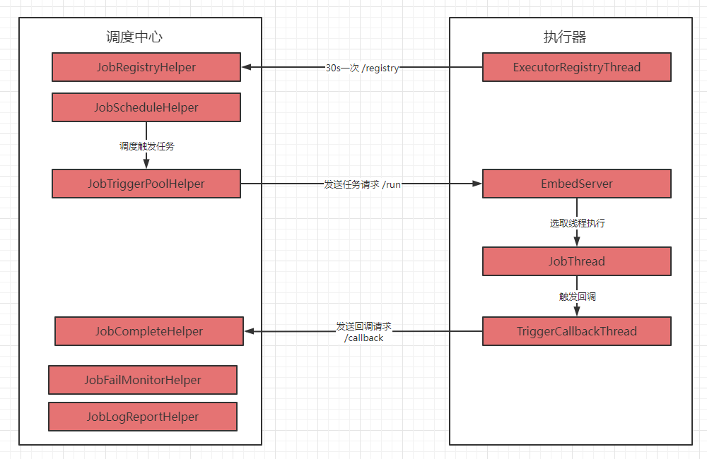
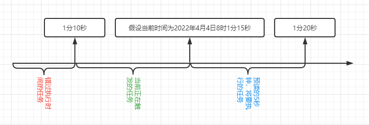

## 使用

1. 拉取对应版本源码，当前使用2.3.0。
2. 初始化数据库，`/xxl-job/doc/db/tables_xxl_job.sql`。
3. 启动调度中心。

* 修改配置文件。

  ```properties
  ### 调度中心访问地址，提供给 web 访问和 执行器注册、任务完成回调，当调度中心集群部署时，执行器 xxl.job.admin.addresses 需配置多个地址，以逗号分割
  server.port=8080
  server.servlet.context-path=/xxl-job-admin

  ### actuator
  management.server.servlet.context-path=/actuator
  management.health.mail.enabled=false

  ### resources
  spring.mvc.servlet.load-on-startup=0
  spring.mvc.static-path-pattern=/static/**
  spring.resources.static-locations=classpath:/static/

  ### freemarker
  spring.freemarker.templateLoaderPath=classpath:/templates/
  spring.freemarker.suffix=.ftl
  spring.freemarker.charset=UTF-8
  spring.freemarker.request-context-attribute=request
  spring.freemarker.settings.number_format=0.##########

  ### mybatis
  mybatis.mapper-locations=classpath:/mybatis-mapper/*Mapper.xml
  #mybatis.type-aliases-package=com.xxl.job.admin.core.model

  ### 调度中心JDBC、调度中心集群需配置相同
  spring.datasource.url=jdbc:mysql://127.0.0.1:3306/xxl_job?useUnicode=true&characterEncoding=UTF-8&autoReconnect=true&serverTimezone=Asia/Shanghai
  spring.datasource.username=root
  spring.datasource.password=root_pwd
  spring.datasource.driver-class-name=com.mysql.cj.jdbc.Driver

  ### datasource-pool
  spring.datasource.type=com.zaxxer.hikari.HikariDataSource
  spring.datasource.hikari.minimum-idle=10
  spring.datasource.hikari.maximum-pool-size=30
  spring.datasource.hikari.auto-commit=true
  spring.datasource.hikari.idle-timeout=30000
  spring.datasource.hikari.pool-name=HikariCP
  spring.datasource.hikari.max-lifetime=900000
  spring.datasource.hikari.connection-timeout=10000
  spring.datasource.hikari.connection-test-query=SELECT 1
  spring.datasource.hikari.validation-timeout=1000

  ### xxl-job, email
  spring.mail.host=smtp.qq.com
  spring.mail.port=25
  spring.mail.username=xxx@qq.com
  spring.mail.from=xxx@qq.com
  spring.mail.password=xxx
  spring.mail.properties.mail.smtp.auth=true
  spring.mail.properties.mail.smtp.starttls.enable=true
  spring.mail.properties.mail.smtp.starttls.required=true
  spring.mail.properties.mail.smtp.socketFactory.class=javax.net.ssl.SSLSocketFactory

  ### 调度中心与执行器间TOKEN,执行器需一样配置：非空时启用；
  xxl.job.accessToken=

  ### 调度中心国际化配置 [必填]： 默认为 "zh_CN"/中文简体, 可选范围为 "zh_CN"/中文简体, "zh_TC"/中文繁体 and "en"/英文；
  xxl.job.i18n=zh_CN

  ## 调度线程池最大线程配置【必填】
  xxl.job.triggerpool.fast.max=200
  xxl.job.triggerpool.slow.max=100

  ### 调度中心日志表数据保存天数 [必填]：过期日志自动清理；限制大于等于7时生效，否则, 如-1，关闭自动清理功能；
  xxl.job.logretentiondays=30
  ```
* 启动调度中心。

4.启动执行器。

* 引入`xxl-job-core`包。
* 修改配置文件。

  ```properties
  # web port
  server.port=8081
  # no web
  #spring.main.web-environment=false

  # log config
  logging.config=classpath:logback.xml


  ### 调度中心部署跟地址 [选填]：如调度中心集群部署存在多个地址则用逗号分隔。执行器将会使用该地址进行"执行器心跳注册"和"任务结果回调"；为空则关闭自动注册；
  xxl.job.admin.addresses=http://127.0.0.1:8001/xxl-job-admin

  ### 执行器通讯TOKEN,需和调度中心配置一样[选填]：非空时启用；
  xxl.job.accessToken=

  ### 执行器AppName，集群分组依据 [选填]：执行器心跳注册分组依据；为空则关闭自动注册
  xxl.job.executor.appname=xxl-job-executor-sample
  ### 执行器注册 [选填]：优先使用该配置作为注册地址，为空时使用内嵌服务 ”IP:PORT“ 作为注册地址。从而更灵活的支持容器类型执行器动态IP和动态映射端口问题。
  xxl.job.executor.address=
  ### 执行器IP [选填]：默认为空表示自动获取IP，多网卡时可手动设置指定IP，该IP不会绑定Host仅作为通讯实用；地址信息用于 "执行器注册" 和 "调度中心请求并触发任务"；
  xxl.job.executor.ip=
  ### 执行器端口号 [选填]：小于等于0则自动获取；默认端口为9999，单机部署多个执行器时，注意要配置不同执行器端口；
  xxl.job.executor.port=9999
  ### xxl-job executor log-path
  xxl.job.executor.logpath=./target/logs
  ### 执行器日志文件保存天数 [选填] ： 过期日志自动清理, 限制值大于等于3时生效; 否则, 如-1, 关闭自动清理功能；
  xxl.job.executor.logretentiondays=30
  ```
* 添加执行器启动配置。

  ```java
  @Configuration
  public class XxlJobConfig {
      private Logger logger = LoggerFactory.getLogger(XxlJobConfig.class);

      @Value("${xxl.job.admin.addresses}")
      private String adminAddresses;

      @Value("${xxl.job.accessToken}")
      private String accessToken;

      @Value("${xxl.job.executor.appname}")
      private String appname;

      @Value("${xxl.job.executor.address}")
      private String address;

      @Value("${xxl.job.executor.ip}")
      private String ip;

      @Value("${xxl.job.executor.port}")
      private int port;

      @Value("${xxl.job.executor.logpath}")
      private String logPath;

      @Value("${xxl.job.executor.logretentiondays}")
      private int logRetentionDays;


      @Bean
      public XxlJobSpringExecutor xxlJobExecutor() {
          logger.info(">>>>>>>>>>> xxl-job config init.");
          XxlJobSpringExecutor xxlJobSpringExecutor = new XxlJobSpringExecutor();
          xxlJobSpringExecutor.setAdminAddresses(adminAddresses);
          xxlJobSpringExecutor.setAppname(appname);
          xxlJobSpringExecutor.setAddress(address);
          xxlJobSpringExecutor.setIp(ip);
          xxlJobSpringExecutor.setPort(port);
          xxlJobSpringExecutor.setAccessToken(accessToken);
          xxlJobSpringExecutor.setLogPath(logPath);
          xxlJobSpringExecutor.setLogRetentionDays(logRetentionDays);

          return xxlJobSpringExecutor;
      }
  }
  ```
* 启动执行器。

5. 访问 `http://localhost:8080/xxl-job-admin`,密码 `admin/123456`。
6. 添加执行器。
7. 添加任务。

## 原理



### 名称

1. 调度中心：`xxl-job-admin`,完成负责任务调度和web管理。
2. 执行器：`xxl-job-core` 中 `XxlJobExecutor`，负责具体任务的执行。
3. 执行器组：具有相同 `xxl.job.executor.appname` 的多个执行器，可横向扩展，分片执行等。
4. 时间轮(TimeWheel)：轮询线程不再负责遍历所有任务，而是仅仅遍历时间刻度。好比指针不断在时钟上旋转、遍历，如果发现某一时间刻度上有任务，那么就会将任务队列上的所有任务都执行一遍，解决了遍历所有任务效率低的问题，同时插入、删除任务时间复杂度降为 O(1)。
5. 调度触发：任务提交到 执行线程池，等待 执行线程池 远程调用 执行器 执行。
6. 任务执行：远程调用 执行器 执行。
7. 已经完成的任务：包括成功任务和失败任务。
8. 成功任务：回调状态码为 200 的任务，即使用`XxlJobHelper.handleSuccess`设置返回结果，`XxlJobHelper.handleFail`可以设置失败结果。
9. 失败任务：`xxl_job_log` 中除了 回调状态码为`200(handle_code = 200)` 和 未调度任务或已经调度下发但未收到回调的任务`((trigger_code in (0, 200) and handle_code = 0)` 以外的任务都是失败任务。

### 调度中心

#### 核心组件

##### JobRegistryHelper

1. 负责管理执行器注册与注销，提供 `/registry` 和 `/registryRemove` 接口供执行器访问，执行器以每30秒一次的速率访问 `/registry` 接口,新增表 `xxl_job_registry` 数据或者更新 `updateTime`。
2. 自动发现执行器地址，并移除过期的执行器，调度中心以每30秒一次的速率删除过去90秒内没有调用`/registry`的执行器，同时发现新注册的执行器，并加入到设置为自动注册类型的执行器组中。

##### JobScheduleHelper

循环执行任务调度，单次调度流程如下：

1. 开启事务并使用 MySQL **X锁**查询 `xxl_job_lock` 表中`schedule_lock`，防止调度中心集群时对同一任务重复调度。
2. 从 xxl_job_info 获取 `triggerNextTime < 当前时间+5s(预读时间)` 的所有任务。
   
3. 循环执行任务，任务主要分为3种类型：
   1. 错过触发时间但还未触发的任务：`triggerNextTime < 当前时间-5s`，存在两种处理策略：放弃触发、立即触发，处理完成之后更新 `triggerNextTime`，该值为大于当前时间的下一次执行时间，更新后的 `triggerNextTime` 可能存在 3 种情况：
      * 停止执行。
      * `当前时间 和 当前时间+5s 之间`，等待下一次调度。
      * `大于 当前时间+5s`，等待下一次调度。
   2. 当前正在触发的任务：`当前时间-5s < triggerNextTime < 当前时间`，该类任务会直接触发，然后更新 `triggerNextTime`，更新后的 `triggerNextTime` 可能存在 3 种情况：
      * 停止执行。
      * `当前时间 和 当前时间+5s 之间`，加入到 时间轮 等待触发，并更新 `triggerNextTime`，该值为`大于 当前triggerNextTime` 的下一次执行时间。
      * `大于 当前时间+5s`，等待下一次调度。
   3. 将要执行的任务：`当前时间 < triggerNextTime < 当前时间+5s`，加入到 时间轮 等待触发，并更新 `triggerNextTime`，该值为`大于 当前triggerNextTime` 的下一次执行时间。
4. 更新最新的任务数据到 `xxl_job_info` ，并提交事务。
5. 跳过本秒剩余时间，当一次调度时间控制在1秒以内可以实现秒级调度，如果预读时间内没有任务，则之间跳过预读时间，防止空任务调度消耗资源。

###### 时间轮

目前使用的是 1 分钟的单层简单时间轮，一个时间刻度为 1 s，主要分为两部分：

* 任务池，数据结构为 `ConcurrentHashMap<Integer, List<Integer>>`，key 为某一分钟内的秒数，value 为该秒所需要执行的任务ID集合。
* 时间刻度推动线程，每秒运行一次，拾取当前刻度任务并清理该秒任务，然后执行，为防止单秒内所有任务触发时间 大于 1s 从而跨过刻度，所以取 当前刻度和前一个刻度任务。

##### JobTriggerPoolHelper

负责任务异步执行，并记录日志 `xxl_job_log`，存在两个线程池：

* `fastTriggerPool`：默认的执行线程池。
* `slowTriggerPool`：慢任务执行线程池，当一个任务在一分钟内 10次 远程调用时间超过 500ms,在这一分钟内则会被认为是慢任务，如果这一分钟内继续触发，则会使用该线程池执行。

远程调用路由策略，ExecutorRouter 子类：

* `第一个`：总是使用执行器组中第一个地址。
* `最后一个`：总是使用执行器组中最后一个地址。
* `轮询`：每天同一个job首次执行 或 同一天同一个job执行次数超过 1000000 时随机选出执行器组中一个地址，然后后续同一任务执行依次选取 地址，例如存在地址 A、B、C，当随机选举地址为 B，那么下一次选取的地址为C，再下次为A。
* `随机`：从执行器组中随机选取第一个地址。
* `一致性HASH`：首选获取 hash(jobId),hash(addresses)，然后取大于 hash(jobId) 的最小 hash(addresses)，若不存在取最小 hash(addresses)，保证分组下机器分配JOB平均且每个JOB固定调度其中一台机器。
* `最不经常使用`：每天同一个job首次执行 或 同一天同一个job同一地址执行次数超过 1000000 时，随机设置执行器组每个地址的执行次数，然后每次从中选出执行次数最少的地址。
* `最近最久未使用`：用 LinkedHashMap 的 AccessOrder 属性使元素按访问顺序排序，越早访问的key排在越前面，所以迭代时访问的第一个key就是最久未使用的。
* `故障转移`：顺序使用 /beat 接口轮询每个地址，使用第一个可以访问的地址。
* `忙碌转移`：顺序使用 /idleBeat 接口轮询每个地址，使用第一个不忙碌的地址。
* `分片广播`：对执行器组中的所有地址发送执行请求，并加上参数 分片Index 、分片总数，分片Index 为执行器 在 执行器组 中的索引，执行器可通过该值判断执行部分业务，获取方法`int shardIndex = XxlJobHelper.getShardIndex();` `int shardTotal = XxlJobHelper.getShardTotal();`

##### JobCompleteHelper

负责两部分功能：

1. 处理执行器完成任务后回调，更新任务日志，若回调状态码为200则触发关联子任务。
2. 处理10分钟未完成且执行器掉线的任务，更新任务日志为失败，1分钟执行一次。

##### JobFailMonitorHelper

负责处理失败任务：

1. 如果任务设置了重试次数，发起重试，并将重试次数减1。
2. 如果设置了警告邮箱，发送警告邮件。

任务运行间隔为10s，处理失败任务时使用乐观锁 (`UPDATE xxl_job_log SET alarm_status = #{newAlarmStatus} WHERE id = #{logId} AND alarm_status = #{oldAlarmStatus}`) 将 `alarm_status` 更新为 -1 ，避免对失败任务进行多次处理。

##### JobLogReportHelper

负责两部分功能：

1. 统计最近3天每天的任务数量、失败数量、成功数量，保存到 `xxl_job_log_report`。
2. 根据 `xxl.job.logretentiondays` 配置清理 `xxl_job_log` 日志。

### 执行器

即 `xxl-job-core` 中 `XxlJobExecutor`，存在两个子类 `XxlJobSimpleExecutor`、`XxlJobSpringExecutor`，分别用于无框架和spring框架初始化。

#### 核心组件

##### ExecutorRegistryThread

以每30秒一次的速度调用 `/registry` 向调度中心注册，当执行器正常关闭时调用 `/registryRemove` 向调度中心注销。

##### EmbedServer

一个netty服务端，默认端口为`9999`，通过 `XxlJobExecutor` 的 port 属性配置，主要负责接受 调度中心 的任务执行请求，加入到对应的 `jobId` 的 `JobThread`，如果 `JobThread` 不存在则新建一个，例如 Glue(Java) 方式调用。

##### JobThread

`XxlJobSimpleExecutor` 或 `XxlJobSpringExecutor` 扫描 `@XxlJob` 的方法生成 `IJobHandler`类型 的Bean，然后给每个任务 bean 默认生成一个 `JobThread`。

`JobThread`中存在一个触发任务队列`LinkedBlockingQueue<TriggerParam>`,线程会循环从中获取任务出来执行，如果 3 * 30 秒没有任务则关闭该线程释放资源，等下次接收到调度中心请求时，由 EmbedServer 创建。

对执行完成或者执行失败的线程使用 `TriggerCallbackThread` 进行回调，另外当执行器正常停止，触发任务队列中还有未执行完的任务，全部任务执行失败进行回调。

##### TriggerCallbackThread

负责对已经完成的任务进行回调，存在一个回调缓冲队列`LinkedBlockingQueue<HandleCallbackParam>`,每次从队列中取出所有回调参数，然后循环对调度中心集群进行请求，若一个成功即为成功，如果全部失败则将调度参数转换成字节数组写入文件。

并且每30秒一次扫描回调失败日志目录，对回调进行重试。

##### ExecutorBlockStrategyEnum

任务执行策略：

1. 串行执行：默认策略，同一任务调度请求进入队列并以串行方式运行。
2. 丢弃后续调度：调度请求进入单机执行器后，发现执行器存在运行的调度任务，本次请求将会被丢弃并标记为失败。
3. 覆盖之前调度：调度请求进入单机执行器后，发现执行器存在运行的调度任务，将会终止运行中的调度任务并清空队列，然后运行最新的调度任务。
