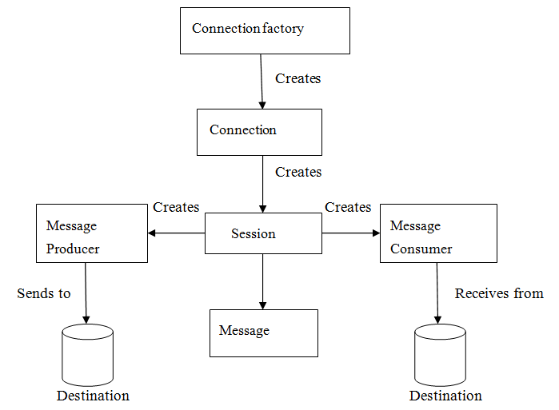
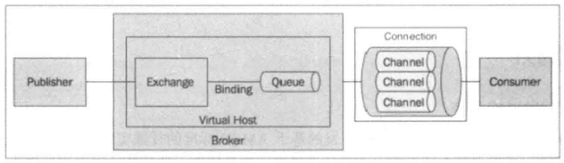
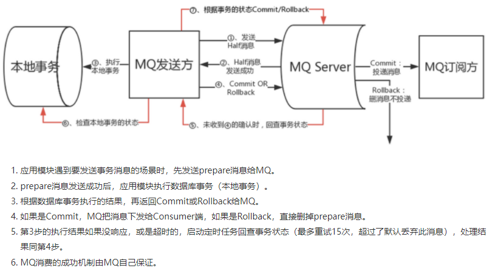

## JMS

两种模式：

1. 点对点模式。

* 每条消息只有一个接收者且只会传递给一个接受者，消息一旦被接收就不再保留在消息队列。
* 发送者和接收者在时间上没有依赖。
* 消息会按先后顺序发送给接收者，当接收者收到消息时，会发送确认收到通知。

2. 发布订阅模式。

* 每条消息有多个订阅者，每条消息会传送给所有订阅者。
* 发布者和订阅者有时间依赖，订阅者必须保持运行才能接收到消息。
* 发布者不知道哪个订阅者在接收消息。

组件：

1. JMS 客户端，用来发送和接收消息的Java程序。
2. 消息。
3. JMS Provider，实际的消息中间件。
4. 受管对象，分为 `ConnectionFactory` (用来创建连接) 和 `Destination` （指定消息目的地）。

概念：

1. `Queue`，点对点模型中的队列。
2. `Topic`，发布订阅模型中的主题。

1.0接口：

1. `ConnectionFactory`：分为 `QueueConnectionFactory` 和 `TopicConnectionFactory`。
2. `Destination`：`Queue` 和 `Topic`。
3. `Connection`：`QueueConnection` 和 `TopicConnection`。
4. `Session`：`QueueSession` 和 `TopicSession`。
5. `MessageProducer`：`QueueSender` 和 `TopicPublisher`。
6. `MessageConsumer`：`QueueReceiver` 和 `TopicSubscriber`。
7. `Message`。
8. `MessageListener`：当消息到达时调用 `onMessage`。

2.0接口：

1. `JMSContext`：替换 `Connection` 和 `Session`。
2. `JMSProducer`：替换 `MessageProducer`。
3. `JMSConsumer`：替换 `MessageConsumer`。

## RabbitMQ

RabbitMQ 是 AMQP 协议的开源实现。

`Exchange`：接收生成者发送的消息，将消息路由给服务器中的队列。

* `Direct`交换器：需要路由键和绑定键一致，交换器就将消息发送到对应的队列中，完全匹配、单播模式。
* `Fanout`交换器：不处理路由键，发送到与交换器绑定的所有队列，子网广播。
* `Topic`交换器：把路由键和绑定键模式匹配，发送到匹配上的队列。·

`Binding`：Exchange 到 Queue 的路由表。

`VirtualHost`：一组 `Exchange -> Binding -> Queue` 的独立服务器域，默认`vhost`为 `/`。

## ActiveMQ

支持TCP、UDP、NIO、SSL、HTTP、HTTPS、Websocket、AMQP、MQTT、STOMP等协议，每种协议都有对应的传输连接器，生产和消费都需要连接到消息代理服务器。

消息转发模式：`PERSISTENT` 和 `NON_PERSISTENT`,可使用 `MessageProducer` 接口中 `send` 方法的 `deliveryMode` 参数来设置，可以选择JDBC、文件等。

消息过期时间： 可使用 `MessageProducer` 接口中 send 方法的 `timeToLive` 参数来设置，`timeToLive` 设置为 0 时表示消息永不过期。

死信队列：默认6次发送消息给消费者，都抛出异常不被确认，则会投入死信队列。

应答模式：

* `AUTO_ACKNOWLEDGE`：消费者调用 `onMessage` 方法成功时，`Session` 自动签收消息，缓存在 session 中，等达到阀值后延迟批量提交 。
* `CLIENT_ACKNOWLEDGE`：消费者调用 `onMessage` 方法成功，手动调用 Message 的 `acknowledge` 方法。
* `DUPS_OK_ACKNOWLEDGE`：消费者按照一定策略向broker发送ack标识，标识一批消息处理完成。
* `INDIVIDUAL_ACKNOWLEDGE`：不建议使用。

## RocketMQ

### 名词

1. 生产者:

* 同步发送：收到接收方响应之后才发送下一个数据包，一般适用于重要通知消息场景。
* 异步发送：不等待接收方发送下一个数据包，一般适用于链路耗时较长而对响应时间敏感的业务场景。
* 单向发送：不等待服务器响应也没有触发函数，用于可靠性要求不高的场景。

2. 生产者组：一类生产者的集合。
3. 消费者：

* Pull模式：主动从消息服务器拉取消息。
* Push模式：封装消息拉取、消费进度和其他内部维护工作，将消息到达时执行的回调接口留给应用程序。

4. 消费者组：一类消费者的集合，通过消费者组实现消息分发到多个消费者，实现水平扩展。
5. 消息服务器：

* 单Master。
* 多Master，消息分布在多台Master间。
* 多Master多slave，同步双写，主备都写成功了才返回成功。
* 多Master多slave，异步复制，为每个Master配置一个slave。

6. 名称服务器：用来保存 Broker 相关元信息并提供给生产者和消费者查询。
7. 标签：Topic 下消息的第二级类型，比如交易消息中分为交易创建消息，交易完成消息等。
8. 消费模式：

* 集群消费：一个消费者集群消费一个主题的多个队列，一个队列只会被一个消费者消费。
* 广播消费：消息发送给消费者组中的每个消费者。

### 事务消息

本地事务 + 发送消息 原子性。

