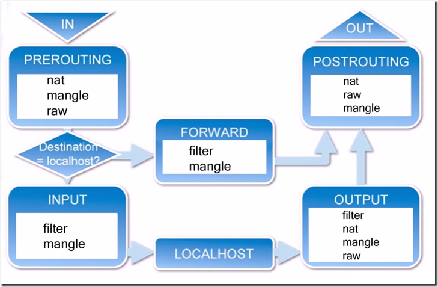
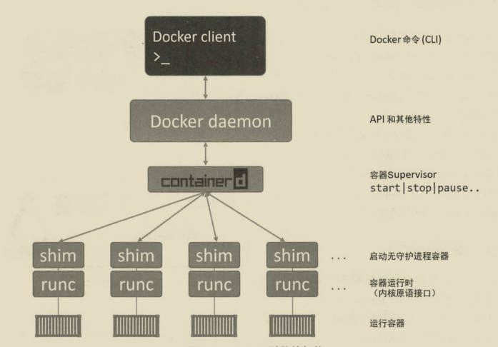

## 基本概念

容器和虚拟机的区别：

1. 容器由两部分组成：应用程序和依赖，容器在用户空间运行与操作系统的其他进程隔离，多个容器共享一个操作系统，容器体积小、启动速度快、开销更小、可移植，属于操作系统虚拟化。
2. 虚拟机包含应用、依赖、操作系统，目标是创建完整的虚拟机,属于硬件虚拟化。

Base 镜像：

1. 不依赖其他镜像，从`scratch`创建。
2. 其他镜像可以以之为基础进行扩展。

通常都是各种Linux发行版的镜像，如 Ubuntu、Debian、CentOS。

Linux操作系统由内核空间和用户空间组成，用户空间的文件系统是`rootfs`，对于Base镜像使用的是宿主机的Kernel，只需要提供`rootfs`，所以文件大小远小于操作系统。

镜像分层:Docker 通过现有镜像创建新的镜像，镜像是分层结构的，这样可以让每一层的镜像共享。当某个容器修改了基础镜像的内容并不会影响其他镜像，因为使用了`CopyOnWrite` 特性，修改被限制在单个容器。

可写容器层：当容器启动时，一个新的可写层被加载到镜像层的顶部，只有容器层是可写的，容器层下的所有镜像层都是只读的，无论添加、删除、修改文件都只会发生在容器层。

在容器层用户看到的是一个叠加后的文件系统，如果不同层中有一个相同路径的文件，用户只能访问到上层的文件。

* 添加文件：新文件被添加到容器层。
* 读取文件：从上往下依次在个镜像层查找文件，一旦找到，打开并读入内存。
* 修改文件：从上往下依次在个镜像层查找文件，一旦找到，复制到容器层，然后修改。
* 删除文件：从上往下依次在个镜像层查找文件，一旦找到，在容器中记录此删除操作。

## 构建镜像

将现有容器保存为新镜像：`docker commit <container-id> <new-image-id>`,不推荐使用，推荐 Dockerfile 构建，底层也是 docker
commit 一层层构建的。

### Dockerfile

1. 新建一个目录用来创建`docker`镜像

```bash
cd /data/docker-iso/jdk/jdk1.8
```

2. 上传`jdk-8u231-linux-x64.tar.gz`到该目录

```bash
cp /data/tools/jdk-8u231-linux-x64.tar.gz /data/docker-iso/jdk/jdk1.8/
```

3. 创建`Dockerfile`

```bash
touch Dockerfile
```

4. 修改`Dockerfile`，内容如下

```dockerfile
#依赖镜像名称和ID
FROM centos:7
#指定镜像创建者信息
MAINTAINER JYX
#切换工作目录
WORKDIR /data
RUN mkdir -p /data/runtime/jdk
#ADD 是相对路径jar,把java添加到容器中
ADD jdk-8u231-linux-x64.tar.gz /data/runtime/jdk
#配置java环境变量
ENV JAVA_HOME /data/runtime/jdk/jdk1.8.0_231
ENV JRE_HOME $JAVA_HOME/jre
ENV CLASSPATH $JAVA_HOME/lib/dt.jar:$JAVA_HOME/lib/tools.jar:$JRE_HOME/lib:$CLASSPATH
ENV PATH $JAVA_HOME/bin:$PATH
```

5. 根据`Dockerfile`创建镜像。注意后面的空格和点不要省略,点表示 上下文环境为当前目录，docker 会从上下文环境中查找 `Dockerfile`。

```bash
docker build -t='jdk1.8:latest' .
```

docker 会将 build context 中的所有文件发送给 Docker daemon，所以构建是应使用新建文件夹，并且不要放多余文件。

build 时会创建缓存，如果 `Dockerfile` 中命令顺序一致且相同就会使用缓存，`--no-cache` 构建镜像时不使用镜像缓存。

可以通过`docker history <image-id> --no-trunc`查看构建历史。

dockerfile 构建时某个中间节点失败，这个节点之前构建的中间镜像可以启动，可以在这个节点上调试，排查构建失败的原因。
镜像名称分为两部分： `[image name] = [repository]:[tag]`,如果`[tag]`不指定默认为 `latest`，该值可以是任何字符串，`latest`并不一定代表最新版本。

### 常用指令

* `FROM` ： 指定 Base 镜像。
* `MAINTAINER` ：镜像作者，任意字符串。
* `COPY` ：将文件从 build context 复制到镜像，如 `COPY <src> <dest>` 或 `COPY ["<src>","<dest>"]`。
* `ADD` ： 将文件从 build context 复制到镜像，如果`src`是归档文件(`tar`、`zip`、`tgz`、`xz`)等，会自动解压。
* `ENV` ： 设置环境变量，环境变量可以被后面的指令使用。
* `EXPOSE` ：声明容器中的进程会监听某个端口，不会自动在宿主机进行端口映射，可以使用 `docker run -P` 自动随机映射该端口。
* `VOLUME` : 声明匿名挂载卷，无法指定对应的宿主机目录，会自动生成，可以使用 `docker run -it -v <宿主机路径>:<容器路径> <image-id>`指定明确的宿主机路径进行覆盖
* `WORKDIR` ：为后面的 `RUN` 、`CMD` 、`ENTRYPOINT` 、`ADD` 、`COPY` 设置镜像中的当前工作目录。
* `RUN` ：容器中运行指定的命令，执行命令并创建新的镜像层，常常用于安装软件包。
* `CMD` : 容器是进程，`CMD`是容器启动时运行的程序和参数，`dockerfile` 中可以有多个 CMD 指令，但只有最后一个生效，CMD 可以被 `docker run` 后面的参数替换，如: ubuntu 镜像默认的 CMD 是 `/bin/bash` ，可以使用`docker run -it ubuntu cat /etc/os-release` 将 CMD 替换成 `cat /etc/os-release` 。
* `ENTRYPOINT` ：dockerfile 中可以有多个 `ENTRYPOINT` 指令，但只有最后一个生效，当指定了 `ENTRYPOINT` 后，CMD 的含义就发生了改变，不再是直接的运行其命令，而是将 CMD 的内容作为参数传给 `ENTRYPOINT` 指令,实际变为 `ENTRYPOINT "<CMD>"`,例如：

  ```dockerfile
  ENTRYPOINT ["/bin/chamber", "exec", "production", "--"]
  CMD ["/bin/service", "-d"]
  ```

  实际会变为 `["/bin/chamber", "exec", "production", "--", "/bin/service", "-d"]`，docker run 后面如果还有参数，会将 CMD 替换后拼接在后面。

  Shell 格式：`<instruction> <command>` 实际调用 `/bin/sh -c <command>`。

  Exec 格式：`<instruction> ["<executable>","<param1>","<param2>"...]`,实际会直接调用 command 不会被 shell 解析。

## 网络

网络组件包括：

1. `Sandbox`：容器的网络栈，包含`interface`、路由表和DNS。
2. `Endpoint`：将 `Sandbox` 接入 `Network`，一个 `Endpoint` 只能属于一个`Network`，一个`Sandbox` 可以有多个 `Endpoint`。
3. `Network`：`Network` 包含一组 `Endpoint`，同一个 `Network` 的 `Endpoint` 可以通信。

docker 安装时会自动在 `host` 上创建三个网络，可通过 `docker network ls` 查看，`docker run` 时通过 `--network` 指定网络。

* `none`网络：不需要网络
* `host`网络：与宿主机在同一个网络中，但没有独立IP地址，使用宿主机的IP和端口

`bridge`网络：docker 安装时会创建名为 `docker0` 的网桥，如果不指定 `--network`,容器中的虚拟网卡默认会挂到 `docker0`，容器中网络的网关即为`docker0`，所以多个容器在同一个网段下面，可以互相访问，可以通过 `docker network inspect <network-name>`查看。

自定义网络：通过 `docker network create <network-name>`创建网络，`--driver` 选择驱动，驱动有`bridge`、`overly`、`macvlan`，`--subnet`和`--gateway` 自定义网关和子网。

网络通信：

* 容器间通信需要有同属于同一网络的网卡。
* 在自定义网络中容器间可以通过容器名称通信，docker daemon 内嵌了一个 DNS server，`bridge`网络不行。
* 创建容器时可使用`--network=container:<container-name>` joined其他容器网络，他们会共享网络栈，使用相同 的ip。

网络数据流经`iptable`规则：



1. 当一个数据包进入网卡时，它首先进入`PREROUTING`链，内核根据数据包目的IP判断是否需要转送出去。
2. 如果数据包就是进入本机的，它就会沿着图向下移动，到达`INPUT`链。数据包到了`INPUT`链后，任何进程都会收到它。本机上运行的程序可以发送数据包，这些数据包会经过`OUTPUT`链，然后到达`POSTROUTING`链输出。
3. 如果数据包是要转发出去的，且内核允许转发，数据包就会如图所示向右移动，经过`FORWARD`链，然后到达`POSTROUTING`链输出。

容器和外网之间的访问需要将`/proc/sys/net/ipv4/ip_forward`值改为1。

容器访问外网：

docker 会在 `iptable` 规则表中添加 `POSTROUTING`规则`iptables -t nat -A POSTROUTING -o docker0 -s 192.168.1.0/24 -j MASQUERADE`，表示所有来自 `192.168.1.0/24` 子网，流出`docker0` 的数据包源地址交由系统伪装。

外网访问容器：

docker 会在 `iptable` 规则表中添加 `PREROUTING`规则`iptables -t nat -I PREROUTING -i eth0 -p tcp -m tcp --dport 7001 -j DNAT --to-destination 172.20.0.7:7001`，表示所有从`eth0`进入目的端口为7001的数据包都发送到 `172.20.0.7:7001` 去处理。

多主机网络共享：

`overlay`方式：

1. 在 host1 创建一个 `overlay` 类型网络，`docker network create -d verlay <network-name>`
2. 在 host1 创建连接到 `overlay` 网络的容器，`docker run -d --network <network-name> <image-id>`,这时docker 会创建`docker_gwbridge` 的网络，为所有连接到 `overlay` 网络的容器提供访问外网能力。
3. 在 host2 创建连接到 `overlay` 网络的容器，可通过 host1 中容器名 访问 host1 中连接到 overlay网络的容器。

不同名称的overlay网络互相隔离，可以通过`docker network connect <network-name> bbox3`来加入网络。

## 存储

容器有两种存放数据的资源：

1. 由 storage driver 管理的镜像层和容器层，不同的文件系统使用不同的驱动，docker会选择合适的驱动使用。
2. Data Volume：
    * 是宿主机的目录或者文件，被 `mount` 到容器的文件系统，不是没有格式化的磁盘(块设备)。
    * `volume` 可以被容器读写，容器销毁后也可以永久保存。

使用方法：

1. `docker run` 时添加参数 `-v <host-path>:<container-path>`,可以挂载文件和目录，会隐藏`<container-path>`中的文件，使用`<host-path>`目录中的文件。
2. `docker run` 时添加参数 `-v <container-path>`，可以挂载目录，会自动挂载到宿主机 `/var/lib/docker/volumes/<container-id>/_data`,会将`<container-path>`中的文件复制到该路径，这点与上面挂载不相同，可通过 `docker inspect <container-id>`查看

删除没有使用的volume：`docker volume rm ${docker volume ls -q}`

### Volume数据共享

1. 多个容器 `mount` 同一个目录。
2. volume container：专门为其他容器提供 volume 的容器。

   创建volume container：`docker create --name <name> -v <host-path>:<container-path> <image-id>`

   使用volume container：`--volumes-from <volume-container-name>`

## 常用配置

文件目录为：`/etc/docker/daemon.json`

添加镜像仓库：

```json
{
  "registry-mirrors": [
    "https://registry.docker-cn.com"
  ]
}
```

## 常用命令

```bash

# 查看 client 和 引擎 是否正常启动并通信docker version
# 查看镜像
docker images
# 删除镜像
docker rmi <image-id>
# 查看正在运行容器，可添加 -a 显示所有容器，包含已经停止的容器
docker ps
# 拉取镜像
docker pull ubuntu:16.04
# 从指定仓库拉取镜像
docker pull <仓库域名>/<路径,docker hub 为用户id>/<镜像>:<版本>
如：docker pull registry.docker-cn.com/library/ubuntu:16.04

# 后台启动容器
# -m 限制内存使用限额
# --ip 指定静态ip
# --restart always 自动重启
docker run -d --name="<name>" <image-id>
# 以交互模式运行容器，并打开终端,临时使用
docker run  -it --name="<name>" <image-id> /bin/bash
# 进入容器正在执行某个命令的终端，不能在里面操作,如果启动使用了 -it 参数可使用 ctrl+P+Q 退出不会结束进程，ctrl+C 会退出进程
docker attach <container-id>
# 进入当前容器后开启一个新的终端，可以在里面操作，退出后不会结束进程
docker exec -it <container-id> /bin/bash
# 停止容器
docker stop <container-id>
# 暂停容器,不会占用CPU资源，通过 docker unpause 恢复运行
docker pause <container-id>
# 删除容器
docker rm <container-id>
# 查看启动命令输出
docker logs -f <container-id>
# 给容器添加网卡，容器间通信需要有同属于同一网络的网卡。
docker network connect  <network-name> <container-id>
# 监控容器中进程
docker container top <container-id>
# 查看容器资源使用情况
docker container stats | grep <container-id>
# 查看docker日志
docker logs -f <container-id>
# 查看容器元数据
docker inspect <container-id>
# 宿主机和docker之间文件复制
docker cp acbfb53afc52:/etc/nginx/nginx.conf /opt/
docker cp /opt/nginx.conf acbfb53afc52:/etc/nginx/
```

## 示例

```Shell
#!/bin/bash
############################################
# this script function is :
# deploy new docker container
#
# USER        YYYY-MM-DD - ACTION
# junsansi    2016-01-25 - CREATED
#
############################################

parasnum=7
# function
help_msg()
{
cat << help
+----------------------------------------------------+
+ Error Cause:
+ you enter $# parameters
+ the total paramenter number must be $parasnum
+ 1st :DOCKER_PATH
+ 2nd :DOCKER_NAME
+ 3rd :PROJ_VERSION
+ 4th :SPORT
+ 5th :JAR_NAME
+ 6th :DUGPORT
+ 7th :SPRING_PROFILES_ACTIVE
+----------------------------------------------------+
help
}

# ----------------------------------------------------
# Check parameter number
# ----------------------------------------------------
if [ $# -ne ${parasnum} ]
then
        help_msg
        exit
fi

# ----------------------------------------------------
# Initialize the parameter.
# ----------------------------------------------------
DOCKER_PATH=$1
DOCKER_NAME=$2
PROJ_VERSION=$3
SPORT=$4
JAR_NAME=$5
DUGPORT=$6
SPRING_PROFILES_ACTIVE=$7

DOCKER_FILE="${DOCKER_PATH}/dockerfiles/${DOCKER_NAME}/Dockerfile"
DOCKER_FILE_DIR=${DOCKER_PATH}/dockerfiles/${DOCKER_NAME}
if [ ! -d ${DOCKER_FILE_DIR} ]; then
        mkdir -p ${DOCKER_FILE_DIR}
fi

# ----------------------------------------------------
# check docker images
# ----------------------------------------------------
DOCKER_IMAGE=`docker images | grep ${DOCKER_NAME} | awk -F ' ' '{print $3}'`
if [ -n "${DOCKER_IMAGE}" ]; then
        # check docker container
        for dc in `docker ps -a | grep ${DOCKER_NAME} | awk -F " " '{print $1}'`
        do
                echo "Stop container: ${dc}"
                docker stop ${dc}
                # delete while docker container was exists
                echo "##Delete exists Container_Id: "${dc}
                docker rm ${dc}
        done

        # delete while docker image was exists
        echo "##Delete exists Image: "${DOCKER_IMAGE}
        docker rmi ${DOCKER_IMAGE}
fi
echo ""

# ----------------------------------------------------
# Init dockerfile
# ----------------------------------------------------
echo "**Init dockerfile start: "${DOCKER_FILE}

#第一行必须指令基于的基础镜像
echo "FROM openjdk:8-jre-alpine" > ${DOCKER_FILE}

#格式为maintainer ，指定维护者的信息
echo "MAINTAINER wangzunbin <905192187@qq.com>" >> ${DOCKER_FILE}

#指定一个环境变量，会被后续 RUN 指令使用，并在容器运行时保持
echo "VOLUME /tmp" >> ${DOCKER_FILE}

#增强版的COPY，支持将远程URL的资源加入到镜像的文件系统
echo "ADD *.jar app.jar" >> ${DOCKER_FILE}
#格式为Run 或者Run [“executable” ,”Param1”, “param2”]
#前者在shell终端上运行，即/bin/sh -C，后者使用exec运行。例如：RUN [“/bin/bash”, “-c”,”echo hello”]
#每条run指令在当前基础镜像执行，并且提交新镜像。当命令比较长时，可以使用“/”换行。
#echo "RUN bash -c 'touch /app.jar'"  >> ${DOCKER_FILE}

#挂载运行日志
#VOLUME /var/log/xzn/

#配置容器启动后执行的命令，并且不可被 docker run 提供的参数覆盖。
#每个Dockerfile中只能有一个 ENTRYPOINT ，当指定多个时，只有最后一个起效。
echo 'ENTRYPOINT ["sh","-c","java ${JAVA_OPTS} -Dspring.profiles.active=${SPRING_PROFILES_ACTIVE} -Dserver.port=${SERVER_PORT} -jar /app.jar"]' >> ${DOCKER_FILE}
echo 'EXPOSE ${SERVER_PORT}' >> ${DOCKER_FILE}
cat ${DOCKER_FILE}
echo "**Init dockerfile end."


# ----------------------------------------------------
# Build dockerfile
# ----------------------------------------------------
cd ${DOCKER_FILE_DIR}
rm *.jar -rf
mv ${DOCKER_PATH}/${JAR_NAME} ./
echo ""
echo "##Build dockerfile for "${DOCKER_NAME}
docker build -t ${DOCKER_NAME}:${PROJ_VERSION} .


# ----------------------------------------------------
# Run docker container
# ----------------------------------------------------
echo ""
echo "##Running docker container: "${DOCKER_NAME}

#解决时区的问题
echo docker run --name=${DOCKER_NAME} -e TZ="Asia/Shanghai" -e "SPRING_PROFILES_ACTIVE="${SPRING_PROFILES_ACTIVE} -e "SERVER_PORT="${SPORT} -e "JAVA_OPTS=-Xmx1024m -agentlib:jdwp=transport=dt_socket,server=y,suspend=n,address="${DUGPORT} --net host -d ${DOCKER_NAME}:${PROJ_VERSION}

docker run --name=${DOCKER_NAME} -e TZ="Asia/Shanghai" -e "SPRING_PROFILES_ACTIVE="${SPRING_PROFILES_ACTIVE} -e "SERVER_PORT="${SPORT} -e "JAVA_OPTS=-Xmx1024m -agentlib:jdwp=transport=dt_socket,server=y,suspend=n,address="${DUGPORT} --net host -d ${DOCKER_NAME}:${PROJ_VERSION}

echo ""
```

## Docker组件

Docker组件分为 Docker client、Docker daemon、containerd、runc，Docker client和Docker daemon在 Linux 中使用 UNIX Socket 通信。



### runc

`runc` 是 OCI 规范的具体实现，它的作用是 创建容器，是独立的容器运行时。

### containerd

`containerd` 负责管理容器的生命周期，`start|stop|pause|rm`。

## DockerCompose

### 安装

```bash
# 下载指令 uname -s 请查询linux中uname命令
curl -L https://github.com/docker/compose/releases/download/1.26.0/docker-compose-`uname -s`-`uname -m` > /usr/local/bin/docker-compose
# 下载完成后没有执行权限, 添加执行权限
chmod +x /usr/local/bin/docker-compose
```

> uname命令显示多个系统信息，包括Linux内核体系结构，名称版本和发行版。
> 要找出系统上正在运行的Linux内核版本，请输入以下命令：
> `uname -srm`
> 输出信息如下：
> Linux 4.15.0-54-generic x86_64

验证：

```bash
# 查看版本指令
[root@worker ~]# docker-compose version
# 输出内容
docker-compose version 1.26.0, build d4451659
docker-py version: 4.2.1
CPython version: 3.7.7
OpenSSL version: OpenSSL 1.1.0l  10 Sep 2019
```

### 配置文件

Compose 文件的默认路径是 `./docker-compose.yml`，即`docker-compose`命令需要在 `docker-compose.yml` 同层目录执行。

#### 文件结构

```yaml
# Compose配置文件分为四个部分：version、services、networks和volumes。
# 其中version指定Compose配置文件的版本，services定义服务，networks定义网络，volumes定义数据卷

version: "3.8"
services:
  # 服务名 随便起,不重名就行
  redis:
    # 镜像名 (本地拥有的镜像或者公共仓库的镜像),以下格式都ok
    # image: redis
    # image: ubuntu:14.04
    # image: tutum/influxdb
    # image: example-registry.com:4000/postgresql
    # image: a4bc65fd
    # 除了这种方式指定镜像外还可以使用build方式来指定，详情见下文 采用 Dockerfile 来构建镜像
    image: redis:alpine
    # 端口映射规则 例： - "6379:6379" 宿主机:容器
    ports:
      - "6379"
    # 加入到 frontend 网络，可以加入多个网络，例如:
    # - frontend
    # - backend
    # 其中frontend、backend需要在顶级networks中配置，如果不配置，Compose 默认设置一个网络，详情见下文 网络配置。
    networks:
      - frontend
    deploy:
      replicas: 2
      update_config:
        parallelism: 2
        delay: 10s
      restart_policy:
        condition: on-failure

  db:
    image: postgres:9.4
    #挂载卷 host：container 详情见下文 volumes
    volumes:
      - db-data:/var/lib/postgresql/data
    networks:
      - backend
    deploy:
      placement:
        constraints:
          - "node.role==manager"

  vote:
    image: dockersamples/examplevotingapp_vote:before
    ports:
      - "5000:80"
    networks:
      - frontend
    #依赖启动顺序 详情见下文 depends_on
    depends_on:
      - redis
    deploy:
      replicas: 2
      update_config:
        parallelism: 2
      restart_policy:
        condition: on-failure

  result:
    image: dockersamples/examplevotingapp_result:before
    ports:
      - "5001:80"
    networks:
      - backend
    depends_on:
      - db
    deploy:
      replicas: 1
      update_config:
        parallelism: 2
        delay: 10s
      restart_policy:
        condition: on-failure

  worker:
    image: dockersamples/examplevotingapp_worker
    networks:
      - frontend
      - backend
    deploy:
      mode: replicated
      replicas: 1
      labels: [ APP=VOTING ]
      restart_policy:
        condition: on-failure
        delay: 10s
        max_attempts: 3
        window: 120s
      placement:
        constraints:
          - "node.role==manager"

  visualizer:
    image: dockersamples/visualizer:stable
    ports:
      - "8080:8080"
    stop_grace_period: 1m30s
    volumes:
      - "/var/run/docker.sock:/var/run/docker.sock"
    deploy:
      placement:
        constraints:
          - "node.role==manager"

networks:
  frontend:
  backend:

volumes:
  db-data:
```

#### 采用 Dockerfile 来构建镜像

前面目录结构中是通过 image 这个配置，这个相对简单，给出能在镜像仓库中找到镜像的名称即可。

另外一种指定镜像的方式就是直接采用 Dockerfile 来构建镜像，通过 build 这个配置我们能够定义构建的环境目录，与 `docker build`
中的环境目录是同一个含义。

如果我们通过这种方式指定镜像，那么 Docker Compose 先会帮助我们执行镜像的构建，之后再通过这个镜像启动容器。

在构建时应用的配置项。一般直接指定Dockerfile所在文件夹路径，可以是绝对路径，或者相对于Compose配置文件的路径。可以指定为包含构建上下文（context）路径的字符串。例如：

```yaml
version: "3.8"
services:
  webapp:
    build: ./dir
```

也可以使用context指定上下文路径，使用dockerfile基于上下文路径指定Dockerfile文件，使用`args`指定构建参数。例如：

```yaml
version: "3.8"
services:
  webapp:
    build:
      #指定包含Dockerfile的目录路径或git仓库url。该目录是发送给Docker守护进程（Daemon）的构建上下文（context）。当配置的值是相对路径时，它将被解释为相对于Compose配置文件的路径。
      context: ./dir
      #指定Dockerfile文件。Compose会使用指定的Dockerfile文件构建镜像，但必须要指定构建上下文路径。
      dockerfile: Dockerfile-alternate
      # 使用之前首先需要在Dockerfile文件中指定参数，例如在dockerfile中添加以下配置：
      # ARG buildno
      # RUN echo "Build number: $buildno"
      # 指定参数的其他写法，详情见下文 args详细
      args:
        buildno: 1
```

如果同时指定了build和image。例如：

```yaml
build: ./dir
image: webapp:tag
```

Compose会在`./dir`目录下构建一个名为`webapp`，标签为`tag`的镜像。

##### args详细

build中指定参数，以下两种写法都可以：

```yaml
build:
  context: .
  args:
    buildno: 1
    gitcommithash: cdc3b19
```

```yaml
build:
  context: .
  args:
    - buildno=1
    - gitcommithash=cdc3b19
```

这时构建过程中使用的参数的值为`args`指定的值。在指定构建参数时也可以不指定值，在这种情况下，构建过程中使用的参数的值为运行Compose的环境中的值。例如：

```yaml
args:
  - buildno
  - gitcommithash
```

#### 网络配置

Compose 默认给你的 app 设置一个网络，service 中的每个容器默认都加入这个网络，容器之间彼此是互通的，可以利用容器名字识别到。

例如 `docker-compose.yml`：

```yaml
version: "3"
services:
  web:
    build: .
    ports:
      - "8000:8000"
  db:
    image: postgres
    ports:
      - "8001:5432"
```

假设，上面这个文件放在 `myapp` 文件夹下。那么，当你 `docker-compose up -d` 之后：

- 一个叫 `myapp_default` 网络被创建；
- 一个使用 web 配置的容器会被创建，它以 `web` 的名字加入了 `myapp_default` 这个网络；
- 一个使用 db 配置的容器会被创建，它以 `db` 的名字加入了 `myapp_default` 网络；

现在，每个容器都可以查找主机名 web 或 db，并获取相应容器的 IP 地址。例如，web 应用的代码可以使用 URL postgres://db:5432
连接数据库并使用它。

- 重要的是要注意 HOST_PORT 和 CONTAINER_PORT 之间的区别。前者是指的是宿主机的端口，后者指的是容器中的端口。
- 容器网络中的服务间使用的是 CONTAINER_PORT 通信。
- HOST_PORT 定义了是为了容器网络外被调用的。所以，前面才使用的是 postgres://db:5432 而不是 postgres://db:
  8001。因为他们属于同一个容器网络中。

另外值得注意的是：**services 下级的服务中 networks
指定的网络不是指要创建的网络，而是这个服务要加入的网络，如果网络不存在会出现`ERROR: Service "mongodb" uses an undefined network "mogo_net"`
**,不过可以通过 top-level 的 networks 定义一下网络，运行时，会自动创建网络，例如：

```yaml
version: "2"
services:
  mongodb:
    image: mongo:4
    container_name: devops-mongo # 容器名
    ports:
      - "27017:27017"
    volumes:
      - "/data/docker_local/mongo/configdb:/data/configdb"
      - "/data/docker_local/mongo/data/db:/data/db"
    command: --auth # 开启授权验证
    networks:
      - mongo_net
networks:
  mongo_net:
    name: mongo_net
```

#### command

覆盖容器启动后默认执行的命令

```yaml
command: bundle exec thin -p 3000
```

或

```yaml
command: [ "bundle", "exec", "thin", "-p", "3000" ]
```

#### depends_on

指定服务之间的依赖关系

- `docker-compose up` 以依赖顺序启动服务。
- `docker-compose up SERVICE` 会自动包含SERVICE的依赖项。
- `docker-compose stop` 以依赖顺序停止服务。

例如以下示例：

```yaml
version: "3.8"
services:
  web:
    build: .
    depends_on:
      - db
      - redis
  redis:
    image: redis
  db:
    image: postgres
```

启动时会先启动db和redis，最后才启动web。在使用docker-compose up
web启动web时，也会启动db和redis，因为在web服务中指定了依赖关系。在停止时也在web之前先停止db和redis。

#### dns

自定义DNS服务器

```yaml
dns: 8.8.8.8
```

```yaml
dns:
  - 8.8.8.8
  - 9.9.9.9
```

#### entrypoint

覆盖默认的入口命令

```yaml
entrypoint: /code/entrypoint.sh
```

也可以写成JSON数组形式，例如：

```yaml
entrypoint: [ "php", "-d", "memory_limit=-1", "vendor/bin/phpunit" ]
```

#### environment

设置环境变量

```yaml
environment:
  RACK_ENV: development
  SHOW: 'true'
  SESSION_SECRET:
```

```yaml
environment:
  - RACK_ENV=development
  - SHOW=true
  - SESSION_SECRET
```

#### extra_hosts

添加主机名到IP的映射。

```yaml
extra_hosts:
  - "somehost:162.242.195.82"
  - "otherhost:50.31.209.229"
```

启动后容器中的/etc/hosts文件会添加：

```yaml
162.242.195.82  somehost
50.31.209.229   otherhost
```

#### network_mode

设置网络模式

```text
network_mode: "bridge"
network_mode: "host"
network_mode: "none"
network_mode: "service:[service name]"
network_mode: "container:[container name/id]"
```

#### restart

指定重启策略

```yaml
restart: always
```

重启策略：

- no：在任何情况下都不会重启容器。默认的重启策略。
- always：在容器退出时总是重启容器。
- on-failure：在容器以非0状态码退出时才会重启。
- unless-stopped：在容器退出时总是重启容器，但是不考虑在Docker守护进程启动时就已经停止了的容器。

#### volumes

指定所挂载的主机路径或数据卷名称。但是如果想要在多个服务之间重用数据卷，需要在顶层volumes配置项中定义一个数据卷名称。

通用的 `[SOURCE:]TARGET[:MODE]` 格式，SOURCE可以是主机路径或数据卷名称，TARGET为挂载数据卷的容器路径，MODE可以为ro只读模式或rw读写模式（默认）。

```yaml
volumes:
  #只指定一个路径，Docker会自动在创建一个数据卷（这个路径是容器内部的）
  - /var/lib/mysql
  #使用绝对路径挂载数据卷
  - /opt/data:/var/lib/mysql
  #使用基于Compose配置文件的相对路径作为数据卷挂载到容器
  - ./cache:/tmp/cache
  #使用基于root用户的相对路径作为数据卷挂载到容器
  - ~/configs:/etc/configs/:ro
  #使用已经存在命名的数据卷挂载到容器
  - datavolume:/var/lib/mysql
```
