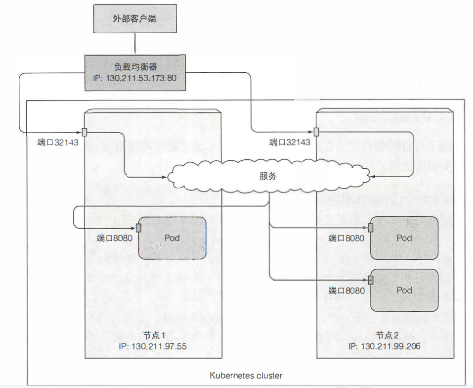

## 安装 & 操作

### kubectl 客户端

kubectl 配置保存到在 `~/.kube/config`，文件由以下四部分组成：

* 集群列表：包含API服务器的URL、证书颁发机构文件等。
* 客户端列表：包含客户端密钥、证书。
* 上下文列表：将kubectl执行命令时应使用的集群、客户端关联在一起。
* 当前上下文名称：当前上下文。
  

包含API服务器的URL、 证书颁发机构(CA)文件， 以及通过API服务器进行通信相关的 一些其他配置选项。

资源类型可以使用缩写：`replicationcontroller = rc` 、`pods = po` 、`service = svc`

1. 查看集群各组件信息：`kubectl cluster-info`
2. 查看集群各节点信息：`kubectl get nodes` `kubectl describe node`
3. 列出`Pod`信息: `kubectl get pods` `kubectl get pods -o wide` `kubectl describe pod`
4. 创建、查看`rc`运行`pod`：`kubectl run rc名称 --image=镜像名称 --port=告诉kubectl监听的端口` `kubectl get rc`
5. 创建、查看服务： `kubectl expose rc rc名称 --type=LoadBalancer --name 服务名称` `kubectl get svc`
6. 增加期望的副本数： `kubectl scale rc rc名称 --replicas=副本数量`
7. 获取`yaml`配置：`kubectl get po pod名称 -o yaml`
8. 通过`yaml`创建`pod`：`kubectl create -f pod.yaml`
9. 查看`yaml`配置帮助： `kubectl explain pods` `kubectl explain pod.spec`
10. 获取`pod`日志：`kubectl logs pod名称`
11. 通过本地网络端口转发pod端口：`kubectl port-forward pod名称 本地端口:pod端口`
12. 选择`pod`执行命令：`kubectl exec pod名称 -- curl -s http://10.111.249.153`  双横杠`--`表示kubectl命令的结束，如果不使用`--`，`-s`会认为是kubectl的参数。
13. 查看集群事件：`kubectl get events --watch`

## 基本概念

* `Pod`：若干相关容器的组合，`Pod`包含的容器运行在同一台宿主机上，这些容器使用相同的网络命名空间、IP地址、端口、共享一块储存卷空间，互相能通过 `localhost` 来发现和通信，是 k8s 的最小调度单位。
* `ReplicationController`：用来管理`Pod`副本，确保任何时候都保证有指定数量的`Pod`副本在运行。
* `Service`：真实应用服务的抽象，定义`Pod`的逻辑集合和访问`Pod`集合的策略，`Service`将代理`Pod`，对外表现为一个单一访问接口。
* `Label`：用于区分 `Pod`、`Service`、`ReplicationController` 的标签，一个 `label` 对应一个对象，一个对象可以有多个`label`。
* `Node`：K8S 的基本操作单一，用来分配给`Pod`进行绑定，`Pod`最终运行在`Node`上。

## 架构

使用主从分布式架构，一个集群由多个节点组成，分为主节点和工作节点：


主节点：

* `API服务器`：提供给外部用户访问，通过它和其他组件通信。
* `Scheduler`：负责集群的资源调度，为新建的Pod分配机器。
* `ControllerManager`：执行集群级别的功能，例如复制组件、持续跟踪工作节点、处理失败节点等。
* `etcd`：可靠的分布式数据储存，持久化集群配置，使用 `Raft` 算法保证一致性，只有API服务器可以和它直接通信。

工作节点：

* 容器运行时：`Docker`、`rtk`或其他容器类型。
* `kubelet`：与API服务器通信，管理它所在节点的容器。
* `KubernetesServiceProxy`：负责组件间的负载均衡网络流量。

附加组件：

* `CoreDNS`
* `Dashboard`
* `Ingress`
* `Heapster` (容器集群监控）

创建一个应用的各组件的作用：


分布式特性：

1. 组件间的通信：组件间只能通过API服务器通信，API服务器是和etcd通信的唯一组件，其他组件不会直接和`etcd`通信，而是通过API服务器来修改集群状态。
2. 运行方式：`Kubelet`是唯一一直作为常规组件运行在宿主机上的组件，其他组件都可以作为Pod来运行。
3. 对象的一致性和可验证性保证：所有控制平面只能通过API服务器修改储存模块。
4. etcd一致性：使用 Raft 算法，任何时间每个节点状态要么是大部分节点的当前状态，要么是之前确认过的状态。
   

调度算法：

* 过滤所有节点，找出能分配给 `pod` 的可用节点列表。
* 对可用节点按优先级排序， 找出最优节点。如果多个节点都有最高的优先级分数，那么则循环分配，确保平均分配给 `pod`。

组件间的协作：


## 资源

### Pod

K8S创建和部署的最小单位，封装一个或多个容器(`container`)、存储资源(`volume`)、一个独立的网络IP以及管理控制容器运行方式的策略选项。

通常情况下并不会直接创建它，而是通过 `ReplicationController` 或 `Deployment` 等创建并管理，因为直接创建的`Pod`由K8S直接监控生命周期，如果`Pod`失败将会重启，如果`Pod`所在节点宕机，`Pod`将会丢失，但是由`RC`管理的，会更换新节点。

特性：

1. 同一个pod中容器之间部分隔离，他们共享相同的 `network` 和 命名空间，可通过`localhost`进行互相访问，容器之间文件系统相互隔离，但可以使用 `Volume` 共享文件目录。
2. K8S集群中所有pod都在同一个共享网络地址空间，pod之间可以通过IP地址之间互相访问，他们的网络是通过额外的软件基于真实链路实现的。

为何多个容器比单个容器包含多个进程要好？

1. 出现故障时开发人员能方便地对该故障容器进行问题排查，而不必对整个系统的各个部分进行排查。
2. 单应用水平伸缩变得更容易。
3. 方面应用于其他项目，提高复用性。
4. 升级程序时能够将影响范围控制再更小的粒度，增加应用程序生命周期管理的灵活性，避免在升级某个服务时中断相同容器中的其他进程。

何时拆分多个Pod？

1. 多层应用分散到多个pod，拆分到两个工作节点，提高架构利用率。
2. 基于不同组件的不同扩缩容需求。

何时在pod中使用多个容器？例如应用由一个主进程和多个辅助进程组成

1. 总是一起运行，不能在不同主机运行。
2. 必须一起进行扩缩容。
3. 代表一个整体而不是独立的组件。

#### 生命周期


`InitContainer`：初始化容器，用来做初始化工作的容器，可以是一个或者多个，如果有多个的话，这些容器会按定义的顺序依次执行，由于一个 `Pod` 里面的所有容器是共享数据卷和`Namespace`，所以`InitContainer`产生的数据可以被主容器使用，只有所有的初始化容器执行完之后，主容器才会被启动。

`PodHook`：针对容器而不是`Pod`，由 kubelet 发起的，当容器中的进程启动前或者容器中的进程终止之前运行，包含在容器的生命周期之中

* `PostStart`：在容器创建后立即执行，并不能保证钩子将在容器 `ENTRYPOINT` 之前运行，和主进程是并行执行的。
* `PreStop`：在容器终止之前立即被调用，是阻塞的，必须在删除容器的调用发出之前完成。
  

通过 `kubectl explain pod.status` 来查看`pod`的状态。

`PodStatus` 的 `Phase` 字段：


| 值         | 描述                                                                    |
|-----------|-----------------------------------------------------------------------|
| Pending   | Pod 已经被集群接受，但是其中的一个或者多个容器还没准备好运行。这包括 Pod 等待被调度所花费的时间，以及通过网络下载镜像所花费的时间 |
| Running   | Pod 已绑定到节点，并且所有的容器都已创建。至少有一个容器在运行，或者正在启动或者重新启动                        |
| Succeeded | Pod 中的所有容器已成功终止，并且不会重启                                                |
| Failed    | Pod 所有的容器都已被终止，至少有一个容器终止失败了。也就是说，容器要么以非零状态退出，要么被系统终止                  |
| Unknown   | 由于某种原因，无法获得 Pod 的状态。此阶段通常是由于与 Pod 所在节点通信时发生错误而导致的                     |

`PodStatus` 的 `PodCondition` 字段：

* `lastProbeTime`: 最后一次探测 Pod Condition 的时间戳
* `lastTransitionTime`: 上次 `Condition` 从一种状态转换到另一种状态的时间
* `message`: 上次 `Condition` 状态转换的详细描述
* `reason`: `Condition` 最后一次转换的原因
* `status`: `Condition` 状态类型，可以为 `True`、 `False`、 `Unknown`
* `type`: `Condition` 类型，包括以下方面：
  * `PodScheduled`: `Pod` 已经被调度到其他 `node` 里
  * `Ready`: `Pod` 能够提供服务请求，可以被添加到所有可匹配服务的负载平衡池中
  * `Initialized`: 所有的`init containers`已经启动成功
  * `Unschedulable`: 调度程序现在无法调度 `Pod`，例如由于缺乏资源或其他限制
  * `ContainersReady`: `Pod` 里的所有容器都是 `ready` 状态

#### YAML

`yaml` 文件主要由以下几部分构成：

* `apiVersion`: 必选，版本号，例如`v1`
* `kind`: 必选，资源类型，例如`Pod`
* `metadata`: 包括名称、命名空间、标签和关于该容器的其他信息。
* `spec`：最主要的部分，包含 `pod` 的实际内容， 例如 `pod` 的容器、卷和其他数据。
* `status`: 运行时`pod`的当前信息。

```yaml
apiVersion: v1            #必选，版本号，例如v1
kind: Pod                 #必选，Pod
metadata:                 #必选，元数据
  name: string        　　#必选，Pod名称
  namespace: string       #必选，Pod所属的命名空间
  labels:                 #自定义标签
    - name: string      　#自定义标签名字
  annotations:            #自定义注释列表
    - name: string
spec:                     #必选，Pod中容器的详细定义
  containers:             #必选，Pod中容器列表
  - name: string      　　#必选，容器名称
    image: string     　　#必选，容器的镜像名称
    imagePullPolicy: [Always | Never | IfNotPresent]  #获取镜像的策略 Alawys表示下载镜像 IfnotPresent表示优先使用本地镜像，否则下载镜像，Nerver表示仅使用本地镜像
    command: [string]     #容器的启动命令列表，如不指定，使用打包时使用的启动命令
    args: [string]        #容器的启动命令参数列表
    workingDir: string    #容器的工作目录
    volumeMounts:         #挂载到容器内部的存储卷配置
    - name: string        #引用pod定义的共享存储卷的名称，需用volumes[]部分定义的的卷名
      mountPath: string   #存储卷在容器内mount的绝对路径，应少于512字符
      readOnly: boolean   #是否为只读模式
    ports:                #需要暴露的端口库号列表
    - name: string        #端口号名称
      containerPort: int  #容器需要监听的端口号,该端口是展示性的，不会对应用暴露的端口造成影响
      hostPort: int       #容器所在主机需要监听的端口号，默认与Container相同
      protocol: string    #端口协议，支持TCP和UDP，默认TCP
    env:                  #容器运行前需设置的环境变量列表
    - name: string        #环境变量名称
      value: string       #环境变量的值
    resources:            #资源限制和请求的设置
      limits:             #资源限制的设置
        cpu: string       #Cpu的限制，单位为core数，将用于docker run --cpu-shares参数
        memory: string    #内存限制，单位可以为Mib/Gib，将用于docker run --memory参数
      requests:           #资源请求的设置
        cpu: string       #Cpu请求，容器启动的初始可用数量
        memory: string    #内存清楚，容器启动的初始可用数量
    livenessProbe:        #对Pod内个容器健康检查的设置，当探测无响应几次后将自动重启该容器，检查方法有exec、httpGet和tcpSocket，对一个容器只需设置其中一种方法即可
      exec:               #对Pod容器内检查方式设置为exec方式
        command: [string] #exec方式需要制定的命令或脚本
      httpGet:            #对Pod内个容器健康检查方法设置为HttpGet，需要制定Path、port
        path: string
        port: number
        host: string
        scheme: string
        HttpHeaders:
        - name: string
          value: string
      tcpSocket:          #对Pod内个容器健康检查方式设置为tcpSocket方式
         port: number
      initialDelaySeconds: 0   #容器启动完成后首次探测的时间，单位为秒
      timeoutSeconds: 0        #对容器健康检查探测等待响应的超时时间，单位秒，默认1秒
      periodSeconds: 0         #对容器监控检查的定期探测时间设置，单位秒，默认10秒一次
      successThreshold: 0
      failureThreshold: 0
      securityContext:
         privileged: false
    restartPolicy: [Always | Never | OnFailure] #Pod的重启策略，Always表示一旦不管以何种方式终止运行，kubelet都将重启，OnFailure表示只有Pod以非0退出码退出才重启，Nerver表示不再重启该Pod
    nodeSelector: object        #设置NodeSelector表示将该Pod调度到包含这个label的node上，以key：value的格式指定
    imagePullSecrets:           #Pull镜像时使用的secret名称，以key：secretkey格式指定
      - name: string
    hostNetwork: false      　　#是否使用主机网络模式，默认为false，如果设置为true，表示使用宿主机网络
    volumes:                    #在该pod上定义共享存储卷列表
      - name: string            #共享存储卷名称 （volumes类型有很多种）
        emptyDir: {}            #类型为emtyDir的存储卷，与Pod同生命周期的一个临时目录。为空值
        hostPath:               #类型为hostPath的存储卷，表示挂载Pod所在宿主机的目录
          path: string          #Pod所在宿主机的目录，将被用于同期中mount的目录
        secret:                 #类型为secret的存储卷，挂载集群与定义的secre对象到容器内部
          scretname: string  
          items:   
          - key: string
            path: string
        configMap:              #类型为configMap的存储卷，挂载预定义的configMap对象到容器内部
          name: string
          items:
          - key: string
            path: string
```

#### 标签

可通过标签选择器选择以下资源：

* 包含（或不包含）使用特定键的标签
* 包含具有特定键和值的标签
* 包含具有特定键的标签， 但其值与我们指定的不同

操作：

* 添加标签：`kubectl label po pod名称 标签名称=标签值`
* 修改标签：`kubectl label po pod名称 标签名称=标签值 --overwrite`
* 查看pod并显示标签信息：`kubectl get po --show-labels` `kubectl get po -L 标签1,标签2`
* 标签选择器：`kubectl get po -l 标签名称=标签值` `kubectl get po -l 标签名称` `kubectl get po -l '!标签名称'`
* 使用标签标记node：`kubectl label node 节点名称 gpu=true` 将`pod`调度到特定节点:
  

#### 命名空间

可以将集群中的资源划分为相互隔离的组，同一名字空间内的资源名称要唯一，但跨名字空间时没有这个要求，默认情况所有资源属于`default`的组。

多命名空间适用于多团队、多用户、不同生命周期的场景。

#### 探针

用于检查`pod`是否存活，如果`pod`失败，则会重启`pod`，`yaml`配置中使用 `livenessProbe` 关键字，详情查看 pod yaml配置。

创建探针的要点：

1. 保持探针轻量，不应该消耗太多的计算资源。
2. 无须在探针中实现重试。

类型：

* `HTTP GET探针`：如果响应`2xx`或`3xx` 则认为探测成功。
* `TCP套接字探针`：如果连接成功建立，则探测成功。
* `Exec探针`：检查命令的退出状态码，如果状态码是 0, 则探测成功。

### 控制器

#### ReplicationController (不再使用，用RS替代)

负责管理`Pod`副本，确保任何时候都保证有指定数量的`Pod`副本在运行。

由三部分组成：

* 标签选择器：用于确定 `RC` 作用域中有哪些`pod`。
* 副本个数：指定运行`pod`的数量。
* `pod`模板：用于创建新的`pod`副本。

```yaml
apiVersion: v1
kind: ReplicationController
metadata:
  name: my-nginx
spec:
  replicas: 2
  selector:
    app: nginx
  template:
    metadata:
      labels:
        app: nginx
    spec:
      containers:
      - name: nginx
        image: nginx
        ports:
        - containerPort: 80
```

#### ReplicaSet (一般使用Deployment)

新一代的`RC`，拥有更强的标签选择器能力，可以匹配缺少某个标签的`pod`或特定标签名的`pod`，`RC`只能匹配包含某个标签的`pod`。

`Job`、`Deployment`、`ReplicaSet`、`DaemonSet`支持基于等式的选择方式和基于集合的选择方式：

```yaml
selector:
  matchLabels:
    component: redis
  matchExpressions:
    - {key: tier, operator: In, values: [cache]}
    - {key: environment, operator: NotIn, values: [dev]}
```

`operator` 有四个操作符：

* `In` : `Label`的值必须与其中一个指定的`values` 匹配。
* `NotIn` : `Label`的值与任何指定的`values` 不匹配。
* `Exists` : `pod` 必须包含一个指定名称的标签，不关注值。使用此运算符时，不应指定 `values`字段。
* `DoesNotExist` : `pod`不得包含有指定名称的标签。`values`属性不得指定 。

```yaml
apiVersion: apps/v1
kind: ReplicaSet
metadata:
  name: frontend
spec:
  replicas: 3
  selector:
    matchLabels:
      tier: frontend
  template:
    metadata:
      labels:
        tier: frontend
    spec:
      containers:
      - name: nginx
        image: registry.cn-beijing.aliyuncs.com/google_registry/nginx:1.17
        imagePullPolicy: IfNotPresent
        ports:
        - name: httpd
          containerPort: 80
```

#### DaemonSet

确保所有节点上都运行一个`Pod`的副本，当节点加入获取移除集群时，新增或删除一个`Pod`。

使用场景：

* 在每个节点上运行集群守护进程
* 在每个节点上运行日志收集守护进程
* 在每个节点上运行监控守护进程

```yaml
apiVersion: apps/v1
kind: DaemonSet
metadata:
  name: fluentd-elasticsearch
  namespace: kube-system
spec:
  selector:
    matchLabels:
      name: fluentd-elasticsearch    # 负责选择 fluentd-elasticsearch 标签的节点
  template:
    metadata:
      labels:
        name: fluentd-elasticsearch
    spec:
      containers:
      - name: fluentd-elasticsearch
        image: k8s.gcr.io/fluentd-elasticsearch:1.20
        volumeMounts:
        - name: varlog
          mountPath: /var/log
        - name: varlibdockercontainers
          mountPath: /var/lib/docker/containers
          readOnly: true
      volumes:
      - name: varlog
        hostPath:
          path: /var/log
      - name: varlibdockercontainers
        hostPath:
          path: /var/lib/docker/containers
```

#### Job

创建一个或多个`Pod`，直到指定数量的`Pod`成功终止，当节点故障时，会调度到其他节点，如果进程本身异常退出会重启容器，如果正确结束，就不会再重启。

`Job` 的 `restartPolicy` 不能使用默认策略，因为它不是要无限期运行，应该设置为 `OnFailure` 或 `Never`。

```yaml
apiVersion: batch/v1
kind: Job
metadata:
  name: pi
spec:
  completions: 5              # 任务执行次数，如果不配置 parallelism ,表示顺序执行 pod
  parallelism: 2              # 并行运行 Job pod
  template:
    spec:
      containers:
      - name: pi
        image: perl:5.34.0
        command: ["perl",  "-Mbignum=bpi", "-wle", "print bpi(2000)"]
      restartPolicy: Never
  activeDeadlineSeconds: 100  # 限制Job运行的时间，优先级高于backoffLimit，单位秒
  backoffLimit: 4             # 失败重试次数，默认为6，重试按照 10 秒、20 秒到 40 秒 间隔。
```

#### CronJob

```yaml
# ┌───────────── 分钟 (0 - 59)
# │ ┌───────────── 小时 (0 - 23)
# │ │ ┌───────────── 月的某天 (1 - 31)
# │ │ │ ┌───────────── 月份 (1 - 12)
# │ │ │ │ ┌───────────── 周的某天 (0 - 6)（周日到周一；在某些系统上，7 也是星期日）
# │ │ │ │ │                          或者是 sun，mon，tue，web，thu，fri，sat
# │ │ │ │ │
# │ │ │ │ │
# * * * * *

apiVersion: batch/v1
kind: CronJob
metadata:
  name: hello
spec:
  schedule: "* * * * *"
  jobTemplate:
    spec:
      template:
        spec:
          containers:
          - name: hello
            image: busybox:1.28
            imagePullPolicy: IfNotPresent
            command:
            - /bin/sh
            - -c
            - date; echo Hello from the Kubernetes cluster
          restartPolicy: OnFailure
```

#### Deployment

用于部署应用并为 `Pod` 和 `ReplicaSet` 提供声明式的更新能力，使用者负责描述 `Deployment` 的目标状态，`DeploymentController` 以受控速率更改实际状态直到期望状态。
当创建一个`Deployment`，`ReplicaSet`也会随之创建，实际的Pod由 `ReplicaSet`创建和管理。

```yaml
apiVersion: apps/v1
kind: Deployment
metadata:
  name: nginx-deployment
  labels:
    app: nginx
spec:
  replicas: 3
  revisionHistoryLimit: 3           # 保留历史版本
  strategy:
    rollingUpdate:
      maxSurge: 1                   # 最大额外可以存在的副本数
      maxUnavailable: O             # 更新过程中能够进入不可用状态的 Pod 的最大值
  type: RollingUpdate               # 滚动更新
  selector:
    matchLabels:
      app: nginx
  template:
    metadata:
      labels:
        app: nginx
    spec:
      containers:
      - name: nginx
        image: nginx:1.14.2
        ports:
        - containerPort: 80
```

1. 运行`Deployment`: `kubectl apply -f https://k8s.io/examples/controllers/nginx-deployment.yaml`
2. 查看`Deployment`上线状态：`kubectl rollout status deployment/nginx-deployment`
3. 更新`Deployment`：`kubectl replace -f nginx-deployment-v2.yaml` `kubectl set image deployment/nginx-deployment nginx=nginx:1.16.1`
4. 查看`Deployment`历史版本并回滚：`kubectl rollout history deployment/nginx-deployment` `kubectl rollout history deployment/nginx-deployment --revision=2`
5. 回滚到上一个版本：`kubectl rollout undo deployment/nginx-deployment`

#### StatefulSet

用于管理有状态的工作负载，例如 MySQL 集群。

特性：

1. 稳定的、唯一的网络标识符，为每个`Pod`维护一个有粘性的ID，无论如何调度都有一个永久不变的ID，需要创建一个`HeadlessService`，为每个Pod创建独有的`DNS`记录，`Pod名称-index.StatefulSet名称.default.svc.cluster.local`,但没有 `ClusterIP`。
2. 稳定的、持久的存储，为每个`Pod`提供稳定的专属存储，关联到不同的持久卷声明。
3. 有序的、优雅的部署和扩缩。
4. 有序的、自动的滚动更新。

限制：

1. 储存必须基于所请求的 `storage class` 来制备，或者由管理员预先制备。
2. 删除或者扩缩 `StatefulSet` 并不会删除它关联的存储卷。
3. 需要创建`HeadlessService` 来负责 Pod的网络标识。
4. 删除`StatefulSet`时，需要缩容到0，`StatefulSet` 不提供任何终止 `Pod` 的保证。

创建`StatefulSet`需要创建三种对象：

* `StatefulSet` 本身
* `HeadlessService`
* 储存数据文件的持久卷

```yaml
apiVersion: v1
kind: Service
metadata:
  name: nginx
  labels:
    app: nginx
spec:
  ports:
  - port: 80
    name: web
  clusterIP: None   # 创建 HeadlessService
  selector:
    app: nginx
```

```yaml
apiVersion: apps/v1
kind: StatefulSet
metadata:
  name: web
spec:
  selector:
    matchLabels:
      app: nginx                                  # 必须匹配 .spec.template.metadata.labels
  serviceName: "nginx"
  replicas: 3                                     # 默认值是 1
  minReadySeconds: 10                             # 新创建的 Pod 在没有任意容器崩溃情况下的最小就绪时间， 只有超出这个时间 Pod 才被视为可用，默认值是 0
  template:
    metadata:
      labels:
        app: nginx                                # 必须匹配 .spec.selector.matchLabels
    spec:
      terminationGracePeriodSeconds: 10
      containers:
      - name: nginx
        image: registry.k8s.io/nginx-slim:0.8
        ports:
        - containerPort: 80
          name: web
        volumeMounts:
        - name: www
          mountPath: /usr/share/nginx/html
  volumeClaimTemplates:                           # 创建PVC
  - metadata:
      name: www
    spec:
      accessModes: [ "ReadWriteOnce" ]
      storageClassName: "my-storage-class"
      resources:
        requests:
          storage: 1Gi
```

### Service

负责提供一个固定的Ip和端口对外暴露Pod，解决不断变化的Pod IP地址的问题。
由于Pod是不断变化的，它可能被删除、替换、重新分配等，所有Pod的Ip地址是不断变化的，服务确保其中一个Pod接收连接，而不关心Pod运行在哪里。

无法ping通服务ip是因为服务IP是虚拟IP，只有与端口结合才有意义，另外服务IP属于服务内部地址，无法在集群外部直接使用这个地址。
`service`通过`selector`和`pod`建立关联。

```yaml
apiVersion: v1
kind: Service
metadata:
  name: my-service
spec:
  sessionAffinity: ClientIP       # 默认值None，配置会话亲和性，将来自同一个ClientIp的所有请求转发至同一个Pod
  selector:
    app.kubernetes.io/name: MyApp # 服务选择代理具有MyApp标签的应用
  ports:
    - protocol: TCP               # 同一个服务可以暴露多个端口
      port: 80
      targetPort: 9376            # 目标端口可以使用端口名称
```

#### 服务发现

* 环境变量：当 `Pod` 运行在某 Node 上时，kubelet 会为每个活跃的 `Service` 添加一组环境变量，环境变量名称为 `{SVCNAME}_SERVICE_HOST` 和 `{SVCNAME}_SERVICE_PORT` ，全为大写。
* `DNS`：`DNS` 服务不是一个独立的系统服务，是一个插件，可以安装 `CoreDNS`。

  > DNS服务注册：
  >
  > 1. 向 API Server 用 POST 方式提交一个新的 Service 定义。
  > 2. 这个请求需要经过认证、鉴权以及其它的准入策略检查过程之后才会放行。
  > 3. Service 得到一个 ClusterIP（虚拟 IP 地址），并保存到集群数据仓库。
  > 4. 在集群范围内传播 Service 配置。
  > 5. 集群 DNS 服务得知该 Service 的创建，据此创建必要的 DNS记录。
  >

  `CoreDNS` 实现了一个控制器，会对 API Server 进行监听，一旦发现有新建的 Service 对象，就创建一个从 Service 名称映射到 ClusterIP 的域名记录。
  这样 Service 就不必自行向 DNS 进行注册，CoreDNS 控制器会关注新创建的 Service 对象，并实现后续的 DNS 过程。
  DNS 中注册的名称就是 `metadata.name.default.svc.cluster.local`，其中`metadata.name`是服务名称，`default`是命名空间，`svc.cluster.local`是所有集群本地服务名称，而 ClusterIP 则由 Kubernetes 自行分配。

  

#### Endpoint

服务不是直接与`Pod`相连，而是通过`Endpoint`与`Pod`连接，创建`Service`的同时，会自动创建跟`Service`同名的`Endpoint`，用来记录`Service`对应所有`Pod`的访问地址，`Service`通过`Selector`和`Pod`建立联系,`Pod`通过`Endpoint`暴露。

> Endpoint = Pod IP + Container Port

`EndpointController`负责自动处理`Endpoint`相关功能：

* 负责生成和维护所有endpoint对象的控制器。
* 负责监听`service`和对应`pod`的变化。
* 监听到`service`被删除，则删除和该`service`同名的`endpoint`对象。
* 监听到新的`service`被创建，则根据新建`service`信息获取相关`pod`列表，然后创建对应`endpoint`对象。
* 监听到`service`被更新，则根据更新后的`service`信息获取相关`pod`列表，然后更新对应`endpoint`对象。
* 监听到`pod`事件，则更新对应的`service`的`endpoint`对象，将podIp记录到`endpoint`中。

##### 就绪探针

就绪探针会定期检查`Pod`是否启动完成，默认10秒检查一次，当启动成功后才会加入到服务端点，如果未配置就绪探针会立即成为服务端点，如果服务尚未启动完成，当请求被转发到`Pod`会看到连接被拒绝的错误。

`ReadinessProbe` 和 `livenessProbe` 一样，也有`exec`、`httpGet`、`TCP`三种类型。

##### K8S访问外部服务

访问外部服务有两种方式：

1. 手动创建`Endpoint`

```yaml
apiVersion: v1
kind: Service
metadata:
  name: external-service
spec:         # 服务中未配置选择器
  ports:
  - port: 80
```

```yaml
# 服务名 和 Endpoint名需要一样
apiVersion: v1
kind: Endpoints
metadata:
  name: external-service
subsets:
  - addresses:
    - ip: 11.11.11.11
    - ip: 22.22.22.22
    ports:
    - port: 80
```


2. 使用完全限定域名配置

```yaml
apiVersion: v1 
kind: Service 
metadata: 
  name: external-service 
spec: 
  type: ExternalName                      # 配置类型
  externalName: someapi.somecompany.com   # 外部服务域名
  ports: 
  - port: 80
```

##### 暴露服务给外部客户端

1. 通过`NodePort`类型服务暴露。


```yaml
apiVersion: v1
kind: Service
metadata:
  name: kubia-nodeport
spec: 
  type: NodePort      # 设置服务类别为NodePort
  ports: 
  - port: 80          # 集群内部端口
    targetPort: 8080  # 实际Pod端口
    nodePort: 30123   # 暴露给外部的端口
selector: 
  app: kubia
```

2. 通过`LoadBalance`类型服务暴露,`NodePort`的一种扩展类型，提供负载均衡服务。



```yaml
apiVersion: vl 
kind: Service 
metadata:
  name: kubia-loadbalancer 
spec: 
  type: LoadBalancer  # 设置服务类别为LoadBalancer 
  ports:
  - port: 80          # 暴露给外部的端口
    targetPort: 8080  # 实际Pod端口
  selector:
    app: kubia
```

3. 使用 `Ingress` 资源，通过一个IP地址公开多个服务，实现HTTP层代理。

每个`LoadBalancer`都需要自己的负载均衡器，以及独有的公网IP，但`Ingress`只需要一个公网IP就能为许多服务提供访问。


`Ingress`资源 需要 `Ingress`控制器 才能正常工作，常用的有 `NginxIngressController`。

`Ingress` 的工作流程：

* 客户端首先对 `kubia.example.com` 执行 DNS 查找，由 DNS服务器或本地操作系统 返回 `IngressController` 的 IP
* 客户端然后向 `IngressController` 发送 `HTTP` 请求，并在 `Host` 头中指定 `kubia.example.com`
* `IngressController` 从该头部确定客户端尝试访问哪个服务，通过该服务关联的 `Endpoint` 查看 `PodIP`
* `IngressController` 将客户端请求转发给其中一个 `Pod`
  

```yaml
apiVersion: networking.k8s.io/v1
kind: Ingress
metadata:
  name: minimal-ingress
spec:
  ingressClassName: nginx
  rules:
  - http:
      paths:
      - path: /testpath
        pathType: Prefix    # 路径类型
        backend:
          service:
            name: test
            port:
              number: 80
      - host: "foo.bar.com"  # 主机精确匹配
      http:
        paths:
          - pathType: Prefix
            path: "/bar"
            backend:
              service:
                name: service1
                port:
                  number: 80
```

路径类型有三种：

* `ImplementationSpecific`：匹配方法取决于 `IngressClass` ，如 `NginxIngressController` 忽略路径类型,使用前缀匹配路径处理。
* `Exact`：精确匹配 URL 路径，且区分大小写。
* `Prefix`：基于以 `/` 分隔的 URL 路径前缀匹配。

当多条路径会匹配同一个请求，最长的匹配路径优先，如果仍然有两条同等的匹配路径，则精确路径类型优先于前缀路径类型。


| 类型     | 路径                          | 请求路径         | 匹配与否？            |
|--------|-----------------------------|--------------|------------------|
| Prefix | /                           | （所有路径）       | 是                |
| Exact  | /foo                        | /foo         | 是                |
| Exact  | /foo                        | /bar         | 否                |
| Exact  | /foo                        | /foo/        | 否                |
| Exact  | /foo/                       | /foo         | 否                |
| Prefix | /foo                        | /foo, /foo/  | 是                |
| Prefix | /foo/                       | /foo, /foo/  | 是                |
| Prefix | /aaa/bb                     | /aaa/bbb     | 否                |
| Prefix | /aaa/bbb                    | /aaa/bbb     | 是                |
| Prefix | /aaa/bbb/                   | /aaa/bbb     | 是，忽略尾部斜线         |
| Prefix | /aaa/bbb                    | /aaa/bbb/    | 是，匹配尾部斜线         |
| Prefix | /aaa/bbb                    | /aaa/bbb/ccc | 是，匹配子路径          |
| Prefix | /aaa/bbb                    | /aaa/bbbxyz  | 否，字符串前缀不匹配       |
| Prefix | /, /aaa                     | /aaa/ccc     | 是，匹配 /aaa 前缀     |
| Prefix | /, /aaa, /aaa/bbb           | /aaa/bbb     | 是，匹配 /aaa/bbb 前缀 |
| Prefix | /, /aaa, /aaa/bbb           | /ccc         | 是，匹配 / 前缀        |
| Prefix | /aaa                        | /ccc         | 否，使用默认后端         |
| 混合     | /foo (Prefix), /foo (Exact) | /foo         | 是，优选 Exact 类型    |

主机匹配：


| 主机        | host 头部         | 匹配与否？                |
|-----------|-----------------|----------------------|
| *.foo.com | bar.foo.com     | 基于相同的后缀匹配            |
| *.foo.com | baz.bar.foo.com | 不匹配，通配符仅覆盖了一个 DNS 标签 |
| *.foo.com | foo.com         | 不匹配，通配符仅覆盖了一个 DNS 标签 |

`Ingress TLS` 认证：

```yaml
apiVersion: v1
kind: Secret
metadata:
  name: testsecret-tls
  namespace: default
data:
  tls.crt: base64 编码的证书
  tls.key: base64 编码的私钥
type: kubernetes.io/tls
```

```yaml
apiVersion: networking.k8s.io/v1
kind: Ingress
metadata:
  name: tls-example-ingress
spec:
  tls:
  - hosts:
      - https-example.foo.com       # 接收来自 https-example.foo.com 主机的 TLS 连接
    secretName: testsecret-tls      # 需要和上面 TLS 证书名称一样
  rules:
  - host: https-example.foo.com
    http:
      paths:
      - path: /
        pathType: Prefix
        backend:
          service:
            name: service1
            port:
              number: 80
```

### Volume

`Pod` 可以同时使用任意数目的卷类型，临时卷类型的生命周期与 `Pod` 相同，但持久卷可以比 `Pod` 的存活期长。当 `Pod` 不再存在时，会销毁临时卷，不会销毁持久卷。

#### emptyDir

`emptyDir` 当`Pod`被删除时，数据会被永久删除，容器崩溃不会导致 `Pod` 被节点移除，使用用于一些共享的临时文件。
当 `Pod` 分配到某个节点时， `emptyDir` 卷会被创建，虽然 `Pod` 中的容器挂载 `emptyDir` 卷的路径可能相同也可能不同，但是都可以读写 `emptyDir` 卷中相同的文件。

```yaml
apiVersion: v1
kind: Pod
metadata:
  name: test-pd
spec:
  containers:
  - image: registry.k8s.io/test-webserver
    name: test-container
    volumeMounts:
    - mountPath: /cache
      name: cache-volume
  volumes:
  - name: cache-volume
    emptyDir:
      sizeLimit: 500Mi
```

#### hostPath

`hostPath` 是一种持久性储存，能将主机节点文件系统上的文件或目录挂载到你的 `Pod` 中，如果`pod`被分配到其他节点，也会找不到数据，并且存在安全风险，如果必须使用，应限制目录或文件，并以只读方式挂载。

```yaml
apiVersion: v1
kind: Pod
metadata:
  name: test-pd
spec:
  containers:
  - image: registry.k8s.io/test-webserver
    name: test-container
    volumeMounts:
    - mountPath: /test-pd
      name: test-volume
  volumes:
  - name: test-volume
    hostPath:
      # 宿主上目录位置
      path: /data
      # 此字段为可选
      type: Directory
```


| 取值                | 行为                                                              |
|-------------------|-----------------------------------------------------------------|
|                   | 空字符串（默认）用于向后兼容，这意味着在安装 hostPath 卷之前不会执行任何检查。                    |
| DirectoryOrCreate | 如果在给定路径上什么都不存在，那么将根据需要创建空目录，权限设置为 0755，具有与 kubelet 相同的组和属主信息。   |
| Directory         | 在给定路径上必须存在的目录。                                                  |
| FileOrCreate      | 如果在给定路径上什么都不存在，那么将在那里根据需要创建空文件，权限设置为 0644，具有与 kubelet 相同的组和所有权。 |
| File              | 在给定路径上必须存在的文件。                                                  |
| Socket            | 在给定路径上必须存在的 UNIX 套接字。                                           |
| CharDevice        | 在给定路径上必须存在的字符设备。                                                |
| BlockDevice       | 在给定路径上必须存在的块设备。                                                 |

#### nfs

可以将网络文件系统`NFS`挂载到`Pod`中，是一种持久储存，当`Pod`被删除时，卷会被卸载，数据不会丢失。

```yaml
apiVersion: v1
kind: Pod
metadata:
  name: test-pd
spec:
  containers:
  - image: registry.k8s.io/test-webserver
    name: test-container
    volumeMounts:
    - mountPath: /my-nfs-data
      name: test-volume
  volumes:
  - name: test-volume
    nfs:
      server: my-nfs-server.example.com
      path: /my-nfs-volume
      readOnly: true
```

#### Downward API

可以让容器内部获取到`Pod`的元数据，有两种方式：

1. 环境变量：对于单个变量，可以将`Pod`信息和容器信息直接注入容器内部。

```yaml
apiVersion: v1
kind: Pod
metadata:
    name: test-env-pod
    namespace: kube-system
spec:
    containers:
    - name: test-env-pod
      image: busybox:latest
      command: ["/bin/sh", "-c", "env"]
      env:
      - name: POD_NAME                   # 变量名称
        valueFrom:
          fieldRef:   
            fieldPath: metadata.name     # 变量值引用 metadata.name
      - name: POD_NAMESPACE
        valueFrom:
          fieldRef:
            fieldPath: metadata.namespace
      - name: POD_IP
        valueFrom:
          fieldRef:
            fieldPath: status.podIP
```

2. `Volume`挂载：将`Pod`信息生成文件，直接挂载到容器内部。

```yaml
apiVersion: v1
kind: Pod
metadata:
    name: test-volume-pod
    namespace: kube-system
    labels:
        k8s-app: test-volume
        node-env: test
    annotations:
        build: test
        own: qikqiak
spec:
    containers:
    - name: test-volume-pod-container
      image: busybox:latest
      command: ["sh", "-c"]
      args:
      - while true; do
          if [[ -e /etc/podinfo/labels ]]; then
            echo -en '\n\n'; cat /etc/podinfo/labels; fi;
          if [[ -e /etc/podinfo/annotations ]]; then
            echo -en '\n\n'; cat /etc/podinfo/annotations; fi;
          sleep 3600;
        done;
      volumeMounts:
      - name: podinfo
        mountPath: /etc/podinfo
    volumes:
    - name: podinfo
      downwardAPI:
        items:
        - path: "labels"
          fieldRef:
            fieldPath: metadata.labels
        - path: "annotations"
          fieldRef:
            fieldPath: metadata.annotations
```


| 可用字段                        | 支持注入方式        |
|-----------------------------|---------------|
| metadata.name               | 环境变量 & Volume |
| metadata.namespace          | 环境变量 & Volume |
| metadata.uid                | 环境变量 & Volume |
| metadata.annotations['KEY'] | 环境变量 & Volume |
| spec.serviceAccountName     | 环境变量          |
| spec.nodeName               | 环境变量          |
| status.hostIP               | 环境变量          |
| status.podIP                | 环境变量          |
| metadata.labels             | Volume        |
| metadata.annotations        | Volume        |

#### PersistentVolume & persistentVolumeClaim

> 持久卷(PersistentVolume): 集群中的一块存储，可以由管理员事先静态制备， 或者使用存储类(StorageClass)来动态制备。
> 持久卷申领(persistentVolumeClaim): 表达用户对存储的请求,PVC 申领会耗用 PV 资源。

```yaml
apiVersion: v1
kind: PersistentVolume
metadata:                               # PV建立不要加名称空间，因为PV属于集群级别的
  name: nfs-pv001                       # PV名称
spec:
  storageClassName: ""
  accessModes:                          # 不同类型的储存支持的模式不一样，HostPath就不支持ReadOnlyMany和ReadWriteMany。
    - ReadWriteMany                     # 多路读写，卷能被集群多个节点挂载并读写
    - ReadWriteOnce                     # 单路读写，卷只能被单一集群节点挂载读写
    - ReadOnlyMany                      # 多路只读，卷能被多个集群节点挂载且只能读
  capacity:
    storage: 500Mi
  persistentVolumeReclaimPolicy: Retain # 回收策略
  nfs:
    path: /work/volumes/v1
    server: stroagesrv01.contoso.com
```

回收策略：

* `Retain`：当删除与之绑定的`PVC`时候，`PV`被标记为`released`，`PVC`与`PV`解绑但还没有执行回收策略，但`PV`不可用，需要手动来处理这些数据并删除该`PV`。
* `Delete`：当删除与之绑定的`PVC`时候，也删除`PV`。

```yaml
apiVersion: v1
kind: PersistentVolumeClaim
metadata:
  name: nfs-pvc001
  namespace: default
spec:
  storageClassName: ""      # 类型需要和 PV 保持一致
  accessModes:              # PVC也需要定义访问模式，不过它的模式一定是和现有PV相同或者是它的子集，否则匹配不到PV
  - ReadWriteMany
  resources:                # 定义资源要求PV满足这个PVC的要求才会被匹配到
    requests:
      storage: 500Mi        # 定义要求有多大空间
```

使用`PVC`:

```yaml
apiVersion: apps/v1
kind: Deployment
metadata:
  name: tomcat-deploy
spec:
  replicas: 1
  selector:
    matchLabels:
      appname: myapp
  template:
    metadata:
      name: myapp
      labels:
        appname: myapp
    spec:
      containers:
      - name: myapp
        image: tomcat:8.5.38-jre8
        ports:
        - name: http
          containerPort: 8080
          protocol: TCP
        volumeMounts:
          - name: tomcatedata
            mountPath : "/data"
      volumes:
        - name: tomcatedata
          persistentVolumeClaim:
            claimName: nfs-pvc001   # 名称需和PVC保持一致。
```

### ConfigMap

```yaml
apiVersion: v1
kind: ConfigMap
metadata:
  name: test-cfg
  namespace: default
data:
  cache_host: memcached-gcxt
  cache_port: "11211"
  cache_prefix: gcxt
  my.cnf: |           # | 表示是文件
    [mysqld]
    log-bin=mysql-bin
  app.properties: |
    property.1=value-1
    property.2=value-2
    property.3=value-3
```

有四种方式来使用`ConfigMap`中的配置：

1. 在容器命令和参数内

```yaml
apiVersion: v1
kind: Pod
metadata:
  name: dapi-test-pod
spec:
  containers:
    - name: test-container
      image: gcr.io/google_containers/busybox
      command: [ "/bin/sh", "-c", "echo $(SPECIAL_LEVEL_KEY) $(SPECIAL_TYPE_KEY)" ]  # 在命令参数中使用
  restartPolicy: Never
```

2. 容器的环境变量

```yaml
apiVersion: v1
kind: Pod
metadata:
  name: dapi-test-pod
spec:
  containers:
    - name: test-container
      image: gcr.io/google_containers/busybox
      command: [ "/bin/sh", "-c", "echo $(SPECIAL_LEVEL_KEY) $(SPECIAL_TYPE_KEY)" ]
      env:
        - name: SPECIAL_LEVEL_KEY
          valueFrom:
            configMapKeyRef:            # 环境变量中使用
              name: special-config      # ConfigMap 名称
              key: special.how
        - name: SPECIAL_TYPE_KEY
          valueFrom:
            configMapKeyRef:
              name: special-config
              key: special.type
  restartPolicy: Never
```

3. 在只读卷里面添加一个文件，让应用来读取

```yaml
apiVersion: v1
kind: Pod
metadata:
  name: dapi-test-pod
spec:
  containers:
    - name: test-container
      image: gcr.io/google_containers/busybox
      command: [ "/bin/sh", "-c", "cat /etc/config/special.how" ]
      volumeMounts:
      - name: config-volume
        mountPath: /etc/config
  volumes:
    - name: config-volume
      configMap:                        # 在Volume中使用
        name: special-config
  restartPolicy: Never
```
