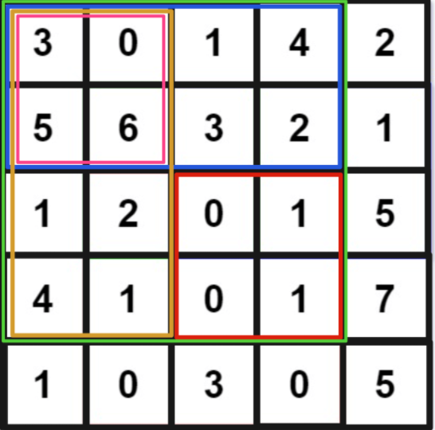

## 动态规划

动态规划四个关键点：状态、选择、状态转移、Base Case

```java
dp[0][0][...] = base case
# 进行状态转移
for 状态1 in 状态1的所有取值：
    for 状态2 in 状态2的所有取值：
        for ...
            dp[状态1][状态2][...] = 求最值(选择1，选择2...)
```

## 深度优先算法

站在回溯树的一个节点上，你只需要思考 3 个问题：

1、路径：也就是已经做出的选择，一般使用 boolean[] 标记已经走过的路径，path[] 标记当前走过的路径。

2、选择列表：也就是你当前可以做的选择，当前节点 可以到达的节点。

3、结束条件：也就是到达决策树底层，无法再做选择的条件，当前节点没有可以到达的节点。

```java
result = []
def backtrack(路径, 选择列表):
    if 满足结束条件:
        result.add(路径)
        return

    for 选择 in 选择列表:
        做选择
        backtrack(路径, 选择列表)
        撤销选择
```

## 广度优先算法

用来计算从 start 到 target 的最短距离。

```java
int BFS(Node start, Node target) {
    Queue<Node> q; // 核心数据结构
    Set<Node> visited; // 避免走回头路

    q.offer(start); // 将起点加入队列
    visited.add(start);
    int step = 0; // 记录扩散的步数

    while (q not empty) {
        int sz = q.size();
        /* 将当前队列中的所有节点向四周扩散 */
        for (int i = 0; i < sz; i++) {
            Node cur = q.poll();
            /* 划重点：这里判断是否到达终点 */
            if (cur is target)
                return step;
            /* 将 cur 的相邻节点加入队列 */
            for (Node x : cur.adj()) {
                if (x not in visited) {
                    q.offer(x);
                    visited.add(x);
                }
            }
        }
        /* 划重点：更新步数在这里 */
        step++;
    }
}
```

## 数组
遍历

```java
void traverse(int[] arr) {
    for (int i = 0; i < arr.length; i++) {
        // 迭代访问 arr[i]
    }
}
```

### 前缀和

```java
class NumArray {
    // 前缀和数组
    private int[] preSum;

    /* 输入一个数组，构造前缀和 */
    public NumArray(int[] nums) {
        // preSum[0] = 0，便于计算累加和
        preSum = new int[nums.length + 1];
        // 计算 nums 的累加和
        for (int i = 1; i < preSum.length; i++) {
            preSum[i] = preSum[i - 1] + nums[i - 1];
        }
    }

    /* 查询闭区间 [left, right] 的累加和 */
    public int sumRange(int left, int right) {
        return preSum[right + 1] - preSum[left];
    }
}
```

#### 二维数组前缀和


```java
class NumMatrix {
    // 定义：preSum[i][j] 记录 matrix 中子矩阵 [0, 0, i-1, j-1] 的元素和
    private int[][] preSum;

    public NumMatrix(int[][] matrix) {
        int m = matrix.length, n = matrix[0].length;
        if (m == 0 || n == 0) return;
        // 构造前缀和矩阵
        preSum = new int[m + 1][n + 1];
        for (int i = 1; i <= m; i++) {
            for (int j = 1; j <= n; j++) {
                // 计算每个矩阵 [0, 0, i, j] 的元素和
                preSum[i][j] = preSum[i-1][j] + preSum[i][j-1] + matrix[i - 1][j - 1] - preSum[i-1][j-1];
            }
        }
    }

    // 计算子矩阵 [x1, y1, x2, y2] 的元素和
    // 可以用绿色矩阵减去蓝色矩阵减去橙色矩阵最后加上粉色矩阵，而绿蓝橙粉这四个矩阵有一个共同的特点，就是左上角就是 (0, 0) 原点。
    public int sumRegion(int x1, int y1, int x2, int y2) {
        // 目标矩阵之和由四个相邻矩阵运算获得
        return preSum[x2+1][y2+1] - preSum[x1][y2+1] - preSum[x2+1][y1] + preSum[x1][y1];
    }
}
```

### 差分数组

```java
// 差分数组工具类
class Difference {
    // 差分数组
    private int[] diff;

    /* 输入一个初始数组，区间操作将在这个数组上进行 */
    public Difference(int[] nums) {
        assert nums.length > 0;
        diff = new int[nums.length];
        // 根据初始数组构造差分数组
        diff[0] = nums[0];
        for (int i = 1; i < nums.length; i++) {
            diff[i] = nums[i] - nums[i - 1];
        }
    }

    /* 给闭区间 [i, j] 增加 val（可以是负数）*/
    public void increment(int i, int j, int val) {
        diff[i] += val;
        if (j + 1 < diff.length) {
            diff[j + 1] -= val;
        }
    }

    /* 返回结果数组 */
    public int[] result() {
        int[] res = new int[diff.length];
        // 根据差分数组构造结果数组
        res[0] = diff[0];
        for (int i = 1; i < diff.length; i++) {
            res[i] = res[i - 1] + diff[i];
        }
        return res;
    }
}
```

## 快慢指针

有序数组去重：
让慢指针 slow 走在后面，快指针 fast 走在前面探路，找到一个不重复的元素就赋值给 slow 并让 slow 前进一步。
nums[0..slow] 都是无重复的元素，当 fast 指针遍历完整个数组 nums 后，nums[0..slow] 就是整个数组去重之后的结果。

## 链表
具有迭代和递归两种结构

```java
/* 基本的单链表节点 */
class ListNode {
    int val;
    ListNode next;
}

void traverse(ListNode head) {
    for (ListNode p = head; p != null; p = p.next) {
        // 迭代访问 p.val
    }
}

void traverse(ListNode head) {
    // 递归访问 head.val
    traverse(head.next);
}
```

访问链表可以借助指针来访问，通过移动指针的位置来依次访问每个节点，另外可以创建一个虚拟节点 和 它的指针来创建一个新的指针。

### 合并2个升序链表
建立一个结果链表，然后使用3个指针分别在3个链表上进行移动

```java
ListNode mergeTwoLists(ListNode l1, ListNode l2) {
    // 虚拟头结点
    ListNode dummy = new ListNode(-1), p = dummy;
    ListNode p1 = l1, p2 = l2;

    while (p1 != null && p2 != null) {
        // 比较 p1 和 p2 两个指针
        // 将值较小的的节点接到 p 指针
        if (p1.val > p2.val) {
            p.next = p2;
            p2 = p2.next;
        } else {
            p.next = p1;
            p1 = p1.next;
        }
        // p 指针不断前进
        p = p.next;
    }

    if (p1 != null) {
        p.next = p1;
    }
    if (p2 != null) {
        p.next = p2;
    }
    return dummy.next;
}
```

### 合并K个升序链表
使用 优先队列 对各个链表头节点进行排序

```java
ListNode mergeKLists(ListNode[] lists) {
    if (lists.length == 0) return null;
    // 虚拟头结点
    ListNode dummy = new ListNode(-1);
    ListNode p = dummy;
    // 优先级队列，最小堆
    PriorityQueue<ListNode> pq = new PriorityQueue<>(
        lists.length, (a, b)->(a.val - b.val));
    // 将 k 个链表的头结点加入最小堆
    for (ListNode head : lists) {
        if (head != null)
            pq.add(head);
    }

    while (!pq.isEmpty()) {
        // 获取最小节点，接到结果链表中
        ListNode node = pq.poll();
        p.next = node;
        if (node.next != null) {
            pq.add(node.next);
        }
        // p 指针不断前进
        p = p.next;
    }
    return dummy.next;
}
```

### 检查是否有环
使用 快慢两个指针 若指针相遇则又环

```java
boolean hasCycle(ListNode head) {
    // 快慢指针初始化指向 head
    ListNode slow = head, fast = head;
    // 快指针走到末尾时停止
    while (fast != null && fast.next != null) {
        // 慢指针走一步，快指针走两步
        slow = slow.next;
        fast = fast.next.next;
        // 快慢指针相遇，说明含有环
        if (slow == fast) {
            return true;
        }
    }
    // 不包含环
    return false;
}
```

若相遇 快指针走过 2k 个节点，慢指针走过 k 个节点，若求环起点 只需要将慢节点重置回头节点， 快慢节点以同样速度再走一次

### 删除倒数第n个节点
1. 使用后序遍历，递归删除
2. 使用快慢节点，快节点先走 n 个节点，快慢节点再一起走，快节点走到头，慢节点即为删除节点。

### 判断两个链表是否相交
让 p1 遍历完链表 A 之后开始遍历链表 B，让 p2 遍历完链表 B 之后开始遍历链表 A。

如果这样进行拼接，就可以让 p1 和 p2 同时进入公共部分，因为相交节点到尾节点的距离相同。
### 翻转链表

```java
ListNode reverse(ListNode head) {
    if (head == null || head.next == null) {
        return head;
    }
    ListNode last = reverse(head.next);
    head.next.next = head;
    head.next = null;
    return last;
}
```

### 反转链表前 N 个节点

```java
ListNode successor = null; // 后驱节点

// 反转以 head 为起点的 n 个节点，返回新的头结点
ListNode reverseN(ListNode head, int n) {
    if (n == 1) {
        // 记录第 n + 1 个节点
        successor = head.next;
        return head;
    }
    // 以 head.next 为起点，需要反转前 n - 1 个节点
    ListNode last = reverseN(head.next, n - 1);

    head.next.next = head;
    // 让反转之后的 head 节点和后面的节点连起来
    head.next = successor;
    return last;
}
```

#### 翻转链表 n - m 中的节点

```java
ListNode reverseBetween(ListNode head, int left, int right) {
    if(left == 1){
        return reverseN(head,right);
    }

    head.next = reverseBetween(head.next,left-1,right-1);

    return head;
}
```

### 是否是回文链表

```java
ListNode left;

boolean isPalindrome(ListNode head) {
    left = head;
    return traverse(head);
}

boolean traverse(ListNode right) {
    if (right == null) return true;
    boolean res = traverse(right.next);
    // 后序遍历代码
    res = res && (right.val == left.val);
    left = left.next;
    return res;
}
```

## 二叉树
遍历

```java
/* 基本的二叉树节点 */
class TreeNode {
    int val;
    TreeNode left, right;
}

void traverse(TreeNode root) {
    traverse(root.left);
    traverse(root.right);
}
```

```java
void traverse(TreeNode root) {
    // 前序位置
    traverse(root.left);
    // 中序位置
    traverse(root.right);
    // 后序位置
}
```

前序遍历就是刚进入一个节点时，后序遍历就是即将离开一个节点时。比如倒序打印一个单链表，可以用后序遍历,计算倒数第n个节点。

```java
/* 递归遍历单链表，倒序打印链表元素 */
void traverse(ListNode head) {
    if (head == null) {
        return;
    }
    traverse(head.next);
    // 后序位置
    print(head.val);
}
```

### N叉树遍历

```java
/* 基本的 N 叉树节点 */
class TreeNode {
    int val;
    TreeNode[] children;
}

void traverse(TreeNode root) {
    for (TreeNode child : root.children)
        traverse(child);
}
```

## 快速排序
其实就是二叉树的前序遍历：

```java
void sort(int[] nums, int lo, int hi) {
    /****** 前序遍历位置 ******/
    // 通过交换元素构建分界点 p
    int p = partition(nums, lo, hi);
    /************************/

    sort(nums, lo, p - 1);
    sort(nums, p + 1, hi);
}
```

## 归并排序
其实就是二叉树的后序遍历：

```java
// 定义：排序 nums[lo..hi]
void sort(int[] nums, int lo, int hi) {
    int mid = (lo + hi) / 2;
    // 排序 nums[lo..mid]
    sort(nums, lo, mid);
    // 排序 nums[mid+1..hi]
    sort(nums, mid + 1, hi);

    /****** 后序位置 ******/
    // 合并 nums[lo..mid] 和 nums[mid+1..hi]
    merge(nums, lo, mid, hi);
    /*********************/
}
```
