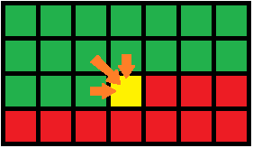

# 初探

## 递推

>[例题1]在一个 3 X n 的长方形方格中，铺满 1 X 2 的骨牌（骨牌个数不限制），给定 n，求方案数。
>
> 举例：图1-1-1为 n = 2 的所有方案，所以 n = 2 时方案数为 3 。
>
> <div style="text-align: center"></div>
> <div style="text-align: center">图1-1-1</div>

这是经典的递推问题，如果觉得无从下手，先看一个更加简单的问题，把问题中的 “3” 变成 “2”（即在一个 `2 X n` 的长方形方格中铺满 `1 X 2` 的骨牌的方案）。 用`f[i]`表示 `2 X i` 的方格铺满骨牌的方案数，那么考虑第 i 列，要么竖着放置一个骨牌；要么连同 i-1 列，横着放置两个骨牌。

<div style="text-align: center"></div>
<div style="text-align: center">图1-1-2</div>

如图1-1-2所示。由于骨牌的长度为`1 X 2`，所以在第i列放置的骨牌无法影响到第 `i-2` 列。 很显然，图1-1-2中两块黑色的部分分别表示 `f[i − 1]`和 `f[i − 2]`，所以可以得到递推式：

```bash
f[0]= f[1]= 1;
for(int i = 2; i <= n; ++i) {
    f[i]= f[i-1]+ f[i-2];   
}
```

再回头来看 `3 X n` 的情况，首先可以明确当 n 等于奇数的时候，方格无法铺满，所以方案数为 0。所以如果用 `f[i]`(i 为偶数) 表示 `3 X i` 的方格铺满骨牌的方案数，`f[i]`的方案数不可能由 `f[i − 1]`递推而来。 那么我们猜想 `f[i]`和 `f[i − 2]`一定是有关系的，如图1-1-3所示，我们把第 i列和第 i − 1 列用 1 X 2 的骨牌填满后，轻易转化成了 f[i − 2]的问题。

**猜想 `f[i]= 3 ∗ f[i − 2]`？**

<div style="text-align: center"></div>
<div style="text-align: center">图1-1-3</div>

仔细想想才发现不对，原因是我们少考虑了图1-1-4的情况，这些情况用图1-1-3的情况无法表示，再填充完黑色区域后，发现和 `f[i − 4]`也有关系，但是还是漏掉了一些情况。

<div style="text-align: center"></div>
<div style="text-align: center">图1-1-4</div>

即存在一种方案，是无法把n段分成两个小段的，因此需要考虑每一层三个小格子的状态。 当一维的状态已经无法满足我们的需求时，我们可以试着增加一维，用二维来表示状态，用 `f[i][j]`表示 `(3 × i) + j` 个多余块的摆放方案数，如图1-1-5所示：

<div style="text-align: center"></div>
<div style="text-align: center">图1-1-5</div>

转化成二维后，我们可以轻易写出三种情况的递推式，具体推导方法见图1-1-6。

```bash
f[0][0]= f[1][1]= f[0][2]= 1;
for(int i = 2; i <= n; ++i) {
    f[i][0]= f[i-2][0]+ f[i-1][1]+ f[i-2][2]; 
    f[i][1]= f[i-1][2];
    f[i][2]= f[i][0]+ f[i-1][1];
}
```

<div style="text-align: center"></div>
<div style="text-align: center">图1-1-6</div>

>[例题2]对一个“01”串进行一次 μ 变换被定义为：将其中的 “0” 变成 “10”，“1” 变成 “01”，初始串为 “1”，求经过N(N <= 1000)次μ变换后的串中有多少对"00"（有没有人会纠结会不会出现"000"的情况？这个请放心，由于问题的特殊性，不会出现"000"的情况）。
>
> 举例：图1-2-1表示经过小于4次变换时串的情况。
>
> <div style="text-align: center"></div>
> <div style="text-align: center">图1-2-1</div>

如果纯模拟的话，每次 μ 变换串的长度都会加倍，所以时间和空间复杂度都是 O(2^n)，对于 n = 1000的情况，完全不可能计算出来。仔细观察这个树形结构，可以发现要出现 00，一定是 10 和 01 相邻产生的。为了将问题简化，我们不妨设：A = 10,B = 01 构造出的树形递推图如图1-2-2所示，如果要出现 00，一定是 AB（1001）。

<div style="text-align: center"></div>
<div style="text-align: center">图1-2-2</div>

令 `f[i][0]`为 A 经过 i 次 μ 变换后 00 的数量，则 `f[0][0]= 0`，`f[i][1]`为 B 经过 i 次 μ 变换后 00 的数量，`f[0][1]=0`。

从图中观察得出，以A为根的树，它的左子树的最右端点一定是B，也就是说无论经过多少次变换，两棵子树的交界处都不可能产生AB，所以

```bash
f[i][0]= f[i−1][0]+ f[i−1][1]
```

而以 B 为根的树，它的左子树的右端点一定是A，而右子树的左端点呈BABABA…交替排布，所以隔代产生一次AB，于是`f[i][1]= f[i − 1][0]+ f[i − 1][1]+ (i mod 2)`，最后要求的答案就是 `FB[n−1]`，递推求解。

```bash
f[0][0]= f[0][1]= 0;
for(int i = 1; i <= 1000; i++) {
    f[i][0]= f[i-1][0]+ f[i-1][1];
    f[i][1]= f[i-1][0]+ f[i-1][1]+ (i % 2);
}
```

## 状态和状态转移

递推的时候，涉及到一个词—状态，它表示了解决某一问题的中间结果，这是一个比较抽象的概念。

例如【例题1】中的 `f[i][j]`，【例题2】中的 `f[i][0]`、`f[i][1]`，求解问题的时候，首先要设计出合适的状态，然后通过状态的特征建立状态转移方程（ `f[i]= f[i − 1]+ f[i − 2]`就是一个简单的状态转移方程）。

## 最优化原理和最优子结构

如果问题的最优解包含的子问题的解也是最优的，就称该问题具有最优子结构，即满足最优化原理。这里我尽力减少理论化的概念，而改用一个简单的例题来加深对这句话的理解。

> 【例题3】给定一个长度为 n (1 < = n < = 1000) 的整数序列 a[i]，求它的一个子序列 (子序列即在原序列任意位置删除0或多个元素后的序列)，满足如下条件：
> 1、该序列单调递增；
> 2、在所有满足条件 1 的序列中长度是最长的；

这个问题是经典的动态规划问题，被称为最长单调子序列。

我们假设现在没有任何动态规划的基础，那么看到这个问题首先想到的是什么？

我想到的是万金油算法—深度优先搜索（ DFS），即枚举 `a[i]`这个元素取或不取，所有取的元素组成一个合法的子序列，枚举的时候需要满足单调递增这个限制，那么对于一个 n 个元素的序列，最坏时间复杂度自然就是O(2^n) ，n = 30就已经很变态了更别说是1000。

然而，方向是对的，动态规划求解之前先试想一下搜索的正确性，这里搜索的正确性是很显然的，因为已经枚举了所有情况，总有一种情况是我们要求的解。我们尝试将搜索的算法进行一些改进，假设第 i 个数取的情况下已经搜索出的最大长度记录在数组中，即用 `d[i]`表示当前搜索到的以 `a[i]`结尾的最长单调子序列的长度，那么如果下次搜索得到的序列长度小于等于 `d[i]`，就不必往下搜索了（因为即便继续往后枚举，能够得到的解必定不会比之前更长）；反之，则需要更新 `d[i]`的值。

如图1-3-1，红色路径表示第一次搜索得到的一个最长子序列1、2、3、5，蓝色路径表示第二次搜索，当枚举第3个元素取的情况时，发现以第3个数结尾的最长长度`d[3]= 3`，比本次枚举的长度要大（本次枚举的长度为2），所以放弃往下枚举，大大减少了搜索的状态空间。

<div style="text-align: center"></div>
<div style="text-align: center">图1-3-1</div>

这时候，我们其实已经不经意间设计好了状态，就是上文中提到的那个 `d[i]`数组，它表示的是以 `a[i]`结尾的最长单调子序列的长度，那么对于任意的 i，`d[i]`一定等于 `d[j]+ 1 (j < i)`，而且还得满足 `a[j]< a[i]`。因为这里的 `d[i]`表示的是最长长度，所以 `d[i]`的表达式可以更加明确，即：

```bash
# (j < i, a[j]< a[i]) 这里的j表示所有比i小，并且a[j]< a[i]的坐标j
d[i]= max(d[j]) + 1 
```

这个表达式很好的阐释了最优化原理，其中 `d[j]`作为`d[i]`的子问题，`d[i]`最长（优）当且仅当 `d[j]`最长（优）。当然，这个方程就是这个问题的状态转移方程。状态总数量 O (n),每次转移需要用到前 i 项的结果，平摊下来也是 O (n)  的, 所以该问题的时间复杂度是O(n^2)。

## 决策和无后效性

一个状态演变到另一个状态，往往是通过“决策”来进行的。有了“决策”，就会有状态转移。而无后效性，就是一旦某个状态确定后，它之前的状态无法对它之后的状态产生“效应”（影响）。

> 【例题4】老王想在未来的n年内每年都持有电脑，m (y,z) 表示第 y 年到第 z年的电脑维护费用，其中 y 的范围为[1,n]，z 的范围为[y,n]，c 表示买一台新的电脑的固定费用。 给定矩阵 m ，固定费用 c，求在未来 n年都有电脑的最少花费。

考虑第 i 年是否要换电脑，换和不换是不一样的决策，那么我们定义一个二元组 (a,b)，其中 `a < b`，它表示了第 a 年和第 b 年都要换电脑（第 a 年和第 b 年之间不再换电脑），如果假设我们到第 a 年为止换电脑的最优方案已经确定，那么第 a 年以前如何换电脑的一些列步骤变得不再重要，因为它并不会影响第 b 年的情况，这就是无后效性。

接下来，会对这题进行一个详细的解释，当然看不懂没关系，可以跳过这个步骤，直接去看 **第三章 - 动态规划的经典模型**。毕竟，本文是入门级别的，后面还会花更多的时间来讲解动态规划的内容，可以和搜索一起逐步理解状态的概念。

更加具体得，令 `d[i]`表示在第 i 年买了一台电脑的最小花费(由于这台电脑能用多久不确定，所以第 i 年的维护费用暂时不计在这里面)，如果上一次更换电脑的时间在第 j 年，那么第 j 年更换电脑到第 i 年之前的总开销就是

```bash
c + m(j,i−1)
```

于是有状态转移方程：

```bash
# (1 < = j < i)  这里 j表示小于i的任意一年
d[i]= min(d[j]+ m(j,i-1))  
```

这里的 `d[i]`并不是最后问题的解，因为它漏算了第 i 年到第 n 年的维护费用，所以最后问题的答案：

```bash
# (1 < = i < n)
ans = min(d[i]+ m(i,n)) 
```

我们发现两个方程看起来很类似，其实是可以合并的，我们可以假设第 n+1 年必须换电脑，并且第 n+1 年换电脑的费用为 0，那么整个阶段的状态转移方程就是：

```bash
# (1 < = j < i)
# 其中：
# 当 i<n+1 时 w(i) = c
# 当 i=n+1 时 w(i) = 0
d[i]= min(d[j]+ m(j,i-1))  + w(i)
```

`d[n+1]`就是我们需要求的最小费用了。

# 经典模型

黄色 ■ 代表当前状态
绿色 ■ 代表子状态（已经求出的状态）
红色 ■ 代表尚未求出的状态
灰色 ■ 代表永远不存在的状态

## 1、线性模型

线性模型是动态规划中最常见的模型，上文讲到的最长单调子序列就是经典的线性模型。

线性模型的状态一般是通过 **一维数组表示的**，如图2-1-1所示，图中黄色块的状态为`d[i]`，绿色块的状态为`d[j]`，并且满足(j < i)，只有当`d[j]`全部计算出来以后，`d[i]`的值才能够被确定。

<div style="text-align: center"></div>
<div style="text-align: center">图2-1-1</div>

线性模型最经典的问题莫过于 **背包问题** 。

## 2、区间模型

对比线性模型，区间模型状态一般是通过：**一个二维数组来表示的**。

```bash
左上角为(0,0), i为垂直方向，j为水平方向
```

区间模型的状态表示一般为 `d[i][j]`，表示区间`[i,j]`上的最优解，最终要求的肯定是`[1,n]`的最优解。对于任意的 `d[i][j]`，最优解一定是从 `d[i + 1][j]`、`d[i][j − 1]`、`d[i + 1][j − 1]`转移过来的。

如图2-1-2所示，既然是表示区间，所以对于状态 `d[i][j]`，当 i > j时，肯定是不合法的状态，所以标记为灰色；`d[i][j]`表当前状态，标记为黄色。

<div style="text-align: center"></div>
<div style="text-align: center">图2-1-2</div>

## 3、树状模型

树形动态规划（树形DP），是指状态图是一棵树，状态转移也发生在树上，父结点的状态值通过所有子结点状态值计算完毕后得出，后续会专门开辟一个章节来讲述树形动态规划。
状态表示如图2-1-3所示。

<div style="text-align: center"></div>
<div style="text-align: center">图2-1-3</div>

## 4、状态压缩模型

状态压缩的含义其实是对状态进行重新编码，来看下面这个例子。
假设状态是一个五维的数组，并且每一维的取值为`[0,3]`，状态表示如下：

```bash
d[a][b][c][d][e]
(0<=a,b,c,d,e<=3)
```

那么，写代码的过程中需要操作五维数组，十分繁琐，我们可以通过将状态压缩，将它重新编码到一个一维数组中。
其实只要能够找到一个映射函数，满足 x和(a,b,c,d,e)映射，即：

```bash
f(x)=(a,b,c,d,e)
```

因为每一维的取值为[0,3]，我们可以把每一维当成是 4进制数的每一位，于是有：

```bash
x = a*4^4 + b*4^3 + c*4^2 + d*4^1 + e*4^0
```

那么，我们只需要用一个一维数组来表示状态即可：d[x]。

# 三、动态规划的常用状态转移方程

> 动态规划算法三要素（摘自黑书，总结的很好，很有概括性）：
>
> 1. 所有不同的子问题组成的表
> 2. 解决问题的依赖关系可以看成是一个图
> 3. 填充子问题的顺序（即对②的图进行拓扑排序，填充的过程称为状态转移）；

则如果子问题的数目为 `O(n^t)`，每个子问题需要用到 `O(n^e)`个子问题的结果，那么我们称它为 `tD/eD` 的问题，于是可以总结出四类常用的动态规划方程：（下面会把opt作为取最优值的函数（一般取min或max）,w(j, i)为一个实函数，其它变量都可以在常数时间计算出来）。

## 1、1D/1D

```bash
# (0 <= i < j)
d[i]= opt(d[j]+ w(j,i)) 
```

状态转移如图3-1-1所示（黄色块代表d[i]，绿色块代表d[j]）：

<div style="text-align: center"></div>
<div style="text-align: center">图3-1-1</div>

这类状态转移方程一般出现在线性模型中。

## 2、2D/0D

```bash
d[i][j]= opt(d[i−1][j]+Xi,d[i][j−1]+Yj,d[i−1][j−1]+Zij)
```

- 状态转移如图3-2-1所示：

<div style="text-align: center"></div>
<div style="text-align: center">图3-2-1</div>

比较经典的问题是最长公共子序列问题。

## 3、2D/1D

```bash
d[i][j]= w(i,j) + opt(d[i][k−1]+ d[k][j]) 
```

区间模型常用方程，如图3-3-1所示：

<div style="text-align: center"></div>
<div style="text-align: center">图3-3-1</div>

另外一种常用的 2D/1D 的方程为：

```bash
# (k < j)
d[i][j]= opt(d[i−1][k]+ w(i,j,k))
```

## 4、2D/2D

```bash
# (0 < = i′ < i,0 < = j′ < j) 
d[i][j]= opt(d[i′][j′]+ w(i′,j′,i,j))
```

- 如图3-4-1所示：

<div style="text-align: center"></div>
<div style="text-align: center">图3-4-1</div>

常见于二维的迷宫问题，由于复杂度比较大，所以一般配合数据结构优化，如线段树、树状数组等。

对于一个`tD/eD` 的动态规划问题，在不经过任何优化的情况下，可以粗略得到一个时间复杂度是`O(n^(t+e))`，空间复杂度是 `O(n^t)`的算法，大多数情况下空间复杂度是很容易优化的，难点在于时间复杂度，后续章节将详细讲解各种情况下的动态规划优化算法。
