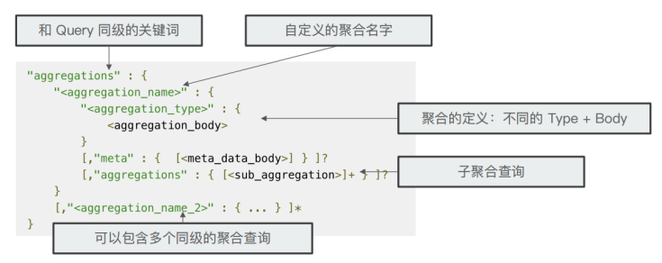
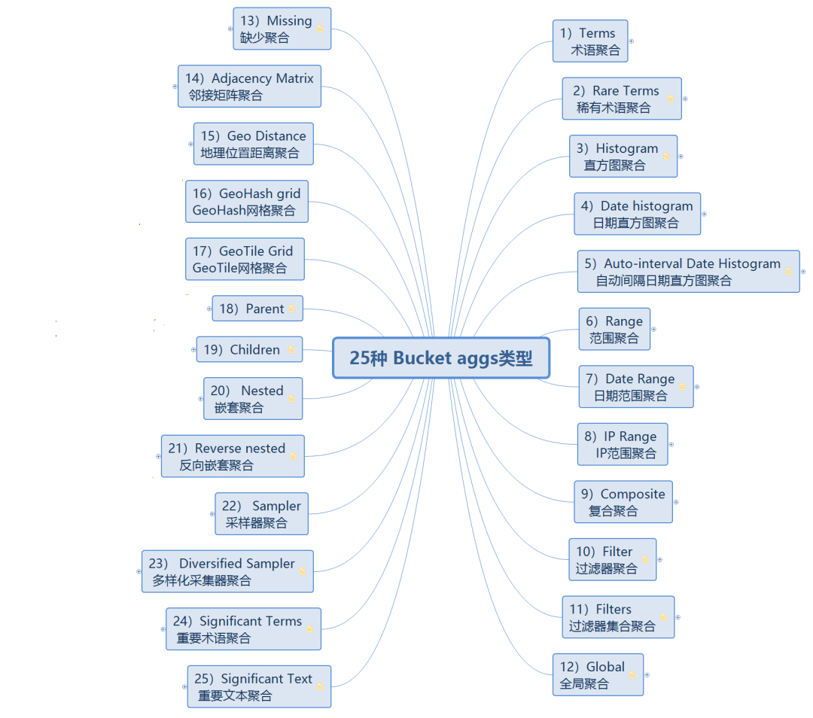

## 概述

ES 官方文档，根据版本查询对应API，本文档不一定符合当前版本

```http
https://www.elastic.co/guide/en/elasticsearch/reference/index.html
```

优点：

* 横向可扩展，扩大集群容易。
* 分片机制提供更好的分布性。
* 高可用，提供复制机制。
* 使用简单。

全文搜索是指通过扫描文章中的每一个词，对每个词建立一个索引，指明该词在文章中出现的次数和位置。

倒排索引：对文档或者文档集合中的单词建立索引，用来储存这些单词在文档或者一组文档中出现的频度、位置。

术语：

* 索引词：一个能够被索引的精确词。
* 文本：一段普通的非结构化文字，通常文本会被分析成一个个索引词。
* 分析：将文本转换为索引词的过程，分析结果依赖于分词器。
* 集群：集群由一个或多个节点组成，对外提供服务。在所有节点中，一个集群由一个唯一的名称，默认为 ElasticSearch，不同的集群应当使用不同的名称，节点是通过集群名称加入集群的。
* 节点：一个逻辑上独立的服务，节点也有唯一的名字，在网络中集群通过名字来管理和通信，当网络中没有集群运行时，只要启动任何一个节点，就会生成一个只有一个节点的集群。
* 路由：储存文档时，会储存在唯一的主分片中，具体哪个分片时通过散列值进行选择，默认情况下，散列值由文档ID生成，如果文档存在一个父文档，则由父文档ID生成。
* 分片：单个Lucene(全文搜索引擎工具包)实例，文档储存在分片中，分片分配在集群的节点，当集群扩容或缩小时，ElasticSearch 将自动在节点间迁移分片，以使集群保持平衡。
* 主分片：储存文档时，系统会首先储存在主分片中，然后会复制到不同的副本，默认情况一个索引有5个分片，分片一旦建立，数量就不能修改。
* 副本分片：每个分片有零个或多个副本，副本是主分片的复制，有两个目的：

  1. 增加高可用性，允许水平分割扩展数据：当主分片失败时，可用从副本中选择一个作为主分片。
  2. 提高性能，允许分配和并行操作提高吞吐量：可以通过主分片或者副本分片进行查询。默认情况下，一个主分片配有一个副本，但副本的数量可以在后面动态地配置增加。副本分片必须部署在不同的节点，不能部署在和主分片相同的节点。

  默认情况下，每个索引分配5个分片和一个副本，意味着集群节点至少要有两个，将拥有5个主分片、5个副本分片。
* 索引：名词表示 具有相同结构的文档集合，对应关系型数据库的 Database，动词表示把文档储存到索引(名词)中，对应关系型数据库的 Insert 操作。
* 类型：在索引中可以定义一个或多个类型，类型是索引的逻辑分区，对应关系型数据库的 Table。
* 文档：储存在 ElasticSearch 中的一个JSON格式的字符串，代表一行数据，对应关系型数据库的 Row。每个储存在索引中的文档都有一个类型和一个ID，每个文档都是一个JSON对象，储存了零个或多个字段，原始的JSON文档被储存在 _source 的字段中，当搜索文档时默认返回的就是这个字段。
* 映射：映射像关系数据库中的表结构，每个类型都有一个映射。
* 字段：文档中包含零个或多个字段，对应关系型数据库的 Column。
* 来源字段：默认情况下，原文档储存在 _source 字段。
* 主键：如果存库时没有，会自动生成一个，文档的 index/type/id 必须唯一。

分布式特性：

* 将文档分区到不同的容器或者分片(shards)中，它们可以存在于一个或多个节点中。
* 将分片均匀的分配到各个节点，对索引和搜索做负载均衡。
* 冗余每一个分片，防止硬件故障造成的数据丢失。
* 将集群中任意一个节点上的请求路由到相应数据所在的节点。
* 无论是增加节点，还是移除节点，分片都可以做到无缝的扩展和迁移。

## 常用配置

```yaml
# 集群名称，节点通过该值加入集群
cluster.name
# 节点名称
node.name
# 机架名称
node.rack
# 索引储存位置
path.data
# 日志储存位置
path.logs
# 内存分配模式，为true时先获取配置大小内存，再加入集群，并且禁止内存和磁盘交换
bootstrap.mlockall
# 绑定ip地址，默认127.0.0.1
network.host
# http端口
http.port
```

### Http配置


## 基本操作

### curl

格式：`curl <options> <url>`

options：

* -o：`-o <file-name>` , 将请求保存为文件。
* -O：用原文件名保存。
* -C -：断点继续下载。
* -i：打印响应头。
* -b：传递cookie。
* -H：指定header，例如`-H 'content-type: application/json'`
* -X：指定请求方法，例如`-X POST`
* -d：指定请求数据。
* -F：向服务器上传二进制文件，例如`-F 'file=@photo.png;type=image/png'`
* -k：跳过ssl检测。
* -L：跟随重定向。
* -s：不输出错误信息和进度信息。
* -S：只输出错误信息。
* -u：设置用户名密码。

### API约定

* 多索引参数：

  1. `test1,test2,test3` : 表示同时搜索 test1，test2，test3 三个索引中的数据。
  2. `_all` : 内部关键字，表示全部索引。
  3. `+test*,-test3` : 表示查询所有 test 开头的索引，排除 test3。
  4. `ignore_unavailable` : 当索引不存在或者关闭的时候，是否忽略这些索引，不会抛出error。
  5. `allow_no_indices` : 当使用通配符查询所有索引的时候，当有索引不存在的时候是否返回查询失败。
  6. `expand_wildcards` : open 表示只支持开启状态的索引，close 表示只支持关闭状态的索引，none 表示 不可用，all 表示同时支持 open 和 close 索引。
  7. `<static_name{date_math_expr{date_format|time_zone}}>` : 按日期筛选

     ```bash
     # static_name ：索引的名称
     # date_math_expr：动态日期计算表达式
     # date_format ：日期格式
     # time_zone：时区，默认为 UTC
     curl -XGET 'localhost:9200/<logstash-{now%2Fd-2d}>/_search' {
       "query" : {
           ...
       }
     }
     # | 被转义为 %2F
     ```
* 通用参数

  1. `?pretty=true`,`?format=yaml` : 返回格式化后的JSON数据或者YAML数据。
  2. `+1h` 增加一个小时 `-1d` 减少一个小时 `/d` 上一个小时，所支持的时间单位为：y（年）、M（月）、w（周）、d（日）、h（小时）、m（分钟）、
     s（秒），表达式设定的日期为 now 或者日期字符串加||。

     ```bash
     # 当前时间加一小时，以毫秒为单位。
     now+1h
     # 当前时间加一小时和一分钟，以毫秒为单位。
     now+1h+1m
     # 当前时间加一小时，四舍五入到最近的一天。
     now+1h/d
     # 2015-01-01 加一个月，向下舍入到最接近的一天。
     2015-01-01||+1M/d
     ```
  3. 所有的返回值可以通过 filter_path 来减少返回值的内容，多个值可以用逗号分开，也可以使用 `*`(匹配任何部分字段的名称) 和 `**`(匹配不确定名称的字段) 通配符。

     ```bash
      curl -XGET 'localhost:9200/_nodes/stats?filter_path=nodes.*.ho*'
      {
        "nodes" : {
           "lvJHed8uQQu4brS-SXKsNA" : {
              "host" : "portable"
           }
        }
      }
     ```

### 索引

#### 创建索引

```bash
PUT http://127.0.0.1:9200/索引名称/
{
  "settings" : {
       "index" : {
         "number_of_shards" : 3,
         "number_of_replicas" : 2
       }
  }
}
# 或者简写为
{
   "settings": {
     "number_of_shards": 3,
     "number_of_replicas": 2
   }
}
```

#### 打开关闭索引

关闭的索引只能显示索引元数据信息，不能够进行读写操作。

```bash
POST 127.0.0.1:9200/索引名称/_close
```

#### 新增索引别名

一个别名可以关联多个索引

```bash
POST http://localhost:9200/_aliases
{
 "actions" : [
     { "remove" : { "index" : "test1", "alias" : "alias1" } },
     { "add" : { "index" : "test1", "alias" : "alias2" } }
 ] 
}
```

### 映射

映射分为两类：

* 动态映射：根据写入文档自动添加字段和字段，映射模式可通过 mappings.dynamic 字段 设置。
* 显示映射：需要手动精确定义，例如哪些字段为全文字段，哪些是数字、日期字段。

#### 动态映射

dynamic策略：


| 策略    | 备注                                                      |
| ------- | --------------------------------------------------------- |
| true    | 默认值，自动添加新字段，一旦创建会生成倒排索引，无法更改  |
| runtime | 自动添加新字段，但不会生成倒排索引，由读时再进行计算      |
| false   | 不会添加新字段，不能通过新字段查询，会存储在 _source 字段 |
| strict  | 发现新字段会抛出异常                                      |

* 日期映射

  默认日期格式为 `yyyy/MM/dd HH:mm:ss||yyyy/MM/dd||epoch_millis`

  ```shell
  #禁用日期自动检测，默认开启
  PUT 索引名称
  {
    "mappings": {
      "date_detection": false
    }
  }
  #自定义日期格式
  PUT 索引名称
  {
    "mappings": {
      "dynamic_date_formats": ["yyyy/MM/dd"]
    }
  }
  ```
* 数字映射

  ```shell
  #启用数值检测模式，默认不启用
  PUT 索引名称
  {
    "mappings": {
      "numeric_detection": true
    }
  }
  ```

##### 动态映射模板

当dynamic策略设置为true或runtime时，可按照模板进行索引，匹配字段的条件有两种类型：

* match_mapping_type: 对检测到的数据类型进行匹配。
* match、unmatch：通过模式匹配来匹配字段名称。

例如：

```shell
PUT 索引名称
{
    "mappings": {
        "dynamic_templates": [
            {
                "模板名称": {
                    "match_mapping_type": "检测到数据类型",
                    "mapping": {
                        "type": "索引的类型"
                    }
                }
            }
        ]
    }
}
```

1. 结构化搜索：对数据不需要分词，不进行全文搜索，仅对字段进行精确匹配。

```shell
# 默认会将字符串映射为text字段，这里将所有String类型字段映射为keyword，不进行分词。
PUT 索引名称
{
  "mappings": {
    "dynamic_templates": [
      {
        "模板名称": {
          "match_mapping_type": "string",
          "mapping": {
            "type": "keyword"
          }
        }
      }
    ]
  }
}
```

2. 仅全文搜素：对字符串字段全部进行分词索引，不进行聚合、排序、精确匹配。

```shell
PUT  索引名称
{
  "mappings": {
    "dynamic_templates": [
      {
        "模板名称": {
          "match_mapping_type": "string",
          "mapping": {
            "type": "text"
          }
        }
      }
    ]
  }
}
```

3. 不进行评分搜素,节约一部分空间。

```shell
PUT 索引库名称
{
  "mappings": {
    "dynamic_templates": [
      {
        "模板名称": {
          "match_mapping_type": "string",
          "mapping": {
            "type": "text",
            #关闭评分功能
            "norms": false
          }
        }
      }
    ]
  }
}
```

4. 数字字段禁用索引，因为数字字段通常进行聚合计算，并不会进行匹配，节约一部分空间。

```shell
PUT 索引库名称
{
  "mappings": {
    "dynamic_templates": [
      {
        "模板名称": {
          "match_mapping_type": "long",
          "mapping": {
            "type": "long",
            #禁止创建索引
            "index": false
          }
        }
      }
    ]
  }
}
```

5. 字段名模式匹配

```shell
PUT 索引名称
{
    "mappings": {
        "dynamic_templates": [
            {
                "模板名称": {
                    "match_mapping_type": "string",
                    "match": "long_*",
                    "unmatch": "*_text",
                    "mapping": {
                        "type": "long",
                        "enable": false
                    }
                }
            },
            {
                "模板名称": {
                    "match_pattern": "regex",
                    "match": "^profit_\\d+$",
                    "mapping": {
                        "type": "long",
                        "index": false,
                        "norms": false,
                        "doc_values": false
                    }
                }
            }
        ]
    }
}
```

6. 子对象路径匹配

```shell
PUT 索引库名称
{
  "mappings": {
    "dynamic_templates": [
      {
        "模板名称": {
          "path_match":   "*",
          "path_unmatch": "*.m",
          "mapping": {
            "type":       "text",
            "copy_to":    "full_name"
          }
        }
      }
    ]
  }
}
```

#### 字段类型

##### 常用类型

1. alias：可为其他字段定义别名, 可使用别名搜索，不可使用别名写入，例如：

   ```shell
   PUT 索引名称
   {
     "mappings": {
         "别名字段名称": {
           #别名类型
           "type": "alias",
           "path": "原字段名称" 
         }
       }
     }
   }
   ```
2. array：数组中所有值必须具有相同的字段类型。
3. binary：可储存二进制,字段不能被搜索。


   | 参数       | 备注                                                                                                           |
   | ---------- | -------------------------------------------------------------------------------------------------------------- |
   | doc_values | 定义字段是否应该以列跨度的方式存储在磁盘上，<br />以便用于排序，聚合或者脚本？接受 true（默认）或 false 参数。 |
   | store      | 决定字段值是否应该被存储以及从_source字段分别获取。<br />接受参数true或false（默认）。                         |
4. boolean：可存储布尔值，也可储存"true"、"false"的字符串，不可储存0、1。


   | 参数       | 备注                                                                                                                                                                |
   | ---------- | ------------------------------------------------------------------------------------------------------------------------------------------------------------------- |
   | doc_values | 定义字段是否应该以列跨度的方式存储在磁盘上，<br />以便用于排序，聚合或者脚本？接受 true（默认）或 false 参数。                                                      |
   | index      | 决定字段是否可以被用户搜索。<br />接受参数 not_analyzed（默认）以及 no。<br /> null_value 接受布尔型值来代替 null 值。<br />默认是 null，意味着字段被作为缺失字段。 |
   | store      | 决定字段值是否应该被存储以及从_source字段分别获取。<br />接受参数true或false（默认）。                                                                              |
5. date：时间格式的字符串。


   | 参数           | 备注                                                                                                                                                                                            |
   | -------------- | ----------------------------------------------------------------------------------------------------------------------------------------------------------------------------------------------- |
   | boost          | 字段级索引加权，接受浮点型数字参数，默认为 1.0。                                                                                                                                                |
   | doc_values     | 定义字段是否应该以列跨度的方式存储在磁盘上，<br />以便用于排序，聚合或者脚本？接受 true（默认）或 false 参数。                                                                                  |
   | format         | 可解析的日期格式。<br />ignore_malformed 如果是 true，畸形的日期会被忽略。<br />如果是 false（默认），畸形日期会抛出异常并丢弃整个文档。                                                        |
   | include_in_all | 决定字段是否应该被包含在_all 字段中。<br />接受 true 或 false 参数。<br />如果索引被设置为 no 或者父对象字段设置 include_in_all 为 false，<br />参数默认值为 false；其他情况下，默认值为 true。 |
   | index          | 决定字段是否可以被用户搜索。<br />接受参数 not_analyzed（默认）以及 no。 <br />null_value 接受日期型值来代替 null 值。<br />默认是 null，意味着字段被作为缺失字段。                             |
   | precision_step | 控制索引的额外索引词的数量来使范围查询更快速。默认值为 16。                                                                                                                                     |
   | store          | 决定字段值是否应该被存储以及从_source 字段分别获取。<br />接受参数 true 或 false（默认）。                                                                                                      |
6. object、nested：对象和嵌套对象，可通过 nested 关键字对 nested 字段类型进行搜索。
7. range：该类型细分为integer_range、float_range、long_range、double_range、date_range、ip_range，date_range不管什么格式都被解析为毫秒进行比较大小。
8. numbers：该类型细分为long、integer、short、byte、double、float、half_float、unsigned_long。


   | 参数             | 备注                                                                                                                                                                                      |
   | ---------------- | ----------------------------------------------------------------------------------------------------------------------------------------------------------------------------------------- |
   | coerce           | 试着将字符串型数据转换为整数型数字数据。                                                                                                                                                  |
   | boost            | 字段级索引加权，接受浮点型数字参数，默认为 1.0。                                                                                                                                          |
   | doc_values       | 定义字段是否应该以列跨度的方式存储在磁盘上，<br />以便用于排序，聚合或者脚本？接受 true（默认）或 false 参数。                                                                            |
   | ignore_malformed | 如果是 true，畸形的数字会被忽略。<br />如果是 false（默认），畸形数字会抛出异常并丢弃整个文档。                                                                                           |
   | include_in_all   | 决定字段是否应该被包含在_all 字段中。接受 true 或 false 参数。<br />如果索引被设置为 no 或者父对象字段设置 include_in_all 为 false，<br />参数默认值为 false；其他情况下，默认值为 true。 |
   | index            | 决定字段是否可以被用户搜索。<br />接受参数 not_analyzed（默认）以及 no。 <br />null_value 接受与字段同类型的数字型值来代替 null 值。<br />默认是 null，意味着字段被作为缺失字段。         |
   | precision_step   | 控制索引的额外索引词的数量来使范围查询更快速。<br />默认值取决于数字类型。                                                                                                                |
   | store            | 决定字段值是否应该被存储以及从_source 字段分别获取。<br />接受参数 true或 false（默认）。                                                                                                 |
9. ip：用于IPv4或IPv6，筛选时可通过网段筛选。

   ```shell
   GET 索引名称/_search
   {
     "query": {
       "term": {
         "ip_addr": "192.168.1.0/16"
       }
     }
   }
   ```
10. geo_point、geo_shape：支持地理形状的搜索，即支持点、线、圈、多边行搜索。
11. keyword：储存结构化内容，通常用于排序、聚合查询。
12. text：在被搜索之前通过分词器进行分词，然后形成倒排索引，不适合排序、聚合计算。


    | 参数                   | 备注                                                                                                                                                                                                                                    |
    | ---------------------- | --------------------------------------------------------------------------------------------------------------------------------------------------------------------------------------------------------------------------------------- |
    | analyzer               | 分词器可以被用于可分词的字符串型字段。<br />默认为默认的索引分词器，或者标准分词器。                                                                                                                                                    |
    | boost                  | 字段级索引加权。接受浮点型数字，默认值是 1.0。<br />doc_values 定义字段是否应该以列跨度的方式存储在磁盘上，<br />以便用于排序，聚合或者脚本？接受 true 或 false 参数。<br />对于不可分词字段，默认值是 true。可分词字段不支持这个参数。 |
    | fielddate              | 决定字段是否可以使用内存字段值进行排序，聚合或者在脚本中使用。<br />接受 disabled 或者 paged_bytes（默认）参数。<br />没有分析过的字段会优先使用文档值。                                                                                |
    | ignore_above           | 不要索引或执行任何长于这个值的字符串。默认为 0（禁用）。                                                                                                                                                                                |
    | include_in_all         | 决定字段是否应该被包含在_all 字段中。接受 true 或 false 参数。<br />如果索引被设置为 no 或者父对象字段设置 include_in_all 为 false，<br />参数默认值为 false；其它情况下，默认值为 true。                                               |
    | index                  | 决定字段是否可以被用户搜索。<br />接受参数 analyzed（默认，视为全文字段），<br />not_analyzed（作为关键字字段）以及 no。                                                                                                                |
    | index_options          | 定义存储在索引中，用于搜索和突出用途的信息。                                                                                                                                                                                            |
    | norms                  | 计算查询得分的时候是否应该考虑字段长度。<br />默认依赖于索引设置： analyzed <br />字段默认{ "enabled": true, "loading": "lazy" }。<br />not_analyzed 字段默认{ "enabled": false }。                                                     |
    | null_value             | 接受一个字符串值替换所有 null 值。默认为 null，意味着字段被作为缺失字段。<br />如果字段是可分词（analyzed）的，null_value 也会被分词。                                                                                                  |
    | position_increment_gap | 定义字符串数组中应该插入的虚拟索引词的数量。<br />默认值为100，以一个较合理的值来阻止短语查询在跨字段匹配索引词的时候溢出。                                                                                                             |
    | store                  | 决定字段值是否应该被存储以及从_source 字段分别获取。<br />接受参数 true 或 false（默认）。                                                                                                                                              |
    | search_analyzer        | 指定搜索时用在可分词字段上的分词器。                                                                                                                                                                                                    |
    | search_quote_analyzer  | 指定搜索短语时使用的分词器。                                                                                                                                                                                                            |
    | similarity             | 指定使用的相似度评分算法，默认为 TF/IDF。                                                                                                                                                                                               |
    | term_vector            | 定义一个可分词字段是否应该存储索引词向量。默认为 no。                                                                                                                                                                                   |

##### rank_feature

rank_feature 或 rank_features 字段的数值可以提高文档的相关性分数，他们作用于数字字段，默认值越大相关性越高，也可通过 positive_score_impact = false 使值越大相关性越低。

rank_feature使用以下函数计算分数：

* saturation：默认值，score区间(0,1)，打分公式为 `S / (S + pivot)` ，S是字段的值，pivod是score分界值，默认使用字段近似平均值，当S值大于pivot时，score>0.5 ，当S值小于pivot时，score<0.5 。
* Logarithm：score无边界，打分公式为 `log(scaling_factor + S)` ，S是字段的值，scaling_factor 是配置的缩放系数。
* Sigmoid：score区间(0,1)，saturation 的扩展，打分公式为 `S^exp / (S^exp + pivot^exp)` ，exp 为指数，建议取值区间 `[0.5,1]`。

##### search_as_you_type

类似 text 的字段，可以根据参数创建一些子字段。


| 参数                   | 备注                                                                     |
| ---------------------- | ------------------------------------------------------------------------ |
| my_field               | 按照 mapping 中的配置进行分析。 如果未配置分析器，则使用索引的默认分词器 |
| my_field._2gram        | 用大小为 2 的 shingle token filter  分词器对 my_field 进行分词           |
| my_field._3gram        | 用大小为 3 的 shingle token filter  分词器对 my_field 进行分词           |
| my_field._index_prefix | 用 edge ngram token filter 包装 my_field._3gram 的分词器                 |

例如：对于 "star" 分词：

* _my_field 会使用默认分词器拆分为 "s"，"t"，"a"，"r"。
* _2gram 会拆分为 "st"，"ta"，"ar"。
* _3gram 会拆分为 "sta"，"tar"。
* index_prefix 会拆分为  "s"，"st"，"sta"，"star"。

```shell
GET 索引名称/_search
{
  "query": {
    "multi_match": {
      "query": "匹配字符串",
      "type": "bool_prefix",
      # 从my_field、my_field._2gram、my_field._3gram字段中筛选
      "fields": [
        "my_field",
        "my_field._2gram",
        "my_field._3gram"
      ]
    }
  }
}
```

##### token_count

负责对储存内容被分词的数量，实际是一个integer类型字段。

例如：

```shell
# 创建
PUT 索引名称
{
  "mappings": {
    "properties": {
      "字段名称": { 
        "type": "text",
        "fields": {
          "length": { 
            "type":     "token_count",
            "analyzer": "standard"
          }
        }
      }
    }
  }
}
# 搜索分词数量为2的数据
GET 索引名称/_search
{
  "query": {
    "term": {
      "字段名称.length":2 
    }
  }
}
```

#### 元字段


| 字段名        | 备注                                            |
| ------------- | ----------------------------------------------- |
| _index        | 文档所属的索引。                                |
| _uid          | 包含_type 和_id 的混合字段。                    |
| _type         | 文档的映射类型。                                |
| _id           | 文档的 ID                                       |
| _source       | 作为文档内容的原始 JSON。                       |
| _size _source | 元字段占用的字节数，通过 mapper-size 插件提供。 |
| _all          | 索引所有字段的值                                |
| _field_names  | 文档中所有包含非空值的字段。                    |
| _timestamp    | 关联文章的时间戳，可以手动指定或者自动生成。    |
| _ttl          | 定义文档被自动删除之前的存活时间。              |
| _parent       | 用于在映射类型之间创建父子关系。                |
| _routing      | 一个自定义的路由值，路由文档到一个特定的分片。  |
| _meta         | 应用特定的元字段。                              |

### 文档

#### 索引文档

```bash
# 指定 ID
PUT /<index>/<type>/<id>
{
  文档内容
}

# 自动生成ID，注意是POST
POST /<index>/<type>
{
  文档内容
}
```

添加新文档，确保不是更新：

```bash
PUT /<index>/<type>/<id>?op_type=create
{
  文档内容
}
# 或
PUT /<index>/<type>/<id>/_create
{
  文档内容
}
```

#### 更新文档

和索引文档同一个操作

```bash
# 更新成功后，_version 会加1，还会有 "created":false 属性
# 在内部是将旧文档标记删除，并且不能访问，然后添加新文档，文档时不可变的，不能被更改只能被替换
PUT /<index>/<type>/<id>
{
  文档内容
}
# 更新文档时指定版本，版本匹配才能修改
PUT /<index>/<type>/<id>?version=<num>
{
  文档内容
}
# 指定外部版本，比如数据库中版本，这个版本不需要完全匹配，只要后来版本大于之前版本就可以修改
PUT /<index>/<type>/<id>?version=<num>&version_type=external
{
  文档内容
}
```

#### 局部更新文档

更新请求接受一个局部文档参数doc，它会合并到现有文档中——存在的字段被覆盖，新字段被添加。

```bash
# 注意是POST
POST /<index>/<type>/<id>/_update
{
  "doc":{
     文档内容
   }
}
```

#### 检索文档

```bash
# 查询所有数据
POST /<index>/<type>/_search
# pretty参数，美化输出 响应内容包括 "found":true,如果找不到，则包括 "found":false,不管找到与否，状态码都是200
GET /<index>/<type>/<id>?pretty
# 输出部分文档
GET /<index>/<type>/<id>?_source=<field1>,<field2>
# 只请求_source
GET /<index>/<type>/<id>/_source
# 检测文档是否存在
curl -i -XHEAD http://localhost:9200/<index>/<type>/<id>
```

使用groovy脚本更新：

```bash
# ctx._source 表示 _source 的变量
# ctx.op 表示操作的变量，比如 delete 表示删除，none 表示什么都不做
POST /<index>/<type>/<id>/_update?retry_on_conflict=5  # 表示版本冲突时重试的次数
{
  "script":"groovy脚本",
  "params": {
     定义脚本变量
  },
  "upsert"：{
     如果不存在则新增
  }
}
```

检索多个文档：

```bash
GET /_mget
{
  "docs": [
     {
        文档1 条件
     },
     {
        文档2 条件
     },
   ] 
}
或者
GET /<index>/<type>/_mget
{
  "docs": [
     {
        文档1 条件
     },
     {
        文档2 条件
     },
   ] 
}
```

#### 删除文档

```bash
DELETE /<index>/<type>/<id>
```

#### 批量操作bulk

```bash
# 不是原子操作，各操作互不干扰
# 批量请求会先加载到请求节点的内存，所以请求越大，给其他请求可用内存越小。
POST /_bulk
{"create":{ 元数据 }}   # 当文档不存在时创建
{ 前一行操作的文档数据 }
{"update":{ 元数据 }}   # 局部更新文档
{ 前一行操作的文档数据 }
{"delete":{ 元数据 }}   # 删除一个文档
{ 前一行操作的文档数据 }
{"index":{ 元数据 }}   # 索引文档 或 更新文档
{ 前一行操作的文档数据 }
或
POST /<index>/<type>/_bulk
{"create":{ 元数据 }}   # 当文档不存在时创建
{ 前一行操作的文档数据 }
{"update":{ 元数据 }}   # 局部更新文档
{ 前一行操作的文档数据 }
{"delete":{ 元数据 }}   # 删除一个文档
{ 前一行操作的文档数据 }
{"index":{ 元数据 }}   # 索引文档 或 更新文档
{ 前一行操作的文档数据 }
```

由于批量操作中文档可能属于不同的主分片，意味着需要转发到对应的分片，为了减少解析数据，使用换行符识别数据行，减少内存消耗。

### 分词器

每个查询、每个字段或每个索引都可以指定分析器。

在创建索引时查找分析器的顺序：

* 在字段映射中定义的分析器。
* 在索引设置中名为 default 的分析器。
* 标准分析器。
* 在查询时，有更多的层次。
* 在全文查询中定义的分析器。
* 在字段映射中定义的搜索分析器。
* 在字段映射中定义的分析器。
* 在索引设置中名为 default_search 的分析器。
* 在索引设置中名为 default 的分析器。
* 标准分析器。

测试分析器：

```bash
GET localhost:9200/_analyze
{
   "analyzer" : "standard",
   "text" : "this is a test"
}
```

索引分析的过程：

1. 字符过滤器：将字符串过滤，例如去除HTML标记 或者转换 "&" 为 "and"。
2. 分词器：进行分词。
3. 标记过滤器：每个词都通过标记过滤器处理，可以修改词、去掉词、增加词等。

分词器类型：

* simple：对字母文本进行分词拆分，并且将分词后的内容转换成小写格式。
* simple_pattern：根据正则表达式进行分词。

  ```shell
  PUT 索引名称
  {
    "settings": {
      "analysis": {
        "analyzer": {
          "索引中配置分词器名称": {
            "tokenizer": "分词器名称"
          }
        },
        "tokenizer": {
          "分词器名称": {
            "type": "simple_pattern",
             #连续三个数字表示一个单词
            "pattern": "[0123456789]{3}" 
          }
        }
      }
    }
  }
  ```
* simple_pattern_split：特定分隔符分词器，默认使用空格分割，分词效率高

  ```shell
  PUT 索引名称
  {
    "settings": {
      "analysis": {
        "analyzer": {
          "索引中配置分词器名称": {
            "tokenizer": "分词器名称"
          }
        },
        "tokenizer": {
          "分词器名称": {
            "type": "simple_pattern_split",
            #使用 - 分割
            "pattern": "-"
          }
        }
      }
    }
  }
  ```

#### standard分词器

默认的分词器，基于Unicode文本分割算法 `http://unicode.org/reports/tr29/` 。


| 参数             | 备注                                         |
| ---------------- | -------------------------------------------- |
| max_token_length | 分词后单词的最大长度，超过最大值按最大值拆分 |
| stopwords        | 停用词，可以是 0 个或 多个                   |

#### IK分词器

安装：

1. `https://github.com/medcl/elasticsearch-analysis-ik` 下载
2. 解压到plugins/ik目录
3. 配置IKAnalyzer.cfg.xml，重启。

```xml
<?xml version="1.0" encoding="UTF-8"?>
<!DOCTYPE properties SYSTEM "http://java.sun.com/dtd/properties.dtd">
<properties>
    <comment>IK Analyzer 扩展配置</comment>
    <!--用户可以在这里配置自己的扩展字典 -->
    <entry key="ext_dict">custom-ext.dic</entry>
     <!--用户可以在这里配置自己的扩展停止词字典-->
    <entry key="ext_stopwords">custom-stop.dic</entry>
    <!--用户可以在这里配置远程扩展字典 -->
    <!-- <entry key="remote_ext_dict">words_location</entry> -->
    <!--用户可以在这里配置远程扩展停止词字典-->
    <!-- <entry key="remote_ext_stopwords">words_location</entry> -->
</properties>
```

分词模式：

* ik_max_word：对文本进行最细粒度拆分，尽量多的拆分词。
* ik_smart：对文本进行最粗粒度拆分，尽量少的产生组合。

### 搜索

#### 常用搜索

1. 查询索引库信息：`GET /_cat/indices`
2. 根据 _id 查询：`GET 索引库名称/_doc/文档_id`
3. 查询索引别名：`GET /_cat/aliases`
4. 查询所有文档：`GET 索引库名称/_doc/_search`
5. 排序：

   ```shell
   GET /索引名称/_search
   {
     "query": { "match_all": {} },
     "sort":[
         {"字段名称":{"order":"desc"}}
       ]
   }
   ```
6. 返回部分字段，并分页

   ```shell
   GET /索引名称/_search
   {
     "query": { "match_all": {} },
     "_source":["字段一","字段二"],
     "from":0,
     "size":2
   }
   ```
7. 简易搜索，例如：

   ```shell
   # 搜索类型为 tweet1 并在 tweet 字段包含 elasticsearch 字符的文档，可添加+前缀表示条件必须满足，-前缀表示必须不满足，例如 +name:john +tweet:mary
   GET /_all/tweet1/_search?q=tweet:elasticsearch
   # 搜索包含 mary 的所有结果
   GET /_search?q=mary
   ```

##### match

查询类型：

* match_all：可以查询到所有文档，是没有查询条件下的默认语句。

  ```shell
  # 等同于 _search 查询
  GET 索引名称/_search
  {
    "query": {
      "match_all": {}
    }
  }
  ```
* match_phrase：对查询条件分词后，将分词结果进行倒排索引匹配，查询结果必须包含所有分词切顺序必须一样，可通过 slop 额外溢出几个单词也可以命中，例如：

  ```shell
  # 检索词“系统编程”被分词为两个Token【系统，Position=0】【编程，Position=1】；
  # 倒排索引检索时，等价于sql：【where Token = 系统 and 系统_Position=0 and Token = 编程 and 编程_Position=1】
  GET /索引名称/_doc/_search
  {
    "query":{
      "match_phrase":{
        "字段名称.分词器名称":"系统编程"
      }
    }
  }
  # 如果不知道 slop，则把条件作为整个单词进行查询，只有精确匹配到Eddie Underwood才会命中
  GET 索引名称/_search
  {
    "query": {
      "match_phrase": {
        "字段名称": {
          "query": "Eddie Underwood", 
          # 如果是Eddie test Underwood也可以被命中
          "slop": 1  
        }
      }
    }
  }
  ```
* match_phrase_prefix：对查询条件分词后，对最后一个Token在倒排索引列表中进行前缀搜索，可通过 max_expansions 来控制通配符的个数,例如：

  ```shell
  # 检索词“系”被分词为一个个Token【系】+ 1个通配符
  # 倒排索引检索时，等价于sql：【where Token = 系 or Token like “系_”】，max_expansions 表示一个通配符
  GET 索引名称/_doc/_search
  {
    "query": {
      "match_phrase_prefix": {
        "字段名称.分词器名称": {
          "query": "系",
          "max_expansions": 1
        }
      }
    }
  }
  ```
* match：对查询条件分词后，对每一个token进行倒排索引匹配，只要有一个匹配到都可以被查询到，如果指定一个确切值，如数字、日期、布尔值或者not_analyzed将按确定值搜索。


  | 参数                                | 备注                                                                                                                                                           |
  | ----------------------------------- | -------------------------------------------------------------------------------------------------------------------------------------------------------------- |
  | query                               | 查询条件                                                                                                                                                       |
  | operator                            | 查询条件分词后，token的逻辑匹配条件AND、OR (默认值)                                                                                                            |
  | minimum_should_match                | 最小匹配的数量，指定文档至少包含几个token才算匹配到                                                                                                            |
  | fuzziness                           | 字符串最大编辑距离                                                                                                                                             |
  | prefix_length                       | 通过最大编辑距离进行模糊查询，开始的多少个字符不允许被模糊，默认值为0                                                                                          |
  | fuzzy_transpositions                | 默认true，模糊时是否包含两个相邻字符的位置互换                                                                                                                 |
  | analyzer                            | 分词器，如果不指定，用默认的                                                                                                                                   |
  | max_expansions                      | 最大模糊扩展数量，也就是通配符的数量                                                                                                                           |
  | zero_terms_query                    | 去除停用词后如果文档为空如何返回，none (default)：不返回任何文档，all：返回所有文档                                                                            |
  | lenient                             | 是否忽略一些输入错误，例如数字类型的字段输入字符串去匹配，默认false                                                                                            |
  | auto_generate_synonyms_phrase_query | 是否开启同义词查询，默认是true，同义词通过<br />`https://www.elastic.co/guide/en/elasticsearch/reference/current/analysis-synonym-graph-tokenfilter.html` 配置 |
* multi match：match的增强查询，支持对多个字段匹配，支持通配符。

  ```shell
  # 在customer_full_name、customer_first_name中有一个字段包括查询条件就可以匹配到
  GET 索引名称/_search
  {
    "query": {
      "multi_match": {
        "query": "Eddie",
        # 可以写成["*_name"]
        "fields": ["customer_full_name","customer_first_name"]  
      }
    },
    "_source":["customer_full_name","currency","customer_first_name"]
  }
  ```

##### term

不会对查询条件进行分词，直接匹配倒排索引。

* ids ：通过 _id 查询。

  ```shell
  GET /_search
  {
    "query": {
      "ids" : {
        # 返回属性_id为1、4、100的文档，如果存在的话
        "values" : ["1", "4", "100"]  
      }
    }
  }
  ```
* exists : 是否包含某个字段

  ```shell
  POST /索引名称/_search
  {
    "query": {
      "exists": {"field": "字段名称"}
    }
  }
  ```
* prefix ： 前缀匹配，可使用 case_insensitive = true 忽略大小写。

  ```shell
  POST /索引名称/_search
  {
    "query": {
      "prefix": {
        "字段名称.keyword": {
          # 以Ela作为前缀的都可以匹配到，注意ela并不会被匹配到
          "value": "Ela"
        }
      }
    }
  }
  ```
* range ：查询一个范围。

  ```shell
  # 查询在10到20之间的
  GET /_search
  {
    "query": {
      "range": {
        "字段名称": {
          "gte": 10,
          "lte": 20
        }
      }
    }
  }
  ```
* wildcard ：通配符查询，`*`表示可以匹配0到多个字符，`?`表示匹配任何单个字符，不能用`*`或者`?`开头，因为会匹配到大量的数据，导致性能下降严重。

  ```shell
  GET /_search
  {
    "query": {
      "wildcard": {
        "user.id": {
          "value": "ki*y",
          "boost": 1.0,
        }
      }
    }
  }
  ```
* regexp : 正则表达式查询。
* term ：不会对查询条件进行分词，直接匹配倒排索引。
* terms ：term的增强，允许指定多个匹配条件。

  ```json
  {
      "terms": {
          "字段名称": [ "search", "full_text", "nosql" ]
      }
  }
  ```

##### bool

组合多个查询子句，构成复杂查询

* must：查询指定文档一定要被包含。
* must_not: 查询指定文档一定不要被包含。
* should: 查询指定文档，有则可以为文档相关性加分。
* filter：查询会缓存结果，不计算相关度分数，查询效率更高。

  ```shell
  GET /_search
  {
    "query": {
      "bool": {
        "must": [
          { "match": { "title":   "Search"        }},
          { "match": { "content": "Elasticsearch" }}
        ],
        "filter": [
          { "term":  { "status": "published" }},
          { "range": { "publish_date": { "gte": "2015-01-01" }}}
        ]
      }
    }
  }
  ```

##### aggs

基本概念：

* 桶(bucket)：一组满足特定条件的文档数据的集合，对数据分组后，得到一组组的数据，就是一个个的桶。
* 指标(Metrics)：对桶内的文档进行统计计算。

聚合的方式：

* 桶聚合(Bucket Aggregation)：本质上是一种特殊的指标聚合，聚合指标就是数据的条数count
* 指标聚合(Metric Aggregation)：对文档字段进行统计分析，例如 count,sum,max 等。
* 管道聚合(Pipline Aggregation)：对其他聚合结果进行二次聚合。

聚合的语法：**aggregations关键字可使用aggs代替**



###### 桶聚合

详细介绍查看 `https://www.elastic.co/guide/en/elasticsearch/reference/8.6/search-aggregations-bucket.html`



常用桶聚合：

1. Terms & Rare Terms

* 都是按某个字段将文档聚合。
* Terms 根据 doc_count 降序排列，Rare Terms 按升序排列。
* Text 类型字段需要启用 fieldata。
* 通过size控制返回数量。
* Rare Terms 可通过 include、exclude、missing 控制是否包含内容、字段。

2. Histogram & Date histogram

* 根据数值或数值范围类型字段，按固定间隔将文档分类为直方图。
* 使用 interval 控制间隔，左闭右开。
* min_doc_count：不返回doc_count小于该值的存储桶。
* extended_bounds：指定返回 doc_count 范围。

```shell
# 根据动态脚本聚合
GET /myindex-aggtest/_search
{
  "runtime_mappings": {
    "make_content_length": {
      "type": "long",
      # 运行时脚本计算"make"字段内容的长度
      "script": "emit(doc['make.keyword'].value.length())" 
    }
  },
  "size" : 0,
  "aggs": {
    "make_length": {
      "histogram": {
        "interval": 1,
        # 根据运行时"make"字段的内容长度进行聚合统计
        "field": "make_content_length" 
      }
    }
  }
}
```

3. Range & Date Range & IP Range

* 包含 from ，不包含 to。

4. Composite

多字段聚合，类似于groupby 多字段，例如：

    ```shell
    GET composite_test/_search
    {"size": 0, 
     "aggs" : {
          "my_buckets": {
            "composite" : {
               "sources" : [
                  { "area": { "terms": {"field": "area" } } },
                   { "userid": { "terms": {"field": "userid" } } },
                   { "sendtime": { "date_histogram": { "field": "sendtime","interval": "1d","format": "yyyy-MM-dd"} } }
                 ]
             }
            }
        }
    ```

5. Filter & Filters：对query的结果集进行聚合，Filters可以设置多个条件查询输出多个桶。

    ```shell
    #聚合计算厂商是"toyota"出售车的平均价格和出售的总数量。
    GET /myindex-aggtest/_search
    {
      "size": 0,
      "aggs": {
        "make_by": {
          "filter": { "term": { "make": "toyota" } },
          "aggs": {
            "avg_price": { "avg": { "field": "price" } }
          }
        }
      }
    }
    #求出售车辆中红色（red），绿色（green）以及其他颜色的占比
    GET /myindex-aggtest/_search
    {
      "size": 0,
      "aggs" : {
        "messages" : {
          "filters" : {
            "other_bucket_key": "other_color", 
            "filters" : {
              "reds" :   { "match" : { "color" : "red"   }},
              "greens" : { "match" : { "color" : "green" }}
            }
          }
        }
      }
    }
    ```

6. Global：对所有文档聚合，抛开Query的影响。

## 集群

### 操作

#### 状态信息

```bash
#查询当前集群的颜色信息
GET /_cat/health

#查询当前集群的健康状态 
# status：集群状态，green（主分片和副本分片都可用），yellow（主分片可用，副本分片部分可用），red（部分主分片不可用）。
# number_of_nodes/number_of_data_nodes：集群节点数和数据节点数。
# active_primary_shards：集群中所有活跃的主分片数。
# active_shards：集群中活跃的分片数。
# relocating_shards：正在从一个节点迁往其他节点的分片的数量。通常为 0，集群变化时会变化，例如添加了一个新节点，或者下线了一个节点。
# initializing_shards：正在初始化的分片。
# unassigned_shards：未分配的分片，通常为0，当某个节点的副本分片丢失时，该值会变化，如果你的集群是 red 状态，也会存在未分配分片。
GET _cluster/health?pretty=true
GET _cluster/health?level=indices
GET _cluster/health?level=shards

#查询当前集群的运行状态信息
# 返回索引、文档、储存、节点、cpu、文件系统的统计信息
GET _cluster/stats?pretty

#查询当前集群中所有节点的监控信息，包含线程、jvm、索引查询指标等。
GET _nodes/stats?pretty
#查询当前集群中所有索引的监控信息
GET _stats?pretty

#查询当前集群中主节点的IP等信息
GET /_cat/master
#查询当前集群中所有的节点的IP等信息
GET /_cat/nodes
#查询当前集群中索引分片的信息
GET /_cat/shards
```

#### 升级节点

* 关闭分片分配：当关闭一个节点的时候，会立即试图复制这个节点的数据到集群的其他节点，将导致大量的 IO 请求，可以在关闭该节点时设置参数来避免。

  ```bash
  PUT /_cluster/settings
  {
    "transient": {
       "cluster.routing.allocation.enable": "none"
    }
  }
  ```
* 重新分配

  ```bash
  PUT /_cluster/settings
  {
    "transient": {
      "cluster.routing.allocation.enable": "all"
    }
  }
  ```
* 刷新数据到Lucene持久化保存

  ```bash
  POST /_flush
  ```
* 查看集群状态，当节点加入集群后，它首先恢复存储在本地的主分片数据，当每个节点都恢复完成后，集群的状态将会变成黄色，表示所有主分片已经被找到，但是并不是所有的副本分片都恢复。

  ```bash
  GET _cat/health
  ```

升级节点：

1. 关闭分片分配。
2. 刷新数据到Lucene持久化保存。
3. 升级节点。
4. 重新分配。

#### 备份与恢复

1. 创建快照仓库

```http
curl -XPOST http://192.168.0.1:9200/_snapshot/仓库名称/
{
    "type": "fs",
    "settings": {
        "location": "/data/backups/elasticsearch",
        "max_snapshot_bytes_per_sec" : "50mb",
        "max_restore_bytes_per_sec" : "50mb",
        "compress" : true
    }
}
```

`max_snapshot_bytes_per_sec`：制作快照的速度，默认20mb/s。

`max_restore_bytes_per_sec`：快照恢复的速度，默认20mb/s

2. 创建/删除备份

```http
curl -XPUT http://192.168.0.1:9200/_snapshot/仓库名称/快照名称
```

该操作是后台执行，默认备份所有索引，如果想等到备份完成，可以加上参数 wait_for_completion=true

```http
curl -XDELETE http://192.168.0.1:9200/_snapshot/仓库名称/快照名称
```

3. 查看备份

```http
curl -XGET http://192.168.0.1:9200/_snapshot/仓库名称/快照名称/_status
```

状态类型：

* INITIALIZING ：集群状态检查，检查当前集群是否可以做快照，通常这个过程会非常快
* STARTED ：正在转移数据到仓库
* FINALIZING ：数据转移完成，正在转移元信息
* DONE ：完成
* FAILED ：备份失败

4. 恢复

```http
curl -XPOST http://192.168.0.1:9200/_snapshot/仓库名称/快照名称/_restore 
{
    "indices": "index_1",
    "rename_pattern": "index_(.+)",
    "rename_replacement": "restored_index_$1"
}
```

其中：

* indices 表示只恢复 index_1。
* rename_pattern 表示对 index_ 开头的索引重命名，避免覆盖原有的数据。
* rename_replacement 表示重命名的格式为 restored_index_xxx ，如index_1会被重命名为restored_index_1 。

5. 查看恢复进度

```http
# 查看所有索引的恢复进度
curl -XGET http://192.168.0.1:9200/_recovery/
 
# 查看索引restored_index_1的恢复进度
curl -XGET http://192.168.0.1:9200/_recovery/restored_index_1
```

### 节点

节点的类型：

* 主节点：当一个节点 node.master = true 时，有资格被选为主节点，只有主节点拥有修改集群状态的能力，负责决定哪些分片分配给哪个节点，并在节点之间移动分片以平衡整个集群。
* 数据节点：当一个节点 node.data = ture 时，该节点不会被选择为主节点，负责保存数据和执行数据相关的操作，如crud。
* 客户端节点：当一个节点 node.master = false 和 node.data = false时，既不保存数据也不能成为主节点，但可以作为客户端节点，响应用户请求，并把相关操作发送到其他节点。
* 部落节点：当一个节点配置 tribe.* 时，可以连接多个集群，在所有连接的集群是哪个执行搜索和其他操作,例如：
  ```yaml
  tribe:
    tl:
      cluster.name: cluster_one
    t2:
      cluster.name: cluster_two
  ```

#### 主节点的选举

节点探索：启动节点时，会寻找拥有相同集群名称的主节点，如果找到则加入集群，如果没有找到则自己选为主节点。

主节点会检查其他索引节点是否能够响应，其他节点业务ping主节点，如果主节点断开，则选择新的主节点。

默认情况下每个节点都可以成为主节点和数据节点，也可以通过 node.master 和 node.data 配置。

为了避免脑裂，会设置集群最小互相连接的节点数目,`discovery.zen.minimum_master_nodes=主节点候选总数/2+1`。

### 分片

分片是数据的最小单元块，ES默认使用5个分片和1个副本。

分片的数量：

1. 如果有一个有限且明确的数据集，可以只使用一个分片。
2. 如果没有明确，最理想的分片数量应该依赖于节点数量，为了保证高可用和查询的吞吐量，需要配置副本数量。
3. 每个节点的分片数量保持在低于每1GB堆内存对应集群的分片在20-25之间。

分片的大小：通常大小在20GB和40GB之间。

#### 分片分配器

默认使用 balanced 分配器,自定义需实现 `org.elasticsearch.cluster.routing.allocation.allocator.ShardsAllocator`

> https://www.elastic.co/guide/en/elasticsearch/reference/8.6/modules-cluster.html#shards-rebalancing-heuristics

##### 分片决策者

分片分配器的分片逻辑由分片决策者处理，分配器包含多个决策者，可通过参数配置分片规则。

负载均衡类：

* SameShardAllocationDecider ：不允许相同分片（primary\replication）出现在相同的节点上，也考虑同一物理机多个es实例的情况（es可能多个虚拟机上，多个虚拟机在一台物理机上），通过`cluster.routing.allocation.same_shard.host`来配置，默认为false。
* ThrottlingAllocationDecider ：控制恢复过程中分片的并发数，可配置参数有 `cluster.routing.allocation.node_initial_primaries_recoveries` 和 `cluster.routing.allocation.node_concurrent_recoveries`，详情查看 集群再平衡 模块。
* AwarenessAllocationDecider ：更够感知服务器、服务机架等，尽量分散存储分片，参数举例:
  按机架分：`cluster.routing.allocation.awareness.attributes: rack_id`,`node.attr.rack_id:1`,`node.attr.rack_id:2`
  按区域分：`cluster.routing.allocation.awareness.attributes: zone`,`cluster.routing.allocation.awareness.force.zone.values: zone1,zone2`,如果zone1的机器上不能容纳所有的shard，并且zone2没有启动，剩余没有分配的shard则不会进行分配（zone1过载），直到等到zone2启动才进行分配。

并发数量类：

* ConcurrentRebalanceAllocationDecider : 再平衡并发数量，`cluster.routing.allocation.cluster_concurrent_rebalance`，详情查看 集群再平衡 模块。
* ThrottlingAllocationDecider : 恢复过程中并发数，`cluster.routing.allocation.node_initial_primaries_recoveries`，详情查看 集群再平衡 模块。

条件限制规则：

* FilterAllocationDecider ： 通过 include、exclude参数控制shard的节点分配，`index.routing.allocation.require.`、`index.routing.allocation.include.`、`index.routing.allocation.exclude.`、`cluster.routing.allocation.require.`、`cluster.routing.allocation.include.`、`cluster.routing.allocation.exclude.`，其中 require表示必须，include表示允许，exclude表示禁止，注意cluster的设置会重载掉index的配置。
* ReplicaAfterPrimaryActiveAllocationDecider ： 保证只会在主分片分配完毕后才开始分配分片副本。
* RebalanceOnlyWhenActiveAllocationDecider ：保证该索引的所有分片都在活跃状态才能进行rebalance过程。
* ClusterRebalanceAllocationDecider ：判断是否可以执行rebalance, `cluster.routing.allocation.allow_rebalance，详情查看 集群再平衡 模块。
* DiskThresholdDecider ：通过磁盘空间阈值来控制是否分配，默认关闭，通过`cluster.routing.allocation.disk.threshold_enabled`来开启，`cluster.routing.allocation.disk.watermark.low`允许用户指定百分比或者绝对数值来控制何时能够进行分片分配，默认值是0.7，表示当可用磁盘空间低于70%时，新的分片才可以分配到该节点上，`cluster.routing.allocation.disk.watermark.high`允许用户指定百分比或者绝对数值来控制何时需要将分片分配到其它的节点,默认值是0.85，表示当可用磁盘空间高于85%时，重新把该节点的分片分配到其它节点。

#### 主分片和复制分片的交互

每个节点都知道任意文档所在的节点，可以将请求转发到需要的节点，所以集群中任意节点都可以处理请求。

##### 写操作

新建、索引、删除都是写操作，它们必须在主分片上成功完成才能复制到相关的复制分片上。

1. 客户端发送请求到任意节点。
2. 节点使用_id确定文档分片，转发请求到具有该主分片的目标节点。
3. 目标节点在主分片上执行请求，如果成功，转发请求到主分片的的复制节点上，当所有复制节点响应成功，目标节点响应最初请求节点，请求节点再响应客户端。

replication：复制默认值为 sync，表示主分片需要等复制分片成功响应才返回，当设置为 async 时，主分片不会等复制分片响应，但依旧会转发请求。一般不使用，因为在不等待其他分片就绪就请求，可能导致请求过多而过载。

consistency：默认主分片在尝试写入时需要规定数量或过半的分片可用，计算方法为：( 1 个 primary + 复制分片的数量(不是现在活动的分片而是索引中的配置) )/2 + 1 。

新索引默认只有1个复制分片，表示需要2个活动分片，这个默认设置将阻止我们在单一节点集群中操作，可以将索引 number_of_replicas 设置大于1来改变。

timeout：当副本不足时，默认等待1分钟。

##### 检索文档

1. 客户端发送请求到任意节点。
2. 节点使用_id确定文档分片，然后请求具有该文档分片的节点，为了负责均衡，请求节点会为每个请求选择不同的分片即循环所有分片副本。
3. 目标节点返回数据给请求节点，然后请求节点返回给客户端。

##### 局部更新文档

1. 客户端发送请求到任意节点。
2. 转发请求到主分片所在节点。
3. 目标节点从主分片检索出文档，修改_source字段的字段，然后在主分片重建索引，如果有其他进程修改文档，以 retry_on_conflict 设置的次数重试，都为成功则放弃。
4. 如果 目标节点 更新文档成功，转发新文档到复制节点重建索引，当所有复制节点报告成功，目标节点返回成功到请求节点，然后请求节点返回给客户端。

##### 多文档操作

1. 客户端发送请求到任意节点。
2. 请求节点为每个分片构建一个多条数据请求，然后转发这些请求，当所有回复被接收，请求节点返回给客户端。

### 路由

当索引一个文档时，文档被存储在单独一个主分片上，路由分片的算法为 hash(routing) % number_of_primary_shards。

其中 routing 是一个任意字符串，默认值是 _id，也可以自定义，number_of_primary_shards 是主分片的数量。

例如：`curl -XPUT localhost:9200/documents/doc/1?routing=A,B -d '{"title":Document"}'`

#### 区域路由

可以通过在 elaticsearch.yml 配置 node.zone 来区分节点的区域，区域名称可随意命名。

例如：

1. 配置多个区域：

```yaml
# 节点1
node.zone: zone_one
# 节点2
node.zone: zone_two
```

2. 创建索引时指定区域

```shell
curl -XPOST 'localhost:9200/shop'
curl -XPUT 'localhost:9200/shop/_settings' -d '{
    "index.routing.allocation.include.zone" : "zone_one,zone_two"
}'
# 排除节点可使用 index.routing.allocation.exclude.zone
```

#### IP路由

```shell
curl -XPUT 'localhost:9200/shop/_settings' -d '{
    "index.routing.allocation.include.ip" :"10.1.2.10,10.1.2.11"
}'
```

## 问题处理

### 深度分页

#### search after

适用于实时分页查询，但是只能做下一页的场景，不能随机指定页数查询。

例如：查询客户名字带有`diane`，并且订单时间大于`2020-01-03`的订单信息，并且查询的结果按照时间升序。

1. 查询第一页：

```http
GET /kibana_sample_data_ecommerce/_search
{
  "size" : 2,
  "query": {
    "bool": {
      "must": [
        {"match": {
          "customer_first_name": "Diane"
        }}
      ],
      "filter": {
        "range": {
          "order_date": {
            "gte": "2020-01-03"
          }
        }
      }
    }
  }, 
  "sort": [
    {
      "order_date": "desc",
      "_id": "asc"

    }
  ]
}
```

排序中加入_id,是为了在 order_date 一样的情况下使用 _id 排序，在查询结果中会返回：

```text
"sort" : [
          1580597280000,
          "RZz1f28BdseAsPClqbyw"
        ]
```

2. 查询第二页，使用 search after 带上第一页返回的数据。

```http
GET /kibana_sample_data_ecommerce/_search
{
  "size" : 2,
  "query": {
    "bool": {
      "must": [
        {"match": {
          "customer_first_name": "Diane"
        }}
      ],
      "filter": {
        "range": {
          "order_date": {
            "gte": "2020-01-03"
          }
        }
      }
    }
  }, 
  "search_after": 
      [
          1580597280000,
          "RZz1f28BdseAsPClqbyw"
        ],
  "sort": [
    {
      "order_date": "desc",
      "_id": "asc"

    }
  ]
}
```

#### scroll api

基于快照，不能用于实时性高的业务场景。

1. 第一次查询，会生成当前查询结果的快照，后续查询过程中新的数据不会被查询到。

```http
POST /kibana_sample_data_ecommerce/_search?scroll=1m
{
    "size": 10,
    "query": {
        "match_all" : {
        }
    }
}
```

这里的scroll参数，描述的是快照保存在search context的时间。
上面的查询结果会返回一个 scroll_id ，用于后面的查询。

2. 第二次查询使用 scroll_id，并且不需要index信息和size信息。

```http
POST /_search/scroll
{
  "scroll" : "1m",
  "scroll_id" : "DXF1ZXJ5QW5kRmV0Y2gBAAAAAAAAA5AWNGpKbFNMZnVSc3loXzQwb0tJZHBtZw=="
}
```

scroll 快速的原因：

ES的检索分为查询（query）和获取（fetch）两个阶段，query阶段比较高效，只是查询满足条件的文档id汇总起来。
fetch阶段则基于每个分片的结果在coordinating节点上进行全局排序，然后最终计算出结果。

scroll查询的时候，在query阶段把符合条件的文档id保存在前面提到的search context里。
后面每次scroll分批取回只是根据scroll_id定位到游标的位置，然后抓取size大小的结果集即可。

### 集群再平衡

再平衡是集群在各个不同的节点之间移动分片的过程。当集群发生改变时，可能会发生再平衡，有时并不希望再平衡发生，可以通过`_cluster/setting`设置。

再平衡控制使用的场景：

1. 网络已经过度使用，不希望给网络造成太多辅导。
2. 再整个集群重启后降低I/O子系统的压力，并且希望同一时刻有较小的分片和副本被初始化。

`_cluster/setting`设置分为两种：暂时性和永久性。

```shell
# 暂时性：设置的熟悉持续到下一次重启
PUT /_cluster/settings
{
  "transient": {
     "key": "value"
  }
}
# 永久性：重启后仍然生效
PUT /_cluster/settings
{
  "persistent": {
     "key": "value"
  }
}
```

1. 控制再平衡开始的时间，`cluster.routing.allocation.allow_rebalance`，不能在运行时更改，需要在配置文件中设置。
   * always：只要需要就开始再平衡。
   * indices_primaries_active：当所有主分片初始化完成之后开始再平衡。
   * indices_all_active：默认值，当所有分片和副本完成初始化之后开始再平衡。
2. 再平衡期间控制在节点间同时移动的分片个数，`cluster.routing.allocation.cluster_concurrent_rebalance`，默认值为2，如果集群由多节点构成可适当增加该值。
3. 控制在单个节点上同时进行初始化的分片个数，`cluster.routing.allocation.node_concurrent_recoveries`，默认值为2，表示主分片向复制分片传输数据的个数，分片的恢复是IO密集型。
4. 控制在单个节点上同时进行初始化的主分片个数，`cluster,routing.allocation.node_initial_primaries_recoveries`，默认值为4，主分片的恢复使用的是本地磁盘的数据。

### 预热

预热查询和普通查询类似，储存在_warmer的特殊索引上,另外不要让集群加载过多的预热查询，因为最终可能会花太多的时间预热。

1. 创建预热查询，可以为索引设置多个预热查询，但每个预热查询必须有唯一的名字，

```http
curl -XPUT 'localhost:9200/索引名称/_warmer/预热查询名称' -d '{
    "query" :{
        "match all" :[}
    },
    "facets" : {
        "warming facet" : {
            "terms" : {
                "field" : "tags"
            }
        }
    }
}
```

2. 获取预热查询

```http
curl -XGET 'localhost:9200/索引名称/_warmer/预热查询名称'
```

### 热点线程

```http
curl 'localhost:9200/_nodes/hot_threads'
curl 'localhost:9200/_nodes/<node_id>/hot_threads'
```

支持的参数：

* threads：输出的线程数量，默认3。
* interval：检查的时间区间，默认500ms。
* type：检查的类型，默认cpu，除此之外还有cpu，block，wait。
* snapshots：函数调用堆栈数量，默认10。

另外响应的信息并非JSON数据，而是普通文本。

例如:

```text
#  响应的第一部分 包含节点的基本信息
{Data-(110.188)-1}{67A1DwgCR_eM5eFS-6MR1Q}{qTPWEpF-Q4GTZIlWr3qUqA}{10.6.110.188}{10.6.110.188:9301}{dil}
# 响应的第二部分 展示占用百分百以及线程名称
78.4% (391.7ms out of 500ms) cpu usage by thread 'elasticsearch[Data-(110.188)-1][search][T#38]'
# 表示 5/10 —— 表示拍摄的 5 个快照具有相同的堆栈跟踪信息。
5/10 snapshots sharing following 35 elements
```

线程名称：

* search ：用于搜索。
* recovery_stream ：用于恢复模块事件
* cache ：用于缓存事件
* merge ：用于段合并线程
* index ：用于数据索引（写入）线程 等等。
