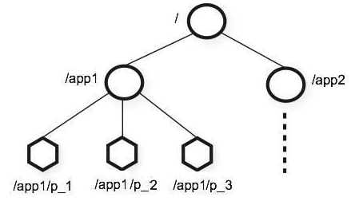

# 基本概念

节点：zookeeper数据节点叫作`znode`，类似操作系统中的文件或目录，拓扑结构是树状结构，每个节点的数据都是允许读和写的。



节点分为三类：

* 临时节点：当创建临时节点的客户端会话一直保持活动，瞬时节点就一直存在。而当会话终结时，瞬时节点被删除，另外临时节点没有子节点。
* 持久节点：一旦这个`ZNode`被创建了，除非主动进行`ZNode`的移除操作，否则这个`ZNode`将一直保存在Zookeeper上。
* 顺序节点：对于来自客户端的每个更新请求，ZooKeeper 都会分配一个全局唯一的递增编号，这个编号反应了所有事务操作的先后顺序。该节点可以是临时的也可以是持久的。

`watcher`机制：一种针对 `Znode` 的订阅/通知机制，当 `Znode` 节点状态发生变化时或 Zookeeper 客户端连接状态发生变化时，会触发时间通知。

Zookeeper 提供三种机制来针对`Znode`进行监听注册：

* `getData()`：用于获取指定节点的value信息，并且可以注册监听，当监听的节点进行创建、修改、删除操作时，会触发相应的事件通知。
* `getChildren()`：用于获取指定节点的所有子节点，并且允许注册监听，当监听节点的子节点进行创建、修改、删除操作时，触发相应的事件通知。
* `exists()`：用于判断指定节点是否存在，同样可以注册针对指定节点的监听，监听节点的创建、修改、删除操作。

## ACL

由`scheme:id:perm`对组成，负责控制对其`znode`的访问。

`scheme`:采用何种方式授权
* `world`:默认方式，相当于全部都能访问
* `auth`:代表已经认证通过的用户,通过`addauth digest user:pwd`来添加当前上下文中的授权用户。
* `digest`:使用`用户名:密码字`方式认证，在ACL中使用时，表达式是 `username:base64(SHA-1(username:password))`
* `ip`:使用客户端主机IP作为ACL ID身份。
* `super`:超级权限

`id`:给谁授权

| 授权scheme | 授权id                                                |
|----------|-----------------------------------------------------|
| ip       | 通常是ip地址或ip段，如`192.168.0.110` 或 `192.168.0.1/24`     |
| digest   | 自定义，通常是 `username:base64(SHA-1(username:password))` |
| world    | 只有一个id：`anyone`                                     |
| super    | 与digest模式一致                                         |

示例：

1. ip类型：`ACL aclIp = new ACL(ZooDefs.Perms.READ | ZooDefs.Perms.WRITE, new Id("ip","192.168.1.110"));`
2. digest类型：

```java
public class Test {
    public void test() {
        // 增加digest授权
        zooKeeper.addAuthInfo("digest","poype:123456".getBytes());
        
        // 构建ACL
        String authStr = DigestAuthenticationProvider.generateDigest("poype:123456");
        ACL aclDigest = new ACL(ZooDefs.Perms.READ | ZooDefs.Perms.WRITE, new Id("digest",authStr));
    }
}
```

`perm`: 授予什么权限

* `CREATE`:`c`可以创建子节点
* `DELETE`:`d`可以删除子节点（仅下一级节点）
* `READ`:`r`可以读取节点数据及显示子节点列表
* `WRITE`:`w`可以设置节点数据
* `ADMIN`:`a`可以设置节点访问控制列表权限

## CreateMode

Zookeeper 存在 7种 节点：

* `PERSISTENT`：持久节点，不会随着会话的结束而自动删除。
* `PERSISTENT_SEQUENTIAL`：带单调递增序号的持久节点，不会随着会话的结束而自动删除。
* `EPHEMERAL`：临时节点，会随着会话的结束而自动删除。
* `EPHEMERAL_SEQUENTIAL`：带单调递增序号的临时节点，会随着会话的结束而自动删除。
* `CONTAINER`：容器节点，用于Leader、Lock等特殊用途，当容器节点不存在任何子节点时，容器将在将来某个时候删除的候选节点。
* `PERSISTENT_WITH_TTL`：带TTL（time-to-live，存活时间）的持久节点，节点在TTL时间之内没有得到更新并且没有子节点，就会被自动删除。
* `PERSISTENT_SEQUENTIAL_WITH_TTL`：带TTL（time-to-live，存活时间）和单调递增序号的持久节点，节点在TTL时间之内没有得到更新并且没有子节点，就会被自动删除。


> 如果指令路径和版本的节点已经存在，则会抛出一个 KeeperException 异常。<br>
> 临时节点不能有子节点。如果给临时节点创建子节点会抛 KeeperException 异常。临时节点的生命周期与客户端会话绑定。一旦客户端会话失效（客户端与 Zookeeper连接断开不一定会话失效），这个客户端创建的所有临时节点都会被移除。<br>
> byte[] data允许的最大数据量为1MB（1,048,576 bytes）。如果超过，会抛 KeeperException。

## 创建节点

```java
public class zookeeper {

    /**
     * 同步请求
     */
    String create(
            final String path, 
            byte[] data, 
            List<ACL> acl, 
            CreateMode createMode);

    /**
     * 异步请求，节点状态 Stat 会传递给回调函数，Object ctx 也会传递给回调函数，KeeperException.Code 可判断处理状态
     */
    void create(
            final String path, 
            byte[] data, 
            List<ACL> acl, 
            CreateMode createMode, 
            Create2Callback cb, 
            Object ctx);

    /**
     * 异步请求，创建 TTL 节点，节点类型为：CreateMode.PERSISTENT_WITH_TTL 或 CreateMode.PERSISTENT_SEQUENTIAL_WITH_TTL
     */
    void create(
            final String path,
            byte[] data,
            List<ACL> acl,
            CreateMode createMode,
            Create2Callback cb,
            Object ctx,
            long ttl);

    /**
     * 同步请求，并获取节点状态 Stat
     */
    String create(
            final String path,
            byte[] data,
            List<ACL> acl,
            CreateMode createMode,
            Stat stat);

    /**
     * 同步请求，创建 TTL 节点，并获取节点状态 Stat
     */
    String create(
            final String path,
            byte[] data,
            List<ACL> acl,
            CreateMode createMode,
            Stat stat,
            long ttl);

    /**
     * 异步请求，节点状态 Stat 不会传递给回调函数，Object ctx 也会传递给回调函数
     */
    void create(
            final String path,
            byte[] data,
            List<ACL> acl,
            CreateMode createMode,
            StringCallback cb,
            Object ctx);
}

```

## 删除节点

```java
public class zookeeper {
    // 同步删除
    void delete(final String path, int version);

    // 异步删除
    delete(final String path, int version, VoidCallback cb, Object ctx);
}
```

## 判断节点是否存在

```java
public class zookeeper {
    
    // 同步请求，使用创建Zookeeper时的Watcher监听
    Stat exists(String path, boolean watch);

    // 异步请求，使用创建Zookeeper时的Watcher监听
    void exists(String path, boolean watch, StatCallback cb, Object ctx);

    Stat exists(final String path, Watcher watcher);

    void exists(final String path, Watcher watcher, StatCallback cb, Object ctx);
}
```

## 获取子节点

```java
public class zookeeper {

    // 同步请求，使用创建Zookeeper时的Watcher监听
    List<String> getChildren(String path, boolean watch);

    List<String> getChildren(final String path, Watcher watcher);

    List<String> getChildren(String path, boolean watch, Stat stat);

    List<String> getChildren(final String path, Watcher watcher, Stat stat);

    // 异步请求，使用创建Zookeeper时的Watcher监听
    void getChildren(String path, boolean watch, Children2Callback cb, Object ctx);

    void getChildren(final String path, Watcher watcher, Children2Callback cb, Object ctx);

    void getChildren(String path, boolean watch, ChildrenCallback cb, Object ctx);

    void getChildren(final String path, Watcher watcher, ChildrenCallback cb, Object ctx);
}
```


# 应用场景

## 分布式锁

1. 获得锁：所有客户端可以去 `/Exclusive_Locks` 节点下创建 `/lock` 节点，基于同级节点的唯一性，会保证所有客户端只有一个客户端能创建成功，没有获得锁的客户端，通过 `Watcher` 机制监听 `/Exclusive_Locks` 子节点的变更事件，用于实时监听 `/lock` 节点的变化情况以做出反应。
2. 释放锁：分为两种情况：

* 获得锁的客户端因为异常断开了和服务端的连接，基于临时节点的特性，`/lock` 节点会被自动删除。
* 获得锁的客户端执行完业务逻辑后主动删除 `/lock` 节点。

## Master 选举

两种方案：

1. 利用同一级节点不能重复创建的特性，多个客户端去创建 `/master-election` 临时节点，成功创建的客户端成为Master，其他节点监听该节点，当该临时节点被删除时，进行重新选举。
2. 利用临时有序节点的特性，编号最小的节点为Master，后续节点监听前一个节点，当 Master 临时节点被删除后，由后续节点当选为Master。
