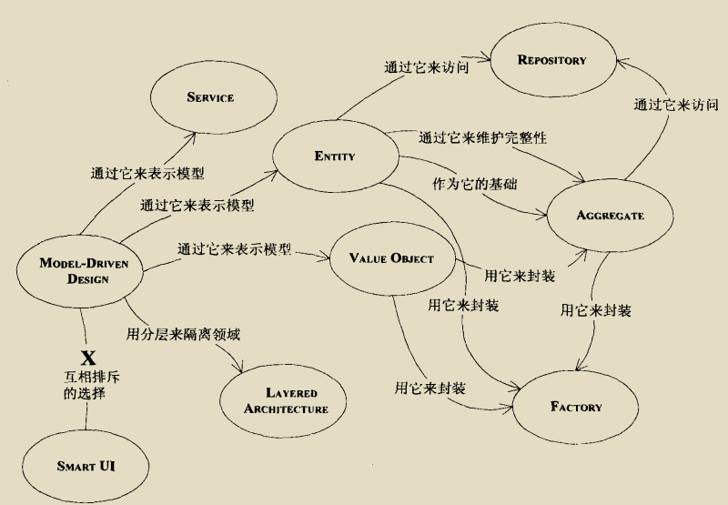
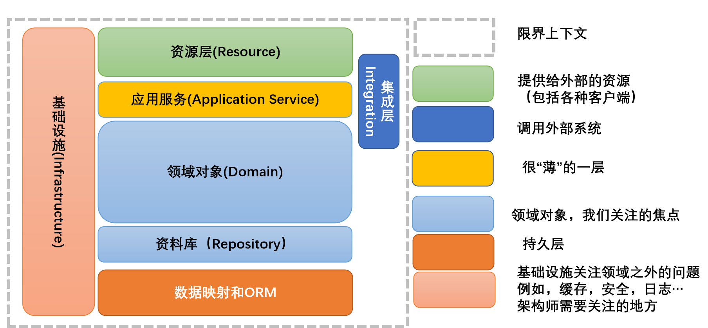

# DDD

## 有效的建模

1. 统一语言，将领域中不同的模型命名，并解释其含义，使开发人员和业务人员理解一致。
2. 梳理模型之间的关联关系。
3. 将不同的业务线构建拓扑图，形成不同模型间的转移。
4. 提炼模型，去除不再使用的组件，当不需要的组件和需要的组件有关联时，把重要的概念提取到新模型中，去掉不需要的模型。

## 模型构造块

领域：

应用架构：

模型元素：

* 实体：用来表示某种具有连续性和标识的事务，可以跟踪它所经历的不同状态。
* 值对象：用来描述某种状态的属性，本身不具有状态，无法被改变，只能新创建。
* 服务：动作或操作来表示，无状态活动的建模，不属于任何对象，以活动命令，应该是一个动词。

每个Aggregate 选择一个 Entity 作为根，并通过根来控制对边界内其他对象的所有访问，在这个范围内，生命周期的每个阶段都必须满足一些固定规则。当创建 Aggregate 过于复杂可以使用 Factory 进行封装。

在事件风暴中，我们会根据一些业务操作和行为找出实体（Entity）或值对象（ValueObject），进而将业务关联紧密的实体和值对象进行组合，构成聚合，再根据业务语义将多个聚合划定到同一个限界上下文（Bounded Context）中，并在限界上下文内完成领域建模。

实体和值对象是很基础的领域对象。实体一般对应业务对象，它具有业务属性和业务行为；而值对象主要是属性集合，对实体的状态和特征进行描述。但实体和值对象都只是个体化的对象，它们的行为表现出来的是个体的能力。能让实体和值对象协同工作的组织就是聚合，它用来确保这些领域对象在实现共同的业务逻辑时，能保证数据的一致性。

如果把聚合比作组织，那聚合根就是这个组织的负责人。聚合根也称为根实体，它不仅是实体，还是聚合的管理者。

使关联更容易控制：

1. 规定一个遍历方向。
2. 消除不必要的关联。
3. 添加一个限定符，以便有效地减少多重关联。