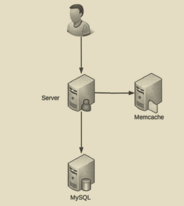
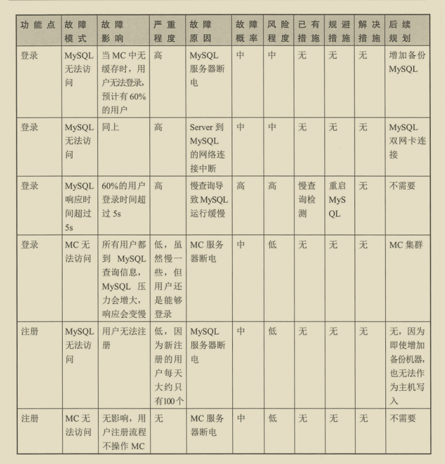
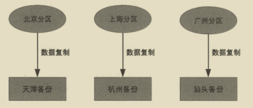

# 高性能
## 储存高性能

### 关系型数据库

分为两类：

* 读写分离：将访问压力分散到集群中的多个节点，没有分散储存压力。
* 分库分表：既可以分散访问压力，也可以分散储存压力。

#### 读写分离

1. 搭建主从集群，主机负责读写操作，从机负责读操作。
2. 主机通过数据同步到从机。
3. 业务服务器将写操作发给主机，读操作发给从机。

问题：存在主从复制延迟，当主机写入后，从机没来得即复制，这时查询从机可能出现问题。

解决方法：
1. 写操作完成后读操作发给指定主机：对业务侵入较大。
2. 读从机失败后再读一次主机：二次读取和业务无绑定，值需要对数据库访问封装，但会增加主机的访问量。
3. 关键业务读写指向主机，非关键业务采用读写分离，可以接受短暂延迟。

#### 分库分表

存储压力的体现：
1. 数据量太大，读写性能下降。
2. 数据文件变大，数据库备份、恢复时间长。
3. 数据文件越大，极端情况下丢失数据风险越高。

分散储存分为两类：分库、分表。

1. 业务分库：按照业务模块将数据分散到不同的数据库服务器。

带来问题：
* 无法 join 操作
* 事务问题
* 硬件成本问题

初创业务时不建议拆分：
  1. 业务不确定性,没有真正的储存和访问压力，分库不能带来价值。
  2. 业务分库后，join 和 事务无法简单实现。
  3. 分库后，不同数据写入需要不同逻辑，增加工作量，初创期间最重要的是快速实现、快速验证、业务分库会拖慢业务节奏。

2. 业务分表：分为垂直拆分和水平拆分。

垂直分表将不常用且占大量空间的列拆分出去，带来问题是 需要多次查询才能获取到数据。

水平拆分适合表行数较大的表，一般达到千万级别，就要警觉。

带来问题：
  1. 路由：某条数据属于哪个子表
    * 范围路由：根据有序的数据列作为路由条件，复杂性体现在分段大小的选取上，太小增加维护复杂度，太大仍会导致性能问题，一般会在 1000万 到 2000 万直接，优点是新增表时不用动原有数据。
    * Hash路由：复杂性体现在初始表数量的选取，太多维护复杂，太少导致单表性能问题，而且增加表数量复杂，所有数据需要重分布，优点是表分布均匀。
    * 配置路由：添加路由表记录路由信息，缺点是多查询一次，会影响整体性能，如果路由表太大也会影响性能，优点是扩充表迁移数据后只需要修改路由表即可。
  2. 需要多次join操作。
  3. 没法简单 count() 操作。
    * count相加：性能低，但实现简单。
    * 记录数表：新增记录数表，每次插入或删除子表数据后更新记录数表，缺点是容易造成数据不一致，增加数据库写压力，优点是查询简单。
  4. order by 操作无法完成：只能通过业务代码或者中间件分布查询汇总。

#### 解决方案
1. 程序代码封装：实现简单，但无法通用，各个语言需要实现一次，例如 sharding-jdbc 。
2. 中间件封装：支持多种编程语言，复杂程度高，例如 mysql-proxy 。

### NoSQL

关系型数据库缺点：

1. 储存行记录，无法储存数据结构。
2. 表结构强约束，操作不存在的列报错，扩展不方便。
3. 大数据场景下 IO 较高。
4. 全文搜索能力弱。

NoSQL有4类：
1. K-V 存储：解决关系数据库无法储存数据结构的问题，如 Redis。
2. 文档数据库：解决关系数据库强schema约束问题，如MongoDB。
3. 列式数据库：解决大数据场景下IO问题，如 HBase。
4. 全文搜索引擎：解决关系数据全文搜索性能问题，如 Elasticsearch。

#### K-V

优点： 支持多种数据结构存储。

缺点是不支持完整的ACID，只能保证 隔离性 和 一致性，无法保证原子性和持久性。

* 原子性：不支持原子性，不支持回滚，事务中间一条命令失败，既不会回滚，也不会终止后面的命令。
* 一致性：事务前后，数据库完整性没有被破坏。
* 隔离性：单进程单线程。
* 持久性：RDB会丢失上次持久化之后的数据，AOF先执行命令再追加日志，即使每次都刷盘，也可能丢失一条。

#### 文档数据库

优点：
1. 新增字段简单，不需要DDL，直接读写即可。
2. 缺少字段，历史数据也不会出错。
3. 容易储存复制数据。

#### 列式数据库

优点：
1. 同时读取多个列时效率高。
2. 能一次完成多个列的写操作。

#### 全文搜索引擎

使用倒排索引优化全文搜索。

#### 应用

##### 缓存

详情参考 [Redis](Redis.md) 中 缓存部分

## 计算高性能

磁盘、操作系统、CPU、内存、缓存、网络、编程语言、架构 都有可能影响性能。

网络高性能：NIO + 主从Reactor

集群高性能：通过增加更多的服务器来提升系统整体的计算能力，同样的输入数据和逻辑，无论在哪台服务器上执行，都应该得到相同的输出，复杂性体现在负载均衡。

负载均衡分类：
1. DNS 负载均衡：解析同一个域名返回不同的IP 。

优点：
  * 无须自己开发或维护负载均衡设备。
  * DNS可根据请求来源IP，解析离用户最近的服务器地址。
缺点：
  * DNS缓存时间较长，修改配置后，更新不及时。
  * DNS服务器由域名商负责，扩展性差，无法根据业务特点做定制化扩展。
  * 支持负载均衡少，分配策略简单，不能根据系统与服务状态来判断负载。

2. 硬件负载均衡：通过单独的硬件设备来实现负责均衡。

优点：
  * 功能强，支持各层级负载均衡，支持全面的负载均衡算法。
  * 性能强，可以支持百万并发，软件能支持10万并发就很厉害。
  * 稳定性搞。
  * 支持安全防护，具备防火墙、防DDOS攻击。
缺点：
  * 价格昂贵。
  * 扩展能力差，无法做扩展和定制。

3. 软件负载均衡：通过 Nginx 或 LVS 完成，Nginx 是 7层 负载均衡，LVS 是 4层 负载均衡。

负载均衡按层划分:
  * 二层：基于mac地址
  * 三层：基于ip地址
  * 四层：基于ip和端口号
  * 七层：基于应用协议
优点：
  * 部署维护简单。
  * 便宜，只需要一台Linux服务器安装软件。
  * 灵活，4层还是7层根据业务选择，也可以更加业务扩展，例如 nginx 插件定制化。

一般 DNS负载均衡负责地理级别，硬件负载均衡负责集群级别，软件负载均衡负责集群级别。

负载均衡算法：
1. 任务平分类：将任务平均或按权重分配给服务器。
  * 轮询：简单、但不能感知服务器状态，服务器宕机了也会不断发请求，不能根据硬件配置分配。
  * 加群轮询：可以根据硬件配置分配。
2. 负载均衡类：根据服务器负载来分配，负载可以是 连接数、IO、网卡吞吐量等。
  * 负载最低优先：如 最少连接数优先，CPU负载最低优先。
3. 性能最优类：按响应时间分配，优先分给响应快的。
4. Hash类：根据关键信息进行Hash，相同的Hash分配在同一台服务器。
  * 源地址 Hash。
  * ID Hash

# 高可用

## CAP

一个分布式系统涉及读写操作时，当发生分区时，只能保证一致性（Consistence）、可用性（Availability）、分区容错性（Partition Tolerance）中的两个，关注的是读写操作，不是分布式系统的所有功能。如果没有发生分区应该保证数据的一致性和可用性。

1. 一致性：客户端的每次读操作，要么读到的是最新的数据，要么读取失败，强调的是数据正确。
2. 可用性：任何客户端的请求都能得到响应数据，强调的是响应一个合理的结果，这个结果可以是不正确的结果，但没有异常和超时。
3. 分区容忍性：当系统中通信出现问题时，系统仍能提供满足一致性或可用性的服务，强调是系统遇到某节点或网络分区故障，服务仍能继续。

由于网络无法做到100%可靠，所以P是必须要素，CA是矛盾的，当出现分区时，为了保证C，就不能进行写入，当有写入请求时就只有返回写入异常，而A要求响应没有异常。

CP：为了保证一致性，当发生分区现象时，数据无法同步，当访问旧数据节点时需要返回异常，违背了A,所以只能满足 CP。

AP：为了保证可用性，当发生分区现象时，数据无法同步，当访问旧数据节点时返回旧数据，违背了C，所以只能满足 AP。

CAP关注的粒度是数据，而不是整个系统，对于不同的数据可以选择不同的场景。

CAP是忽略网络延迟，但某些严苛场景，例如和金钱相关，要求严格一致性，即使停止服务，也要保证一致性，无法做到多点分布式写入，但是可以在整个系统做分布式，比如将用户 1-100 由节点1负责，100-200由节点2负责，当某个节点故障时，节点上的用户无法读写。

在正常运行没有发生分区现象时，可以同时满足CA，只是在分区时，放弃C或A。

### BASE

1. Basically Available（基本可用）：分布式系统在出现故障时，允许损失部分可用性，即保证核心可用。
2. Soft State（软状态）：允许系统存在中间状态，中间状态就是数据不一致。
3. Eventual Consistency（最终一致性）：系统中所有数据副本经过一定时间后，最终能够达到一致的状态。

BASE 是对 AP 的补充，解决CAP忽略网络延迟的问题，AP只是牺牲分区期间一致性，当分区故障恢复后，系统达到最终一致性。

## FMEA分析故障
1. 给出初始架构设计图。
2. 假设架构中某个部件发生故障。
3. 分析此故障对系统功能造成的影响。
4. 根据分析结果，判断架构是否需要进行优化。

分析表格内容：
1. 从用户角度的功能点。
2. 故障点和故障形式，量化表达，例如 Mysql 响应时间达到 3 秒。
3. 故障影响，故障点影响的范围，量化表达，例如 20%用户无法登陆。
4. 验证程度，站在业务角度上分析，例如分为 致命70%无法使用，高30%无法使用,中响应时间超过5秒，低10%响应时间超过5秒。
5. 故障原因，例如 磁盘坏道引起  Mysql 响应时间达到 3 秒。
6. 故障概率。
7. 风险程度。
8. 已有措施。

  * 检测警告：检测故障，告警，需要人工干预。
  * 容错：检测到故障后，通过备份手段应对。
  * 自恢复：一般是业务恢复，例如将机器上副本分配到其他机器，本质故障还是存在。
  * 规避措施：可以是技术手段也可以是管理手段，例如为了避免新引入MongoDB丢失数据，在MySQL冗余一份。
  * 解决措施：一般是技术手段。
  * 后续规划。

举例：假设只有登录和注册功能。

## 存储高可用

### 主备复制

1. 主机储存数据，通过复制通道将数据复制到备机。
2. 正常情况下，客户端无论读写操作都发送给主机，备机不对外提供任何读写服务。
3. 主机故障情况下，人工切换到备机。
4. 可能存在主机写入了但备机没有复制的风险，需要人工排查恢复。

优点：
* 客户端不需要感知备机。
* 双方只需要数据复制即可，无需主备状态判断。
缺点：
* 备机仅仅只是备份没有读写操作，硬件成本浪费。
* 故障后需要人工干预。

### 主从复制

1. 主机储存数据，通过复制通道将数据复制到从机。
2. 正常情况下写操作在从机，读操作可以在主机也可以在从机，可根据业务决定。
3. 主机故障情况下，写操作无法进行，读操作可以发送给从机，如果主机不能恢复，人工将从机升为主机，新增新的从机。
4. 可能存在主机写入了但备机没有复制的风险，需要人工排查恢复。
5. 由于延迟可能存在主从读写不一致问题，但延迟过大可触发报警，人工干预，避免宕机丢失较多数据。

优点：
* 主机故障时，读业务不受影响。
* 从机提供读操作，发挥硬件性能。
缺点：
* 客户端需要感知主从关系，将不同操作发给不同的机器。

### 主备倒换 & 主从倒换

解决 人工干预 的问题。

1. 状态判断
  * 状态传递的渠道：互连、第三方仲裁。
  * 状态监测的内容：进程是否存在，响应是否缓慢。
2. 倒换决策。
  * 倒换时机：应该在什么时候倒换，比如 进程不存在就倒换。
  * 倒换策略：主机故障恢复后，是否需要再次倒换。
  * 自动程度：是否需要人工确认。
  * 数据冲突：新旧主机数据冲突。

### 主主复制

两台主机都可以读写操作，互相复制，必须保证数据可以双向复制，一般适用于临时性、可丢失、可覆盖的数据，如session、日志。

### 数据集群

主机本身的处理能力有限，可以使用多台服务器集群。

集中集群：适合数据量不大机器，数量不多的场景，如Zookeeper集群，所有数据都存在主机中，可能存在问题：
* 多个备机可能数据不一致，主机的复制压力也很大。
* 备机如何检测主机状态，可能不同备机判断的状态不一致。
* 主机故障后，如何决定新主机。

分散集群：适合业务数据量大，可伸缩，每台服务器只负责部分数据，可能存在问题：
* 数据均衡。
* 容错：当发生故障时如果把故障服务器分配给其他服务器。
* 可伸缩性：当集群容量不够时，扩充新服务器后数据迁移。

### 分布式事务

如果采用数据集群的方法，数据可能分布在不同集群阶段，需要分布式事务来保证可靠性。

### 2PC

分为 Commit 请求阶段 和 Commit 提交阶段。

* 第一阶段：
  1. 协调者向所有参与者询问是否可以执行事务，并等待响应。
  2. 参与者执行事务操作，返回执行结果。
* 第二阶段：
  1. 当所有参与者返回成功，协调者发起COMMIT请求，参与者完成COMMIT释放资源，发送ACK消息，协调者收到ACK后完成事务。
  2. 当有参与者返回失败，协调者发起ROLLBACK请求，参与者进行回滚释放资源，发送ACK消息，协调者收到ACK后取消事务。

优点：实现简单。

缺点：
* 同步阻塞，协调者和参与者互相等待对方响应，如果某个节点阻塞会拖慢整个流程，性能问题明显，无法支撑搞并发场景。
* 状态不一致：第二阶段如果存在消息丢失，将会出现状态不一致。
* 单点故障：协调者出现故障，参与者会一直阻塞。

### 3PC

解决2PC单点故障问题，当协调者故障后，参与者通过超时避免一直阻塞，还是存在数据不一致问题。

* 第一阶段：通常会冻结预留资源，确保事务的执行。
  1. 协调者向所有参与者询问是否可以执行事务，并等待响应。
  2. 参与者判断是否可以提交事务，冻结资源，返回结果。
  3. 如果协调者收到任何一个失败或者超时，事务终止，同时通知参与者释放冻结资源。
* 第二阶段：
  1. 协调者发送precommit请求，并等待响应。
  2. 参与者执行事务操作，返回ACK消息。
* 第三阶段：
  1. 协调者在接收到所有 ACK 消息后，发送docommit，告诉参与者正式提交，否则会发出回滚消息。
  2. 参与者收到 docommit 后提交事务，返回havecommitted消息。
  3. 如果参与者收到一个precommit消息并返回ACK，但等待docommit消息超时，参与者在超时后继续提交事务。

### 分布式一致性算法

Paxos: 多数一致性。

Raft：不是 Paxos 的完整版，绝大部分情况下能保证一致性，将一致性问题拆分为 Leader选举、日志复制、安全保证 3个问题。

ZAB：zookeeper 中采用的分布式一致性算法，和两种算法复制逻辑不一样，zookeeper 先修改 leader 再由 leader 将计算结果修改到其他节点，Paxos 和 Raft 是会向各个节点发送请求，达成共识后各自计算结果修改。

### 数据分区

数据按照一定的规则进行分区，不同分区分布在不同的地理位置，每个分区储存一部分数据，通过这种方式规避地理级别的故障所造成的巨大影响，在部分服务器故障时，系统能够继续提供服务。

复制规则：
1. 集中式：备份存在一总的备份中心，所有分区都将数据备份到备份中心。

优点：
* 设计简单，各分区无直接联系。
* 扩展容易，新增分区只需将新分区接入到备份中心。
缺点：
* 成本较高，需要建设独立的备份中心。

2. 互备式：每个分区备份另一个分区的数据。

优点：
* 成本低，利用已有设备。
缺点：
* 设计复杂，各分区承担业务数据和备份数据。
* 扩展麻烦。

3. 独立式：每个分区都有自己的独立的备份中心，需要备份分区与原分区不在一个地区。

优点：
* 设计简单，各分区互不影响。
* 扩展容易：新增的分区只需要搭建自己的备份中心。
缺点：
* 成本较高。

## 计算高可用

复制性体现在任务管理，当任务在某台服务器失败后，如何重新分配到新的服务器执行。

### 主备

计算高可用的主备架构无须数据复制，类似储存主备架构：
1. 主机执行所有计算任务。
2. 当主机故障时，人工切换到备机。
  * 冷备：程序已经部署，但服务没有启动，主机故障后人工启动，节省能源。
  * 热备：程序已经启动，只是不对外提供服务，主机故障后，人工将任务分配到备机，减少手工操作，推荐温备。

优点：简单，主备之间不需要交互。

缺点：需要手工操作，恢复时间不可控。

适合内部系统，使用人数不多，业务频率不高，

### 主从

1. 主机从机 分别执行一部分计算任务。
2. 当主机故障时，将从机升为主机，新增新的从机。

优点：从机也执行任务，发挥了从机的硬件性能。

缺点：任务分配相对复杂。

### 对称集群

也叫负载均衡集群，关键有两点：任务分配器需要检测服务器状态，任务分配器需要选取分配策略。

1. 任务分配器将任务分配集群中不同的服务器。
2. 当某台服务器故障后，任务分配器不再将任务分配给它。
3. 服务器故障恢复后，任务分配器重新将任务分配给它执行。

### 非对称集群

不同服务器角色不同，承担不同职责。

1. 集群通过某种方式区分不同服务器角色，如通过 Paxos 算法选举。
2. 任务分配器将不同任务发送给不同服务器。
3. 当指定类型服务器故障时，需要重新分配角色，如 Master 故障后，需要从剩余Slave中重新指定一个Master服务器，如果是Slave服务器故障不需要重新分配，只需从集群中剔除。

相比对称集群，设计复杂度体现在两方面：
* 任务分配更复杂，将任务划分为不同类型并分配给不同角色的集群节点。
* 角色分配策略更复杂，可能需要 Paxos 算法来实现。

## 业务高可用

### 异地多活

异地：不同地理位置。多活：不同地理位置上系统能够提供业务服务，活是活跃的意思。

判断是否异地多活有两个标准：
* 正常情况下，用户无论访问哪个地点的业务系统，都能够得到正确的业务服务。
* 某地系统异常情况下，用户访问到其他地方正常的业务系统也能够得到正确的业务服务。

类型：
1. 同城异区：同一城市不同区的机房，通过搭建高速网络，两个机房能够实现和同机几乎一样的网络传输速度，是应对机房级别故障的最优架构，但没办法解决城市级灾害，比如新奥尔良水灾。
2. 跨城异地：部署在不同城市的多个机房，距离最好远一些，两个机房的网络传输速度会降低，但能有效应对极端灾难事件。
3. 跨国异地：一般有这几种场景：为不同地区用户提供服务，只读类业务。

技巧：
1. 保证核心业务的异地多活。
2. 核心数据最终一致。
3. 采用多种手段同步数据。

    * 消息队列方式：修改数据后通过消息队列同步到其他业务中心。
    * 二次读取方式：读取本地数据失败时，再根据路由规则去拥有数据的中心读取。
    * 储存系统同步方式：通过数据库同步机制复制到其他业务中心，适用于变化频率低的数据。
    * 回源读取方式：如登陆数据在A，B拿到sessionid后根据路由规则路由到拥有数据的中心A读取，这样避免数据复制。
    * 重新生成数据方式：如在服务A登陆，A服务宕机，可以让用户重新在B登陆。

4. 保证绝大部分用户的异地多活，无法做到100%可用时，可以采取一些安抚性措施：挂公告、事后对用户进行补偿、补充体验（如服务恢复后通过短信告知等）。

异地多活设计：
1. 业务分级，那些业务需要做异地多活。
  * 访问量大的业务。
  * 核心业务。
  * 产生大量收入的业务。
2. 数据分类，根据数据特征考虑方案。
  * 数据量：数据量越大同步延迟概率越高，需要相应的解决方案。
  * 唯一性：多个机房同类数据必须唯一，可以使用唯一ID生成算法。
  * 实时性：实时性要求越高，同步越复杂。
  * 可丢失性：是否可丢失，例如Session 数据可丢失。
  * 可恢复性：是否可通过某种手段进行恢复，如用户微博丢失后，用户可以重新发一篇一模一样的微博。
3. 数据同步，根据不同的业务和数据设计不同的同步方案。
  * 储存系统同步：方案简单，主流储存系统都有同步方案，无法针对业务特点做定制化控制。
  * 消息队列同步：适合无事务性或无实时性要求的数据。
  * 重复生成：如sesion等数据。
4. 异常处理，当极端情况出现时，采取措施。
  * 问题发生时，避免少量数据异常导致整体业务不可用。
  * 问题恢复后，将异常的数据进行修正。
  * 对用户进行安抚，弥补用户损失。
  措施：
  * 多通道同步。
  * 同步和访问结合，这里访问通过系统的接口来进行数据访问，先访问本地数据，本地数据无法读取时，访问异地接口。
  * 日志记录，用户故障恢复。
  * 用户补偿。

### 接口级故障

异地多活主要应对系统级故障，接口级故障表现为系统没有宕机，网络也没有中断，但业务出现问题，例如业务响应缓慢，大量访问超时等。主要原因在于系统压力太大，负载太高，导致无法快速处理业务请求。

常见原因：
1. 内部原因
  * 死循环
  * 数据库查询满
  * 内存溢出
2. 外部原因
  * 黑客攻击
  * 促销、抢购超出平时几十倍用户
  * 第三方系统的大量请求
  * 第三方系统的响应缓慢

解决方案：
1. 降级：保证核心业务，将某些业务或接口的功能降低，只提供部分功能，甚至完成停掉所有功能。
  * 系统后门降级：系统预留后门降级，比如降级URL，实现成本低，但需要一台台操作，浪费时间，也存在安全问题。
  * 独立降级系统：将降级操作独立到单独的系统中，可以实现复杂的权限控制、批量等操作。
  2. 熔断：应对依赖外部系统故障的情况，降级强调自身系统故障。例如功能X中A依赖B，当B响应慢，导致A变慢，最后导致A的其他功能变慢
