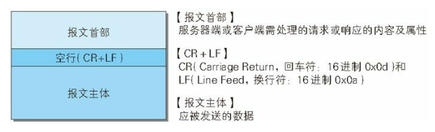
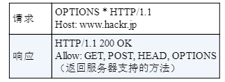
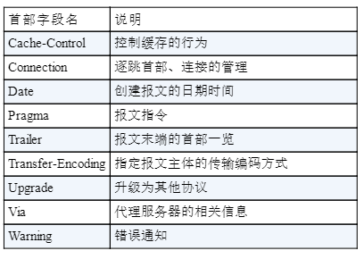
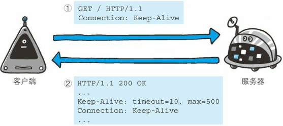
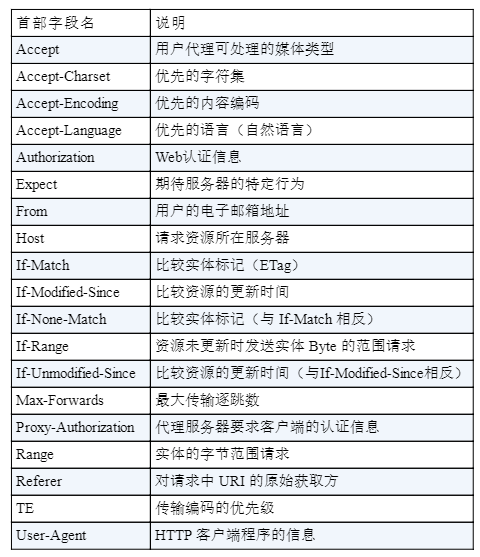
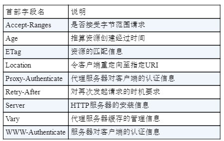
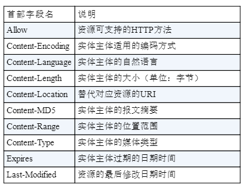
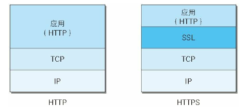
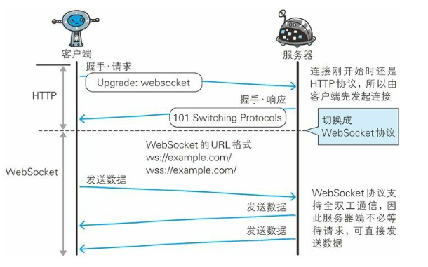

URI:在某一规则下能把一个资源独一无二地标识出来,比如身份证，ID。

URL:通过描述资源的位置来唯一描述一个资源，URL是URI的子集。

HTTP 是无状态协议，协议对于发送过的请求或相应不做持久化处理。

持久连接：

负责建立1次TCP连接后进行多次请求和相应，HTTP/1.1所有连接默认都是持久连接。

cookie的状态管理：

服务端发送的响应报文中会添加的 Set-Cookie 头来通知客户端保存 Cookie，下次客户端再往服务器发送请求时，客户端会自动在请求报文中加入 Cookie

# HTTP 报文

HTTP报文分为首部和主体两部分，他们使用一个空行（CR+LF）来划分，通常不一定有报文主体。



## 状态码

1. 2XX：表示请求被正常处理。
2. 3XX：重定向。
3. 4XX：客户端错误。
  * 400 Bad Request：请求报文存在语法错误。
  * 401 Unauthorized：请求需要认证信息。
  * 403 ForBidden：请求被服务端拒绝。
  * 404 Not Found：资源找不到。
4. 5XX：服务器错误。
  * 500 Internal Server Error：服务器执行请求时发生错误。
  * 503 Service unavailable：服务器繁忙。

## 方法

HTTP方法：
* GET：用来访问已被URI标识的资源。
* POST：用来传输实体，主要目的不是为了获取响应的主体内容，常用来新增。
* PUT：用来传输文件，要求在主体中包含文件内容，Restful 常用来做更新。
* DELETE：删除资源。
* HEAD：用来获取报文头部，不返回主体部分。
* OPTIONS：用来询问URI支持哪些方法。

  

* TRACE：容易引发跨站攻击，不使用。
* CONNECT：要求使用隧道协议连接代理。

## HTTP首部

1. 通用首部字段：请求、响应都会使用的首部。

  

  * Connection：两个功能：
    1. 控制连接时长： HTTP1.1 默认请求头添加 Connection: Keep-Alive ,建立TCP长连接，响应头会添加 Keep-Alive 告诉客户端连接时长，若连接关闭响应头会添加 Connection: close 。
      
    2. 协议升级：例如 请求头添加 `Upgrade: websocket`,`Connection: Upgrade` 会使用 WebSocket 协议，由于 Connection、Upgrade 是 逐跳协议，代理服务器会不会转发这两个头，所以配置nginx代理时需要 添加 `proxy_set_header Upgrade $http_upgrade;`、`proxy_set_header Connection $connection_upgrade;`。
  * Upgrade：当 `Connection: Upgrade` 协议升级时，指定协议类型。

2. 请求首部字段。

  

  * Accept：通知服务器客户端可以处理的响应类型。
  * Accept-Charset：通知服务器客户端可以处理的字符集类型。
  * Accept-Encoding：通知服务器客户端可以处理的编码类型，如 gzip,对应服务器压缩数据，会在响应头添加 Content-Encoding gzip。
  * Accept-Language：通知服务器客户端可以处理的语言，如 zh-cn。
  * Authorization：通知服务器认证信息。
  * From：通知服务器用户邮件地址。
  * Host：请求服务器的地址，例如 10.10.201.5:8080。
  * User-Agent：通知服务器浏览器信息。

3. 响应首部字段。

  

  * Location：配合状态码 3XX 进行重定向。
  * Retry-After：告知客户端多久以后可以重试，配置 503 和 3XX 状态码使用。
  * WWW-Authenticate：告知客户端所要求的认证信息。

4. 实体首部字段。

  

  * Allow：通知客户端允许使用的方法。
  * Content-Encoding：通知客户端响应主体部分编码。
  * Content-Language：通知客户端响应主体部分使用语言。
  * Content-Length：实体部分长度，单位字节。
  * Content-Location：响应返回主体的实际URI，如果访问 `http://www.hackr.jp/` 返回的却是  `http://www.hackr.jp/index-ja.html`。
  * Content-Type：主体的类型，和 Accept 头一样。

5. 特殊首部。

  * Set-Cookie：响应首部，告诉客户端 cookie 值，`expires` cookie有效期，默认关闭浏览器时清楚 `HttpOnly` 禁止 Cookie 被 JS 访问。
  * Cookie：请求首部，告诉服务端 cookie 值。

# HTTPS

HTTP 直接和TCP通信，当使用 HTTPS 时，演变成 HTTP 先经过 SSL/TSL，再由 SSL/TSL 和 TCP 通信。



SSL/TSL 是独立的协议，不光HTTP可以使用，SMTP、Telnet 等协议也可以使用，SSL 是早期版本，TLS是新版本，现在广泛使用 TLS1.1、TLS 1.2 。

HTTPS 使用混合加密方式，握手期间使用非对称加密，通信期间时间对称加密，由于非对称加密比较消耗时间。

握手流程：

1. 客户端给出协议版本号、一个客户端生成的随机数（Client random），以及客户端支持的加密方法。
2. 服务端确认双方使用的加密方法，并给出数字证书、以及一个服务器生成的随机数。
3. 客户端确认数字证书有效，然后生成一个新的随机数，并使用数字证书中的公钥，加密这个随机数发给服务端。
4. 服务端使用自己的私钥获取客户端发过来的随机数。
5. 服务端和客户端根据约定的加密方法，使用前面的三个随机数，生成 对话秘钥，接下来的通信使用 对话秘钥 进行非对称加密。

为什么需要数字证书：客户端可通过证书来验证公钥是否由服务器发出并且没有篡改。

## X.509 数字证书

X.509 证书结构：

```java
Certificate
  // 版本号
  Version Number
  // 序列号
  Serial Number
  // 证书签名算法ID
  Signature Algorithm ID
  // 证书发行者
  Issuer Name
  // 证书有效时间
  Validity period
  // 证书主体名称
  Subject name
  // 证书主体公钥信息
  Subject Public Key Info
    // 证书公钥算法
    Public Key Algorithm
    // 证书公钥
    Subject Public Key
  // 发行商唯一ID
  Issuer Unique Identifier (optional)
  // 主体唯一ID
  Subject Unique Identifier (optional)
  // 扩展
  Extensions (optional)

// 证书签名算法
Certificate Signature Algorithm
// 证书签名值,签名需要使用 CA机构的 公钥解密，可以得到摘要，摘要 = HASH(明文)
Certificate Signature
```

证书校验内容：

1. 校验证书是否是受信任的CA根证书颁发机构颁发。

  CA机构 颁发证书的基本原理：
    * 服务端生成一对公钥、私钥。
    * 服务端将自己的公钥提供给CA机构。
    * CA机构核实服务端公钥拥有者信息：核实申请者提供信息的真实性：如组织是否存在、企业是否合法、是否拥有域名的所有权等。
    * CA机构签发证书：CA机构 计算 服务器公钥摘要信息，然后利用CA机构私钥（CA机构有一对公钥、私钥）加密摘要信息。加密后的包含加密摘要信息的服务端公钥即CA机构颁发的证书。

  客户端 验证服务端公钥的基本原理为：
    * 客户端用存储在本地的CA机构的公钥，对 服务端公钥中对应的摘要信息进行解密，获取到服务端公钥的摘要信息A。
    * 客户端根据对服务端公钥进行摘要计算，得到摘要信息B。
    * 对比摘要信息A与B，相同则证书验证通过。

  这样服务端信息真实性由 CA 验证，证书内容不被篡改由加密的摘要保证。

2. 校验证书是否在上级证书的吊销列表。
3. 校验证书是否过期：证书中Validity period字段是否过期。
4. 校验证书域名是否一致：核查 证书域名是否与当前的访问域名 匹配。

浏览器证书校验举例：

1. 首先浏览器读取证书中的证书所有者、有效期等信息进行一一校验。
2. 浏览器开始查找操作系统中已内置的受信任的证书发布机构CA，与服务器发来的证书中的颁发者CA比对，用于校验证书是否为合法机构颁发。
3. 如果找不到，浏览器就会报错，说明服务器发来的证书是不可信任的。
4. 如果找到，那么浏览器就会从操作系统中取出 颁发者CA 的公钥，然后对服务器发来的证书里面的签名进行解密。
5. 浏览器使用相同的hash算法计算出服务器发来的证书的hash值，将这个计算的hash值与证书中签名做对比。
6. 对比结果一致，则证明服务器发来的证书合法，没有被冒充。
7. 此时浏览器就可以读取证书中的公钥，用于后续加密。

# Websocket

1. 握手请求：使用HTTP请求，添加头`Upgrade: websocket`,`Connection: Upgrade`。
2. 握手响应：状态码101。
3. 通信阶段不使用HTTP数据帧，而是WebSocket独立的数据帧。



## web攻击

* XSS：攻击者提交恶意代码，通过输入框提交到服务器，保存在数控中，当用户访问时，加载到用户界面，可对输入进行过滤，对拼接HTML进行转义。
* SQL注入：
1. 应用使用普通用户权限，避免 drop 等恶劣语句带来危害。
2. 不使用SQL拼接，使用预编译语句传参数。
3. 加强用户验证。
* CSRF攻击：利用虚假表单窃取用户cookie，发送恶意请求可使用 token 解决。
