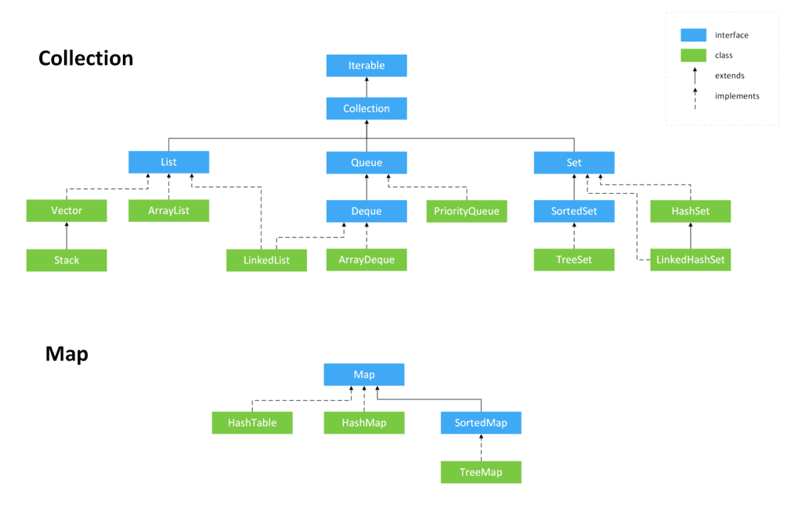
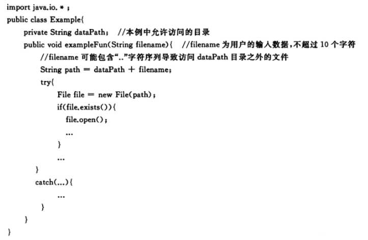
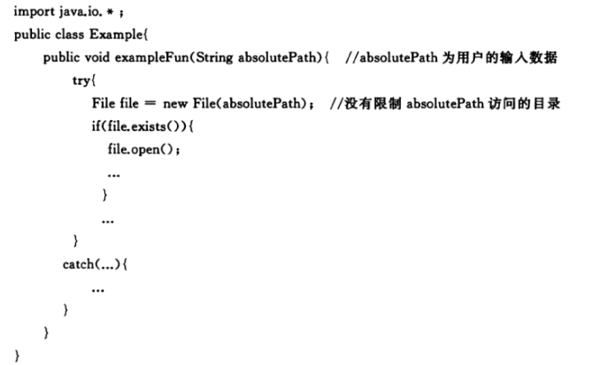
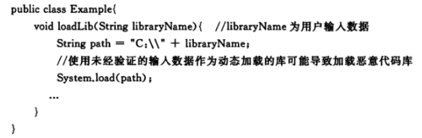
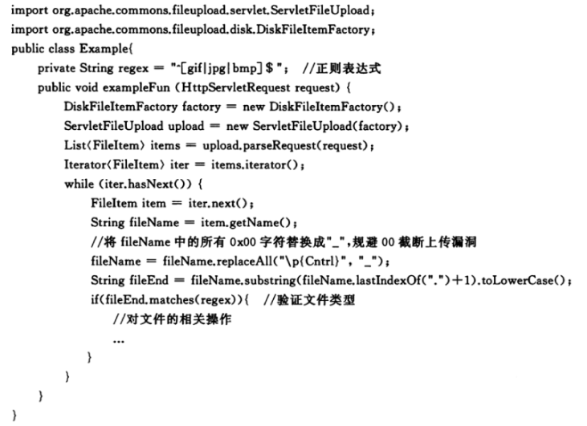

# 简介

Java编译与解释并存： Java 程序要经过先编译，后解释两个步骤，由 Java 编写的程序需要先经过编译步骤，生成字节码（.class 文件），这种字节码必须由 Java 解释器来解释执行。

静态方法不能调用非静态成员：静态方法在类加载的时候就会分配内存，而非静态成员属于实例对象，只有在对象实例化之后才存在，所以静态成员在非静态成员不存在的时候已经存在。

Java 内的传递都是值传递,对象传递的值是对象的地址。

## 重载和重写：
* 重载是同一个方法名不同的参数。
* 重写是子类覆盖父类的方法。

## == 和 equals()

* 对于基本数据类型来说，== 比较的是值。
* 对于引用数据类型来说，== 比较的是对象的内存地址。
* 没有重写 equals() 方法，继承Object类equals()方法，默认实现使用 ==。
* 可以重写 equals() 方法来比较具体属性，不过重写时必须要重写 hashcode 方法。

## String、StringBuffer、StringBuilder

* String 类 final 修饰 不可被继承，避免子类破坏String的行为，此外 储存字符的数组也是 final 修饰，所以String实例不可改变，每次对 String 类型进行改变的时候，都会生成一个新的 String 对象，然后将指针指向新的 String 对象。
* StringBuffer 和 StringBuilder 都继承自 AbstractStringBuilder 类，不过 StringBuffer 对方法加了同步锁，是线程安全的，StringBuilder 并没有对方法进行加同步锁，是非线程安全的。
* jdk9 底层 char[] 改为 byte[] ，并使用两种编码 Latin-1（ISO-8859-1） 和 UTF-16，Latin-1 不支持中文，使用单字节编码，当没有中文等 Latin-1 不支持的字符时， byte[] 比 char[] 少一半空间。

String s1 = new String("abc") 可能创建两个字符串对象，当字符串常量池中不存在 abc 时，会创建一个，new 还会创建一个。

String.intern() 是一个 native（本地）方法，如果字符串常量池中没有保存了对应的字符串对象的引用，那就在常量池中创建一个指向该字符串对象的引用并返回。

## BigDecimal

为防止精度丢失使用 BigDecimal(String val)构造方法或者 BigDecimal.valueOf(double val) 静态方法来创建对象。

工具类：
```java
import java.math.BigDecimal;
import java.math.RoundingMode;

/**
 * 简化BigDecimal计算的小工具类
 */
public class BigDecimalUtil {

    /**
     * 默认除法运算精度
     */
    private static final int DEF_DIV_SCALE = 10;

    private BigDecimalUtil() {
    }

    /**
     * 提供精确的加法运算。
     *
     * @param v1 被加数
     * @param v2 加数
     * @return 两个参数的和
     */
    public static double add(double v1, double v2) {
        BigDecimal b1 = BigDecimal.valueOf(v1);
        BigDecimal b2 = BigDecimal.valueOf(v2);
        return b1.add(b2).doubleValue();
    }

    /**
     * 提供精确的减法运算。
     *
     * @param v1 被减数
     * @param v2 减数
     * @return 两个参数的差
     */
    public static double subtract(double v1, double v2) {
        BigDecimal b1 = BigDecimal.valueOf(v1);
        BigDecimal b2 = BigDecimal.valueOf(v2);
        return b1.subtract(b2).doubleValue();
    }

    /**
     * 提供精确的乘法运算。
     *
     * @param v1 被乘数
     * @param v2 乘数
     * @return 两个参数的积
     */
    public static double multiply(double v1, double v2) {
        BigDecimal b1 = BigDecimal.valueOf(v1);
        BigDecimal b2 = BigDecimal.valueOf(v2);
        return b1.multiply(b2).doubleValue();
    }

    /**
     * 提供（相对）精确的除法运算，当发生除不尽的情况时，精确到
     * 小数点以后10位，以后的数字四舍五入。
     *
     * @param v1 被除数
     * @param v2 除数
     * @return 两个参数的商
     */
    public static double divide(double v1, double v2) {
        return divide(v1, v2, DEF_DIV_SCALE);
    }

    /**
     * 提供（相对）精确的除法运算。当发生除不尽的情况时，由scale参数指
     * 定精度，以后的数字四舍五入。
     *
     * @param v1    被除数
     * @param v2    除数
     * @param scale 表示表示需要精确到小数点以后几位。
     * @return 两个参数的商
     */
    public static double divide(double v1, double v2, int scale) {
        if (scale < 0) {
            throw new IllegalArgumentException(
                    "The scale must be a positive integer or zero");
        }
        BigDecimal b1 = BigDecimal.valueOf(v1);
        BigDecimal b2 = BigDecimal.valueOf(v2);
        return b1.divide(b2, scale, RoundingMode.HALF_UP).doubleValue();
    }

    /**
     * 提供精确的小数位四舍五入处理。
     *
     * @param v     需要四舍五入的数字
     * @param scale 小数点后保留几位
     * @return 四舍五入后的结果
     */
    public static double round(double v, int scale) {
        if (scale < 0) {
            throw new IllegalArgumentException(
                    "The scale must be a positive integer or zero");
        }
        BigDecimal b = BigDecimal.valueOf(v);
        BigDecimal one = new BigDecimal("1");
        return b.divide(one, scale, RoundingMode.HALF_UP).doubleValue();
    }

    /**
     * 提供精确的类型转换(Float)
     *
     * @param v 需要被转换的数字
     * @return 返回转换结果
     */
    public static float convertToFloat(double v) {
        BigDecimal b = new BigDecimal(v);
        return b.floatValue();
    }

    /**
     * 提供精确的类型转换(Int)不进行四舍五入
     *
     * @param v 需要被转换的数字
     * @return 返回转换结果
     */
    public static int convertsToInt(double v) {
        BigDecimal b = new BigDecimal(v);
        return b.intValue();
    }

    /**
     * 提供精确的类型转换(Long)
     *
     * @param v 需要被转换的数字
     * @return 返回转换结果
     */
    public static long convertsToLong(double v) {
        BigDecimal b = new BigDecimal(v);
        return b.longValue();
    }

    /**
     * 返回两个数中大的一个值
     *
     * @param v1 需要被对比的第一个数
     * @param v2 需要被对比的第二个数
     * @return 返回两个数中大的一个值
     */
    public static double returnMax(double v1, double v2) {
        BigDecimal b1 = new BigDecimal(v1);
        BigDecimal b2 = new BigDecimal(v2);
        return b1.max(b2).doubleValue();
    }

    /**
     * 返回两个数中小的一个值
     *
     * @param v1 需要被对比的第一个数
     * @param v2 需要被对比的第二个数
     * @return 返回两个数中小的一个值
     */
    public static double returnMin(double v1, double v2) {
        BigDecimal b1 = new BigDecimal(v1);
        BigDecimal b2 = new BigDecimal(v2);
        return b1.min(b2).doubleValue();
    }

    /**
     * 精确对比两个数字
     *
     * @param v1 需要被对比的第一个数
     * @param v2 需要被对比的第二个数
     * @return 如果两个数一样则返回0，如果第一个数比第二个数大则返回1，反之返回-1
     */
    public static int compareTo(double v1, double v2) {
        BigDecimal b1 = BigDecimal.valueOf(v1);
        BigDecimal b2 = BigDecimal.valueOf(v2);
        return b1.compareTo(b2);
    }

}
```

## 实例化顺序

* 父类静态变量
* 父类静态代码块
* 子类静态变量、
* 子类静态代码块
* 父类非静态变量（父类实例成员变量）
* 父类构造函数
* 子类非静态变量（子类实例成员变量）
* 子类构造函数

## 泛型

泛型是指参数化类型，编译器可以对泛型参数进行检测，并且通过泛型参数可以指定传入的对象类型。

泛型一般有三种使用方式：泛型类、泛型接口、泛型方法。

什么是泛型擦除机制？为什么要擦除?
* Java 的泛型是伪泛型，这是因为 Java 在编译期间，所有的泛型信息都会被擦掉。
* 编译器会在编译期间动态将泛型 T 擦除为 Object 或将 T extends xxx 擦除为其限定类型 xxx
* 泛型本质上是编译器的行为，为了保证引入泛型机制但不创建新的类型，减少虚拟机的运行开销，所以通过擦除将泛型类转化为一般类。

既然会擦除为什么还要用泛型？可不可以用 Object ？
* 可在编译期间进行类型检测。
* 使用 Object 类型需要手动添加强制类型转换，降低代码可读性，提高出错概率
* 泛型可以使用自限定类型。如 T extends Comparable 还能调用 compareTo(T o) 方法 ，Object
则没有此功能

泛型的限制：
* 不能实例化类型变量T,不能示例化泛型数组。
* 泛型参数不能是基本数据类型，因为基本数据类型不是Object子类。
* 不能抛出和捕获T类型的异常。
* 不能使用static修饰泛型变量。

Class类就实现了 java.lang.reflect.Type 接口, ParameterizedType 也实现了该接口，Class类保存当前类的基本类型信息，ParameterizedType则保存了泛型，外部类等额外类型信息。

java.lang.reflect.Type 是Java中所有类型的接口，Type体系中类型的包括：数组类型(GenericArrayType)、参数化类型(ParameterizedType)、类型变量(TypeVariable)、通配符类型(WildcardType)、原始类型(Class)。

没有泛型的时候，只有原始类型，所有的原始类型都通过字节码文件类Class类进行抽象，Class类的一个具体对象就代表一个指定的原始类型。

* Class（原始/基本类型，也叫raw type）：不仅仅包含我们平常所指的类、枚举、数组、注解，还包括基本类型int、float等等。

  ```java
  //返回直接继承的父类（由于编译擦除，没有显示泛型参数）
  getSuperclass() ;
  //返回直接继承的父类（包含泛型参数） 1.5后提供，一般获取的这个父类就是参数化类型 ParameterizedType
  getGenericSuperclass();
  //返回直接实现类（包含泛型参数）
  getGenericInterfaces();
  ```
* TypeVariable（类型变量）：比如List<T>中的T等。

  ```java
  public interface TypeVariable<D extends GenericDeclaration> extends Type, AnnotatedElement {
  	//类型对应的上限，默认为Object  可以有多个
      Type[] getBounds();
      //获取声明该类型变量实体，也就是TypeVariableTest< T>中的TypeVariableTest
      D getGenericDeclaration();
      //获取类型变量在源码中定义的名称；
      String getName();
      // JDK8新增的
      AnnotatedType[] getAnnotatedBounds();
  }
  ```

* WildcardType（ 泛型表达式类型）：例如List< ? extends Number>这种。

  ```java
  public interface WildcardType extends Type {
  	//获得泛型表达式上界（上限） 获取泛型变量的上边界（extends）
  	Type[] getUpperBounds();
  	//获得泛型表达式下界（下限） 获取泛型变量的下边界（super）
  	Type[] getLowerBounds();
  }
  ```

* ParameterizedType（参数化类型）：就是所用到的泛型List、Map（注意和TypeVariable的区别）。

  ```java
  public interface ParameterizedType extends Type {
  	//获取类型内部的参数化类型 比如Map<K,V>里面的K，V类型
  	Type[] getActualTypeArguments();
  	// 类的原始类型，一般都是Class
  	Type getRawType();
  	// 获取所有者类型（只有内部类才有所有者，比如Map.Entry他的所有者就是Map），若不是内部类，此处返回null
      Type getOwnerType();
  }
  ```

* GenericArrayType（数组类型）：并不是我们工作中所使用的数组String[] 、byte[]（这种都属于Class），而是带有泛型的数组，即T[] 泛型数组。

  ```java
  public interface GenericArrayType extends Type {
  	//返回泛型数组中元素的Type类型，即List<String>[] 中的 List<String>
  	Type getGenericComponentType();
  }
  ```

Spring 的泛型工具 ResolvableType:

```java
private HashMap<Integer, List<String>> myMap;

public void example() {
    ResolvableType t = ResolvableType.forField(getClass().getDeclaredField("myMap"));
    t.getSuperType(); // AbstractMap<Integer, List<String>>
    t.asMap(); // Map<Integer, List<String>>
    t.getGeneric(0).resolve(); // Integer
    t.getGeneric(1).resolve(); // List
    t.getGeneric(1); // List<String>
    t.resolveGeneric(1, 0); // String
}

// 构造获取 Field 的泛型信息
ResolvableType.forField(Field)
// 构造获取 Method 的泛型信息
ResolvableType.forMethodParameter(Method, int)
// 构造获取方法返回参数的泛型信息
ResolvableType.forMethodReturnType(Method)
// 构造获取构造参数的泛型信息
ResolvableType.forConstructorParameter(Constructor, int)
// 构造获取类的泛型信息
ResolvableType.forClass(Class)
// 构造获取类型的泛型信息
ResolvableType.forType(Type)
// 构造获取实例的泛型信息
ResolvableType.forInstance(Object)
```

## 反射

作用：可以在运行时分析类以及执行类中方法
* 实例化对象。
* 获取或者设置对象的属性。
* 获取或者执行实例对象的方法。

JDK API:

```java
 // 实例化
 clazz.newInstance();

 Constructor c = clazz.getConstructor();
 Object obj = c.newInstance();

 // 获取所有访问权限的属性、方法、构造器
 Field[] getDeclaredFields();
 Method[] getDeclaredMethods();
 Constructor<?>[] getDeclaredConstructors();

 // 获取所有访问权限的属性、方法、构造器
 Field getDeclaredField(String name);
 Method getDeclaredMethod(String name, Class<?>...parameterTypes);
 Constructor<T> getDeclaredConstructor(Class<?>...parameterTypes);

 // 绕开访问权限
[Constructor|Field|Method].setAccessible(true)
// 访问值
Field.[get|set](Object)
// 执行方法
Method.invoke(Object, Object[])

// 获取接口、父类、注解
clazz.getInterfaces();
clazz.getSuperClass();
clazz.getDeclaredAnnotations();

// 判断是否使用某注解、是否是数组、是否是接口、某object是否是该class实例
boolean isAnnotationPresent(Class<? extends Annotation> annotationClass)
boolean isArray()
boolean isInterface()
boolean isInstance(Object obj)
```

Spring ReflectionUtils:

```java
// 获取或设置属性，会查找父类
Field findField(Class<?> clazz, String name, Class<?> type)
void setField(Field field, Object target, Object value)

// 访问方法，会查找父类
Method findMethod(Class<?> clazz, String name, Class<?>… paramTypes)
Object invokeMethod(Method method, Object target, Object… args)

// 绕开访问权限
void makeAccessible(Field field)
void makeAccessible(Method method)
void makeAccessible(Constructor<?> ctor)

// 使用 MethodFilter 过滤 Class 中所有方法，并使用 MethodCallback 调用
void doWithMethods(Class<?> clazz, MethodCallback mc, MethodFilter mf)
// 使用 FieldFilter 过滤 Class 中所有属性，并使用 FieldCallback 调用
void doWithFields(Class<?> clazz, FieldCallback fc,FieldFilter ff)
```

Class.forName 和 ClassLoader 区别：
* Class#forName(...) 方法，除了将类的 .class 文件加载到JVM 中之外，还会对类进行解释，执行类中的 static 块。
* ClassLoader 只干一件事情，就是将 .class 文件加载到 JVM 中，不会执行 static 中的内容，只有在 newInstance 才会去执行 static 块。

## 异常


* 所有的异常都属于 java.lang.Throwable，分为 Exception 和 Error。
* Error 属于程序无法处理的错误 ，如 OutOfMemoryError，NoClassDefFoundError 等。
* Exception :程序本身可以处理的异常，可以通过 catch 来进行捕获，分为  Checked Exception 和 Unchecked Exception。
* Checked Exception ：程序必须处理，必须被 catch 或者 throw ，否则无法编译，例如 IOException,ClassNotFoundException 等。
* Unchecked Exception：即使不处理编译也可以正常通过，RuntimeException 及子类都属于这类异常，例如 NullPointerException。

Throwable 类常用方法：
* String getMessage(): 返回异常发生时的简要描述。
* String toString(): 返回异常发生时的详细信息。

如果finally 之前虚拟机被终止运行、或者程序所在的线程死亡，finally 中的代码就不会被执行。

try-with-resources 可使用在 任何实现 java.lang.AutoCloseable或者 java.io.Closeable 的对象，任何 catch 或 finally 块在声明的资源关闭后运行，多个资源可使用 `;` 分割。

## 集合



1. List
* Arraylist： Object[] 数组。
* Vector：Object[] 数组。
* LinkedList： 双向链表。

2. Set
* HashSet(无序，唯一): 基于 HashMap 实现的，底层采用 HashMap 来保存元素。
* LinkedHashSet: LinkedHashSet 是 HashSet 的子类，并且其内部是通过 LinkedHashMap 来实现的。
* TreeSet(有序，唯一): 红黑树。

3. Queue
* PriorityQueue: Object[] 数组来实现二叉堆。
* ArrayQueue: Object[] 数组 + 双指针。

4. Map
* HashMap： 数组 + 链表 + 红黑树。
* LinkedHashMap： LinkedHashMap 继承自 HashMap，也是 数组 + 链表 + 红黑树。另外，LinkedHashMap 增加一条双向链表，可以保持键值对的插入顺序。同时通过对链表进行相应的操作，实现了访问顺序相关逻辑。
* Hashtable： 数组+链表。
* TreeMap： 红黑树。

Arraylist、Vector、LinkedList、CopyOnWriteArrayList的区别：

* Vector 是 List 的古老实现类，底层使用Object[ ] 存储，线程安全的，不常用。
*

### List

Arraylist 和 Vector 的区别：

* ArrayList 底层使用 Object[] 存储，适用于频繁的查找工作，线程不安全。
* Vector 是 List 的古老实现类，底层使用Object[] 存储，线程安全的，不常用。

Arraylist 和 LinkedList 区别：

* 线程安全： ArrayList 和 LinkedList 都不保证线程安全。
* 数据结构： Arraylist 使用 Object[]，LinkedList使用 双向链表。
* 插入和删除：ArrayList#add(E e) 时间复杂度 O(1) 时间复杂度为 O(n-i),第 i 和第 i 个元素之后的(n-i)个元素都要移动，LinkedList 时间复杂度为 O(1)
    * ArrayList 采用数组存储，所以插入和删除元素的时间复杂度受元素位置的影响。 比如：执行add(E e)方法的时候， ArrayList 会默认在将指定的元素追加到此列表的末尾，这种情况时间复杂度就是 O(1)。但是如果要在指定位置 i 插入和删除元素的话（add(int index, E element)）时间复杂度就为 O(n-i)。因为在进行上述操作的时候集合中第 i 和第 i 个元素之后的(n-i)个元素都要执行向后位/向前移一位的操作。
LinkedList 采用链表存储，所以，如果是在头尾插入或者删除元素不受元素位置的影响（add(E e)、addFirst(E e)、addLast(E e)、removeFirst() 、 removeLast()），时间复杂度为 O(1)，如果是要在指定位置 i 插入和删除元素的话（add(int index, E element)，remove(Object o)）， 时间复杂度为 O(n) ，因为需要先移动到指定位置再插入。
是否支持快速随机访问： LinkedList 不支持高效的随机元素访问，而 ArrayList 支持。快速随机访问就是通过元素的序号快速获取元素对象(对应于get(int index)方法)。
内存空间占用： ArrayList 的空 间浪费主要体现在在 list 列表的结尾会预留一定的容量空间，而 LinkedList 的空间花费则体现在它的每一个元素都需要消耗比 ArrayList 更多的空间（因为要存放直接后继和直接前驱以及数据）。


# 漏洞说明
1. 不可控的内存分配：内存分配又用户输入，但是没有对用户输入数据进行校验。

  

2. 不可信的命令：命令由用户输入，但没有校验。

  

  

3. 不可信的路径：路径中包含 .. ，使搜索路径定位到允许访问的目录外。

  

  

  

4. SQL注入。
5. 代码注入。
6. 异常抛出敏感信息到前端。
7. 敏感信息不写入日志文件。
8. Cookie中不保存敏感信息，Cookie需要设置 secure 属性为true，Cookie信息需进验证才可信。
9. 输入条件未检查。

  

10. 未限制上传文件类型，可能上传危险文件。

  

11. 对需要通信的数据进行脱敏处理，例如密码。
12. 违反信任边界，不受信任的数据移向受信任的一边时需要经过验证。
13. 明文口令存储。
14. 储存可恢复的口令。
15. referer字段不可用来鉴别身份。
16. 使用不充分的随机数，应使用 SecureRandom。
17. XSS，加强输入校验。

  

18. crsf，增加token。
19. 设置 x-frame-options=DENY 禁止页面被任何页面加载。
