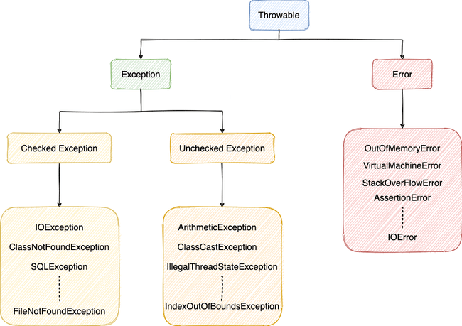
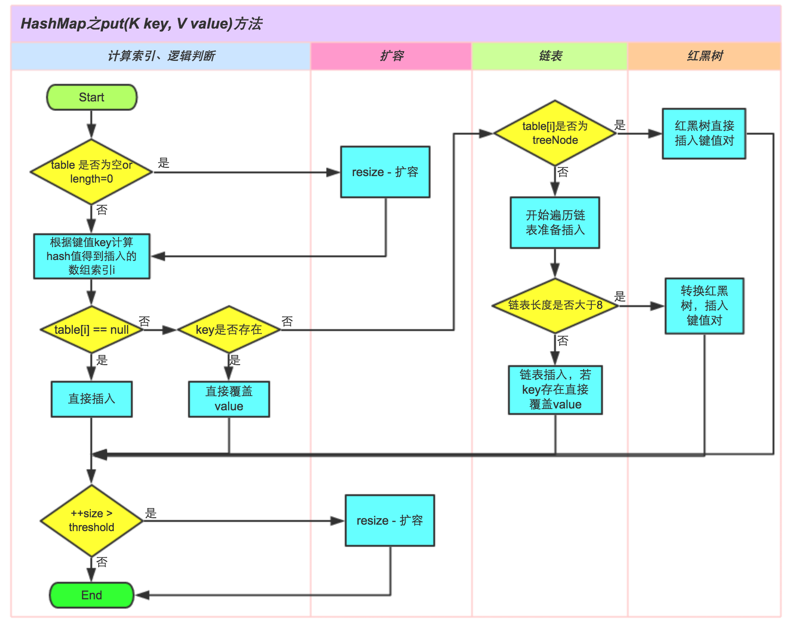
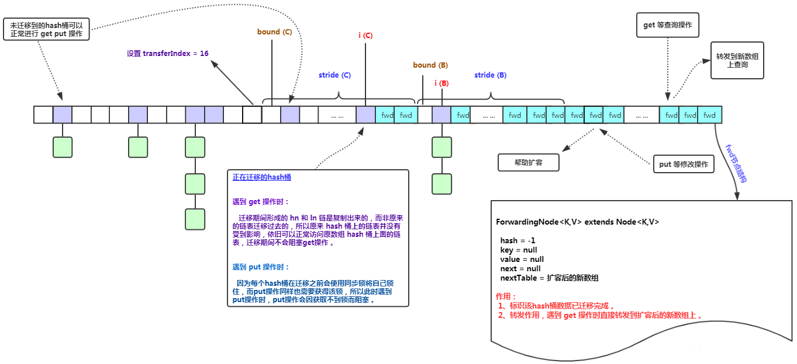
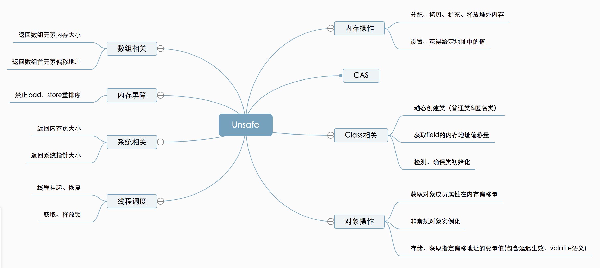
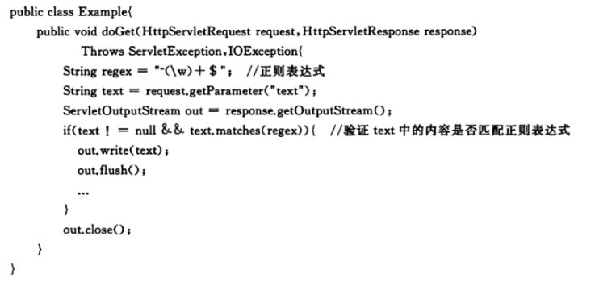

# 简介

Java编译与解释并存： Java 程序要经过先编译，后解释两个步骤，由 Java 编写的程序需要先经过编译步骤，生成字节码（.class 文件），这种字节码必须由 Java 解释器来解释执行。

静态方法不能调用非静态成员：静态方法在类加载的时候就会分配内存，而非静态成员属于实例对象，只有在对象实例化之后才存在，所以静态成员在非静态成员不存在的时候已经存在。

Java 内的传递都是值传递,对象传递的值是对象的地址。

## 重载和重写：
* 重载是同一个方法名不同的参数。
* 重写是子类覆盖父类的方法。

## == 和 equals()

* 对于基本数据类型来说，== 比较的是值。
* 对于引用数据类型来说，== 比较的是对象的内存地址。
* 没有重写 equals() 方法，继承Object类equals()方法，默认实现使用 ==。
* 可以重写 equals() 方法来比较具体属性，不过重写时必须要重写 hashcode 方法。

## String、StringBuffer、StringBuilder

* String 类 final 修饰 不可被继承，避免子类破坏String的行为，此外 储存字符的数组也是 final 修饰，所以String实例不可改变，每次对 String 类型进行改变的时候，都会生成一个新的 String 对象，然后将指针指向新的 String 对象。
* StringBuffer 和 StringBuilder 都继承自 AbstractStringBuilder 类，不过 StringBuffer 对方法加了同步锁，是线程安全的，StringBuilder 并没有对方法进行加同步锁，是非线程安全的。
* jdk9 底层 char[] 改为 byte[] ，并使用两种编码 Latin-1（ISO-8859-1） 和 UTF-16，Latin-1 不支持中文，使用单字节编码，当没有中文等 Latin-1 不支持的字符时， byte[] 比 char[] 少一半空间。

String s1 = new String("abc") 可能创建两个字符串对象，当字符串常量池中不存在 abc 时，会创建一个，new 还会创建一个。

String.intern() 是一个 native（本地）方法，如果字符串常量池中没有保存了对应的字符串对象的引用，那就在常量池中创建一个指向该字符串对象的引用并返回。

## BigDecimal

为防止精度丢失使用 BigDecimal(String val)构造方法或者 BigDecimal.valueOf(double val) 静态方法来创建对象。

工具类：
```java
import java.math.BigDecimal;
import java.math.RoundingMode;

/**
 * 简化BigDecimal计算的小工具类
 */
public class BigDecimalUtil {

    /**
     * 默认除法运算精度
     */
    private static final int DEF_DIV_SCALE = 10;

    private BigDecimalUtil() {
    }

    /**
     * 提供精确的加法运算。
     *
     * @param v1 被加数
     * @param v2 加数
     * @return 两个参数的和
     */
    public static double add(double v1, double v2) {
        BigDecimal b1 = BigDecimal.valueOf(v1);
        BigDecimal b2 = BigDecimal.valueOf(v2);
        return b1.add(b2).doubleValue();
    }

    /**
     * 提供精确的减法运算。
     *
     * @param v1 被减数
     * @param v2 减数
     * @return 两个参数的差
     */
    public static double subtract(double v1, double v2) {
        BigDecimal b1 = BigDecimal.valueOf(v1);
        BigDecimal b2 = BigDecimal.valueOf(v2);
        return b1.subtract(b2).doubleValue();
    }

    /**
     * 提供精确的乘法运算。
     *
     * @param v1 被乘数
     * @param v2 乘数
     * @return 两个参数的积
     */
    public static double multiply(double v1, double v2) {
        BigDecimal b1 = BigDecimal.valueOf(v1);
        BigDecimal b2 = BigDecimal.valueOf(v2);
        return b1.multiply(b2).doubleValue();
    }

    /**
     * 提供（相对）精确的除法运算，当发生除不尽的情况时，精确到
     * 小数点以后10位，以后的数字四舍五入。
     *
     * @param v1 被除数
     * @param v2 除数
     * @return 两个参数的商
     */
    public static double divide(double v1, double v2) {
        return divide(v1, v2, DEF_DIV_SCALE);
    }

    /**
     * 提供（相对）精确的除法运算。当发生除不尽的情况时，由scale参数指
     * 定精度，以后的数字四舍五入。
     *
     * @param v1    被除数
     * @param v2    除数
     * @param scale 表示表示需要精确到小数点以后几位。
     * @return 两个参数的商
     */
    public static double divide(double v1, double v2, int scale) {
        if (scale < 0) {
            throw new IllegalArgumentException(
                    "The scale must be a positive integer or zero");
        }
        BigDecimal b1 = BigDecimal.valueOf(v1);
        BigDecimal b2 = BigDecimal.valueOf(v2);
        return b1.divide(b2, scale, RoundingMode.HALF_UP).doubleValue();
    }

    /**
     * 提供精确的小数位四舍五入处理。
     *
     * @param v     需要四舍五入的数字
     * @param scale 小数点后保留几位
     * @return 四舍五入后的结果
     */
    public static double round(double v, int scale) {
        if (scale < 0) {
            throw new IllegalArgumentException(
                    "The scale must be a positive integer or zero");
        }
        BigDecimal b = BigDecimal.valueOf(v);
        BigDecimal one = new BigDecimal("1");
        return b.divide(one, scale, RoundingMode.HALF_UP).doubleValue();
    }

    /**
     * 提供精确的类型转换(Float)
     *
     * @param v 需要被转换的数字
     * @return 返回转换结果
     */
    public static float convertToFloat(double v) {
        BigDecimal b = new BigDecimal(v);
        return b.floatValue();
    }

    /**
     * 提供精确的类型转换(Int)不进行四舍五入
     *
     * @param v 需要被转换的数字
     * @return 返回转换结果
     */
    public static int convertsToInt(double v) {
        BigDecimal b = new BigDecimal(v);
        return b.intValue();
    }

    /**
     * 提供精确的类型转换(Long)
     *
     * @param v 需要被转换的数字
     * @return 返回转换结果
     */
    public static long convertsToLong(double v) {
        BigDecimal b = new BigDecimal(v);
        return b.longValue();
    }

    /**
     * 返回两个数中大的一个值
     *
     * @param v1 需要被对比的第一个数
     * @param v2 需要被对比的第二个数
     * @return 返回两个数中大的一个值
     */
    public static double returnMax(double v1, double v2) {
        BigDecimal b1 = new BigDecimal(v1);
        BigDecimal b2 = new BigDecimal(v2);
        return b1.max(b2).doubleValue();
    }

    /**
     * 返回两个数中小的一个值
     *
     * @param v1 需要被对比的第一个数
     * @param v2 需要被对比的第二个数
     * @return 返回两个数中小的一个值
     */
    public static double returnMin(double v1, double v2) {
        BigDecimal b1 = new BigDecimal(v1);
        BigDecimal b2 = new BigDecimal(v2);
        return b1.min(b2).doubleValue();
    }

    /**
     * 精确对比两个数字
     *
     * @param v1 需要被对比的第一个数
     * @param v2 需要被对比的第二个数
     * @return 如果两个数一样则返回0，如果第一个数比第二个数大则返回1，反之返回-1
     */
    public static int compareTo(double v1, double v2) {
        BigDecimal b1 = BigDecimal.valueOf(v1);
        BigDecimal b2 = BigDecimal.valueOf(v2);
        return b1.compareTo(b2);
    }

}
```

## 实例化顺序

* 父类静态变量
* 父类静态代码块
* 子类静态变量、
* 子类静态代码块
* 父类非静态变量（父类实例成员变量）
* 父类构造函数
* 子类非静态变量（子类实例成员变量）
* 子类构造函数

## 泛型

泛型是指参数化类型，编译器可以对泛型参数进行检测，并且通过泛型参数可以指定传入的对象类型。

泛型一般有三种使用方式：泛型类、泛型接口、泛型方法。

什么是泛型擦除机制？为什么要擦除?
* Java 的泛型是伪泛型，这是因为 Java 在编译期间，所有的泛型信息都会被擦掉。
* 编译器会在编译期间动态将泛型 T 擦除为 Object 或将 T extends xxx 擦除为其限定类型 xxx
* 泛型本质上是编译器的行为，为了保证引入泛型机制但不创建新的类型，减少虚拟机的运行开销，所以通过擦除将泛型类转化为一般类。

既然会擦除为什么还要用泛型？可不可以用 Object ？
* 可在编译期间进行类型检测。
* 使用 Object 类型需要手动添加强制类型转换，降低代码可读性，提高出错概率
* 泛型可以使用自限定类型。如 T extends Comparable 还能调用 compareTo(T o) 方法 ，Object
则没有此功能

泛型的限制：
* 不能实例化类型变量T,不能示例化泛型数组。
* 泛型参数不能是基本数据类型，因为基本数据类型不是Object子类。
* 不能抛出和捕获T类型的异常。
* 不能使用static修饰泛型变量。

Class类就实现了 java.lang.reflect.Type 接口, ParameterizedType 也实现了该接口，Class类保存当前类的基本类型信息，ParameterizedType则保存了泛型，外部类等额外类型信息。

java.lang.reflect.Type 是Java中所有类型的接口，Type体系中类型的包括：数组类型(GenericArrayType)、参数化类型(ParameterizedType)、类型变量(TypeVariable)、通配符类型(WildcardType)、原始类型(Class)。

没有泛型的时候，只有原始类型，所有的原始类型都通过字节码文件类Class类进行抽象，Class类的一个具体对象就代表一个指定的原始类型。

* Class（原始/基本类型，也叫raw type）：不仅仅包含我们平常所指的类、枚举、数组、注解，还包括基本类型int、float等等。

  ```java
  //返回直接继承的父类（由于编译擦除，没有显示泛型参数）
  getSuperclass() ;
  //返回直接继承的父类（包含泛型参数） 1.5后提供，一般获取的这个父类就是参数化类型 ParameterizedType
  getGenericSuperclass();
  //返回直接实现类（包含泛型参数）
  getGenericInterfaces();
  ```
* TypeVariable（类型变量）：比如List<T>中的T等。

  ```java
  public interface TypeVariable<D extends GenericDeclaration> extends Type, AnnotatedElement {
  	//类型对应的上限，默认为Object  可以有多个
      Type[] getBounds();
      //获取声明该类型变量实体，也就是TypeVariableTest< T>中的TypeVariableTest
      D getGenericDeclaration();
      //获取类型变量在源码中定义的名称；
      String getName();
      // JDK8新增的
      AnnotatedType[] getAnnotatedBounds();
  }
  ```

* WildcardType（ 泛型表达式类型）：例如List< ? extends Number>这种。

  ```java
  public interface WildcardType extends Type {
  	//获得泛型表达式上界（上限） 获取泛型变量的上边界（extends）
  	Type[] getUpperBounds();
  	//获得泛型表达式下界（下限） 获取泛型变量的下边界（super）
  	Type[] getLowerBounds();
  }
  ```

* ParameterizedType（参数化类型）：就是所用到的泛型List、Map（注意和TypeVariable的区别）。

  ```java
  public interface ParameterizedType extends Type {
  	//获取类型内部的参数化类型 比如Map<K,V>里面的K，V类型
  	Type[] getActualTypeArguments();
  	// 类的原始类型，一般都是Class
  	Type getRawType();
  	// 获取所有者类型（只有内部类才有所有者，比如Map.Entry他的所有者就是Map），若不是内部类，此处返回null
      Type getOwnerType();
  }
  ```

* GenericArrayType（数组类型）：并不是我们工作中所使用的数组String[] 、byte[]（这种都属于Class），而是带有泛型的数组，即T[] 泛型数组。

  ```java
  public interface GenericArrayType extends Type {
  	//返回泛型数组中元素的Type类型，即List<String>[] 中的 List<String>
  	Type getGenericComponentType();
  }
  ```

Spring 的泛型工具 ResolvableType:

```java
private HashMap<Integer, List<String>> myMap;

public void example() {
    ResolvableType t = ResolvableType.forField(getClass().getDeclaredField("myMap"));
    t.getSuperType(); // AbstractMap<Integer, List<String>>
    t.asMap(); // Map<Integer, List<String>>
    t.getGeneric(0).resolve(); // Integer
    t.getGeneric(1).resolve(); // List
    t.getGeneric(1); // List<String>
    t.resolveGeneric(1, 0); // String
}

// 构造获取 Field 的泛型信息
ResolvableType.forField(Field)
// 构造获取 Method 的泛型信息
ResolvableType.forMethodParameter(Method, int)
// 构造获取方法返回参数的泛型信息
ResolvableType.forMethodReturnType(Method)
// 构造获取构造参数的泛型信息
ResolvableType.forConstructorParameter(Constructor, int)
// 构造获取类的泛型信息
ResolvableType.forClass(Class)
// 构造获取类型的泛型信息
ResolvableType.forType(Type)
// 构造获取实例的泛型信息
ResolvableType.forInstance(Object)
```

## 反射

作用：可以在运行时分析类以及执行类中方法
* 实例化对象。
* 获取或者设置对象的属性。
* 获取或者执行实例对象的方法。

JDK API:

```java
 // 实例化
 clazz.newInstance();

 Constructor c = clazz.getConstructor();
 Object obj = c.newInstance();

 // 获取所有访问权限的属性、方法、构造器
 Field[] getDeclaredFields();
 Method[] getDeclaredMethods();
 Constructor<?>[] getDeclaredConstructors();

 // 获取所有访问权限的属性、方法、构造器
 Field getDeclaredField(String name);
 Method getDeclaredMethod(String name, Class<?>...parameterTypes);
 Constructor<T> getDeclaredConstructor(Class<?>...parameterTypes);

 // 绕开访问权限
[Constructor|Field|Method].setAccessible(true)
// 访问值
Field.[get|set](Object)
// 执行方法
Method.invoke(Object, Object[])

// 获取接口、父类、注解
clazz.getInterfaces();
clazz.getSuperClass();
clazz.getDeclaredAnnotations();

// 判断是否使用某注解、是否是数组、是否是接口、某object是否是该class实例
boolean isAnnotationPresent(Class<? extends Annotation> annotationClass)
boolean isArray()
boolean isInterface()
boolean isInstance(Object obj)
```

Spring ReflectionUtils:

```java
// 获取或设置属性，会查找父类
Field findField(Class<?> clazz, String name, Class<?> type)
void setField(Field field, Object target, Object value)

// 访问方法，会查找父类
Method findMethod(Class<?> clazz, String name, Class<?>… paramTypes)
Object invokeMethod(Method method, Object target, Object… args)

// 绕开访问权限
void makeAccessible(Field field)
void makeAccessible(Method method)
void makeAccessible(Constructor<?> ctor)

// 使用 MethodFilter 过滤 Class 中所有方法，并使用 MethodCallback 调用
void doWithMethods(Class<?> clazz, MethodCallback mc, MethodFilter mf)
// 使用 FieldFilter 过滤 Class 中所有属性，并使用 FieldCallback 调用
void doWithFields(Class<?> clazz, FieldCallback fc,FieldFilter ff)
```

Class.forName 和 ClassLoader 区别：
* Class#forName(...) 方法，除了将类的 .class 文件加载到JVM 中之外，还会对类进行解释，执行类中的 static 块。
* ClassLoader 只干一件事情，就是将 .class 文件加载到 JVM 中，不会执行 static 中的内容，只有在 newInstance 才会去执行 static 块。

## 异常



* 所有的异常都属于 java.lang.Throwable，分为 Exception 和 Error。
* Error 属于程序无法处理的错误 ，如 OutOfMemoryError，NoClassDefFoundError 等。
* Exception :程序本身可以处理的异常，可以通过 catch 来进行捕获，分为  Checked Exception 和 Unchecked Exception。
* Checked Exception ：程序必须处理，必须被 catch 或者 throw ，否则无法编译，例如 IOException,ClassNotFoundException 等。
* Unchecked Exception：即使不处理编译也可以正常通过，RuntimeException 及子类都属于这类异常，例如 NullPointerException。

Throwable 类常用方法：
* String getMessage(): 返回异常发生时的简要描述。
* String toString(): 返回异常发生时的详细信息。

如果finally 之前虚拟机被终止运行、或者程序所在的线程死亡，finally 中的代码就不会被执行。

try-with-resources 可使用在 任何实现 java.lang.AutoCloseable或者 java.io.Closeable 的对象，任何 catch 或 finally 块在声明的资源关闭后运行，多个资源可使用 `;` 分割。

## 集合


1. List
* Arraylist： Object[] 数组。
* Vector：Object[] 数组。
* LinkedList： 双向链表。

2. Set
* HashSet(无序，唯一): 基于 HashMap 实现的，底层采用 HashMap 来保存元素。
* LinkedHashSet: LinkedHashSet 是 HashSet 的子类，并且其内部是通过 LinkedHashMap 来实现的。
* TreeSet(有序，唯一): 红黑树。

3. Queue
* PriorityQueue: Object[] 数组来实现二叉堆。
* ArrayQueue: Object[] 数组 + 双指针。

4. Map
* HashMap： 数组 + 链表 + 红黑树。
* LinkedHashMap： LinkedHashMap 继承自 HashMap，也是 数组 + 链表 + 红黑树。另外，LinkedHashMap 增加一条双向链表，可以保持键值对的插入顺序。同时通过对链表进行相应的操作，实现了访问顺序相关逻辑。
* Hashtable： 数组+链表。
* TreeMap： 红黑树。

### List

Arraylist 和 Vector 的区别：

* ArrayList 底层使用 Object[] 存储，适用于频繁的查找工作，线程不安全。
* Vector 是 List 的古老实现类，底层使用Object[] 存储，线程安全的，不常用。

Arraylist 和 LinkedList 区别：

* 线程安全： ArrayList 和 LinkedList 都不保证线程安全。
* 数据结构： Arraylist 使用 Object[]，LinkedList使用 双向链表。
* 插入和删除：ArrayList#add(E e) 时间复杂度 O(1)，ArrayList#add(int index, E element) 时间复杂度为 O(n-i),第 i 和第 i 个元素之后的(n-i)个元素都要移动，LinkedList#add(E e) 时间复杂度为 O(1)，LinkedList#add(int index, E element) 时间复杂度为 O(n),需要先移动到指定位置再插入。
* 快速随机访问： LinkedList 不支持高效的随机元素访问，而 ArrayList 支持。快速随机访问就是通过元素的序号快速获取元素对，对应get(int index)。
* 内存空间： ArrayList 的空间浪费主要在 list 列表的结尾会预留一定的容量空间，而 LinkedList 的空间花费主要在每一个元素都需要额外存放直接后继和直接前驱。

#### ArrayList

关键属性：

```java
/**
 * 保存ArrayList数组，用transient修饰，序列化时不会序列化该字段，序列化使用的是自定义writeObject方法序  列化，这样可以节约序列化后的空间，因为只会序列化 size 部分。
 */
transient Object[] elementData;

/**
 * 已经储存多少个元素
 */
private int size;
```

关键静态变量：

```java
/**
 * 当数组为 DEFAULTCAPACITY_EMPTY_ELEMENTDATA ，添加第一个元素时会扩容为该值。
 */
private static final int DEFAULT_CAPACITY = 10;

/**
 * 空数组，用于 size = 0 的实例
 */
private static final Object[] EMPTY_ELEMENTDATA = {};

/**
 * 空数组，用于 new ArrayList() 初始化
 */
private static final Object[] DEFAULTCAPACITY_EMPTY_ELEMENTDATA = {};
```

构造器：

```java
/**
 * 带初始容量的构造函数
 */
public ArrayList(int initialCapacity) {
    if (initialCapacity > 0) {
        this.elementData = new Object[initialCapacity];
    } else if (initialCapacity == 0) {
        this.elementData = EMPTY_ELEMENTDATA;
    } else {
        throw new IllegalArgumentException("Illegal Capacity: "+
                                           initialCapacity);
    }
}

/**
 * 默认初始化为 DEFAULTCAPACITY_EMPTY_ELEMENTDATA 空数组，当添加第一个元素时才会扩容到 DEFAULT_CAPACITY=10
 */
public ArrayList() {
    this.elementData = DEFAULTCAPACITY_EMPTY_ELEMENTDATA;
}

public ArrayList(Collection<? extends E> c) {
    Object[] a = c.toArray();
    if ((size = a.length) != 0) {
        if (c.getClass() == ArrayList.class) {
            elementData = a;
        } else {
            elementData = Arrays.copyOf(a, size, Object[].class);
        }
    } else {
        // replace with empty array.
        elementData = EMPTY_ELEMENTDATA;
    }
}
```

操作数据：

```java
public boolean add(E e) {
    modCount++;
    add(e, elementData, size);
    return true;
}
/**
 * 当容量满的时候 s == elementData.length ,进行扩容 grow()。
 */
private void add(E e, Object[] elementData, int s) {
    if (s == elementData.length)
        elementData = grow();
    elementData[s] = e;
    size = s + 1;
}

private Object[] grow() {
    return grow(size + 1);
}

private Object[] grow(int minCapacity) {
    return elementData = Arrays.copyOf(elementData,
                                       newCapacity(minCapacity));
}

/**
 * 当 elementData == DEFAULTCAPACITY_EMPTY_ELEMENTDATA 时，返回 DEFAULT_CAPACITY=10
 * 否则返回 oldCapacity + (oldCapacity >> 1),即原容量的1.5倍。
 */
private int newCapacity(int minCapacity) {
    // overflow-conscious code
    int oldCapacity = elementData.length;
    int newCapacity = oldCapacity + (oldCapacity >> 1);
    if (newCapacity - minCapacity <= 0) {
        if (elementData == DEFAULTCAPACITY_EMPTY_ELEMENTDATA)
            return Math.max(DEFAULT_CAPACITY, minCapacity);
        if (minCapacity < 0) // overflow
            throw new OutOfMemoryError();
        return minCapacity;
    }
    return (newCapacity - MAX_ARRAY_SIZE <= 0)
        ? newCapacity
        : hugeCapacity(minCapacity);
}

private static int hugeCapacity(int minCapacity) {
    if (minCapacity < 0) // overflow
        throw new OutOfMemoryError();
    return (minCapacity > MAX_ARRAY_SIZE)
        ? Integer.MAX_VALUE
        : MAX_ARRAY_SIZE;
}

public void remove() {
    if (lastRet < 0)
        throw new IllegalStateException();
    checkForComodification();

    try {
        ArrayList.this.remove(lastRet);
        cursor = lastRet;
        lastRet = -1;
        expectedModCount = modCount;
    } catch (IndexOutOfBoundsException ex) {
        throw new ConcurrentModificationException();
    }
}

public E remove(int index) {
    Objects.checkIndex(index, size);
    final Object[] es = elementData;

    @SuppressWarnings("unchecked") E oldValue = (E) es[index];
    fastRemove(es, index);

    return oldValue;
}
/**
 * 将第 i+1 到 size - 1 位置前移。
 */
private void fastRemove(Object[] es, int i) {
    modCount++;
    final int newSize;
    if ((newSize = size - 1) > i)
        System.arraycopy(es, i + 1, es, i, newSize - i);
    es[size = newSize] = null;
}
```

ArrayList 扩容逻辑：new ArrayList() 时容量为 0 ，当add第一个值时容量为 10，以后当容量满了之后扩容，扩容大小为 原始容量的 1.5 倍，如果有小数会舍掉小数。

System.arraycopy() 和 Arrays.copyOf()：

```java
/**
 * 复制数组
 * @param src 源数组
 * @param srcPos 源数组中的起始位置
 * @param dest 目标数组
 * @param destPos 目标数组中的起始位置
 * @param length 要复制的数组元素的数量
 */
public static native void arraycopy(Object src,  int  srcPos,
                                    Object dest, int destPos,
                                    int length);

public static int[] copyOf(int[] original, int newLength) {
    	// 申请一个新的数组
        int[] copy = new int[newLength];
	// 调用System.arraycopy,将源数组中的数据进行拷贝,并返回新的数组
        System.arraycopy(original, 0, copy, 0,
                         Math.min(original.length, newLength));
        return copy;
    }
```

ensureCapacity：可在大量插入时，调用该方法一次性扩容，避免大量插入时多次扩容影响性能。

```java
public void ensureCapacity(int minCapacity) {
    int minExpand = (elementData != DEFAULTCAPACITY_EMPTY_ELEMENTDATA)
        // any size if not default element table
        ? 0
        // larger than default for default empty table. It's already
        // supposed to be at default size.
        : DEFAULT_CAPACITY;

    if (minCapacity > minExpand) {
        ensureExplicitCapacity(minCapacity);
    }
}
```

#### LinkedList

LinkedList 双向链表实现，不存在扩容问题。


操作数据：

```java
// 添加到最后
public boolean add(E e) {
    linkLast(e);
    return true;
}

void linkLast(E e) {
    // 记录原 last 节点
    final Node<E> l = last;
    final Node<E> newNode = new Node<>(l, e, null);
    // last 指向新节点
    last = newNode;
    if (l == null)
        // 如果原 last 为 null ，说明 first 也为空，则 first 也指向新节点
        first = newNode;
    else
        // 如果原 last 非 null ，说明 first 也非空，则原 last 的 next 指向新节点。
        l.next = newNode;
    size++;
    modCount++;
}
// 移除首节点
public E remove() {
    return removeFirst();
}
public E removeFirst() {
    final Node<E> f = first;
    if (f == null)
        throw new NoSuchElementException();
    return unlinkFirst(f);
}
private E unlinkFirst(Node<E> f) {
    final E element = f.item;
    final Node<E> next = f.next;
    f.item = null;
    f.next = null;
    first = next;
    if (next == null)
        last = null;
    else
        next.prev = null;
    size--;
    modCount++;
    return element;
}
```

#### CopyOnWriteArrayList

通过写时复制来延时更新实现数据的最终一致性，并且能够保证读线程间不阻塞。

当我们往一个容器添加元素的时候，不直接往当前容器添加，而是先将当前容器进行Copy，复制出一个新的容器，然后新的容器里添加元素，添加完元素之后，再将原容器的引用指向新的容器。

并发读时没有加锁，并发写时加锁，并且在写入时仍然可以读。

关键属性：

```java
/**
 * 修改数组时对该对象加锁
 */
final transient Object lock = new Object();
/**
 * 线程1 在读取array时，首先读取array引用，而这个引用由 volatile 修饰，所有数组内的数据都会从主存读取
 */
private transient volatile Object[] array;
```

操作数据：

```java
public boolean add(E e) {
    synchronized (lock) {
        Object[] es = getArray();
        int len = es.length;
        // 创建一个长度为 len + 1 的新数组，并把原数组拷贝过去
        es = Arrays.copyOf(es, len + 1);
        // 添加元素
        es[len] = e;
        // 使用新数组替换原数组
        setArray(es);
        return true;
    }
}

final Object[] getArray() {
    return array;
}

final void setArray(Object[] a) {
    array = a;
}

public E get(int index) {
    return elementAt(getArray(), index);
}

@SuppressWarnings("unchecked")
static <E> E elementAt(Object[] a, int index) {
    return (E) a[index];
}
```

优点：保证多线程的并发读写的线程安全。

缺点：如果数据较多或数据较大，占用内存会比较大，复制时使用双倍内存。

解决方案:

* 压缩元素，例如：将10进制数字压缩成36进制或64进制。
* 使用ConcurrentHashMap替代。

应用于读多写少的并发场景。

### Map

 HashMap 和 Hashtable 区别：

* 线程安全：HashMap非线程安全，Hashtable线程安全,Hashtable 基本被淘汰，线程安全使用 ConcurrentHashMap。

* 效率：HashMap 未加锁，效率较高。

* Null 的支持： HashMap 可以存储 null 的 key 和 value，但 null 作为键只能有一个，null 作为值可以有多个，Hashtable 不允许有 null 键和 null 值，否则会抛出 NullPointerException。

* 初始容量大小：Hashtable 默认的初始大小为 11，HashMap 默认的初始化大小为 16。

* 每次扩充容量大小：Hashtable 每次扩充，容量变为原来的 2n+1，HashMap 每次扩充，容量变为原来的 2 倍。

 HashMap 和 TreeMap 区别：

* TreeMap 和 HashMap 都继承自 AbstractMap ，TreeMap 还实现 NavigableMap 接口和 SortedMap 接口。
* NavigableMap 接口让 TreeMap 有了对集合内元素的搜索的能力。
* SortedMap 接口让 TreeMap 有了对集合中的元素根据键排序的能力。

#### HashMap

节点：

```java
static class Node<K,V> implements Map.Entry<K,V> {
    // 哈希值，存放元素到hashmap中时用来与其他元素hash值比较
    final int hash;
    //键
    final K key;
    //值
    V value;
    // 指向下一个节点
    Node<K,V> next;
}
```

属性：

```java
/**
 * 储存数据,称为buckets/bins，HashMap的容量 CAPACITY = table.length,默认值为 DEFAULT_INITIAL_CAPACITY = 16
 */
transient Node<K,V>[] table;

/**
 * 保存 Node 的缓存，方便获取 entrySet，不用再去遍历 table 获取所有值。
 */
transient Set<Map.Entry<K,V>> entrySet;

/**
 * 已经储存数据的数量
 */
transient int size;

/**
 * 修改的次数
 */
transient int modCount;

/**
 * 扩容的的阈值，当添加 size >= threshold进行扩容，如果不指定容量，默认值为 (DEFAULT_INITIAL_CAPACITY =16) * 0.75 = 12
 */
int threshold;

/**
 * 默认值0.75，该值越大，相同的bins储存的数据越多，利用率越高，存放数据很集中，但是hash碰撞也就越多，查找效率越低，太小导致数组的利用率低，存放的数据会很分散。
 */
final float loadFactor;
```

常量：

```java
/**
 * 默认的初始容量,16
 */
static final int DEFAULT_INITIAL_CAPACITY = 1 << 4;

/**
 * 最大容量
 */
static final int MAXIMUM_CAPACITY = 1 << 30;

/**
 * 默认的填充因子
 */
static final float DEFAULT_LOAD_FACTOR = 0.75f;

/**
 * 当 table.length >= 64 并且 单链表长度 >= 8 时，将链表转换成红黑树。
 */
static final int TREEIFY_THRESHOLD = 8;

/**
 * resize时，如果 红黑树 节点数小于 6，会将红黑树转换成链表。
 */
static final int UNTREEIFY_THRESHOLD = 6;

/**
 * 转换成红黑树的最小容量，当容量小于64时，及时链表长度达到8也不会转换成红黑树，而是优先选择扩容。
 */
static final int MIN_TREEIFY_CAPACITY = 64;
```

数据结构： 数组 + 链表 + 红黑树 。


构造函数：

```java
/**
 * 默认容量为16
 */
public HashMap() {
    this.loadFactor = DEFAULT_LOAD_FACTOR;
}
/**
 * 实际容量为 大于initialCapacity 的 2 的幂，插入大量元素时应该设置初始化容量 = 想要储存的元素个数/0.75 + 1
 */
public HashMap(int initialCapacity) {
    this(initialCapacity, DEFAULT_LOAD_FACTOR);
}

/**
 * 当 table 没有初始化时，capacity 保存在 threshold
 */
public HashMap(int initialCapacity, float loadFactor) {
    if (initialCapacity < 0)
        throw new IllegalArgumentException("Illegal initial capacity: " +
                                           initialCapacity);
    if (initialCapacity > MAXIMUM_CAPACITY)
        initialCapacity = MAXIMUM_CAPACITY;
    if (loadFactor <= 0 || Float.isNaN(loadFactor))
        throw new IllegalArgumentException("Illegal load factor: " +
                                           loadFactor);
    this.loadFactor = loadFactor;
    this.threshold = tableSizeFor(initialCapacity);
}

public HashMap(Map<? extends K, ? extends V> m) {
    this.loadFactor = DEFAULT_LOAD_FACTOR;
    putMapEntries(m, false);
}

static final int tableSizeFor(int cap) {
    // -1 = 1111 1111 1111 1111 1111 1111 1111 1111 -  最高非0位前面的0的个数
    int n = -1 >>> Integer.numberOfLeadingZeros(cap - 1);
    // n + 1 为 2 的幂
    return (n < 0) ? 1 : (n >= MAXIMUM_CAPACITY) ? MAXIMUM_CAPACITY : n + 1;
}

// Integer.class
/**
 * 返回无符号整数i的最高非0位前面的0的个数，包括符号位在内；如果i为负数，这个方法将会返回0，符号位为1。
 * 例如：10的二进制表示为 0000 0000 0000 0000 0000 0000 0000 1010
 * java的整型长度为32位。那么这个方法返回的就是28
 */
public static int numberOfLeadingZeros(int i) {
    // HD, Count leading 0's
    if (i <= 0)
        return i == 0 ? 32 : 0;
    int n = 31;
    // 使用 0100 0000 0000 0000 0000 0000 0000 0000 举例
    // 说明 非0首位 不在低16位，n < 16,并将高16位移到低16位
    // 这时 n = 15 , i = 0000 0000 0000 0000 0100 0000 0000 0000
    if (i >= 1 << 16) { n -= 16; i >>>= 16; }
    // 说明 非0首位 不在低8位，n < 8,并将高8位移到低8位
    // 这时 n = 7 , i = 0000 0000 0000 0000 0000 0000 0100 0000
    if (i >= 1 <<  8) { n -=  8; i >>>=  8; }
    // 说明 非0首位 不在低4位，n < 4,并将高4位移到低4位
    // 这时 n = 3 , i = 0000 0000 0000 0000 0000 0000 0000 0100
    if (i >= 1 <<  4) { n -=  4; i >>>=  4; }
    // 说明 非0首位 不在低2位，n < 2,并将高2位移到低2位
    // 这时 n = 1 , i = 0000 0000 0000 0000 0000 0000 0000 0001
    if (i >= 1 <<  2) { n -=  2; i >>>=  2; }
    // n-0
    return n - (i >>> 1);
}


final void putMapEntries(Map<? extends K, ? extends V> m, boolean evict) {
    int s = m.size();
    if (s > 0) {
        // 如果 table 未初始化，重新计算 threshold = 传入集合的长度 / 0.75 + 1
        if (table == null) { // pre-size
            float ft = ((float)s / loadFactor) + 1.0F;
            int t = ((ft < (float)MAXIMUM_CAPACITY) ?
                     (int)ft : MAXIMUM_CAPACITY);
            if (t > threshold)
                threshold = tableSizeFor(t);
        }
        // 如果传入集合长度 > threshold , 进行扩容
        else if (s > threshold)
            resize();

        // 循环插入数据
        for (Map.Entry<? extends K, ? extends V> e : m.entrySet()) {
            K key = e.getKey();
            V value = e.getValue();
            putVal(hash(key), key, value, false, evict);
        }
    }
}
```

扩容：

```java
final Node<K,V>[] resize() {
    Node<K,V>[] oldTab = table;
    int oldCap = (oldTab == null) ? 0 : oldTab.length;
    int oldThr = threshold;
    int newCap, newThr = 0;

    // table 已经初始化过了
    if (oldCap > 0) {
        // capacity 达到最大值，不能进行扩容，只能继续哈希碰撞。
        if (oldCap >= MAXIMUM_CAPACITY) {
            threshold = Integer.MAX_VALUE;
            return oldTab;
        }
        // 新容量 = 旧容量 * 2
        else if ((newCap = oldCap << 1) < MAXIMUM_CAPACITY &&
                 oldCap >= DEFAULT_INITIAL_CAPACITY)
            newThr = oldThr << 1; // double threshold
    }
    // oldCap = 0 , oldThr > 0,当 table 没有初始化时，capacity 保存在 threshold
    else if (oldThr > 0)
        newCap = oldThr;
    else {
        // oldCap = 0 , oldThr = 0,设置默认 capacity 为 DEFAULT_INITIAL_CAPACITY = 16
        newCap = DEFAULT_INITIAL_CAPACITY;
        newThr = (int)(DEFAULT_LOAD_FACTOR * DEFAULT_INITIAL_CAPACITY);
    }
    // 配合上面 oldThr > 0 的条件计算 threshold
    if (newThr == 0) {
        float ft = (float)newCap * loadFactor;
        newThr = (newCap < MAXIMUM_CAPACITY && ft < (float)MAXIMUM_CAPACITY ?
                  (int)ft : Integer.MAX_VALUE);
    }
    threshold = newThr;
    @SuppressWarnings({"rawtypes","unchecked"})
    // 初始化table
    Node<K,V>[] newTab = (Node<K,V>[])new Node[newCap];
    table = newTab;

    // 如果 table 之间有值需要将其迁移到新table
    if (oldTab != null) {
        for (int j = 0; j < oldCap; ++j) {
            Node<K,V> e;
            if ((e = oldTab[j]) != null) {
                oldTab[j] = null;
                // 如果是单节点，直接通过hash值重新计算位置。
                if (e.next == null)
                    newTab[e.hash & (newCap - 1)] = e;
                // 如果是红黑树，会将每个节点 hash & oldCap 。
                // 如果 等于 0 说明还在 [原节点]。
                // 如果等于1说明在 [原节点 + oldCap] 位置。
                // 这样将红黑树拆分成两个链表,分别处理两个链表
                // 如果链表长度大于等于8，将链表转换为红黑树
                // 如果链表长度小于等于6，将红黑树转换为链表
                else if (e instanceof TreeNode)
                    ((TreeNode<K,V>)e).split(this, newTab, j, oldCap);
                else {
                    // 处理链表节点
                    // 如果 等于 0 说明还在原节点。
                    // 如果等于1说明在 原节点 + oldCap 位置。
                    // 这样将链表分成两个链表,分布在 [原节点] 和 [原节点 + oldCap] 位置。
                    Node<K,V> loHead = null, loTail = null;
                    Node<K,V> hiHead = null, hiTail = null;
                    Node<K,V> next;
                    do {
                        next = e.next;
                        if ((e.hash & oldCap) == 0) {
                            if (loTail == null)
                                loHead = e;
                            else
                                loTail.next = e;
                            loTail = e;
                        }
                        else {
                            if (hiTail == null)
                                hiHead = e;
                            else
                                hiTail.next = e;
                            hiTail = e;
                        }
                    } while ((e = next) != null);
                    if (loTail != null) {
                        loTail.next = null;
                        newTab[j] = loHead;
                    }
                    if (hiTail != null) {
                        hiTail.next = null;
                        newTab[j + oldCap] = hiHead;
                    }
                }
            }
        }
    }
    return newTab;
}
```

插入数据：



1. 判断键值对数组table[i]是否为空或为null，否则执行resize()进行扩容。
2. 根据键值key计算hash值得到插入的数组索引i，如果table[i]==null，直接新建节点添加，转向 6，如果table[i]不为空，转向3。
3. 判断table[i]的首个元素是否和key一样，如果相同直接覆盖value，否则转向4，这里的相同指的是hashCode以及equals。
4. 判断table[i] 是否为treeNode，即table[i] 是否是红黑树，如果是红黑树，则直接在树中插入键值对，否则转向5。
5. 遍历table[i]，判断链表长度是否大于8，大于8并且capacity 大于 64 则把链表转换为红黑树，在红黑树中执行插入操作，否则进行链表的插入操作，遍历过程中若发现key已经存在直接覆盖value即可。
6. 插入成功后，判断实际存在的键值对数量size是否超多了最大容量threshold，如果超过，进行扩容。

```java
final V putVal(int hash, K key, V value, boolean onlyIfAbsent,
               boolean evict) {
    Node<K,V>[] tab; Node<K,V> p; int n, i;
    // table 未初始化，直接进行扩容
    if ((tab = table) == null || (n = tab.length) == 0)
        n = (tab = resize()).length;
    // 如果数组索引 (n - 1) & hash 为 null ，直接将值插入。
    if ((p = tab[i = (n - 1) & hash]) == null)
        tab[i] = newNode(hash, key, value, null);
    else {
        Node<K,V> e; K k;
        // 如果数组索引  (n - 1) & hash 有值，并且 hash 值相同，equals 为true，直接替换
        if (p.hash == hash &&
            ((k = p.key) == key || (key != null && key.equals(k))))
            e = p;
        // 如果数组索引  (n - 1) & hash 是红黑树，按照树形结构插入
        else if (p instanceof TreeNode)
            e = ((TreeNode<K,V>)p).putTreeVal(this, tab, hash, key, value);
        else {
            // 如果数组索引  (n - 1) & hash 有值，并且 hash 值相同，但是 equals 为false，就沿着链表向向下找
            for (int binCount = 0; ; ++binCount) {
               // 如果找到叶子节点也没有找到相同的key就将值插在链表尾部，并且如果链表长度 =8 ，调用treeifyBin 方法转换红黑树，不过方法内部会判断capacity是否达到 MIN_TREEIFY_CAPACITY = 64，如果没有达到会先进行扩容
                if ((e = p.next) == null) {
                    p.next = newNode(hash, key, value, null);
                    if (binCount >= TREEIFY_THRESHOLD - 1) // -1 for 1st
                        treeifyBin(tab, hash);
                    break;
                }
                // 如果在链表中找到相同key ，就将其替换
                if (e.hash == hash &&
                    ((k = e.key) == key || (key != null && key.equals(k))))
                    break;
                p = e;
            }
        }
        if (e != null) { // existing mapping for key
            V oldValue = e.value;
            if (!onlyIfAbsent || oldValue == null)
                e.value = value;
            afterNodeAccess(e);
            return oldValue;
        }
    }
    ++modCount;
    // size >= threshold 进行扩容
    if (++size > threshold)
        resize();
    afterNodeInsertion(evict);
    return null;
}
```

HashMap 的长度为什么是 2 的幂次方?
* 数据在数组中的位置是使用 hash值 对 数组长度 做取模运算得出，即 hash % length,当 length = 2的幂 时，hash % length = hash & (length - 1),位运算 比 & 效率高。
* 扩容时不用重新计算位置，只需通过hash新增的首位是1还0来判断位置，如果是1，则 新位置 = 原位置 + oldCapacity，如果是 0 ，则还是原位置。

#### LinkedHashMap

```java
public class LinkedHashMap<K,V>
    extends HashMap<K,V>
    implements Map<K,V>
{
  static class Entry<K,V> extends HashMap.Node<K,V> {
    Entry<K,V> before, after;
    Entry(int hash, K key, V value, Node<K,V> next) {
        super(hash, key, value, next);
    }
  }
}
```

LinkedHashMap 继承自 HashMap，从数据结构上看，相比 HashMap 会多维护一个链表，用来记录插入的先后顺序，使用迭代器迭代时会按照元素进入集合的顺序迭代，put 逻辑大致一样，新增加在插入之后执行 LinkedHashMap#afterNodeInsertion 用来维护链表。

#### TreeMap

```java
static final class Entry<K,V> implements Map.Entry<K,V> {
    K key;
    V value;
    Entry<K,V> left;
    Entry<K,V> right;
    Entry<K,V> parent;
    boolean color = BLACK;
}
```

TreeMap 节点是标准的红黑树节点。

* 红黑树由平衡二叉查找树演变而来。
* 由于完全平衡的二叉查找树在插入后再次平衡的代价太大，所以引入允许三叉的平衡查找树来简化算法，叫做2-3查找树。
* 大部分插入只需要将2叉变为3叉就可解决不需要重新平衡，只有3叉变为4叉的时候通过对节点的上浮和下沉来达到平衡。
* 由于 2-3 树的数据结构较为复制，所有还是选用二叉树来表示，但是通过对节点着色来区分3节点(红链接) 还是 2节点（黑链接）。
* 所以红黑树是完美黑色平衡树，任意叶子节点到根节点的路径上的黑链接数量相同。
* 删除任意节点就是删除某一子树的最小键。

* 前序：根左右，很方便地形成一条搜索路径。
* 中序：左根右，可以得到一个有序序列。
* 后序：左右根，中缀表达式转为后缀表达式，后缀表达式方便计算机计算。

#### ConcurrentHashMap

特点：

1. 初始容量16，每次扩容为 原容量2倍。
2. 自旋 + CAS + synchronized 保证线程安全。
3. 多线程扩容。


属性：

```java
/**
 * hash 表
 */
transient volatile Node<K,V>[] table;

/**
 * 扩容时 新的 hash 表，仅在扩容时不为空，扩容过程中，会将扩容中的新table赋值给nextTable，扩容结束之后，这里就会被设置为NULL
 */
private transient volatile Node<K,V>[] nextTable;

/**
 * 当未发生线程竞争或当前LongAdder处于加锁状态时，增量会被累加到baseCount，map实际总数 sum(counterCells) + baseCount
 */
private transient volatile long baseCount;

/**
 * 为0，代表数组未初始化， 且数组的初始容量为16
 * 为正数，如果数组未初始化，那么其记录的是数组的初始容量，如果数组已经初始化，那么其记录的是数组的扩容阈值
 * 为-1，表示数组正在进行初始化
 * 小于0，并且不是-1，表示数组正在扩容， -(1+n)，表示此时有n个线程正在共同完成数组的扩容操
 */
private transient volatile int sizeCtl;

/**
 * 扩容过程中，记录当前进度。所有的线程都需要从transferIndex中分配区间任务，并去执行自己的任务
 */
private transient volatile int transferIndex;

/**
 * LongAdder中，cellsBusy表示对象的加锁状态：
 * 0: 表示当前LongAdder对象处于无锁状态
 * 1: 表示当前LongAdder对象处于加锁状态
 */
private transient volatile int cellsBusy;

/**
 * LongAdder中的cells数组，当baseCount发生线程竞争后，会创建cells数组，
 * 线程会通过计算hash值，去取到自己的cell，将增量累加到指定的cell中
 * 总数 = sum(cells) + baseCount
 */
private transient volatile CounterCell[] counterCells;
```
常量：

```java
// 控制线程迁移数据的最小步长(桶位的跨度~)
private static final int MIN_TRANSFER_STRIDE = 16;

// 固定值16，与扩容相关，计算扩容时会根据该属性值生成一个扩容标识戳
private static int RESIZE_STAMP_BITS = 16;

// (1 << (32 - RESIZE_STAMP_BITS)) - 1 = 65535：1 << 16 -1
// 表示并发扩容最多容纳的线程数
private static final int MAX_RESIZERS = (1 << (32 - RESIZE_STAMP_BITS)) - 1;

// 扩容相关属性
private static final int RESIZE_STAMP_SHIFT = 32 - RESIZE_STAMP_BITS;

// 当node节点的hash值为-1：表示当前节点是FWD(forwarding)节点(已经被迁移的节点)
static final int MOVED = -1;
// 当node节点的hash值为-2：表示当前节点已经树化，且当前节点为TreeBin对象~，TreeBin对象代理操作红黑树
static final int TREEBIN   = -2;
// 当node节点的hash值为-3：
static final int RESERVED  = -3;
// 0x7fffffff 十六进制转二进制值为：1111111111111111111111111111111（31个1）
// 作用是将一个二进制负数与1111111111111111111111111111111 进行按位与(&)运算时，会得到一个正数，但不是取绝对值
static final int HASH_BITS = 0x7fffffff;

private static final Unsafe U = Unsafe.getUnsafe();
// 表示sizeCtl属性在ConcurrentHashMap中内存的偏移地址
private static final long SIZECTL;
// 表示transferIndex属性在ConcurrentHashMap中内存的偏移地址
private static final long TRANSFERINDEX;
// 表示baseCount属性在ConcurrentHashMap中内存的偏移地址
private static final long BASECOUNT;
// 表示cellsBusy属性在ConcurrentHashMap中内存的偏移地址
private static final long CELLSBUSY;
// 表示cellsValue属性在ConcurrentHashMap中内存的偏移地址
private static final long CELLVALUE;
// 表示数组第一个元素的偏移地址
private static final long ABASE;
// 该属性用于数组寻址，请继续往下阅读
private static final int ASHIFT;

// 散列表数组最大容量值
private static final int MAXIMUM_CAPACITY = 1 << 30;

// 散列表默认容量值16
private static final int DEFAULT_CAPACITY = 16;

// 负载因子
private static final float LOAD_FACTOR = 0.75f;

// 树化阈值
static final int TREEIFY_THRESHOLD = 8;

// 反树化阈值
static final int UNTREEIFY_THRESHOLD = 6;

// 散列表长度达到64，且某个桶位中的链表长度达到8，才会发生树化
static final int MIN_TREEIFY_CAPACITY = 64;

// 最大的数组大小（非2的幂） toArray和相关方法需要(并不是核心属性)
static final int MAX_ARRAY_SIZE = Integer.MAX_VALUE - 8;

// jdk1.7遗留下来的，用来表示并发级别的属性
// jdk1.8只有在初始化的时候用到，不再表示并发级别了~ 1.8以后并发级别由散列表长度决定
private static final int DEFAULT_CONCURRENCY_LEVEL = 16;
```

添加数据：

```java
public V put(K key, V value) {
    return putVal(key, value, false);
}

final V putVal(K key, V value, boolean onlyIfAbsent) {
    if (key == null || value == null) throw new NullPointerException();
    int hash = spread(key.hashCode());
    int binCount = 0;
    // 自旋
    for (Node<K,V>[] tab = table;;) {
        Node<K,V> f; int n, i, fh; K fk; V fv;
        // 当 tab == null ，初始化 hash 表，初始容量为 sizeCtl，如果 sizeCtl 为 0，则容量为DEFAULT_CAPACITY 。
        // 初始化时只有一个线程将  sizeCtl 设置通过 CAS 设置为 -1，当其他线程调用 Thread.yield(); 重新等待调度，或者自旋等待。
        if (tab == null || (n = tab.length) == 0)
            tab = initTable();
        else if ((f = tabAt(tab, i = (n - 1) & hash)) == null) {
            // 如果 (n - 1) & hash 为空，CAS 替换。
            if (casTabAt(tab, i, null, new Node<K,V>(hash, key, value)))
                break;
        }
        ///如果hash计算得到的桶位置元素的hash值为MOVED，证明正在扩容，那么协助扩容
        else if ((fh = f.hash) == MOVED)
            tab = helpTransfer(tab, f);

        // putIfAbsent 操作
        else if (onlyIfAbsent
                 && fh == hash
                 && ((fk = f.key) == key || (fk != null && key.equals(fk)))
                 && (fv = f.val) != null)
            return fv;
        else {
           //hash计算的桶位置元素不为空，且当前没有处于扩容操作，进行元素添加
            V oldVal = null;
            //对当前桶也就是头节点进行加锁，保证线程安全，执行元素添加操作，和HashMap类似
            synchronized (f) {
                if (tabAt(tab, i) == f) {
                    if (fh >= 0) {
                        binCount = 1;
                        for (Node<K,V> e = f;; ++binCount) {
                            K ek;
                            if (e.hash == hash &&
                                ((ek = e.key) == key ||
                                 (ek != null && key.equals(ek)))) {
                                oldVal = e.val;
                                if (!onlyIfAbsent)
                                    e.val = value;
                                break;
                            }
                            Node<K,V> pred = e;
                            if ((e = e.next) == null) {
                                pred.next = new Node<K,V>(hash, key, value);
                                break;
                            }
                        }
                    }
                    else if (f instanceof TreeBin) {
                        Node<K,V> p;
                        binCount = 2;
                        if ((p = ((TreeBin<K,V>)f).putTreeVal(hash, key,
                                                       value)) != null) {
                            oldVal = p.val;
                            if (!onlyIfAbsent)
                                p.val = value;
                        }
                    }
                    else if (f instanceof ReservationNode)
                        throw new IllegalStateException("Recursive update");
                }
            }
            if (binCount != 0) {
                if (binCount >= TREEIFY_THRESHOLD)
                    treeifyBin(tab, i);
                if (oldVal != null)
                    return oldVal;
                break;
            }
        }
    }
    // 添加的是新元素，维护集合长度，并判断是否要进行扩容操作
    addCount(1L, binCount);
    return null;
}
```

扩容操作：

扩容时 sizeCtl 变化：

```java
//第一条扩容线程设置的某个特定基数
U.compareAndSwapInt(this, SIZECTL, sc, (rs << RESIZE_STAMP_SHIFT) + 2)
//后续线程加入扩容大军时每次加 1
U.compareAndSwapInt(this, SIZECTL, sc, sc + 1)
//线程扩容完毕退出扩容操作时每次减 1
U.compareAndSwapInt(this, SIZECTL, sc = sizeCtl, sc - 1)
```

什么时候会触发扩容？

* 在调用 addCount 方法增加集合元素计数后发现当前集合元素个数到达扩容阈值时就会触发扩容。
* 扩容状态下其他线程对集合进行插入、修改、删除、合并、compute 等操作时遇到 ForwardingNode 节点会触发扩容。
* putAll 批量插入或者插入节点后发现存在链表长度达到 8 个或以上，但数组长度为 64 以下时会触发扩容。

多线程协助扩容的操作会在两个地方被触发：

* 当添加元素时，发现添加的元素对用的桶位为 fwd 节点，就会先去协助扩容，然后再添加元素
* 当添加完元素后，判断当前元素个数达到了扩容阈值，此时发现sizeCtl的值小于0，并且新数组不为空，这个时候，会去协助扩容

ConcurrentHashMap 采用的是分段扩容法，即每个线程负责一段，默认最小是 16，如果大于 16 则根据当前 CPU 数来进行分配，最大参与扩容线程数不会超过 CPU 数。

扩容流程：
1. 将散列表定长等分，逆序依次领取扩容任务，设置 sizeCtl < -1 标记正在扩容, (-1 - sizeCtl) 个线程在进行扩容。使用 transferIndex 标识当前的任务分配到哪个节点，任务逆序分配，例如：

  

2. 将任务重分配的节点依次移动到过渡表  nextTable 。
3. 移动完成一个哈希桶或者遇到空桶时，将其标记为  ForwardingNode  节点，ForwardingNode 由两个作用：1.标记该节点以完成迁移。2.ForwardingNode 包含 nextTable 的引用，可以将该节点的操作转发给 nextTable。
4. 其他线程在操作哈希表时，遇到  ForwardingNode  节点，则先领取分段任务帮助扩容。
5. 所有节点移动完毕时替换散列表  table 。

扩容过程中的get、put操作：

  

1. 未迁移的桶正常get、put操作。
2. 正在迁移的桶，get操作不影响，迁移过程中原链表变没有变化，新链表是复制过去的，put操作会阻塞。
3. 迁移完成的桶正常get、put操作，会由 ForwardingNode 转发给 nextTable。


### Set

HashSet、LinkedHashSet 和 TreeSet的区别：

* 线程安全： HashSet、LinkedHashSet 、TreeSet 都不保证线程安全。
* 数据结构：HashSet基于哈希表（HashMap），LinkedHashSet 基于链表和哈希表，TreeSet 基于红黑树。
* 应用场景：HashSet 不能保证元素插入和取出顺序，LinkedHashSet 满足元素的插入和取出顺序满足 FIFO，TreeSet 元素有序，支持自定义排序。

### Queue

Queue 是单端队列，只能从一端插入元素，另一端删除元素，遵循  先进先出（FIFO） 规则。

Deque 是双端队列，在队列的两端均可以插入或删除元素。

| Queue 接口   | 抛出异常  | 返回特殊值 |
| ------------ | --------- | ---------- |
| 插入队尾     | add(E e)  | offer(E e) |
| 删除队首     | remove()  | poll()     |
| 查询队首元素 | element() | peek()     |

| Deque 接口   | 抛出异常      | 返回特殊值      |
| ------------ | ------------- | --------------- |
| 插入队首     | addFirst(E e) | offerFirst(E e) |
| 插入队尾     | addLast(E e)  | offerLast(E e)  |
| 删除队首     | removeFirst() | pollFirst()     |
| 删除队尾     | removeLast()  | pollLast()      |
| 查询队首元素 | getFirst()    | peekFirst()     |
| 查询队尾元素 | getLast()     | peekLast()      |

 ArrayDeque 和 LinkedList 区别：

- ArrayDeque  基于可变长的数组和双指针，而  LinkedList  基于 链表。
- ArrayDeque  不支持存储  NULL  数据，但  LinkedList  支持。
- ArrayDeque 插入时可能存在扩容过程, LinkedList 不需要扩容，但是每次插入数据时均需要申请新的堆空间，均摊性能相比更慢。

PriorityQueue：

* 优先级最高的元素先出队。
* 使用可变长的数组实现了二叉堆， 默认是小顶堆，但可以接收一个 `Comparator` 作为构造参数。
* 利用堆得上浮和下沉实现插入元素和删除堆顶元素时间复杂度为 O(logn)。
* 非线程安全的，且不支持存储  NULL 和  non-comparable  的对象。

# Unsafe

Unsafe 位于jdk.internal.misc包下，主要提供一些用于执行低级别、不安全操作的方法，如直接访问系统内存资源、自主管理内存资源等。由于Unsafe类拥有直接操作系统内存空间的能力，使得程序出错的概率变大，使程序变得不安全。

Unsafe 获取通过 `Unsafe.getUnsafe()` 来获取。

功能：



* 内存操作：比较少用，一般使用 DirectByteBuffer 操作堆外内存，DirectByteBuffer 也是通过 allocateMemory 和 setMemory 。

  ```java
  //分配内存, 相当于C++的malloc函数，返回值为 基地址
  public native long allocateMemory(long bytes);
  //扩充内存
  public native long reallocateMemory(long address, long bytes);
  //释放内存
  public native void freeMemory(long address);
  //在给定的内存块中设置值，o 为基地址或者需要设置的对象，offeset 为相对基地址的偏移量，内存块的地址由对象引用o和偏移地址共同决定，如果对象引用o为null，offset就是绝对地址，bytes为内存块的大小，value 一般为 0，表示把这部分内存都设置为 0 。
  public native void setMemory(Object o, long offset, long bytes, byte value);
  //内存拷贝
  public native void copyMemory(Object srcBase, long srcOffset, Object destBase, long destOffset, long bytes);
  //获取给定地址值，忽略修饰限定符的访问限制。与此类似操作还有: getInt，getDouble，getLong，getChar等
  public native Object getObject(Object o, long offset);
  //为给定地址设置值，忽略修饰限定符的访问限制，与此类似操作还有: putInt,putDouble，putLong，putChar等
  public native void putObject(Object o, long offset, Object x);
  //获取给定地址的byte类型的值（当且仅当该内存地址为allocateMemory分配时，此方法结果为确定的）
  public native byte getByte(long address);
  //为给定地址设置byte类型的值（当且仅当该内存地址为allocateMemory分配时，此方法结果才是确定的）
  public native void putByte(long address, byte x);
  ```
  * Class相关：

  ```java
  //获取给定静态字段的内存地址偏移量，这个值对于给定的字段是唯一且固定不变的
  public native long staticFieldOffset(Field f);
  //获取一个静态类中给定字段的对象指针
  public native Object staticFieldBase(Field f);
  //判断是否需要初始化一个类，通常在获取一个类的静态属性的时候（因为一个类如果没初始化，它的静态属性也不会初始化）使用。 当且仅当ensureClassInitialized方法不生效时返回false。
  public native boolean shouldBeInitialized(Class<?> c);
  //检测给定的类是否已经初始化。通常在获取一个类的静态属性的时候（因为一个类如果没初始化，它的静态属性也不会初始化）使用。
  public native void ensureClassInitialized(Class<?> c);
  //定义一个类，此方法会跳过JVM的所有安全检查，默认情况下，ClassLoader（类加载器）和ProtectionDomain（保护域）实例来源于调用者
  public native Class<?> defineClass(String name, byte[] b, int off, int len, ClassLoader loader, ProtectionDomain protectionDomain);
  //定义一个匿名类
  public native Class<?> defineAnonymousClass(Class<?> hostClass, byte[] data, Object[] cpPatches);
  ```

  * 对象操作：

  ```java
  //返回对象成员属性在内存地址相对于此对象的内存地址的偏移量
  public native long objectFieldOffset(Field f);
  //获得给定对象的指定地址偏移量的值，与此类似操作还有：getInt，getDouble，getLong，getChar等
  public native Object getObject(Object o, long offset);
  //给定对象的指定地址偏移量设值，与此类似操作还有：putInt，putDouble，putLong，putChar等
  public native void putObject(Object o, long offset, Object x);
  //从对象的指定偏移量处获取变量的引用，使用volatile的加载语义
  public native Object getObjectVolatile(Object o, long offset);
  //存储变量的引用到对象的指定的偏移量处，使用volatile的存储语义
  public native void putObjectVolatile(Object o, long offset, Object x);
  //有序、延迟版本的putObjectVolatile方法，不保证值的改变被其他线程立即看到。只有在field被volatile修饰符修饰时有效
  public native void putOrderedObject(Object o, long offset, Object x);
  //绕过构造方法、初始化代码来创建对象
  public native Object allocateInstance(Class<?> cls) throws InstantiationException;
  ```

  * 数组相关：

  ```java
  //返回数组中第一个元素的偏移地址
  public native int arrayBaseOffset(Class<?> arrayClass);
  //返回数组中一个元素占用的大小
  public native int arrayIndexScale(Class<?> arrayClass);
  ```

  * CAS相关：

  ```java
  /**
  * @param o         包含要修改field的对象
  * @param offset    对象中某field的偏移量
  * @param expected  期望值
  * @param update    更新值
  * @return          true | false
  */
  public final native boolean compareAndSwapObject(Object o, long offset,  Object expected, Object update);

  public final native boolean compareAndSwapInt(Object o, long offset, int expected,int update);

  public final native boolean compareAndSwapLong(Object o, long offset, long expected, long update);
  ```

  * 内存屏障：

  ```java
  //内存屏障，禁止load操作重排序。屏障前的load操作不能被重排序到屏障后，屏障后的load操作不能被重排序到屏障前
  public native void loadFence();
  //内存屏障，禁止store操作重排序。屏障前的store操作不能被重排序到屏障后，屏障后的store操作不能被重排序到屏障前
  public native void storeFence();
  //内存屏障，禁止load、store操作重排序
  public native void fullFence();
  ```


# 漏洞说明

1. 不可控的内存分配：内存分配又用户输入，但是没有对用户输入数据进行校验。

  

2. 不可信的命令：命令由用户输入，但没有校验。

  

  

3. 不可信的路径：路径中包含 .. ，使搜索路径定位到允许访问的目录外。

  

  

  

4. SQL注入。
5. 代码注入。
6. 异常抛出敏感信息到前端。
7. 敏感信息不写入日志文件。
8. Cookie中不保存敏感信息，Cookie需要设置 secure 属性为true，Cookie信息需进验证才可信。
9. 输入条件未检查。

  

10. 未限制上传文件类型，可能上传危险文件。

  

11. 对需要通信的数据进行脱敏处理，例如密码。
12. 违反信任边界，不受信任的数据移向受信任的一边时需要经过验证。
13. 明文口令存储。
14. 储存可恢复的口令。
15. referer字段不可用来鉴别身份。
16. 使用不充分的随机数，应使用 SecureRandom。
17. XSS，加强输入校验。

  

18. crsf，增加token。
19. 设置 x-frame-options=DENY 禁止页面被任何页面加载。
