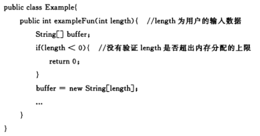

# 简介

Java编译与解释并存： Java 程序要经过先编译，后解释两个步骤，由 Java 编写的程序需要先经过编译步骤，生成字节码（.class 文件），这种字节码必须由 Java 解释器来解释执行。

静态方法不能调用非静态成员：静态方法在类加载的时候就会分配内存，而非静态成员属于实例对象，只有在对象实例化之后才存在，所以静态成员在非静态成员不存在的时候已经存在。

## 重载和重写：
* 重载是同一个方法名不同的参数。
* 重写是子类覆盖父类的方法。

## == 和 equals()

* 对于基本数据类型来说，== 比较的是值。
* 对于引用数据类型来说，== 比较的是对象的内存地址。
* 没有重写 equals() 方法，继承Object类equals()方法，默认实现使用 ==。
* 可以重写 equals() 方法来比较具体属性，不过重写时必须要重写 hashcode 方法。

## String、StringBuffer、StringBuilder

* String 类 final 修饰 不可被继承，避免子类破坏String的行为，此外 储存字符的数组也是 final 修饰，所以String实例不可改变，每次对 String 类型进行改变的时候，都会生成一个新的 String 对象，然后将指针指向新的 String 对象。
* StringBuffer 和 StringBuilder 都继承自 AbstractStringBuilder 类，不过 StringBuffer 对方法加了同步锁，是线程安全的，StringBuilder 并没有对方法进行加同步锁，是非线程安全的。
* jdk9 底层 char[] 改为 byte[] ，并使用两种编码 Latin-1（ISO-8859-1） 和 UTF-16，Latin-1 不支持中文，使用单字节编码，当没有中文等 Latin-1 不支持的字符时， byte[] 比 char[] 少一半空间。

String s1 = new String("abc") 可能创建两个字符串对象，当字符串常量池中不存在 abc 时，会创建一个，new 还会创建一个。

String.intern() 是一个 native（本地）方法，如果字符串常量池中没有保存了对应的字符串对象的引用，那就在常量池中创建一个指向该字符串对象的引用并返回。

## 泛型

泛型是指参数化类型，编译器可以对泛型参数进行检测，并且通过泛型参数可以指定传入的对象类型。

Class类就实现了 java.lang.reflect.Type 接口, ParameterizedType 也实现了该接口，Class类保存当前类的基本类型信息，ParameterizedType则保存了泛型，外部类等额外类型信息。

java.lang.reflect.Type 是Java中所有类型的接口，Type体系中类型的包括：数组类型(GenericArrayType)、参数化类型(ParameterizedType)、类型变量(TypeVariable)、通配符类型(WildcardType)、原始类型(Class)。

没有泛型的时候，只有原始类型，所有的原始类型都通过字节码文件类Class类进行抽象，Class类的一个具体对象就代表一个指定的原始类型。

* Class（原始/基本类型，也叫raw type）：不仅仅包含我们平常所指的类、枚举、数组、注解，还包括基本类型int、float等等。

  ```java
  getSuperclass() //返回直接继承的父类（由于编译擦除，没有显示泛型参数）
  getGenericSuperclass() //返回直接继承的父类（包含泛型参数） 1.5后提供
  ```
* TypeVariable（类型变量）：比如List<T>中的T等。

  ```java
  public interface TypeVariable<D extends GenericDeclaration> extends Type, AnnotatedElement {
  	//类型对应的上限，默认为Object  可以有多个
      Type[] getBounds();
      //获取声明该类型变量实体，也就是TypeVariableTest< T>中的TypeVariableTest
      D getGenericDeclaration();
      //获取类型变量在源码中定义的名称；
      String getName();
      // JDK8新增的
      AnnotatedType[] getAnnotatedBounds();
  }
  ```

* WildcardType（ 泛型表达式类型）：例如List< ? extends Number>这种。

  ```java
  public interface WildcardType extends Type {
  	//获得泛型表达式上界（上限） 获取泛型变量的上边界（extends）
  	Type[] getUpperBounds();
  	//获得泛型表达式下界（下限） 获取泛型变量的下边界（super）
  	Type[] getLowerBounds();
  }
  ```

* ParameterizedType（参数化类型）：就是所用到的泛型List、Map（注意和TypeVariable的区别）。

  ```java
  public interface ParameterizedType extends Type {
  	//获取类型内部的参数化类型 比如Map<K,V>里面的K，V类型
  	Type[] getActualTypeArguments();
  	// 类的原始类型，一般都是Class
  	Type getRawType();
  	// 获取所有者类型（只有内部类才有所有者，比如Map.Entry他的所有者就是Map），若不是内部类，此处返回null
      Type getOwnerType();
  }
  ```

* GenericArrayType（数组类型）：并不是我们工作中所使用的数组String[] 、byte[]（这种都属于Class），而是带有泛型的数组，即T[] 泛型数组。

  ```java
  public interface GenericArrayType extends Type {
  	//返回泛型数组中元素的Type类型，即List<String>[] 中的 List<String>
  	Type getGenericComponentType();
  }
  ```

# 漏洞说明
1. 不可控的内存分配：内存分配又用户输入，但是没有对用户输入数据进行校验。

  

2. 不可信的命令：命令由用户输入，但没有校验。

  

  

3. 不可信的路径：路径中包含 .. ，使搜索路径定位到允许访问的目录外。

  

  

  

4. SQL注入。
5. 代码注入。
6. 异常抛出敏感信息到前端。
7. 敏感信息不写入日志文件。
8. Cookie中不保存敏感信息，Cookie需要设置 secure 属性为true，Cookie信息需进验证才可信。
9. 输入条件未检查。

  

10. 未限制上传文件类型，可能上传危险文件。

  

11. 对需要通信的数据进行脱敏处理，例如密码。
12. 违反信任边界，不受信任的数据移向受信任的一边时需要经过验证。
13. 明文口令存储。
14. 储存可恢复的口令。
15. referer字段不可用来鉴别身份。
16. 使用不充分的随机数，应使用 SecureRandom。
17. XSS，加强输入校验。

  

18. crsf，增加token。
19. 设置 x-frame-options=DENY 禁止页面被任何页面加载。
