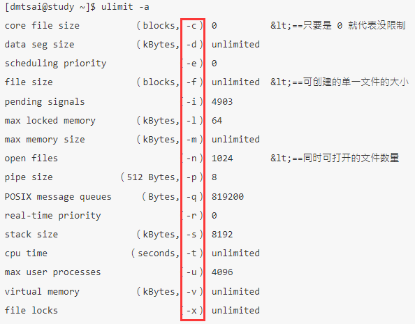
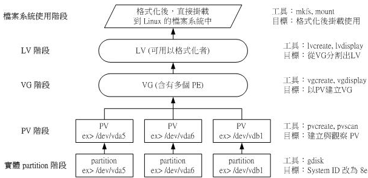
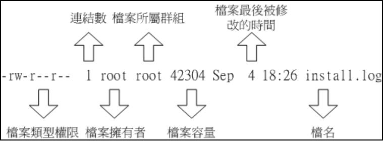
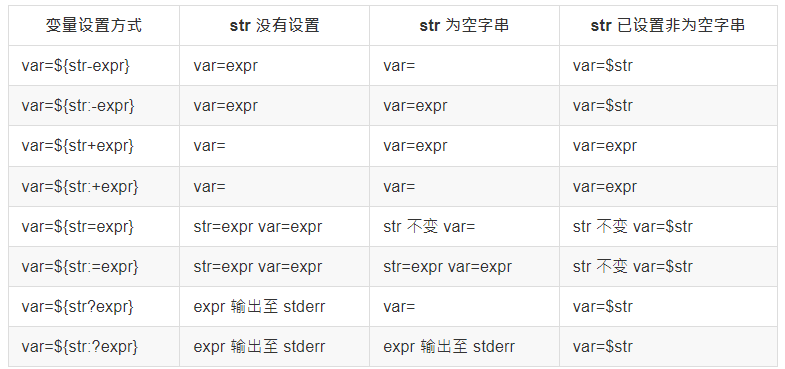
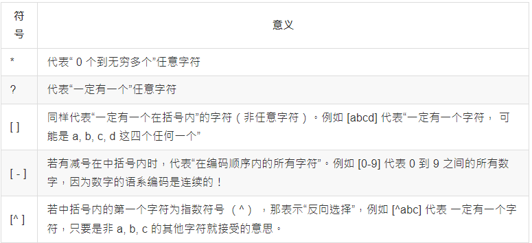
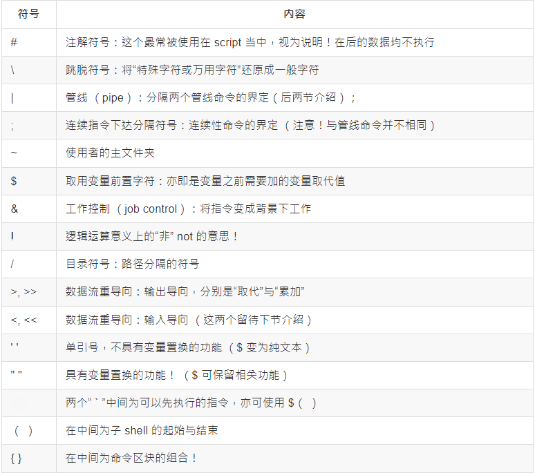
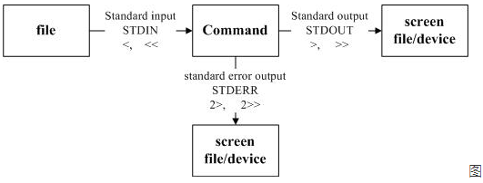
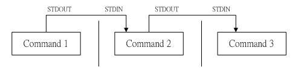
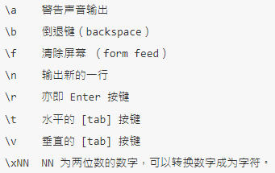
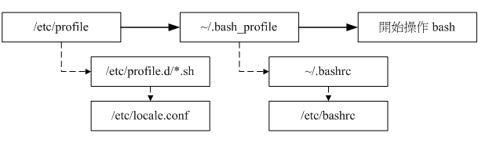

# 磁盘规划

## 设备

Linux 系统中，每个设备都会当成一个文件。


设备文件名和插槽顺序无关，和检测顺序有关，检测顺序决定文件名的先后。

## 磁盘

硬盘通常由重叠的一组盘片构成，每个盘面都被划分为数目相等的磁道，并从外缘的“0”开始编号，具有相同编号的磁道形成一个圆柱，称之为磁盘的柱面。
磁盘的柱面数与一个盘面上的磁道数是相等的。由于每个盘面都有自己的磁头，因此，盘面数等于总的磁头数。
扇区是硬盘的最小存储单位，扇区有两种大小设计，512B 和 4KB。
操作系统为方便操作将多个扇区合在一起操作，叫做块。操作系统是通过块来做为单位操作数据。文件系统操作文件的最小单位是块。

### 磁盘分区

磁盘分区有 MBR 和 GPT 两种格式。扇区是分区的最小单位。

分区的作用：

* 数据安全性：每个分区的数据是分开的，例如重装系统时，可以只操作C盘，其他盘保持不动。
* 性能考虑：分区数据集中在某个柱面区段内，可以更快的查找到数据。

#### MBR(MasterBootRecord)

MBR 是指硬盘的一个扇区，总共 512B，其中分为 记录启动引导程序区 和 分区表：

* 主引导记录：安装启动引导程序的地方，有 446 字节。
* 分区表：记录硬盘的分区状态，共 64 字节，每 16 字节记录一个分区，所以最多能记录四组分区，分区的名称为 /dev/sd[a-p][1-9],例如 /dev/sda1 。
* 校验码：两个字节， 0x55 和 0xAA ，表明设备可以启动。

4组分区信息，可以是主分区也可以是 扩展分区，扩展分区最多只存在一个，扩展分区通过划分逻辑分区来超过4个分区的限制，逻辑分区的设备名称号码从5开始，1-4 保留给 主分区。

缺点：

* 一个分区最大容量为2TB。
* MBR仅有一个块，被破坏后，很难恢复。
* MBR存放引导程序仅有446字节，无法储存较多的程序代码。

#### GPT(GUID partition table)

GPT 使用 逻辑区块地址LBA,Logical Block Address 来储存分区信息。每个LBA有512字节。GPT 总共使用前面 34 个LBA来储存分区信息，同时使用最后的34LBA来做备份。

* LBA0：MBR兼容块，前 446 字节储存第一阶段的启动引导程序，原本的分区表只存在一个分区，仅放入一个特殊标识，识类型为EE分区，即保护性分区。如果不能识别GPT的管理程序，就不会认识这块磁盘，进一步包含了磁盘。
* LBA1：GPT表头记录，记录分区表的位置和大小，同时也记录备份分区表的位置，另外还记录了分区表的校验码，操作系统根据这个校验码来判断GPT是否正确，若错误，可通过备份分区表来恢复GPT的正常运行。
* LBA2-LBA33：记录分区信息，每个LBA可以记录4组分区，默认情况下可以有 4x32 = 128 组记录，每组记录 128 字节，可储存 2^30 TB。

#### 挂载

Linux 中所有的文件都是有根目录("/")衍生形成目录树。


磁盘分区通过挂载在目录树上提供给用户访问，挂载就是利用一个目录作为进入点，将磁盘分区的数据放置在该目录下，进入该目录就可以读取该分区。

#### 分区规划

* / ：根目录，与启动系统有关，应该越小越好，当系统错误时，恢复更快，没有挂载分区的目录都属于根目录，50GB 。
* /boot ：启动与内核文件，3GB 。
* /usr ：unix software resources，与软件的安装和执行有关，很多软件的默认安装目录为 /usr/local ，相当于windows的 program files，100GB。
* /home ：用户的主目录，每个用户都有自己的目录，一般目录名以用户账号命名，如果是桌面系统，该目录需要较大储存，50GB。
* swap ：swap分区，一般为内存的2倍，8GB。
* /var ：variable，与系统运行过程有关，比如日志，数据库内容等待，如果是服务器需要较大空间，100GB。
* efi ：引导盘，200MB。
* /tmp : 存放临时文件，20G。

自定义目录：

* /download：存放下载文件，50G。
* /data：存放数据，100G。
* /opt：存放附件应用，50G。
* /backup：存放备份文件，100G。


除此之外还有一些系统默认目录：

* /dev ：存放的是 Linux 的外部设备，在 Linux 中访问设备的方式和访问文件的方式是相同的。
* /etc ：存放所有的系统管理所需要的配置文件。
* /lib ：存放着系统最基本的动态连接共享库，几乎所有的应用程序都需要用到这些共享库。
* /media ：linux 系统会自动识别一些设备，例如U盘、光驱等等，当识别后，Linux 会把识别的设备挂载到这个目录下。
* /mnt ：临时挂载目录，为了让用户临时挂载别的文件系统的，我们可以将光驱挂载在 /mnt/ 上，然后进入该目录就可以查看光驱里的内容。
* /proc ：/proc 是虚拟文件系统，存储的是当前内核运行状态的一系列特殊文件，这个目录是一个虚拟的目录，它是系统内存的映射，我们可以通过直接访问这个目录来获取系统信息。
* /sbin ：超级用户的二进制文件，这里存放的是系统管理员使用的系统管理程序。
* /usr/bin ：系统用户使用的应用程序。
* /usr/sbin ：超级用户使用的比较高级的管理程序和系统守护程序。
* /usr/src ：内核源代码默认的放置目录。
* /run ：临时文件系统，存储系统启动以来的信息。当系统重启时，这个目录下的文件应该被删掉或清除。

## 文件系统管理

### 读取 /etc/passwd 文件数据流程

1. / 的 inode： 通过挂载点的信息找到 inode 号码为 128 的根目录 inode，且 inode 规范的权限让我们可以读取该 block 的内容（有 r 与 x） ；
2. / 的 block： 经过上个步骤取得 block 的号码，并找到该内容有 etc/ 目录的 inode 号码 （33595521）；
3. etc/ 的 inode： 读取 33595521 号 inode 得知 dmtsai 具有 r 与 x 的权限，因此可以读取 etc/ 的 block 内容；
4. etc/ 的 block： 经过上个步骤取得 block 号码，并找到该内容有 passwd 文件的 inode 号码 （36628004）；
5. passwd 的 inode： 读取 36628004 号 inode 得知 dmtsai 具有 r 的权限，因此可以读取 passwd 的 block 内容；
6. passwd 的 block： 最后将该 block 内容的数据读出来。

### 新增文件流程

1. 先确定使用者对于欲新增文件的目录是否具有 w 与 x 的权限，若有的话才能新增。
2. 根据 inode bitmap 找到没有使用的 inode 号码，并将新文件的权限/属性写入。
3. 根据 block bitmap 找到没有使用中的 block 号码，并将实际的数据写入 block 中，且更新 inode 的 block 指向数据。
4. 将刚刚写入的 inode 与 block 数据同步更新 inode bitmap 与 block bitmap，并更新 superblock 的内容。

### 挂载

* 单一文件系统不应该被重复挂载在不同的挂载点（目录）中。
* 单一目录不应该重复挂载多个文件系统。
* 要作为挂载点的目录，理论上应该都是空目录才是。

如果挂载的目录并不为空，挂载文件系统之后，原目录下的东西就会暂时的消失，等到新分区被卸载之后，则 原本的内容 会重新显示。

### 制作 Linux u盘启动盘

1. `umount` 卸载U盘。
2. `mkfs.vfat -I /dev/sdb` 格式化U盘为FAT格式。
3. `dd if=*/*.iso   of=/dev/sdb  bs=4M `。
4. `sync`同步缓存中的数据至U盘。

### 文件系统及程序限制

ulimit -a：列出所有的限制，同时会提示设置某一项使用什么参数



### 磁盘阵列

磁盘阵列名称为 /dev/md0 、 /dev/md1 等。

1. RAID0：性能最好，使用型号、容量相同效果最好，RAID会将磁盘切出等量的数据块chunk，一般 4KB - 1MB，每当要写入文件时，根据chunk切割，依序放入各个磁盘，数据被等量放入各个磁盘。
   * 磁盘越多性能越好。
   * 只要有一块磁盘损坏，所有数据丢失。
2. RAID1：镜像模式，两组磁盘数据一样，同一份数据写入两次，容量整体变小一半，大量写入时，性能可能特别差。
3. RAID1+0：先组RAID1再组RAID0，常用于服务器
4. RAID5：和RAID0类似，不过在每块盘除了记录自身数据外，还会记录其他盘的备份数据，支持一块磁盘损坏，总容量会是整体容量减1，最少需要3块硬盘，常用于备份。

硬件磁盘阵列：使用磁盘阵列卡组建。
软件磁盘阵列：使用软件模拟，会消耗系统资源，比如CPU、IO总线等等。

创建：`mdadm --create /dev/md[0-9] --auto=yes --level=[015] --chunk=NK  --raid-devices=N --spare-devices=N /dev/sdx /dev/hdx...`

> --create          ：为创建 RAID 的选项；
> --auto=yes        ：决定创建后面接的软件磁盘阵列设备，亦即 /dev/md0, /dev/md1...
> --chunk=Nk        ：决定这个设备的 chunk 大小，也可以当成 stripe 大小，一般是 64K 或 512K。
> --raid-devices=N  ：使用几个磁盘 （partition） 作为磁盘阵列的设备
> --spare-devices=N ：使用几个磁盘作为备用 （spare） 设备
> --level=[015]     ：设置这组磁盘阵列的等级。支持很多，不过建议只要用 0, 1, 5 即可
> --detail          ：后面所接的那个磁盘阵列设备的详细信息

管理：`mdadm --manage /dev/md[0-9] [--add 设备] [--remove 设备] [--fail 设备] `

开机自动挂载：
1. 查询uuid：`mdadm --detail /dev/md0 | grep -i uuid`
2. 配置/etc/mdadm.conf：`ARRAY /dev/md0 UUID=2256da5f:4870775e:cf2fe320:4dfabbc6`

示例：
`mdadm --create /dev/md0 --auto=yes --level=5 --chunk=256K  --raid-devices=4 --spare-devices=1 /dev/vda{5,6,7,8,9}`
格式化: `mkfs.xfs -f -d su=256k,sw=3 -r extsize=768k /dev/md0`

srtipe （chunk） 容量为 256K，所以 su=256k
共有 4 颗组成 RAID5 ，因此容量少一颗，所以 sw=3
数据宽度为： 256K*3=768k

### LVM

LVM 可以弹性调整文件系统的容量，将几个实体的分区(或者磁盘) 通过软件组合成为一块逻辑的大磁盘 ，然后将这块大磁盘再经过分区成为可使用逻辑分区 ，格式化后就能够挂载使用。

#### 名称解释

* 物理卷（PV，Physical Volume）：通过将分区的系统标识符调整成 8E ， 然后使用 pvcreate 将其转为 LVM 的底层物理卷，调整 system ID 可通过 gdisk 设置 `hex code or GUID` 这一项，默认为 8300 ,表示为 Linux filesystem 。
* 卷组（VG，Volume Group）：组合起来的逻辑大磁盘，由多个PV构成。
* 物理扩展块（PE，Physical Extent）：LVM 的最小储存单位，类似 block，默认大小为 4M，LVM 的扩充是通过加入PE实现的。
* 逻辑卷（LV，Logical Volume）：最后使用的逻辑分区，由VG切割而成，设备名通常为  `/dev/[vgname]/[lvname] `。

写入机制：

* 线性模式 （linear）：默认模式，多个分区加入VG时，一个分区一个分区写入数据。例如：/dev/vda1, /dev/vdb1 加入 VG 当中，并且整个 VG 只有一个 LV ，当 /dev/vda1 的容量用完，/dev/vdb1 的硬盘才会被使用。
* 交错模式 （triped）：类似于RAID0，将数据拆成两部分，分别写入 /dev/vda1 与 /dev/vdb1 ，理论上，读写的性能会比较好，但任何一个分区数据损坏时，所有数据就损坏，不建议使用，LVM主要用于弹性扩展，性能提升还是使用RAID。

#### 创建LVM



1. 使用 gdisk 修改系统标识符。
2. PV阶段：
  * pvcreate ：将实体 partition 创建成为 PV ，例如：`pvcreate /dev/vda{5,6,7,8}`。
  * pvscan ：搜寻目前系统里面任何具有 PV 的磁盘。
  * pvdisplay ：显示出目前系统上面的 PV 状态。
  * pvremove ：将 PV 属性移除，让该 partition 不具有 PV 属性。
3. VG阶段：
  * vgcreate ：创建VG，例如：`vgcreate [VG名称] [PV名称]`。
  * vgscan ：搜索系统上的VG。
  * vgdisplay ：显示目前系统上面的 VG 状态。
  * vgextend ：在 VG 内增加额外的 PV 。
  * vgreduce ：在 VG 内移除 PV。
  * vgchange ：设置 VG 是否启动。
  * vgremove ：删除一个 VG 啊。
4. LV阶段：
  * lvscan ：查询系统上面的 LV 。
  * lvcreate ：创建 LV ，例如：`lvcreate -L [容量] -n [LV名称] [VG名称]`。
  * lvdisplay ：显示系统上面的 LV 状态。
  * lvextend ：增加容量。
  * lvreduce ：减少容量。
  * lvremove ：删除。
  * lvresize ：调整大小，例如：`lvresize -L +[容量] /dev/[vgname]/[lvname]`,再格式化新加入部分 `xfs_growfs [挂载目录]`
5. 文件系统阶段：
  * 格式化：`mkfs.xfs /dev/[vgname]/[lvname]`。
  * 挂载。

#### 快照

LVM可以建立快照，分为快照区和系统区，修改过的数据会被复制到快照区，没有修改过的数据和系统区共享。

1. 创建快照：`lvcreate -s -l [PE块数量] -n [快照名字] /dev/[vgname]/[需要创建快照的LVname]`。

### 操作

| 功能                                                                                        | 操作       | 参数                                                                                                                                                                                                                                                                                                                                                       |
| ------------------------------------------------------------------------------------------- | ---------- | ---------------------------------------------------------------------------------------------------------------------------------------------------------------------------------------------------------------------------------------------------------------------------------------------------------------------------------------------------------- |
| 列出文件系统整体磁盘使用情况，读取超级块信息                                                | df         | -h 方便人阅读 </br>  Filesystem  表示那个分区，列出设备名称                                                                                                                                                                                                                                                                                                |
| 查看文件系统的磁盘使用量，通过搜索文件来计算每个文件的大小然后累加                          | du         | df>du 的情况：  </br> 1.  du命令是用户级的程序，它不考虑元数据。</br>2.  用户删除一个正在运行的应用所打开文件，du会减去该大小，df不会，直到运行的应用被关闭才会减去。</br> 3. 用户写入已被删除的文件。</br> 因为当我们删除一个文件的时候，这个文件不是马上就在文件系统当中消失了，而是暂时消失了，当所有程序都不用时，才会根据OS的规则释放掉已经删除的文件 |
| 链接                                                                                        | ln         | -s 软链接 ，默认使用硬链接                                                                                                                                                                                                                                                                                                                                 |
| 列出磁盘列表                                                                                | lsblk      |                                                                                                                                                                                                                                                                                                                                                            |
| 列出磁盘的分区表类型与分区信息                                                              | parted     | 示例：parted [设备名称] print                                                                                                                                                                                                                                                                                                                              |
| 磁盘分区                                                                                    | gdisk      | 选项 </br>    d：删除分区。  </br> n：增加分区。 </br> p：打印分区表。 </br> q：不保存分区离开gdisk。 </br> w：保存分区操作后离开。  </br> ?：查看help文档。  </br> 新建分区时关注 Last sector 值，可使用 +5G 这样方式设置。                                                                                                                               |
| 分区后更新Linux内核分区表信息，或者重启                                                     | partprobe  | -s 显示详细信息                                                                                                                                                                                                                                                                                                                                            |
| 分区之后格式化xfs系统                                                                       | mkfs.xfs   | -f: 如果已有文件系统，强制格式化 </br>   -b：块容量，512B - 64K，linux 最大4K                                                                                                                                                                                                                                                                              |
| 分区之后格式化ext4系统 ，格式化为其他系统可使用 mkfs [tab] [tab] 提示，mkswap格式化swap分区 | mkfs.ext4  | -b ：块大小，1k，2k，4k                                                                                                                                                                                                                                                                                                                                    |
| 挂载分区                                                                                    | mount      | 示例：mount  [文件目录] [ 挂载点]                                                                                                                                                                                                                                                                                                                          |
| 卸载分区                                                                                    | umount     | -f 强制卸载                                                                                                                                                                                                                                                                                                                                                |
| 启动自动挂载                                                                                | /etc/fstab | 根目录必须最先被挂载                                                                                                                                                                                                                                                                                                                                       |
| 打包文件                                                                                    | tar        | -x：解包。 </br>   -c：打包。  </br> -t：查看包内容。  </br>   -z：使用gzip算法,后缀.gz。 </br>  -j：使用bzip2算法,后缀.bz2。  </br>  -J：使用xz算法,后缀.xz。  </br>  -C：解压到什么目录。 </br>  时间：gzip > bzip2 > xz  </br>  压缩率：xz > bzip2 > gzip                                                                                               |
| 备份                                                                                        | dd         |示例： dd if=[设备或者文件] of=[设备或者文件] <br> if ：输入 of：输出 <br>                                                                                                                                                                                                                                                                                                                                                        |

# 文件、目录、磁盘格式

## 权限

任何文件都有用户、所属群组、其他人三种身份的权限。
默认情况下系统上所有用户记录在 /etc/passwd 中，密码记录在 /etc/shadow 中，组名记录在 /etc/group 中。



1. 第一列代表文件的类型与权限（10个字符）：
   * 第一个字符代表文件类型
     - d代表目录。
     - `-`代表文件。
     - l代表链接文件。
     - b代表可按块随机读写的设备。
     - c代表字符串行端口设备，如键盘鼠标。
   * 后九个字符，每3个为一组，均为 r(可读)、w（可写）、x（可执行）三个字符参数的组合，这三个参数的位置固定，没有相应权限则标为`-`。
   * 三组权限的对应对象分别为 文件所有者、 同用户组 和 其他非本用户组。
2. 第二列表示有多少文件名连接到inode，每个文件名都会链接到一个inode，inode 记录inode 编号、文件大小、访问权限、创建时间、修改时间、数据在磁盘的位置等等。
3. 第三列表示所有者账号。
4. 第四列表示所属用户组。
5. 第五列表示文件大小，单位为字节。
6. 第六列表示创建时间或修改时间，可通过 ls -l --full-time 显示完整时间。
7. 第七列表示文件名：以'.'开头的为隐藏文件。

### 改变文件属性与权限

1. 改变所属用户组：chgrp  组名必须在/etc/group中存在
   用法：chgrp [-R] 组名 目录名/文件名
   -R 表示递归修改子目录。

2. 改变文件所有者：chown 用户名必须在/etc/passwd中有记录
   用法：chown [-R] 账号名称[:组名] 文件/目录
   可以同时修改组名。
   当使用cp命令复制时，会复制执行者的属性与权限，此时需要修改所有者和用户组，使得目标用户可以修改。

3. 改变文件权限: chmod
   * 使用数字修改权限：r—4、w—2、x—1，例如 chmod 777 .bashrc   其中 7 = 4 + 2 + 1 = rwx
   * 符号类型改变权限：u—user、g—group、o—others、a—all，例如 chmod u=rwx,go=rx .bashrc　　中间权限设置是连在一起的，无空格

4. Linux文件种类与扩展名

   * 文件种类（`-`）：纯文本文件、二进制文件、数据格式文件。
   * 目录（`d`）。
   * 连接文件（`l`）。
   * 设备与设备文件（device）：与系统外设及存储相关的文件，一般位于/dev目录。
     块设备文件：第一个属性为b，提供系统随机访问的接口设备，如硬盘、软盘等，可以随机地在硬盘的不同块进行读写。
     字符设备文件：第一个属性为c，串行端口的接口设备，如键盘、鼠标等；特征为“一次性读取”，不能够截断输出，如不能让鼠标直接“跳到”另一界面，而是“滑动”到目标位置。
   * 套接字（sockets）：第一个属性为s，数据接口文件，通常用于网络数据连接，位于/var/run目录。
   * 管道（FIFO，pipe）：第一个属性为p，解决多个程序同时访问一个文件所造成的错误问题，first-in-first-out（FIFO）。

文件扩展名仅有指示说明的意义，具体是否可执行由x属性决定：
* `*.sh`：脚本或批处理文件（scripts）。
* `*.Z`、`*.tar`、`*.tar.gz`、`*.zip`、`*.tgz`：经过打包的压缩文件。
* `*.html`、`*.php`：网页相关文件。

#### 文件特殊权限

例如：chmod 7755 filename，特殊权限在第一位。

* 4 为 SUID：用在二进制程序上，执行程序过程中拥有程序拥有者的权限。例如：-rwsr-xr-x
* 2 为 SGID：用在二进制程序和目录，执行过程中拥有程序用户组的权限。例如：-rwxr-sr-x
* 1 为 SBIT：用在目录上，在此目录中自己创建的文件，只能由自己或者root用户才能删除。例如：-rwxr-xr-t

### 目录与文件的权限意义

1. 文件的权限

* r：可以读取文件。
* w：可以编辑、新增或者修改文件内容（不包括删除）。
* x：该文件具有可以被系统执行的权限。

2. 目录的权限

* r：可以读取目录结构列表，即可以利用ls命令查看目录下的文件名数据
* w：可以更改目录结构列表，包括新建文件与目录、删除文件与目录（无论文件权限如何）、重命名文件与目录、移动文件与目录等与“文件名变动”有关的操作
* x：代表用户可以进入该目录称为工作目录

要开放目录给任何人浏览，至少需要给予r和x权限，否则他人无法进入目录读取文件。
仅有r的情况下，用户仅能读取文件名列表，但是不能获取详细信息。

## 文件与目录管理

### 操作

| 功能                           | 操作       | 参数                                                                                                                                                                                                                                                                                                   |
| ------------------------------ | ---------- | ------------------------------------------------------------------------------------------------------------------------------------------------------------------------------------------------------------------------------------------------------------------------------------------------------ |
| 改变目录                       | cd         |                                                                                                                                                                                                                                                                                                        |
| 显示当前所在目录               | pwd        | -P 显示链接路径，即快捷方式指向的路径                                                                                                                                                                                                                                                                  |
| 创建新目录                     | mkdir      | -m 777 直接配置权限 </br> -p 递归创建目录                                                                                                                                                                                                                                                              |
| 删除空目录                     | rmdir      | -p     如果上一级是空目录也一起删除                                                                                                                                                                                                                                                                    |
| 文件和目录查看                 | ls         | -a 全部文件，包括隐藏文件 </br> -l 列出权限等数据，常使用 ll -h <br>  -t 时间排序 </br> -r 倒序                                                                                                                                                                                                        |
| 复制                           | cp         | -i 是否覆盖提示 <br> -r 递归复制 </br> -p 复制时权限一起复制，默认权限为命令执行者的权限                                                                                                                                                                                                               |
| 删除                           | rm         | -f 强制删除，不会有警告信息 </br> -i 删除前询问 -r 递归删除                                                                                                                                                                                                                                            |
| 移动                           | mv         | -f 强制移动，不会有警告信息 </br> 询问是否覆盖                                                                                                                                                                                                                                                         |
| 查看文件内容                   | cat        | -n 显示行号 </br> -A 显示所有字符   ^\| =[tab]键   $=行尾符号                                                                                                                                                                                                                                          |
| 查看并搜索内容                 | less       | 空白键：向下翻动一页 </br> [pagedown]：向下翻动一页  </br> [pageup]  ：向上翻动一页  </br>  /字串     ：向下搜寻『字串』的功能  </br>  ?字串     ：向上搜寻『字串』的功能  </br>  n：重复前一个搜寻 (与 / 或 ? 有关！)  </br>  N：反向的重复前一个搜寻 (与 / 或 ? 有关！)  </br> q：离开 less 这个程序 |
| 数据截取                       | tail、head | -100f 持续刷新显示100行内的数据                                                                                                                                                                                                                                                                        |
| 按指定进制显示文件             | od         | -t [type] 按照类型显示 a 默认字符 c ASCII字符 d 十进制 x 16进制                                                                                                                                                                                                                                        |
| 创建新文件                     | touch      |                                                                                                                                                                                                                                                                                                        |
| 脚本文件查找，根据PATH路径查找 | which      |                                                                                                                                                                                                                                                                                                        |
| 查找部分路径文件               | whereis    | -l 列出查询的目录 </br> -b 查找二进制文件                                                                                                                                                                                                                                                              |
| 根据数据库查找                 | locate     | -i 忽略大小写 </br> -r 根据正则表达式查找 </br> 可以通过 updatedb 来更新数据库 </br> 可以模糊查询                                                                                                                                                                                                                         |
| 查找硬盘                               |           find | -name 查找文件名称，可用 * 默模糊查询 </br> -type 查找文件类型，例如 f,b,c,l,s,p </br> -exec ls -l {} \ 执行额外操作，-exec 开始 \ 结束 {} 为 find 结果                                                                                                                                                                                                                                                                                                       |
# 用户与权限

用户ID：UID，用户组ID，GID：记录在/etc/passwd中。

/etc/passwd 每一行表示一个账号，例如：root:x:0:0:root:/root:/bin/bash
使用:分隔，总共7个字段：
1. 用户名。
2. 密码：由于密码存在 /etc/shadow ,这里显示x.
3. UID：0 系统管理员 1-999 系统账号(比如nginx账号)  1000 - 60000 可登陆账号
4. GID
5. 账号描述。
6. home目录位置。
7. 登陆后使用什么shell，当设置为 /sbin/nologin 将无法登陆。

/etc/shadow 同样使用 : 分隔,总共9个字段，例如 root:$6$wtbCCce/PxMeE5wm$KE2IfSJr.YLP7Rcai6oa/T7KFhO...:16559:0:99999:7:::
1. 用户名。
2. 密码。
3. 最近修改密码日期：使用19700101 到现在天数。
4. 密码可以多少天修改一次。
5. 需要在多少天内再次修改密码，否则过期，过期后用户依然可以登陆，但是会强制用户重新设置密码。
6. 还剩多少天必须修改密码时提醒用户。
7. 过期后账号过多少天如果不修改密码直接失效，用户将无法登陆。
8. 账号失效日期。
9. 保留字段。

/etc/group 使用 : 分隔,总共4个字段，例如 root:x:0:dmtsai,alex
1. 组名。
2. 组密码，这里显示x，密码储存在 /etc/gshadow。
3. GID。
4. 加入组的用户。
记录在/etc/passwd中的GID叫做初始用户组，用户一登录就拥有，记录在/etc/group在加入其他组叫做次要用户组，可通过 groups 查询当前用户所在组，排在第一位的叫做有效用户组，当创建新文件等操作时默认使用有效用户组。
可以通过 `newgrp [用户组]` 切换有效用户组，并且使用另外一个shell环境，使用 exit 退出当前有效用户组。

/etc/gshadow 使用 : 分隔,总共4个字段，例如 root:::
1. 组名。
2. 组密码。
3. 群组管理员的帐号。
4. 加入组的用户，和 /etc/group 相同。

## 操作

| 功能                 | 操作     | 参数                                                                                                                                              |
| -------------------- | -------- | ------------------------------------------------------------------------------------------------------------------------------------------------- |
| 增加用户             | useradd  | -g：初始用户组 </br> -G：次要用户组  </br> -r：建立系统账号 </br> 默认会建立与账号一样的组，在 /home/账号名 建家目录，权限700，系统账号没有家目录 |
| 修改密码             | passwd   | 默认修改本账号，可以后面跟账号名称修改其他账号                                                                                                    |
| 修改用户             | usermod  |                                                                                                                                                   |
| 删除用户             | userdel  | -r：删除家目录                                                                                                                                    |
| 新增用户组           | groupadd | -r：建立系统用户组                                                                                                                                |
| 删除用户组           | groupdel |                                                                                                                                                   |
| 切换用户             | su       | 获取的是非登录shell                                                                                                                               |
| 使用其他用户身份执行 | sudo     | -u：想要获得的用户 </br> -b：后台执行任务 </br> 是否能够sudo需要根据 /etc/sudoers                                                                 |
| 修改/etc/sudoers     | visudo   | 使用者帐号  登陆者的来源主机名称=（可切换的身份）  可下达的指令 </br> root                         ALL=(ALL)           ALL                        |

# 进程管理

后台执行：在命令最后使用 & ，或者使用 ctrl + z 将前台任务丢到后台去暂停，jobs -r 查看后台任务，可使用 -l 查看pid，让后台暂停的任务继续执行 bg %[jobs -r 查看的任务编号]

前台执行：fg %[jobs -r 查看的任务编号]

kill: -9 强制结束一个任务  -15 以正常方式结束一个任务。

脱机管理：& 只是让任务后台执行，用户注销后任务就会停止，要想能脱机运行，可以使用 nohup 添加到任务前面。

## 查看进程

1. 查看自己bash进程：ps -l

  ```bash
  F S   UID    PID   PPID  C PRI  NI ADDR SZ WCHAN  TTY          TIME CMD
  ```

  * F : 表示程序权限，4为root权限， 1 为该子程序仅进行复制（fork）而没有实际执行（exec）。
  * S : 表示进程状态：
    1. R （Running）：该程序正在运行中。
    2. S （Sleep）：该程序目前正在睡眠状态（idle），但可以被唤醒（signal）。
    3. D ：不可被唤醒的睡眠状态，通常程序可能在等待 I/O （例如：打印）
    4. T ：停止状态（stop），可能是在任务暂停或跟踪 （traced） 状态；
    5. Z （Zombie）：僵尸状态，程序已经终止但却无法被移除至内存外。
  * UID/PID/PPID：用户ID/PID/父进程PID 。
  * C：代表 CPU 使用率，单位为百分比。
  * PRI/NI：优先级，越小越快被执行。
  * ADDR/SZ/WCHAN：ADDR表示该程序在内存的哪个部分，如果是 running 的程序，一般就会显示`-`,  SZ 代表此程序用掉多少内存, WCHAN 表示目前程序是否运行中，若为 `-` 表示正在运行中。
  * TTY：登陆者的终端位置，若为远端登陆则使用动态终端接口 （pts/n）。
  * TIME：程序实际花费 CPU 运行的时间，而不是系统时间。
  * CMD：程序的触发指令。

2. 查看所有系统运行的进程：ps aux

  ```bash
  USER        PID %CPU %MEM    VSZ   RSS TTY      STAT START   TIME COMMAND
  ```

  * RSS：常驻内存，用于表示进程使用了多少内存（RAM中的物理内存），RSS不包含已经被换出的内存。RSS包含了它所链接的动态库并且被加载到物理内存中的内存。RSS还包含栈内存和堆内存。
  * VSZ：虚拟内存大小，它包含了进程所能访问的所有内存，包含了被换出的内存，被分配但是还没有被使用的内存，以及动态库中的内存。

3. 动态查看进程状态：top

  按键命令：
    *  P ：以 CPU 的使用资源排序显示。
    *  M ：以 Memory 的使用资源排序显示。
    *  N ：以 PID 来排序喔。
    *  T ：由该 Process 使用的 CPU 时间累积 （TIME+） 排序。

  ```bash
  top - 00:53:59 up  6:07,  3 users,  load average: 0.00, 0.01, 0.05
  Tasks: 179 total,   2 running, 177 sleeping,   0 stopped,   0 zombie
  %Cpu（s）:  0.0 us,  0.0 sy,  0.0 ni,100.0 id,  0.0 wa,  0.0 hi,  0.0 si,  0.0 st
  KiB Mem :  2916388 total,  1839140 free,   353712 used,   723536 buff/cache
  KiB Swap:  1048572 total,  1048572 free,        0 used.  2318680 avail Mem

   PID USER      PR  NI    VIRT    RES    SHR S  %CPU %MEM     TIME+ COMMAND
  ```

  * 第一行依次是：开机时间、目前运行多长时间、现在在线用户、1, 5, 15 分钟的平均工作负载。
  * 第二行时进程总览。
  * 第三行依次是：wa 参数较为重要。
    1. us 用户空间占用CPU百分比
    2. sy 内核空间占用CPU百分比
    3. ni 用户进程空间内改变过优先级的进程占用CPU百分比
    4. id 空闲CPU百分比
    5. wa 等待输入输出的CPU时间百分比
    6. hi：硬件CPU中断占用百分比
    7. si：软中断占用百分比
    8. st：虚拟机占用百分比
  * 第四行依次是：物理总内存，空闲内存，使用的物理总内存，作为内核缓冲区内存。
  * 第五行依次是：swap区总量，空闲swap总量，已使用swap总量，缓冲的交换区总量（内存换到swap，再从swap换到内存，该内容未被替换，下次换出时不必再写入交换区）。

4. 查看进程树：pstree -Aup ，需要安装 yum install psmisc

5. 查看线程。
  * ps -T -p [pid]
  * top -H -p [pid]
6. 查看内存使用情况：free
7. 查看内核信息：uname -a
8. 查看系统启动时间以及负载：uptime,也可通过top查看。
9. 查看tcp、udp、unix连接：netstat ，常用：netstat -tnlp
  * -a 显示所有连接
  * -n 显示端口号
  * -p 显示进程id
  * -l 列出正在监听的服务
  * -t tcp
  * -u udp
10. 检测系统资源变化：vmstat [多久检测一次] [检测几次]
  * swpd：虚拟内存被使用的容量。
  * free：未被使用的内存容量。
  * buff：用于缓冲内存。
  * cache：用于高速缓存内存。

  * si：由磁盘中将程序取出的量。
  * so：由于内存不足而将没用到的程序写入到磁盘的 swap 的容量。

  * bi：由磁盘读入的区块数量。
  * bo：写入到磁盘去的区块数量。

  * in：每秒被中断的程序次数。
  * cs：每秒钟进行的事件切换次数。

  * us：非核心层的 CPU 使用状态。
  * sy：核心层所使用的 CPU 状态。
  * id：闲置的状态。
  * wa：等待 I/O 所耗费的 CPU 状态。
  * st：被虚拟机 （virtual machine） 所盗用的 CPU 使用状态。
11. 查找使用文件、目录、端口的进程：`fuser -uv [文件/目录]`,`fuser -v -n tcp [端口]`
12. 列出进程使用的文件名称：lsof。

## /proc/* 的意义

进程的状态信息会写入到 /proc/[PID]/ 目录，另外和系统相关的信息记录在 /proc 下。

cmdline：启动命令。
environ：环境变量。


# 定时任务

## 执行一次的任务

at ：负责处理仅执行一次就结束调度，执行 at 时， 需要 atd 服务。

## 使用

1. 启动atd服务。

  ```bash
  # 重新启动 atd 这个服务
  systemctl restart atd
  # 让这个服务开机就自动启动
  systemctl enable atd
  # 查阅一下 atd 目前的状态
  systemctl status atd
  ```

2. 使用at命令添加任务。

  语法：at [TIME]

  参数：

  > -l  ：at -l 相当于 atq，列出所有该使用者未执行的 at 调度。</br>
  > -d  ：at -d 相当于 atrm ，可以取消一个在 at 调度中的工作。</br>
  > -c  ：显示任务内容，后面接任务编号，例如 at -c 2。</br>

  时间格式：

  > `HH:MM`           例如：     `ex> 04:00`</br>
  > `HH:MM YYYY-MM-DD`  例如：        `ex> 04:00 2015-07-30`</br>
  > `HH:MM[am|pm] [Month] [Date]`  例如：    `ex> 04pm July 30`</br>
  > `HH:MM[am|pm] + number [minutes|hours|days|weeks]` 例如：  `ex> now + 5 minutes` ,   `ex> 04pm + 3 days`

## 执行

1. at 命令会将要运行的以文本文件的方式写入 /var/spool/at/ 目录内，等待 atd 调度。
2. 查询  /etc/at.allow 文件，只有写在这个文件中的用户才能使用 at，没有写在该文件不能执行（即使没有写在 /etc/at.deny）。
3. 如果  /etc/at.allow 不存在，则寻找 /etc/at.deny，写在  /etc/at.deny 中的不能使用 at，没有写在其中的key执行。
4. 如果都不存在，只有root可以执行at。

## 定期循环的任务

crontab ：定期循环的任务，执行 crontab 时， 需要 crond 服务。

## 使用

1. 方法1：

  语法：crontab [选项]

  参数：

  > -e  ：编辑 任务。</br>
  > -l  ：查看所有任务。

  示例：`crontab -e` 会进入 vim，新增一行 `*/5 * * * * /home/dmtsai/test.sh`

2. 方法2：使用 root 用户编辑 /etc/crontab ,内容格式为 `分 时 日 月 周 身份 指令`,每分钟会读取一次该文件的任务到内存，也可以重启 crond 服务来刷新。


## 执行

crond 会读取 `/etc/crontab`，`/var/spool/cron/*`，`/etc/cron.d/*` 三个位置，/etc/cron.d 目录中内容和 /etc/crontab 一样，/var/spool/cron/ 不建议手动编辑，使用 crontab 命令添加。

除此之外， /etc/cron.d/0hourly 会触发 /etc/cron.hourly 目录中文件的执行，执行间隔为 每小时0-5分钟随机一个时间。/etc/cron.hourly/0anacron 会触发 /etc/cron.daily/, /etc/cron.weekly/, /etc/cron.monthly/ 三个目录中文件的执行。

1. crontab 命令会将要运行的以文本文件的方式写入 /var/spool/cron/ 目录内（例如：`/var/spool/cron/[用户名]`），等待 crond 调度。
2. 使用 /etc/cron.allow 和 /etc/cron.deny 来控制权限。
3. 运行日志打印在 /var/log/cron。

### anacron

anacron 由 /etc/cron.hourly/0anacron 触发，每小时执行一次。

语法： anacron [-sfn] [job]

参数：

> -s  ：开始一连续的执行各项工作 （job），会依据时间记录文件的数据判断是否进行。</br>
> -f  ：强制进行，而不去判断时间记录文件的时间戳记。</br>
> -n  ：立刻进行未进行的任务，而不延迟 （delay） 等待时间。</br>
> -u  ：仅更新时间记录文件的时间戳记，不进行任何工作。</br>
> job ：由 /etc/anacrontab 定义的各项工作名称。</br>

 /etc/anacrontab 内容如下：

```bash
SHELL=/bin/sh
PATH=/sbin:/bin:/usr/sbin:/usr/bin
MAILTO=root
RANDOM_DELAY=45           # 随机给予最大延迟时间，单位是分钟
START_HOURS_RANGE=3-22    # 延迟多少个小时内应该要执行的任务时间

1         5        cron.daily         nice run-parts /etc/cron.daily
7        25        cron.weekly        nice run-parts /etc/cron.weekly
@monthly 45        cron.monthly       nice run-parts /etc/cron.monthly
#天数     延迟时间(分钟) 工作名称定义       实际要进行的指令串
```


# vi&vim

编码问题：

* Linux默认支持语系: /etc/locale.conf
* 终端语系：LANG、LC_ALL
* 文件编码。
* 打开终端的软件，一般在软件的工具栏设置。

windows和Linux换行符：

* 可以安装 dos2unix，可使用 `dos2unix [文件列表]` `unix2dos [文件列表]`
* 或者在vim中使用`:set fileformat=unix`

编码转换：`iconv -f [原编码] -t [新编码]`，可使用 `file [filename]` 查看编码

## vi

* 命令模式：删除、复制、粘贴、上下左右移动、翻页、[n]G 移动到第几行、[n]dd 删除向下几行、[n]yy 向下复制几行、p 粘贴到下一行。
* 编辑模式：i、a 光标位置插入，O 向上插入一行
* 命令行模式：`:[n1],[n2] w [filename]` 将n1到n2保存到文件、`:r [filename]` 读取另一个文件追加在后面。

## vim

* 命令行模式：`:set nu` 显示行号。

vim缓存: .swp 后缀
* （O）pen Read-Only：打开此文件成为只读文件。
* （E）dit anyway：用正常的方式打开你要编辑的那个文件， 并不会载入暂存盘的内容。
* （R）ecover：载入暂存盘的内容，用在你要救回之前未储存的工作。 需要手动自行删除那个暂存盘。
* （D）elete it：打开文件前会先将这个暂存盘删除。
* （Q）uit：离开。
* （A）bort：和 Q 一样。

局部区域选择：

* v：选择光标经过字符。
* ctrl+v：选择光标经过矩形区域的字符，常用。
* V：选择光标经过的行。
* y：复制。
* d：删除。
* p：粘贴。

多文件编辑：vim [文件1] [文件2]

* `:n`下个文件。
* `:N`上个文件。
* `:files`打开文件。

# Shell

## Bash
shell程序，/bin/bash 为Linux 默认 shell，替换以前的 /bin/sh。

命令太长使用 \ 换行。

### 变量

设置变量规则：

* 变量与变量内容用一个等号“=”来链接，且等号两边不能有空格。
* 变量名称只能是英文字母与数字，但是开头字符不能是数字。
* 变量内容若有空白字符可使用双引号或单引号将变量内容结合起来：
  * 双引号内的特殊字符如 $ 等，可以保有原本的特性。
  * 单引号内的特殊字符则仅为（纯文本）。
* 若该变量需要在其他子程序执行，则需要以 export 来使变量变成环境变量。
* 取消变量设置用`unset 变量`

| 变量设置方式                                         | 说明                                                                                                                             |
| ---------------------------------------------------- | -------------------------------------------------------------------------------------------------------------------------------- |
| ${变量#关键字} </br> ${变量##关键字}                 | 若变量内容从头开始的数据符合“关键字”，则将符合的最短数据删除 </br>  若变量内容从头开始的数据符合“关键字”，则将符合的最长数据删除 |
| ${变量%关键字} </br>  ${变量%%关键字}                | 若变量内容从尾向前的数据符合“关键字”，则将符合的最短数据删除 </br>  若变量内容从尾向前的数据符合“关键字”，则将符合的最长数据删除 |
| ${变量/旧字串/新字串}  </br>  ${变量//旧字串/新字串} | 若变量内容符合“旧字串”则“第一个旧字串会被新字串取代”  </br>  若变量内容符合“旧字串”则“全部的旧字串会被新字串取代”                |

设置默认值：var=${str:-expr}



### 环境变量

env 查看环境变量。export 设置环境变量。

* PS1：命令提示字符。
* $：当前shell 的 PID。
* ?：上个命令的返回值。成功为 0。

### 特殊符号与统配符





### 数据重定向



1. 标准输入　　（stdin） ：代码为 0 ，使用 < 或 << 。
2. 标准输出　　（stdout）：代码为 1 ，使用 > 或 >> 。
3. 标准错误输出（stderr）：代码为 2 ，使用 2> 或 2>> 。
4. tee [文件名] ：可以输出到屏幕也输出到文件，例如 ls -l /home | tee homefile

单个符号表示 覆盖 如 >、2> ，两个符号表示追加 如 >>、2>> ,所有符号中都没有空格。

< 表示输入，<< 表示结束输入符，例如：

>[dmtsai@study ~]$  cat > catfile << "eof"  </br>
>\> This is a test. </br>
>\> OK now stop </br>
>\> eof  #输入这关键字，立刻就结束而不需要输入 [ctrl]+d

示例：

1. `find /home -name .bashrc > list_right 2> list_error`,这样可以使正确数据输出到list_right，错误数据如权限不够等异常输出到 list_error。
2. `find /home -name .bashrc 2> /dev/null`,/dev/null 是一个特殊的设备，会吃掉任何导向这个设备的信息，这样错误的数据将丢弃，屏幕上显示正确的数据。
3. `find /home -name .bashrc > list 2>&1 `，正确和错误数据都写入list,其中 2>&1 表示 将 2> 转到 1> 去。

| 指令下达情况   | 说明                                                                                                                   |
| -------------- | ---------------------------------------------------------------------------------------------------------------------- |
| cmd1 && cmd2   | 1. 若 cmd1 执行完毕且正确执行（$?=0），则开始执行 cmd2。 </br> 2. 若 cmd1 执行完毕且为错误 （$?≠0），则 cmd2 不执行。  |
| cmd1 \|\| cmd2 | 1. 若 cmd1 执行完毕且正确执行（$?=0），则 cmd2 不执行。 </br>  2. 若 cmd1 执行完毕且为错误 （$?≠0），则开始执行 cmd2。 |

### 管道 pipe



* 管线命令仅会处理 standard output，对于 standard error output 会予以忽略。
* 管线命令必须要能够接受来自前一个指令的数据成为 standard input 继续处理才行。

#### cut & grep

1. `cut -d '分隔字符' -f [取分隔后的第几个]`：用于拆分一行数据。
2. grep：筛选多行数据。

  > -a ：将 binary 文件以 text 文件的方式搜寻数据 </br>
  > -c ：计算找到 '搜寻字串' 的次数 </br>
  > -i ：忽略大小写的不同，所以大小写视为相同 </br>
  > -n ：顺便输出行号 </br>
  > -v ：反向选择，亦即显示出没有 '搜寻字串' 内容的那一行！ </br>

#### 排序 sort & uniq & wc

1. sort：排序

  > -f  ：忽略大小写的差异，例如 A 与 a 视为编码相同 </br>
  > -b  ：忽略最前面的空白字符部分 </br>
  > -M  ：以月份的名字来排序，例如 JAN, DEC 等等的排序方法</br>
  > -n  ：使用“纯数字”进行排序（默认是以文字体态来排序的）</br>
  > -r  ：反向排序</br>
  > -u  ：就是 uniq ，相同的数据中，仅出现一行代表 </br>
  > -t  ：分隔符号，默认是用 [tab] 键来分隔</br>
  > -k  ：以那个区间 （field） 来进行排序的意思 </br>

  示例：`cat /etc/passwd | sort -t ':' -k 3` 使用 : 分隔用第3列排序

2. wc：统计行数、字数、字符数。
3. uniq：去重。

## sed

语法：sed [选项] [操作]

选项：
* -n  ：使用安静（silent）模式。在一般 sed 的用法中，所有来自 STDIN 的数据一般都会被列出到屏幕上。但如果加上 -n 参数后，则只有经过 sed 特殊处理的那一行（或者动作）才会被列出来。
* -e  ：直接在命令行界面上进行 sed 的动作编辑；
* -f  ：直接将 sed 的动作写在一个文件内， -f filename 则可以执行 filename 内的 sed 动作；
* -r  ：sed 的动作支持的是延伸型正则表达式的语法。（默认是基础正则表达式语法）
* -i  ：直接修改读取的文件内容，而不是由屏幕输出。

操作：[n1[,n2]]function

n1,n2：表示从n1 -  n2 行,也可以不设置

function：
* a   ：新增， a 的后面可以接字串，新增到下一行。
* c   ：整行替换， c 的后面可以接字串，取代 n1,n2 之间的行。
* d   ：删除。
* i   ：插入， i 的后面可以接字串，插入到上一行。
* p   ：打印。通常 p 会与参数 sed -n 一起使用。
* s   ：替换可以使用正则表达式，`sed 's/要被取代的字串/新的字串/g'`如 1,20s/old/new/g 就是啦！

## printf

语法：printf '格式' 内容

`printf '%x' 15` ： 10进制转16进制。
`printf '%d' 0xf` ： 16进制转10进制。
`printf '\x45'` ：16进制ASCII码 转 字符。
`printf '%d' "'E"` ：字符 转 10进制ASCII码。



## awk

语法：awk '条件类型1{动作1} 条件类型2{动作2} ...' filename

其中 {} 包裹表示动作。默认分隔符是空格，将每个字段提取放在 $1、$2 等变量，整行放在 $0 。

内置变量：使用时不用$符号

* NF：每一行 （$0） 拥有的字段总数
* NR：目前 awk 所处理的是“第几行”数据
* FS：目前的分隔字符，默认是空白键

示例：

`last -n 5 | awk '{print $1 "\t" $3}'`
`last -n 5 | awk '{print $1 "\t lines: " NR "\t columns: " NF}'`
`cat /etc/passwd | awk 'BEGIN {FS=":"} $3 < 10 {print $1 "\t " $3}'`：将默认分隔符替换成:，BEGIN 表示从第一行开始。

## shell脚本

第一行使用 #!/bin/bash 标识使用bash语法。

脚本执行：
sh script 或者 ./script ：会创建新的bash环境执行，等于是一个子进程，变量不会传回父进程。
source script ：在父进程中执行。

调试：
* -n  ：不执行 script，仅查询语法的问题。
* -v  ：在执行 sccript 前，先将 scripts 的内容输出到屏幕上。
* -x  ：将使用到的 script 内容显示到屏幕上，即运行过程。

### test命令
返回 boolean 值,等价于使用判断符号 [],示例：`[ -f "$FILE" ]`

语法： test -e [参数]
常用：
* -f：该“文件名”是否存在且为文件。
* -d：该“文件名”是否存在且为目录。
* -z：空字串。
* -n：非空字符串。

### 默认变量

* $0 : 执行文件名。
* $1-$9：参数。
* $#：参数个数。

### if

语法：判断符号[] 可替换为 test 命令
```bash
if [ 条件判断 ]; then
  ...
elif  [ 条件判断 ]; then
  ...
else
  ...
fi
```

### case

语法：

```bash
case  $变量名称 in
  "第一个变量内容")
    程序段
    ;;
  "第二个变量内容")
    程序段
    ;;
  *)
    程序段
    ;;
esac
```

### function

语法：

```bash
function name(){

}
```

内置变量：
* $0 : 函数名。
* $1-$9：参数。

示例：

```bash
function printit(){
    # 这个 $1 必须要参考下面指令的下达
    echo "Your choice is ${1}"
}

# 请注意， printit 指令后面还有接参数！
printit 1
```

### 循环

```bash
while [ condition ]
do
    程序段落
done
```

```bash
# $(seq 1 100) 产生 1-100 的数字
for var in con1 con2 con3 ...
do
    程序段 # 使用 $var 取变量
done
```

## LoginShell & non-LoginShell

LoginShell：取得Bash时需要完整的登陆流程。
non-LoginShell：取得Bash时不需要登陆流程，比如：
* 已经在 X window 登陆，这时候打开终端就不需要再登陆。
* 在原本的bash环境下再次执行bash开启子进程，这时候也不需要再登陆。

可通过 echo $0 判断，返回结果以 - 开头为LoginShell，如果不以 - 开头为non-LoginShell。

LoginShell 读取的配置文件：



1. /etc/profile：non-LoginShell不会读取，系统全局配置，针对所有用户，会依次加载以下数据：

  * `/etc/profile.d/*.sh`
  * `/etc/locale.conf`：由 /etc/profile.d/lang.sh  加载。
  * `/usr/share/bash-completion/completions/*`：由 /etc/profile.d/bash_completion.sh 加载，负责处理命令补齐，文件名补齐等功能。

2. `~/.bash_profile `> `~/.bash_login` >` ~/.profile`：按优先级只会读取其中一个文件，本质也是由 /etc/profile 加载的。

  * `~/.bash_profile` 还会读取` ~/.bashrc`,由 `~/.bashrc` 读取 `/etc/bashrc`

LoginShell 读取的配置文件：

1. `~/.bashrc`：non-LoginShell 只会读取该文件,由 `~/.bashrc` 读取 `/etc/bashrc`

`/etc/bashrc`是CentOS特有的，会设置默认 PS1、umask等。

手动加载配置文件：`source [配置文件]`

其他配置文件：

1. `/etc/man_db.conf`：规定去哪里找man说明文档。
2. `~/.bash_history`：history命令查询的文件，可通过 HISTFILESIZE 环境变量配置行数。
3. `~/.bash_logout`：登出时执行。

# 常用操作

| 功能                        | 操作                                                                               |
| --------------------------- | ---------------------------------------------------------------------------------- |
| 命令行模式 tty2 - tty6 终端 | ctrl + alt + F2 ~ F6                                                               |
| 图形化界面                  | ctrl + alt + F1                                                                    |
| 显示当前语言                | locale                                                                             |
| 修改语言                    | LANG=en_US.utf8     </br> export LC_ALL=en_US.utf8 </br> 或者修改 /etc/locale.conf |
| 查看日期                    | date </br> date +%Y/%m/%d   </br> date +%H:%M                                      |
| 查看日历                    | cal </br> cal 2015   </br> cal [month] [year]                                      |
| 计算器                      | bc                                                                                 |
| 自动补全                    | tab                                                                                |
| 中断目前程序                | Ctrl + c                                                                           |
| 操作说明                    | man [command]  </br> info [command] </br> /usr/share/doc                           |
| 数据写入磁盘                | sync                                                                               |
