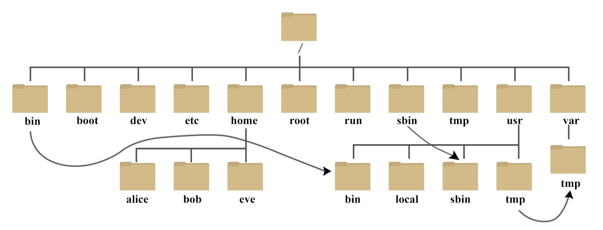

# 磁盘规划

## 设备

Linux 系统中，每个设备都会当成一个文件。

设备文件名和插槽顺序无关，和检测顺序有关，检测顺序决定文件名的先后。

## 磁盘

硬盘通常由重叠的一组盘片构成，每个盘面都被划分为数目相等的磁道，并从外缘的“0”开始编号，具有相同编号的磁道形成一个圆柱，称之为磁盘的柱面。
磁盘的柱面数与一个盘面上的磁道数是相等的。由于每个盘面都有自己的磁头，因此，盘面数等于总的磁头数。
扇区是硬盘的最小存储单位，扇区有两种大小设计，512B 和 4KB。
操作系统为方便操作将多个扇区合在一起操作，叫做块。操作系统是通过块来做为单位操作数据。文件系统操作文件的最小单位是块。

### 磁盘分区

磁盘分区有 MBR 和 GPT 两种格式。柱面是分区的最小单位。

分区的作用：

* 数据安全性：每个分区的数据是分开的，例如重装系统时，可以只操作C盘，其他盘保持不动。
* 性能考虑：分区数据集中在某个柱面区段内，可以更快的查找到数据。

#### MBR(MasterBootRecord)

MBR 是指硬盘的一个扇区，总共 512B，其中分为 记录启动引导程序区 和 分区表：

* 主引导记录：安装启动引导程序的地方，有 446 字节。
* 分区表：记录硬盘的分区状态，共 64 字节，每 16 字节记录一个分区，所以最多能记录四组分区，分区的名称为 /dev/sd[a-p][1-9],例如 /dev/sda1 。
* 校验码：两个字节， 0x55 和 0xAA ，表明设备可以启动。

4组分区信息，可以是主分区也可以是 扩展分区，扩展分区最多只存在一个，扩展分区通过划分逻辑分区来超过4个分区的限制，逻辑分区的设备名称号码从5开始，1-4 保留给 主分区。

缺点：

* 一个分区最大容量为2TB。
* MBR仅有一个块，被破坏后，很难恢复。
* MBR存放引导程序仅有446字节，无法储存较多的程序代码。

#### GPT(GUID partition table)

GPT 使用 逻辑区块地址LBA,Logical Block Address 来储存分区信息。每个LBA有512字节。GPT 总共使用前面 34 个LBA来储存分区信息，同时使用最后的34LBA来做备份。

* LBA0：MBR兼容块，前 446 字节储存第一阶段的启动引导程序，原本的分区表只存在一个分区，仅放入一个特殊标识，识类型为EE分区，即保护性分区。如果不能识别GPT的管理程序，就不会认识这块磁盘，进一步包含了磁盘。
* LBA1：GPT表头记录，记录分区表的位置和大小，同时也记录备份分区表的位置，另外还记录了分区表的校验码，操作系统根据这个校验码来判断GPT是否正确，若错误，可通过备份分区表来恢复GPT的正常运行。
* LBA2-LBA33：记录分区信息，每个LBA可以记录4组分区，默认情况下可以有 4x32 = 128 组记录，每组记录 128 字节，可储存 2^30 TB。

#### 挂载

Linux 中所有的文件都是有根目录("/")衍生形成目录树。

磁盘分区通过挂载在目录树上提供给用户访问，挂载就是利用一个目录作为进入点，将磁盘分区的数据放置在该目录下，进入该目录就可以读取该分区。

#### 分区规划

* / ：根目录，没有挂载分区的目录都属于根目录，50GB 。
* /boot ：存放Linux启动的内核文件，3GB 。
* /usr ：unix shared resources，包含很多二进制文件，函数库等，很多软件的默认安装目录为 /usr/local ，相当于windows的 program files，100GB。
* /home ：用户的主目录，每个用户都有自己的目录，一般目录名以用户账号命名，如果是桌面系统，该目录需要较大储存，50GB。
* swap ：swap分区，一般为内存的2倍，8GB。
* /var ：variable，存放不断扩充的东西，比如日志，数据库内容等待，如果是服务器需要较大空间，100GB。
* efi ：引导盘，200MB。
* /tmp : 存放临时文件，20G。

自定义目录：

* /download：存放下载文件，50G。
* /data：存放数据，100G。
* /opt：存放附件应用，50G。
* /backup：存放备份文件，100G。

除此之外还有一些系统默认目录：

* /dev ：存放的是 Linux 的外部设备，在 Linux 中访问设备的方式和访问文件的方式是相同的。
* /etc ：存放所有的系统管理所需要的配置文件。
* /lib ：存放着系统最基本的动态连接共享库，几乎所有的应用程序都需要用到这些共享库。
* /media ：linux 系统会自动识别一些设备，例如U盘、光驱等等，当识别后，Linux 会把识别的设备挂载到这个目录下。
* /mnt ：临时挂载目录，为了让用户临时挂载别的文件系统的，我们可以将光驱挂载在 /mnt/ 上，然后进入该目录就可以查看光驱里的内容。
* /proc ：/proc 是虚拟文件系统，存储的是当前内核运行状态的一系列特殊文件，这个目录是一个虚拟的目录，它是系统内存的映射，我们可以通过直接访问这个目录来获取系统信息。
* /sbin ：超级用户的二进制文件，这里存放的是系统管理员使用的系统管理程序。
* /usr/bin ：系统用户使用的应用程序。
* /usr/sbin ：超级用户使用的比较高级的管理程序和系统守护程序。
* /usr/src ：内核源代码默认的放置目录。
* /run ：临时文件系统，存储系统启动以来的信息。当系统重启时，这个目录下的文件应该被删掉或清除。

# 文件、目录、磁盘格式

## 权限

任何文件都有用户、所属群组、其他人三种身份的权限。
默认情况下系统上所有用户记录在 /etc/passwd 中，密码记录在 /etc/shadow 中，组名记录在 /etc/group 中。

1. 第一列代表文件的类型与权限（10个字符）：
   * 第一个字符代表文件类型
     - d代表目录。
     - `-`代表文件。
     - l代表链接文件。
     - b代表可按块随机读写的设备。
     - c代表字符串行端口设备，如键盘鼠标。
   * 后九个字符，每3个为一组，均为 r(可读)、w（可写）、x（可执行）三个字符参数的组合，这三个参数的位置固定，没有相应权限则标为`-`。
   * 三组权限的对应对象分别为 文件所有者、 同用户组 和 其他非本用户组。

# 常用操作

| 功能                        | 操作                                                     |
| --------------------------- | -------------------------------------------------------- |
| 命令行模式 tty2 - tty6 终端 | ctrl + alt + F2 ~ F6                                     |
| 图形化界面                  | ctrl + alt + F1                                          |
| 显示当前语言                | locale                                                   |
| 修改语言                    | LANG=en_US.utf8       export LC_ALL=en_US.utf8       |
| 查看日期                    | date   date +%Y/%m/%d     date +%H:%M            |
| 查看日历                    | cal   cal 2015     cal [month] [year]            |
| 计算器                      | bc                                                       |
| 自动补全                    | tab                                                      |
| 中断目前程序                | Ctrl + c                                                 |
| 操作说明                    | man [command]    info [command]   /usr/share/doc |
| 数据写入磁盘                | sync                                                     |
