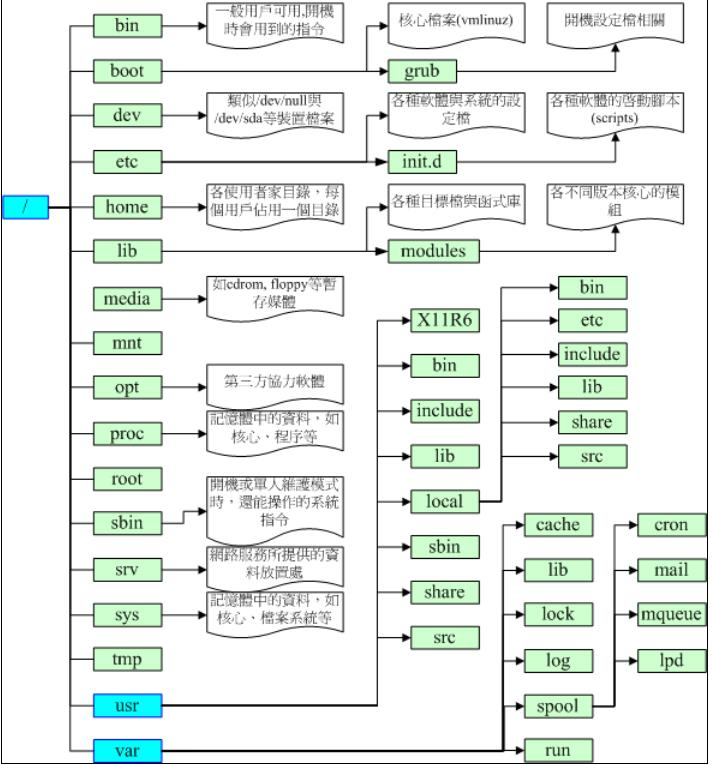

# 磁盘规划

## 设备

Linux 系统中，每个设备都会当成一个文件。

设备文件名和插槽顺序无关，和检测顺序有关，检测顺序决定文件名的先后。

## 磁盘

硬盘通常由重叠的一组盘片构成，每个盘面都被划分为数目相等的磁道，并从外缘的“0”开始编号，具有相同编号的磁道形成一个圆柱，称之为磁盘的柱面。
磁盘的柱面数与一个盘面上的磁道数是相等的。由于每个盘面都有自己的磁头，因此，盘面数等于总的磁头数。
扇区是硬盘的最小存储单位，扇区有两种大小设计，512B 和 4KB。
操作系统为方便操作将多个扇区合在一起操作，叫做块。操作系统是通过块来做为单位操作数据。文件系统操作文件的最小单位是块。

### 磁盘分区

磁盘分区有 MBR 和 GPT 两种格式。

分区的作用：

* 数据安全性：每个分区的数据是分开的，例如重装系统时，可以只操作C盘，其他盘保持不动。
* 性能考虑：分区数据集中在某个柱面区段内，可以更快的查找到数据。

#### MBR(MasterBootRecord)

MBR 是指硬盘的一个扇区，总共 512B，其中分为 记录启动引导程序区 和 分区表：

* 主引导记录：安装启动引导程序的地方，有 446 字节。
* 分区表：记录硬盘的分区状态，共 64 字节，每 16 字节记录一个分区，所以最多能记录四组分区，分区的名称为 /dev/sd[a-p][1-9],例如 /dev/sda1 。
* 校验码：两个字节， 0x55 和 0xAA ，表明设备可以启动。

4组分区信息，可以是主分区也可以是 扩展分区，扩展分区最多只存在一个，扩展分区通过划分逻辑分区来超过4个分区的限制，逻辑分区的设备名称号码从5开始，1-4 保留给 主分区。

缺点：

* 一个分区最大容量为2TB。
* MBR仅有一个块，被破坏后，很难恢复。
* MBR存放引导程序仅有446字节，无法储存较多的程序代码。

#### GPT(GUID partition table)

GPT 使用 逻辑区块地址LBA,Logical Block Address 来储存分区信息。每个LBA有512字节。GPT 总共使用前面 34 个LBA来储存分区信息，同时使用最后的34LBA来做备份。

* LBA0：MBR兼容块，前 446 字节储存第一阶段的启动引导程序，原本的分区表只存在一个分区，仅放入一个特殊标识，识类型为EE分区，即保护性分区。如果不能识别GPT的管理程序，就不会认识这块磁盘，进一步包含了磁盘。
* LBA1：GPT表头记录，记录分区表的位置和大小，同时也记录备份分区表的位置，另外还记录了分区表的校验码，操作系统根据这个校验码来判断GPT是否正确，若错误，可通过备份分区表来恢复GPT的正常运行。
* LBA2-LBA33：记录分区信息，每个LBA可以记录4组分区，默认情况下可以有 4x32 = 128 组记录，每组记录 128 字节，可储存 2^30 TB。

#### 挂载

Linux 中所有的文件都是有根目录("/")衍生形成目录树。

磁盘分区通过挂载在目录树上提供给用户访问，挂载就是利用一个目录作为进入点，将磁盘分区的数据放置在该目录下，进入该目录就可以读取该分区。

#### 分区规划

* / ：根目录，与启动系统有关，应该越小越好，当系统错误时，恢复更快，没有挂载分区的目录都属于根目录，50GB 。
* /boot ：启动与内核文件，3GB 。
* /usr ：unix software resources，与软件的安装和执行有关，很多软件的默认安装目录为 /usr/local ，相当于windows的 program files，100GB。
* /home ：用户的主目录，每个用户都有自己的目录，一般目录名以用户账号命名，如果是桌面系统，该目录需要较大储存，50GB。
* swap ：swap分区，一般为内存的2倍，8GB。
* /var ：variable，与系统运行过程有关，比如日志，数据库内容等待，如果是服务器需要较大空间，100GB。
* efi ：引导盘，200MB。
* /tmp : 存放临时文件，20G。

自定义目录：

* /download：存放下载文件，50G。
* /data：存放数据，100G。
* /opt：存放附件应用，50G。
* /backup：存放备份文件，100G。

除此之外还有一些系统默认目录：

* /dev ：存放的是 Linux 的外部设备，在 Linux 中访问设备的方式和访问文件的方式是相同的。
* /etc ：存放所有的系统管理所需要的配置文件。
* /lib ：存放着系统最基本的动态连接共享库，几乎所有的应用程序都需要用到这些共享库。
* /media ：linux 系统会自动识别一些设备，例如U盘、光驱等等，当识别后，Linux 会把识别的设备挂载到这个目录下。
* /mnt ：临时挂载目录，为了让用户临时挂载别的文件系统的，我们可以将光驱挂载在 /mnt/ 上，然后进入该目录就可以查看光驱里的内容。
* /proc ：/proc 是虚拟文件系统，存储的是当前内核运行状态的一系列特殊文件，这个目录是一个虚拟的目录，它是系统内存的映射，我们可以通过直接访问这个目录来获取系统信息。
* /sbin ：超级用户的二进制文件，这里存放的是系统管理员使用的系统管理程序。
* /usr/bin ：系统用户使用的应用程序。
* /usr/sbin ：超级用户使用的比较高级的管理程序和系统守护程序。
* /usr/src ：内核源代码默认的放置目录。
* /run ：临时文件系统，存储系统启动以来的信息。当系统重启时，这个目录下的文件应该被删掉或清除。

## 文件系统管理

### 读取 /etc/passwd 文件数据流程

1. / 的 inode： 通过挂载点的信息找到 inode 号码为 128 的根目录 inode，且 inode 规范的权限让我们可以读取该 block 的内容（有 r 与 x） ；
2. / 的 block： 经过上个步骤取得 block 的号码，并找到该内容有 etc/ 目录的 inode 号码 （33595521）；
3. etc/ 的 inode： 读取 33595521 号 inode 得知 dmtsai 具有 r 与 x 的权限，因此可以读取 etc/ 的 block 内容；
4. etc/ 的 block： 经过上个步骤取得 block 号码，并找到该内容有 passwd 文件的 inode 号码 （36628004）；
5. passwd 的 inode： 读取 36628004 号 inode 得知 dmtsai 具有 r 的权限，因此可以读取 passwd 的 block 内容；
6. passwd 的 block： 最后将该 block 内容的数据读出来。

### 新增文件流程

1. 先确定使用者对于欲新增文件的目录是否具有 w 与 x 的权限，若有的话才能新增。
2. 根据 inode bitmap 找到没有使用的 inode 号码，并将新文件的权限/属性写入。
3. 根据 block bitmap 找到没有使用中的 block 号码，并将实际的数据写入 block 中，且更新 inode 的 block 指向数据。
4. 将刚刚写入的 inode 与 block 数据同步更新 inode bitmap 与 block bitmap，并更新 superblock 的内容。

### 操作

| 功能                                                                | 操作 | 参数                                                        |
| ------------------------------------------------------------------- | ---- | ----------------------------------------------------------- |
| 列出文件系统整体磁盘使用情况，读取超级块信息                        | df   | -h 方便人阅读    Filesystem  表示那个分区，列出设备名称 |
| 查看文件系统的磁盘使用量，通过搜索文件来计算每个文件的大小然后累加 | du     |  df>du 的情况：    1.  du命令是用户级的程序，它不考虑元数据。 2.  用户删除一个正在运行的应用所打开文件，du会减去该大小，df不会，直到运行的应用被关闭才会减去。  3. 用户写入已被删除的文件。  因为当我们删除一个文件的时候，这个文件不是马上就在文件系统当中消失了，而是暂时消失了，当所有程序都不用时，才会根据OS的规则释放掉已经删除的文件   |

# 文件、目录、磁盘格式

## 权限

任何文件都有用户、所属群组、其他人三种身份的权限。
默认情况下系统上所有用户记录在 /etc/passwd 中，密码记录在 /etc/shadow 中，组名记录在 /etc/group 中。

1. 第一列代表文件的类型与权限（10个字符）：
   * 第一个字符代表文件类型
     - d代表目录。
     - `-`代表文件。
     - l代表链接文件。
     - b代表可按块随机读写的设备。
     - c代表字符串行端口设备，如键盘鼠标。
   * 后九个字符，每3个为一组，均为 r(可读)、w（可写）、x（可执行）三个字符参数的组合，这三个参数的位置固定，没有相应权限则标为`-`。
   * 三组权限的对应对象分别为 文件所有者、 同用户组 和 其他非本用户组。
2. 第二列表示有多少文件名连接到inode，每个文件名都会链接到一个inode，inode 记录inode 编号、文件大小、访问权限、创建时间、修改时间、数据在磁盘的位置等等。
3. 第三列表示所有者账号。
4. 第四列表示所属用户组。
5. 第五列表示文件大小，单位为字节。
6. 第六列表示创建时间或修改时间，可通过 ls -l --full-time 显示完整时间。
7. 第七列表示文件名：以'.'开头的为隐藏文件。

### 改变文件属性与权限

1. 改变所属用户组：chgrp  组名必须在/etc/group中存在
   用法：chgrp [-R] 组名 目录名/文件名
   -R 表示递归修改子目录。

2. 改变文件所有者：chown 用户名必须在/etc/passwd中有记录
   用法：chown [-R] 账号名称[:组名] 文件/目录
   可以同时修改组名。
   当使用cp命令复制时，会复制执行者的属性与权限，此时需要修改所有者和用户组，使得目标用户可以修改。

3. 改变文件权限: chmod
   * 使用数字修改权限：r—4、w—2、x—1，例如 chmod 777 .bashrc   其中 7 = 4 + 2 + 1 = rwx
   * 符号类型改变权限：u—user、g—group、o—others、a—all，例如 chmod u=rwx,go=rx .bashrc　　中间权限设置是连在一起的，无空格

4. Linux文件种类与扩展名

   * 文件种类（`-`）：纯文本文件、二进制文件、数据格式文件。
   * 目录（`d`）。
   * 连接文件（`l`）。
   * 设备与设备文件（device）：与系统外设及存储相关的文件，一般位于/dev目录。
     块设备文件：第一个属性为b，提供系统随机访问的接口设备，如硬盘、软盘等，可以随机地在硬盘的不同块进行读写。
     字符设备文件：第一个属性为c，串行端口的接口设备，如键盘、鼠标等；特征为“一次性读取”，不能够截断输出，如不能让鼠标直接“跳到”另一界面，而是“滑动”到目标位置。
   * 套接字（sockets）：第一个属性为s，数据接口文件，通常用于网络数据连接，位于/var/run目录。
   * 管道（FIFO，pipe）：第一个属性为p，解决多个程序同时访问一个文件所造成的错误问题，first-in-first-out（FIFO）。

文件扩展名仅有指示说明的意义，具体是否可执行由x属性决定：
* `*.sh`：脚本或批处理文件（scripts）。
* `*.Z`、`*.tar`、`*.tar.gz`、`*.zip`、`*.tgz`：经过打包的压缩文件。
* `*.html`、`*.php`：网页相关文件。

#### 文件特殊权限

例如：chmod 7755 filename，特殊权限在第一位。

* 4 为 SUID：用在二进制程序上，执行程序过程中拥有程序拥有者的权限。例如：-rwsr-xr-x
* 2 为 SGID：用在二进制程序和目录，执行过程中拥有程序用户组的权限。例如：-rwxr-sr-x
* 1 为 SBIT：用在目录上，在此目录中自己创建的文件，只能由自己或者root用户才能删除。例如：-rwxr-xr-t

### 目录与文件的权限意义

1. 文件的权限

* r：可以读取文件。
* w：可以编辑、新增或者修改文件内容（不包括删除）。
* x：该文件具有可以被系统执行的权限。

2. 目录的权限

* r：可以读取目录结构列表，即可以利用ls命令查看目录下的文件名数据
* w：可以更改目录结构列表，包括新建文件与目录、删除文件与目录（无论文件权限如何）、重命名文件与目录、移动文件与目录等与“文件名变动”有关的操作
* x：代表用户可以进入该目录称为工作目录

要开放目录给任何人浏览，至少需要给予r和x权限，否则他人无法进入目录读取文件。
仅有r的情况下，用户仅能读取文件名列表，但是不能获取详细信息。

## 文件与目录管理

### 操作

| 功能                           | 操作       | 参数                                                                                                                                                                                                                                                                                                   |
| ------------------------------ | ---------- | ------------------------------------------------------------------------------------------------------------------------------------------------------------------------------------------------------------------------------------------------------------------------------------------------------ |
| 改变目录                       | cd         |                                                                                                                                                                                                                                                                                                        |
| 显示当前所在目录               | pwd        | -P 显示链接路径，即快捷方式指向的路径                                                                                                                                                                                                                                                                  |
| 创建新目录                     | mkdir      | -m 777 直接配置权限   -p 递归创建目录                                                                                                                                                                                                                                                              |
| 删除空目录                     | rmdir      | -p     如果上一级是空目录也一起删除                                                                                                                                                                                                                                                                    |
| 文件和目录查看                 | ls         | -a 全部文件，包括隐藏文件   -l 列出权限等数据，常使用 ll -h    -t 时间排序   -r 倒序                                                                                                                                                                                                        |
| 复制                           | cp         | -i 是否覆盖提示   -r 递归复制   -p 复制时权限一起复制，默认权限为命令执行者的权限                                                                                                                                                                                                               |
| 删除                           | rm         | -f 强制删除，不会有警告信息   -i 删除前询问 -r 递归删除                                                                                                                                                                                                                                            |
| 移动                           | mv         | -f 强制移动，不会有警告信息   询问是否覆盖                                                                                                                                                                                                                                                         |
| 查看文件内容                   | cat        | -n 显示行号   -A 显示所有字符   ^\| =[tab]键   $=行尾符号                                                                                                                                                                                                                                          |
| 查看并搜索内容                 | less       | 空白键：向下翻动一页   [pagedown]：向下翻动一页    [pageup]  ：向上翻动一页     /字串     ：向下搜寻『字串』的功能     ?字串     ：向上搜寻『字串』的功能     n：重复前一个搜寻 (与 / 或 ? 有关！)     N：反向的重复前一个搜寻 (与 / 或 ? 有关！)    q：离开 less 这个程序 |
| 数据截取                       | tail、head | -100f 持续刷新显示100行内的数据                                                                                                                                                                                                                                                                        |
| 按指定进制显示文件             | od         | -t [type] 按照类型显示 a 默认字符 c ASCII字符 d 十进制 x 16进制                                                                                                                                                                                                                                        |
| 创建新文件                     | touch      |                                                                                                                                                                                                                                                                                                        |
| 脚本文件查找，根据PATH路径查找 | which      |                                                                                                                                                                                                                                                                                                        |
| 查找部分路径文件               | whereis    | -l 列出查询的目录   -b 查找二进制文件                                                                                                                                                                                                                                                              |
| 根据数据库查找                 | locate     | -i 忽略大小写   -r 根据正则表达式查找   可以通过 updatedb 来更新数据库   可以模糊查询                                                                                                                                                                                                                         |
| 查找硬盘                               |           find | -name 查找文件名称，可用 * 默模糊查询   -type 查找文件类型，例如 f,b,c,l,s,p   -exec ls -l {} \ 执行额外操作，-exec 开始 \ 结束 {} 为 find 结果                                                                                                                                                                                                                                                                                                       |

# 常用操作

| 功能                        | 操作                                                                               |
| --------------------------- | ---------------------------------------------------------------------------------- |
| 命令行模式 tty2 - tty6 终端 | ctrl + alt + F2 ~ F6                                                               |
| 图形化界面                  | ctrl + alt + F1                                                                    |
| 显示当前语言                | locale                                                                             |
| 修改语言                    | LANG=en_US.utf8       export LC_ALL=en_US.utf8   或者修改 /etc/locale.conf |
| 查看日期                    | date   date +%Y/%m/%d     date +%H:%M                                      |
| 查看日历                    | cal   cal 2015     cal [month] [year]                                      |
| 计算器                      | bc                                                                                 |
| 自动补全                    | tab                                                                                |
| 中断目前程序                | Ctrl + c                                                                           |
| 操作说明                    | man [command]    info [command]   /usr/share/doc                           |
| 数据写入磁盘                | sync                                                                               |
