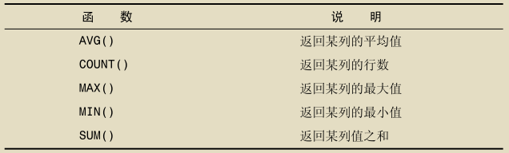

## 常用命令

```bash
# 切换数据库
use <database>;
# 显示当前库的所有表
show databases;
# 显示表中的字段
show columns from xxxx；
describe xxxx;
# 显示服务器状态信息
show status;
# 显示用户的安全权限
show grants;
```

NOT 子句支持对 IN 、BETWEEN、EXISTS、NULL取反。

LIKE子句中 % 通配符匹配一个或多个字符，但不能匹配 NULL，_ 通配符只匹配单个字符。

`select * from tables REGEXP 'xxxx'` 可使用正则表达式。




AVG() 会忽略值为 NULL 的行。

COUNT(*) 会统计所有行，COUNT(column) 会忽略 NULL 值。

MAX()、MIN()会忽略值为 NULL 的行,如果作用于文本数据，则返回最后一行，MIN() 返回第一行。

AVG()、COUNT()、MAX()、MIN()、SUM() 都可使用 DISTINCT 关键字。
