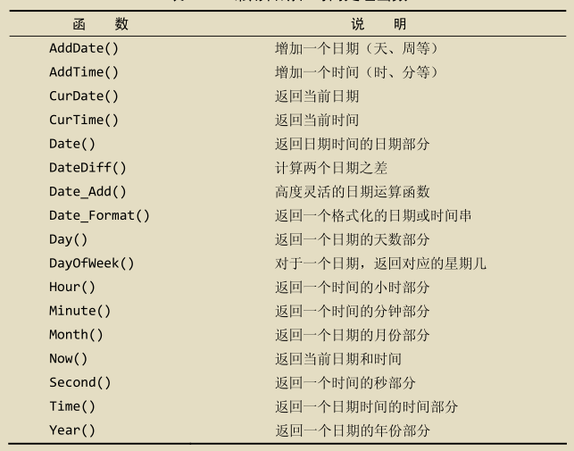
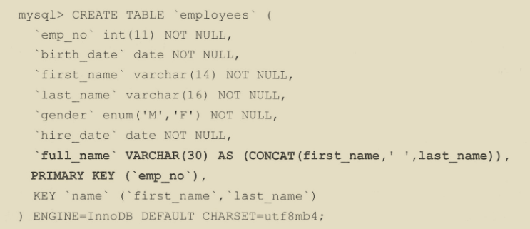
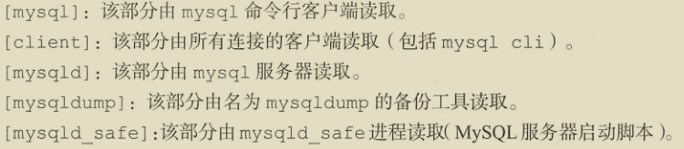

## 常用命令

```bash
# 切换数据库
use <database>;
# 显示当前库的所有表
show databases;
# 显示表中的字段
show columns from xxxx；
describe xxxx;
# 显示服务器状态信息
show status;
# 显示用户的安全权限
show grants;
```

NOT 子句支持对 IN 、BETWEEN、EXISTS、NULL、REGEXP取反。

LIKE子句中 % 通配符匹配一个或多个字符，但不能匹配 NULL，_ 通配符只匹配单个字符。

`select * from tables REGEXP 'xxxx'` 可使用正则表达式。





### 聚集函数


AVG() 会忽略值为 NULL 的行。

COUNT(*) 会统计所有行，COUNT(column) 会忽略 NULL 值。

MAX()、MIN()会忽略值为 NULL 的行,如果作用于文本数据，则返回最后一行，MIN() 返回第一行。

AVG()、COUNT()、MAX()、MIN()、SUM() 都可使用 DISTINCT 关键字。

### GROUP BY子句

1. 可以包含任意数目的列，使分组可以嵌套。
2. 子句中列出的列必须是检索列或者有效的表达式，不能是聚集函数，如果在SELECT中使用表达式，则必须在GROUP BY子句中指定相同的表达式，不能使用别名。
3. 除聚集计算语句外，SELECT 语句中的每个列都必须在GROUP BY子句中给出。
4. 如果分组中具有NULL值，则NULL将作为一个分组返回。
5. 使用 GROUP BY columns WITH ROLLUP 可以得到每个分组以及每个分组汇总级别的值。
6. WHERE子句过滤分组前的行，HAVING子句过滤分组后的组。
7. 不要忘记使用ORDER BY，这是保证数据正确排序的唯一正确方法。

### CURD

```bash
 # 插入所有值
INSERT INTO <table> VALUES ( <value1>, <value2>, <value3>, <value4> );
# 插入部分值
INSERT INTO <table>( <column1>, <column3>) VALUES ( <value1>, <value3> );
# 查询并插入
INSERT INTO <table1>( <column1>, <column2>, <column3>, <column4> ) SELECT <column1>, <column2>, <column3>, <column4> FROM <table2>;
# 更新表
UPDATE <table> SET <column1> = <value1>, <column2> = <value2> WHERE <column3> = <value3>;
# 删除数据
DELETE FROM <table> where <column> = <value>;
# 创建表，Mysql会在数据目录内创建 .idb 文件
CREATE TABLE <table>( <column1> <type1>, <column2> <type2>, <column3> <type3>, <column4> <type4>)ENGINE = InnoDB CHARACTER SET = utf8mb4;
# 修改表
ALTER TABLE <table> ADD <column> <type>;
ALTER TABLE <table> DROP COLUMN <column>;
# 删除表
DROP TABLE <table>;
# 删除表数据，一旦情况不能回滚,是 DDL 操作
TRUNCATE TABLE <table>;
# 重命名
RENAME TABLE <table1> TO <table2>;
```

### 视图

1. 视图的访问需要权限。
2. 视图可以嵌套。
3. ORDER BY可以用在视图中，如果查询该视图的SELECT中也含有ORDER BY，那么视图中的ORDER BY将会被覆盖。
4. 视图不能索引，也不能有关联的触发器和默认值。
5. 视图可以和表一起使用。

```bash
# 创建视图
CREATE VIEW <view> AS <select sql>;
# 查询创建视图的语句
SHOW CREATE VIEW <view>;
# 删除视图
DROP VIEW <view>;
# 更新视图
REPLACE VIEW <view> AS <select sql>;
```

### 储存过程

```bash
#创建储存过程,DELIMITER 的作用是临时更改;关键字为 //,防止 <sql> 解析错误。
DELIMITER $$
CREATE PROCEDURE <procedure>(OUT <varibale1> <type1>,IN <varibale2> <type2>,,INOUT <varibale3> <type3>)
BEGIN
# 例如 SELECT MAX(price) INTO var1 from table1;
   <sql>
END $$
DELIMITER ;


# 调用存储过程,形参需要以@开始
# 例如： CALL ordertotal(20005,@total); SELECT @total;
CALL <procedure>(@<var1>,@<var2>,@<var3>);
SELECT @<var1>;

#储存过程中定义变量
DECLARE <var> <type>;

# 储存过程中IF语句
IF <expression> THEN 
   <sql>
ELSEIF <expression> THEN
   <sql>
ELSE
   <sql>
END IF;

# 删除储存过程
DROP PROCEDURE <procedure>;
```

### 游标

MYSQL 游标只能用于存储过程和函数。

```bash
# 定义游标
DECLARE <cursor> CURSOR FOR <sql>;
# 打开关闭游标
OPEN <cursor>;
CLOSE <cursor>;
# 使用游标数据
FETCH <cursor> INTO <var>;
# 循环
REPEAT
   <sql>
UNTIL <expression> END REPEAT;

WHILE <expression> DO
   <sql>
END WHILE;
```

### 用户管理

```bash
# 查询用户
USE mysql;
SELECT * from user;
# 创建用户,<ip> 例如 '10.148.%.%'，如果该值设置为 '%',用户可以从任意主机访问,如果该值不指定，将采用'%'.
CREATE USER <user>@<ip> INDENTIFIED WITH mysql_native_password BY <password>;
# 更新密码
SET PASSWORD FOR <user> = Password(<password>);
ALTER USER <user>@<ip> IDENTIFIED WITH mysql_native_password BY <password>;
# 重命名
RENAME USER <user1> TO <user2>;
# 删除用户
DROP USER <user>;
# 授权或撤销授权
GRANT <权限> ON <数据库或者表，例如 table.*> TO <user>@<ip>;
REVOKE <权限> ON <数据库或者表，例如 table.*> FROM <user>@<ip>;
# 刷新权限
flush privileges;
```


### 数据库元数据

```bash
USE INFORMATION_SCHEMA;
SELECT * from TABLES;
SELECT * from COLUMNS;
SELECT * from FILES;
SELECT * from INNODB_TABLESPACES;
SELECT * from INNODB_TABLESTATS；
SELECT * from PROCESSLIST；
```

### CTE

MYSQL8 以后使用：

```bash
# 非递归CTE，创建临时结果集，避免重复查询
# 如果不写 (<column1>,<column2>,<column3>),默认使用 <sql> 返回所有字段
WITH <cte>(<column1>,<column2>,<column3>) AS (
    <sql>
) 
SELECT * FROM <cte>;

# 递归CTE，必须以 WITH RECURSIVE 开头，分为 seed 查询 和 recursive 查询，由 UNION [ALL] 或 UNION DISTINCT 分隔
# seed SELECT 被执行一次以创建初始数据子集; recursive SELECT被重复执行以返回数据的子集，直到获得完整的结果集，当迭代不会生成任何新行时，递归会停止
WITH RECURSIVE <cte>(<column1>,<column2>,<column3>) AS (
    # 创建 seed
    <sql>
    UNION [ALL|DISTINCT]
    # 引用 <cte> 产生递归，直到迭代不会产生新行
    SELECT <column1>,<column2>,<column3> FROM <cte> ......
) 
SELECT * FROM <cte>;
```

### 虚拟列

虚拟列 INSERT 时不用包含，若包含，其值应该为 DEFAULT。



### 窗口函数


窗口函数是通过 OVER 和 WINDOW 子句来完成的。

使用方法：`<窗口函数> OVER(PARTITION BY <子句> ORDER BY <子句>) `，`WINDOW <window> AS (<子句>)`

子句有：

1. `PARTITION BY 子句`：窗口按照哪些字段进行分组，窗口函数在不同的分组上分别执行。
2. `ORDER BY子句`：按照哪些字段进行排序，窗口函数将按照排序后的记录顺序进行编号；
3. `FRAME子句`：`FRAME`是当前分区的一个子集，子句用来定义子集的规则，通常用来作滑动窗口使用。
4. `WINDOW子句`：用来指定别名，方便重复使用，放在 WHERE 条件后，例如：

```bash
mysql> SELECT
    -> RANK() OVER w AS rk,
    -> PERCENT_RANK() OVER w AS prk,
    -> stu_id, lesson_id, score
    -> FROM t_score
    -> WHERE stu_id = 1
    -> WINDOW w AS (PARTITION BY stu_id ORDER BY score)
    -> ;
```

```bash
# FRAME 子句,位于ORDER BY子句之后
# ROWS 使用行号进行取范围，RANGE使用当前行中 分组字段 的值来进行取返回，比如 分组字段为r1，当前行r1的值为9，行号为1，并且 between 1 preceding and 1 following,则取 r1的值 在 [9-1,9+1] 的行。 
[ROWS|RANGE] BETWEEN <边界> AND <边界>
# 或 默认包含了当前行作为另一个边界
[ROWS|RANGE] <边界>

# <边界> 选项
CURRENT ROW  #当前行
UNBOUNDED PRECEDING #第一行
UNBOUNDED FOLLOWING #最后一行
<expr> PRECEDING #当前行之前几行
<expr> FOLLOWING #当前行之后几行
```

使用场景：

`ROW_NUMBER()`：查询每个学生分数最高的前3门课程。

`RANK()`：查询某一门课分数最高的前3名。

`DENSE_RANK()`：查询某一门课3个最高的分数。

`CUME_DIST()`：查询小于等于当前成绩的比例。

`LAG(column,n)`、`LEAD(column,n)`：查询前一个或者后一个同学成绩和当前同学成绩差值。

`FIRST_VALUE(column)`、`LAST_VALUE(column)`：查询最高成绩或者最低成绩、查询截止当前日期第一条数据或者最后一条数据。

`NTH_VALUE(column, n)`、`NTILE(n)`、`NTH_VALUE(column,n)`：显示每个同学成绩中排名第2或者第3的分数。

`NTILE(n)`：获取一定比例的数据。

## 配置文件



mysqld_safe 进程会从选项中[mysqld]和[server]部分读取所有选项。

变量分为全局变量(适用于所有连接)和局部变量(适用于部分连接)。

```bash
SET GLOBAL xxxx = xxxx;
SET SESSION xxxx = xxxx;
# 如果要使重启后保持持久化需要使用：
SET PERSIST xxxx = xxxx;
SET @@persist.xxxx = xxxx;
```

#### 数据目录

默认情况下，数据目录有三个子目录：

1. mysql：MySQL系统数据库。
2. performance_schema：提供用于在运行是检查服务器内部状态的信息。
3. sys：提供一组能解释performance_schema信息的对象。

除此之外，还包含日志文件、InnoDB表空间、InnoDB日志文件、SSL和RSA秘钥文件、pid、持久化全局系统变量的mysqld-auto.cnf。

#### 配置参数

innodb_buffer_pool_size：它决定InnoDB储存引擎可以使用多少内存空间来缓存内存中的数据和索引，可以动态调整不需要重启服务器。

innodb_buffer_pool_instances：将InnoDB缓冲池划分不同区域，以便在不同线程读取和写入缓存页时减少竞争，提高并发，如果缓冲池大小超过16GB，可以设置实例，以便每个区域至少获得1GB空间。

innodb_log_file_size: redo log大小，用于数据库崩溃时重放已提交的事务，默认值为48MB(不足以满足生成)，更改需要重启服务器。

## 事务

InnoDB 支持事务，MyISAM不支持事务。

原子性：所有SQL要么全部成功，要么全部失败。

一致性：事务只能以允许的方式改变受影响的数据。

隔离性：同时发生的事务互不影响。

持久性：数据库是否故障，已经保存的数据不会丢失。

```bash
# 开启、回滚、提交一个事务
START TRANSACTION;
ROLLBACK;
COMMIT;
# 设置、回滚保存点，回滚、提交会默认释放
SAVEPOINT <savepoint>;
ROLLBACK TO <savepoint>;
```

#### 隔离级别

1. 读取未提交(read uncommitted)：当前事务可以读取由另一个未提交事务写入的数据(脏读 dirty read)。
2. 读提交(read committed)：当前事务只能读取另一个事务提交数据(不可重复读取 non-repeatable read)，事务A读取数据a，另一个事务修改数据a并提交，事务A再次读取数据a，两次读取数据a不一样，叫不可重复读。
3. 可重复读取(repeatable read)：InnoDB默认级别，在同一个事务内的查询都是事务开始时刻一致的，事务A只能在事务B修改数据并提交后，自己也提交事务后，才能读取到事务B修改的数据，有一种特殊情况就是事务A可以读取到自己修改的数据,不能避免幻读(例如：事务A事务期间查询某数据返回3行，事务B在此期间插入1行，事务A在提交之后再次查询该数据发现存在4行)。
4. 序列化：事务顺序执行。

#### 锁

内部锁：服务器内部执行，以管理多个会话对表内容的竞争，又可以分为两种类型：

1. 行级锁：只有被访问的行会被锁定，允许通过多个会话同时进行写访问。
2. 表级锁：MyISAM、MEMORY、MERGE使用表级锁，一次只允许一个会话更新这些表。

外部锁：可以使用 `LOCK TABLE <table> [READ|WRITE]`和 `UNLOCK TABLES`来控制锁定。

1. READ：多个会话可以同时获取锁同时读取数据，但当READ锁保持时，没有会话可以写入数据，会处于等待状态，直到READ锁释放。
2. WRITE：当一个表被WRITE锁定时，其他会话不能读取或写入数据。

`FLUSH TABLES WITH READ LOCK`可以冻结数据库所有写操作，所有的备份方法都会使用。

锁队列：当出现锁竞争时，阻塞的锁会保留在队列中。比如当一个事务获取一个READ锁时，另一个事务想获取WRITE锁，需要在队列中阻塞等待，直到前一个事务释放锁。

可以通过 SHOW PROCESSLIST; 来查询会话的状态。

## 日志

### Binlog

二进制日志包含数据库的所有更改记录，包括数据和结构两方面，不会记录 SELECT 或 SHOW 等不修改数据的操作。

启用二进制日志需要配置 log_bin 和 server_id，并重启服务器，例如 log_bin = /data/mysql/binlogs/server1,那么二进制储存在 /data/mysql/binlogs 文件夹中，文件名为 server1.0000001、server1.0000002等，通过 show binary logs 来查看。

每当服务器启动、刷新日志、当前日志大小达到 max_binlog_size 时，服务器会创建一个新文件，每个binlog的位置都在 server1.index  中被维护，例如:


Binlog的作用：

1. 复制：使用Binlog，可以把对服务器所在更改以流的方式传输到另一台服务器。
2. 时间点恢复：可以根据时间点恢复数据库数据。

```bash
# 临时禁用会话的二进制日志，接下来的命令不会记录到二进制日志
SET SQL_LOG_BIN = 0;
# 重新启用二进制日志
SET SQL_LOG_BIN = 1;
# 关闭当前的二进制日志并打开一个新的二进制日志
FLUSH LOGS;
```

清除binlog：

1. 设置 binlog_expire_logs_seconds 和 expire_logs_days 自动到期清除，两个值都设置为0表示不清除binlog，如果一个非0值则使用该参数作为到期时间，默认binlog_expire_logs_seconds = 2592000，expire_logs_days = 0，即30天。
2. 手动清除日志，`purge binary logs to <file>`。例如 purge binary logs to server1.000004 则会删除 server1.000001 到 server1.000003，server1.000004 不会删除。或者 `purge binary logs to <DATETIME>`。例如 purge binary logs before '2017-08-03 15:45:00'。
3. 删除所有二进制日志，`reset master`。

binlog有三种格式(binlog_format)：

1. STATEMENT：5.7.6以前默认格式，记录实际的SQL语句，相比ROW格式，减少了bin-log的日志量，节省IO和储存，但是使用某些特定情况的储存过程或者函数时无法保证安全。
2. ROW：默认格式，记录每行所做的更改,以二进制格式对整行进行保存，比如 update 语句更新了10条数据，10条记录都会记录到日志中，增大了日志量，但是避免了STATEMENT的问题。
3. MIXED：当需要时，从 STATEMENT 切换到 ROW。

使用日志：

```bash
# 查看日志mysqlbinlog <binlog-path>

# 重放日志
# --start-datetime 、 --stop-datetime 指定时间窗口
# --start-position 、--stop-position 指定偏移量窗口
# --database 指定提取特定的数据库
# --disable-log-bin 恢复时禁用binlog
mysqlbinlog <binlog-path> | mysql -h <hsot> -u <user> -p <db_name>
# 或
mysqlbinlog <binlog-path> > <file>
cat <file> | mysql -h <hsot> -u <user> -p <db_name>
```

迁移日志：

1. 停止服务器。
2. 执行 `mysqlbinlogmove --bin-log-basename=<basename> --binlog-dir=<source-path> <target-pach>`。
3. 修改my.cnf中log_bin选项。
4. 重启服务。

## 备份

### mysqldump

```bash
# 备份所有数据库，保存可执行的sql文件，当还原dump时，drop语句会在创建表之前清除所有表
# 包含 create database 、 use database 、drop table if exists 、 create table 、insert
# --routines --events 存储过程、函数和事件
# -F 导出后生成新的binlog
# --no-data 只导出表结构
# --no-create-db --no-create-info --complete-insert 只备份数据
# --where 添加过滤条件


# --lock-all-tables 默认设置，保证数据的一致性，锁表。
# --single-transaction 一致性的另一种方案，和上面的参数，二选一。在执行备份之前，将事务隔离模式改为 REPEATABLE READ，开启事务，在dump期间如果其他事务修改了数据，对dump的数据无影响，适用于InnoDB，可以减少锁表。

# --master-data 将当前服务器的binlog的位置和文件名追加到输出文件中，会执行FLUSH TABLES WITH READ LOCK;然后执行SHOW MASTER STATUS查询binlog的状态，并记录如 CHANGE MASTER TO MASTER_LOG_FILE='mysql-bin.000095', MASTER_LOG_POS=50607116; 如果为 1，该命令不注释，如果为2，该命令注释。若用于搭建从库，可使用 2;最后 如果加--lock-all-tables 不会解锁，等dump完再解锁，如果加--single-transaction会执行 UNLOCK TABLES 解锁。
# --dump-slave 先stop slave停止主从复制，然后执行show slave status，记录binlog状态（这里的状态是从服务器数据复制到的节点，不是主服务器最新的节点。如 CHANGE MASTER TO MASTER_LOG_FILE='mysql-bin.000095', MASTER_LOG_POS=50607116; 如果为 1，该命令不注释，如果为2，该命令注释。默认为1。），然后执行备份，备份完成后start slave。

mysqldump --all-databases -u <user> -p<password> > dump.sql
# 或者
mysqldump --databases <db1> <db2> -u <user> -p<password> > dump.sql
mysqldump  database <db> -u <user> -p<password> > dump.sql

# 创建备份用户
grant replication slave,replication client on *.* to <user>@<ip> identified by <password>;
```

## 复制

复制分为：

主从复制：一个主库多个从库。
开启步骤：

1. 在主库上，启用二进制日志并设置SERVER_ID。
2. 在主库上，创建一个复制用户，`grant replication slave on *.* to <user>@<ip> identified by <password>;`
3. 在主库上，进行备份。
4. 在从库上，恢复此备份。
5. 在从库上，恢复备份好，执行 `CHANGE MASTER TO MASTER_HOST=<master-ip>,MASTER_USER=<user>,MASTER_PASSWORD=<password>,MASTER_LOG_FILE=<log-file>,MASTER_LOG_POS=<position>；` log-file和position存在于转储文件中，使用 `less <dump.sql>`查看。
6. 在从库上，start slave。

链式复制：主库和从位于数据中心A内，中继主库位于数据中心B，中继主库从数据中心A的主库复制，数据中心B的从库复制中继主库。

主主复制：两个主库互相接受写入和复制。

1. 主从复制的方法设置，然后在从数据库执行 SET @@GLOBAL.READ_ONLY=ON。
2. 在从库上执行 SHOW MASTER STATUS。
3. 在主库上执行 `CHANGE MASTER TO MASTER_HOST=<master-ip>,MASTER_USER=<user>,MASTER_PASSWORD=<password>,MASTER_LOG_FILE=<log-file>,MASTER_LOG_POS=<position>；`
4. 在主库上执行 START SLAVE。
5. 在从库上执行 SET @@GLOBAL.READ_ONLY=OFF 。

多源复制：一个从库从多个主库复制。

1. 先从一个主库A备份数据，复制到另外一个主库B和从库C。
2. 在从库C 执行 STOP SLAVE。
3. 在从库C 上执行 `CHANGE MASTER TO MASTER_HOST=<master1-ip>,MASTER_USER=<user>,MASTER_PASSWORD=<password>,MASTER_LOG_FILE=<log-file>,MASTER_LOG_POS=<position> FOR CHANNEL <master1>；`
4. 在从库C 上执行 `CHANGE MASTER TO MASTER_HOST=<master2-ip>,MASTER_USER=<user>,MASTER_PASSWORD=<password>,MASTER_LOG_FILE=<log-file>,MASTER_LOG_POS=<position> FOR CHANNEL <master2>；`
5. 在从库执行
