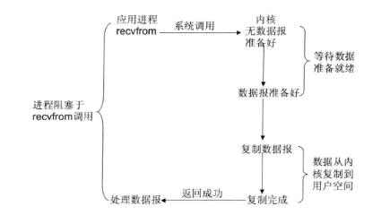
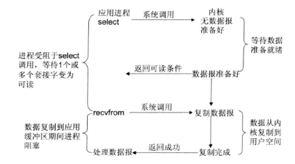
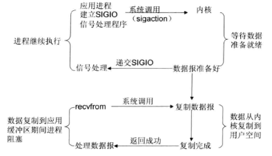
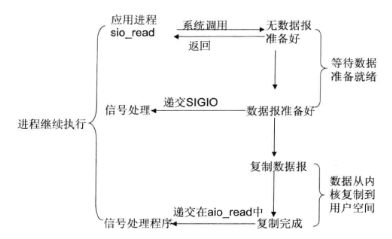
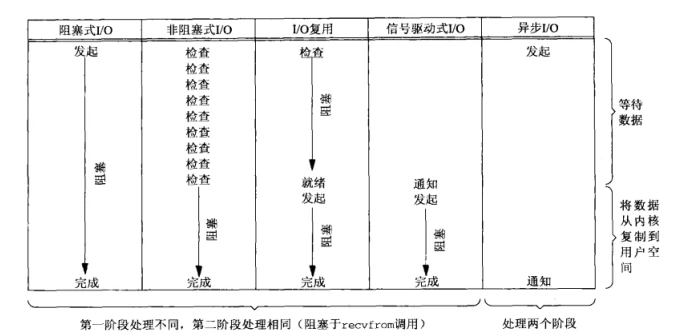
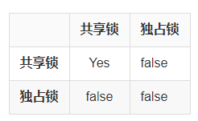
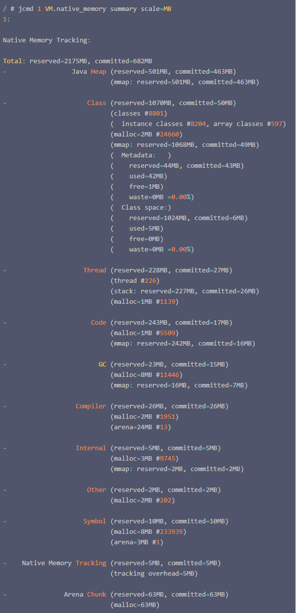
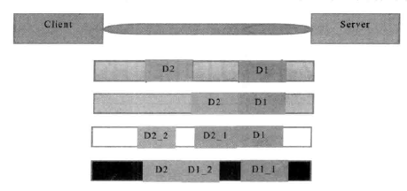
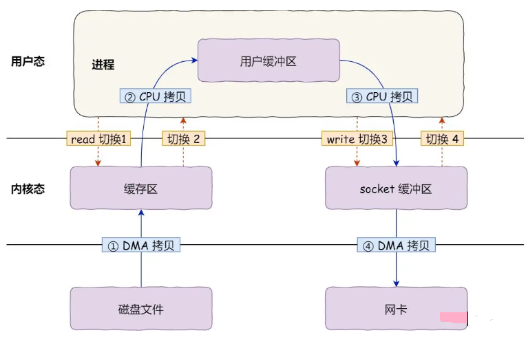
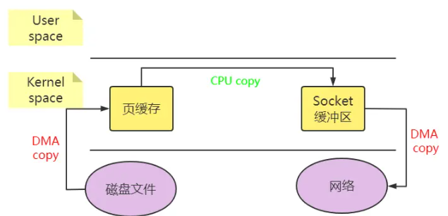

# IO 模型

读写一个socket会返回相应的文件描述符，描述符就是一个数字，指向内核的一个结构体(文件路径、数据区等)。

1. 阻塞与非阻塞：用于描述调用者在等待返回结果时的状态。
* 阻塞：调用者发起请求后，会一直等待返回结果，这期间当前线程会被挂起（阻塞）。
* 非阻塞：调用者发起请求后，会立刻返回，当前线程也不会阻塞。该调用不会立刻得到结果，调用者需要定时轮询查看处理状态。

2. 同步与异步：用于描述调用结果的返回机制（或者叫通信机制）。
* 同步：调用者发起请求后，会一直等待返回结果，即由调用者主动等待这个调用结果。
* 异步：调用者发起请求后，会立刻返回，但不会立刻得到这个结果，而是由被调者在执行结束后主动通知（如 Callback）调用者。

五种 IO 模型：

1. 阻塞式 IO 模型：默认情况下，所有文件操作都是阻塞的，应用进程从发起 IO 系统调用，至内核返回，这整个期间是处于阻塞状态的，可能数据包被正确复制到应用进程缓存区成功返回，也可能发生错误返回。

  

2. 非阻塞式 IO 模型：应用进程可以将 Socket 设置为非阻塞，在发起 IO 系统调用后，如果缓冲区没有数据，就直接返回 EWOULDBLOCK 错误标识，否则返回成功标识，应用进程需要轮询调用 recvfrom 系统调用。

  

3. IO 多路复用模型：Linux 提供 select/poll 系统调用，进程通过将多个socket 的多个 fd 传递给 select/poll 调用，调用 select/poll 的进程会阻塞等待 select/poll 顺序扫描 fd 是否就绪，当就绪时，立即返回回调函数，再调用 recvfrom 系统调用完成数据读取。出于效率的考量，单进程打开的fd 受到限制，默认 1024 。另外 linux 还提供 epoll 系统调用使用事件驱动代替顺序扫描，性能更高。

  epoll 优势：

  * 支持一个进程打开的 socket描述符 不受限制。
  * IO效率不会随fd 数目增加而线性下降。
  * eppol 使用 mmap 加速内核和用户空间的消息传递：内核需要报 fd 消息通知到用户空间。

  

4. 信号驱动 IO 模型： 可以为 Socket 开启信号驱动 IO 功能，应用进程需向内核注册一个信号处理程序（通过sigaction 系统调用），该操作并立即返回。当内核中有数据准备好，会发送一个信号给应用进程，应用进程便可以在信号处理程序中发起 IO 系统调用，来完成数据读取。主要用于UDP套接字，TCP信号产生过于频繁，并且信号没有告诉发送了什么事情。

  

5. 异步 IO 模型：应用进程发起 IO 系统调用后，会立即返回。当内核中数据完全准备后，并且也复制到了用户空间，会产生一个信号来通知应用进程。

  

应用进程对内核发起 IO 系统调用后，内核会经过两个阶段来完成数据的传输：
* 第一阶段：等待数据。即应用进程发起 IO 系统调用后，会一直等待数据；当有数据传入服务器，会将数据放入内核空间，此时数据准备好。
* 第二阶段：将数据从内核空间复制到用户空间，并返回给应用程序成功标识。

  

# JAVA NIO

传统IO基于字节流和字符流操作，NIO 基于 Channel 和 Buffer 操作，数据总是从 Channel 读取到 Buffer 中，或者从  Buffer 写入到 Channel 中。

## Channel

Channel 是 IO操作 的载体，全双工的，即可以读取也可以写入，流的读写只能是单向的，例如 InputStream 、 OutputStream 。

主要分为两类：

* FileChannel
* SocketChannel、ServerSocketChannel、DatagramChannel

都继承于 SeekableByteChannel（负责在任意位置进行读写），GatheringByteChannel （负责顺序将多个缓存区写入Channel，即一个缓冲区数组），ScatteringByteChannel （负责从Channel 读取数据依次填满多个缓存区，即一个缓冲区数组），例如

```java
// SeekableByteChannel

Path filePath = Paths.get("D://error.log");
ByteBuffer buffer = ByteBuffer.allocate(1024);
buffer.put("111111".getBytes());
buffer.flip();
try {
    FileChannel channel = FileChannel.open(filePath, StandardOpenOption.WRITE);
    channel.position(80);    // 覆盖此处的内容为111111
    channel.write(buffer);
    channel.close();

    buffer = ByteBuffer.allocate(1024);
    channel = FileChannel.open(filePath, StandardOpenOption.READ);
    channel.position(100);    // 读取此处的内容
    channel.read(buffer, 10);
    buffer.flip();
    System.out.println(buffer);

    Charset charset = Charset.forName("utf-8");
    CharsetDecoder decoder = charset.newDecoder();
    CharBuffer charBuffer = decoder.decode(buffer);
    System.out.println(charBuffer);
} catch (IOException e) {
    e.printStackTrace();
}
```

```java
// ScatteringByteChannel

ByteBuffer header = ByteBuffer.allocateDirect (10);
ByteBuffer body = ByteBuffer.allocateDirect (80);
ByteBuffer [] buffers = { header, body };
int bytesRead = channel.read (buffers);
```

```java
// GatheringByteChannel

ByteBuffer header = ByteBuffer.allocateDirect (10);
ByteBuffer body = ByteBuffer.allocateDirect (80);
ByteBuffer [] buffers = { header, body };
channel.write(bufferArray);
```

scatter / gather经常用于需要将传输的数据分开处理的场合，例如传输一个由消息头和消息体组成的消息，你可能会将消息体和消息头分散到不同的buffer中，这样你可以方便的处理消息头和消息体。

### FileChannel

创建：

1. FileChannel#open ：

  ```java
  public static FileChannel open(Path path, OpenOption... options) throws IOException

  public static FileChannel open(Path path, Set<? extends OpenOption> options, FileAttribute<?>... attrs) throws IOException
  ```

2. 通过FileInputStream/FileOutputStream 获取

  ```java
  FileInputStream inputStream = new FileInputStream("D:/test.txt");
  FileChannel channel = inputStream.getChannel();

  FileOutputStream outputStream = new FileOutputStream("D:/test.txt");
  FileChannel channel1 = outputStream.getChannel();
  ```

3. 通过RandomAccessFile获取

  ```java
  RandomAccessFile randomAccessFile = new RandomAccessFile("./test.txt", "rw");
  FileChannel channel2 = randomAccessFile.getChannel();
  ```

api：

| 接口                    | 描述                                                   |
| ----------------------- | ------------------------------------------------------ |
| open                    | 创建FileChannel                                        |
| read/write              | 基于FileChannel读写                                    |
| force                   | 强制将FileChannel中的数据刷入文件中                    |
| map                     | 使用 mmap 技术直接映射内核内存到用户内存，返回  MappedByteBuffer |
| transferTo/transferFrom | 将通道中的字节传输到其他通道                           |
| lock/tryLock            | 获取文件锁                                             |

read/write：

```java
ByteBuffer byteBuffer = ByteBuffer.allocate(16);
// 如果返回-1，表示已经读到文件尾，无内容可读。
int count = channel2.read(byteBuffer);

ByteBuffer byteBuffer = ByteBuffer.allocate(16);
byte[] bs = "s".getBytes();
byteBuffer.put(bs);
byteBuffer.flip();
channel2.write(byteBuffer);
```

force：强制将 Channel 中的内容写入文件，参数false 表示将文件内容写入文件，true 表示将 文件内容 和 元数据（比如权限信息，文件修改时间）一起写入到文件，可能需要至少一次IO操作，取决于底层操作系统。不能保证对 MappedByteBuffer 的修改也写入，可以调用 MappedByteBuffer#force 来保证。

map：使用 mmap 技术直接映射内核内存，返回  MappedByteBuffer。

* READ_ONLY：以只读的方式映射，如果发生修改，则抛出ReadOnlyBufferException
* READ_WRITE：读写方式
* PRIVATE：对这个MappedByteBuffer的修改不写入文件，且其他程序是不可见的。

一旦经过map映射后，将于用于映射的FileChannel没有联系，即使Channel关闭，也对MappedByteBuffer没有影响。

```java
Path path = FileSystems.getDefault().getPath("./test.txt");
FileChannel channel = FileChannel.open(path, StandardOpenOption.READ, StandardOpenOption.WRITE);
MappedByteBuffer mappedByteBuffer = channel.map(MapMode.READ_ONLY, 0, 100000);
byte[] bs = new byte[100];
mappedByteBuffer.get(bs);
```

transferTo/transferFrom：底层调用 sendfile系统调用(windows 不支持) 或者使用 mmap技术写入，实现零拷贝。

```java
// FileChannel
public long transferTo(long position, long count,
                        WritableByteChannel target)
     throws IOException
 {
     //omit..
     long n;
     //尝试不同方式
     // Attempt a direct transfer, if the kernel supports it 使用 sendfile
     if ((n = transferToDirectly(position, icount, target)) >= 0)
         return n;
     // Attempt a mapped transfer, but only to trusted channel types 使用mmap
     if ((n = transferToTrustedChannel(position, icount, target)) >= 0)
         return n;
     // Slow path for untrusted targets
     return transferToArbitraryChannel(position, icount, target);
 }
```

```java
srcChannel.transferTo(0, Integer.MAX_VALUE, dstChannel);
srcChannel.transferFrom(fromChannel, 0, Integer.MAX_VALUE);
```

lock/tryLock：
* 被JVM持有，进程级别，不可用于多线程安全控制同步工具。如果统一进程内，线程1获取了文件锁FileLock（共享或者独占），线程2再来请求获取该文件的文件锁，则会抛出OverlappingFileLockException 。
* 一个程序获取到FileLock后，是否会阻止另一个程序访问相同文件具重叠内容的部分取决于操作系统的实现，具有不确定性。FileLock的实现依赖于底层操作系统实现的本地文件锁设施。
* 

### SocketChannel & ServerSocketChannel & DatagramChannel

SocketOption：配置 Socket 连接，定义在 StandardSocketOptions 中。

* SO_BROADCAST：允许使用IPv4的广播地址发送数据报，默认禁用
* SO_KEEPALIVE：在连接空闲时操作系统定期探测连接的另一端，一般时空闲2小时后，发送第一个探测分组，如果没收到回应每隔75秒发送一个探测分组，最多重复发送9次。
* SO_SNDBUF：套接字发送缓冲区的大小，单位是字节，如果是使用UDP，发送缓冲区可能会限制UDP的发送的数据报大小。
* SO_RCVBUF：套接字接收缓冲区的大小，单位是字节，如果是使用UDP，接收缓冲区可能会限制UDP的接收的数据报大小。
* TCP_NODELAY：禁用Nagle算法，当我们只要发送1字节的数据，却需要40字节的TCP/IP头部时，浪费会非常大，Nagle算法是通过合并短段并提高网络效率。

Nagle算法的规则：
* 如果包长度达到MSS(Maximum Segment Size 1460字节)，则允许发送
* 如果该包含有FIN，则允许发送
* 设置了TCP_NODELAY选项，则允许发送
* 未设置TCP_CORK选项时，若所有发出去的小数据包（包长度小于MSS）均被确认，则允许发送；
* 上述条件都未满足，但发生了超时（一般为200ms），则立即发送

## Buffer

Buffer 本质是一块可以写入数据可以读取数据的内存，ByteBuffer、CharBuffer、IntBuffer 等都是它的子类，表示不同类型的数组。

属性：mark <= position <= limit <= capacity

```java
/**
 * 存储一个特定的Position,可以调用 reset() 方法恢复到这个Position。
 */
private int mark = -1;
/**
 * 下一个可以写入或者读取数据的位置，通过 flip() 方法将 limit = position ， position = 0
 */
private int position = 0;
/**
 * 可以写入或者读取数据的最大的位置，初始时 limit == capacity
 */
private int limit;
/**
 * buffer 容量
 */
private int capacity;
```

常用方法：

```java
/**
 * mark = position 当前position标记
 */
public final Buffer mark();
/**
 * position = mark 重置到mark
 */
public final Buffer reset();
/**
 *  position = 0;limit = capacity;mark = -1; 清空缓冲
 */
public final Buffer clear();
/**
 * limit = position;position = 0;mark = -1; 写 -> 读
 */
public final Buffer flip();
/**
 * position = 0;mark = -1; 重新读取
 */
public final Buffer rewind();
/**
 * limit - position; 返回limit和position之间相对位置差
 */
public final int remaining();
/**
 * 是否由可访问的数组支持,数组属于java对象，存在于堆中，如果为true说明是 HeapByteBuffer，如果为false说明时 DirectByteBuffer
 */
public final boolean hasArray();
/**
 * hasArray() == true 时，获取 支撑数组
 */
public abstract Object array();
/**
 * 第一个元素在缓冲区中的偏移量，一般情况为 0 ， 当 使用 slice 时 则 不为 0 。
 */
public abstract int arrayOffset();
```

## ByteBuffer

常用方法：

```java
/**
 * 创建一个 HeapByteBuffer
 */
public static ByteBuffer allocate(int capacity);
/**
 * 创建一个 DirectByteBuffer
 */
public static ByteBuffer allocateDirect(int capacity);
/**
 * 创建一个 HeapByteBuffer 包装byte[]，HeapByteBuffer 或者 array 改变都会导致互相改变。
 */
public static ByteBuffer wrap(byte[] array)
/**
 * 创建一个新的 ByteBuffer 视图，可以操作 position -> limit 数据，和原ByteBuffer 共用一个数组， 新 ByteBuffer  position = 0 , limit = 原length，offset = 原position
 */
public abstract ByteBuffer slice();
/**
 * 创建一个一样新的 ByteBuffer 视图，和原ByteBuffer 共用一个数组
 */
public abstract ByteBuffer duplicate()
/**
 * 清除position前的数据，position -> limit 复制到数组起始位置
 */
public abstract ByteBuffer compact();

public final ByteBuffer put(byte[] src);

public abstract ByteBuffer put(byte b);

public ByteBuffer get(byte[] dst);

public abstract byte get();
```

### MappedByteBuffer & DirectByteBuffer & HeapByteBuffer

内核数据 流入 堆内：内核内存(内核空间) -> JVM堆外内存(用户空间) -> JVM 堆内内存(用户空间)


为什么需要将数据拷贝到堆外内存，再拷贝到堆内，而不直接拷贝到堆内？

* 堆内存受GC管理的，而在拷贝需要提供对应的目的地址，拷贝由内核完成，内核不知道JVM的gc情况，JVM也不知道有多少数据，需要多大空间。
* 拷贝中可能会出现堆内存中有垃圾被清理回收而导致的内存地址发生变化，可能造成目的地址也发生变化，出现未知错误。
* 先拷贝到堆外，再由JVM拷贝至堆内，JVM是清楚自己的内存空间的。

区别：
* HeapByteBuffer 基于数组实现，内存分配在堆内。
* DirectByteBuffer 通过 Unsafe#allocateMemory +  Unsafe#allocateMemory 分配堆外内存，引用对象在堆内，在 GC 时会回收掉不可达的  DirectByteBuffer ，并回收堆外内存，但由于 DirectByteBuffer 存在时间一般较长，所以大部分都会晋升到老年代，那么只能等到 Major GC 时才能回收，可通过 -XX:MaxDirectMemorySize 限制大小。
* MappedByteBuffer 是 DirectByteBuffer 的父类，DirectByteBuffer由两种类型，一直是由DirectByteBuffer实现，一种由 MappedByteBuffer 实现，都是分配在堆外，不同的是 MappedByteBuffer 实现的堆外内存使用mmap技术映射了内核内存，这时内核内存和用户堆外内存共享，操作堆外内存等于直接操作内核内存，避免了数据的复制，FileChannel#transferTo 就是使用的这种内存。
* MappedByteBuffer 由 FileChannel#map 创建，DirectByteBuffer & HeapByteBuffer 通过 ByteBuffer 创建。

FileChannel、SocketChannel等在通过 IOUtil 进行 非DirectBuffer IO读写操作时，底层会使用一个临时的 IOVecWrapper 来和系统进行真正的IO交互，IOVecWrapper 本质上也是一个 堆外直接内存，使用完后这个临时的 IOVecWrapper 会被缓存到ThreadLocal，当直接使用 IOUtil 操作非DirectBuffer 的线程数较多或者 IO 操作的数据量较大时，会导致临时的DirectByteBuffer 占用大量堆外内存造成内存泄露。可通过 -Djdk.nio.maxCachedBufferSize 限制，超过这个限制 不会被缓存到 ThreadLocal。

MappedByteBuffer 释放：

```java
private static void unmap(MappedByteBuffer bb) {
     Cleaner cl = ((DirectBuffer)bb).cleaner();
     if (cl != null){
         cl.clean();
     }
}
```

堆外内存的优势：
* 保持一个较小的堆内内存，以减少垃圾收集对应用的影响。
* 在某些场景下可以提升程序I/O操纵的性能，减少去了将数据从堆内内存拷贝到堆外内存的步骤。

什么情况下使用堆外内存？
* 堆外内存适用于生命周期中等或较长的对象。
* 直接的文件拷贝操作，或者I/O操作。
* 使用 池+堆外内存 的组合方式，来对生命周期较短，但涉及到I/O操作的对象进行堆外内存的再使用。

### 分析堆外内存

1. 启动时添加 -XX:NativeMemoryTracking=detail 参数，会有性能损耗，生产环境不宜使用，`-XX:+UnlockDiagnosticVMOptions -XX:+PrintNMTStatistics` 在 NMT 启用的情况下，在 JVM 退出时输出最后的内存使用数据。
2. 使用 `jcmd <pid> VM.native_memory detail scale=MB` 打印JVM内存占用。
   * 使用 `jcmd <pid> VM.native_memory baseline` 设置基准值，再使用 `jcmd <pid> VM.native_memory scale=MB detail.diff` 查看增长值。

    

    其中 reserved 向操作系统申请的内存， committed 已经使用的内存， mmap，malloc 是两种不同的内存申请分配方式，arena 是通过 malloc 方式分配的内存但是代码执行完并不释放，放入 arena chunk 中之后还会继续使用。
     * Java Heap：堆空间
     * Class：保存类的元数据，其实就是 metaspace，包含两部分： 一是 metadata，被-XX:MaxMetaspaceSize限制最大大小，另外是 class space，被-XX:CompressedClassSpaceSize限制最大大小。
     * Thread：线程栈占用，每个线程栈占用大小受-Xss限制。
     * Code：JIT 的代码缓存，为了在不同平台运行JVM字节码，需要将其转换成机器指令。程序运行时，JIT编译器负责这个编译工作，并将编译后的指令存在 Code Cache 区域。
     * GC：gc算法使用的空间。
     * Compiler：编译器自身操作使用。
     * Internal：命令行解析，JVMTI 使用的内存。
     * Other：尚未归类的。
     * Symbol ：常量池、符号表引用占用，常量池占用的大小，字符串常量池受-XX:StringTableSize个数限制。
     * Native Memory Tracking：NMT内存采集本身占用的内存大小。
     * Arena Chunk：所有通过 arena 方式分配的内存。
   并未统计 Direct Buffer 、MMap Buffer 内存。
3. 对应直接内存可通过 Jprofile 查看 MBeans 的 java.nio.BufferPool 监控，单位是字节。

## Selector

负责检测一个或多个 Channel ，阻塞在 select() 方法上，注册的事件出现。

创建：

```java
Selector selector = Selector.open();
```

注册：Channel必须处于非阻塞模式下。这意味着不能将FileChannel与Selector一起使用，因为FileChannel不能切换到非阻塞模式。

```java
channel.configureBlocking(false);
SelectionKey key = channel.register(selector, SelectionKey.OP_READ | SelectionKey.OP_WRITE)
```
响应事件：select() 会阻塞方法，直到有事件就绪时才返回，就绪事件会添加到 selectedKeys() 方法，注意处理完就绪事件需要 remove 。

```java
Selector selector = Selector.open();
channel.configureBlocking(false);
SelectionKey key = channel.register(selector, SelectionKey.OP_READ);
while(true) {
  int readyChannels = selector.select();
  if(readyChannels == 0) continue;
  Set selectedKeys = selector.selectedKeys();
  Iterator keyIterator = selectedKeys.iterator();
  while(keyIterator.hasNext()) {
    SelectionKey key = keyIterator.next();
    if(key.isAcceptable()) {
        // a connection was accepted by a ServerSocketChannel.
    } else if (key.isConnectable()) {
        // a connection was established with a remote server.
    } else if (key.isReadable()) {
        // a channel is ready for reading
    } else if (key.isWritable()) {
        // a channel is ready for writing
    }
    keyIterator.remove();
  }
}
```
### SelectionKey

```java
// 返回当前感兴趣的事件列表
int interestSet = key.interestOps();

// 也可通过interestSet判断其中包含的事件
boolean isInterestedInAccept  = interestSet & SelectionKey.OP_ACCEPT;
boolean isInterestedInConnect = interestSet & SelectionKey.OP_CONNECT;
boolean isInterestedInRead    = interestSet & SelectionKey.OP_READ;
boolean isInterestedInWrite   = interestSet & SelectionKey.OP_WRITE;

// 可以通过interestOps(int ops)方法修改事件列表
key.interestOps(interestSet | SelectionKey.OP_WRITE);

// 返回当前事件关联的通道，可转换的选项包括:`ServerSocketChannel`和`SocketChannel`
Channel channel = key.channel();

//返回当前事件所关联的Selector对象
Selector selector = key.selector();
```

# Netty

Netty是 一个异步事件驱动的网络应用程序框架，用于快速开发可维护的高性能协议服务器和客户端。

优势：

1. 统一的API，支持阻塞和非阻塞传输，使用简单。
2. 基于NIO，拥有高性能。
3. 预置多种编解码功能，支持多种主流协议。
4. 扩展能力强，可以通过 ChannelHandler 灵活进行扩展。
5. 稳定，修复 JDK NIO BUG 。
6. 社区活跃，迭代周期短，发现的 BUG 可以及时被修复。
7. 经历大规模商业应用考验。
8. 安全，完整支持 SSL/TLS 协议。

高性能的原因：
1. 基于 NIO 的高性能的多线程 Reactor 模型。
2. 事件驱动模型，减少空轮询的资源浪费。
3. 内存池减少对象的创建和销毁。
4. 使用 DirectBuffer 减少数据间的拷贝。
5. 支持 Protobuf 等高性能序列化协议。
6. 无锁化的串行设计，IO线程内部进行串行操作，避免多线程竞争导致的性能下降。

## 核心组件

### Channel

## TCP粘包、拆包

TCP 是面向流的协议，是一串没有界限的数据， TCP 也不知道上层业务数据的具体含义，所以在数据分片时并不会按照上层业务数据的逻辑进行分片，而是根据实际情况大小进行分片，这样在业务上的一个完整数据可能被划分到多个分片里面，多个数据也可能被分到一个片里面，所以服务端一次读取到的字节数时不确定的。

如果客户端发送两个数据包 D1 和 D2 ，服务端读取到数据有以下情况：



1. 服务端分别读取到两个独立的数据包。
2. 服务端一次读取两个数据包。
3. 服务端第一次读取到 D1 和 D2的部分内容，第二次读取到 D2 的剩余内容。
4. 服务端第一次读取到 D1 的部分内容，第二次读取到 D1 的剩余内容和D2。

TCP 分片的依据是 在三次握手的时候，在两端主机之间被计算得出的 最大消息长度（MSS）。

解决方案：
1. 消息定长，不够长使用填充。
2. 在包尾使用固定的分隔符分割，例如 换行符。
3. 将消息分为头部和消息体，头部中保存整个消息的长度，只有读取到足够长度的消息之后才算是读到了一个完整的消息。

## 零拷贝

传统IO ： 4次数据拷贝 + 4 次上下文切换



1. 操作系统零拷贝：
  * mmap/write：三次数据复制（其中只有一次 CPU COPY）以及4次上下文切换(因为需要两个系统调用)，mmap 就是将不同的虚拟地址映射到同一个物理地址上。

    

  * sendfile：三次数据复制（其中只有一次 CPU COPY）以及2次上下文切换。

    

  * 带有 scatter/gather 的 sendfile：只有两次数据复制（都是 DMA COPY）及 2 次上下文切换，直接将 Read Buffer 的内存地址、偏移量记录到相应的 Socket Buffer 中，本质是上就是使用相同的虚拟地址

    

2. java 零拷贝：
  * FileChannel#transferTo：优先使用 sendfile ，如果操作系统不支持再使用 MappedByteBuffer 。
  * MappedByteBuffer：使用 mmap 技术映射到堆外内存。
  * DirectByteBuffer：使用堆外内存，减少堆内外的数据拷贝。

3. Netty 零拷贝：
