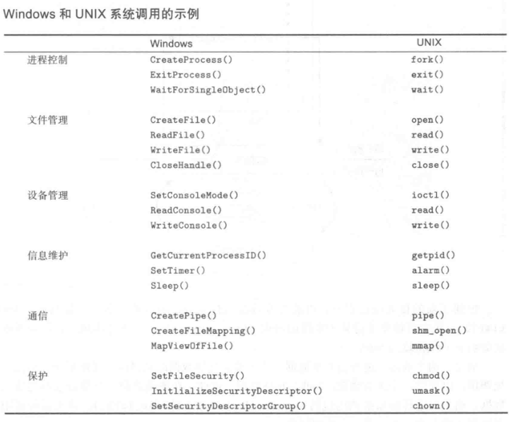
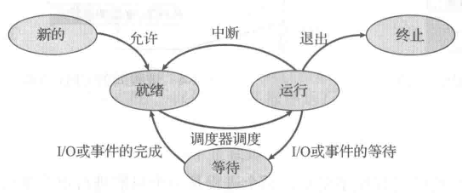
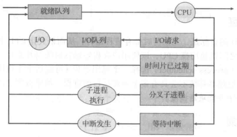

操作系统是管理计算机硬件的程序，还为应用程序提供基础，并且充当用户和计算机硬件的中介。操作系统可以看作资源分配器，负责分配CPU时间、内存空间、文件储存空间、IO设备等；同时也是控制程序，负责管理用户程序的执行。

# 计算机启动

1. BOIS

 * 当电源打开或重启时，会运行一个初始程序，即 BIOS，它位于计算机固件上，如只读内存(ROM，Read-Only Memory)。
 * BIOS 首先检查硬件能否满足运行的基本条件，叫硬件自检 即 POST，Power-On Self-Test。
 * 如果硬件出现问题，主板会发出不同含义的蜂鸣，启动中止。如果没有问题，屏幕就会显示出CPU、内存、硬盘等信息。
 * POST完成后，BIOS需要将控制权转交给下一阶段的启动程序，这时需要知道下一阶段启动程序具体存放的设备，BIOS根据外部储存设备的排序(Boot Sequence)，将控制权优先转交给排在前面的设备。

2. 主引导记录

 * BIOS 将控制权交给储存设备后，计算机读取该设备的第一个扇区，即 512 字节，如果最后两个字节是 0x55 和 0xAA ，表明设备可以启动，如果不是，控制权转交给启动顺序的下一个设备。
 * 前面512字节叫做 主引导记录，即MBR，Master boot record，由三部分组成：调用操作系统的机器码、分区表、签名（0x55和0xAA），它的作用是告诉计算机到硬盘的哪一个位置去找操作系统，将控制权转交给哪个区。
 * 分区表长度只有64字节，分为4项，每项16字节，所以一个硬盘最多只能分四个主分区。
 * 主分区的第一个字节标识该分区是否是激活分区（0x80），控制权要转交给激活分区，四个主分区里面只能有一个是激活的。
 * 最后四个字节决定主分区长度，所以一个主分区的扇区总数最多不超过2的32次方，也就是一个分区最大不超过2TB，如果想使用更大的硬盘，只有2个方法：一是提高每个扇区的字节数，二是增加扇区总数。

3. 硬盘启动：控制权就要转交给硬盘的某个分区了，分成三种情况：

 卷引导记录：

 * 四个主分区里面，只有一个是激活的。计算机会读取激活分区的第一个扇区，叫做卷引导记录（VBR，Volume boot record），它作用就是告诉计算机操作系统在这个分区里的位置，随后计算机就会加载操作系统。

 扩展分区和逻辑分区：

 * 随着硬盘变大，4个分区不够用，按照规定，有且有且仅有一个区可以被定义成扩展分区，即这个区里面又分成多个区，这种分区里的分区叫做逻辑分区。
 * 计算机先读取扩展分区的第一个扇区，叫做扩展引导记录（EBR，Extended boot record），它包含64字节的分区表，里面有两个分区项，一个是自己，一个是下一个逻辑分区的位置。
 * 若没有找到激活分区，计算机接着读取第二个逻辑分区的第一个扇区，以此类推，直到某个逻辑分区的分区表只包含它自身为止（即只有一个分区项）。因此，扩展分区可以包含无数个逻辑分区。
 * 但是，似乎很少通过这种方式启动操作系统。如果操作系统确实安装在扩展分区，一般采用下一种方式启动。

 启动管理器：

 * 计算机读取"主引导记录"前面446字节的机器码之后，不再把控制权转交给某一个分区，而是运行事先安装的"启动管理器"（boot loader），由用户选择启动哪一个操作系统。Linux环境中，目前最流行的启动管理器是Grub。

4. 操作系统

 * 控制权转交给操作系统后，操作系统的内核首先被载入内存。
 * 以Linux系统为例，先载入/boot目录下面的kernel。
 * 内核加载成功后，第一个运行的程序是/sbin/init。它根据配置文件（/etc/initab）产生init进程。这是Linux启动后的第一个进程，pid进程编号为1，其他进程都是它的后代。
 * 然后，init进程加载系统的各个模块，比如窗口程序和网络程序，直至执行/bin/login程序，跳出登录界面，等待用户输入用户名和密码。
 * init进程加载完成，系统就完成启动，开始等待事件的发生。

# 事件

事件发生通常通过硬件或软件的中断来产生，硬件可以随时通过系统总线发送信号到CPU，以触发中断，软件也可通过执行特别操作即系统调用，以触发中断，陷阱就是一种由软件生成的中断。
当CPU被中断时，它会停止正在做的事， 并立即转到中断服务程序的开始地址执行，等中断服务程序执行完成后，CPU重新执行被中断的计算。

# 模式

为保证操作系统的正确运行，必须区分操作系统代码和用户代码的执行，至少需要两种单独运行模式：用户模式、内核模式，将可能引起损害的机器指令作为特权指令，只有在内核模式下才允许执行。
运行模式通过计算机硬件的模式位来支持：内核模式（0），用户模式（1）。

# 定时器

为了防止用户程序陷入死循环或不调用系统服务并且不将控制返回给操作系统，可以使用定时器，在控制权交到用户之前，操作系统会使用定时器设置中断，当定时器中断时，控制权自动转到操作系统。

# 存储

1. 内存

 * CPU只能从内存中加载指令，因此执行程序必须位于内存，内存也称随机访问内存（RAM，Random Access Memory），除此之外还有 ROM 、寄存器、高速缓存等。
 * 所有形式的内存都提供字节数组，每个字节都有地址，操作特定内存地址通过 load 和 store 指令，load 指令将内存字节保存到CPU寄存器，store指令将寄存器保存到内存，除此之外，CPU还会自动加载内存指令以便执行。

2. 硬盘

 * 理想情况下，程序和数据都应永久驻留在内存中，但由于内存太少，不能永久保存所需要的程序和数据，同时内存是易失性设备，掉电会失掉所有内容，所以使用硬盘来永久储存大量数据。
 * 速度：寄存器 > 高速缓存 > 内存 > 固态硬盘 > 硬盘。

# IO

* 每个计算机系统都包含CPU和多个设备控制器，他们通过共同总线连一起，每个设备控制器管理某一特定类型的设备。
* 每个设备控制器维护一定量的本地缓冲存储和一组特定用途的寄存器，设备控制器负责在所控制的外围设备与本地缓冲存储之间进行数据传递。
* 操作系统为每个设备控制器提供一个驱动程序，驱动程序为操作系统其它部分提供统一的设备访问接口。

## 流程

1. 开始IO时，驱动程序加载设备控制器的寄存器，通过寄存器中内存，决定采取什么操作，如 从键盘中读取一个字符。
2. 控制器开始从设备向本地缓冲区传输数据，一旦数据传输完成，设备控制器会通过中断通知驱动程序。
3. 驱动程序返回控制到操作系统，对于读操作，数据或数据指针也会返回，而对于其他操作，驱动返回状态信息。

这种IO中断驱动适合移动少量数据，但像磁盘IO大量数据移动则采用DMA，Direct Memory Access 技术，驱动只需要为这种IO设备设置好缓冲、指针和计数器之后，设备控制器可在本地缓冲和内存之间整块数据传输，无需CPU干预，每块只产生一个中断，来告知驱动已完成，而不是像低速设备一样每个字节产生一个中断，当设备控制器执行这些操作时，CPU可以进行其他工作。

# 多道程序设计

操作系统在内存中同时保存多个任务，通过安排作业使得CPU总有一个作业执行，提高CPU利用率。

由于主存太小不能容纳所有作业，这些作业首先保存在磁盘的作业池，该作业池包含磁盘上的、等待分配内存的所有进程，内存的作业集为作业池的作业集的子集。

操作系统会从内存作业集中选择一个作业执行，该作业可能等待某个任务，比如IO，CPU会简单切到另一个作业，以便执行。

作业的取决CPU调度，有多少作业可以加载到内存取决于作业调度，内存同时保存多个程序需要一定形式的内存管理。

# 命令解释程序

命令解释程序会在一个任务开始或用户首次登陆时运行，对于具有多个可选命令解释程序的系统，解释程序被称为 shell 。

# 系统调用

系统调用分为六大类：

* 进程控制。
* 文件管理。
* 设备管理。
* 信息维护。
* 通信。
* 保护。

# 系统程序

系统程序为程序开发和执行提供了方便的环境，可分为这几类：

* 文件管理：文件创建、删除等。
* 状态信息：日期、注册表等。
* 文件修改：用于修改、查找文件内容。
* 程序语言支持：常用程序语言的编译程序、汇编程序、调试程序、解释程序。
* 程序加载与执行：程序一旦汇编或编译后，要加载到内存才能执行，系统提供绝对加载程序、重定位程序、链接编辑器、覆盖式加载程序等。
* 通信：提供进程、用户、计算机系统之间创建虚拟连接的机制。
* 后台服务。

# 进程管理

进程是大多数系统的工作单元。

## 进程内容

* 进行是执行中程序，但不只是程序代码，程序代码被称为代码段。
* 进程还包括当前状态，比如程序计数器的值、寄存器的内容。
* 进程堆栈（函数参数、返回地址、局部变量）。
* 数据段（全局变量）。
* 还可能包含堆，这是进程运行时动态分配的内存。

## 进程状态

* New：进程正在创建。
* Running：指令正在执行。
* Waiting：进程等待发生某个事件（如I/O完成信号）。
* Ready：进程等待分配CPU。
* Terminated：进程完成执行。

## 进程控制块（PCB）

包含许多与某个进程相关的信息：

* 进程状态。
* 程序计数器。
* CPU寄存器。
* CPU调度信息：如进程优先级、调度队列指针等。
* 内存管理信息
* 记账信息：比如CPU时间、实际使用时间、时间期限等。
* IO状态信息：分配给进程的IO设备列表，打开文件列表等。

## 进程调度

进程执行在CPU执行和IO等待两个状态交替进行。

### 调度队列

进程在进入系统时，会被加到作业队列中，这个队列包括系统内的所有进程。驻留在内存中的、就绪的、等待运行的进程保存在就绪队列上。
新进程被加到就绪队列，它就在就绪队列中等待，直到被选中执行，当进程执行时，可能会发生以下事件：

* 进程可能发出IO请求，并被放到IO队列，当IO完成后会被重新放回到就绪队列。
* 进程可能创建一个新的子进程，并等待其终止后重新被放回到就绪队列。
* 进程可能由于中断被强制释放CPU，并被放回到就绪队列。

### 调度程序

调度程序分为长期调度程序、短期调度程序、中期调度程序。

对于批处理系统，提交进程多于可以立即执行的，这次进程被保存到大容量储存设备的缓存池，长期调度程序从该池中选择进程加入到内存以便执行。
短期调度程序从准备执行的进程中选择进程并分配CPU，执行频率较高，通常进程可能执行几毫秒就会等待IO请求，所以短期调度程序必须快速，UNIX或Windows分时系统通常没有长期调度程序。
有些操作系统还会引入中期调度程序，即将进程从内存（CPU竞争）中移除，从而降低多道程序程度，被称为swap，进程也可以被重新调入内存，并在中断处继续执行。

调度程序包含3个功能：

* 切换上下文。
* 切换到用户模式。
* 跳转到用户程序合适的位置，以便重新启动程序。

#### 上下文切换

切换CPU从一个进程到另外一个进程，需要保存当前进程状态和恢复另一个进程的状态（包括内核模式和用户模式），叫做上下文切换。

进行上下文切换时，内核会将旧进程状态保存在PCB中，然后加载新进程的上下文。

#### 抢占调度

需要进行CPU调度的情况：

1. 当一个进程从运行状态切换到等待状态：IO请求、wait()调用。
2. 当一个进程从运行状态切换到就绪状态：中断。
3. 当一个进程从等待状态切换到就绪状态：IO完成。
4. 当一个进程终止。

如果调度值发送1、4情况，则调度方案是非抢占的，否则称为抢占的。

### 调度算法

1. 先到先服务调度：非抢占式，平均等待时间较长。
2. 最短作业优先调度：平均等待时间最小，但难以知道下一次CPU执行的长度。
3. 优先级调度：主要问题是无穷阻塞，对于低优先级进程可能永远没有机会运行，解决办法是根据等待时间增加进程的优先级。
4. 轮转调度：抢占式，为每个进程分配不超过一个时间片的CPU，时间片大小通常为10~100ms，如果时间片太长退化成先到先服务调度，如果时间片太短就会有频繁的进行上下文切换。
5. 多级队列调度：进程通常分为前台进程和后台进程，算法将就绪队列分成多个单独队列。
6. 多级反馈队列调度：允许进程在不同优先级队列之间迁移，比如根据等待时间增加进程的优先级、根据进程预估运行时间确定优先级。

## 进程运行

进程创建：

进程执行过程中可能创建多个新的进程，创建的进程成为父进程，新的进程称为子进程，新进程可以再创建其他进程，从而形成进程树。

当进程创建新进程时，可能有两种执行情况：

* 父进程与子进程并发执行。
* 父进程等待，直到某个或全部子进程执行完，通过系统调用 wait() 。

新进程地址空间有两种可能：

* 子进程是父进程的复制品，具有和父进程同样的程序和数据，对于unix，通过系统调用fork()创建，允许父子进程通信，两个进程都继续执行处于系统调用fork()之后的命令。
* 子进程加载另一个新程序，对于unix，通过系统调用exec()创建，加载新程序到内存，并开始执行。

进程终止：

当进程完成执行，并通过系统调用exit()请求操作系统删除自身时，进程终止。

父进程终止子进程的原因：

* 子进程超过他所分配的资源。
* 分配给子进程的任务不再需要
* 父进程正在退出。

进程通信：

进程通信有两种模型：共享内存、消息传递。

消息传递对于交换少量数据很有用，因为无需避免冲突，共享内存可以快于消息传递，因为消息传递实现常采用系统调用，因此需要消耗更多时间以便内核介入，但共享内存只需要建立共享内存时系统调用。

## 线程

线程是CPU使用的基本单元，它包括 线程ID、程序计数器、寄存器、堆栈、另外还有一些同一进程的其他线程的共享代码段、数据段和其他操作系统资源。

线程分为用户级线程和内核级线程，内核线程由操作系统调度，用户线程由线程库来管理，内核并不知道它们，用户级线程为了运行在CPU上，最终应映射到相关的内核级线程。

## 死锁

死锁条件：

* 互斥：资源只能被一个进程占用。235页
