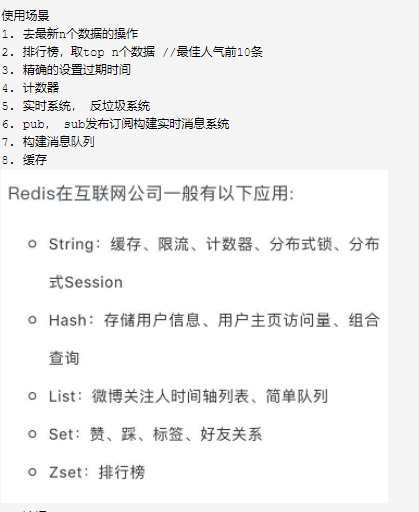
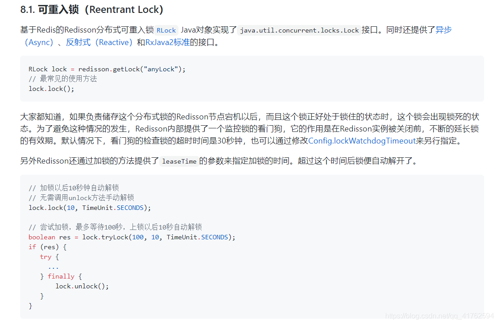
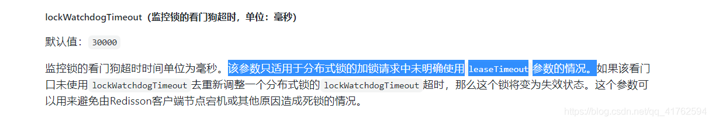
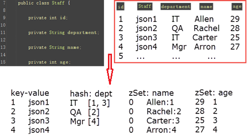

## Redis的数据结构

### 1、SDS(Simple Dynamic String)，简单动态字符串


| 数据结构   | 备注                                                   |
| ------------ | -------------------------------------------------------- |
| int len    | 已使用空间长度                                         |
| int free   | 未使用空间长度                                         |
| char[] buf | 保存的字符串，以空字符‘\0’结束，不计入已使用空间长度 |

优势：

1、获取字符串长度时间复杂度O(1)，c语言需要遍历数组时间复杂度O(n)。

2、杜绝空间溢出，拼接字符串时，利用 free可以先检查是否有足够空间，可进行扩容后再拼接。

3、减少修改字符串带来的内存分配，当增长字符串时，采用预分配，当长度小于1m时，会分配free=len，大于1m时，free= 1m；当缩减字符串时，惰性释放，增加free值，并不会立马回收 buf。

4、可以保存特殊字符，因为使用len确定字符长度，而不是'\0';

### 2、链表

1、双向无环链表，对链表访问null就是终点，头部和尾部各有一个null

2、len表示长度，查询长度时间复杂度O1

### 3、字典


| 数据结构                      | 备注                                                                                                                                     |
| ------------------------------- | ------------------------------------------------------------------------------------------------------------------------------------------ |
| dictEntry **table  哈希表数组 | 每个dictEntry就是一个节点，是一个链表，相同hash值的key存在同一个节点中，使用拉链法，没有链表尾部，所以新加入节点在链表头，时间复杂度O(1) |
| size                          | 哈希表数组总大小                                                                                                                         |
| sizemask                      | 哈希表数组总大小掩码，size-1                                                                                                             |
| used                          | 已经使用节点数量                                                                                                                         |

hash表扩展实际，没有执行bgsave时负载因子大于等于1，执行bgsave时负载因子大于等于5

渐进式rehash，先扩展出一另外一个hash表h1，在update、delete、find时同时在两个hash表进行，除此之外还将之前的hash表h0迁移到新表，直到之前的hash表为空时，将h1变为h0,完成迁移。

### 4、跳跃表

跳跃表就是添加了多级索引的链表，用在有序集合键

### 5、整数集合

保存整数值，有序并且不会出现重复元素。

### 6、压缩列表

一个数组，每个数组节点包含该节点的长度，这样既拥有了数组连续访问的优势，同时每个节点长度不一样，节约了空间。这里的压缩列表使用的是从尾部开始访问所以，保存的是前一个节点的长度。

### 7、对象

使用对象来保存键和值，对象类型：

字符串string、列表list、哈希hash、集合set、有序集合zset。

字符串的编码可以是int，raw，embstr。

列表的编码可以是ziplist、linkedlist。

哈希的编码可以是ziplist，hashtable。

集合的编码可以是intset、hashtable。

有序集合的编码可以是ziplist、skiplist。

## Redis的常用命令

### 1、字符串


| 命令                            | 例子                                             | 结果              | 描述                                                                                         |
| --------------------------------- | -------------------------------------------------- | ------------------- | ---------------------------------------------------------------------------------------------- |
| `set key value`                 | `set key hello`                                  | 成功返回`OK`      | 设置指定 key 的值                                                                            |
| `get key`                       | `get key`                                        | 设置的值或`(nil)` | 获取指定 key 的值                                                                            |
| `setnx key value`               | `setnx key "hello"`                              | 成功`1` 失败 `0`  | key 不存在时设值                                                                             |
| `setex key seconds value`       | `setex key 60 "hello"`                           | 成功返回`OK`      | 设 key 值 过期时间为秒                                                                       |
| `psetex key milliseconds value` | `psetex key 1000 "Hello"`                        | 成功返回`OK`      | 设 key 值 过期时间为毫秒                                                                     |
| `getset key value`              | `getset key hello1`                              | 返回旧值          | 设新 key 返回旧 key 值                                                                       |
| `mget key1 [key2]`              | `mget key1 key2 key3`                            | 返回列表值        | 批量获取值                                                                                   |
| `mset key value [key value]`    | `mset key1 "hello1" key2 "hello2" key3 "hello3"` | 成功返回`OK`      | 批量设置值，原子操作，用户不会看到有些 key 值被修改，而另一些 key 值没变，不会有这一中间过程 |
| `msetnx key value [key value]`  | `msetnx key1 "Hello" key2 "there"`               | 成功`1` 失败 `0`  | 批量设置值 key 都不存在才能成功，即使有一个可以存在，都全部不成功，原子操作                  |
| `incr key`                      | `incr key1`                                      | `1`               | 累加 1 默认 0                                                                                |
| `decr key`                      | `decr key1`                                      | `-1`              | 累减 1 默认 0                                                                                |
| `incrby key increment`          | `incrby key 2`                                   | `2`               | 累加指定值 默认 0                                                                            |
| `decrby key decrement`          | `decrby key 2`                                   | `-2`              | 累减指定值 默认 0                                                                            |
| `incrbyfloat key increment`     | `incrbyfloat key 0.2` `incrbyfloat key -0.2`     | `0.2` `-0.2`      | 浮点计算                                                                                     |
| `append key value`              | `append key 123`                                 | 字符串长度`3`     | 追加数据                                                                                     |

### 2、哈希

```bash
# 将哈希表 key 中的字段 field 的值设为 value 
# Redis 4.0 起，可一次设置一个或多个 field/value 对
# 字段是哈希表中的一个新建字段，并且值设置成功，返回 1 。
# 哈希表中域字段已经存在且旧值已被新值覆盖，返回 0 。
hset key field value

# 获取存储在哈希表中指定字段的值
hget key field

# 查看哈希表 key 中，指定的字段是否存在
hexists key field

# 删除一个或多个哈希表字段
hdel key field1 [field2]

# 获取在哈希表中指定 key 的所有字段和值
hgetall key

# 获取所有哈希表中的字段
hkeys key

# 获取哈希表中所有值
hvals key

# 只有在字段 field 不存在时，设置哈希表字段的值
hsetnx key field value

# 同时将多个 field-value （字段-值）对设置到哈希表 key 中
# Redis 4.0 起，HSET 可替代该命令
hmset key field1 value1 [field2 value2]

# 获取所有给定字段的值
hmget key field1 [field2]

# 为哈希表 key 中的指定字段的整数值加上增量 increment
hincrby key field increment

# 为哈希表 key 中的指定字段的浮点数值加上增量 increment 
hincrbyfloat key field increment

# 获取哈希表中字段的数量
hlen key

# 返回哈希表中值长度
hstrlen key field

# 迭代哈希表中的键值对（count 在值少的情况下会失败）
#  hscan hkey 0 match "na*"
hscan key cursor [MATCH pattern] [COUNT count]
```

### 3、列表

```bash
# 将一个或多个值插入到列表头部
lpush key value1 [value2]

# 将一个值插入到已存在的列表头部，需要key存在，不存在则不插入返回0
lpushx key value

# 获取列表指定范围内的元素
lrange key start stop

# 移出并获取列表的第一个元素，弹出插入的最后一个元素，lpush+lpop  先进后出，栈
lpop key

# 获取列表长度
llen key

# 在列表的元素前或者后插入元素，before就是靠近lpush新插入的一端，after就是远离的一端
linster key before|after pivot value

# 通过索引获取列表中的元素,索引从0开始
lindex key index

# 通过索引设置列表元素的值，替换原有该位置上的值
lset key index value

# 移除列表元素
# count > 0: 从头到尾扫描，删除个数为 count，值为 value 的元素。
# count < 0: 从尾到头扫描，删除个数为 count（绝对值），值为 value 的元素。
# count = 0: 移除所有值为 value 的元素。
lrem key count value

# 对一个列表进行修剪(trim)。
# 让列表只保留指定区间内的元素，不在指定区间之内的元素都将被删除。
# 如果 start 超过列表尾部（索引最大值），或者 start > stop`，结果会是列表变成空表（该 key 会被移除）。
# 如果 stop 超过列表尾部（索引最大值），Redis 会将其当作列表的最后一个元素。

# LTRIM 的一个常见用法是和 LPUSH / RPUSH 一起使用。 例如：
# LPUSH lkey value
# LTRIM lkey 0 99
# 这对命令会将一个新的元素 push 进列表里，并保证该列表不会增长到超过100个元素。
# 这是很有用的，比如当用 Redis 来存储日志。 需要特别注意的是，当用这种方式来使用 LTRIM 的时候，操作的复杂度是 O(1) ， 因为平均情况下，每次只有一个元素会被移除。
ltrim key start stop

# 在列表尾部添加一个或多个值
rpush key value1 [value2]

# 为已存在的列表添加值
rpushx key value

# 移除列表的最后一个元素，返回值为移除的元素。lpush+rpop  先进先出 队列
rpop key

# 移除列表的最后一个元素，并将该元素添加到另一个列表并返回，source=key1  destination=key2
rpoplpush source destination

# 移出并获取列表的第一个元素， 如果列表没有元素会阻塞列表直到等待超时或发现可弹出元素为止，lpop的阻塞版本。
blpop key1 [key2] timeout

# 移出并获取列表的最后一个元素，如果列表没有元素会阻塞列表直到等待超时或发现可弹出元素为止，rpop的阻塞版本。
brpop key1 [key2] timeout

# 从列表中弹出一个值，将弹出的元素插入到另外一个列表中并返回它。
# 如果列表没有元素会阻塞列表直到等待超时或发现可弹出元素为止。
brpoplpush source destination timeout
```

### 4、集合（string类型的无序集合，添加、删除、查找的时间复杂都是 O(1)）

```bash
# 将一个或多个成员元素加入到集合中
sadd key member1 [member2]

# 获取集合中全部成员
smembers key

# 判断 member 是否为 集合 key 中的成员
sismember key member

# 获取集合的成员数
scard key

# 随机取集合中一个或多个成员移除并返回
spop key [count]

# 随机取 count 个成员，不删除
srandmember key [count]

# 移除集合中一个或多个成员
srem key member1 [member2]

# 将成员 member 从 source 集合移动到 destination 集合
smove source destination member

# 返回第一个集合独自拥有的成员
sdiff key1 [key2] 

# 返回第一个集合独自拥有的成员，并存入 destination
sdiffstore destination key1 [key2]

# 返回所有给定集合的成员交集
sinter key1 [key2]

# 返回所有给定集合的成员交集，并存入 destination
sinterstore destination key1 [key2]

# 返回给定集合并集
sunion key1 [key2]

# 返回给定集合并集，并存入 destination
sunionstore destination key1 [key2]

# 迭代集合中键的元素
sscan key cursor [MATCH pattern] [COUNT count]
```

### 5、有序集合

有序集合和集合一样也是 String 类型元素的集合，且不允许重复的成员。

不同的是每个元素都会关联一个 double 类型的分数。

Redis 正是通过分数来为集合中的成员进行从小到大的排序。

有序集合的成员是唯一的，但分数 score 却可以重复。

添加、删除、查找的时间复杂都是 O(1)。

```bash
# 向有序集合添加一个或多个成员，或者更新已存在成员的分数
zadd key [NX|XX] [CH] [INCR] score1 member1 [score2 member2]

# 通过索引区间返回有序集合指定区间内的成员
zrange key start stop [WITHSCORES]

# 返回有序集中指定区间内的成员，通过索引，分数从高到低
zrevrange key start stop [WITHSCORES]

# 获取有序集合的成员个数
zcard key

# 计算在有序集合中指定区间分数的成员数（默认闭区间）
zcount key min max

# 有序集合中对指定成员的分数加上增量 increment
zincrby key increment member 

# 返回有序集中，成员的分数值
zscore key member

# 返回有序集合中指定成员的索引
zrank key member

# 返回有序集合中指定成员的排名，有序集成员按分数值递减(从大到小)排序
zrevrank key member

# 移除有序集合中的一个或多个成员
zrem key member1 [member2]

# 移除有序集合中给定的排名区间的所有成员
zremrangebyrank key start stop

# 移除有序集合中给定的分数区间的所有成员
zremrangebyscore key min max

# 通过分数返回有序集合指定区间内的成员
zrangebyscore key min max [WITHSCORES] [LIMIT offset count]

# 返回有序集中指定分数区间内的成员，分数从高到低排序
zrevrangebyscore key max min [WITHSCORES]

# 在有序集合中计算指定字典区间内成员数量
zlexcount key min max

# 通过字典区间返回有序集合的成员
zrangebylex key min max [LIMIT offset count]

# 通过字典区间返回有序集合的成员，倒序
zrevrangebylex key max min [LIMIT offset count]

# 移除有序集合中给定的字典区间的所有成员
zremrangebylex key min max

# 计算给定的一个或多个有序集的并集，并存储在新的 destination 中
zunionstore destination numkeys key1 [key2]

# 计算给定的一个或多个有序集的交集并将结果集存储在新的有序集合 destination 中
zinterstore destination numkeys key1 [key2]

# 迭代有序集合中的元素（包括元素成员和元素分值）
zscan key cursor [MATCH pattern] [COUNT count]
```

### 6、键（key）

```bash
# 当 key 存在时删除 key
del key1 [key2]

# 当 key 存在时删除 key（异步删除）
unlink key1 [key2]

# 检查给定 key 是否存在
exists key1 [key2]

# 给 key 设置一个过期时间，单位秒
expire key seconds

# 设置 key 的指定过期时间，秒时间戳参数（10 位时间戳）
expireat key timestamp

# 给 key 设置一个过期时间，单位毫秒
pexpire key milliseconds

# 设置 key 的指定过期时间，毫秒时间戳参数（13 位时间戳）
pexpireat key milliseconds-timestamp

# 查找符合给定条件的 key
# 可使用占位符 ? * [a-z] [^a-d] 等
# 禁止使用
keys pattern

# 将当前 key 移动到指定数据库中
move key db

# 移除 key 的过期时间，key 将不会过期删除。
persist key

# 查询当前 key 的剩余生存时间，单位秒
ttl key

# 查询当前 key 的剩余生存时间，单位毫秒
pttl key

# 从当前数据库随机返回一个 key
randomkey

# 修改 key 名称，当 newkey 存在时直接被覆盖。之前newkey储存的value变为key储存的value。
rename key newkey

# 修改 key 名称，仅当 newkey 不存在时才会成功。
renamenx key newkey

# 返回当前 key 的数据类型
type key

# 序列化 key（取出redis值，以字符串形式保存）
dump key

# 反序列化，并绑定 key。（值由 dump 生成），参数 ttl 以毫秒为单位为 key 设置生存时间；如果 ttl 为 0 ，那么不设置生存时间。
restore key ttl serialized-value

# 迭代数据库中键
scan cursor [MATCH pattern] [COUNT count]
```

## redis的使用场景



### String

#### 1、分布式锁

**分布式锁有以下几个特点：**

1. 互斥性：和我们本地锁一样互斥性是最基本的，但是分布式锁需要保证在不用节点的不同线程的互斥。
2. 可重入性：同一个节点上的同一个线程如果获取锁之后那么也可以再次获取这个锁。
3. 锁超时：和本地锁一样支持锁超时，防止死锁。
4. 高效，高可用：加锁和解锁需要高效，同时也需要保证高可用防止分布式锁失效，可以增加降级。
5. 支持阻塞和非阻塞：和 ReentrantLock 一样支持 lock 和 trylock 以及 tryLock(long timeOut)。
6. 支持公平锁和非公平锁(可选)：公平锁的意思是按照请求加锁的顺序获得锁，非公平锁就相反是无序的。这个一般来说实现的比较少。

**常见的分布式锁：**
我们一般实现分布式锁有以下几个方式：

1. MySQL

   ```sql
   # 利用mysql的隔离性：唯一索引
   # 创建一张锁表
   CREATE TABLE `methodLock` ( 
     `id` int(11) NOT NULL AUTO_INCREMENT COMMENT '主键', 
     `method_name` varchar(64) NOT NULL DEFAULT '' COMMENT '锁定的方法名', 
     `desc` varchar(1024) NOT NULL DEFAULT '备注信息', 
     `update_time` timestamp NOT NULL DEFAULT CURRENT_TIMESTAMP ON UPDATE CURRENT_TIMESTAMP COMMENT '保存数据时间，自动生成', 
     PRIMARY KEY (`id`), 
     UNIQUE KEY `uidx_method_name` (`method_name `) USING BTREE 
   ) ENGINE=InnoDB DEFAULT CHARSET=utf8 COMMENT='锁定中的方法';

   # 锁表
   insert into methodLock(method_name,desc) values ('method_name','desc')
   # 解锁
   delete from methodLock where method_name ='method_name'
   ```
2. ZK

   ```bash
   # zookeeper实现分布式锁的原理主要是利用顺序临时节点的特性。

   #获取锁
   #所有客户端都试图创建同一个临时节点A，zookeeper会保证所有客户端中只有一个能创建成功，那么就可以认为该客户端获得了锁，其他客户端就要到临时节点A上注册一个子节点变更的Watcher监听。

   #释放锁
   #以下两种情况，都可能释放锁：
   # 1、当前获取锁的客户端机器发生宕机，那么zookeeper上的这个临时节点就会被删除。
   # 2、正常业务逻辑执行完后，客户端会主动将自己创建的临时节点删除。
   # 无论什么情况移除了节点A，ZooKeeper都会通知所有在该节点上注册了子节点变更Watcher的客户端，这些客户端在接收到通知后，再次重新发起分布式锁获取。
   ```
3. Redis

   ```bash
   # 方案一
   # Redis可以利用命令Setnx()来实现分布式锁，性能是最好的，但是可靠性没有zookeeper好，而且通过超时时间来控制锁的失效时间并不可靠。
   # 加锁
   SETNX  product:10001  true 		//返回1代表获取锁成功
   SETNX  product:10001  true 		//返回0代表获取锁失败
   SET product:10001 true  ex  10  nx	//增加一个10S的超时时间，避免程序挂了，锁一直不释放
   # 解锁
   DEL  product:10001			    //执行完业务释放锁
   # 但是这样会有问题
   # 举个例子：
   # 线程 1 在开始的时候比较幸运，获得了锁，最先开始执行任务，但是，由于他比较耗时，最后锁超时自动释放了他都还没执行完。 
   # 因此，线程 2 和线程3 的机会来了。而这一轮，线程2 比较幸运，得到了锁。
   # 可是，当线程2正在执行任务期间，线程1 执行完了，还把线程2的锁给释放了。
   # 所以使用lua改进逻辑：
   1. 线程1 准备释放锁 ， 锁的key 为 mylock， value 为 thread1_magic_num
   2. 查询当前锁 current_value = get mylock
   3. 判断    if current_value == thread1_magic_num  -- > 是  我（线程1）的锁
             else                                   -- > 不是 我（线程1）的锁
   4. 是我的锁就释放，否则不能释放（而是执行自己的其他逻辑）。  

   # 不靠谱的情况：
   # 如果是在redis sentinel集群中,当我们申请一个锁的时候，对应就是一条命令 `setnx mykey myvalue`。
   # 在redis sentinel集群中，这条命令先是落到了主库。假设这时主库down了，而这条数据还没来得及同步到从库，sentinel将从库中的一台选举为主库了。
   # 这时，我们的新主库中并没有mykey这条数据，若此时另外一个client执行 `setnx mykey hisvalue` , 也会成功，即也能得到锁。
   # 这就意味着，此时有两个client获得了锁。

   # redlock
   # 使用redlock算法，需要多个redis实例，加锁的时候，它会想多半节点发送 setex mykey myvalue 命令，只要过半节点成功了，那么就算加锁成功了。
   # 释放锁的时候需要想所有节点发送del命令。
   1. 获取当前的时间（单位是毫秒）。
   2. 使用相同的key和随机值在N个节点上请求锁。这里获取锁的尝试时间要远远小于锁的超时时间，防止某个masterDown了，我们还在不断的获取锁，而被阻塞过长的时间。
   3. 只有在大多数节点上获取到了锁，而且总的获取时间小于锁的超时时间的情况下，认为锁获取成功了。
   4. 如果锁获取成功了，锁的超时时间就是最初的锁超时时间进去获取锁的总耗时时间。
   5. 如果锁获取失败了，不管是因为获取成功的节点的数目没有过半，还是因为获取锁的耗时超过了锁的释放时间，都会将已经设置了key的master上的key删除。

   # 可重入锁
   # 分布式可重入锁实现方式有两种：
   1. 基于 ThreadLocal 实现方案

      private static ThreadLocal<Map<String, Integer>> LOCKS = ThreadLocal.withInitial(HashMap::new);
      每个线程都可以通过 ThreadLocal获取自己的 Map实例，Map 中 key 存储锁的名称，而 value存储锁的重入次数。

      加锁：
      	首先判断当前线程是否已经已经拥有该锁，若已经拥有，直接对锁的重入次数加 1。
      	若还没拥有该锁，则尝试去 Redis 加锁，加锁成功之后，再对重入次数加 1 。’
      释放锁：
       释放锁的时首先判断重入次数，若大于 1，则代表该锁是被该线程拥有，所以直接将锁重入次数减 1 即可。
   	若当前可重入次数小于等于 1，首先移除 Map中锁对应的 key，然后再到 Redis 释放锁。
   	这里需要注意的是，当锁未被该线程拥有，直接解锁，可重入次数也是小于等于 1 ，这次可能无法直接解锁成功。

   	存在问题：
   	1.会存在过期时间的问题，如果redis已经过期，本地还存在。
   	2.统一客户端不同线程不可重入。
   	3.map操作和redis操作非原子性操作。

   2. 基于 Redis Hash 实现方案
       使用 redis的哈希表来储存可重入次数，然后使用lua脚本判断逻辑，

   #方案二
   # 使用Redisson
   # 使用redisson客户端进行分布式锁的设置，使用tryLock方法对分布式锁的设置进行判断，执行不同的逻辑，如果业务逻辑执行的过程中服务宕机，那么会由redisson提供的看门狗监控锁进行兜底，在实例结束后的一段时间内对锁进行清除。看门狗设置过期的时间默认是30s，每30 / 3 s进行一次判断，我们也可以对看门狗时间进行一个手动的设置。
   @Configuration
   public class redissonConfig {

       @Bean
       public RedissonClient configRedisson(){
           Config config = new Config();
           config.useSingleServer().setAddress("redis://172.0.0.1:6379")
           .setPassword("777777");
           config.setCodec(new StringCodec());
           //设置看门狗的时间，不配置的话默认30000 
           config.setLockWatchdogTimeout(12000);
           RedissonClient redisson =  Redisson.create(config);
           return redisson;
       }
   }
   ```





#### 2、计数器

利用`INCR`实现统计数据的增加，原子操作，并且速度快。

#### 3、分布式全局Id

使用`INCRBY  orderId  1000 `，一次性拿1000个ID，保存到服务器自己内存中，然后自己服务器内部保障这1000个ID的分配。

#### 4、缓存

```bash
# 缓存的收益和成本
  收益：
  	1.加速读写。
  	2.降低后端负载。
  成本：
  	1.数据不一致。
  	2.代码维护成本。
  	3.运维成本。
# 缓存更新策略
	1.LRU(Least Recently Used-最近最久未使用-针对访问时间)
	  LFU(Least Frequently Used-最近最少使用-针对访问次数)
	  FIFO(First in First out-先进先出)
	  算法剔除
	2.超时剔除
	3.主动更新

	低一致性业务，或者只读业务使用最大内存算法淘汰策略+超时剔除。
	高一致性业务使用超时剔除+主动更新，但仍然会有一致性问题。

# 写数据一致性问题
	# 数据读取流程
		先读缓存，如果缓存没读到，则去读DB，之后再异步将数据刷回缓存
	#缓存和数据库双写的四种方案：
        1.先更新缓存，再更新数据库；
        2.先更新数据库，再更新缓存；
        3.先淘汰缓存，再更新数据库；
        4.先更新数据库，再淘汰缓存。
  
#更新还是淘汰？
    淘汰cache：
    优点：操作简单，无论更新操作是否复杂，直接将缓存中的旧值淘汰
    缺点：淘汰cache后，下一次查询无法在cache中查到，会有一次cache miss，这时需要重新读取数据库
    更新cache：
      更新chache的意思就是将更新操作也放到缓冲中执行，并不是数据库中的值更新后再将最新值传到缓存
    优点：命中率高，直接更新缓存，不会有cache miss的情况
    缺点：更新cache消耗较大
      当更新操作简单，如只是将这个值直接修改为某个值时，更新cache与淘汰cache的消耗差不多
      但当更新操作的逻辑较复杂时，需要涉及到其它数据，如用户购买商品付款时，需要考虑打折等因素，这样需要缓存与数据库进行多次交互，将打折等信息传入缓存，再与缓存中的其它值进行计算才能得到最终结果，此时更新cache的消耗要大于直接淘汰cache
    所以选择直接淘汰缓存更好，如果之后需要再次读取这个数据，最多会有一次缓存失败。
  
#更新的另外一个问题？
    当并发较大，同时有两个线程需要对同一个数据进行更新时，可能会出现以下问题：
	方案一.先更新(update)缓存，再更新数据库
      线程A更新了缓存
      线程B更新了缓存
      线程B更新了数据库
      线程A更新了数据库
	方案二.先更新数据库，再更新(update)缓存
      线程A更新了数据库
      线程B更新了数据库
      线程B更新了缓存
      线程A更新了缓存
# 结论：更新cache的消耗更大，且很有可能造成数据的不一致，所以推荐直接淘汰cache

# 使用淘汰cache,如何选择执行顺序？
	这里主要分为两个方面来考虑：
  1.更新数据库与淘汰缓存是两个步骤，只能先后执行，如果在执行过程中后一步执行失败，哪种方案的影响最小？
  2.如果不考虑执行失败的情况，但更新数据库与淘汰缓存必然存在一个先后顺序，在上一个操作执行完毕，下一个操作还未完成时，如果并发较大，仍旧会导致数据库与缓存中的数据不一致，在这种情况下，用哪种方案影响最小？
  
  对于数据库而言，读写操作可以只作用在同一台服务器上，即底层只有一个数据库，也可以将读操作放在从库，写操作放在主库，即底层是主从架构，对于主从架构还需要考虑主从延迟。 
  
	#情景一：更新数据库与淘汰缓存需要先后执行，如果在执行过程中后一步执行失败，哪种方案对业务的影响最小？
		#方案一.先淘汰缓存，再更新数据库
			如果第一步淘汰缓存成功，第二步更新数据库失败，此时再次查询缓存，最多会有一次cache miss
		#方案二.先更新数据库，再淘汰缓存
			如果第一步更新数据库成功，第二部淘汰缓存失败，则会出现数据库中是新数据，缓存中是旧数据，即数据不一致
			解决办法：为确保缓存删除成功，需要用到“重试机制”，即当删除缓存失效后，返回一个错误，由业务代码再次重试，直到缓存被删除。

		但对于方案一，如果更新数据库失败其实也是一个问题，为了确保数据库中的数据被正常更新，
		也需要“重试机制”，即当数据库中的数据更新失败后，也需要人工或业务代码再次重试，直到更新成功。

		【结论】总体而言，虽然方案二导致数据不一致的可能性更大，但在业务中，无论是淘汰缓存还是更新数据库，我们都需要确保它们真正完成了。
	#情景二：假设没有操作会执行失败，但执行前一个操作后无法立即完成下一个操作，在并发较大的情况下，可能会导致数据不一致。此时，哪种方案对业务的影响最小？
		# 方案一.先淘汰缓存，再更新数据库
			1.在正常情况下，A、B两个线程先后对同一个数据进行读写操作：
  			   A线程进行写操作，先淘汰缓存，再更新数据库
  			   B线程进行读操作，发现缓存中没有想要的数据，从数据库中读取更新后的新数据
			2.在并发量较大的情况下，采用同步更新缓存的策略：
				 A线程进行写操作，先成功淘汰缓存，但由于网络或其它原因，还未更新数据库或正在更新
  			   B线程进行读操作，发现缓存中没有想要的数据，从数据库中读取数据，但此时A线程还未完成更新操作，
  			   所以读取到的是旧数据，并且B线程将旧数据放入缓存。注意此时是没有问题的，因为数据库中的数据还未完成更新，所以数据库与缓存此时存储的都是旧值，                 数据没有不一致
  			   
  			   在B线程将旧数据读入缓存后，A线程终于将数据更新完成，此时是有问题的，数据库中是更新后的新数据，
  			   缓存中是更新前的旧数据，数据不一致。如果在缓存中没有对该值设置过期时间，旧数据将一直保存在缓存中，数据将一直不一致，直到之后再次对该值进行				修改时才会在缓存中淘汰该值
				此时可能会导致cache与数据库的数据一直或很长时间不一致
		
				在这种情况下，可以用一些方法来进行优化：
				1.串行化
					保证对同一个数据的读写严格按照先后顺序串行化进行，避免并发较大的情况下，多个线程同时对同一数据进行操作时带来的数据不一致性。
					需要两步：
					1、同一个数据的读写落在同一个后端服务上。
					   两个办法：同一个数据id取模选取服务连接，或者同一个数据id发到kafka同一个topic中同一个分片上、也可以使用取模的办法，
					   		   只要id是均衡的，负载就是均衡的。
					2、同一个数据的读写落在同一个数据库连接上。
					   使用id取模获取数据库连接。
				2.延时双删+设置缓存的超时时间
				    不一致的原因是，在淘汰缓存之后，旧数据再次被读入缓存，且之后没有淘汰策略，
				    所以解决思路就是，在更新数据库后，再次淘汰缓存，即淘汰缓存两次(延迟双删)。
				  
				    引入延时双删后，执行步骤变为下面这种情形：
                        A线程进行写操作，先成功淘汰缓存，但由于网络或其它原因，还未更新数据库或正在更新
                        B线程进行读操作，从数据库中读入旧数据，共耗时N秒
                        在B线程将旧数据读入缓存后，A线程将数据更新完成，此时数据不一致
                        A线程将数据库更新完成后，休眠M秒(M比N稍大即可)，然后再次淘汰缓存，此时缓存中即使有旧数据也会被淘汰，此时可以保证数据的一致性
                        其它线程进行读操作时，缓存中无数据，从数据库中读取的是更新后的新数据
                    引入延时双删后，存在两个新问题：
  						1、A线程需要在更新数据库后，还要休眠M秒再次淘汰缓存，等所有操作都执行完，这一个更新操作才真正完成，降低了更新操作的吞吐量
							解决办法：用“异步淘汰”的策略，将休眠M秒以及二次淘汰放在另一个线程中，A线程在更新完数据库后，可以直接返回成功而不用等待。
  						2、如果第二次缓存淘汰失败，则不一致依旧会存在
							解决办法：用“重试机制”，即当二次淘汰失败后，报错并继续重试，直到执行成功
                #在读写分离情况下，与此情况相同，可采取相同方式
			3.在并发量较大的情况下，采用异步更新缓存的策略：
				A线程进行写操作，先成功淘汰缓存，但由于网络或其它原因，还未更新数据库或正在更新
				B线程进行读操作，发现缓存中没有想要的数据，从数据库中读取数据，但B线程只是从数据库中读取想要的数据，
				并不将这个数据放入缓存中，所以并不会导致缓存与数据库的不一致
  			   A线程更新数据库后，通过订阅binlog来异步更新缓存
				此时数据库与缓存的内容将一直都是一致的
				#在读写分离情况下，可在订阅到binlog更新日志时，先不删除缓存，而是投递一个延迟消息，延迟消息的延迟时间，设置为主库与从库的数据同步延迟的时				 间，可自行预估，监听到延迟消息，在删除缓存。
		# 方案二.先更新数据库，再淘汰缓存  		
			1.在正常情况下：
                A线程进行写操作，更新数据库，淘汰缓存
                B线程进行读操作，从数据库中读取新的数据
                不会有问题
			2.在并发较大的情况下，情形1：
                A线程进行写操作，更新数据库，还未淘汰缓存
                B线程从缓存中可以读取到旧数据，此时数据不一致
                A线程完成淘汰缓存操作
                其它线程进行读操作，从数据库中读入最新数据，此时数据一致
                不过这种情况并没有什么大问题，因为数据不一致的时间很短，数据最终是一致的
			3.在并发较大的情况下，情形2：
                A线程进行写操作，更新数据库，但更新较慢，缓存也未淘汰
                B线程进行读操作，读取了缓存中的旧数据
                但这种情况没什么问题，毕竟更新操作都还未完成，数据库与缓存中都是旧数据，没有数据不一致
            4.在并发较大的情况下，情形3：
                A线程进行读操作，缓存中没有相应的数据，将从数据库中读数据到缓存，
                此时分为两种情况
                	1. 还未读取数据库的数据,B线程执行写操作，更新数据库，淘汰缓存
                	2. 已读取数据库的数据，不过由于网络等问题数据还未传输到缓存,B线程写操作完成后，A线程才将数据库的数据读入缓存
                对于第一种情况，A线程读取的是B线程修改后的新数据，没有问题，对于第二种情况，A线程读取的是旧数据，此时数据会不一致
                不过这种情况发生的概率极低，因为一般读操作要比写操作要更快
                万一担心存在这种可能，可以用“延迟双删”策略，在B线程淘汰缓存完成后，隔一段时间再淘汰一次缓存
            【结论】：在该方案下，无论是采用同步更新缓存(从数据库读取的数据直接放入缓存中)，
            		还是异步更新缓存(数据库中的数据更新完成后，再将数据同步到缓存中)，都不会导致数据的不一致
					该方案主要只需要担心一个问题：如果第二步淘汰缓存失败，则数据会不一致
					解决办法之前也提到过，用“重试机制”就可以，如果淘汰缓存失败就报错，然后重试直到成功
		#单节点下两种方案对比
			先淘汰cache，再更新数据库：
                  1.采用同步更新缓存的策略，可能会导致数据长时间不一致，如果用延迟双删来优化，
                    还需要考虑究竟需要延时多长时间的问题——读的效率较高，但数据的一致性需要靠其它手段来保证
                  2.采用异步更新缓存的策略，不会导致数据不一致，但在数据库更新完成之前，
                    都需要到数据库层面去读取数据，读的效率不太好——保证了数据的一致性，适用于对一致性要求高的业务
			先更新数据库，再淘汰cache：
                  1.无论是同步/异步更新缓存，都不会导致数据的最终不一致，在更新数据库期间，cache中的旧数据会被读取，可能会有一段时间的数据不一致，
                  2.但读的效率很好——保证了数据读取的效率，如果业务对一致性要求不是很高，这种方案最合适
	#其它
        重试机制可以采利用“消息队列MQ”来实现
        通过订阅binlog来异步更新缓存，可以通过canal中间件来实现
    
    
    #读写分离情况下，缓存和数据库不一致问题
    	由于主从库同步会有一定时间间隔，如果主库更新完成，缓存也已经删除，但是从库还未同步，但是这个时候触发读操作会读取从库的旧数据，并更新到缓存。
    #方案一.利用数据库自身特性
    	mysql中有全同步复制机制、半同步复制、异步复制三种复制方案。
    	当我们使用全同步复制机制时当A提交更新请求主库事务之后，不是立即返回，而是等到所有的从库节点必须收到、APPLY并且提交这些事务，
    	主库线程才返回请求A结果，才能做后续操作。这样就解决了数据同步延迟的问题。
  
    	oracle共享存储
    	oracle的共享储存所有数据储存在同一个地方，只是启动了多个DB服务，所以不存在数据同步问题，当然这个部署方案不是严格意义的读写分离，储存是同一个。
    #方案二.缓存标记法
    	1. A发起写请求，更新了主库，但在缓存中设置一个标记，代表此数据已经更新。
		2. 设置此标记，要加上过期时间，可以为预估的主库和从库同步延迟的时间
		3. B发起读请求的时候，先判断此请求的业务在缓存中有没有更新标记
		4. 如果存在标记，走主库；如果没有走从库。
	#方案三.延迟删除
		订阅binlog，投递一个延迟消息，延迟消息的延迟时间，设置为主库与从库的数据同步延迟的时间，监听到延迟消息，在删除缓存。

# 缓存粒度控制，缓存全量数据，还是缓存部分数据？
	1.通用性：从通用性角度考虑，缓存全量属性更好。
	2.占用空间(内存空间+网络带宽)：从占用空间的角度考虑，缓存部分属性更好。
	3.代码维护：从代码维护角度考虑，表面上缓存全量属性更好。

	缓存粒度问题是一个容易被忽视的问题，如果使用不当，可能会造成很多无用空间的浪费，网络带宽的浪费，代码通用性较差等情况，
	需要综合数据通用性、空间占用比、代码维护性三点进行取舍。

	从大部分应用来看：
		选择部分属性可能会更好，很多时候不用去考虑扩展性，而是缓存的优化。

# 缓存穿透优化
	缓存穿透是指查询缓存和数据库都没有的数据，由于数据不存在，缓存也不会存在该数据，所有请求直接穿透到数据库。
	如果被恶意用户利用，疯狂请求不存在的数据，会导致数据库压力过大，甚至垮掉。
	或者自身业务代码或者数据出现问题。
	#方案一.缓存空对象。
		缓存空对象会存在两个问题：
			1.缓存了空对象，就需要更多的内存空间，解决办法是设置一个较短的过期时间。
			2.会存在数据不一致情况，需要使用上面的一致性方案处理
	#方案二.拦截无效请求。
		1.对恶意请求用户加入黑名单。
		2.对请求进行合法性校验，其中最常见的是使用布隆过滤器。

	布隆过滤器适用于数据相对固定实时性低的场景，对于数据频繁变化实时性高的场景还是应使用方案一，并对请求进行合法性校验，拦截无效请求。

# 缓存无底洞优化，如何高效地在分布式缓存中批量操作？
	为了满足大量的缓存数据，集群中部署了非常多的节点，key会分布到各个节点上，批量操作通常需要从不同的节点获取，
	相比于单机批量操作只涉及一次网络操作，集群批量操作会涉及多次网络操作，也就意味着批量操作会随着节点的增多，耗时会不断增大，
	网络连接数变多，对节点的性能也会影响。

	所谓“无底洞”就是说投入越多不一定产出越多。

	1.命令本身的优化：减少使用慢查询，比如：
	时间复杂度O(n)的命令，如hgetall、smember，lrange等;
	生成环境慎用monitor命令、禁用keys命令、注意使用del命令(删除一个List/Hash/Set/ZSet类型时，它的复杂度是O(n))， 
		当del时：
	 	如果是List类型，你可以执行lpop或者rpop，直到所有元素删除完成。
		如果是Hash/Set/ZSet类型，你可以先执行hscan/sscan/scan查询，再执行hdel/srem/zrem依次删除每个元素。
	避免使用SORT、SINTER、SINTERSTORE、ZUNIONSTORE、ZINTERSTORE等复杂度过高的聚合命令，一般放到客户端执行
	2.降低客户端连接成本:使用长连接/连接池,NIO。
	3.减少网络通信次数。
		针对减少网络通信次数有如下几个方案：
		1.串行命令：由于n个key是比较均匀的分布在各个节点，因此无法使用mget一次性获取，所以最简单的就是逐次执行n个get命令。
				  但这种操作时间复杂度较高：操作时间 = n次网络时间+n次命令时间
		2.串行IO：计算出key分布的节点，按照节点执行mget或者pipeline操作，操作时间 = 节点数次网络时间 + n次命令时间，如果节点太多，也存在性能问题。
		3.并行IO：将上一种方案多线程执行，这样操作时间大大减少，但是增加编程的复杂度。
		4.hash_tag: 使用集群的hash_tag功能，强制将多个可以分配到同一节点，业务维护成本较高，容易出现数据倾斜。
			当一个key包含 {} 的时候，就不对整个key做hash，而仅对 {} 包括的字符串做hash。
			假设hash算法为sha1。对user:{user1}:ids和user:{user1}:tweets，其hash值都等同于sha1(user1)。
	
# 缓存雪崩优化，缓存中有大量的数据，在同一个时间段全部过期或者缓存宕机，这个时候大量请求过，直接访问到数据库上，导致数据库压力突增。
	事前：
        1.保证缓存层的高可用，这样即使有个别节点，个别机器，甚至机房宕机，依然可以提供服务。
        2.如果是热点数据，可以考虑设置永不过期。
        3.如果所有热点数据在一台redis服务器上，也是极其危险的，因此热点数据需要打散分布到不同的机房。
        4.缓存的过期时间除非比较严格，可以考虑设置一个波动随机值。
            比如理论十分钟，那这类key的缓存时间都加上一个1~3分钟，过期时间在7~13分钟内波动，有效防止都在同一个时间点上大量过期。
        5.也可以考虑使用双缓存，缓存A设置过期时间，缓存B不设置过期时间，如果A为空的时候去读B，同时异步去更新缓存，但是更新的时候需要同时更新两个缓存。
        6.提前演练。在项目上线前，演练缓存层宕机后，应用及后端复制情况以及可能出现的问题，在此基础上做一些预案设定。
	事中：
		1.限流并降级。对于重要资源进行限流，部分服务不可用时进行降级处理，补充热点数据。
	事后：
		1.开启Redis持久化机制，尽快恢复缓存数据，一旦重启，就能从磁盘上自动加载数据恢复内存中的数据。
# 热key问题
	1.热点数据缓存击穿。
	2.多个热key集中在一个节点，导致某一节点宕机。
	3.单个热key流量集中请求，导致服务器其他服务无法进行。

	热key发现：
        1.凭借业务经验，事前预估热key，缺点明显：可能预估不准，并非所有业务都能预估。
        2.客户端收集，对Jedis,Redisson进行封装,发送请求前进行收集，同时定时把收集到的数据统一上报到统一服务进行聚合计算。
        3.使用代理，在代理中进行统计，但并非所有的redis架构都有代理。
        4.服务端使用redis命令，如monitor，但存在性能隐患。
        5.在机器节点对redis进行抓包分析，但是热key网络流量和系统负载较高，抓包可能导致情况进一步恶化，比如ELK体系下使用packetbeat插件。
    
    解决方案：
    	1.利用二级本地缓存，将热点key缓存在本地,分散热key压力。
    	2.备份热点key，将热点key在多个redis备份起来，当热key请求进来的时候，从有备份的redis选取一台。
    	3.开启Redis持久化机制，尽快恢复缓存数据，一旦重启，就能从磁盘上自动加载数据恢复内存中的数据。
    业内解决方案：
    	可以查看：有赞透明多级缓存解决方案.md

# 缓存击穿优化(热点数据重建优化)
	1.预先设置热门数据，热门数据不过期。
		设置热门数据不过期包含两层意思：1.key没有过期时间 2.value值为逻辑过期时间，当发现超出逻辑过期时间时，使用单独的线程去更新缓存。
	2.实时调整，现场监控哪些是热门数据，实时调整过期时长。
	3.使用互斥锁，在某个key失效时，第一个请求使用互斥锁锁住key，其他请求获取不到数据也获取不到锁就先睡眠一段时间，
      等第一个请求从DB查询到了数据，并加入到缓存之后，其他请求再请求缓存，
      如果缓存还是没有数据，可能是第一个请求获取数据失败，这个时候锁应该主动解开或者若宕机，锁则超时解开，再由其他请求获取锁，再执行加载数据。
  
  	 作为并发较大的应用，使用缓存有三个目标：
  	 	1.加快用户访问速度，提高用户体验。
  	 	2.降低后端负载，减少潜在的风险，保证系统平稳。
  	 	3.保证数据尽可能及时更新。
  	 互斥锁策略：存在隐患，如果重建缓存过程出现问题或者时间较长，可能会存在死锁或者线程池阻塞，但是能够较好的降低储存负载，一致性也比较好。
  	 不过期策略：不会有击穿的问题，但是会存在数据不一致情况。
  	  
# 缓存预热
	1.数据量不大的时候，工程启动的时候进行加载缓存动作
	2.数据量大的时候，设置一个定时任务脚本，进行缓存的刷新
	3.数据量太大的时候，优先保证热点数据进行提前加载到缓存
```

#### 5、限流

### Hash

#### 1、分布式session

#### 2、储存用户信息

```bash
#方案一.使用String数据结构存储，使用用户ID作为查找key,把其他信息封装成一个对象以序列化的方式存储
	如：set u001 "李三,18,20010101"
	这种方式的缺点:
		增加了序列化/反序列化的开销
		需要修改其中一项信息时，需要把整个对象取回
#方案二.使用String数据结构存储,用户信息对象有多少成员就存成多少个key-value，用用户ID+对应属性的名称作为唯一标识来取得对应属性的值
	如：mset user:001:name "李三"  user:001:age 18  user:001:birthday "20010101"
	虽然省去了序列化开销，但是用户ID为重复存储，如果存在大量这样的数据,内存浪费还是非常可观的
#方案三.使用Hash数据结构存储
	如：hmset user:001 name "李三" age 18 birthday "20010101"
	省去了序列化开销，也可以按需操作数据。
```

#### 3、统计网站的用户访问量

```bash
# 方案一.使用Hash数据结构
	当一个用户访问时,如果用户登陆过，那么我们就使用用户的id，如果用户没有登陆过，那么也可以在前端页面随机生成一个key用来标识用户，
	当用户访问的时候，我们可以使用HSET命令，key可以选择URI与对应的日期进行拼凑，field则可以使用用户的id或者随机标识，value则可以简单设置为1。
	当要访问一个网站某一天的访问量时,就可以直接使用HLEN来获取结果;
	如:
	hset 20220216:lin.html userid 1
	hlen 20220216:lin.html

	优点: 简单,易实现.查询方便,并且数据精准性非常好.
	缺点: 内存占用过大.随着key的增多,性能会随之下降.无法支撑大规模的访问量.
# 方案二.使用bitmap
	将用户hash为一个数字id，然后使用setbit命令，key可以选择URI与对应的日期进行拼凑
	然后使用BITCOUNT统计。
	如：
	setbit 20220216:lin.html userid 1

	优点: 占用内存更小，查询方便，可以指定查询某个用户，对于非登陆的用户，可能不同的key映射到同一个id，否则需要维护一个非登陆用户的映射，有额外的开销。
	缺点: 如果用户过于稀疏，则占用的内存可能比第一个方法更大
# 方案三.使用概率算法
	对于一个网站页面若访问量非常大的话,如果要求的数量不是很高,可以考虑使用概率算法.
	在Redis中,已经对HyperLogLog算法做了封装,这是一种基数评估算法:不存储具体数值,只是存储用来计算概率的一些相关数据.

	当用户访问网站的时候，可以使用PFADD命令，设置对应的命令，最后我们只要通过PFCOUNT顺利计算出最终的结果，因为这是一个概率算法，所以可能存在一定的误差。
	如：
		pfadd 20220216:lin.html user1 user2 user3 user4
		pfcount 20220216:lin.html

	优点: 占用内存极小，对于一个key，只需要12kb。对于超大规模数据访问量的网站效率极高
	缺点: 查询指定用户的时候，可能会出错。在总数统计时也不一定十分精准.
```

#### 4、实现组合查询

例如：



##### 1、匹配查询

利用hash表的**hget**或**hmget**可以实现`dept='IT'`或者`dept in ('IT', 'QA')`这种单值或多值的完全匹配查询。拿到id列表后，再去查询key-value获得到对象。

##### 2、匹配查询

因为我们将age保存成zSet的score，value是id，所以可以利用zSet的**zrangeByScore**方法获得score在某一区间范围内的value值。

##### 3、模糊查询

Redis 2.8.9后zSet加入了一个非常有用的方法**zrangeByLex**，我们将score都保存为0，value是`姓名:id`的格式，利用zrangeByLex可以获得字母在某一区间内的value值。例如`zrangeByLex name [A, (F`  可以查询出Allen, Aaron, Carter。

##### 4、分页查询

**zrangeByLex**还支持分页查询，语法类似limit start, offset。

##### 局限:

Redis毕竟只是key-value存储，所以有很多局限性。

1）无法实现多条件组合的查询，例如age>25 AND name like 'A%'，硬要实现的话需要多条命令并计算并集或交集。

2）模糊查询中文比较费劲。

### List

#### 1、队列

#### 2、栈

#### 3、微博关注人时间轴列表
