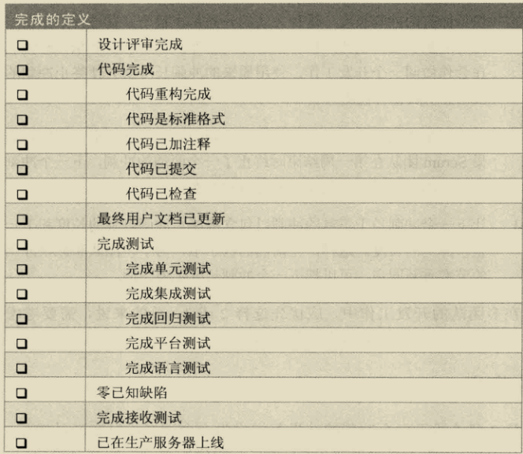
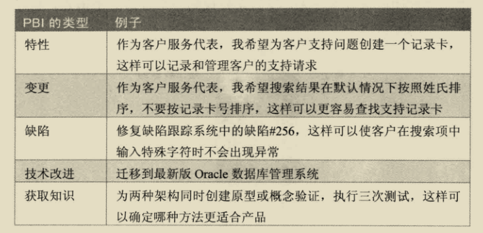

# 概念

敏捷是一种软件开发方法的迭代方法, 使用1到4周的短迭代。由于采用了敏捷的方法, 因此开发过程得以调整以交付不断变化的业务需求，未知的需求比已知的需求多。

Scrum 关注在每个迭代交付可以工作、集成好的、经过测试的、具有业务价值的特性、力争更快交付成果。

好处：
1. 客户满意。
2. 投资回报高。
3. 成本降低。
4. 迅速取得成果。
5. 有信心在复杂的世界中取得成功。
6. 更加愉快。

价值观：

* 承诺(Commitment): 人们亲自承诺达成Scrum团队的目标
* 勇气 (Courage):  Scrum团组成员有勇气去做正确的事情和挑战棘手的问题
* 专注(Focus): 每个人都专注在Sprint的工作和Scrum团队目标上
* 公开(Openness): Scrum团队及他的利益相关人(stakeholders)同意公开全部的工作和工作中的挑战
* 尊重(Respect): Scrum团队互相尊重对方是有能力的独立的人

# 框架

Scrum 不是一个标准化过程,由Product Owner、开发团队和Scrum Master组成,是自组织的、跨功能的。

Scrum团队以迭代和增量的方式交付产品，最大化反馈的机会。“完成(Done)”产品的增量交付确保工作产品的潜的可用版本始终可用。

1. 角色：一个Scrum团队由上角色组成：

  * ProductOwner：产品负责人，负责敲定要开发什么，以什么顺序开发。
  * ScrumMaster：指导团队在通用的Scrum框架上建立并遵循自己的过程，帮助团队解决问题和改进Scrum的使用，有责任保护团队不受外界干扰。
  * 开发团队：负责确定如何交付产品负责人要求的产品，一般 5- 9人，如果是大型团队一般会分成多个团队。

2. 活动：

1. 产品负责人在 Sprint 之前准备好产品列表，可以分为长期、中期、短期建立愿景，可以通过需求评审不断细化需求，确定需求是合理的，并按优先级排序。
2. 在 Sprint 开始时，团队成员通过迭代会的方式，建立 Sprint列表，列表中包含该 Sprint 计划如何设计、构建、集成、测试。
3. 在 Sprint 期间，团队成员通过每日例会来进行同步、调整计划。
4. 在 Sprint 结束时，进行评审，由干系人和Scrum团队一起监视正在构建的产品，除此之外，通过回顾，Scrum团队检视整体Sprint，以做出对产品列表或开发过程做出适应性调整。

* Product Backlog：产品列表，产品负责人结合Scrum团队其他成员和干系人的意见，最终负责确定和管理工作顺序，并采取产品列表的形式传达，产品列表可能包含新特性、现有特性的变更、需要修复的缺陷、技术改进点等。产品列表是不断演进的，总是先做最有价值的工作。产品列表总是经历建立、优化、估算时间、排序的梳理活动。
* Sprint：冲刺，迭代过程不超过一个月。
* 冲刺计划：产品列表可能是一个 Sprint 无法完成的，这就需要构建一个子集，由开发团队和产品负责人对冲刺目标达成一致意见，将需要完成的特性分解为任务，形成冲刺列表，然后给出每项任务所需工作量的估算。
* 每日例会：主要关注 昨天完成了什么，今天计划做什么，任务有什么阻碍。
* 完成：按照大家一致同意的“完成”的定义来看，成果是“潜在可发布产品增量”，产出一个完整的产品功能，经过设计、构建、集成、测试并编写文档。
* Sprint评审：Sprint的倒数第二个活动，目的是检查、调整正在构建的产品，参与者包括Scrum团队、干系人，交谈的重点是把刚刚做完的特性放到整体背景下讨论，以确保产出最合适的解决方案。
* Sprint回顾：用于调整sprint过程，即可以调整管理流程，也可以调整技术实践，由开发团队、ScrumMaster、产品负责人一起讨论。

# 敏捷原则

# Sprint

锁定Sprint目标：一旦制定Sprint目标，在Spring执行开始后就不允许有任何变更对Sprint目标实际产生影响，但是可以澄清目标，提供更多的细节来实现Sprint，锁定目标不必盲从，应注重实效，用经济合理的方式采取行动。

Sprint目标：描述当前Sprint的商业目的和价值。

完成的定义：

1. Story准备好(Ready)的定义：
* Story的命名及描术符合规范，无歧义
* Story优先级已指定
* Story所属Epic已关联
* Story验收条件可测试且完备, 无遗漏和歧义

2. Story计划完成定义：
* 有组员拿取Story
* Story Point已定义
* Story所属Task已全部拆分和分配好( 一般来说, 每个Task不超过8小时，应保证1天内可以完成，每个Story可以分成多人任务(Task)，可以分别由不同的人拿取)

3. Story代码完成定义：
* 代码按照Story的验收条件完成全部单元测试(Unit Test)的开发
* 代码按照Story的验收条件完成全部功能代码的实现的开发
* 代码提交到Git库Merge申请
* 代码code review通过, Merge到nightly分支成功
* 经CI工具自动单元测试及代码规范测试无错误，生成编译代码包(Jar, exe等)
* 新做对产生的，全部p1/p2 bug修改完成并测试能过
* 全部变更的公共api，数据模型，架构及主要设计文件，用户手册等相关文档全部完成

4. Story测试完成定义：
* 测试用例编写完成
* 经CD工具自动打包成docker image无误
* docker image成功自动部署到测试环境
* 各类自动化测试脚本全部通过
* 需手动测试的Story,手动测试全部通过
* 全部 p1/p2 bug验证通过

5. Story完成定义：
* 按照如上定义，代码和测试全部完成
* Product Owner做验收每一项Story中的验收条件，全部通过则Story完成(Done)

Story 模板：

* Theme/Initiative：一组互相集成的模块构成的子系统。
* Epic：一个独立可复用的功能模块。
* Story：一个用例场景，一个从最终用户视角描述的一个简短需求

产品列表的梳理活动必须支持持续版本规划活动，将明确的条目归到明确的版本中，准备好两到三个spint的条目。

# 技术债

把已知技术债作为条目纳入技术债列表。

# 产品负责人

产品负责人主要有两部分工作：

1. 理解干系人的需要及优先级，充当代言人。
2. 与开发团队沟通，对于要构建的特性及其构建顺序，保证特性的验收标准。

