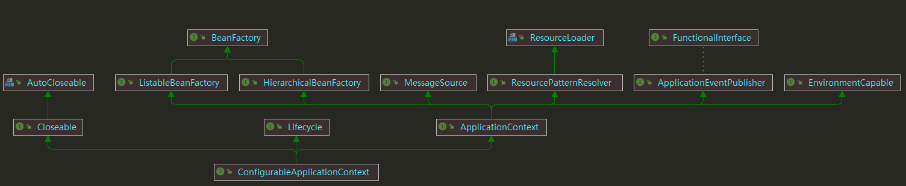
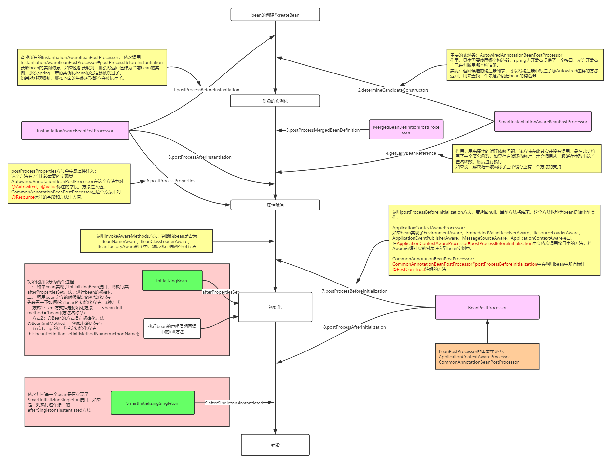
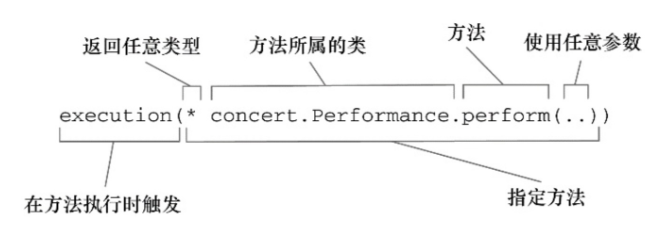

# BeanFactory


* AliasRegistry：定义对alias的简单增删改等操作。
* BeanDefinitionRegistry：定义对 BeanDefinition 的各种增删改操作。
* HierarchicalBeanFactory：增加 BeanFactory 对 parentFactory 的缓存。
* ListableBeanFactory：获取bean的列表。
* ConfigurableBeanFactory：可以配置 BeanFactory。
* AutowireCapableBeanFactory：可以手动调用完成 bean 的注入、初始化、应用后处理器，这里的自动装配不是 @Autowired 注解，而是 xml方式 的注入，也叫传统注入方式，注解驱动注入是通过 AutowiredAnnotationBeanPostProcessor#setAutowiredAnnotationType 提供的。
* ConfigurableListableBeanFactory：继承 ConfigurableBeanFactory 和 AutowireCapableBeanFactory。

## XmlBeanDefinitionReader：


* ResourceLoader：根据给定资源文件地址返回对应的 Resource 。
* DocumentLoader：从资源文件加载转换为 Document 。
* BeanDefinitionDocument：将 Document 转换为 BeanDefinition 。
* BeanDefinitionReader：整合 ResourceLoader、DocumentLoader、BeanDefinitionDocument 功能读取资源获得 BeanDefinition 。

## BeanDefinition：
* AnnotatedGenericBeanDefinition ： 表示@Configuration注解注释的BeanDefinition类。
* ScannedGenericBeanDefinition ：表示@Component、@Service、@Controller等注解注释的Bean类。

## Bean的加载：
当我们隐式或者显示的调用 BeanFactory#getBean(...) 时，会触发加载Bean阶段，这时，容器会首先检查所请求的对象是否已经初始化完成，如果没有，则会根据注册的 Bean 信息实例化请求的对象，并为其注册依赖，然后将其返回给请求方。

1. 首先从 alias 中获取 BeanName。
   假设配置了一个 FactoryBean 的名字为 "abc" ，那么获取 FactoryBean 创建的 Bean 时，使用 "abc" ，如果获取 FactoryBean 本身，使用 "&abc" 。另外，&定义在 BeanFactory.FACTORY_BEAN_PREFIX = "&" 上。
   FactoryBean 用于创建一些复杂的bean。
2. 依次从缓存中获取bean，这里的bean有个可能是 FactoryBean 也有可能是普通bean，并且可能没有实例化，缓存有三个：
   ```java
  /**
   * 存放的是单例 bean 的映射。
   * 对应关系为 bean name --> bean instance
   */
   private final Map<String, Object> singletonObjects = new ConcurrentHashMap<>(256);

  /**
   * 存放的是 ObjectFactory，可以理解为创建单例 bean 的 factory 。
   * 对应关系是 bean name --> ObjectFactory
   **/
   private final Map<String, ObjectFactory<?>> singletonFactories = new HashMap<>(16);

  /**
   * 存放的是早期的 bean，对应关系也是 bean name --> bean instance。
   * 它与 {@link #singletonFactories} 区别在于 earlySingletonObjects 中存放的 bean 不一定是完整。
   *
   * bean 在创建过程中就已经加入到 earlySingletonObjects 中了，所以当在 bean 的创建过程中，就可以通过 getBean() 方法获取。
   */
   private final Map<String, Object> earlySingletonObjects = new HashMap<>(16);
   ```
3. 如果从缓存中获取到bean，由于bean不是最终的bean，所以需要调用 getObjectForBeanInstance(...) 获取bean实例 或 FactoryBean.getObject() 的对象。
4. 如果没有从缓存中获取到bean 先从 parentBeanFactory 获取 Bean。
5. 如果没有从 parentBeanFactory 获取到，再获取 BeanDefinition ，先需要依赖，判断没有循环先创建依赖，再根据不同的作用域创建bean。
6. 类型转换，例如name返回为String，requiredType 要求返回 Integer，这时候会使用 ConversionService 做转换。

循环依赖处理：
1. 首先，从一级缓存 singletonObjects 获取。
2. 如果，没有且当前指定的 beanName 正在创建，就再从二级缓存 earlySingletonObjects 中获取。
3. 如果，还是没有获取到且允许 singletonFactories 通过 #getObject() 获取，则从三级缓存 singletonFactories 获取。如果获取到，则通过其 #getObject() 方法，获取对象，并将其加入到二级缓存 earlySingletonObjects 中，并从三级缓存 singletonFactories 删除，这里的 #getObject 是ObjectFactory 的方法，不是 FactoryBean 的方法，不要搞混。

三级缓存这样升级到二级缓存，二级缓存存在的意义，就是缓存三级缓存中的 ObjectFactory 的 #getObject() 方法的执行结果，提早曝光的单例 Bean 对象。
singletonFactories 中的数据来自于 doCreateBean 时使添加，添加的是刚创建但是没有填充属性、也没有初始化的对象，并对对象进行postProcessAfterInitialization处理，这个逻辑不会立马触发，是一个函数表达式，需要满足三个条件：单例、正在创建、可以运行提前暴露。
当创建单例完成后就 从singletonFactories移除。

如果对象A和对象B循环依赖，且都有代理的话:

1. A半成品加入第三级缓存。
2. A填充属性注入B -> 创建B对象 -> B半成品加入第三级缓存。
3. B填充属性注入A -> 创建A代理对象，从第三级缓存移除A对象，A代理对象加入第二级缓存（此时A还是半成品，B注入的是A代理对象）。
4. 创建B代理对象（此时B是完成品） -> 从第三级缓存移除B对象，B代理对象加入第一级缓存。
5. A半成品注入B代理对象。
6. 从第二级缓存移除A代理对象，A代理对象加入第一级缓存。

是否可以只用二级缓存：可以：解决循环依赖有两个方案：
1. 不管有没有循环依赖，都提前创建好代理对象，并将代理对象放入缓存，出现循环依赖时，其他对象直接就可以取到代理对象并注入。
2. 不提前创建好代理对象，在出现循环依赖被其他对象注入时，才实时生成代理对象。这样在没有循环依赖的情况下，Bean就可以按着Spring设计原则的步骤来创建。

那为什么Sping不选择二级缓存方式，而是要额外加一层缓存？

pring 的设计原则是尽可能保证普通对象创建完成之后，再生成其 AOP 代理，如果要使用二级缓存解决循环依赖，意味着Bean在构造完后就创建代理对象。
SpringAOP 是在Bean创建完全之后通过AnnotationAwareAspectJAutoProxyCreator这个后置处理器来完成的，在这个后置处理的postProcessAfterInitialization方法中对初始化后的Bean完成AOP代理，如果出现了循环依赖，那没有办法，只有给Bean先创建代理。

## Spring扩展点：
* BeanFactoryPostProcessor#postProcessBeanFactory(ConfigurableListableBeanFactory beanFactory)：负责修改 BeanFactory 属性，例如继承CustomEditorConfigurer 自定义Editor 时自动将其注入到 BeanFactory、PropertyPlaceholderConfigurer 、ConfigurationClassPostProcessor扫描 @configuration 注解等。
* BeanDefinitionRegistryPostProcessor#postProcessBeanDefinitionRegistry(BeanDefinitionRegistry registry) ： 可以直接注入 BeanDefinition。
* BeanPostProcessor#postProcessAfterInitialization(Object bean, String beanName)：负责修改Bean，例如生成代理，注入 xxxAware、注入ApplicationListener等。
* xxxAware
* InitializingBean
* DisposableBean
* ApplicationListener

## Resource：

> * getInputStream(): 找到并打开资源，返回一个InputStream以从资源中读取。预计每次调用都会返回一个新的InputStream()，调用者有责任关闭每个流
> * isOpen: 返回一个布尔值，指示此资源是否具有开放流的句柄。如果为true，InputStream就不能够多次读取，只能够读取一次并且及时关闭以避免内存泄漏。对于所有常规资源实现，返回false，但是InputStreamResource除外。
> * getDescription(): 返回资源的描述，用来输出错误的日志。这通常是完全限定的文件名或资源的实际URL。
> * isReadable(): 表明资源的目录读取是否通过getInputStream()进行读取。
> * isFile(): 表明这个资源是否代表了一个文件系统的文件。
> * getURL(): 返回一个URL句柄，如果资源不能够被解析为URL，将抛出IOException
> * getURI(): 返回一个资源的URI句柄
> * getFile(): 返回某个文件，如果资源不能够被解析称为绝对路径，将会抛出FileNotFoundException
> * lastModified(): 资源最后一次修改的时间戳
> * createRelative(): 创建此资源的相关资源
> * getFilename(): 资源的文件名是什么 例如：最后一部分的文件名 myfile.txt

Resource一般包括这些实现类：UrlResource、ClassPathResource、FileSystemResource、ServletContextResource、InputStreamResource、ByteArrayResource。

平常使用可以使用 ResourceLoader 接口 ,可通过 ResourceLoaderAware 注入：

```java
public interface ResourceLoader {

    //该接口仅包含这个方法，该方法用于返回一个 Resource 实例。ApplicationContext 的实现类都实现       ResourceLoader 接口，因此 ApplicationContext 可用于直接获取 Resource 实例
    Resource getResource(String location);

}
```

另外 Resource 可以直接接受 application.yml 中的路径，ResourcePatternResolver 可用来加载多个Resource,以及它的实现类 PathMatchingResourcePatternResolver：
```java
public interface ResourcePatternResolver extends ResourceLoader {

	String CLASSPATH_ALL_URL_PREFIX = "classpath*:";

	Resource[] getResources(String locationPattern) throws IOException;

}
```

Spring不仅支持classpath:、file:、http:等各种前缀开头的资源文件解析，而且对于也支持Ant(路径匹配表达式)风格的通配符解析.

| Pattern | Description             | Example                                           | Remark                                                     |
| ------- | ----------------------- | ------------------------------------------------- | ---------------------------------------------------------- |
| ?       | 匹配任何的单个字符      | example/?ork                                      | 可以匹配:example/fork;example/work                         |
| *       | 匹配0或者任意数量的字符 | file:C:/some/path/*.xml                           | 可以匹配C:/some/path下的所有xml文件                        |
| **      | 匹配0个或者更多的目录   | classpath:com/mycompany/**/applicationContext.xml | 可以匹配mycompany和applicationContext.xml的任意目录，例如: classpath:com/mycompany/test/applicationContext.xml;classpath:com/mycompany/work/applicationContext.xml. |

# 上下文
上下文分为4类：
* ServletContext : 由 Servlet 容器初始化，为项目提供宿主环境，例如 Tom­cat，在 web 项目启动的时候他就初始化这样的上下文环境，为后续的 Spring 容器，Spring­Mvc 容器提供宿主环境。
* WebApplicationContext ：Spring 上下文，也是根上下文，是 Spring­Mvc servlet 的父级上下文，当我们启动 Spring 的时候，那么就需要初始化 IOC 容器，而这个上下文就是用于管理这些 bean，把他们放到容器里。
* Spring­MVC 上下文 ：DispatchServlet 初始化的时候会创建自己的上下文，并从 ServletContext 中取出 WebApplicationContext 作为自己上下文的父容器。
* 其他上下文：servlet 可以有多个，自然也存在多个上下文。

Spring 中容器存在父子关系，父容器不能访问子容器的资源，而子容器可以访问父容器的资源。

# ApplicationContext

ApplicationContext 是对 BeanFactory 的扩展，Application 有两个直接子类：WebApplicationContext 和 ConfigurableApplicationContext：
* WebApplicationContext：可以获取ServletContext。
* ConfigurableApplicationContext：包含主要的方法，其中就包含refresh()方法，它是 ApplicationContext 对 BeanFactory 最主要的扩展。

ApplicationContext 继承 ResourcePatternResolver 的 getResources() 方法可以供日常使用。


* `AnnotationConfigApplicationContext`：从一个或多个基于Java的配置类中加载Spring应用上下文。
* `AnnotationConfigWebApplicationContext`：从一个或多个基于Java的配置类中加载Spring Web应用上下文。
* `ClassPathXmlApplicationContext`：从类路径下的一个或多个XML配置文件中加载上下文定义，把应用上下文的定义文件作为类资源，使用的是 class路径
* `FileSystemXmlapplicationcontext`：从文件系统下的一个或多个XML配置文件中加载上下文定义,使用的是 文件系统路径。
* `XmlWebApplicationContext`：从Web应用下的一个或多个XML配置文件中加载上下文定义。

## refresh
1. 准备刷新：
 * Environment 并且对 Environment 中的属性进行校验，Environment 可能是 StandardEnvironment(包含 系统环境和jvm属性) 也可能是 StandardServletEnvironment(继承 StandardEnvironment,另外包含 ServletContext 的属性)
2. 获取 BeanFactory，对于 XmlWebApplicationContext 类型的会在这个时候创建，并加载BeanDefinition，对于 AnnotationConfigWebApplicationContext 类型的直接获取，并不会加载 BeanDefin，因为AnnotationConfigWebApplicationContext创建时就已经创建。
3. 准备 BeanFactory
   * 填充 SpelExpressionParser。
   * 添加 Resource 类型及其子类型添加 转换器。
   * 添加 xxxAware 类型后置处理器，即创建bean后注入对应的 xxx。
   * 将 BeanFactory、ApplicationContext 等注入到上下文。
   * 添加 ApplicationListener 类型后置处理器，即创建bean 之后注入到 发布器。
   * 注册 Environment、SystemProperties、SystemEnvironment。
4. postProcessBeanFactory，提供给子类实现，
   * 在 AbstractRefreshableWebApplicationContext 中默认实现是 处理ServletContextAware，并且设置 RequestObjectFactory，ResponseObjectFactory，SessionObjectFactory，WebRequestObjectFactory。
   * 在 AnnotationConfigServletWebServerApplicationContext 相对上面的内容还要添加 扫描AnnotationConfigServletWebServerApplicationContext 中的basePackages和annotatedClasses。
5. 触发 BeanFactoryPostProcessor，springboot 在该阶段会扫描所有包。
   * ConfigurationClassPostProcessor：beanName为internalConfigurationAnnotationProcessor用于处理@configuration注解的后置处理器的bean
   * AutowiredAnnotationBeanPostProcessor：beanName为internalAutowiredAnnotationProcessor用于处理@Autowired，@Value,@Inject以及@Lookup注解的后置处理器bean
   * CommonAnnotationBeanPostProcessor：beanName为internalCommonAnnotationProcessor用于处理JSR-250注解，例如@Resource,@PostConstruct,@PreDestroy的后置处理器bean
   * EventListenerMethodProcessor：beanName为internalEventListenerProcessor用于处理@EventListener注解的后置处理器的bean
   * DefaultEventListenerFactory：beanName为internalEventListenerFactory管理用于生产ApplicationListener对象的EventListenerFactory对象
6. 识别所有的 BeanPostProcessor 并注册到 BeanFactory。
7. 初始化 MessageSource。
8. 初始化 ApplicationEventMulticaster 上下文事件广播器。
9. onRefresh 留给子类扩展，
* 在 AnnotationConfigServletWebServerApplicationContext 中会启动 web 容器，例如 Tomcat
10. 注册 ApplicationListener 到 ApplicationEventMulticaster。
11. 初始化 ConversionService 等。
12. 注册 DefaultLifecycleProcessor，发布 ContextRefreshedEvent 事件。

## SpelExpressionParser
1. Expression 表达式（“干什么”）：SpEL的核心，所以表达式语言都是围绕表达式进行的
2. ExpressionParser 解析器（“谁来干”）：用于将字符串表达式解析为表达式对象
3. EvaluationContext 上下文（“在哪干”）：表达式对象执行的环境，该环境可能定义变量、定义自定义函数、提供类型转换等等
4. root根对象及活动上下文对象（“对谁干”）：root根对象是默认的活动上下文对象，活动上下文对象表示了当前表达式操作的对象，例如 application.yml 所生成的root对象，表示表达式在这个跟对象取数据。

表达的变量可能从 EvaluationContext 和 rootObject 取。

```java
// 创建解析器
ExpressionParser parser = new SpelExpressionParser();
// 生成表达式
Expression expression = parser.parseExpression("#p.name");
// 结合 EvaluationContext 和 rootObject 计算结果
expression.getValue();
expression.getValue(EvaluationContext);
expression.getValue(rootObject);
```
## MessageSource
```java
//1. application.yml 配置资源文件地址，也可以不配置即使用 message
// spring.messages.basename=message
//2. 创建资源文件 message.properties、message_en.properties，在idea中可以使用 resource 类型创建文件
//3. 注入 MessageSource 并使用
@RestController
public class HelloController {
    @Autowired
    MessageSource messageSource;
    @GetMapping("/hello")
    public String hello() {
       // 第二个参数用于替换 属性文件中 的 #{0} 变量
        return messageSource.getMessage("user.name", null, LocaleContextHolder.getLocale());
    }
}
// 4. 添加 Accept-Language head 进行http请求
```

## Bean 生命周期



1. Spring对bean进行实例化。
2. Spring将值和bean的引用注入到bean对应的属性中。
3. 如果bean实现了BeanNameAware接口，Spring将bean的ID传递给setBeanName()方法。
4. 如果bean实现了BeanFactoryAware接口，Spring将调用setBeanFactory()方法，将BeanFactory容器实例传入。
5. 如果bean实现了ApplicationContextAware接口，Spring将调用setApplicationContext()方法，将bean所在的应用上下文的引用传入进来。
6. 如果bean实现了BeanPostProcessor接口，Spring将调用它们的 postProcessBeforeInitialization() 方法。
7. 如果bean实现了InitializingBean接口，Spring将调用它们的 afterPropertiesSet()方法 。类似地，如果bean使用initmethod声明了初始化方法，该方法也会被调用。
8. 如果bean实现了BeanPostProcessor接口，Spring将调用它们的 postProcessAfterInitialization() 方法。

此时，bean已经准备就绪，可以被应用程序使用了，它们将一直驻留在应用上下文中，直到该应用上下文被销毁；
如果bean实现了DisposableBean接口，Spring将调用它的destroy()接口方法。同样，如果bean使用destroy-method声明了销毁方法，该方法也会被调用。

## Controller 拦截

这几个注解用于对 controller 进行拦截：

@ControllerAdvice：注释在类上，对定义对哪些controller进行拦截

@ExceptionHandler：对controller进行统一异常处理

@InitBinder：自定义转换器，转换前端的数据，例如：
```java
@ControllerAdvice(basePackages = "com.kevin.tool")
public class ExceptionHandlerController {

    @InitBinder("date")
    public void globalInitBinder(WebDataBinder binder) {
        binder.addCustomFormatter(new DateFormatter("yyyy-MM-dd"));
    }
}
```
@ModelAttribute：给传入controller的数据加一下属性，例如：
```java
@ControllerAdvice(basePackages = "com.kevin.tool")
public class ExceptionHandlerController {

    @ModelAttribute
    public void addAttributes(Model model) {
        model.addAttribute("msg", "hello");

        HashMap<String, String> map = new HashMap<>(16);
        map.put("version", "1.0.0");
        map.put("name", "XXX平台");
        model.addAttribute("platform", map);
    }
}
@RestController
public class ControllerAdviceDemoController {

    @GetMapping("/modelAttributeTest")
    private String modelAttributeTest(@ModelAttribute("msg") String msg,
        @ModelAttribute("platform") Map<String, String> platform) {

        String result = "msg：" + msg + "<br>" + "info：" + platform;
        return result;
    }

}
```
## Bean 装配
@ComponentScan：默认会扫描当前包，以及这个包下的子包。

注入方式：
* 构造器注入：
```java
<bean id="cdPlay" class="com.springinaction.CDPlayer" >
	<constructor-arg ref="compactDisc"/>
</bean>
```
* 属性注入：
```java
<bean id="compactDisc" class="com.springinaction.BlankDisc" >
        <property name="title" value="Sgt. Pepper's Lonely Hearts Club Band"/>
        <property name="artist" value="The Beatles" />
</bean>
```

导入其他配置类：
```java
@Configuration
@Import(CDConfig.class)     // 导入单个配置类
@Import({CDConfig.class, CDPlayingConfig.class})   // 导入多个配置类
@ImportResource("classpath:soundsystem.xml") // 导入xml文件
public class CDPlayerConfig {
}
```
```xml
<?xml version="1.0" encoding="UTF-8"?>
<beans xmlns="http://www.springframework.org/schema/beans"
       xmlns:xsi="http://www.w3.org/2001/XMLSchema-instance"
       xmlns:c="http://www.springframework.org/schema/c"
      xsi:schemaLocation="http://www.springframework.org/schema/beans
       http://www.springframework.org/schema/beans/spring-beans.xsd">
    <bean class="com.springinaction.CDConfig" />
    <import resource="cdplayer-config.xml"/>
</beans>
```
## Profile 控制
@Profile 可以作用于 使用@Configuration的类上、使用@Bean的方法上。
```xml
<?xml version="1.0" encoding="UTF-8"?>
<beans xmlns="http://www.springframework.org/schema/beans"
  xmlns:xsi="http://www.w3.org/2001/XMLSchema-instance" xmlns:jdbc="http://www.springframework.org/schema/jdbc"
  xmlns:jee="http://www.springframework.org/schema/jee" xmlns:p="http://www.springframework.org/schema/p"
  xsi:schemaLocation="
    http://www.springframework.org/schema/jee
    http://www.springframework.org/schema/jee/spring-jee.xsd
    http://www.springframework.org/schema/jdbc
    http://www.springframework.org/schema/jdbc/spring-jdbc.xsd
    http://www.springframework.org/schema/beans
    http://www.springframework.org/schema/beans/spring-beans.xsd">

  <beans profile="dev">
    <jdbc:embedded-database id="dataSource" type="H2">
      <jdbc:script location="classpath:schema.sql" />
      <jdbc:script location="classpath:test-data.sql" />
    </jdbc:embedded-database>
  </beans>

  <beans profile="prod">
    <jee:jndi-lookup id="dataSource"
      lazy-init="true"
      jndi-name="jdbc/myDatabase"
      resource-ref="true"
      proxy-interface="javax.sql.DataSource" />
  </beans>
</beans>
```
### 激活 Profile
* 如果设置了spring.profiles.active属性的话，那么它的值就会用来确定哪个profile是激活的。
* 但如果没有设置spring.profiles.active属性的话，那Spring将会查找spring.profiles.default的值。
* 如果spring.profiles.active和spring.profiles.default均没有设置的话，那就没有激活的profile，因此只会创建那些没有定义在profile中的bean。

设置的方式：
* 作为DispatcherServlet的初始化参数。
* 作为Web应用的上下文参数。
* 作为JNDI条目。
* 作为环境变量。
* 作为JVM的系统属性。
* 在集成测试类 @SpringBootTest 上，使用@ActiveProfiles注解设置。

```xml
<?xml version="1.0" encoding="UTF-8"?>
<web-app version="2.5"
         xmlns="http://java.sun.com/xml/ns/javaee"
         xmlns:xsi="http://www.w3.org/2001/XMLSchema-instance"
         xsi:schemaLocation="http://java.sun.com/xml/ns/javaee
    http://java.sun.com/xml/ns/javaee/web-app_2_5.xsd">
  <context-param>
    <param-name>contextConfigLocation</param-name>
    <param-value>/WEB-INF/spring/root-context.xml</param-value>
  </context-param>
  <!--为上下文设置默认的profile-->
  <context-param>
    <param-name>spring.profiles.default</param-name>
    <param-value>dev</param-value>
  </context-param>

  <listener>
    <listener-class>
      org.springframework.web.context.ContextLoaderListener
    </listener-class>
  </listener>

  <servlet>
    <servlet-name>appServlet</servlet-name>
    <servlet-class>
      org.springframework.web.servlet.DispatcherServlet
    </servlet-class>
    <init-param>
      <!--为Servlet设置默认的profile-->
      <param-name>spring.profiles.default</param-name>
      <param-value>dev</param-value>
    </init-param>
    <load-on-startup>1</load-on-startup>
  </servlet>

  <servlet-mapping>
    <servlet-name>appServlet</servlet-name>
    <url-pattern>/</url-pattern>
  </servlet-mapping>
</web-app>
```
## 条件化的bean
自定义条件注解：
1. 实现 org.springframework.context.annotation.Condition 接口。
2. 使用 org.springframework.context.annotation.Conditional 定义注解。

```java
public class MagicExistsCondition implements Condition {

  @Override
  public boolean matches(ConditionContext context, AnnotatedTypeMetadata metadata) {
    Environment env = context.getEnvironment();
	// 根据环境中是否存在magic属性来决策是否创建MagicBean
    return env.containsProperty("magic");
  }
}

@Target({ ElementType.TYPE, ElementType.METHOD })
@Retention(RetentionPolicy.RUNTIME)
@Documented
@Conditional(MagicExistsCondition.class)
public @interface MyConditionAnnotation {
    String[] value() default {};
}
```

```java
public interface AnnotatedTypeMetadata {
    // 够判断带有@Bean注解的方法是不是还有其他特定的注解
    boolean isAnnotated(String annotationType);
    // 获取注解的属性例如 annotatedTypeMetadata.getAnnotationAttributes(ConditionalOnProperty.class.getName())
    Map<String, Object> getAnnotationAttributes(String annotationType);
    Map<String, Object> getAnnotationAttributes(String annotationType, boolean classValuesAsString);
    // 获取注解的属性
    MultiValueMap<String, Object> getAllAnnotationAttributes(String annotationType);
    MultiValueMap<String, Object> getAllAnnotationAttributes(String annotationType, boolean classValuesAsString);
}
```
## 消除 Bean 歧义性
1. 使用 @Primary 确定首选bean。
2. 使用 @Qualifier 指定使用具体的bean。
```java
@Component
@Qualifier("cold")
public class IceCream implements Dessert {
}
@Autowired
@Qualifier("cold")
public void setDessert(Dessert dessert) {
    this.dessert = dessert;
}
```

## bean 作用域
使用 @Scope(ConfigurableBeanFactory.SCOPE_PROTOTYPE) 注解来控制作用域。

默认情况下，Spring应用上下文所有bean都是作为以单例的形式创建的。
* 单例（Singleton）：在整个应用中，只创建bean的一个实例。
* 原型（Prototype）：每次注入或者通过Spring应用上下文获取的时候，都会创建一个新的bean实例。
* 会话（Session）：在Web应用中，为每个会话创建一个bean实例。
* 请求（Request）：在Web应用中，为每个请求创建一个bean实例。

## Spring 运行时求值
* 属性占位符 （Property placeholder）: ${...} 形式
* Spring表达式语言（SpEL）：#{...} 形式,例如

```java
//1. 它的最终结果是计算表达式的那一刻当前时间的毫秒数。T () 表达式会将java.lang.System视为Java中对应的类型，因此可以调用其static修饰的currentTimeMillis()方法。
"# {T(System).currentTimeMillis()}"
//2. SpEL表达式可以引用其他的bean或其他bean的属性。
   //例如，引用sgtPeppers的bean
   "{ sgtPeppers }"
   //例如，如下的表达式会计算得到ID为sgtPeppers的bean的artist属性：
   "# { sgtPeppers.artist }"
//3. 还可以通过systemProperties对象引用系统属性：
   "# { systemProperties['disc.title'] }"
//4. 表示字面值：
   "# { 3.1415926 }"
   "# { 9.87E4 }"
   "# { 'Hello' }"
   "# { false }"
//5. 引用其他的bean的方法
   "# { artistSelector.selectArtist () }"
   //为了防止方法值为null，抛出异常，可以使用“?.”
   //不是null，正常返回；如果是null，不执行后面的方法，直接返回null
   "# { artistSelector.selectArtist ()?.toUpperCase() }"
//6. 如果要在SpEL中访问类作用域的方法和常量的话，要依赖T() 这个关键的运算符。
   "# { T(java.lang.Math).PI }"
   "# { T(java.lang.Math).random() }"
//7. 还可以将运算符用在表达式上，如：
   "# { 2 * T(java.lang.Math).PI * circle.radius }"
   "# { disc.title + ' by ' + disc.artist }"
//8. 比较数字相等的写法
   "# { counter.total == 100 }"
   "# { counter.total eq 100 }"
//9. 三元运算符
    "# { scoreboard.score > 1000 ? "Winner!" : "Loser" }"
    "# { disc.title ?: 'Rattle and Hum' } " // 如果disc.title的值为空，返回'Rattle and Hum'
//10. 支持正则表达式
    "# { admin.email matches '[a-zA-Z0-9.*%+-]+@[a-zA-Z0-9.*]+\.com' }"
//11. 支持与集合和数组相关的表达式
    "# { jukebox.songs[4].title }"
    "# { jukebox.songs[T(java.lang.Math).random() * jukebox.songs.size()].title }"
    "# { 'This is a test' [3] }" // 引用第4个字符 - “s”
//12. 支持查询运算符
    //例如你希望得到jukebox中artist属性为Aerosmith的所有歌曲：
    "# { jukebox.songs.?[artist eq 'Aerosmith'] }"
    //查找列表中第一个artist属性为Aerosmith的歌曲：
    "# { jukebox.songs.^[artist eq 'Aerosmith'] }"
    //查找列表中最后一个artist属性为Aerosmith的歌曲：
    "# { jukebox.songs.$[artist eq 'Aerosmith'] }"
//13. 支持投影运算符
    //假设我们不想要歌曲对象的集合，而是所有歌曲名称的集合。如下表达式会将title属性投影到一个新的String类型的集合中：
    "# { jukebox.songs.![title]}"
    //获取Aerosmith所有歌曲的title
    "# { jukebox.songs.?[artist eq 'Aerosmith'].![title] }"
```
# 切面
通知和切点共同定义了切面。

织入方式：
* 编译期：切面在目标类编译时被织入。AspectJ的织入编译器是以这种方式织入切面的。
* 类加载期：切面在目标类加载到JVM时被织入。需要特殊的类加载器，它可以在目标类被引入应用之前增强该目标类的字节码。AspectJ5的加载时织入就支持以这种方式织入切面。
* 运行期：切面在应用运行的某个时刻被织入。一般情况下，在织入切面时，AOP容器会为目标对象动态地创建一个代理对象。SpringAOP就是以这种方式织入切面。

Spring提供了4种类型的AOP支持：

* 基于代理的经典SpringAOP。
* 纯POJO切面。
* @AspectJ注解驱动的切面。
* 注入式AspectJ切面。
前三种本质都是 SpringAOP，现在通常使用 @AspectJ。

## SpringAOP
SpringAop 只支持方法级别切面。
### 通知
* 前置通知（Before）：在目标方法被调用之前调用通知功能。
* 后置通知（After）：在目标方法完成之后调用通知，此时不会关心方法的输出是什么。
* 返回通知（After-returning ）：在目标方法成功执行之后调用通知。
* 异常通知（After-throwing）：在目标方法抛出异常后调用通知。
* 环绕通知（Around）：通知包裹了被通知的方法，在被通知的方法调用之前和调用之后执行自定义的行为。

### 切点
需要被代理的类和方法

#### 切点指示器
| AspectJ指示器 | 描述                                       |
| ------------- | ------------------------------------------ |
| arg()         | 限制连接点匹配参数为指定类型的执行方法     |
| @args()       | 限制连接点匹配参数有指定注解标注的执行方法 |
| execution()   | 用于匹配是连接点的执行方法                 |
| this()        | 限制连接点匹配AOP代理的bean引用为指定类型的类   |
|target	|限制连接点匹配目标对象为指定类型的类|
|@target()|	限制连接点匹配特定的执行对象，这些对象对应的类要具有指定类型的注解|
|within()|	限制连接点匹配指定的类型|
|@within()|	限制连接点匹配指定注解所标注的类型（当使用Spring AOP时，方法定义在由指定的注解所标注的类里）|
|@annotation|	限制匹配带有指定注解的连接点|
|bean | 限制指定bean |




### 处理通知中的参数


# SpringMVC
处理参数：
* GET、DELETE方法：使用 @RequestParam 或者 POJO 对象。
* POST、PUT方法：使用 @RequestBody + POJO 对象。
* 路径参数：使用 @PathVariable

参数校验：
* @AssertFalse：所注解的元素必须是Boolean类型，并且值为false
* @AssertTrue：所注解的元素必须是Boolean类型，并且值为true

* @Max：所注解的元素必须是数字，并且它的值要小于或等于给定的值
* @Min：所注解的元素必须是数字，并且它的值要大于或等于给定的值
* @DecimalMax：所注解的元素必须是数字，并且它的值要小于或等于给定的BigDecimalString值
* @DecimalMin：所注解的元素必须是数字，并且它的值要大于或等于给定的BigDecimalString值
* @Digits：所注解的元素必须是数字，并且它的值必须有指定的位数
* @Negative：负数（不包括0）
* @NegativeOrZero：负数或0
* @PositiveOrZero：正数或0

* @Future：所注解的元素的值必须是一个将来的日期
* @Past：所注解的元素的值必须是一个已过期的日期
* @FutureOrPresent：当前或将来时间
* @PastOrPresent：必须是过去的时间，包含现在

* @NotNull：所注解的元素的值必须不能为Null
* @Null：所注解的元素的值必须为Null
* @NotBlank：不为null并且包含至少一个非空白字符,用在String上面
* @NotEmpty：不为null并且不为空,用在集合类上面
* @Size：所注解的元素的值必须是String、集合或数组，并且它的长度要符合给定的范围

* @Pattern：所直接的元素的值必须匹配给定的正则表达式
* @Email：校验是否符合Email格式

## 上传文件

```properties
# 上传文件总的最大值
spring.servlet.multipart.max-request-size=10MB
# 单个文件的最大值
spring.servlet.multipart.max-file-size=10MB
```
接收参数可使用 MultipartFile(依赖于org.springframework.web.multipart.commons.CommonsMultipartResolver) 或 Part 来接收。
```java
 // 单文件上传
 @PostMapping("/upload")
 @ResponseBody
 public String upload(@RequestParam("file") MultipartFile file) {
 }
 // 多文件上传
 @PostMapping("/multiUpload")
 @ResponseBody
 public String multiUpload(HttpServletRequest request) {
    List<MultipartFile> files = ((MultipartHttpServletRequest) request).getFiles("file");
 }
```

## 异常处理
* 特定的Spring异常将会自动映射为指定的HTTP状态码；
* 异常上可以添加@ResponseStatus注解，从而将其映射为某一个HTTP状态码,可使用在自定义注解异常类上。
* 使用 @ControllerAdvice 在方法上可以添加@ExceptionHandler注解，使其捕获异常并用该方法来处理异常。

| Spring异常                              | HTTP状态码                   |
| --------------------------------------- | ---------------------------- |
| BindException                           | 400 - Bad Request            |
| ConversionNotSupportedException         | 500 - Internal Server Error  |
| HttpMediaTypeNotAcceptableException     | 406 - Not Acceptable         |
| HttpMediaTypeNotSupportedException      | 415 - Unsupported Media Type |
| HttpMessageNotWritableException         | 500 - Internal Server Error  |
| HttpRequestMethodNotSupportedException  | 405 - Method Not Allowed     |
| MethodArgumentNotValidException         | 400 - Bad Request            |
| MissingServletRequestParameterException | 400 - Bad Request            |
| MissingServletRequestPartException      | 400 - Bad Request            |
| NoSuchRequestHandlingMethodException    | 404 - Not Found              |
| TypeMismatchException                   | 400 - Bad Request            |

# SpringSecurity
获取用户：
* controller 可以使用 @AuthenticationPrincipal 注解在参数上 来接收 Authentication.getPrincipal() 的值。
* 使用 Principal 参数 接收。
* 使用 Authentication 参数 接收。
* 使用 SecurityContextHolder 来获取。

WebSecurityConfigurerAdapter 方法：

| 方法                                    | 描述                                        |
| --------------------------------------- | ------------------------------------------- |
| configure(WebSecurity)                  | 通过重载，配置 Spring Security 的 Filter 链,比如忽略某些资源 |
| configure(HttpSecurity)                 | 通过重载，配置如何通过拦截器保护请求        |
| configure(AuthenticationManagerBuilder) | 通过重载，配置 user-detail 服务             |

安全配置：
首先通过authorizeRequests()方法来开始请求权限配置,再使用 anyRequest() 或 antMatchers() 来匹配请求，最后使用下面方法进行权限配置

| 方法                       | 能够做什么                                                           |
| -------------------------- | -------------------------------------------------------------------- |
| access(String)             | 如果给定的 SpEL 表达式计算结果为 true，就允许访问                    |
| anonymous()                | 允许匿名用户访问 authenticated() 允许认证过的用户访问                |
| denyAll()                  | 无条件拒绝所有访问                                                   |
| fullyAuthenticated()       | 如果用户是完整认证的话（不是通过Remember-me 功能认证的），就允许访问 |
| hasAnyAuthority(String...) | 如果用户具备给定权限中的某一个的话，就允许访问                       |
| hasAnyRole(String...)      | 如果用户具备给定角色中的某一个的话，就允许访问                       |
| hasAuthority(String)       | 如果用户具备给定权限的话，就允许访问                                 |
| hasIpAddress(String)       | 如果请求来自给定 IP 地址的话，就允许访问                             |
| hasRole(String)            | 如果用户具备给定角色的话，就允许访问                                 |
| not()                      | 对其他访问方法的结果求反                                             |
| permitAll()                | 无条件允许访问                                                       |
| rememberMe()               | 如果用户是通过 Remember-me 功能认证的，就允许访问                    |

access 接受的表达式：

| 安全表达式                | 计算结果                                                                           |
| ------------------------- | ---------------------------------------------------------------------------------- |
| authentication            | 用户的认证对象                                                                     |
| denyAll                   | 结果始终为 false                                                                   |
| hasAnyRole(list of roles) | 如果用户被授予了列表中任意的指定角色，结果为 true                                  |
| hasRole(role)             | 如果用户被授予了指定的角色，结果为 true                                            |
| hasIpAddress(IP Address)  | 如果请求来自指定 IP 的话，结果为 true                                              |
| isAnonymous()             | 如果当前用户为匿名用户，结果为 true                                                |
| isAuthenticated()         | 如果当前用户进行了认证的话，结果为 true                                            |
| isFullyAuthenticated()    | 如果当前用户进行了完整认证的话（不是通过 Remember-me 功能进行的认证），结果为 true |
| isRememberMe()            | 如果当前用户是通过 Remember-me 自动认证的，结果为 true                             |
| permitAll                 | 结果始终为true                                                                     |
| principal                 | 用户的principal对象                                                                |

除了 authorizeRequests() 之外，还可以使用 requeresChannel() 来现在请求必须是https
```java
@Override
protected void configure(HttpSecurity http) throws Exception {
  http
    .authorizeRequests()
    .antMatchers("/spitter/me").hasRole("SPITTER")
    .antMatchers(HttpMethod.POST, "/spittles").hasRole("SPITTER")
    .anyRequest().permitAll()
    .and()
    .requeresChannel()
    .antMatchers("/spitter/form").requiresSecure();
}
```

Spring Security 提供了三种不同的安全注解：
* Spring Security 自带的 @Secured 注解，需要使用 @EnableGlobalMethodSecurity(securedEnabled=true) 开启。
* JSR-250 的 @RolesAllowed 注解，需要使用 @EnableGlobalMethodSecurity(jsr250Enable=true) 开启。
* 表达式驱动的注解，包括 @PreAuthorize、@PostAuthorize、@PreFilter 和 @PostFilter，需要使用 @EnableGlobalMethodSecurity(prePostEnable=true) 开启，推荐使用：

| 注解           | 描述                                                               |
| -------------- | ------------------------------------------------------------------ |
| @PreAuthorize  | 在方法调用之前，基于表达式的计算结果来限制对方法的访问             |
| @PostAuthorize | 允许方法调用，但是如果表达式计算结果为false，将抛出一个安 全性异常 |
| @PostFilter    | 允许方法调用，但必须按照表达式来过滤方法的结果，可使用 filterObject 表示返回集合中的一个元素 |
| @PreFilter     | 允许方法调用，但必须在进入方法之前过滤输入值                       |

@PostFilter 使用实例：
```java
@PreAuthorize("hasRole({'ROLE_SPITTER', 'ROLE_ADMIN'})")
// ROLE_ADMIN 可以看到所有结果
// 非 ROLE_ADMIN 只能看到自己用户名的结果
@PostFilter("hasRole('ROLE_ADMIN') || filterObject.spitter.username == principal.username")
public List<Spittle> getOffensiveSpittles() {
}
```
自定义权限计算器：
通过实现 org.springframework.security.access.PermissionEvaluator 并加入到 DefaultMethodSecurityExpressionHandler 中，当使用 hasPermission 表达式时将执行这个方法，返回为true表示有权限。
```java
// 第一步
public class UserPermissionEvaluator implements PermissionEvaluator {
  private static final GrantedAuthority ADMIN_AUTHORITY =
    new GrantedAuthoritylmpl("ROLE_ADMIN");
  public boolean hasPermission(Authentication authentication, Object target, Object permission) {

    if (target instanceof Spittle) {
      Spittle spittle = (Spittle) target;
      String username = spittle.getSpitter().getUsername();
      if ("delete".equals(permission)) {
        return isAdmin(authentication) || username.equals(authentication.getName());
      }
    }

    throw new UnsupportedOperationException(
      "hasPermission not supported for object <" + target
      + "> and permission <" + permission + ">");
  }

  public boolean hasPermission(Authentication authentication, Serializable targetId,
      String targetType, Object permission) {

      throw new UnsupportedOperationException();
  }

  private boolean isAdmin(Authentication authentication) {
    return authentication.getAuthorities().contains(ADMIN_AUTHORITY);
  }
}
// 第二步
// 通过 HttpSecurity 配置 expressionHandler
@Override
protected void configure(HttpSecurity http) throws Exception {
  DefaultMethodSecurityExpressionHandler expressionHandler = new DefaultMethodSecurityExpressionHandler();
  expressionHandler.setPermissionEvaluator(new UserPermissionEvaluator());

  http
    .authorizeRequests()
    .expressionHandler(expressionHandler);
}
```
# 缓存

@Cacheable 和 @CachePut 属性：

| 属性      | 类型     | 描述                                                               |
| --------- | -------- | ------------------------------------------------------------------ |
| value     | String[] | 要使用的缓存名称                                                   |
| condition | String   | SpEL 表达式，如果得到的值是 false 的话，不会将缓存应用到方法调用上 |
| key       | String   | SpEL 表达式，用来计算自定义的缓存key                               |
| unless    | String   | SpEL 表达式，如果得到的值是 true 的话，返回值不会放到缓存之中      |

自定义缓存 key：

| 表达式            | 描述                                                       |
| ----------------- | ---------------------------------------------------------- |
| #root.args        | 传递给缓存方法的参数，形式为数组                           |
| #root.caches      | 该方法执行时所对应的缓存，形式为数组                       |
| #root.target      | 目标对象                                                   |
| #root.targetClass | 目标对象的类，是 #root.target.class 的简写形式             |
| #root.method      | 缓存方法                                                   |
| #root.methodName  | 缓存方法的名字，是 #root.method.name 的简写形式            |
| #result           | 方法调用的返回值（不能用在 @Cacheable 注解上）             |
| #Argument         | 任意的方法参数名（如 #argName）或参数索引（如 #a0 或 #p0） |

@CacheEvict 属性：

| 属性       | 类型     | 描述                                                             |
| ---------- | -------- | ---------------------------------------------------------------- |
| value      | String[] | 要使用的缓存名称                                                 |
| condition  | String   | SpEL 表达式，如果得到的值是 false 的话，缓存不会应用到方法调用上 |
| key        | String   | SpEL 表达式，用来计算自定义的缓存key                             |
| allEntries | boolean  | 如果为 true 的话，特定缓存的所有条目都会被移除掉                 |
| beforeInvocation | boolean | 如果为 true 的话，在方法调用之前移除条目。如果为 false（默认值）的话，在方法成功调用之后再移除条目 |

# SpringBootActuator

| HTTP 方法 | 路径            | 描述                                                            |
| --------- | --------------- | --------------------------------------------------------------- |
| GET       | /autoconfig     | 提供了一份自动配置报告，记录哪些自动配置条件通过了，哪些没通过  |
| GET       | /configprops    | 描述配置属性(包含默认值)如何注入Bean                            |
| GET       | /beans          | 描述应用程序上下文里全部的Bean，以及它们的关系                  |
| GET       | /dump           | 获取线程活动的快照                                              |
| GET       | /env            | 获取全部环境属性                                                |
| GET       | /env/{name}     | 根据名称获取特定的环境属性值                                    |
| GET       | /health         | 报告应用程序的健康指标，这些值由HealthIndicator的实现类提供     |
| GET       | /info           | 获取应用程序的定制信息，这些信息由info打头的属性提供            |
| GET       | /mappings       | 描述全部的URI路径，以及它们和控制器(包含Actuator端点)的映射关系 |
| GET       | /metrics        | 报告各种应用程序度量信息，比如内存用量和HTTP请求计数            |
| GET       | /metrics/{name} | 报告指定名称的应用程序度量值                                    |
| POST      | /shutdown       | 关闭应用程序，要求endpoints.shutdown.enabled设置为true          |
| GET       | /trace          | 提供基本的HTTP请求跟踪信息(时间戳、HTTP头等)                    |

# SpringReactor

* Mono 用于不超过一个的场景。
* Flux 用于零个、一个、多个（可能是无限个的场景）。

创建：
* 根据对象创建：`Flux.just("A","B")`
* 根据集合创建：`Flux.fromArray(new String[]{"A","B"})`,`Flux.fromIterable(new ArrayList<>())`,`Flux.fromStream(Stream.of("A","B"))`
* 生成数据：`Flux.range(1,5)`,`Flux.interval(Duration.ofSeconds(1)).take(5)`
* 合并：`Flux.range(1,5).mergeWith(Flux.interval(Duration.ofSeconds(1)).take(5))`
* 延迟发布：`Flux.range(1,5).delaySubscription(Duration.ofMillis(250)).delayElements(Duration.ofMillis(500))`
* 压缩,会将多个FLUX对齐分组为 Tuple2，通过 getT1(),getT2() 来获取：`Flux.zip(Flux.range(1,5),Flux.interval(Duration.ofSeconds(1)).take(5))`，如果不想获得 Tuple2 ，可使用 `Flux.zip( flux1, flux2,mergeFunction)`
* 只发布快的第一个flux：`Flux.first(flux1,flux2)`只会消费一个flux，另一个flux忽略。
* 缓冲数据：
```java
Flux.just("apple", "orange", "banana", "kiwi", "strawberry")
Flux<List<String>> bufferedFlux = fruitFlux.buffer(3)
```
会生成一个新的Flux
* 收集数据：
```java
Flux<String> fruitFlux = Flux.just("apple", "orange", "banana", "kiwi", "strawberry");
Mono<List<String>> fruitListMono = fruitFlux.collectList();
```
```java
Flux<String> animalFlux = Flux.just("aardvark", "elephant", "koala", "eagle", "kangaroo");
Mono<Map<Character, String>> animalMapMono = animalFlux.collectMap(a -> a.charAt(0));
```

转换：
* 并行处理 `Flux.just("A","B").flatMap(n -> Mono.just(n).map(mapFunction).subscribeOn(Schedulers.parallel()))`

| Scheduler方法 | 描述                 |
| ------------- | -------------------- |
| .immediate()  | 在当前线程中执行订阅 |
| .single()  | 在单个可重用线程中执行订阅，对所有调用方重复使用同一线程 |
| .newSingle()  | 在每个调用专用线程中执行订阅 |
| .elastic()  | 在从无限弹性池中提取的工作进程中执行订阅，根据需要创建新的工作线程，并释放空闲的工作线程（默认情况下 60 秒） |
| .parallel()  | 在从固定大小的池中提取的工作进程中执行订阅，该池的大小取决于 CPU 核心的数量。 |

# SpringWebFlux

* 高并发、少计算且I/O密集的应用中，响应式和非阻塞往往能够发挥出价值。
* Spring Data Reactive Repositories 目前只支持 MongoDB、Redis 和 Couchbase 等几种不支持事务管理的 NOSQL。
* 不能加快响应的速度，可以减少线程数量。
