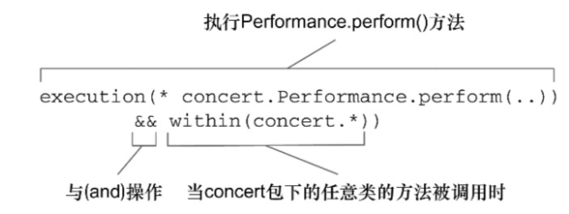
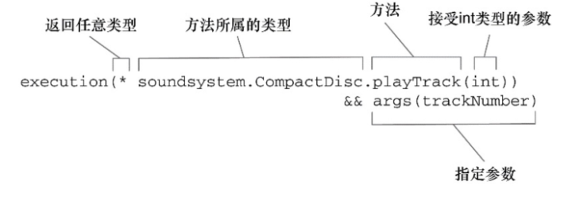

# 切面

通知和切点共同定义了切面，使用 @Aspect 定义 ，不需要额外 @Component 等注解。

织入方式：

* 编译期：切面在目标类编译时被织入。AspectJ的织入编译器是以这种方式织入切面的。
* 类加载期：切面在目标类加载到JVM时被织入。需要特殊的类加载器，它可以在目标类被引入应用之前增强该目标类的字节码。AspectJ5的加载时织入就支持以这种方式织入切面。
* 运行期：切面在应用运行的某个时刻被织入。一般情况下，在织入切面时，AOP容器会为目标对象动态地创建一个代理对象。SpringAOP就是以这种方式织入切面。

使用切面的方式：
* 运行期织入，spring的默认方式，使用 @EnableAspectJAutoProxy 注解开启，springboot 默认开启。
* 类加载时期织入LTW(LoadTimeWeaving)：
  1. 不使用 @EnableAspectJAutoProxy 使用 @EnableLoadTimeWeaving(aspectjWeaving=AUTODETECT) 注解。
  2. 编写目标类

  ```java
  @Component
  public class LtwBean {

      public void test(){
          System.out.println("process.......");
      }

  }
  ```

  3. 编写切面类

  ```java
  @Aspect
  public class LogMethodInvokeAspect {

      @Pointcut("execution(public * com.takumiCX.ltw.*.*(..))")
      public void pointCut(){

      }

      @Around("pointCut()")
      public void advise(ProceedingJoinPoint pjp) throws Throwable {

          Signature signature = pjp.getSignature();
          System.out.println(signature+" start..... ");
          pjp.proceed();
          System.out.println(signature+" end......");
      }

  }
  ```

  4. 在META-INF文件夹下编写aop.xml文件

  ```xml
  <?xml version="1.0" encoding="UTF-8"?>
  <!DOCTYPE aspectj PUBLIC "-//AspectJ//DTD//EN" "http://www.eclipse.org/aspectj/dtd/aspectj.dtd">
  <aspectj>

      <!--要织入切面的目标类-->
      <weaver>
          <include within="com.takumiCX.ltw..*" />
      </weaver>
      <!--切面类-->
      <aspects>
          <aspect name="com.takumiCX.ltw.aspect.LogMethodInvokeAspect" />
      </aspects>
  </aspectj>
  ```

## SpringAOP

SpringAop 只支持方法级别切面。

Spring使用 JDK代理 还是 CGLIB代理：
* 如果目标对象实现了接口，默认情况下使用 JDK 代理。
* 如果目标对象实现了接口，可使用 spring.aop.proxy-target-class=true 配置强制使用CGLIB代理。
* 如果目标对象没有实现接口，必须采用 CGLIB 代理。

Springboot2.x 以后默认使用 CGLIB代理，可以通过 spring.aop.proxy-target-class=false 来使用JDK代理，注解中proxyTargetClass 参数无效。

JDK代理 和 CGLIB 代理区别：
* JDK代理只能对实现接口的类生成代理；CGLib是针对类实现代理，对指定的类生成一个子类，并覆盖其中的方法，这种通过继承类的实现方式，不能代理final修饰的类。
* JDK代理使用的是反射机制实现aop的动态代理，CGLib代理使用字节码处理框架ASM，通过修改字节码生成子类。所以jdk动态代理的方式创建代理对象效率较高，执行效率较低，CGLib创建效率较低，执行效率高。
* JDK动态代理机制是委托机制，具体说动态实现接口类，在动态生成的实现类里面委托hanlder去调用原始实现类方法，CGLib则使用的继承机制，具体说被代理类和代理类是继承关系，所以代理类是可以赋值给被代理类的，如果被代理类有接口，那么代理类也可以赋值给接口。

JDK代理：

```java
// 1. 创建接口类
public interface UserManager {
    void addUser(String userName,String password);
    void delUser(String userName);
}
// 2. 实现接口类
public class UserManagerImpl implements UserManager {
    @Override
    public void addUser(String userName, String password) {
        System.out.println("调用了新增的方法！");
        System.out.println("传入参数为 userName: "+userName+" password: "+password);
    }
    @Override
    public void delUser(String userName) {
        System.out.println("调用了删除的方法！");
        System.out.println("传入参数为 userName: "+userName);
    }
}
// 3. 实现 InvocationHandler 代理逻辑
// 4. 使用 Proxy.newProxyInstance 生成代理类
public class JdkProxy implements InvocationHandler {
​
    //需要代理的目标对象
    private Object target;
​
    @Override
    public Object invoke(Object proxy, Method method, Object[] args) throws Throwable {
        System.out.println("JDK动态代理，监听开始！");
        Object result = method.invoke(target, args);
        System.out.println("JDK动态代理，监听结束！");
        return result;
    }
​
    //定义获取代理对象方法
    private Object getJDKProxy(Object targetObject) {
        //为目标对象target赋值
        this.target = targetObject;
        //JDK动态代理只能针对实现了接口的类进行代理，newProxyInstance 函数所需参数就可看出
        System.out.println(this.getClass());
        return Proxy.newProxyInstance(targetObject.getClass().getClassLoader(), targetObject.getClass().getInterfaces(), this);
    }
​
    public static void main(String[] args) {
        JdkProxy jdkProxy = new JdkProxy();
        UserManager user = (UserManager) jdkProxy.getJDKProxy(new UserManagerImpl());
        user.addUser("admin", "123123");
    }
}
```

CGLIB代理：
```java
// 1. 实现 MethodInterceptor 代理逻辑
// 2. 使用 Enhancer 生成代理对象。
public class CglibProxy implements MethodInterceptor {

    //需要代理的目标对象
    private Object target;
​
    @Override
    public Object intercept(Object obj, Method method, Object[] arr, MethodProxy proxy) throws Throwable {
        System.out.println("Cglib动态代理，监听开始！");
        Object invoke = method.invoke(target, arr);//方法执行，参数：target 目标对象 arr参数数组
        System.out.println("Cglib动态代理，监听结束！");
        return invoke;
    }

    public Object getCglibProxy(Object objectTarget){
        this.target = objectTarget;

        Enhancer enhancer = new Enhancer();
        //设置父类,因为Cglib是针对指定的类生成一个子类，所以需要指定父类
        enhancer.setSuperclass(objectTarget.getClass());
        enhancer.setCallback(this);// 设置回调
        Object result = enhancer.create();//创建并返回代理对象

        return result;
    }
​
    public static void main(String[] args) {
        CglibProxy cglib = new CglibProxy();
        UserManager user =  (UserManager) cglib.getCglibProxy(new UserManagerImpl());
        user.delUser("admin");
    }
}
```

### 通知

* 前置通知（Before）：在目标方法被调用之前调用通知功能。
* 后置通知（After）：在目标方法完成之后调用通知，此时不会关心方法的输出是什么。
* 返回通知（After-returning ）：在目标方法成功执行之后调用通知。
* 异常通知（After-throwing）：在目标方法抛出异常后调用通知。
* 环绕通知（Around）：通知包裹了被通知的方法，在被通知的方法调用之前和调用之后执行自定义的行为。

### 切点

需要被代理的类和方法

#### 切点指示器


| AspectJ指示器 | 描述                                                                                         |
| --------------- | ---------------------------------------------------------------------------------------------- |
| arg()         | 限制连接点匹配参数为指定类型的执行方法                                                       |
| @args()       | 限制连接点匹配参数有指定注解标注的执行方法                                                   |
| execution()   | 用于匹配是连接点的执行方法                                                                   |
| this()        | 限制连接点匹配AOP代理的bean引用为指定类型的类                                                |
| target        | 限制连接点匹配目标对象为指定类型的类                                                         |
| @target()     | 限制连接点匹配特定的执行对象，这些对象对应的类要具有指定类型的注解                           |
| within()      | 限制连接点匹配指定的类型                                                                     |
| @within()     | 限制连接点匹配指定注解所标注的类型（当使用Spring AOP时，方法定义在由指定的注解所标注的类里） |
| @annotation   | 限制匹配带有指定注解的连接点                                                                 |
| bean          | 限制指定bean                                                                                 |




### 处理通知中的参数


