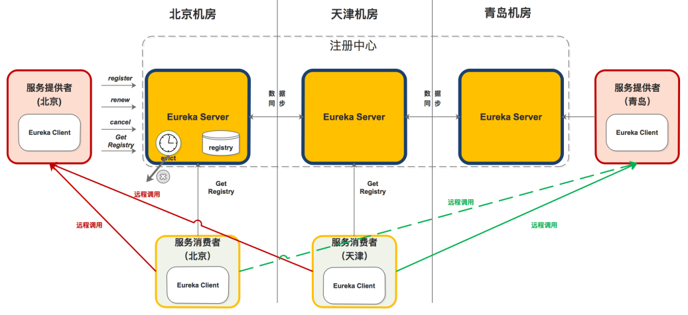

# 服务治理

主要实现各微服务实例的自动化注册与发现。

为什么需要服务治理模块：

在最初开始构建微服务，服务较少，可通过静态配置完成调用。当随着微服务不断增加，单个服务集群规模也在不断扩大，静态配置变得难以维护，如果通过手工维护的方式，极易发生错误，也必将消耗大量人力，所以使用服务治理模块完成对服务注册、服务发现的自动化管理。

服务注册：

* 每个服务单元向注册中心登记自己提供的服务，将host、port、协议等告知注册中心，注册中心按服务名分类组织服务清单。
* 注册中心以心跳的方式监测清单中的服务是否可用，若不可能需要从服务清单中剔除，达到排除故障服务的效果。

服务发现：

* 由于在服务治理框架下，服务间调用通过向服务名发起请求调用实现。
* 调用方不知道服务方位置，需要向注册中心请求所有服务清单，再发起对服务方的调用。

## Eureka

分为服务端和客户端。

服务端：注册中心，可以集群部署，当集群中有分片出现故障，Eureka转入自我保护模式，它允许在分片故障期间继续提供服务的发现与注册，当故障分片恢复运行时，集群中的其他分片会把它们的状态再次同步。
客户端：处理服务的注册与发现，在服务运行期间，客户端向注册中心注册自己提供的服务并周期性地发送心跳来更新它的服务租约，同时它也能从服务端查询当前注册的服务信息并把它们缓存到本地并周期性地刷新服务状态。

### 架构



* 服务提供者：Eureka client，向 Eureka Server注册和更新自己的信息，同时能从Eureka Server注册表中获取到其他服务的信息。
* 服务注册中心：提供服务注册和发现的功能。每个Eureka Client向Eureka Server注册自己的信息，也可以通过Eureka Server获取到其他服务的信息达到发现和调用其他服务的目的。
* 服务消费者：Eureka client，通过Eureka Server获取注册的其他服务信息，从而找到所需要的服务发起远程调用。
* 注册：client向server注册时提供自身的元数据以供服务发现。
* 续约：通过发送心跳到Server以维持和更新注册表中服务实例元数据的有效性。在一定时长内，Server没有收到Client的心跳信息，将默认下线，会把服务实例信息从注册表中删除。默认情况下为每30秒发送一次，90秒未收到心跳sever会将client剔除。
* 下线：服务提供方在关闭时候通过 `DiscoveryManager.getInstance().shutdownComponent();` 主动向Server注销服务实例元数据，该下线请求不会自动完成。
* 获取注册表：服务消费者Client向Server请求注册表信息，会缓存到本地，并且每隔30秒会更新一次，默认情况下server和client通过json格式获取注册表。

#### 服务注册、续约

默认情况下会使用 eureka.instance.appname > spring.application.name 作为服务名。

在客户端注册、续约的功能主要通过 com.netflix.discovery.EurekaClient 实现，主要由com.netflix.discovery.EurekaClient.HeartbeatThread 来完成，根据配置 eureka.instance.lease-renewal-interval-in-seconds 来配置续约的间隔时间，默认30秒，eureka.instance.lease-expiration-duration-in-seconds 配置多长时间没有收到心跳就剔除，默认90秒，不建议修改。

在服务端由 com.netflix.eureka.resources  包来暴露接口，调用 org.springframework.cloud.netflix.eureka.server.InstanceRegistry 来负责注册、续约、下线逻辑，处理完成会立即同步到其他节点，同步到其他节点是通过 com.netflix.eureka.cluster.PeerEurekaNode 来完成的。

为什么 client 获取服务实例慢？

1. 注册延迟：client启动后不会立即注册，而是有一个延迟时间，默认 40 秒，可通过 eureka.client.initial-instance-info-replication-interval-seconds 配置。
2. Server缓存：Server维护每30秒更新一次响应缓存，可通过 eureka.server.response-cache-update-interval-ms 配置。
3. Client缓存：Client保留注册表信息的缓存，每30秒更新一次，可通过 eureka.client.registry-fetch-interval-seconds 配置。
4. Loadbalancer缓存：可通过 spring.cloud.loadbalancer.cache.ttl 配置，默认35秒。

Eureka 的自我保护模式：

如果 Server 在 15 分钟内接收到的服务续约低于 85%，将进入 自我保护模式，不再剔除注册表信息，认为可能是 Server 自身的网络问题导致 Client 不能续约，默认情况下，自我保护模式开启，可使用 eureka.server.enable-self-preservation 配置。

### 服务端

#### 使用

1. 引入依赖：

```xml
<dependencies>
    <dependency>
        <groupId>org.springframework.cloud</groupId>
        <artifactId>spring-cloud-starter-netflix-eureka-server</artifactId>
    </dependency>
</dependencies>

<dependencyManagement>
    <dependencies>
        <dependency>
            <groupId>org.springframework.cloud</groupId>
            <artifactId>spring-cloud-dependencies</artifactId>
            <version>${spring-cloud-dependencies.version}</version>
            <type>pom</type>
            <scope>import</scope>
        </dependency>
    </dependencies>
</dependencyManagement>
```

2. 使用 @EnableEurekaServer 注解开启注册服务。
3. 向 application.yml 添加配置。

```yaml
# 单机模式
server:
  port: 30013

eureka:
  instance:
    hostname: localhost
  client:
    # 本服务是否注册到注册中心
    register-with-eureka: false
    # 是否从注册中心获取服务列表
    fetch-registry: false
    service-url:
      # defaultZone 不能分开写，是 Map 接收
      defaultZone: http://${eureka.instance.hostname}:${server.port}/eureka/
# 集群配置
# 节点1

server:
  port: 30014

eureka:
  instance:
    hostname: node1
  client:
    service-url:
      defaultZone: http://node2:30015/eureka/,http://node3:30016/eureka/

# 节点2

server:
  port: 30015

eureka:
  instance:
    hostname: node2
  client:
    service-url:
      defaultZone: http://node1:30014/eureka/,http://node3:30016/eureka/

# 节点3

server:
  port: 30016

eureka:
  instance:
    hostname: node3
  client:
    service-url:
      defaultZone: http://node1:30014/eureka/,http://node2:30015/eureka/

```

#### 启动

1. 入口为 EurekaServerAutoConfiguration，通过 @EnableEurekaServer 激活。

```java
@Configuration(proxyBeanMethods = false)
@Import(EurekaServerInitializerConfiguration.class)
@ConditionalOnBean(EurekaServerMarkerConfiguration.Marker.class)
@EnableConfigurationProperties({ EurekaDashboardProperties.class, InstanceRegistryProperties.class })
@PropertySource("classpath:/eureka/server.properties")
public class EurekaServerAutoConfiguration implements WebMvcConfigurer {

	private static final String[] EUREKA_PACKAGES = new String[] { "com.netflix.discovery", "com.netflix.eureka" };

	@Autowired
	private ApplicationInfoManager applicationInfoManager;

	@Autowired
	private EurekaServerConfig eurekaServerConfig;

	@Autowired
	private EurekaClientConfig eurekaClientConfig;

	@Autowired
	private EurekaClient eurekaClient;

	@Autowired
	private InstanceRegistryProperties instanceRegistryProperties;
}
```

2. 初始化 EurekaServerConfig，可使用 EurekaServerConfigBean.PREFIX = eureka.server 自定义配置。
3. 初始化 EurekaController，提供给 dashboard 访问。
4. 初始化 InstanceRegistry，客户通过该类进行注册。
5. 初始化 PeerEurekaNodes ，负责当有节点注册上来时，通知哪些节点。
6. 初始化 EurekaServerContext 。
7. 初始化 EurekaServerBootstrap ，会同步其他注册中心的数据到当前注册中心。
8. 初始化 jersey框架，实现 EurekaServer 对外的 restful 接口
9. 加载 EurekaServerInitializerConfiguration ，启动 EurekaServerBootstrap 。

#### 常用配置

定义在 org.springframework.cloud.netflix.eureka.server.EurekaServerConfigBean 。


| 参数名称                                           | 说明                                                                                                   | 默认值 |
| ---------------------------------------------------- | -------------------------------------------------------------------------------------------------------- | -------- |
| eureka.server.enable-self-preservation             | 启用自我保护机制                                                                                       | true   |
| eureka.server.eviction-interval-timer-in-ms        | 清除无效服务实例的时间间隔（ms）                                                                       | 60000  |
| eureka.server.delta-retention-timer-interval-in-ms | 清理无效增量信息的时间间隔（ms）                                                                       | 30000  |
| eureka.server.renewal-percent-threshold            | 15分钟内续约服务的比例小于0.85，则开启自我保护机制，再此期间不会清除已注册的任何服务（即便是无效服务） | 0.85   |
| eureka.server.renewal-threshold-update-interval-ms | 更新续约阈值的间隔（分钟）                                                                             | 15     |

### 客户端

#### 使用

1. 引入依赖：

```xml
<dependencies>
    <dependency>
        <groupId>org.springframework.cloud</groupId>
        <artifactId>spring-cloud-starter-netflix-eureka-client</artifactId>
    </dependency>
</dependencies>

<dependencyManagement>
    <dependencies>
        <dependency>
            <groupId>org.springframework.cloud</groupId>
            <artifactId>spring-cloud-dependencies</artifactId>
            <version>${spring-cloud-dependencies.version}</version>
            <type>pom</type>
            <scope>import</scope>
        </dependency>
    </dependencies>
</dependencyManagement>
```

2. 使用 @EnableDiscoveryClient 注解连接注册中心。
3. 向 application.yml 添加配置。

```yaml
# 单机模式
server:
  port: 30018

eureka:
  instance:
    hostname: producer-single
  client:
    service-url:
      defaultZone: http://node1:30014/eureka/,http://node2:30015/eureka/,http://node3:30016/eureka/

management:
  endpoints:
    web:
      exposure:
        include: info
# 集群配置
# 节点1

server:
  port: 30014

eureka:
  instance:
    hostname: node1
  client:
    service-url:
      defaultZone: http://node2:30015/eureka/,http://node3:30016/eureka/

# 节点2

server:
  port: 30015

eureka:
  instance:
    hostname: node2
  client:
    service-url:
      defaultZone: http://node1:30014/eureka/,http://node3:30016/eureka/

# 节点3

server:
  port: 30016

eureka:
  instance:
    hostname: node3
  client:
    service-url:
      defaultZone: http://node1:30014/eureka/,http://node2:30015/eureka/

```

#### CLIENT 常用配置

定义在 org.springframework.cloud.netflix.eureka.EurekaClientConfigBean 。


| 参数名称                                                         | 说明                                                                                                                                                        | 默认值 |
| ------------------------------------------------------------------ | ------------------------------------------------------------------------------------------------------------------------------------------------------------- | -------- |
| eureka.client.serviceUrl.defaultZone                             | 可用区域映射到与eureka服务器通信的完全限定URL列表。每个值可以是单个URL或逗号分隔的备用位置列表。(http://${eureka.instance.hostname}:${server.port}/eureka/) |        |
| eureka.client.register-with-eureka                               | 指示此实例是否应将其信息注册到eureka服务器以供其他服务发现                                                                                                  | True   |
| eureka.client.fetch-registry                                     | 客户端是否获取eureka服务器注册表上的注册信息                                                                                                                | true   |
| eureka.client.registry-fetch-interval-seconds                    | 指示从eureka服务器获取注册表信息的频率（s）                                                                                                                 | 30     |
| eureka.client.initial-instance-info-replication-interval-seconds | 初始化实例信息到Eureka服务端的间隔时间（s）                                                                                                                 | 40     |
| eureka.client.eureka-service-url-poll-interval-seconds           | 询问Eureka Server信息变化的时间间隔（s）                                                                                                                    | 300    |
| eureka.client.eureka-server-read-timeout-seconds                 | 读取Eureka Server 超时时间（s）                                                                                                                             | 8      |
| eureka.client.eureka-server-connect-timeout-seconds              | 连接Eureka Server 超时时间（s）                                                                                                                             | 5      |

#### 元数据 常用配置

定义在 org.springframework.cloud.netflix.eureka.EurekaInstanceConfigBean ，服务注册时会包装成 com.netflix.appinfo.InstanceInfo 注册。


| 参数名称                                             | 说明                                                                | 默认值                  |
| ------------------------------------------------------ | --------------------------------------------------------------------- | ------------------------- |
| eureka.instance.prefer-ip-address                    | 是否优先使用服务实例的IP地址，相较于hostname                        | false                   |
| eureka.instance.ip-address                           | 该服务实例的IP地址                                                  | null                    |
| eureka.instance.lease-renewal-interval-in-seconds    | 该服务实例向注册中心发送心跳间隔（s）                               | 30                      |
| eureka.instance.lease-expiration-duration-in-seconds | 指示eureka服务器在删除此实例之前收到最后一次心跳之后等待的时间（s） | 90                      |
| eureka.instance.appname                              | 注册到注册中心的应用名称                                            | spring.application.name |
| eureka.instance.hostname                             | 该服务实例所在主机名                                                |                         |
| eureka.instance.status-page-url-path                 | 该服务实例的状态检查地址，相对地址                                  | /actuator/info          |
| eureka.instance.health-check-url-path                | 该服务实例的健康检查地址，相对地址                                  | /actuator/health        |

# 服务调用

Ribbon：Netflix开源的基于HTTP和TCP等协议负载均衡组件，需要手动代码调用服务端。
Feign：内置Ribbon，用来做客户端负载均衡，去调用服务注册中心的服务，不支持Spring MVC的注解，它有一套自己的注解，已不推荐使用。
OpenFeign：在Feign的基础上支持了Spring MVC的注解，如@RequesMapping等等，可以使用@FeignClient解析SpringMVC的@RequestMapping注解下的接口，并通过动态代理的方式产生实现类，实现类中做负载均衡并调用其他服务。
loadbalancer：用于替代Ribbon，负责负载均衡。

## OpenFeign

内置 loadbalancer 做负载均衡。

### 使用

1. 引入依赖

```xml
<dependency>
    <groupId>org.springframework.cloud</groupId>
    <artifactId>spring-cloud-starter-netflix-eureka-client</artifactId>
</dependency>

<dependency>
    <groupId>org.springframework.cloud</groupId>
    <artifactId>spring-cloud-starter-openfeign</artifactId>
</dependency>
```

2. 使用 @EnableFeignClients 启用 OpenFeign。
3. 向 application.yml 添加配置。

```yaml
server:
  port: 30022

eureka:
  instance:
    hostname: openfeign-consumer
  client:
    service-url:
      defaultZone: http://node1:30014/eureka/,http://node2:30015/eureka/,http://node3:30016/eureka/

management:
  endpoints:
    web:
      exposure:
        include: info
```

4. 编写调用类。

```java
@FeignClient(name = "${service.name.producer}",path = "/v1/instance")
public interface InstanceFeign {

    /**
     * get host name
     * @return hostName
     */
    @GetMapping("/hostName")
    String hostName();
}
```

默认使用 HttpURLConnection，没有连接池，可使用 Apache HttpClient 或 okhttp 优化性能。

可以使用 @SpringQueryMap 给 GET 请求映射 POJO 参数。

可以使用 @MatrixVariable ，例如

```java
@GetMapping("/objects/links/{matrixVars}")
Map<String, List<String>> getObjects(@MatrixVariable Map<String, List<String>> matrixVars);
```

feign.client.refresh-enabled=true 可启用配置刷新功能，POST /actuator/refresh ，不能使用 @RefreshScope

#### 启动 Apache HttpClient

1. 增加依赖

```java
<dependency>
    <groupId>io.github.openfeign</groupId>
    <artifactId>feign-httpclient</artifactId>
</dependency>
```

2. 开启配置

```yaml
feign:
  httpclient:
    enabled: true
```

#### 启动 okhttp

1. 增加依赖

```java
<dependency>
     <groupId>io.github.openfeign</groupId>
     <artifactId>feign-okhttp</artifactId>
 </dependency>
```

2. 开启配置

```yaml
feign:
  httpclient:
    enabled: false
  okhttp:
    enabled: true
```

#### 配置configruation

注意 DefaultFeignConfig 不需要 @Configuration 注释,@Configuration 表示给所有FeignCLient配置

```java
public class DefaultFeignConfig {

    @Bean
    public Request.Options options() {
        return new Request.Options(
                // 连接超时配置
                5, TimeUnit.SECONDS,
                // 读超时配置
                6, TimeUnit.SECONDS,
                // 如果请求响应3xx，是否重定向请求
                false);
    }

}

@FeignClient(name = "demo",
        path = "/v1",
        url = "${fegin-client.demo-url}",
        configuration = {DefaultFeignConfig.class})
public interface DemoService {
}

```

OpenFeign 默认配置在 FeignClientsConfiguration：

* Decoder：new OptionalDecoder(new ResponseEntityDecoder(new SpringDecoder(messageConverters, customizers)));
* Encoder：new SpringEncoder(new SpringFormEncoder(), messageConverters, encoderProperties, customizers);
* Logger：new Slf4jLogger(type);
* Contract：new SpringMvcContract(parameterProcessors, feignConversionService, decodeSlash);
* Feign.Builder：FeignCircuitBreaker.builder();
* CachingCapability：可使用 @Cacheable 注解。

可以自己添加的配置：

* Logger.Level：这个是用来控制输出什么内容，日志框架级别还是DEBUG
  - NONE, 不记录（默认）。
  - BASIC, 只记录请求方法和 URL 以及响应状态码和执行时间。
  - HEADERS, 记录基本信息以及请求和响应标头。
  - FULL, 记录请求和响应的标头、正文和元数据。
* Retryer：会重试 IOException 和 ErrorDecoder 返回的 RetryableException。
* ErrorDecoder：默认情况下直接抛出 RetryableException。
* Request.Options：设置读写超时
* Collection<RequestInterceptor>：可以在远程调用前修改 RestTemplate 。
* SetterFactory
* QueryMapEncoder
* Capability

##### 配置日志内容

```java
@Configuration
public class FeignLogLevelConfiguration {
    @Bean
    Logger.Level feignLevel() {
        return Logger.Level.FULL;
    }
}
```

```yaml
logging:
  level:
    # feign日志以什么级别监控哪个接口
    com.king.springcloud.service.OrderFeignService: debug
```

##### 配置重试

```java
public class RetryConfiguration {

    @Bean
    public Retryer retryer() {
        return new Retryer.Default(500,TimeUnit.SECONDS.toMillis(2),5);
    }

}

@FeignClient(name = "demo",
        path = "/v1",
        url = "${fegin-client.demo-url}",
        configuration = {RetryConfiguration.class})
public interface DemoService {
}
```

Retryer.Default 的三个参数：

* maxAttempts：重试次数
* period：重试间隔时间
* maxPeriod：最大周期，重试间隔时间按照一定的规则(1.5倍)逐渐增大，但不能超过最大周期。

#### 配置ErrorDecoder

#### @FeignClient详解

* contextId : 当 name 相同时，可通过 contextId 区分。
* name ：指定FeignClient的名称，name属性会作为微服务的名称，用于服务发现。
* url ：一般用于调试，可以手动指定@FeignClient调用的地址。
* decode404 ：当发生http 404错误时，如果该字段位true，会调用Decoder进行解码，默认调用 ErrorCoder 解码。
* configuration: Feign配置类，可以自定义Feign的Encoder、Decoder、LogLevel、Contract。
* fallback: 定义容错的处理类，当调用远程接口失败或超时，会调用对应接口的容错逻辑，fallback指定的类必须实现@FeignClient标记的接口。在使用fallback属性时，需要使用@Component注解，保证fallback类被Spring容器扫描到。
* fallbackFactory：工厂类，用于生成fallback类示例，通过这个属性我们可以实现每个接口通用的容错逻辑，减少重复的代码。
* path：定义当前FeignClient的统一前缀，例如controller上有加接口前缀的话就要写在这里。

fallback 、fallbackFactory 需要 feign.circuitbreaker.enabled = true 配置。

### 启动

1. @EnableFeignClients 导入 FeignClientsRegistrar ，FeignClientsRegistrar 实现 ImportBeanDefinitionRegistrar，ImportBeanDefinitionRegistrar 由 ConfigurationClassPostProcessor 调用。
2. 使用 @EnableFeignClients 中 defaultConfiguration 设置为所有 Feign 的默认 Configuration。
3. 扫描所有的 @FeignClient 组装为 FeignClientFactoryBean ，注入到容器里。
4. 自动装配。

```java
org.springframework.boot.autoconfigure.EnableAutoConfiguration=\
org.springframework.cloud.openfeign.hateoas.FeignHalAutoConfiguration,\
org.springframework.cloud.openfeign.FeignAutoConfiguration,\
org.springframework.cloud.openfeign.encoding.FeignAcceptGzipEncodingAutoConfiguration,\
org.springframework.cloud.openfeign.encoding.FeignContentGzipEncodingAutoConfiguration,\
org.springframework.cloud.openfeign.loadbalancer.FeignLoadBalancerAutoConfiguration
```

#### FeignAutoConfiguration

1. 注入3个配置类 FeignClientProperties，FeignHttpClientProperties，FeignEncoderProperties,不建议在yml配置文件中配置重试器和请求拦截器。
2. 注入 FeignContext ，FeignContext#createContext(String name) 会生成一个AnnotationConfigApplicationContext，并将 FeignClientsConfiguration 注册进去，每个Client都有独立的容器。
3. 根据配置选择创建  HttpURLConnection、Apache HttpClient、okhttp，默认 HttpURLConnection
4. 根据 feign.circuitbreaker.enabled 选择是否使用断路器包装OpenFeign客户端。

#### FeignAcceptGzipEncodingAutoConfiguration、FeignContentGzipEncodingAutoConfiguration

负责处理 feign.compression.request.enabled 、feign.compression.response.enabled

#### FeignLoadBalancerAutoConfiguration

负责配置 LoadBalancer。

1. HttpClientFeignLoadBalancerConfiguration 处理 Apache HttpClient。
2. OkHttpFeignLoadBalancerConfiguration 处理 okhttp。
3. HttpClient5FeignLoadBalancerConfiguration 处理 ApacheHttp5Client。
4. DefaultFeignLoadBalancerConfiguration 处理 HttpURLConnection、Apache。

默认使用 FeignBlockingLoadBalancerClient 包装 客户端

如果添加依赖

```java
<dependency>
    <groupId>org.springframework.retry</groupId>
    <artifactId>spring-retry</artifactId>
</dependency>
```

并且设置  spring.cloud.loadbalancer.retry.enabled = true ，使用 RetryableFeignBlockingLoadBalancerClient 包装客户端。

### 调用

1. 调用 FeignClientFactoryBean#getObject() 生成 feign.ReflectiveFeign.FeignInvocationHandler，注入 FeignClient，其中 FeignClientFactoryBean#feign() 负责注入配置在 configuration 的Bean，包括 Decoder、Request.Options等等。
2. 每个FeignInvocationHandler中包含多个 SynchronousMethodHandler 对应 FeignClient 的方法。
3. 最终由 SynchronousMethodHandler 执行，如果抛出IOException，会直接包装成RetryableException然后重试，如果正常返回则由AsyncResponseHandler 负责处理 Response，值得注意的是状态码200 - 300 调用 Decoder 解码，其他状态码调用 ErrorCoder 解码，默认 ErrorCoder 会抛出 FeignException ，如果 reponse head 包含 Retry-After 会抛出 RetryableException 进行重试，另外默认情况下 404 状态码也是使用 ErrorCoder 解码，可通过配置 decode404 = true 来使其调用 Decoder 解码。

##### 配置


| 配置                                       | 默认值                                        | 描述                                                                                                      |
| -------------------------------------------- | ----------------------------------------------- | ----------------------------------------------------------------------------------------------------------- |
| feign.compression.request.enabled          | false                                         | 允许压缩Feign发送的请求                                                                                   |
| feign.compression.request.mime-types       | [text/xml, application/xml, application/json] | 支持的mime类型列表。                                                                                      |
| feign.compression.request.min-request-size | 2048	最小阈值内容大小。                       |                                                                                                           |
| feign.compression.response.enabled         | false                                         | 允许压缩来自Feign的响应。                                                                                 |
| feign.compression.response.useGzipDecoder  | false                                         | 启用要使用的默认gzip解码器。                                                                              |
| feign.httpclient.connection-timeout        | 2000                                          |                                                                                                           |
| feign.httpclient.connection-timer-repeat   | 3000                                          |                                                                                                           |
| feign.httpclient.disable-ssl-validation    | false                                         |                                                                                                           |
| feign.httpclient.enabled                   | true                                          | 允许通过Feign使用Apache HTTP客户端。                                                                      |
| feign.httpclient.follow-redirects          | true                                          |                                                                                                           |
| feign.httpclient.max-connections           | 200                                           |                                                                                                           |
| feign.httpclient.max-connections-per-route | 50                                            |                                                                                                           |
| feign.httpclient.time-to-live              | 900                                           | 生存时间                                                                                                  |
| feign.httpclient.time-to-live-unit         | SECONDS                                       |                                                                                                           |
| feign.circuitbreaker.enabled               | false                                         | 如果为true，则将使用Hystrix断路器包装OpenFeign客户端。</br> 2020版本后，之前为 feign.hystrix.enabled=true |
| feign.okhttp.enabled                       | false                                         | 启用Feign使用OK HTTP Client。                                                                             |
