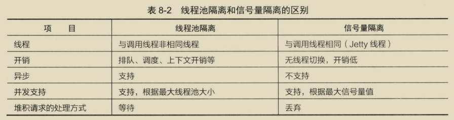
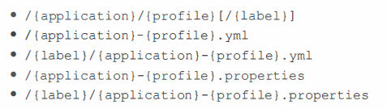
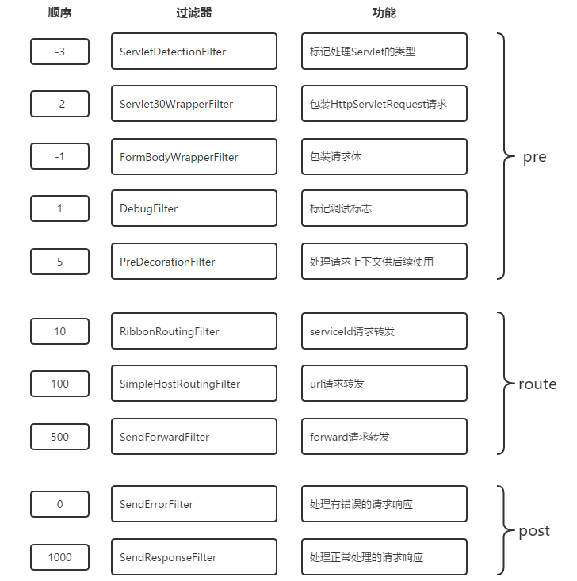
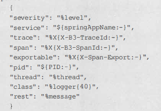

# 微服务

优点：
1. 复杂度可控：一个服务只需要关注一个特定的领域。
2. 技术选型更灵活：每个微服务结合业务特性选择技术栈。
3. 可扩展性更强：可以根据每个微服务的性能要求和业务特点来进行灵活扩展。
4. 独立部署：发布更高效。
5. 容错性：当一个服务发生故障，可以使故障隔离在单服务中。

问题：
1. 故障排查难，一个请求可能会经过多个不同的微服务的多次交互。
2. 服务监控：微服务数量变多。
3. 复杂性增大：分布式系统中网络延迟和故障不可避免。
4. 服务依赖：服务依赖关系更复杂。
5. 运维成本：如何快速部署和统一管理众多的服务。

# 服务治理

主要实现各微服务实例的自动化注册与发现。

为什么需要服务治理模块：

在最初开始构建微服务，服务较少，可通过静态配置完成调用。当随着微服务不断增加，单个服务集群规模也在不断扩大，静态配置变得难以维护，如果通过手工维护的方式，极易发生错误，也必将消耗大量人力，所以使用服务治理模块完成对服务注册、服务发现的自动化管理。

服务注册：

* 每个服务单元向注册中心登记自己提供的服务，将host、port、协议等告知注册中心，注册中心按服务名分类组织服务清单。
* 注册中心以心跳的方式监测清单中的服务是否可用，若不可能需要从服务清单中剔除，达到排除故障服务的效果。

服务发现：

* 由于在服务治理框架下，服务间调用通过向服务名发起请求调用实现。
* 调用方不知道服务方位置，需要向注册中心请求所有服务清单，再发起对服务方的调用。

## Eureka

分为服务端和客户端。

服务端：注册中心，可以集群部署，当集群中有分片出现故障，Eureka转入自我保护模式，它允许在分片故障期间继续提供服务的发现与注册，当故障分片恢复运行时，集群中的其他分片会把它们的状态再次同步。
客户端：处理服务的注册与发现，在服务运行期间，客户端向注册中心注册自己提供的服务并周期性地发送心跳来更新它的服务租约，同时它也能从服务端查询当前注册的服务信息并把它们缓存到本地并周期性地刷新服务状态。

### 架构


* 服务提供者：Eureka client，向 Eureka Server注册和更新自己的信息，同时能从Eureka Server注册表中获取到其他服务的信息。
* 服务注册中心：提供服务注册和发现的功能。每个Eureka Client向Eureka Server注册自己的信息，也可以通过Eureka Server获取到其他服务的信息达到发现和调用其他服务的目的。
* 服务消费者：Eureka client，通过Eureka Server获取注册的其他服务信息，从而找到所需要的服务发起远程调用。
* 注册：client向server注册时提供自身的元数据以供服务发现。
* 续约：通过发送心跳到Server以维持和更新注册表中服务实例元数据的有效性。在一定时长内，Server没有收到Client的心跳信息，将默认下线，会把服务实例信息从注册表中删除。默认情况下为每30秒发送一次，90秒未收到心跳sever会将client剔除。
* 下线：服务提供方在关闭时候通过 `DiscoveryManager.getInstance().shutdownComponent();` 主动向Server注销服务实例元数据，该下线请求不会自动完成。
* 获取注册表：服务消费者Client向Server请求注册表信息，会缓存到本地，并且每隔30秒会更新一次，默认情况下server和client通过json格式获取注册表。

#### 服务注册、续约

默认情况下会使用 eureka.instance.appname > spring.application.name 作为服务名。

在客户端注册、续约的功能主要通过 com.netflix.discovery.EurekaClient 实现，主要由com.netflix.discovery.EurekaClient.HeartbeatThread 来完成，根据配置 eureka.instance.lease-renewal-interval-in-seconds 来配置续约的间隔时间，默认30秒，eureka.instance.lease-expiration-duration-in-seconds 配置多长时间没有收到心跳就剔除，默认90秒，不建议修改。

在服务端由 com.netflix.eureka.resources  包来暴露接口，调用 org.springframework.cloud.netflix.eureka.server.InstanceRegistry 来负责注册、续约、下线逻辑，处理完成会立即同步到其他节点，同步到其他节点是通过 com.netflix.eureka.cluster.PeerEurekaNode 来完成的。

为什么 client 获取服务实例慢？

1. 注册延迟：client启动后不会立即注册，而是有一个延迟时间，默认 40 秒，可通过 eureka.client.initial-instance-info-replication-interval-seconds 配置。
2. Server缓存：Server维护每30秒更新一次响应缓存，可通过 eureka.server.response-cache-update-interval-ms 配置。
3. Client缓存：Client保留注册表信息的缓存，每30秒更新一次，可通过 eureka.client.registry-fetch-interval-seconds 配置。
4. Loadbalancer缓存：可通过 spring.cloud.loadbalancer.cache.ttl 配置，默认35秒。

Eureka 的自我保护模式：

如果 Server 在 15 分钟内接收到的服务续约低于 85%，将进入 自我保护模式，不再剔除注册表信息，认为可能是 Server 自身的网络问题导致 Client 不能续约，默认情况下，自我保护模式开启，可使用 eureka.server.enable-self-preservation 配置。

### 服务端

#### 使用

1. 引入依赖：

```xml
<dependencies>
    <dependency>
        <groupId>org.springframework.cloud</groupId>
        <artifactId>spring-cloud-starter-netflix-eureka-server</artifactId>
    </dependency>
</dependencies>

<dependencyManagement>
    <dependencies>
        <dependency>
            <groupId>org.springframework.cloud</groupId>
            <artifactId>spring-cloud-dependencies</artifactId>
            <version>${spring-cloud-dependencies.version}</version>
            <type>pom</type>
            <scope>import</scope>
        </dependency>
    </dependencies>
</dependencyManagement>
```

2. 使用 @EnableEurekaServer 注解开启注册服务。
3. 向 application.yml 添加配置。

```yaml
# 单机模式
server:
  port: 30013

eureka:
  instance:
    hostname: localhost
  client:
    # 本服务是否注册到注册中心
    register-with-eureka: false
    # 是否从注册中心获取服务列表
    fetch-registry: false
    service-url:
      # defaultZone 不能分开写，是 Map 接收
      defaultZone: http://${eureka.instance.hostname}:${server.port}/eureka/
# 集群配置
# 节点1

server:
  port: 30014

eureka:
  instance:
    hostname: node1
  client:
    service-url:
      defaultZone: http://node2:30015/eureka/,http://node3:30016/eureka/

# 节点2

server:
  port: 30015

eureka:
  instance:
    hostname: node2
  client:
    service-url:
      defaultZone: http://node1:30014/eureka/,http://node3:30016/eureka/

# 节点3

server:
  port: 30016

eureka:
  instance:
    hostname: node3
  client:
    service-url:
      defaultZone: http://node1:30014/eureka/,http://node2:30015/eureka/

```

#### 启动

1. 入口为 EurekaServerAutoConfiguration，通过 @EnableEurekaServer 激活。

```java
@Configuration(proxyBeanMethods = false)
@Import(EurekaServerInitializerConfiguration.class)
@ConditionalOnBean(EurekaServerMarkerConfiguration.Marker.class)
@EnableConfigurationProperties({ EurekaDashboardProperties.class, InstanceRegistryProperties.class })
@PropertySource("classpath:/eureka/server.properties")
public class EurekaServerAutoConfiguration implements WebMvcConfigurer {

	private static final String[] EUREKA_PACKAGES = new String[] { "com.netflix.discovery", "com.netflix.eureka" };

	@Autowired
	private ApplicationInfoManager applicationInfoManager;

	@Autowired
	private EurekaServerConfig eurekaServerConfig;

	@Autowired
	private EurekaClientConfig eurekaClientConfig;

	@Autowired
	private EurekaClient eurekaClient;

	@Autowired
	private InstanceRegistryProperties instanceRegistryProperties;
}
```

2. 初始化 EurekaServerConfig，可使用 EurekaServerConfigBean.PREFIX = eureka.server 自定义配置。
3. 初始化 EurekaController，提供给 dashboard 访问。
4. 初始化 InstanceRegistry，客户通过该类进行注册。
5. 初始化 PeerEurekaNodes ，负责当有节点注册上来时，通知哪些节点。
6. 初始化 EurekaServerContext 。
7. 初始化 EurekaServerBootstrap ，会同步其他注册中心的数据到当前注册中心。
8. 初始化 jersey框架，实现 EurekaServer 对外的 restful 接口
9. 加载 EurekaServerInitializerConfiguration ，启动 EurekaServerBootstrap 。

#### 常用配置

定义在 org.springframework.cloud.netflix.eureka.server.EurekaServerConfigBean 。


| 参数名称                                           | 说明                                                                                                   | 默认值 |
| ---------------------------------------------------- | -------------------------------------------------------------------------------------------------------- | -------- |
| eureka.server.enable-self-preservation             | 启用自我保护机制                                                                                       | true   |
| eureka.server.eviction-interval-timer-in-ms        | 清除无效服务实例的时间间隔（ms）                                                                       | 60000  |
| eureka.server.delta-retention-timer-interval-in-ms | 清理无效增量信息的时间间隔（ms）                                                                       | 30000  |
| eureka.server.renewal-percent-threshold            | 15分钟内续约服务的比例小于0.85，则开启自我保护机制，再此期间不会清除已注册的任何服务（即便是无效服务） | 0.85   |
| eureka.server.renewal-threshold-update-interval-ms | 更新续约阈值的间隔（分钟）                                                                             | 15     |

### 客户端

#### 使用

1. 引入依赖：

```xml
<dependencies>
    <dependency>
        <groupId>org.springframework.cloud</groupId>
        <artifactId>spring-cloud-starter-netflix-eureka-client</artifactId>
    </dependency>
</dependencies>

<dependencyManagement>
    <dependencies>
        <dependency>
            <groupId>org.springframework.cloud</groupId>
            <artifactId>spring-cloud-dependencies</artifactId>
            <version>${spring-cloud-dependencies.version}</version>
            <type>pom</type>
            <scope>import</scope>
        </dependency>
    </dependencies>
</dependencyManagement>
```

2. 使用 @EnableDiscoveryClient 注解连接注册中心。
3. 向 application.yml 添加配置。

```yaml
# 单机模式
server:
  port: 30018

eureka:
  instance:
    hostname: producer-single
  client:
    service-url:
      defaultZone: http://node1:30014/eureka/,http://node2:30015/eureka/,http://node3:30016/eureka/

management:
  endpoints:
    web:
      exposure:
        include: info
# 集群配置
# 节点1

server:
  port: 30014

eureka:
  instance:
    hostname: node1
  client:
    service-url:
      defaultZone: http://node2:30015/eureka/,http://node3:30016/eureka/

# 节点2

server:
  port: 30015

eureka:
  instance:
    hostname: node2
  client:
    service-url:
      defaultZone: http://node1:30014/eureka/,http://node3:30016/eureka/

# 节点3

server:
  port: 30016

eureka:
  instance:
    hostname: node3
  client:
    service-url:
      defaultZone: http://node1:30014/eureka/,http://node2:30015/eureka/

```

#### CLIENT 常用配置

定义在 org.springframework.cloud.netflix.eureka.EurekaClientConfigBean 。


| 参数名称                                                         | 说明                                                                                                                                                        | 默认值 |
| ------------------------------------------------------------------ | ------------------------------------------------------------------------------------------------------------------------------------------------------------- | -------- |
| eureka.client.serviceUrl.defaultZone                             | 可用区域映射到与eureka服务器通信的完全限定URL列表。每个值可以是单个URL或逗号分隔的备用位置列表。(http://${eureka.instance.hostname}:${server.port}/eureka/) |        |
| eureka.client.register-with-eureka                               | 指示此实例是否应将其信息注册到eureka服务器以供其他服务发现                                                                                                  | True   |
| eureka.client.fetch-registry                                     | 客户端是否获取eureka服务器注册表上的注册信息                                                                                                                | true   |
| eureka.client.registry-fetch-interval-seconds                    | 指示从eureka服务器获取注册表信息的频率（s）                                                                                                                 | 30     |
| eureka.client.initial-instance-info-replication-interval-seconds | 初始化实例信息到Eureka服务端的间隔时间（s）                                                                                                                 | 40     |
| eureka.client.eureka-service-url-poll-interval-seconds           | 询问Eureka Server信息变化的时间间隔（s）                                                                                                                    | 300    |
| eureka.client.eureka-server-read-timeout-seconds                 | 读取Eureka Server 超时时间（s）                                                                                                                             | 8      |
| eureka.client.eureka-server-connect-timeout-seconds              | 连接Eureka Server 超时时间（s）                                                                                                                             | 5      |

#### 元数据 常用配置

定义在 org.springframework.cloud.netflix.eureka.EurekaInstanceConfigBean ，服务注册时会包装成 com.netflix.appinfo.InstanceInfo 注册。


| 参数名称                                             | 说明                                                                | 默认值                  |
| ------------------------------------------------------ | --------------------------------------------------------------------- | ------------------------- |
| eureka.instance.prefer-ip-address                    | 是否优先使用服务实例的IP地址，相较于hostname                        | false                   |
| eureka.instance.ip-address                           | 该服务实例的IP地址                                                  | null                    |
| eureka.instance.lease-renewal-interval-in-seconds    | 该服务实例向注册中心发送心跳间隔（s）                               | 30                      |
| eureka.instance.lease-expiration-duration-in-seconds | 指示eureka服务器在删除此实例之前收到最后一次心跳之后等待的时间（s） | 90                      |
| eureka.instance.appname                              | 注册到注册中心的应用名称                                            | spring.application.name |
| eureka.instance.hostname                             | 该服务实例所在主机名                                                |                         |
| eureka.instance.status-page-url-path                 | 该服务实例的状态检查地址，相对地址                                  | /actuator/info          |
| eureka.instance.health-check-url-path                | 该服务实例的健康检查地址，相对地址                                  | /actuator/health        |

## nacos

### 原理


### 使用

#### 服务端部署

1. 从 https://github.com/alibaba/nacos/releases 下载

单机模式：
1. 可配置 Mysql 数据库，先执行 nacos-mysql.sql。
2. 再修改 conf/application.properties

```properties
spring.datasource.platform=mysql

db.num=1
db.url.0=jdbc:mysql://11.162.196.16:3306/nacos_devtest?characterEncoding=utf8&connectTimeout=1000&socketTimeout=3000&autoReconnect=true
db.user=nacos_devtest
db.password=youdontknow
```
3. 执行  sh startup.sh -m standalone 。

集群模式:

1. 配置 conf/cluster.conf , 需要 3个 或 3个以上节点。
2. 再修改 conf/application.properties

```properties
spring.datasource.platform=mysql

db.num=1
db.url.0=jdbc:mysql://11.162.196.16:3306/nacos_devtest?characterEncoding=utf8&connectTimeout=1000&socketTimeout=3000&autoReconnect=true
db.user=nacos_devtest
db.password=youdontknow
```

3. 执行 sh startup.sh。
4. 集群使用 nginx 做负载均衡。

#### 客户端

1. 添加依赖

```xml
<dependency>
    <groupId>com.alibaba.cloud</groupId>
    <artifactId>spring-cloud-starter-alibaba-nacos-discovery</artifactId>
</dependency>
```

2. 配置文件

```yaml
spring:
  cloud:
    nacos:
      server-addr: xxxxx
```

3. 使用 @EnableDiscoveryClient 进行服务注册与发现。

# 服务调用

Ribbon：Netflix开源的基于HTTP和TCP等协议负载均衡组件，需要手动代码调用服务端。

Feign：内置Ribbon，用来做客户端负载均衡，去调用服务注册中心的服务，不支持Spring MVC的注解，它有一套自己的注解，已不推荐使用。

OpenFeign：在Feign的基础上支持了Spring MVC的注解，如@RequesMapping等等，可以使用@FeignClient解析SpringMVC的@RequestMapping注解下的接口，并通过动态代理的方式产生实现类，实现类中做负载均衡并调用其他服务。

loadbalancer：用于替代Ribbon，负责负载均衡。

## OpenFeign

SpringCloud 高版本 openfeign 已经移除 Hystrix 和 Ribbon，内置 loadbalancer 做负载均衡，推荐使用 Resilience4j 做熔断。

### 使用

1. 引入依赖

```xml
<dependency>
    <groupId>org.springframework.cloud</groupId>
    <artifactId>spring-cloud-starter-netflix-eureka-client</artifactId>
</dependency>

<dependency>
    <groupId>org.springframework.cloud</groupId>
    <artifactId>spring-cloud-starter-openfeign</artifactId>
</dependency>
```

2. 使用 @EnableFeignClients 启用 OpenFeign。
3. 向 application.yml 添加配置。

```yaml
server:
  port: 30022

eureka:
  instance:
    hostname: openfeign-consumer
  client:
    service-url:
      defaultZone: http://node1:30014/eureka/,http://node2:30015/eureka/,http://node3:30016/eureka/

management:
  endpoints:
    web:
      exposure:
        include: info
```

4. 编写调用类。

```java
@FeignClient(name = "${service.name.producer}",path = "/v1/instance")
public interface InstanceFeign {

    /**
     * get host name
     * @return hostName
     */
    @GetMapping("/hostName")
    String hostName();
}
```

默认使用 HttpURLConnection，没有连接池，可使用 Apache HttpClient 或 okhttp 优化性能。

可以使用 @SpringQueryMap 给 GET 请求映射 POJO 参数。

可以使用 @MatrixVariable ，例如

```java
@GetMapping("/objects/links/{matrixVars}")
Map<String, List<String>> getObjects(@MatrixVariable Map<String, List<String>> matrixVars);
```

feign.client.refresh-enabled=true 可启用配置刷新功能，POST /actuator/refresh ，不能使用 @RefreshScope

#### 启动 Apache HttpClient

1. 增加依赖

```java
<dependency>
    <groupId>io.github.openfeign</groupId>
    <artifactId>feign-httpclient</artifactId>
</dependency>
```

2. 开启配置

```yaml
feign:
  httpclient:
    enabled: true
```

#### 启动 okhttp

1. 增加依赖

```java
<dependency>
     <groupId>io.github.openfeign</groupId>
     <artifactId>feign-okhttp</artifactId>
 </dependency>
```

2. 开启配置

```yaml
feign:
  httpclient:
    enabled: false
  okhttp:
    enabled: true
```

#### 配置configruation

注意 DefaultFeignConfig 不需要 @Configuration 注释,@Configuration 表示给所有FeignCLient配置

```java
public class DefaultFeignConfig {

    @Bean
    public Request.Options options() {
        return new Request.Options(
                // 连接超时配置
                5, TimeUnit.SECONDS,
                // 读超时配置
                6, TimeUnit.SECONDS,
                // 如果请求响应3xx，是否重定向请求
                false);
    }

}

@FeignClient(name = "demo",
        path = "/v1",
        url = "${fegin-client.demo-url}",
        configuration = {DefaultFeignConfig.class})
public interface DemoService {
}

```

OpenFeign 默认配置在 FeignClientsConfiguration：

* Decoder：new OptionalDecoder(new ResponseEntityDecoder(new SpringDecoder(messageConverters, customizers)));
* Encoder：new SpringEncoder(new SpringFormEncoder(), messageConverters, encoderProperties, customizers);
* Logger：new Slf4jLogger(type);
* Contract：new SpringMvcContract(parameterProcessors, feignConversionService, decodeSlash);
* Feign.Builder：FeignCircuitBreaker.builder();
* CachingCapability：可使用 @Cacheable 注解。

可以自己添加的配置：

* Logger.Level：这个是用来控制输出什么内容，日志框架级别还是DEBUG
  - NONE, 不记录（默认）。
  - BASIC, 只记录请求方法和 URL 以及响应状态码和执行时间。
  - HEADERS, 记录基本信息以及请求和响应标头。
  - FULL, 记录请求和响应的标头、正文和元数据。
* Retryer：会重试 IOException 和 ErrorDecoder 返回的 RetryableException。
* ErrorDecoder：默认情况下直接抛出 RetryableException。
* Request.Options：设置读写超时
* Collection<RequestInterceptor>：可以在远程调用前修改 RestTemplate 。
* SetterFactory
* QueryMapEncoder
* Capability

##### 配置日志内容

```java
@Configuration
public class FeignLogLevelConfiguration {
    @Bean
    Logger.Level feignLevel() {
        return Logger.Level.FULL;
    }
}
```

```yaml
logging:
  level:
    # feign日志以什么级别监控哪个接口
    com.king.springcloud.service.OrderFeignService: debug
```

##### 配置重试

```java
public class RetryConfiguration {

    @Bean
    public Retryer retryer() {
        return new Retryer.Default(500,TimeUnit.SECONDS.toMillis(2),5);
    }

}

@FeignClient(name = "demo",
        path = "/v1",
        url = "${fegin-client.demo-url}",
        configuration = {RetryConfiguration.class})
public interface DemoService {
}
```

Retryer.Default 的三个参数：

* maxAttempts：重试次数
* period：重试间隔时间
* maxPeriod：最大周期，重试间隔时间按照一定的规则(1.5倍)逐渐增大，但不能超过最大周期。

#### 配置ErrorDecoder

#### @FeignClient详解

* contextId : 当 name 相同时，可通过 contextId 区分。
* name ：指定FeignClient的名称，name属性会作为微服务的名称，用于服务发现。
* url ：一般用于调试，可以手动指定@FeignClient调用的地址。
* decode404 ：当发生http 404错误时，如果该字段位true，会调用Decoder进行解码，默认调用 ErrorCoder 解码。
* configuration: Feign配置类，可以自定义Feign的Encoder、Decoder、LogLevel、Contract。
* fallback: 定义容错的处理类，当调用远程接口失败或超时，会调用对应接口的容错逻辑，fallback指定的类必须实现@FeignClient标记的接口。在使用fallback属性时，需要使用@Component注解，保证fallback类被Spring容器扫描到。
* fallbackFactory：工厂类，用于生成fallback类示例，通过这个属性我们可以实现每个接口通用的容错逻辑，减少重复的代码。
* path：定义当前FeignClient的统一前缀，例如controller上有加接口前缀的话就要写在这里。

fallback 、fallbackFactory 需要 feign.circuitbreaker.enabled = true 配置。

### 启动

1. @EnableFeignClients 导入 FeignClientsRegistrar ，FeignClientsRegistrar 实现 ImportBeanDefinitionRegistrar，ImportBeanDefinitionRegistrar 由 ConfigurationClassPostProcessor 调用。
2. 使用 @EnableFeignClients 中 defaultConfiguration 设置为所有 Feign 的默认 Configuration。
3. 扫描所有的 @FeignClient 组装为 FeignClientFactoryBean ，注入到容器里。
4. 自动装配。

```java
org.springframework.boot.autoconfigure.EnableAutoConfiguration=\
org.springframework.cloud.openfeign.hateoas.FeignHalAutoConfiguration,\
org.springframework.cloud.openfeign.FeignAutoConfiguration,\
org.springframework.cloud.openfeign.encoding.FeignAcceptGzipEncodingAutoConfiguration,\
org.springframework.cloud.openfeign.encoding.FeignContentGzipEncodingAutoConfiguration,\
org.springframework.cloud.openfeign.loadbalancer.FeignLoadBalancerAutoConfiguration
```

#### FeignAutoConfiguration

1. 注入3个配置类 FeignClientProperties，FeignHttpClientProperties，FeignEncoderProperties,不建议在yml配置文件中配置重试器和请求拦截器。
2. 注入 FeignContext ，FeignContext#createContext(String name) 会生成一个AnnotationConfigApplicationContext，并将 FeignClientsConfiguration 注册进去，每个Client都有独立的容器。
3. 根据配置选择创建  HttpURLConnection、Apache HttpClient、okhttp，默认 HttpURLConnection
4. 根据 feign.circuitbreaker.enabled 选择是否使用断路器包装OpenFeign客户端。

#### FeignAcceptGzipEncodingAutoConfiguration、FeignContentGzipEncodingAutoConfiguration

负责处理 feign.compression.request.enabled 、feign.compression.response.enabled

#### FeignLoadBalancerAutoConfiguration

负责配置 LoadBalancer。

1. HttpClientFeignLoadBalancerConfiguration 处理 Apache HttpClient。
2. OkHttpFeignLoadBalancerConfiguration 处理 okhttp。
3. HttpClient5FeignLoadBalancerConfiguration 处理 ApacheHttp5Client。
4. DefaultFeignLoadBalancerConfiguration 处理 HttpURLConnection、Apache。

默认使用 FeignBlockingLoadBalancerClient 包装 客户端

如果添加依赖

```java
<dependency>
    <groupId>org.springframework.retry</groupId>
    <artifactId>spring-retry</artifactId>
</dependency>
```

并且设置  spring.cloud.loadbalancer.retry.enabled = true ，使用 RetryableFeignBlockingLoadBalancerClient 包装客户端。

### 调用

1. 调用 FeignClientFactoryBean#getObject() 生成 feign.ReflectiveFeign.FeignInvocationHandler，注入 FeignClient，其中 FeignClientFactoryBean#feign() 负责注入配置在 configuration 的Bean，包括 Decoder、Request.Options等等。
2. 每个FeignInvocationHandler中包含多个 SynchronousMethodHandler 对应 FeignClient 的方法。
3. 最终由 SynchronousMethodHandler 执行，如果抛出IOException，会直接包装成RetryableException然后重试，如果正常返回则由AsyncResponseHandler 负责处理 Response，值得注意的是状态码200 - 300 调用 Decoder 解码，其他状态码调用 ErrorCoder 解码，默认 ErrorCoder 会抛出 FeignException ，如果 reponse head 包含 Retry-After 会抛出 RetryableException 进行重试，另外默认情况下 404 状态码也是使用 ErrorCoder 解码，可通过配置 decode404 = true 来使其调用 Decoder 解码。

##### 配置


| 配置                                       | 默认值                                        | 描述                                                                                                      |
| -------------------------------------------- | ----------------------------------------------- | ----------------------------------------------------------------------------------------------------------- |
| feign.compression.request.enabled          | false                                         | 允许压缩Feign发送的请求                                                                                   |
| feign.compression.request.mime-types       | [text/xml, application/xml, application/json] | 支持的mime类型列表。                                                                                      |
| feign.compression.request.min-request-size | 2048	最小阈值内容大小。                       |                                                                                                           |
| feign.compression.response.enabled         | false                                         | 允许压缩来自Feign的响应。                                                                                 |
| feign.compression.response.useGzipDecoder  | false                                         | 启用要使用的默认gzip解码器。                                                                              |
| feign.httpclient.connection-timeout        | 2000                                          |                                                                                                           |
| feign.httpclient.connection-timer-repeat   | 3000                                          |                                                                                                           |
| feign.httpclient.disable-ssl-validation    | false                                         |                                                                                                           |
| feign.httpclient.enabled                   | true                                          | 允许通过Feign使用Apache HTTP客户端。                                                                      |
| feign.httpclient.follow-redirects          | true                                          |                                                                                                           |
| feign.httpclient.max-connections           | 200                                           |                                                                                                           |
| feign.httpclient.max-connections-per-route | 50                                            |                                                                                                           |
| feign.httpclient.time-to-live              | 900                                           | 生存时间                                                                                                  |
| feign.httpclient.time-to-live-unit         | SECONDS                                       |                                                                                                           |
| feign.circuitbreaker.enabled               | false                                         | 如果为true，则将使用Hystrix断路器包装OpenFeign客户端。</br> 2020版本后，之前为 feign.hystrix.enabled=true |
| feign.okhttp.enabled                       | false                                         | 启用Feign使用OK HTTP Client。                                                                             |

## gRPC

## Dubbo

## LoadBalancer

openfeign 默认使用 负载均衡配置。

### 使用

对不同的服务使用不同的负载策略：

```java
@LoadBalancerClients(
value = {

@LoadBalancerClient(value = "loadbalancer-provider", configuration = CustomRandomConfig.class),
@LoadBalancerClient(value = "loadbalancer-log", configuration = CustomRoundRobinConfig.class)
}, defaultConfiguration = LoadBalancerClientConfiguration.class
)
public class RestTemplateConfig {
}
```

* ladbalancer-provider 服务使用的负载均衡策略是 RandomLoadBalancer 随机负载均衡。
* loadbalancer-log 使用的是 RoundRobinLoadBalancer 轮训策略。
* 其他没有标识的则使用默认的配置 LoadBalancerClientConfiguration（轮询）。

创建负载均衡客户端：@LoadBalanced 通过将拦截器设置到 RestTemplate，实现负载均衡

```java
@LoadBalanced
@Bean
public RestTemplate restTemplate() {
    return new RestTemplate();
}
```

常用配置：重试配置对 openfeign 不生效，需要使用 Retryer 编码实现。

```yaml
spring:
  application:
    name: loadbalancer-consumer
  cloud:
    loadbalancer:
      # 以下配置为 LoadBalancerProperties 配置类
      clients:
        # default 表示全局配置，如要针对某个服务，则填写对应的服务名即可
        default:
          retry:
            enbled: true
            # 是否所有的请求都重试，false 表示只有 GET 请求才重试
            retryOnAllOperations: true
            # 同一个实例的重试次数，不包括第一次调用；比如填了 3，实际会调用 4 次
            maxRetriesOnSameServiceInstance: 3
            # 其他实例的重试次数，多节点的情况下使用
            maxRetriesOnNextServiceInstance: 0
```

自定义负载均衡策略，可实现 ReactorServiceInstanceLoadBalancer ，一般可复制 RoundRobinLoadBalancer 修改，例如：

```java
public class PeachLoadBalancer implements ReactorServiceInstanceLoadBalancer {
    private static final Log log = LogFactory.getLog(RoundRobinLoadBalancer.class);

    final AtomicInteger position;//请求的次数

    final String serviceId; //服务名称 用于提示报错信息的

    private int flag = 0; //自己定义的计数器

    //两个参数的构造方法 需要服务名称和实例提供者 这个在方法中传递进来
    public PeachLoadBalancer(ObjectProvider<ServiceInstanceListSupplier> serviceInstanceListSupplierProvider,
                                  String serviceId) {
        //如果不传人请求次数就自己初始化 反正每次都+1
        this(new Random().nextInt(1000), serviceId,serviceInstanceListSupplierProvider);
    }

    public PeachLoadBalancer(int seedPosition, String serviceId, ObjectProvider<ServiceInstanceListSupplier> serviceInstanceListSupplierProvider) {
        this.position = new AtomicInteger(seedPosition);
        this.serviceId = serviceId;
        this.serviceInstanceListSupplierProvider = serviceInstanceListSupplierProvider;
    }

    ObjectProvider<ServiceInstanceListSupplier> serviceInstanceListSupplierProvider;
    @Override
    public Mono<Response<ServiceInstance>> choose(Request request) {
        //从服务提供者中获取到当前request请求中的serviceInstances并且遍历
        ServiceInstanceListSupplier supplier = serviceInstanceListSupplierProvider
                .getIfAvailable(NoopServiceInstanceListSupplier::new);
        return supplier.get(request).next()
                .map(serviceInstances -> processInstanceResponse(supplier, serviceInstances));
    }

    private Response<ServiceInstance> processInstanceResponse(ServiceInstanceListSupplier supplier,
                                                              List<ServiceInstance> serviceInstances) {
        Response<ServiceInstance> serviceInstanceResponse = getInstanceResponse(serviceInstances);
        if (supplier instanceof SelectedInstanceCallback && serviceInstanceResponse.hasServer()) {
            ((SelectedInstanceCallback) supplier).selectedServiceInstance(serviceInstanceResponse.getServer());
        }
        return serviceInstanceResponse;
    }

    private Response<ServiceInstance> getInstanceResponse(List<ServiceInstance> instances) {
        if (instances.isEmpty()) {
            if (log.isWarnEnabled()) {
                log.warn("No servers available for service: " + serviceId);
            }
            return new EmptyResponse();
        }
        //pos是当前请求的次数 这样可以自定义负载均衡的切换  这个每次+1的操作是复制的 最好是不删
        int pos = Math.abs(this.position.incrementAndGet());

        if (pos%4==0){
            //是4的倍数就切换
            flag += 1;
        }
        if (flag >= instances.size()){
            flag = 0;
        }
        //主要的就是这句代码设置负载均衡切换
        ServiceInstance instance = instances.get(flag);
        return new DefaultResponse(instance);
    }
}
```

### 工作流程


1. 从注册中心获取服务列表，通过 ServiceInstanceListSupplier 获取。

```java
public ServiceInstanceListSupplier discoveryClientServiceInstanceListSupplier(
    ConfigurableApplicationContext context) {
    // 从服务发现与缓存中获取服务实例
    return ServiceInstanceListSupplier.builder().withBlockingDiscoveryClient().withCaching().build(context);
}
```

2. 根据负载策略找到目标服务，重新构造请求地址。

```java
public class BlockingLoadBalancerClient implements LoadBalancerClient {

	private final ReactiveLoadBalancer.Factory<ServiceInstance> loadBalancerClientFactory;

    @Override
	public <T> T execute(String serviceId, LoadBalancerRequest<T> request) throws IOException {
        // 略...
        // 在 choose 方法获取服务实例
		ServiceInstance serviceInstance = choose(serviceId, lbRequest);
		// 略...
		return execute(serviceId, serviceInstance, lbRequest);
	}

    @Override
	public <T> ServiceInstance choose(String serviceId, Request<T> request) {
        // loadBalancerClientFactory 是 NamedContextFactory 的实现类，根据服务名获取子容器 ReactorServiceInstanceLoadBalancer 实例
		ReactiveLoadBalancer<ServiceInstance> loadBalancer = loadBalancerClientFactory.getInstance(serviceId);
		// 调用负载均衡策略获取目标服务实例
        Response<ServiceInstance> loadBalancerResponse = Mono.from(loadBalancer.choose(request)).block();
        // 略...
		return loadBalancerResponse.getServer();
	}
}
```

3. 使用 Web 请求工具对目标服务进行远程调用。

# 容错

常见的熔断器有：Sentinel、Hystrix、Resilience4j


隔离机制：

1. 线程池隔离：每个依赖建立一个线程池，存储对当前依赖的请求。

好处：
* 应对突发流量：当流量洪峰到来时，不能及时处理的请求会被存储到线程池队列里慢慢处理。
* 运行环境隔离：因为某些原因导致自己所在线程池被耗尽，也不会对系统的其他服务造成影响。
缺点：
* 每个依赖的服务都会申请线程池，会带来一定的资源消耗。

2. 信号量隔离：通过信号量限制当前系统运行的数量，每个请求都会使信号量加+，如果信号量达到最大值，多于请求将被丢弃。

缺点：无法应对突发流量。



## Hystrix

解决问题：
1. 保护线程资源：防止单个服务的故障耗尽系统中的所有线程资源。
3. 提供降级（FallBack）方案：在超时、资源不足时进行降级，提供一个设计好的降级方案，通常是一个兜底方法，当请求失败后即调用该方法。
4. 熔断防止故障扩散：当失败率达到阀值时自动触发降级。
5. 缓存：支持实时监控、报警、控制。

降级场景：
1. 程序运行异常。
2. 服务超时。
3. 熔断器处于打开状态。
4. 线程池资源耗尽。

熔断状态：
1. 熔断关闭状态（Closed）：当务访问正常时，熔断器处于关闭状态，服务调用方可以正常地对服务进行调用。
2. 熔断开启状态（Open）：默认情况下，在固定时间内接口调用出错比率达到一个阈值（例如 50%），熔断器会进入熔断开启状态。进入熔断状态后，后续对该服务的调用都会被切断，熔断器会执行本地的降级（FallBack）方法。
3. 半熔断状态（Half-Open）： 在熔断开启一段时间之后，熔断器会进入半熔断状态。在半熔断状态下，熔断器会尝试恢复服务调用方对服务的调用，允许部分请求调用该服务，并监控其调用成功率。如果成功率达到预期，则说明服务已恢复正常，熔断器进入关闭状态；如果成功率仍旧很低，则重新进入熔断开启状态。

### 使用

1. 引入依赖：

```java
<dependency>
  <groupId>org.springframework.cloud</groupId>
  <artifactId>spring-cloud-starter-netflix-hystrix</artifactId>
</dependency>
```

2. 使用 @EnableCircuitBreaker 开启熔断。
3. 使用 @HystrixCommand 和 @HystrixObservableCommand 配置熔断。

```java
@HystrixCommand(commandKey = "getCompanyInfoById",
                groupKey = "company-info",
                threadPoolKey = "company-info",
                fallbackMethod = "fallbackMethod",
                threadPoolProperties = {
                    @HystrixProperty(name = "coreSize", value = "30"),
                    @HystrixProperty(name = "maxQueueSize", value = "101"),
                    @HystrixProperty(name = "keepAliveTimeMinutes", value = "2"),
                    @HystrixProperty(name = "queueSizeRejectionThreshold", value = "15"),
                 })
```

* commandKey: 代表一个接口, 如果不配置，默认是@HystrixCommand注解修饰的函数的函数名。
* groupKey: 代表一个服务，一个服务可能会暴露多个接口。 Hystrix会根据组来组织和统计命令的告、仪表盘等信息。Hystrix命令默认的线程划分也是根据组来实现。默认情况下，Hystrix会让相同组名的命令使用同一个线程池，所以我们需要在创建Hystrix命令时为其指定命令组来实现默认的线程池划分。
* threadPoolKey: 对线程池进行更细粒度的配置，默认等于groupKey的值。如果依赖服务中的某个接口耗时较长，需要单独特殊处理，最好单独用一个线程池，这时候就可以配置threadpool key。也可以多个服务接口设置同一个threadPoolKey构成线程组。
* fallbackMethod：@HystrixCommand注解修饰的函数的回调函数，@HystrixCommand修饰的函数必须和这个回调函数定义在同一个类中，因为定义在了同一个类中，所以fackback method可以是public/private均可。
* 线程池配置：coreSize表示核心线程数，hystrix默认是10；maxQueueSize表示线程池的最大队列大小； keepAliveTimeMinutes表示非核心线程空闲时最大存活时间；queueSizeRejectionThreshold：该参数用来为队列设置拒绝阈值。通过该参数，即使队列没有达到最大值也能拒绝请求。

## Sentinel

# 配置管理

解决问题：
1. 所有配置数据在配置中心，进入服务器或容器内也无法知道配置信息。
2. 配置数据从配置中心获取，动态修改后，配置中心会推送新的配置到各个应用。
3. 所有实例配置都从配置中心获取，不存在数据不一致的问题。
4. 配置中心可进行版本管理，在配置数据下发过程中出现问题，可以回滚到上一版本。

## SpringCloud启动流程

Springboot加载配置文件：SpringApplication 使用 ConfigFileApplicationListener 根据 Environment 中 spring.config.name 加载配置文件 PropertySource 到 Environment。

所有配置文件存在于 Environment 中。


1. SpringBoot 发布 ApplicationEnvironmentPreparedEvent 触发 SpringCloud 的 BootstrapApplicationListener 监听。
2. 通过判断 spring.cloud.bootstrap.enabled 和 environment中是否存在bootstrap的PropertySource 来决定是否创建 BootstrapContext 。
3. 将 spring.config.name = bootstrap 设置到 Environment。
4. 使用 SpringApplicationBuilder 创建 SpringApplication，由 ConfigFileApplicationListener 加载 bootstrap.yml 到 Environment，创建 BootstrapContext，并添加 AncestorInitializer 监听 ApplicationContext 的创建，在 ApplicationContext 创建之后将 BootstrapContext 设置为 ApplicationContext 的父上下文。


5. 创建 ApplicationContext 时会触发 PropertySourceBootstrapConfiguration，PropertySourceBootstrapConfiguration 通过加 ConfigServicePropertySourceLocator、NacosPropertySourceLocator、CustomPropertySourceLocator 完成从配置中心加载 PropertySource。

### 配置刷新


1. 通过 RefreshAutoConfiguration 配置 ContextRefresher。
2. 通过 RefreshEndpointAutoConfiguration 配置 refresh 端点。
3. refresh 端点 被触发时调用 ContextRefresher 刷新，可通过 SpringCloudBus 的 bus-refresh 端点来达到多节点配置动态刷新的目的。

ContextRefresher 使用 SpringApplicationBuilder 创建临时 context ，再从临时 context 的 Environment 中取出  PropertySource，覆盖当前 context 的  PropertySource。

## SpringCloudContext 扩展点

* RefreshEvent：发布该事件会使 RefreshEventListener 调用 ContextRefresher 刷新。
* EnvironmentChangeEvent：ContextRefresher 刷新完成之后会发布该事件，事件中包含keys集合，储存改变的数据。
* @RefreshScope：被该注解修饰的示例在收到 RefreshEvent 后会被销毁，再次获取该实例的时候会重新构造，意味着会重新解析表达式。

值得注意的是 发布RefreshEvent 和 @RefreshScope 不能存在同一个类总，否则会造成死锁。

* @ConfigurationProperties 修饰的类会在 EnvironmentChangeEvent 触发时重新绑定，通过 ConfigurationPropertiesRebinder 实现。

## SpringCloudConfig

### 使用

#### 服务端

1. 添加依赖。

```xml
<dependency>
    <groupId>org.springframework.cloud</groupId>
    <artifactId>spring-cloud-config-server</artifactId>
</dependency>
```

2. 添加配置。

```yaml
spring:
  cloud:
    config:
      server:
        # Spring Cloud Config Server 的 Git 存储器的配置项，对应 MultipleJGitEnvironmentProperties 类
        git:
          # Git 仓库地址
          uri: https://xxxx
          # 读取文件的根地址
          search-paths: /
          # 使用的默认分支，默认为 master
          default-label: master
#          username: ${CODING_USERNAME}
#          password: ${CODING_PASSWORD}
```

git.uri 可以使用 file://xxxx/xx 来配置本地仓库，方便开发调试。

当 spring.active.profiles=native 时，使用本地文件系统，默认路径和Springboot一样。

3. 使用 @EnableConfigServer 配置开启。

EnvironmentController 提供 HTTP 接口，可通过接口访问。

```java
@RequestMapping(path = "/{name}/{profiles:.*[^-].*}", produces = MediaType.APPLICATION_JSON_VALUE)

@RequestMapping("/{name}-{profiles}.properties")

@RequestMapping("/{label}/{name}-{profiles}.properties")

@RequestMapping("{name}-{profiles}.json")

@RequestMapping("/{label}/{name}-{profiles}.json")

@RequestMapping({ "/{name}-{profiles}.yml", "/{name}-{profiles}.yaml" })

@RequestMapping({ "/{label}/{name}-{profiles}.yml", "/{label}/{name}-{profiles}.yaml" })
```



1. {name}：配置文件的名字。Spring Cloud Config Client 默认约定，使用应用名 spring.application.name 读取对应的配置文件。
2. {profiles}：配置文件的 Profile，一般用于解决不同环境下的配置文件。Spring Cloud Config Client 默认约定，使用 spring.profiles.active 读取对应的 Profile 配置文件。
3. {label}：标签。在使用 Spring Cloud Config Server 使用 Git 作为存储器时，{label} 对应的是分支。

#### 客户端

1. 添加依赖。

```xml
<dependency>
    <groupId>org.springframework.cloud</groupId>
    <artifactId>spring-cloud-starter-config</artifactId>
</dependency>
```

2. 添加配置。

```yaml
spring:
  cloud:
    config:
      profile: dev
      label: master
      uri: http://ip:port
```

或者使用 集群配置：

```yaml
spring:
  cloud:
    config:
      discovery:
        enabled: true
        serviceId: config-server
      profile: dev
      label: master
```

3. 使用 @RefreshScope 重新绑定数据。

## nacos

# 网关

功能：
1. 将所有的API统一聚合，统一对外暴露，外界系统不需要知道微服务系统中各服务互相调用的复杂性。
2. 网关服务可以做用户身份认证和权限认证。
3. 可以实现监控功能，实时日志输出。
4. 可以实现流量监控，对高流量服务进行降级。

## Zuul

基于 Servlet，采用阻塞和多线程方式，当内部延迟严重、设备故障较多时会引起资源紧张。

### 使用

1. 引入依赖

```xml
<dependency>
    <groupId>org.springframework.cloud</groupId>
    <artifactId>spring-cloud-starter-zuul</artifactId>
</dependency>
```

2. 使用 @EnableZuulProxy 开启配置。
3. 添加路由规则

```yaml
zuul.routes.xxxx.path=/xxxx/**
zuul.routes.api-a.serviceId=xxxx

# 本地跳转
zuul.routes.xxxx.path=/xxxx/**
zuul.routes.xxxx.url=forward:/local
```

可以通过继承 ZuulFilter 实现自己的过滤器，比如鉴权。

1. 继承 ZuulFilter

```java
String filterType();

int filterOrder();

boolean shouldFilter();

Object run();
```

过滤器包含4个特征：过滤类型、执行顺序、执行条件、具体操作。

1. filterType：该函数需要返回一个字符串来代表过滤器的类型，而这个类型就是在HTTP请求过程中定义的各个阶段。在Zuul中默认定义了四种不同生命周期的过滤器类型，具体如下：
  * pre：可以在请求被路由之前调用。
  * routing：在路由请求时候被调用,负责转发。
  * post：在routing和error过滤器之后被调用。
  * error：处理请求时发生错误时被调用。
2. filterOrder：通过int值来定义过滤器的执行顺序，数值越小优先级越高。
3. shouldFilter：返回一个boolean类型来判断该过滤器是否要执行。我们可以通过此方法来指定过滤器的有效范围。
4. run：过滤器的具体逻辑。在该函数中，我们可以实现自定义的过滤逻辑，来确定是否要拦截当前的请求，不对其进行后续的路由，或是在请求路由返回结果之后，对处理结果做一些加工等。

默认的过滤器：



2. 注入到 Spring 容器。

## SpringCloudGateWay

# 链路跟踪

解决问题：
* 提供链路追踪：可以清楚的看出一个请求经过了哪些服务。
* 性能分析：可以很方便的看出每个采集请求的耗时。
* 优化链路：对于频繁地调用一个服务，可以针对业务做一些优化措施

## Sleuth + Zipkin

基本概念：
* span：基本工作单位，每次发送一个远程调用服务就会产生一个 Span。Span 是一个 64 位的唯一 ID。通过计算 Span 的开始和结束时间，就可以统计每个服务调用所花费的时间。

* Trace：一系列 Span 组成的树状结构，一个 Trace 认为是一次完整的链路，内部包含 n 多个 Span。Trace 和 Span 存在一对多的关系，Span 与 Span 之间存在父子关系。

* Annotations：用来及时记录一个事件的存在，一些核心 annotations 用来定义一个请求的开始和结束。

```java
cs - Client Sent：客户端发起一个请求，这个 annotation 描述了这个 span 的开始；
sr - Server Received：服务端获得请求并准备开始处理它，如果 sr 减去 cs 时间戳便可得到网络延迟；
ss - Server Sent：请求处理完成（当请求返回客户端），如果 ss 减去 sr 时间戳便可得到服务端处理请求需要的时间；
cr - Client Received：表示 span 结束，客户端成功接收到服务端的回复，如果 cr 减去 cs 时间戳便可得到客户端从服务端获取回复的所有所需时间。
```

Zipkin 分为服务端和客户端，客户端也就是微服务的应用，客户端会配置服务端的 URL 地址，一旦发生服务间的调用的时候，会被配置在微服务里面的 Sleuth 的监听器监听，并生成相应的 Trace 和 Span 信息发送给服务端。发送的方式有两种，一种是消息总线的方式如 RabbitMQ 发送，还有一种是 HTTP 报文的方式发送。

sleuth 在发起请求时会在请求头中加入信息：
1. X-B3-TraceId：一条请求链路的唯一标识。
2. X-B3-SpanId：一个工作单元的唯一标识。
3. X-B3-ParentSpanId：上一个工作单元，Root Span该值为空。
4. X-B3-Sampled：是否被采样，1表示输出，0表示不输出。
5. X-Span-Name：工作单元的名称。

可在日志输出上引用这些信息，如 %X{X-B3-TraceId:-}



### 使用

1. 搭建zipkin 服务端,可访问官方 https://zipkin.io/ 安装,docker 安装如下：

```bash
docker run -d -p 9411:9411 openzipkin/zipkin
#或者增加es存储环境
docker run -d -p 9411:9411 --env STORAGE_TYPE=elasticsearch --env ES_HOSTS=http://192.168.0.100:9200  openzipkin/zipkin
```

2. 配置客户端

```xml
<dependency>
    <groupId>org.springframework.cloud</groupId>
    <artifactId>spring-cloud-starter-sleuth</artifactId>
</dependency>

<dependency>
   <groupId>org.springframework.cloud</groupId>
   <artifactId>spring-cloud-starter-zipkin</artifactId>
 </dependency>
```

```yaml
spring:
  zipkin:
    base-url: http://127.0.0.1:9411
  sleuth:
    sampler:
      # 采样率
      probability: 1.0
```

3. 访问 http://127.0.0.1:9411/zipkin/ 页面。

# 监控

## SpringbootAdmin

通过 Actuator 收集应用系统的健康状态、内存、线程、堆栈、配置等信息，并提供可视化的监控平台。

SpringbootAdmin 分为 服务端和客户端：
* spring-boot-admin-server通过采集actuator端点数据显示在spring-boot-admin-ui上，已知的端点几乎都有进行采集。
* spring-boot-admin-client是对Actuator的封装，提供应用系统的性能监控数据。此外，还可以通过spring-boot-admin动态切换日志级别、导出日志、导出heapdump、监控各项性能指标等。

### 使用

服务端：

1. 引入依赖

```xml
<dependency>
   <groupId>de.codecentric</groupId>
   <artifactId>spring-boot-admin-starter-server</artifactId>
</dependency>
```

2. 使用 @EnableAdminServer 开启服务。

客户端：

1. 引入依赖

```xml
<dependency>
   <groupId>de.codecentric</groupId>
   <artifactId>spring-boot-admin-starter-client</artifactId>
</dependency>
```

2. 添加配置

```yaml
spring:
  boot:
    admin:
      client:
        # 服务端 url
        url: http://127.0.0.1:9090
management:
  endpoints:
    web:
      exposure:
        # 暴漏的接口 - 所有接口
        include: "*"
```
# 消息驱动

消息生态总共分为3部分内容：
1. spring-messaging：定义消息编程模型的基础模块，内部定义 Message、MessageChannel、MessageHandler。
2. Spring Integration：在spring-messaging基础上抽象更多消息概念：MessageDispatcher（消息分发器）、Transformer（消息转化器）、Aggregator（消息聚合器）。
3. Spring Cloud Stream：在 Spring Integration 基础上抽象了 Binder、Binding 等概念。

# 消息总线

消息总线是一种消息传递基础结构，它允许不同的系统通过一组共享的接口进行通信，降低应用间的依赖。

使用场景：
1. 消息路由到一个或多个目的地。
2. 消息转化为其他的表现方式。
3. 执行消息的拒绝、分解，并将结果发送到它们的目的地，然后重新组合响应返回给消息用户。
4. 使用发布-订阅模式来提供内容或基于主题的消息路由。

## Message

```java
public interface Message<T> {

	T getPayload();

	MessageHeaders getHeaders();

}
```

Message 的两个方法，分别用于获取消息体和消息头，MessageHeaders 实现了 java.util.Map ，是一个 Immutable 类型的对象。

可使用 MessageBuilder 的静态方法创建，如 MessageBuilder.withPayload("xxx").setHeader("k","v").build() 。

Message有以下几种实现类：
* GenericMessage：不可变的普通消息。
* ErrorMessage：错误消息，Payload 是 Throwable。
* MutableMessage：可变消息。

## MessageChannel

```java
public interface MessageChannel {

	long INDEFINITE_TIMEOUT = -1;

	default boolean send(Message<?> message) {
		return send(message, INDEFINITE_TIMEOUT);
	}

	boolean send(Message<?> message, long timeout);
}
```

```java
public interface PollableChannel extends MessageChannel {

	@Nullable
	Message<?> receive();

	@Nullable
	Message<?> receive(long timeout);

}
```

```java
public interface PollableChannel extends MessageChannel {

	@Nullable
	Message<?> receive();

	@Nullable
	Message<?> receive(long timeout);

}

public interface SubscribableChannel extends MessageChannel {

	boolean subscribe(MessageHandler handler);

	boolean unsubscribe(MessageHandler handler);
}
```

PollableChannel 使用拉取的方式获取消息，SubscribableChannel 使用订阅的方式使用 MessageHandler 处理消息。

ChannelInterceptor 用于在 SubscribableChannel 发送消息前、发送消息后、发送消息完成时进行拦截，对于 PollableChannel 类型会在消息接收前、接收后、接收完成时进行拦截。

自定义 SubscribableChannel，可通过继承 AbstractSubscribableChannel 来实现。

## SpringIntegration

1. MessageDispatcher：消息分发器，负责将消息分发给 MessageHandler ，例如 BroadcastingDispatcher 使用广播模式。
2. Transformer：消息转换器，负责把 Message A 转换成 Message B。
3. MessageSelector：消息选择器，与 MessageFilter 配合对消息进行过滤然后发送到新的消息通道。
4. MessageRouter：根据不同的条件将消息发送给不同的 MessageChannel。
5. Aggregator：消息聚合器，把一组消息根据一些条件聚合成一团消息。
6. Splitter：消息分割器，把一条消息根据一些条件分割成多条消息。
7. ChannelAdapter：通道适配器，分为 OutboundChannelAdapter （负责MessageChannel上的消息发送到应用上）、InboundChannelAdapter （读取应用上的消息发送到MessageChannel）
8. MessagingGateway：消息网关，以Http网关的形式将消息的操作暴露出去。
9. PollingConsumer：消息轮询消费者，会在 Receiver 内部一直轮询拉取。

使用：

```java
@Filter(inputChannel = "input",discardChannel = "discard",outputChannel = "output")
public boolean receiveByFilter(String receiveMsg){
  if(receiveMsg.contains("keywords")){
    return true;
  }
  return false;
}

@Transformer(inputChannel = "input",outputChannel = "output")
public Message receiveByTransformer(Message message){
  message.getHeaders().remove("secret");
  return message;
}

@InboundChannelAdapter(value = "input", poller = @Poller(fixedDelay = "10000",maxMessagesPerPoll = "1"))
public MessageSource<OrderMsg> orderMessageSource() {
  return () -> {
    return MessageBuilder.withPayload(new OrderMsg(randomGoods,random.nextInt(5))).build();
  };
}
```

## SpringCloudStream

Binder 是外部消息系统的抽象。

Bindings 由 Binder 创建，是实际消息交互的桥梁，对应一个消费者或者生产者。

### 老版本

编程模型由@EnableBinding、@Output、@Input、@StreamListener、@SendTo 组成。

@StreamListener、@Transformer、@Filter 底层实际构造了一个 MessageHandler。

生产者：

```java
@SpringBootApplication
public class ProducerApplication {

    public static void main(String[] args) {
        SpringApplication.run(ProducerApplication.class, args);
    }
}

@RestController
@EnableBinding(MySource.class)
public class Producer {

    @Autowired
    private MySource channel;

    @RequestMapping("/send")
    public String send() {
        channel.output().send(MessageBuilder.withPayload(new Date()).build());
        return "success";
    }
}

public interface MySource {
    String OUTPUT = "output";

    @Output(MySource.OUTPUT)
    MessageChannel output();
}
```

配置文件:

```yaml
spring:
  rabbitmq:
    host: 192.168.163.128
    username: cms
    password: cms-mq-admin
  cloud:
    stream:
      bindings:
        output:
          destination: my-test-channel
server:
  port: 8082
```


可使用 `spring.cloud.stream.bindings.<channelName>.producer.errorChannelEnabled=true` 打开消息发送失败的处理逻辑，如果消息发送失败会发送到 topic.errors 的 DirectChannel，可以订阅该通道，处理错误消息，例如：

```java
@ServcieActivator(intputChannel = "xxxx.errors")
public void receiveProduceError(Message receiveMsg){
  System.out.println("receive error msg:" + receiveMsg);
}
```

@ServcieActivator 不具备消息转换的能力，@StreamListener 具备消息转换的能力。

消费者：

```java
@SpringBootApplication
public class ConsumerApplication {

    public static void main(String[] args) {
        SpringApplication.run(ConsumerApplication.class, args);
    }
}

@EnableBinding(MySink.class)
public class Consumer {
    @StreamListener(MySink.INPUT)
    public void receive(Message<String> message) {
        System.out.println("接收到MQ消息:" + message.getPayload());
    }
}

public interface MySink {
    String INPUT = "input";

    @Input(MySink.INPUT)
    SubscribableChannel input();
}
```

配置文件：

```yaml
spring:
  rabbitmq:
    host: 192.168.163.128
    username: cms
    password: cms-mq-admin
  cloud:
    stream:
      bindings:
        input:
          destination: my-test-channel
server:
  port: 8081
```

如果消息接收失败会发送到 topic.group.errors 的 DirectChannel，可以订阅该通道，处理错误消息，例如：

```java
@ServcieActivator(intputChannel = "xxxx.xxxx-group.errors")
public void receiveConsumeError(Message receiveMsg){
  System.out.println("receive error msg:" + receiveMsg);
}
```

### 新版本

1. 定时驱动的消息队列：

* 使用 Supplier、Function、Consumer 定义生产者和消费者。

```java
@Bean
public Function<String, String> uppercase() {
    return value -> {
        System.out.println("Received: " + value);
        return value.toUpperCase()
    };
}

@Bean
public Supplier<Date> date() {
  return () -> new Date(12345L);
}
```

* 使用 `input - <functionName> + -in- + <index>`、`output - <functionName> + -out- + <index>` 绑定管道，当有多个管道需要做聚合时通过index区分。

例如： `spring.cloud.stream.function.bindings.uppercase-in-0=input`

* 使用 `spring.cloud.stream.poller.fixedDelay` 定义生产多久产生一条消息，默认 1s 中一条。

示例：

```java
@SpringBootApplication
public class ProducerApplication {

    public static void main(String[] args) {
        SpringApplication.run(ProducerApplication.class, args);
    }

    @Bean
    public Supplier<Date> source1() {
        return () -> new Date();
    }
}
```

```yaml
spring:
  rabbitmq:
    host: 192.168.163.128
    username: cms
    password: cms-mq-admin

  cloud:
    stream:
      bindings:
        source1-out-0:
          destination: test1
    function:
      definition: source1

server:
  port: 8083
```

2. 手动触发的消息队列：StreamBridge

生产者：

```java
@SpringBootApplication
public class ProducerApplication {

    public static void main(String[] args) {
        SpringApplication.run(ProducerApplication.class, args);
    }
}

@RestController
public class Producer {

    @Autowired
    private StreamBridge streamBridge;

    @RequestMapping("/send1")
    public String send1() {
        streamBridge.send("source1-out-0", new Date());
        return "success1";
    }

    @RequestMapping("/send2")
    public String send2() {
        streamBridge.send("source2-out-0", LocalDateTime.now().format(DateTimeFormatter.ISO_LOCAL_DATE_TIME));
        return "success2";
    }

}
```

配置文件:

```yaml
spring:
  rabbitmq:
    host: 192.168.133.128
    username: dev-user
    password: devpassword

  cloud:
    stream:
      bindings:
        source1-out-0:
          destination: test2
        source2-out-0:
          destination: test3
    function:
      definition: source1;source2


server:
  port: 8083
```

消费者：

```java
@SpringBootApplication
public class ConsumerApplication {

    public static void main(String[] args) {
        SpringApplication.run(ConsumerApplication.class, args);
    }

    @Bean
    public Consumer<Date> sink1() {
        return System.out::println;
    }

    @Bean
    public Consumer<String> sink2() {
        return System.out::println;
    }
}
```

配置文件：

```yaml
spring:
  rabbitmq:
    host: 192.168.133.128
    username: dev-user
    password: devpassword

  cloud:
    stream:
      bindings:
        sink1-in-0:
          destination: test2
        sink2-in-0:
          destination: test3
    function:
      definition: sink1;sink2

server:
  port: 8081
```

### 常用配置

```yaml
spring:
  cloud:
    stream:
#      有多少个消费者实例
#      instance-count: 1
#      当前消费者实例的索引
#      instance-index: 0
#      注意topic是stream的属性
#      dynamic-destinations
#      spring.cloud.stream.default.<producer|consumer>.<property>=<value>
      bindings:
        input:
#          topic
          destination: test
          group: test
          content-type: application/json
          consumer:
#            自动启动消费者，默认true
            auto-startup: true
#            消费者并发数，默认1
            concurrency: 1
#            需要开启消费分区，默认false，与instance-count、instance-index联动
#            partitioned: false
#            重试次数（包括第一次），设置为1禁用重试，默认值3
            max-attempts: 1
#            负数表示使用 spring.cloud.stream.instanceCount,大于等于0表示使用该值
            instance-count: -1
            instance-index: -1
#            未在retryable-exceptions的异常是否可以重试
            default-retryable: true
#            retryable-exceptions 例如 spring.cloud.stream.bindings.input.consumer.retryable-exceptions.java.lang.IllegalStateException=false
        output:
#           topic
           destination: test
           content-type: application/json
           producer:
             auto-startup: true
#             partition-count
#              以下两个属性互斥，功能一样，需要partitionCount>1
#              partition-key-expression
#              partition-key-extractor-name 实现PartitionKeyExtractorStrategy
#              以下两个属性互斥，功能一样，需要partitionCount>1,若都为空默认使用hashCode(key) % partitionCount
#              partition-selector-expression
#              partition-selector-name 实现PartitionSelectorStrategy
      kafka:
        binder:
          brokers:
            - 1.12.236.101:9001
            - 1.12.236.101:9002
            - 1.12.236.101:9003
#          all,-1 等所有brokers收到结果 1 leader收到结果 0 不管有么有收到结果 默认：1
          required-acks: 1
#          以下两个属性会导致 Metadata update failed
#          auto-create-topics: false
#          consumer-properties:
#            allow.auto.create.topics: false
        bindings:
#          通道名,默认输入通道名,Sink.java
          input:
#            spring.cloud.stream.kafka.default.consumer.<property>=<value> 可以为所用通道设置值
            consumer:
#              自动分配partition,不需要instance-count和instance-index,默认true,设置为false可以启用下面三个属性
              auto-rebalance-enabled: true
#              是否每一条数据都提交偏移量,与上个属性配合使用,默认false,表示处理完consumer.poll()一批数据后再提交，轮询返回的记录数由max.poll.records
              ack-each-record: false
#              自动提交偏移量，默认true,设置为false需要使用org.springframework.kafka.support.Acknowledgment在程序中手动提交
              auto-commit-offset: true
#              是否将消费者的偏移量重置为startOffset提供的值。如果提供了KafkaRebalanceListener，则必须为 false；
              reset-offsets: false
#              start-offset 可以设置earliest 和 latest,如果group设置，则将设置为earliest。否则，它被设置latest
#              设置为true时如果发生异常会将导致错误的消息发送到error.<destination>.<group>的topic,可以设置dlq-name 或者 DlqDestinationResolver的bean修改
              enable-dlq: false
#              dlq-partitions  error.<destination>.<group>分区数量.当 enable-dlq=true时生效，默认分区数量和原分区一样。当大于1，需要配置DlqPartitionFunction.
#              触发事件的时间间隔，可以使用ApplicationListener<ListenerContainerIdleEvent>来处理
              idle-event-interval: 30000
#              destination-is-pattern topic使用正则表达式匹配
#              poll超时时间,默认5秒
              poll-timeout: 5000
#          通道名,默认输出通道名,Source.java
          output:
#            spring.cloud.stream.kafka.default.producer.<property>=<value> 可以为所用通道设置值
            producer:
#              生产者发送缓冲区大小,单位字节.
              buffer-size: 16384
#              异步发送，默认false
              sync: false
#              send-timeout-expression 使用同步发送时超时时间，单位毫秒，可使用SpEL表达式，例如 headers['mySendTimeout'],默认为空，会一直阻塞
#              生产者在发送消息之前等待多长时间以允许在同一批次中累积更多消息，即延迟为代价增加吞吐量，默认值为0
              batch-timeout: 0
#              message-key-expression 针对用于填充生成的 Kafka 消息的键的传出消息计算的 SpEL 表达式,例如 headers['myKey']。默认为空
#              configuration.compression.type     none, gzip, snappy,lz4,zstd
#              关闭生产者等待的超时时间，默认30s
              close-timeout: 30
```

partition 通过 ChannelInterceptor 实现，PartitioningInterceptor 。

## SpringCloudBus + kafka

### 使用

1. 引入依赖

```xml
<dependency>
    <groupId>org.springframework.cloud</groupId>
    <artifactId>spring-cloud-starter-bus-kafka</artifactId>
</dependency>
```

2. 添加配置

```java
spring:
  cloud:
    bus:
#      是否开启，默认为 true
      enabled: true
#      目标消息队列，默认为 springCloudBus
      destination: springCloudBus
      ack:
#        收到event,回复ack event,默认 为true
        enabled: false
      trace:
        enabled: false
    stream:
      kafka:
        binder:
          brokers:
            - ip:port
            - ip:port
            - ip:port
          required-acks: 1
      bindings:
#        bus默认Channel，定义在 org.springframework.cloud.bus.BusConstants
        springCloudBusInput:
          group: ${spring.application.name}
```
3. 使用 @RemoteApplicationEventScan 开启 RemoteApplicationEvent 扫描。
4. 发布 RemoteApplicationEvent 。
5. 使用 @EventListener 注解监听事件。

SpringCloudBus默认提供的远程事件：
1. EnvironmentChangeRemoteApplicationEvent：配置信息修改远程事件，任意应用修改，总线上所有应用接收到该远程事件。
2. AckRemoteApplicationEvent：远程事件发送成功响应。
3. RefreshRemoteApplicationEvent：配置刷新远程事件。
4. UnknownRemoteApplicationEvent：未知远程事件，当没有使用  @RemoteApplicationEventScan 时，会被识别为 UnknownRemoteApplicationEvent 。

发布流程：
1. 服务A通过 ApplicationEventPublisher 发布 RemoteApplicationEvent 事件。
2. 服务A中 RemoteApplicationEventListener 监听到 RemoteApplicationEvent，判断由自己发出并且不是AckRemoteApplicationEvent的消息， 通过SpringCloudStream的 springCloudBusOutput 通道发布到 消息队列上。
3. 服务B 消费消息队列， 通过SpringCloudStream的 springCloudBusInput 通道获取到  RemoteApplicationEvent。
4. 服务B 通过 ApplicationEventPublisher 发布 RemoteApplicationEvent 事件，在服务内传播。
