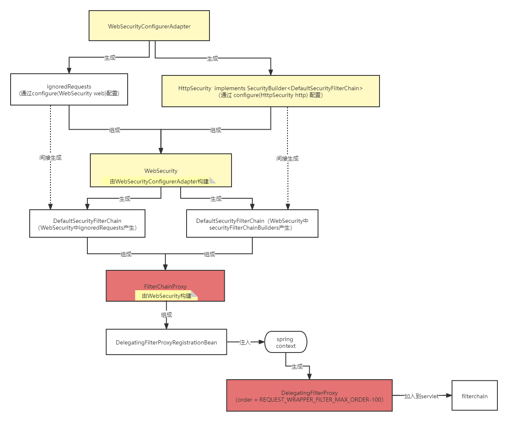
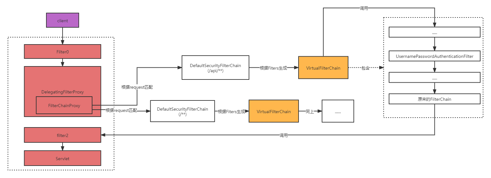

# SpringSecurity

## SpringSecurityFilter.md

## 启动



1. 入口为 @EnableWebSecurity , Import 3个类，继承 EnableGlobalAuthentication：
   * SpringWebMvcImportSelector：添加MVC支持，即添加 AuthenticationPrincipalArgumentResolver、CurrentSecurityContextArgumentResolver、CsrfTokenArgumentResolver，分别负责向Controller中 @AuthenticationPrincipal、 @CurrentSecurityContext、CsrfToken类型 的参数注入值。
   * OAuth2ImportSelector：添加OAuth2支持。
   * WebSecurityConfiguration：负责建立过滤器链。
   * @EnableGlobalAuthentication：负责注入AuthenticationManager。
2. WebSecurityConfiguration:
  * autowiredWebSecurityConfigurersIgnoreParents: 最先执行，因为需要被下面依赖。
  * setFilterChainProxySecurityConfigurer：负责创建 WebSecurity ,并通过 autowiredWebSecurityConfigurersIgnoreParents 从 BeanFactory 查找所有的 WebSecurityConfigurer，并将其加入到 WebSecurity，
    1. 值得注意的是 WebSecurity 实现 SecurityBuilder<Filter> ，表明它拥有创建 Filter的能力。
    2. WebSecurityConfigurer<T extends SecurityBuilder<Filter>> 继承 SecurityConfigurer<Filter, T> ,这里的T为 WebSecurity。
    3. 所以 WebSecurityConfigurer#init(WebSecurity) 和 WebSecurityConfigurer#config(configure) 可以配置  WebSecurity，最后改变  WebSecurity 创建的 Filter。
    4. WebSecurityConfigurerAdapter 是 WebSecurityConfigurer 默认实现，所有我们通过继承 WebSecurityConfigurerAdapter 可以修改最后的 Filter。
3. springSecurityFilterChain：应用 WebSecurityConfigurerAdapter 配置，并build Filter：
   * 调用 WebSecurityConfigurerAdapter#init(WebSecurity) 方法：
     1. 创建 HttpSecurity，HttpSecurity 实现  SecurityBuilder<DefaultSecurityFilterChain>，表明它负责创建 DefaultSecurityFilterChain，DefaultSecurityFilterChain包含一个 List<Filter> 过滤器链。
     2. HttpSecurity 应用 从 SpringFactoriesLoader 获取的 AbstractHttpConfigurer：AbstractHttpConfigurer 继承 SecurityConfigurerAdapter<DefaultSecurityFilterChain, B>，这里 B 为 HttpSecurity，表明 AbstractHttpConfigurer 通过修改 HttpSecurity 最后改变 DefaultSecurityFilterChain。
     3. WebSecurityConfigurerAdapte#configure(HttpSecurity)：该方法是我们常覆盖的，用来配置过滤器链。
     4. WebSecurity 设置 已经创建的 FilterSecurityInterceptor ，若 FilterSecurityInterceptor 这时不存在则为空。
   * 调用 WebSecurityConfigurerAdapter#configure(WebSecurity) 方法：空方法，常常覆盖用来配置 WebSecurity，例如忽略某些请求 `webSecurity.ignoring().antMatchers("/sms/send");`
   * 调用 WebSecurity#performBuild() 方法：

## 调用链路



## Filters

- ChannelProcessingFilter
- WebAsyncManagerIntegrationFilter
- SecurityContextPersistenceFilter
- HeaderWriterFilter
- CorsFilter
- CsrfFilter
- LogoutFilter
- OAuth2AuthorizationRequestRedirectFilter
- Saml2WebSsoAuthenticationRequestFilter
- X509AuthenticationFilter
- AbstractPreAuthenticatedProcessingFilter
- CasAuthenticationFilter
- OAuth2LoginAuthenticationFilter
- Saml2WebSsoAuthenticationFilter
- UsernamePasswordAuthenticationFilter
- OpenIDAuthenticationFilter
- DefaultLoginPageGeneratingFilter
- DefaultLogoutPageGeneratingFilter
- ConcurrentSessionFilter
- DigestAuthenticationFilter
- BearerTokenAuthenticationFilter
- BasicAuthenticationFilter
- RequestCacheAwareFilter
- SecurityContextHolderAwareRequestFilter
- JaasApiIntegrationFilter
- RememberMeAuthenticationFilter
- AnonymousAuthenticationFilter
- OAuth2AuthorizationCodeGrantFilter
- SessionManagementFilter
- ExceptionTranslationFilter
- FilterSecurityInterceptor
- SwitchUserFilter

### ExceptionTranslationFilter

#### 核心代码

```java
......

public void doFilter(ServletRequest req, ServletResponse res, FilterChain chain)
      throws IOException, ServletException {
   HttpServletRequest request = (HttpServletRequest) req;
   HttpServletResponse response = (HttpServletResponse) res;

   try {
      chain.doFilter(request, response);

      logger.debug("Chain processed normally");
   }
   catch (IOException ex) {
      throw ex;
   }
   catch (Exception ex) {
      // Try to extract a SpringSecurityException from the stacktrace
      Throwable[] causeChain = throwableAnalyzer.determineCauseChain(ex);
      RuntimeException ase = (AuthenticationException) throwableAnalyzer
            .getFirstThrowableOfType(AuthenticationException.class, causeChain);

      if (ase == null) {
         ase = (AccessDeniedException) throwableAnalyzer.getFirstThrowableOfType(
               AccessDeniedException.class, causeChain);
      }

      if (ase != null) {
         if (response.isCommitted()) {
            throw new ServletException("Unable to handle the Spring Security Exception because the response is already committed.", ex);
         }
         handleSpringSecurityException(request, response, chain, ase);
      }
      else {
         // Rethrow ServletExceptions and RuntimeExceptions as-is
         if (ex instanceof ServletException) {
            throw (ServletException) ex;
         }
         else if (ex instanceof RuntimeException) {
            throw (RuntimeException) ex;
         }

         // Wrap other Exceptions. This shouldn't actually happen
         // as we've already covered all the possibilities for doFilter
         throw new RuntimeException(ex);
      }
   }
}

......
```

**可以看到程序如果没有抛出异常，`ExceptionTranslationFilter`不会做任何事**

```java
private void handleSpringSecurityException(HttpServletRequest request,
			HttpServletResponse response, FilterChain chain, RuntimeException exception)
			throws IOException, ServletException {
		if (exception instanceof AuthenticationException) {
			logger.debug(
					"Authentication exception occurred; redirecting to authentication entry point",
					exception);

			sendStartAuthentication(request, response, chain,
					(AuthenticationException) exception);
		}
		else if (exception instanceof AccessDeniedException) {
			Authentication authentication = SecurityContextHolder.getContext().getAuthentication();
			if (authenticationTrustResolver.isAnonymous(authentication) || authenticationTrustResolver.isRememberMe(authentication)) {
				logger.debug(
						"Access is denied (user is " + (authenticationTrustResolver.isAnonymous(authentication) ? "anonymous" : "not fully authenticated") + "); redirecting to authentication entry point",
						exception);

				sendStartAuthentication(
						request,
						response,
						chain,
						new InsufficientAuthenticationException(
							messages.getMessage(
								"ExceptionTranslationFilter.insufficientAuthentication",
								"Full authentication is required to access this resource")));
			}
			else {
				logger.debug(
						"Access is denied (user is not anonymous); delegating to AccessDeniedHandler",
						exception);

				accessDeniedHandler.handle(request, response,
						(AccessDeniedException) exception);
			}
		}
	}
```


1. `ExceptionTranslationFilter` 调用 `FilterChain.doFilter(request, response)` 执行后续流程

2. 如果捕获到`AuthenticationException`， 用户`not authenticated` 则开始认证

   > 清理SecurityContextHolder
   >
   > `HttpServletRequest` 保存在 `RequestCache`. 当认证成功,  `RequestCache`用来 replay the original request.
   >
   > `AuthenticationEntryPoint` 用来像客户端请求用户名密码(`credentials`).例如, it might redirect to a log in page or send a `WWW-Authenticate` header.

3. 如果捕获到`AccessDeniedException`, 将` Access Denied`. `AccessDeniedHandler` 处理`Access Denied`.值得注意的是`authenticationTrustResolver`还有额外处理，如果是匿名(`Anonymous`)登录或者`RememberMe`登录，仍然由`AuthenticationEntryPoint` 引导去`Authentication`.

4. 其他异常将正常抛出.


获取用户：

* controller 可以使用 @AuthenticationPrincipal 注解在参数上 来接收 Authentication.getPrincipal() 的值，还可以使用 @CurrentSecurityContext 注解在参数上 来接收 Authentication 的值。
* 使用 Principal 参数 接收。
* 使用 Authentication 参数 接收。
* 使用 SecurityContextHolder 来获取。

WebSecurityConfigurerAdapter 方法：


| 方法                                    | 描述                                                         |
| ----------------------------------------- | -------------------------------------------------------------- |
| configure(WebSecurity)                  | 通过重载，配置 Spring Security 的 Filter 链,比如忽略某些资源 |
| configure(HttpSecurity)                 | 通过重载，配置如何通过拦截器保护请求                         |
| configure(AuthenticationManagerBuilder) | 通过重载，配置 user-detail 服务                              |

安全配置：
首先通过authorizeRequests()方法来开始请求权限配置,再使用 anyRequest() 或 antMatchers() 来匹配请求，最后使用下面方法进行权限配置


| 方法                       | 能够做什么                                                           |
| ---------------------------- | ---------------------------------------------------------------------- |
| access(String)             | 如果给定的 SpEL 表达式计算结果为 true，就允许访问                    |
| anonymous()                | 允许匿名用户访问 authenticated() 允许认证过的用户访问                |
| denyAll()                  | 无条件拒绝所有访问                                                   |
| fullyAuthenticated()       | 如果用户是完整认证的话（不是通过Remember-me 功能认证的），就允许访问 |
| hasAnyAuthority(String...) | 如果用户具备给定权限中的某一个的话，就允许访问                       |
| hasAnyRole(String...)      | 如果用户具备给定角色中的某一个的话，就允许访问                       |
| hasAuthority(String)       | 如果用户具备给定权限的话，就允许访问                                 |
| hasIpAddress(String)       | 如果请求来自给定 IP 地址的话，就允许访问                             |
| hasRole(String)            | 如果用户具备给定角色的话，就允许访问                                 |
| not()                      | 对其他访问方法的结果求反                                             |
| permitAll()                | 无条件允许访问                                                       |
| rememberMe()               | 如果用户是通过 Remember-me 功能认证的，就允许访问                    |

access 接受的表达式：


| 安全表达式                | 计算结果                                                                           |
| --------------------------- | ------------------------------------------------------------------------------------ |
| authentication            | 用户的认证对象                                                                     |
| denyAll                   | 结果始终为 false                                                                   |
| hasAnyRole(list of roles) | 如果用户被授予了列表中任意的指定角色，结果为 true                                  |
| hasRole(role)             | 如果用户被授予了指定的角色，结果为 true                                            |
| hasIpAddress(IP Address)  | 如果请求来自指定 IP 的话，结果为 true                                              |
| isAnonymous()             | 如果当前用户为匿名用户，结果为 true                                                |
| isAuthenticated()         | 如果当前用户进行了认证的话，结果为 true                                            |
| isFullyAuthenticated()    | 如果当前用户进行了完整认证的话（不是通过 Remember-me 功能进行的认证），结果为 true |
| isRememberMe()            | 如果当前用户是通过 Remember-me 自动认证的，结果为 true                             |
| permitAll                 | 结果始终为true                                                                     |
| principal                 | 用户的principal对象                                                                |

除了 authorizeRequests() 之外，还可以使用 requeresChannel() 来现在请求必须是https

```java
@Override
protected void configure(HttpSecurity http) throws Exception {
  http
    .authorizeRequests()
    .antMatchers("/spitter/me").hasRole("SPITTER")
    .antMatchers(HttpMethod.POST, "/spittles").hasRole("SPITTER")
    .anyRequest().permitAll()
    .and()
    .requeresChannel()
    .antMatchers("/spitter/form").requiresSecure();
}
```

Spring Security 提供了三种不同的安全注解：

* Spring Security 自带的 @Secured 注解，需要使用 @EnableGlobalMethodSecurity(securedEnabled=true) 开启。
* JSR-250 的 @RolesAllowed 注解，需要使用 @EnableGlobalMethodSecurity(jsr250Enable=true) 开启。
* 表达式驱动的注解，包括 @PreAuthorize、@PostAuthorize、@PreFilter 和 @PostFilter，需要使用 @EnableGlobalMethodSecurity(prePostEnable=true) 开启，推荐使用：


| 注解           | 描述                                                                                         |
| ---------------- | ---------------------------------------------------------------------------------------------- |
| @PreAuthorize  | 在方法调用之前，基于表达式的计算结果来限制对方法的访问                                       |
| @PostAuthorize | 允许方法调用，但是如果表达式计算结果为false，将抛出一个安 全性异常                           |
| @PostFilter    | 允许方法调用，但必须按照表达式来过滤方法的结果，可使用 filterObject 表示返回集合中的一个元素 |
| @PreFilter     | 允许方法调用，但必须在进入方法之前过滤输入值                                                 |

@PostFilter 使用实例：

```java
@PreAuthorize("hasRole({'ROLE_SPITTER', 'ROLE_ADMIN'})")
// ROLE_ADMIN 可以看到所有结果
// 非 ROLE_ADMIN 只能看到自己用户名的结果
@PostFilter("hasRole('ROLE_ADMIN') || filterObject.spitter.username == principal.username")
public List<Spittle> getOffensiveSpittles() {
}
```

自定义权限计算器：
通过实现 org.springframework.security.access.PermissionEvaluator 并加入到 DefaultMethodSecurityExpressionHandler 中，当使用 hasPermission 表达式时将执行这个方法，返回为true表示有权限。

```java
// 第一步
public class UserPermissionEvaluator implements PermissionEvaluator {
  private static final GrantedAuthority ADMIN_AUTHORITY =
    new GrantedAuthoritylmpl("ROLE_ADMIN");
  public boolean hasPermission(Authentication authentication, Object target, Object permission) {

    if (target instanceof Spittle) {
      Spittle spittle = (Spittle) target;
      String username = spittle.getSpitter().getUsername();
      if ("delete".equals(permission)) {
        return isAdmin(authentication) || username.equals(authentication.getName());
      }
    }

    throw new UnsupportedOperationException(
      "hasPermission not supported for object <" + target
      + "> and permission <" + permission + ">");
  }

  public boolean hasPermission(Authentication authentication, Serializable targetId,
      String targetType, Object permission) {

      throw new UnsupportedOperationException();
  }

  private boolean isAdmin(Authentication authentication) {
    return authentication.getAuthorities().contains(ADMIN_AUTHORITY);
  }
}
// 第二步
// 通过 HttpSecurity 配置 expressionHandler
@Override
protected void configure(HttpSecurity http) throws Exception {
  DefaultMethodSecurityExpressionHandler expressionHandler = new DefaultMethodSecurityExpressionHandler();
  expressionHandler.setPermissionEvaluator(new UserPermissionEvaluator());

  http
    .authorizeRequests()
    .expressionHandler(expressionHandler);
}
```

# 缓存

@Cacheable 和 @CachePut 属性：


| 属性      | 类型     | 描述                                                               |
| ----------- | ---------- | -------------------------------------------------------------------- |
| value     | String[] | 要使用的缓存名称                                                   |
| condition | String   | SpEL 表达式，如果得到的值是 false 的话，不会将缓存应用到方法调用上 |
| key       | String   | SpEL 表达式，用来计算自定义的缓存key                               |
| unless    | String   | SpEL 表达式，如果得到的值是 true 的话，返回值不会放到缓存之中      |

自定义缓存 key：


| 表达式            | 描述                                                       |
| ------------------- | ------------------------------------------------------------ |
| #root.args        | 传递给缓存方法的参数，形式为数组                           |
| #root.caches      | 该方法执行时所对应的缓存，形式为数组                       |
| #root.target      | 目标对象                                                   |
| #root.targetClass | 目标对象的类，是 #root.target.class 的简写形式             |
| #root.method      | 缓存方法                                                   |
| #root.methodName  | 缓存方法的名字，是 #root.method.name 的简写形式            |
| #result           | 方法调用的返回值（不能用在 @Cacheable 注解上）             |
| #Argument         | 任意的方法参数名（如 #argName）或参数索引（如 #a0 或 #p0） |

@CacheEvict 属性：


| 属性             | 类型     | 描述                                                                                               |
| ------------------ | ---------- | ---------------------------------------------------------------------------------------------------- |
| value            | String[] | 要使用的缓存名称                                                                                   |
| condition        | String   | SpEL 表达式，如果得到的值是 false 的话，缓存不会应用到方法调用上                                   |
| key              | String   | SpEL 表达式，用来计算自定义的缓存key                                                               |
| allEntries       | boolean  | 如果为 true 的话，特定缓存的所有条目都会被移除掉                                                   |
| beforeInvocation | boolean  | 如果为 true 的话，在方法调用之前移除条目。如果为 false（默认值）的话，在方法成功调用之后再移除条目 |

# SpringBootActuator


| HTTP 方法 | 路径            | 描述                                                            |
| ----------- | ----------------- | ----------------------------------------------------------------- |
| GET       | /autoconfig     | 提供了一份自动配置报告，记录哪些自动配置条件通过了，哪些没通过  |
| GET       | /configprops    | 描述配置属性(包含默认值)如何注入Bean                            |
| GET       | /beans          | 描述应用程序上下文里全部的Bean，以及它们的关系                  |
| GET       | /dump           | 获取线程活动的快照                                              |
| GET       | /env            | 获取全部环境属性                                                |
| GET       | /env/{name}     | 根据名称获取特定的环境属性值                                    |
| GET       | /health         | 报告应用程序的健康指标，这些值由HealthIndicator的实现类提供     |
| GET       | /info           | 获取应用程序的定制信息，这些信息由info打头的属性提供            |
| GET       | /mappings       | 描述全部的URI路径，以及它们和控制器(包含Actuator端点)的映射关系 |
| GET       | /metrics        | 报告各种应用程序度量信息，比如内存用量和HTTP请求计数            |
| GET       | /metrics/{name} | 报告指定名称的应用程序度量值                                    |
| POST      | /shutdown       | 关闭应用程序，要求endpoints.shutdown.enabled设置为true          |
| GET       | /trace          | 提供基本的HTTP请求跟踪信息(时间戳、HTTP头等)                    |
