# OAuth2协议

## 简介

在传统的客户端-服务器身份验证模式中，客户端请求服务器上限制访问的资源（受保护资源）时，需要使用资源所有者的凭据在服务器上进行身份验证。

资源所有者为了给第三方应用提供受限资源的访问，需要与第三方共享它的凭据。 这造成一些问题和局限：

- 需要第三方应用存储资源所有者的凭据，以供将来使用，通常是明文密码。
- 需要服务器支持密码身份认证，尽管密码认证天生就有安全缺陷。
- 第三方应用获得的资源所有者的受保护资源的访问权限过于宽泛，从而导致资源所有者失去对资源使用时限或使用范围的控制。
- 资源所有者不能仅撤销某个第三方的访问权限而不影响其它，并且，资源所有者只有通过改变第三方的密码，才能单独撤销这第三方的访问权限。
- 与任何第三方应用的让步导致对终端用户的密码及该密码所保护的所有数据的让步。

OAuth2通过引入授权层以及分离客户端角色和资源所有者角色来解决这些问题：

- 客户端在请求受资源所有者控制并托管在资源服务器上的资源的访问权限时，将被授权层颁发一组不同于资源所有者所拥有凭据的令牌。
- 客户端获得一个访问令牌（一个代表特定作用域、生命期以及其他访问属性的字符串），用以代替使用资源所有者的凭据来访问受保护资源。
- 访问令牌由授权服务器在资源所有者认可的情况下颁发给第三方客户端。
- 客户端使用访问令牌访问托管在资源服务器的受保护资源。

## 角色

OAuth定义了四种角色：

- 资源所有者

  能够许可受保护资源访问权限的实体。当资源所有者是个人时，它作为最终用户被提及。
- 资源服务器

  托管受保护资源的服务器，能够接收和响应使用访问令牌对受保护资源的请求。
- 客户端

  使用资源所有者的授权代表资源所有者发起对受保护资源的请求的应用程序。
- 授权服务器

  在成功验证资源所有者且获得授权后颁发访问令牌给客户端的服务器。

## 协议流程

```java
 +--------+                               +---------------+
 |        |--(A)- Authorization Request ->|   Resource    |
 |        |                               |     Owner     |
 |        |<-(B)-- Authorization Grant ---|               |
 |        |                               +---------------+
 |        |
 |        |                               +---------------+
 |        |--(C)-- Authorization Grant -->| Authorization |
 | Client |                               |     Server    |
 |        |<-(D)----- Access Token -------|               |
 |        |                               +---------------+
 |        |
 |        |                               +---------------+
 |        |--(E)----- Access Token ------>|    Resource   |
 |        |                               |     Server    |
 |        |<-(F)--- Protected Resource ---|               |
 +--------+                               +---------------+
```

如上所示的抽象OAuth 2.0流程描述了四个角色之间的交互，包括以下步骤：

- （A）客户端向从资源所有者请求授权；授权请求可以直接向资源所有者发起；或者更可取的是通过作为中介的授权服务器间接发起。
- （B）客户端收到授权许可，这是一个代表资源所有者的授权的凭据。
- （C）客户端与授权服务器进行身份认证并出示授权许可请求访问令牌。
- （D）授权服务器验证客户端身份并验证授权许可，若有效则颁发访问令牌。
- （E）客户端从资源服务器请求受保护资源并出示访问令牌进行身份验证。
- （F）资源服务器验证访问令牌，若有效则满足该请求。

## 授权模式

OAuth2.0有4种授权模式：

- 授权码模式（authorization code）
- 简化模式（implicit）
- 密码模式（resource owner password credentials）
- 客户端模式（client credentials）

### 授权码模式（authorization code）

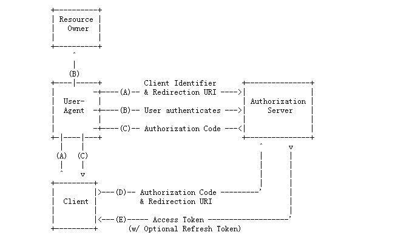

> 举例说明：
> Resource-Owner => 用户
> User-Agent => 浏览器
> Client => 网站A
> Authorization-Server => QQ认证服务器
>
> 用户(Resource-Owner)在浏览器(User-Agent)上访问网站A(Client)，并使用QQ账号登陆(Authorization-Server)。

第一步（A）：

首先网站A登陆页面提供QQ登陆按钮，再由用户点击跳转到QQ登陆页面。下面就是一个跳转的示意链接：

```http
https://QQ.com/authorize?response_type=code&client_id=CLIENT_ID&redirect_uri=CALLBACK_URL&scope=read
```

上述的URL中有四个参数：

response_type：响应结果类型，code表示要求返回授权码。

client_id：客户端ID，值是网站A在授权服务器注册时的备案ID，由授权服务器提供，用来让授权服务器知道是谁在请求。

redirect_uri：授权服务器接受或者拒绝请求后跳转的网址，需要在授权服务器备案。

scope：表示要求授权的范围。

第二步（B-C）：

跳转到QQ登录页面后，QQ要求用户登录，并询问是否同意给网站A授权；如果登录成功并成功授权，则由登录响应重定向回第一步中设定的`CALLBACK_URL`，并携带一个授权码带回。如下所示：

```http
https://A.com/callback?code=AUTHORIZATION_CODE
```

其中，AUTHORIZATION_CODE就是授权码。

第三步（C-D-E）：

`CALLBACK_URL`页面拿到授权码后，请求网站A后端，并传递授权码，再由网站A后端发送链接给认证服务器，最后网站A后端拿到认证服务器返回的令牌，并返回给用户（浏览器）,然后跳转到用户需要访问的页面`redirect_uri`。发送链接如下所示:

```http
https://b.com/token?client_id=CLIENT_ID&client_secret=CLIENT_SECRET&grant_type=authorization_code&code=AUTHORIZATION_CODE&redirect_uri=CALLBACK_URL
```

上述的URL中有五个参数：

client_id：客户端ID

client_secret：客户端ID对应的密码，参数是保密的，因此只能在后端发请求。

grant_type：参数是AUTHORIZATION_CODE，表示采用的授权方式是授权码模式。

code：授权码，参数为第二步拿到的授权码。

redirect_uri: 拿到令牌后的回调地址，即为用户最开始需要访问的地址。

### 隐藏模式（implicit grant type）

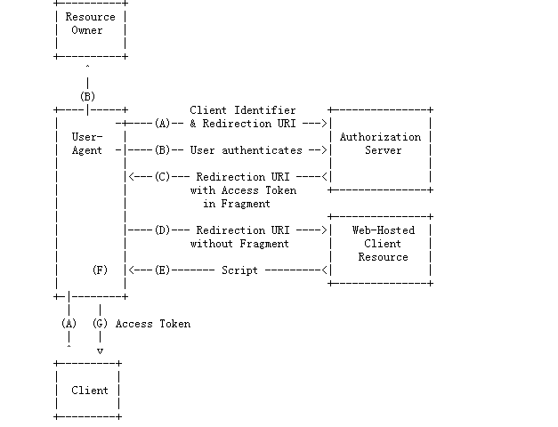

有些 Web 应用是纯前端应用，没有后端。这时就不能用上面的方式了，必须将令牌储存在前端。**RFC 6749 就规定了第二种方式，允许直接向前端颁发令牌。这种方式没有授权码这个中间步骤，所以称为（授权码）"隐藏式"（implicit）。**

第一步（A）：

网站A提供一个链接，要求用户跳转到认证服务器登录页面，链接如下：

```http
https://b.com/authorize?response_type=token&client_id=CLIENT_ID&redirect_uri=CALLBACK_URL&scope=read
```

上述的URL中有四个参数：

response_type：响应结果类型，token表示要求直接返回令牌。

client_id：客户端ID，值是网站A在授权服务器注册时的备案ID，由授权服务器提供，用来让授权服务器知道是谁在请求。

redirect_uri：授权服务器接受或者拒绝请求后跳转的网址，需要在授权服务器备案。

scope：表示要求授权的范围。

第二步（B-C）：

用户登录，同意给网站A授权，认证服务器登录响应返回，重定向到`CALLBACK_URL`并携带令牌返回。重定向链接如下：

```http
https://a.com/callback#token=ACCESS_TOKEN
```

值得注意的是`#`，这表示`token` 是以 URL 锚点（fragment）返回的，而不是参数，这是因为 OAuth 2.0 允许跳转网址是 HTTP 协议，因此存在"中间人攻击"的风险，而浏览器跳转时，锚点不会发到服务器，就减少了泄漏令牌的风险。

这种方式把令牌直接传给前端，是很不安全的。因此，只能用于一些安全要求不高的场景，并且令牌的有效期必须非常短，通常就是会话期间（session）有效，浏览器关掉，令牌就失效了

### 密码模式（resource owner password credentials）

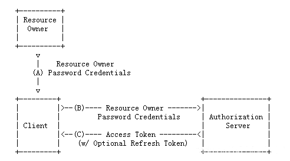

**如果你高度信任某个应用，RFC 6749 也允许用户把用户名和密码，直接告诉该应用。该应用就使用你的密码，申请令牌，这种方式称为"密码式"（password）。**

第一步（A-B）：

网站A要求用户提供 认证服务器的用户名和密码。拿到以后，网站A 就直接向认证服务器请求令牌。

```http
https://b.com/token?grant_type=password&username=USERNAME&password=PASSWORD&client_id=CLIENT_ID
```

上述的URL中有四个参数：

grant_type：授权类型，password表示密码模式。

username：用户名。

password：用户名对应的密码。

client_id：客户端ID，值是网站A在授权服务器注册时的备案ID，由授权服务器提供，用来让授权服务器知道是谁在请求。

第二步（C）:
认证服务器验证身份通过后，直接给出令牌。注意，这时不需要跳转，而是把令牌放在 JSON 数据里面，作为 HTTP 回应，网站A 因此拿到令牌。

这种方式需要用户给出自己的用户名/密码，显然风险很大，因此只适用于其他授权方式都无法采用的情况，而且必须是用户高度信任的应用。

### 客户端模式（client credentials）

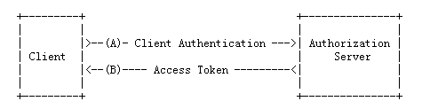

客户端模式适用于没有前端的命令行应用。

第一步（A）：

网站A后台直接向认证服务器发送请求。链接如下：

```http
https://b.com/token?grant_type=client_credentials&client_id=CLIENT_ID&client_secret=CLIENT_SECRET
```

grant_type：授权类型，client_credentials表示客户端模式。

client_id：客户端ID，值是网站A在授权服务器注册时的备案ID，由授权服务器提供，用来让授权服务器知道是谁在请求。

client_secret：客户端ID对应的密码。

第一步（B）：

认证服务器通过后直接返回令牌。

## 令牌使用

网站A拿到令牌之后，就可以向资源服务器请求数据，此时，每个发送的请求都必须带有令牌。

具体的做法是在请求头里加上`Authorization`，令牌就放在这个头里面。

```shell
curl -H "Authorization: Bearer ACCESS_TOKEN" "https://api.a.com"
```

`ACCESS_TOKEN`就是拿到的令牌。

## 令牌更新

令牌的有效期到了，如果让用户重新走一遍上面的流程，再申请一个新的令牌，很可能体验不好，而且也没有必要。OAuth 2.0 允许用户自动更新令牌。

具体方法是，认证服务器颁发令牌的时候，一次性颁发两个令牌，一个用于获取数据`token`，另一个用于获取新的令牌`refresh token`。

令牌到期前，用户使用 `refresh token` 发一个请求，去更新令牌。请求如下：

```http
https://b.com/token?grant_type=refresh_token&client_id=CLIENT_ID&client_secret=CLIENT_SECRET&refresh_token=REFRESH_TOKEN
```

grant_type：授权类型，refresh_token表示要求更新令牌。

client_id：客户端ID，值是网站A在授权服务器注册时的备案ID，由授权服务器提供，用来让授权服务器知道是谁在请求。

client_secret：客户端ID对应的密码。

refresh_token：参数就是用于更新令牌的令牌。

## JWT令牌

JWT由三部分构成，结构为：

```properties
header.payload.signature
```

### 头（header）

`header`是JWT的元数据，主要描述它的基本信息，例如：

```json
{
  "typ": "JWT",
  "alg": "HS256"
}
```

typ：声明类型。

alg：声明加密的算法 。

然后使用Base64URL进行编码得到类似下面的字符串：

```properties
yJhbGciOiJIUzI1NiIsInR5cCI6IkpXVCJ9
```

### 载荷（payload）

`payload`是关于实体(通常是用户)和其他数据的声明，声明有三种类型: registered, public 和 private。

- Registered claims : 这里有一组预定义的声明，它们不是强制的，但是推荐。比如：

  > iss (issuer)：签发人
  >
  > exp (expiration time)：过期时间
  >
  > sub (subject)：主题
  >
  > aud (audience)：受众
  >
  > nbf (Not Before)：生效时间
  >
  > iat (Issued At)：签发时间
  >
  > jti (JWT ID)：编号
  >
- Public claims : 可以随意定义。
- Private claims : 用于在同意使用它们的各方之间共享信息，并且不是注册的或公开的声明。

例如：

```json
 {
   "sub": "1234567890",
   "name": "chongchong",
   "admin": true
 }
```

然后对其使用Base64URL编码得到类似下面的字符串：

```properties
eyJzdWIiOiIxMjM0NTY3ODkwIiwibmFtZSI6IkpvaG4gRG9lIiwiaWF0IjoxNTE2MjM5MDIyfQ
```

### 签名（signature）

`signature` 部分是对前两部分的签名，防止数据篡改。

首先，需要指定一个密钥`secret`。这个密钥只有服务器才知道，不能泄露给用户。然后，使用 `header `里面指定的签名算法（默认是 `HMAC SHA256`），按照下面的公式产生签名:

```java
HMACSHA256(base64UrlEncode(header) + "." +base64UrlEncode(payload),secret)
```

最后签名以后，把`header`、`payload`、`signature` 三个部分拼成一个字符串，每个部分之间用"点"（.）分隔，就构成整个令牌。

# 登录

举例Google:

1. 首先登陆`Google API Console`，获取` OAuth 2.0 credentials`,即`Client ID`和` Client Secret`。
2. 设置登陆重定向地址为`http://localhost:8080/login/oauth2/code/google`，默认`URI Template`为`{baseUrl}/login/oauth2/code/{registrationId}`.
3. 设置`application.yml`：

```yaml
spring:
 security:
   oauth2:
     client:
       registration:
         google:
           client-id: google-client-id
           client-secret: google-client-secret
```

## Login授权流程

1. 当`FilterSecurityInterceptor`鉴权失败时，由`ExceptionTranslationFilter`使用`AuthenticationEntryPoint`重定向到`/oauth2/authorization/{registrationId}`。
2. 当`requet`可以匹配到`DEFAULT_AUTHORIZATION_REQUEST_BASE_URI = "/oauth2/authorization/{registrationId}"`时，`OAuth2AuthorizationRequestRedirectFilter`会根据`registrationId`获得对应的`ClientRegistration`，然后构造出`OAuth2AuthorizationRequest`重定向到`authorizationUri`。
3. 填写用户名密码，认证通过`Authorization Server`回调备案地址(如上面例子中`http://localhost:8080/login/oauth2/code/google`)并携带`code`

参数，**备案地址需要匹配`AbstractAuthenticationProcessingFilter`中`requiresAuthenticationRequestMatcher`，可以通过`defaultFilterProcessesUrl`修改，默认值为`DEFAULT_FILTER_PROCESSES_URI = "/login/oauth2/code/*"`。**

4. 由`OAuth2LoginAuthenticationFilter`拦截到`http://localhost:8080/login/oauth2/code/google`开始`POST`调用`tokenUri`并携带上一步得到的`code`参数，获取到`access_token`后重定向回最开始用户想访问的`URL`并设置`cookie`。
5. 然后带着`cookie`访问。
6.

### Spring Boot 2.x Property Mappings


| Spring Boot 2.x                                                                              | ClientRegistration                                       |
| :--------------------------------------------------------------------------------------------- | :--------------------------------------------------------- |
| `spring.security.oauth2.client.registration.*[registrationId]*`                              | `registrationId`                                         |
| `spring.security.oauth2.client.registration.*[registrationId]*.client-id`                    | `clientId`                                               |
| `spring.security.oauth2.client.registration.*[registrationId]*.client-secret`                | `clientSecret`                                           |
| `spring.security.oauth2.client.registration.*[registrationId]*.client-authentication-method` | `clientAuthenticationMethod`                             |
| `spring.security.oauth2.client.registration.*[registrationId]*.authorization-grant-type`     | `authorizationGrantType`                                 |
| `spring.security.oauth2.client.registration.*[registrationId]*.redirect-uri`                 | `redirectUri`                                            |
| `spring.security.oauth2.client.registration.*[registrationId]*.scope`                        | `scopes`                                                 |
| `spring.security.oauth2.client.registration.*[registrationId]*.client-name`                  | `clientName`                                             |
| `spring.security.oauth2.client.provider.*[providerId]*.authorization-uri`                    | `providerDetails.authorizationUri`                       |
| `spring.security.oauth2.client.provider.*[providerId]*.token-uri`                            | `providerDetails.tokenUri`                               |
| `spring.security.oauth2.client.provider.*[providerId]*.jwk-set-uri`                          | `providerDetails.jwkSetUri`                              |
| `spring.security.oauth2.client.provider.*[providerId]*.issuer-uri`                           | `providerDetails.issuerUri`                              |
| `spring.security.oauth2.client.provider.*[providerId]*.user-info-uri`                        | `providerDetails.userInfoEndpoint.uri`                   |
| `spring.security.oauth2.client.provider.*[providerId]*.user-info-authentication-method`      | `providerDetails.userInfoEndpoint.authenticationMethod`  |
| `spring.security.oauth2.client.provider.*[providerId]*.user-name-attribute`                  | `providerDetails.userInfoEndpoint.userNameAttributeName` |

### CommonOAuth2Provider

`CommonOAuth2Provider`预定义 `Google`、`GitHub`、`Facebook`、 `Okta`的默认配置。

## Configuring Custom Provider Properties

```yaml
spring:
 security:
   oauth2:
     client:
       registration:
         okta:
           client-id: okta-client-id
           client-secret: okta-client-secret
       provider:
         okta:
           authorization-uri: https://your-subdomain.oktapreview.com/oauth2/v1/authorize
           token-uri: https://your-subdomain.oktapreview.com/oauth2/v1/token
           user-info-uri: https://your-subdomain.oktapreview.com/oauth2/v1/userinfo
           user-name-attribute: sub
           jwk-set-uri: https://your-subdomain.oktapreview.com/oauth2/v1/keys
```

### Overriding Spring Boot 2.x Auto-configuration

如果使用`CommonOAuth2Provider`，需要配置`ClientRegistrationRepository`，`httpSecurity.oauth2Login()`。

```java
@Configuration
public class OAuth2LoginConfig {

	@EnableWebSecurity
	public static class OAuth2LoginSecurityConfig extends WebSecurityConfigurerAdapter {

		@Override
		protected void configure(HttpSecurity http) throws Exception {
			http
				.authorizeHttpRequests(authorize -> authorize
					.anyRequest().authenticated()
				)
				.oauth2Login(withDefaults());
		}
	}

	@Bean
	public ClientRegistrationRepository clientRegistrationRepository() {
		return new InMemoryClientRegistrationRepository(this.googleClientRegistration());
	}

	private ClientRegistration googleClientRegistration() {
		return ClientRegistration.withRegistrationId("google")
			.clientId("google-client-id")
			.clientSecret("google-client-secret")
			.clientAuthenticationMethod(ClientAuthenticationMethod.CLIENT_SECRET_BASIC)
			.authorizationGrantType(AuthorizationGrantType.AUTHORIZATION_CODE)
			.redirectUri("{baseUrl}/login/oauth2/code/{registrationId}")
			.scope("openid", "profile", "email", "address", "phone")
			.authorizationUri("https://accounts.google.com/o/oauth2/v2/auth")
			.tokenUri("https://www.googleapis.com/oauth2/v4/token")
			.userInfoUri("https://www.googleapis.com/oauth2/v3/userinfo")
			.userNameAttributeName(IdTokenClaimNames.SUB)
			.jwkSetUri("https://www.googleapis.com/oauth2/v3/certs")
			.clientName("Google")
			.build();
	}
}
```

如果无法使用`CommonOAuth2Provider`，配置:

```java
@Configuration
public class OAuth2LoginConfig {

	@EnableWebSecurity
	public static class OAuth2LoginSecurityConfig extends WebSecurityConfigurerAdapter {

		@Override
		protected void configure(HttpSecurity http) throws Exception {
			http
				.authorizeHttpRequests(authorize -> authorize
					.anyRequest().authenticated()
				)
				.oauth2Login(withDefaults());
		}
	}

	@Bean
	public ClientRegistrationRepository clientRegistrationRepository() {
		return new InMemoryClientRegistrationRepository(this.googleClientRegistration());
	}

	@Bean
	public OAuth2AuthorizedClientService authorizedClientService(
			ClientRegistrationRepository clientRegistrationRepository) {
		return new InMemoryOAuth2AuthorizedClientService(clientRegistrationRepository);
	}

	@Bean
	public OAuth2AuthorizedClientRepository authorizedClientRepository(
			OAuth2AuthorizedClientService authorizedClientService) {
		return new AuthenticatedPrincipalOAuth2AuthorizedClientRepository(authorizedClientService);
	}

	private ClientRegistration googleClientRegistration() {
		return CommonOAuth2Provider.GOOGLE.getBuilder("google")
			.clientId("google-client-id")
			.clientSecret("google-client-secret")
			.build();
	}
}
```

## Advanced Configuration

`HttpSecurity.oauth2Login()`提供一些自定义配置，例如：

```java
@EnableWebSecurity
public class OAuth2LoginSecurityConfig extends WebSecurityConfigurerAdapter {

	@Override
	protected void configure(HttpSecurity http) throws Exception {
		http
			.oauth2Login(oauth2 -> oauth2
			    .clientRegistrationRepository(this.clientRegistrationRepository())
			    .authorizedClientRepository(this.authorizedClientRepository())
			    .authorizedClientService(this.authorizedClientService())
			    .loginPage("/login")
			    .authorizationEndpoint(authorization -> authorization
			        .baseUri(this.authorizationRequestBaseUri())
			        .authorizationRequestRepository(this.authorizationRequestRepository())
			        .authorizationRequestResolver(this.authorizationRequestResolver())
			    )
			    .redirectionEndpoint(redirection -> redirection
			        .baseUri(this.authorizationResponseBaseUri())
			    )
			    .tokenEndpoint(token -> token
			        .accessTokenResponseClient(this.accessTokenResponseClient())
			    )
			    .userInfoEndpoint(userInfo -> userInfo
			        .userAuthoritiesMapper(this.userAuthoritiesMapper())
			        .userService(this.oauth2UserService())
			        .oidcUserService(this.oidcUserService())
			    )
			);
	}
}
```

# 客户端

使用`HttpSecurity.oauth2Client()`进行配置`Client`。

```java
@EnableWebSecurity
public class OAuth2ClientSecurityConfig extends WebSecurityConfigurerAdapter {

	@Override
	protected void configure(HttpSecurity http) throws Exception {
		http
			.oauth2Client(oauth2 -> oauth2
				.clientRegistrationRepository(this.clientRegistrationRepository())
				.authorizedClientRepository(this.authorizedClientRepository())
				.authorizedClientService(this.authorizedClientService())
				.authorizationCodeGrant(codeGrant -> codeGrant
					.authorizationRequestRepository(this.authorizationRequestRepository())
					.authorizationRequestResolver(this.authorizationRequestResolver())
					.accessTokenResponseClient(this.accessTokenResponseClient())
				)
			);
	}
}
```

`OAuth2AuthorizedClientManager`负责协调一个或多个`OAuth2AuthorizedClientProvider`。

例如：

```java
@Bean
public OAuth2AuthorizedClientManager authorizedClientManager(
		ClientRegistrationRepository clientRegistrationRepository,
		OAuth2AuthorizedClientRepository authorizedClientRepository) {
	// 配置多个OAuth2AuthorizedClientProvider
	OAuth2AuthorizedClientProvider authorizedClientProvider =
			OAuth2AuthorizedClientProviderBuilder.builder()
        			 //authorization_code
					.authorizationCode()
        			 //refresh_token
					.refreshToken()
                	 //client_credentials
					.clientCredentials()
                	 //password
					.password()
					.build();

	DefaultOAuth2AuthorizedClientManager authorizedClientManager =
			new DefaultOAuth2AuthorizedClientManager(
					clientRegistrationRepository, authorizedClientRepository);
	authorizedClientManager.setAuthorizedClientProvider(authorizedClientProvider);

	return authorizedClientManager;
}
```

## 核心接口

### ClientRegistration

`ClientRegistration`表示注册在`OAuth 2.0`或`OpenID Connect 1.0`服务器的客户端信息 。

```java
public final class ClientRegistration {
	private String registrationId;
	private String clientId;
	private String clientSecret;
	private ClientAuthenticationMethod clientAuthenticationMethod;
	private AuthorizationGrantType authorizationGrantType;
	private String redirectUriTemplate;
	private Set<String> scopes;
	private ProviderDetails providerDetails;
	private String clientName;

	public class ProviderDetails {
		private String authorizationUri;
		private String tokenUri;
		private UserInfoEndpoint userInfoEndpoint;
		private String jwkSetUri;
		private String issuerUri;
        private Map<String, Object> configurationMetadata;

		public class UserInfoEndpoint {
			private String uri;
            private AuthenticationMethod authenticationMethod;
			private String userNameAttributeName;

		}
	}
}
```

1. `registrationId`： `ClientRegistration` 的唯一`ID`。
2. `clientId`：该`Client`在`OAuth 2.0`或`OpenID Connect 1.0`申请备案的`ID`,比如在`Google API Console`申请的`ID`。
3. `clientSecret`：`clientId`对应的密码。
4. `clientAuthenticationMethod`：使用`Provider`对客户端进行身份验证的方法。支持`basic`、`post`、none。
5. `authorizationGrantType`：授权类型。支持`authorization_code`, `implicit`，`refresh_token`，`client_credentials`，`password`。
6. `redirectUriTemplate`：用户 在`Authorization Server`完成认证授权后被重定向的地址。默认的重定向URI模板是`{baseUrl}/login/oauth2/code/{registrationId}`。
7. `scopes`：授权请求流程中客户端请求的范围。
8. `clientName`：`Client`名称。
9. `authorizationUri`：`Authorization Server`的授权地址（`Authorization Endpoint`）。
10. `tokenUri`：`Authorization Server`的令牌地址（`Token Endpoint`）。
11. `jwkSetUri`：从`Authorization Server`检索`JWK`的地址，从而获得`JWS`和`UserInfo`。
12. `(userInfoEndpoint)uri`：用来获取已认证用户的属性。
13. `(userInfoEndpoint)authenticationMethod`：将`access token `发到`UserInfo Endpoint`使用的方法，支持`header`、`form`、`query`。
14. `userNameAttributeName`：`UserInfo Response`中返回的用户`ID`的`key`，例如`sub`、`id`。

`ClientRegistration`除了手动配置外还可以使用`Authorization Server`的`Metadata endpoint`进行自动配置。

例如:

```java
ClientRegistration clientRegistration =
    ClientRegistrations.fromIssuerLocation("https://idp.example.com/issuer").build();
```

### ClientRegistrationRepository

`ClientRegistrationRepository`是`ClientRegistration`储存库，默认是`InMemoryClientRegistrationRepository`，并且已经注册为`Bean`。

`spring.security.oauth2.client.registration.[registrationId]`下的属性将会自动绑定到`ClientRegistration`。

### OAuth2AuthorizedClient

`OAuth2AuthorizedClient`是` an Authorized Client`。当用户给客户端授权时，客户端被认为已经被授权。

`OAuth2AuthorizedClient`将` OAuth2AccessToken`(或`OAuth2RefreshToken`)与`ClientRegistration`、用户相关联。

### OAuth2AuthorizedClientRepository / OAuth2AuthorizedClientService

`OAuth2AuthorizedClientRepository`在框架中用户持久化 `OAuth2AuthorizedClient`，`OAuth2AuthorizedClientService`可以在程序中调用， 默认使用`InMemoryOAuth2AuthorizedClientService`。`OAuth2AuthorizedClientRepository`本质上还是调用`OAuth2AuthorizedClientService`。

`OAuth2AuthorizedClientService`在程序中调用示例:

```java
@Controller
public class OAuth2ClientController {

    @Autowired
    private OAuth2AuthorizedClientService authorizedClientService;

    @GetMapping("/")
    public String index(Authentication authentication) {
        OAuth2AuthorizedClient authorizedClient =
            this.authorizedClientService.loadAuthorizedClient("okta", authentication.getName());

        OAuth2AccessToken accessToken = authorizedClient.getAccessToken();

        ...

        return "index";
    }
}
```

`OAuth2AuthorizedClient`建表语句：

```sql
CREATE TABLE oauth2_authorized_client (
  client_registration_id varchar(100) NOT NULL,
  principal_name varchar(200) NOT NULL,
  access_token_type varchar(100) NOT NULL,
  access_token_value blob NOT NULL,
  access_token_issued_at timestamp NOT NULL,
  access_token_expires_at timestamp NOT NULL,
  access_token_scopes varchar(1000) DEFAULT NULL,
  refresh_token_value blob DEFAULT NULL,
  refresh_token_issued_at timestamp DEFAULT NULL,
  created_at timestamp DEFAULT CURRENT_TIMESTAMP NOT NULL,
  PRIMARY KEY (client_registration_id, principal_name)
);
```

### OAuth2AuthorizedClientManager / OAuth2AuthorizedClientProvider

`OAuth2AuthorizedClientManager`负责`OAuth2AuthorizedClient`的整体管理，间接包含多个`OAuth2AuthorizedClientProvider`，使用`DelegatingOAuth2AuthorizedClientProvider`代理。`DefaultOAuth2AuthorizedClientManager`是`OAuth2AuthorizedClientManager`的默认实现。

主要功能包括：

- 使用`OAuth2AuthorizedClientProvider`授权客户端。
- 使用`OAuth2AuthorizedClientRepository`持久化 `OAuth2AuthorizedClient`。
- 授权成功后调用` OAuth2AuthorizationSuccessHandler`。
- 授权失败后调用`OAuth2AuthorizationFailureHandler`。

`OAuth2AuthorizedClientProvider`实现` OAuth 2.0 Client`，有不同的种类，例如`authorization_code`, `client_credentials`等。可以使用`OAuth2AuthorizedClientProviderBuilder`来构建`DelegatingOAuth2AuthorizedClientProvider`。

例如：

```java
@Bean
public OAuth2AuthorizedClientManager authorizedClientManager(
		ClientRegistrationRepository clientRegistrationRepository,
		OAuth2AuthorizedClientRepository authorizedClientRepository) {

	OAuth2AuthorizedClientProvider authorizedClientProvider =
			OAuth2AuthorizedClientProviderBuilder.builder()
					.authorizationCode()
					.refreshToken()
					.clientCredentials()
					.password()
					.build();

	DefaultOAuth2AuthorizedClientManager authorizedClientManager =
			new DefaultOAuth2AuthorizedClientManager(
					clientRegistrationRepository, authorizedClientRepository);
	authorizedClientManager.setAuthorizedClientProvider(authorizedClientProvider);

	return authorizedClientManager;
}
```

当授权成功后，`DefaultOAuth2AuthorizedClientManager `调用`OAuth2AuthorizationSuccessHandler`，`OAuth2AuthorizationSuccessHandler`使用`OAuth2AuthorizedClientRepository`保存`OAuth2AuthorizedClient`，当重新授权失败(例如`refresh token`失效)后，`RemoveAuthorizedClientOAuth2AuthorizationFailureHandler`会把`OAuth2AuthorizedClient`从`OAuth2AuthorizedClientRepository`删除。

`DefaultOAuth2AuthorizedClientManager `另外还包含`Function<OAuth2AuthorizeRequest, Map<String, Object>>`类型的`contextAttributesMapper `，它负责将属性从`OAuth2AuthorizeRequest `映射到`OAuth2AuthorizationContext `。当使用`OAuth2AuthorizedClientProvider`时`OAuth2AuthorizationContext `会很有用，例如`PasswordOAuth2AuthorizedClientProvider`通过

`OAuth2AuthorizationContext.getAttributes()`获取`username` 、`password` ：

```java
public OAuth2AuthorizedClientManager authorizedClientManager(
		ClientRegistrationRepository clientRegistrationRepository,
		OAuth2AuthorizedClientRepository authorizedClientRepository) {

	OAuth2AuthorizedClientProvider authorizedClientProvider =
			OAuth2AuthorizedClientProviderBuilder.builder()
					.password()
					.refreshToken()
					.build();

	DefaultOAuth2AuthorizedClientManager authorizedClientManager =
			new DefaultOAuth2AuthorizedClientManager(
					clientRegistrationRepository, authorizedClientRepository);
	authorizedClientManager.setAuthorizedClientProvider(authorizedClientProvider);

	// Assuming the `username` and `password` are supplied as `HttpServletRequest` parameters,
	// map the `HttpServletRequest` parameters to `OAuth2AuthorizationContext.getAttributes()`
	authorizedClientManager.setContextAttributesMapper(contextAttributesMapper());

	return authorizedClientManager;
}

private Function<OAuth2AuthorizeRequest, Map<String, Object>> contextAttributesMapper() {
	return authorizeRequest -> {
		Map<String, Object> contextAttributes = Collections.emptyMap();
		HttpServletRequest servletRequest = authorizeRequest.getAttribute(HttpServletRequest.class.getName());
		String username = servletRequest.getParameter(OAuth2ParameterNames.USERNAME);
		String password = servletRequest.getParameter(OAuth2ParameterNames.PASSWORD);
		if (StringUtils.hasText(username) && StringUtils.hasText(password)) {
			contextAttributes = new HashMap<>();

			// `PasswordOAuth2AuthorizedClientProvider` requires both attributes
			contextAttributes.put(OAuth2AuthorizationContext.USERNAME_ATTRIBUTE_NAME, username);
			contextAttributes.put(OAuth2AuthorizationContext.PASSWORD_ATTRIBUTE_NAME, password);
		}
		return contextAttributes;
	};
}
```

`DefaultOAuth2AuthorizedClientManager `主要用于操作`web HttpServletRequest`，如果是`HttpServletRequest`之外，改用`AuthorizedClientServiceOAuth2AuthorizedClientManager`，例如，程序内部一般在后台运行，没有和用户交互，`Client`使用`client_credentials`方式访问：

```java
@Bean
public OAuth2AuthorizedClientManager authorizedClientManager(
		ClientRegistrationRepository clientRegistrationRepository,
		OAuth2AuthorizedClientService authorizedClientService) {

	OAuth2AuthorizedClientProvider authorizedClientProvider =
			OAuth2AuthorizedClientProviderBuilder.builder()
					.clientCredentials()
					.build();

	AuthorizedClientServiceOAuth2AuthorizedClientManager authorizedClientManager =
			new AuthorizedClientServiceOAuth2AuthorizedClientManager(
					clientRegistrationRepository, authorizedClientService);
	authorizedClientManager.setAuthorizedClientProvider(authorizedClientProvider);

	return authorizedClientManager;
}
```

## Authorization Grant Support

### Authorization Code

`OAuth2AuthorizationRequestRedirectFilter`通过 `OAuth2AuthorizationRequestResolver`解析`HttpServletRequest`来构建 `OAuth2AuthorizationRequest` ，并重定向到`Authorization Server's Authorization Endpoint`（`authorization-uri`）对用户进行授权。

`OAuth2AuthorizationRequestResolver`默认实现是 `DefaultOAuth2AuthorizationRequestResolver `，会匹配`/oauth2/authorization/{registrationId} `，提取`registrationId `，并使用它为关联的 `ClientRegistration `构建 `OAuth2AuthorizationRequest`。

```yaml
spring:
  security:
    oauth2:
      client:
        registration:
          okta:
            client-id: okta-client-id
            client-secret: okta-client-secret
            authorization-grant-type: authorization_code
            redirect-uri: "{baseUrl}/authorized/okta"
            scope: read, write
        provider:
          okta:
            authorization-uri: https://dev-1234.oktapreview.com/oauth2/v1/authorize
            token-uri: https://dev-1234.oktapreview.com/oauth2/v1/token
```

`/oauth2/authorization/okta`的请求将会通过`OAuth2AuthorizationRequestRedirectFilter`重定向到` authorization-uri`,发起授权码流程。

#### Requesting an Access Token/Refreshing an Access Token

`DefaultAuthorizationCodeTokenResponseClient`、`DefaultRefreshTokenTokenResponseClient`是授权码模式下 `OAuth2AccessTokenResponseClient` 的默认实现，使用 `RestOperations` 请求`Authorization Server's Authorization Endpoint`（`authorization-uri`）获取`access token`。

`DefaultAuthorizationCodeTokenResponseClient`、`DefaultRefreshTokenTokenResponseClient`允许操作`the pre-processing of the Token Request `或`post-handling of the Token Response`。

### Client Credentials

`DefaultClientCredentialsTokenResponseClient`是客户端模式下 `OAuth2AccessTokenResponseClient` 的默认实现。

### JWT Bearer

`DefaultJwtBearerTokenResponseClient`是`JWT Bearer`模式下 `OAuth2AccessTokenResponseClient` 的默认实现。

# RBAC

## 权限系统与RBAC模型概述

RBAC（Role-Based Access Control ）基于角色的访问控制。

在20世纪90年代期间，大量的专家学者和专门研究单位对RBAC的概念进行了深入研究，先后提出了许多类型的RBAC模型，其中以美国George Mason大学信息安全技术实验室（LIST）提出的RBAC96模型最具有系统性，得到普遍的公认。

RBAC认为权限的过程可以抽象概括为：判断【Who是否可以对What进行How的访问操作（Operator）】这个逻辑表达式的值是否为True的求解过程。

即将权限问题转换为Who、What、How的问题。who、what、how构成了访问权限三元组。

## RBAC组成

在RBAC模型里面，有3个基础组成部分，分别是：用户、角色和权限。

RBAC通过定义角色的权限，并对用户授予某个角色从而来控制用户的权限，实现了用户和权限的逻辑分离（区别于ACL模型），极大地方便了权限的管理

下面在讲解之前，先介绍一些名词：

- User（用户）：每个用户都有唯一的UID识别，并被授予不同的角色
- Role（角色）：不同角色具有不同的权限
- Permission（权限）：访问权限
- 用户-角色映射：用户和角色之间的映射关系
- 角色-权限映射：角色和权限之间的映射

它们之间的关系如下图所示：


例如：

管理员和普通用户被授予不同的权限，普通用户只能去修改和查看个人信息，而不能创建创建用户和冻结用户，而管理员由于被授 予所有权限，所以可以做所有操作。

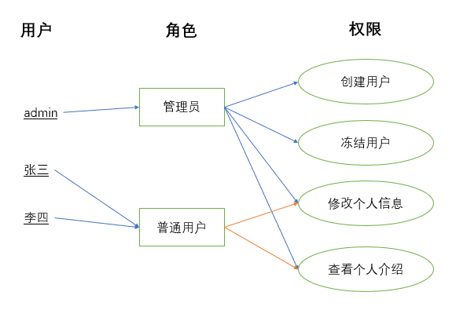

## 安全原则

RBAC支持三个著名的安全原则：最小权限原则、责任分离原则和数据抽象原则

- 最小权限原则：RBAC可以将角色配置成其完成任务所需的最小权限集合
- 责任分离原则：可以通过调用相互独立互斥的角色来共同完成敏感的任务，例如要求一个计账员和财务管理员共同参与统一过账操作
- 数据抽象原则：可以通过权限的抽象来体现，例如财务操作用借款、存款等抽象权限，而不是使用典型的读、写、执行权限

## RBAC96模型族

RBAC96是一个模型族，其中包括RBAC0~RBAC3四个概念性模型。

1、基本模型RBAC0定义了完全支持RBAC概念的任何系统的最低需求。

2、RBAC1和RBAC2两者都包含RBAC0，但各自都增加了独立的特点，它们被称为高级模型。

   RBAC1中增加了角色分级的概念，一个角色可以从另一个角色继承许可权。

   RBAC2中增加了一些限制，强调在RBAC的不同组件中在配置方面的一些限制。

3、RBAC3称为统一模型，它包含了RBAC1和RBAC2，利用传递性，也把RBAC0包括在内。这些模型构成了RBAC96模型族。

## RBAC0

RBAC0，是最简单、最原始的实现方式，也是其他RBAC模型的基础。

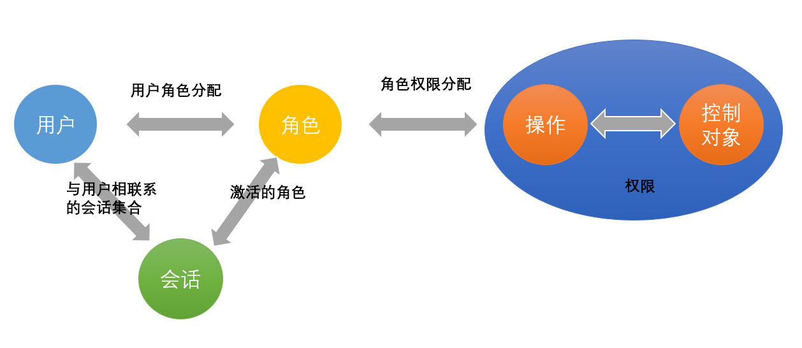

在RBAC之中,包含用户users(USERS)、角色roles(ROLES)、目标objects(OBS)、操作operations(OPS)、许可权permissions(PRMS)五个基本数据元素，此模型指明用户、角色、访问权限和会话之间的关系。

> 会话可以理解为某次使用某种角色的用户访问站点或者是同一个用户从一种角色切换到另外一种角色。

每个角色至少具备一个权限，每个用户至少扮演一个角色；可以对两个完全不同的角色分配完全相同的访问权限；会话由用户控制，一个用户可以创建会话并激活多个用户角色，从而获取相应的访问权限，用户可以在会话中更改激活角色，并且用户可以主动结束一个会话。

在该模型中，用户和角色之间可以是多对多的关系，即一个用户在不同场景下是可以有不同的角色，例如：项目经理也可能是组长也可能是架构师。同时每个角色都至少有一个权限。这种模型下，用户和权限被分离独立开来，使得权限的授权认证更加灵活。

## RBAC1

基于RBAC0模型，引入了角色间的继承关系，即角色上有了上下级的区别。

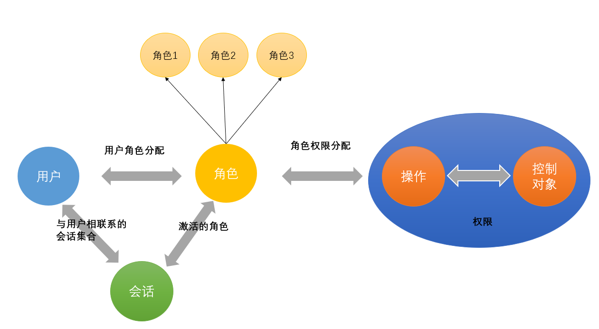

角色间的继承关系可分为一般继承关系和受限继承关系。一般继承关系仅要求角色继承关系是一个绝对偏序关系，允许角色间的多继承。而受限继承关系则进一步要求角色继承关系是一个树结构，实现角色间的单继承。

> 若角色R1继承了角色R2，则称R1是R2的父角色，R2是R1的子角色，记为R1≥R2(偏序关系)。

（受限继承关系）举个实例就是：在OA系统内，集团旗下拥有多个部门，而总经理则拥有最全权限，部门经理则是从总经理这继承部分权限，而部门员工则从经理这继承部分权限。形成一个比较有序的树结构，实现了单继承关系。

（一般继承关系）举个实例就是：同样是OA系统，是现有各个操作员工角色的，后慢慢产生部门经理，则部门经理从多个部门员工里继承权限。这其中差异较大就是此时部门经理是子角色，同时其拥有多个父角色，并从父角色里继承权限，若后面又产生了部门副经理，是同样从多个部门员工里继承，形成多对多的关系，即为多继承关系。

这种模型适合于角色之间层次分明，可以给角色分组分层。

## RBAC2

RBAC2，基于RBAC0模型的基础上，进行了角色的访问控制。

RBAC2模型中添加了责任分离关系。RBAC2的约束规定了权限被赋予角色时，或角色被赋予用户时，以及当用户在某一时刻激活一个角色时所应遵循的强制性规则。责任分离包括静态责任分离和动态责任分离。约束与用户-角色-权限关系一起决定了RBAC2模型中用户的访问许可，此约束有多种。

- 互斥角色 ：同一用户只能分配到一组互斥角色集合中至多一个角色，支持责任分离的原则。互斥角色是指各自权限互相制约的两个角色。对于这类角色一个用户在某一次活动中只能被分配其中的一个角色，不能同时获得两个角色的使用权。常举的例子：在审计活动中，一个角色不能同时被指派给会计角色和审计员角色。
- 基数约束 ：一个角色被分配的用户数量受限；一个用户可拥有的角色数目受限；同样一个角色对应的访问权限数目也应受限，以控制高级权限在系统中的分配。例如公司的领导人有限的；
- 先决条件角色 ：可以分配角色给用户仅当该用户已经是另一角色的成员；对应的可以分配访问权限给角色，仅当该角色已经拥有另一种访问权限。指要想获得较高的权限，要首先拥有低一级的权限。就像我们生活中，国家主席是从副主席中选举的一样。
- 运行时互斥 ：例如，允许一个用户具有两个角色的成员资格，但在运行中不可同时激活这两个角色。

## RBAC3

RBAC3可以被称为最复杂，最全面的权限管理。基于RBAC0的，同时将RBAC1与RBAC2结合起来。

## 优缺点

优点：

- 简化了用户和权限的关系
- 易扩展、易维护

缺点：

- RBAC模型没有提供操作顺序的控制机制，这一缺陷使得RBAC模型很难适应哪些对操作次序有严格要求的系统

## 使用场景

实际的使用场景中看，RBAC0是应用的最广，最多的。RBAC1~3应用程度几乎为0，并不是因为没场景，其中最重要的一个原因是投入产出比不符，除了复杂的OA系统环境等外，几乎很少系统需要系统性的设计到RBAC1/RBAC2。

此外，两项基本原则在权限设计过程中也是被广泛应用：职责分离与最小特权。

职责分离：不同于约束，只是强调不同角色完成不同业务的分工，通过不同角色的分配实现对业务与数据的安全性管理；

最小特权：系统分配给角色的权限需要受限，权限满足完成任务的基本需要即可；

## 数据库建模

我们比较常见的就是基于角色的访问控制，用户通过角色与权限进行关联。简单地说，一个用户拥有多个角色，一个角色拥有多个权限。这样，就构造成“用户-角色-权限”的授权模型。在这种模型中，用户与角色之间、角色与权限之间，通常都是多对多的关系。如下图：

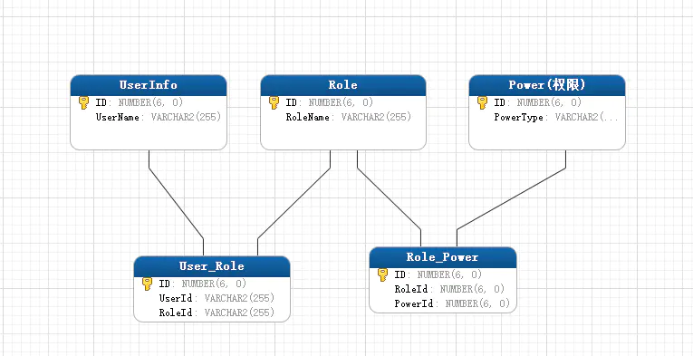

基于这个，得先了解角色到底是什么？我们可以理解它为一定数量的权限的集合，是一个权限的载体。例如：一个论坛的“管理员”、“版主”，它们都是角色。但是所能做的事情是不完全一样的，版主只能管理版内的贴子，用户等，而这些都是属于权限，如果想要给某个用户授予这些权限，不用直接将权限授予用户，只需将“版主”这个角色赋予该用户即可。

但是通过上面我们也发现问题了，如果用户的数量非常大的时候，就需要给系统的每一个用户逐一授权(分配角色)，这是件非常繁琐的事情，这时就可以增加一个用户组，每个用户组内有多个用户，除了给单个用户授权外，还可以给用户组授权，这样一来，通过一次授权，就可以同时给多个用户授予相同的权限，而这时用户的所有权限就是用户个人拥有的权限与该用户所在组所拥有的权限之和。用户组、用户与角色三者的关联关系如下图：

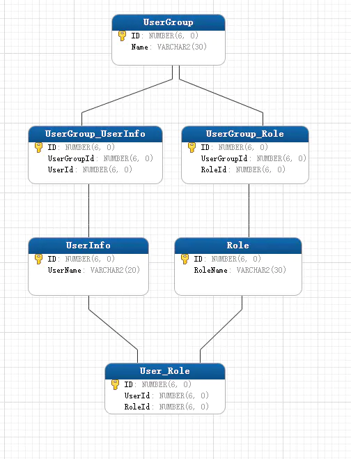

通常在应用系统里面的权限我们把它表现为菜单的访问(页面级)、功能模块的操作(功能级)、文件上传的删改，甚至页面上某个按钮、图片是否可见等等都属于权限的范畴。有些权限设计，会把功能操作作为一类，而把文件、菜单、页面元素等作为另一类，这样构成“用户-角色-权限-资源”的授权模型。而在做数据表建模时，可把功能操作和资源统一管理，也就是都直接与权限表进行关联，这样可能更具便捷性和易扩展性。如下图：

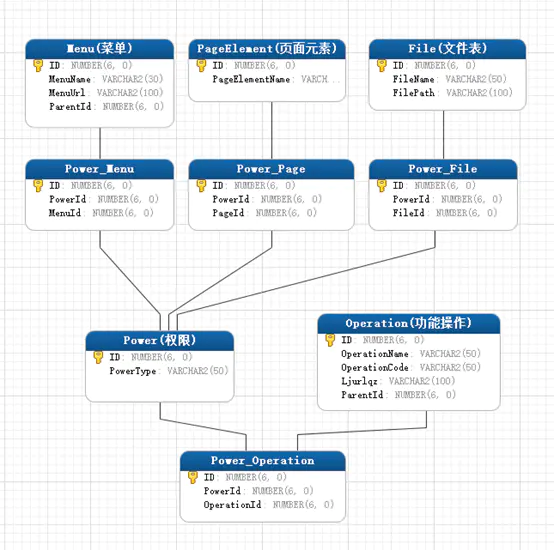

这里特别需要注意以下权限表中有一列“PowerType(权限类型)”，我们根据它的取值来区分是哪一类权限，可以把它理解为一个枚举，如“MENU”表示菜单的访问权限、“OPERATION”表示功能模块的操作权限、“FILE”表示文件的修改权限、“ELEMENT”表示页面元素的可见性控制等。

这样设计的好处有两个。一、不需要区分哪些是权限操作，哪些是资源，（实际上，有时候也不好区分，如菜单，把它理解为资源呢还是功能模块权限呢？）；二、方便扩展，当系统要对新的东西进行权限控制时，我只需要建立一个新的关联表“权限XX关联表”，并确定这类权限的权限类型字符串即可。

需要注意的是，权限表与权限菜单关联表、权限菜单关联表与菜单表都是一对一的关系。（文件、页面权限点、功能操作等同理）。也就是每添加一个菜单，就得同时往这三个表中各插入一条记录。这样，可以不需要权限菜单关联表，让权限表与菜单表直接关联，此时，须在权限表中新增一列用来保存菜单的ID，权限表通过“权限类型”和这个ID来区分是种类型下的哪条记录。最后扩展出来的模型完整设计如下图：

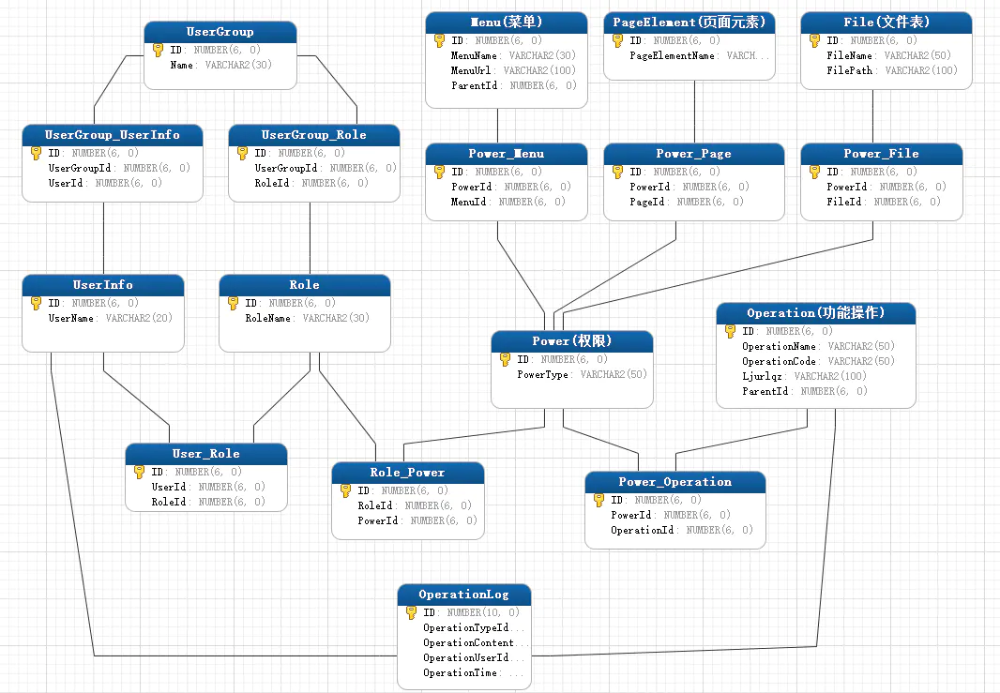

注意上面额外增加了一个操作日志表；

随着系统的日益庞大，为了方便管理，如果有需要可引入角色组对角色进行分类管理，跟用户组不同，角色组不参与授权。例如：当遇到有多个子公司，每个子公司下有多个部门，这是我们就可以把部门理解为角色，子公司理解为角色组，角色组不参于权限分配。另外，为方便上面各主表自身的管理与查找，可采用树型结构，如菜单树、功能树等，当然这些可不需要参于权限分配。

除了用户管理，角色权限管理，还有组织管理，我们可以把组织与角色进行关联,用户加入组织后,就会自动获得该组织的全部角色,无须管理员手动授予,大大减少工作量,同时用户在调岗时,只需调整组织,角色即可批量调整。组织的另外一个作用是控制数据权限,把角色关联到组织,那么该角色只能看到该组织下的数据权限。

在组织中，不用的岗位拥有不同的权限，比如财务部有总监,会计,出纳等职位,虽然都在同一部门,但是每个职位的权限是不同的,职位高的拥有更多的权限。总监拥有所有权限,会计和出纳拥有部分权限。特殊情况下,一个人可能身兼多职。

所以组织和岗位还需要和用户角色关联，如下：

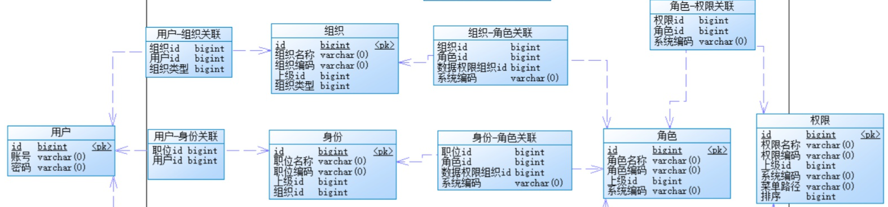

这时用户的所有权限就是用户个人拥有的权限、该用户所在组所拥有的权限、岗位所拥有的权限以及组织所拥有的权限之和。
