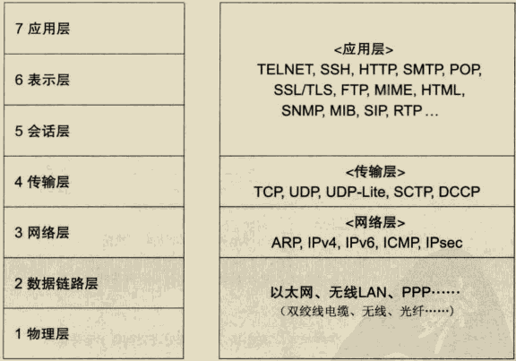

# 名词解释

网络按区域划分为 WAN（广域网）、LAN（局域网）。

网络传输速率单位为bps,每秒bit数，2Mbps带宽理论速率为 2/8 = 0.25MB/s

## OSI模型

主机：

路由器：只包含网络层、数据链路层、物理层。

传输层：负责管理两个节点的数据传输，确保数据被可靠的传输，比如：确认连接、断开连接重发。

网络层：负责寻址和路由选择。

数据链路层：负责物理层面的通信传输，负责数据帧的生成与接收，网络层负责将整个数据发送给最终目标地址，链路层只负责发送一个分段内的数据。

每一层在处理上一层传送过来的数据时附上当前分层的协议所必须的首部信息，然后接收端对收的数据进行首部与内容分离，再转发给上一分层，并最终将发送端的数据恢复为原状。

## 传输方式

### 面向有连接型&面向无连接型

面向有连接型：发送数据之前，需要在收发主机之间连接一个通信线路，必须在传输前后专门有建立和断开连接的处理，如果与对端之间无法通信，就可以避免发送无谓的数据。

面向无连接型：不要求建立和断开连接，发送端可于任何时候自由发送数据，接收端也不知道何时从哪里接收数据，因此面向无连接情况，接收端时常需要确认是否收到数据。

### 电路交换&分组交换

电路交换：通过交换机负责数据中转，一台计算机收发信息时独占一台电路，其他计算机需要等待该台计算机处理结束才有机会使用，如过去的电话网，现在已经淘汰。

分组交换：连接到通信电路的计算机将所要发送的数据分成多个数据包，按照一定的顺序排列之后分别发送，由于在分组的过程中，已经在每个分组的首部写入了发送端和接收端地址，可以实现同一线路同时为多个用户提供服务。

### 单播&广播

单薄：1对1通信。

广播：消息从1台主机发送给与之相连得所有其他主机。

## 地址

每一层协议所使用地址不尽相同，例如 TCP/IP使用 MAC地址、IP地址、端口号等信息作为地址标识，应用层中邮件使用邮件地址。

地址具有唯一性。

地址具有层次性，例如 IP 地址通过不同的网络号和主机号进行分层，MAC地址通过制造商识别号、制造商内部产品编号、产品通用编号进行分层，但是在寻址中没有起到任何作用。

## 网络设备

网卡：

中继器：

网桥/2层交换机：

路由器/3层交换机：

4-7层交换机：

网关：