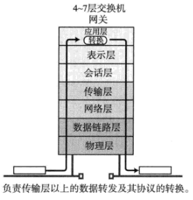
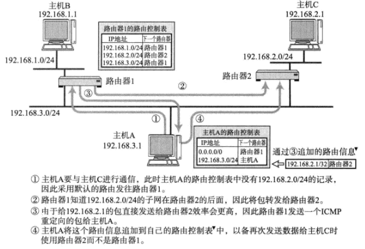
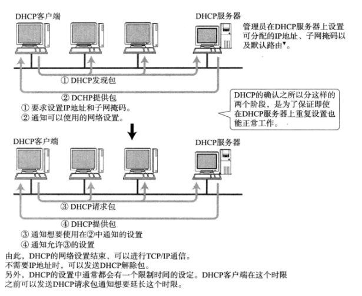
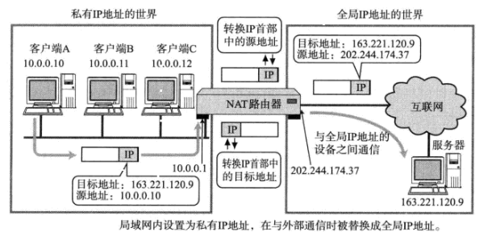
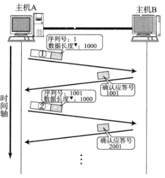
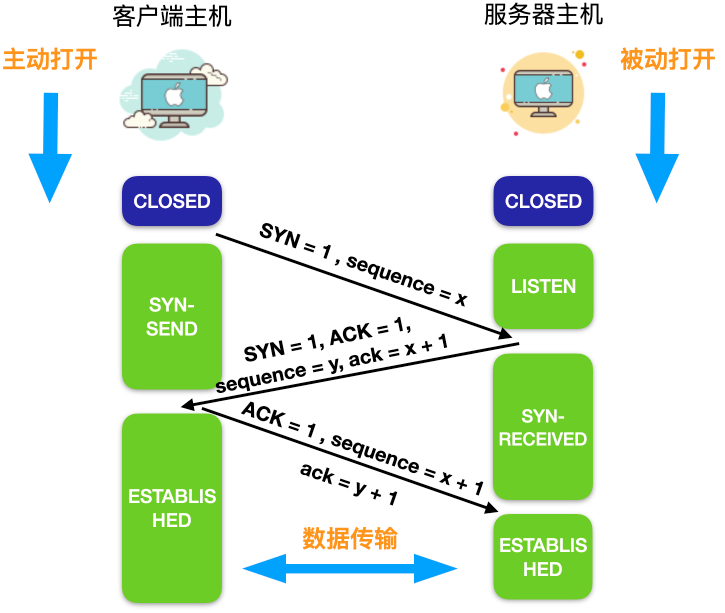
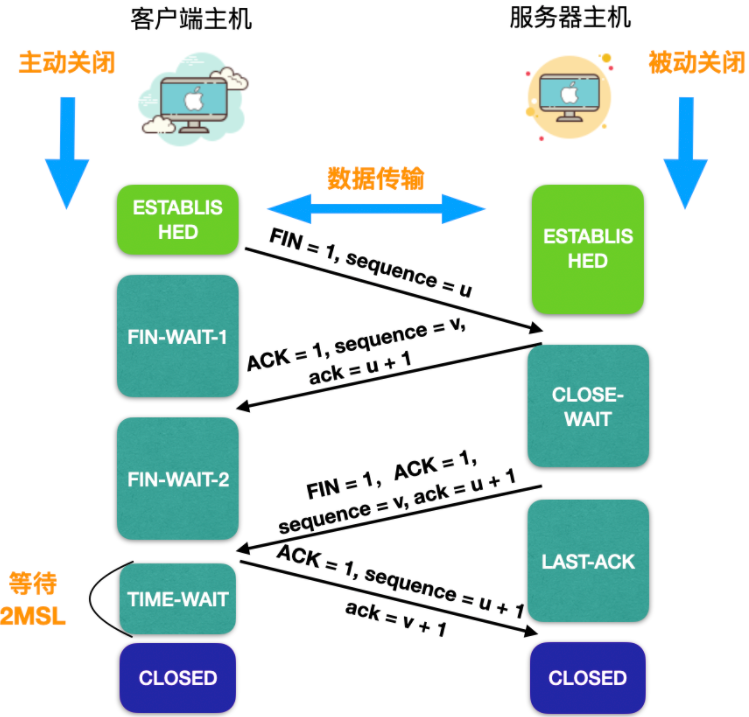

# 名词解释

网络按区域划分为 WAN（广域网）、LAN（局域网）。

网络传输速率单位为bps,每秒bit数，2Mbps带宽理论速率为 2/8 = 0.25MB/s

## OSI模型

主机：

路由器：只包含网络层、数据链路层、物理层。

传输层：负责管理两个节点的数据传输，确保数据被可靠的传输，比如：确认连接、断开连接重发。

网络层：负责寻址和路由选择。

数据链路层：负责物理层面的通信传输，负责数据帧的生成与接收，网络层负责将整个数据发送给最终目标地址，链路层只负责发送一个分段内的数据。

每一层在处理上一层传送过来的数据时附上当前分层的协议所必须的首部信息，然后接收端对收的数据进行首部与内容分离，再转发给上一分层，并最终将发送端的数据恢复为原状。

## 传输方式

### 面向有连接型&面向无连接型

面向有连接型：发送数据之前，需要在收发主机之间连接一个通信线路，必须在传输前后专门有建立和断开连接的处理，如果与对端之间无法通信，就可以避免发送无谓的数据。

面向无连接型：不要求建立和断开连接，发送端可于任何时候自由发送数据，接收端也不知道何时从哪里接收数据，因此面向无连接情况，接收端时常需要确认是否收到数据。

### 电路交换&分组交换

电路交换：通过交换机负责数据中转，一台计算机收发信息时独占一台电路，其他计算机需要等待该台计算机处理结束才有机会使用，如过去的电话网，现在已经淘汰。

分组交换：连接到通信电路的计算机将所要发送的数据分成多个数据包，按照一定的顺序排列之后分别发送，由于在分组的过程中，已经在每个分组的首部写入了发送端和接收端地址，可以实现同一线路同时为多个用户提供服务。

### 单播&广播

单薄：1对1通信。

广播：消息从1台主机发送给与之相连得所有其他主机。

## 地址

每一层协议所使用地址不尽相同，例如 TCP/IP使用 MAC地址、IP地址、端口号等信息作为地址标识，应用层中邮件使用邮件地址。

地址具有唯一性。

地址具有层次性，例如 IP 地址通过不同的网络号和主机号进行分层，MAC地址通过制造商识别号、制造商内部产品编号、产品通用编号进行分层，但是在寻址中没有起到任何作用。

## 网络设备

* 网卡：拥有MAC地址，属于OSI模型的第1层和2层之间，是半自治单元，当网卡收到有差错的帧时，就将这个帧丢弃。当网卡收到正确的帧时，就使用中断来通知操作系统并交付给网络层。当计算机要发送一个IP数据包时，数据包就由协议栈向下交给网卡组装成帧后发送到局域网。

* 中继器：物理层上延长网络的设备，将电信号或者光信号放大再传给另一个电缆，一般情况下两端是相同媒介，有些也可以完成电信号转换为光信号，都是只负责bit流的传输，不负责判断数据是否错误，

  

* 网桥/2层交换机：链路层上连接两个网络的设备，能够识别链路层中的数据帧，并将数据帧临时储存于内存，重新生成全新的帧发给相连的另一个网段。会识别数据帧中的FCS位，判断损坏的数据，将损坏的数据丢弃。

  

* 路由器/3层交换机：网络层上连接两个网络，对分组报文进行转发，根据IP地址进行处理，网桥是根据MAC地址进行处理，可以连接不同数据链路，例如以太网，还有分担网络负荷的作用。

  

* 4-7层交换机：负责处理传输层到应用层的数据，分析收发数据并对其进行特定的处理，例如可以作为负载均衡器，发给不同的服务器，还可以带宽控制，防火墙等。

  

* 网关：也是负责处理传输层到应用层的数据，负责协议的转换和数据的转发，例如 手机端协议和PC端协议不同，但展示给用户的内容却是相同，中间就经过网关的转换。

## 通信示例

发送数据包：

1. 应用程序请求建立TCP连接，将数据发送给TCP层。
2. TCP负责建立连接、发送数据以及断开连接，会在应用层数据的前端附加TCP首部，TCP首部包含源端口号、目标端口号、序号、校验和等等，然后将附加了TCP首部的包发送给IP。
3. IP会将附加了TCP首部的包当作数据处理，并在前附加IP首部，IP首部发送端IP、接收端IP等，然后参考路由表，将IP包发送给对应的网卡驱动程序。
4. 以太网驱动接收到IP包后，会再附上以太网首部，以太网头部包含接收端MAC、发送端MAC等。
5. 除此之外物理层还会在数据末尾添加 FCS，用于判断数据包是否被破坏，这由硬件实现。

接收数据包：

1. 以太网驱动接收到以太网包后，首先从首部找出MAC地址，判断是否发给自己的包，如果不是则丢弃，如果是发给自己的包，则根据以太网类型，传给对应的网络层处理，例如 IP、ARP、ICMP 等。
2. 当IP模块收到IP包后，也会通过IP地址匹配，找到发给自己的包，传给对应的传输层梳理，例如 TCP、UDP等，同时对应有路由器的情况，如果接收端不是自己，还会借助路由表转发数据。
3. TCP模块会根据校验和判断数据是否被破坏，检查是否按照顺序号接收数据，然后检查端口号确定具体的应用程序，数据接收完毕后，接收端会发送确认给发送端，如果确认未能到达发送端，发送端会任务接收端没有接收到数据而一直发送，数据被完整接收后，会传给端口号标识的应用程序。
4. 应用程序处理数据。

# 数据链路层

* 协议定义了通过不同通信媒介互连的设备之间的规范。各设备的数据传输离不开数据链路层和物理层。
* 计算机以二进制0、1来表示信息，通信媒介通过电压的高低、光的闪灭、电波的强弱来表示信息，进行数据转换是物理层负责的。
* 数据链路层处理数据不是单纯的0、1，而是把它们集合为叫做"帧"的块，再进行传输。

数据链路层有：以太网、PPP、ATM等，负责两个直连设备的通信。

## 共享介质访问网络

目前大多数已不再使用。

多个设备共享一个通信介质的网络，设备间使用同一个信道进行发送和接收，是半双工的，需要对介质进行访问控制，有两种方式：争用方式、令牌传递方式。

1. 争用方式：通过争夺获取数据传输的权利，如果多个节点同时发送帧，就会出现冲突，所以出现改进方式CSMA，每个节点提前检查冲突：

  * 如果信道上没有数据流动，则任何节点都可以发送数据。
  * 如果发生冲突则放弃发送数据，并立即释放信道。
  * 放弃发送，随机延迟一段时间，重新争用介质。

2. 令牌传递方式：
  * 沿着令牌环发送一种叫令牌的特殊报文，只有获得令牌的节点才能发送数据。
  * 有两个优势：不会有冲突，每个节点都有平等获得令牌机会。

## 非共享介质网络

发送端和接收端不共享介质，网络中每个节点直连交换机，有交换机负责转发数据帧，是全双工的。

## MAC地址

用于识别数据链路中相连的节点，在全世界并不一定是唯一，只要不是同属于一个数据链路就不会出现问题。

MAC 地址长 48 bit。

bit 流在网络中流动时，使用网络字节序，属于大端字节序，但每个字节内替换了前后顺序。

### MAC转发

* 以太网交换机就是持有多个端口的网桥，可以根据数据链路层中每个帧的目标MAC地址，参考用以记录发送接口的转发表，决定从那个网络接口发送数据。
* 转发表不需要使用者手动配置，可以自动生成，链路层的每个节点在接到数据包时，会记录 源MAC地址 和 对应的接收端口 记录到转发表中，叫做自学过程。

自学过程：
* 源MAC学习法： 交换机从网络上收到报文后，利用数据包的源MAC地址 和 对应的接收端口 建立MAC表项。
* 端口移动机制：交换机收到报文后，如果发现报文接收端口与MAC表中对应的端口不一致时，进行端口移动，将Mac地址重新学习到新的端口上。
* 地址老化机制：如果长时间没有收到某Mac表项对应的报文，则删除此表项。等下次报文来时重新进行学习。

转发过程：
* 交换机收到报文后，根据报文中的目的Mac查询Mac表。如果找到，则从相应的端口发出；如果没有找到，则向除入端口以外的所有端口发送（即泛洪）。
* 如果交换机收到的报文目的Mac和源Mac所在端口相同，则丢弃此报文。
* 交换机收到的目的Mac为广播报文时，则向除入端口以外的所有端口转发广播报文。

广播和泛洪是两个不同的概念，虽然有时两个都向所有的端口发送报文。

## 以太网协议

以太网帧的前端，在以太网头部以前还有8个字节，叫做前导码，表示以太网的开始，它由1、0交替组合而成，在前导码的末尾还有SFD，占两个bit，值为 11。

以太网首部共14个字节，分别是6字节目标MAC地址、6字节源MAC地址以及2字节的上层协议类型，0800 表示 Ipv4，0806 表示 ARP ，8864 表示 PPPoE等。

一个数据帧最大数据范围为 46-1500 字节。

### PPP(Point-to-Point Protocol)协议

PPP无法实现通信，还需要物理层执行，可以使用电话线、专线等，例如 PPPoE 拨号是在以太网数据中加入PPP帧进行传输的一种方式。

PPP功能包含两个协议：不依赖上层的LCP协议，依赖上层的NCP，如果上层是IP叫做IPCP
* LCP 负责建立和断开连接、设置最大接收单元、设置验证协议(PAP或CHAP)
* IPCP 负责IP地址设置以及是否进行TCP/IP首部压缩。

通过PPP连接时，通常需要进行用户名密码验证，PAP是明文传输，CHAP是使用一次性密码。

首尾使用 `01111110`作为开始结束标志，数据内容不允许出现6个连续1，当出现5个1时，需要插入一个0，接收方收到时需要将这个0删除。这部分功能由软件实现，由CPU处理，这种方式会给计算机带来负荷。

#### PPPoE

以太网协议没有验证功能，也没有建立和断开连接的处理，因此不能按时计费，所以在以太网上里PPPoE提供PPP功能。

# 网络层协议IP

* 数据链路层提供直连两个设备的通信功能，网络层可以跨越不同的数据链路，负责在没有直连的两个网络之间进行通信传输。
* IP有3个功能：寻址、路由、分包与组包。
* IP是面向无连接的，不需要建立与目标地址之间的连接，如果上层发送给IP层数据，该数据会立即被压缩成IP包发送，即使目的主机关机或不存在，数据包还是会被发送。
* IP提供尽力服务，但不做数据验证，可能会发生丢包、错位、数据量翻倍等问题，可靠服务由TCP层负责。

面向无连接的好处：
* 简化：管理连接是比较繁琐的事情。
* 提速：每次通信前事先建立连接，会减低处理速度。

## IP 地址

IPv4 地址由 32 位组成，每一块网卡需要设置一个IP地址。

IP地址由网络地址和主机地址组成，不同的网段网络标识不重复，相同的网段主机地址不重复，网络地址的位数由子网掩码来区分。

* A类地址：前8位是网络地址，也就是 0.0.0.0 -127.0.0.0，一个网段可容纳 16,777,214 个主机地址
* B类地址：前16位是网络地址，同时前两位为 10，也就是 128.0.0.1 - 191.255.0.0,一个网段可容纳65,534个主机地址。
* C类地址：前24位是网络地址，同时前三位为 110 ，也就是 192.168.0.0 - 239.255.255.0 ,一个网段可容纳254个主机地址。
* D类地址：32位都是网络地址，没有主机地址，同时四位为 1110 ，也就是 224.0.0.0 - 239.255.255.255,常用于多播。

### 子网掩码

子网掩码也是 32 位，用来标识网络地址部分全部为1，主机地址部分全部为 0。

### 广播

主机地址全为 1 的地址是广播地址，用于在同一链路中相互连接的主机之间发送数据包。

* 本地广播：在本网络内的广播，例如网络地址为 192.168.0.0/24 的广播地址为 192.168.0.255，这个广播地址的IP包会被路由器屏蔽，所以不会到达  192.168.0.0/24 以外的其他链路。
* 直接广播：在不同网络之间的广播，网络地址为 192.168.0.0/24 的主机向 192.168.1.255/24 的目标地址发送IP包，路由器收到这个包后会转发给 192.168.1.0/24，这样使所有 192.168.1.1 - 192.168.1.254 的主机都能收到这个包。

### 多播

将包发送给特定组内的所有主机。

多播使用D类地址，前四位为 1110 ，剩下 28 位为多播组号。

### IPv4 首部

* 版本： 4bit，值为 4 。
* 首部长度：4bit，值为 5，单位 4 字节，所以首部长度为 4x5 = 20 字节。
* 区分服务：8bit，用来区别服务质量，例如 3 最低延迟 4 最大吞吐 等。
* 总长度：16bit，所以IP包最大长度为 2^16 = 65535 。
* 标识：16bit，用于分片重组，同一分片的标识相同，不同分片标识不同，每发送一个IP包，值逐渐递增，如果目标地址、源地址或协议不同，也被分为不同的分片。
* 分片标志：3bit，bit0 = 0，bit1 = 0（可以分片）或 1（不能分配），bit2 = 0（最后一个分片的包）或 1 （分片中段的包） 。
* 片偏移：13bit，标识被分片的每个分段相对于原始数据的位置，第一个分片值为 0。
* 生存时间：8bit，记录当前包在网络上应该生存的期限，每经过一个路由器，该值会减1，直到变成0则丢弃该包。
* 协议：8bit，下个首部属于哪个协议， 1 为 ICMP，6 为 TCP， 17 为 UDP。
* 首部校验和：16bit，检验首部，不校验数据部分。
* 源地址：32bit
* 目标地址：32bit

### DNS

DNS 可以将主机名自动转换为具体的IP地址，DNS 系统内部维护主机名和IP地址直接的对应关系。

域名是为了识别主机名称和组织机构名称的具有分层的名称。

域名服务器是指管理域名的主机和相应的软件，可以管理所在分层（ZONE）的域的相关信息，根部所设置的DNS叫做根域名服务器。

DNS查询：
1. 向域名服务器请求查询，接收到这个请求的域名服务器会先在自己的数据库查找，如果有该域名对应的IP就返回。
2. 若没有，则向根域名服务器进行查询。
3. 然后从根开始遍历整棵树，直到找到对应的域名服务器，并由域名服务器返回想要的数据。
4. 域名服务器将最新信息缓存起来，节省每次查询的性能消耗。

### ARP

负责使用目标IP地址确定下一个接收数据的网络设备的MAC地址，如果目标主机不在同一链路时，可以通过ARP查找下一跳路由器的MAC地址。

当通过DNS确定IP后，就可以向目标地址发送数据，但是对于数据链路层，还需要知道每个IP地址的MAC地址。

流程：
1. 主机A广播一个ARP请求包，请求包中包含自己的IP地址和MAC地址、目的IP地址。
2. ARP的请求包会被同一链路的所有主机和路由器接收，如果ARP请求包中的目的IP地址与自己IP地址一致，则将自己的MAC地址填入ARP响应包，并且获取发送端主机的IP地址及MAC地址，按照这个MAC地址发送响应包给发送端。
2. 发送主机接收到ARP响应包后，会将MAC地址和目的IP地址缓存起来一段时间。

### ICMP

负责确认IP包是否成功送达目的地址，通知发送过程中IP包被丢弃的原因，改善网络设置等。

ICMP 存在不同类型，例如：0表示回送应答，8表示回送请求，5 表示重定向或改变路由，9 表示路由器公告，11 表示超时消息 等。

#### 重定向消息(类型5)

如果路由器发现发送端主机使用次优的路径发送数据，那么它会返回ICMP重定向给主机，消息中包含了最合适的路由信息和源数据。

#### 超时消息(类型11)

IP包中的TTL值每经过一次路由器就会减1，当减到0时，IP包会被丢弃，IP路由器将会发送一个ICMP超时消息给发送端主机。

TTL可以防止IP包无休止地在网络上被转发。

traceroute 原理：利用IP包的TTL从1开始按照顺序递增的发送UDP包，这样所有路由器的IP地址逐一呈现。

#### 回送消息(类型0、8)

用于进行通信的主机和路由器之间，判断所发送的数据包是否已经成功到达对端的消息，使用类型8进行向对端发送回送请求，接收对端发回来的回送应答，类型0，ping就是利用这个消息实现。

### DHCP

为了检查所要分配的IP地址以及已经分配的IP地址是否可用，DHCP服务端和客户端会做响应的坚持：

* 服务端：在分配IP地址前发送ICMP回送请求包，确认没有返回应答。
* 客户端：针对DHCP返回的IP地址发送ARP请求包，确认没有应答。

### NAT

用于在本地网络中使用私有地址，在连接互联网时转而使用全局IP地址的技术。

除此之外还有转换端口的NAPT。

NAT服务器中维护私有地址到全局地址的转换表。

简单举个例子：

* 我们在局域网中使用 10.0.0.10 ，当我们访问其他网络，如 163.221.120.9 。
* 经过NAT路由器时会将 IP 首部中的目标地址进行转换，转换为一个全局IP（公网IP就是互联网上的全局IP）202.244.174.37。
* 再往163.221.120.9 发送数据，163.221.120.9 识别到的发送端ip为202.244.174.37 。
* 局域网中的所有ip访问外网时都被识别为该IP，202.244.174.37
* 当包从地址 163.221.120.9 发回来时，目标地址 202.244.174.37 会被转换成 10.0.0.10 再转发。

## 路由

* 负责将分组数据发送到最终目标地址。

* 跳（Hop）表示数据传输从一个主机或路由器到下个路由器或主机的一个区间。
* IP路由是多跳路由，路由器或主机在转发IP数据包时只指定下一个路由器或主机，而不是将到达最终目标地址的所有通路都指定处理。
* 每一跳在转发IP数据时会分别指定下一跳，直到到达最终地址。

路由控制表：所有主机上都维护者路由控制表，记录着IP数据在下一步应该发给哪个路由器，IP地址的网络地址部分用于路由控制。

在发送IP包时，首先确定IP包首部中的目标地址，再从路由表中找到与该地址具有相同网络地址的记录，根据该记录将IP包发给相应的下一个路由器，如果路由表中个存在多条相同网络地址的记录，则选择相同位数最多的一个地址。

默认路由：能与任何一个地址匹配的路由，一般标记为 0.0.0.0/0 或 default 。
主机路由：IP地址/32 ，标识整个IP地址都将参与路由，多用于不希望通过网络地址路由的情况。
环回地址：同一台计算机上的程序进行通信时所使用的默认地址，计算机使用127.0.0.1作为环回地址，localhost 主机名有相同的作用，使用这个IP或主机名时，数据包不会流向网络。

## 分包与组包

将较大的IP包分成较小的IP包，较小IP包的大小取决于数据链路层MTU的大小，分片的包到到目的地址后会被再组合起来传给上一层。

IP的最大MTU为 65535 字节，以太网 MTU 为 1500 。

IP 首部的 片偏移 字段表示分片之后每个分片在用户数据中的相对位置和该分片之后是否还有其它分片，根据这个字段可以判断IP数据报是否分片。

为了减轻路由压力，使用路径MTU发现，会在发送端按照路径MTU分片好，避免路由过程中进行分片。

### 路径MTU发现

路径MTU是发送端到接受端所有数据链路中最小的MTU。

UDP：

1. 发送时将IP首部的分片标志位设置为不分片，途中路由器即使遇到需要分片的时候也不分片，而是将包丢弃。
2. 随后通过一个ICMP的不可达消息将数据链路上MTU的值发送给发送端主机，该MTU最少可以缓存10分钟。
3. 下一次发送同一目标主机的IP数据报使用ICMP通知的MTU分片处理，如此反复直到达目标主机为止没有再收到任何ICMP。
4. 所有分片到达目标主机后会被IP层重组，再传给UDP。

UDP 没有重发处理，未发送到的消息会丢失。

TCP：
1. TCP也和UDP一样先不分片发送，收到MTU后，会进行重发处理。
2. TCP负责将数据进行分片，IP层不再做分片处理。
3. 同时IP层也不会进行重组，直接发送给接收端的TCP层。

# 传输层协议TCP与UDP

* TCP 是面向连接的、可靠的流协议，采用TCP发送消息时，可以保证发送的顺序，但数据没有任何间隔的发送给接收端，拥有顺序控制、重发控制等机制，主要用于在传输层必须实现可靠传输的情况。
* UDP是不可靠协议，可以确保消息的大小，但不能保证消息一定会到达，没有重发机制，主要用于对高速传输和实时性有较高要求的通信或广播通信。
* 例如：如果使用TCP进行通话，数据在途中可能被重发并带来延迟，导致无法流畅的交流，如果采用UDP它不会进行重发，从而不会有大幅度延迟问题，即使有部分数据丢失，也只影响小部分的通话。

## 端口号

在数据链路层和IP层分别使用MAC地址和IP地址来表示地址，在传输层使用端口号来表示程序地址。

仅凭目标端口号识别某一个通信是不够的，TCPIP 中使用 5个信息识别一个通信：源IP地址、目标IP地址、协议号、源端口号、目标端口号，只要其中一项不同，则被认为是其他通信。

端口号的确定：

* 服务器使用静态方法确定端口号，需要对每个应用程序指定。
* 客户端使用时序分配法确定端口号，全权交给操作系统分配，操作系统可以为每个应用程序分配互不冲突的端口号，动态分配的端口在 49152 - 65535 之间。

不同的协议可以使用个相同的端口号，因为数据到达IP层后，会根据IP首部中的协议号传给相应协议的模块，如果是TCP则传给TCP模块，如果是UDP则传给UDP模块处理，即使使用同一个端口号，由于传输协议是 各自独立处理的，因此互相之间不会受到影响，例如 53 端口在TCP、UDP都用于DNS服务。

## UDP

UDP 不提供复杂的控制机制，利用的是 IP 面向无连接的通信服务。无法进行流量控制避免拥塞，丢包也不负责重发，包乱序到达也不会纠错。

应用场景：

* 包总量较少的通信（DNS等）。
* 多媒体即时通信。
* 广播通信。

## TCP

在 TCP 中，接收端收到数据后，会返回一个已收到消息的通知，叫做确认应答(ACK)。

序列号：按照顺序给发送数据的每个字节编号，序列号就是本次发送的第一个字节的编号。
确认应答号：接收端需要接收的下一个序列号。

如果在一定时间内没有收到 ACK ，发送端会认为数据已经丢失并进行重发。

如果进行重发时，ACK正在途中，这时接收端会收到两条相同的数据，如果序列号匹配不上确认应答号就会将该数据丢弃。

超时重发时间最初的数据包一般设置为6秒，如果重发之后还是收不到确认应答，则再次进行发送，等待确认应答的时间会以2、4倍指数延长，数据也不会被无限、反复地重发，达到一定重发次数后，如果仍没有收到任何确认应答，会判断接收端出现异常，强制关闭连接。

### 连接管理

三次握手建立连接：通过发送 SYN 包来进行。

1. 服务端进程处于 LISTEN 状态，等待客户端连接请求。
2. 客户端向服务器发出SYN包请求建立连接，首部同步位 SYN = 1，同时选择一个初始序列号 x ，SYN 包不允许携带数据，只消耗一个序号，客户端进入 SYN-SEND 状态。
3. 服务器收到客户端连接后，回复确认应答，将首部 SYN 和 ACK 位都置为 1，确认应答号ack = x(客户端发送过来的sequence) + 1，同时也选择一个自己初始序列号 y ，该数据包也不能携带数据，同样消耗掉一个序号，服务器进入到 SYN-RECEIVED 状态。
4. 客户端在收到服务器发出的响应后，还需要给出确认连接。确认连接中 ACK 置为 1 ，序列号为x+1(服务器发送过来的ack)，确认应答号ack = y(服务端发送过来的sequence) + 1，客户端进入 ESTABLISHED 状态。
5. 服务器收到客户端的确认后，也进入 ESTABLISHED 状态。

三次握手的原因：分别确认客户端可以发送消息、服务端可以接受消息并且可以发送消息、客户端可以接收消息，可以避免已失效的SYN包建立连接，比如：Client 发出第一个 SYN 包，但是没有到达 Server，在网络中滞留到 连接已经断开，如果在连接断开后 到达 Server，Server会误以为是新的连接请求，如果是2次握手，这个时候会向Client确认应答并建立连接，但这个 SYN 包是一个过期的包，并不需要建立连接，三次握手就不会有该问题，对可靠连接有不同的意义。

4次挥手断开连接：通过发送 FIN 包来进行。

1. 客户端向服务端发出FIN包请求断开连接，首部 FIN = 1，不包含数据，序列号为 u ，客户端进入 FIN-WAIT-1 阶段。
2. 服务端接收到客户端FIN包后，发出确认应答，确认应答报文中 ACK = 1，生成自己的序列号 v，确认应答号 ack = u(客户端发送过来的sequence) + 1，服务器进入 CLOSE-WAIT 状态。
3. 客户端收到服务端的确认应答后，进入 FIN-WAIT-2 的状态，等待服务端发出连接释放的FIN包。
4. 服务端发出断开连接的FIN包，首部 ACK = 1，序列号 v ，ack = u(客户端发送过来的sequence) + 1，随后服务端进入了 LAST-ACK 阶段。
5. 客户端收到服务端的断开连接请求后，客户端做确认应答，ACK = 1, 序列号 seq = u + 1（客户端从连接开始断开后就没有再发送数据），ack = v（客户端发送过来的sequence） + 1，然后进入到 TIME-WAIT 状态，这个时候连接还没有释放，会等待 2MSL（报文最大生存时间，可能是 30秒，1分钟和2分钟等 ） ，再进入 关闭状态，为了防止本次请求丢包，可以再进行一次重发。
6. 服务端收到了客户端的断开连接确认后，就会进入 CLOSED 状态。

4次挥手的原因：客户端的挥手是确认客户端不会发送数据了，但服务端可能还需要发送数据，只有等服务端发送完数据之后进行服务端挥手后，两边都确认不会发送数据了，可以进行断开了。如果像建立连接一样进行三次消息通信，会出现客户端关闭连接，但服务端还在发送消息的情况。
