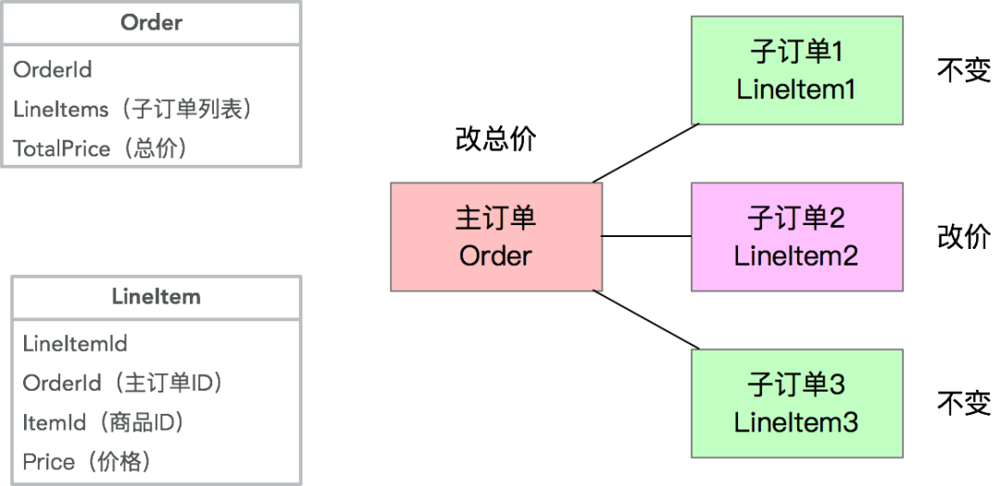

原文路径：

https://blog.csdn.net/Taobaojishu/article/details/106152641

讲Repository之前其实应该先讲Entity（实体）、Aggregate Root（聚合根）、Bounded Context（限界上下文）等概念。但在实际写的过程中，发现单纯讲Entity相关的东西会比较抽象，很难落地。所以本文被推倒重来，从Repository开始入手，先把可以落地的、能形成规范的东西先确定下来，最后再尝试落地Entity。这个当然也是我们可以在日常按照DDD重构时尝试的路径。

提前预告，接下来的一篇文章将覆盖Anti-Corruption Layer（防腐层）的逻辑，但是你会发现跟Repository模式的理念非常接近。等所有周边的东西都覆盖之后，再详细讲Entity也许会变得不那么抽象。

DDD 的宏观理念其实并不难懂，但是如同 REST 一样，DDD 也只是一个设计思想，缺少一套完整的规范，导致DDD新手落地困难。

我之前的架构篇主要从顶层设计往下看，从这一篇开始我希望能填补上一些 DDD 的代码落地规范，帮助同学在日常工作中落地 DDD 思想，并且希望能通过一整套规范，让不同的业务之间的同学能够更快的看懂、掌握对方的代码。但是规则是死的、人是活的，各位同学需要根据自己业务的实际情况去有选择的去落地规范，DDD 的规范不可能覆盖所有场景，但我希望能通过解释，让同学们了解 DDD 背后的一些思考和取舍。

**为什么要用 Repository**

### ▐ 实体模型 vs. 贫血模型

Entity（实体）这个词在计算机领域的最初应用可能是来自于Peter Chen在1976年的“The Entity-Relationship Model - Toward a Unified View of Data"（ER模型），用来描述实体之间的关系，而ER模型后来逐渐的演变成为一个数据模型，在关系型数据库中代表了数据的储存方式。

而2006年的JPA标准，通过@Entity等注解，以及Hibernate等ORM框架的实现，让很多Java开发对Entity的理解停留在了数据映射层面，忽略了Entity实体的本身行为，造成今天很多的模型仅包含了实体的数据和属性，而所有的业务逻辑都被分散在多个服务、Controller、Utils工具类中，这个就是Martin Fowler所说的的Anemic Domain Model（贫血领域模型）。

如何知道你的模型是贫血的呢？可以看一下你代码中是否有以下的几个特征：

1. **有大量的XxxDO对象：**这里DO虽然有时候代表了Domain Object，但实际上仅仅是数据库表结构的映射，里面没有包含（或包含了很少的）业务逻辑；
2. **服务和Controller里有大量的业务逻辑：**比如校验逻辑、计算逻辑、格式转化逻辑、对象关系逻辑、数据存储逻辑等；
3. 大量的Utils工具类等。

而贫血模型的缺陷是非常明显的：

1. **无法保护模型对象的完整性和一致性：**因为对象的所有属性都是公开的，只能由调用方来维护模型的一致性，而这个是没有保障的；之前曾经出现的案例就是调用方没有能维护模型数据的一致性，导致脏数据使用时出现bug，这一类的 bug还特别隐蔽，很难排查到。
2. **对象操作的可发现性极差：**单纯从对象的属性上很难看出来都有哪些业务逻辑，什么时候可以被调用，以及可以赋值的边界是什么；比如说，Long类型的值是否可以是0或者负数？
3. **代码逻辑重复：**比如校验逻辑、计算逻辑，都很容易出现在多个服务、多个代码块里，提升维护成本和bug出现的概率；一类常见的bug就是当贫血模型变更后，校验逻辑由于出现在多个地方，没有能跟着变，导致校验失败或失效。
4. **代码的健壮性差：**比如一个数据模型的变化可能导致从上到下的所有代码的变更。
5. **强依赖底层实现：**业务代码里强依赖了底层数据库、网络/中间件协议、第三方服务等，造成核心逻辑代码的僵化且维护成本高。

虽然贫血模型有很大的缺陷，但是在我们日常的代码中，我见过的99%的代码都是基于贫血模型，为什么呢？我总结了以下几点：

1. **数据库思维：**从有了数据库的那一天起，开发人员的思考方式就逐渐从“写业务逻辑“转变为了”写数据库逻辑”，也就是我们经常说的在写CRUD代码。
2. **贫血模型“简单”：**贫血模型的优势在于“简单”，仅仅是对数据库表的字段映射，所以可以从前到后用统一格式串通。这里简单打了引号，是因为它只是表面上的简单，实际上当未来有模型变更时，你会发现其实并不简单，每次变更都是非常复杂的事情
3. **脚本思维：**很多常见的代码都属于“脚本”或“胶水代码”，也就是流程式代码。脚本代码的好处就是比较容易理解，但长久来看缺乏健壮性，维护成本会越来越高。

但是可能最核心的原因在于，实际上我们在日常开发中，混淆了两个概念：

- **数据模型（Data Model）：**指业务数据该如何持久化，以及数据之间的关系，也就是传统的ER模型；
- **业务模型/领域模型（Domain Model）：**指业务逻辑中，相关联的数据该如何联动。

所以，解决这个问题的根本方案，就是要在代码里严格区分Data Model和Domain Model，具体的规范会在后文详细描述。在真实代码结构中，Data Model和 Domain Model实际上会分别在不同的层里，Data Model只存在于数据层，而Domain Model在领域层，而链接了这两层的关键对象，就是Repository。

### ▐ Repository的价值

在传统的数据库驱动开发中，我们会对数据库操作做一个封装，一般叫做Data Access Object（DAO）。DAO的核心价值是封装了拼接SQL、维护数据库连接、事务等琐碎的底层逻辑，让业务开发可以专注于写代码。但是在本质上，DAO的操作还是数据库操作，DAO的某个方法还是在直接操作数据库和数据模型，只是少写了部分代码。在Uncle Bob的《代码整洁之道》一书里，作者用了一个非常形象的描述：

- **硬件（Hardware）：**指创造了之后不可（或者很难）变更的东西。数据库对于开发来说，就属于”硬件“，数据库选型后基本上后面不会再变，比如：用了MySQL就很难再改为MongoDB，改造成本过高。
- **软件（Software）：**指创造了之后可以随时修改的东西。对于开发来说，业务代码应该追求做”软件“，因为业务流程、规则在不停的变化，我们的代码也应该能随时变化。
- **固件（Firmware）：**即那些强烈依赖了硬件的软件。我们常见的是路由器里的固件或安卓的固件等等。固件的特点是对硬件做了抽象，但仅能适配某款硬件，不能通用。所以今天不存在所谓的通用安卓固件，而是每个手机都需要有自己的固件。

从上面的描述我们能看出来，数据库在本质上属于”硬件“，DAO 在本质上属于”固件“，而我们自己的代码希望是属于”软件“。但是，固件有个非常不好的特性，那就是会传播，也就是说当一个软件强依赖了固件时，由于固件的限制，会导致软件也变得难以变更，最终让软件变得跟固件一样难以变更。

举个软件很容易被“固化”的例子：

```java
private OrderDAO orderDAO;

public Long addOrder(RequestDTO request) {  
    // 此处省略很多拼装逻辑  
    OrderDO orderDO = new OrderDO();  
    orderDAO.insertOrder(orderDO);  
    return orderDO.getId();
}

public void updateOrder(OrderDO orderDO, RequestDTO updateRequest) {  
    orderDO.setXXX(XXX); 
    // 省略很多  
    orderDAO.updateOrder(orderDO);
}

public void doSomeBusiness(Long id) {  
    OrderDO orderDO = orderDAO.getOrderById(id);  
    // 此处省略很多业务逻辑
}
```

在上面的这段简单代码里，该对象依赖了DAO，也就是依赖了DB。虽然乍一看感觉并没什么毛病，但是假设未来要加一个缓存逻辑，代码则需要改为如下：

```java
private OrderDAO orderDAO;
private Cache cache;

public Long addOrder(RequestDTO request) {  
    // 此处省略很多拼装逻辑  
    OrderDO orderDO = new OrderDO();  
    orderDAO.insertOrder(orderDO);  
    cache.put(orderDO.getId(), orderDO);  
    return orderDO.getId();
}

public void updateOrder(OrderDO orderDO, RequestDTO updateRequest) {  
    orderDO.setXXX(XXX);                                                
    // 省略很多  
    orderDAO.updateOrder(orderDO);  
    cache.put(orderDO.getId(), orderDO);
}

public void doSomeBusiness(Long id) {  
    OrderDO orderDO = cache.get(id);  
    if (orderDO == null) {  
        orderDO = orderDAO.getOrderById(id);    }
    // 此处省略很多业务逻辑
}

```

这时，你会发现因为插入的逻辑变化了，导致在所有的使用数据的地方，都需要从1行代码改为至少3行。而当你的代码量变得比较大，然后如果在某个地方你忘记了查缓存，或者在某个地方忘记了更新缓存，轻则需要查数据库，重则是缓存和数据库不一致，导致bug。当你的代码量变得越来越多，直接调用DAO、缓存的地方越来越多时，每次底层变更都会变得越来越难，越来越容易导致bug。这就是软件被“固化”的后果。

所以，我们需要一个模式，能够隔离我们的软件（业务逻辑）和固件/硬件（DAO、DB），让我们的软件变得更加健壮，而这个就是Repository的核心价值。

## 模型对象代码规范

### ▐ 对象类型

在讲Repository规范之前，我们需要先讲清楚3种模型的区别，Entity、Data Object (DO)和Data Transfer Object (DTO)：

- **Data Object （DO、数据对象）：**实际上是我们在日常工作中最常见的数据模型。但是在DDD的规范里，DO应该仅仅作为数据库物理表格的映射，不能参与到业务逻辑中。为了简单明了，DO的字段类型和名称应该和数据库物理表格的字段类型和名称一一对应，这样我们不需要去跑到数据库上去查一个字段的类型和名称。（当然，实际上也没必要一摸一样，只要你在Mapper那一层做到字段映射）
- **Entity（实体对象）：**实体对象是我们正常业务应该用的业务模型，它的字段和方法应该和业务语言保持一致，和持久化方式无关。也就是说，Entity和DO很可能有着完全不一样的字段命名和字段类型，甚至嵌套关系。Entity的生命周期应该仅存在于内存中，不需要可序列化和可持久化。
- **DTO（传输对象）：**主要作为Application层的入参和出参，比如CQRS里的Command、Query、Event，以及Request、Response等都属于DTO的范畴。DTO的价值在于适配不同的业务场景的入参和出参，避免让业务对象变成一个万能大对象。

### ▐ 模型对象之间的关系

在实际开发中DO、Entity和DTO不一定是1:1:1的关系。一些常见的非1:1关系如下：

复杂的Entity拆分多张数据库表：常见的原因在于字段过多，导致查询性能降低，需要将非检索、大字段等单独存为一张表，提升基础信息表的检索效率。常见的案例如商品模型，将商品详细描述等大字段单独保存，提升查询性能：


多个关联的Entity合并一张数据库表：这种情况通常出现在拥有复杂的Aggregate Root - Entity关系的情况下，且需要分库分表，为了避免多次查询和分库分表带来的不一致性，牺牲了单表的简洁性，提升查询和插入性能。常见的案例如主子订单模型：


从复杂Entity里抽取部分信息形成多个DTO：这种情况通常在Entity复杂，但是调用方只需要部分核心信息的情况下，通过一个小的DTO降低信息传输成本。同样拿商品模型举例，基础DTO可能出现在商品列表里，这个时候不需要复杂详情：


合并多个Entity为一个DTO：这种情况通常为了降低网络传输成本，降低服务端请求次数，将多个Entity、DP等对象合并序列化，并且让DTO可以嵌套其他DTO。同样常见的案例是在订单详情里需要展示商品信息：


### ▐ 模型所在模块和转化器

由于现在从一个对象变为3+个对象，对象间需要通过转化器（Converter/Mapper）来互相转化。而这三种对象在代码中所在的位置也不一样，简单总结如下：


DTO Assembler：在Application层，Entity到DTO的转化器有一个标准的名称叫DTO Assembler。Martin Fowler在P of EAA一书里对于DTO 和 Assembler的描述：Data Transfer Object。DTO Assembler的核心作用就是将1个或多个相关联的Entity转化为1个或多个DTO。

Data Converter：在Infrastructure层，Entity到DO的转化器没有一个标准名称，但是为了区分Data Mapper，我们叫这种转化器Data Converter。这里要注意Data Mapper通常情况下指的是DAO，比如Mybatis的Mapper。Data Mapper的出处也在P of EAA一书里：Data Mapper

如果是手写一个Assembler，通常我们会去实现2种类型的方法，如下；Data Converter的逻辑和此类似，略过。

```java
public class DtoAssembler {  
    // 通过各种实体，生成DTO  
    public OrderDTO toDTO(Order order, Item item) {  
        OrderDTO dto = new OrderDTO();  
        dto.setId(order.getId());  
        dto.setItemTitle(item.getTitle()); 
        // 从多个对象里取值，且字段名称不一样  
        dto.setDetailAddress(order.getAddress.getDetail()); 
        // 可以读取复杂嵌套字段  
        // 省略N行  
        return dto;  
    }

    // 通过DTO，生成实体  
    public Item toEntity(ItemDTO itemDTO) {  
        Item entity = new Item();  
        entity.setId(itemDTO.getId());  
        // 省略N行  
        return entity;  
    }
} 
```

我们能看出来通过抽象出一个Assembler/Converter对象，我们能把复杂的转化逻辑都收敛到一个对象中，并且可以很好的单元测试。这个也很好的收敛了常见代码里的转化逻辑。

在调用方使用时是非常方便的（请忽略各种异常逻辑）：

```java
public class Application {   
  
    private DtoAssembler assembler;
  
    private OrderRepository orderRepository; 
  
    private ItemRepository itemRepository;

    public OrderDTO getOrderDetail(Long orderId) {  
        Order order = orderRepository.find(orderId);  
        Item item = itemRepository.find(order.getItemId());  
        return assembler.toDTO(order, item); 
        // 原来的很多复杂转化逻辑都收敛到一行代码了  
    }
}
```

虽然Assembler/Converter是非常好用的对象，但是当业务复杂时，手写Assembler/Converter是一件耗时且容易出bug的事情，所以业界会有多种Bean Mapping的解决方案，从本质上分为动态和静态映射。

动态映射方案包括比较原始的 BeanUtils.copyProperties、能通过xml配置的Dozer等，其核心是在运行时根据反射动态赋值。动态方案的缺陷在于大量的反射调用，性能比较差，内存占用多，不适合特别高并发的应用场景。

所以在这里我给用Java的同学推荐一个库叫MapStruct（MapStruct官网）。MapStruct通过注解，在编译时静态生成映射代码，其最终编译出来的代码和手写的代码在性能上完全一致，且有强大的注解等能力。如果你的IDE支持，甚至可以在编译后看到编译出来的映射代码，用来做check。在这里我就不细讲MapStruct的用法了，具体细节请见官网。

用了MapStruct之后，会节省大量的成本，让代码变得简洁如下：

```java
@org.mapstruct.Mapper
public interface DtoAssembler { 
    // 注意这里变成了一个接口，MapStruct会生成实现类  
    DtoAssembler INSTANCE = Mappers.getMapper(DtoAssembler.class);

    // 在这里只需要指出字段不一致的情况，支持复杂嵌套  
    @Mapping(target = "itemTitle", source = "item.title")  
    @Mapping(target = "detailAddress", source = "order.address.detail")  
    OrderDTO toDTO(Order order, Item item);

    // 如果字段没有不一致，一行注解都不需要  
    Item toEntity(ItemDTO itemDTO);
} 
```

在使用了MapStruct后，你只需要标注出字段不一致的情况，其他的情况都通过Convention over Configuration帮你解决了。还有很多复杂的用法我就不一一指出了。

### ▐ 模型规范总结


|                    | **DO**         | **Entity**                     | **DTO**                        |
| ------------------ | -------------- | ------------------------------ | ------------------------------ |
| **目的**           | 数据库表映射   | 业务逻辑                       | 适配业务场景                   |
| **代码层级**       | Infrastructure | Domain                         | Application                    |
| **命名规范**       | XxxDO          | Xxx                            | XxxDTO XxxCommand XxxRequest等 |
| **字段名称标准**   | 数据库表字段名 | 业务语言                       | 和调用方商定                   |
| **字段数据类型**   | 数据库字段类型 | 尽量是有业务含义的类型，比如DP | 和调用方商定                   |
| **是否需要序列化** | 不需要         | 不需要                         | 需要                           |
| **转化器**         | Data Converter | Data Converter DTO Assembler   | DTO Assembler                  |

从使用复杂度角度来看，区分了DO、Entity、DTO带来了代码量的膨胀（从1个变成了3+2+N个）。但是在实际复杂业务场景下，通过功能来区分模型带来的价值是功能性的单一和可测试、可预期，最终反而是逻辑复杂性的降低。

## Repository代码规范

### ▐ 接口规范

上文曾经讲过，传统Data Mapper（DAO）属于“固件”，和底层实现（DB、Cache、文件系统等）强绑定，如果直接使用会导致代码“固化”。所以为了在Repository的设计上体现出“软件”的特性，主要需要注意以下三点：

1. **接口名称不应该使用底层实现的语法：**我们常见的insert、select、update、delete都属于SQL语法，使用这几个词相当于和DB底层实现做了绑定。相反，我们应该把 Repository 当成一个中性的类 似Collection 的接口，使用语法如 find、save、remove。在这里特别需要指出的是区分 insert/add 和 update 本身也是一种和底层强绑定的逻辑，一些储存如缓存实际上不存在insert和update的差异，在这个 case 里，使用中性的 save 接口，然后在具体实现上根据情况调用 DAO 的 insert 或 update 接口。
2. **出参入参不应该使用底层数据格式：**需要记得的是 Repository 操作的是 Entity 对象（实际上应该是Aggregate Root），而不应该直接操作底层的 DO 。更近一步，Repository 接口实际上应该存在于Domain层，根本看不到 DO 的实现。这个也是为了避免底层实现逻辑渗透到业务代码中的强保障。
3. **应该避免所谓的“通用”Repository模式：**很多 ORM 框架都提供一个“通用”的Repository接口，然后框架通过注解自动实现接口，比较典型的例子是Spring Data、Entity Framework等，这种框架的好处是在简单场景下很容易通过配置实现，但是坏处是基本上无扩展的可能性（比如加定制缓存逻辑），在未来有可能还是会被推翻重做。当然，这里避免通用不代表不能有基础接口和通用的帮助类，具体如下。

我们先定义一个基础的 Repository 基础接口类，以及一些Marker接口类：

```java
public interface Repository<T extends Aggregate<ID>, ID extends Identifier> {

    /**   
     * 将一个Aggregate附属到一个Repository，让它变为可追踪。   
     * Change-Tracking在下文会讲，非必须   
     */  
    void attach(@NotNull T aggregate);

    /**   
     * 解除一个Aggregate的追踪   
     * Change-Tracking在下文会讲，非必须   
     */  
    void detach(@NotNull T aggregate);

    /**  
     * 通过ID寻找Aggregate。  
     * 找到的Aggregate自动是可追踪的  
     */  
    T find(@NotNull ID id);

    /**   
     * 将一个Aggregate从Repository移除   
     * 操作后的aggregate对象自动取消追踪  
     */  
    void remove(@NotNull T aggregate);

    /**  
     * 保存一个Aggregate   
     * 保存后自动重置追踪条件  
     */  
    void save(@NotNull T aggregate);
}

// 聚合根的Marker接口
public interface Aggregate<ID extends Identifier> extends Entity<ID> {

}

// 实体类的Marker接口
public interface Entity<ID extends Identifier> extends Identifiable<ID> {

}

public interface Identifiable<ID extends Identifier> {  
    ID getId();
}

// ID类型DP的Marker接口
public interface Identifier extends Serializable {

} 
```

业务自己的接口只需要在基础接口上进行扩展，举个订单的例子：

```java
// 代码在Domain层
public interface OrderRepository extends Repository<Order, OrderId> {

    // 自定义Count接口，在这里OrderQuery是一个自定义的DTO  
    Long count(OrderQuery query);

    // 自定义分页查询接口  
    Page<Order> query(OrderQuery query);

    // 自定义有多个条件的查询接口  
    Order findInStore(OrderId id, StoreId storeId);
} 
```

每个业务需要根据自己的业务场景来定义各种查询逻辑。

这里需要再次强调的是Repository的接口是在Domain层，但是实现类是在Infrastructure层。

### ▐ Repository基础实现

先举个Repository的最简单实现的例子。注意OrderRepositoryImpl在Infrastructure层：

```java
// 代码在Infrastructure层
@Repository
public class OrderRepositoryImpl implements OrderRepository {
    // 具体的DAO接口 
    private final OrderDAO dao; 
    // 转化器
    private final OrderDataConverter converter; 

    public OrderRepositoryImpl(OrderDAO dao) {  
        this.dao = dao;  
        this.converter = OrderDataConverter.INSTANCE;  
    }

    @Override  
    public Order find(OrderId orderId) {  
        OrderDO orderDO = dao.findById(orderId.getValue());  
        return converter.fromData(orderDO);  
    }

    @Override  
    public void remove(Order aggregate) {  
        OrderDO orderDO = converter.toData(aggregate);  
        dao.delete(orderDO);  
    }

    @Override  
    public void save(Order aggregate) {  
        if (aggregate.getId() != null && aggregate.getId().getValue() > 0) {  
            // update  
            OrderDO orderDO = converter.toData(aggregate);  
            dao.update(orderDO);  
        } else {  
            // insert  
            OrderDO orderDO = converter.toData(aggregate);  
            dao.insert(orderDO);  
            aggregate.setId(converter.fromData(orderDO).getId());  
        }  
    }
  
    @Override  
    public Page<Order> query(OrderQuery query) {  
        List<OrderDO> orderDOS = dao.queryPaged(query);  
        long count = dao.count(query);  
        List<Order> result = orderDOS.stream().map(converter::fromData).collect(Collectors.toList());  
        return Page.with(result, query, count);  
    }

    @Override  
    public Order findInStore(OrderId id, StoreId storeId) {  
        OrderDO orderDO = dao.findInStore(id.getValue(), storeId.getValue());  
        return converter.fromData(orderDO);  
    }
} 
```

从上面的实现能看出来一些套路：所有的Entity/Aggregate会被转化为DO，然后根据业务场景，调用相应的DAO方法进行操作，事后如果需要则把DO转换回Entity。代码基本很简单，唯一需要注意的是save方法，需要根据Aggregate的ID是否存在且大于0来判断一个Aggregate是否需要更新还是插入。

### ▐ Repository复杂实现

针对单一Entity的Repository实现一般比较简单，但是当涉及到多Entity的Aggregate Root时，就会比较麻烦，最主要的原因是在一次操作中，并不是所有Aggregate里的Entity都需要变更，但是如果用简单的写法，会导致大量的无用DB操作。

举一个常见的例子，在主子订单的场景下，一个主订单Order会包含多个子订单LineItem，假设有个改某个子订单价格的操作，会同时改变主订单价格，但是对其他子订单无影响：



如果用一个非常naive的实现来完成，会导致多出来两个无用的更新操作，如下：

```java
public class OrderRepositoryImpl extends implements OrderRepository {  
    private OrderDAO orderDAO;  
    private LineItemDAO lineItemDAO;  
    private OrderDataConverter orderConverter;  
    private LineItemDataConverter lineItemConverter;

    // 其他逻辑省略
    @Override  
    public void save(Order aggregate) {  
        if (aggregate.getId() != null && aggregate.getId().getValue() > 0) {  
            // 每次都将Order和所有LineItem全量更新  
            OrderDO orderDO = orderConverter.toData(aggregate);  
            orderDAO.update(orderDO);  
            for (LineItem lineItem: aggregate.getLineItems()) {      
                save(lineItem);  
            }  
        } else {  
            // 插入逻辑省略  
        }  
    }

    private void save(LineItem lineItem) {  
        if (lineItem.getId() != null && lineItem.getId().getValue() > 0) {  
            LineItemDO lineItemDO = lineItemConverter.toData(lineItem);  
            lineItemDAO.update(lineItemDO);  
        } else {  
            LineItemDO lineItemDO = lineItemConverter.toData(lineItem);  
            lineItemDAO.insert(lineItemDO);  
            lineItem.setId(lineItemConverter.fromData(lineItemDO).getId());  
        }  
    }
} 
```

在这个情况下，会导致4个UPDATE操作，但实际上只需要2个。在绝大部分情况下，这个成本不高，可以接受，但是在极端情况下（当非Aggregate Root的Entity非常多时），会导致大量的无用写操作。

### 

### ▐ Change-Tracking 变更追踪

在上面那个案例里，核心的问题是由于Repository接口规范的限制，让调用方仅能操作Aggregate Root，而无法单独针对某个非Aggregate Root的Entity直接操作。这个和直接调用DAO的方式很不一样。

这个的解决方案是需要能识别到底哪些Entity有变更，并且只针对那些变更过的Entity做操作，就需要加上变更追踪的能力。换一句话说就是原来很多人为判断的代码逻辑，现在可以通过变更追踪来自动实现，让使用方真正只关心Aggregate的操作。在上一个案例里，通过变更追踪，系统可以判断出来只有LineItem2 和 Order 有变更，所以只需要生成两个UPDATE即可。

业界有两个主流的变更追踪方案：

1. **基于Snapshot的方案：**当数据从DB里取出来后，在内存中保存一份snapshot，然后在数据写入时和snapshot比较。常见的实现如Hibernate
2. **基于Proxy的方案：**当数据从DB里取出来后，通过weaving的方式将所有setter都增加一个切面来判断setter是否被调用以及值是否变更，如果变更则标记为Dirty。在保存时根据Dirty判断是否需要更新。常见的实现如Entity Framework。

Snapshot方案的好处是比较简单，成本在于每次保存时全量Diff的操作（一般用Reflection），以及保存Snapshot的内存消耗。

Proxy方案的好处是性能很高，几乎没有增加的成本，但是坏处是实现起来比较困难，且当有嵌套关系存在时不容易发现嵌套对象的变化（比如子List的增加和删除等），有可能导致bug。

由于Proxy方案的复杂度，业界主流（包括EF Core）都在使用Snapshot方案。这里面还有另一个好处就是通过Diff可以发现哪些字段有变更，然后只更新变更过的字段，再一次降低UPDATE的成本。

在这里我简单贴一下我们自己Snapshot的实现，代码并不复杂，每个团队自己实现起来也很简单，部分代码仅供参考：

**DbRepositorySupport**

```java
// 这个类是一个通用的支撑类，为了减少开发者的重复劳动。在用的时候需要继承这个类
public abstract class DbRepositorySupport<T extends Aggregate<ID>, ID extends Identifier> implements Repository<T, ID> {

    @Getter  
    private final Class<T> targetClass;

    // 让AggregateManager去维护Snapshot  
    @Getter(AccessLevel.PROTECTED)  
    private AggregateManager<T, ID> aggregateManager;

    protected DbRepositorySupport(Class<T> targetClass) {  
        this.targetClass = targetClass;  
        this.aggregateManager = AggregateManager.newInstance(targetClass);  
    }

    /**     * 这几个方法是继承的子类应该去实现的     */   
    protected abstract void onInsert(T aggregate);  
    protected abstract T onSelect(ID id);  
    protected abstract void onUpdate(T aggregate, EntityDiff diff);  
    protected abstract void onDelete(T aggregate);

    /**     * Attach的操作就是让Aggregate可以被追踪     */  
    @Override  
    public void attach(@NotNull T aggregate) {  
        this.aggregateManager.attach(aggregate);  
    }

    /**     * Detach的操作就是让Aggregate停止追踪     */  
    @Override  
    public void detach(@NotNull T aggregate) {  
        this.aggregateManager.detach(aggregate);  
    }

    @Override  
    public T find(@NotNull ID id) {  
        T aggregate = this.onSelect(id);  
        if (aggregate != null) {  
            // 这里的就是让查询出来的对象能够被追踪。  
            // 如果自己实现了一个定制查询接口，要记得单独调用attach。  
            this.attach(aggregate);  
        }  
        return aggregate;  
    }

    @Override  
    public void remove(@NotNull T aggregate) {  
        this.onDelete(aggregate);  
        // 删除停止追踪  
        this.detach(aggregate);  
    }

    @Override  
    public void save(@NotNull T aggregate) {  
        // 如果没有ID，直接插入  
        if (aggregate.getId() == null) {  
            this.onInsert(aggregate);  
            this.attach(aggregate);  
            return;  
        }

        // 做Diff  
        EntityDiff diff = aggregateManager.detectChanges(aggregate);  
        if (diff.isEmpty()) {  
            return;   
        }

        // 调用UPDATE  
        this.onUpdate(aggregate, diff);

        // 最终将DB带来的变化更新回AggregateManager  
        aggregateManager.merge(aggregate);  
    }
} 
```

使用方只需要继承DbRepositorySupport：

```java
public class OrderRepositoryImpl extends DbRepositorySupport<Order, OrderId> implements OrderRepository {  
    private OrderDAO orderDAO;  
    private LineItemDAO lineItemDAO;  
    private OrderDataConverter orderConverter;  
    private LineItemDataConverter lineItemConverter;

    // 部分代码省略，见上文
    @Override  
    protected void onUpdate(Order aggregate, EntityDiff diff) {  
        if (diff.isSelfModified()) {  
            OrderDO orderDO = converter.toData(aggregate);  
            orderDAO.update(orderDO);  
        }

        Diff lineItemDiffs = diff.getDiff("lineItems");  
        if (lineItemDiffs instanceof ListDiff) {  
            ListDiff diffList = (ListDiff) lineItemDiffs;  
            for (Diff itemDiff : diffList) {      
                if (itemDiff.getType() == DiffType.Removed) {          
                    LineItem line = (LineItem) itemDiff.getOldValue();          
                    LineItemDO lineDO = lineItemConverter.toData(line);          
                    lineItemDAO.delete(lineDO);      
                }      
                if (itemDiff.getType() == DiffType.Added) {          
                    LineItem line = (LineItem) itemDiff.getNewValue();          
                    LineItemDO lineDO = lineItemConverter.toData(line);          
                    lineItemDAO.insert(lineDO);      
                }      
                if (itemDiff.getType() == DiffType.Modified) {          
                    LineItem line = (LineItem) itemDiff.getNewValue();          
                    LineItemDO lineDO = lineItemConverter.toData(line);          
                    lineItemDAO.update(lineDO);      
                }  
            }  
        }  
    }
} 
```

AggregateManager实现，主要是通过ThreadLocal避免多线程公用同一个Entity的情况

```java
class ThreadLocalAggregateManager<T extends Aggregate<ID>, ID extends Identifier> implements AggregateManager<T, ID> {

    private ThreadLocal<DbContext<T, ID>> context;  
    private Class<? extends T> targetClass;

    public ThreadLocalAggregateManager(Class<? extends T> targetClass) {  
        this.targetClass = targetClass;  
        this.context = ThreadLocal.withInitial(() -> new DbContext<>(targetClass));  
    }

    public void attach(T aggregate) {  
        context.get().attach(aggregate);  
    }

    @Override  
    public void attach(T aggregate, ID id) {  
        context.get().setId(aggregate, id);  
        context.get().attach(aggregate);  
    }

    @Override  
    public void detach(T aggregate) {  
        context.get().detach(aggregate);  
    }

    @Override  
    public T find(ID id) {  
        return context.get().find(id);  
    }

    @Override  
    public EntityDiff detectChanges(T aggregate) {  
        return context.get().detectChanges(aggregate);  
    }

    public void merge(T aggregate) {  
        context.get().merge(aggregate);  
    }
}

class DbContext<T extends Aggregate<ID>, ID extends Identifier> {

    @Getter   
    private Class<? extends T> aggregateClass;

    private Map<ID, T> aggregateMap = new HashMap<>();

    public DbContext(Class<? extends T> aggregateClass) {  
        this.aggregateClass = aggregateClass;  
    }

    public void attach(T aggregate) {  
        if (aggregate.getId() != null) {  
            if (!aggregateMap.containsKey(aggregate.getId())) {      
                this.merge(aggregate);  
            }  
        }  
    }

    public void detach(T aggregate) {  
        if (aggregate.getId() != null) {  
            aggregateMap.remove(aggregate.getId());  
        }  
    }
  
    public EntityDiff detectChanges(T aggregate) {  
        if (aggregate.getId() == null) {  
            return EntityDiff.EMPTY;  
        }  
        T snapshot = aggregateMap.get(aggregate.getId());  
        if (snapshot == null) {  
            attach(aggregate);  
        }  
        return DiffUtils.diff(snapshot, aggregate);  
    }

	public T find(ID id) {  
        return aggregateMap.get(id);  
    }
  
    public void merge(T aggregate) {  
        if (aggregate.getId() != null) {  
            T snapshot = SnapshotUtils.snapshot(aggregate);  
            aggregateMap.put(aggregate.getId(), snapshot);  
        }  
    }

    public void setId(T aggregate, ID id) {  
        ReflectionUtils.writeField("id", aggregate, id);  
    }
} 
```

跑个单测（注意在这个case里我把Order和LineItem合并单表了）：

```java
@Testpublic 
void multiInsert() {  
    OrderDAO dao = new MockOrderDAO();  
    OrderRepository repo = new OrderRepositoryImpl(dao);

    Order order = new Order();  
    order.setUserId(new UserId(11L));  
    order.setStatus(OrderState.ENABLED);  
    order.addLineItem(new ItemId(13L), new Quantity(5), new Money(4));  
    order.addLineItem(new ItemId(14L), new Quantity(2), new Money(3));

    System.out.println("第一次保存前");  
    System.out.println(order);

    repo.save(order);  
    System.out.println("第一次保存后");  
    System.out.println(order);

    order.getLineItems().get(0).setQuantity(new Quantity(3));  
    order.pay();  
    repo.save(order);
  
    System.out.println("第二次保存后");  
    System.out.println(order);
} 
```

单测结果：

```java
第一次保存前
Order(id=null, userId=11, lineItems=[LineItem(id=null, itemId=13, quantity=5, price=4), LineItem(id=null, itemId=14, quantity=2, price=3)], status=ENABLED)
INSERT OrderDO: OrderDO(id=null, parentId=null, itemId=0, userId=11, quantity=0, price=0, status=2)UPDATE OrderDO: OrderDO(id=1001, parentId=1001, itemId=0, userId=11, quantity=0, price=0, status=2)INSERT OrderDO: OrderDO(id=null, parentId=1001, itemId=13, userId=11, quantity=5, price=4, status=2)INSERT OrderDO: OrderDO(id=null, parentId=1001, itemId=14, userId=11, quantity=2, price=3, status=2)

第一次保存后
Order(id=1001, userId=11, lineItems=[LineItem(id=1002, itemId=13, quantity=5, price=4), LineItem(id=1003, itemId=14, quantity=2, price=3)], status=ENABLED)
UPDATE OrderDO: OrderDO(id=1001, parentId=1001, itemId=0, userId=11, quantity=0, price=0, status=3)UPDATE OrderDO: OrderDO(id=1002, parentId=1001, itemId=13, userId=11, quantity=3, price=4, status=3)

第二次保存后
Order(id=1001, userId=11, lineItems=[LineItem(id=1002, itemId=13, quantity=3, price=4), LineItem(id=1003, itemId=14, quantity=2, price=3)], status=PAID)
```

▐  其他注意事项

**并发乐观锁**

在高并发情况下，如果使用上面的Change-Tracking方法，由于Snapshot在本地内存的数据*有可能* 和DB数据不一致，会导致并发冲突的问题，这个时候需要在更新时加入乐观锁。当然，正常数据库操作的Best Practice应该也要有乐观锁，只不过在这个case 里，需要在乐观锁冲突后，记得更新本地Snapshot里的值。

**一个可能的BUG**

这个其实算不上bug，但是单独指出来希望大家能注意一下，使用Snapshot的一个副作用就是如果没更新Entity然后调用了save方法，这时候实际上是不会去更新DB的。这个逻辑跟Hibernate的逻辑一致，是Snapshot方法的天生特性。如果要强制更新到DB，建议手动更改一个字段如gmtModified，然后再调用save。

## Repository迁移路径

在我们日常的代码中，使用Repository模式是一个很简单，但是又能得到很多收益的事情。最大的收益就是可以彻底和底层实现解耦，让上层业务可以快速自发展。

我们假设现有的传统代码包含了以下几个类（还是用订单举例）：

- **OrderDO**
- **OrderDAO**

可以通过以下几个步骤逐渐的实现Repository模式：

1. 生成Order实体类，初期字段可以和OrderDO保持一致
2. 生成OrderDataConverter，通过MapStruct基本上2行代码就能完成
3. 写单元测试，确保Order和OrderDO之间的转化100%正确
4. 生成OrderRepository接口和实现，通过单测确保OrderRepository的正确性
5. 将原有代码里使用了OrderDO的地方改为Order
6. 将原有代码里使用了OrderDAO的地方都改为用OrderRepository
7. 通过单测确保业务逻辑的一致性。

恭喜你！从现在开始Order实体类和其业务逻辑可以随意更改，每次修改你唯一需要做的就是变更一下Converter，已经和底层实现完全解藕了。

## 写在后面

感谢你，能有耐心看到这里的都是DDD真爱。一个问题，你是否在日常工作中能大量的利用DDD的架构来推进你的业务？你是否有一个环境能把你的所学用到真正实战中去？

链接：

1、https://martinfowler.com/eaaCatalog/dataTransferObject.html?spm=ata.13261165.0.0.590a62fcaM6bCk

2、https://martinfowler.com/eaaCatalog/dataMapper.html?spm=ata.13261165.0.0.590a62fcaM6bCk

3、https://mapstruct.org/?spm=ata.13261165.0.0.590a62fcaM6bCk
